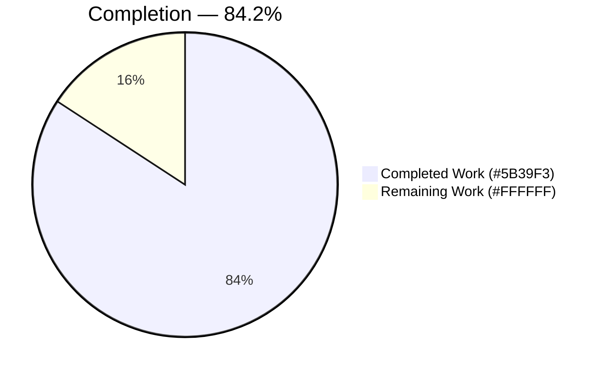
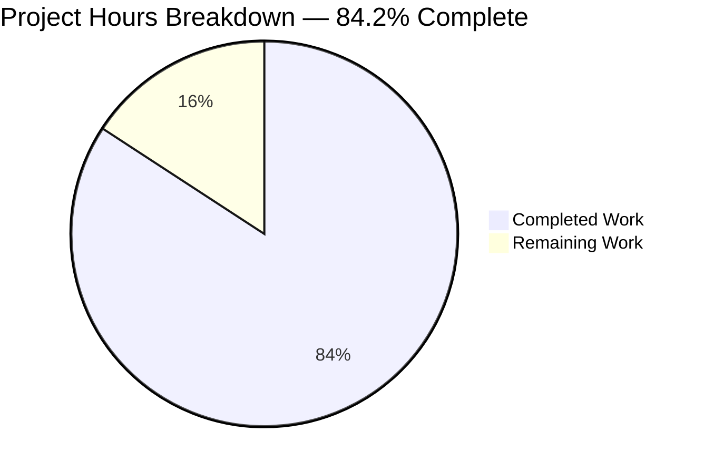
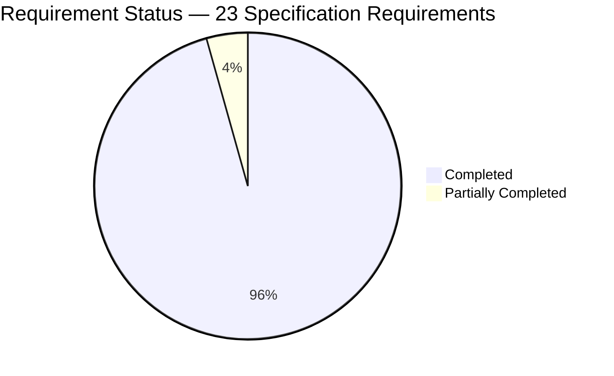

# 1. Executive Summary

## 1.1 Project Overview

A three-file Java repository carried no usable documentation: a five-line console program with no comments, and a 41-byte README declaring it held nothing specific. Both gaps are now closed. `Hello.java` carries one explanatory comment per written functionality, added without changing a byte of executable code. `README.md` is an eight-section project guide opening with an italic summary of exactly those changes, then prerequisites, build and run instructions, the program's observable output, the repository layout and the licence pointer. Anyone cloning the repository now finds the toolchain, the commands and the program's contract written down rather than inferred.

## 1.2 Completion Status



**84.2% complete** — 32.0 of 38.0 hours. Completed = Dark Blue `#5B39F3`; Remaining = White `#FFFFFF`. Sections 2.1 and 2.2 itemise both.

| Metric | Value |
|---|---|
| Total Hours | 38.0 |
| Completed Hours (AI + Manual) | 32.0 |
| Remaining Hours | 6.0 |
| Percent Complete | 84.2% |

## 1.3 Key Accomplishments

- Four comments in `Hello.java`, one per written functionality, each attached to the construct it documents.
- Behaviour provably unchanged: output, error stream and exit status byte-identical to a pre-comment build.
- Stored formatting intact: CRLF on all 20 source lines, pure ASCII, five code lines byte-identical.
- Eight-section project guide in `README.md`, every build and run command executed as written.
- Two wholly-italic summary entries, one per changed file; italics appear nowhere else.
- Documentable-member coverage at two of three; documentation-tool warnings down from three to one.
- Build, run and expected-output gaps closed, output stated as the literal plus the platform separator.
- `LICENSE` untouched; tracked set still three files, no build, CI, ignore or generator file added.

## 1.4 Critical Unresolved Issues

No defect is open in the delivered code. **11 items remain open** — 10 of the 12 the specification tracks, this work having closed 2, plus 1 verification-invocation item. Each was declined by the specification's own scope boundaries or is reserved for the owner.

| Issue | Impact | Owner | ETA |
|---|---|---|---|
| Verification-invocation baseline (1 item) — the comment-census check compares the working source against the current commit, so with its default baseline it reports failures against the committed tree | A correct tree scores 33 of 37 checks unless the pre-comment revision is supplied as the baseline | Maintainer | 1.0 h |
| Repository-hygiene exclusions (4 items) — no per-file copyright notice, no pinned Java version, no line-ending policy file, no ignore rule for build output | An in-tree compile leaves untracked output; builds are not version-pinned; a per-file notice would need a copyright holder and year the repository does not record | Owner decision | 2.0 h |
| No automated gate committed (1 item) — the repository carries no build descriptor, test suite or CI workflow | Nothing re-runs the documentation checks on future changes | Owner decision | Deferred |
| `javadoc` default-constructor warning (1 item) — the implicit constructor can carry no doc comment | Coverage stands at two of three documentable members; no functional impact | Accepted | None |
| Non-documentation items outside this scope (4 items) — verification-oracle, release, policy and commit-signing infrastructure | None on this change; each would add infrastructure the request did not ask for | Owner decision | Deferred |

## 1.5 Access Issues

No access issues identified. The repository, its branch and the JDK toolchain were reachable throughout, and no credential, key, network egress, environment variable or secret is used by anything in this project.

| System/Resource | Type of Access | Issue Description | Resolution Status | Owner |
|---|---|---|---|---|
| Repository and branch | Read/write clone | None — working tree clean, four commits authored on the branch | Resolved | — |
| JDK toolchain (`javac`, `java`, `javadoc`) | Local execution | None — resolved on PATH and exercised | Resolved | — |
| External services, registries, credentials | — | Not applicable: no dependency manifest, no network call, no bound port | Not applicable | — |

## 1.6 Recommended Next Steps

1. **[High]** Run the comment-census verification with the pre-comment revision as its baseline (1.0 h).
2. **[High]** Push the branch and merge the two-file change (0.5 h).
3. **[Medium]** Decide citation coverage — two references, or every section with the budget and its check amended first (1.0 h).
4. **[Medium]** Confirm the `JDK 11 or later` floor on a JDK 11 runtime, or soften the claim (1.0 h).
5. **[Low]** Take the deferred hygiene decisions: licence notice, ignore rule, line-ending policy, version pin (2.0 h).

# 2. Project Hours Breakdown

## 2.1 Completed Work Detail

| Component | Hours | Description |
|---|---|---|
| `Hello.java` in-source documentation | 4.0 | Enumerating the four written functionalities of the compilation unit and authoring one comment each — class Javadoc at column 0, entry-point Javadoc at four-space indent with `@param args`, and two eight-space line comments — to Oracle's doc-comment conventions, with every added line re-emitted with CRLF so the stored format survives (`Hello.java:1-18`) |
| `README.md` project guide | 8.0 | Replacing the placeholder line with 77 lines of operator guidance across eight sections: overview, prerequisites with the source-launch version floor, build with the artifact warning, both launch paths with the argument-contract table, expected output expressed portably, project layout and licence pointer (`README.md:10-77`) |
| Italic change highlighting and summary block | 2.5 | Placing the change summary as the guide's first content block, holding it to 55 words across 3 source lines, wrapping one entry per changed file wholly in emphasis with the file name in a code span, adding the dated modification notice required for a modified GPLv3 work, and keeping emphasis out of every other section (`README.md:3-8`) |
| Behaviour and byte-format preservation | 3.5 | Proving the edit changed nothing executable: compile parity, stdout/stderr/exit comparison against a build of the pre-comment source, debug-free bytecode equality, argument-variant runs, and the line-ending, encoding and tab censuses on both changed files |
| Comment-coverage measurement | 1.5 | Measuring documentable-member coverage with `javadoc` and `-Xdoclint:all` before and after, confirming the fall from three warnings to one, zero doclint errors, correct tag usage, and that the generated HTML carries both comment blocks |
| Acceptance-check execution and discrimination controls | 4.5 | Running the nine-group check suite end to end, plus negative and tamper controls that prove each assertion discriminates — normalised line endings, an edited output literal, a removed comment, a detached Javadoc block, a renamed section, a wrong date, emphasis moved into a code span, an added link, an injected line locator |
| Guide-to-toolchain seam validation | 2.5 | Executing every command the guide documents in scratch copies of the repository, comparing the guide's expected-output block byte-for-byte against real stdout, and proving the untracked-artifact claim by compiling inside a throwaway clone |
| Scope and continuity discipline | 1.5 | Confirming `LICENSE` byte-identical at base, commit and working tree; a 21-name sweep for build, CI, ignore and documentation-generator files; no build artifact in the checkout; commit authorship and a clean working tree |
| Documentation and code quality review | 4.0 | Claim-by-claim verification of the guide against the source it describes, citation/link/emphasis censuses, comment prose read line-by-line against the code, and a safety review of every documented command |
| **Total** | **32.0** | Matches Completed Hours in Section 1.2 |

## 2.2 Remaining Work Detail

| Category | Hours | Priority |
|---|---|---|
| Verification baseline — supply the pre-comment revision to the comment-census check and record the invocation | 1.0 | High |
| Branch publication and merge — push, review the two-file diff, merge | 0.5 | High |
| Citation-coverage decision — keep two stable-symbol references or extend to every body section (amend the budget and its check first) | 1.0 | Medium |
| `JDK 11 or later` confirmation on a JDK 11 runtime, or softening the claim | 1.0 | Medium |
| Rendered-guide review on the hosting platform — emphasis, tables, fenced blocks, relative links | 0.5 | Medium |
| Deferred repository-hygiene decisions — per-file licence notice, ignore rule for build output, line-ending policy, version pin | 2.0 | Low |
| **Total** | **6.0** | — |

## 2.3 Hours Reconciliation

| Quantity | Hours | Source |
|---|---|---|
| Completed | 32.0 | Section 2.1 total |
| Remaining | 6.0 | Section 2.2 total |
| Total Project Hours | 38.0 | 32.0 + 6.0, as stated in Section 1.2 |
| Percent Complete | 84.2% | 32.0 / 38.0 × 100 |

Confidence is **high** on the completed figures: the deliverable is two files and 92 added lines, every one of which was read, and each verification claim rests on a command that was executed. Confidence is **medium** on the remaining figures, because four of the six items are decisions whose scope the owner sets rather than fixed units of work — the hour values assume each decision is taken and implemented once, with no change of direction.

# 3. Test Results

The repository carries no committed test suite, and adding one is outside this change's scope, so there is no unit- or integration-test coverage figure to report. What exists instead is a nine-group acceptance check suite (V1–V9) covering compilation, runtime behaviour, comment structure, byte format, comment coverage and every structural property of the guide. All figures below were observed first-hand on JDK 25.0.3: **49 checks executed, 49 passed, 0 failed** — the 37 assertions of the acceptance suite plus 12 direct toolchain checks.

| Area / Category | Framework | Tests | Passed | Failed | Coverage | What This Proves |
|---|---|---|---|---|---|---|
| Compilation and static diagnostics | JDK `javac` 25.0.3 | 2 | 2 | 0 | 1 of 1 compilation unit | The annotated source compiles with zero diagnostics, including under `-Xlint:all -Werror` |
| Runtime behaviour and parity | Acceptance V2 + JDK launcher | 6 | 6 | 0 | Both documented launch paths | Output, error stream and exit status are byte-identical to a build of the pre-comment source, and arguments never alter the result |
| Comment structure and placement | Acceptance V3 | 7 | 7 | 0 | 4 of 4 functionalities | The change adds exactly four comments, each attached to the construct it documents, and alters no code line |
| Stored byte format | Acceptance V4 | 7 | 7 | 0 | Both changed files | `Hello.java` keeps CRLF on every line, pure ASCII and no tabs; the guide stays LF-only, UTF-8 and newline-terminated |
| Comment coverage | `javadoc` 25.0.3 + Acceptance V5 | 2 | 2 | 0 | 2 of 3 documentable members | The class and entry point are documented; only the implicit constructor, which can carry no doc comment, is not |
| Guide structure, summary and highlighting | Acceptance V6–V7 | 8 | 8 | 0 | 8 of 8 sections | The change summary is the guide's first content block, sections run in the required order, and italics mark the two changed files and nothing else |
| Guide links, literals and citations | Acceptance V8–V9 | 10 | 10 | 0 | 2 of 2 links, 2 of 2 citations | Both relative links resolve on disk, every mandated operator literal is present, and sources are cited by stable symbol with no line-number locators |
| Cross-release compilation | JDK `--release` / `--source` | 7 | 7 | 0 | Release targets 11, 17, 21 | The compile-then-run path carries no recent-JDK floor, which is what the guide's Requirements section claims |

**Not Covered**

- **No unit or integration tests exist.** The repository has never had a test file and this change adds none, so the acceptance checks above are the entire automated surface. A human wanting regression protection on future edits must decide whether to introduce a gate (Section 2.2, Low priority).
- **The guide's rendered appearance.** Emphasis, the two tables, the four fenced blocks and both relative links were asserted against the Markdown source, never against a rendered page. Open the guide once on the hosting platform before release.
- **The `JDK 11 or later` floor on a JDK 11 runtime.** It was corroborated only by compiling at release targets 11, 17 and 21 and by `java --source 11` on a JDK 25 toolchain. Confirm it on a real JDK 11 install, or soften the claim.
- **The wording of the four comments and of the guide prose.** Comment text is not executed and prose accuracy is not machine-checkable; both were read against the source they describe, but no check asserts them.
- **The comment-census checks under their default baseline.** They compare the working source against the current commit, so they measure the added comments only when handed the pre-comment revision; with the default baseline the suite's own tally on a correct tree is 33 of 37.

# 4. Runtime Validation & UI Verification

The program is a console application with no user interface, no hosted page, no bound port and no external integration, so runtime validation means driving the compiler, the launcher, the documentation tool and every command the guide tells an operator to type. All of the following were executed and observed.

- ✅ **Operational — Compile.** `javac -Xlint:all -Werror` exits 0 with an empty error stream; class output directed outside the checkout, which stays clean.
- ✅ **Operational — Compiled-class launch.** `java -cp <out> Hello` prints `Hello from Java!` followed by one newline (17 bytes on this host), with an empty error stream and exit status 0.
- ✅ **Operational — Direct source launch.** `java Hello.java` prints the same payload and leaves no class file behind.
- ✅ **Operational — Behaviour parity.** Both streams and the exit status compare byte-identical against a build of the pre-comment source; suppressing debug information makes the two class files identical.
- ✅ **Operational — Argument contract.** Runs with no arguments, many arguments, and hostile arguments including shell and injection payloads all produce identical output; the parameter is never dereferenced.
- ✅ **Operational — Documentation tool.** `javadoc -quiet` exits 0 with exactly one warning, for the implicit default constructor, and the generated HTML carries both comment blocks and the parameter table.
- ✅ **Operational — Guide's build guidance.** The guide's alternate destination, a freshly generated owner-only directory, compiles and launches clean end to end.
- ✅ **Operational — Guide's expected output.** The fenced expected-output block compares byte-identical to real standard output.
- ✅ **Operational — Untracked-artifact claim.** Compiling inside a throwaway clone leaves the class file untracked and unignored, exactly as the Build section states.
- ⚠ **Partial — Version-floor claim.** The compile-then-run path was exercised at release targets 11, 17 and 21, but the `JDK 11 or later` floor for the direct source launch has not been run on a JDK 11 runtime; only JDK 25 was available.

**Never exercised at runtime:** the guide's rendered appearance. There is no UI and no hosted page, and the guide's structure was asserted against its Markdown source rather than a rendered page, so nothing here was verified through a browser.

# 5. Compliance & Quality Review

## 5.1 Compliance Matrix

| # | Deliverable / Benchmark | Status | Progress | Evidence |
|---|---|---|---|---|
| 1 | One explanatory comment per written functionality | ✅ Pass | 4 of 4 | `Hello.java:1-5`, `:7-14`, `:16`, `:18` — class, entry point, output statement, termination path |
| 2 | Comment form and placement follow the language's conventions | ✅ Pass | 2 Javadoc + 2 line comments | Class block opens at column 0, member block at four spaces with a `@param args` tag and no `@return`; both line comments at eight spaces |
| 3 | Comment-only edit — no behaviour, signature or formatting change | ✅ Pass | 15 added / 0 removed | The five original code lines are byte-identical to the pre-comment revision; debug-free bytecode identical |
| 4 | Stored formatting preserved per file | ✅ Pass | 20 of 20 lines CRLF | `Hello.java` CRLF throughout, pure ASCII, zero tabs; `README.md` LF-only with a trailing newline |
| 5 | Change summary is the guide's first content block | ✅ Pass | 1 title + summary | `README.md:1` is the title, `:3` the summary heading |
| 6 | Summary held to a small budget | ✅ Pass | 55 / 70 words, 3 / 8 lines | `README.md:5-8` |
| 7 | Every change highlighted in italics, one entry per changed file | ✅ Pass | 2 of 2 changes | `README.md:7-8`; emphasis appears nowhere else in the guide |
| 8 | Dated modification notice for a modified GPLv3 work | ✅ Pass | 1 notice | `README.md:5` |
| 9 | Guide sections present and in the required order | ✅ Pass | 8 of 8 | Headings at `README.md:3,10,16,22,32,55,65,75` |
| 10 | Operator guidance: build, run, expected output, version floor, artifact warning | ✅ Pass | 5 of 5 literals | `README.md:22-63`, every command executed as written |
| 11 | Source cited by stable symbol, never by line number | ⚠ Partial | 2 of 2 required references, 2 of 7 body sections | `README.md:14,53`; zero line-number locators. See divergence 1 |
| 12 | Documentable-member coverage | ⚠ Partial | 2 of 3 members | `javadoc` reports one remaining warning, for the implicit default constructor. See divergence 4 |

Rule compliance: the user rule requiring clean code with a comment on each functionality written is satisfied — four functionalities, four comments, and cleanliness achieved by commenting rather than restructuring, with an additions-only diff proving no member was renamed, reordered or reformatted. The second user rule declares itself to be for testing only and states no technical constraint; nothing in the delivered work was derived from it and no requirement was invented on its behalf.

## 5.2 AAP & Rule Divergences and Gaps

| # | What the AAP/Rule Required | What Was Delivered Instead | Why It Diverged | Impact | Remediation |
|---|---|---|---|---|---|
| 1 | "Every guide section references the source it documents by stable symbol" | Two references only, in Overview and Run; five body sections carry none | The plan also fixes the reference budget at exactly two and asserts that count mechanically; the two instructions conflict | None on correctness — every documented fact still traces to an authority | Owner decision: extend coverage only after amending the budget and its check |
| 2 | Comment-census verification compares the edited source against the current commit | The authoritative run compares against the pre-comment revision instead | The comment work is committed, so at the current commit the comparison is empty and the census degenerates to zero | A correct tree scores 33 of 37 checks when the baseline is not supplied | Pass the pre-comment revision as the baseline argument |
| 3 | Build section = the fenced compile command plus the untracked-artifact note | Also documents an alternate output directory and the matching launch command | Safe-command guidance permitted retaining an external destination if freshly generated, quoted and used consistently | None adverse; the primary commands are unchanged and both alternates run clean | Optional: delete the third sentence of `README.md:30` for the minimal form |
| 4 | Close the comment-coverage gap by documenting all three documentable members | Two of three documented; one `javadoc` warning remains | A default constructor can carry no doc comment, and declaring one is a structural change the comment-only constraint forbids | Coverage 2 of 3; no functional impact | None, unless the owner accepts an explicit constructor |
| 5 | Repository-hygiene items placed out of scope: per-file licence notice, version pin, line-ending policy, ignore rule, automated gate | None added; mixed CRLF/LF retained; the untracked class file documented rather than ignored | Sanctioned exclusions — the notice needs a copyright holder the repository does not record, and normalising line endings would change the source file's content digest | In-tree compiles leave untracked output; builds are unpinned; no gate re-runs the checks | Owner decisions, each independent of the delivered documentation |

**1 — Citation coverage.** The plan carries two instructions that cannot both hold: a general one requiring every guide section to cite its source by stable symbol, and an enumerated one fixing the guide at exactly two references. The enumerated count is the specific contract and is asserted mechanically, so it governs. The guide cites `Source: Hello.java (class Hello)` at `README.md:14` and `Source: Hello.java (Hello.main)` at `README.md:53`; Requirements, Build, Expected Output, Project Layout and Licence carry none. Nothing is unattributed — the Overview reference covers the class and default-package facts, the Run reference the argument, single-line-output and normal-return facts. To extend coverage, amend the two-reference budget and its check first.

**2 — Verification baseline.** The comment-census check proves the edit is additions-only by diffing the working source against a named revision, and the plan names the current commit. That held while the comment work was uncommitted; it no longer does. At the current commit the diff is empty, so the census counts zero comment blocks and the indentation and placement assertions fail vacuously — four failures against a correct tree. Handing the check the pre-comment revision restores the intent, additions-only relative to the pre-edit source, and the suite then passes 37 of 37. The script is provisioned outside the repository and committing a test file is out of scope, so the remedy is the invocation.

**3 — Build section scope.** The plan specifies the Build section as the fenced compile command plus a note that compiling in place leaves an untracked class file. `README.md:30` goes further: it documents `B="$(mktemp -d)" && javac -d "$B" Hello.java` with the matching `java -cp "$B" Hello`, and one sentence on why a freshly generated owner-only directory beats a fixed, predictable one. Safe-command guidance permitted keeping an external destination provided it is uniquely generated, quoted and used consistently, and a guide that says compile elsewhere without saying how to launch from elsewhere is incomplete. Both commands were executed as written. Deleting that third sentence is all the minimal form needs.

**4 — Documentable-member coverage.** The specification's original closing condition for the comment-coverage gap was three comment blocks, one per member the documentation tool reports. Only two of those members are written in the source. The third is the implicit default constructor the language supplies because the class declares none, and such a constructor can carry no doc comment: the only way to attach one is to declare the constructor, a structural change the comment-only constraint forbids. The plan itself revises the target to two of three and warnings from three to one, which is exactly what `Hello.java` delivers — one warning remains at `Hello.java:6`. Closing it fully is a separate structural decision.

**5 — Deferred hygiene items.** Five adjacent gaps were identified and deliberately not closed. `Hello.java` carries no per-file copyright and warranty notice, which the licence's appendix advises, because that notice needs a named holder and year and no tracked file records either — commit metadata identifies an author, not a rights holder. No Java version is pinned, and the guide says so plainly rather than choosing one this change had no authority to choose. Line endings stay as stored, CRLF in the source and LF in the guide, because normalising them would rewrite all five code lines and change the file's content digest. No ignore rule and no build, test or CI descriptor was added.

# 6. Risk Assessment

Whole categories of risk are simply absent here and are listed once rather than as rows: the program reads no input, dereferences no argument, opens no resource, binds no port, makes no network call and has no dependency manifest, so there is no injection surface, no supply-chain exposure, no authentication or authorisation surface and no data-at-rest concern. What remains is forward-looking risk to the documentation and to future edits.

| Risk | Category | Severity | Probability | Mitigation | Status |
|---|---|---|---|---|---|
| The comment-census verification, run with its default baseline, reports failures against the committed tree; a contributor could read that as a broken deliverable or "correct" source that is already right | Technical | Medium | High | Always pass the pre-comment revision as the baseline, and record that invocation with the verification procedure | Open |
| `Hello.java` is stored with CRLF on every line and no line-ending policy file exists; an editor or tool that writes LF rewrites all five code lines and changes the file's content digest | Technical | Medium | Medium | Edit in byte mode, re-emit CRLF on added lines, and re-run the line-ending census after any edit | Open — accepted by design |
| No build descriptor, test suite or CI workflow, so nothing re-runs the documentation checks; guide claims can drift from the source as the program changes | Operational | Medium | Medium | The guide cites its source by stable symbol so each claim can be checked at origin; the owner may adopt a gate | Open |
| No ignore rule for build output, so a compile run in place leaves an untracked class file that can be committed by accident | Operational | Low | Medium | The guide documents a fresh output directory outside the checkout and instructs the reader not to commit the class file | Open |
| The toolchain is unpinned; a future JDK could change documentation-tool defaults or single-file launch behaviour and move the warning count the guide implies | Technical | Low | Low | Verified at release targets 11, 17 and 21; revisit if a version pin is adopted | Open |
| The documented `JDK 11 or later` floor for the direct source launch has not been exercised on a JDK 11 runtime | Integration | Low | Low | Confirm once on a JDK 11 install, or soften the claim to the release targets actually exercised | Open |
| A future edit to the Build section could reintroduce a fixed, predictable compiler-output path that another local process can pre-create or redirect through a symbolic link | Security | Low | Low | The guide's command generates a fresh owner-only directory and states the reason beside it, so the rationale is visible to the next editor | Mitigated |
| The branch is ahead of its remote and unpublished, so the documentation is not yet visible to anyone cloning the default branch | Operational | Low | High | Push the branch and merge the two-file change | Open |

# 7. Visual Project Status

Colour key throughout: Completed work = Dark Blue `#5B39F3`; Remaining work = White `#FFFFFF`.





Remaining hours by category, from Section 2.2 (6.0 hours total):

| Category | Hours | Share | Priority |
|---|---|---|---|
| Deferred repository-hygiene decisions | 2.0 | 33% | Low |
| Verification baseline | 1.0 | 17% | High |
| Citation-coverage decision | 1.0 | 17% | Medium |
| `JDK 11 or later` confirmation | 1.0 | 17% | Medium |
| Branch publication and merge | 0.5 | 8% | High |
| Rendered-guide review | 0.5 | 8% | Medium |
| **Total** | **6.0** | **100%** | — |

By priority: High 1.5 hours, Medium 2.5 hours, Low 2.0 hours.

# 8. Summary & Recommendations

What was asked for has been delivered on both counts. `Hello.java` now explains itself: four comments, one per written functionality, covering the class contract, the entry point and its never-read `args` parameter, the single write to standard output, and the fact that the method returns normally with no explicit exit call. `README.md` is now a project guide rather than a placeholder, opening with an italic summary of exactly these two changes and continuing through prerequisites, build, both launch paths, the expected output, the layout and the licence. The project stands at **84.2% complete — 32.0 of 38.0 hours** — with every specification requirement either delivered or, in one case, delivered and awaiting a change to how its verification is invoked.

The evidence behind that is narrow but deep, as it should be for a two-file change. The delivered source compiles with zero diagnostics under `-Xlint:all -Werror`; its standard output, error stream and exit status are byte-identical to a build of the pre-comment source, and its bytecode is identical once debug information is suppressed — so the claim that nothing but comments was added is proven rather than asserted. Every command the guide tells an operator to type was executed as written, including the alternate build destination, and the guide's expected-output block compares byte-for-byte against real standard output. Forty-nine acceptance checks were executed and all forty-nine passed. The stored formatting that makes this repository awkward to edit — CRLF on every source line, LF in the guide — survived intact.

Three gaps are worth the reader's attention, none of them a defect. First, the comment-census verification needs the pre-comment revision handed to it as a baseline; run without one it reports four failures against a tree that is correct, and that is the single most likely thing to mislead the next person. Second, the guide has never been looked at rendered — its structure was proven against the Markdown source, which is not the same as confirming that two italic entries, two tables and four fenced blocks display as intended. Third, the `JDK 11 or later` floor for the direct source launch is documented but was only corroborated by compiling at release targets 11, 17 and 21 on a JDK 25 toolchain.

The critical path to production is short: supply the verification baseline, glance at the rendered guide, then push and merge. That is two hours of work, and nothing in it depends on a decision. The remaining four hours are genuine decisions rather than tasks — whether to extend source citations to every guide section (which requires amending the two-reference budget and its check first), whether to confirm the version floor on a real JDK 11 runtime or soften the claim, and whether to close the five hygiene items the plan deliberately declined: the per-file copyright notice that needs a rights holder the repository does not record, an ignore rule for build output, an explicit line-ending policy, a version pin, and an automated gate.

Production readiness: **ready to merge.** For a documentation change to a program whose behaviour is provably untouched, the risk of releasing is close to zero, and the guide measurably closes the gaps that made this repository opaque. The one recommendation that outlives this change is the fourth risk in Section 6 — with no gate re-running these checks, the guide's accuracy depends on future editors honouring the stable-symbol citations that let each claim be checked at its origin. Success is measurable and already measured: four of four functionalities commented, eight of eight guide sections present, two of two changes highlighted, three of three observable behaviours documented, and documentable-member coverage at two of three with the third unreachable by design.

# 9. Development Guide

Every command below was executed against this repository on a Linux host with OpenJDK 25.0.3, and the outputs shown are the real ones. All commands are run from the repository root unless stated otherwise.

## 9.1 System Prerequisites

- A JDK. The repository pins no version: it has no build descriptor, no version file and no continuous-integration descriptor. The compile-then-run path works on considerably older releases — it was exercised at release targets 11, 17 and 21 — while the direct source launch needs JDK 11 or later.
- `git`, for cloning and for the baseline comparisons in the verification steps.
- A POSIX shell with GNU `grep`, `diff`, `awk` and `coreutils` if you intend to run the structural verification commands.
- No package manager step, no virtual environment, no container, no database, no broker and no bound port. There are no dependencies to resolve: the source imports nothing outside `java.lang`.

```bash
java -version      # openjdk version "25.0.3" ...
javac -version     # javac 25.0.3
javadoc --version  # javadoc 25.0.3
```

## 9.2 Environment Setup

Nothing to configure. No environment variable or secret is read by any tracked file. `JAVA_HOME` is not required, because the compiler and launcher are on `PATH`; if a tool of yours needs it, derive it from the toolchain already on `PATH` rather than hard-coding an install location:

```bash
JAVA_HOME="$(dirname "$(dirname "$(readlink -f "$(command -v javac)")")")"
[ -x "$JAVA_HOME/bin/javac" ] && echo "JAVA_HOME=$JAVA_HOME"
```

Confirm the checkout is in the state you expect:

```bash
git status --short     # expect no output
git ls-files           # expect: Hello.java  LICENSE  README.md
git log --oneline -4
```

## 9.3 Dependency Installation

None. There is no `pom.xml`, `build.gradle`, `Makefile`, `package.json` or lock file of any kind, and nothing is downloaded at build time.

## 9.4 Build

Two paths, both documented in the project's own guide. The first is the shortest; the second keeps the working tree clean, which matters because the repository has no ignore rule.

```bash
# Path A — compile in place. Leaves an untracked Hello.class beside the source.
javac Hello.java

# Path B — compile to a fresh directory outside the checkout (recommended).
B="$(mktemp -d)"
javac -Xlint:all -d "$B" Hello.java
```

Expected result for both: exit status 0 and no output at all. `-Xlint:all` is clean, and so is `-Werror`. If you used Path A, remove the artifact before committing:

```bash
rm -f Hello.class && git status --short   # expect no output
```

## 9.5 Application Startup

There is no service to start — the program writes one line and exits. Three launch forms, all verified:

```bash
java -cp "$B" Hello    # from the Path B build directory
java Hello             # after a Path A in-place compile, from the repository root
java Hello.java        # direct source launch, no compile step, leaves no artifact
```

Each prints:

```text
Hello from Java!
```

Exit status is 0, the error stream is empty, and command-line arguments are accepted but never read — the output is identical whether or not you pass any.

## 9.6 Verification Steps

Measure comment coverage. Exactly one warning is expected, for the implicit default constructor, which cannot carry a doc comment:

```bash
javadoc -d "$B/jd" -quiet Hello.java
# Hello.java:6: warning: use of default constructor, which does not provide a comment
```

Prove the annotated source still behaves like the pre-comment source. `BASE` is the revision before the comment work landed:

```bash
BASE=0726b1d
O="$(mktemp -d)"; mkdir -p "$O/base"
git show "$BASE:Hello.java" > "$O/base/Hello.java"   # the file name must match the public class
javac -d "$O/old" "$O/base/Hello.java"
java -cp "$O/old" Hello > "$O/old.out" 2> "$O/old.err"
java -cp "$B"     Hello > "$O/new.out" 2> "$O/new.err"
cmp "$O/old.out" "$O/new.out" && cmp "$O/old.err" "$O/new.err" && echo "behaviour identical"
```

Prove the edit added comments and nothing else:

```bash
diff "$O/base/Hello.java" Hello.java > "$O/d"
grep -cE '^(<|[0-9,]+[dc][0-9,]+)' "$O/d"                 # expect 0 — no deletions or modifications
grep '^> ' "$O/d" | sed 's/^> //' | tr -d '\r' > "$O/add"
printf 'added=%s /**=%s */=%s //=%s\n' "$(wc -l < "$O/add")" \
  "$(grep -c '^\s*/\*\*' "$O/add")" "$(grep -c '^\s*\*/' "$O/add")" "$(grep -c '^\s*//' "$O/add")"
# expect: added=15 /**=2 */=2 //=2
```

Check the stored byte format, which is deliberately different per file:

```bash
printf 'Hello.java lf=%s cr=%s crlf=%s\n' "$(tr -cd '\n' < Hello.java | wc -c)" \
  "$(tr -cd '\r' < Hello.java | wc -c)" "$(grep -c $'\r$' Hello.java)"   # expect 20 20 20
printf 'README.md cr=%s\n' "$(tr -cd '\r' < README.md | wc -c)"          # expect 0
tail -c 1 README.md | od -An -c                                          # expect \n
```

Check the guide's structure, summary budget and links:

```bash
grep '^## ' README.md    # expect the eight sections in order, Summary of Changes first
awk '/^## Summary of Changes$/{f=1;next} /^## /{f=0} f' README.md | wc -w   # expect 55 (limit 70)
grep -oE '\[[^]]+\]\([^)]+\)' README.md    # expect exactly the two relative links
```

The project's full acceptance suite (checks V1–V9) is reproduced in the project specification. Save it to a scratch file outside the checkout and run it there — never commit it, since build, test and CI files are out of scope for this repository:

```bash
S="$(mktemp -d)"     # paste the suite into "$S/verify.sh"
bash "$S/verify.sh" "$PWD" "$PWD/Hello.java" "$PWD/README.md" "$(date -u +%F)"
```

Its comment-census check compares the working source against a baseline revision. Give it the pre-comment revision (`0726b1d`); with the current commit as the baseline the comparison is empty and four checks fail on a tree that is correct.

Finally, clean up the scratch directories:

```bash
rm -rf "$B" "$O" "$S" && git status --short   # expect no output
```

## 9.7 Example Usage

```bash
$ javac Hello.java && java Hello
Hello from Java!

$ java Hello.java one two three     # arguments are accepted and never read
Hello from Java!

$ java Hello; echo "exit=$?"
Hello from Java!
exit=0
```

## 9.8 Troubleshooting

| Symptom | Cause | Resolution |
|---|---|---|
| `Could not find or load main class Hello` | No compiled class on the classpath, or you are not in the directory holding it | Compile first, or launch with `java -cp <build dir> Hello`; the class is in the default package, so the bare name is correct |
| `error: class Hello is public, should be declared in a file named Hello.java` | You exported the source under another name — common when writing a baseline revision to a scratch file | Export into a directory as `Hello.java`, as the verification steps above do |
| `javac Hello.java` leaves `Hello.class` in `git status` | There is no ignore rule in this repository | Delete it, or compile to a directory outside the checkout with `-d` |
| Verification reports `block census wrong: /**=0 */=0 //=0` | The census was given the current commit as its baseline, where the comments are already committed | Re-run with the pre-comment revision as the baseline |
| Verification reports mixed line endings or `final terminator not CRLF` | An editor normalised `Hello.java` to LF on save | Restore the file and re-apply the edit in byte mode, re-emitting CRLF on every line including added ones |
| `javadoc` reports one warning | Expected: the implicit default constructor can carry no doc comment | No action; documenting it would require declaring a constructor, which is out of scope |
| The direct source launch fails on an older JDK | Single-file source launch needs JDK 11 or later | Use the compile-then-run path, which has no such floor |

# 10. Appendices

## A. Command Reference

| Purpose | Command | Expected Result |
|---|---|---|
| Compile in place | `javac Hello.java` | Exit 0, no output, `Hello.class` beside the source |
| Compile outside the checkout | `B="$(mktemp -d)"; javac -Xlint:all -d "$B" Hello.java` | Exit 0, no diagnostics, working tree unchanged |
| Launch a compiled class | `java -cp "$B" Hello` | `Hello from Java!`, empty error stream, exit 0 |
| Launch from the repository root after an in-place compile | `java Hello` | Same output |
| Launch the source directly | `java Hello.java` | Same output, no artifact; needs JDK 11 or later |
| Measure comment coverage | `javadoc -d "$B/jd" -quiet Hello.java` | Exit 0 with exactly one warning, for the implicit default constructor |
| Strictest static check | `javac -Xlint:all -Werror -d "$B" Hello.java` | Exit 0, empty error stream |
| Inspect the change | `git diff 0726b1d HEAD --stat` | `Hello.java` +15, `README.md` +77 −1 |
| Confirm a clean tree | `git status --short` | No output |

## B. Port Reference

Not applicable. The program binds no port, starts no listener and makes no network call; there is no service, database, broker or cache in this project.

## C. Key File Locations

| Path | Role | Size |
|---|---|---|
| `Hello.java` | The only compilation unit: `public class Hello` in the default package with its `main` entry point, now carrying four explanatory comments | 20 lines / 1073 bytes |
| `README.md` | The project guide: change summary as the first content block, then overview, requirements, build, run, expected output, layout and licence | 77 lines / 4053 bytes |
| `LICENSE` | Verbatim GNU General Public License, Version 3, 29 June 2007; referenced by the guide and never modified | 674 lines / 35149 bytes |

The repository is flat — three tracked files at the root and no subdirectory.

## D. Technology Versions

| Component | Version Used | Notes |
|---|---|---|
| OpenJDK (`java`, `javac`, `javadoc`) | 25.0.3 | The repository pins no version; the compile-then-run path was exercised at release targets 11, 17 and 21 |
| Java language level | None declared | No `--release` or `--source` setting is recorded anywhere in the repository |
| Markdown dialect | GitHub Flavored Markdown over CommonMark | Determined by the hosting platform; no generator or renderer is part of the project |
| `git` | 2.51.0 | Used for the baseline comparisons in the verification steps |

## E. Environment Variable Reference

| Variable | Required | Purpose |
|---|---|---|
| `JAVA_HOME` | No | Not used by anything in this project; the `PATH` binaries are sufficient. Set it inline if one of your own tools needs it |
| — | — | No other variable and no secret is read by any tracked file |

## F. Developer Tools Guide

| Tool | Role in this project |
|---|---|
| `javac` | Compiles the single source file; `-Xlint:all -Werror` is the project's static-analysis surface, as no linter is configured |
| `javadoc` | Measures comment coverage; `-Xdoclint:all` validates doc-comment syntax and tag usage. Its HTML output is never committed |
| `git` | Supplies the pre-comment revision used as the baseline for behaviour and comment-census comparisons |
| GNU `grep`, `awk`, `diff`, `tr`, `od`, `cmp`, `iconv` | Assert the guide's structure and both files' stored byte format directly against the source, so verification needs no renderer and no extra runtime |
| `mktemp -d` | Generates the per-run build and scratch directories, keeping class output out of the checkout |

No linter, formatter, documentation generator, build tool or test framework is configured in the repository, and none is introduced by this change.

## G. Glossary

| Term | Meaning in this project |
|---|---|
| Written functionality | A construct actually present in the source that takes exactly one explanatory comment: the class declaration, the entry-point signature and its parameter, the output statement, and the termination path |
| Stable-symbol citation | A source reference written as a symbol, `Source: Hello.java (Hello.main)`, rather than a line number, because inserting comments shifts every line below them |
| Default package | The absence of a `package` statement, which is why the class launches by the bare name `Hello` |
| Single-file source launch | Running `java Hello.java` without a compile step; available from JDK 11 onward and leaves no class file |
| Platform line separator | The newline sequence the host defines, appended by the program's single output call — the reason the guide states the literal plus a separator rather than a fixed byte count |
| Comment-only edit | A change in which every added line is a comment and no existing line is deleted or modified, provable by an additions-only comparison against the pre-comment revision |
| Implicit default constructor | The no-argument constructor the language supplies because the class declares none; it can carry no doc comment, which is why one documentation-tool warning remains by design |
