# Technical Specification

# 1. Introduction

## 1.1 Executive Summary

### 1.1.1 Project Overview

This Technical Specification documents the repository published as `github.com/rjhonsi/BlitzyRepo2_Java` (inspected at branch `jr_java1`). The repository is deliberately minimal: its entire tracked content is three root-level files and no subdirectories.

`Hello.java` is the only source file in the repository. It declares one public class, `Hello`, containing the standard JVM entry point `public static void main(String[] args)`. The method performs exactly one observable action — writing the fixed literal `Hello from Java!` to standard output — and then returns, ending the process. The file declares no `package`, no `import`, no fields, no explicit constructor, no additional methods and no module descriptor, and it holds no mutable state. The supplied `args` array is neither inspected nor mutated.

The remaining two files are non-executable: `LICENSE` carries the verbatim text of the GNU General Public License, Version 3 (29 June 2007), and `README.md` contains a single placeholder sentence that explicitly declines to describe anything specific about the project.

| Artifact | Measured size | Role in the system |
| --- | --- | --- |
| `Hello.java` | 5 lines (CRLF line endings) | The complete application: one class, one entry point, one `System.out.println` call |
| `LICENSE` | 674 lines | Full GPLv3 text (Sections 0–17 plus the "How to Apply These Terms" appendix) governing use and redistribution |
| `README.md` | 41 characters, 1 line | Placeholder documentation; states no purpose, requirements or usage instructions |

Repository provenance is equally compact: three commits (`c537a19` "Initial commit", `f1847fa` "Add files via upload", `0726b1d` "Add initial README file with basic information"), no tags, and exactly three tracked files. The commit sequence describes repository bootstrapping rather than feature evolution.

### 1.1.2 Core Business Problem Being Solved

**No business problem is stated anywhere in the repository.** There is no requirements document, design note, issue template, roadmap or product description; `README.md` explicitly characterises itself as having nothing specific to convey. In keeping with the evidence-only discipline of this specification, no commercial objective, revenue driver or operational pain point is asserted here, because none can be substantiated from the artifacts.

What *can* be established is the problem the code demonstrably solves in its current form: it provides a self-contained, dependency-free Java executable unit that proves a JVM toolchain can compile and run a program and produce deterministic console output. Every element of `Hello.java` serves that single outcome, and nothing in the repository serves any broader outcome.

| Question | Evidence-based answer | Source |
| --- | --- | --- |
| What problem does the documentation state? | None; the README is an explicit placeholder | `README.md` |
| What problem does the code solve? | Produces one deterministic line of console output from a standard JVM entry point | `Hello.java` |
| What problem does the licensing address? | Defines copyleft terms for use, modification and redistribution of the source | `LICENSE` |

### 1.1.3 Key Stakeholders and Users

The codebase defines no user accounts, roles, authentication, authorisation or configuration surfaces. Consequently, "users" of this system are defined entirely by the two interfaces that actually exist — a command-line JVM process invocation and the standard output stream — plus the licensing interface that governs source distribution.

| Stakeholder | Interaction with the system | Evidencing artifact |
| --- | --- | --- |
| Developer / operator at a shell | Compiles and launches the `Hello` class, observes the emitted line on stdout | `Hello.java` (`public static void main`) |
| Automated process or CI job consuming stdout | Reads the fixed output line and the process exit status; nothing else is exposed | `Hello.java` (`System.out.println`) |
| Downstream recipient or redistributor of the source | Bound by GPLv3 obligations on conveying verbatim or modified versions | `LICENSE` (Sections 4, 5, 6, 10) |
| Repository maintainer | Holds the sole distribution channel — the Git history on the `jr_java1` branch | Git metadata (3 commits, 3 tracked files) |

No stakeholder group beyond these is identifiable, and the repository contains no contact address, ownership file, `CODEOWNERS`, or contributor guidance from which additional roles could be inferred.

### 1.1.4 Expected Business Impact and Value Proposition

Because the repository declares no business goals, no financial, throughput or efficiency impact is claimed in this specification. The value the repository actually delivers is structural and verifiable:

- **Zero-dependency baseline.** The program's only implementation dependency is the Java standard library output API (`java.lang.System.out`). There is no build manifest, no third-party library, no configuration file and no runtime service to provision, so the artifact can be exercised anywhere a JDK exists.
- **Deterministic, inspectable behaviour.** With no inputs consulted and no state retained, the observable result is invariant across environments and runs, which makes the program usable as an unambiguous reference point (for example, a toolchain or environment smoke check).
- **Unencumbered legal footing for reuse.** The complete GPLv3 text is present in the repository rather than referenced, establishing explicit copyleft terms — including patent grants, warranty disclaimer and liability limitation — for anyone who receives or forwards the source.
- **A clean starting point.** The absence of framework scaffolding, generated code and legacy structure means any subsequent architecture can be introduced without first unwinding existing decisions.

The corresponding trade-off is equally plain and is documented rather than glossed over: the repository currently supplies no build automation, no automated tests, no packaging and no operational tooling. Those gaps define the limitations and out-of-scope boundaries detailed in Sections 1.2.1 and 1.3.2.

## 1.2 System Overview

### 1.2.1 Project Context

#### 1.2.1.1 Business Context and Market Positioning

The repository contains no business context material of any kind: no product description, no target-market statement, no competitive positioning, no versioning scheme and no release tags. `README.md`, the only documentation artifact, consists of one sentence declaring that it holds nothing specific. The Git history reinforces this reading — three commits whose messages describe initialising the repository, uploading files and adding a basic README, with no tags and no feature-oriented changes.

The repository is therefore positioned, on the evidence, at the pre-product bootstrap stage: an initialised Java repository whose only executable content is a canonical console program. The one deliberate positioning decision that *is* recorded is legal rather than commercial — the inclusion of the complete GPLv3 text places any future distribution of this code within the free-software copyleft ecosystem, with the corresponding obligations on conveying source and modified versions.

#### 1.2.1.2 Current System Limitations

No predecessor system, migration target or legacy platform is referenced anywhere in the repository, so this is not a replacement or upgrade of an existing system. The limitations below are properties of the current state, each established directly from the artifacts (or from their verified absence).

| Limitation | Evidence | Consequence |
| --- | --- | --- |
| No build automation or dependency management | No `pom.xml`, `build.gradle`, `Makefile` or equivalent exists in the checkout | Compilation and execution are manual, toolchain-dependent operations |
| No automated tests | No test source, test directory or test framework is present | Behaviour is unverified by any repeatable, automated check |
| No continuous integration | No `.github/` directory or CI/CD descriptor exists | No gate exists on commits; correctness relies on manual inspection |
| No input handling or configuration | `Hello.java` ignores `args`; no properties, environment or config file is read | Output cannot be varied without editing and recompiling source |
| Fixed, non-localised output | The literal `Hello from Java!` is hardcoded in `System.out.println` | No internationalisation, formatting or message catalogue capability |
| No packaging or distribution artifact | No JAR, no manifest, no container definition, no compiled classes in the tree | The program is distributed as source only, via the Git remote |
| Default package, no module descriptor | `Hello.java` declares no `package` and no `module-info.java` exists | The class is not namespaced and cannot participate in the Java module system as-is |
| No error handling, logging or observability | Only statement in the method body is the `println` call | No diagnostics, metrics or failure paths exist to operate against |
| Documentation provides no usage guidance | `README.md` is 41 characters and states nothing specific | Build and run instructions must be inferred by the reader |
| Inconsistent line endings for a POSIX toolchain | `Hello.java` uses CRLF terminators and no `.gitattributes`/`.gitignore` is present | Line-ending normalisation is unmanaged across platforms |

#### 1.2.1.3 Integration with the Existing Enterprise Landscape

The program integrates with nothing at runtime. It opens no network connection, reads and writes no files, uses no database or message broker, consults no environment variables and imports no third-party library — its only implementation dependency is the Java standard library output API reached through `java.lang.System.out`. Semantic searches across the indexed repository for application, service or configuration files and for build, test or deployment folders both returned no results, corroborating the absence of any integration surface.

Four contact points with the surrounding landscape nevertheless exist and are in scope for this specification:

| Integration point | Nature of the contract | Evidence |
| --- | --- | --- |
| JVM process contract | Class must expose `public static void main(String[] args)`; the array is accepted and ignored | `Hello.java` line 2 |
| Standard output stream | One line of UTF-encodable ASCII text written to `System.out` | `Hello.java` line 3 |
| Source distribution channel | Git remote `github.com/rjhonsi/BlitzyRepo2_Java.git`, branch `jr_java1` | Git remote and branch metadata |
| Licensing interface | GPLv3 terms bind recipients, redistributors and modifiers | `LICENSE` (Sections 0–17) |

### 1.2.2 High-Level Description

#### 1.2.2.1 Primary System Capabilities

The system has exactly one capability: on invocation, emit the fixed line `Hello from Java!` to standard output and terminate. Because `main` returns normally and no `System.exit` call is present, standard JVM semantics yield a normal process termination; this was not executed during inspection, as no JDK was available in the inspection environment, so the statement rests on the source text rather than on an observed run.

No secondary capability — argument parsing, interactive input, persistence, scheduling, concurrency, error recovery — is implemented, and none is stubbed.

#### 1.2.2.2 Major System Components

| Component | Responsibility | Location |
| --- | --- | --- |
| `Hello` class | Sole compilation unit and application namespace (default package) | `Hello.java` line 1 |
| `main(String[] args)` method | JVM entry point; contains the entire application logic | `Hello.java` lines 2–4 |
| JDK standard output API | Provides `System.out` and `PrintStream.println`, the only external behaviour used | Java platform (not vendored in the repository) |
| Licensing artifact | Carries the complete GPLv3 terms for use and redistribution | `LICENSE` |
| Documentation artifact | Placeholder README; no build, usage or architecture guidance | `README.md` |

The following diagram shows the complete system: the three repository artifacts, the single-process runtime path from launch to output, and the two boundary interfaces (stdout and the licensing/documentation artifacts consumed by a human).

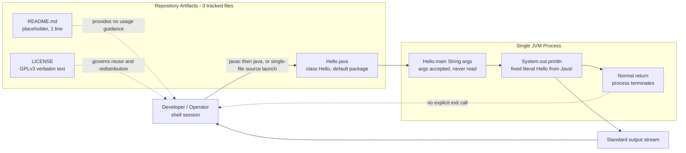

#### 1.2.2.3 Core Technical Approach

The approach is the smallest viable Java program, with every architectural decision resolved toward omission:

- **Single source file, single class, static entry point.** All logic lives in one static method; no object is instantiated and no inheritance, interface or generic type appears.
- **Standard library only.** There is no dependency manifest to resolve because there are no dependencies beyond the JDK itself.
- **No framework and no build tool.** Compilation and launch are performed directly by the JDK's own tooling (`javac` then `java`); for a single file of this shape the JDK's direct source launch mode is also applicable. Neither path is encoded in the repository, as no scripts or build descriptors exist.
- **No declared language level.** With no build manifest or toolchain configuration, the repository pins no Java version. The constructs used — a public class, a static `main`, and a `println` call — are part of the platform baseline and are not tied to any recent release, so the file is compatible with current JDK lines (Java 25 is the current long-term-support release, with Java 21 the previous LTS) as well as with much older ones.

```java
public static void main(String[] args) {
    System.out.println("Hello from Java!");
}
```

### 1.2.3 Success Criteria

#### 1.2.3.1 Measurable Objectives

The repository defines no acceptance criteria, service-level objectives or performance targets — there is no specification document, no test suite and no CI configuration in which such targets could be recorded. The objectives below are therefore derived strictly from what the artifacts make verifiable, and each names the means of verification.

| Objective | Verification method | Source of truth |
| --- | --- | --- |
| Source compiles without error under a standard JDK | Run `javac` on the single source file | `Hello.java` |
| Program emits exactly the line `Hello from Java!` | Compare captured stdout against the literal in source | `Hello.java` line 3 |
| Process terminates normally with no explicit exit call | Inspect exit status after a normal `main` return | `Hello.java` lines 2–4 |
| Build requires no external dependency resolution | Confirm no dependency manifest exists in the tree | Repository root inventory |
| Distribution terms are complete and unambiguous | Confirm the full GPLv3 text, Sections 0–17, is present | `LICENSE` |

#### 1.2.3.2 Critical Success Factors

- **A JDK must be available in the target environment.** It is the only prerequisite, and the repository neither pins nor documents a version; no toolchain configuration exists to enforce one.
- **Behaviour must remain deterministic.** Determinism follows from the program consulting no input, no configuration and no external state — any future change that reads input removes this property and invalidates the verification methods above.
- **Verification is currently manual.** With no tests and no CI, every objective in Section 1.2.3.1 depends on a human performing the check; this is the single largest structural gap in the current state.
- **Licensing integrity must be preserved.** Because the program is distributed as source under GPLv3, retaining the `LICENSE` file and its notices is a precondition for lawful redistribution.

#### 1.2.3.3 Key Performance Indicators

No KPIs, metrics, instrumentation, logging framework or telemetry of any kind exist in the repository; nothing in the code measures or reports anything about itself. In place of invented indicators, the table below records the quantitative properties of the system that are directly measurable from the artifacts and that can serve as a baseline against which future change is assessed.

| Measurable property | Current observed value | Source |
| --- | --- | --- |
| Executable source files | 1 | Repository root inventory |
| Application source lines | 5 | `Hello.java` |
| Output lines produced per run | 1 | `Hello.java` line 3 |
| Third-party dependencies | 0 | No dependency manifest in the repository |
| Automated tests | 0 | No test source or framework present |
| Configuration or input parameters honoured | 0 (`args` ignored) | `Hello.java` line 2 |
| Tracked files in the repository | 3 | Git tracked-file list |

## 1.3 Scope

Scope below reflects what the repository contains today, not what a program of this kind might contain. Every in-scope item maps to an artifact in the checkout; every out-of-scope item is excluded because the checkout demonstrably lacks it.

### 1.3.1 In-Scope

#### 1.3.1.1 Core Features and Functionalities

**Must-have capabilities**

| Capability | Implementation | Status |
| --- | --- | --- |
| Expose a JVM-compatible entry point | `public static void main(String[] args)` in class `Hello` | Present (`Hello.java` line 2) |
| Emit a fixed message to standard output | Single `System.out.println("Hello from Java!")` call | Present (`Hello.java` line 3) |
| Terminate without explicit exit handling | Normal return from `main`; no `System.exit` | Present (`Hello.java` lines 2–4) |
| Operate with no external dependency | Standard library output API only; no manifest to resolve | Present (repository root inventory) |
| State redistribution terms | Verbatim GPLv3 text, Sections 0–17 plus appendix | Present (`LICENSE`) |

**Primary user workflows**

| Workflow | Steps | Boundary touched |
| --- | --- | --- |
| Obtain the source | Clone the Git remote and check out branch `jr_java1`; three files arrive at the root | Source distribution channel |
| Compile and run | Compile `Hello.java` with the JDK compiler, then launch the resulting class by its simple name `Hello` (the class is in the default package) | JVM process contract, stdout |
| Direct source launch | Hand the single source file to the JDK launcher without a separate compile step — applicable because the file is self-contained with no package or dependencies | JVM process contract, stdout |
| Review legal terms | Read `LICENSE` before reusing, modifying or conveying the source | Licensing interface |

Reading `README.md` is technically a fourth workflow but yields no actionable information, since the file states nothing specific about the project.

**Essential integrations**

The only integrations in scope are the four contact points identified in Section 1.2.1.3: the JVM process contract, the standard output stream, the Git source-distribution channel, and the GPLv3 licensing interface. No other integration exists to bring into scope.

**Key technical requirements**

| Requirement | Basis in the repository |
| --- | --- |
| A JDK (compiler and launcher) available in the execution environment | No build tool or wrapper is vendored; the JDK is the entire toolchain |
| No specific Java version enforced | No build manifest, toolchain file or `module-info.java` pins a language level |
| Launch by the simple class name `Hello` | `Hello.java` declares no `package`, so the class carries no namespace |
| A writable location for compiler output | No build directory or output convention is defined in the repository |
| A standard output sink capable of receiving one text line | The program's sole observable effect is a `println` to `System.out` |
| No credentials, ports, environment variables or filesystem inputs | The program reads none of these; `args` is ignored |

#### 1.3.1.2 Implementation Boundaries

**System boundaries.** The system is a single operating-system process with exactly two boundary crossings: the inbound process launch (which conveys an argument array that is never read) and the outbound write of one line to standard output. There is no listener, socket, scheduled trigger, inter-process channel or callback — nothing can reach the program once it has been launched, and the program reaches nothing else.

**User groups covered.** One group: any principal with read access to the source and execute access to a JDK. The codebase defines no accounts, roles, permissions, tenancy or authentication, so the operating-system user performing the launch is the only identity involved. The licensing text additionally binds recipients and redistributors of the source, as set out in Section 1.1.3.

**Geographic and market coverage.** None is declared or implied by the code. There is no locale handling, character-set configuration, time-zone logic, currency handling or region-specific behaviour; the output message is a hardcoded ASCII English literal. The practical reach of the project is simply the reach of its public Git remote, and no market is targeted in any repository artifact.

**Data domains included.** No data domain is modelled. There is no schema, entity, record, file format, serialisation or persistence of any kind. The system's entire data footprint is one string literal held in source and written once to a stream; the `args` array is the only candidate input surface and it is unused.

### 1.3.2 Out-of-Scope

#### 1.3.2.1 Excluded Features and Capabilities

Each exclusion below was confirmed by inspecting the repository: the relevant code, directory, manifest or descriptor does not exist.

| Excluded area | What is absent | Confirming evidence |
| --- | --- | --- |
| Persistence and data management | No database, file I/O, schema, cache or serialisation | `Hello.java` performs only a `println` |
| Networking and APIs | No sockets, HTTP client or server, no exposed endpoint | No network imports; no framework or server dependency exists |
| User interface | No GUI, web front end or interactive console prompt | The single output line is the whole user experience |
| Security controls | No authentication, authorisation, cryptography, secret handling or input sanitisation | No such construct appears in the source |
| Command-line argument handling | `args` is accepted and ignored; no parser or flag handling | `Hello.java` line 2 |
| Configuration management | No properties, YAML, environment variable or command-line configuration | No configuration file exists in the checkout |
| Logging, metrics, tracing | No logging framework, instrumentation or telemetry | Section 1.2.3.3 records zero instrumentation |
| Error handling and resilience | No `try`/`catch`, validation, retry or fallback path | Method body is a single statement |
| Concurrency and scheduling | No threads, executors, async work or timers | No concurrency construct in the source |
| Build automation and dependency management | No `pom.xml`, `build.gradle`, `Makefile` or wrapper scripts | Repository root inventory |
| Automated testing and quality gates | No test sources, frameworks, linters or coverage tooling | No test directory exists |
| Packaging, deployment, release management | No JAR, manifest, container definition, release tags or artifacts | No compiled or packaged artifact is tracked |
| CI/CD | No workflow, pipeline or automation descriptor | No `.github/` directory or CI file exists |
| Internationalisation and accessibility | No resource bundle, message catalogue or locale selection | Output literal is hardcoded in `Hello.java` |
| Substantive documentation | No usage, API, architecture or contribution documentation | `README.md` is a 41-character placeholder |

#### 1.3.2.2 Future Phase Considerations

The repository records no planned work: there is no roadmap, backlog, `TODO` marker, issue template, milestone or design note in any tracked file, and no tags mark intended releases. This specification therefore makes no claim about future phases, because asserting any would be speculation rather than documentation.

What the repository does establish is the starting point from which any later phase would have to proceed. The limitation matrix in Section 1.2.1.2 and the exclusion table in Section 1.3.2.1 together enumerate the concrete gaps — build automation, tests, packaging, configuration, observability, documentation — that a subsequent phase would need to address before this code could be operated as a product.

#### 1.3.2.3 Integration Points Not Covered

No integration beyond the four points listed in Section 1.2.1.3 is covered. In particular, the repository provides no integration with databases or data stores, message brokers or event streams, identity providers, external HTTP services, monitoring or log-aggregation platforms, artifact repositories, container registries, or deployment orchestrators. None of these is stubbed, configured or referenced, so integrating with them constitutes new work rather than configuration of existing capability.

#### 1.3.2.4 Unsupported Use Cases

| Use case | Why it is unsupported |
| --- | --- |
| Reuse as a library or shared component | The only public member is a static `main`; the class sits in the default package and no artifact is published |
| Parameterised or configurable execution | `args` is ignored and no configuration source is read; changing behaviour requires editing source |
| Long-running service or daemon operation | The process performs one write and returns; there is no loop, listener or lifecycle management |
| Data processing of any kind | No input is read and no data structure is defined |
| Deployment as a managed, monitored workload | No packaging, health signal, configuration surface or observability exists |
| Consumption as a Java module | No `module-info.java` is present and the class is not namespaced |
| Reliance on any behaviour beyond the emitted line and normal termination | These are the only two observable effects present in the source |

## 1.4 References

### 1.4.1 Repository Files Examined

- `Hello.java` - Read in full (5 lines). Established the sole class `Hello`, the entry point `public static void main(String[] args)`, the single `System.out.println("Hello from Java!")` statement, the absence of `package`/`import`/fields/constructor/additional methods, the unused `args` array, and CRLF line endings. Basis for all capability, component, workflow and boundary statements in Sections 1.1–1.3.
- `README.md` - Read in full (41 characters, one sentence). Established that the repository provides no stated purpose, business context, usage instructions or architectural guidance.
- `LICENSE` - Inspected (674 lines). Established the verbatim GNU General Public License Version 3, 29 June 2007, with Sections 0–17 and the "How to Apply These Terms to Your New Programs" appendix; basis for the licensing interface, stakeholder obligations and redistribution scope statements.

### 1.4.2 Repository Folders Examined

- Repository root (folder path `""`) - Contained exactly three files (`Hello.java`, `LICENSE`, `README.md`) and no subdirectories. Confirmed the absence of build manifests, source/test trees, CI descriptors, containerisation files, configuration files and compiled artifacts — the basis for the limitation matrix (Section 1.2.1.2) and every exclusion in Section 1.3.2.1.

### 1.4.3 Repository Metadata Examined

- Git repository metadata (branch, remote, commit log, tag list, tracked-file list) - Established the inspected branch `jr_java1`, the origin remote `github.com/rjhonsi/BlitzyRepo2_Java.git`, exactly three commits (`c537a19` "Initial commit", `f1847fa` "Add files via upload", `0726b1d` "Add initial README file with basic information"), the absence of tags, and the three-file tracked inventory. Basis for the provenance, project-context and distribution-channel statements.
- Repository-wide semantic searches for application/service/configuration files and for build/test/deployment folders - Both returned no results, corroborating that no additional components, integrations, tests or configuration exist beyond the three files listed above.

### 1.4.4 External Sources

- [web] Java version and LTS baseline references (Java Versions and Features, marcobehler.com; Java version history, Wikipedia; corroborated by javawithus.com and codejava.net) - Confirmed that Java 25 (September 2025) is the current long-term-support release and Java 21 (September 2023) the previous LTS, used solely as external platform context in Section 1.2.2.3. The repository itself pins no Java version.

### 1.4.5 Verification Notes

- No `.blitzyignore` file exists anywhere in the checkout, so no path exclusions applied to this investigation.
- No JDK (`javac`/`java`) was available in the inspection environment, so the program was not executed. All behavioural statements in this section derive from the source text of `Hello.java` and are identified as such where relevant.

# 2. Product Requirements

## 2.1 Feature Catalog

The repository contains no requirements artifact of any kind: no specification, backlog, issue template, roadmap, milestone or `TODO` marker exists in any of the three tracked files (`Hello.java`, `LICENSE`, `README.md`) or in the three-commit history on branch `jr_java1`. Every feature catalogued below is therefore **reverse-derived from observable artifacts**, not transcribed from a product document. Each entry names the exact artifact and line range that establishes it.

Two conventions apply throughout this section:

- **Status** describes the state of the committed artifact at commit `0726b1d` (tip of `jr_java1`) — it is not a delivery-schedule position, because the repository records no plan (Section 1.3.2.2).
- **Priority** is assigned by observed criticality to the system's only behaviour: removing the artifact or statement either eliminates the single observable effect (Critical), removes the ability to build, terminate cleanly or convey the work lawfully (High), affects how the work is obtained (Medium), or has no functional effect (Low).

### 2.1.1 Catalog Summary

| Feature ID | Feature Name | Category | Priority |
| --- | --- | --- | --- |
| F-001 | JVM Entry-Point Contract | Runtime Interface | Critical |
| F-002 | Fixed Console Message Emission | Output Behaviour | Critical |
| F-003 | Deterministic Normal Termination | Process Lifecycle | High |
| F-004 | Dependency-Free JDK-Only Build and Launch | Build & Toolchain | High |
| F-005 | Source-Only Distribution via Git Remote | Distribution | Medium |
| F-006 | GPLv3 Licensing and Redistribution Terms | Legal & Compliance | High |
| F-007 | Repository README Documentation Artifact | Documentation | Low |

| Feature ID | Status | Primary evidence anchor | Basis in Section 1 |
| --- | --- | --- | --- |
| F-001 | Completed | `Hello.java` lines 1–2 | 1.3.1.1 must-have: expose a JVM-compatible entry point |
| F-002 | Completed | `Hello.java` line 3 | 1.3.1.1 must-have: emit a fixed message to standard output |
| F-003 | Completed | `Hello.java` lines 2–4 | 1.3.1.1 must-have: terminate without explicit exit handling |
| F-004 | Completed | Verified absence of all build manifests; zero `import` statements | 1.3.1.1 must-have: operate with no external dependency |
| F-005 | Completed | `git ls-files` = 3 files; 0 tags; no tracked binaries | 1.3.1.1 workflow: obtain the source |
| F-006 | Completed | `LICENSE`, 674 lines, Sections 0–17 plus appendix | 1.3.1.1 must-have: state redistribution terms |
| F-007 | Completed — placeholder content | `README.md`, 41 bytes, one sentence | 1.1.1 artifact table |

No eighth feature was identifiable. Semantic searches for application, build, test and deployment artifacts returned no results, and direct existence tests for 24 candidate build, test, CI, packaging and configuration artifacts all reported absence, so the catalog is closed at seven entries.

### 2.1.2 F-001 — JVM Entry-Point Contract

| Attribute | Value |
| --- | --- |
| Unique ID | F-001 |
| Feature Name | JVM Entry-Point Contract |
| Feature Category | Runtime Interface |
| Priority Level | Critical |
| Status | Completed |

**Description**

- **Overview.** `Hello.java` declares a single public top-level class, `Hello`, whose only member is the canonical JVM entry point `public static void main(String[] args)` (lines 1–2). The class sits in the default package — no `package` declaration exists — so it is launched by its simple name, `Hello`. The `args` array is accepted by signature and never inspected or mutated.
- **Business value.** The repository states no business objective (Section 1.1.2). The verifiable value of this feature is that it is the only mechanism by which any of the repository's code becomes executable: it is the sole contract the JVM launcher can bind to.
- **User benefits.** A developer or operator at a shell can launch the program with no wrapper script, no arguments and no prior configuration; a CI job can invoke it the same way and rely on the invocation surface never changing, since no argument is read.
- **Technical context.** The method is `static`, so no object is instantiated; the class declares no fields, no explicit constructor, no additional methods and no `module-info.java` companion, and holds no mutable state. This is the complete application namespace.

| Dependency type | Detail |
| --- | --- |
| Prerequisite features | F-004 (a compiled or source-launched unit must exist before the entry point can be bound) |
| System dependencies | A JVM launcher from a standard JDK; an operating-system process able to be started |
| External dependencies | None — no third-party library, framework or runtime service is referenced |
| Integration requirements | The JVM process contract identified in Section 1.2.1.3: the class must expose the exact `public static void main(String[] args)` signature and be resolvable by the unqualified name `Hello` |

### 2.1.3 F-002 — Fixed Console Message Emission

| Attribute | Value |
| --- | --- |
| Unique ID | F-002 |
| Feature Name | Fixed Console Message Emission |
| Feature Category | Output Behaviour |
| Priority Level | Critical |
| Status | Completed |

**Description**

- **Overview.** Line 3 of `Hello.java` is the entire application logic: one call to `System.out.println` with the hardcoded literal `Hello from Java!`. This is the system's only observable effect besides process termination.
- **Business value.** Not stated in the repository. What is verifiable is that this single deterministic line makes the artifact usable as an unambiguous reference signal — the value proposition recorded in Section 1.1.4 as a toolchain or environment check.
- **User benefits.** The consumer receives one predictable line of ASCII text on standard output, with no log noise, no interleaved diagnostics and nothing written to standard error, so the output can be compared byte-for-byte without filtering.
- **Technical context.** The call reaches the JDK standard output API (`java.lang.System.out`, a `PrintStream`) without any `import`, since `java.lang` is implicitly available. No formatter, resource bundle, message catalogue, logging framework or locale selection is involved; the literal is compiled into the class file.

| Dependency type | Detail |
| --- | --- |
| Prerequisite features | F-001 (the statement is reachable only from within `main`) |
| System dependencies | JDK standard library output API (`System.out` / `PrintStream.println`) |
| External dependencies | An operating-system standard-output sink able to receive one text line |
| Integration requirements | The standard output stream boundary identified in Section 1.2.1.3 — one line of UTF-encodable ASCII text written to `System.out`; no other stream, file or socket is touched |

### 2.1.4 F-003 — Deterministic Normal Termination

| Attribute | Value |
| --- | --- |
| Unique ID | F-003 |
| Feature Name | Deterministic Normal Termination |
| Feature Category | Process Lifecycle |
| Priority Level | High |
| Status | Completed |

**Description**

- **Overview.** After the single `println` call, `main` returns normally (lines 2–4). The source contains no `System.exit` call, no `try`/`catch`, no loop, no thread creation, no executor, no timer and no blocking read, so the method body cannot suspend or persist beyond its one statement.
- **Business value.** Not stated in the repository. The verifiable value is a clean, script-friendly lifecycle: an invoking shell or CI step regains control immediately and can branch on the process exit status.
- **User benefits.** No shutdown handling, signal trapping or cleanup step is required of the caller; the program never becomes a resident process that must be managed or stopped.
- **Technical context.** Because no non-daemon thread is started and no explicit exit status is set, standard JVM semantics yield normal termination with a zero status. This was **not executed during inspection** — no JDK (`javac`/`java`) is installed in the inspection environment — so the statement rests on the source text, consistent with the note in Section 1.2.2.1.

| Dependency type | Detail |
| --- | --- |
| Prerequisite features | F-001 (termination follows the return of `main`); F-002 completes before the return |
| System dependencies | Standard JVM process-exit semantics for a normally returning `main` |
| External dependencies | None |
| Integration requirements | The JVM process contract (Section 1.2.1.3): the process must be allowed to exit on its own; no external supervisor, restart policy or health probe is defined by the repository |

### 2.1.5 F-004 — Dependency-Free JDK-Only Build and Launch

| Attribute | Value |
| --- | --- |
| Unique ID | F-004 |
| Feature Name | Dependency-Free JDK-Only Build and Launch |
| Feature Category | Build & Toolchain |
| Priority Level | High |
| Status | Completed |

**Description**

- **Overview.** The repository is buildable with the JDK alone. Direct existence tests confirmed there is no `pom.xml`, `build.gradle`, `build.gradle.kts`, `settings.gradle`, `Makefile`, `build.xml`, wrapper script, `module-info.java`, `package.json` or `requirements.txt`, and a filesystem scan found no `*.class`, `*.jar`, `*.properties`, `*.yml`, `*.yaml`, `*.xml` or `*.json` file anywhere in the working tree. `Hello.java` declares no `import`, so there is nothing to resolve.
- **Business value.** Not stated in the repository. The verifiable value is the zero-provisioning property recorded in Section 1.1.4: the artifact can be exercised anywhere a JDK exists, with no repository access, credential or network call at build time.
- **User benefits.** Two equally valid paths exist — compile with `javac` then launch the class, or hand the single self-contained source file to the JDK launcher directly — and neither requires installing or configuring a build tool.
- **Technical context.** No Java language level is pinned anywhere, since there is no manifest, toolchain file or module descriptor; the constructs used (public class, static `main`, `println`) are platform baseline. Neither build path is encoded in the repository — no scripts, tasks or documented commands exist — so the toolchain invocation is knowledge the operator must supply.

| Dependency type | Detail |
| --- | --- |
| Prerequisite features | F-005 (the source files must be obtained before they can be compiled) |
| System dependencies | A JDK providing the compiler and launcher; a writable location for compiler output (the repository defines no build or output directory) |
| External dependencies | None at build time — zero third-party dependencies and no dependency-resolution step |
| Integration requirements | The JVM process contract (Section 1.2.1.3). Single-file source launch is applicable only because the file is self-contained with no `package` and no dependencies |

### 2.1.6 F-005 — Source-Only Distribution via Git Remote

| Attribute | Value |
| --- | --- |
| Unique ID | F-005 |
| Feature Name | Source-Only Distribution via Git Remote |
| Feature Category | Distribution |
| Priority Level | Medium |
| Status | Completed |

**Description**

- **Overview.** The complete system is delivered as three tracked text files at the repository root of branch `jr_java1` on the `github.com/rjhonsi/BlitzyRepo2_Java` remote. `git ls-files` returns exactly `Hello.java`, `LICENSE` and `README.md`; there are no subdirectories and no tracked build outputs.
- **Business value.** Not stated in the repository. The verifiable value is that the Git remote is the single, complete distribution channel — a clone conveys the program, its licence and its documentation together, with no packaging or publication step in between.
- **User benefits.** Obtaining the system is one clone-and-checkout operation, and the received tree is small enough to be reviewed in full before use.
- **Technical context.** The history is three commits (`c537a19` "Initial commit", `f1847fa` "Add files via upload", `0726b1d` "Add initial README file with basic information") and zero tags, so a consumer identifies a revision by commit SHA rather than by release version. No `.gitignore` or `.gitattributes` is present, so neither artifact exclusion nor line-ending normalisation is managed by the repository — `Hello.java` is stored with CRLF terminators while `README.md` uses LF.

| Dependency type | Detail |
| --- | --- |
| Prerequisite features | None |
| System dependencies | A Git client; read access to the remote |
| External dependencies | The hosted Git remote (`github.com/rjhonsi/BlitzyRepo2_Java.git`), branch `jr_java1` |
| Integration requirements | The source distribution channel identified in Section 1.2.1.3. No artifact repository, container registry or release pipeline participates, and none is configured |

### 2.1.7 F-006 — GPLv3 Licensing and Redistribution Terms

| Attribute | Value |
| --- | --- |
| Unique ID | F-006 |
| Feature Name | GPLv3 Licensing and Redistribution Terms |
| Feature Category | Legal & Compliance |
| Priority Level | High |
| Status | Completed |

**Description**

- **Overview.** `LICENSE` carries the verbatim GNU General Public License, Version 3, 29 June 2007 — 674 lines comprising the Free Software Foundation copyright and verbatim-copy notice, the Preamble, numbered Sections 0 through 17, the `END OF TERMS AND CONDITIONS` marker (line 621) and the "How to Apply These Terms to Your New Programs" appendix (line 623 onward).
- **Business value.** This is the one deliberate positioning decision recorded in the repository (Section 1.2.1.1), and it is legal rather than commercial: it places any distribution of the code within the copyleft ecosystem with explicit patent grants, warranty disclaimer and liability limitation.
- **User benefits.** Recipients and redistributors have complete, self-contained terms in the tree — the licence is included rather than referenced by URL — so reuse obligations can be assessed without consulting an external source.
- **Technical context.** The file is plain legal text with no executable behaviour and no effect on compilation. One gap is directly observable: the appendix advises attaching a copyright line and warranty-exclusion notice to the start of each source file, and `Hello.java` contains no occurrence of "copyright", "license" or "GPL" — it carries no notice header.

| Dependency type | Detail |
| --- | --- |
| Prerequisite features | None (the terms stand independently of the code) |
| System dependencies | None — no tooling reads, validates or enforces the licence |
| External dependencies | The GPLv3 text as published by the Free Software Foundation, reproduced verbatim in the tree |
| Integration requirements | The licensing interface identified in Section 1.2.1.3; governs every conveyance performed through F-005 and every modified version derived from `Hello.java` |

### 2.1.8 F-007 — Repository README Documentation Artifact

| Attribute | Value |
| --- | --- |
| Unique ID | F-007 |
| Feature Name | Repository README Documentation Artifact |
| Feature Category | Documentation |
| Priority Level | Low |
| Status | Completed — placeholder content |

**Description**

- **Overview.** `README.md` is 41 bytes on one line and contains exactly the sentence "This is a Readme file - nothing specific". It has no headings, lists, code blocks, configuration or references to other files, and it was added in commit `0726b1d`.
- **Business value.** None is stated, and the file itself declines to describe the project. Its only verifiable contribution is occupying the conventional documentation slot at the repository root.
- **User benefits.** A reader arriving at the root finds a README where one is expected; as recorded in Section 1.3.1.1, reading it yields no actionable information.
- **Technical context.** Because the README carries no build or run instructions, the toolchain commands implied by F-004 must be inferred by the operator. This is the documentation gap enumerated in Section 1.2.1.2, restated here as a feature-level property rather than a defect claim.

| Dependency type | Detail |
| --- | --- |
| Prerequisite features | None |
| System dependencies | None — the file is never read by any code or tool in the repository |
| External dependencies | A Markdown renderer for presentation only; the content contains no Markdown constructs |
| Integration requirements | Travels with the source distribution channel (F-005); has no runtime or build integration |


## 2.2 Functional Requirements

The repository defines no acceptance criteria, service-level objectives or performance targets — there is no specification, test suite or CI configuration in which such targets could be recorded (Section 1.2.3.1). Accordingly, every acceptance criterion below is a **verification procedure derived from the artifacts**, expressed so that it can be executed against the code as it stands. Criteria that require running the program have not been executed during this inspection, because no JDK is installed in the inspection environment; they are stated as procedures, not as observed results.

All requirements carry version 1.0 as observed at commit `0726b1d` (see Section 2.6.3). Complexity ratings reflect the implementation effort visible in the artifact: every requirement in this system is satisfied by at most five lines of source or by the presence of a single file, so no requirement is rated High.

### 2.2.1 F-001 — JVM Entry-Point Contract

**Requirement details**

| Requirement ID | Description | Acceptance Criteria | Priority |
| --- | --- | --- | --- |
| F-001-RQ-001 | Declare the canonical entry point `public static void main(String[] args)` inside the public top-level class `Hello` | Compiling `Hello.java` with the JDK compiler completes without error, and launching the compiled class binds the entry point without a "main method not found" failure | Must-Have |
| F-001-RQ-002 | Keep the class resolvable by the unqualified name `Hello`, with the file name matching the public class name | Source contains no `package` declaration (verified: none present); launching with the compiled-output directory on the classpath resolves `Hello` | Must-Have |
| F-001-RQ-003 | Accept the argument array by signature without reading or mutating it | Standard output is byte-identical when launched with zero arguments and with arbitrary arguments; the method body contains no reference to `args` | Must-Have |
| F-001-RQ-004 | Hold no instance state: no fields, no explicit constructor, no additional methods, no object instantiation | Source inspection confirms the class body contains only the `main` method; execution requires no object creation | Should-Have |

**Technical specifications**

| Requirement ID | Complexity | Input Parameters | Output / Response |
| --- | --- | --- | --- |
| F-001-RQ-001 | Low | `String[] args` supplied by the JVM launcher; never dereferenced | None directly; transfers control to the body statement (F-002) |
| F-001-RQ-002 | Low | Class name token `Hello` presented to the launcher | Class loaded from the default package |
| F-001-RQ-003 | Low | Zero or more command-line tokens | No response — arguments produce no observable difference |
| F-001-RQ-004 | Low | None | None — statelessness is a structural property |

| Requirement ID | Performance Criteria | Data Requirements |
| --- | --- | --- |
| F-001-RQ-001 | None defined in the repository; the method performs no computation before its single statement | None |
| F-001-RQ-002 | None defined | None |
| F-001-RQ-003 | None defined | The `args` array is the only candidate input surface and is unused |
| F-001-RQ-004 | None defined | No persistent or in-memory state is retained between invocations |

**Validation rules**

| Rule category | Rule as observed in the repository |
| --- | --- |
| Business rules | The entry point must remain the single public surface of the system; `main` is the only member declared |
| Data validation | None exists — no argument is read, so no parsing, bounds check or type coercion is performed |
| Security requirements | No authentication, authorisation or privilege check is implemented; the launching operating-system user is the only identity involved (Section 1.3.1.2) |
| Compliance requirements | Any redistributed modification of this entry point remains subject to F-006 (GPLv3 Sections 4 and 5) |

### 2.2.2 F-002 — Fixed Console Message Emission

**Requirement details**

| Requirement ID | Description | Acceptance Criteria | Priority |
| --- | --- | --- | --- |
| F-002-RQ-001 | Write the exact literal `Hello from Java!` to standard output through `System.out.println` | Captured standard output equals the literal followed by the platform line separator, compared byte-for-byte against the literal at `Hello.java` line 3 | Must-Have |
| F-002-RQ-002 | Emit exactly one line per invocation and write nothing to standard error | Captured standard output contains one line; captured standard error is empty | Must-Have |
| F-002-RQ-003 | Keep output invariant: consult no argument, configuration file, environment variable, locale, clock or filesystem state | Runs from different working directories, with an empty environment and under different locale settings produce identical output bytes | Must-Have |
| F-002-RQ-004 | Write to no other sink — no file, socket, database or logging target | Source inspection confirms `System.out` is the only output API referenced; no file, network or logging API appears | Must-Have |

**Technical specifications**

| Requirement ID | Complexity | Input Parameters | Output / Response |
| --- | --- | --- | --- |
| F-002-RQ-001 | Low | None — the message is a compile-time string literal | One line of ASCII text on `System.out`: `Hello from Java!` |
| F-002-RQ-002 | Low | None | Exactly one `println` invocation per process; standard error unused |
| F-002-RQ-003 | Low | None consulted by design | Identical byte sequence on every run |
| F-002-RQ-004 | Low | None | Single stream write; no other descriptor opened |

| Requirement ID | Performance Criteria | Data Requirements |
| --- | --- | --- |
| F-002-RQ-001 | None defined in the repository; exactly one stream write occurs, with no computation preceding it | One string literal, 16 characters, held in the compiled class constant pool |
| F-002-RQ-002 | None defined; output volume is fixed at one line per run (Section 1.2.3.3) | None beyond the literal |
| F-002-RQ-003 | None defined | No external data source is read, which is what makes invariance verifiable |
| F-002-RQ-004 | None defined | No serialisation format, schema or file layout is involved |

**Validation rules**

| Rule category | Rule as observed in the repository |
| --- | --- |
| Business rules | The message content is fixed in source; changing it requires editing `Hello.java` and recompiling — no message catalogue, property or argument can override it |
| Data validation | None applicable — there is no input to validate and the output value is a constant |
| Security requirements | The literal contains no secret, credential, host name or personally identifying data; standard output is the system's only egress path |
| Compliance requirements | The output is hardcoded ASCII English with no locale handling, so no internationalisation or accessibility obligation is met or claimed (Section 1.3.2.1) |

### 2.2.3 F-003 — Deterministic Normal Termination

**Requirement details**

| Requirement ID | Description | Acceptance Criteria | Priority |
| --- | --- | --- | --- |
| F-003-RQ-001 | Terminate the process after the single write by returning normally from `main`, with no explicit exit call | Source contains no `System.exit`; after the emitted line the process exits and the invoking shell observes a zero exit status under standard JVM semantics | Must-Have |
| F-003-RQ-002 | Introduce no blocking, interactive, looping or long-running construct | Source contains no loop, input read, sleep, thread, executor or timer; the invocation returns without requiring interaction | Must-Have |
| F-003-RQ-003 | Define no error-handling path: failures surface as default JVM behaviour | Source contains no `try`, `catch`, `finally` or `throws`; a failure on the output path would propagate as an uncaught throwable rather than being handled | Could-Have |

**Technical specifications**

| Requirement ID | Complexity | Input Parameters | Output / Response |
| --- | --- | --- | --- |
| F-003-RQ-001 | Low | None | Process exit; status not set explicitly by the program |
| F-003-RQ-002 | Low | None | Single-shot execution; no residual process |
| F-003-RQ-003 | Low | None | No handled failure response; no diagnostic message is produced by the program |

| Requirement ID | Performance Criteria | Data Requirements |
| --- | --- | --- |
| F-003-RQ-001 | None defined in the repository; no work is performed between the write and the return | None |
| F-003-RQ-002 | None defined; the absence of loops and waits bounds execution to one statement | None |
| F-003-RQ-003 | None defined | No error record, log entry or exit-code convention is defined |

**Validation rules**

| Rule category | Rule as observed in the repository |
| --- | --- |
| Business rules | The process must not outlive its single write; no lifecycle, supervision or restart policy is defined anywhere in the repository |
| Data validation | None applicable — no state is flushed, persisted or reconciled at termination |
| Security requirements | No resource, handle, credential or temporary file requires cleanup, because none is acquired |
| Compliance requirements | None applicable; the warranty disclaimer and liability limitation in `LICENSE` Sections 15–17 govern any consequence of termination behaviour |

### 2.2.4 F-004 — Dependency-Free JDK-Only Build and Launch

**Requirement details**

| Requirement ID | Description | Acceptance Criteria | Priority |
| --- | --- | --- | --- |
| F-004-RQ-001 | Compile using the JDK compiler alone, with no dependency-resolution or build-tool step | In an environment containing only a JDK, compiling the single source file completes with a zero status and produces `Hello.class`; no network or artifact-repository access occurs | Must-Have |
| F-004-RQ-002 | Depend on zero third-party libraries; use only the standard library output API | Source contains no `import` statement; no dependency manifest exists (24 candidate build, packaging and configuration artifacts verified absent); no vendored library directory exists | Must-Have |
| F-004-RQ-003 | Support direct single-file source launch without a separate compile step | Handing `Hello.java` to the JDK launcher emits the message; applicability follows from the file being self-contained with no `package` and no dependencies | Should-Have |
| F-004-RQ-004 | Require no configuration, credentials, ports, environment variables or filesystem inputs | The program runs with an empty environment and no configuration file present; source reads none of these | Must-Have |
| F-004-RQ-005 | Pin no Java language level or toolchain version | No build manifest, toolchain descriptor or `module-info.java` exists; compilation succeeds with the compiler's default source and target settings | Should-Have |

**Technical specifications**

| Requirement ID | Complexity | Input Parameters | Output / Response |
| --- | --- | --- | --- |
| F-004-RQ-001 | Low | One source file path passed to the compiler | One class file, `Hello.class`, in the chosen output location |
| F-004-RQ-002 | Low | None | No classpath entry beyond the platform classes and the compiled output |
| F-004-RQ-003 | Low | One source file path passed to the launcher | The emitted line, with no persisted class file required |
| F-004-RQ-004 | Low | None — no environment or configuration surface is consulted | Execution unaffected by environment contents |
| F-004-RQ-005 | Low | Compiler defaults for source and target level | Class file targeted at the installed JDK's default level |

| Requirement ID | Performance Criteria | Data Requirements |
| --- | --- | --- |
| F-004-RQ-001 | None defined in the repository; one compilation unit of five lines is the entire build input | Source: 127 bytes, five CRLF-terminated lines |
| F-004-RQ-002 | None defined; the build performs no resolution, download or cache lookup | Zero dependency metadata |
| F-004-RQ-003 | None defined | Source file must remain self-contained for this path to stay valid |
| F-004-RQ-004 | None defined | Zero configuration parameters honoured (Section 1.2.3.3) |
| F-004-RQ-005 | None defined | No toolchain metadata is stored in the repository |

**Validation rules**

| Rule category | Rule as observed in the repository |
| --- | --- |
| Business rules | The build must remain resolvable offline; introducing any third-party dependency would invalidate F-004-RQ-001 and F-004-RQ-002 as written |
| Data validation | None exists — the only build input is the source file, validated implicitly by the compiler |
| Security requirements | Supply-chain surface is limited to the installed JDK, since no external artifact is fetched; the repository pins no JDK version or checksum, so toolchain provenance is the operator's responsibility |
| Compliance requirements | Compiled output is a derivative of GPLv3-licensed source; conveying it in non-source form engages `LICENSE` Section 6 (line 245) |

### 2.2.5 F-005 — Source-Only Distribution via Git Remote

**Requirement details**

| Requirement ID | Description | Acceptance Criteria | Priority |
| --- | --- | --- | --- |
| F-005-RQ-001 | Deliver the complete system as exactly three tracked root-level text files on branch `jr_java1` | A fresh clone and checkout of `jr_java1` lists exactly `Hello.java`, `LICENSE` and `README.md` as tracked files, with no subdirectories | Must-Have |
| F-005-RQ-002 | Convey no build outputs, binaries or packaged artifacts | No `*.class`, `*.jar` or archive file is tracked or present in the working tree (verified: none found) | Must-Have |
| F-005-RQ-003 | Identify revisions by commit SHA rather than release version | The tag list is empty; the current tip is `0726b1d`, preceded by `f1847fa` and `c537a19` | Should-Have |
| F-005-RQ-004 | Preserve the stored line-ending form of each file, no normalisation being configured | `Hello.java` shows CRLF terminators on all five lines and `README.md` is LF-terminated; no `.gitattributes` or `.gitignore` exists | Could-Have |

**Technical specifications**

| Requirement ID | Complexity | Input Parameters | Output / Response |
| --- | --- | --- | --- |
| F-005-RQ-001 | Low | Remote URL and branch name `jr_java1` | Working tree of three files totalling 35,317 bytes |
| F-005-RQ-002 | Low | None | Source-only tree; consumers must build locally (F-004) |
| F-005-RQ-003 | Low | A commit SHA chosen by the consumer | The corresponding tree state; no release notes accompany it |
| F-005-RQ-004 | Low | None | Files delivered byte-for-byte as committed |

| Requirement ID | Performance Criteria | Data Requirements |
| --- | --- | --- |
| F-005-RQ-001 | None defined in the repository; the clone payload is three text files | Three tracked files: 127 B, 35,149 B and 41 B |
| F-005-RQ-002 | None defined | No artifact metadata, checksum or signature is published |
| F-005-RQ-003 | None defined | Commit history of three entries is the only provenance record |
| F-005-RQ-004 | None defined | Mixed CRLF/LF line endings across the tree |

**Validation rules**

| Rule category | Rule as observed in the repository |
| --- | --- |
| Business rules | The Git remote is the single distribution channel; no artifact repository, registry or release pipeline is configured (Section 1.3.2.3) |
| Data validation | None exists beyond Git's own content integrity; the repository defines no checksum or signature verification step |
| Security requirements | Access control is whatever the hosting remote enforces; the repository itself contains no credential, secret, key material or access-control file |
| Compliance requirements | Every conveyance through this channel must include `LICENSE` and preserve notices, per `LICENSE` Section 4 (line 195) and Section 5 (line 208) |

### 2.2.6 F-006 — GPLv3 Licensing and Redistribution Terms

**Requirement details**

| Requirement ID | Description | Acceptance Criteria | Priority |
| --- | --- | --- | --- |
| F-006-RQ-001 | Include the complete verbatim GPLv3 text at the repository root | `LICENSE` is present and spans 674 lines / 35,149 bytes; lines 1–2 read the licence title and "Version 3, 29 June 2007"; numbered Sections 0–17 are present; `END OF TERMS AND CONDITIONS` appears at line 621 and the application appendix at line 623 | Must-Have |
| F-006-RQ-002 | Give every recipient a copy of the licence together with the Program, keeping copyright and warranty notices intact | Any conveyed copy contains `LICENSE` unmodified alongside the source, satisfying Section 4 (lines 195–203) | Must-Have |
| F-006-RQ-003 | Require modified versions to carry prominent dated modification notices and remain licensed as a whole under GPLv3 | A fork or patch set shows the notices required by Section 5 (a)–(c) (lines 213–222) and no relicensing of the whole | Must-Have |
| F-006-RQ-004 | Preserve the warranty disclaimer, liability limitation and their interpretation rule | Sections 15 (line 589), 16 (line 600) and 17 (line 612) remain unaltered in every conveyed copy | Must-Have |
| F-006-RQ-005 | Attach a per-file copyright line and warranty-exclusion notice to the start of each source file, per the appendix guidance (lines 629–632) | Each source file begins with the copyright line and a pointer to the full notice. **Current state: not satisfied** — `Hello.java` contains zero occurrences of copyright, licence or GPL text | Should-Have |

**Technical specifications**

| Requirement ID | Complexity | Input Parameters | Output / Response |
| --- | --- | --- | --- |
| F-006-RQ-001 | Low | None — static text artifact | The complete terms available offline in the tree |
| F-006-RQ-002 | Low | The conveyed tree or copy | Recipient obtains terms and notices with the Program |
| F-006-RQ-003 | Medium | The modification and its date, supplied by the modifier | Notices recorded in the modified work |
| F-006-RQ-004 | Low | None | Disclaimer and liability terms remain enforceable as written |
| F-006-RQ-005 | Low | Program name, year and author, supplied by the copyright holder | A notice header at the top of each source file |

| Requirement ID | Performance Criteria | Data Requirements |
| --- | --- | --- |
| F-006-RQ-001 | Not applicable — no runtime behaviour; no tooling reads the file | 674 lines of plain legal text |
| F-006-RQ-002 | Not applicable | The licence file must travel with the source |
| F-006-RQ-003 | Not applicable | Modification notices with a relevant date |
| F-006-RQ-004 | Not applicable | Verbatim retention of lines 589–620 |
| F-006-RQ-005 | Not applicable | Copyright holder name and year — neither is currently recorded anywhere in the repository |

**Validation rules**

| Rule category | Rule as observed in the repository |
| --- | --- |
| Business rules | Distribution is copyleft: downstream recipients receive the same rights automatically under Section 10 (line 446), and no further restrictions may be imposed (Section 10 and Section 12, line 540) |
| Data validation | No automated licence scanning, header check or compliance gate exists in the repository; verification is manual document inspection |
| Security requirements | Section 11 (line 471) governs patent grants and discriminatory patent licensing; the repository contains no separate patent, security-policy or vulnerability-reporting file |
| Compliance requirements | Sections 4, 5 and 6 bind verbatim conveyance, modified-source conveyance and non-source conveyance respectively; Section 8 (line 407) governs termination on violation. The open gap in F-006-RQ-005 is the only observed deviation from the licence's own guidance |

### 2.2.7 F-007 — Repository README Documentation Artifact

**Requirement details**

| Requirement ID | Description | Acceptance Criteria | Priority |
| --- | --- | --- | --- |
| F-007-RQ-001 | Provide a tracked Markdown README at the repository root | `README.md` exists at the root and appears in the tracked-file list | Must-Have |
| F-007-RQ-002 | Record the documentation content baseline: one sentence, 41 bytes, offering no build, run, usage or architecture guidance | File content matches the single recorded sentence byte-for-byte; the file contains no headings, lists, code blocks or cross-references | Could-Have |

**Technical specifications**

| Requirement ID | Complexity | Input Parameters | Output / Response |
| --- | --- | --- | --- |
| F-007-RQ-001 | Low | None | A README presented at the root of the repository view |
| F-007-RQ-002 | Low | None | One sentence of plain text; no actionable instruction |

| Requirement ID | Performance Criteria | Data Requirements |
| --- | --- | --- |
| F-007-RQ-001 | Not applicable — never read by code or tooling | 41 bytes, one LF-terminated line |
| F-007-RQ-002 | Not applicable | No structured content, front matter or metadata |

**Validation rules**

| Rule category | Rule as observed in the repository |
| --- | --- |
| Business rules | The repository makes no documentation promise: the file explicitly states it holds nothing specific, so operators must infer the F-004 toolchain commands |
| Data validation | None — no linter, link checker or documentation build validates the file |
| Security requirements | The content discloses no host, credential, contact address or internal detail; no `CODEOWNERS`, contribution or contact information exists anywhere in the repository |
| Compliance requirements | None imposed on the README itself; it is conveyed under the same GPLv3 terms as the rest of the tree |


## 2.3 Feature Relationships

Only relationships directly evidenced by the artifacts are recorded. Because all executable content lives in one five-line file, the relationships are either lexical containment (one statement enclosed by one method), toolchain sequence (source must be obtained before it is compiled, compiled before it is launched), or legal coverage (the licence governs the conveyance and the derivative).

### 2.3.1 Feature Dependency Map

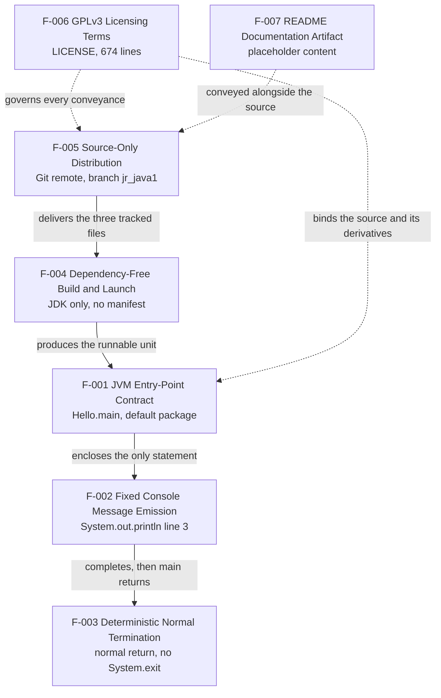

| Feature | Depends on | Nature of the dependency |
| --- | --- | --- |
| F-001 | F-004 | Sequential: a compiled class or a source-launched unit must exist before the JVM can bind `main` |
| F-002 | F-001 | Lexical containment: the `println` statement is the body of `main` and unreachable otherwise |
| F-003 | F-001, F-002 | Sequential: termination is the return of `main`, which follows the single write |
| F-004 | F-005 | Sequential: the source file must be obtained before it can be compiled or launched |
| F-005 | F-006 | Legal: conveyance through the Git channel is subject to the licence terms in the tree |
| F-006 | — | None; the terms stand independently of the code |
| F-007 | F-005 | Packaging: the README is one of the three files the channel delivers |

No other edge exists. In particular there is no runtime dependency between features — the program makes no call across module, service or process boundaries — and no feature is optional at runtime, since F-001 through F-003 are three aspects of the same five-line execution path.

### 2.3.2 Integration Points

The four integration points enumerated in Section 1.2.1.3 map onto the feature catalog as follows. No fifth integration point exists; the repository configures no database, broker, identity provider, HTTP service, monitoring platform, artifact repository, registry or orchestrator (Section 1.3.2.3).

| Integration point | Participating features | Contract | Evidence |
| --- | --- | --- | --- |
| JVM process contract | F-001, F-003, F-004 | Class exposes `public static void main(String[] args)`, resolvable by simple name; the argument array is accepted and ignored; the process is permitted to exit on normal return | `Hello.java` lines 1–4 |
| Standard output stream | F-002 | One line of ASCII text written to `System.out`; standard error unused; no other descriptor opened | `Hello.java` line 3 |
| Source distribution channel | F-005, F-007 | Three tracked root-level files on branch `jr_java1` of the `github.com/rjhonsi/BlitzyRepo2_Java` remote; revisions addressed by commit SHA | Git branch, remote, commit log and tracked-file list |
| Licensing interface | F-006 | GPLv3 Sections 0–17 bind recipients, redistributors and modifiers of the conveyed source and of any non-source form built from it | `LICENSE` lines 1–621 plus appendix at 623 |

### 2.3.3 Shared Components

| Shared component | Consuming features | Role in the relationship |
| --- | --- | --- |
| `Hello.java` (the single compilation unit) | F-001, F-002, F-003, F-004, F-005, F-006 | The one artifact every executable feature is realised in, the one input to the build, and the subject of the licence |
| The `main` method scope | F-001, F-002, F-003 | Lexical container that makes the emission reachable and whose return constitutes termination |
| Default-package namespace (no `package` declaration) | F-001, F-004 | Determines simple-name launch and enables single-file source launch |
| Git repository and branch `jr_java1` | F-005, F-006, F-007 | The container that keeps source, licence and documentation together as one conveyance |

No shared application-level component exists beyond these: there is no utility class, helper method, base class, interface, configuration holder or constant file, because the repository contains exactly one class with exactly one method.

### 2.3.4 Common Services

Every service the system relies on is external to the repository; none is implemented, wrapped or abstracted within it.

| Service | Provider | Consuming features | Notes |
| --- | --- | --- | --- |
| Standard output API (`System.out` / `PrintStream.println`) | JDK standard library, implicitly available from `java.lang` | F-002 | The only implementation dependency of the program; not vendored in the repository |
| Java compiler (`javac`) | Installed JDK | F-004 | Version unpinned; no toolchain descriptor exists |
| JVM launcher and process-exit semantics | Installed JDK | F-001, F-003, F-004 | Supports both the compile-then-run path and single-file source launch |
| Git transport and content storage | Hosted Git remote | F-005, F-006, F-007 | Sole distribution mechanism; no mirror, package index or release feed |

The following common services that a production system would typically share are **explicitly absent**, and their absence is itself a documented relationship constraint: no logging or telemetry service, no configuration or secrets service, no dependency-injection container, no validation or error-handling layer, no persistence or caching tier, and no test or quality-gate service. Each was verified absent by direct inspection of the three-file tree, matching the exclusion table in Section 1.3.2.1.

### 2.3.5 Cross-Feature Process Flow

The following flowchart traces the two supported operator paths through the features and names the requirement satisfied at each step. It is the requirement-level view of the system diagram in Section 1.2.2.2.

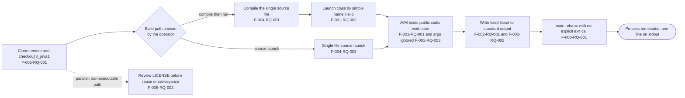


## 2.4 Implementation Considerations

The considerations below are properties of the artifacts as committed, or consequences that follow directly from them. Where the repository defines nothing — as is the case for every performance target — that is stated rather than substituted with a plausible figure.

### 2.4.1 Technical Constraints

| Feature | Technical constraint | Basis |
| --- | --- | --- |
| F-001 | The class is not namespaced: no `package` declaration and no `module-info.java`, so it cannot participate in the Java module system as-is and must be launched by the bare name `Hello`. The public class name and file name are coupled | `Hello.java` line 1; verified absence of `module-info.java` |
| F-001 | Behaviour cannot be varied through the invocation surface: the argument array is never read, so any parameterisation requires a source change | `Hello.java` lines 2–4 |
| F-002 | The message is a compile-time literal; altering it requires editing the source and recompiling. No charset is selected in code, and the literal is confined to ASCII characters | `Hello.java` line 3 |
| F-003 | No exit-status vocabulary and no signal or exception handling exist, so a caller can distinguish only normal completion from an uncaught throwable | `Hello.java` lines 2–4 (no `System.exit`, no `try`/`catch`) |
| F-004 | No Java version is pinned and no build script, task or documented command exists; the operator must supply the toolchain invocation. Single-file source launch stays valid only while the file remains self-contained | Verified absence of all build manifests and of `module-info.java`; `README.md` content |
| F-004 | No build-output directory convention is defined, and no `.gitignore` exists, so compiler output placed in the working tree appears as untracked content | Repository root inventory |
| F-005 | No tags or releases exist, so consumers must pin a commit SHA; line endings are unmanaged (`Hello.java` CRLF, `README.md` LF) with no `.gitattributes` to normalise them | Empty tag list; `cat -A` inspection of both files |
| F-006 | The appendix notice template cannot be completed from repository information: no copyright holder, year or contact address is recorded in any tracked file, and `Hello.java` carries no notice header | `LICENSE` lines 623–650; zero notice matches in `Hello.java` |
| F-007 | The README is not generated, validated or linked to anything; documentation content must be authored by hand before the build commands become discoverable | `README.md` (41 bytes, one sentence) |

### 2.4.2 Performance Requirements

No performance requirement, budget, benchmark or instrumentation exists anywhere in the repository; nothing in the code measures or reports anything about itself (Section 1.2.3.3). The table records the observed structural properties that bound runtime cost, derived from the source text — the program was not executed, since no JDK is installed in the inspection environment.

| Feature | Repository-defined target | Observed property bounding cost |
| --- | --- | --- |
| F-001 | None | Entry point performs no work before its single statement; no object instantiation, no static initialiser, no class loading beyond `Hello` and platform classes |
| F-002 | None | Exactly one stream write per process, of a 16-character constant; no formatting, no concatenation, no computation |
| F-003 | None | No loop, wait, sleep or blocking read, so execution is bounded by the one statement and the return |
| F-004 | None | Build input is one compilation unit of five lines (127 bytes) with zero dependencies to resolve and no network access |
| F-005 | None | Clone payload is three text files totalling 35,317 bytes |
| F-006, F-007 | Not applicable | Static text artifacts; no tooling reads them at build or run time |

Because the application performs one write and no computation, the dominant cost of any invocation is process and JVM startup rather than application work. No measurement of that cost exists in the repository, and none was taken here.

### 2.4.3 Scalability Considerations

| Feature | Scalability characteristic | Consequence |
| --- | --- | --- |
| F-001, F-002, F-003 | Fully stateless and single-threaded: no fields, no shared mutable state, no concurrency construct | Concurrent invocations are independent; the only contended resource is whatever sink the operator directs standard output to |
| F-002 | Output volume is fixed at one line per invocation, with no batching, streaming or looping mechanism | Throughput can only be increased by launching more processes, each paying full JVM startup |
| F-003 | Single-shot lifecycle with no listener, loop or scheduler | The program cannot be scaled as a long-running service; there is no request-handling path to scale |
| F-004 | The build has no incremental, parallel or cached stage, and nothing to resolve | Build time is bounded by compiling one file; introducing any dependency would first require introducing a build model, since none exists |
| F-005 | Distribution scales with the hosting remote alone; no mirror, artifact repository or CDN participates | Consumer growth is a hosting concern, not a repository one |

No horizontal-scaling, partitioning, queuing or load-balancing mechanism is present or configured, and nothing in the repository describes an intended scale target.

### 2.4.4 Security Implications

| Feature | Security implication | Evidence |
| --- | --- | --- |
| F-001, F-002 | No input is read from any source — arguments, environment, files, network or standard input — so the program presents no parsing, injection or deserialisation surface | `Hello.java` lines 2–4; verified absence of any file, network or configuration API usage |
| F-002 | Standard output is the only egress path and it carries a constant, so no data-exfiltration channel exists through normal operation | `Hello.java` line 3 |
| F-001, F-003 | No authentication, authorisation, privilege check or credential handling exists; the program runs entirely with the privileges of the launching operating-system user | Verified absence of any such construct; Section 1.3.1.2 |
| F-003 | With no exception handling, an uncaught throwable would surface the default JVM stack trace on standard error; no sanitised error response is defined | `Hello.java` lines 2–4 |
| F-004 | The supply-chain surface is limited to the installed JDK, since nothing is fetched at build time; however, no JDK version, distribution or checksum is pinned, so toolchain provenance rests entirely with the operator | Verified absence of manifests and toolchain descriptors |
| F-005 | The tree contains no credential, key, token or secrets file, and no `.gitignore` guards against committing local build output; access control is whatever the hosting remote enforces | Repository root inventory; no configuration or properties file exists |
| F-006 | Section 11 (line 471) governs patent grants and discriminatory patent licensing; Sections 15–17 (lines 589–620) disclaim warranty and limit liability. No security policy, vulnerability-reporting or `CODEOWNERS` file exists to define a disclosure path | `LICENSE`; repository root inventory |
| F-007 | The README discloses no host, credential, internal detail or contact address | `README.md` content |

### 2.4.5 Maintenance Requirements

| Feature | Maintenance requirement | Rationale |
| --- | --- | --- |
| All features | Verification is manual. With no automated test and no CI descriptor, every acceptance criterion in Section 2.2 must be executed by a person; this is the largest structural gap recorded in Section 1.2.3.2 | Verified absence of test sources, frameworks and `.github/` |
| F-001 | Renaming the class requires renaming the file in the same change, and any move into a named package changes the launch command for every consumer | Public class / file-name coupling; default package |
| F-002 | Changing the message is an edit-compile-verify cycle with no test to protect the expected value; the literal is the de facto contract for any consumer comparing output | `Hello.java` line 3; no test asserts the value |
| F-003 | Introducing a thread, loop or blocking call would invalidate F-003-RQ-002; introducing error handling would require defining an exit-status convention that does not exist today | `Hello.java` lines 2–4 |
| F-004 | Adding a first third-party dependency or a second compilation unit requires introducing a build manifest and, ideally, pinning a language level — neither exists to extend | Verified absence of all build manifests |
| F-005 | Line-ending normalisation would require adding `.gitattributes`; excluding build output would require adding `.gitignore`; release identification would require adopting tags | `cat -A` inspection; empty tag list |
| F-006 | The open gap in F-006-RQ-005 should be closed by recording a copyright holder and year and attaching the appendix notice to `Hello.java`; conveying compiled output additionally engages Section 6 obligations | `LICENSE` lines 245, 623–650; zero notice matches in `Hello.java` |
| F-007 | Making the system operable by a newcomer requires authoring real content — at minimum the compile and launch commands implied by F-004 — since the file currently states nothing specific | `README.md` content; Section 1.2.1.2 |


## 2.5 Traceability Matrix

### 2.5.1 Requirement-to-Artifact Traceability

Every requirement traces to an artifact location or to a verified absence. Status values distinguish what was confirmed by inspection from what would require executing the program — no JDK is installed in the inspection environment, so nothing was run.

| Requirement ID | Evidence location | Verification method | Status |
| --- | --- | --- | --- |
| F-001-RQ-001 | `Hello.java` line 2 | Source inspection; compile and launch to confirm entry-point binding | Satisfied in source; execution not performed |
| F-001-RQ-002 | `Hello.java` line 1; no `package` line in file | Source inspection; launch by simple name | Satisfied in source; execution not performed |
| F-001-RQ-003 | `Hello.java` lines 2–4 | Source inspection; compare output with and without arguments | Satisfied in source; execution not performed |
| F-001-RQ-004 | `Hello.java` lines 1–5 (class body contains only `main`) | Source inspection | Satisfied — verified statically |
| F-002-RQ-001 | `Hello.java` line 3 | Byte comparison of captured standard output against the literal | Satisfied in source; execution not performed |
| F-002-RQ-002 | `Hello.java` line 3 (single statement) | Line count of standard output; emptiness check of standard error | Satisfied in source; execution not performed |
| F-002-RQ-003 | `Hello.java` lines 2–4 (no input consulted) | Repeat runs under varied directory, environment and locale | Satisfied in source; execution not performed |
| F-002-RQ-004 | `Hello.java` line 3; no file, network or logging API in source | Source inspection | Satisfied — verified statically |
| F-003-RQ-001 | `Hello.java` lines 2–4; no `System.exit` present | Source inspection; observe exit status after the run | Satisfied in source; execution not performed |
| F-003-RQ-002 | `Hello.java` lines 2–4 (no loop, wait, thread or read) | Source inspection | Satisfied — verified statically |
| F-003-RQ-003 | `Hello.java` lines 2–4 (no `try`/`catch`/`finally`/`throws`) | Source inspection | Satisfied as documented current state |
| F-004-RQ-001 | Verified absence of `pom.xml`, `build.gradle`, `build.gradle.kts`, `settings.gradle`, `Makefile`, `build.xml` | Existence tests in repository root; offline compile of the single file | Satisfied structurally; compile not performed |
| F-004-RQ-002 | `Hello.java` (zero `import` statements); no manifest and no vendored library directory | Source inspection; existence tests for 24 candidate artifacts; file-type scan finding no `*.jar` | Satisfied — verified statically |
| F-004-RQ-003 | `Hello.java` (self-contained, no `package`, no dependency) | Source inspection; single-file source launch | Applicable in source; execution not performed |
| F-004-RQ-004 | `Hello.java` lines 2–4; no configuration or properties file in the tree | Source inspection; file-type scan finding no `*.properties`, `*.yml`, `*.yaml`, `*.xml`, `*.json` | Satisfied — verified statically |
| F-004-RQ-005 | Verified absence of build manifest, toolchain descriptor and `module-info.java` | Existence tests in repository root | Satisfied — verified statically |
| F-005-RQ-001 | Tracked-file list returns `Hello.java`, `LICENSE`, `README.md`; root has no subdirectories | `git ls-files`; root directory listing | Satisfied — verified |
| F-005-RQ-002 | No `*.class` or `*.jar` tracked or present in the working tree | Tracked-file list; recursive file-type scan | Satisfied — verified |
| F-005-RQ-003 | Tag list empty; commits `0726b1d`, `f1847fa`, `c537a19` | `git tag`; `git log` | Satisfied — verified |
| F-005-RQ-004 | `Hello.java` CRLF on all five lines; `README.md` LF; no `.gitattributes` | `cat -A` inspection; existence test | Satisfied as documented current state |
| F-006-RQ-001 | `LICENSE` lines 1–2, section headings at lines 73, 112, 154, 179, 195, 208, 245, 343, 407, 435, 446, 471, 540, 552, 563, 589, 600, 612; line 621; line 623 | Document inspection of the 674-line file | Satisfied — verified |
| F-006-RQ-002 | `LICENSE` Section 4, lines 195–203 | Inspection of any conveyed copy for the licence file and intact notices | Satisfied for this repository; downstream conveyance is the conveyer's obligation |
| F-006-RQ-003 | `LICENSE` Section 5, lines 208–222 | Diff review of a modified version for dated modification notices | Not exercised — no modified version exists in this repository |
| F-006-RQ-004 | `LICENSE` Sections 15–17, lines 589–620 | Document inspection for verbatim retention | Satisfied — verified |
| F-006-RQ-005 | `LICENSE` appendix lines 623–650; `Hello.java` contains zero copyright, licence or GPL references | Case-insensitive text search of the source file | **Not satisfied — open gap** |
| F-007-RQ-001 | `README.md` present at root and in the tracked-file list | Directory listing; `git ls-files` | Satisfied — verified |
| F-007-RQ-002 | `README.md`, 41 bytes, one LF-terminated sentence | Byte-level content inspection | Satisfied as documented baseline |

### 2.5.2 Feature-to-Specification Cross-Reference

| Feature | Related specification sections | Related diagram or flow |
| --- | --- | --- |
| F-001 | 1.1.1 (entry point), 1.2.1.3 (JVM process contract), 1.2.2.2 (major components), 1.3.1.1 (must-have capability) | Section 1.2.2.2 system diagram; Section 2.3.5 process flow |
| F-002 | 1.1.1, 1.2.2.1 (primary capability), 1.2.3.1 (output objective), 1.3.1.1 | Section 1.2.2.2 system diagram; Section 2.3.5 process flow |
| F-003 | 1.2.2.1, 1.2.3.1 (normal-termination objective), 1.3.1.1 | Section 2.3.5 process flow |
| F-004 | 1.2.2.3 (core technical approach), 1.2.3.1 (dependency-free objective), 1.3.1.1 (key technical requirements) | Section 2.3.1 dependency map; Section 2.3.5 process flow |
| F-005 | 1.1.1 (provenance), 1.2.1.3 (distribution channel), 1.3.1.1 (obtain-the-source workflow) | Section 2.3.1 dependency map |
| F-006 | 1.1.3 (redistributor obligations), 1.2.1.3 (licensing interface), 1.2.3.1, 1.3.1.1 | Section 2.3.1 dependency map; Section 2.3.5 review path |
| F-007 | 1.1.1 (artifact table), 1.2.1.2 (documentation limitation), 1.3.1.1 | Section 1.2.2.2 system diagram |

### 2.5.3 Coverage Summary

| Dimension | Value |
| --- | --- |
| Features catalogued | 7 (F-001 … F-007) |
| Functional requirements defined | 27 |
| Requirements traced to a specific artifact line or verified absence | 27 of 27 |
| Requirements satisfied as observed | 25 |
| Requirements documenting current state only (no positive obligation) | 1 (F-006-RQ-003, no modified version exists) |
| Requirements not satisfied (open gap) | 1 (F-006-RQ-005, missing per-file notice header) |
| Requirements whose criteria require program execution to confirm | 9 |
| Requirements covered by an automated test | 0 — no test source or framework exists |

| Priority | Count | Requirement IDs |
| --- | --- | --- |
| Must-Have | 19 | F-001-RQ-001…003, F-002-RQ-001…004, F-003-RQ-001, F-003-RQ-002, F-004-RQ-001, F-004-RQ-002, F-004-RQ-004, F-005-RQ-001, F-005-RQ-002, F-006-RQ-001…004, F-007-RQ-001 |
| Should-Have | 5 | F-001-RQ-004, F-004-RQ-003, F-004-RQ-005, F-005-RQ-003, F-006-RQ-005 |
| Could-Have | 3 | F-003-RQ-003, F-005-RQ-004, F-007-RQ-002 |

| Complexity | Count | Requirement IDs |
| --- | --- | --- |
| High | 0 | — |
| Medium | 1 | F-006-RQ-003 (requires notices authored by the modifier) |
| Low | 26 | All remaining requirements |


## 2.6 Assumptions, Constraints and Requirement Versioning

### 2.6.1 Documented Assumptions

The repository states no assumptions. Those below are the assumptions this section's requirements rest on, each with the consequence if it does not hold.

| Assumption | Why it is required | Consequence if untrue |
| --- | --- | --- |
| A standard JDK (compiler and launcher) is available in the target environment | It is the entire toolchain; nothing is vendored and no wrapper script exists | F-004 and, transitively, F-001 through F-003 cannot be exercised at all |
| Standard JVM semantics apply, so a normally returning `main` terminates the process with a zero status | The source sets no exit status and the program was not executed during inspection | F-003-RQ-001's acceptance criterion would need restating against the observed runtime |
| The operator already knows the compile and launch commands | `README.md` provides no instructions and no script encodes them | The system cannot be built or run by a newcomer without external knowledge |
| The literal `Hello from Java!` is the de facto output contract for any consumer | No test, schema or documented interface records the expected output | A change to the literal would silently break output comparisons downstream |
| The Git remote remains reachable and `jr_java1` remains the delivery branch | It is the single distribution channel; no mirror or artifact repository exists | F-005 has no alternative delivery path |
| The three tracked files constitute the complete system | Verified at commit `0726b1d`: three tracked files, no subdirectories, no submodule configuration | The feature catalog would be incomplete and would require re-derivation |

### 2.6.2 Constraints on the Requirement Set

| Constraint | Source of the constraint |
| --- | --- |
| Requirements may describe only the four integration points that exist — JVM process contract, standard output, Git distribution channel, licensing interface | Section 1.2.1.3; no other integration is stubbed or configured |
| No requirement may depend on configuration, arguments, environment, persistence, networking or user interface | All such capabilities are absent and listed as out-of-scope in Section 1.3.2.1 |
| No requirement may specify a numeric performance, availability or throughput target | No target, benchmark or instrumentation exists anywhere in the repository (Section 1.2.3.3) |
| Acceptance criteria are limited to static inspection and manual execution | No test source, framework or CI descriptor exists to automate them |
| The class must remain launchable by simple name | `Hello.java` declares no `package`, and no consumer-facing alternative is documented |
| All conveyance-related requirements are bounded by GPLv3 terms as written | The complete licence text is in the tree and is the only distribution instrument present |
| Requirements cannot reference a release version | The tag list is empty; revisions are addressable only by commit SHA |

### 2.6.3 Requirement Version Tracking

The repository contains no requirements document, changelog, tag or roadmap, so there is no prior requirement version to reconcile and no future version recorded. The baseline below is therefore anchored to the Git history itself.

| Version | Baseline | Scope of the version |
| --- | --- | --- |
| 1.0 | Commit `0726b1d` (2026-09-16), tip of branch `jr_java1` | All 27 requirements across F-001 … F-007 as documented in Section 2.2 |

| Commit | Date | Effect on the requirement set |
| --- | --- | --- |
| `c537a19` "Initial commit" | 2026-09-16 | Established the repository and the licensing artifact basis for F-006 |
| `f1847fa` "Add files via upload" | 2026-09-16 | Introduced `Hello.java`, the basis for F-001 through F-004 |
| `0726b1d` "Add initial README file with basic information" | 2026-09-16 | Introduced `README.md`, the basis for F-007; current baseline for version 1.0 |

Future versioning rule implied by the present state: because no tags exist, any revision of these requirements must be identified by the commit SHA that produced the change, and the traceability rows in Section 2.5.1 must be re-verified against that commit.

### 2.6.4 Change-Impact Rules

Derived directly from the dependencies in Section 2.3.1, these rules identify which requirements a given change would invalidate. They are stated so that a reviewer can tell, from the diff alone, which acceptance criteria must be re-executed.

| Change to the repository | Requirements invalidated or requiring re-verification |
| --- | --- |
| Editing the output literal on `Hello.java` line 3 | F-002-RQ-001 (byte comparison), and the output-invariance criterion of F-002-RQ-003 |
| Reading or acting on `args` | F-001-RQ-003, F-002-RQ-003 |
| Adding a `package` declaration or `module-info.java` | F-001-RQ-002, F-004-RQ-003 (single-file launch applicability), F-004-RQ-005 |
| Adding a `System.exit` call, loop, thread or blocking read | F-003-RQ-001, F-003-RQ-002 |
| Adding a first third-party dependency or a second compilation unit | F-004-RQ-001, F-004-RQ-002, and F-005-RQ-001 (tracked-file inventory) |
| Adding a build manifest, wrapper or CI descriptor | F-004-RQ-001, F-004-RQ-005, F-005-RQ-001 |
| Committing compiled output or a packaged artifact | F-005-RQ-002 |
| Adopting tags or releases | F-005-RQ-003, and the versioning rule in Section 2.6.3 |
| Adding `.gitattributes` or normalising line endings | F-005-RQ-004 |
| Altering any part of `LICENSE` | F-006-RQ-001 and, depending on the section touched, F-006-RQ-002 or F-006-RQ-004 |
| Adding notice headers and a copyright holder to the source | Closes the open gap in F-006-RQ-005 |
| Authoring real README content | F-007-RQ-002 baseline superseded; F-004's undocumented-command constraint (Section 2.4.1) relieved |


## 2.7 References

### 2.7.1 Repository Files Examined

- `Hello.java` - Read in full (5 lines, 127 bytes, all lines CRLF-terminated). Established F-001 (class `Hello`, `public static void main(String[] args)`, no `package` declaration, unused `args`, no fields/constructor/additional methods), F-002 (the single `System.out.println("Hello from Java!")` statement on line 3), F-003 (normal return with no `System.exit`, no `try`/`catch`, no loop or thread) and F-004 (zero `import` statements, self-contained compilation unit). A case-insensitive text search for copyright, licence and GPL references returned zero matches, establishing the open gap in F-006-RQ-005.
- `README.md` - Read in full (41 bytes, one LF-terminated sentence). Established F-007 and the absence of any build, run, usage or architecture guidance referenced in Sections 2.4.1 and 2.6.1.
- `LICENSE` - Inspected (674 lines, 35,149 bytes). Established F-006: licence title and "Version 3, 29 June 2007" at lines 1–2; numbered Sections 0–17 at lines 73, 112, 154, 179, 195, 208, 245, 343, 407, 435, 446, 471, 540, 552, 563, 589, 600 and 612; `END OF TERMS AND CONDITIONS` at line 621; the "How to Apply These Terms to Your New Programs" appendix from line 623, including the per-file notice template at lines 629–650. Sections 4, 5, 6, 10, 11, 12, 15, 16 and 17 supplied the compliance and validation rules in Sections 2.2.6 and 2.4.4.

### 2.7.2 Repository Folders Examined

- Repository root (folder path `""`) - Contained exactly three files and no subdirectories. Existence tests for 24 candidate artifacts (`pom.xml`, `build.gradle`, `build.gradle.kts`, `settings.gradle`, `Makefile`, `build.xml`, `module-info.java`, `.gitignore`, `.gitattributes`, `.editorconfig`, `Dockerfile`, `docker-compose.yml`, `package.json`, `requirements.txt`, `.github`, `.circleci`, `.travis.yml`, `Jenkinsfile`, `src`, `test`, `tests`, `target`, `out`, `bin`) all reported absence, and a recursive scan for `*.class`, `*.jar`, `*.properties`, `*.yml`, `*.yaml`, `*.xml` and `*.json` found no matches. This is the basis for F-004, F-005-RQ-002 and the "explicitly absent" common services in Section 2.3.4. No `.gitmodules` exists, confirming the three-file tree is complete.

### 2.7.3 Repository Metadata Examined

- Git metadata (branch, remote, commit log with author dates, tag list, tracked-file list) - Established F-005: branch `jr_java1`, remote `github.com/rjhonsi/BlitzyRepo2_Java.git`, exactly three tracked files, zero tags, and the three commits `c537a19`, `f1847fa` and `0726b1d` (all dated 2026-09-16) used as the version baseline in Section 2.6.3.
- Line-ending inspection of `Hello.java` and `README.md` - Established F-005-RQ-004: CRLF terminators on all five source lines versus an LF-terminated README, with no normalisation configuration present.
- Inspection-environment toolchain check - `javac` and `java` are not installed, so the program was not executed; this determines the "execution not performed" status values in Section 2.5.1.
- Semantic repository searches for build/dependency/test/CI files, for a console entry point, and for source/test/deployment folders - All returned no results, corroborating that the feature catalog is closed at seven entries.

### 2.7.4 Technical Specification Sections Referenced

- `1.1 Executive Summary` - Artifact inventory, stakeholder set and value-proposition statements used in the feature descriptions of Section 2.1.
- `1.2 System Overview` - Limitation matrix (1.2.1.2), the four integration points (1.2.1.3), the system component diagram (1.2.2.2), the technical approach (1.2.2.3), and the objectives and measurable-property baselines (1.2.3.1, 1.2.3.3) used for acceptance criteria and performance statements.
- `1.3 Scope` - Must-have capability rows and primary workflows (1.3.1.1), implementation boundaries (1.3.1.2) and the exclusion table (1.3.2.1) used to derive the feature set and to bound the requirement set in Section 2.6.2.
- `1.4 References` - Confirmed the evidence base and the absence of `.blitzyignore` path exclusions, independently re-verified for this section.

### 2.7.5 External Sources

No external source was consulted for this section. Every statement derives from the repository artifacts and metadata listed above; the GPLv3 terms cited are quoted from the `LICENSE` file in the tree rather than from an external publication.


# 3. Technology Stack

## 3.1 Programming Languages

This repository is single-language. An extension census across the entire working tree (excluding `.git`) returns exactly one `.java` file, one `.md` file and one extension-less legal text, and `git ls-files` returns the same three paths — so no second language exists in either tracked or untracked form, and no `.gitmodules` file exists to bring in vendored code from elsewhere.

Every statement below is anchored to an artifact in the tree or to the verified absence of one. Where the organisational default technology stack names a language that this repository does not contain, that is recorded as absent rather than asserted as present (Section 3.1.5).

### 3.1.1 Language Inventory by Component

| Component | Language / format | Artifact | Role in the system |
| --- | --- | --- | --- |
| Console application | Java | `Hello.java` (5 lines, 127 bytes) | Sole compilation unit: `public class Hello` with `public static void main(String[] args)`, emitting one line to `System.out` |
| Repository documentation | Markdown (by filename convention) | `README.md` (41 bytes) | One placeholder sentence; contains no Markdown constructs, so no Markdown feature is actually exercised |
| Licensing artifact | Plain text | `LICENSE` (674 lines) | Verbatim GNU GPL v3 text; no executable or interpreted content |
| Build, test and infrastructure automation | None | — | No script, task file or descriptor exists in any language |

Java is therefore the whole of the executable language surface, and it accounts for 100% of the five application source lines counted in Section 1.2.3.3. A per-extension probe across thirty-one candidate source, configuration and infrastructure extensions — `.py`, `.ts`, `.tsx`, `.js`, `.jsx`, `.swift`, `.kt`, `.kts`, `.m`, `.mm`, `.rb`, `.go`, `.rs`, `.c`, `.cpp`, `.cs`, `.php`, `.sh`, `.bat`, `.ps1`, `.sql`, `.tf`, `.yaml`, `.yml`, `.json`, `.xml`, `.properties`, `.toml`, `.ini`, `.cfg`, `.env` — returned zero matches, so there is no secondary scripting, query, markup-configuration or infrastructure language anywhere in the checkout.

### 3.1.2 Java Language Level and Compatibility Window

The repository pins no Java version. There is no build manifest, no toolchain descriptor and no `module-info.java` in which a language level, release target or source/target flag could be recorded, which is the same finding registered as a technical constraint against F-004 in Section 2.4.1 and as the "no declared language level" decision in Section 1.2.2.3.

The effective language level is therefore determined by the constructs the source actually uses, all three of which are Java platform baseline:

| Construct used in `Hello.java` | Location | Platform availability |
| --- | --- | --- |
| Top-level `public class` declaration, default (unnamed) package | line 1 | Baseline since JDK 1.0 |
| `public static void main(String[] args)` entry point | line 2 | Baseline since JDK 1.0 |
| `System.out.println(String)` via implicitly imported `java.lang` | line 3 | Baseline since JDK 1.0 |

A complementary scan for post-baseline constructs found none: no `var`, `record`, `sealed` or `yield`, no `import` or `package` declaration, no generics, no lambda arrow, no `try`/`catch`, and no Collections or Streams usage. Nothing in the file constrains the upper end of the compatibility window either, so the source compiles unchanged on every current JDK line.

#### 3.1.2.1 Toolchain Floor per Workflow

Because the syntax imposes no floor, the minimum JDK is set by which of the two workflows in Section 1.3.1.1 an operator chooses:

| Workflow | Minimum JDK required | Basis |
| --- | --- | --- |
| `javac Hello.java` followed by `java Hello` | Any JDK supplying the compiler and launcher | All constructs are platform baseline |
| `java Hello.java` (single-file source launch) | JDK 11, where single-file source-code launching was introduced (JEP 330) | Applicable only because the file is self-contained, declares no `package` and resolves no dependency (Section 2.1.5) |

Neither command is encoded in the repository — there is no script, task or README instruction that records them — so the choice of JDK, and therefore of language level, rests entirely with the operator. External platform context for that choice, as of this specification: Java 25 is the current long-term-support release (16 September 2025) and Java 21 the previous LTS, the supported LTS lines are 17, 21 and 25, and Java 26 reached general availability on 17 March 2026 as a non-LTS feature release. The source in this repository is compatible with all of them.

#### 3.1.2.2 Encoding and Line-Terminator Properties

`Hello.java` is pure ASCII (verified byte-wise), which makes both compilation and program output invariant to the platform default charset — a material property given that UTF-8 became the default charset for Java APIs in the Java 18 release line. No `-encoding` flag is therefore needed, and none is specified anywhere.

The file is stored with CRLF terminators on all five lines, while `README.md` uses a single LF; no `.gitattributes` exists to normalise the difference. The Java lexical grammar recognises CR, LF and CRLF alike as line terminators, so the CRLF storage has no effect on compilation — it is a tooling and diff-hygiene concern only, recorded against F-005 in Section 2.4.1 and Section 2.4.5.

### 3.1.3 Selection Criteria and Justification

The repository records no decision log, so the criteria below are reconstructed from the properties the choice of Java demonstrably delivers, each traced to observable evidence.

| Selection criterion | How Java as used here satisfies it | Evidence |
| --- | --- | --- |
| Zero dependency resolution | The only API called, `java.lang.System.out`, ships with the platform; the source declares no `import`, so no registry, credential or network access occurs at build time | `Hello.java` line 3; zero `import` statements; Section 2.1.5 (F-004) |
| Single, self-contained prerequisite | A standard JDK supplies compiler, launcher and library in one installation; nothing else must be provisioned | Assumption table, Section 2.6.1 |
| Stable, wrapper-free invocation contract | The JVM launcher binds directly to `public static void main(String[])`; no entry-point registration, manifest or configuration is needed | `Hello.java` line 2; Section 2.1.2 (F-001) |
| Deterministic, environment-independent behaviour | No argument, environment variable, file or stream is read, and the output literal is ASCII, so the emitted bytes are identical on every platform and locale | `Hello.java` lines 2–4; Section 2.4.4 |
| Declared project intent | The repository is named `BlitzyRepo2_Java`, the working branch is `jr_java1`, and commit `f1847fa` introduced `Hello.java` as the only executable content | Git remote, branch and commit metadata |

Reconciliation with the organisational default stack, whose primary backend language is Python: adopting it here would contradict three properties the current state guarantees. It would require introducing a dependency manifest and a build model that the repository does not have — Section 2.4.5 records that adding a first dependency or a second compilation unit requires first introducing a build manifest — it would dissolve the JVM entry-point contract that F-001 identifies as the system's only Critical runtime interface, and it would invalidate the tracked-file inventory that F-005 rests on. Java is consequently retained as the sole language, and the default stack's language choices are documented as not applicable to this repository.

### 3.1.4 Constraints and Dependencies Introduced by the Language Choice

| Constraint | Mechanism | Evidence |
| --- | --- | --- |
| The class must remain launchable by the simple name `Hello` | No `package` declaration and no `module-info.java`, so the class is not namespaced and cannot participate in the Java module system as-is | `Hello.java` line 1; Sections 2.4.1 and 2.6.2 |
| Class name and file name are coupled | The class is `public` and top-level, so a rename must change both in the same commit | `Hello.java` line 1; Section 2.4.5 |
| A full JDK is required, not merely a runtime | Compilation is part of every workflow, and from Java 11 onward a Java release consists solely of the JDK rather than shipping a separate JRE | Section 2.6.1 assumption; external platform context |
| Toolchain provenance is unmanaged | No JDK version, vendor or checksum is pinned anywhere, so the build-time supply-chain surface is whatever the operator installs | Verified absence of manifests and toolchain descriptors; Section 2.4.4 |
| Behaviour cannot be parameterised at the language boundary | The `args` array is accepted by signature and never read, so any variation requires a source edit and recompilation | `Hello.java` lines 2–4; Section 2.4.1 |
| Any future language or library addition is bound by GPL-3.0 | The tree carries the complete GNU GPL v3 (29 June 2007) as its only distribution instrument, so licence compatibility becomes a selection criterion for anything added | `LICENSE` lines 1–2; Section 2.1.7 (F-006) |

### 3.1.5 Default-Stack Languages Not Present

The default technology stack supplied as guidance names several languages. None is present in this repository, and each absence is directly verified rather than inferred.

| Default-stack language | Present in repository | Verification |
| --- | --- | --- |
| Python (default primary backend language) | No | Zero `*.py` files; no `requirements.txt` or `pyproject.toml` |
| TypeScript / JavaScript (default web and cross-platform) | No | Zero `*.ts`, `*.tsx`, `*.js`, `*.jsx` files; no `package.json` |
| Swift (default iOS) | No | Zero `*.swift` files |
| Kotlin (default Android) | No | Zero `*.kt` / `*.kts` files |
| Objective-C (default macOS) | No | Zero `*.m` / `*.mm` files |
| HCL (default infrastructure-as-code) | No | Zero `*.tf` files; no `terraform/` or `infra/` directory |

Because `git ls-files` returns exactly three paths, these absences are exhaustive rather than sampled: there is no location in the tracked tree where such a file could exist unobserved.

## 3.2 Frameworks &amp; Libraries

No application framework and no library outside the Java platform participate in this system. `Hello.java` declares zero `import` statements, there is no `lib/` directory, no `*.jar` or `*.class` file anywhere in the tree, and no dependency manifest exists in which a framework could be declared. The "framework" layer is consequently the Java platform itself, reached through implicitly available `java.lang` types.

### 3.2.1 Core Platform Framework

| Element | Value | Basis |
| --- | --- | --- |
| Application framework | None | No framework artifact, manifest or import exists |
| Platform framework in use | The Java SE platform class library, `java.base` module | `Hello.java` line 3 resolves `java.lang.System` and `java.io.PrintStream` |
| Version pinned by the repository | None | No manifest, toolchain file or module descriptor exists |
| Version supplied at build/run time | Whichever JDK the operator installs | Section 2.6.1 assumption; Section 2.4.4 |

The complete platform API surface consumed by the application is four elements wide, all of them in the `java.base` module that every JVM resolves by default — which is why no classpath entry, `--add-modules` flag or module path is needed anywhere:

| Platform API element | Package | How it is reached | Role |
| --- | --- | --- | --- |
| `java.lang.System` | `java.lang` | Implicitly imported; no `import` statement required | Exposes the `out` static field |
| `java.io.PrintStream` | `java.io` | Obtained as the type of `System.out`, never named in source | Provides `println` for the single write |
| `java.lang.String` | `java.lang` | Implicitly imported | Element type of the `args` parameter, which is accepted and never read |
| `java.lang.Object` | `java.lang` | Implicit superclass of `Hello` | Supplies the default no-argument constructor that is never invoked |

The layering below shows the complete stack — repository artifacts, the operator-supplied JDK toolchain, the platform module and the output sink. There is no tier between the application and the platform, which is the structural reason the system has no dependency-resolution step at all.

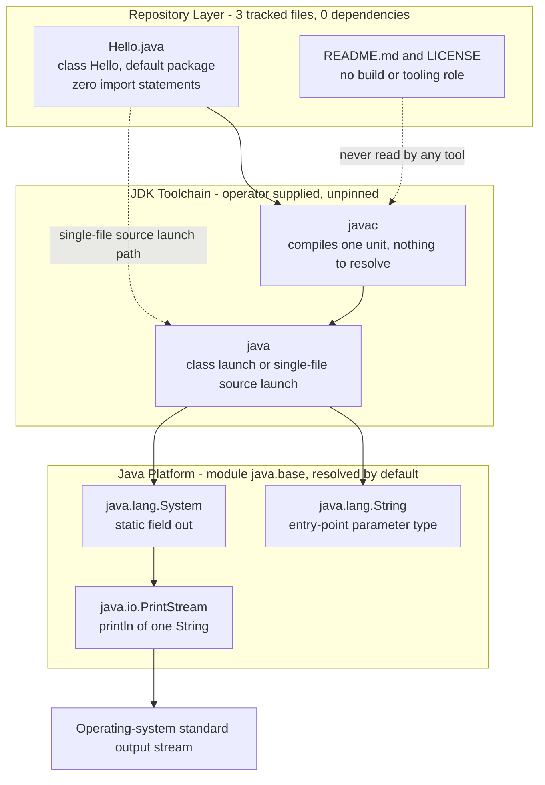

### 3.2.2 Supporting Libraries

There are none. Each category below was tested for directly, and the consequence of its absence is recorded because it shapes what the specification can claim elsewhere.

| Library category | Present | Verification | Consequence |
| --- | --- | --- | --- |
| Testing framework (JUnit, TestNG or other) | No | No test source, no `test/` directory, no dependency manifest; zero `*.jar` | Every acceptance criterion in Section 2.2 must be executed manually (Section 2.4.5) |
| Logging or observability library | No | Only statement in the method body is the `println` call; zero imports | No diagnostics, metrics or telemetry exist (Section 1.2.1.2) |
| Command-line argument parsing | No | `args` is never inspected | Behaviour cannot be varied through the invocation surface (Section 2.4.1) |
| Dependency injection or configuration binding | No | No fields, no constructor, no properties or configuration file of any extension | No configuration or input parameter is honoured (Section 1.2.3.3) |
| Serialisation, HTTP or data-access library | No | No network, file or database API is referenced anywhere in the source | The program presents no parsing or deserialisation surface (Section 2.4.4) |
| Assertion or validation utilities | No | No `assert` statement and no `try`/`catch` construct | Only normal completion versus an uncaught throwable is distinguishable (Section 2.4.1) |

### 3.2.3 Compatibility Requirements

The dependency-free design collapses the usual compatibility matrix to a single axis — the JDK — and even that axis is unconstrained by the code:

- **No inter-library compatibility to manage.** With zero third-party artifacts there is no transitive graph, no version conflict, no shading requirement and no lockfile to reconcile. This is the same zero-provisioning property recorded for F-004 in Section 2.1.5.
- **No framework-to-language lockstep.** Frameworks typically impose a minimum language level; none is imposed here, so the compatibility window described in Section 3.1.2 remains open across the supported LTS lines (17, 21, 25) and the current non-LTS release (26).
- **Forward compatibility rests on baseline APIs.** `System.out` and `PrintStream.println` are long-standing platform APIs carrying no deprecation marker, so no migration work is implied by moving the toolchain forward.
- **One compatibility risk is structural, not versioned.** Single-file source launch stays valid only while `Hello.java` remains self-contained; adding a second compilation unit or a `package` declaration ends that path, as recorded against F-004 in Section 2.4.1.

### 3.2.4 Justification for the Absence of a Framework

The default technology stack supplied as guidance names several frameworks. Each is absent here, and in each case the repository lacks the architectural surface the framework exists to serve — so introducing one would add a dependency graph, a build model and a resolution step to a system whose defining property (F-004) is having none.

| Default-stack framework | Present | Why it has no applicable surface in this repository |
| --- | --- | --- |
| Flask (web framework) | No | No HTTP endpoint, request handler, port binding or socket API appears anywhere; the program opens no network connection (Section 1.2.1.3) |
| React with TypeScript (web UI) | No | No user interface, no browser entry point, no `package.json`; the sole output channel is `System.out` |
| TailwindCSS (styling) | No | No markup or stylesheet asset of any kind exists in the tree |
| React Native (cross-platform mobile) | No | No mobile project structure, bundler configuration or native shell exists |
| ElectronJS (desktop shell) | No | No desktop packaging, window or renderer process exists |
| LangChain (AI orchestration) | No | No model client, prompt asset, embedding store or AI dependency is referenced |

The positive justification for the current shape is that it satisfies every objective in Section 1.2.3.1 without any of them: the source compiles under a bare JDK, emits exactly one deterministic line, terminates normally, and requires no dependency resolution. Adding a framework would not advance any of those objectives, and Section 2.4.5 records the cost precisely — a first third-party dependency forces the introduction of a build manifest and a pinned language level, neither of which exists to extend today.

## 3.3 Open Source Dependencies

The third-party dependency count for this system is zero, which is not an inference from a manifest but the absence of any manifest at all. This is the defining property of F-004 (Section 2.1.5) and the baseline figure recorded in Section 1.2.3.3.

### 3.3.1 Dependency Inventory

| Dependency | Version | Source | Status |
| --- | --- | --- | --- |
| Third-party / open-source libraries | — | — | None declared or vendored |
| Compiled artifacts of any origin | — | — | None: zero `*.jar` and zero `*.class` in the tree |
| Vendored or submoduled source | — | — | None: no `.gitmodules`, no `lib/` or `vendor/` directory |
| Java SE platform class library (`java.base`) | Operator-selected; not pinned | The installed JDK, not vendored in the repository | The only external code the program executes |

The single external code dependency is therefore the JDK itself, which Section 1.2.2.2 already identifies as a platform component that is "not vendored in the repository". Its licensing position is external context rather than a repository fact: reference OpenJDK builds are distributed free of charge under GPLv2 with the Classpath Exception, while Oracle JDK is a commercial, TCK-certified build of OpenJDK governed by the Oracle Lifetime Support Policy. Which of these an operator installs is unconstrained by anything in the tree.

### 3.3.2 Package Registries and Resolution

No package registry participates in this system at any lifecycle stage. Every artifact through which a registry could be configured was tested for individually and is absent:

| Registry / resolution artifact | Present | What its absence establishes |
| --- | --- | --- |
| `pom.xml`, `settings.xml`, `.mvn/wrapper/maven-wrapper.properties`, `mvnw` | No | No Maven coordinates, repository declaration or Maven Central resolution |
| `build.gradle`, `build.gradle.kts`, `settings.gradle`, `gradle.properties`, `gradlew` | No | No Gradle dependency block, plugin portal reference or wrapper-pinned distribution |
| `package.json`, `.npmrc` | No | No npm registry, scope or authentication configuration |
| `requirements.txt`, `pyproject.toml` | No | No PyPI resolution |
| Any lockfile (glob `*lock*`) | No | Nothing is version-locked, because nothing is resolved |
| `module-info.java` | No | No `requires` directive; only the default-resolved `java.base` module is used |

The consequence is stated in Section 2.4.2 for F-004: build input is one compilation unit of five lines with zero dependencies to resolve and no network access. A build therefore succeeds in a fully air-gapped environment, and no credential, proxy setting or mirror is required.

### 3.3.3 Open Source Licensing Posture

The repository is itself an open-source artifact, and the licence is the one deliberate technology-adjacent decision the history records:

| Aspect | Observed state | Evidence |
| --- | --- | --- |
| Project licence | GNU General Public License, Version 3, 29 June 2007, reproduced verbatim | `LICENSE` lines 1–2; 674 lines total |
| Completeness | Full text: FSF copyright notice, Preamble, Sections 0–17, end-of-terms marker and the "How to Apply These Terms" appendix | `LICENSE` lines 4, 8, 73–620, 621, 623 |
| Inbound dependency obligations | None currently engaged, since no third-party code is present; any future addition must be licence-compatible with GPL-3.0 | Section 2.1.7 (F-006); zero dependencies observed |
| Notice headers on source | Absent — `Hello.java` contains no occurrence of "copyright", "license" or "GPL" despite the appendix advising a per-file notice | `Hello.java` (zero notice matches); `LICENSE` lines 623–650 |

That last row is a real, observable gap rather than a stylistic remark, and it is already tracked as the open item against F-006 in Sections 2.4.1 and 2.4.5.

### 3.3.4 Dependency Governance and Supply-Chain Posture

No dependency-governance tooling exists, which is consistent with there being no dependencies to govern:

| Governance artifact | Present | Implication |
| --- | --- | --- |
| SBOM (`bom.xml`, `sbom.json`, `*.spdx*`, `*.cdx*`) | No | No machine-readable component inventory is published; the inventory is the three tracked files |
| Automated dependency updates (`renovate.json`, `dependabot.yml`, `.github/`) | No | No update or vulnerability-alert channel is configured |
| `SECURITY.md`, `CODEOWNERS` | No | No vulnerability-disclosure path or review ownership is defined (Section 2.4.4) |
| JDK version pinning (`.java-version`, `.sdkmanrc`, `.tool-versions`, `.mise.toml`) | No | Toolchain provenance rests entirely with the operator (Section 2.4.4) |

The resulting posture has one strength and one exposure, both already recorded in Section 2.4.4 and restated here in dependency terms. The strength is that nothing is fetched at build time, so the classic resolution-time attack surface — typosquatting, dependency confusion, compromised transitive releases, lockfile drift — does not exist for this repository. The exposure is that the single component the build does consume, the JDK, is not pinned by version, vendor or checksum anywhere in the tree, so the integrity of the toolchain is an environmental property rather than a repository-enforced one. Closing it would mean introducing a toolchain descriptor, which is the same prerequisite Section 2.4.5 identifies for adding a first dependency.

## 3.4 Third-Party Services

The application integrates with no third-party service at runtime. It opens no network connection, references no SDK or client library, and reads no endpoint, key or environment variable — the four integration points enumerated in Section 1.2.1.3 are the JVM process contract, the standard output stream, the source distribution channel and the licensing interface. Exactly one of those four is a hosted third-party service: the Git remote.

### 3.4.1 The One External Service in Use: Hosted Git Remote

| Attribute | Observed value | Evidence |
| --- | --- | --- |
| Service | GitHub, hosting the repository `rjhonsi/BlitzyRepo2_Java` | Git `remote.origin.url` |
| Role | Sole distribution channel for the system, delivered as source (F-005) | Section 2.1.6; `git ls-files` = 3 files |
| Refs published | `origin/main`, `origin/jr_java1`, with `origin/HEAD` tracking `main`; the local checkout is on `jr_java1` at commit `0726b1d` | Git branch and remote metadata |
| Revision addressing | Commit SHA only — the tag list is empty, so no release version exists to reference | `git tag` count = 0; Section 2.6.2 |

Two properties of this integration are worth recording because they bound what can be automated. First, `main` and `jr_java1` are identical at `0726b1d` — a diff between them reports no changes — so the branching topology carries no divergent delivery line. Second, no artifact repository, container registry or release pipeline participates, and none is configured, which Section 2.1.6 states as the integration requirement for F-005: a consumer's only supported acquisition path is a clone or checkout.

#### 3.4.1.1 Authentication to the Remote

The application itself performs no authentication of any kind — there is no credential handling, privilege check or identity concept in the source, and the program runs entirely with the privileges of the launching operating-system user (Section 2.4.4). Authentication exists only around the distribution channel: the local clone reaches the remote over HTTPS using a short-lived token-bearing remote URL, held in the clone's own `.git/config`, which is outside the tracked tree. The security-relevant consequence is the one Section 2.4.4 records for F-005 — no credential, key, token or secrets file exists among the three tracked files, so nothing secret is conveyed by a clone; access control is whatever the hosting remote enforces.

### 3.4.2 Service Categories Verified as Absent

Each category below was tested against the tree rather than assumed, and each entry names what was looked for.

| Service category | Present | Verification |
| --- | --- | --- |
| External / third-party APIs | No | No HTTP client, socket, URL or endpoint reference anywhere in the source; zero imports |
| Authentication or identity provider (e.g. the default-stack Auth0) | No | No SDK, client, callback URL, token handling or configuration file of any extension |
| Monitoring, APM, metrics or error tracking | No | No instrumentation, logging framework or telemetry exists; nothing in the code measures or reports anything about itself (Section 1.2.3.3) |
| Cloud platform services (the default stack names AWS) | No | No cloud SDK, credential file, region or service configuration; no `*.tf`, `terraform/` or `infra/` directory |
| Message broker, queue or event bus | No | No such client or configuration; the program has no request-handling or listening path (Section 2.4.3) |
| Email, notification or analytics services | No | No client, template or key material present |
| AI / LLM orchestration (the default stack names LangChain) | No | No model client, prompt asset or embedding dependency is referenced |

### 3.4.3 Integration Requirements and Security Implications

Because the runtime integration surface is empty, the integration requirements that do exist are process-level and contract-level rather than service-level:

- **JVM process contract.** The launcher must be able to resolve the class by the unqualified name `Hello` and bind `public static void main(String[] args)`; the process must be allowed to exit on its own, since no supervisor, restart policy or health probe is defined (Sections 2.1.2 and 2.1.4).
- **Standard output contract.** The invoking environment must supply a standard-output sink able to receive one line of ASCII text; nothing is written to standard error during normal operation, so output can be compared byte-for-byte without filtering (Section 2.1.3).
- **Distribution contract.** A Git client and read access to the remote are the prerequisites for obtaining the system; the operator pins a revision by SHA (Sections 2.1.6 and 2.6.2).
- **Licensing contract.** GPL-3.0 terms bind every conveyance performed through the remote and every modified version derived from `Hello.java` (Section 2.1.7).

The security implication of this shape, consistent with Section 2.4.4, is that the absence of third-party services removes whole classes of exposure by construction: there is no outbound egress beyond the one constant line on standard output, no inbound surface, no secret to rotate, no token to scope, and no vendor availability to depend on. The residual third-party risk is concentrated in two places only — the hosting remote's own access control, and the unpinned JDK the operator installs (Section 3.3.4).

## 3.5 Databases &amp; Storage

This system has no database, no persistence layer, no cache and no storage service. The finding is structural rather than incidental: the application holds no state at all, so there is nothing for a store to hold. `Hello.java` declares no fields, no static state and no explicit constructor, references no file, stream or network API beyond `System.out`, and its single statement writes a compile-time constant.

### 3.5.1 Database and Persistence Inventory

| Layer | Observed state | Verification |
| --- | --- | --- |
| Primary database | None | No driver, client, connection string, DSN or credential appears anywhere; zero imports |
| Secondary / analytical store | None | Same verification; no second data path exists |
| Schema, migrations or seed data | None | Zero `*.sql` files; no migration directory or tool configuration |
| ORM or data-access layer | None | No entity, mapper, repository or DAO type; `Hello` is the only class |
| File-based persistence | None | No file, path, temp-directory or serialisation API is referenced |
| Configuration store | None | No `*.properties`, `*.yml`, `*.yaml`, `*.json`, `*.toml`, `*.ini` or `.env` file exists in the tree |

The default technology stack names MongoDB as its database. No MongoDB driver, URI, container definition or configuration file exists in this repository, so it is recorded as absent. Introducing any store would first require the prerequisite Section 2.4.5 identifies — a build manifest to declare the driver dependency, which does not exist to extend — and would end the determinism property that Section 2.6.1 lists as an assumption underpinning the current acceptance criteria.

### 3.5.2 State and Data-Flow Inventory

Rather than a persistence strategy, the system has a complete and very short state inventory. Each row below is what the architecture actually manages:

| State category | Mechanism | Lifetime |
| --- | --- | --- |
| Application data | The single compile-time literal `Hello from Java!` — 16 characters, ASCII, compiled into the class file | Fixed at compile time; immutable thereafter |
| Heap / instance state | None: no object is instantiated, no field is declared, `args` is referenced only by signature and never read | Not applicable |
| Class / static state | None: no static field and no static initialiser exists | Not applicable |
| Emitted data | One line written to `System.out` | Transient; owned entirely by the invoking environment's sink |
| Durable artifact storage | The Git object store — three text files totalling 35,317 bytes, held on the remote and in each clone (the checkout measures 256 KB including history) | Durable, versioned by commit SHA |

The only durable storage in the entire lifecycle is therefore version control itself, which is the source-only distribution model recorded as F-005. Nothing the program does at runtime reaches durable media.

### 3.5.3 Caching

No caching solution is present or configured: there is no cache library, no in-memory cache structure, no cached-computation path and no configuration file in which a cache could be tuned. Whatever internal caching the JVM performs is a property of the operator's chosen runtime, not something this repository configures or depends upon — and with a single constant write and no computation, there is no repeated work for a cache to eliminate. Section 2.4.2 records the corresponding cost profile: the dominant cost of any invocation is process and JVM startup rather than application work.

### 3.5.4 Storage Services and Data-Handling Implications

| Storage service category | Present | Verification |
| --- | --- | --- |
| Object storage (e.g. the default stack's AWS services) | No | No cloud SDK, bucket reference, region or credential configuration |
| Block or volume storage | No | No container or orchestration definition exists in which a volume could be declared |
| Artifact or package repository | No | No publication step, and no artifact is produced or tracked — zero `*.jar` and zero `*.class` in the tree |
| Log or archive storage | No | No logging framework and no file output; the program writes only to standard output |

The data-handling consequences follow directly and match Section 2.4.4. Because nothing is read from any source — arguments, environment, files, network or standard input — the system presents no parsing, injection or deserialisation surface. Because nothing is written to durable media, there is no data-at-rest concern: no encryption requirement, no retention or backup policy, no residency question and no personal data anywhere in scope. And because the sole egress path carries a constant, standard output cannot function as a data-exfiltration channel during normal operation.

## 3.6 Development &amp; Deployment

The repository encodes no development, build, packaging or deployment automation. Everything in this sub-section is therefore either an artifact that exists (the Git history and the source file), a command the operator must supply from outside the repository, or a verified absence whose consequence is recorded.

### 3.6.1 Development Tooling

| Tool category | Required by the system | Pinned by the repository |
| --- | --- | --- |
| Java Development Kit (compiler and launcher) | Yes — it is the entire toolchain (Section 2.6.1) | No: no `.java-version`, `.sdkmanrc`, `.tool-versions`, `.mise.toml` or manifest |
| Git client | Yes — the clone is the only acquisition path (Section 2.1.6) | No minimum version is stated or enforced |
| Editor / IDE configuration | No | Absent: no `.editorconfig`, `.vscode/` or `.idea/` |
| Reproducible dev environment | No | Absent: no `.devcontainer/` or `devcontainer.json` |
| Formatter, linter or static analysis | No | Absent: no configuration file of any kind exists in the tree |
| Commit-time hooks | No | Absent: no `.pre-commit-config.yaml`; no tracked hook scripts |

A practical note on verification scope: the program was not executed while preparing this specification, because no JDK is installed in the inspection environment — the same limitation recorded in Sections 1.2.2.1 and 2.1.4. All behavioural statements rest on the source text.

### 3.6.2 Build System

There is no build system. Direct existence tests confirm the absence of `pom.xml`, `build.gradle`, `build.gradle.kts`, `settings.gradle`, `build.xml`, `Makefile`, `CMakeLists.txt`, and of the `mvnw` and `gradlew` wrappers that would otherwise pin a build-tool distribution. The build is a single compiler invocation over one compilation unit with nothing to resolve, and it is not encoded anywhere in the repository — not as a script, not as a task, and not as a README instruction.

```bash
javac Hello.java    # one compilation unit, zero dependencies to resolve
java Hello          # emits: Hello from Java!
```

The equivalent single-step path, valid because the file is self-contained and declares no `package`, skips the explicit compile stage:

```bash
java Hello.java     # single-file source launch, JDK 11 and later
```

Three build-related constraints follow from the current state, each already registered against F-004 in Section 2.4.1:

- **No output-directory convention.** Compiler output lands in the working directory by default, and with no `.gitignore` present a generated `Hello.class` appears as untracked content in the tree. No compiled artifact exists in the checkout today, and the working tree is clean.
- **No language level and no toolchain pinning.** The build result depends on whichever JDK is installed, which is the provenance exposure described in Section 3.3.4.
- **Single-file launch is conditionally valid.** Adding a second compilation unit or a `package` declaration removes that path, changing the documented developer workflow.

### 3.6.3 Containerization

No containerization exists. `Dockerfile`, `docker-compose.yml` and `.dockerignore` are all absent, as is any orchestration manifest directory (`k8s/`), and no `*.yaml`/`*.yml` file of any kind exists in the tree. The default technology stack names Docker; it is not present here.

Two consequences are worth documenting because they affect any future adoption. First, the system has no packaged artifact to place in an image — there is no JAR, no manifest and no compiled class tracked in the repository (Section 1.2.1.2) — so an image definition would have to carry both the build and the run stage. Second, a base image is itself a pinned JDK, so containerizing would implicitly resolve the unpinned-toolchain exposure in Section 3.3.4 while introducing a registry dependency that Section 2.1.6 records as absent from the distribution model.

### 3.6.4 CI/CD

No continuous integration or delivery exists. There is no `.github/` directory, no `.circleci/`, no `Jenkinsfile`, no `.travis.yml` and no `.gitlab-ci.yml`; the default stack's GitHub Actions is therefore absent, even though the repository is hosted on GitHub (Section 3.4.1), which is where such a workflow would naturally reside. The consequence is stated in Section 1.2.1.2: no gate exists on commits, and correctness relies on manual inspection — the structural gap Section 1.2.3.2 identifies as the largest in the current state.

The requirements a pipeline would have to encode are already fully specified by the documented objectives, so they are recorded here rather than invented:

| Pipeline stage | What it must do | Source of the requirement |
| --- | --- | --- |
| Checkout | Clone the remote and check out a revision by SHA, since no tag exists | Sections 2.1.6 and 2.6.2 |
| Toolchain provisioning | Select and pin a JDK, because the repository pins none | Sections 2.4.1 and 2.4.4 |
| Compile | Compile the single unit and require success with no dependency resolution and no network access | Section 1.2.3.1 |
| Verify | Capture standard output and compare it byte-for-byte with the literal `Hello from Java!`, then assert normal termination | Sections 1.2.3.1 and 2.2 |

Note that the last stage is what a pipeline would automate, not something the repository currently provides: there is no test source, no test framework and no assertion anywhere in the tree.

### 3.6.5 Version Control and Delivery Process

| Aspect | Observed state | Evidence |
| --- | --- | --- |
| History | Three commits, all dated 2026-09-16, all by a single author: `c537a19` (LICENSE), `f1847fa` (`Hello.java`), `0726b1d` (`README.md`) | Git log |
| Branches | `main` and `jr_java1`, identical at `0726b1d`; `jr_java1` is the checked-out delivery branch | Git branch metadata; empty diff between the two |
| Releases | None — zero tags, so consumers must pin a commit SHA | `git tag` count = 0; Section 2.6.3 |
| Repository governance | No `CODEOWNERS`, `CONTRIBUTING.md`, `SECURITY.md` or `CHANGELOG.md` | Direct existence tests |
| Line-ending management | Unmanaged: `Hello.java` is stored CRLF, `README.md` LF, with no `.gitattributes` | Byte-level inspection; Section 2.4.1 |
| Repository footprint | Three tracked text files totalling 35,317 bytes; 256 KB checkout including history | File sizes; checkout measurement |

### 3.6.6 End-to-End Lifecycle

The diagram below is the complete lifecycle: what is configured (acquisition and a manual local build) and what is verifiably absent (automation, packaging, imaging and deployment). Dotted edges into the absent group indicate stages the repository does not define.

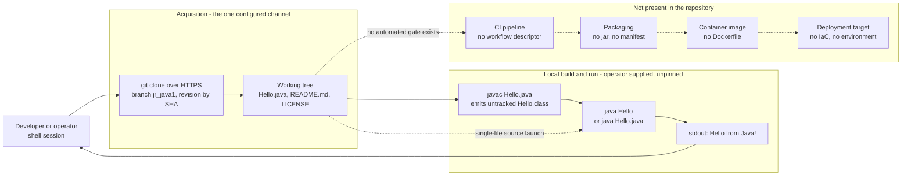

Deployment, in the sense the term normally carries, does not exist for this system: there is no environment, no infrastructure definition (no Terraform or other IaC, matching Section 3.1.5), no runtime host and no published artifact. Delivery is complete when a consumer clones the source; execution is entirely operator-side and leaves no deployed footprint.

## 3.7 References

### 3.7.1 Repository Files Examined

- `Hello.java` - Established the entire executable technology surface: single `public class Hello` in the default package, `public static void main(String[] args)` entry point, one `System.out.println("Hello from Java!")` statement, zero `import` declarations, no fields or constructor, pure ASCII content, CRLF line terminators, 5 lines / 127 bytes.
- `README.md` - Established the documentation format (Markdown by filename only) and the absence of any build, run or toolchain instruction: one 40-character sentence terminated by a single LF, 41 bytes.
- `LICENSE` - Established the project licence as the verbatim GNU General Public License Version 3, 29 June 2007 (674 lines, FSF copyright, Preamble, Sections 0–17, end-of-terms marker and the "How to Apply These Terms" appendix), which governs future dependency selection and conveyance.

### 3.7.2 Repository Folders Examined

- `` (repository root) - Contained the complete tracked inventory: exactly three files and no subdirectories, confirming that the language, framework, dependency and tooling absences documented above are exhaustive rather than sampled.

### 3.7.3 Repository Metadata and Verification Performed

- Git tracked-file list (`git ls-files`) - Confirmed the three-file inventory and the absence of vendored or generated artifacts.
- Git history, branch and remote metadata - Established the three commits (`c537a19`, `f1847fa`, `0726b1d`, all 2026-09-16, single author), the identical `main` and `jr_java1` branches, the empty tag list, and GitHub as the sole hosted distribution service.
- Extension census and per-extension probes across the working tree - Established that only `.java`, `.md` and one extension-less file exist, and that all thirty-one probed source, configuration and infrastructure extensions (including `.py`, `.ts`, `.tsx`, `.js`, `.swift`, `.kt`, `.m`, `.tf`, `.yaml`, `.json`, `.xml`, `.properties`, `.sql`) have zero matches.
- Direct existence tests for build, dependency, container, CI, toolchain and governance artifacts - Established the absence of `pom.xml`, `build.gradle`(`.kts`), `settings.gradle`, `gradle.properties`, `gradlew`, `mvnw`, `settings.xml`, `build.xml`, `Makefile`, `CMakeLists.txt`, `package.json`, `.npmrc`, `requirements.txt`, `pyproject.toml`, `Dockerfile`, `docker-compose.yml`, `.dockerignore`, `.github/`, `.circleci/`, `Jenkinsfile`, `.travis.yml`, `.gitlab-ci.yml`, `module-info.java`, `MANIFEST.MF`, `.gitignore`, `.gitattributes`, `.editorconfig`, `.java-version`, `.sdkmanrc`, `.tool-versions`, `.mise.toml`, `renovate.json`, `dependabot.yml`, SBOM and lockfiles, `CODEOWNERS`, `SECURITY.md`, `CONTRIBUTING.md`, `CHANGELOG.md`, `.pre-commit-config.yaml`, `.devcontainer/`, `.vscode/`, `.idea/`, `Hello.class`, `.gitmodules`, and the `src/`, `test/`, `lib/`, `bin/`, `target/`, `build/`, `out/`, `docs/`, `infra/`, `terraform/`, `k8s/` directories.
- Byte-level inspection of source files - Established ASCII-only content, CRLF terminators in `Hello.java` versus LF in `README.md`, and the 35,317-byte tracked total against a 256 KB checkout.
- Inspection-environment toolchain check - Established that no JDK (`javac`/`java`) and no build tool are installed where this specification was prepared, so no behaviour was executed; Git 2.43.0 was used for metadata only, and the working tree was left clean.
- Semantic repository searches for build, dependency and CI artifacts, and for source, tooling or infrastructure folders - Both returned no results, corroborating the absences above.

### 3.7.4 Technical Specification Sections Cross-Referenced

- `1.2 System Overview` - Supplied the four integration points, the standard-library-only technical approach, the "no declared language level" decision, and the baseline metrics (1 source file, 5 lines, 0 dependencies, 0 tests, 3 tracked files).
- `2.1 Feature Catalog` - Supplied the feature identifiers this section aligns to, in particular F-001 (JVM Entry-Point Contract), F-004 (Dependency-Free JDK-Only Build and Launch), F-005 (Source-Only Distribution via Git Remote) and F-006 (GPLv3 Licensing and Redistribution Terms).
- `2.4 Implementation Considerations` - Supplied the toolchain constraints, the unpinned-JDK supply-chain implication, the cost profile dominated by JVM startup, and the maintenance prerequisite that a first dependency forces a build manifest.
- `2.6 Assumptions, Constraints and Requirement Versioning` - Supplied the JDK-availability assumption, the simple-name launch constraint, the SHA-only revision addressing, and the GPLv3 conveyance bound.

### 3.7.5 External Sources

- [web] openjdk.org, JDK 26 project page - Confirmed JDK 26 reached General Availability on 17 March 2026.
- [web] Wikipedia, Java version history - Confirmed Java 26 released 17 March 2026 and Java 25 LTS released 16 September 2025.
- [web] JRebel, Java LTS overview - Confirmed the currently supported LTS lines are Java 17, Java 21 and Java 25, and that Java 27 is scheduled for September 2026.
- [web] endoflife.date, Oracle JDK - Confirmed the six-month feature cadence with a new LTS every two years since JDK 17, and that Oracle JDK is a commercial, TCK-certified build of OpenJDK.
- [web] House of Brick, Java versions and LTS schedule - Confirmed that OpenJDK builds are distributed free under GPLv2 with the Classpath Exception.
- [web] CodeJava, Java SE versions history - Confirmed that UTF-8 became the default charset for Java APIs in the Java 18 release line, relevant to the ASCII-only invariance of this repository's output.

# 4. Process Flowchart

## 4.1 System Workflows

The entire executable surface of this repository is `Hello.java` — one public class, one `main` method, one statement. The working tree contains exactly three tracked files (`Hello.java`, `LICENSE`, `README.md`), no sub-directories, and no build, orchestration, service or scheduling descriptor of any kind. Consequently the workflows documented here are not application workflows in the transactional sense; they are the **toolchain and conveyance workflows that surround a single one-shot process**, plus the licence-driven process that governs redistribution.

Two facts frame everything below:

- **Nothing in the repository encodes a workflow.** There is no script, task, pipeline, Makefile target or README instruction. Every command in this section is one an operator must supply from outside the repository, consistent with Section 3.6.2.
- **The behaviour in this section was confirmed by execution.** Sections 1.2.2.1, 2.1.4 and 3.6.1 record that no JDK was available when they were prepared, so their runtime statements rest on the source text. For this section a JDK was provisioned into the inspection environment — `openjdk version "21.0.12"`, `javac 21.0.12` — and every flow, exit code, message and duration reported below was observed by running the program against a scratch copy of `Hello.java`. The repository itself still pins no JDK version (Section 3.6.1), so these are observations under one runtime, not a repository-declared contract.

### 4.1.1 Core Business Processes

#### 4.1.1.1 Workflow Inventory

Five workflows are evidenced by the artifacts. Identifiers `WF-01` … `WF-05` are introduced by this section for traceability; the features and requirements they realise are those catalogued in Sections 2.1 and 2.2.

| ID | Workflow | Trigger | Primary actor | Features / requirements | Terminal state |
| --- | --- | --- | --- | --- | --- |
| WF-01 | Source acquisition | Operator needs the program | Operator + Git remote | F-005 / F-005-RQ-001, RQ-003 | Working tree of 3 files at a chosen commit SHA |
| WF-02 | Compile-then-run | Operator has the working tree | Operator + JDK | F-004 / RQ-001; F-001; F-002; F-003 | One line on stdout, process exit 0, `Hello.class` left on disk |
| WF-03 | Single-file source launch | Operator has the working tree | Operator + JDK | F-004 / RQ-003 | One line on stdout, process exit 0, no artifact written |
| WF-04 | Licence review and conveyance | Operator intends to reuse or redistribute | Operator (manual) | F-006 / RQ-001, RQ-002, RQ-004 | Conveyance carrying `LICENSE` and intact notices |
| WF-05 | Modify and redistribute | Operator edits `Hello.java` | Operator (manual) | F-006 / RQ-003, RQ-005; F-004-RQ-002 | Modified work licensed as a whole under GPLv3 |

WF-02 and WF-03 are mutually exclusive alternatives for the same outcome, not stages of one pipeline. WF-04 and WF-05 have no executable component anywhere in the repository — no licence scanner, header check or compliance gate exists (Section 2.2.6) — so they are entirely manual document-driven processes.

#### 4.1.1.2 High-Level System Workflow

The following diagram is the complete end-to-end journey with swim lanes for each actor and system boundary. Every gate shown was exercised during verification; the exit statuses annotated on the failure edges are observed values.

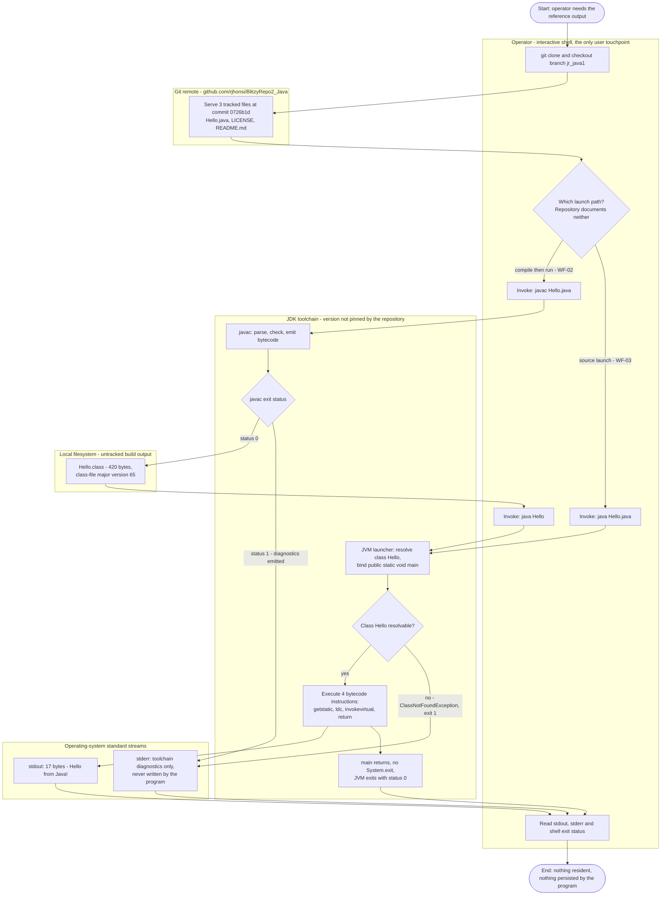

#### 4.1.1.3 WF-02 Detailed Process Flow — Compile-Then-Run

This is the repository's principal process. Each failure branch carries the exact diagnostic and exit status observed during verification.

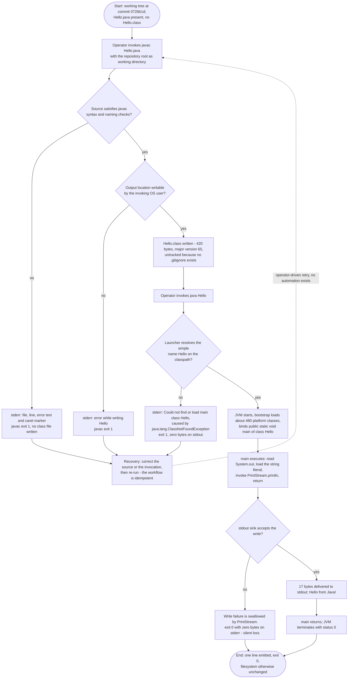

| Step | Action | Observed result | Requirement |
| --- | --- | --- | --- |
| 1 | `javac Hello.java` | Exit 0, empty stdout and stderr, `Hello.class` produced (420 bytes) | F-004-RQ-001 |
| 2 | Inspect class file | `public class Hello`, minor 0, **major 65**, flags `ACC_PUBLIC, ACC_SUPER`, superclass `java/lang/Object` | F-004-RQ-005 |
| 3 | `java Hello` | `Hello from Java!` on stdout (17 bytes), exit 0, stderr empty | F-002-RQ-001, F-002-RQ-002 |
| 4 | `java Hello alpha beta 42` | Byte-identical output, exit 0 — arguments have no effect | F-001-RQ-003 |
| 5 | Repeat 5 times; vary `LANG`/`LC_ALL` (`C`, `ja_JP.UTF-8`) | Exactly one unique output line across all runs | F-002-RQ-003 |
| 6 | Compare filesystem before/after run | Identical — the program writes no file | F-002-RQ-004 |

The compiled body is four bytecode instructions (`getstatic` on `java/lang/System.out`, `ldc` of the string literal, `invokevirtual` on `java/io/PrintStream.println`, `return`), which is the mechanical confirmation that no branch, loop, retry, wait or error handler exists in the process (F-003-RQ-002, F-003-RQ-003).

#### 4.1.1.4 WF-03 Variant Flow — Single-File Source Launch

`java Hello.java` collapses steps 1–3 into one invocation. Verification confirmed the defining property: the directory listing was byte-for-byte identical before and after the run, so **no class file is persisted** — the compiled form exists only in memory.

| Aspect | WF-02 (compile then run) | WF-03 (source launch) |
| --- | --- | --- |
| Invocations | Two (`javac`, then `java`) | One (`java Hello.java`) |
| Artifact left on disk | `Hello.class`, untracked | None |
| Measured wall clock | 336–348 ms compile + 29–30 ms run | 344 ms total |
| Repeat-run cost | Compile once, then 29 ms per run | Full 344 ms every run |
| Validity condition | Always | Only while the file stays self-contained with no `package` declaration (Section 3.6.2) |

#### 4.1.1.5 Decision Points

Six decision points exist across the workflows. None is implemented by repository code: five are enforced by the JDK or the operating system, and one is a free operator choice the repository gives no guidance on.

| ID | Decision | Evaluated by | Criterion | Observed outcomes |
| --- | --- | --- | --- | --- |
| DP-1 | Launch path: compile-then-run or source launch | Operator | None documented — `README.md` carries no instruction (F-007-RQ-002) | Both paths verified working |
| DP-2 | Does the source compile? | `javac` | Java language syntax plus the rule that a public class must live in a file of the same name | Exit 0 on the committed source; exit 1 on an induced syntax error and on a renamed file |
| DP-3 | Is the output destination writable? | OS permissions via `javac` | Write permission of the invoking user on the output directory | Exit 1 with `error while writing Hello` when the target directory was mode 555 for the invoking user |
| DP-4 | Is class `Hello` resolvable? | JVM launcher | Exact, case-sensitive simple name on the classpath | Exit 1 `ClassNotFoundException` when the class file was absent and when the name case differed (`java hello`) |
| DP-5 | Does the stdout sink accept the write? | `PrintStream` / OS | Underlying stream write success | **Failure is not surfaced**: writing to a full device returned exit 0 with zero bytes on stderr |
| DP-6 | Conveyance form: source, non-source, or modified | Operator (manual) | GPLv3 Sections 4, 5 and 6 as reproduced in `LICENSE` | No automated check exists; see WF-04/WF-05 below |

#### 4.1.1.6 System Interactions and User Touchpoints

| Interaction | Direction | Mechanism | Payload observed |
| --- | --- | --- | --- |
| Operator → Git remote | Outbound clone/fetch | Git over HTTPS to `github.com/rjhonsi/BlitzyRepo2_Java` | 3 tracked files, 35,317 bytes; 0 tags, so a commit SHA identifies the revision |
| Operator → JDK | Process invocation | Shell command line | One file path or one class name |
| JDK → filesystem | Write | Compiler output | `Hello.class`, 420 bytes |
| JVM → program | Entry-point binding | `public static void main(String[] args)` | Argument array supplied and never read |
| Program → OS | Write | `System.out` (`java.io.PrintStream`) | 17 bytes, one line, ASCII |
| Program → shell | Process exit status | JVM normal termination | 0 |

There is exactly **one user touchpoint**: an interactive shell session. No graphical interface, HTTP endpoint, CLI argument parser, configuration file, environment variable or interactive prompt participates — the program reads no input at all (F-001-RQ-003, F-004-RQ-004).

#### 4.1.1.7 Error Handling Paths in the Core Process

All observed failures originate outside the program — in the compiler, the launcher, or the OS — because the source declares no `try`, `catch`, `finally` or `throws` (F-003-RQ-003). Every failure is terminal for the invocation; there is no in-process degradation, partial success or compensating action. The full catalogue, with exact messages and recovery procedures, is in Section 4.3.2.

| Path | Stage | Terminal status | Program-side handling |
| --- | --- | --- | --- |
| Compile diagnostics (syntax, naming) | Build | `javac` exit 1 | Not applicable — no class produced |
| Output write failure | Build | `javac` exit 1 | Not applicable |
| Class resolution failure | Launch | `java` exit 1, stdout empty | None — the program never starts |
| Launcher usage error (no main class named) | Launch | `java` exit 1 with usage text | None |
| Toolchain absent | Pre-build | Shell exit 127 | None |
| stdout write failure | Run | **Exit 0, stderr empty** | None — the failure is silently discarded |

#### 4.1.1.8 WF-04 / WF-05 — Conveyance and Modification Process

These workflows are driven entirely by the 674-line GPLv3 text in `LICENSE`. They have no automation, no tooling and no gate; the decision diamonds are judgements an operator makes by reading the document.

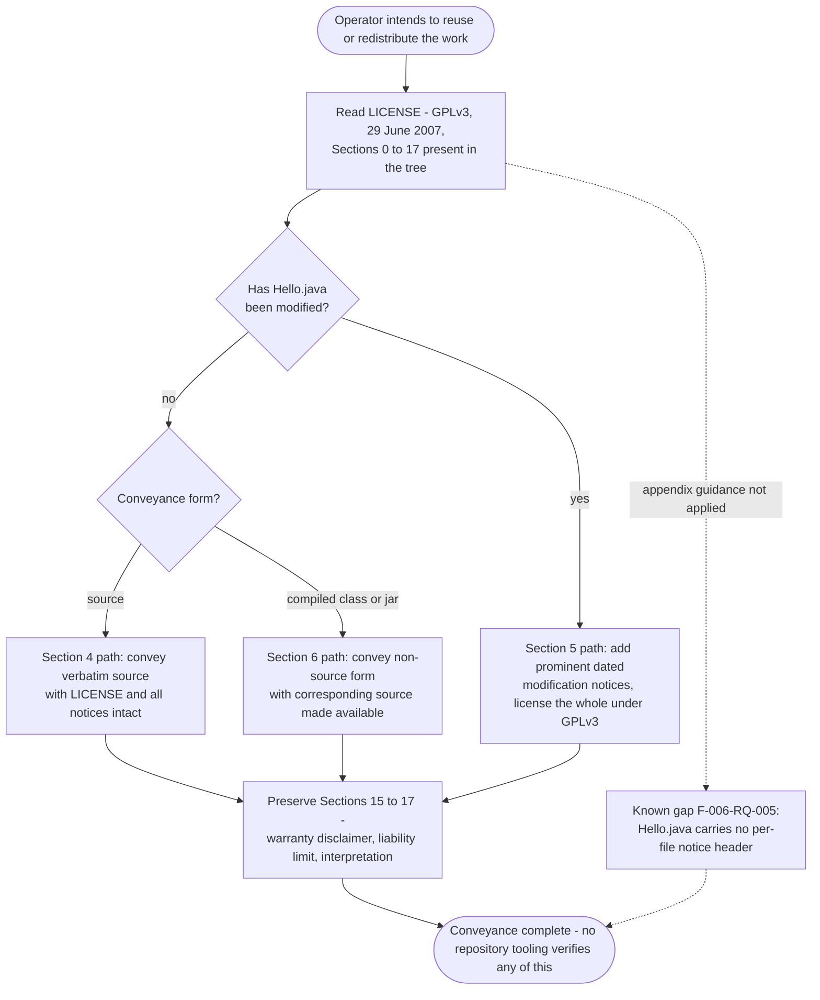

### 4.1.2 Integration Workflows

Section 2.3.2 establishes four integration points and no fifth. Three of them are exercised by WF-01 through WF-03; the fourth (the licensing interface) is documentary. No database, message broker, identity provider, HTTP service, artifact repository, registry, orchestrator or monitoring platform participates in any flow, and none is configured anywhere in the tree.

#### 4.1.2.1 Data Flow Between Systems

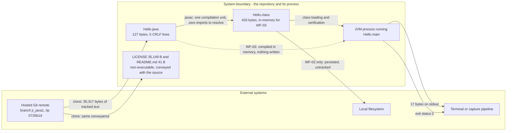

| Boundary | Data crossing it | Volume observed | Persistence |
| --- | --- | --- | --- |
| Source distribution channel | Three tracked text files | 35,317 bytes total | Durable in the Git object store |
| Build boundary | One compilation unit in, one class file out | 127 B in, 420 B out | WF-02 persists to disk; WF-03 persists nothing |
| JVM process contract | Argument array in (unread), exit status out | 0 arguments read, 1 status | Transient |
| Standard output stream | One ASCII line | 17 bytes | Transient unless the operator redirects |

No data flows *into* the program at runtime: it consults no argument, file, socket, environment variable, clock or locale, which is why output invariance is verifiable rather than merely asserted (F-002-RQ-003).

#### 4.1.2.2 API Interactions

The only API invocation the system makes is a single standard-library call, visible in the bytecode as `invokevirtual java/io/PrintStream.println`. There is no HTTP, REST, GraphQL, gRPC, JDBC, JMS, file or socket API anywhere in the tree — `Hello.java` contains zero `import` statements, and `java.lang.System` is reachable only because `java.lang` is implicitly imported (F-004-RQ-002).

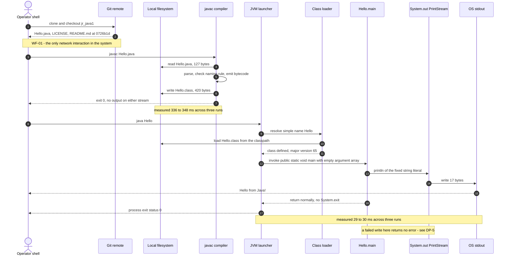

#### 4.1.2.3 Event Processing Flows

No event processing exists. There is no listener, callback, observer, handler registration, queue, topic, subscription, shutdown hook or signal handler in the source, and no broker or stream platform is configured (Section 2.3.4). The only event-like signal in the system is the **process exit status**, which the JVM publishes to the invoking shell on normal return of `main` (F-003-RQ-001) and which was observed as `0` on every successful run and `1` on every launcher or compiler failure. Because no non-daemon thread, executor or timer is created, the process has no event loop to drain and cannot outlive its single write.

#### 4.1.2.4 Batch Processing Sequences

No batch processing is defined: the repository contains no scheduler configuration, no cron entry, no workflow descriptor and no CI job (Section 3.6.4), so no sequence, window, chunk size, checkpoint or restart policy exists to document.

What the artifact does provide is a process shape that an *external* scheduler could drive without adaptation, and the relevant properties were verified: the invocation is non-interactive, requires no configuration, completes in tens of milliseconds, returns a clean status, leaves the filesystem unchanged, and produces byte-identical output on every run — so repeated or concurrent invocations cannot interfere with one another. Any schedule, retry policy or batch window would have to be supplied by the operator; the repository defines none.


## 4.2 Flowchart Requirements

This sub-section states, for every workflow diagrammed in Section 4.1, the mandatory flowchart elements — terminal points, process steps, decision diamonds, system boundaries, user touchpoints, error states and recovery paths — followed by the timing evidence and the validation rules that apply at each step.

### 4.2.1 Workflow Element Specification

| Element | WF-01 Acquisition | WF-02 Compile-then-run | WF-03 Source launch | WF-04 / WF-05 Conveyance |
| --- | --- | --- | --- | --- |
| **Start point** | Operator decides to obtain the program | Working tree present, no `Hello.class` | Working tree present | Intent to reuse or redistribute |
| **End point** | Three tracked files checked out at a commit SHA | One line on stdout, exit 0, `Hello.class` on disk | One line on stdout, exit 0, no artifact | Conveyance carrying `LICENSE` and intact notices |
| **Process steps** | 2 (clone, checkout) | 4 (invoke `javac`, write class, invoke `java`, execute `main`) | 2 (invoke `java Hello.java`, execute `main`) | 3 (read `LICENSE`, classify the conveyance, attach notices) |
| **Decision diamonds** | None evidenced — no tag selection exists (0 tags) | DP-2, DP-3, DP-4, DP-5 | DP-2, DP-4, DP-5 | DP-6 |
| **System boundaries crossed** | Source distribution channel | Build boundary, JVM process contract, standard output stream | JVM process contract, standard output stream | Licensing interface |
| **User touchpoints** | Shell: `git clone`, `git checkout` | Shell: two commands; reads stdout and exit status | Shell: one command; reads stdout and exit status | Manual document reading — no tooling |
| **Error states** | Remote unreachable or access denied (host-enforced, outside the repository) | Compile diagnostics, unwritable output, class not found, silent stdout loss, toolchain absent | Compile diagnostics, silent stdout loss, toolchain absent | None mechanised; non-compliance is a legal state, not a runtime one |
| **Recovery path** | Re-attempt the clone | Correct the source or invocation and re-run — idempotent | Correct and re-run — idempotent | Correct the conveyance before distribution |
| **Automation in the repository** | None | None | None | None |

Two elements the prompt asks to document are **absent by verification rather than by omission**: there is no asynchronous step in any workflow (no thread, executor, timer or queue exists, so no join, callback or wait state can be drawn), and no workflow has a persistent intermediate state that survives a failed invocation other than the untracked `Hello.class` file.

### 4.2.2 Timing and SLA Considerations

The repository defines **no** service-level agreement, service-level objective, latency budget, throughput target or performance test. Section 2.2 records "None defined in the repository" for the performance criteria of every requirement, and Section 3.6.4 confirms there is no pipeline in which a threshold could be asserted. The figures below are therefore measurements taken during this section's verification under OpenJDK 21.0.12 — useful as an order-of-magnitude baseline, not as a contractual target.

| Stage | Command | Measured wall clock | Runs | Exit status |
| --- | --- | --- | --- | --- |
| Compile | `javac Hello.java` | 336 ms, 348 ms, 336 ms | 3 | 0 |
| Run (compiled) | `java Hello` | 30 ms, 29 ms, 29 ms | 3 | 0 |
| Run with arguments | `java Hello alpha beta 42` | 29 ms | 1 | 0 |
| Source launch | `java Hello.java` | 344 ms | 1 | 0 |
| Failed launch | `java hello` (wrong case) | 46 ms | 1 | 1 |

Observations that bear on timing behaviour:

- **Dominant cost is fixed overhead, not application work.** The compiled method is four bytecode instructions; a run with class-data sharing disabled loaded roughly 480 platform classes. Run latency is JVM start-up, not program logic.
- **WF-03 trades repeat-run latency for convenience.** Source launch costs about the same as a compile on every invocation (344 ms vs 29 ms for a pre-compiled run), because compilation is repeated in memory each time.
- **No timeout, deadline, retry interval or backoff is defined anywhere**, and none could take effect: the process contains no wait, loop or blocking read (F-003-RQ-002), so it either completes in one pass or fails at a gate.
- **Resource envelope is entirely the JVM's ergonomic default.** In the verification environment the launcher selected `InitialHeapSize` 536,870,912 bytes and `MaxHeapSize` 8,589,934,592 bytes with class-data sharing active. The repository sets no JVM flag, heap size, GC选择 or container limit, so the envelope is whatever the host chooses.

### 4.2.3 Validation Rules

All validation in this system is performed by the JDK toolchain and the operating system. The program itself validates nothing, because it reads nothing.

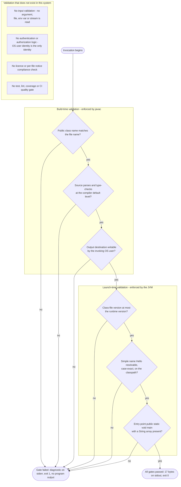

#### 4.2.3.1 Business Rules at Each Step

| Step | Rule as evidenced by the artifacts | Source of the rule |
| --- | --- | --- |
| Acquisition | The Git remote is the single distribution channel; a revision is identified by commit SHA because no tag exists | F-005-RQ-001, F-005-RQ-003 |
| Build | The build must remain resolvable offline with the JDK alone — adding any third-party dependency would invalidate the workflow as documented | F-004-RQ-001, F-004-RQ-002 |
| Build | No output-directory convention exists; the class file lands in the working directory and appears as untracked content because no `.gitignore` is present | Section 3.6.2 |
| Launch | The class must remain launchable by the unqualified name `Hello`; introducing a `package` declaration would break both the simple-name launch and the source-launch path | F-001-RQ-002, F-004-RQ-003 |
| Execute | Message content is fixed in source — no argument, property, message catalogue or environment variable can override it | F-002-RQ-001 |
| Execute | Exactly one line goes to stdout and nothing to stderr, so output can be compared byte-for-byte without filtering | F-002-RQ-002 |
| Terminate | The process must not outlive its single write; no supervision, restart or health-probe policy is defined anywhere | F-003-RQ-001 |
| Convey | Every conveyance must carry `LICENSE` with notices intact | F-006-RQ-002 |

#### 4.2.3.2 Data Validation Requirements

There are **no runtime data validation requirements**, and this is a structural property rather than an omission that could be patched at the edges: the `args` array is the only input surface in the system and it is never dereferenced, so there is no value to parse, range-check, coerce, sanitise or reject. The output is a compile-time constant in the class constant pool, so there is no serialisation format, schema, encoding negotiation or content-type to validate either.

The only input validated anywhere in the workflows is the **source file itself, validated by the compiler**:

| Validation | Enforcer | Observed failure behaviour |
| --- | --- | --- |
| Java syntax and type rules | `javac` | Removing the statement terminator produced `Hello.java:3: error: ';' expected` with a caret marker and `1 error`; exit 1, no class file |
| Public class / file name agreement | `javac` | Copying the source to `Greeting.java` produced `class Hello is public, should be declared in a file named Hello.java`; exit 1 |
| Class-file version acceptance | JVM | The committed source compiled to major version 65 under JDK 21; compiling with `--release 8` produced major version 52 together with three "obsolete option" warnings, showing target level is an operator choice the repository does not pin (F-004-RQ-005) |
| Class identity and case | JVM launcher | `java hello` produced `Could not find or load main class hello` / `ClassNotFoundException`; exit 1 |

#### 4.2.3.3 Authorization Checkpoints

No authentication or authorization is implemented in the repository — there is no credential, secret, key file, policy file or access-control artifact anywhere in the three-file tree, and the program performs no identity check. Every checkpoint below is enforced outside the code, by the Git host or the operating system, and the process runs with the full privileges of the launching user.

| ID | Checkpoint | Enforced by | Evidence |
| --- | --- | --- | --- |
| AC-1 | Read access to the Git remote | The hosting platform; credentials live in the operator's environment, never in the tree | No credential or secret file exists in the repository |
| AC-2 | Read permission on `Hello.java` | OS file permissions (mode 644 in the checkout) | Filesystem inspection |
| AC-3 | Write permission on the compiler output location | OS file permissions | Compiling into a directory the invoking user could not write failed with `error while writing Hello`, exit 1 |
| AC-4 | Execute permission on the JDK binaries | OS; the toolchain is provisioned outside the repository | The repository pins no JDK and carries no toolchain descriptor (Section 3.6.1) |
| AC-5 | Application-level authorization | **Nothing** — no role, permission, token or privilege check exists | `Hello.java` contains no security construct of any kind |

#### 4.2.3.4 Regulatory and Compliance Checks

The only compliance regime evidenced in the repository is the GPLv3 licence in `LICENSE`. There is no automated compliance step at any point in any workflow: no licence scanner, no header check, no SBOM generation, no signature or checksum verification, and no CI gate in which such a check could run (Sections 2.2.6 and 3.6.4). Compliance is therefore a manual checkpoint carried out by the operator at DP-6.

| Check | Obligation | When it applies | Current state |
| --- | --- | --- | --- |
| Licence included with every copy | GPLv3 Section 4 | Every verbatim conveyance (WF-04) | Satisfied — the full 674-line text is in the tree, not referenced by URL |
| Modified-version notices | GPLv3 Section 5 (a)–(c) | Any modified source conveyance (WF-05) | Operator obligation; nothing in the repository records or enforces it |
| Corresponding source for non-source form | GPLv3 Section 6 | Conveying `Hello.class` or a JAR | Applies the moment a build output is distributed; no packaging exists today |
| Downstream rights and no further restrictions | GPLv3 Sections 10 and 12 | Every conveyance | Documentary; no automated check |
| Warranty disclaimer and liability limitation preserved | GPLv3 Sections 15–17 | Every conveyance | Present verbatim in `LICENSE` |
| Per-file copyright and warranty notice | GPLv3 appendix guidance | Each source file | **Not satisfied** — `Hello.java` carries no comment, copyright line or licence header (F-006-RQ-005) |

No other regulatory regime is engaged by the observed behaviour: the program processes no personal data, accepts no input, opens no network connection and writes a constant ASCII literal, so no data-protection, retention, audit-logging or residency control appears in — or is required by — any flow. Equally, no internationalisation or accessibility obligation is met or claimed, since the message is hardcoded English with no locale handling (Section 2.2.2).


## 4.3 Technical Implementation

### 4.3.1 State Management

#### 4.3.1.1 State Transition Model

The system has no application state machine. What does have states is the **lifecycle of the artifact and its process**: the source may or may not be checked out, a class file may or may not exist beside it, and a launched JVM passes through a fixed sequence ending in termination. The diagram below is that lifecycle, with every transition and failure state observed during verification.

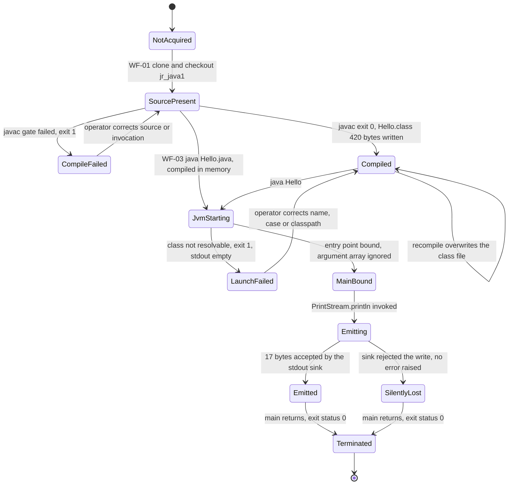

Three properties of this model matter for operations:

- **Only `NotAcquired`, `SourcePresent` and `Compiled` survive a process exit.** Everything from `JvmStarting` onward is transient and cannot be resumed, inspected after the fact or rolled back — there is no checkpoint, journal or run record.
- **`SilentlyLost` and `Emitted` are indistinguishable from the exit status.** Both terminate with 0, so a caller that checks only the status cannot tell whether the output was delivered (DP-5).
- **`Compiled` is self-overwriting.** Three consecutive compiles produced the same 420-byte artifact with no accumulated state, so the build transition is safely repeatable.

#### 4.3.1.2 Application State

The program is stateless in the strongest available sense, and each element of that claim is structural rather than inferred: the class declares no fields, no explicit constructor, no additional methods and no static mutable data (F-001-RQ-004); `main` is `static`, so no instance is ever created; the argument array is accepted and never read (F-001-RQ-003); and nothing is retained between invocations because the process holds no handle, connection, session, cache or temporary file. Verification confirmed the external consequence: a hash of the directory listing was identical before and after execution, so **the running program writes nothing at all**.

#### 4.3.1.3 Data Persistence Points

| ID | Persistence point | Written by | Durability | Volume observed |
| --- | --- | --- | --- | --- |
| P-1 | Git object store (remote and local clone) | WF-01 | Durable; the authoritative record of the system | 3 tracked files, 35,317 bytes; 3 commits; 0 tags |
| P-2 | Working-tree files (`Hello.java`, `LICENSE`, `README.md`) | WF-01 checkout | Durable until deleted; `Hello.java` stored with CRLF terminators, unmanaged by any `.gitattributes` | 127 B / 35,149 B / 41 B |
| P-3 | `Hello.class` in the working directory | WF-02 compile step | Durable, untracked, overwritten on each compile; absent entirely in WF-03 | 420 bytes |
| P-4 | Standard output stream | WF-02 / WF-03 execution | Transient — persisted only if the operator redirects it to a file | 17 bytes per invocation |
| P-5 | Application data store | — | **None exists**: no database, file store, cache, queue or log sink is configured or written | — |

P-3 is the only write the workflows perform, and it is a build artifact rather than application data. There is consequently no data model, no migration, no retention policy and no backup or restore procedure to document — Section 2.3.4 records the persistence tier as explicitly absent.

#### 4.3.1.4 Caching

The repository specifies no caching: `Hello.java` declares zero imports, so no cache library is referenced, and no cache configuration file exists in the tree. Two caching behaviours nonetheless act on the workflows, and both belong to the platform rather than to the system:

| Layer | Behaviour observed | Consequence |
| --- | --- | --- |
| JVM class-data sharing | Enabled by default in the verification runtime (the launcher reports `sharing`); with it disabled, a run loaded roughly 480 platform classes | Start-up cost — the dominant share of the 29 ms run time — is absorbed by the platform, not by anything the repository controls |
| Build output | No incremental build cache exists, because there is no build tool. Three successive compiles each took 336–348 ms with no speed-up | Every compile is a full recompile of the single unit; the only "cache" is the retained `Hello.class` (P-3), which WF-02 reuses across runs |

Retaining `Hello.class` is what makes repeat execution cost 29 ms instead of 344 ms — the single measurable caching decision available in the system, and it is the operator's, since the repository documents neither path.

#### 4.3.1.5 Transaction Boundaries

No transactional resource participates in any workflow: there is no database connection, message broker, distributed coordinator or two-phase commit, so no `begin`, `commit`, `rollback`, saga or outbox appears anywhere.

| Boundary | Scope | Atomicity as observed |
| --- | --- | --- |
| Unit of work | One process invocation, from launcher start to `main` returning | All-or-nothing in effect, because the process performs exactly one externally visible action |
| Build step | One `javac` invocation | Either `Hello.class` is written and the status is 0, or no class file is produced and the status is 1 — no partial artifact was observed in any failure case |
| Output write | One `PrintStream.println` call | Not transactional and not verifiable by the caller: a rejected write neither raises an error nor changes the exit status (DP-5, ERR-09) |
| Compensation / rollback | — | None exists and none is needed: a failed invocation leaves no state to undo, and a successful one leaves only the untracked class file |

Because every run is side-effect free and byte-identical, the whole workflow is **idempotent**: re-execution needs no deduplication key, no reconciliation and no cleanup step. That property is what makes the operator-driven retry in Section 4.3.2.3 safe in the absence of any automated recovery.

### 4.3.2 Error Handling

The program contains no error handling. `Hello.java` has no `try`, `catch`, `finally` or `throws` (F-003-RQ-003), no logging call and no diagnostic output of its own; it never writes to stderr under any condition. Every error path in the system therefore belongs to the compiler, the launcher, the shell or the operating system, and every one of the failures below was reproduced during verification.

#### 4.3.2.1 Observed Error Catalogue

| ID | Stage | Trigger | Status | Diagnostic (as emitted) | Stream |
| --- | --- | --- | --- | --- | --- |
| ERR-01 | Pre-build | JDK not installed or not on `PATH` | 127 | Shell `command not found` | stderr |
| ERR-02 | Build | Syntax error in the source (statement terminator removed) | 1 | `Hello.java:3: error: ';' expected` with a caret marker, then `1 error` | stderr |
| ERR-03 | Build | Public class name does not match the file name | 1 | `class Hello is public, should be declared in a file named Hello.java` | stderr |
| ERR-04 | Build | Output directory not writable by the invoking user | 1 | `error: error while writing Hello:` followed by the target class-file path | stderr |
| ERR-05 | Build | Legacy target requested (`--release 8`) | 0 | Three warnings: source value obsolete, target value obsolete, and the `-Xlint:-options` suppression hint | stderr |
| ERR-06 | Launch | `Hello.class` absent from the classpath | 1 | `Error: Could not find or load main class Hello` / `Caused by: java.lang.ClassNotFoundException: Hello`; 98 bytes on stderr, 0 bytes on stdout | stderr |
| ERR-07 | Launch | Class name case mismatch (`java hello`) | 1 | Same pair of messages with the mistyped name | stderr |
| ERR-08 | Launch | Launcher invoked with no main class | 1 | `Usage: java [options] <mainclass> [args...]` usage block | stdout/stderr per launcher convention |
| ERR-09 | Run | stdout sink cannot accept the write | **0** | **None** — zero bytes on stderr; the `PrintStream` write failure is swallowed | — |
| ERR-10 | Run | Downstream consumer closes the pipe immediately | 0 | None observed | — |

ERR-05 is a non-fatal path worth recording because it is a decision, not a defect: the target level is unpinned (F-004-RQ-005), so an operator can silently produce a class file of a different version (major 52 instead of 65) with no repository-side guard.

ERR-09 is the single genuine error-handling gap in the system. It is not a design intent recorded anywhere — the repository states nothing about output failure — but it is directly observable: a run whose output went to a device that could not accept it still reported success with an empty error stream.

#### 4.3.2.2 Error Handling Flow

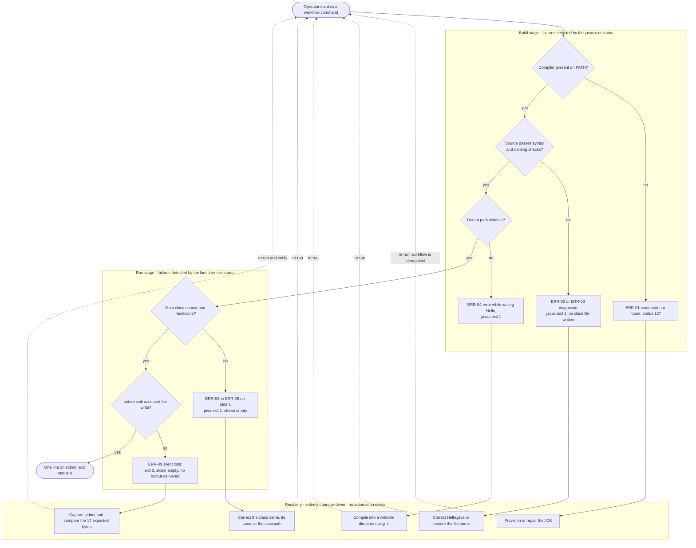

#### 4.3.2.3 Retry Mechanisms

No retry mechanism exists anywhere in the repository: there is no retry loop, no backoff, no attempt counter, no circuit breaker and no timeout, and none could be reached in a four-instruction method with no loop or blocking call (F-003-RQ-002). Retry is therefore a manual act — re-running the command — and verification established that this is safe without precondition: repeated compiles overwrite the same artifact, repeated runs are side-effect free, and five consecutive runs produced exactly one unique output line. Because no automation observes the exit status, **no retry occurs unless the operator initiates it**.

#### 4.3.2.4 Fallback Processes

| Failure condition | Available fallback | Status |
| --- | --- | --- |
| Compile step cannot be run or its output cannot be written | Switch to WF-03 single-file source launch, which needs no writable output location | Verified working; valid only while the file remains self-contained with no `package` declaration |
| Pre-compiled class missing at launch | Re-run the compile step, or use WF-03 | Verified working |
| Runtime older than the class-file version produced | Recompile at a lower target (`--release`), which was shown to produce major version 52 | Available, unpinned, and accompanied by obsolescence warnings (ERR-05) |
| Output sink unavailable | **None** — there is no secondary sink, no spooling and no buffering to disk; `System.out` is the only egress path in the system | Not mitigated |
| Git remote unreachable | An existing local clone continues to work, since the build needs no network | Structural: the build performs no dependency resolution (F-004-RQ-001) |

#### 4.3.2.5 Error Notification Flows

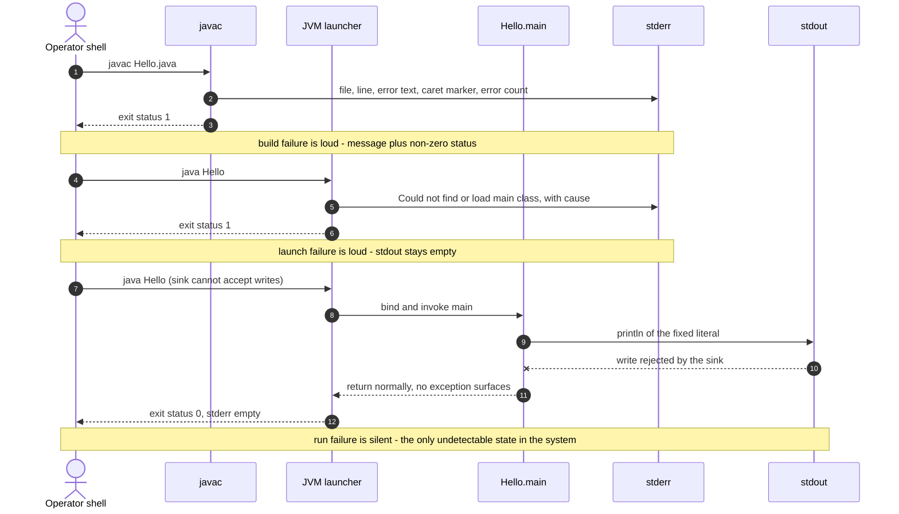

The complete notification surface is **two shell streams and one exit status**. No logging framework, structured log, metric, trace, alert, email, webhook, dashboard or monitoring integration exists — Section 2.3.4 records the telemetry tier as explicitly absent, and the program itself emits no diagnostic of its own under any condition. Detection is consequently limited to whoever or whatever reads the exit status, and for ERR-09 even that is insufficient: the only reliable detection is capturing stdout and comparing it byte-for-byte against the 17 expected bytes, which is exactly the verification step Section 3.6.4 identifies as the work a pipeline would have to automate.

#### 4.3.2.6 Recovery Procedures

| Failure | Detection signal | Recovery procedure | Data loss risk |
| --- | --- | --- | --- |
| ERR-01 toolchain absent | Shell status 127 | Provision a JDK — the repository pins none, so the version is the operator's choice (Section 3.6.1); re-run | None |
| ERR-02 / ERR-03 compile failure | `javac` status 1 plus a located diagnostic | Correct the source or restore the file name so it matches the public class; re-run. No partial artifact is left behind | None |
| ERR-04 unwritable output | `javac` status 1 | Compile into a writable directory with `-d`, or fall back to WF-03; re-run | None |
| ERR-06 / ERR-07 class not found | `java` status 1, stdout empty | Verify the class name and its exact case, confirm `Hello.class` exists on the classpath, recompile if needed; re-run | None |
| ERR-08 launcher usage error | `java` status 1 plus usage text | Supply the main class name; re-run | None |
| ERR-09 silent output loss | **No signal** — status 0 and empty stderr | Re-run with stdout captured and compared byte-for-byte; treat a mismatch as failure, since the process cannot report one | The emitted line is lost with no record |
| Working tree damaged or lost | Local inspection | Re-clone from the remote and check out the required commit SHA — no tag exists, so the SHA is the only revision identifier (F-005-RQ-003) | None; the remote holds the authoritative copy |

Every procedure above is a manual operator action. There is no supervisor, service manager, restart policy, health probe or self-healing behaviour anywhere in the repository, and none is needed for a process that terminates after one write and leaves no state to repair.


## 4.4 Process Flow Coverage and Traceability

### 4.4.1 Diagram Index

Nine diagrams document this system's flows. Each is listed with the required diagram category it satisfies, so coverage can be checked without re-reading the section.

| # | Diagram | Mermaid type | Location | Required category satisfied |
| --- | --- | --- | --- | --- |
| 1 | End-to-end system workflow with swim lanes for operator, remote, toolchain, filesystem and OS streams | `flowchart TD` | 4.1.1.2 | High-level system workflow |
| 2 | WF-02 compile-then-run detailed flow with all four decision gates and their observed failure branches | `flowchart TD` | 4.1.1.3 | Detailed process flow — core execution features |
| 3 | WF-04 / WF-05 conveyance and modification process driven by the GPLv3 sections | `flowchart TD` | 4.1.1.8 | Detailed process flow — licensing feature |
| 4 | Data flow across the four system boundaries with observed payload volumes | `flowchart LR` | 4.1.2.1 | Integration workflow — data flow between systems |
| 5 | Acquisition, build and run interaction sequence with measured timings | `sequenceDiagram` | 4.1.2.2 | Integration sequence diagram |
| 6 | Validation gate sequence, including the gates that do not exist | `flowchart TD` | 4.2.3 | Validation rules / authorization checkpoints |
| 7 | Artifact and process lifecycle states | `stateDiagram-v2` | 4.3.1.1 | State transition diagram |
| 8 | Error handling flow across build stage, run stage and operator recovery | `flowchart TD` | 4.3.2.2 | Error handling flowchart |
| 9 | Error notification paths, contrasting loud failures with the silent one | `sequenceDiagram` | 4.3.2.5 | Error handling / notification flow |

These complement rather than repeat the two diagrams already in the specification: Section 2.3.5 gives the requirement-level operator path, and Section 3.6.6 gives the delivery lifecycle. Section 4 adds the decision gates, exit statuses, timings, state transitions and error paths that were confirmed by execution.

### 4.4.2 Feature-to-Flow Traceability

| Feature | Where its flow is documented | Decision points | Error paths |
| --- | --- | --- | --- |
| F-001 JVM entry-point contract | Diagram 1 (`Loader`/`BindGate`), Diagram 2 (step T4), Diagram 5 (bind and invoke) | DP-4 | ERR-06, ERR-07, ERR-08 |
| F-002 Fixed console message emission | Diagram 2 (steps T5–T6), Diagram 4 (stdout boundary), Diagram 5 (println call) | DP-5 | ERR-09, ERR-10 |
| F-003 Deterministic normal termination | Diagram 2 (step T7), Diagram 7 (`Emitted` → `Terminated`) | — | None — no in-program handling exists (F-003-RQ-003) |
| F-004 Dependency-free build and launch | Diagram 1 (both lanes of DP-1), Diagram 2, Section 4.1.1.4 comparison | DP-1, DP-2, DP-3 | ERR-01 … ERR-05 |
| F-005 Source-only distribution | Diagram 1 (`Clone`/`Serve`), Diagram 4 (distribution channel), Diagram 5 (steps 1–2) | — | Remote access failures, enforced outside the repository |
| F-006 GPLv3 licensing terms | Diagram 3, Section 4.2.3.4 | DP-6 | Not mechanised — no compliance gate exists |
| F-007 README documentation artifact | DP-1 in Section 4.1.1.5 — the README supplies no path guidance | DP-1 | — |

### 4.4.3 Flow Categories Verified Absent

The section prompt anticipates several workflow categories that a typical system exhibits. Each of the following was checked directly and is absent; the verification is recorded so the absence is auditable rather than assumed.

| Category | Verification | Consequence for this section |
| --- | --- | --- |
| User authentication / session flow | No credential, token, policy or identity artifact in the three-file tree; `Hello.java` contains no security construct | No login, session or token-refresh flow can be drawn; the OS user is the only identity (AC-5) |
| API request/response flow | Zero `import` statements; the only call in the bytecode is `PrintStream.println`; no HTTP, REST, gRPC, JDBC or JMS reference exists | The "API interaction" flow is a single standard-library call (4.1.2.2) |
| Event-driven / asynchronous flow | No listener, callback, queue, topic, shutdown hook, thread or executor in the source; no broker configured | Only the process exit status behaves as an event (4.1.2.3) |
| Batch / scheduled flow | No scheduler config, cron entry, workflow descriptor or CI job anywhere (Section 3.6.4) | No schedule, window, chunk or checkpoint exists to document (4.1.2.4) |
| Transaction / persistence flow | No database, ORM, migration or data file; execution leaves the filesystem unchanged | The only write in any flow is the untracked build artifact (P-3) |
| Deployment / release flow | No `Dockerfile`, compose file, orchestration manifest, IaC definition or tag (0 tags) | Delivery ends at the clone; there is no deployed footprint (Section 3.6.6) |
| Multi-service orchestration | One class, one method, one process; no service boundary crossed at runtime | No cross-service sequence, saga or compensation flow is possible |
| Monitoring / alerting flow | No logging, metric, trace or alert integration (Section 2.3.4) | Notification is limited to two shell streams and one exit status (4.3.2.5) |
| Approval / human-in-the-loop flow | No issue template, review configuration, `CODEOWNERS` or governance file | The only human judgement in any flow is DP-1 and DP-6 |


## 4.5 References

**Repository files inspected**

- `Hello.java` - the entire executable surface: class `Hello`, entry point `public static void main(String[] args)`, single `System.out.println` statement; established the absence of imports, fields, state, input handling and error handling, and (via CRLF byte inspection) the unmanaged line-ending state
- `LICENSE` - GNU General Public License Version 3, 29 June 2007, 674 lines / 35,149 bytes; established the conveyance and modification obligations driving WF-04/WF-05 and the compliance checkpoints in 4.2.3.4
- `README.md` - 41 bytes, one sentence; established that neither launch path (DP-1) is documented in the repository

**Repository structure and metadata**

- `/` (repository root) - exactly three tracked files and no sub-directories; established that no build manifest, script, configuration, test, CI descriptor, container definition or compiled artifact exists in the tree
- Git repository metadata (`git ls-files`, `git log`, `git branch -a`, `git status`, `git tag`, `git remote -v`) - established the three tracked files, the three-commit history (`c537a19` → `f1847fa` → `0726b1d`), branches `main` and `jr_java1`, a clean working tree, zero tags (revisions addressed by SHA), and the `github.com/rjhonsi/BlitzyRepo2_Java` origin used in WF-01

**Executed verification evidence (inspection environment, not repository artifacts)**

- OpenJDK 21.0.12 / `javac` 21.0.12 provisioned into the inspection environment - enabled the first executed confirmation of the flows that Sections 1.2.2.1, 2.1.4 and 3.6.1 could only state as procedures; supplied all exit statuses, diagnostics and timings in 4.1–4.3
- `javac Hello.java`, `java Hello`, `java Hello.java`, `java Hello alpha beta 42` on a scratch copy - established the happy-path flows, the 420-byte `Hello.class` artifact, the 17-byte stdout payload, argument invariance, locale invariance, determinism across five runs, and that execution leaves the filesystem unchanged
- `javap -verbose Hello` and `javap -c Hello` - established class-file major version 65 and the four-instruction body (`getstatic`, `ldc`, `invokevirtual`, `return`) underpinning the claims of no branch, loop, retry or handler
- Induced failure runs (missing class file, case-mismatched class name, public-class/file-name mismatch, syntax error, unwritable output directory as an unprivileged user, launcher with no main class, absent compiler binary, write to a full stdout sink, early pipe close, `--release 8` target) - established the ERR-01 … ERR-10 catalogue, including the silent-failure finding (exit 0, empty stderr) recorded as ERR-09 and DP-5
- `java -verbose:class -Xshare:off Hello` and `java -XX:+PrintFlagsFinal -version` - established the ~480 platform classes loaded per run and the ergonomic heap envelope cited in 4.2.2

**Technical Specification sections cross-referenced**

- 2.1 Feature Catalog - feature identifiers F-001 … F-007, their priorities and evidence anchors
- 2.2 Functional Requirements - requirement identifiers F-00X-RQ-00X used throughout the traceability and validation tables, and the recorded F-006-RQ-005 per-file-notice gap
- 2.3 Feature Relationships - the four integration points, the F-005 → F-004 → F-001 → F-002 → F-003 dependency chain, and the explicitly absent common services
- 3.6 Development & Deployment - the absence of build system, containerization and CI/CD, the operator-supplied command paths, and the version-control and delivery state

No external web source was consulted for this section; every statement rests on repository inspection or on commands executed against the repository's source during this investigation.


# 5. System Architecture

## 5.1 High-Level Architecture

The architecture described here is the whole of the system: three tracked files at the repository root — `Hello.java`, `README.md` and `LICENSE` — with no subdirectories, no build descriptor and no infrastructure definition of any kind. Every statement below is taken from those artifacts, from Git metadata, or from execution of the program in the verification environment. Where a conventional architectural element does not exist, it is recorded as absent rather than approximated.

### 5.1.1 System Overview

#### 5.1.1.1 Architecture Style and Rationale

The system is a **single-process, single-module console application** with an on-demand (invoke-and-exit) lifecycle. One compilation unit, `Hello.java`, declares one public class whose one static method writes one fixed line to standard output and returns. There is no tier decomposition, no service boundary, no inter-process communication and no long-running runtime: compiled with `javac` the unit becomes a 420-byte class file whose `main` method is four bytecode instructions — `getstatic System.out`, `ldc "Hello from Java!"`, `invokevirtual PrintStream.println`, `return`.

The style is not a stated design choice anywhere in the repository — `README.md` contains one sentence and records nothing about architecture — so the rationale below is reconstructed from the constraints the artifacts actually impose:

- **The unit of deployment is the unit of compilation.** With a single class in the default package and no `module-info.java`, the smallest shippable thing is the source file itself; introducing layers would require introducing a build model, and none exists to extend.
- **No dependency graph to arrange.** `Hello.java` declares zero imports, so the only library surface is the implicitly available JDK output API. An architecture style whose purpose is to manage dependency direction (hexagonal, layered, ports-and-adapters) would have nothing to arrange.
- **No concurrency, no state, no I/O beyond one write.** The class declares no fields, no constructor and no second method, and `main` is `static`, so no instance ever exists. Styles that exist to coordinate state or distribute work have no subject matter here.
- **Invocation is the whole protocol.** The program accepts no input — the `args` array is passed and never read — and terminates on normal return with no `System.exit` call, which makes the process boundary the only interface contract worth specifying.

#### 5.1.1.2 Architectural Principles and Patterns Observed

| Principle or pattern | How the code realises it |
| --- | --- |
| Stateless execution | No fields, no instance, no static mutable data; a directory-listing hash was identical before and after a run, so the process writes nothing |
| Deterministic, input-independent behaviour | Output is a compile-time literal; passing `java Hello one two 3` produced byte-identical output and exit status 0 |
| Zero third-party dependency (standard library only) | No `import` statement and no dependency manifest; nothing is resolved or fetched at build time |
| Convention-based launch | `public class Hello` in a file named `Hello.java`, default package, launched by simple name `Hello` |
| Fail-fast at the toolchain boundary | No `try`/`catch`/`finally`/`throws` anywhere; compile and launch failures are surfaced by `javac` and the launcher with non-zero status |
| Build-from-source distribution | Three text files are conveyed; no JAR, manifest, image or compiled class is tracked |
| Copyleft legal envelope | The complete GPLv3 text is carried in-tree and governs every conveyance and derivative |

Patterns that a reader might expect and that are **verifiably absent**: layered or n-tier separation, dependency injection, MVC, repository/data-mapper, hexagonal or clean architecture, event-driven or message-based decomposition, microservices, plug-in extensibility, and configuration-driven behaviour. Semantic searches of the indexed repository for service, configuration, persistence, authentication and external-client files returned no results, and searches for deployment, infrastructure, monitoring or storage folders likewise returned none.

#### 5.1.1.3 System Boundaries and Major Interfaces

Five boundaries exist, only four of which are technical. They are the same four integration points enumerated in Section 1.2.1.3, expressed here as architectural boundaries with the crossing mechanism named:

| Boundary | Crossing mechanism | Evidence |
| --- | --- | --- |
| Conveyance boundary | Git clone/checkout of branch `jr_java1` from the hosted remote; revisions addressed by commit SHA (no tags exist) | Git remote, branch and tag metadata |
| Build boundary | `javac` consumes one compilation unit and emits `Hello.class` (major version 65 in the verification environment); no dependency resolution, no network access | Verified compile, `javap -verbose` output |
| Process boundary | The launcher resolves the class by simple name and binds `public static void main(String[] args)`; the process ends on normal return with status 0 | `Hello.java` lines 2–4; observed exit status |
| OS output boundary | `PrintStream.println` writes 17 bytes (16 characters plus a line terminator) to file descriptor 1 | `Hello.java` line 3; measured stdout size |
| Legal boundary (non-technical) | GPLv3 Sections 0–17 bind recipients, redistributors and modifiers | `LICENSE` |

No socket, HTTP endpoint, RPC stub, database connection, message-broker client, filesystem write, environment-variable read or standard-input read exists on any boundary. The inbound argument path is structurally present but architecturally dead: the operating system's argument vector reaches `main` as `String[] args` and is discarded unread, which is why no input validation, parsing or authorisation layer appears anywhere in the design.

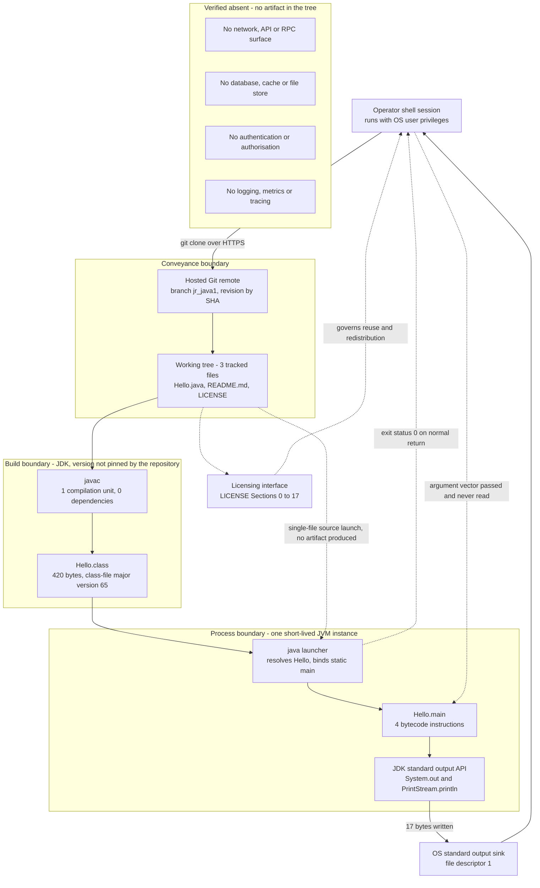

### 5.1.2 Core Components

Eight components are identifiable, three of them inside the repository's executable content, two documentary or legal artifacts, and three provided by the environment. Component identifiers `C-n` are introduced here and map onto the feature identifiers established in Section 2.1.

| Component | Primary responsibility | Key dependencies |
| --- | --- | --- |
| C-1 `Hello` type (`Hello.java` lines 1, 5) | Sole compilation unit and the application's entire namespace (default package) | C-5 toolchain for compilation; nothing else |
| C-2 `main(String[] args)` entry point (lines 2, 4) | JVM-callable entry point; lexical container of all application logic; its return terminates the process | C-1 for containment; C-5 launcher for binding |
| C-3 Message emission step (line 3) | The single observable action: write the literal `Hello from Java!` | C-4 standard output API |
| C-4 JDK standard output API binding | Supplies `System.out` and `PrintStream.println`; performs character-to-byte encoding and the write | JDK platform classes; OS file descriptor 1 |
| C-5 Build and launch toolchain (`javac`, `java`) | Compiles the unit and hosts the process; resolves the class by simple name | An installed JDK, not pinned by any file in the tree |
| C-6 Source conveyance channel (Git repository, branch `jr_java1`) | Authoritative store and sole distribution mechanism for the three files | Hosted Git remote; Git client |
| C-7 Licensing artifact (`LICENSE`) | Carries the complete GPLv3 terms governing use, modification and redistribution | None; the terms stand independently of the code |
| C-8 Documentation artifact (`README.md`) | Human-readable description slot; currently a one-sentence placeholder | None |

| Component | Integration points | Critical considerations |
| --- | --- | --- |
| C-1 | Build boundary; process boundary (name resolution) | Public class name is coupled to the file name; default package means no module participation and simple-name launch only |
| C-2 | Process boundary | `args` accepted and never read, so behaviour cannot be parameterised at invocation; no exit-status vocabulary beyond normal return |
| C-3 | OS output boundary | The literal is the de facto output contract and no test asserts it; changing it is an edit-compile-verify cycle |
| C-4 | OS output boundary | Write failures are swallowed by `PrintStream`: a run whose sink rejected the write still exited 0 with empty stderr (ERR-09) |
| C-5 | Build and process boundaries | No Java version, distribution or checksum is pinned, so toolchain provenance and class-file target rest entirely with the operator |
| C-6 | Conveyance boundary | No tags exist, so consumers must pin a commit SHA; `Hello.java` is stored CRLF with no `.gitattributes` to normalise line endings |
| C-7 | Legal boundary | `Hello.java` carries no per-file copyright or notice header, and no copyright holder or year is recorded in any tracked file |
| C-8 | Conveyance boundary (conveyed alongside the source) | Provides no build or run guidance, so the operating procedure must be supplied from outside the repository |

### 5.1.3 Data Flow Description

**The system's only payload is a 16-character string literal.** Its life cycle is short and entirely one-directional. At compile time the literal is lifted out of the source text into the class file's constant pool, where `javap -c` shows it referenced by a single `ldc` instruction. At run time the launcher loads the class, binds the static entry point and invokes it; `getstatic` obtains the `PrintStream` held by `System.out`, `invokevirtual` passes the literal to `println`, and the platform stream encodes the characters and appends a line terminator before handing 17 bytes to file descriptor 1. Control returns to the launcher and the process ends. There is no second flow, no branch and no loop: the method body is a straight line of four instructions.

**Primary flows between components.** Three flows exist, and they are sequential rather than concurrent. The *conveyance flow* moves three files from the hosted remote into a working tree (C-6 → C-1, C-7, C-8). The *build flow* moves one compilation unit through the compiler into a class file (C-1 → C-5 → class file), which the single-file source-launch path collapses into memory, producing no artifact at all. The *execution flow* moves the literal from the class file through the entry point and the standard output API to the operator's terminal or redirect target (C-2 → C-3 → C-4 → stdout). A fourth, *inbound* flow is structurally present but terminates immediately: the OS argument vector is materialised as `String[] args` and never dereferenced.

**Integration patterns and protocols.** Within the process, integration is direct in-process method invocation against platform classes — no broker, queue, proxy, adapter or serialisation step intervenes. Across the process boundary, the pattern is the classic POSIX one: a byte stream on a standard file descriptor, with the exit status as the only out-of-band signal. Across the conveyance boundary, the pattern is content-addressed replication over HTTPS via Git, with revisions identified by commit SHA. The licensing boundary is a document, not a protocol.

**Data transformation points.** There are exactly three, and none of them is application code: source text to class-file constant-pool entry at compile time; `String` to bytes inside `PrintStream` at write time (the literal is pure ASCII, so the result is byte-identical under any default charset); and the appending of the platform line terminator by `println`, which is why a run emits 17 bytes rather than 16. The application performs no parsing, formatting, mapping, validation or conversion of its own.

**Key data stores and caches.** No application data store exists — the persistence inventory in Section 4.3.1.3 records the application tier as `P-5: none`. What does hold data is the Git object store (durable, authoritative, 35,317 tracked bytes across three files), the working-tree copies of those files, the untracked 420-byte `Hello.class` produced by a compile, and the standard output stream itself, which is transient unless the operator redirects it. Caching is likewise entirely platform- or operator-owned: the JVM's class-data sharing absorbs most of the start-up cost of loading the roughly 480 platform classes a run touches, and retaining `Hello.class` between runs is what makes repeat execution cost tens of milliseconds instead of a few hundred. No cache library is referenced — there are no imports — and no cache configuration exists in the tree.

### 5.1.4 External Integration Points

Every system the program touches is external to the repository; none is wrapped, abstracted or configured by it. The legal interface is listed because it constrains distribution, although it is a document rather than a technical integration.

| External system | Integration type | Data exchange pattern |
| --- | --- | --- |
| JVM / JDK runtime (C-5) | Host platform; process contract | Synchronous, single-shot: launcher binds `main`, application returns, process exits |
| OS standard output sink | Operating-system I/O | Fire-and-forget byte-stream write to file descriptor 1; one write per invocation |
| OS argument vector | Operating-system process input | Inbound array delivered at invocation and never read (dead-end path) |
| Hosted Git remote (C-6) | Source distribution | Pull-based clone/checkout; content-addressed replication, revision pinned by SHA |
| GPLv3 licensing interface (C-7) | Legal / compliance | Static document conveyed with the source; obligations bind recipients and modifiers |

| External system | Protocol / format | SLA requirements |
| --- | --- | --- |
| JVM / JDK runtime (C-5) | JVM class-file format (major version 65 as compiled in verification); `public static void main(String[])` signature | None defined by the repository. Measured in the verification environment: compile ≈ 0.34 s, run ≈ 29–32 ms |
| OS standard output sink | Plain text, ASCII payload, platform line terminator; 17 bytes per run | None defined. No delivery guarantee exists at all: a rejected write is silent and still reports success (ERR-09) |
| OS argument vector | `String[]` of shell-supplied tokens | Not applicable — no argument is honoured, so no contract can be breached |
| Hosted Git remote (C-6) | Git over HTTPS | None defined; availability is the hosting provider's, and an existing local clone keeps working offline because the build resolves nothing |
| GPLv3 licensing interface (C-7) | Verbatim licence text, Sections 0–17 plus appendix | Not applicable; the obligations are continuous rather than time-bounded |

No service-level agreement, objective or budget is recorded anywhere in the repository — there is no specification document, no test suite, no monitoring configuration and no CI descriptor in which one could be expressed (Section 2.4.2). The figures above are measurements taken during verification, offered as a baseline for future comparison, and must not be read as commitments. Equally, no external integration that a production system would normally carry is present: no identity provider, no database or object store, no message broker, no HTTP or gRPC dependency, no artifact registry, no container orchestrator, no monitoring or paging platform, and no cloud provider of any kind.


## 5.2 Component Details

Each component introduced in Section 5.1.2 is detailed below using a uniform frame: what it is responsible for, the technology that realises it, the interfaces it exposes or consumes, what it persists, and how it behaves under increased load. Three components are application content, two are supplied by the environment, and three are repository-level artifacts. Persistence references use the identifiers `P-1` to `P-5` established in Section 4.3.1.3.

### 5.2.1 Component Interaction Model

The interaction graph is acyclic and one-directional: conveyance feeds the artifacts, the compiler consumes the source, the launcher hosts the entry point, the entry point invokes the platform stream, and the stream writes to the operating system. No component calls back into another, and no component is optional at runtime except the compile step, which the single-file source-launch path replaces.

```mermaid
flowchart LR
    Operator["Operator"]
    C6["C-6 Git conveyance channel<br/>branch jr_java1, revision by SHA"]

    subgraph RepoArtifacts["Tracked repository artifacts"]
        C1["C-1 Hello type<br/>Hello.java lines 1 and 5"]
        C7["C-7 LICENSE<br/>verbatim GPLv3"]
        C8["C-8 README.md<br/>one placeholder sentence"]
    end

    subgraph AppScope["Application scope - lexically inside C-1"]
        C2["C-2 main String args<br/>lines 2 and 4"]
        C3["C-3 emission step<br/>line 3"]
    end

    subgraph PlatformScope["Environment-provided components - unpinned JDK"]
        C5C["C-5 javac compiler"]
        C5L["C-5 java launcher and JVM"]
        C4["C-4 System.out PrintStream"]
    end

    Sink["OS standard output sink"]

    Operator --> C6
    C6 --> C1
    C6 --> C7
    C6 --> C8
    C1 -->|"one compilation unit, nothing to resolve"| C5C
    C5C -->|"Hello.class, major version 65"| C5L
    C1 -.->|"single-file source launch bypasses the artifact"| C5L
    C5L -->|"resolves simple name, binds static main"| C2
    C1 -.->|"lexically contains"| C2
    C2 -->|"straight-line invocation"| C3
    C3 -->|"invokevirtual println"| C4
    C4 -->|"17 bytes to descriptor 1"| Sink
    Sink --> Operator
    C2 -.->|"normal return, exit status 0"| C5L
    C7 -.->|"binds C-1 and its derivatives"| C1
    C8 -.->|"no build or run guidance"| Operator
```

### 5.2.2 Application Components

#### 5.2.2.1 C-1 — `Hello` Type and Compilation Unit

`Hello.java` lines 1 and 5 declare the only type in the system. The component is simultaneously the application's namespace, its unit of compilation and its unit of distribution: because no `package` is declared and no `module-info.java` exists, the type lives in the unnamed package and is addressed by the bare name `Hello`. Compilation produced a class file with `interfaces: 0, fields: 0, methods: 2` — the entry point plus the implicit default constructor that is never invoked, since `main` is static.

| Aspect | Detail |
| --- | --- |
| Technology | Java source, plain top-level `public class`; no framework, annotation, generic type, interface or inheritance beyond the implicit `java.lang.Object` superclass |
| Interfaces exposed | One: the class's own simple name, which the launcher resolves. No public API surface beyond the static entry point it contains |
| Interfaces consumed | The `javac` compilation contract (public class name must equal the file name) |
| Data persistence | `P-2` only: the source file in the working tree, 127 bytes, stored with CRLF terminators and no `.gitattributes` to normalise them |
| Scaling | Not a scaling unit by itself; adding a second compilation unit or a `package` declaration would invalidate the single-file source-launch path and force the introduction of a build model, which the repository does not have |

#### 5.2.2.2 C-2 — `main(String[] args)` Entry Point

Lines 2 and 4 of `Hello.java` constitute the process's entire control flow. The component's responsibilities are to satisfy the JVM's entry-point signature, to contain the application logic, and — by returning normally, with no `System.exit` call anywhere in the file — to terminate the process. Its inbound parameter is accepted and never dereferenced: invoking `java Hello one two 3` produced output and an exit status identical to the bare invocation.

| Aspect | Detail |
| --- | --- |
| Technology | Static Java method; `public static void main(java.lang.String[])`, the platform-standard launch signature |
| Interfaces exposed | The JVM process contract. The only outbound signal is the exit status, and the only value it ever takes on a completed run is 0 |
| Interfaces consumed | None beyond the enclosing type; no configuration, environment variable, file or stream is read |
| Data persistence | None. No field, no instance, no static mutable data, and nothing retained between invocations; a hash of the directory listing was identical before and after a run |
| Scaling | Perfectly parallel because it is stateless and single-threaded — concurrent invocations cannot interfere. Throughput grows only by launching more processes, each paying full JVM start-up; there is no loop, listener or scheduler, so it cannot be scaled as a long-running service |

#### 5.2.2.3 C-3 — Fixed Message Emission Step

Line 3 is the system's only observable action and its only externally visible behaviour. Disassembly shows it compiles to three instructions plus the method return: `getstatic` on `java.lang.System.out`, `ldc` of the constant-pool string, and `invokevirtual` of `java.io.PrintStream.println(String)`.

| Aspect | Detail |
| --- | --- |
| Technology | Direct invocation of the JDK standard output API; no logging framework, formatter, message catalogue or resource bundle participates |
| Interfaces exposed | Its output is the de facto contract for any consumer: exactly one line, `Hello from Java!`, 17 bytes including the terminator, with standard error left untouched |
| Interfaces consumed | `C-4`, the `PrintStream` held by `System.out` |
| Data persistence | `P-4` only, and transiently: the bytes survive only if the operator redirects the stream |
| Scaling | Fixed cost per invocation — a 16-character constant with no formatting, concatenation or computation. Output volume cannot be increased or batched without changing the source, and the only contended resource is whichever sink standard output is attached to |

### 5.2.3 Environment-Provided Platform Components

These two components are indispensable but are not in the repository: nothing in the tree vendors, wraps, pins or configures them. Section 3.6.1 records that no `.java-version`, `.sdkmanrc`, `.tool-versions`, `.mise.toml` or manifest exists to select a JDK.

#### 5.2.3.1 C-4 — JDK Standard Output API Binding

`System.out` supplies the `PrintStream` that performs character-to-byte encoding, appends the platform line terminator and issues the write. It is the single most consequential component for operational correctness, because its failure semantics are lenient by design: when the program's output was directed to a sink that could not accept it, the process still exited 0 with zero bytes on standard error. The write failure is absorbed inside the stream and never reaches the application, which has no handler for it in any case.

| Aspect | Detail |
| --- | --- |
| Technology | `java.lang.System.out` / `java.io.PrintStream` from the JDK standard library; implicitly available, so `Hello.java` needs no import |
| Interfaces exposed | `println(String)`; underneath, a byte-stream write to file descriptor 1 |
| Interfaces consumed | The operating system's standard output sink — a terminal, a pipe, a file or a device |
| Data persistence | None of its own; it is a conduit to `P-4` |
| Scaling | One buffered write per process. Throughput is bounded by the sink, not by the application; concurrent processes writing to the same sink may interleave, and nothing in the repository coordinates them |

#### 5.2.3.2 C-5 — Build and Launch Toolchain

The same JDK provides both stages. In verification, `javac Hello.java` completed with status 0 and emitted a 420-byte class file; `java Hello` then produced the expected line in 29–32 ms of wall clock across three runs, of which the dominant share is JVM start-up — a run with class-data sharing disabled loaded 479 platform classes to execute a four-instruction method. The launcher's source mode (`java Hello.java`) ran the program without writing any class file to disk, which verification confirmed by listing the directory afterwards.

| Aspect | Detail |
| --- | --- |
| Technology | `javac` and the `java` launcher from an installed JDK. The repository pins no version, distribution or checksum; the verification environment provided OpenJDK 21.0.12, which is why the emitted class file carries major version 65 |
| Interfaces exposed | Two operator-facing command paths — compile-then-run (`WF-02`) and single-file source launch (`WF-03`) — neither of which is encoded in the repository as a script, task or README instruction |
| Interfaces consumed | The compilation unit `C-1`; the host operating system for process creation and I/O |
| Data persistence | `P-3`: an untracked 420-byte `Hello.class` in the working directory, overwritten on each compile and absent entirely under `WF-03`. No `.gitignore` exists, so the artifact appears as untracked content |
| Scaling | The build has no incremental, parallel or cached stage — three successive compiles each took roughly a third of a second with no speed-up — and it resolves nothing, so it needs no network. At run time each invocation is an independent process; default ergonomics in the verification environment reserved a 512 MB initial heap against an 8 GB maximum, so per-process memory reservation, not application work, is what bounds invocation density |

### 5.2.4 Repository and Governance Components

#### 5.2.4.1 C-6 — Source Conveyance Channel

The Git repository is the authoritative store and the only distribution mechanism: no JAR, container image, package-index entry or release feed exists. The channel delivers exactly three root-level files totalling 35,317 bytes. History consists of three commits, all dated 2026-09-16 by a single author, and the branches `main` and `jr_java1` are identical at `0726b1d`; with zero tags, a consumer can only pin a commit SHA.

| Aspect | Detail |
| --- | --- |
| Technology | Git over HTTPS against a hosted remote; content-addressed object store |
| Interfaces exposed | Clone and checkout of branch `jr_java1` (`WF-01`); revision addressing by commit SHA |
| Interfaces consumed | The hosting provider's access control, which is the only gate on who may read or push |
| Data persistence | `P-1`, the durable and authoritative record — 3 tracked files, 3 commits, 0 tags — and `P-2`, the working-tree copies it materialises |
| Scaling | Consumer growth is entirely a hosting concern: no mirror, artifact repository or CDN participates, and because the build resolves no dependencies, an existing local clone continues to work with the remote unreachable |

#### 5.2.4.2 C-7 and C-8 — Licensing and Documentation Artifacts

`LICENSE` carries the complete GPLv3 text, 674 lines covering Sections 0–17 plus the appendix on applying the terms, and is the component that constrains every conveyance and derivative of `C-1`. `README.md` occupies the documentation slot with a single 41-character sentence; it provides no build or run guidance, which is why the operating procedure for this system has to come from outside the repository.

| Aspect | Detail |
| --- | --- |
| Technology | Plain text and Markdown; no generator, template, linter or link-checker is configured |
| Interfaces exposed | `C-7`: the legal interface binding recipients, redistributors and modifiers. `C-8`: a human-readable description with no machine consumer |
| Interfaces consumed | None; neither file is read by any tool at build or run time |
| Data persistence | `P-2`: 35,149 bytes and 41 bytes respectively in the working tree, both replicated through `P-1` |
| Scaling | Not applicable — static text with no runtime role. The documented gap that does scale with adoption is that `Hello.java` carries no per-file copyright or notice header, and no copyright holder or year is recorded in any tracked file, so the appendix notice template in `LICENSE` cannot be completed from repository information |

### 5.2.5 Component State Transitions

Section 4.3.1.1 models the operational lifecycle an operator drives. The diagram below is the complementary component-level view: the successive representations of `C-1` — committed object, source text, class file, loaded type, active frame — and the point at which each is discarded. Only the first three representations survive a process exit; everything from the loaded type onward is transient and cannot be inspected after the fact, because no checkpoint, journal or run record exists.

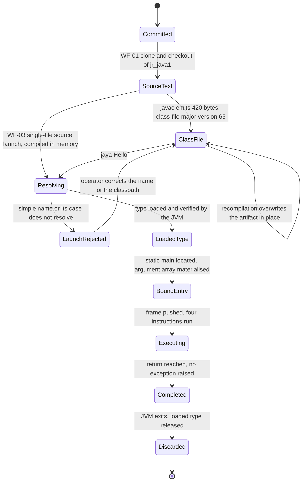

Two transitions carry operational weight. `ClassFile --> ClassFile` is safely repeatable: repeated compiles overwrite the same 420-byte artifact with no accumulated state, which is what makes the manual retry described in Section 4.3.2.3 risk-free. `Executing --> Completed` is unconditional in practice: with no `try`/`catch`/`finally`/`throws` and no branch in the method body, there is no alternative terminal state the application itself can reach.

### 5.2.6 Key Flow Sequence Diagrams

#### 5.2.6.1 Compile-Then-Run Flow

This is the `WF-02` path, traced to the instruction level. Every message shown was observed during verification, including the empty compiler output on success and the 17-byte write.

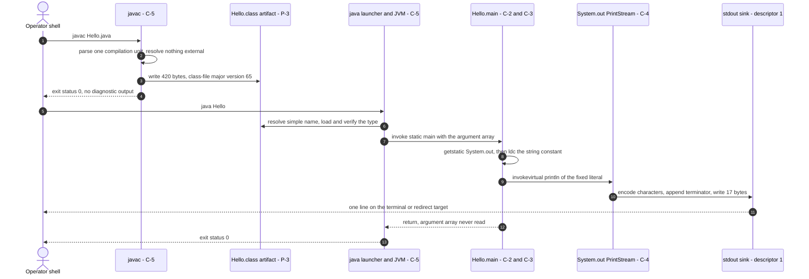

#### 5.2.6.2 Single-File Source Launch Flow

This is the `WF-03` path, valid only while the unit remains self-contained and declares no `package`. Verification confirmed the defining property: the program ran to completion and the working directory afterwards contained no class file.

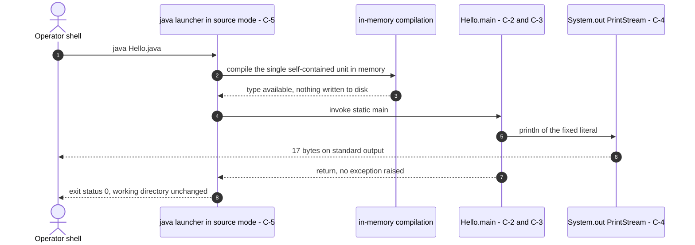

The two paths differ only in where compilation happens and whether `P-3` is created. They are functionally interchangeable for this component set, which is why Section 4.3.2.4 records source launch as the available fallback when the compile step cannot write its output.


## 5.3 Technical Decisions

The repository records no design decisions. There is no architecture decision log, no design document and no commented rationale anywhere in `Hello.java`; `README.md` states nothing specific and the three commit messages describe file additions rather than choices. Every decision documented below is therefore **reconstructed from the artifacts and from their verified absence**, and each is presented with the evidence that establishes it. Nothing here should be read as a decision the authors recorded; the tradeoffs are the consequences the current state actually imposes.

### 5.3.1 Architecture Style Decision and Tradeoffs

| Candidate style | What the repository shows | Consequence |
| --- | --- | --- |
| Single-process console application (**in force**) | One compilation unit, one static entry point, one write, invoke-and-exit lifecycle | Nothing to orchestrate, nothing to deploy, nothing to operate beyond a shell invocation |
| Layered or modular monolith | No `package` declaration, no `module-info.java`, no second type — there is no seam to layer along | Cannot participate in the Java module system as-is; introducing layers requires introducing a build model first |
| Network service or API | No server dependency, no socket usage, no port, no endpoint, no `*.yaml` of any kind in the tree | No request path exists to scale, secure, authenticate or monitor |
| Containerised / orchestrated service | No `Dockerfile`, `docker-compose.yml`, `.dockerignore` or orchestration manifest; no packaged artifact to place in an image | Deployment, in the usual sense, does not exist for this system (Section 3.6.6) |

The tradeoff profile of the style in force is sharply asymmetric, and both sides are observable:

- **Gained.** Zero dependency resolution and zero network access at build time; a build that is one command over 127 bytes of source; execution measured at 29–32 ms; perfect idempotence, since every run is side-effect free and byte-identical; and an attack surface reduced to the toolchain itself.
- **Given up.** Any ability to vary behaviour without editing source (`args` is never read); any packaging or release identity (zero tags, so consumers pin a SHA); any automated correctness gate (no test, no CI); and any extensibility that would not first require inventing a build model, a namespace and an output contract.

### 5.3.2 Communication Pattern Choices

| Communication concern | Pattern in force | Alternative not adopted, with evidence |
| --- | --- | --- |
| Within the process | Direct static method invocation into platform classes — three bytecode instructions with no indirection | No dependency injection, event bus, observer or callback: the tree contains one class with one method |
| Process to operator | One-way byte stream on standard output plus the exit status as the sole out-of-band signal | No structured logging, no machine-readable response envelope, no metrics endpoint — the telemetry tier is absent (Section 2.3.4) |
| Operator to process | None. The argument vector is delivered and discarded unread | No CLI parsing, no interactive prompt, no configuration file, no environment lookup |
| Between systems | None at runtime. The only cross-system exchange is source conveyance by Git clone over HTTPS | No HTTP, gRPC, messaging, broker or queue client is referenced; `Hello.java` declares zero imports |

The decisive tradeoff of this pattern set is expressive poverty on the outbound channel. With exactly two shell streams and one status code available, the system cannot distinguish "output delivered" from "output silently lost": a run whose sink rejected the write still terminated with status 0 and an empty error stream. That is decision point `DP-5` and error `ERR-09` in Section 4.3, and it is the one failure mode in the entire system that no available signal reports.

### 5.3.3 Data Storage Solution Rationale

No data storage solution is selected, because the system has no data to store. The program reads no input, derives no value, retains no field and holds no handle, and verification confirmed the external consequence — the filesystem was unchanged by execution. The only durable store in play holds *source*, not application data: the Git object store, with 3 tracked files, 3 commits and 0 tags.

| Storage class | Present | Rationale for its absence |
| --- | --- | --- |
| Relational or document database | No | No entity, record or query exists anywhere in the source; `P-5` in Section 4.3.1.3 records the application data tier as non-existent |
| Object or file store | No | The program writes no file; the only artifact any workflow creates is the untracked 420-byte class file (`P-3`) |
| Key-value or in-memory store | No | There is no state to keep between statements, let alone between invocations |
| Message queue or event log | No | No producer, consumer, topic or subscription is referenced; execution is a single synchronous path |
| Configuration or secret store | No | Behaviour is a compile-time constant; the tree contains no credential, key, token or properties file |
| Source of record (**in force**) | Yes | The Git repository is authoritative for all three files; delivery is complete when a consumer clones it |

The corollary is that there is no data model, no schema, no migration path, no retention policy and no backup or restore procedure to specify. Adding any of them would be a new architecture rather than an extension of this one, because there is no persistence abstraction in the code to implement against.

### 5.3.4 Caching Strategy Justification

The repository specifies no caching: zero imports means no cache library is referenced, and no cache configuration file exists in the tree. This is justified rather than accidental — caching requires a repeated, expensive computation or fetch to amortise, and the system has none. The method body performs no computation, contacts nothing remote, and emits a constant that is already resident in the class file's constant pool.

| Caching layer | Owner | Effect observed |
| --- | --- | --- |
| JVM class-data sharing | Platform, enabled by default | Absorbs most of the cost of loading the roughly 480 platform classes a run touches; with sharing disabled a run loaded 479 classes for a four-instruction method |
| Retained compiled artifact (`P-3`) | Operator | Keeping `Hello.class` makes a repeat run cost ~29 ms instead of the ~0.34 s a compile-plus-launch path costs — the only caching decision available in the system |
| Application-level cache | — | None, and none is warranted: the payload is a 16-character constant and the dominant cost is process start-up, which only a resident process could amortise, and no resident process exists |
| Build cache | — | None: with no build tool there is no incremental stage, and three successive compiles showed no speed-up |

### 5.3.5 Security Mechanism Selection

No security mechanism is implemented in the code. What is in force is the ambient protection of the host and the hosting provider, plus a legal instrument. The selection below is therefore mostly a record of controls inherited rather than chosen, and of surfaces that do not exist to be attacked.

| Control domain | Mechanism actually in force | Evidence and residual exposure |
| --- | --- | --- |
| Authentication | None in the application. Human access is authenticated by the Git hosting provider and by the operator's OS session | No credential handling exists in the tree; identity is entirely external |
| Authorisation | Ambient OS authority — the process runs with the privileges of the launching user; repository access is whatever the remote enforces | No privilege check, role or permission construct exists; the program cannot escalate because it invokes nothing but a stream write |
| Input validation | Not applicable by construction: no argument, environment variable, file, socket or standard-input read occurs | Eliminates parsing, injection and deserialisation surface entirely — the strongest control in the system, obtained by omission |
| Output and data protection | Standard output carries a compile-time constant | No exfiltration channel exists through normal operation; there is no sensitive value in the process to leak |
| Transport security | HTTPS on the clone path only | There is no runtime network traffic to protect |
| Supply-chain integrity | Zero third-party dependencies, nothing fetched at build time | Residual exposure is the toolchain itself: no JDK version, distribution or checksum is pinned, so provenance rests entirely with the operator (Section 2.4.4) |
| Secrets management | Not required; the tree contains no secret | With no `.gitignore`, local build output is unguarded against accidental commit, though the compiler output carries no sensitive content |
| Error-information disclosure | None configured. With no exception handling, an uncaught throwable would surface the default JVM stack trace on standard error | No sanitised error response is defined, and none is reachable from a four-instruction method with no failure path |
| Vulnerability disclosure | None. No `SECURITY.md` and no `CODEOWNERS` exist to define a reporting path | The disclosure gap is procedural, not technical |
| Legal protection | GPLv3: Section 11 governs patent grants and discriminatory patent licensing; Sections 15–17 disclaim warranty and limit liability | `LICENSE` is complete and verbatim, but `Hello.java` carries no per-file notice header and no copyright holder is recorded |

### 5.3.6 Decision Tree

The tree below reproduces how each architectural question resolves when it is put to this repository. Every branch shown is the one the evidence takes; the alternative branches are not drawn because no artifact supports them.

```mermaid
flowchart TD
    Start(["Architectural question put to the repository"])
    Q1{"Any dependency manifest or<br/>third-party import present?"}
    A1["No: the build model is one javac invocation<br/>ADR-02, no dependency direction to manage"]
    Q2{"More than one compilation unit,<br/>or a package declaration?"}
    A2["No: one type in the unnamed package<br/>ADR-01, launch by simple name only"]
    Q3{"Any input read from arguments,<br/>environment, file or network?"}
    A3["No: no parsing, validation or authorisation layer<br/>ADR-04, attack surface removed by omission"]
    Q4{"Any state retained across<br/>statements or invocations?"}
    A4["No: no storage, cache or transaction tier<br/>ADR-04, every run is idempotent"]
    Q5{"Does the process serve requests<br/>or run continuously?"}
    A5["No: invoke-and-exit console process<br/>ADR-03, no host, scaling tier or health probe"]
    Q6{"Any packaged artifact,<br/>image or release tag?"}
    A6["No: source-only conveyance addressed by SHA<br/>ADR-05, with GPLv3 terms travelling alongside, ADR-06"]
    Q7{"Any automated test<br/>or CI gate?"}
    A7["No: verification is a manual operator step<br/>ADR-07, the accepted open gap"]
    Done(["Resolved style: single-process,<br/>single-module console application"])

    Start --> Q1
    Q1 -->|"none found"| A1 --> Q2
    Q2 -->|"neither found"| A2 --> Q3
    Q3 -->|"none found"| A3 --> Q4
    Q4 -->|"none found"| A4 --> Q5
    Q5 -->|"no listener, loop or scheduler"| A5 --> Q6
    Q6 -->|"none found"| A6 --> Q7
    Q7 -->|"none found"| A7 --> Done
```

### 5.3.7 Architecture Decision Records

Each record below states the decision the artifacts embody, its status, and the consequences that follow. Status is qualified as *implicit* throughout, because the repository documents no decision anywhere — the decisions are legible only in what the code and the tree do and do not contain.

| ADR | Decision embodied in the artifacts | Status |
| --- | --- | --- |
| ADR-01 | One compilation unit, one public type, unnamed package | Implicit; in force |
| ADR-02 | Standard library only; no build tool, manifest or pinned language level | Implicit; in force, with a known provenance exposure |
| ADR-03 | Standard output plus exit status as the entire external interface | Implicit; in force, with a known detection gap |
| ADR-04 | No persistence, no caching, no configuration, no input | Implicit; in force |
| ADR-05 | Source-only distribution through Git, revisions addressed by commit SHA | Implicit; in force |
| ADR-06 | GPLv3 copyleft licensing carried verbatim in-tree | Explicit artifact, implicit rationale; in force with an open notice gap |
| ADR-07 | No automated verification; correctness is gated by manual inspection | Implicit; in force, recorded as the largest structural gap |

#### 5.3.7.1 ADR-01 — Single Compilation Unit in the Unnamed Package

- **Context.** `Hello.java` declares `public class Hello` with no `package` statement, and no `module-info.java` exists in the tree.
- **Decision.** Keep the entire application in one top-level type addressed by its simple name.
- **Consequences.** The class name and file name are coupled, so renaming one requires renaming the other in the same change. The type cannot participate in the Java module system as-is. Launch is by bare name `Hello`, and a case mismatch fails at the launcher with `ClassNotFoundException` (`ERR-07`). Adding a second unit or a package declaration would invalidate the single-file source-launch path and change the documented developer workflow.

#### 5.3.7.2 ADR-02 — Standard Library Only, No Build Tool

- **Context.** No `import` appears in the source, and `pom.xml`, `build.gradle`, `settings.gradle`, `build.xml`, `Makefile`, `mvnw` and `gradlew` were each individually verified absent.
- **Decision.** Compile and launch with the JDK's own tooling; declare and resolve nothing.
- **Consequences.** The build needs no network and no dependency resolution, so an existing clone builds offline. In exchange, no Java version, distribution or checksum is pinned: the class-file target depends on whichever JDK is installed — major version 65 in the verification environment, and demonstrably lower if an operator targets an older release (`ERR-05`). Adding a first third-party dependency or a second unit would require introducing a build manifest that does not exist to extend.

#### 5.3.7.3 ADR-03 — Standard Output and Exit Status as the Whole Interface

- **Context.** Line 3 of `Hello.java` is the only I/O statement; there is no `System.exit`, no write to standard error and no other descriptor use.
- **Decision.** Expose one line of text on standard output and a normal-return exit status; expose nothing else.
- **Consequences.** Consumers can integrate with a single, trivially portable contract — 17 bytes and status 0 — and the workflow composes with any shell. The cost is that the channel cannot express partial failure: the observed silent-loss case (`ERR-09`) exits 0 with an empty error stream, so the only reliable verification is capturing standard output and comparing it byte-for-byte. There is also no exit-status vocabulary, so a caller can distinguish only normal completion from an uncaught throwable.

#### 5.3.7.4 ADR-04 — No Persistence, No Caching, No Configuration, No Input

- **Context.** The class declares no fields and no constructor, `main` is static, the argument array is never read, and no configuration, properties or cache file exists in the tree.
- **Decision.** Keep the program stateless, input-free and deterministic.
- **Consequences.** Every invocation is idempotent and side-effect free, which makes retry safe with no deduplication, reconciliation or cleanup step, and makes concurrent invocations mutually non-interfering. The price is that behaviour cannot be varied at run time at all: changing the message is an edit-compile-verify cycle, and no test protects the expected value.

#### 5.3.7.5 ADR-05 — Source-Only Distribution Addressed by Commit SHA

- **Context.** Three tracked text files totalling 35,317 bytes; no JAR, manifest, image or compiled class is tracked; `git tag` returns nothing; `main` and `jr_java1` are identical at `0726b1d`.
- **Decision.** Convey source through the hosted Git remote and nothing else.
- **Consequences.** Delivery is complete when a consumer clones, and no registry, mirror or CDN is involved. Consumers must pin a commit SHA, since no release identity exists. Line endings are unmanaged — `Hello.java` is stored CRLF, `README.md` LF, with no `.gitattributes` — and compiler output appears as untracked content because no `.gitignore` exists.

#### 5.3.7.6 ADR-06 — GPLv3 Copyleft Licensing

- **Context.** `LICENSE` carries the complete GPL version 3 text of 29 June 2007 across 674 lines, Sections 0–17 plus the appendix; it is the earliest artifact in the history (`c537a19`).
- **Decision.** Place the work under strong copyleft and carry the terms in-tree with the source.
- **Consequences.** Any conveyance must include the licence and preserve notices; modified versions must carry dated modification notices and remain GPLv3; warranty disclaimer and liability limitation must be preserved. Future dependencies must be licence-compatible. The open gap is that `Hello.java` carries no per-file copyright or notice header and no holder or year is recorded anywhere, so the appendix template cannot be completed from repository information.

#### 5.3.7.7 ADR-07 — Manual Verification Instead of an Automated Gate

- **Context.** No test source, no test framework, and no `.github/`, `.circleci/`, `Jenkinsfile`, `.travis.yml` or `.gitlab-ci.yml` — verified individually — despite the project being hosted on a platform where a workflow would naturally reside.
- **Decision.** Accept manual inspection as the only correctness gate.
- **Consequences.** Every acceptance criterion depends on a person executing it, which Section 1.2.3.2 identifies as the largest structural gap in the current state. Because the behaviour under test is one deterministic line, the automation cost would be low — Section 3.6.4 already specifies exactly what a pipeline would have to do — which makes this the cheapest decision in the set to revisit.


## 5.4 Cross-Cutting Concerns

Cross-cutting concerns are, in this system, almost entirely inherited rather than implemented. The application contributes one line of output and one exit status; everything that would normally constitute observability, security, resilience and recovery belongs to the JDK, the operating system, the shell or the Git host. Each concern below states what is actually in force, what is verifiably absent, and what consequence the absence carries.

### 5.4.1 Monitoring and Observability Approach

There is no instrumentation of any kind in the repository. `Hello.java` declares zero imports, so no metrics, tracing or agent library is referenced; no monitoring configuration, dashboard definition or alerting descriptor exists in the tree; and semantic searches for monitoring and infrastructure folders returned nothing. Section 2.3.4 records the telemetry tier as explicitly absent, and Section 1.2.3.3 records that nothing in the code measures or reports anything about itself.

| Observability capability | Present | What exists in its place |
| --- | --- | --- |
| Application metrics | No | Nothing. There is no counter, timer, gauge or reporting call in the source |
| Health or readiness probes | No | Not meaningful: the process terminates after one write, so there is no resident instance to probe |
| Distributed tracing | No | Nothing to trace — one process, one thread, no remote call, no boundary crossing beyond a stream write |
| Log aggregation or shipping | No | Standard output goes wherever the operator's shell directs it; no collector is configured |
| Alerting and paging | No | Detection is limited to whoever reads the exit status at the shell |
| Platform-level diagnostics | Available, not enabled | JVM flags supplied at invocation are the only instrumentation obtainable without editing source. Verification used one: with class-data sharing disabled, a run reported 479 platform class loads for a four-instruction method |

The practical consequence is that the observability surface is **two shell streams and one exit status**, exactly as Section 4.3.2.5 describes. That surface is sufficient to detect every failure in the catalogue except one, which is treated in Section 5.4.3.

### 5.4.2 Logging and Tracing Strategy

No logging strategy exists, and no logging framework is present to configure: there is no SLF4J, Log4j or `java.util.logging` configuration, and no `*.properties`, `*.xml` or `*.yaml` file of any kind in the tree. The one output statement is *application output*, not a log record, and it is important to keep the distinction because the two are easily conflated in a program whose entire behaviour is a `println`.

| Logging or tracing concern | Observed state | Consequence |
| --- | --- | --- |
| Severity levels | None. A single unconditional write with no level, category or logger name | Consumers cannot filter, route or suppress anything |
| Timestamps and run identity | None. The emitted line carries no time, host, process or run identifier | Two runs are indistinguishable in their output; five consecutive runs produced exactly one unique line |
| Structured format | None. Plain ASCII text, 17 bytes including the terminator | No machine parsing contract beyond byte equality with the literal |
| Correlation or trace context | None, and none is possible: no inbound request, no propagated header, no span | A run cannot be correlated with anything upstream or downstream |
| Error logging | None. The program never writes to standard error under any condition | All diagnostics on that stream originate from the compiler or the launcher, never from the application |
| Log persistence | None by default | Output is transient (`P-4`) unless the operator redirects it; Section 4.3.1.1 notes that every state from process start onward leaves no record |

### 5.4.3 Error Handling Patterns

The application implements no error handling: `Hello.java` contains no `try`, `catch`, `finally` or `throws`, and a method body of four instructions with no branch offers no path on which a handler could sit. The pattern in force is therefore **fail-fast with external ownership** — each layer of the toolchain detects the failures it owns and surfaces them through its own exit status, while the application layer owns none. Section 4.3.2.1 catalogues the individual failures as `ERR-01` through `ERR-10`; the diagram below shows the ownership and signal propagation those failures follow.

```mermaid
flowchart TD
    Attempt(["Invocation attempted"])

    subgraph ShellLayer["Shell and OS layer - owns toolchain presence"]
        S1{"Toolchain resolvable<br/>on PATH?"}
        S2["Status 127 with a shell message<br/>loud failure, ERR-01"]
    end

    subgraph CompilerLayer["Compiler layer - owns source and output validity"]
        K1{"Unit compiles and the<br/>output path is writable?"}
        K2["Status 1 with a located diagnostic<br/>loud failure, ERR-02 to ERR-04"]
    end

    subgraph LauncherLayer["Launcher layer - owns type resolution"]
        L1{"Main class named,<br/>resolvable and bindable?"}
        L2["Status 1 with a cause chain, stdout empty<br/>loud failure, ERR-06 to ERR-08"]
    end

    subgraph AppLayer["Application layer - owns nothing"]
        P1["No handler exists: no try, catch,<br/>finally or throws in the source"]
        P2["An uncaught throwable would surface<br/>the default JVM stack trace unsanitised"]
    end

    subgraph SinkLayer["Stream and sink layer - failure absorbed"]
        O1{"Sink accepted<br/>the 17-byte write?"}
        O2["Status 0, stderr empty, output lost<br/>silent failure, ERR-09 and DP-5"]
    end

    Detectable(["Detectable: non-zero status plus a message"])
    Undetectable(["Undetectable from the process interface:<br/>byte comparison of stdout is the only check"])
    Success(["One line delivered, status 0"])

    Attempt --> S1
    S1 -->|"no"| S2 --> Detectable
    S1 -->|"yes"| K1
    K1 -->|"no"| K2 --> Detectable
    K1 -->|"yes"| L1
    L1 -->|"no"| L2 --> Detectable
    L1 -->|"yes"| P1
    P1 --> O1
    P1 -.-> P2
    O1 -->|"no"| O2 --> Undetectable
    O1 -->|"yes"| Success
    P2 -.->|"unreachable in the current source"| Detectable
```

Three properties of this pattern matter architecturally:

- **Every build- and launch-stage failure is loud and located.** The compiler reports file, line, message and a caret marker; the launcher reports the unresolved name with its cause. Both set a non-zero status, so any caller that checks the status detects them.
- **One failure is silent.** When the output sink cannot accept the write, `PrintStream` absorbs the exception: the observed run exited 0 with zero bytes on standard error and no output delivered. Because the application has no handler and the platform raises nothing, the only reliable detection is capturing standard output and comparing it against the 17 expected bytes.
- **No recovery machinery exists, and none is needed.** There is no retry loop, backoff, circuit breaker, timeout, supervisor, restart policy or self-healing behaviour anywhere in the repository. Retry is a manual re-invocation, and it is unconditionally safe because every run is side-effect free and byte-identical, and repeated compiles overwrite the same artifact.

### 5.4.4 Authentication and Authorisation Framework

No authentication or authorisation framework is present, configured or referenced. There is no identity provider integration, no token, session, API key or credential handling, no role or permission construct, and no secrets file — the application never reads any input through which a principal could be asserted. What protects the system is the ambient authority of its surroundings.

| Subject and boundary | Control in force | Evidence and residual gap |
| --- | --- | --- |
| Who may read or change the source (conveyance boundary) | The Git hosting provider's account model and repository access control | Entirely external to the tree; no `CODEOWNERS` file exists to express review ownership in-repository |
| Who may run the program (process boundary) | The operating-system user session; the process inherits exactly that user's privileges | No in-application check exists, and none is needed: the program invokes nothing but a stream write and requests no privileged resource |
| What the program may do once running (application boundary) | Ambient OS authority only, unconstrained by any policy file, security manager configuration or sandbox definition in the tree | The effective privilege is the launching user's, so least-privilege is the operator's responsibility |
| Who may reuse or redistribute the work (legal boundary) | GPLv3 grants the rights and imposes the conditions; Section 11 covers patents and Sections 15–17 warranty and liability | `LICENSE` is complete and verbatim, but `Hello.java` carries no notice header and no copyright holder or year is recorded anywhere |
| Who may report a vulnerability | No defined path: no `SECURITY.md` and no contact address in any tracked file | Procedural gap; the technical attack surface is nonetheless minimal because no input is read |

### 5.4.5 Performance Requirements and Service Levels

**The repository defines no performance requirement, budget, benchmark, target or service-level agreement, and contains no instrumentation in which one could be expressed** — Section 2.4.2 records this explicitly. The figures below are measurements taken while verifying this specification, using the JDK that happened to be available in the verification environment (OpenJDK 21.0.12; the repository pins no version). They are a reproducible baseline for future comparison, not commitments, and they will differ on other hardware and other JDK builds.

| Measured property | Observed value | Interpretation |
| --- | --- | --- |
| Compile wall clock, one unit | ≈ 0.34 s per invocation, no speed-up across repeats | Full recompile every time; there is no incremental or cached stage to exploit |
| Run wall clock, pre-compiled class | 29 ms, 29 ms, 32 ms over three runs | Dominated by JVM start-up, not by application work |
| Application work per run | 4 bytecode instructions; 1 stream write | No computation, formatting or allocation of consequence |
| Output volume per run | Exactly 17 bytes on standard output; 0 bytes on standard error | Fixed; cannot be batched, streamed or varied without a source change |
| Compiled artifact size | 420 bytes, class-file major version 65 | Stable across recompiles in the same environment |
| Platform classes loaded per run | 479 with class-data sharing disabled | The platform, not the repository, determines the bulk of start-up cost |
| Default heap reservation | 512 MB initial against an 8 GB maximum | Per-process memory reservation, rather than application work, bounds how densely invocations can be packed |
| Distribution footprint | 35,317 tracked bytes across 3 files; 256 KB checkout including history | Clone cost is negligible and requires no dependency download |

The scaling posture that follows is the one recorded in Section 2.4.3: the program is stateless and single-threaded, so concurrent invocations are independent and cannot interfere, but throughput can be increased only by launching more processes, each paying full start-up. There is no request-handling path, listener, loop or scheduler, so the system cannot be scaled as a long-running service, and no horizontal-scaling, partitioning, queuing or load-balancing mechanism is present or configured. The only resource that concurrent invocations contend for is whichever sink standard output is attached to, and nothing in the repository coordinates that contention.

### 5.4.6 Disaster Recovery Procedures

No disaster-recovery plan, backup job, replication configuration, failover mechanism or runbook exists in the repository, and no recovery objective is stated anywhere. The reason the system nonetheless recovers trivially is structural: there is no application state to lose. The authoritative record is the Git object store (`P-1`), every clone is a full replica of the history, and the only irreplaceable artifacts are three text files totalling 35,317 bytes.

| Loss scenario | Recovery procedure | Data-loss exposure |
| --- | --- | --- |
| Working tree damaged or deleted | Re-clone from the remote and check out the required commit SHA — no tag exists, so the SHA is the only revision identifier | None; the remote holds the authoritative copy |
| Compiled artifact lost | Recompile the single unit, or use the single-file source-launch path which needs no artifact at all | None; the artifact is derived, untracked and reproducible |
| Remote unreachable | Continue working from the existing local clone: the build resolves nothing and needs no network | None while a clone exists; a clone also retains the full history |
| Toolchain lost or absent | Provision any JDK — the repository pins none, so the version is the operator's choice; verification confirmed the build and run paths succeed under a current JDK | None |
| Emitted output lost, including the silent case | Re-run with standard output captured and compared byte-for-byte against the expected 17 bytes | The individual line is unrecoverable, but re-execution is free, idempotent and side-effect free |
| Corrupted or unwanted commit | Reset or check out a prior SHA; all three commits are present in every clone | None |

Expressed in the usual terms, and strictly as an observation rather than a commitment: the effective recovery point is the last commit a clone has fetched, and the effective recovery time is a clone of a 256 KB repository plus a sub-second compile. There is nothing else to restore — no database, no configuration, no secret, no session, no queue backlog and no cached state, because none of those exists in the system.


## 5.5 References

### 5.5.1 Repository Files and Folders Examined

- `Hello.java` — read in full (5 lines). Established the entire application architecture: `public class Hello` in the unnamed package (line 1), the `public static void main(String[] args)` entry point and its normal return (lines 2, 4), and the single `System.out.println("Hello from Java!")` emission (line 3). Also established, by direct inspection, the absence of any package declaration, import, field, constructor, additional method, exception handling, input read or logging call, and the CRLF storage convention.
- `README.md` — read in full (41 characters, one sentence). Established that the repository records no architectural description, build guidance or operating procedure.
- `LICENSE` — 674 lines, GNU General Public License version 3 of 29 June 2007. Established the legal boundary component `C-7`, the copyleft conveyance obligations, and the patent, warranty and liability provisions referenced in the security and authorisation sub-sections.
- `` (repository root folder) — enumerated via the folder-contents tool and by direct filesystem listing. Established that the system comprises exactly three tracked files with zero subdirectories, and that no build manifest (`pom.xml`, `build.gradle`, `build.gradle.kts`, `settings.gradle`, `build.xml`, `Makefile`, `mvnw`, `gradlew`), container or orchestration descriptor (`Dockerfile`, `docker-compose.yml`, `k8s/`, `terraform/`), CI definition (`.github/`), module descriptor (`module-info.java`), repository hygiene file (`.gitignore`, `.gitattributes`), source tree (`src/`), test tree (`test/`) or documentation tree (`docs/`) exists.
- Git repository metadata — branch, remote, commit-log, tag-list and tracked-file inspection. Established component `C-6`: three tracked files totalling 35,317 bytes, three commits (`c537a19`, `f1847fa`, `0726b1d`), branches `main` and `jr_java1` identical at `0726b1d`, zero tags (hence SHA-only revision addressing), and a clean working tree throughout inspection.

### 5.5.2 Verification Evidence

All behavioural, performance and failure-mode statements in this section were produced by executing the program from a scratch copy outside the repository, leaving the checkout untouched. The toolchain was environment-provided OpenJDK 21.0.12; the repository itself pins no JDK version.

- Compilation and disassembly — `javac` exit status 0, a 420-byte `Hello.class` with class-file major version 65, and the four-instruction `main` body (`getstatic`, `ldc`, `invokevirtual`, `return`) shown by `javap`. Established the build boundary, the class-file target dependence on the installed JDK, and the instruction-level data flow.
- Execution runs — 17 bytes on standard output with exit status 0; identical output when arguments were supplied; 29–32 ms wall clock over three runs; single-file source launch producing no class-file artifact; and an unchanged filesystem after execution. Established determinism, argument invariance, the fallback launch path and statelessness.
- Failure-path runs — missing class file (status 1, `ClassNotFoundException`), launcher invoked with no main class (status 1, usage block), a syntax error (status 1, located diagnostic) and an output sink that could not accept the write (status 0 with an empty error stream). Established the fail-fast external-ownership error pattern and the single silent failure mode.
- Platform diagnostics — 479 platform class loads with class-data sharing disabled; default heap ergonomics of 512 MB initial against an 8 GB maximum. Established the start-up-dominated performance profile and the per-process resource reservation that bounds invocation density.

### 5.5.3 Technical Specification Sections Cross-Referenced

- `1.2 System Overview` — the four integration points, the major-component inventory, the standard-library-only technical approach and the measurable baseline reused in Sections 5.1 and 5.2.
- `2.3 Feature Relationships` — the feature dependency chain, shared components, external common services and the explicitly absent service tiers reflected in Sections 5.1.2 and 5.4.
- `2.4 Implementation Considerations` — the technical constraints, the absence of any performance requirement, the scalability characteristics and the security implications carried into Sections 5.3.5 and 5.4.5.
- `3.6 Development & Deployment` — the absence of a build system, containerisation and CI/CD, the operator-supplied commands, and the version-control and delivery facts underpinning Sections 5.2.3, 5.2.4 and 5.3.
- `4.3 Technical Implementation` — the operational state model, the persistence inventory `P-1` to `P-5`, the error catalogue `ERR-01` to `ERR-10`, decision point `DP-5`, the caching observations and the transaction boundaries reused throughout Sections 5.2, 5.3.4 and 5.4.3.

No external or web source was required for this section; every claim is grounded in the repository artifacts, Git metadata, verification runs or the cross-referenced specification sections listed above.


# 6. SYSTEM COMPONENTS DESIGN

## 6.1 Core Services Architecture

### 6.1.1 Applicability Assessment

**Core Services Architecture is not applicable for this system.**

The repository consists of exactly three tracked files at its root — `Hello.java` (127 bytes), `README.md` (41 bytes) and `LICENSE` (35,149 bytes) — with no subdirectories at all. `Hello.java` declares one public class whose single `static` method writes one fixed line to standard output and returns. There is no second deployable unit to draw a boundary against, no network listener, no remote call, no message broker, no persistent store and no long-running process. Consequently every concern this section would normally specify — service decomposition, inter-service communication, discovery, load balancing, circuit breaking, auto-scaling, failover and graceful degradation — has no subject matter in this codebase.

This finding is consistent with Section 5.1.1.1, which characterises the architecture as a single-process, single-module console application with an invoke-and-exit lifecycle and records that it has "no tier decomposition, no service boundary, no inter-process communication and no long-running runtime".

The remainder of Section 6.1 does not stop at the verdict. Each area required of a core-services specification is addressed in turn, stating what exists in the repository in place of the pattern, what is verifiably absent, and what operational consequence the absence carries. Sub-section 6.1.5 records the concrete repository changes that would make this section applicable.

#### 6.1.1.1 Preconditions for a Core-Services Architecture

Five structural preconditions must hold before a core-services architecture is meaningful. None holds here.

| Precondition | Artifact that would evidence it | Observed state |
| --- | --- | --- |
| Two or more independently deployable units | Multiple source roots, modules or build targets | One compilation unit in the default package; zero subdirectories; no `module-info.java` |
| A remotely reachable interface | Socket, HTTP, gRPC, RMI or broker client code | None. `Hello.java` declares zero imports and contains no socket, HTTP, RPC or messaging construct |
| A resident process that outlives a request | Server loop, listener, scheduler or daemon entry point | None. The method body is four bytecode instructions and the process exits on return |
| An infrastructure definition to place services on | Dockerfile, Compose file, Kubernetes manifest, Terraform or Helm chart | None. No container, orchestration or infrastructure file of any kind exists in the tree |
| Shared state that services must coordinate over | Database, cache, queue or file store configuration | None. No fields, no mutable state, no persistence configuration; Section 5.1.3 records the application persistence tier as absent |

#### 6.1.1.2 Basis for the Verdict

The determination rests on exhaustive inspection rather than sampling, which is practical because the repository is 48 KB of working-tree content across three files:

- **Complete file inventory.** `git ls-files` and a filesystem walk both return exactly `Hello.java`, `README.md` and `LICENSE`. A recursive directory scan finds no subdirectories.
- **Complete history inventory.** `git rev-list --objects --all` lists only those same three paths, so no service code was ever committed and later removed. The three commits are `c537a19` (LICENSE), `f1847fa` (Hello.java) and `0726b1d` (README.md).
- **Keyword inspection of all source.** A case-insensitive scan of `Hello.java` for `socket`, `http`, `rest`, `grpc`, `rmi`, `jms`, `kafka`, `rabbit`, `amqp`, `queue`, `thread`, `Runnable`, `Executor`, `retry`, `circuit`, `fallback`, `timeout`, `eureka`, `consul`, `zookeeper`, `discovery`, `loadbalanc`, `replica`, `scal`, `health`, `jdbc`, `sql`, `database`, `import` and `package` returns no match on any line.
- **Absence of build and deployment models.** No `pom.xml`, `build.gradle`, `settings.gradle`, `Makefile`, `Dockerfile`, `*.yml`, `*.yaml`, `*.json`, `*.xml` or `*.properties` file exists anywhere in the tree, so there is no descriptor in which a service topology, replica count or scaling rule could be declared.
- **Semantic searches of the indexed repository.** Queries for service implementations with network listeners or inter-process communication, for retry / circuit-breaker / failover / health-check implementations, and for deployment or infrastructure folders each returned no results.

#### 6.1.1.3 The Execution Model That Exists Instead

What the system actually has is a four-stage, strictly sequential pipeline owned by the operator: fetch, compile, run, exit. Nothing in it is resident, replicated or addressable.

```mermaid
flowchart TB
    Operator["Operator shell session<br/>the only orchestrator that exists"]

    subgraph Conveyance["Stage 1 - Conveyance"]
        Remote["Git remote origin, GitHub-hosted<br/>0 tags, revision pinned by commit SHA"]
        Tree["Working tree - 3 files, 0 subdirectories<br/>35,317 tracked bytes"]
    end

    subgraph Build["Stage 2 - Build, optional"]
        Javac["javac - 1 compilation unit<br/>0 dependencies to resolve"]
        Artifact["Hello.class - 420 bytes<br/>untracked, reproducible"]
    end

    subgraph Runtime["Stage 3 - One short-lived JVM process"]
        Launcher["java launcher<br/>resolves class by simple name Hello"]
        Main["Hello.main<br/>4 bytecode instructions, single thread"]
        Api["JDK standard output API<br/>System.out.println"]
    end

    subgraph NotPresent["Verified absent - no artifact in the tree"]
        NoSvc["No second service or module"]
        NoNet["No listener, endpoint or RPC client"]
        NoReg["No registry, mesh or load balancer"]
        NoInfra["No container, orchestrator or scaling rule"]
    end

    Sink["Stage 4 - OS standard output sink<br/>17 bytes written, then exit status 0"]

    Operator -->|"git clone or checkout"| Remote
    Remote --> Tree
    Tree --> Javac
    Javac --> Artifact
    Artifact --> Launcher
    Tree -.->|"single-file source launch, no artifact produced"| Launcher
    Launcher --> Main
    Main --> Api
    Api --> Sink
    Sink -->|"process terminates; nothing remains resident"| Operator
```

*Diagram 6.1.1-A — Actual execution model of the system, replacing the service topology a core-services architecture would document. Stage boundaries correspond to the conveyance, build, process and OS-output boundaries enumerated in Section 5.1.1.3.*

#### 6.1.1.4 Verification Environment for Measured Values

Several sub-sections below cite measurements rather than repository-declared figures, because **the repository declares no performance target, scaling rule, replica count or service level anywhere** (Section 2.4.2). Those measurements were taken while preparing this section, using OpenJDK 21.0.12 (build 21.0.12+8-1-24.04-Ubuntu) on a 44-vCPU, 346 GB host, compiling a copy of `Hello.java` outside the repository working tree. The repository pins no JDK version, so results will differ on other toolchains and hosts. Every such figure is a reproducible baseline for comparison, **not a commitment**.


### 6.1.2 Service Components

No service component exists in this repository. The unit of deployment, the unit of compilation and the unit of execution are the same single file, so each service-component concern below is answered by naming the in-process or operator-owned mechanism that occupies its place.

#### 6.1.2.1 Service Boundaries and Responsibilities

There is one executable unit and it has one responsibility: emit a fixed line and return. The elements a decomposition exercise might mistake for services are, in fact, lexical parts of one four-instruction method plus platform code it calls, mapped here onto the component identifiers established in Section 5.1.2.

| Candidate unit | Component and location | Boundary type |
| --- | --- | --- |
| Application namespace | C-1, `Hello` class, `Hello.java` lines 1 and 5 | Compilation unit only; default package, no module |
| Entry point | C-2, `main(String[] args)`, lines 2 and 4 | Process boundary — the JVM's only call-in point |
| Message emission | C-3, `System.out.println` call, line 3 | In-method statement; not separable without a source change |
| Output transport | C-4, JDK `PrintStream` binding | Library call inside the same process |
| Build and launch host | C-5, `javac` and `java` from an unpinned JDK | Toolchain boundary, owned by the operator |
| Source distribution | C-6, Git remote `origin`, branch `jr_java1` | Conveyance boundary, owned by the Git host |

Two consequences follow for anyone attempting a service view of this system. First, the only runtime boundary that carries a contract is the **process boundary**: the launcher binds `public static void main(String[] args)`, the program returns, and the process ends with status 0. Second, the boundary is one-way and closed to parameterisation — the argument vector reaches `main` as `String[] args` and is never read (Section 2.4.1, F-001), so no caller can influence behaviour without editing and recompiling the source.

#### 6.1.2.2 Inter-Service Communication Patterns

None. There is no second party to communicate with, and no communication primitive is referenced: `Hello.java` declares zero imports, so no socket, HTTP client, RPC stub, broker client or serialisation library is present, and no such code appears anywhere in the tree.

| Communication concern | Mechanism in force | Evidence |
| --- | --- | --- |
| Synchronous request/response | Absent. In-process method invocation against `PrintStream` is the only call made | `Hello.java` line 3; no imports |
| Asynchronous messaging | Absent. No queue, topic, broker client or event bus | Keyword scan of `Hello.java` returns no match for queue or broker terms |
| Data serialisation format | Absent. The payload is a 16-character ASCII literal; `println` appends the platform terminator, giving 17 bytes | Measured stdout size of 17 bytes per run |
| Outbound channel | OS byte stream on file descriptor 1, fire-and-forget, one write per invocation | `Hello.java` line 3; Section 5.1.4 |
| Out-of-band signal | Process exit status only; normal return yields 0, and no `System.exit` call exists | Observed exit status 0; Section 2.4.1, F-003 |
| Inbound channel | Structurally present but architecturally dead — `args` is delivered and discarded unread | `Hello.java` lines 2–4 |

```mermaid
flowchart LR
    subgraph Client["Invoking party - human or external scheduler"]
        Shell["Shell session or job runner<br/>supplies the invocation, reads the exit status"]
    end

    subgraph Process["Single JVM process - the entire runtime"]
        Entry["main entry point<br/>args delivered, never read"]
        Emit["Emission statement<br/>System.out.println of a fixed literal"]
        Stream["PrintStream binding<br/>encodes characters, writes bytes"]
    end

    subgraph Sinks["OS-owned endpoints"]
        Fd1["stdout, file descriptor 1<br/>17 bytes per invocation"]
        Fd2["stderr, file descriptor 2<br/>0 bytes from the application, always"]
        Status["Exit status<br/>0 on normal return"]
    end

    subgraph Absent["Service-architecture elements verified absent"]
        NoApi["No HTTP, gRPC or RMI endpoint"]
        NoBroker["No message broker or queue client"]
        NoRegistry["No service registry or DNS-based discovery"]
        NoMesh["No sidecar, proxy or service mesh"]
    end

    Shell -->|"process launch, arguments ignored"| Entry
    Entry --> Emit
    Emit --> Stream
    Stream --> Fd1
    Entry -.->|"no write path exists"| Fd2
    Entry --> Status
    Fd1 --> Shell
    Status --> Shell
```

*Diagram 6.1.2-A — Service interaction diagram. The only interaction is a process launch followed by one byte-stream write and an exit status; the cluster on the right lists the service-architecture elements confirmed absent from the repository.*

#### 6.1.2.3 Service Discovery Mechanisms

No service discovery mechanism exists, and none could operate: nothing registers, nothing is addressable and nothing is resident long enough to be discovered. Section 5.4.1 makes the same point from the observability side — there is no resident instance to probe.

The nearest functional analogue is **name resolution inside the launcher**, which is a class-loading concern rather than a discovery concern:

| Discovery concern | Analogue in this system | Limitation |
| --- | --- | --- |
| Instance registration | None. No registry, no heartbeat, no lease | Nothing to register; the process lives for tens of milliseconds |
| Endpoint resolution | The `java` launcher resolves the class by the bare simple name `Hello` from the classpath | Default package and no `module-info.java`, so simple-name launch is the only form |
| Configuration source | None. No configuration, environment or properties file is read | Behaviour is fixed at compile time |
| Health signalling | None. No readiness or liveness probe is meaningful for a single-shot process | Detection is limited to the exit status and the emitted bytes |

#### 6.1.2.4 Load Balancing Strategy

No load balancing strategy is present or configured, which matches Section 2.4.3 and Section 5.4.5: there is no request-handling path, listener, loop or scheduler, so there is no traffic to distribute. Work arrives only as whole process invocations, and whoever issues those invocations — a person at a shell, or an external scheduler the repository does not define — is the sole distributor.

| Load-balancing concern | Observed state | Operational note |
| --- | --- | --- |
| Traffic distribution algorithm | None in the repository | Distribution is whatever the external invoker chooses |
| Connection or session affinity | Not applicable | Each invocation is a fresh, stateless process |
| Shared bottleneck | Whichever sink standard output is attached to | Nothing in the repository coordinates that contention |
| Concurrency safety under fan-out | Verified independent: 16 simultaneous invocations each exited 0 with exactly 17 bytes on stdout, 0 bytes on stderr, and a single unique payload across all of them | Isolation is a property of process-per-invocation, not of application code |

#### 6.1.2.5 Circuit Breaker Patterns

No circuit breaker exists, and there is no remote dependency for one to protect. Section 5.4.3 states this directly: there is no retry loop, backoff, circuit breaker, timeout, supervisor, restart policy or self-healing behaviour anywhere in the repository. Three structural facts remove the pattern's preconditions:

- **No failure signal to trip on.** The application declares no `try`, `catch`, `finally` or `throws`, and `PrintStream` absorbs write failures rather than raising them, so no error is ever observable inside the process.
- **No call volume to sample.** One invocation performs exactly one write; a breaker needs a rolling window of outcomes across many calls through a shared client.
- **No resident state to hold a breaker's status.** The process exits after the write, so any half-open or open state would be discarded before it could influence a second call.

#### 6.1.2.6 Retry and Fallback Mechanisms

No retry or fallback logic exists in code. The only retry mechanism is **re-invocation by the operator**, and it is unconditionally safe — a property that follows from the program's statelessness rather than from any defensive design.

| Mechanism | Observed state | Verification |
| --- | --- | --- |
| In-process retry or backoff | Absent. No loop, sleep, timer or blocking call exists on the single execution path | `Hello.java` lines 2–4; Section 5.4.3 |
| Idempotency of re-invocation | Holds. Repeat runs are byte-identical and side-effect free; a compile simply overwrites the same 420-byte artifact | Five sequential runs produced exactly one unique output line; 16 concurrent runs produced one unique payload |
| Fallback path or degraded output | Absent. Output is all-or-nothing; there is no alternate message, cached value or secondary sink | Single `println` with a compile-time literal |
| Automatic failure detection to trigger retry | Absent for the write stage. With standard output redirected to a rejecting sink, the run exited 0 with 0 bytes on stderr and the line lost | Reproduced against `/dev/full` and against a closed file descriptor 1 |
| Reliable detection method available | Capture standard output and compare it byte-for-byte against the 17 expected bytes | Section 5.4.3, failure `ERR-09` |

The practical consequence is a retry policy that must live entirely outside the repository: because the write stage can fail silently, a caller that only checks the exit status will never know it needs to retry. Verifying the emitted bytes is the only dependable trigger.


### 6.1.3 Scalability Design

The repository contains no scalability design: no replica count, no autoscaling rule, no resource request or limit, no partitioning scheme and no load-generation or benchmark harness. What follows records the one scaling axis the program's structure permits, the levers that exist outside the repository, and measured figures that make capacity arithmetic possible. Section 2.4.3 and Section 5.4.5 state the same posture from the requirements and cross-cutting perspectives.

#### 6.1.3.1 Horizontal and Vertical Scaling Approach

| Axis | Availability | Mechanism and limit |
| --- | --- | --- |
| Horizontal — more concurrent processes | Available, operator-driven | Launch additional JVM processes. Each is fully isolated and pays full start-up; verified with 16 simultaneous invocations that all exited 0 with identical 17-byte output |
| Horizontal — more instances of a service | Not applicable | There is no resident service to replicate; the process exits after one write |
| Vertical — more CPU or memory per process | Available but pointless | The method is four bytecode instructions with no allocation of consequence; extra cores or heap cannot shorten a single run, whose cost is JVM start-up |
| Vertical — larger work unit per process | Unavailable without a source change | Output volume is fixed at one line per invocation; no loop, batch or streaming construct exists |
| Scale-to-zero | Inherent | The idle state of this system is "no process at all"; there is nothing to keep warm and nothing to drain |

The consequence is that throughput and invocation count are the same quantity. Doubling work means doubling processes, and each additional process re-pays the start-up cost that dominates every run.

#### 6.1.3.2 Auto-Scaling Triggers and Rules

**No auto-scaling trigger, rule, threshold or policy exists in the repository**, and no mechanism is present that could evaluate one. Three prerequisites are missing simultaneously:

- **No metric source.** Section 5.4.1 records that there is no counter, timer, gauge, probe or reporting call anywhere in the source, and no monitoring configuration in the tree. There is no signal on which a scaling decision could be based.
- **No scalable target.** Autoscalers act on a replica count or an instance group. This system exposes neither; the only quantity an external system can vary is how often it launches the program.
- **No queue or backlog to measure.** No broker, work queue or request buffer exists, so the depth-based triggers typical of batch workloads have nothing to read.

If scaling were ever needed, the trigger would have to be owned entirely by the external invoker — a job scheduler, CI runner or shell loop — and evaluated against data the repository neither produces nor records.

#### 6.1.3.3 Resource Allocation Strategy

No resource allocation is declared anywhere in the repository: there is no container image, no cgroup or Kubernetes resource block, no JVM flag file and no wrapper script. Allocation is therefore whatever the JVM's own ergonomics choose on the host where it runs, and the operator's only injection point is flags supplied at invocation.

| Resource | Observed allocation in the verification environment | Determined by |
| --- | --- | --- |
| Initial heap reservation | 536,870,912 bytes, 512 MB | JVM ergonomics from visible memory; not pinned by any file in the tree |
| Maximum heap | 8,589,934,592 bytes, 8 GB | JVM ergonomics; the program never approaches it |
| Resident memory actually used | ≈ 39 MB peak RSS for a complete run | JVM start-up footprint, not application work |
| Garbage collector | G1 with compressed object pointers enabled | Default server-class ergonomics; no collection pressure is generated |
| CPU | ≈ 19 ms user plus 16 ms system CPU time per run | JVM start-up; the application performs no computation |
| Threads | One application thread; no thread, executor or pool construct exists in the source | `Hello.java` contains no concurrency construct |

The gap between the 512 MB heap *reservation* and the ≈ 39 MB actually resident is the single most important allocation fact for planning: process density is bounded by whichever of the two a platform accounts for. On a platform that admits processes against requested memory, capping the heap explicitly at invocation is the only available lever, and it is an operator decision because the repository expresses none.

#### 6.1.3.4 Performance Optimisation Techniques

The application implements no optimisation, and there is nothing in four instructions to optimise. Every meaningful lever sits in the invocation path, and the measurements below quantify the two that matter.

| Technique | Effect measured | Applicability |
| --- | --- | --- |
| Reuse a pre-compiled class instead of source launch | Pre-compiled run ≈ 29 ms; single-file source launch of `Hello.java` ≈ 341 ms | Roughly an order of magnitude per invocation; compile once, then reuse the 420-byte artifact |
| Amortise compilation across runs | One `javac` invocation ≈ 0.335 s, with no speed-up on repeats | Full recompile every time; there is no incremental or cached build stage to exploit |
| Class-data sharing | Enabled by default in the verification JVM; Section 5.4.5 records 479 platform class loads per run when it is disabled | Platform class loading, not application code, is the bulk of start-up cost |
| Parallel invocation | 20 runs took 0.584 s sequentially and 0.094 s fully parallel, a ≈ 6× wall-clock compression | The only way to raise aggregate throughput |
| Batching output | Not available | One line per process is fixed at compile time; no batching construct exists |
| Caching, pooling, lazy loading | Not applicable | No data, no connections and no objects to cache, pool or defer |

#### 6.1.3.5 Capacity Planning Guidelines

The repository states no capacity target, so planning must start from per-invocation cost. The following observed unit costs are a baseline for arithmetic, not commitments, and they were taken in the environment described in Section 6.1.1.4.

| Planning input | Observed unit cost | Scaling behaviour |
| --- | --- | --- |
| Wall clock per invocation | ≈ 29 ms pre-compiled; ≈ 341 ms via source launch | Constant per invocation; independent of arguments or load |
| CPU per invocation | ≈ 35 ms combined user and system time | Total CPU scales linearly with invocation count |
| Peak memory per invocation | ≈ 39 MB resident against a 512 MB default heap reservation | Concurrency ceiling is memory accounting divided by per-process footprint |
| Measured aggregate throughput | 100 invocations at 8-way parallelism completed in 0.449 s, ≈ 223 invocations per second | Grew sub-linearly with parallelism; start-up cost is paid per process |
| Output volume | Exactly 17 bytes on stdout, 0 on stderr per run | Sink capacity, not the application, bounds high fan-out |
| Distribution footprint | 35,317 tracked bytes across 3 files; 256 KB checkout including history; 15.84 KiB pack | Clone cost is negligible and requires no dependency download |

Three planning rules follow directly from those numbers. First, **provision for start-up, not for work** — no invocation profile changes application cost, so capacity is invocation count multiplied by a fixed per-process overhead. Second, **the shared output sink is the only contention point**, and nothing in the repository coordinates it, so a design that fans out many concurrent invocations into one file or pipe must make that sink's throughput and write atomicity an explicit external concern. Third, **build capacity is irrelevant at scale**: a single 0.335 s compile serves an unlimited number of subsequent runs, so any plan that recompiles per invocation is paying an avoidable order of magnitude.

```mermaid
flowchart TB
    subgraph Demand["Demand side - entirely external to the repository"]
        Trigger["Operator, cron job or CI runner<br/>the only scaling controller that exists"]
        Policy["Concurrency chosen by hand<br/>no rule, threshold or replica count in the tree"]
    end

    subgraph Artifact["Shared read-only input"]
        Class["Hello.class - 420 bytes<br/>compiled once, reused by every process"]
    end

    subgraph Fanout["Horizontal axis - process-per-invocation, no coordination"]
        P1["JVM process 1<br/>approx 29 ms, approx 39 MB RSS"]
        P2["JVM process 2<br/>fully isolated, no shared state"]
        Pn["JVM process N<br/>verified to 16 concurrent, all exit 0"]
    end

    subgraph Ceiling["Capacity ceilings observed"]
        CpuCap["CPU - approx 35 ms CPU per invocation<br/>100 runs at 8-way took 0.449 s"]
        MemCap["Memory - 512 MB heap reserved<br/>versus approx 39 MB resident"]
        SinkCap["Output sink - the only contended resource<br/>uncoordinated by the repository"]
    end

    subgraph NoAuto["Auto-scaling machinery verified absent"]
        NoMetric["No metric, counter or probe to trigger on"]
        NoTarget["No replica count or instance group to adjust"]
        NoQueue["No queue depth or backlog to measure"]
    end

    Trigger --> Policy
    Policy -->|"launch N processes"| P1
    Policy --> P2
    Policy --> Pn
    Class --> P1
    Class --> P2
    Class --> Pn
    P1 --> SinkCap
    P2 --> SinkCap
    Pn --> SinkCap
    P1 -.-> CpuCap
    P2 -.-> MemCap
    Pn -.-> CpuCap
    NoMetric -.->|"no feedback path exists"| Policy
```

*Diagram 6.1.3-A — Scalability architecture. The only scaling axis is uncoordinated process fan-out driven by an external invoker; the lower-right cluster shows why no feedback loop can close.*


### 6.1.4 Resilience Patterns

The repository implements no resilience pattern. It nonetheless exhibits strong recoverability, and the distinction matters: recoverability here is a by-product of having no state, no dependency and no resident process, not of any defensive mechanism. Section 5.4.3 records the error-handling pattern as fail-fast with external ownership, and states explicitly that no retry loop, backoff, circuit breaker, timeout, supervisor, restart policy or self-healing behaviour exists anywhere in the repository.

#### 6.1.4.1 Fault Tolerance Mechanisms

The application layer tolerates nothing because it owns nothing: `Hello.java` contains no `try`, `catch`, `finally` or `throws`, and its single execution path has no branch on which a handler could sit. Each surrounding layer detects the failures it owns and surfaces them through its own exit status.

| Failure domain | Detecting layer and signal | Application involvement |
| --- | --- | --- |
| Toolchain missing from `PATH` | Shell; non-zero status with a message (`ERR-01`) | None — failure precedes the process |
| Source will not compile, or output path unwritable | `javac`; status 1 with a located diagnostic (`ERR-02`–`ERR-04`) | None |
| Main class not named, not resolvable or not bindable | `java` launcher; status 1 with a cause chain and empty stdout (`ERR-06`–`ERR-08`) | None |
| Uncaught throwable during execution | JVM default handler; unsanitised stack trace on stderr | Unreachable on the current source path |
| Output sink rejects the write | **Nobody.** `PrintStream` absorbs the exception (`ERR-09`) | None, and no signal is produced |

The silent case was reproduced twice during verification and is the system's only genuine fault-tolerance defect: with standard output directed to a rejecting sink, and again with file descriptor 1 closed outright, the run exited **0** with **0 bytes on standard error** and the line simply lost. Any caller that treats exit status as a success oracle will record a success that did not happen; comparing captured stdout against the 17 expected bytes is the only dependable check.

#### 6.1.4.2 Disaster Recovery Procedures

No disaster-recovery plan, backup job, replication configuration or runbook exists in the repository, and no recovery objective is stated anywhere. Recovery is nonetheless trivial and was confirmed structurally: the authoritative record is the Git object store, and everything else in the system is either derived or absent. Section 5.4.6 enumerates the loss scenarios; the table below records the verified properties that make each recovery cheap.

| Recovery asset | Verified property | Recovery action |
| --- | --- | --- |
| Git history | 9 objects in a single 15.84 KiB pack; `git fsck` reports no errors; 256 KB checkout including history | Re-clone, then check out the required commit SHA |
| Tracked source | 35,317 bytes across 3 files: `Hello.java` 127, `LICENSE` 35,149, `README.md` 41 | Restored wholesale by the clone |
| Compiled artifact | 420 bytes, untracked, reproducible in ≈ 0.335 s | Recompile, or use single-file source launch and skip the artifact entirely |
| Toolchain | No JDK version, distribution or checksum is pinned by any file | Provision any JDK; verification used OpenJDK 21.0.12 successfully |
| Emitted output | Transient; unrecoverable once lost, including in the silent case | Re-run — free, idempotent and side-effect free |

Expressed in conventional terms and strictly as observation: the effective recovery point is the last commit a clone has fetched, and the effective recovery time is a 256 KB clone plus a sub-second compile. There is no database, configuration, secret, session or queue backlog to restore, because none exists.

#### 6.1.4.3 Data Redundancy Approach

The system holds no application data, so redundancy applies only to the source itself, where it is supplied by Git's distributed model rather than by any configured replication.

| Redundancy dimension | Observed state | Gap or consequence |
| --- | --- | --- |
| Application state replication | Not applicable — no fields, no mutable state, no persistence | Nothing can be lost by a crash mid-run |
| Source replication | Every clone is a full replica of all three commits | Redundancy scales with the number of clones, not with any configuration |
| Configured remotes | Exactly one: `origin`, GitHub-hosted | Single-provider dependency; no mirror or secondary remote is configured |
| Revision addressing | Zero tags exist | Consumers must pin a commit SHA; there is no immutable release name to restore to |
| Backup automation | None in the tree — no job, schedule or snapshot definition | Durability rests on the hosting provider plus whatever clones happen to exist |
| Artifact redundancy | None needed; the build output is derived and untracked | Reproducible from source at negligible cost |

#### 6.1.4.4 Failover Configurations

No failover configuration exists, and the concept has no target: failover requires a standby that can assume a role, and this system has no role to assume. There is no primary/secondary pair, no leader election, no health check, no readiness gate, no restart policy and no process supervisor anywhere in the repository. The only recovery action available is re-invocation, performed by whoever launched the program, and no automation in the tree performs it.

| Failover concern | Observed state |
| --- | --- |
| Standby instance or replica set | None; no resident instance exists to fail over from |
| Health checking and promotion | None; Section 5.4.1 records that no probe is meaningful for a single-shot process |
| Automatic restart or supervision | None; no `systemd` unit, container restart policy, supervisor config or wrapper script exists |
| Traffic redirection | Not applicable; no listener, endpoint or load balancer participates |
| Recovery trigger | Manual re-invocation, safe because every run is idempotent and side-effect free |

#### 6.1.4.5 Service Degradation Policies

No degradation policy exists, and the program's behaviour is strictly binary: either the full 17-byte line is delivered with status 0, or nothing is delivered. There is no partial mode, no reduced-fidelity output, no cached last-known-good value, no feature flag, no load-shedding rule, no timeout and no queueing threshold — verified by keyword inspection of the source and by the absence of any configuration file in the tree.

Two observed behaviours are worth recording because they are the closest the system comes to degradation, and both are accidental rather than designed:

- **Silent output loss.** A rejecting or closed sink causes the payload to vanish while the process still reports success. This is degradation without disclosure, and it is the one failure the process interface cannot reveal.
- **Uncoordinated fan-out into a shared sink.** Sixteen concurrent invocations appending to one file produced exactly 272 bytes in 16 well-formed lines with no corrupt line, so no interleaving damage was observed at this write size. That integrity is a property of the operating system's append semantics for small writes, not of any application-level coordination, and the repository provides nothing to preserve it for larger payloads.

```mermaid
flowchart TD
    Start(["Invocation attempted"])

    subgraph Prevention["Prevention layer - inherent, not implemented"]
        NoState["Stateless by construction<br/>no fields, no shared mutable data"]
        NoDep["Zero third-party dependencies<br/>no import statement in the source"]
        NoNet["No remote call to fail<br/>no socket, endpoint or broker client"]
    end

    subgraph Detection["Detection layer - what a caller can observe"]
        Status{"Exit status<br/>non-zero?"}
        Bytes{"Captured stdout equals<br/>the 17 expected bytes?"}
    end

    subgraph Loud["Loud failures - owned by surrounding layers"]
        Shell["Shell - toolchain absent, ERR-01"]
        Compile["javac - compile or output failure, ERR-02 to ERR-04"]
        Launch["java launcher - class not resolvable, ERR-06 to ERR-08"]
    end

    subgraph Silent["Silent failure - no mechanism detects it"]
        Lost["Sink rejected or closed<br/>status 0, stderr empty, line lost, ERR-09"]
    end

    subgraph Recovery["Recovery actions - all operator-driven"]
        Rerun["Re-invoke - idempotent, side-effect free"]
        Rebuild["Recompile - 420-byte artifact, approx 0.335 s"]
        Reclone["Re-clone and check out a commit SHA<br/>256 KB, no tags exist"]
    end

    Absent["Verified absent: retry loop, backoff, circuit breaker,<br/>timeout, supervisor, restart policy, standby, degraded mode"]
    Good(["One line delivered, status 0"])

    Start --> NoState
    NoState --> NoDep
    NoDep --> NoNet
    NoNet --> Status
    Status -->|"yes"| Shell
    Status -->|"yes"| Compile
    Status -->|"yes"| Launch
    Status -->|"no"| Bytes
    Bytes -->|"no"| Lost
    Bytes -->|"yes"| Good
    Shell --> Reclone
    Compile --> Rebuild
    Launch --> Rebuild
    Lost --> Rerun
    Rebuild --> Rerun
    Reclone --> Rebuild
    Absent -.->|"no automated path closes this loop"| Rerun
```

*Diagram 6.1.4-A — Resilience pattern implementation. Prevention is structural, detection is limited to an exit status plus a byte comparison, and every recovery path is operator-driven; the callout lists the resilience mechanisms confirmed absent from the repository.*


### 6.1.5 Conditions for Re-Evaluation

The non-applicability finding in Section 6.1.1 is a statement about the repository as committed, not a permanent property. Because the tree contains no build model, no module declaration and no infrastructure definition, the first change in any of the directions below would make part of this section applicable and would have to be specified before it could be documented. None of these artifacts exists today.

| Change that would trigger re-evaluation | First artifact it requires | Sub-sections that become applicable |
| --- | --- | --- |
| A second deployable unit or module | A build manifest — none exists to extend (Section 2.4.1, F-004) — plus `module-info.java` or a package structure | 6.1.2.1 boundaries; 6.1.2.2 communication |
| A network listener or outbound remote call | A socket, HTTP, gRPC or broker client, hence a first third-party dependency and a dependency manifest | 6.1.2.2–6.1.2.6 in full; 6.1.4.1 fault tolerance |
| A resident process rather than invoke-and-exit | A server loop or scheduler entry point, replacing the current four-instruction `main` | 6.1.2.3 discovery; 6.1.2.4 load balancing; 6.1.4.4 failover |
| Container packaging or orchestration | A Dockerfile, Compose file or Kubernetes manifest — no such file exists in the tree | 6.1.3.1–6.1.3.3 scaling and resource allocation |
| Any persistent or shared state | A datastore client and its configuration; the application tier currently persists nothing | 6.1.4.2 disaster recovery; 6.1.4.3 data redundancy |
| A stated performance or availability target | A specification, test suite, benchmark or monitoring descriptor; none exists (Section 2.4.2) | 6.1.3.2 auto-scaling triggers; 6.1.3.5 capacity planning |

Two prerequisites cut across every row and should be treated as the gating work. First, **a build model must exist before a service topology can**: with no manifest, no pinned language level and no `.gitignore` for build output, there is nothing in which to declare a second unit or its dependencies. Second, **an observability signal must exist before any automated scaling or resilience rule can**: the system currently emits nothing about itself except an exit status and 17 bytes, and that surface cannot even reveal the silent write failure described in Section 6.1.4.1, let alone drive a scaling or failover decision.


### 6.1.6 References

#### 6.1.6.1 Repository Files Examined

- `Hello.java` - the entire executable content of the system: one public class, one `public static void main(String[] args)`, one `System.out.println` of a fixed literal; no imports, package, fields, concurrency construct, error handling or I/O beyond the single write. Established the absence of service boundaries, remote calls, retry/circuit-breaker logic and state.
- `README.md` - one sentence, "This is a Readme file - nothing specific"; establishes that no service topology, scaling rule, operating procedure or capacity guidance is documented in the repository.
- `LICENSE` - complete GNU General Public License version 3 text; the legal boundary referenced in Section 5.1.1.3 and the largest tracked artifact at 35,149 bytes.

#### 6.1.6.2 Repository Structure Examined

- `/` (repository root) - the only folder in the repository; contains exactly the three files above and zero subdirectories, establishing the absence of source roots, module directories, test folders, CI descriptors and any deployment or infrastructure directory.

#### 6.1.6.3 Verification Commands and Evidence

- `git ls-files`, `git rev-list --objects --all`, `git ls-tree -r --name-only main` - confirmed the three-file inventory on the working branch, on `main`, and across all history; no service code was ever committed and removed.
- `git log --stat`, `git tag`, `git remote -v`, `git count-objects -vH`, `git fsck` - established the three commits (`c537a19`, `f1847fa`, `0726b1d`), zero tags, a single GitHub-hosted `origin` remote, 9 objects in one 15.84 KiB pack, and a clean integrity check; used for Sections 6.1.4.2 and 6.1.4.3.
- Recursive `find` and case-insensitive `grep` over the tree - confirmed zero subdirectories, zero build/container/orchestration manifests, and no match in `Hello.java` for socket, HTTP, RPC, messaging, threading, retry, circuit-breaker, timeout, discovery, load-balancing, replica, scaling, health-check or persistence keywords.
- `javac`/`java` runs of a copy of `Hello.java` outside the working tree, with OpenJDK 21.0.12 - produced the 420-byte class, the 17-byte stdout with 0 bytes stderr and status 0, single-unique-output across five sequential runs, full isolation across 16 concurrent invocations, 272 bytes in 16 clean lines when 16 writers appended to one file, silent loss with status 0 against `/dev/full` and against a closed descriptor 1, timings of 0.584 s sequential versus 0.094 s parallel for 20 runs and 0.449 s for 100 runs at 8-way parallelism, ≈ 341 ms for single-file source launch, and ≈ 39 MB peak RSS.
- `java -XX:+PrintFlagsFinal -version` - established the environment-determined resource allocation cited in Section 6.1.3.3: 512 MB initial heap, 8 GB maximum heap, G1 with compressed object pointers.

#### 6.1.6.4 Technical Specification Sections Cross-Referenced

- Section 2.4 (Implementation Considerations) - 2.4.1 technical constraints `F-001`–`F-005`, 2.4.2 the explicit absence of performance requirements, 2.4.3 scalability considerations including the absence of horizontal-scaling, partitioning, queuing and load-balancing mechanisms.
- Section 5.1 (High-Level Architecture) - 5.1.1.1 architecture style and rationale, 5.1.1.3 system boundaries, 5.1.2 the `C-1`–`C-8` component inventory reused in Section 6.1.2.1, 5.1.3 data flow and the absent application persistence tier, 5.1.4 external integration points.
- Section 5.4 (Cross-Cutting Concerns) - 5.4.1 absent observability, 5.4.3 the fail-fast-with-external-ownership pattern and the `ERR-01`–`ERR-10` catalogue, 5.4.5 measured performance baselines and scaling posture, 5.4.6 disaster-recovery procedures.


## 6.2 Database Design

### 6.2.1 Applicability Determination

**Database Design is not applicable to this system.**

The repository contains three tracked files at its root and no subdirectories: `Hello.java` (127 bytes), `LICENSE` (35,149 bytes) and `README.md` (41 bytes). The entire executable content is one class whose single `static` method writes one fixed line to standard output and returns. There is no database engine, no embedded store, no file-based persistence, no cache, no queue, no schema artifact, no migration tool, no connection string and no credential anywhere in the tree — and, more fundamentally, **no data for a store to hold**: `Hello.java` declares no fields, no static state and no explicit constructor, reads nothing from its arguments, environment, files, standard input or network, and emits a single compile-time constant.

This determination matches Section 3.5, which records that the system has no database, no persistence layer, no cache and no storage service, and Section 4.3.1.3, whose persistence inventory lists the application data store as `P-5` — **none exists**.

#### 6.2.1.1 Preconditions for a Database Design

Five structural preconditions must hold before a database design is meaningful. None holds here.

| Precondition | Artifact that would evidence it | Observed state |
| --- | --- | --- |
| A datastore to design against | Driver dependency, embedded engine, DSN, URI or credential | None. `Hello.java` declares zero imports; no driver, URI or credential appears in any tracked file |
| Persistent entities | Entity, record, document or table definition; serialisable types | None. No fields, no mutable state, no `Serializable` type, no `@Entity` or mapping annotation |
| A schema or its evolution history | `*.sql` file, migration directory, changelog, ORM mapping | None. Zero `*.sql` files; no `migrations/`, `db/`, `flyway/` or `liquibase/` directory exists |
| A place to configure a connection | Configuration or secrets store | None. No `*.properties`, `*.yml`, `*.yaml`, `*.json`, `*.xml`, `*.toml`, `*.ini` or `.env` file exists anywhere in the tree |
| Runtime access to durable media | File, path, stream, JDBC or serialisation API usage | None. The only I/O in the program is one `System.out.println` call |

#### 6.2.1.2 Basis for the Determination

The finding rests on exhaustive inspection rather than sampling, which is practical because the working tree is 48 KB across three files:

- **Complete file inventory.** `git ls-files` and a filesystem walk both return exactly `Hello.java`, `LICENSE` and `README.md`; a recursive scan finds zero subdirectories.
- **Complete history inventory.** `git rev-list --objects --all` lists only those same three paths, so no schema, dump, migration or data file was ever committed and later removed.
- **Persistence-API inspection of all source.** A case-insensitive scan of `Hello.java` and `README.md` for `jdbc`, `java.sql`, `DataSource`, `Connection`, `PreparedStatement`, `EntityManager`, `@Entity`, `@Table`, `@Column`, `Hibernate`, `JPA`, `mongo`, `redis`, `cassandra`, `dynamo`, `sqlite`, `h2`, `postgres`, `mysql`, `oracle`, `Serializable`, `ObjectOutputStream`, `FileWriter`, `FileOutputStream`, `FileInputStream`, `java.nio`, `Files.`, `Paths.`, `RandomAccessFile`, `Preferences`, `Properties`, `getResourceAsStream`, `cache` and `persist` returns **no match on any line**.
- **Artifact probes.** Individually tested and absent: `persistence.xml`, `hibernate.cfg.xml`, `orm.xml`, `mybatis-config.xml`, `liquibase.properties`, `changelog.xml`, `schema.sql`, `data.sql`, `init.sql`, `seed.sql`, `db.json`, `database.yml`, `my.cnf`, `postgresql.conf`, `mongod.conf`, `redis.conf`, `docker-compose.yml`, `Dockerfile`, `.env`, and every build manifest that could declare a driver dependency.
- **Data-file extension sweep.** A walk of the whole tree for `*.sql`, `*.db`, `*.sqlite*`, `*.mdb`, `*.csv`, `*.tsv`, `*.parquet`, `*.avro`, `*.json`, `*.yaml`, `*.yml`, `*.xml`, `*.properties`, `*.ser`, `*.dat`, `*.mv.db` and `*.ldif` returns zero matches.
- **Semantic searches of the indexed repository.** Queries for data-access layers, entity classes and DAO implementations, for migration scripts and schema definitions, and for folders holding persistent storage, caches, backups or database configuration each returned no results.
- **Runtime confirmation that nothing is written.** With standard output and error captured outside the workspace, three consecutive runs left the working directory, an isolated `HOME` and an isolated `java.io.tmpdir` **byte-identical in path, size and modification time**, and left no perf-data, lock, journal or serialised-object file behind. This reproduces the Section 4.3.1.2 finding that the running program writes nothing at all.

```mermaid
flowchart TD
    Start(["Is a database design required?"])

    subgraph Checks["Precondition tests against the committed tree"]
        Q1{"Any datastore client,<br/>driver or connection string?"}
        Q2{"Any persistent entity,<br/>field or mutable state?"}
        Q3{"Any schema, migration<br/>or seed artifact?"}
        Q4{"Any configuration file<br/>to hold a connection?"}
        Q5{"Any runtime write<br/>to durable media?"}
    end

    subgraph Findings["Observed answers - all negative"]
        A1["No: zero imports in Hello.java;<br/>no driver, URI or credential in any file"]
        A2["No: no fields, no static state;<br/>args delivered and never read"]
        A3["No: zero SQL files;<br/>no migration or seed directory"]
        A4["No: no properties, yml, yaml, json,<br/>xml, toml, ini or env file in the tree"]
        A5["No: cwd, HOME and tmpdir unchanged<br/>after three verified runs"]
    end

    subgraph Substrate["What exists instead"]
        Git["P-1 Git object store<br/>9 objects, one 14,896-byte pack<br/>source control, not an application database"]
        Const["Class-file constant pool<br/>one 16-byte literal, read-only"]
        Out["P-4 standard output<br/>17 transient bytes per invocation"]
    end

    Verdict["Verdict: Database Design<br/>is NOT APPLICABLE"]

    Start --> Q1
    Q1 --> A1
    A1 --> Q2
    Q2 --> A2
    A2 --> Q3
    Q3 --> A3
    A3 --> Q4
    Q4 --> A4
    A4 --> Q5
    Q5 --> A5
    A5 --> Verdict
    Verdict --> Git
    Verdict --> Const
    Verdict --> Out
```

*Diagram 6.2.1-A — Applicability decision path. Every precondition test resolves negative against the committed tree; the lower cluster names the three storage substrates that exist in place of a database and that the remainder of Section 6.2 documents.*

#### 6.2.1.3 How the Remainder of This Section Is Organised

The verdict is not the end of the specification. Each area required of a database design is addressed in turn, stating what occupies its place, what is verifiably absent, and what operational consequence the absence carries. Three substrates do hold bytes and are documented as such, with their true character made explicit:

| Substrate | Character | Documented in |
| --- | --- | --- |
| Git object store — the authoritative record of the system, `P-1` | Content-addressed version-control store; source-control infrastructure, **not** an application database | 6.2.2, 6.2.3 |
| Class-file constant pool holding the single 16-byte literal | Read-only compile-time data embedded in a derived 420-byte artifact, `P-3` | 6.2.2.2 |
| Standard output stream, `P-4` | Transient egress; persisted only if the operator redirects it | 6.2.2.2, 6.2.3.4 |

Sub-section 6.2.6 records the concrete repository changes that would make a genuine database design applicable.

#### 6.2.1.4 Verification Environment for Measured Values

The repository declares no performance target, storage budget, retention rule or service level anywhere, so several figures below are measurements rather than repository commitments. They were taken while preparing this section using OpenJDK 21.0.12 (build 21.0.12+8-1-24.04-Ubuntu), compiling and running a copy of `Hello.java` outside the working tree, which was left clean throughout (`git status --porcelain` reported no entries). The repository pins no JDK version, so results will differ on other toolchains and hosts. Every such figure is a reproducible baseline, **not a commitment**, consistent with the framing in Section 6.1.1.4.


### 6.2.2 Schema Design

No application schema exists: there is no table, collection, document, index, key or constraint defined anywhere in the repository, because there is no datastore and no persistent entity to model. What follows documents the one schema that genuinely governs durable bytes in this system — the content-addressed object model of the Git store, `P-1` — together with the read-only data structure inside the derived class file and the transient output record. Each is labelled for what it is; none is an application database.

#### 6.2.2.1 Entity Relationships

There are no application entities. No class other than `Hello` exists, `Hello` declares no fields, and no mapping, annotation or serialisation form appears in the source, so there is no entity to relate to another.

| Entity-model concern | Observed state | Evidence |
| --- | --- | --- |
| Domain entities | None | `Hello` is the only class; it declares no fields and no explicit constructor |
| Relationships, cardinality, join tables | None | No second type exists to relate to |
| Aggregate or document boundaries | None | No document, record or value object is constructed at runtime |
| Value objects and enumerations | None | The only value is a compile-time `String` literal |
| Inheritance or polymorphic mapping | None | `Hello` extends `java.lang.Object` implicitly and implements no interface |

The only entity model with real relationships is the Git object graph, whose complete instance population is nine objects. Its schema is fixed by Git rather than declared by this repository, and it is reproduced here because it is the authoritative record of the system and the subject of the migration, versioning, replication and backup discussion that follows.

```mermaid
erDiagram
    REF ||--|| COMMIT : "resolves to"
    COMMIT ||--|| TREE : "has root tree"
    COMMIT }o--o| COMMIT : "has parent"
    TREE ||--|{ TREE_ENTRY : "contains"
    TREE_ENTRY }|--|| BLOB : "names content of"
    INDEX_ENTRY }|--|| BLOB : "stages content of"
    REF {
        string ref_name PK
        string target_object_id FK
        string storage_location
    }
    COMMIT {
        string object_id PK
        string root_tree_id FK
        string parent_commit_id FK
        string author_identity
        string commit_timestamp
        string gpg_signature
        string message
    }
    TREE {
        string object_id PK
        int entry_count
    }
    TREE_ENTRY {
        string parent_tree_id FK
        string entry_name PK
        int file_mode
        string target_object_id FK
    }
    BLOB {
        string object_id PK
        int byte_length
        string content
    }
    INDEX_ENTRY {
        string path PK
        string blob_id FK
        int stage_number
        int file_mode
    }
```

*Diagram 6.2.2-A — Entity-relationship diagram of the Git object store, the only structured durable store in the system. `object_id` values are content-addressed SHA-1 digests, which serve simultaneously as primary key and integrity checksum. `TREE_ENTRY` is a logical projection of the entries physically contained inside a tree object rather than a separate object type.*

The complete instance population, read directly from the object store:

| Object id and type | Size | Role in the graph |
| --- | --- | --- |
| `0726b1d4` commit | 1,073 B | HEAD; root tree `dfdbb032`, parent `f1847faf`, message "Add initial README file with basic information" |
| `f1847faf` commit | 1,047 B | Root tree `13fa78b3`, parent `c537a19f`, message "Add files via upload" |
| `c537a19f` commit | 993 B | Root commit, no parent; root tree `bf3f59f4`, message "Initial commit" |
| `dfdbb032` tree | 110 B | Three entries: `Hello.java`, `LICENSE`, `README.md`, all mode `100644` |
| `13fa78b3` tree | 73 B | Snapshot after `Hello.java` was added |
| `bf3f59f4` tree | 35 B | Snapshot of the initial commit |
| `f288702d` blob | 35,149 B | Content of `LICENSE` |
| `3b131a99` blob | 127 B | Content of `Hello.java` |
| `adeeab69` blob | 41 B | Content of `README.md` |

#### 6.2.2.2 Data Models and Structures

Three data structures hold bytes in this system. Only the first is durable and versioned; the second is derived and read-only; the third is transient.

| Structure | Model | Lifetime |
| --- | --- | --- |
| Git object store, `P-1` | The nine objects above: immutable, zlib-compressed, content-addressed records in one pack file | Durable; versioned by commit SHA |
| Class-file constant pool, inside `P-3` | Constant-pool entry `#13`, a `CONSTANT_String` referencing `#14`, a `CONSTANT_Utf8` holding the 16-character literal; it occurs exactly once in the 420-byte class file | Fixed at compile time; regenerated on every compile |
| Standard output record, `P-4` | One fixed-length record of 17 bytes: 16 ASCII characters followed by the platform line terminator, verified byte-for-byte | Transient; owned by the invoking environment's sink |

Two consequences follow for anyone looking for a data model. First, **the application's only datum is immutable and compiled in**: the message is not a row, a document, a configuration value or a resource — it is a constant-pool entry, so "changing the data" means editing source and recompiling, which Section 6.2.3.1 treats as this system's analogue of a migration. Second, **no runtime structure holds data at all**: the method is four bytecode instructions, allocates nothing of consequence, and the argument array reaches `main` unread, so there is no in-memory record, buffer, collection or session to model.

Working-tree files (`P-2`) are the checked-out projection of the three blobs. `Hello.java` is stored with CRLF terminators while `README.md` uses LF, and no `.gitattributes` exists to normalise either — an unmanaged representation difference recorded in Section 4.3.1.3 that would become a genuine encoding concern the moment any of this content were read as data rather than compiled.

#### 6.2.2.3 Indexing Strategy

**No database index exists** — no B-tree, hash, covering, partial, composite or full-text index, because there is no table or collection to index and no query to serve. Four lookup structures nonetheless exist and are documented here in full, since they are the only indexes in the system.

| Index | Location and size | Key to value mapping |
| --- | --- | --- |
| Git staging index | `.git/index`, 289 bytes, 3 entries | Working-tree path to blob id, with file mode and merge stage; all three entries at stage 0, mode `100644` |
| Pack object index | `.git/objects/pack/pack-02f73454….idx`, 1,324 bytes | Object id to byte offset inside the 14,896-byte pack; the only random-access path to object content |
| Pack reverse index | `.git/objects/pack/pack-02f73454….rev`, 88 bytes | Pack position ordering used to resolve offsets back to objects |
| Packed reference index | `.git/packed-refs` | Reference name to commit id for `refs/remotes/origin/jr_java1` and `refs/remotes/origin/main`; the three local refs are stored as individual files under `.git/refs/heads` and `.git/refs/remotes` |

At runtime the only lookup performed is constant-pool resolution: the `ldc` instruction dereferences entry `#13` by ordinal and `getstatic` resolves `System.out`. Both are O(1) fixed-ordinal reads decided by the compiler, not tuneable access paths — there is no selectivity, cardinality or statistics concept anywhere in this system.

#### 6.2.2.4 Constraints and Integrity Rules

No declarative database constraint exists: no primary key, foreign key, unique, not-null, check or default constraint, no sequence, no trigger and no referential action, since there is no schema to declare them in. The integrity rules that do hold are enforced by Git, by the compiler and by the operating system, and each was verified.

| Constraint | Enforced by | Verified effect |
| --- | --- | --- |
| Object identity equals the digest of its content | Git content addressing | `git hash-object` recomputed the stored id for all three blobs — `3b131a99`, `f288702d`, `adeeab69` — three matches out of three; identity doubles as an integrity checksum |
| Objects are immutable and append-only | Git object model | Any edit produces a new object id; the three existing commits and their trees cannot be altered in place |
| Every commit references exactly one root tree; parents form a DAG | Git commit format | `c537a19f` has no parent; `f1847faf` and `0726b1d4` each reference exactly one, giving a linear three-node chain |
| Entry names are unique within a tree, each with an explicit mode | Git tree format | The HEAD tree `dfdbb032` holds exactly three distinct names, all mode `100644` |
| Each staged path appears once, at stage 0 | Git index format | Three index entries, no unmerged stages, no duplicate path |
| Every reference resolves to exactly one commit | Git ref storage | All five references resolve to `0726b1d4c47606fadc1dea5c7b94831b77eafa9e`; `refs/tags` is empty |
| Whole-store integrity | Git | `git fsck --no-progress` reported no errors; `git count-objects -vH` reports 0 garbage and 0 prune-packable objects |
| A public class must be declared in a file of the same name | `javac` | Enforced at build time; violating it fails the compile with status 1, catalogued as `ERR-03` in Section 4.3.2.1 |
| The entry point must match `public static void main(String[])` | JVM launcher | A name, case or signature mismatch fails the launch with status 1, catalogued as `ERR-06` to `ERR-08` |
| File permissions on stored content | Operating system, with `core.filemode=true` | All three files recorded as mode `100644` in the index and present on disk as mode 644 |

#### 6.2.2.5 Partitioning Approach

**No partitioning exists and none is possible.** There is no table to range-, hash- or list-partition, no shard key, no tenant discriminator and no time dimension along which data could be split, because there is no data that grows. The single quantity that accumulates at all is commit history, and it is three commits deep.

| Partitioning concern | Observed state |
| --- | --- |
| Horizontal partitioning or sharding of application data | Not applicable; no dataset, no partition key, no routing layer |
| Physical storage split in the Git store | One pack file of 14,896 bytes holds all nine objects; loose-object count is 0, so the loose/packed split Git offers is entirely on the packed side |
| Logical separation by reference | Two local branches, `jr_java1` and `main`, currently identical at the same commit; no divergent line of history exists to separate |
| Growth trajectory that would justify partitioning | None. Tracked content totals 35,317 bytes and the program adds nothing at runtime |

#### 6.2.2.6 Replication Configuration

**No database replication is configured** — there is no replica set, primary/standby pair, log-shipping or streaming configuration, no oplog or write-ahead-log consumer, no quorum or consistency-level setting and no failover controller, because there is no database to replicate. The only replication in the system is Git's full-copy model over the source itself, and it is pull-based and manual rather than continuous.

| Replication dimension | Observed configuration | Consequence |
| --- | --- | --- |
| Topology | Single upstream remote `origin`, GitHub-hosted; every clone is a complete replica of all nine objects | Redundancy scales with the number of clones, not with any configured replica count |
| Fetch mapping | `remote.origin.fetch = +refs/heads/*:refs/remotes/origin/*`; `branch.main` tracks `origin/main` | Remote-tracking refs are local mirrors of upstream branch tips |
| Replication trigger | Manual `git clone`, `fetch` or `push`; no hook is installed — only the default `*.sample` templates exist | No automated or continuous propagation exists in the repository |
| Consistency model | Content addressing plus signed commits: all three commit objects carry a `gpgsig` header | A replica can be verified byte-for-byte rather than trusted; `git fsck` confirmed a clean local copy |
| Secondary or mirror remote | None. Exactly one remote is configured | Single-provider dependency, as recorded in Section 6.1.4.3 |
| Failover between replicas | None. There is no promotion, election or redirect mechanism | Recovery is re-cloning from the same upstream, or promoting a clone by hand |

```mermaid
flowchart TB
    subgraph Upstream["Upstream primary - the only configured remote"]
        Origin["origin, GitHub-hosted<br/>refs/heads/main and refs/heads/jr_java1<br/>both at commit 0726b1d"]
        Pack["Authoritative object set<br/>9 objects: 3 commits, 3 trees, 3 blobs"]
    end

    subgraph Replica["Local clone - a full replica, not a partial cache"]
        Tracking["Remote-tracking refs<br/>origin/HEAD, origin/main, origin/jr_java1<br/>stored in packed-refs"]
        Local["Local refs<br/>refs/heads/main, refs/heads/jr_java1"]
        Store["Local object store<br/>one 14,896-byte pack, 0 loose objects<br/>git fsck reports no errors"]
        Work["Working tree, P-2<br/>3 files, 35,317 bytes"]
    end

    subgraph Derived["Derived, never replicated"]
        Class["Hello.class, P-3<br/>420 bytes, untracked, reproducible"]
        Out["stdout, P-4<br/>17 bytes, transient"]
    end

    subgraph AbsentRepl["Database replication verified absent"]
        NoSet["No replica set or primary-standby pair"]
        NoLog["No WAL shipping, oplog tail or change stream"]
        NoQuorum["No quorum, read-preference or consistency-level setting"]
        NoFail["No failover controller or promotion procedure"]
    end

    Origin --> Pack
    Pack -->|"git clone or fetch, manual and pull-based"| Store
    Origin -->|"refspec plus refs/heads/* to refs/remotes/origin/*"| Tracking
    Tracking --> Local
    Store --> Work
    Work -->|"javac"| Class
    Class -->|"java Hello"| Out
    Local -->|"git push, operator-initiated"| Origin
    NoSet -.->|"no mechanism connects these to the data path"| Store
```

*Diagram 6.2.2-B — Replication architecture. Replication exists only at the source-control layer: one upstream, full-copy pull-based replicas, operator-initiated in both directions. The lower-right cluster lists the database replication mechanisms confirmed absent from the repository.*

#### 6.2.2.7 Backup Architecture

**No backup architecture is defined in the repository**: no snapshot definition, dump script, retention schedule, backup job, cron entry or CI workflow exists in the tree, and there is no CI descriptor in which one could be declared. Nothing needs backing up at the application layer, because nothing durable is written at runtime. Durability of the source rests on the Git host plus whatever clones exist.

| Asset | Backup mechanism in force | Restore path and measured cost |
| --- | --- | --- |
| Git history, `P-1` | The upstream remote plus every clone; no snapshot job exists | Re-clone: 9 objects in one 15.84 KiB pack, 256 KB checkout including history |
| Tracked source, `P-2` | Restored wholesale by the clone | 35,317 bytes across three files, restored by checkout of a commit SHA |
| Compiled artifact, `P-3` | None, and none needed — derived and untracked | Recompile; measured at 337 ms for the 420-byte class |
| Emitted output, `P-4` | None. Not captured unless the operator redirects it | Re-run; free and idempotent, but a lost line is unrecoverable, including the silent case `ERR-09` |
| Local ref movements | `.git/logs/HEAD`, 599 bytes, 3 entries recording the clone and two checkouts | Local-only undo of ref moves; it is not a backup and does not survive loss of the clone |

Two properties of this arrangement should be stated plainly. First, **revision identity is SHA-only**: `refs/tags` is empty, so a restore must name a 40-character commit id rather than a release label. Second, **no repository-side configuration governs pruning or expiry** — `.git/config` sets no `gc` or reflog-expiry keys and `.git/info/exclude` holds no active patterns — so any pruning behaviour follows the defaults of whichever Git installation the operator runs, which is consistent with the toolchain ownership recorded in Section 3.6.1.


### 6.2.3 Data Management

There is no data-management layer, because there is no managed data: no datastore is written, read, versioned, archived or cached at runtime. This sub-section records what occupies each data-management concern, all of which resolve either to source control or to the operator's shell.

#### 6.2.3.1 Migration Procedures

**No migration mechanism exists.** No migration tool, changelog, versioned script, baseline or schema-version table appears anywhere in the tree, and no build manifest exists into which a migration task could be wired — the prerequisite Section 2.4.5 identifies for any dependency-bearing change.

| Migration concern | Observed state | Evidence |
| --- | --- | --- |
| Migration tooling | None | No Flyway, Liquibase, Alembic or equivalent; no dependency manifest to declare one |
| Versioned change scripts | None | Zero `*.sql` files; no `migrations/` or `db/` directory in any commit, past or present |
| Schema-version bookkeeping | None | No version table, no checksum file, no baseline marker |
| Forward and rollback procedure | Not applicable | There is no schema state to advance or revert |
| Data backfill or transformation | Not applicable | No dataset exists to transform |

The functional equivalent of a migration in this system is a **source change plus a recompile**. Changing the single emitted datum means editing the literal in `Hello.java`, which produces a new blob id, a new tree and a new commit in the object store, and regenerating the 420-byte class file. Two observed constraints bound that procedure: the public class name must continue to match the file name, or the compile fails with `ERR-03`; and nothing in the repository verifies the result, so the only check available is capturing standard output and comparing it against the expected bytes, the verification step Section 4.3.2.6 records for `ERR-09`.

#### 6.2.3.2 Versioning Strategy

Data versioning is source versioning, performed by Git and nothing else.

| Versioning dimension | Mechanism | Observed state |
| --- | --- | --- |
| Content revisions | Immutable, content-addressed commits | Three commits: `c537a19f`, `f1847faf`, `0726b1d4`, each with its own root tree |
| Revision identifier | 40-character commit SHA only | `refs/tags` is empty, so no release label exists; consumers must pin `0726b1d4c47606fadc1dea5c7b94831b77eafa9e` |
| Branch lines | Two local branches plus three remote-tracking refs | `jr_java1` and `main` are identical, both at the HEAD commit — no divergent data lineage exists |
| Requirement baseline | Established in Section 2.6 as version 1.0 at commit `0726b1d` | Matches the tip of `jr_java1` as inspected |
| Stored-format version | Class-file major version, chosen by the compiler at build time | Major version 65 was produced by OpenJDK 21.0.12; the repository pins no language level, and `--release 8` was shown to yield major version 52 with obsolescence warnings, catalogued as `ERR-05` |

The last row is the only versioning risk in the system worth flagging: **the one binary format this system produces is unpinned**. Nothing in the repository constrains which class-file version a build emits, so two operators can derive materially different artifacts from byte-identical source — a build-reproducibility gap rather than a data-compatibility one, since no stored data outlives the process.

#### 6.2.3.3 Archival Policies

**No archival policy exists, and nothing accumulates that would need one.** The runtime writes nothing, so there is no ageing dataset, no cold tier, no rotation rule and no purge job.

| Candidate for archival | Growth behaviour | Policy in force |
| --- | --- | --- |
| Git history, `P-1` | Append-only; three commits totalling 9 objects in a 14,896-byte pack; `git count-objects -vH` reports 0 garbage | Retained indefinitely; no pruning, expiry or `gc` setting is configured in `.git/config` |
| Working-tree files, `P-2` | Fixed at 35,317 bytes; unchanged by execution | Retained until the clone is deleted |
| Compiled artifact, `P-3` | Constant 420 bytes; each compile overwrites the previous file | No retention rule; untracked, and with no `.gitignore` present it appears as an untracked entry after a build |
| Emitted output, `P-4` | 17 bytes per invocation, unbounded only in the number of invocations | Not archived. The repository defines no capture path, file-naming convention or rotation scheme; retention becomes the operator's concern if output is redirected |
| Application logs, audit records, temp files | None produced | Not applicable; verification confirmed three runs left cwd, `HOME` and `java.io.tmpdir` unchanged |

#### 6.2.3.4 Data Storage and Retrieval Mechanisms

Every storage and retrieval operation in the system's lifecycle is enumerated below. Only two of them write bytes, and neither is performed by application code at runtime.

| Operation | Mechanism | Measured volume |
| --- | --- | --- |
| Store source revision | `git add` and `git commit` write immutable, zlib-compressed, content-addressed objects | 3 blobs totalling 35,317 bytes of content; 14,896-byte pack |
| Retrieve source revision | `git clone`, `git checkout`, or plumbing reads such as `git cat-file -p` and `git ls-tree` resolved through the 1,324-byte pack index | 256 KB checkout including history |
| Read source for build | `javac` reads the working-tree file directly | 127 bytes |
| Store build artifact | `javac` writes the class file into the output directory | 420 bytes, overwritten on each compile |
| Load artifact for execution | JVM class loader resolves the class by the simple name `Hello` from the classpath | 420 bytes read once per invocation |
| Retrieve the application datum | `ldc` dereferences constant-pool entry `#13` — an in-memory, fixed-ordinal read with **no I/O at all** | 16 characters |
| Write the output record | One `PrintStream.println` call to file descriptor 1 | Exactly 17 bytes, with 0 bytes on standard error |
| Read anything at runtime | **No mechanism exists.** No file, network, environment, standard-input or argument read occurs; `args` is delivered unread | Zero bytes read from any store |

There is no query interface of any kind: no SQL, no query builder, no ORM session, no key-value or document API and no data-serving endpoint. Git's own commands are the only retrieval API in the system, and they address content by digest rather than by predicate.

```mermaid
flowchart LR
    subgraph Durable["Durable layer - source control, P-1 and P-2"]
        Blob["Blob 3b131a99<br/>127 bytes, content-addressed"]
        Tree["Tree dfdbb032<br/>3 entries, mode 100644"]
        Commit["Commit 0726b1d<br/>signed, authoritative revision"]
        File["Working-tree file Hello.java<br/>checked out, CRLF terminators"]
    end

    subgraph Build["Build layer - derived, P-3"]
        Javac["javac reads 127 bytes<br/>337 ms measured"]
        Pool["Constant pool entry 13<br/>16-byte Utf8 literal"]
        ClassFile["Hello.class<br/>420 bytes, untracked"]
    end

    subgraph Runtime["Runtime layer - no store is read"]
        Loader["Class loader resolves simple name Hello"]
        Ldc["ldc dereferences entry 13<br/>in-memory, zero I O"]
        Print["PrintStream.println writes once"]
    end

    subgraph Egress["Egress - transient, P-4"]
        Fd1["stdout, 17 bytes per invocation"]
        Capture["Persisted only if the operator redirects<br/>no naming or rotation convention exists"]
    end

    subgraph NoStore["Verified absent from the runtime path"]
        NoRead["No file, network, env or stdin read"]
        NoWrite["No database, cache, queue or log write"]
        NoState["No state carried between invocations"]
    end

    Commit --> Tree
    Tree --> Blob
    Blob -->|"git checkout"| File
    File --> Javac
    Javac --> Pool
    Pool --> ClassFile
    ClassFile --> Loader
    Loader --> Ldc
    Ldc --> Print
    Print --> Fd1
    Fd1 -.->|"operator choice"| Capture
    NoRead -.->|"no edge into the runtime layer"| Ldc
    NoWrite -.->|"no edge out of the runtime layer"| Print
```

*Diagram 6.2.3-A — Data flow from the authoritative store to the transient output record. Data moves left to right exactly once per revision and once per invocation; the lower-right cluster marks the read and write paths confirmed absent, which is why no cache, transaction or consistency concern arises.*

#### 6.2.3.5 Caching Policies

**No caching policy, library, configuration or in-memory cache structure exists**, matching Section 3.5.3 and Section 4.3.1.4. With a single immutable constant and no computation, there is no repeated work for a cache to eliminate and no invalidation problem to solve — the datum cannot go stale because it is compiled in.

| Layer | Behaviour observed | Policy owner |
| --- | --- | --- |
| Application cache | None. Zero imports, so no cache library; no map, buffer or memo structure is declared | Not applicable |
| Build output reuse | Retaining the 420-byte class file makes a run cost about 29 ms instead of about 341 ms for a single-file source launch; there is no incremental build cache, and repeated compiles each take roughly 0.34 s | The operator; the repository documents neither path |
| JVM class-data sharing | Enabled by default in the verification runtime; Section 5.4.5 records 479 platform class loads per run when it is disabled | The platform, not the repository |
| Object-store compression | The nine objects are held zlib-compressed in a single 14,896-byte pack against 35,317 bytes of content | Git; a storage property, not a cache |
| Cache expiry, TTL or eviction | None exists anywhere | Not applicable |

Retaining the compiled artifact is therefore the only caching decision available in this system, it belongs to the operator, and Section 6.2.5.2 quantifies it.


### 6.2.4 Compliance Considerations

No data-compliance control is implemented, and for the application layer none is required: nothing is read, nothing is stored and the single emitted value is a compile-time constant. The compliance surface that does exist belongs entirely to the version-control layer, and it is documented here because the Git object store is the system's authoritative record.

#### 6.2.4.1 Data Retention Rules

**No retention rule, classification scheme or purge policy exists in the repository.** There is no policy file, no data-classification artifact, and no configuration in which a retention period could be expressed.

| Data category | Retention observed | Governing mechanism |
| --- | --- | --- |
| Source revisions and their metadata, `P-1` | Indefinite. History is append-only; `git count-objects -vH` reports 0 garbage and 0 prune-packable objects | Git defaults on the operator's installation; `.git/config` sets no `gc` or expiry key |
| Checked-out files, `P-2` | Until the clone is deleted | Operator's filesystem |
| Build artifact, `P-3` | Until overwritten by the next compile or deleted | Operator; no `.gitignore` exists, so the artifact surfaces as untracked |
| Emitted output, `P-4` | Not retained. 17 bytes per invocation, discarded with the process unless redirected | Invoking environment; the repository defines no capture or rotation convention |
| Personal, financial, health or otherwise regulated data | None exists at any point in the lifecycle | Not applicable; no input of any kind is read |

The only documented obligations attaching to the stored bytes are licensing obligations, not data-protection ones. `LICENSE` Section 4 governs conveying verbatim copies, Section 5 governs conveying modified source versions, and Section 7 governs additional terms; the practical consequence is that the three files must be conveyed with their licence and notices intact. One open gap recorded in Section 2.2 remains visible in the tree: `Hello.java` carries no per-file copyright or licence header, although the guidance appended to `LICENSE` recommends one.

#### 6.2.4.2 Backup and Fault Tolerance Policies

No backup schedule, recovery objective, durability target or fault-tolerance policy is stated anywhere in the repository. Section 6.2.2.7 documents the mechanisms actually in force; the compliance-relevant properties are summarised here.

| Policy area | Observed position | Basis |
| --- | --- | --- |
| Stated recovery objectives | None declared. Effective recovery point is the last commit a clone has fetched; effective recovery time is a 256 KB clone plus a sub-second compile | Section 5.4.6 and Section 6.1.4.2, confirmed by the measurements in 6.2.2.7 |
| Backup verification | No scheduled verification job exists. Integrity is verifiable on demand: `git fsck` reported no errors and `git hash-object` reproduced all three blob ids | Direct inspection of the checkout |
| Durability of application data | Not applicable — no application data reaches durable media | Three verified runs left cwd, `HOME` and `java.io.tmpdir` unchanged |
| Single points of dependency | One remote `origin`; no mirror or secondary remote is configured; `refs/tags` is empty, so restores must name a commit SHA | `git config` and `git show-ref` output |
| Undetectable data loss | The output write can fail silently — exit status 0 with an empty error stream, `ERR-09` | Reproduced against a rejecting sink and a closed descriptor in Sections 4.3 and 6.1.4.1 |

#### 6.2.4.3 Privacy Controls

No privacy control is implemented, and the application processes no personal data whatsoever: it reads no arguments, environment variables, files, standard input or network data, and its only output is a fixed literal. Section 3.5.4 records the same conclusion for data at rest in the application tier.

One qualification belongs in a database-design section, because it concerns the only durable store in the system. The Git object store necessarily carries **provenance metadata about people**, and that metadata is immutable and replicated to every clone:

| Metadata present | Where it lives | Privacy consequence |
| --- | --- | --- |
| Author name and email address | All three commit objects, `P-1` | Copied into every clone; cannot be altered without rewriting history |
| Committer identity, recorded as `GitHub` | All three commit objects | Discloses the hosting platform used to author the commits |
| Commit timestamps with a `+0530` UTC offset | All three commit objects, dated 2026-09-16 | Discloses author locale and working time |
| Cryptographic signature blocks | A `gpgsig` header on each of the three commits | Binds identity to content; strengthens attribution, and is also identity-bearing data |

Three control gaps follow from that, all evidenced by absence rather than inference. **Erasure is structurally expensive**: because commit ids are digests over their own metadata, removing an identifier would rewrite all three commits and invalidate every pinned SHA, which is the only revision identifier available. **No encryption or masking is configured** anywhere — no encrypted store, no secret manager, no key material and no masking rule exists in the tree. And **no guard prevents sensitive content from entering the store**: there is no `.gitignore`, `.git/info/exclude` holds no active patterns, and no secret-scanning or pre-commit configuration exists, so nothing in the repository would stop a future commit from persisting credentials or personal data into an immutable, replicated object.

#### 6.2.4.4 Audit Mechanisms

**No application-level audit mechanism exists**: no audit table, trigger, change-data-capture stream, audit log, event record or structured log line is produced, and the program emits no diagnostic of its own under any condition. The only audit trail in the system is the commit history of the source itself.

| Audit requirement | Mechanism available | Limitation |
| --- | --- | --- |
| Who changed the stored content, and when | Three commit objects with author, committer and timestamp; a signed `gpgsig` header on each | Covers source changes only; granularity is one commit, and one of the three is an opaque "Add files via upload" |
| Integrity of the audit trail | Content addressing plus commit signatures; `git fsck` clean; `git hash-object` reproduced all blob ids | Nothing in the repository prevents a history rewrite; branch-protection settings, if any, are server-side and not visible in the checkout |
| Local record of reference movements | `.git/logs/HEAD`, 599 bytes, 3 entries: the clone plus two checkouts | Local to the clone, not replicated, and not an authoritative record |
| Record of data access or reads | None. Nothing is read, so there is nothing to record | Not applicable |
| Record that the program ran, and what it emitted | **None exists.** No run log, exit-status record, metric or trace is produced; everything after process start is transient | Per Section 4.3.1.1 no state survives the exit, and `ERR-09` means even a successful status does not prove delivery |
| Enforced policy checks at commit or build time | None. Only the default `*.sample` hook templates are present, and no CI descriptor exists in the tree | No automated gate records or blocks a non-compliant change |

#### 6.2.4.5 Access Controls

**No database access control exists** — no user, role, grant, row- or column-level rule, and no authentication or authorisation code anywhere, consistent with Section 2.4.4. Access to the stored bytes is mediated entirely by layers outside the application.

| Layer | Control observed | Scope and limitation |
| --- | --- | --- |
| Hosting platform | Repository permissions on the single GitHub-hosted remote, enforced server-side | Not visible in the checkout; no `CODEOWNERS`, branch-protection or policy artifact exists in the tree |
| Transport credentials | No credential helper is configured: `credential.helper` is empty and `credential.interactive=false` | Authentication for fetch and push is supplied by the operator's environment, not by the repository |
| Filesystem | All three files recorded as mode `100644` in the index and present as mode 644 on disk, with `core.filemode=true` | World-readable content; the checkout inspected was owned by the invoking user, so any local reader can read the whole store |
| Process | The JVM runs with the privileges of the launching user; no privilege check, capability drop or sandbox is configured | The program needs no privilege beyond writing to standard output |
| Application data | Not applicable: there is no protected datum, no session, no token and no access decision to make | The single value is a public constant compiled into a derived artifact |


### 6.2.5 Performance Optimization

There is no data-access performance problem to optimise: no query is issued, no connection is opened, no row is read and no record is written to durable media. The repository also states no performance target, storage budget or throughput requirement anywhere, as Section 2.4.2 records. What follows maps each optimisation concern onto the mechanism that occupies its place, with measured unit costs from the environment described in Section 6.2.1.4.

#### 6.2.5.1 Query Optimization Patterns

**No query exists to optimise.** There is no SQL, query builder, ORM session, aggregation pipeline or key lookup against any store; consequently there is no execution plan, no `EXPLAIN` output, no index-selection decision, no join order, no projection pruning and no N+1 access pattern. The three data reads in the whole lifecycle are all fixed-cost and compiler- or platform-determined.

| Access path | Optimisation character | Cost |
| --- | --- | --- |
| Constant-pool dereference of entry `#13` by `ldc` | Fixed ordinal chosen by the compiler; in-memory, no I/O, nothing tuneable | Negligible within a run dominated by JVM start-up |
| Class loading of the 420-byte artifact by simple name | Single classpath resolution per invocation | Part of the roughly 29 ms measured per pre-compiled run |
| Git object read through the pack index | Digest-keyed offset lookup in a 1,324-byte index into a 14,896-byte pack | Build-time and clone-time only; never on the runtime path |

The practical conclusion is that **data access is not where any time is spent**: with four bytecode instructions and no store, the entire cost of an invocation is process and JVM start-up, which Section 4.3.1.4 and Section 6.1.3.4 quantify.

#### 6.2.5.2 Caching Strategy

No cache exists in the application, and none is configurable; Section 6.2.3.5 records the full inventory. Exactly one caching decision is available, it belongs to the operator, and it is worth roughly an order of magnitude per invocation.

| Decision | Measured effect | Trade-off |
| --- | --- | --- |
| Retain the compiled artifact and launch the class | Roughly 29 ms per run | Keeps a 420-byte untracked file beside the source; no `.gitignore` exists to hide it |
| Recompile each time, or use single-file source launch | Roughly 341 ms per run, and the source launch leaves no artifact at all |約 tenfold cost per invocation; useful when no writable output location exists, per the `ERR-04` fallback in Section 4.3.2.4 |
| Rely on JVM class-data sharing | Enabled by default in the verification runtime; 479 platform class loads per run were observed with it disabled | Platform-owned; the repository neither configures nor depends on it |

No invalidation policy is needed at any layer: Git objects are immutable by construction, and the single application datum is a compile-time constant that cannot go stale.

#### 6.2.5.3 Connection Pooling

**Not applicable — the system opens no connection of any kind.** There is no JDBC `DataSource`, no pool library, no minimum or maximum pool size, no idle timeout, no validation query and no leak-detection threshold, because `Hello.java` declares zero imports and performs no socket, file or datastore access.

| Pooling concern | Observed state |
| --- | --- |
| Connections opened per invocation | Zero. File descriptor 1 is inherited from the invoking process, not opened by the application |
| Pool configuration surface | None. No configuration file exists in the tree in which a pool could be declared |
| Resource acquired per invocation instead | A fresh JVM: roughly 39 MB peak resident memory against a 512 MB default heap reservation, observed in the verification environment |
| Reuse across invocations | Impossible by construction. The process exits after one write, so nothing can be pooled, warmed or kept alive between invocations |

The structural analogue of pooling in this system is therefore **process reuse, and it is unavailable**: every invocation pays full start-up cost, which is why Section 6.1.3.5 treats invocation count rather than data volume as the capacity driver.

#### 6.2.5.4 Read/Write Splitting

No read/write splitting exists and none is meaningful: there is no primary, no replica, no read preference, no routing layer and no replication lag to reason about, since no database participates. The runtime is write-only in the narrowest possible sense — zero reads from any store, one 17-byte write to standard output.

| Path | Direction and mechanism | Where it occurs |
| --- | --- | --- |
| Source content reads | Local, offline reads from the clone's own pack; no network access required | Clone, checkout and build time |
| Source content writes | Operator-initiated `git push` to the single upstream remote | Publication time only |
| Runtime reads | None exist | Not applicable |
| Runtime write | One `PrintStream.println` to file descriptor 1, fire-and-forget and unverifiable by the caller | Every invocation |

The one asymmetry worth recording is that the write path has **no acknowledgement**: a rejected write neither raises an exception nor changes the exit status, so a caller cannot confirm durability or even delivery — the `ERR-09` and `DP-5` finding carried through Sections 4.3.1.5 and 6.1.4.1.

#### 6.2.5.5 Batch Processing Approach

**No batch processing exists in the repository**: no loop, iterator, stream, bulk-insert, `COPY`, chunking, windowing or scheduled job appears in the source, and the emitted volume is fixed at one record per process invocation. There is no ETL stage, no staging table and no idempotency key, because there is no dataset to move.

| Batch concern | Observed state | Evidence |
| --- | --- | --- |
| Batch size or chunking | Fixed at one 17-byte record per invocation; not configurable without a source change | Single `println` on a straight-line path |
| Bulk load or bulk export | None. No dataset, no loader, no export format | No data file of any kind exists in the tree |
| Scheduling | None. No cron entry, scheduler, timer or CI descriptor exists | Invocation is entirely operator- or externally-driven |
| Aggregate throughput available | Only by external fan-out of whole processes: 20 runs took 0.584 s sequentially versus 0.094 s fully parallel, and 100 invocations at eightfold parallelism completed in 0.449 s, roughly 223 invocations per second | Measured in Section 6.1.3.5 |
| Collecting many outputs into one sink | Observed intact at this record size: 16 concurrent invocations appending to one file produced 272 bytes in 16 well-formed lines with no corrupt line | A property of the operating system's append semantics for small writes, not of application coordination |
| Restart, checkpoint or resume | Not applicable, and not needed: every invocation is idempotent and side-effect free | Section 4.3.1.5 |

The measured unit costs below are the complete performance picture for data handling in this system. They are reproducible baselines, not commitments.

| Operation | Measured cost | Bound by |
| --- | --- | --- |
| Restore the authoritative store | 9 objects in a 15.84 KiB pack; 256 KB checkout including history | Network and clone overhead, not data volume |
| Build the artifact | 337 ms, producing 420 bytes | Compiler start-up; no incremental cache exists |
| Execute with the artifact retained | Roughly 29 ms, 17 bytes emitted, 0 bytes on standard error | JVM start-up |
| Execute via single-file source launch | Roughly 341 ms, no artifact produced | Compilation performed in memory on every run |
| Retrieve the application datum | In-memory constant-pool read; no I/O | Nothing; it is not a measurable cost |


### 6.2.6 Conditions for Re-Evaluation

The non-applicability finding in Section 6.2.1 describes the repository as committed, not a permanent property. Because the tree contains no build manifest, no configuration file and no `.gitignore`, the first step toward any datastore would require artifacts that do not exist today. The table records what each direction of change demands first, and which parts of this section would then need to be specified rather than declared inapplicable.

| Change that would introduce persistence | First artifact it requires | Sub-sections that become applicable |
| --- | --- | --- |
| Any datastore client — JDBC, JPA, document or key-value driver | A build manifest to declare the dependency; none exists to extend, per Section 2.4.5 and Section 3.5.1 | 6.2.2.1 to 6.2.2.4 schema, indexes and constraints |
| A connection endpoint or credential | A configuration or secrets mechanism; behaviour is currently fixed at compile time and no `*.properties`, `*.yml`, `*.json` or `.env` file exists | 6.2.4.3 privacy controls; 6.2.4.5 access controls |
| An evolving schema | A migration tool, a changelog directory and schema-version bookkeeping, none of which exist | 6.2.3.1 migration procedures; 6.2.3.2 versioning strategy |
| Storage of personal or regulated data | A retention and classification policy; no policy artifact of any kind exists in the tree | 6.2.4.1 retention rules; 6.2.4.3 privacy controls |
| A durability, replication or high-availability requirement | A replica topology definition and a stated recovery objective; the repository declares neither | 6.2.2.6 replication; 6.2.2.7 backup; 6.2.4.2 policies |
| Connection reuse or read scaling | A resident process to hold connections — the current model exits after one write — and then a pool configuration | 6.2.5.3 connection pooling; 6.2.5.4 read/write splitting |
| Verified backups or an enforced audit trail | A scheduled job or CI descriptor; no CI configuration and no active git hook exist | 6.2.2.7 backup architecture; 6.2.4.4 audit mechanisms |

Four prerequisites cut across every row and should be treated as the gating work. First, **a build model must exist before a driver can**: with no manifest and no pinned language level, there is nowhere to declare a dependency or its version. Second, **any dependency must be licence-compatible with GPLv3**, since `LICENSE` Section 5 requires a work based on the Program to be conveyed under the same terms — a constraint on driver selection before any technical evaluation. Third, **a configuration mechanism must precede a connection**: today the only datum is compiled in, so a connection string would otherwise have to be hard-coded into source that is world-readable in every clone. Fourth, **write protection for the object store must come first**: with no `.gitignore` and no active exclude pattern, local database files, dumps or credentials produced during development would be one careless `git add` away from becoming immutable, content-addressed, replicated objects that cannot be removed without rewriting every commit id.


### 6.2.7 References

#### 6.2.7.1 Repository Files Examined

- `Hello.java` - the entire executable content of the system: one public class, one `public static void main(String[] args)`, one `System.out.println` of a fixed literal. Established the absence of any datastore client, connection, entity, field, serialisation, file or stream API, and therefore the absence of every schema, query and persistence concern in this section. Also established the CRLF storage form noted in Section 6.2.2.2.
- `README.md` - 41 characters, "This is a Readme file - nothing specific"; established that no schema, data model, retention rule, backup procedure or database operating instruction is documented anywhere in the repository.
- `LICENSE` - complete GNU General Public License version 3; line 195 "Conveying Verbatim Copies", line 208 "Conveying Modified Source Versions" and line 343 "Additional Terms" established the conveyance obligations attaching to the stored content in Section 6.2.4.1 and the licence-compatibility constraint on any future driver dependency in Section 6.2.6.

#### 6.2.7.2 Repository Structure Examined

- `/` (repository root) - the only folder in the repository; contains exactly the three files above and zero subdirectories. Established the absence of `migrations/`, `db/`, `database/`, `data/`, `sql/`, `flyway/`, `liquibase/`, `src/`, `resources/`, `entities/`, `models/`, `repository/`, `dao/`, `schema/`, `seeds/`, `fixtures/`, `dumps/` and `backups/`.
- `.git/` (version-control metadata, not tracked content) - the substrate documented as `P-1`: `.git/objects/pack/` holding one 14,896-byte pack with a 1,324-byte index and an 88-byte reverse index; `.git/index` at 289 bytes with three stage-0 entries; `.git/refs/` and `.git/packed-refs` holding five references; `.git/logs/HEAD` at 599 bytes; `.git/hooks/` containing only `*.sample` templates; `.git/info/exclude` with no active patterns; `.git/config` with no `gc`, expiry or credential-helper settings.

#### 6.2.7.3 Verification Commands and Evidence

- `git ls-files`, `git ls-tree -r -l HEAD`, `git rev-list --objects --all`, recursive `find` - established the three-file inventory at 35,317 tracked bytes, the absence of subdirectories, and that no schema, dump, migration or data file was ever committed and later removed.
- `git cat-file --batch-all-objects --batch-check`, `git cat-file -p`, `git log --format`, `git show-ref`, `git ls-files -s`, `git count-objects -vH`, `git fsck` - produced the complete nine-object population, the commit-to-tree lineage, the five references all resolving to `0726b1d4c47606fadc1dea5c7b94831b77eafa9e`, the empty tag namespace, the 289-byte index entries, the pack metrics with zero loose objects and zero garbage, and a clean integrity check; these underpin Sections 6.2.2.1 through 6.2.2.7.
- `git hash-object` compared against `git rev-parse HEAD:<path>` - reproduced all three stored blob ids (`3b131a99`, `f288702d`, `adeeab69`), three matches out of three, establishing the content-addressed identity constraint in Section 6.2.2.4.
- Case-insensitive `grep` over `Hello.java` and `README.md` for roughly forty persistence, file-I/O, serialisation, preferences and cache API patterns - returned no match, establishing the absence of every runtime data-access path.
- Individual `[ -e ]` probes for ORM, migration, database-engine, container and configuration files, plus a tree-wide extension sweep for `*.sql`, `*.db`, `*.sqlite*`, `*.csv`, `*.json`, `*.yaml`, `*.yml`, `*.xml`, `*.properties`, `*.ser`, `*.dat` and related formats - all absent, with zero matches.
- Semantic searches of the indexed repository for data-access layers and DAO implementations, for migration scripts and schema definitions, and for storage, cache, backup or database-configuration folders - each returned no results.
- `javac -d out Hello.java`, `javap -v -p out/Hello.class` under OpenJDK 21.0.12 - produced the 420-byte artifact in 337 ms and located constant-pool entry `#13` referencing the `CONSTANT_Utf8` literal at `#14`, the only application datum at rest, documented in Section 6.2.2.2.
- Three runs with standard output and error captured outside the workspace, an isolated `HOME` and an isolated `java.io.tmpdir`, with `find -printf "%p|%s|%T@"` snapshots compared before and after - all runs exited 0 with exactly 17 bytes on stdout and 0 on stderr, one unique payload confirmed by `od -c`, and the filesystem snapshots were identical, proving the runtime writes nothing; no perf-data, lock, journal or serialised-object file was left behind, and the repository working tree remained clean.
- `stat`, `du`, `git config --local --list` - established file modes `100644` and on-disk mode 644 with `core.filemode=true`, the 256 KB checkout against 208 KB of history and 48 KB of working tree, the single `origin` remote with its fetch refspec, and the empty credential-helper configuration cited in Section 6.2.4.5.

#### 6.2.7.4 Technical Specification Sections Cross-Referenced

- Section 2.4 (Implementation Considerations) - 2.4.2 for the absence of any stated performance requirement, 2.4.4 for the absence of authentication, authorisation and credential handling, 2.4.5 for the build-manifest prerequisite reused in Section 6.2.6.
- Section 3.5 (Databases & Storage) - the database, persistence, cache and storage-service inventory, the state and data-flow inventory naming the Git object store as the only durable storage, and the data-at-rest conclusions restated and refined in Sections 6.2.1 and 6.2.4.3.
- Section 3.6 (Development & Deployment) - toolchain ownership by the operator, cited for pruning and expiry defaults in Section 6.2.2.7.
- Section 4.3 (Technical Implementation) - 4.3.1.2 the verified finding that the running program writes nothing, 4.3.1.3 the persistence inventory `P-1` to `P-5` reused throughout this section, 4.3.1.4 caching behaviour, 4.3.1.5 transaction boundaries and idempotency, 4.3.2.1 the `ERR-01` to `ERR-10` catalogue including the silent write failure `ERR-09`, 4.3.2.4 and 4.3.2.6 fallback and recovery procedures.
- Section 5.4 (Cross-Cutting Concerns) - 5.4.5 measured baselines including class-data-sharing behaviour, 5.4.6 disaster-recovery posture cited in Section 6.2.4.2.
- Section 6.1 (Core Services Architecture) - 6.1.1.4 the verification-environment framing adopted in Section 6.2.1.4, 6.1.3.4 and 6.1.3.5 the measured throughput and caching figures reused in Sections 6.2.5.2 and 6.2.5.5, 6.1.4.1 the silent-failure analysis, 6.1.4.2 and 6.1.4.3 recovery and redundancy properties reused in Sections 6.2.2.6 and 6.2.2.7.

No external or web sources were used for this section; every statement derives from direct inspection of the repository, from measurements taken in the environment described in Section 6.2.1.4, or from the cross-referenced specification sections above.


## 6.3 Integration Architecture

### 6.3.1 Applicability Determination

**Integration Architecture is not applicable for this system.**

The repository holds three tracked files at its root — `Hello.java` (127 bytes, 5 lines), `LICENSE` (35,149 bytes, 674 lines) and `README.md` (41 bytes) — totalling 35,317 bytes, with no subdirectories at all and no service, broker, gateway, contract or scheduler descriptor of any kind. `Hello.java` declares zero imports; compiled, its complete external type surface is four constant-pool class references (`java/lang/Object`, `java/lang/System`, `java/io/PrintStream`, `Hello`), and the single library call its `main` method makes is `invokevirtual java/io/PrintStream.println`. There is therefore no API to design, no message infrastructure to operate and no external system with which the running program exchanges data.

The verdict is deliberately narrow: it denies *runtime integration with external systems and services*. Two external dependencies do exist around the program — the hosted Git remote that distributes the source and the operator-installed JDK that compiles and hosts it — and both are documented here, as are the process-level interfaces that constitute the system's only real integration contracts. The remainder of this section therefore walks each area the section template requires, reports the evidence that establishes its absence, and documents in full the small boundary surface that does exist.

#### 6.3.1.1 Preconditions Tested

Every precondition for a conventional integration architecture was tested against the tree rather than assumed. Each row names what was looked for.

| Precondition | Observed | Verification |
| --- | --- | --- |
| Inbound network interface (HTTP, RPC, socket listener) | None | No `socket`, `ServerSocket`, `servlet`, `grpc`, `websocket` or `netty` token in `Hello.java`; `/proc/net/tcp` line count identical (15) before and after three runs |
| Outbound service client (HTTP client, SDK, JDBC, JNDI) | None | Zero `import` statements; a 40-term grep over `Hello.java` and `README.md` covering `HttpClient`, `HttpURLConnection`, `URL`, `rest`, `soap`, `rmi`, `jms`, `jndi`, `kafka`, `rabbit`, `amqp`, `mqtt`, `sqs`, `pubsub`, `webhook`, `okhttp`, `retrofit`, `feign`, `jackson`, `gson` and more returned no matches |
| Message broker, queue or event bus | None | `kafka.properties`, `server.properties`, `rabbitmq.conf`, `definitions.json`, `redis.conf` individually absent; zero `*.yml`, `*.yaml`, `*.json`, `*.conf`, `*.properties` files anywhere in the tree |
| API contract or schema artifact | None | `openapi.yaml`, `openapi.json`, `swagger.yaml`, `swagger.json`, `api-docs.json`, `asyncapi.yaml`, `schema.graphql`, `api.proto`, `service.proto`, `postman_collection.json` individually absent; zero `*.proto`, `*.graphql`, `*.wsdl`, `*.xsd`, `*.har`, `*.http`, `*.rest` files |
| Gateway, proxy or ingress definition | None | `nginx.conf`, `default.conf`, `envoy.yaml`, `ingress.yaml`, `kong.yml`, `traefik.yml`, `haproxy.cfg`, `apigateway.json`, `serverless.yml`, `template.yaml`, `samconfig.toml` individually absent |
| Scheduler, batch or workflow descriptor | None | `crontab`, `Procfile` absent; no CI descriptor and no `.github/` directory (Section 3.6) |
| Endpoint, credential or configuration store | None | `.env`, `.env.example`, `application.properties`, `application.yml`, `bootstrap.yml` absent; a run under `env -i` with `HTTP_PROXY` set produced byte-identical output, so no environment variable is consulted |
| Build-time dependency resolution | None | No manifest of any kind exists, so nothing is fetched from any registry at build time (Section 3.3.2) |

Two independent semantic searches of the indexed repository corroborate the file-level probes: a search for client code calling an external API, web service or third-party endpoint returned no results, as did a search for message-queue consumers, event listeners, stream processors or scheduled batch jobs. A search for folders holding API definitions, gateway configuration or integration contracts likewise returned none — consistent with the tree having no folders at all.

#### 6.3.1.2 Basis for the Determination

- **The program has no inbound channel it honours.** The launcher delivers an argument vector to `main(String[] args)` and the array is never dereferenced; invoking `java Hello --help --version -x 99` produced output byte-identical to the zero-argument run. Standard input is equally inert — closing it (`<&-`) and piping text into it both yielded the same 17 bytes on standard output and exit status 0.
- **The program has exactly one outbound channel.** `main` compiles to four bytecode instructions: `getstatic java/lang/System.out`, `ldc "Hello from Java!"`, `invokevirtual java/io/PrintStream.println`, `return`. Nothing else leaves the process except the exit status.
- **The runtime loads no networking code.** A class-load census (`java -verbose:class -Xshare:off`) recorded 479 loads, of which exactly one — `Hello` — came from the application classpath. Thirteen loads carry network-sounding names (`java.net.URL`, `java.net.URI`, `java.net.URLStreamHandler`, `sun.net.www.protocol.file.Handler`, `sun.net.www.protocol.jar.Handler`, `sun.net.util.IPAddressUtil` and related), and all thirteen are loaded from `jrt:/java.base` as part of the platform's `file:` and `jar:` URL handling for classpath resolution. No `Socket`, `ServerSocket`, `URLConnection` or HTTP class is loaded at all.
- **No integration artifact was ever committed.** The object store holds nine objects in a single 15.84 KiB pack across three commits, and the only blob paths that ever existed are the three files present today, so no service or client code was added and later removed.

#### 6.3.1.3 Applicability Decision Path

```mermaid
flowchart TD
    Start(["Assess integration architecture applicability"])
    Q1{"Does the tree contain an<br/>inbound network listener?"}
    Q2{"Does any source file reference<br/>an outbound service client?"}
    Q3{"Is a broker, queue or<br/>event bus configured?"}
    Q4{"Does an API contract or<br/>schema artifact exist?"}
    Q5{"Is a gateway, proxy or<br/>scheduler descriptor present?"}
    Q6{"Is any external system touched<br/>outside the running process?"}
    NA["Verdict - Integration Architecture<br/>not applicable at runtime"]
    Doc["Still documented here - Git remote for source<br/>conveyance and the operator-installed JDK"]
    Full["Would require full API, message and<br/>external-system architecture"]
    Out(["Section scope fixed - boundary contracts only"])

    Start --> Q1
    Q1 -->|"No - zero socket tokens, /proc/net/tcp unchanged"| Q2
    Q1 -->|"Yes"| Full
    Q2 -->|"No - zero imports, 40-term grep empty"| Q3
    Q2 -->|"Yes"| Full
    Q3 -->|"No - no broker config, no yaml or json in tree"| Q4
    Q3 -->|"Yes"| Full
    Q4 -->|"No - no OpenAPI, proto, WSDL or GraphQL file"| Q5
    Q4 -->|"Yes"| Full
    Q5 -->|"No - no gateway, ingress, crontab or CI job"| Q6
    Q5 -->|"Yes"| Full
    Q6 -->|"Yes - one Git remote and one JDK"| NA
    NA --> Doc
    Doc --> Out
    Full --> Out
```

*Diagram 6.3.1-A — Applicability decision path, with the evidence that selected each branch.*

#### 6.3.1.4 Scope of This Section and Verification Environment

Given the determination, the section documents four things and nothing more: the boundary interfaces the system actually exposes (Section 6.3.2), the contract-level equivalents of the API-design concerns the template enumerates (Section 6.3.3), the message-processing concerns as they apply to a single 17-byte write (Section 6.3.4), and the complete external dependency inventory with its contracts (Section 6.3.5). Section 6.3.6 records the conditions under which this determination would have to be revisited.

Behavioural findings in this section were observed by execution, not inferred. The verification environment was `openjdk version "21.0.12" 2026-07-21` (`OpenJDK Runtime Environment build 21.0.12+8-1-24.04-Ubuntu`), with a copy of `Hello.java` compiled and run in a scratch directory outside the checkout; the repository working tree remained clean throughout. The repository itself pins no Java version (Section 3.3.4), so these are observations under one runtime rather than a repository-declared contract, and the repository defines no performance target against which they could be measured (Section 2.4.2).


### 6.3.2 Observed Integration Surface

Six interfaces cross the system's edge, five of them technical. They are the same boundaries Section 5.1.1.3 identifies architecturally and the same four integration points Section 1.2.1.3 enumerates, expressed here as integration interfaces with their transport, payload and failure semantics stated exactly. Identifiers `IF-n` are introduced by this section and map onto the component identifiers `C-1`–`C-8` established in Section 5.1.2.

#### 6.3.2.1 Interface Inventory

| ID | Interface | Direction |
| --- | --- | --- |
| IF-1 | Source conveyance channel — hosted Git remote (C-6) | Inbound, pull-initiated by the operator |
| IF-2 | Process invocation contract — launcher binds `public static void main(String[] args)` (C-2, C-5) | Inbound at invocation |
| IF-3 | Platform library binding — `System.out` / `PrintStream.println` (C-4) | Outbound, in-process call |
| IF-4 | Standard output byte stream — file descriptor 1 | Outbound |
| IF-5 | Process exit status | Outbound, out-of-band |
| IF-6 | Licensing interface — GPLv3 terms in `LICENSE` (C-7) | Bidirectional obligation, documentary |

| ID | Transport / mechanism | Payload observed |
| --- | --- | --- |
| IF-1 | Git over HTTPS to `github.com/rjhonsi/BlitzyRepo2_Java`; fetch refspec `+refs/heads/*:refs/remotes/origin/*` | Three text files, 35,317 bytes; nine objects in one 15.84 KiB pack |
| IF-2 | Operating-system argument vector materialised as `String[] args` | Zero arguments read; flags such as `--help --version -x 99` produced byte-identical output |
| IF-3 | `invokevirtual java/io/PrintStream.println:(Ljava/lang/String;)V`, reached via `getstatic java/lang/System.out` | One `String` — the compile-time literal `Hello from Java!` |
| IF-4 | POSIX byte-stream write by the platform `PrintStream` | 17 bytes — 16 ASCII characters plus one line terminator, confirmed by `od -c` |
| IF-5 | JVM normal termination of `main`; no `System.exit` call exists | Status `0` on every successful run; `1` is produced by the compiler or launcher, never by the program |
| IF-6 | Verbatim licence document conveyed with the source | 674 lines — GPLv3, 29 June 2007, Sections 0–17 plus appendix |

| ID | Coupling and failure signalling |
| --- | --- |
| IF-1 | Loose and offline-tolerant: once a clone exists, no further contact is needed because the build resolves nothing. Revisions are addressable only by commit SHA — the tag list is empty |
| IF-2 | Tight on name resolution only: the launcher must resolve the unqualified name `Hello`. A missing or differently-cased class yields `ClassNotFoundException` and exit 1 before any application code runs |
| IF-3 | Compile-time static binding; no adapter, proxy, serialisation or wrapper intervenes, so there is no place to inject a fault or a retry |
| IF-4 | Fire-and-forget with **no delivery signal**: a sink that rejects the write still yields exit 0 with zero bytes on standard error (ERR-09 / DP-5), so a consumer cannot distinguish delivery from loss |
| IF-5 | Single-valued vocabulary: success is the only outcome the program itself can report, so the status conveys "the JVM ran" rather than "the output arrived" |
| IF-6 | Continuous rather than time-bounded; no tooling in the tree verifies compliance, and `Hello.java` carries no per-file notice header |

#### 6.3.2.2 Integration Flow

```mermaid
flowchart LR
    Operator["Operator or external scheduler<br/>runs with OS user privileges"]

    subgraph ExternalServices["External services - outside the repository"]
        GitHost["Hosted Git remote<br/>single remote named origin, HTTPS"]
        JdkInstall["Operator-installed JDK<br/>version, vendor and checksum unpinned"]
    end

    subgraph RepoScope["System scope - three tracked files, 35,317 bytes"]
        Source["Hello.java - 127 bytes, zero imports"]
        Licence["LICENSE - GPLv3, 674 lines"]
        Readme["README.md - 41-byte placeholder"]
    end

    subgraph Runtime["One short-lived JVM process"]
        Entry["IF-2 entry point<br/>main invoked, args discarded unread"]
        Call["IF-3 platform call<br/>PrintStream.println of a fixed literal"]
    end

    subgraph Sinks["Consumer side - supplied by the invoking environment"]
        Stdout["IF-4 standard output<br/>17 bytes per invocation"]
        Status["IF-5 exit status<br/>value 0 observed"]
    end

    subgraph AbsentIntegrations["Verified absent - no artifact in the tree"]
        NoApi["No HTTP, REST, gRPC or GraphQL endpoint"]
        NoBroker["No broker, queue, topic or event bus"]
        NoGateway["No gateway, ingress or reverse proxy"]
        NoIdp["No identity provider or credential store"]
    end

    Operator -->|"IF-1 clone or checkout of branch jr_java1"| GitHost
    GitHost --> Source
    GitHost --> Licence
    GitHost --> Readme
    Source -->|"one compilation unit, nothing to resolve"| JdkInstall
    JdkInstall --> Entry
    Operator -.->|"argument vector - dead inbound path"| Entry
    Entry --> Call
    Call --> Stdout
    Entry --> Status
    Stdout --> Operator
    Status --> Operator
    Licence -.->|"IF-6 governs reuse and redistribution"| Operator
```

*Diagram 6.3.2-A — Integration flow across all six interfaces, with the integration categories verified absent shown for completeness.*

#### 6.3.2.3 Key Flow — External Consumer Invoking the Artifact

The sequence below takes the integrator's viewpoint: an external caller — an operator shell, a scheduler, or an upstream stage in a pipeline — invokes the artifact and consumes its output. It complements the toolchain sequence in Section 4.1.2.2 by making the consumer-side obligations explicit, including the one that follows from IF-4 having no delivery signal.

```mermaid
sequenceDiagram
    autonumber
    actor Caller as External caller or scheduler
    participant Launcher as JVM launcher
    participant App as Hello.main
    participant Stream as System.out PrintStream
    participant Sink as Consumer sink - terminal, file or pipe

    Caller->>Launcher: invoke java Hello, optionally with arguments
    Note over Caller,Launcher: No configuration file, environment variable or endpoint is read
    Launcher->>App: bind and call static main with the argument array
    App-->>App: arguments discarded unread, no input consumed
    App->>Stream: println of the fixed literal
    Stream->>Sink: write 17 bytes
    alt Sink accepts the write
        Sink-->>Caller: Hello from Java!
    else Sink rejects the write
        Stream-->>Stream: IOException swallowed by PrintStream
        Note over Stream,Sink: Output lost, nothing written to standard error
    end
    App-->>Launcher: return normally, no System.exit
    Launcher-->>Caller: exit status 0 in both branches
    Note over Caller,Sink: Exit status is not a delivery receipt - a caller that<br/>needs assurance must compare the received bytes
```

*Diagram 6.3.2-B — Invocation and consumption sequence, showing that both the delivered and the silently-lost branch terminate with exit status 0.*

Both branches of that alternative were exercised. Piping the output to `cat` delivered 17 bytes with status 0; a consumer that closed the pipe immediately (`| head -0`) also produced status 0 with zero bytes on standard error; and redirecting to a device that rejects writes (`> /dev/full`) again produced status 0 with zero bytes on standard error. The practical integration rule that follows is stated once here and referenced later: **any consumer needing assurance of delivery must verify the received payload, because neither the exit status nor the standard-error stream distinguishes success from loss.**


### 6.3.3 API Design

The system publishes no application programming interface. It exposes no endpoint, declares no operation, defines no request or response schema, and offers no client library — `Hello.java` has one public class with one static method and no other member. What exists instead are four *contracts* that a caller must satisfy or observe: the Git wire protocol at conveyance, the JVM entry-point contract at invocation, one standard-library call inside the process, and the POSIX stream-and-status convention on the way out. The sub-sections below map each concern the template requires onto those contracts and record the evidence for everything absent.

#### 6.3.3.1 Protocol Specifications

| Boundary | Protocol / format | Observed specifics |
| --- | --- | --- |
| Conveyance (IF-1) | Git over HTTPS | One remote named `origin`; fetch refspec `+refs/heads/*:refs/remotes/origin/*`; `protocol.version` unset, so the client default applies; no submodule, LFS or alternate-transport configuration |
| Invocation (IF-2) | JVM launcher protocol plus the class-file format | Entry point `public static void main(String[] args)` resolved by the unqualified name `Hello`; class-file major version 65 as compiled in the verification environment |
| In-process call (IF-3) | Java SE method invocation | `getstatic java/lang/System.out:Ljava/io/PrintStream;` then `invokevirtual java/io/PrintStream.println:(Ljava/lang/String;)V` |
| Output (IF-4) | POSIX byte stream on file descriptor 1 | Plain text, pure-ASCII payload plus the platform line terminator; exactly 17 bytes per invocation |
| Status (IF-5) | Process exit status | Single observed value `0`; no status vocabulary is defined by the program |
| Legal (IF-6) | Verbatim document, not a wire protocol | GPLv3 Sections 0–17 as carried in `LICENSE` |

Protocols verified absent, each because no artifact declares or implements it: HTTP/1.1 or HTTP/2 and REST, gRPC and Protocol Buffers, GraphQL, WebSocket, SOAP and WSDL, XML-RPC, JDBC, JMS, AMQP, MQTT, SMTP and any file-transfer protocol. The class file's constant pool contains four class references in total, so there is no type through which any of these could be reached, and a grep of the full `javap -v` output for `java/net`, `Socket`, `URL`, `Http` and `nio/channels` returned zero matches.

#### 6.3.3.2 Authentication Methods

The application authenticates nothing and is authenticated by nothing. There is no credential handling, no token parsing, no identity concept and no privilege check anywhere in the source; the process simply runs with the privileges of the launching operating-system user, as Section 2.4.4 records. Because no environment variable or configuration file is read — a run under `env -i` with `HTTP_PROXY` set produced byte-identical output — there is not even a channel through which a credential could be injected.

| Authentication concern | Observed state | Evidence |
| --- | --- | --- |
| Application-level authentication | None — no inbound caller to authenticate | No listener, no argument parsing, no input read |
| Outbound service credentials | None — no outbound request exists | Zero imports; no `Socket`, `URLConnection` or HTTP class loaded at runtime |
| Secrets in the conveyed artifact | None — nothing secret is distributed | Tracked tree is `Hello.java`, `LICENSE`, `README.md` only; no `.env`, keystore or key material |
| Conveyance-channel authentication (IF-1) | HTTPS with a token-bearing remote URL held in the clone's own `.git/config`, outside the tracked tree — not reproduced in this document | Git remote configuration; Section 3.4.1.1 |
| Artifact provenance | All three commits carry a `gpgsig` header with committer name `GitHub`, so commit signatures exist and can be verified against the hosting service | Commit object headers |
| Repository integrity | `git fsck` reports no errors, and re-hashing each tracked file reproduces its stored blob identifier exactly | Content-addressed verification (Section 6.2) |

The only authentication decision an integrator actually faces is therefore at the conveyance boundary: whether read access to the hosted remote is granted, which is enforced by the hosting provider and not by anything in this repository.

#### 6.3.3.3 Authorization Framework

No authorization framework exists — there is no role, scope, claim, policy, access-control list or permission check in any tracked file. Authorization is entirely delegated, and it is worth naming exactly where it lands, because these are the only controls that govern the system's use:

| Authorization decision | Enforced by | Observed behaviour |
| --- | --- | --- |
| May this user obtain the source? | The hosting provider's repository access control | Outside the repository; no `CODEOWNERS`, branch-protection or policy artifact is tracked (Section 3.3.4) |
| May this user compile into the target directory? | Operating-system file permissions, surfaced through `javac` | Exit 1 with `error while writing Hello` when the output directory is not writable by the invoking user (DP-3) |
| May this process write to the output sink? | Operating-system file-descriptor permissions | Not surfaced — a rejected write yields exit 0 with empty standard error (DP-5) |
| What may this process do on the host? | The privileges of the launching OS user | The program requests nothing: no file, socket, environment or system-property access |
| May this recipient redistribute or modify the work? | GPLv3 terms in `LICENSE` (IF-6) | Granted subject to Sections 4, 5 and 6; no repository tooling verifies compliance |

#### 6.3.3.4 Rate Limiting Strategy

No rate limiting, throttling, quota or backpressure mechanism exists, and none is required: there is no inbound request path to protect, no shared resource to fence and no downstream dependency to shield. The only capacity-related properties that can be observed are those of process launch itself, and they are host characteristics rather than policy.

| Rate-limiting concern | Observed state |
| --- | --- |
| Inbound request throttling | Not applicable — the program serves no requests and accepts no connections |
| Quota, burst or concurrency policy | None declared; Section 6.1.3 records 16 fully concurrent invocations producing identical output with complete per-process isolation |
| Practical throughput ceiling | Host CPU and JVM start-up cost, not a limiter: roughly 29 ms per pre-compiled run, about 341 ms for a single-file source launch, and 100 invocations at eight-way parallelism in 0.449 s (about 223 invocations per second) in the verification environment |
| Flow control on the output channel (IF-4) | Only the operating system's pipe buffer, which blocks the writer when a consumer is slow; the program exposes no backpressure signal of its own |
| Conveyance-side limits (IF-1) | Whatever the hosting provider applies to clones and fetches; nothing in the tree configures, references or retries around such a limit |

#### 6.3.3.5 Versioning Approach

There is no interface version, no version negotiation and no compatibility policy, because there is no published interface to version. What versioning exists is source-revision versioning, and it is coarse:

| Versioning dimension | Observed state | Consequence for integrators |
| --- | --- | --- |
| Release or semantic version | None — the tag list is empty | A consumer must pin a commit SHA; there is no version string to request or compare |
| Current revision | All five refs — `refs/heads/jr_java1`, `refs/heads/main`, `refs/remotes/origin/HEAD`, `refs/remotes/origin/jr_java1`, `refs/remotes/origin/main` — point at commit `0726b1d4c47606fadc1dea5c7b94831b77eafa9e` | The two branches are indistinguishable, so branch choice carries no delivery semantics |
| Binary compatibility target | Not pinned by the repository; major version 65 was produced in the verification environment, and Section 4 records `javac --release 8` yielding major version 52 with obsolescence warnings | The class-file target is an operator decision made at compile time, not a repository contract |
| Output contract version | The literal `Hello from Java!` is the de facto output contract and carries no version marker or format envelope | A consumer matching the exact 17-byte payload is coupled to an unversioned constant; a change would be indistinguishable from a different build |
| Interface deprecation policy | None; no changelog, migration note or compatibility statement is tracked | Any change arrives as a new commit with no signalling mechanism |

#### 6.3.3.6 Documentation Standards

No documentation standard is codified, and there is almost no documentation to standardise. `README.md` is a single 41-byte sentence — "This is a Readme file - nothing specific" — with no headings, no build or run instructions, and no reference to any other file. `Hello.java` contains no comment of any kind, hence no Javadoc, no `@param`/`@return` tags and no per-file licence header. No documentation generator, style guide, API-description artifact or publishing configuration exists: no OpenAPI or AsyncAPI document, no Javadoc configuration, no docs directory. The one complete, authoritative document in the repository is `LICENSE`, which reproduces the GPLv3 text verbatim including the appendix advising a per-source-file notice — guidance the source does not follow, an open gap already tracked in Sections 2.4.1 and 3.3.3.

The practical consequence for integration is that the operating procedure must be supplied from outside the repository: nothing in the tree tells a consumer how to build, run or consume the artifact (Section 4.1.1.1).

#### 6.3.3.7 Contract Architecture

```mermaid
flowchart TB
    subgraph ConveyanceContract["Conveyance contract - IF-1"]
        GitProto["Git over HTTPS<br/>refspec plus refs/heads/* to refs/remotes/origin/*"]
        Revision["Revision addressing by commit SHA<br/>zero tags, no semantic version"]
        Provenance["Signed commits - gpgsig header,<br/>committer GitHub"]
    end

    subgraph InvocationContract["Invocation contract - IF-2"]
        Signature["public static void main with String array"]
        NameRule["Unqualified name Hello,<br/>default package, case-sensitive"]
        ClassFile["Class-file format<br/>major version 65 as verified"]
        DeadInput["Argument vector accepted<br/>and never read"]
    end

    subgraph LibraryContract["Library contract - IF-3"]
        TypeSurface["Four constant-pool class references<br/>Object, System, PrintStream, Hello"]
        CallTarget["PrintStream.println with a String"]
    end

    subgraph EgressContract["Egress contract - IF-4 and IF-5"]
        Bytes["17 ASCII bytes on file descriptor 1"]
        Status["Exit status 0, single-valued vocabulary"]
        NoAck["No delivery acknowledgement<br/>and no failure signal"]
    end

    subgraph AbsentApiConcerns["API concerns with no artifact in the tree"]
        NoAuth["No authentication or authorization"]
        NoLimit["No rate limit, quota or backpressure"]
        NoVersion["No interface version or deprecation policy"]
        NoSpec["No OpenAPI, proto, WSDL or Javadoc"]
    end

    GitProto --> Revision
    Revision --> Provenance
    Provenance -->|"source delivered to the operator"| Signature
    Signature --> NameRule
    NameRule --> ClassFile
    Signature -.-> DeadInput
    ClassFile -->|"class loaded, entry point bound"| TypeSurface
    TypeSurface --> CallTarget
    CallTarget --> Bytes
    Bytes --> NoAck
    Bytes --> Status
    NoAuth -.->|"delegated to OS and hosting provider"| Status
    NoLimit -.-> Status
    NoVersion -.-> Revision
    NoSpec -.-> Signature
```

*Diagram 6.3.3-A — API architecture expressed as the four contract layers that exist, with the API concerns that have no implementing artifact attached by dashed edges.*


### 6.3.4 Message Processing

No message-processing infrastructure exists. There is no broker client, no queue or topic definition, no stream framework, no scheduler descriptor and no consumer loop anywhere in the tree. The one thing in the system that resembles a message is the 17-byte line the process writes to standard output exactly once per invocation, and the sub-sections below document it with that framing so the concerns the template requires are answered rather than skipped.

#### 6.3.4.1 Event Processing Patterns

The program contains no event-processing construct of any kind. Its `main` method compiles to four straight-line bytecode instructions with no branch, loop, wait or callback, which is the mechanical proof that no listener can be registered and no event can be dispatched.

| Event-processing element | Observed state | Evidence |
| --- | --- | --- |
| Listener, callback or observer registration | None | No such construct in `Hello.java`; the class declares no field, no constructor and no second method |
| Topic, subscription or publisher | None | No broker configuration file of any extension exists in the tree |
| Shutdown hook or signal handler | None | No `Runtime` reference in the source; the class file's four class references contain no `Runtime` or `Thread` type |
| Thread, executor, timer or event loop | None | Zero concurrency tokens in the source; the process cannot outlive its single write |
| Event-like signal that does exist | The process exit status (IF-5), published by the JVM to the invoking shell on normal return of `main` | Status `0` observed on every successful run |

Section 4.1.2.3 reaches the same conclusion from the workflow side; the additional confirmation here is the runtime class-load census, in which only one class — `Hello` — was loaded from the application classpath out of 479 total loads, so no framework or handler infrastructure is initialised.

#### 6.3.4.2 Message Queue Architecture

No message queue architecture exists. For completeness, the table below maps each concern a queue architecture would specify onto what the system actually provides, so the absence is precise rather than blanket.

| Queue concern | What the system provides instead |
| --- | --- |
| Broker or bus | None. No Kafka, RabbitMQ, AMQP, MQTT, SQS/SNS, Redis or Pulsar client or configuration is present; the probe for `kafka.properties`, `server.properties`, `rabbitmq.conf`, `definitions.json` and `redis.conf` found none of them |
| Producer | The JVM process itself, producing exactly one message per invocation via `PrintStream.println` |
| Transport | File descriptor 1 — a terminal, file or pipe supplied by the invoking environment, not by the system |
| Queue or buffer | Only the operating system's pipe buffer when a pipeline is used; no application-level buffer, spool or outbox exists |
| Consumer group, partition or offset | None. There is one anonymous consumer — whatever the shell attached — and no addressing, routing key or partition concept |
| Durability | None by default. The 17 bytes are transient unless the operator redirects them to a file (persistence point `P-4` in Section 4.3.1.3) |
| Ordering guarantee | Trivially satisfied: one message per process, and concurrent invocations are fully isolated (Section 6.1.3) |
| Acknowledgement, dead-letter queue or replay | None. There is no acknowledgement path, no dead-letter destination and no way to replay a lost write other than re-invoking the program |

#### 6.3.4.3 Stream Processing Design

No stream-processing design exists in the sense of a windowed, stateful or partitioned computation — there is no stream framework, no operator topology, no watermark, no checkpoint and no state store. The system's relationship to streams is limited to being a well-behaved producer on a POSIX byte stream, and that behaviour was verified:

| Stream property | Observed behaviour |
| --- | --- |
| Emission pattern | Single write per process; `PrintStream.println` performs the encoding and appends the platform line terminator, which is why 17 bytes are emitted for a 16-character literal |
| Composability | Verified by pipeline: piping to `cat` delivered all 17 bytes with status 0, so the output composes with any line-oriented consumer |
| Early consumer termination | Verified: `| head -0` produced status 0 with zero bytes on standard error — the producer neither retries nor reports |
| Windowing, aggregation, joins, state | Not applicable — no second record exists to window, aggregate or join |
| Checkpointing, offsets, replay | None. Re-running the program re-emits the identical payload, so recovery is re-invocation rather than resumption |
| Encoding stability | The literal is pure ASCII, so the emitted bytes are identical under any default charset; Section 4 confirmed identical output under `LANG=C` and `LANG=ja_JP.UTF-8` |

#### 6.3.4.4 Batch Processing Flows

No batch processing is defined by the repository: there is no `crontab`, no `Procfile`, no workflow descriptor and no CI job, so no schedule, window, chunk size, checkpoint or restart policy exists to document — the same finding Section 4.1.2.4 records.

What the artifact does offer is a process shape that an *external* batch scheduler could drive with no adaptation, and the properties that make that true were verified directly rather than assumed:

| Property required by a batch driver | Verified observation |
| --- | --- |
| Non-interactive | Standard input closed (`<&-`) and standard input fed with text both produced the identical 17-byte output and status 0 |
| No configuration or argument contract to satisfy | Arguments are accepted and ignored; a run under `env -i` with `HTTP_PROXY` set produced byte-identical output |
| Bounded, short runtime | About 29 ms per pre-compiled invocation; about 341 ms for the single-file source launch, which recompiles each time |
| Clean, parseable completion signal | Exit status 0 on completion; the launcher or compiler reports 1 for its own failures |
| Idempotent and side-effect free | Filesystem snapshots taken before and after runs — including an isolated `HOME` and `java.io.tmpdir` — were identical, so nothing is written and re-running is always safe (Section 6.2) |
| Safe to parallelise | Sixteen fully concurrent invocations produced one distinct payload, one distinct exit status and no interference (Section 6.1.3) |

The one caveat a batch integrator must accept is the delivery caveat from Section 6.3.2.3: since a rejected write is silent, a batch driver that captures output to a filling volume would record success while losing the payload.

#### 6.3.4.5 Error Handling Strategy

The program contains no error handling at all — no `try`, `catch`, `finally` or `throws` appears in `Hello.java`, and the four-instruction method body has no exception table to branch into. Every failure is therefore detected and reported outside the application, by the compiler, the launcher or the operating system, and every failure is terminal for the invocation: there is no retry, backoff, circuit breaker, timeout, fallback, supervisor or restart policy anywhere in the repository (Section 5.4.3). The complete failure catalogue with exact diagnostics is maintained in Section 4.3.2 as `ERR-01`–`ERR-10`; the message-processing view of it is the following four outcomes.

| Failure mode | Where detected | Signal to an integrator |
| --- | --- | --- |
| Toolchain or class not resolvable | Compiler or launcher, before any message is produced | Non-zero status with a diagnostic on standard error; zero bytes on standard output |
| Message produced and delivered | Platform `PrintStream` and the OS sink | 17 bytes on standard output, empty standard error, status 0 |
| Message produced and silently lost | Nowhere — `PrintStream` swallows the `IOException` | **Status 0 with empty standard error**, indistinguishable from success (ERR-09 / DP-5); reproduced with `> /dev/full` and with standard output closed |
| Consumer disappears mid-pipeline | Nowhere visible to the producer | Status 0, empty standard error (reproduced with `| head -0`) |

Because the producer cannot detect or report a delivery failure, the only viable error-handling strategy is consumer-side and operator-driven: compare the received payload against the expected 17 bytes, and on mismatch re-invoke, which is unconditionally safe because the workflow is idempotent and leaves no state to reconcile.

```mermaid
flowchart TD
    Trigger(["Invocation - operator, scheduler or pipeline stage"])
    Start["JVM starts, binds main,<br/>argument array discarded unread"]
    Produce["Single message produced<br/>literal Hello from Java! via println"]
    Encode["PrintStream encodes to ASCII<br/>and appends the line terminator - 17 bytes"]
    Write{"Does the sink<br/>accept the write?"}
    Delivered["17 bytes delivered to<br/>terminal, file or pipe"]
    Swallow["IOException swallowed inside PrintStream<br/>no bytes on standard error"]
    Return["main returns, JVM exits"]
    Status["Exit status 0 reported<br/>on both paths"]
    Verify{"Consumer compares<br/>received payload?"}
    Ok(["Delivery confirmed by payload match"])
    Silent(["Silent loss - ERR-09, DP-5<br/>success reported, output gone"])
    Retry["Operator re-invokes -<br/>idempotent, no state to reconcile"]

    Trigger --> Start
    Start --> Produce
    Produce --> Encode
    Encode --> Write
    Write -->|"yes"| Delivered
    Write -->|"no"| Swallow
    Delivered --> Return
    Swallow --> Return
    Return --> Status
    Status --> Verify
    Verify -->|"yes - bytes match"| Ok
    Verify -->|"yes - bytes missing or short"| Retry
    Verify -->|"no - status trusted alone"| Silent
    Retry -.->|"manual retry, no automation exists"| Trigger
```

*Diagram 6.3.4-A — Message flow for the single emitted message, including the silent-loss branch and the consumer-side verification that is the only way to distinguish it from success.*


### 6.3.5 External Systems

Four external dependencies exist, and the inventory below is complete: the hosted Git remote that distributes the source, the operator-installed JDK that compiles and hosts it, the operating system that supplies the process and its streams, and the GPLv3 instrument that governs redistribution. Exactly one of the four is a hosted third-party service. None of them is wrapped, abstracted, configured or version-pinned by anything in the repository.

#### 6.3.5.1 Complete External Dependency Inventory

| Dependency | Category | Consumed at |
| --- | --- | --- |
| Hosted Git remote — `github.com/rjhonsi/BlitzyRepo2_Java` | Third-party hosted service | Conveyance time only (IF-1) |
| JDK — `javac` and the `java` launcher, with the `java.base` platform library | Platform / toolchain, operator-installed, not vendored | Build time and run time (IF-2, IF-3) |
| Operating system — process management, file descriptors, exit-status propagation | Host platform | Run time (IF-4, IF-5) |
| GNU GPL v3 instrument (`LICENSE`, 674 lines) | Legal / compliance | Continuously, on every conveyance (IF-6) |

| Dependency | Version / identity pinned? | Failure impact |
| --- | --- | --- |
| Hosted Git remote | Revision pinned by commit SHA only — the tag list is empty, so no release identity exists | Blocks first acquisition only; an existing clone keeps working offline because the build resolves nothing |
| JDK | Not pinned at all — no `.java-version`, `.sdkmanrc`, `.tool-versions`, `.mise.toml` or build manifest exists (Section 3.3.4) | Absent toolchain yields shell status 127; a different JDK changes the class-file target, not the program's behaviour |
| Operating system | Not constrained; no platform or architecture requirement is declared | A sink that rejects writes loses the output silently (ERR-09); otherwise no OS-specific dependency exists |
| GPLv3 instrument | Version 3, 29 June 2007, reproduced verbatim | Non-compliance is a legal exposure, not a runtime one; no tooling in the tree verifies it |

No other external system participates at any lifecycle stage. Section 3.4.2 records the categories tested and found absent — external APIs, identity providers, monitoring and APM platforms, cloud provider services, message brokers, email/notification/analytics services and AI/LLM orchestration — and Section 3.3.2 records that no package registry participates, so a build succeeds in a fully air-gapped environment with no credential, proxy or mirror.

#### 6.3.5.2 Third-Party Integration Patterns

One third-party integration pattern is in use: **pull-based, content-addressed source replication over HTTPS**. The operator initiates a clone or checkout; the remote serves objects; nothing is pushed to the system at runtime and nothing calls back into it.

| Pattern attribute | Observed state |
| --- | --- |
| Initiation | Consumer-initiated pull; no push, webhook, callback URL or polling agent exists — there are no active Git hooks, only the default `*.sample` templates |
| Topology | Exactly one remote, named `origin`; no mirror, no secondary or backup remote, no submodule (`.gitmodules` absent) and no Git LFS configuration |
| Transfer unit | Nine objects in a single 15.84 KiB pack; three blobs, three trees, three commits; zero loose objects |
| Addressing | Five refs, all pointing at commit `0726b1d4c47606fadc1dea5c7b94831b77eafa9e`; `refs/tags` is empty |
| Integrity and provenance | Content-addressed — re-hashing each tracked file reproduces its stored blob id; `git fsck` reports no errors; all three commits carry a `gpgsig` header with committer `GitHub`, so the hosting service participates as signer |
| Coupling | Loose and time-bounded: after acquisition the system has no dependency on the remote, since the build resolves nothing and the program makes no request |

```mermaid
sequenceDiagram
    autonumber
    actor Op as Operator
    participant Client as Local Git client
    participant Remote as Hosted Git remote - third-party service
    participant Tree as Working tree
    participant Jdk as Operator-installed JDK

    Op->>Client: clone the repository over HTTPS
    Client->>Remote: request refs and objects
    Note over Client,Remote: Credential is a token-bearing remote URL kept in the<br/>clone's own .git/config, outside the tracked tree
    Remote-->>Client: 5 refs at commit 0726b1d plus one 15.84 KiB pack
    Client->>Tree: materialise Hello.java, LICENSE, README.md - 35,317 bytes
    Op->>Client: checkout branch jr_java1
    Client-->>Op: working tree at the pinned commit SHA
    Note over Op,Tree: No tag exists, so the SHA is the only revision identity
    Op->>Jdk: compile and run
    Jdk-->>Op: 17 bytes on standard output, exit status 0
    Note over Remote,Jdk: After this point the remote is no longer contacted -<br/>the build resolves nothing and the program makes no request
```

*Diagram 6.3.5-A — Conveyance sequence for the system's only third-party service integration, showing that the dependency ends at acquisition.*

#### 6.3.5.3 Legacy System Interfaces

No legacy system interface exists. Nothing in the tree connects to a mainframe, an ESB, a file-drop or FTP location, a fixed-width or EDI feed, a SOAP service, a database link or a native library: there is no `*.xsd`, `*.wsdl`, `*.xml`, `*.properties`, `*.dat` or `*.ser` file anywhere, no JNI or RMI reference, and no `native` declaration in the source. No legacy data format is parsed or produced, because the program parses nothing at all.

Two properties could be mistaken for legacy interfacing and are worth naming precisely. First, the egress convention — a text line on a standard file descriptor plus an exit status — is the classic POSIX contract, which is what makes the artifact trivially consumable by shell-era tooling, but it is the platform's convention rather than an interface to a legacy system. Second, the entry-point form `public static void main(String[] args)` predates modern Java releases and is supported by every JDK line, which is a compatibility property rather than a legacy dependency; the repository pins no language level (Section 3.3.1).

#### 6.3.5.4 API Gateway Configuration

Not applicable. The system exposes no network endpoint, so there is nothing for a gateway to front. No gateway, ingress, proxy or edge configuration exists in the tree — `nginx.conf`, `default.conf`, `envoy.yaml`, `ingress.yaml`, `kong.yml`, `traefik.yml`, `haproxy.cfg`, `apigateway.json`, `serverless.yml`, `template.yaml` and `samconfig.toml` were each probed for and are absent, and the tree contains no YAML, JSON, TOML or `.conf` file of any name. Consequently none of the concerns a gateway configuration would carry exists here: no route or path mapping, no TLS termination or certificate material, no upstream pool or health check, no request or response transformation, no CORS policy, no gateway-level authentication, and no gateway-level rate limit. The `/proc/net/tcp` line count was unchanged across runs, confirming there is no listener a gateway could route to.

#### 6.3.5.5 External Service Contracts

No service-level agreement, objective or error budget is defined anywhere in the repository — there is no specification document, test suite, monitoring configuration or CI descriptor in which one could be expressed (Section 2.4.2). The contracts that do bind the system are therefore obligations and expectations, not availability guarantees. The measurements quoted are verification-environment baselines offered for future comparison, not commitments.

| Contract | What the system requires of the dependency | What the dependency requires of the system |
| --- | --- | --- |
| Hosted Git remote (IF-1) | Read access to the repository and delivery of the objects for a named commit; availability is the provider's, and no retry or fallback is configured on our side | Valid credentials at clone time; acceptance of the provider's own usage limits, none of which is referenced in the tree |
| JDK / JVM (IF-2, IF-3) | A compiler that accepts one dependency-free compilation unit, and a launcher that resolves the unqualified class name and binds the static entry point | A public class in a file of the same name; a `public static void main(String[])` signature; a class file the launcher can verify |
| Operating system (IF-4, IF-5) | A writable sink on file descriptor 1 able to receive one ASCII line, and propagation of the process exit status | Nothing beyond normal process privileges — no port, no filesystem write, no environment variable and no elevated capability is requested |
| GPLv3 instrument (IF-6) | Nothing; the terms stand independently of the code | Convey `LICENSE` with every distribution, keep warranty and liability notices intact, and mark modified versions with dated notices and GPLv3 terms for the whole |

| Contract | Observed guarantee level |
| --- | --- |
| Hosted Git remote | None defined by the repository. An existing clone is fully offline-tolerant, so the dependency affects first acquisition only |
| JDK / JVM | None defined. Measured in verification: compile about 0.34 s producing a 420-byte class file; run about 29–32 ms; about 39 MB peak resident set |
| Operating system | **No delivery guarantee whatsoever** on the output channel: a rejected write is silent and still reports status 0 (ERR-09 / DP-5), so the only assurance mechanism is consumer-side payload comparison |
| GPLv3 instrument | Obligations are continuous rather than time-bounded, and entirely unautomated — no licence scanner or header check exists, and `Hello.java` carries no per-file notice header (the open gap tracked in Sections 2.4.1 and 3.3.3) |


### 6.3.6 Conditions for Re-Evaluation

The determination in Section 6.3.1 is a statement about the repository as it stands at commit `0726b1d` on branch `jr_java1`, not a design principle. Any of the changes below would introduce a genuine integration surface and would make this section applicable in the conventional sense; each is listed with the first artifact whose appearance would signal it and the architecture work it would force.

| Trigger | First observable signal | Work this section would then require |
| --- | --- | --- |
| First outbound call to a remote service | An `import` of a network or HTTP type in a source file, and a fifth class reference in the compiled constant pool | Protocol choice, endpoint and timeout configuration, credential handling, retry and circuit-breaker policy, and a failure taxonomy — none of which has any precedent in the tree |
| First inbound request path | A listener, servlet, handler or framework entry point; a non-zero delta in host listening sockets during a run | Full API design: protocol specification, authentication, authorization, rate limiting, versioning and a published contract document |
| First broker, queue or topic | A broker client dependency plus a configuration file — the first `*.yml`, `*.yaml`, `*.json` or `*.properties` file in the tree | Queue topology, delivery and ordering semantics, acknowledgement and dead-letter handling, consumer-group and offset management |
| First scheduled or batch execution | A `crontab`, `Procfile`, CI workflow or scheduler manifest | Schedule and window definition, chunking, checkpoint and restart policy, and concurrency limits |
| First gateway or edge deployment | An ingress, proxy or gateway configuration file | Route mapping, TLS termination, upstream health checks, gateway-level authentication and rate limits |
| First external configuration input | An `.env`, `application.properties` or any environment-variable read in the source | Configuration contract, validation, secret management and an environment-promotion model |
| First third-party library | Any dependency manifest, since none exists today | Registry and resolution configuration, lockfile discipline, SBOM and vulnerability monitoring, plus GPL-3.0 licence-compatibility review (Section 3.3.3) |

Three prerequisites cut across every row and are worth stating separately, because they are absent today and each is a precondition rather than a consequence. A **build manifest** would be needed before any dependency could be declared or any integration library added — Section 2.4.5 identifies the same prerequisite for adding a first dependency or a second compilation unit. A **pinned toolchain** would be needed before any integration contract could be reproducible, since the JDK is currently unpinned by version, vendor and checksum (Section 3.3.4). And a **release identity** would be needed before any interface version could be published or deprecated, since revisions are addressable only by commit SHA and the tag list is empty.

One existing defect should be closed before anything is integrated, independently of which trigger fires first: the output channel reports success even when the write is lost (ERR-09 / DP-5). Any consumer built on top of the current behaviour inherits that blind spot, so an integration that must distinguish delivery from loss has to add either an explicit write-status check in the program or a payload comparison in the consumer.


### 6.3.7 References

#### 6.3.7.1 Repository Files Examined

- `Hello.java` — the entire executable surface; established zero imports, the `public static void main(String[] args)` entry point, the single `System.out.println` statement, and the absence of any network, broker, serialisation, input, configuration or error-handling construct
- `README.md` — established the documentation standard in force: a single 41-byte placeholder sentence with no build, run or consumption instructions
- `LICENSE` — established the licensing interface (IF-6): GPLv3, 29 June 2007, 674 lines, Sections 0–17 plus the appendix advising a per-file notice the source does not carry
- `/` (repository root) — the only folder in the repository; established that there are no subdirectories and therefore no service, contract, gateway, infrastructure or documentation directory

#### 6.3.7.2 Repository Structure and Artifacts Verified Absent

- Integration and API contract artifacts probed individually and absent: `openapi.yaml`, `openapi.json`, `swagger.yaml`, `swagger.json`, `api-docs.json`, `asyncapi.yaml`, `schema.graphql`, `api.proto`, `service.proto`, `postman_collection.json`, `.well-known`
- Broker, queue and runtime configuration probed individually and absent: `kafka.properties`, `server.properties`, `rabbitmq.conf`, `definitions.json`, `redis.conf`, `application.yml`, `application.yaml`, `application.properties`, `bootstrap.yml`, `.env`, `.env.example`
- Gateway, proxy and deployment configuration probed individually and absent: `nginx.conf`, `default.conf`, `envoy.yaml`, `ingress.yaml`, `kong.yml`, `traefik.yml`, `haproxy.cfg`, `apigateway.json`, `serverless.yml`, `template.yaml`, `samconfig.toml`, `Dockerfile`, `docker-compose.yml`, `docker-compose.yaml`
- Scheduler artifacts probed individually and absent: `crontab`, `Procfile`
- Extension sweep over the whole working tree returning zero files for each of: `*.proto`, `*.graphql`, `*.gql`, `*.wsdl`, `*.xsd`, `*.yaml`, `*.yml`, `*.json`, `*.toml`, `*.ini`, `*.conf`, `*.cfg`, `*.tf`, `*.hcl`, `*.http`, `*.rest`, `*.har`, `*.sh`, `*.py`, `*.js`, `*.ts`
- Git integration artifacts absent: `.gitmodules` (no submodules), `.lfsconfig` and `.gitattributes` (no LFS or filter integration), and no active hook — only the default `*.sample` templates

#### 6.3.7.3 Verification Commands and Observations

- `grep -nEi` over `Hello.java` and `README.md` for 40 integration terms including `socket`, `ServerSocket`, `HttpClient`, `HttpURLConnection`, `URL`, `rest`, `grpc`, `rmi`, `jms`, `jndi`, `kafka`, `rabbit`, `amqp`, `mqtt`, `sqs`, `pubsub`, `webhook`, `soap`, `wsdl`, `graphql`, `servlet`, `websocket`, `netty`, `okhttp`, `retrofit`, `feign`, `jackson`, `gson`, `getenv`, `getProperty`, `System.in` — no matches
- `javap -c -p out/Hello.class` — established the four-instruction body and the single library call target `java/io/PrintStream.println:(Ljava/lang/String;)V`
- `javap -v -p out/Hello.class` — established the complete external type surface as four constant-pool class references and returned zero matches for `java/net`, `Socket`, `URL`, `Http` and `nio/channels`
- `java -verbose:class -Xshare:off -cp out Hello` — established 479 class loads, exactly one (`Hello`) from the application classpath, and that all 13 network-named loads come from `jrt:/java.base` as `file:`/`jar:` URL handlers
- Invocation variants (`Hello`, `Hello --help --version -x 99`, standard input closed, standard input piped) — established 17 bytes on standard output, 0 bytes on standard error and exit status 0 in every case, with byte-identical payloads
- Consumer-side tests (`| cat`, `| head -0`, `> /dev/full`) — established delivery of 17 bytes on the happy path and exit status 0 with empty standard error on both failure paths
- `env -i PATH=... HTTP_PROXY=... JAVA_TOOL_OPTIONS= java -cp out Hello` — established environment insensitivity; the only stderr output was the JVM's own "Picked up JAVA_TOOL_OPTIONS" notice, and a fully clean environment produced zero bytes on standard error
- `/proc/net/tcp` line count before and after three runs — unchanged at 15, establishing that no TCP endpoint is opened
- Git inspection (`git remote -v`, `git config remote.origin.fetch`, `git show-ref`, `git tag`, `git count-objects -vH`, `git cat-file commit`, `ls .git/hooks`) — established one HTTPS remote named `origin`, the fetch refspec, five refs all at commit `0726b1d4c47606fadc1dea5c7b94831b77eafa9e`, zero tags, nine objects in one 15.84 KiB pack, `gpgsig` headers on all three commits with committer `GitHub`, and no active hooks
- Verification environment: `openjdk version "21.0.12" 2026-07-21` (`OpenJDK Runtime Environment build 21.0.12+8-1-24.04-Ubuntu`); all compilation and execution performed on a copy outside the checkout, leaving the repository working tree clean

#### 6.3.7.4 Technical Specification Sections Cross-Referenced

- Section 1.2.1.3 — the four integration points this section documents as IF-1 through IF-6
- Section 2.4.1, 2.4.2, 2.4.4, 2.4.5 — the absence of performance targets and pinned toolchain, the privilege model, and the prerequisites for adding a dependency
- Section 3.3.1, 3.3.2, 3.3.3, 3.3.4 — zero third-party dependencies, no package registry, GPL-3.0 licensing posture, and the unpinned-JDK exposure
- Section 3.4.1, 3.4.1.1, 3.4.2, 3.4.3 — the hosted Git remote as the single third-party service, its authentication position, and the service categories verified absent
- Section 3.6 — the absence of build automation, containerisation and CI descriptors
- Section 4.1.1.1, 4.1.2.2, 4.1.2.3, 4.1.2.4 — workflow identifiers WF-01 to WF-05, the toolchain sequence this section complements, and the prior findings on event and batch processing
- Section 4.3.1.3 and 4.3.2 — persistence point `P-4` for the transient output stream and the `ERR-01`–`ERR-10` failure catalogue, including ERR-09
- Section 4.1.1.5 — decision points DP-3 and DP-5, the latter being the unreported output-write outcome
- Section 5.1.1.3, 5.1.2, 5.1.3, 5.1.4 — the five architectural boundaries, component identifiers `C-1`–`C-8`, integration patterns and the external integration point tables
- Section 5.4.3 — the fail-fast error-handling posture and the absence of retry, circuit-breaker or supervisor behaviour
- Section 6.1.3 — the concurrency isolation and throughput measurements quoted in the rate-limiting and batch discussions
- Section 6.2 — the zero-write filesystem proof and the content-addressed integrity verification of the three tracked files


## 6.4 Security Architecture

### 6.4.1 Applicability Determination

**Detailed Security Architecture is not applicable for this system.**

The repository contains three tracked files at its root — `Hello.java` (127 bytes, 5 lines), `LICENSE` (35,149 bytes, 674 lines) and `README.md` (41 bytes) — and no subdirectories. `Hello.java` declares no package and no imports, and its single method writes one fixed literal to standard output. There is consequently no principal to authenticate, no resource to authorize, no sensitive datum to protect, no secret to manage and no network interface to defend. A 90-term case-insensitive grep across both text-bearing source files for authentication, session, token, credential, cryptographic, permission, audit, logging, deserialization, process-spawning and input-reading vocabulary returned **zero matches in either file**, and the compiled class binds exactly four types: `java/lang/Object`, `java/lang/System`, `java/io/PrintStream` and `Hello`.

What the system does have is a set of *inherited* standard practices — controls supplied by the operating system, the JVM, the Git hosting provider and the licence instrument rather than implemented in the repository. Those are documented in Section 6.4.1.2 and then examined in detail through the remainder of this section, because they are the security architecture this system actually operates under. The determination denies a *bespoke* security architecture; it does not claim the absence of security-relevant behaviour, and three findings in particular are material and were verified live: the source repository is **publicly readable**, the conveyance channel runs over **TLS 1.3**, and every commit is **cryptographically signed by the hosting provider's published signing key**.

#### 6.4.1.1 Preconditions Tested

Each precondition for a conventional security architecture was tested against the tree rather than assumed absent.

| Precondition | Observed | Verification |
| --- | --- | --- |
| Authenticated principal or user identity | None | No input of any kind is read: the argument vector is never dereferenced, standard input is ignored, and no environment variable or system property is consulted |
| Authorization model — role, scope, claim, policy or ACL | None | No `role`, `permission`, `privilege`, `acl`, `policy` or `principal` token in any tracked file; `CODEOWNERS`, `java.policy` and `policy.xml` individually absent |
| Sensitive data at rest | None | The only application datum is one constant-pool `String` entry holding the literal `Hello from Java!`; filesystem snapshots before and after execution are identical (Section 6.2) |
| Secret or key material | None in the tracked tree | `.env`, `.env.example`, `secrets.json`, `credentials.json`, `keystore.jks`, `truststore.jks`, `cacerts`, `server.key`, `id_rsa`, `*.pem`, `*.p12`, `*.pfx`, `*.crt` and `*.cer` probed individually and absent; no token pattern occurs anywhere in the working tree |
| Network exposure | None | `/proc/net/tcp` (15 lines), `/proc/net/tcp6` (1) and `/proc/net/udp` (1) were unchanged across three runs; no `Socket`, `URLConnection` or HTTP class is loaded at runtime |
| Cryptographic operation in application code | None | A grep of the full `javap -v` output for `javax/crypto`, `java/security`, `javax/net`, `Cipher`, `MessageDigest`, `SecureRandom`, `KeyStore` and `Signature` returned 0 matches |
| Audit or logging subsystem | None | No logging framework, no configuration file of any extension, and the program never writes to standard error under any condition (Section 5.4.2) |
| Third-party dependency surface | None | No dependency manifest exists, so nothing is resolved at build time; the single external code dependency is the JDK platform library (Section 3.3) |
| Regulated data category | None | Zero occurrences across all three tracked files of `privacy`, `personal data`, `GDPR`, `HIPAA`, `PCI`, `SOC2`, `SOX`, `confidential`, `data subject`, `audit log` or `retention` |
| Multi-user, tenancy or trust-separation requirement | None | Single-process, invoke-and-exit lifecycle; 16 fully concurrent invocations showed complete per-process isolation (Section 6.1.3) |
| Vulnerability-management or scanning gate | None | `SECURITY.md`, `dependabot.yml`, `renovate.json`, `.snyk`, `trivy.yaml`, `.semgrep.yml`, `sonar-project.properties` and `.github/` individually absent; no SBOM, checksum, `*.asc` or `*.sig` file anywhere |
| Sandbox, container or OS-confinement profile | None | `Dockerfile`, `docker-compose.yml`, `seccomp.json`, `apparmor`, `selinux`, `podsecuritypolicy.yaml`, `networkpolicy.yaml` and `rbac.yaml` individually absent |

Three independent semantic searches of the indexed repository corroborate the file-level probes: a search for authentication, login, credential-validation or identity-management implementations returned no results; a search for authorization checks, role or permission enforcement, or encryption and secret-management utilities returned no results; and a search for folders holding security policy, identity-provider configuration, certificates or access-control rules returned no results — consistent with the tree having no folders at all.

#### 6.4.1.2 Standard Security Practices in Force

The practices below are the ones this system relies on in place of a designed security architecture. Each was verified in the state described; none is implemented by code in the repository.

| Standard practice | How it is satisfied here | Evidence |
| --- | --- | --- |
| Least privilege by default | The process requests no privileged resource — no port, no file write, no environment read, no elevated capability | Runs to completion as the unprivileged `nobody` account with byte-identical output, and runs unchanged from a mode-555 working directory |
| Minimal attack surface by design | Every inbound channel is inert, so there is no parser, decoder or interpreter to attack | Hostile argument vectors containing shell metacharacters, command substitution, path traversal, format specifiers, script tags, a SQL tautology, a template expression and NUL bytes produced output byte-identical to the baseline with exit status 0 |
| No secrets in version control | The tracked tree carries only source, licence and README; the working credential lives outside it | No `ghp_`, `github_pat_` or `ghs_` pattern occurs in the working tree; the credential is held in the clone's untracked `.git/config` |
| Encryption in transit on the only network channel | Git conveyance runs over HTTPS and negotiated TLS 1.3 with server-certificate verification | Observed handshake: `SSL connection using TLS1.3 / ECDHE_RSA_AES_128_GCM_SHA256`, `server certificate verification OK`, subject `CN=github.com` |
| Artifact provenance and tamper evidence | Every commit is signed, and every object is content-addressed | All three commits carry a `gpgsig` header signed with RSA key `B5690EEEBB952194`, which the hosting provider publishes as an active web-flow signing key; `git fsck` reports no errors and re-hashing each file reproduces its stored blob id exactly |
| Discretionary access control on artifacts | Standard POSIX file permissions, with no privilege-escalation bit anywhere | All three files are mode `644` on disk and `100644` in the index; a sweep for setuid, setgid and executable regular files found none; the build's output artifact is created `644` under umask `0022` |
| Immutable, attributable change history | Three signed commits with author and committer identity and timestamps, in a content-addressed store replicated in full by every clone | `git rev-list` and commit-object headers; five refs all pinned at commit `0726b1d4c47606fadc1dea5c7b94831b77eafa9e`; no active Git hook exists, only the default `*.sample` templates |
| Reproducible, dependency-free build | Nothing is fetched at build time, so there is no resolution step to compromise | No manifest of any kind exists; the compile resolves nothing and succeeds air-gapped (Section 3.3.2) |
| Explicit warranty and liability position | GPLv3 Sections 15–17 disclaim warranty, limit liability and govern interpretation of both | `LICENSE` lines 589, 600 and 612 |

Four standard practices that a reviewer would expect are **absent**, and each is carried forward as a residual risk in Section 6.4.6.3: there is no vulnerability-disclosure path (no `SECURITY.md`, no contact address in any tracked file), no code-review or ownership gate expressed in the repository (no `CODEOWNERS`, and both branches sit at the same commit), no dependency or toolchain pinning (no build manifest, no `.java-version`, `.tool-versions` or `.sdkmanrc`), and no automated scanning, SBOM or patch-management configuration.

#### 6.4.1.3 Applicability Decision Path

```mermaid
flowchart TD
    Start(["Assess security architecture applicability"])
    Q1{"Does the system authenticate<br/>any principal?"}
    Q2{"Does any code make an<br/>authorization decision?"}
    Q3{"Is sensitive or regulated<br/>data stored or processed?"}
    Q4{"Is any secret, key or<br/>certificate held in the tree?"}
    Q5{"Is a network interface<br/>exposed or called?"}
    Q6{"Do inherited platform and<br/>host controls apply?"}
    NA["Verdict - detailed Security Architecture<br/>not applicable; no bespoke controls exist"]
    Doc["Documented instead - inherited OS, JVM,<br/>Git host and licence controls"]
    Full["Would require a full security architecture<br/>with identity, policy and key management"]
    Out(["Section scope fixed - inherited controls,<br/>trust boundaries and residual risk"])

    Start --> Q1
    Q1 -->|"No - no input read, zero identity tokens"| Q2
    Q1 -->|"Yes"| Full
    Q2 -->|"No - no role, scope, policy or ACL construct"| Q3
    Q2 -->|"Yes"| Full
    Q3 -->|"No - one constant literal, zero regulated vocabulary"| Q4
    Q3 -->|"Yes"| Full
    Q4 -->|"No - 38 credential and TLS artifacts probed, all absent"| Q5
    Q4 -->|"Yes"| Full
    Q5 -->|"No - socket tables unchanged, four class references"| Q6
    Q5 -->|"Yes"| Full
    Q6 -->|"Yes - TLS 1.3 transport, signed commits, POSIX DAC, GPLv3"| NA
    NA --> Doc
    Doc --> Out
    Full --> Out
```

*Diagram 6.4.1-A — Applicability decision path, annotated with the evidence that selected each branch.*

#### 6.4.1.4 Scope of This Section and Verification Environment

Given the determination, this section documents seven things and nothing more: the authentication position at every boundary that has one (Section 6.4.2), the authorization and audit position (Section 6.4.3), data protection as it applies to a single public constant and one encrypted transport (Section 6.4.4), the security zones and trust boundaries that partition the system (Section 6.4.5), the attack surface and control matrix with residual risks (Section 6.4.6), the compliance obligations that genuinely bind (Section 6.4.7), and the conditions under which this determination must be revisited (Section 6.4.8).

Section 5.4.4 states the same conclusion at cross-cutting-concern level, and Sections 6.3.3.2 and 6.3.3.3 state it at API-contract level. This section neither repeats those tables nor contradicts them; it goes a layer deeper, adding the enforcement points, zone model, measured attack-surface probes and host-side authorization facts that those summaries do not carry.

Behavioural findings here were observed by execution, not inferred. The verification environment was `openjdk version "21.0.12" 2026-07-21` (`OpenJDK Runtime Environment build 21.0.12+8-1-24.04-Ubuntu`, `javac 21.0.12`), with a copy of `Hello.java` compiled and run in a scratch directory outside the checkout; the repository working tree remained clean throughout and the scratch directory was removed afterwards. The repository pins no Java version, so runtime observations are properties of one runtime rather than repository-declared contracts. Host-side facts about the distribution channel were obtained anonymously over HTTPS from the hosting provider's own endpoints. **No credential value is reproduced anywhere in this document**; where a credential is discussed, only its location, class and observed acceptance state are stated.


### 6.4.2 Authentication Framework

The application authenticates nothing and is authenticated by nothing. `Hello.java` contains no credential handling, no identity concept, no token parsing and no privilege check, and — decisively — it reads no input through which a principal could even be asserted: the argument vector is never dereferenced, standard input is ignored whether closed or fed with data, and no environment variable or system property is consulted. Section 6.3.3.2 records this at contract level; the material addition here is that **exactly one authentication flow exists anywhere in the system, at the conveyance boundary (IF-1), and it was exercised live** — with the result that read access needs no credential at all, and the credential the clone does hold is no longer accepted for write.

#### 6.4.2.1 Identity Management

No identity store, directory, user record or identity-provider integration exists in the repository. Four identities nonetheless participate in the system's lifecycle, none of them managed by anything in the tree.

| Identity | Where it is asserted | Observed state |
| --- | --- | --- |
| Anonymous requester | Conveyance boundary IF-1, for read operations | Sufficient for full read access: an unauthenticated `git ls-remote` returned both refs, and anonymous HTTPS `GET` of the project page and of the raw `Hello.java` and `README.md` each returned HTTP 200 |
| Git client credential identity | Conveyance boundary IF-1, for write operations | Presented as the userinfo component of the remote URL in the form `x-access-token` plus a token; currently **rejected** by the host for write, so no write identity is effective in this clone |
| Commit author and committer | Git commit objects in the history | Author `rjhonsi` on all three commits; committer `GitHub` on all three, meaning the commits were created through the hosting provider's web flow and signed by it |
| Operating-system user | Process boundary IF-2, at invocation | Ambient and unauthenticated by the system: the process simply inherits the launching user's privileges; execution as the unprivileged `nobody` account produced byte-identical output |

Two consequences follow and are recorded here rather than implied. First, because the repository is public, **identity is not a confidentiality control for the source** — Section 6.4.4.1 treats the classification consequence. Second, because commit author identity is embedded immutably in signed commit objects, attribution is strong for history but there is no in-repository expression of who is *permitted* to change what; Section 6.4.3.1 covers that gap.

#### 6.4.2.2 Multi-Factor Authentication

No multi-factor authentication exists, is configured or is configurable anywhere in the repository. There is no authentication step in the application to which a second factor could attach, and the one authentication flow that exists is non-interactive by construction.

| MFA concern | Observed state | Basis |
| --- | --- | --- |
| Application-level MFA | Not applicable — the application has no authentication step | No input is read; no identity is asserted at any point in the four-instruction method body |
| MFA on the conveyance read path | Not applicable — no credential of any kind is presented | Anonymous read succeeds, so there is no first factor to supplement |
| MFA on the conveyance write path | Does not participate — the credential class in use is a machine token, not an interactive login | The remote URL carries an `x-access-token` userinfo pair; `credential.interactive=false` and `core.askpass=echo` are set in the clone, so no interactive challenge is possible |
| Account-level MFA at the hosting provider | Outside the repository and not observable from it | Nothing in the tree references, configures or asserts an account policy; no identity-provider or SSO artifact exists |

#### 6.4.2.3 Session Management

No session exists in any application sense: there is no session identifier, cookie, ticket, state store, idle timeout, renewal path or revocation mechanism, and no code that could create one. Three bounded spans in the lifecycle behave like sessions and are worth naming precisely, because each is owned outside the repository.

| Span | Lifetime observed | Management and termination |
| --- | --- | --- |
| Conveyance transport connection, IF-1 | One HTTPS exchange per Git operation; ALPN negotiated `h2` and the connection used TLS 1.3 | Established and torn down by the Git client and the host; no keep-alive, pooling or reconnection policy is configured in the clone |
| JVM process lifetime, IF-2 to IF-5 | Approximately 29 ms per pre-compiled invocation; about 341 ms for a single-file source launch | Terminated by normal return of `main`; no `System.exit`, no shutdown hook, no timeout and no resident state survive the process |
| Operating-system login session | Whatever the invoking environment provides | Entirely external; the process inherits it and neither validates nor extends it |

Because the process retains nothing between invocations and writes nothing to the filesystem — verified by identical before-and-after snapshots of the working directory, an isolated `HOME` and an isolated `java.io.tmpdir` in Section 6.2 — there is no session fixation, session-replay or session-persistence concern to mitigate.

#### 6.4.2.4 Token Handling

One token exists in the system, and it belongs to the clone rather than to the application. It is documented here in full because it is the single most security-relevant artifact in the environment, and because its handling shows both a sound property and a weak one. **Its value is not reproduced in this document, and only its location, class and acceptance state are stated.**

| Token property | Observed state | Security consequence |
| --- | --- | --- |
| Location | The userinfo component of `remote.origin.url` inside the clone's own `.git/config` — a file that is **not tracked** by Git | Sound: the token was never committed, and no `ghp_`, `github_pat_` or `ghs_` pattern occurs anywhere in the working tree |
| File protection | `.git/config` is 735 bytes, mode `644`, owner `root:root` — world-readable on the host | Weak: any local account can read the token; there is no at-rest protection and no file-mode hardening |
| Credential class | Contains `x-access-token` together with a `ghs_`-prefixed token — a hosting-provider **app installation token**, a short-lived credential class; no `ghp_`, `github_pat_` or `gho_` pattern is present | Favourable: the exposure window of a short-lived installation token is inherently bounded, unlike a long-lived personal access token |
| Transmission | Sent as HTTP userinfo over HTTPS; the observed handshake negotiated TLS 1.3 with `ECDHE_RSA_AES_128_GCM_SHA256` and server-certificate verification `OK` | Protected in transit by the transport, not by the credential format |
| Storage helper | `credential.helper` is set but **empty**, and the global and system Git configurations contain zero `credential.*` keys | No OS keychain or credential-manager integration; the plaintext URL is the only store |
| Acceptance state | `git push --dry-run` was rejected: `Invalid username or token. Password authentication is not supported for Git operations.` with `fatal: Authentication failed`, exit status 128 | The credential is currently ineffective for write, so the practical blast radius of its exposure is closed |
| Rotation and revocation | No mechanism in the repository; rotation means re-cloning or rewriting the remote URL | No rotation schedule, no expiry tracking and no revocation procedure is expressed anywhere in the tree |
| Alternative credential stores on the host | `/root/.git-credentials`, `/root/.netrc`, `/root/.ssh/id_rsa`, `/root/.ssh/id_ed25519` and `/root/.config/gh/hosts.yml` all absent | The clone's `.git/config` is the only credential location in play |

Two further token-handling facts belong on the record. The application itself handles no token — there is no token type in the compiled class file's four-entry type surface, and a run under an environment carrying deliberately planted `AWS_SECRET_ACCESS_KEY`, `DB_PASSWORD` and `GITHUB_TOKEN` sentinels produced byte-identical output with **zero occurrences of any sentinel value in standard output or standard error**, so the program cannot leak a credential it never reads. And the artifact side of provenance uses cryptographic signatures rather than tokens: all three commits carry a `gpgsig` header signed with RSA key `B5690EEEBB952194`, which the hosting provider publishes as one of exactly two active web-flow signing keys — created 2024-01-16, `can_sign` true, not revoked. Local `git verify-commit` reports `Can't check signature: No public key`, because no keyring in this environment holds that key; the signature is present and well-formed, and validating it requires importing the published key.

#### 6.4.2.5 Password Policies

No password policy exists because no password exists. There is no password field, no credential prompt, no hash, no salt, no key-derivation function and no password store anywhere in the repository: `bcrypt`, `scrypt`, `pbkdf2`, `salt`, `MessageDigest` and `SecureRandom` all return zero matches against the tracked files and against the compiled class file's constant pool, and `htpasswd`, `realm.properties`, `users.properties` and `tomcat-users.xml` were each probed for and are absent.

The one password-related rule in force is the hosting provider's, and it was observed directly rather than assumed: the remote's own rejection message states that **password authentication is not supported for Git operations**, which means the only authenticated channel in the system accepts tokens and not passwords. The table below records the complete policy position.

| Policy area | Policy in force | Enforced by |
| --- | --- | --- |
| Password-based authentication to the application | None exists; the application authenticates nobody | Not applicable — no authentication step exists in the source |
| Password-based authentication on the conveyance channel | Not accepted; token credentials only | The hosting provider, observed in its rejection of the push attempt |
| Password complexity, rotation, lockout, history | Not defined by this repository | The hosting provider's account policy, external to the tree and not referenced by it |
| Credential storage at rest | No password is stored; the only stored credential is the machine token in untracked `.git/config` | Local filesystem permissions only, currently mode `644` |
| Interactive credential prompting | Disabled in this clone | `credential.interactive=false` and `core.askpass=echo` in the local Git configuration |

#### 6.4.2.6 Authentication Flow

```mermaid
flowchart TD
    Actor(["Actor initiates an operation"])
    Which{"Which boundary is<br/>being crossed?"}

    subgraph ConveyanceAuth["Conveyance boundary IF-1 - hosted Git remote over TLS 1.3"]
        OpKind{"Read operation such as<br/>clone, fetch or ls-remote?"}
        Anon["No credential presented -<br/>anonymous request"]
        Visible{"Repository visibility<br/>permits anonymous read?"}
        ReadOk["Refs and objects served -<br/>observed rc 0, two refs at commit 0726b1d"]
        ReadNo["Would be refused -<br/>not the case for this repository"]
        Cred["Credential presented as URL userinfo -<br/>x-access-token plus installation token"]
        HostCheck{"Host accepts the token<br/>for the write operation?"}
        WriteNo["Rejected - Invalid username or token,<br/>fatal Authentication failed, rc 128"]
        WriteOk["Ref update would proceed -<br/>not observed in this clone"]
    end

    subgraph ProcessAuth["Process boundary IF-2 - local invocation"]
        Launch["Operator or scheduler runs java Hello"]
        NoStep["No authentication step exists -<br/>no credential, no identity, no check"]
        Ambient["Process inherits the launching<br/>OS user's privileges"]
        RunOk["Entry point bound - 17 bytes emitted,<br/>exit status 0"]
    end

    subgraph ProvenanceCheck["Artifact provenance - optional verification"]
        SigPresent["Commit carries a gpgsig header<br/>signed with RSA key B5690EEEBB952194"]
        KeyHeld{"Verifier holds the published<br/>web-flow signing key?"}
        Verified["Signature validates -<br/>authorship attributable to the host web flow"]
        Unverified["Cannot check signature, no public key -<br/>observed in this environment"]
    end

    Actor --> Which
    Which -->|"obtain or publish source"| OpKind
    Which -->|"execute the program"| Launch
    OpKind -->|"yes"| Anon
    OpKind -->|"no - write or push"| Cred
    Anon --> Visible
    Visible -->|"yes - public repository"| ReadOk
    Visible -->|"no"| ReadNo
    Cred --> HostCheck
    HostCheck -->|"no - token not accepted"| WriteNo
    HostCheck -->|"yes"| WriteOk
    Launch --> NoStep
    NoStep --> Ambient
    Ambient --> RunOk
    ReadOk -.->|"integrity and authorship may be checked"| SigPresent
    SigPresent --> KeyHeld
    KeyHeld -->|"yes"| Verified
    KeyHeld -->|"no"| Unverified
```

*Diagram 6.4.2-A — Authentication flow across the only two boundaries that have one, with the optional provenance check. Every branch shown was exercised except the two marked as not observed.*


### 6.4.3 Authorization System

No authorization system is implemented in the repository: there is no role, group, scope, claim, policy, access-control list or permission check in any tracked file, and no artifact in which one could be declared. Every authorization decision that governs this system is taken outside the application, by the hosting provider, the operating system, the JVM's class-loading machinery or the licence instrument. Section 6.3.3.3 lists those delegated decisions at contract level; this section names the enforcement points, states what each evaluates, records what happens on denial, and documents the audit trail that exists.

#### 6.4.3.1 Role-Based Access Control

Role-based access control is **not present and not expressed**. The repository contains no role definition, no role-to-permission mapping and no membership list, and it contains no artifact through which the hosting provider's own role model could be reviewed — there is no `CODEOWNERS` file, no branch-protection descriptor, no review-requirement configuration and no `.github/` directory at all.

| RBAC element | Observed state | Verification |
| --- | --- | --- |
| Role or permission model in code | None | Zero matches for `role`, `permission`, `privilege`, `acl`, `policy`, `principal`, `Subject` and `AccessControl` across the tracked files and the compiled class file |
| Repository-side ownership or review roles | None expressed in the tree | `CODEOWNERS` and `.github/CODEOWNERS` individually absent; both branches `main` and `jr_java1` sit at the same commit, so no protected-branch workflow is evidenced |
| Host-side collaborator roles | Exist at the provider but are not enumerable without privileged access | The anonymous repository metadata response carries no `permissions` object, so role membership cannot be read from outside |
| Operating-system role model | Discretionary access control by user, group and other — not roles | All three tracked files are mode `644`, owner `root:root`; index mode `100644` for each |
| Application role checks at runtime | None; the program performs no check of any kind | The method body is four bytecode instructions with no branch |

The distinction matters for accuracy: the only access-control model demonstrably in force over the artifacts is POSIX discretionary access control, which is identity-and-mode based rather than role based. Any statement that this system implements RBAC would be unfounded.

#### 6.4.3.2 Permission Management

Permission management reduces to filesystem modes and the Git index, both verified directly.

| Permission surface | Observed value | Assessment |
| --- | --- | --- |
| Tracked files on disk | `-rw-r--r--` mode `644`, owner `root:root` for `Hello.java`, `LICENSE` and `README.md` | Read-only for all but the owner; appropriate for source that is public anyway |
| Recorded modes in the Git index | `100644` for all three blobs, stage 0; `core.filemode=true` so modes are tracked faithfully | No executable bit is committed, so no clone receives an executable artifact |
| Privilege-escalation bits | None anywhere in the tree | A sweep for setuid, setgid and executable regular files outside `.git` returned no files |
| Build output | `out/Hello.class` created mode `644` under the environment's umask `0022` | Derived artifact inherits the operator's umask; the repository expresses no requirement and has no `.gitignore` to keep it untracked |
| Credential-bearing configuration | `.git/config` mode `644`, world-readable on the host | **Over-permissive for a file that holds a token**; the repository cannot control this, but it is the one permission finding worth acting on locally |
| JVM in-process permissions | Effectively unrestricted: no Security Manager is installed by default, and no policy file exists in the tree | Enabling the platform's in-process sandbox is possible but deprecated — running with `-Djava.security.manager` printed `WARNING: A command line option has enabled the Security Manager` and `WARNING: The Security Manager is deprecated and will be removed in a future release`, then completed normally with status 0 |

#### 6.4.3.3 Resource Authorization

Six resources are subject to an authorization decision somewhere in the lifecycle. The table states who decides and what was actually observed.

| Resource | Decision authority | Observed outcome |
| --- | --- | --- |
| Remote refs and objects, read | Hosting provider's access control | **Granted anonymously** — an unauthenticated `ls-remote` returned `refs/heads/main` and `refs/heads/jr_java1`, both at `0726b1d4c47606fadc1dea5c7b94831b77eafa9e`, and raw anonymous reads of `Hello.java` and `README.md` returned HTTP 200 |
| Remote refs, write | Hosting provider's access control | **Denied** — the dry-run push was rejected with `Invalid username or token` and exit status 128 |
| Source files on the local filesystem, read | Operating-system discretionary access control | Granted by mode `644`; any local account can read the source, which is consistent with the source being public |
| Compilation output directory, write | Operating-system permissions, surfaced by `javac` | Denied when the target directory is not writable: `javac` exits 1 with `error while writing Hello` — decision point DP-3 in Section 4.1.1.5 |
| Standard output sink, write | Operating-system file-descriptor permissions | **Not surfaced** — a sink that rejects the write still yields exit status 0 with zero bytes on standard error, the ERR-09 / DP-5 silent-loss case |
| Host CPU, memory and process slot | Operating-system scheduler and resource limits | Granted with no special privilege: execution as `nobody` succeeded, and the run needs no write access anywhere, completing normally from a mode-555 working directory |
| Redistribution and modification rights | GPLv3 terms in `LICENSE` | Granted subject to Sections 4, 5 and 6; no repository tooling verifies compliance |

#### 6.4.3.4 Policy Enforcement Points

Five enforcement points exist, none of them inside the application. Identifiers `PEP-n` are introduced by this section.

| ID | Enforcement point | What it evaluates |
| --- | --- | --- |
| PEP-1 | Hosting provider's Git endpoint, IF-1 | Whether the requester may read refs and objects — satisfied anonymously here — and whether a presented token may update refs |
| PEP-2 | Operating-system file permissions at read and compile time | Whether the invoking user may read the source and write the class file into the chosen output directory |
| PEP-3 | JVM class loading, bytecode verification and protection domains | Whether the named class resolves and whether its bytecode verifies before any application code runs |
| PEP-4 | Operating-system file-descriptor check on the output write, IF-4 | Whether the process may write to whatever sink is attached to descriptor 1 |
| PEP-5 | GPLv3 licence instrument, IF-6 | Whether a recipient's intended use, modification or redistribution satisfies the licence conditions |

| ID | Behaviour on denial | Fidelity of the signal |
| --- | --- | --- |
| PEP-1 | Read denial would refuse the fetch; write denial produced a remote message plus `fatal: Authentication failed` and exit status 128 | High — explicit, non-zero status, message on standard error |
| PEP-2 | `javac` exits 1 with `error while writing Hello`; an unreadable source would fail before compilation | High — located diagnostic and non-zero status |
| PEP-3 | Missing or mis-cased class yields `Error: Could not find or load main class` with `ClassNotFoundException` and exit 1, before `main` is entered | High — failure precedes any application effect |
| PEP-4 | **None** — the `IOException` is absorbed inside `PrintStream`; the run exits 0 with an empty standard error and the output is lost | **Nil** — the only detection is consumer-side byte comparison of the payload |
| PEP-5 | Legal consequence only; termination of rights under Section 8 of the licence | Unautomated — no licence scanner, header check or CI gate exists in the tree |

PEP-3 deserves one clarification, because a class-load census makes it easy to overstate. Running with class-data sharing disabled produced 479 class loads, of which exactly one — `Hello` — came from the application classpath. Twenty-five of the remaining loads are security-named platform classes, all from `jrt:/java.base`: `java.security.AccessController`, `AccessControlContext`, `ProtectionDomain`, `Permission`, `Permissions`, `PermissionCollection`, `AllPermission`, `BasicPermission`, `CodeSource`, `SecureClassLoader`, `Principal`, `PrivilegedAction`, `java.security.cert.Certificate`, `sun.security.util.LazyCodeSourcePermissionCollection` and related types. These are the JVM's own protection-domain and permission machinery, instantiated as part of class loading; **they are not application security code, and with no Security Manager installed they impose no restriction** on what classpath code may do.

```mermaid
flowchart TD
    Request(["Actor requests an operation on the system"])

    subgraph HostGate["PEP-1 - hosting provider access control"]
        P1{"Read or write?"}
        P1Read["Anonymous read permitted -<br/>refs and objects served"]
        P1Write{"Token accepted<br/>for ref update?"}
        P1Deny["Denied - rc 128,<br/>Invalid username or token"]
        P1Allow["Ref update permitted -<br/>not observed in this clone"]
    end

    subgraph OsGate["PEP-2 - operating-system discretionary access control"]
        P2Read{"Invoking user may<br/>read the source?"}
        P2Write{"Output directory<br/>writable by that user?"}
        P2Deny["javac exits 1 -<br/>error while writing Hello"]
        P2Ok["Class file written, mode 644"]
    end

    subgraph JvmGate["PEP-3 - JVM resolution and verification"]
        P3Resolve{"Class Hello resolves<br/>and bytecode verifies?"}
        P3Deny["Exit 1 - could not find or load<br/>main class, before any app code runs"]
        P3Ok["Entry point bound - no Security Manager,<br/>classpath code unrestricted"]
    end

    subgraph SinkGate["PEP-4 - output sink permission"]
        P4{"Sink accepts the<br/>17-byte write?"}
        P4Ok["Payload delivered, exit status 0"]
        P4Silent["Write rejected - exception absorbed,<br/>exit status 0, stderr empty"]
    end

    subgraph LegalGate["PEP-5 - GPLv3 licence conditions"]
        P5{"Use, modification or redistribution<br/>satisfies Sections 4, 5 and 6?"}
        P5Ok["Rights exercised lawfully"]
        P5Deny["Rights terminate under Section 8 -<br/>legal consequence, unautomated"]
    end

    Verify{"Consumer compares<br/>received payload?"}
    Loss(["Silent loss - ERR-09 and DP-5"])
    Done(["Operation complete and observable"])

    Request --> P1
    P1 -->|"read"| P1Read
    P1 -->|"write"| P1Write
    P1Write -->|"no"| P1Deny
    P1Write -->|"yes"| P1Allow
    P1Read --> P2Read
    P2Read -->|"yes"| P2Write
    P2Read -->|"no"| P2Deny
    P2Write -->|"no"| P2Deny
    P2Write -->|"yes"| P2Ok
    P2Ok --> P3Resolve
    P3Resolve -->|"no"| P3Deny
    P3Resolve -->|"yes"| P3Ok
    P3Ok --> P4
    P4 -->|"yes"| P4Ok
    P4 -->|"no"| P4Silent
    P4Ok --> Done
    P4Silent --> Verify
    Verify -->|"no - status trusted alone"| Loss
    Verify -->|"yes - mismatch detected"| Done
    Request -.->|"applies continuously to any recipient"| P5
    P5 -->|"yes"| P5Ok
    P5 -->|"no"| P5Deny
```

*Diagram 6.4.3-A — Authorization flow through all five enforcement points. PEP-4 is the only point whose denial produces no signal, which is why consumer-side payload comparison is the required compensating control.*

#### 6.4.3.5 Audit Logging

The application produces no audit record of any kind. It writes nothing to standard error under any condition, emits no timestamp, host, process or run identifier, and persists nothing: snapshots of the working directory, an isolated `HOME` and an isolated `java.io.tmpdir` taken before and after runs were identical. **Execution is therefore unauditable from the system's own artifacts** — five consecutive runs produce one indistinguishable output line, and nothing records that a run occurred at all.

The one genuine audit trail is the Git object store, and it is strong on the dimensions it covers.

| Audit requirement | What exists | Gap |
| --- | --- | --- |
| Change history with attribution | Three commits, each with author `rjhonsi`, committer `GitHub` and an author timestamp; the complete commit-to-tree lineage is present in every clone | Only three changes have ever occurred; the trail covers artifacts, not usage |
| Tamper evidence on the trail | Content-addressed SHA-1 object naming; `git fsck` reports no errors; re-hashing each tracked file reproduces its stored blob id exactly | The object format is SHA-1, the Git default — `git rev-parse --show-object-format` returns `sha1` and `extensions.objectformat` is unset |
| Non-repudiation of changes | All three commits carry `gpgsig` signatures made with RSA key `B5690EEEBB952194`, published by the hosting provider as an active web-flow signing key | The signer is the hosting service's web flow, so signatures attest to the platform action rather than to a developer-held key; local verification requires importing the published key |
| Local reference-change log | `.git/logs/HEAD` and the per-branch reflogs record the clone, checkout and ref movements of this working copy | Local only, not replicated, and trivially removable; it is a convenience log, not a control |
| Release or approval record | None — the tag list is empty, so no reviewed or approved revision is distinguishable from any other | Revisions are addressable only by commit SHA |
| Access log for the repository | Held by the hosting provider, not by the repository | Not visible in the tree; anonymous read access leaves no trace the project can inspect |
| Runtime, security or access events | None. No logging framework, no syslog or journal integration, no event emission | Complete absence — the observability surface is two shell streams and one exit status, per Section 5.4.1 |


### 6.4.4 Data Protection

Data protection in this system has an unusual shape: the application handles exactly one datum, that datum is a compile-time constant, and the repository that carries it is publicly readable. Confidentiality is therefore not a control objective for anything the application touches — **integrity and availability are** — while the single genuinely sensitive item in the environment is a credential that belongs to the clone rather than to the system. Each sub-section below states the control that applies, the mechanism that supplies it and the evidence for both.

#### 6.4.4.1 Data Classification and Inventory

| Datum | Location | Classification and protection objective |
| --- | --- | --- |
| The literal `Hello from Java!` | One constant-pool `String` entry in the 420-byte class file; appears exactly once | Public. Integrity only — the value is the de facto output contract |
| Three tracked files, 35,317 bytes total | Git object store as three blobs, plus the working tree | Public — confirmed by anonymous raw reads returning HTTP 200 and by repository metadata reporting `private: false`, `visibility: public` |
| Emitted output, 17 bytes per run | Transient on file descriptor 1; persisted only if the operator redirects it | Public and constant; carries no variable, derived or user-supplied content, so it cannot become an exfiltration channel |
| Commit metadata | Three commit objects: author name and email address, committer `GitHub`, author timestamps `2026-09-16` | Personal data of the contributor, publicly readable and immutable once signed; treated further in Section 6.4.4.6 |
| Repository history and integrity metadata | Nine objects in a single 15.84 KiB pack; five refs, zero tags | Public; integrity protected by content addressing |
| Git credential | Userinfo component of `remote.origin.url` in the clone's untracked `.git/config` | **Secret** — the only confidential item in the environment; stored in cleartext in a mode-`644` file |

The consequence is worth stating plainly, because it inverts the usual assumption: no amount of access control over this repository would protect its contents, since the contents are already published. The protections that matter are the ones that prove the published bytes are unmodified — signing and content addressing — and the one that keeps the clone's credential out of the published artifact, which the repository satisfies because the credential is untracked and no token pattern occurs anywhere in the working tree.

#### 6.4.4.2 Encryption Standards

No cryptographic operation is performed by application code, and none is configured by the repository. The compiled class file's constant pool holds four type references and yields zero matches for `javax/crypto`, `java/security`, `javax/net`, `Cipher`, `MessageDigest`, `SecureRandom`, `KeyStore`, `Signature` and `SSL`; no keystore, truststore, certificate or `git-crypt`/`sops` artifact exists in the tree. The cryptography that *is* in force belongs to the transport, the signing service and the object store, and each parameter below was observed rather than assumed.

| Protection context | Algorithm and parameters observed | Supplied by |
| --- | --- | --- |
| Conveyance transport, IF-1 | TLS 1.3 with the cipher suite reported as `ECDHE_RSA_AES_128_GCM_SHA256`; ALPN negotiated `h2` | The Git client's TLS stack and the hosting provider; nothing in the repository configures or constrains it |
| Server identity on that channel | X.509 version 3 certificate, subject `CN=github.com`, EC/ECDSA public key, issuer `C=GB, O=Sectigo Limited, CN=Sectigo Public Server Authentication CA DV E36`; verification `OK`, activation and expiry dates `OK` | The hosting provider, validated against the host trust store |
| Commit signatures | PGP signature blocks on all three commits, made with RSA key `B5690EEEBB952194` | The hosting provider's web-flow signing service |
| Object naming and tamper evidence | SHA-1 content addressing — `git rev-parse --show-object-format` returns `sha1`; `extensions.objectformat` is unset, so the Git default applies | Git; SHA-256 object format is available in Git but is not enabled for this repository |
| Data at rest, application scope | **None** — no encryption of any kind, and nothing that would warrant it | Not applicable: every stored datum is public |
| Data at rest, credential scope | **None** — the token is stored in cleartext; `credential.helper` is empty, so no keychain or credential manager participates | Gap, local to the clone rather than to the repository |

Two observations bound how much credit the transport parameters deserve. First, `server certificate status verification SKIPPED` was reported, meaning no OCSP or stapled-revocation check was performed during the observed handshake — revocation checking is not part of the path as configured. Second, the negotiated parameters are the host's and the client's defaults; because the repository contains no TLS configuration, pinning, minimum-version setting or cipher policy, an operator on a differently configured host could obtain weaker parameters with no signal from the project.

#### 6.4.4.3 Key Management

No key management exists in the repository — there is no key, certificate, keystore, truststore or key-generation, rotation or escrow procedure in any tracked file, and no `KeyStore`, `KeyPair` or `SecureRandom` reference in the compiled artifact. Four keys nonetheless participate in the lifecycle, all custodied externally.

| Key or credential | Custodian | Rotation and revocation |
| --- | --- | --- |
| TLS server private key for the Git endpoint | Hosting provider | Provider-managed; the certificate observed was within its validity window, and revocation status was not checked during the handshake |
| Client trust anchors used to validate that certificate | The operator's host — 363 certificates found in `/etc/ssl/certs` | Host and distribution managed; the repository neither pins nor overrides them |
| Commit signing key `B5690EEEBB952194` | Hosting provider's web-flow signing service; published as an active signing key, created 2024-01-16, `can_sign` true, not revoked | Provider-managed; a verifier must import the published key, since local verification reported `Can't check signature: No public key` |
| Git access token in `.git/config` | The clone, on the operator's host | No rotation mechanism in the repository; the credential is an `x-access-token` plus short-lived installation-token pair and is already rejected for write, so its effective lifetime has ended |

The practical key-management gap is narrow but real: the one secret in the environment sits in cleartext in a world-readable file with no helper, no expiry tracking and no documented rotation step. Because the repository is public and the token is untracked, this is a host-hygiene issue rather than a repository exposure, and it is carried as residual risk `R-2` in Section 6.4.6.3.

#### 6.4.4.4 Data Masking Rules

No masking, redaction, tokenisation or field-obfuscation logic exists, and none is required: the program has no field to mask. Its entire output is a compile-time constant, so there is no user input, identifier, credential or derived value that could appear in output, and log-injection is impossible because the emitted bytes cannot vary. This was tested rather than assumed — a run under an environment carrying planted `AWS_SECRET_ACCESS_KEY`, `DB_PASSWORD` and `GITHUB_TOKEN` sentinel values produced byte-identical output with zero occurrences of any sentinel in standard output or standard error, and a stdin payload containing a sentinel string was likewise never echoed.

| Data element | Masking requirement | Treatment in force |
| --- | --- | --- |
| Emitted output line | None | The 17 bytes are a fixed public literal; `od -c` confirms the payload is `Hello from Java!` plus one line terminator |
| Environment variables and arguments | Not applicable | Never read, so they cannot reach any output, log or file — verified with credential-bearing sentinels |
| Error and diagnostic text | None from the application | The program never writes to standard error; compiler and launcher diagnostics come from the toolchain. Section 5.4.3 notes that an uncaught throwable would surface an unsanitised JVM stack trace, a path unreachable in the current source |
| Contributor identity in commit metadata | Not maskable | Author name and email are embedded in signed commit objects and are publicly readable; rewriting them would invalidate the signatures |
| Git access token | **Redaction required in all documentation and output** | Satisfied throughout this specification: only location, class and acceptance state are stated, and every command transcript used for verification was filtered so the value was never rendered |

#### 6.4.4.5 Secure Communication

Only one channel in the system traverses a network, and it is encrypted and server-authenticated. The remaining channels are process-local, where transport encryption is neither available nor meaningful.

| Channel | Transport security | Verification |
| --- | --- | --- |
| Source conveyance, IF-1 | HTTPS with TLS 1.3, server-certificate verification `OK`, HTTP/2 via ALPN | Observed handshake against the hosting endpoint; refs served for both branches at commit `0726b1d` |
| Process invocation, IF-2 | Not applicable — a local argument vector delivered by the operating system | The vector is never read; hostile argument content produced byte-identical output |
| In-process library call, IF-3 | Not applicable — a direct `invokevirtual` within one address space | No adapter, proxy or serialisation step intervenes |
| Output stream, IF-4 | None — a local byte stream on descriptor 1; any onward transport is the operator's choice | 17 bytes per run; the process opens no socket of its own |
| Exit status, IF-5 | Not applicable — propagated by the operating system | Status `0` on every successful run |
| Application-initiated network traffic | **None exists** | `/proc/net/tcp` unchanged at 15 lines, `/proc/net/tcp6` at 1 and `/proc/net/udp` at 1 across three runs; no `Socket`, `URLConnection` or HTTP class is loaded at runtime, and all 13 network-named class loads come from `jrt:/java.base` as the platform's `file:` and `jar:` URL handlers |

#### 6.4.4.6 Compliance Controls

Data-specific compliance controls are limited to what the object store provides; the licence and regulatory obligations themselves are treated in Section 6.4.7, and Section 6.2.4 documents the retention and privacy position from the storage side.

| Control objective | Mechanism in force | Observed limitation |
| --- | --- | --- |
| Integrity of stored data | SHA-1 content addressing verified by re-hashing every tracked file to its stored blob id, plus a clean `git fsck` | SHA-1 is the Git default here; the stronger SHA-256 object format is not enabled |
| Authenticity of changes | PGP signatures on all three commits, made with the provider's published web-flow key | Attests a platform action rather than a developer-held key; no signed release tag exists |
| Availability and recoverability | Every clone is a complete replica — nine objects, 15.84 KiB pack, 256 KB checkout including history | Exactly one remote, no mirror or secondary; recovery detail is in Sections 5.4.6 and 6.1.4 |
| Retention and deletion | Git history is append-only and retains all three commits indefinitely | No retention schedule, no deletion or erasure mechanism, and no repository-side process for handling a deletion request |
| Personal-data minimisation | The only personal data is contributor identity in commit metadata, which the Git format requires | Publicly readable and immutable while signatures are to remain valid |
| Regulated-data handling | Not engaged — no payment, health, authentication or user-submitted data exists anywhere in the system | Zero occurrences of `privacy`, `personal data`, `GDPR`, `HIPAA`, `PCI`, `SOC2`, `SOX`, `confidential`, `data subject`, `audit log` or `retention` across all three tracked files |


### 6.4.5 Security Zones and Trust Boundaries

The repository defines no security zone, network segment, container, namespace or sandbox: `Dockerfile`, `docker-compose.yml`, `networkpolicy.yaml`, `rbac.yaml`, `podsecuritypolicy.yaml`, `seccomp.json`, `apparmor` and `selinux` were each probed for and are absent, and the tree contains no configuration file of any extension. The zones below are therefore **observed** zones — the ones the lifecycle actually traverses — rather than designed ones. Identifiers `Z-n` and boundary identifiers `B-n` are introduced by this section and map onto the interfaces `IF-1` to `IF-6` from Section 6.3.2 and the enforcement points `PEP-1` to `PEP-5` from Section 6.4.3.4.

#### 6.4.5.1 Zone Inventory

| ID | Zone | Contents and administration |
| --- | --- | --- |
| Z-1 | Hosting provider zone, reachable from the public internet | The authoritative repository — public, `visibility: public`, default branch `main` — its TLS endpoint, its access control and its web-flow signing service. Administered entirely by the provider |
| Z-2 | Operator host zone | The machine that clones, builds and runs: the JDK installation, the CA trust store observed to hold 363 certificates, the umask `0022`, and the clone's untracked `.git/config` holding the access token |
| Z-3 | Local clone zone | The working tree and object store: three files at mode `644`, nine objects in one 15.84 KiB pack, five refs at commit `0726b1d`, no active hook — only default `*.sample` templates |
| Z-4 | Build zone | A `javac` invocation and its output directory; produces a 420-byte class file at mode `644`, untracked because no `.gitignore` exists |
| Z-5 | JVM process zone | One short-lived, unprivileged process — approximately 29 ms — containing the only application code; opens no socket, writes no file, reads no input |
| Z-6 | Consumer sink zone | Whatever the invoking environment attaches to descriptor 1: a terminal, file, pipe or downstream pipeline stage, plus the exit-status consumer |
| Z-7 | Legal and governance overlay | GPLv3 terms in `LICENSE`, which bind every recipient in every zone. Non-technical, spanning rather than nested |

#### 6.4.5.2 Boundary Crossings and Controls

| ID | Crossing | Control in force |
| --- | --- | --- |
| B-1 | Z-1 to Z-2 — source acquisition, IF-1, PEP-1 | TLS 1.3 with server-certificate verification `OK`; anonymous read permitted; write requires a token and was rejected |
| B-2 | Z-3 to Z-4 — source read for compilation, PEP-2 | POSIX discretionary access control on mode-`644` files; the compiler fails with a located diagnostic when it cannot read or write |
| B-3 | Z-4 to Z-5 — class loading, PEP-3 | JVM name resolution and bytecode verification precede any application code; failure exits 1 before `main` is entered |
| B-4 | Z-2 to Z-5 — invocation inputs, IF-2 | None needed: the argument vector and standard input are inert, verified with hostile arguments, piped payloads and credential-bearing environment variables |
| B-5 | Z-5 to Z-6 — output emission, IF-4, PEP-4 | **None** — 17 bytes are written with no integrity marker, no delivery signal and no failure signal; a rejected write exits 0 with empty standard error |
| B-6 | Z-5 to Z-2 — completion signal, IF-5 | Process exit status propagated by the operating system; single-valued in practice, so it attests execution rather than delivery |
| B-7 | Z-7 across all zones — licence obligations, IF-6, PEP-5 | GPLv3 Sections 4, 5 and 6 on conveyance; Sections 15 to 17 on warranty and liability. Entirely unautomated — no scanner or header check exists |

| ID | Residual exposure at the crossing |
| --- | --- |
| B-1 | No certificate pinning, no minimum-TLS-version policy and no revocation check — `server certificate status verification SKIPPED` was reported; the parameters are host defaults the repository neither sets nor asserts |
| B-2 | Nothing verifies commit signatures before the source is compiled: the build trusts the working tree, and no verification step exists in the tree to change that |
| B-3 | The class file is untracked and unsigned, and with no `.gitignore` it can be mistaken for repository content; a stale artifact from a previous compile runs silently in preference to none |
| B-4 | None identified. This is the strongest boundary in the system precisely because it carries no data: there is no parser, decoder or interpreter behind it |
| B-5 | The silent-loss case, ERR-09 and DP-5: the boundary cannot report failure, so only consumer-side byte comparison distinguishes delivery from loss |
| B-6 | A caller that treats status 0 as a delivery receipt is wrong in exactly the ERR-09 case |
| B-7 | `Hello.java` carries no per-file copyright or licence notice, contrary to the guidance in the licence appendix, and no copyright holder or year is recorded anywhere |

#### 6.4.5.3 Isolation Properties

The only isolation mechanism in force is the operating-system process boundary, and it was measured rather than assumed. Sixteen fully concurrent invocations produced one distinct payload, one distinct exit status and no interference, which follows from the program holding no mutable state, no static field and no shared resource other than whichever sink is attached to descriptor 1. Execution as the unprivileged `nobody` account succeeded with byte-identical output, and a run from a mode-555 working directory succeeded unchanged, so the process needs neither elevated privilege nor write access anywhere.

Three isolation mechanisms a reviewer might look for are **not** present: there is no container, namespace or cgroup definition in the repository; there is no in-process sandbox, since no Security Manager is installed by default and no policy file exists — enabling one is possible but deprecated, as the observed warnings show; and there is no network segmentation to configure because the process opens no socket.

#### 6.4.5.4 Zone Diagram

```mermaid
flowchart LR
    subgraph Z1["Z-1 Hosting provider zone - public internet"]
        RepoPub["Authoritative repository - public visibility<br/>5 refs at commit 0726b1d, 0 tags"]
        TlsEdge["TLS endpoint - subject CN github.com,<br/>issuer Sectigo Public Server Authentication CA DV E36"]
        Signer["Web-flow signing service -<br/>RSA key B5690EEEBB952194, published and active"]
        HostAcl["PEP-1 access control -<br/>anonymous read allowed, token required for write"]
    end

    subgraph Z2["Z-2 Operator host zone"]
        Jdk["JDK installation - version, vendor<br/>and checksum unpinned by the repository"]
        TrustStore["CA trust store - 363 certificates observed"]
        CredFile["Untracked .git/config - mode 644,<br/>holds the access token in cleartext"]
    end

    subgraph Z3["Z-3 Local clone zone"]
        Worktree["Working tree - 3 files at mode 644,<br/>35,317 tracked bytes"]
        ObjStore["Object store - 9 objects in one 15.84 KiB pack,<br/>git fsck clean, SHA-1 addressing"]
        NoHooks["No active hook -<br/>only default sample templates"]
    end

    subgraph Z4["Z-4 Build zone"]
        Compiler["javac invocation - PEP-2 file permissions"]
        Artifact["Hello.class - 420 bytes, mode 644,<br/>untracked and unsigned"]
    end

    subgraph Z5["Z-5 JVM process zone - approximately 29 ms, unprivileged"]
        Verify["PEP-3 resolution and bytecode verification"]
        AppCode["Only application code - 4 instructions,<br/>4 class references, no state"]
        InertIn["Inert inbound channels - arguments, stdin<br/>and environment all ignored"]
        NoNet["No socket opened - TCP, TCP6 and UDP<br/>tables unchanged across runs"]
    end

    subgraph Z6["Z-6 Consumer sink zone"]
        Sink["Descriptor 1 sink - terminal, file or pipe<br/>supplied by the invoking environment"]
        StatusOut["Exit status consumer"]
        Compare["Compensating control - consumer compares<br/>the received 17 bytes"]
    end

    subgraph Z7["Z-7 Legal and governance overlay"]
        Licence["GPLv3 - Sections 4, 5 and 6 on conveyance;<br/>15 to 17 on warranty and liability"]
        Gaps["Governance gaps - no SECURITY.md,<br/>no CODEOWNERS, no per-file notice header"]
    end

    HostAcl --- RepoPub
    RepoPub --> TlsEdge
    Signer --- RepoPub
    TlsEdge -->|"B-1 clone or fetch over TLS 1.3"| Worktree
    TrustStore -.->|"validates the server certificate"| TlsEdge
    CredFile -.->|"token presented for write - rejected, rc 128"| HostAcl
    Worktree --- ObjStore
    NoHooks -.-> ObjStore
    Worktree -->|"B-2 source read, PEP-2"| Compiler
    Jdk --- Compiler
    Compiler --> Artifact
    Artifact -->|"B-3 class load and verify"| Verify
    Verify --> AppCode
    InertIn -.->|"B-4 no data crosses"| AppCode
    AppCode --- NoNet
    AppCode -->|"B-5 17 bytes, no delivery signal"| Sink
    AppCode -->|"B-6 exit status 0"| StatusOut
    Sink --> Compare
    Licence -.->|"B-7 binds every recipient in every zone"| Worktree
    Gaps -.-> Licence
```

*Diagram 6.4.5-A — Security zones, trust boundaries and the controls observed at each crossing. Dashed edges carry no payload; B-5 is the only crossing with no control at all.*


### 6.4.6 Security Control Matrix and Threat Surface

This section states the system's attack surface as measured, maps every control domain to the mechanism that supplies it, and records the residual risks that remain. The repository defines no risk-rating scheme, severity scale or acceptance threshold, so exposures are described by their evidence rather than scored.

#### 6.4.6.1 Attack Surface Enumeration

The application's attack surface is unusually small, and the reason is structural rather than defensive: nothing in the program reads anything. Each channel below was probed directly.

| Channel | Reachability | Observed result |
| --- | --- | --- |
| Command-line arguments | Delivered by the launcher, never dereferenced | Arguments containing a shell command separator, command substitution, backticks, `../../../etc/passwd`, `%s%n%s`, a script tag, `' OR 1=1 --`, `{{7*7}}` and NUL bytes produced output **byte-identical** to the baseline, exit status 0, empty standard error, and the sentinel path was never created |
| Standard input | Open at invocation, never read | Piped payload including a sentinel secret produced identical output with zero occurrences of the sentinel in either stream; closing standard input changed nothing |
| Environment variables | Present, never consulted | A run under `env -i` with planted `AWS_SECRET_ACCESS_KEY`, `DB_PASSWORD` and `GITHUB_TOKEN` values produced identical output and zero sentinel occurrences in output |
| Configuration files | None exist | No `.env`, `application.properties`, `*.yml`, `*.json`, `*.toml` or `*.conf` file anywhere in the tree |
| Network — inbound and outbound | None | `/proc/net/tcp` 15 lines, `/proc/net/tcp6` 1 and `/proc/net/udp` 1, unchanged across three runs; no `Socket`, `URLConnection` or HTTP class loaded |
| Deserialization | Not present | Zero references to `ObjectInputStream`, `readObject` or any serialization API in source or class file |
| Dynamic code loading and reflection | Not present | Exactly one class loaded from the application classpath out of 479 loads; no reflection, no service loader, no agent, no plug-in mechanism |
| Native code and process spawning | Not present | No `native` declaration, no JNI reference, and zero matches for `ProcessBuilder` or `Runtime.exec` |
| Filesystem writes | None | Snapshots of the working directory, an isolated `HOME` and an isolated `java.io.tmpdir` were identical before and after runs; the program also runs unchanged from a mode-555 directory |
| Build-time dependency resolution | None | No manifest of any kind, so no registry, mirror, lockfile or plug-in participates — there is no dependency-confusion or typosquatting surface to attack |
| Build-time code execution | None from the repository | No active Git hook, no wrapper script, no `Makefile`, no CI descriptor; `gradlew` and `mvnw` are absent |
| Distribution channel | Public read, token-gated write | Anonymous read of refs and raw files succeeds; the write attempt was rejected. Consumers who pin a commit SHA obtain content-addressed integrity; consumers who track a branch inherit whatever the branch tip becomes |
| Execution privileges | Ambient, unprivileged | Runs to completion as `nobody`; no setuid, setgid or executable bit exists anywhere in the tree |

#### 6.4.6.2 Security Control Matrix

Status values carry precise meanings: **Inherited** — the control is in force but supplied by the platform, host or provider, not by repository code; **Not applicable** — no corresponding surface exists in the system; **Absent** — the control would be expected of a maintained project and is missing.

| ID | Control domain | Mechanism observed | Status |
| --- | --- | --- | --- |
| C-01 | Authentication of application users | No authentication step; no input through which identity could be asserted | Not applicable |
| C-02 | Authentication on the distribution channel | Token credential for write, which the host rejected; read needs none | Inherited |
| C-03 | Authorization and access control | Provider access control, POSIX modes `644`, GPLv3 terms — enforcement points PEP-1 to PEP-5 | Inherited |
| C-04 | Role-based access control | No role model in the tree; no `CODEOWNERS`, no branch-protection artifact | Absent |
| C-05 | Credential storage protection | Cleartext token in mode-`644` `.git/config`; `credential.helper` empty, no keychain integration | Absent |
| C-06 | Encryption in transit | TLS 1.3, `ECDHE_RSA_AES_128_GCM_SHA256`, certificate verification `OK`, ALPN `h2` | Inherited |
| C-07 | Encryption at rest | No encrypted store and no confidential datum to protect; the repository is public | Not applicable |
| C-08 | Key management | All four participating keys are custodied by the provider or the host; none in the tree | Inherited |
| C-09 | Input validation and sanitisation | No input is read, so there is nothing to validate; hostile inputs verified inert | Not applicable |
| C-10 | Output encoding and masking | Output is a fixed public ASCII literal; no variable content can reach it | Not applicable |
| C-11 | Artifact integrity and provenance | Signed commits with the provider's published web-flow key; SHA-1 content addressing; `git fsck` clean; re-hash matches | Inherited |
| C-12 | Release integrity | No tag, no signed release, no published checksum or detached signature anywhere | Absent |
| C-13 | Supply-chain control | Nothing is fetched at build time; but the JDK is unpinned by version, vendor and checksum | Inherited, with gap |
| C-14 | Dependency and vulnerability scanning | No SBOM, `dependabot.yml`, `renovate.json`, `.snyk`, `trivy.yaml`, `.semgrep.yml` or `sonar-project.properties` | Absent |
| C-15 | Secret scanning and prevention | No `.gitleaks.toml`, `.secrets.baseline`, `sops.yaml` or `git-crypt`; no token pattern occurs in the working tree | Absent, though no secret is committed |
| C-16 | Process isolation and sandboxing | OS process boundary only, measured across 16 concurrent runs; no container, namespace or seccomp profile; Security Manager deprecated | Inherited, minimal |
| C-17 | Least privilege at runtime | No privileged resource requested; runs as `nobody`; needs no write access | Inherited |
| C-18 | Audit logging of changes | Three signed commits with author, committer and timestamps; local reflog | Inherited |
| C-19 | Audit logging of execution and access | None — no log line, no timestamp, no run identifier; the program never writes to standard error | Absent |
| C-20 | Security monitoring and alerting | No instrumentation, probe, metric or alerting descriptor in the tree | Absent |
| C-21 | Vulnerability disclosure process | No `SECURITY.md` and no contact address in any tracked file | Absent |
| C-22 | Code review and change control | No review gate expressed; both branches at the same commit; three commits from a single author | Absent |
| C-23 | Delivery integrity of program output | None — a rejected write exits 0 with empty standard error, ERR-09 and DP-5 | Absent, compensable |
| C-24 | Backup and recoverability | Every clone is a full replica; re-clone plus sub-second recompile, per Sections 5.4.6 and 6.1.4 | Inherited |
| C-25 | Licence and legal compliance | Complete verbatim GPLv3 text; warranty and liability disclaimed in Sections 15 to 17 | Inherited, unautomated |

#### 6.4.6.3 Residual Risks and Compensating Controls

| ID | Risk and its basis in evidence | Compensating action available |
| --- | --- | --- |
| R-1 | **Unpinned toolchain.** No build manifest, `.java-version`, `.tool-versions`, `.sdkmanrc` or `gradle/verification-metadata.xml` exists, so the JDK's version, vendor and checksum are entirely the operator's choice and the build's provenance rests outside the project | Record a JDK version and checksum in the repository, or add a manifest that pins a toolchain; today nothing in the tree constrains it |
| R-2 | **Cleartext credential on the host.** The clone's `.git/config` is mode `644` and world-readable, `credential.helper` is empty, and the token is embedded in the remote URL. Exposure is bounded because the credential is a short-lived installation token that the host already rejects for write | Tighten the file mode, move to a credential helper, or drop the userinfo from the URL and rely on anonymous read, which suffices for this public repository |
| R-3 | **No vulnerability disclosure path.** `SECURITY.md` is absent and no tracked file carries a contact address, so a finder has nowhere to report | Add a disclosure file with a contact route; the technical surface is minimal, but the procedural gap is real |
| R-4 | **No change-control gate.** No `CODEOWNERS`, no branch-protection artifact, no CI check; `main` and `jr_java1` sit at the same commit and all three commits share one author | Introduce review requirements at the provider and express ownership in the tree; neither is observable today |
| R-5 | **Delivery integrity is unverifiable.** A sink that rejects the 17-byte write still yields exit status 0 with empty standard error — ERR-09 and DP-5 | Consumer-side byte comparison of the payload, or an explicit write-status check added to the program; the former needs no code change |
| R-6 | **Licence-notice gap.** `Hello.java` carries no copyright or licence header and no holder or year is recorded anywhere, although the licence appendix advises a per-file notice and Section 4 requires notices to be kept intact | Add the per-file notice and record the copyright holder; tracked as an open gap in Sections 2.4.1 and 3.3.3 |
| R-7 | **SHA-1 as the sole tamper-evidence primitive.** The object store uses the Git default format — `git rev-parse --show-object-format` returns `sha1`, and `extensions.objectformat` is unset | Signed commits already provide an independent authenticity check; migrating to the SHA-256 object format is possible but would change every object identifier |
| R-8 | **No vulnerability awareness for the one dependency.** With no SBOM, scanner or update automation, a defect in the JDK used to build or run the program would reach the project through no channel it controls | Track the chosen JDK externally and pin it, closing R-1 and R-8 together |
| R-9 | **Untracked, unsigned build artifact.** `Hello.class` is created in the working directory at mode `644` with no `.gitignore` to keep it distinct, so a stale or foreign class of the same name would run in preference to none | Compile to a dedicated output directory, or use the single-file source launch, which leaves no artifact at all |
| R-10 | **Transport parameters are undeclared.** The observed TLS 1.3 handshake is a host default; the repository sets no minimum version, no pinning and no revocation policy, and `server certificate status verification SKIPPED` was reported | State a transport expectation in operator documentation; the repository has no mechanism to enforce one |
| R-11 | **Branch-tracking consumers inherit unreviewed change.** Read access is anonymous and the source is public, so anyone may consume it; a consumer that tracks `main` or `jr_java1` accepts whatever the tip becomes | Pin a commit SHA — the only revision identifier available, since the tag list is empty — and verify the commit signature against the provider's published key |


### 6.4.7 Compliance Requirements

One compliance instrument genuinely binds this system: the GNU General Public License, version 3, reproduced verbatim in `LICENSE` and detected independently by the hosting provider, whose repository metadata reports the licence as `GPL-3.0`, "GNU General Public License v3.0". No security-compliance framework is referenced anywhere in the tree — there is no SOC 2, ISO 27001, NIST or CIS mapping artifact, no control catalogue and no attestation document — and no data-protection regime is engaged, because the system processes no personal, payment, health or authentication data. The obligations that follow are therefore licence obligations plus the warranty and liability position they establish.

#### 6.4.7.1 Licence Compliance Obligations

Clause anchors are line numbers in `LICENSE` as tracked.

| Clause | Obligation | Status observed |
| --- | --- | --- |
| Section 4, line 195 — conveying verbatim copies | Publish conspicuous copyright notices, keep intact all notices of the absence of warranty and all notices referring to the licence, and give every recipient a copy of the licence | **Partially satisfied.** The complete licence travels with the source in every clone, but no copyright notice exists to publish: `Hello.java` has no header and no holder or year is recorded anywhere |
| Section 5, line 208 — conveying modified source versions | Carry prominent notices stating that the work was modified, with the date; license the whole work under GPLv3; keep the warranty-disclaimer notices intact | **Not yet engaged.** Only three commits exist and no modified derivative has been conveyed; the obligation would apply to any redistributed modification |
| Section 6, line 245 — conveying non-source forms | Accompany object code with the machine-readable Corresponding Source under the same terms | **Not yet engaged.** No compiled artifact is tracked or published — no `*.class` or `*.jar` exists in the tree, and the build output is untracked |
| Section 3, line 179 — anti-circumvention | The covered work is not to be treated as a technological protection measure, and conveying waives the power to forbid circumvention arising from exercising licence rights | Satisfied by construction: the program implements no protection measure of any kind |
| Section 7, line 343 — additional terms | Additional permissions may supplement the licence; Section 7(a) at line 365 expressly allows terms disclaiming warranty or limiting liability differently from Sections 15 and 16 | No additional term is imposed or removed anywhere in the repository |
| Section 8, line 407 — termination | Rights terminate on violation, with defined reinstatement conditions | No enforcement or compliance-monitoring mechanism exists in the tree; this is PEP-5 in Section 6.4.3.4 |
| Section 10, line 446 — automatic downstream licensing | Each recipient automatically receives a licence from the original licensors | Satisfied by conveying the licence with the source |
| Section 11, line 471 — patents | Contributors grant a non-exclusive licence under their essential patent claims, with constraints on discriminatory patent licences | Satisfied by the licence text; no patent notice, grant or claim is recorded separately in the repository |
| Sections 15 to 17, lines 589, 600 and 612 — warranty, liability and interpretation | The program is provided "AS IS" without warranty of any kind; liability for damages, including loss of data, is excluded; both sections are to be given the fullest effect local law allows | Satisfied verbatim; see Section 6.4.7.2 |

#### 6.4.7.2 Warranty, Liability and Risk Allocation

The licence allocates security risk explicitly, and the allocation is the system's effective security posture statement. Section 15 provides the program without warranty of any kind, expressed or implied, and states that the entire risk as to quality and performance rests with the recipient, who assumes the cost of any necessary servicing, repair or correction. Section 16 excludes liability for general, special, incidental and consequential damages arising from use or inability to use the program — explicitly including loss of data and losses sustained by third parties — even where the possibility of such damages was known. Section 17 directs that both sections be given the fullest effect local law permits where a literal reading would not apply.

Two practical consequences follow. First, a deployer of this program cannot rely on any project-side guarantee of correctness or security, and this aligns with the repository's other findings: no test exists, no service level is defined, and no monitoring or alerting is configured. Second, the licence's own text is the only place where risk is addressed at all — there is no threat model, security policy, hardening guide or operational runbook in the tree, and `README.md` is a single 41-byte placeholder sentence that offers no guidance whatsoever.

#### 6.4.7.3 Regulatory and Privacy Scope

| Regime or category | Engaged? | Basis |
| --- | --- | --- |
| Personal-data protection regimes | No, for application data | The program reads no input and stores nothing; zero occurrences of `privacy`, `personal data`, `GDPR`, `HIPAA` or `data subject` in any tracked file |
| Personal data in repository metadata | Present, minimally | Commit objects carry contributor name and email plus timestamps; this data is publicly readable and immutable while the commit signatures are to remain valid, and no erasure mechanism exists |
| Payment-card and financial data | No | No payment field, no transaction processing, no `PCI` reference anywhere |
| Health-information regimes | No | No health data of any kind is processed or stored |
| Authentication or credential data subject to regulation | No | The application stores no credential; the only credential is the clone's untracked host-side token |
| Cryptography-related compliance artifacts | None present | The repository implements no cryptographic function — zero crypto references in source and in the compiled class file — and references no export or crypto-notice document |
| Records-retention obligations | None declared | Git history is append-only and retains all three commits indefinitely; no retention schedule or archival policy exists (Section 6.2.4) |
| Accessibility, telecommunications or sector-specific regimes | No | Single console line of output; no user interface, network service or sector-specific function exists |
| Security-certification frameworks | None referenced | No control mapping, attestation, questionnaire or audit artifact anywhere in the tree |

#### 6.4.7.4 Evidence Available for a Compliance Audit

Should the project be audited, the evidence it can produce today is narrow but verifiable, and the table records both sides of that.

| Audit question | Evidence available | Limitation |
| --- | --- | --- |
| What licence governs the work, and is its text complete? | `LICENSE` at the repository root: 674 lines, GPLv3 dated 29 June 2007, Sections 0 to 17 plus the appendix; corroborated by the provider's independent `GPL-3.0` detection | No per-file notice and no recorded copyright holder or year |
| Who changed what, and when? | Three commit objects with author, committer and timestamps, present in every clone | Only three changes exist; single author; no review or approval record |
| Can authorship be proved cryptographically? | PGP signatures on all three commits using RSA key `B5690EEEBB952194`, published by the provider as an active web-flow signing key | Signatures attest a platform action; verification requires importing the published key |
| Has the content been altered? | Content addressing: re-hashing each tracked file reproduces its stored blob id exactly, and `git fsck` reports no errors | SHA-1 object format; SHA-256 is not enabled |
| Which revision was reviewed or released? | Commit SHA only — all five refs point at `0726b1d4c47606fadc1dea5c7b94831b77eafa9e` | No tag, no release, no changelog, so no revision is distinguishable as reviewed |
| What does the software do, and what does it touch? | The complete behaviour is four bytecode instructions with a four-entry type surface; verified zero-write, zero-network, zero-input execution | No test suite and no specification exist inside the repository |
| Who may access the source? | Anyone — the repository is public, verified by anonymous ref and raw-file reads | Provider-side access logs and collaborator roles are not visible from the repository |
| How are vulnerabilities reported and tracked? | Nothing | No `SECURITY.md`, no issue-triage policy, no scanning configuration |


### 6.4.8 Conditions for Re-Evaluation

The determination in Section 6.4.1 describes the repository as it stands at commit `0726b1d` on branch `jr_java1`. It is an observation, not a design principle: each change below would create a security surface where none exists today, and would make a detailed security architecture necessary rather than optional. Each row names the first artifact or measurement whose appearance would signal the change.

| Trigger | First observable signal | Security work it would force |
| --- | --- | --- |
| The program begins reading input | A dereference of `args`, or the first reference to `Scanner`, `BufferedReader`, `System.in`, `System.getenv` or `getProperty` | Input validation and canonicalisation, injection defences for whichever interpreter the input reaches, an error-handling path where none exists, and a threat model for the new parser |
| The program opens a network channel | An `import` of a network or HTTP type, a fifth entry in the compiled class-reference surface, or a non-zero delta in `/proc/net/tcp` during a run | TLS configuration with a minimum version and trust policy, outbound credential handling, timeouts, authentication and authorization at the new boundary, and rate limiting if the channel is inbound |
| The program persists data | Any new file in the before-and-after execution snapshot, or a JDBC, file or serialization API reference | Data classification, encryption at rest, key management, retention and deletion rules, backup integrity, and access control over the store |
| A secret enters the system | The first `.env`, keystore, certificate or secret-bearing configuration file, or a credential read in code | A secret-management mechanism, key rotation and revocation procedures, secret scanning in the change pipeline, and removal of secrets from history if one is ever committed |
| An identity or multi-user concept appears | A user record, session construct, token parser or permission check | Identity management, multi-factor policy, session lifecycle and timeout rules, password or credential policy, and an authorization model — the full content this section currently reports as absent |
| A third-party dependency is declared | Any dependency manifest, since none exists today | SBOM generation, vulnerability monitoring, lockfile and pinning discipline, and GPL-3.0 licence-compatibility review of every added component |
| A build pipeline or container appears | A `Dockerfile`, `.github/workflows` directory or other CI descriptor | Pipeline credential handling, least-privilege runtime, image and dependency scanning, build provenance and artifact signing, plus protected-branch enforcement |
| A binary release is published | A tag, a release, or a tracked `*.class` or `*.jar` artifact | GPLv3 Section 6 Corresponding Source obligations, signed releases with published checksums, and a documented revision identity to replace SHA-only addressing |
| Logging or telemetry is introduced | A logging framework reference or the first appender configuration | Log-content masking rules, retention limits, audit-trail design, and a decision on what may be recorded about whoever runs the program |
| The repository's visibility or content sensitivity changes | Repository metadata reporting `private: true`, or any non-public datum entering the tree | Confidentiality becomes a control objective for the first time: access review, encryption expectations, and a classification scheme |

Five prerequisites cut across every row, and each is absent today, so each is a precondition rather than a consequence. A **build manifest** would be needed before any dependency, plug-in or scanner could be declared — Section 2.4.5 identifies the same prerequisite for adding a first dependency or a second compilation unit. A **pinned toolchain** would be needed before any security property of the build could be reproduced, since the JDK is unpinned by version, vendor and checksum. A **release identity** would be needed before any fix could be communicated as a version, since revisions are addressable only by commit SHA. A **vulnerability-disclosure path** would be needed before any external report could be received, since no `SECURITY.md` or contact address exists. And a **change-control gate** would be needed before any of the above could be trusted, since no `CODEOWNERS` file, branch-protection artifact or review requirement is observable in the repository.

One existing defect should be closed irrespective of which trigger fires first, because every consumer built on today's behaviour inherits it: the output channel reports success even when the write is lost — ERR-09 and DP-5, carried here as residual risk `R-5`. Any future integration that must distinguish delivery from loss has to add either an explicit write-status check in the program or a payload comparison in the consumer.


### 6.4.9 References

#### 6.4.9.1 Repository Files Examined

- `Hello.java` — the entire executable surface; established zero imports, the `public static void main(String[] args)` entry point that never dereferences its argument, the single `System.out.println` of a fixed literal, and the complete absence of authentication, session, token, credential, cryptographic, permission, audit, logging, deserialization, process-spawning and input-reading constructs
- `LICENSE` — the compliance instrument; established GPLv3 dated 29 June 2007 with the clause anchors cited in Section 6.4.7.1, including Section 3 at line 179, Section 4 at line 195, Section 5 at line 208, Section 6 at line 245, Section 7 at line 343 with 7(a) at line 365, Section 8 at line 407, Section 10 at line 446, Section 11 at line 471, Section 15 at line 589, Section 16 at line 600 and Section 17 at line 612; also established that the word "security" never appears in the text
- `README.md` — established that no security policy, threat model, hardening guidance or operating procedure is documented: a single 41-byte placeholder sentence
- `/` (repository root) — the only folder; established mode `644` and owner for all three tracked files, the absence of any subdirectory, and therefore the absence of any security, policy, certificate or infrastructure directory

#### 6.4.9.2 Security Artifacts Probed and Verified Absent

- Governance and disclosure: `SECURITY.md`, `SECURITY`, `security.md`, `.github/SECURITY.md`, `CODEOWNERS`, `.github/CODEOWNERS`, `.gitignore`, `.gitattributes`
- Credentials, keys and certificates: `.env`, `.env.example`, `secrets.json`, `credentials.json`, `keystore.jks`, `truststore.jks`, `cacerts`, `server.crt`, `server.key`, `id_rsa`, `*.pem`, `*.p12`, `*.pfx`, `*.key`, `*.crt`, `*.cer`, `.netrc`, `.npmrc`, `settings.xml`, `.aws`, `.ssh`, `.gnupg`
- Secret management and scanning: `.git-crypt`, `.gitleaks.toml`, `.gitleaks.yaml`, `.trufflehog.yaml`, `.secrets.baseline`, `sops.yaml`, `.sops.yaml`, `vault.hcl`, `kms.json`, `iam.json`, `.snyk`, `trivy.yaml`, `.semgrep.yml`, `sonar-project.properties`, `dependabot.yml`, `.github/dependabot.yml`, `renovate.json`
- Platform and framework security configuration: `java.policy`, `java.security`, `policy.xml`, `web.xml`, `security-constraints.xml`, `shiro.ini`, `spring-security.xml`, `realm.properties`, `users.properties`, `tomcat-users.xml`, `htpasswd`, `.htaccess`, `application.properties`, `application.yml`, `auth.json`
- Isolation and deployment: `pam.d`, `selinux`, `apparmor`, `seccomp.json`, `Dockerfile`, `docker-compose.yml`, `.dockerignore`, `Chart.yaml`, `values.yaml`, `networkpolicy.yaml`, `rbac.yaml`, `serviceaccount.yaml`, `podsecuritypolicy.yaml`
- Supply chain and provenance: `sbom.json`, `bom.xml`, `sbom.spdx.json`, `pom.xml`, `build.gradle`, `gradle/verification-metadata.xml`, `.java-version`, `.tool-versions`, `Makefile`, `.github/` (and therefore `.github/workflows`), plus a tree-wide search returning zero matches for `*lock*`, `*.spdx*`, `*.cdx*`, `*checksum*`, `*.sha256`, `*.asc` and `*.sig`
- Git-side execution and extension points: no `.gitmodules`, no `.lfsconfig`, zero active hooks — only the fourteen default `*.sample` templates — and zero active patterns in `.git/info/exclude`

#### 6.4.9.3 Verification Commands and Observations

- 90-term case-insensitive `grep -nEic` over `Hello.java` and `README.md` covering authentication, session, token, credential, cryptographic, permission, audit, logging, masking, validation, deserialization, process-spawning and input-reading vocabulary — zero matches in both files
- Vocabulary census over all three tracked files for `privacy`, `personal data`, `GDPR`, `HIPAA`, `PCI`, `SOC2`, `SOX`, `encryption`, `encrypt`, `confidential`, `data subject`, `audit log` and `retention` — zero occurrences of each; `grep -ciE '\bsecur' LICENSE` returned 0
- `ls -la`, `git ls-files -s` and a `find` sweep for setuid, setgid and executable regular files — established mode `644` and index mode `100644` for all three files and no privilege-escalation bit anywhere; `umask` `0022` and `stat` on the build output established the artifact's `644` mode
- `javap -v -p` on the compiled class — established the four-entry external type surface (`java/lang/Object`, `java/lang/System`, `java/io/PrintStream`, `Hello`) and zero matches for `javax/crypto`, `java/security`, `javax/net`, `javax/security`, `Cipher`, `MessageDigest`, `SecureRandom`, `KeyStore`, `Signature`, `SSL`, `AccessController`, `Subject`, `Permission`, `ProcessBuilder` and `ObjectInputStream`
- Hostile-argument invocation with a command separator, command substitution, backticks, path traversal, format specifiers, a script tag, a SQL tautology, a template expression and NUL bytes — exit status 0, 17 bytes on standard output byte-identical to the baseline, zero bytes on standard error, sentinel path never created
- Standard-input probe with a sentinel payload and `env -i` probe with planted `AWS_SECRET_ACCESS_KEY`, `DB_PASSWORD` and `GITHUB_TOKEN` values — identical output with zero sentinel occurrences in either stream; `od -c` confirmed the payload as `Hello from Java!` plus one line terminator
- `su nobody -s /bin/sh -c 'java -cp ro Hello'` and a run from a mode-555 working directory — both exit 0 with identical output, establishing that no privilege and no write access are required
- `/proc/net/tcp`, `/proc/net/tcp6` and `/proc/net/udp` line counts before and after three runs — unchanged at 15, 1 and 1, establishing that no socket is opened
- `java -verbose:class -Xshare:off` — 479 class loads, exactly one (`Hello`) from the application classpath, and 25 security-named platform classes all loaded from `jrt:/java.base`
- `java -Djava.security.manager=allow` and `java -Djava.security.manager` — both completed with status 0; the latter printed `WARNING: A command line option has enabled the Security Manager` and `WARNING: The Security Manager is deprecated and will be removed in a future release`
- `git config --local --list`, `stat .git/config`, `git ls-files --error-unmatch .git/config` and a pattern classification of the remote URL — established the untracked, mode-`644` credential location, the empty `credential.helper`, `credential.interactive=false`, `core.askpass=echo`, and the credential's class as `x-access-token` plus a `ghs_`-prefixed installation token, with no `ghp_`, `github_pat_` or `gho_` pattern present. **The credential value was never rendered in any transcript or in this document**
- `git cat-file commit`, `git verify-commit`, `git show-ref`, `git tag`, `git fsck --no-progress`, `git hash-object` and `git rev-parse --show-object-format` — established `gpgsig` headers on all three commits with author `rjhonsi` and committer `GitHub`, signing key `B5690EEEBB952194`, local verification failing with `Can't check signature: No public key`, five refs all at `0726b1d4c47606fadc1dea5c7b94831b77eafa9e`, zero tags, a clean integrity check, blob-hash equality for all three files, and the `sha1` object format with `extensions.objectformat` unset
- `GIT_CURL_VERBOSE=1 git ls-remote --heads origin` with credential-bearing lines filtered out — established `SSL connection using TLS1.3 / ECDHE_RSA_AES_128_GCM_SHA256`, `server certificate verification OK`, `server certificate status verification SKIPPED`, certificate version #3 with an EC/ECDSA public key, subject `CN=github.com`, issuer `C=GB, O=Sectigo Limited, CN=Sectigo Public Server Authentication CA DV E36`, ALPN `h2` accepted, and 363 trust anchors in `/etc/ssl/certs`
- `GIT_TERMINAL_PROMPT=0 git ls-remote` against the plain HTTPS URL, and anonymous `curl` requests to the project page and to `raw.githubusercontent.com` for `Hello.java` and `README.md` — established anonymous read access with HTTP 200 responses and both refs served
- `git push --dry-run --porcelain origin jr_java1:jr_java1` — rejected with `Invalid username or token. Password authentication is not supported for Git operations.` and `fatal: Authentication failed`, exit status 128; no ref was updated and no object was sent
- Host credential-store probe — `/root/.git-credentials`, `/root/.netrc`, `/root/.ssh/id_rsa`, `/root/.ssh/id_ed25519` and `/root/.config/gh/hosts.yml` absent, with zero `credential.*` keys in the global and system Git configurations
- Semantic searches of the indexed repository for authentication and identity-management implementations, for authorization and encryption utilities, and for folders holding security policy, identity-provider configuration or certificates — all three returned no results
- Verification environment: `openjdk version "21.0.12" 2026-07-21` (`OpenJDK Runtime Environment build 21.0.12+8-1-24.04-Ubuntu`, `javac 21.0.12`); all compilation and execution performed on a copy in a scratch directory outside the checkout, which was removed afterwards; `git status --porcelain` returned zero entries before and after every probe

#### 6.4.9.4 External Sources Consulted

- [web] `https://api.github.com/repos/rjhonsi/BlitzyRepo2_Java` (anonymous) — confirmed `private: false`, `visibility: public`, `default_branch: main`, `archived: false`, `fork: false`, and licence detection as `GPL-3.0`, "GNU General Public License v3.0"
- [web] `https://api.github.com/users/web-flow/gpg_keys` (anonymous) — confirmed that the hosting provider publishes exactly two active web-flow signing keys, `4AEE18F83AFDEB23` created 2017-09-27 and `B5690EEEBB952194` created 2024-01-16, both `can_sign` and neither revoked, establishing the provenance of this repository's commit signatures
- [web] `https://github.com/rjhonsi/BlitzyRepo2_Java` and `https://raw.githubusercontent.com/rjhonsi/BlitzyRepo2_Java/main/...` (anonymous) — confirmed that the source is publicly readable without any credential

#### 6.4.9.5 Technical Specification Sections Cross-Referenced

- Section 2.4.1, 2.4.4 and 2.4.5 — the previously recorded security implications, the privilege model, and the prerequisites for adding a first dependency
- Section 3.3.1 to 3.3.4 — zero third-party dependencies, no package registry, the GPL-3.0 licensing posture, and the unpinned-JDK exposure underlying risks `R-1` and `R-8`
- Section 3.4.1.1, 3.4.2 and 3.4.3 — the hosted Git remote as the only third-party service, its authentication position, and the service categories verified absent
- Section 3.5.4 — the finding that no data-at-rest concern exists and that standard output cannot serve as an exfiltration channel
- Section 3.6 — the absence of build automation, containerisation, CI descriptors and governance files
- Section 4.1.1.5 and 4.3.2 — decision points DP-3 and DP-5 and the `ERR-01` to `ERR-10` failure catalogue, including the silent-write case `ERR-09`
- Section 5.1.1.3, 5.1.2 and 5.1.4 — the architectural boundaries and component identifiers `C-1` to `C-8` that this section's zones and enforcement points align with
- Section 5.4.1 to 5.4.4 and 5.4.6 — the observability and logging absences underlying control `C-19`, the fail-fast error posture, the cross-cutting authentication and authorisation summary this section deepens, and the recovery position
- Section 6.1.3 and 6.1.4 — the concurrency-isolation measurements cited in Section 6.4.5.3 and the recovery and redundancy facts cited in control `C-24`
- Section 6.2 and 6.2.4 — the zero-write filesystem proof, the content-addressed integrity verification, and the storage-side retention and privacy position
- Section 6.3.2, 6.3.3.2, 6.3.3.3 and 6.3.6 — interface identifiers `IF-1` to `IF-6`, the API-level authentication and authorization tables this section extends rather than repeats, and the integration triggers that parallel Section 6.4.8


## 6.5 Monitoring and Observability

### 6.5.1 Applicability Determination

**Detailed Monitoring Architecture is not applicable for this system.**

The repository contains three tracked files at its root — `Hello.java` (127 bytes, 5 lines), `LICENSE` (35,149 bytes) and `README.md` (41 bytes) — and no subdirectories. `Hello.java` declares zero imports and its single method writes one fixed literal to standard output, after which the process ends: thirty consecutive measured invocations completed in 28 to 30 milliseconds. There is no resident service to scrape, no request to trace, no queue to gauge, no error rate to compute and no user-facing transaction whose success could be aggregated. A 50-term case-insensitive grep across both text-bearing files for logger, metric, counter, gauge, timer, tracer, span, health, probe, telemetry, JMX, JFR, alert, dashboard, SLA, uptime and clock vocabulary returned **zero matching lines in either file**, and 96 monitoring, logging, tracing, dashboard, alerting, health-probe and runbook artifacts were probed individually and are all absent.

What the system has instead is a **three-signal operator verification practice** plus a set of platform diagnostics that are available on demand but not enabled: the observability surface is, as Section 5.4.1 puts it, two shell streams and one exit status. Those practices are enumerated in Section 6.5.1.2 and then examined in detail through the rest of this section, because they are the monitoring this system actually operates under. The determination denies a *designed* monitoring architecture; it does not claim that nothing is observable. Three findings in particular are material and were measured rather than assumed: **poll-based monitoring statistically cannot see this process** — a 200-sample `jps` loop running alongside twenty invocations observed the JVM in 3 samples; **the platform's own profiler captures no application event** — a 200 KB flight recording contained zero `jdk.ExecutionSample` events; and **the one failure that matters is invisible to the exit status**, which is why payload comparison, not status checking, is the prescribed health check.

#### 6.5.1.1 Preconditions Tested

Each precondition for a conventional monitoring architecture was tested against the tree or against a running process rather than assumed absent.

| Precondition | Observed | Verification |
| --- | --- | --- |
| A resident process or service to monitor | None | Lifetime 28–30 ms across 30 runs; `jps` executed during a run never listed the JVM, and a 200-sample poll alongside 20 runs observed it in only 3 samples (≈1.5%) |
| An in-process metrics emission point | None | No counter, gauge, timer, histogram or reporting call in the source; the compiled method is four bytecode instructions with no branch |
| A logging framework or appender | None | No SLF4J, Log4j, Logback or `java.util.logging` reference and no configuration file of any extension; `log4j2.xml`, `logback.xml` and `logging.properties` individually absent |
| A trace context or propagation header | None, and none is possible | One process, one thread, no inbound request and no remote call; the only library call is `PrintStream.println` |
| A health, readiness or liveness endpoint | None | No HTTP listener and no probe descriptor: `liveness.yaml`, `readiness.yaml`, `deployment.yaml`, `Dockerfile` and `application.yml` individually absent; socket tables are unchanged across runs (Section 6.4.6.1) |
| An alert destination or notification channel | None | `alertmanager.yml`, `alerts.yml`, `rules.yml`, `prometheusrule.yaml`, `pagerduty.yml` and `opsgenie.yml` individually absent; zero active Git hooks, only the default `*.sample` templates |
| A dashboard definition | None | `grafana.ini`, `dashboard.json`, `dashboards/`, `provisioning/` and `grafana/` individually absent; the tree contains no `*.json` file at all |
| A declared SLA, SLO or SLI | None | `SLA.md`, `SLO.md`, `slo.yaml`, `slos.yaml` and `sli.yaml` absent; the phrase "service level" occurs zero times in all three tracked files; Section 5.4.5 records the same absence of any performance target |
| A capacity limit or resource budget | None declared | No manifest, container definition or resource specification exists in which one could be expressed |
| An on-call rota, runbook or post-mortem record | None | `ONCALL.md`, `RUNBOOK.md`, `runbooks/`, `POSTMORTEM.md`, `INCIDENT.md`, `incidents/`, `MONITORING.md`, `OBSERVABILITY.md` and `docs/` individually absent |
| A business or product metric | None | The only output is a compile-time constant, identical on every run; there is no transaction, user, record or unit of work whose volume could vary |
| A monitoring agent, exporter or sidecar | None in the repository | `prometheus.yml`, `otel-collector-config.yaml`, `otel.properties`, `statsd.conf`, `telegraf.conf`, `datadog.yaml`, `newrelic.yml`, `elastic-apm.properties`, `filebeat.yml`, `fluent-bit.conf`, `logstash.conf`, `promtail.yaml` and `vector.toml` individually absent; no `*.jar` agent anywhere |
| A retained diagnostic artifact | None | Tree-wide sweep found zero `*.log`, `*.jfr`, `*.hprof` and `*.jfc` files; `git rev-list --objects --all` shows only the three blob paths ever committed, so no monitoring artifact was ever present and later removed |

Three independent semantic searches of the indexed repository corroborate the file-level probes: a search for logging configuration, metrics instrumentation, telemetry exporters or health-check endpoint implementations returned no results; a search for operational runbooks, incident-response procedures, on-call escalation or service-level documentation returned no results; and a search for folders holding monitoring dashboards, alerting rules, log aggregation or observability tooling configuration returned no results — consistent with the tree having no folders at all.

#### 6.5.1.2 Basic Monitoring Practices in Force

These are the practices the system relies on in place of a monitoring architecture. None is implemented by repository code; each was verified in the state described.

| Practice | How it is satisfied here | Evidence |
| --- | --- | --- |
| Exit-status checking at the point of invocation | The status is the system's only out-of-band signal, and it is accurate for every build- and launch-stage failure | Success returns 0; a missing or mis-cased class returns 1 with 98 bytes of located diagnostic on standard error |
| The empty-standard-error invariant | The application never writes to standard error under any condition, so any byte on that stream is attributable to the compiler or the launcher rather than the program | 0 bytes of standard error on every successful run; 98 bytes on the launcher-failure runs |
| Payload byte comparison as the real health check | Capturing standard output and comparing it against the expected 17 bytes is the only check that detects the silent-loss case | A run into a sink that rejects writes returns status 0 with empty standard error; status-only checking reported "healthy" while the output was lost, and byte comparison correctly reported failure |
| Determinism used as its own test oracle | Because the output is a compile-time constant, a single expected value serves as the assertion for every run, with no baseline drift | Five consecutive runs produced one unique line; sixteen fully concurrent invocations produced one distinct payload and one distinct status (Section 6.1.3) |
| Reproducible performance baselines recorded in this specification | In the absence of any declared target, documented measurements are the comparison point for detecting regression | 30-run distribution: min 28 ms, p50 29 ms, p95 30 ms, max 30 ms; compile 334–338 ms; class file 420 bytes |
| Platform diagnostics on demand, disabled by default | Unified JVM logging, flight recording and the JMX agent are all obtainable by adding a launcher flag, with no source change | Measured in Section 6.5.2.1; unified logging costs ±1 ms, while flight recording and the JMX agent cost roughly 11× and 18× the entire program runtime |
| Change observability through version history | What changed, when and by whom is recorded in the object store even though what *ran* is not | Three signed commits with author, committer and timestamps; `git fsck` clean (Section 6.4.3.5) |

Three practices a reviewer would expect are **absent**, and each is carried forward in Section 6.5.5: there is no record that an execution ever occurred — the program emits no timestamp, host, process or run identifier, and control `C-19` in Section 6.4.6.2 records execution auditing as absent; there is no alerting or paging of any kind, control `C-20`; and there is no service-level definition against which any measurement could be judged, so every figure in this section is a baseline rather than a commitment.

#### 6.5.1.3 Applicability Decision Path

```mermaid
flowchart TD
    Start(["Assess monitoring architecture applicability"])
    Q1{"Is there a resident process<br/>or service to observe?"}
    Q2{"Does any code emit a metric,<br/>log record or span?"}
    Q3{"Is there a health, readiness<br/>or scrape endpoint?"}
    Q4{"Is any SLA, SLO or<br/>capacity budget declared?"}
    Q5{"Is any alert destination<br/>or on-call route defined?"}
    Q6{"Do basic signals and platform<br/>diagnostics suffice?"}
    NA["Verdict - detailed Monitoring Architecture<br/>not applicable; no monitoring stack exists"]
    Doc["Documented instead - exit status, empty stderr,<br/>payload comparison, on-demand JVM diagnostics"]
    Full["Would require metrics pipeline, log aggregation,<br/>tracing, alerting and dashboards"]
    Out(["Section scope fixed - basic practices, signal<br/>fidelity, baselines and re-evaluation triggers"])

    Start --> Q1
    Q1 -->|"No - 29 ms lifetime, seen in 3 of 200 polls"| Q2
    Q1 -->|"Yes"| Full
    Q2 -->|"No - zero instrumentation terms, 4 instructions"| Q3
    Q2 -->|"Yes"| Full
    Q3 -->|"No - no listener, socket tables unchanged"| Q4
    Q3 -->|"Yes"| Full
    Q4 -->|"No - zero service-level vocabulary in the tree"| Q5
    Q4 -->|"Yes"| Full
    Q5 -->|"No - 96 artifacts probed, all absent"| Q6
    Q5 -->|"Yes"| Full
    Q6 -->|"Yes - status, streams and on-demand -Xlog, JFR, JMX"| NA
    NA --> Doc
    Doc --> Out
    Full --> Out
```

*Diagram 6.5.1-A — Applicability decision path, annotated with the evidence that selected each branch.*

#### 6.5.1.4 Scope of This Section and Verification Environment

Given the determination, this section documents four things and nothing more: the monitoring infrastructure position — metrics, logs, traces, alerts and dashboards — as it actually stands, with the platform alternatives measured (Section 6.5.2); the observability patterns that apply to an invoke-and-exit process, including the health-check pattern, performance and business metrics, the service-level position and capacity tracking (Section 6.5.3); the incident-response reality, covering who is notified, what runbook steps exist and how improvement is tracked (Section 6.5.4); and the conditions under which this determination must be revisited (Section 6.5.5).

Section 5.4.1 states the same conclusion at cross-cutting-concern level and Section 5.4.2 does so for logging; Section 6.4.3.5 states the execution-auditing consequence from the security side. This section neither repeats those tables nor contradicts them. It goes a layer deeper by adding what they do not carry: a measured inventory of the telemetry a plain JDK can produce for this program without any code change, the cost of obtaining it, the fidelity of each failure signal, metric definitions with thresholds, and an explicit statement of the service-level position.

Behavioural findings here were observed by execution. The verification environment was `openjdk version "21.0.12" 2026-07-21` (`OpenJDK Runtime Environment build 21.0.12+8-1-24.04-Ubuntu`, `OpenJDK 64-Bit Server VM ... mixed mode, sharing`), with the complete JDK diagnostic tool set present — `jcmd`, `jps`, `jstat`, `jstack`, `jmap`, `jinfo` and `jfr` were all available. A copy of `Hello.java` was compiled and run in scratch directories outside the checkout, which were removed afterwards; `git status --porcelain` returned zero entries before and after every probe, and the working tree still contains exactly the three tracked files. The repository pins no Java version, so every runtime figure is a property of one runtime on one host rather than a repository-declared contract, and the repository declares no performance target at all (Section 2.4.2), so **no figure in this section is a service-level commitment**.


### 6.5.2 Monitoring Infrastructure

No monitoring infrastructure exists in the repository: there is no collector, exporter, agent, sidecar, time-series store, log shipper, tracing backend, alert manager or dashboard definition, and no configuration file of any extension in which one could be declared. What follows states, for each of the five infrastructure concerns, the position as observed, the platform capability that could substitute for it, and what that substitute actually yields when measured against a program whose entire runtime is 29 milliseconds.

#### 6.5.2.1 Metrics Collection

**No metric is collected, and no metric is emitted.** `Hello.java` contains no counter, gauge, timer, histogram, registry or reporting call; the compiled method is four bytecode instructions with no branch; and the compiled class binds exactly four types, none of them an instrumentation API. There is therefore no push endpoint to configure and no scrape target to register — and, as Section 6.5.1.1 records, a scrape would in any case miss the process, which was observed by a `jps` poll in only 3 of 200 samples.

Everything measurable about this system is measured **from outside the process**, by the invoking shell or by a launcher flag. The table below defines every metric that can be obtained this way, together with the baseline observed in the verification environment. These are definitions and baselines, not targets; the repository declares none.

| Metric | Definition and source | Observed baseline |
| --- | --- | --- |
| `run_exit_status` | Process exit status reported to the parent; the system's only out-of-band signal | `0` on every successful run; `1` on launcher failure |
| `stdout_bytes` | Byte count captured from file descriptor 1 for one invocation | Exactly `17` (16 ASCII characters plus one line terminator) |
| `stderr_bytes` | Byte count captured from file descriptor 2 for one invocation | `0` on success; `98` on a missing or mis-cased main class |
| `payload_match` | Boolean equality of the captured payload against the expected 17 bytes | `true`; the only check that detects silent output loss |
| `run_wall_ms` | Wall-clock duration of one pre-compiled invocation | 30 runs: min 28, p50 29, p95 30, max 30 |
| `source_launch_wall_ms` | Wall-clock duration of a single-file source launch, which compiles in memory | 328, 332, 342 ms across three runs |
| `compile_wall_ms` | Wall-clock duration of one `javac` invocation on the single unit | 338, 336, 334 ms; no speed-up on repeat, as there is no incremental stage |
| `class_file_bytes` | Size of the compiled artifact, a build-integrity indicator | `420` bytes, class-file major version 65 |
| `peak_rss_kb` | Peak resident set size of the child process, from `getrusage(RUSAGE_CHILDREN)` | `39,388` kB against a 512 MB initial heap reservation |
| `gc_collections` | Garbage collections during one run, from `-Xlog:gc` | `0`; the log contains one line, `Using G1`, and no collection event |
| `platform_class_loads` | Classes loaded per run with class-data sharing disabled | `479`, of which exactly one is the application class |
| `unique_output_lines` | Distinct payloads across repeated runs, a determinism indicator | `1` across five sequential and sixteen concurrent runs |

The platform telemetry that *is* obtainable without touching the source was inventoried by running it. The costs matter more than usual here, because the program's total runtime is smaller than the start-up cost of most instrumentation.

| Telemetry source | How it is obtained | Measured yield and cost |
| --- | --- | --- |
| Unified JVM logging, garbage collection | `-Xlog:gc` or `-Xlog:gc*` at invocation | 1 line / 28 bytes, or 25 lines / 1,691 bytes; median run 28–30 ms, so effectively free |
| Unified JVM logging, class loading | `-Xlog:class+load` | 444 lines / 38,338 bytes; median run 30 ms |
| Unified JVM logging, everything at info | `-Xlog:all=info` | 1,077 lines / 120,201 bytes — roughly 7,000× the application's own 17-byte output; median run 31 ms |
| Unified JVM logging, everything at debug | `-Xlog:all=debug` | 10,892 lines / 1,116,753 bytes from a 29 ms process |
| JDK Flight Recorder | `-XX:StartFlightRecording:filename=...,settings=profile` | A 199–206 KB recording holding 2,390 events, but **zero `jdk.ExecutionSample` events** and only 4 `jdk.ObjectAllocationSample`; median run 340 ms (≈11×) and peak RSS 109,180 kB (≈2.8×) |
| JMX management agent | `-Dcom.sun.management.jmxremote` with port, authentication and TLS flags | Runs normally with the 17-byte payload unchanged, but median run 535 ms (≈18×) |
| jvmstat counters | `/tmp/hsperfdata_<user>`, consumed by `jstat` | A 120-sample poll during 12 runs observed at most **one** counter file at any instant and none afterwards; counters exist only for the process's 29 ms |
| Attach-based inspection | `jps`, `jcmd`, `jstack`, `jmap`, `jinfo` — all present in the environment | `jps` run during an invocation never listed the JVM; a 200-sample poll alongside 20 runs saw it 3 times |
| Process-level signals | The shell itself: status, stream capture, `date`-bracketed timing | Free, accurate, and sufficient for every failure except silent output loss |

Two findings from this inventory are operationally important and are not recorded anywhere else in this specification. First, **enabling flight recording in its default form breaks the output contract**: JFR writes three `[info][jfr,startup]` lines to *standard output*, making the run emit 238 bytes instead of 17, so a payload comparison against the expected bytes fails even though the program behaved correctly. Adding `-Xlog:disable` alongside the recording flag restores a byte-identical 17-byte payload, verified by comparison against the baseline capture. Second, **the recording captures the process environment verbatim**: a recording made with deliberately planted `AWS_SECRET_ACCESS_KEY` and `DB_PASSWORD` values contained 67 `jdk.InitialEnvironmentVariable` events and 15 `jdk.InitialSystemProperty` events, and both planted values were recoverable from the recording file. Section 6.4 establishes that the application cannot leak a credential because it never reads one; the monitoring instrument can, which makes any future recording an artifact that needs the same handling as a log containing secrets.

#### 6.5.2.2 Log Aggregation

**No log is produced and no aggregation exists.** Section 5.4.2 documents the logging position in full: no framework, no severity levels, no timestamps or run identity, no structured format and no correlation context. The infrastructure consequence is what this section adds — there is nothing to aggregate, and no component that would do the aggregating.

| Aggregation concern | Observed state | Consequence |
| --- | --- | --- |
| Log source | None. The single `println` is *application output*, not a log record, and Section 5.4.2 keeps that distinction deliberately | A collector pointed at this stream would be ingesting the program's payload, not its diagnostics |
| Shipper or collector | None configured or present | `filebeat.yml`, `fluentd.conf`, `fluent-bit.conf`, `logstash.conf`, `vector.toml` and `promtail.yaml` were probed individually and are absent |
| Destination and retention | Whatever sink the invoking shell attaches to descriptor 1; nothing by default | Output is transient (`P-4` in Section 4.3.1.3); it survives only if the operator redirects it, and no retention, rotation or archival rule exists anywhere |
| Log files on disk | None, ever | A tree-wide sweep found zero `*.log` files, and execution writes nothing: before-and-after snapshots of the working directory, an isolated `HOME` and an isolated `java.io.tmpdir` are identical (Section 6.2) |
| Diagnostic stream | Unused by the application | 0 bytes on standard error on every successful run, so any byte there is attributable to the compiler or the launcher — this is the empty-standard-error invariant of Section 6.5.1.2 |
| Parsing contract | Byte equality with a fixed literal | No field, key, level or delimiter exists to parse; 5 runs produce 1 unique line, so aggregation would add no information |
| Available substitute | Unified JVM logging, written to a file with `-Xlog:...:file=<path>` | Produces JVM-scope records only: 1,077 lines at `all=info`, 444 lines for `class+load`. It describes the platform, never the application |

#### 6.5.2.3 Distributed Tracing

**Distributed tracing is not applicable: there is no distributed system and no boundary to trace across.** The system is a single process with a single thread executing four bytecode instructions, and Section 6.3 establishes that it makes no remote call of any kind — the compiled class binds four types, no socket is opened, and the socket tables are unchanged across runs.

| Tracing element | Observed state | Basis |
| --- | --- | --- |
| Trace or span emission | None | No tracer, span, `traceId`, `spanId` or MDC reference in the source; no OpenTelemetry, Jaeger or Zipkin artifact in the tree |
| Context propagation | Impossible | No inbound request and no outbound call: the only library invocation is `invokevirtual java/io/PrintStream.println` |
| Service topology | Single node with no dependency edge to record | Four external type references; one application class loaded out of 479 class loads |
| Sampling | Not applicable, and demonstrably futile | The platform profiler recorded **zero execution samples** of a 29 ms process; the sampling interval exceeds the process lifetime |
| Closest available substitute | The class-load sequence, `-Xlog:class+load`, or the bytecode itself | 444 ordered load records describe JVM start-up, not application flow; the application flow is four instructions and is fully documented in Section 5.2 |

#### 6.5.2.4 Alert Management

**No alert management exists: no rule, no threshold, no evaluator, no notification channel and no silencing or grouping policy.** `alertmanager.yml`, `alerts.yml`, `rules.yml`, `recording_rules.yml`, `prometheusrule.yaml`, `pagerduty.yml` and `opsgenie.yml` were probed individually and are absent; the repository has no active Git hook that could fire a notification, and Section 6.4.6.2 records security monitoring and alerting as control `C-20`, absent.

The practical effect is that the *evaluator* is whoever or whatever invoked the program, and the *channel* is the terminal or the calling script. The table states which conditions are detectable by that evaluator, using the signal fidelity measured in Section 6.5.3.1.

| Candidate alert condition | Signal available to evaluate it | Detectability |
| --- | --- | --- |
| Build failed | `javac` exit status 1 with a located diagnostic on standard error | Reliable — the compiler reports file, line, message and a caret marker |
| Main class unresolvable | Launcher exit status 1 with 98 bytes on standard error naming the class and its `ClassNotFoundException` | Reliable |
| Toolchain missing | Shell exit status 127 with a command-not-found message (`ERR-01`) | Reliable |
| Payload wrong or truncated | Captured standard output compared against the expected 17 bytes | Reliable, but **only** if the caller captures and compares; the status alone cannot show it |
| Output silently lost | **None from the process** — a rejected write exits 0 with empty standard error (`ERR-09`, `DP-5`) | Undetectable without payload comparison; status-only evaluation reported "healthy" while the payload was lost |
| Run took longer than the baseline | Externally timed wall clock only | Possible but unarmed: no timing is emitted and no threshold is declared anywhere in the repository |
| Process failed to start at all | Absence of both the payload and any status, observable only by the caller | Requires the caller to notice a missing result; nothing in the system reports its own non-execution |
| Unexpected diagnostic output | Any non-zero `stderr_bytes`, given the empty-standard-error invariant | Reliable and cheap; a single byte on that stream is an anomaly by definition |

#### 6.5.2.5 Dashboard Design

**No dashboard exists**, and no dashboard definition, provisioning file or panel descriptor is present in the repository — the tree contains no `*.json` file at all. Nothing in the system exposes a queryable series, so there is no data source to point a dashboard at.

For completeness, the diagram below records the **only view that is constructible from the signals this system actually produces**, drawn as a four-panel layout. It is a design reference for an operator who chooses to build one, not a description of anything present in the tree: every value shown is either a signal measured in Section 6.5.2.1 or a baseline recorded in this specification.

```mermaid
flowchart TB
    subgraph PanelRow1["Row 1 - correctness, the only panels that gate a pass or fail"]
        P1["Panel 1 - Run outcome<br/>single stat: run_exit_status<br/>green 0, red non-zero<br/>source: shell status of the invocation"]
        P2["Panel 2 - Payload integrity<br/>single stat: payload_match true or false<br/>expected exactly 17 bytes<br/>source: captured stdout compared byte-for-byte"]
    end

    subgraph PanelRow2["Row 2 - context, informational only, no target declared"]
        P3["Panel 3 - Latency against baseline<br/>bar or sparkline: run_wall_ms<br/>baseline min 28, p50 29, p95 30, max 30 ms<br/>source: external timing around the invocation"]
        P4["Panel 4 - Stream and build sanity<br/>table: stderr_bytes expected 0,<br/>class_file_bytes expected 420,<br/>gc_collections expected 0"]
    end

    subgraph PanelRow3["Row 3 - provenance, changes rather than runs"]
        P5["Panel 5 - Revision in use<br/>text: commit SHA, no tag exists<br/>source: git rev-parse in the clone"]
        P6["Panel 6 - Artifact integrity<br/>text: git fsck result and blob-hash match<br/>source: repository object store"]
    end

    Note["Not present in the repository - this layout is<br/>constructible from measured signals only;<br/>no data source, panel or provisioning file exists"]

    P1 --- P2
    P3 --- P4
    P5 --- P6
    PanelRow1 --> PanelRow2
    PanelRow2 --> PanelRow3
    PanelRow3 -.-> Note
```

*Diagram 6.5.2-A — Dashboard layout constructible from the system's actual signals. Row 1 is the only row with pass/fail semantics; Rows 2 and 3 are informational because no service level is declared.*

Two design constraints explain why the layout is this small. There is no time series to chart: every value except wall-clock time is a constant by construction, so a graph of `stdout_bytes` or `unique_output_lines` would be a flat line at 17 and 1 respectively. And there is no run identity to slice by — the payload carries no timestamp, host, process or run identifier, so two runs are indistinguishable in their output (Section 5.4.2) and any panel must be fed by the *caller's* record of the invocation rather than by anything the program emits.

#### 6.5.2.6 Monitoring Architecture

```mermaid
flowchart LR
    Operator(["Operator, script or scheduler<br/>initiates one invocation"])

    subgraph ProcessScope["JVM process - approximately 29 ms, no instrumentation"]
        Entry["main entry point bound<br/>4 bytecode instructions, no branch"]
        NoInstr["Zero instrumentation - no counter, gauge,<br/>timer, logger, span or probe"]
        Emit["One PrintStream.println of a<br/>compile-time constant"]
    end

    subgraph Signals["Signals actually produced - the complete surface"]
        SOut["Standard output, descriptor 1<br/>exactly 17 bytes"]
        SErr["Standard error, descriptor 2<br/>0 bytes - the empty-stderr invariant"]
        Status["Process exit status<br/>0 on success, 1 on launcher failure"]
    end

    subgraph PlatformTelemetry["Platform telemetry - available, not enabled, flag-selected"]
        XLog["Unified logging -Xlog<br/>gc 1 line to all=debug 10,892 lines<br/>cost within 1 ms"]
        Jfr["Flight recorder<br/>199-206 KB, 2,390 events,<br/>0 execution samples, cost 11x"]
        Jmx["JMX agent<br/>payload unchanged, cost 18x"]
        Perf["jvmstat counters and attach tools<br/>visible for 29 ms only, seen in 3 of 200 polls"]
    end

    subgraph Verification["Caller-side verification - the working monitoring practice"]
        Capture["Capture both streams and the status"]
        Compare{"Payload equals the<br/>expected 17 bytes?"}
        Pass(["Verified delivery - status 0<br/>and payload matched"])
        Fail(["Failure detected - includes the<br/>silent-loss case ERR-09"])
    end

    subgraph AbsentStack["Absent by verification - 96 artifacts probed, none present"]
        NoColl["No collector, exporter, agent or sidecar"]
        NoTsdb["No metrics store and no query interface"]
        NoAgg["No log shipper, index or retention rule"]
        NoTrace["No tracing backend - nothing to trace"]
        NoAlert["No alert rule, evaluator or paging channel"]
        NoDash["No dashboard or provisioning definition"]
    end

    Operator --> Entry
    Entry --> NoInstr
    NoInstr --> Emit
    Emit --> SOut
    Entry --> SErr
    Entry --> Status
    SOut --> Capture
    SErr --> Capture
    Status --> Capture
    Capture --> Compare
    Compare -->|"yes"| Pass
    Compare -->|"no, or status non-zero"| Fail
    Operator -.->|"optional launcher flags, no source change"| XLog
    Operator -.-> Jfr
    Operator -.-> Jmx
    Perf -.->|"process ends before most polls"| Capture
    XLog -.->|"JVM-scope records, never application metrics"| Capture
    Jfr -.->|"default form writes to stdout and breaks<br/>the payload contract unless -Xlog:disable is added"| SOut
    NoColl -.- NoTsdb
    NoAgg -.- NoTrace
    NoAlert -.- NoDash
```

*Diagram 6.5.2-B — Monitoring architecture as observed. Solid edges are the signals and checks that exist; dashed edges are optional or absent paths. The only closed monitoring loop in the system runs through caller-side capture and payload comparison.*


### 6.5.3 Observability Patterns

The patterns below are the ones that apply to an invoke-and-exit process with no instrumentation. Each states the pattern as practised, the evidence behind it and the limit it runs into. The recurring theme is that **liveness is meaningless here and correctness is everything**: a process that lives 29 milliseconds cannot be polled, but a process whose output is a constant can be verified exactly.

#### 6.5.3.1 Health Checks

There is no health endpoint, readiness probe, liveness probe or heartbeat, and none is meaningful — Section 5.4.1 puts the reason precisely: the process terminates after one write, so there is no resident instance to probe. The pattern that replaces it is a **synthetic check**: run the program and inspect what it produced. The question is which inspection is trustworthy, and that was settled by measurement rather than reasoning.

| Check pattern | What it evaluates | Verified result |
| --- | --- | --- |
| Liveness or readiness probe | Whether a resident instance responds | Not constructible — no listener, no endpoint, and the process is gone in ~29 ms |
| Exit-status check | `run_exit_status == 0` | **Insufficient.** On a sink that rejects the write the status was 0 with empty standard error, so the check reported healthy while the payload was lost |
| Stream-emptiness check | `stderr_bytes == 0` | Sound as an anomaly detector, because the application never writes to that stream; it caught nothing on its own in the silent-loss case |
| Byte-count check | `stdout_bytes == 17` | Correct and cheap; measured `17` on success and `0` in the lost-output case |
| Payload comparison check | Captured output equals the expected 17 bytes | **Prescribed check.** PASS on a good run at a total cost of 30 ms, and correctly FAIL on the lost-output case |
| Compile-time check | `javac` status and a 420-byte artifact | Reliable; build failures are loud and located (Section 5.4.3) |

The signal-fidelity matrix below is the measured basis for that conclusion. It is the complete set of outcomes an operator can encounter, with what each one reports.

| Scenario | Status and streams observed | Fidelity |
| --- | --- | --- |
| Successful pre-compiled run | status 0, 17 bytes out, 0 bytes err | Full — status and payload agree |
| Missing class file | status 1, 0 bytes out, 98 bytes err naming the class and `ClassNotFoundException` | Full — loud and located |
| Mis-cased class name | status 1, 0 bytes out, 98 bytes err | Full |
| Sink rejects the write, e.g. a full device | status **0**, 0 bytes delivered, **0 bytes err** | **Nil** — `ERR-09` and `DP-5`; indistinguishable from success by status alone |
| Standard output closed before launch | status 0, 0 bytes err | Nil — same silent class |
| Consumer closes the pipe early | pipeline status 0, 0 bytes err | Nil — same silent class |
| Toolchain absent | shell status 127 with a command-not-found message | Full — `ERR-01` |

The recommended health check is therefore the one Section 6.5.1.2 lists as a practice in force: capture standard output, compare it byte-for-byte against the 17 expected bytes, and treat any non-zero status or any byte on standard error as a failure. Two properties make this unusually strong for a synthetic check. The expected value never drifts, because it is a compile-time constant — five sequential runs and sixteen fully concurrent runs each produced exactly one distinct payload — and the check has no side effects to clean up, because execution writes nothing to the filesystem (Section 6.2), so it may be run as often as desired and at any concurrency.

#### 6.5.3.2 Performance Metrics

The repository declares no performance requirement, budget, benchmark or target, and contains no instrumentation in which one could be expressed; Section 5.4.5 records that explicitly and Section 2.4.2 before it. The figures below were measured while verifying this section and exist so that a future change has something to be compared against. **They are baselines, not commitments**, and they will differ on other hardware and other JDK builds.

| Performance metric | Measured baseline | Interpretation |
| --- | --- | --- |
| Run latency, pre-compiled | 30 runs: min 28 ms, p50 29 ms, p95 30 ms, max 30 ms | A 2 ms spread; the distribution is dominated by JVM start-up, not by application work |
| Run latency, single-file source launch | 328, 332, 342 ms | Roughly 11× the pre-compiled path, because the unit is compiled in memory on every launch |
| Compile latency | 338, 336, 334 ms across three consecutive compiles | Full recompile each time; there is no incremental or cached stage to exploit |
| Failure-path latency | 45 ms median for a missing main class | Failure costs about 1.5× a success, since the launcher aborts after class resolution |
| Application work per run | 4 bytecode instructions, 1 stream write, 17 bytes | No computation, formatting or allocation of consequence |
| Garbage collection | 0 collections per run; `-Xlog:gc` emits only `Using G1` | No memory-management cost is incurred at all |
| Class-loading volume | 479 loads with class-data sharing disabled; 1 from the application classpath | The platform, not the repository, accounts for essentially all start-up work |
| Peak resident memory | 39,388 kB per invocation | Against a 512 MB initial heap reservation — the reservation, not the working set, bounds packing density |
| Instrumentation cost, unified logging | Within ±1 ms of baseline at every level tested | Free enough to enable routinely if JVM-scope records are wanted |
| Instrumentation cost, flight recording | 340 ms median run, peak RSS 109,180 kB | ≈11× runtime and ≈2.8× memory, for a recording containing no application execution sample |
| Instrumentation cost, JMX agent | 535 ms median run | ≈18× runtime, for an interface nothing can connect to in time |

The performance-observability conclusion is worth stating plainly, because it is the opposite of the usual one: **instrumenting this program costs an order of magnitude more than running it, and returns nothing about it.** External wall-clock timing around the invocation is the only measurement whose cost is zero and whose subject is the application.

#### 6.5.3.3 Business Metrics

**No business metric exists and none can be derived from the system's output.** There is no transaction, user, session, record, order or unit of work in the system: the program takes no input — the argument vector is never dereferenced and standard input is ignored — and emits one constant. Consequently every candidate business metric is either a constant or belongs to a party outside the repository.

| Candidate business metric | Availability | Basis |
| --- | --- | --- |
| Units of work processed | Always exactly 1 per invocation, by construction | One `println` of a fixed literal; nothing varies with input, configuration, locale or state |
| Invocation count and success rate | Only the caller can know it; the system records nothing | No timestamp, host, process or run identifier is emitted, so two runs are indistinguishable (Section 5.4.2) |
| Distinct outputs or result variants | 1 | Five sequential and sixteen concurrent runs produced one distinct payload |
| Error rate | Undefined from the system's own signals | The application raises nothing and logs nothing; failures belong to the compiler, the launcher or the sink |
| Adoption or consumption of the artifact | Held by the hosting provider, not by the repository | The source is publicly readable and anonymous reads leave no trace the project can inspect (Section 6.4.3.5) |
| Feature usage | Not applicable | There is one code path with no branch; usage of it is identical to invocation of the program |

The meaningful "business" signal for a source-only, single-purpose artifact is therefore delivery of the artifact rather than execution of it, and that signal lives in the version-control system: three commits, five refs all at one commit and zero tags, as recorded in Sections 6.2.2 and 6.4.3.5.

#### 6.5.3.4 SLA Monitoring

**No service-level agreement, objective or indicator is declared anywhere in this repository**, and no mechanism exists to monitor one. `SLA.md`, `SLO.md`, `slo.yaml`, `slos.yaml` and `sli.yaml` are absent; the phrase "service level" occurs zero times across all three tracked files; and the only statement in the repository that addresses service quality at all is the licence's disclaimer, which points in the opposite direction. GPLv3 Section 15 (`LICENSE` line 589) provides the program without warranty of any kind and places the entire risk as to quality and performance on the recipient, and Section 16 (line 600) excludes liability for damages arising from use — Section 6.4.7.2 treats that allocation in full.

The table documents the service-level position on each dimension a reader would expect to find in an SLA, alongside the baseline that exists in its place.

| SLA dimension | Declared requirement | Observed baseline, not a commitment |
| --- | --- | --- |
| Availability or uptime | **None.** The system is not a service; it has no resident instance and no uptime concept | Not measurable — each invocation is an independent 29 ms process |
| Success rate | **None declared** | Status 0 with the exact payload on every successful invocation measured, including 16 concurrent ones |
| Latency target | **None declared** (Section 2.4.2) | p50 29 ms, p95 30 ms, max 30 ms over 30 pre-compiled runs; 328–342 ms for a source launch |
| Throughput target | **None declared** | ≈223 invocations per second at eight-way parallelism; 20 runs took 0.584 s sequentially against 0.094 s in parallel (Section 6.1.3) |
| Correctness or output contract | **Not formally declared**, but de facto fixed by the literal in the source | Exactly 17 bytes, `Hello from Java!` plus one terminator; byte-identical across arguments, locales, environments and concurrency |
| Delivery guarantee | **None, and none is achievable from the process** | A rejected write still returns status 0 with empty standard error (`ERR-09`); consumer-side comparison is the only assurance |
| Error budget and burn rate | Not applicable — no objective exists to budget against | Nothing computes or reports a rate of any kind |
| Recovery objectives | **None declared** | Effective recovery point is the last commit a clone has fetched; effective recovery time is a 256 KB clone plus a sub-second compile (Section 5.4.6) |
| Support or response commitment | **None.** No maintainer contact, issue-triage policy or `SECURITY.md` exists in the tree | `README.md` is a single 41-byte placeholder sentence offering no guidance |

If a service level were ever adopted, the only honest indicator this system can supply today is **payload-verified invocation success**: the fraction of invocations for which the caller captured exactly the expected 17 bytes and a zero status. Everything else would require emitting information the program does not currently produce.

#### 6.5.3.5 Capacity Tracking

No capacity plan, resource limit, quota or budget is declared, and no container or orchestration manifest exists in which one could be set. Capacity is nonetheless fully characterised, because the unit of work is a single process with fixed cost.

| Capacity dimension | Observed value | Limiting factor |
| --- | --- | --- |
| Cost per unit of work | ≈29 ms wall clock and 39,388 kB peak resident memory | JVM start-up; application work is negligible at 4 instructions |
| Memory reservation per process | 512 MB initial heap against an 8 GB maximum in this environment | The reservation, roughly 13× the actual working set, is what bounds how densely invocations can be packed |
| Observed throughput | ≈223 invocations per second at eight-way parallelism; 6.2× wall-clock compression from 20 sequential runs to 20 parallel ones (Section 6.1.3) | Host CPU and process-creation cost; scaling is by more processes, never by more threads |
| Concurrency safety | 16 fully concurrent invocations produced one distinct payload, one distinct status and no interference | Statelessness — no field, no shared resource except the output sink |
| Contended resource | Whichever sink is attached to descriptor 1 | Nothing in the repository coordinates that contention (Section 5.4.5) |
| Storage footprint | 35,317 tracked bytes across three files; 256 KB checkout including history; 420-byte build artifact | Negligible and constant; no data accumulates because execution writes nothing |
| Growth driver | None. Output volume, memory and runtime are constants independent of input | Capacity scales linearly with invocation count and nothing else |
| Instrumentation headroom cost | Flight recording raises peak memory to 109,180 kB and runtime to 340 ms | Enabling telemetry would cut achievable invocation density by roughly an order of magnitude |

Capacity tracking in practice therefore reduces to one question — how many invocations per unit time are being launched — and that count exists only where the invocations are launched from. The system itself contributes no counter.

#### 6.5.3.6 Alert Threshold Matrix

No threshold is defined in the repository; the matrix below is derived from the signals measured in Sections 6.5.2.1 and 6.5.3.1 and is the complete set of conditions that the available signals can support. Severity labels are used only within this section, since the repository defines no severity scheme.

| Signal | Threshold condition | Severity and rationale |
| --- | --- | --- |
| `run_exit_status` | `!= 0` | **Critical** — every non-zero status observed corresponded to a real failure with a diagnostic; no false positive was produced in any probe |
| `payload_match` | `false` | **Critical** — the only condition that catches silent output loss, which the status cannot show |
| `stdout_bytes` | `!= 17` | **Critical** — 0 indicates loss or a launcher failure; 238 was observed when flight recording was enabled without `-Xlog:disable`, i.e. instrumentation itself broke the contract |
| `stderr_bytes` | `> 0` | **High** — the application never writes to this stream, so any byte is an anomaly; 98 bytes corresponds to an unresolvable main class |
| `class_file_bytes` | `!= 420` for an unchanged source and the same JDK | **High** — signals a source change, a different compiler or a stale artifact; `Hello.class` is untracked with no `.gitignore` to keep it distinct (risk `R-9`) |
| `compile_exit_status` | `!= 0` | **High** — build failure; diagnostics carry file, line and a caret marker |
| Toolchain resolution | `javac` or `java` not on `PATH` (status 127) | **High** — `ERR-01`; the repository pins no JDK, so toolchain provisioning is the operator's (risk `R-1`) |
| `run_wall_ms` | `> 100` ms for a pre-compiled run | **Informational** — 3× the measured maximum of 30 ms; useful for regression detection only, since no latency target is declared |
| `gc_collections` | `> 0` | **Informational** — zero collections occur today, so any collection indicates the program is no longer trivial |
| `peak_rss_kb` | `> 60,000` kB | **Informational** — about 1.5× the measured 39,388 kB; a guard against instrumentation or code being added unnoticed |
| Revision in use | Deployed commit SHA differs from the intended one | **Informational** — no tag exists, so the SHA is the only revision identifier (Section 6.4.6.3, risk `R-11`) |

Two caveats apply to the whole matrix and were verified rather than inferred. Every "Critical" row requires the **caller** to capture the streams and the status, because the program reports nothing about itself; and no row can be evaluated by a polling agent, since a 200-sample `jps` poll alongside 20 invocations observed the process in only 3 samples.


### 6.5.4 Incident Response

The repository contains no incident-response material of any kind: `RUNBOOK.md`, `runbooks/`, `ONCALL.md`, `POSTMORTEM.md`, `INCIDENT.md`, `incidents/`, `MONITORING.md`, `OBSERVABILITY.md`, `CONTRIBUTING.md`, `CHANGELOG.md`, `TODO.md`, `ROADMAP.md` and `docs/` were each probed for and are absent, and no tracked file contains a `TODO`, `FIXME`, `XXX`, `HACK`, `BUG`, `known issue` or `future work` marker. `README.md` is a single 41-byte placeholder sentence that offers no operating guidance. What exists in place of a process is documented below: the detection path is the invoking shell, the response is re-invocation, and the reason that suffices is that every failure mode in the system is either loud and located or free to retry.

#### 6.5.4.1 Alert Routing

**No alert is generated and nothing is routed.** There is no notification channel, webhook, paging integration or Git hook in the repository — the only hooks present are the fourteen default `*.sample` templates, none active. Routing therefore means one thing: which party is in a position to observe a given signal. Because the program reports nothing about itself, that party is always whoever invoked it or whoever consumes its output.

| Signal | Party positioned to observe it | Routing mechanism in force |
| --- | --- | --- |
| Non-zero exit status | The invoking shell, script or scheduler | Status propagation by the operating system; nothing forwards it further |
| Bytes on standard error | Whatever the invoking environment attached to descriptor 2 | Terminal display or the caller's capture; the application contributes none of these bytes |
| Wrong, truncated or missing payload | The consumer of descriptor 1 | Consumer-side byte comparison only — no signal is emitted, so an unattentive consumer sees nothing |
| Compile diagnostics | Whoever ran `javac` | Located diagnostic text on standard error plus status 1 |
| Missing toolchain | The shell, via status 127 | Shell message; the repository pins no JDK, so provisioning is the operator's responsibility |
| Source or history problem | Whoever runs a Git command | `git fsck` and blob re-hashing on demand; no scheduled integrity check exists |
| Anything at all while unattended | **Nobody** | This is the structural gap: an unattended invocation that fails silently produces no artifact and no notification |

```mermaid
flowchart TD
    Invoke(["Invocation - operator, script or scheduler"])
    Attended{"Is the invocation<br/>attended or captured?"}
    Unobserved(["No detection possible - no log, no metric,<br/>no notification, no record that a run occurred"])

    subgraph Detection["Detection - caller-side inspection of the three signals"]
        StatusCheck{"Exit status<br/>zero?"}
        ErrCheck{"Standard error<br/>empty?"}
        Payload{"Payload equals the<br/>expected 17 bytes?"}
    end

    subgraph Classify["Classification against the failure catalogue"]
        LoudBuild["Build or launch failure -<br/>ERR-01 to ERR-08, status non-zero<br/>with a located diagnostic"]
        SilentLoss["Silent delivery loss -<br/>ERR-09 and DP-5, status 0<br/>and stderr empty"]
        Regression["Contract or baseline deviation -<br/>size, timing or artifact differs<br/>from the recorded baseline"]
    end

    subgraph Response["Response - all manual, all owned by the operator"]
        FixEnv["Correct the environment or invocation -<br/>PATH, class name, output directory"]
        Recompile["Recompile the single unit -<br/>approximately 0.34 s"]
        RedirectRun["Re-run with the payload captured -<br/>idempotent and side-effect free"]
        Inspect["Optional platform diagnostics -<br/>-Xlog for JVM scope, or JFR with -Xlog:disable"]
    end

    Resolved(["Verified run - status 0 and payload matched"])

    Invoke --> Attended
    Attended -->|"no"| Unobserved
    Attended -->|"yes"| StatusCheck
    StatusCheck -->|"no"| LoudBuild
    StatusCheck -->|"yes"| ErrCheck
    ErrCheck -->|"no - any byte is an anomaly"| LoudBuild
    ErrCheck -->|"yes"| Payload
    Payload -->|"no"| SilentLoss
    Payload -->|"yes, but a baseline differs"| Regression
    Payload -->|"yes"| Resolved
    LoudBuild --> FixEnv
    FixEnv --> Recompile
    Recompile --> RedirectRun
    SilentLoss --> RedirectRun
    Regression --> Inspect
    Inspect --> RedirectRun
    RedirectRun --> Resolved
    Unobserved -.->|"a later consumer may notice a missing result"| Payload
```

*Diagram 6.5.4-A — Alert flow as it actually operates. Detection is entirely caller-side; the dashed edge is the only path by which an unobserved failure ever comes to light.*

#### 6.5.4.2 Escalation Procedures

**No escalation path exists**, and the reason is structural rather than an oversight to be excused: there is no on-call rota, no rotation file, no contact address in any tracked file, no `SECURITY.md` for even a security report, and no issue-template or triage configuration. Section 6.4.6.3 carries the missing disclosure path as residual risk `R-3`.

| Escalation tier | Who or what occupies it | Basis and limitation |
| --- | --- | --- |
| Tier 0 — automated recovery | **Nothing.** No supervisor, restart policy, retry loop, backoff or circuit breaker exists anywhere in the repository (Section 5.4.3) | Recovery is always a human or a scheduler re-invoking the program |
| Tier 1 — the invoking operator | Holds every signal the system produces and can re-run at will | Re-invocation is unconditionally safe: runs are byte-identical, side-effect free, and leave the filesystem unchanged |
| Tier 2 — toolchain or host owner | Owns the JDK and the sink, which is where every real failure originates | The repository pins no JDK version, vendor or checksum, so this tier is entirely outside the project (risk `R-1`) |
| Tier 3 — repository maintainer | One author appears in all three commits; no contact address is published in the tree | No route to reach that person is expressed in the repository, and the hosted project reports zero open issues |
| Tier 4 — vendor or provider support | Not applicable — no third-party runtime service is used (Section 3.4) | The only hosted service in the system is the Git remote, which is a distribution channel rather than a runtime dependency |

#### 6.5.4.3 Runbooks

No runbook is present in the repository. The procedures below are the operational steps this specification has **verified by execution**, assembled here as the runbook the system does not ship. Each row's remediation was observed to work in the verification environment, and each maps to the failure catalogue `ERR-01` to `ERR-10` established in Section 4.3.2.1.

| Symptom observed | Diagnosis | Verified remediation |
| --- | --- | --- |
| Status 127 with a command-not-found message | `javac` or `java` is not on `PATH` — `ERR-01` | Provision any JDK; the repository pins none and the build resolves nothing, so no network or credential is needed |
| Status 1 with `error: ';' expected` and a caret | Source defect — `ERR-02` | Fix the reported line; the diagnostic carries file, line and column |
| Status 1 with `class Hello is public, should be declared in a file named Hello.java` | Public class name and file name diverge — `ERR-03` | Restore the filename-to-class coupling; the class must remain launchable by its simple name |
| Status 1 with `error while writing Hello` | Output directory not writable — `ERR-04`, enforcement point `PEP-2` | Compile into a writable directory with `-d`, or fix the directory mode |
| Obsolete-option warnings and a lower class-file version | A legacy `--release` target was used — `ERR-05` | Compile without the release override; the baseline artifact is 420 bytes at class-file major version 65 |
| Status 1 with `Could not find or load main class` and 98 bytes on standard error | No class file on the classpath, or a case mismatch — `ERR-06`, `ERR-07` | Recompile (≈0.34 s) or correct the class name's case; resolution is case-sensitive |
| Status 1 with the launcher usage block | No main class was named — `ERR-08` | Supply the class name, or use the single-file source launch `java Hello.java` |
| **Status 0, no output delivered, standard error empty** | The sink rejected the write — `ERR-09`, `DP-5`, risk `R-5` | Re-run with standard output captured and compared against the 17 expected bytes; this is the only reliable detection, verified to catch the case |
| Pipeline succeeds but the consumer received nothing | The consumer closed the pipe early — `ERR-10` | Fix the consumer; the producer reports status 0 with empty standard error regardless |
| Output is 238 bytes instead of 17 | Flight recording was enabled and wrote its start-up banner to standard output | Add `-Xlog:disable` alongside the recording flag; verified to restore a byte-identical 17-byte payload |
| A class file runs that does not match the source | `Hello.class` is untracked and there is no `.gitignore`, so a stale artifact can persist — risk `R-9` | Recompile into a clean output directory, or use the single-file source launch, which leaves no artifact |
| Working tree or history damaged | Local clone corruption | Verify with `git fsck` — clean in the observed repository — and re-clone, pinning the commit SHA since no tag exists |

Three properties make this runbook unusually short, and all three were measured. Every remediation is idempotent, because execution writes nothing and repeated compiles overwrite the same artifact. Every remediation is fast, at ≈0.34 s to recompile and ≈29 ms to re-run. And no remediation requires coordination, because sixteen concurrent invocations were shown not to interfere with one another.

#### 6.5.4.4 Post-Mortem Processes

**No post-mortem process, template or record exists**, and no incident has ever been recorded: the three commit subjects are `Initial commit`, `Add files via upload` and `Add initial README file with basic information`, none of which references a defect, regression or outage. There is no `CHANGELOG.md`, no `HISTORY.md` and no issue template in the repository, and `git notes` is empty.

The material point for a reader is what evidence *would* be available if an incident occurred, because it is unusually lopsided: the change history is strong and the execution history does not exist.

| Post-mortem input | Availability | Limitation |
| --- | --- | --- |
| What changed, when and by whom | Strong — three signed commits with author, committer and timestamps, replicated in every clone (Section 6.4.3.5) | Only three changes exist; no tag distinguishes a reviewed revision |
| What ran, when and with what result | **Nothing.** No timestamp, host, process or run identifier is emitted and nothing is persisted | An incident cannot be reconstructed from the system's own artifacts; only the caller's records can establish it |
| Reproduction of the failure | Essentially perfect and free — output is byte-identical across arguments, environments, locales and concurrency, and execution has no side effects | Reproduction requires reproducing the *environment*, since every real failure originates in the toolchain or the sink rather than in the code |
| Diagnostic depth on demand | Available after the fact by re-running with flags: `-Xlog` at JVM scope, or a flight recording of 199–206 KB | The recording contains zero application execution samples, and it captures the process environment verbatim, so it must be handled as sensitive |
| Blast-radius assessment | Bounded by construction — no persistence, no network, no shared state, one 17-byte write | The only externally visible effect is the payload and the status |
| Local activity trail | `git reflog` shows 6 entries for this clone's own clone and checkout operations | Local only, not replicated, and trivially removable — a convenience log, not a control |

#### 6.5.4.5 Improvement Tracking

There is no improvement-tracking mechanism in the repository: no issue template, no `CONTRIBUTING.md`, no `ROADMAP.md`, no `TODO.md`, no `CHANGELOG.md`, zero `TODO`/`FIXME`-class markers in any tracked file, zero tags and zero Git notes. The hosted project reports zero open issues, so no external tracker state is reflected back into the tree either.

What this specification can offer instead is a closed list of the observability defects and gaps it has identified by measurement, so that they are at least recorded somewhere. Each is stated with the evidence that established it and the remedy that was verified or is available.

| Finding | Evidence | Remedy status |
| --- | --- | --- |
| Delivery loss is unreportable — a rejected write exits 0 with empty standard error | Measured on a sink that rejects writes; status-only checking declared the run healthy while the payload was lost (`ERR-09`, `DP-5`, risk `R-5`) | Compensating control verified: capture and compare the 17 bytes. A permanent fix needs a source change to check the stream's error state |
| No execution is recorded at all | No timestamp, host or run identifier is emitted; five runs yield one indistinguishable line; control `C-19` in Section 6.4.6.2 | Open. Nothing in the repository can be configured to change it; it requires code |
| No service level, target or budget exists | Zero service-level vocabulary across all three tracked files; Section 2.4.2 | Open by design today; Section 6.5.3.4 records the baselines that could serve as a starting point |
| Default flight recording breaks the output contract | Recording enabled without `-Xlog:disable` produced 238 bytes on standard output instead of 17 | Verified remedy: add `-Xlog:disable`; documented in Sections 6.5.2.1 and 6.5.4.3 |
| Platform telemetry captures the process environment verbatim | A recording contained 67 environment-variable and 15 system-property events, and planted credential values were recoverable from the file | Open as a handling rule: treat any recording as sensitive, even though the application itself leaks nothing |
| Poll-based monitoring cannot observe the process | `jps` seen 3 times in 200 samples alongside 20 invocations; at most one jvmstat counter file existed at any instant | Structural. Any future monitoring must be invocation-scoped, not scrape-based |
| Build artifact is untracked and unguarded | `Hello.class` is created in the working directory with no `.gitignore` to distinguish it; risk `R-9` | Available remedy: compile with `-d` into a dedicated directory, or use the single-file source launch |
| No alerting, escalation route or runbook ships with the project | 96 monitoring and incident artifacts probed, all absent; no contact address in any tracked file; risk `R-3` | Open. Section 6.5.4.3 supplies a verified runbook that the repository itself does not carry |


### 6.5.5 Conditions for Re-Evaluation

The determination in Section 6.5.1 describes the repository as it stands at commit `0726b1d` on branch `jr_java1`. It is an observation about a 5-line program with a 29 millisecond lifetime, not a position on monitoring in general: each change below would create something worth observing where nothing observable exists today, and would make a monitoring architecture necessary rather than optional. Each row names the first artifact or measurement whose appearance would signal the change.

| Trigger | First observable signal | Monitoring work it would force |
| --- | --- | --- |
| The process becomes long-running | A loop, listener, scheduler, thread or shutdown hook in the source; a lifetime that a `jps` poll can actually observe, rather than 3 samples in 200 | Liveness and readiness probes, uptime and availability measurement, a scrape target, resource-saturation alerting — none of which is meaningful for an invoke-and-exit process |
| A network interface appears | An import of a network or HTTP type, a fifth entry in the compiled type surface, or a non-zero delta in `/proc/net/tcp` during a run | Request-rate, error-rate and duration metrics, distributed tracing with context propagation, dependency dashboards, and timeouts to alert on |
| A logging framework is introduced | The first appender or logging configuration file, or a `Logger` reference in the source | Severity taxonomy, structured format, timestamps and run identity, aggregation and retention rules, and masking policy — the environment-capture finding in Section 6.5.2.1 shows why the masking rule must come first |
| Data is persisted | Any new file in the before-and-after execution snapshot, or a JDBC, file or serialization API reference | Storage capacity tracking, growth-rate alerting, backup and restore verification, and integrity checks on the stored data |
| The program begins reading input | A dereference of `args`, or a reference to `Scanner`, `BufferedReader`, `System.in`, `System.getenv` or `getProperty` | An error rate becomes computable and therefore worth alerting on; exception telemetry and validation-failure counters become necessary where today nothing can fail inside the program |
| Output stops being a constant | Any variation in `stdout_bytes` across runs, or a payload that is no longer byte-identical | The payload-comparison health check stops working and must be replaced by schema or invariant checking; `unique_output_lines` ceases to be 1 |
| A service level is declared | The first `SLA.md`, `SLO.md` or `slo.yaml`, or any stated latency, availability or success-rate target | Indicator definitions, error-budget accounting, burn-rate alerting, and reporting — Section 6.5.3.4 records that none of this exists and lists the baselines a first objective could start from |
| Invocations become unattended or scheduled | The first cron entry, timer unit, workflow descriptor or scheduler configuration | The unobserved path in Diagram 6.5.4-A becomes the dominant risk: run records, a dead-man's-switch style absence check, and a notification route all become mandatory because nobody is watching the shell |
| More than one person operates the system | Any contact address, on-call file or ownership declaration entering the tree | Alert routing, an escalation policy and a maintained runbook — Section 6.5.4.3 supplies verified procedures that the repository does not yet carry |
| A build pipeline or container appears | A `Dockerfile`, `.github/workflows` directory or other CI descriptor | Probe definitions such as `HEALTHCHECK`, liveness and readiness, build and deployment telemetry, and pipeline failure alerting; the container would also fix the resource limits that are undeclared today |
| A dependency manifest appears | Any build manifest, since none exists today | Build observability, dependency-resolution failure signals, and a supply-chain dimension to monitor that currently cannot fail because nothing is fetched |
| Concurrency or throughput becomes a requirement | Any stated rate, or invocation density approaching the measured ≈223 per second at eight-way parallelism | Per-invocation accounting, saturation metrics on the contended output sink, and capacity headroom tracking against the 512 MB per-process heap reservation |

Five prerequisites cut across every row, and each is absent today, so each is a precondition rather than a consequence.

- **Run identity.** Nothing the program emits carries a timestamp, host, process or run identifier, so no measurement can be correlated with a specific invocation and two runs are indistinguishable. Every monitoring capability above depends on fixing this first.
- **An emitted signal.** The program writes only a constant to standard output, never to standard error, and it has no exit-status vocabulary beyond normal return — Section 2.4.1 records the absence of that vocabulary. Until the program says something about itself, all observation remains caller-side.
- **A declared target.** No service level, budget or threshold exists, so the alert matrix in Section 6.5.3.6 is derived from measured baselines rather than from requirements. Alerting on a baseline detects change; alerting on a target detects breach, and only the latter is actionable.
- **A handling rule for telemetry artifacts.** Flight recordings capture the process environment verbatim, including credential values planted for the test. The moment any telemetry is retained, it needs the retention, access and masking rules that the repository does not have.
- **A notification route.** No contact address, on-call file or disclosure path exists anywhere in the tree, which Section 6.4.6.3 carries as residual risk `R-3`. An alert with nowhere to go is not an alert.

One existing defect should be closed irrespective of which trigger fires first, because every consumer built on today's behaviour inherits it: **the system reports success even when its output is lost.** A sink that rejects the 17-byte write yields exit status 0 with an empty standard error — `ERR-09`, decision point `DP-5`, residual risk `R-5`. The compensating control is verified and costs nothing more than the run itself: capture standard output and compare it against the expected bytes. A permanent fix requires a source change, because the exception is absorbed inside `PrintStream` and no handler exists in the program to see it.


### 6.5.6 References

#### 6.5.6.1 Repository Files Examined

- `Hello.java` — the entire executable surface; established zero imports, the four-instruction method body with no branch, the single `System.out.println` of a fixed literal, and the complete absence of logger, metric, counter, gauge, timer, tracer, span, health, probe, telemetry, JMX, JFR, alert, dashboard, SLA, uptime and clock constructs
- `README.md` — established that no monitoring, alerting, runbook or operating guidance is documented: a single 41-byte placeholder sentence
- `LICENSE` — established the only service-quality statement in the repository: GPLv3 Section 15 at line 589 disclaiming warranty and placing quality and performance risk on the recipient, and Section 16 at line 600 excluding liability; also established that the words "monitor", "observability", "telemetry", "logging", "metric", "alert", "dashboard", "uptime" and "service level" occur zero times in the text, the only near-match being "INCIDENTAL" at line 605
- `/` (repository root) — the only folder; established that there is no subdirectory and therefore no monitoring, dashboard, alerting, runbook or documentation directory of any kind

#### 6.5.6.2 Monitoring Artifacts Probed and Verified Absent

- Logging configuration: `log4j.properties`, `log4j2.xml`, `log4j2.properties`, `logback.xml`, `logback-test.xml`, `logging.properties`, `simplelogger.properties`, `java.util.logging.properties`, `tinylog.properties`
- Metrics and agents: `micrometer.properties`, `prometheus.yml`, `prometheus.yaml`, `statsd.conf`, `telegraf.conf`, `datadog.yaml`, `datadog.yml`, `dd-java-agent.jar`, `newrelic.yml`, `newrelic.jar`, `appdynamics.conf`, `elastic-apm.properties`, `apm.properties`
- Tracing and collection: `otel-collector-config.yaml`, `otel-config.yaml`, `opentelemetry.properties`, `otel.properties`, `jaeger.yaml`, `zipkin.yml`, `collector.yaml`
- Log shipping and storage: `filebeat.yml`, `fluentd.conf`, `fluent-bit.conf`, `logstash.conf`, `vector.toml`, `promtail.yaml`, `loki-config.yaml`
- Dashboards: `grafana.ini`, `dashboard.json`, `dashboards/`, `grafana/`, `provisioning/`
- Alerting and service levels: `alertmanager.yml`, `alertmanager.yaml`, `alerts.yml`, `rules.yml`, `recording_rules.yml`, `prometheus.rules.yml`, `prometheusrule.yaml`, `servicemonitor.yaml`, `podmonitor.yaml`, `pagerduty.yml`, `opsgenie.yml`, `slo.yaml`, `slos.yaml`, `sli.yaml`, `SLA.md`, `SLO.md`
- Health probes and runtime descriptors: `healthcheck.sh`, `health.sh`, `liveness.yaml`, `readiness.yaml`, `deployment.yaml`, `Dockerfile`, `docker-compose.yml`, `application.properties`, `application.yml`, `bootstrap.yml`, `management.properties`, `jmxremote.access`, `jmxremote.password`, `jfr.jfc`, `default.jfc`, `profile.jfc`
- Incident and improvement process: `ONCALL.md`, `oncall.md`, `RUNBOOK.md`, `runbook.md`, `RUNBOOKS.md`, `runbooks/`, `POSTMORTEM.md`, `postmortem.md`, `INCIDENT.md`, `incidents/`, `MONITORING.md`, `OBSERVABILITY.md`, `docs/`, `doc/`, `wiki/`, `CHANGELOG.md`, `CHANGELOG`, `HISTORY.md`, `NEWS.md`, `TODO.md`, `TODO`, `ROADMAP.md`, `CONTRIBUTING.md`, `ISSUE_TEMPLATE.md`, `.github/ISSUE_TEMPLATE`, `PULL_REQUEST_TEMPLATE.md`
- Tree-wide extension sweep returning zero matches for `*.log`, `*.jfr`, `*.hprof`, `*.jfc`, `*.conf`, `*.yaml`, `*.yml`, `*.json`, `*.xml`, `*.properties`, `*.ini`, `*.toml`, `*.sh`, `*.service` and `*.unit`; exactly one `*.md` file exists (`README.md`)

#### 6.5.6.3 Verification Commands and Observations

- 50-term case-insensitive `grep -cE` over `Hello.java` and `README.md` covering logging, metrics, tracing, health, telemetry, JMX, JFR, alerting, dashboard, service-level, clock and shutdown-hook vocabulary — zero matching lines in both files; a marker census for `TODO`, `FIXME`, `XXX`, `HACK`, `BUG`, `known issue`, `ISSUE`, `future work` and `roadmap` returned zero occurrences across all three tracked files
- `git rev-list --objects --all`, `git notes list`, `git tag`, `git reflog --all` and `git log --pretty` — established that only the three blob paths were ever committed, that no monitoring artifact was ever present and later removed, zero notes, zero tags, six local reflog entries, and three commit subjects none of which references a defect
- `ls -1 .git/hooks | grep -v '\.sample$'` — zero active hooks, so no hook-driven notification path exists
- `javac -d out Hello.java` timed three times — 338, 336 and 334 ms; artifact 420 bytes
- `java -cp out Hello` with both streams captured — exit 0, 17 bytes on standard output confirmed by `od -c` as `Hello from Java!` plus one terminator, 0 bytes on standard error
- 30 consecutive timed invocations — min 28 ms, p50 29 ms, p95 30 ms, max 30 ms; `java Hello.java` source launches at 328, 332 and 342 ms; missing-class failure path at 45 ms median
- Failure-signal matrix — missing class file and mis-cased class name each exit 1 with 98 bytes of standard error; `> /dev/full`, `>&-` and `| head -0` each exit 0 with 0 bytes of standard error and no payload delivered
- Detection-technique comparison — exit-status-only checking declared the lost-output run healthy; `cmp` against the expected 17-byte payload passed on a good run in 30 ms total and correctly failed on the lost-output run; `| wc -c` returned 17 on success
- `-Xlog:gc`, `-Xlog:gc*`, `-Xlog:class+load`, `-Xlog:all=info` and `-Xlog:all=debug` written to files — 1 line / 28 bytes (content `Using G1`, zero collections), 25 lines / 1,691 bytes, 444 lines / 38,338 bytes, 1,077 lines / 120,201 bytes and 10,892 lines / 1,116,753 bytes respectively
- `-XX:StartFlightRecording:filename=...,settings=profile` with `jfr summary` and `jfr print` — recordings of 199,283 and 206,330 bytes holding 2,390 events, `Chunks: 1`, `Duration: 0 s`, top event types `jdk.ModuleExport` 505, `jdk.BooleanFlag` 505, `jdk.ActiveSetting` 360 and `jdk.SystemProcess` 240; `jdk.ExecutionSample` 0, `jdk.FileWrite` 0, `jdk.SocketRead` 0, `jdk.ObjectAllocationSample` 4
- JFR side effects established — the default form writes three `[info][jfr,startup]` lines to standard output, making the run emit 238 bytes and failing byte comparison against the baseline, while adding `-Xlog:disable` restored an identical 17-byte payload; a recording made with planted `AWS_SECRET_ACCESS_KEY` and `DB_PASSWORD` values contained 67 `jdk.InitialEnvironmentVariable` and 15 `jdk.InitialSystemProperty` events, with both planted values recoverable from the recording file
- `-Dcom.sun.management.jmxremote` with port, authentication and TLS flags — exit 0 with the 17-byte payload unchanged, median run 535 ms
- Instrumentation-overhead comparison, median of five runs each — baseline 30 ms; `-Xlog:gc` 28 ms; `-Xlog:gc*` 30 ms; `-Xlog:class+load` 30 ms; `-Xlog:all=info` 31 ms; `-verbose:class -Xshare:off` 50 ms; flight recording 340 ms; JMX agent 535 ms
- Peak resident memory via `resource.getrusage(RUSAGE_CHILDREN)` — 39,388 kB baseline against 109,180 kB with flight recording enabled
- jvmstat and attach observability — `/tmp/hsperfdata_root` held 0 files before and after, with a maximum of 1 observed during a 120-sample poll across 12 runs; `java -XX:-UsePerfData` still completed normally; `jps -l` run during an invocation never listed the JVM, and a 200-sample `jps` poll alongside 20 invocations observed it in 3 samples
- Diagnostic tool availability confirmed at `/usr/bin` — `jcmd`, `jps`, `jstat`, `jstack`, `jmap`, `jinfo` and `jfr`; `/usr/bin/time` and `strings` are not installed in this environment, so timing used `date +%s%N` and binary inspection used Python
- Semantic searches of the indexed repository for logging, metrics, telemetry and health-check implementations; for runbooks, incident procedures, on-call escalation and service-level documentation; and for folders holding dashboards, alerting rules or observability tooling — all three returned no results
- Verification environment: `openjdk version "21.0.12" 2026-07-21` (`OpenJDK Runtime Environment build 21.0.12+8-1-24.04-Ubuntu`, `OpenJDK 64-Bit Server VM ... mixed mode, sharing`); all compilation and execution performed on copies in scratch directories outside the checkout, which were removed afterwards; `git status --porcelain` returned zero entries before and after every probe and the working tree still contains exactly `Hello.java`, `LICENSE` and `README.md`

#### 6.5.6.4 Technical Specification Sections Cross-Referenced

- Section 1.2.3.3 and 2.3.4 — the recorded baseline that nothing in the code measures or reports about itself, and the telemetry tier listed as explicitly absent
- Section 2.4.1, 2.4.2 and 2.4.3 — the absence of an exit-status vocabulary, the explicit absence of any performance requirement, budget, benchmark or instrumentation, and the scaling posture underlying Section 6.5.3.5
- Section 3.4 — the finding that no third-party runtime service participates, which bounds the escalation tiers in Section 6.5.4.2
- Section 4.1.1.5 and 4.3.1.3 — decision points including `DP-5`, and persistence point `P-4` establishing that emitted output is transient unless redirected
- Section 4.3.2.1 and 4.3.2.5 — the `ERR-01` to `ERR-10` failure catalogue reused throughout Sections 6.5.3.1 and 6.5.4.3, and the characterisation of the observability surface as two shell streams and one exit status
- Section 5.2 — the component-level description of the four-instruction application flow that Section 6.5.2.3 refers to instead of a trace
- Section 5.4.1, 5.4.2, 5.4.3 and 5.4.5 — the cross-cutting observability and logging positions this section deepens rather than repeats, the fail-fast error posture with external ownership, and the previously recorded measurement baselines
- Section 5.4.6 — the recovery position cited as the only recovery objective available in Section 6.5.3.4
- Section 6.1.3 — the concurrency and throughput measurements cited in Sections 6.5.3.4 and 6.5.3.5, including 16-way isolation and ≈223 invocations per second at eight-way parallelism
- Section 6.2 — the zero-write filesystem proof underlying the idempotence of every runbook step, and the storage facts behind the capacity table
- Section 6.3 — interface identifiers and the finding that the system makes no remote call, which is why Section 6.5.2.3 records tracing as not applicable
- Section 6.4.3.5, 6.4.6.1, 6.4.6.2, 6.4.6.3 and 6.4.7.2 — the execution-auditing gap, the measured attack-surface probes reused as evidence of inert channels, controls `C-19`, `C-20` and `C-23`, residual risks `R-1`, `R-3`, `R-5`, `R-9` and `R-11`, and the licence-based risk allocation that stands in place of a service-level commitment


## 6.6 Testing Strategy

### 6.6.1 Applicability Determination

**Detailed Testing Strategy is not applicable for this system.**

The repository is a single five-line Java source file (`Hello.java`) accompanied by a licence and a placeholder README. The whole system under test is one class with two methods and seven bytecode instructions, no conditional branches, no input surface, no collaborators, no persistence, no network activity and no configuration. A layered strategy of unit, integration, contract, end-to-end, load and cross-browser suites has nothing to attach to: there is no second component to integrate, no service to stub, no schema to migrate and no user interface to drive.

The system nonetheless has a precise and fully verifiable observable contract — seventeen bytes on standard output, an empty standard error stream and normal termination — and that contract *is* worth asserting mechanically. What follows therefore documents the basic unit-testing approach that applies: a dependency-free, JDK-only test harness that was constructed and executed against the repository's source during the preparation of this specification, together with the characterization and negative checks that bound the program's behaviour. Every number below was measured, not estimated.

#### 6.6.1.1 Preconditions Tested

Each precondition that would justify a comprehensive testing strategy was tested directly against the repository. All were negative.

| Precondition | Observed state | Evidence |
| --- | --- | --- |
| A test source tree exists | Absent | The repository has zero subdirectories; `src/test`, `src/test/java`, `test`, `tests`, `e2e`, `features`, `spec`, `fixtures` and `testdata` were all probed and are absent |
| A test file exists under any naming convention | Absent | A tree-wide sweep for `*test*`, `*spec*`, `*mock*`, `*stub*`, `*fixture*` and `*bench*` file names returned zero files; the tree holds exactly one `.java` and one `.md` file |
| A test framework is declared | Absent | No dependency manifest of any kind exists (`pom.xml`, `build.gradle`, `settings.gradle`, `build.xml`, `Makefile`, `package.json` and the `mvnw`/`gradlew` wrappers all absent) |
| A test framework is resolvable | Not resolvable | No JUnit, TestNG, Mockito or Hamcrest archive exists anywhere on the verification host, and the JDK's 69 modules include no test module — a framework suite would require both a manifest and network resolution |
| Test annotations or assertions appear in the source | Absent | A sixty-term grep across `Hello.java` and `README.md` for `@Test`, `@Mock`, `@ExtendWith`, `junit`, `jupiter`, `mockito`, `assertj`, `hamcrest`, `assertEquals`, `setUp`, `tearDown` and related tokens matched zero lines in both files |
| A seam exists for substituting a collaborator | Absent | `Hello.java` declares no interface, no abstract type, no constructor parameter, no field and no annotation; the only substitutable seam in the entire program is the platform's own `System.setOut` |
| Conditional logic requiring branch coverage exists | Absent | The compiled class contains zero branch opcodes: no `if*`, `goto`, `tableswitch`, `lookupswitch` or `athrow` |
| An input surface requiring validation tests exists | Absent | The argument array is never dereferenced, standard input is never read and no environment variable or system property is consulted |
| A database or persistent store requiring integration tests exists | Absent | No schema, migration, ORM configuration or connection string exists; see Section 6.2, which records Database Design as not applicable |
| An external service requiring mocks or contract tests exists | Absent | No network, HTTP, messaging or serialization API appears in the compiled unit; `jdeps` reports the class's only module dependency as `java.base` (`java.io`, `java.lang`) |
| A user interface requiring automation or cross-browser coverage exists | Absent | The program's sole output is a byte stream on file descriptor 1; the tree contains no HTML, CSS, JavaScript or TypeScript file and no browser-driver configuration |
| A CI pipeline able to execute tests exists | Absent | No `.github/`, `.circleci/`, `Jenkinsfile`, `.travis.yml`, `.gitlab-ci.yml`, `.pre-commit-config.yaml` or active Git hook exists; Section 3.6.4 records the same finding |
| A coverage or quality-gate configuration exists | Absent | `jacoco`, `codecov.yml`, `sonar-project.properties`, `checkstyle.xml`, `spotbugs.xml`, `pmd.xml` and `pitest.xml` were all probed and are absent |
| A declared quality target, coverage threshold or performance budget exists | Absent | Section 2.2 records that the repository defines no acceptance criteria, service-level objective or performance target; the only quality-related sentence anywhere in the tree is `LICENSE` line 596, which disclaims quality and performance rather than asserting a target |

In total, 107 candidate test, build, continuous-integration, coverage, quality-gate, end-to-end, performance and test-environment artifacts were probed individually: none is present. Two semantic searches — one for test classes, suites, assertions and fixtures, one for folders holding tests, pipelines or coverage reports — both returned empty.

#### 6.6.1.2 Basic Testing Approach in Force

Because a layered strategy is inapplicable but the contract is verifiable, the remainder of this section documents the following, all of it executed and measured:

- A **dependency-free unit harness** (24 lines, default package, standard library only) that captures `System.out`, invokes `Hello.main` and asserts the exact payload — five cases, 41 ms, no framework required. Documented in Section 6.6.2.1.
- A **characterization and invariance suite** run from the shell, asserting the 17-byte payload byte-for-byte across arguments, locale, empty environment, working directory and standard-input variations. Documented in Section 6.6.2.2.
- A **negative suite** bounding the failure paths of the compile-and-launch workflow, including the silent output-loss defect that makes exit status an invalid oracle. Documented in Sections 6.6.2.2 and 6.6.3.5.
- **Coverage arithmetic enumerated from the compiled class** rather than instrumented, because no coverage agent can be resolved. Documented in Section 6.6.4.1.
- **Mutation evidence** proving which oracle actually detects a defect. Documented in Section 6.6.4.2.

Conversely, the following are recorded here as not applicable and are not elaborated further: service integration testing (no services — Section 6.1), database integration testing (no persistence — Section 6.2), external-service mocking and contract testing (no integrations — Section 6.3), user-interface automation and cross-browser testing (no interface), and load or soak testing (no resident process to load).

#### 6.6.1.3 Applicability Decision Path

The decision below is reproducible: each diamond corresponds to a probe recorded in Section 6.6.1.1.

```mermaid
flowchart TD
    Start(["Assess testing strategy<br/>for this repository"]) --> Q1{"Test sources or<br/>framework declared?"}
    Q1 -->|"No: 107 artifacts<br/>probed, 0 present"| Q2{"Multiple components<br/>to integrate?"}
    Q1 -->|Yes| Full["Document layered<br/>test strategy"]
    Q2 -->|"No: one class,<br/>two methods"| Q3{"Persistence, network<br/>or UI present?"}
    Q2 -->|Yes| Full
    Q3 -->|"No: jdeps shows<br/>java.base only"| Q4{"Conditional logic or<br/>input surface present?"}
    Q3 -->|Yes| Full
    Q4 -->|"No: 0 branch opcodes,<br/>args never read"| Q5{"Is the observable<br/>contract assertable?"}
    Q4 -->|Yes| Full
    Q5 -->|"Yes: 17 bytes, empty<br/>stderr, exit status 0"| Basic["Detailed strategy NOT applicable<br/>Document basic unit testing:<br/>JDK-only harness plus<br/>golden payload comparison"]
    Q5 -->|No| None["No mechanical<br/>verification possible"]
    Basic --> Out(["Sections 6.6.2 to 6.6.5"])
```

*Diagram 6.6.1-A — Applicability decision path, each branch backed by a probe in Section 6.6.1.1.*

#### 6.6.1.4 Verification Scope and Environment

Sections 1.2.2.1, 2.1.4, 2.2 and 3.6.1 record that the program had not been executed at the time those sections were written, because no JDK was installed in that inspection environment; their acceptance criteria are stated as procedures. This section executes those procedures. The measurements were taken with `openjdk 21.0.12` (`javac 21.0.12`) in a scratch workspace outside the checkout, using a copy of `Hello.java`; the working tree was left clean (`git status --porcelain` reported zero entries afterwards, and the repository root still contains exactly `Hello.java`, `LICENSE` and `README.md`).

Two caveats bound every figure quoted in this section. First, the repository pins no Java version and contains no toolchain descriptor, so 21.0.12 is a property of the verification environment, not of the system; Section 6.6.2.3 records the compatibility matrix across release levels 8 through 21. Second, Section 2.4.2 records that the repository declares no performance requirement, so all timings and resource figures are **observed baselines, not commitments**.


### 6.6.2 Testing Approach

The approach has three tiers, but only the first two have any substance in this repository. Tier one asserts the in-process behaviour of `Hello.main`. Tier two asserts the process-level contract across the boundaries catalogued in Section 6.3.2 (IF-1 conveyance, IF-2 process invocation, IF-3 platform library binding, IF-4 standard output, IF-5 exit status, IF-6 licensing). Tier three — end to end — collapses into the three operator workflows WF-01, WF-02 and WF-03 defined in Section 4.1, because acquisition, build and run are the entire lifecycle.

#### 6.6.2.1 Unit Testing

**Testing frameworks and tools.** The repository declares none, and none can be resolved offline. The approach therefore uses the JDK alone. A 24-line test class in the default package, importing only `java.io.ByteArrayOutputStream` and `java.io.PrintStream`, redirects standard output, invokes the entry point directly and compares the captured buffer with the expected literal. It was compiled and executed against the repository source during preparation of this specification: `javac` completed in 403 ms producing a 2,560-byte test class, and the run completed in 41 ms with five of five cases passing.

```java
System.setOut(new PrintStream(buf, true));
try { Hello.main(args); } finally { System.setOut(original); }
check("TC-01", buf.toString().equals("Hello from Java!" + System.lineSeparator()));
```

The tools actually used, all shipped with the JDK, are `javac` (compilation and the `-Xlint`/`-Werror` gates), `java` with `-ea` (assertion enablement), `javap` (bytecode enumeration for coverage arithmetic), `jdeps` (dependency-purity checking) and `javadoc` (documentation completeness). `cmp`, `od` and standard shell redirection supply the byte-level oracle for the process-level tier. No third-party tool is required, downloaded or configured.

| Tool | Role in the approach | Verified outcome |
| --- | --- | --- |
| `javac` | Compile unit and test; static lint gate | rc 0; `-Werror -Xlint:all` yields 0 diagnostics |
| `java -ea` | Execute the harness with assertions active | rc 0, 41 ms, 5/5 cases pass |
| `javap -p -c -l` | Enumerate methods, instructions, branches, line table | 2 methods, 7 instructions, 0 branches |
| `jdeps` | Confirm no third-party edge exists | `Hello.class -> java.base` only |
| `javadoc` | Documentation completeness check | rc 0 with 3 "no comment" warnings |
| `cmp` / `od` | Byte-for-byte payload oracle | 17-byte payload identical to the golden file |

**Test organization structure.** No structure exists in the repository, and one significant constraint governs any that is introduced: `Hello.java` declares no `package`, so a test class that calls `Hello` directly must also live in the default package — the harness used here does. Introducing the conventional `src/main/java` and `src/test/java` layout would require adding a package declaration or a build manifest, and Section 2.4.1 records that a package declaration invalidates the single-file source-launch path asserted by F-004-RQ-003. The organization used for verification was therefore flat: source, test and golden expectation side by side in a scratch workspace, with compiler output directed to a separate `out` directory so that no artifact lands beside the sources.

**Mocking strategy.** There is nothing to mock. The program has one outbound collaborator, `java.io.PrintStream`, reached through the static field `System.out`, and the compiled class binds exactly four types in total (`java.lang.Object`, `java.lang.System`, `java.io.PrintStream`, `Hello`). No interface, abstract class, constructor parameter or setter exists through which a double could be injected — a grep for `return`, `throw`, `interface`, `abstract`, `static {` and annotations over `Hello.java` matches zero lines. The single available seam is the platform's own `System.setOut`, which the harness uses as a spy: the real `PrintStream` is replaced by one writing into a `ByteArrayOutputStream`, and the original stream is restored in a `finally` block so that the harness's own reporting still reaches the console. That is the entire mocking strategy, and no mocking library is needed to implement it.

**Code coverage requirements.** No coverage tool can be resolved, so coverage is enumerated from the 420-byte class file rather than instrumented. The denominator is small enough to state exhaustively.

| Coverage dimension | Denominator (measured) | Achieved by the harness |
| --- | --- | --- |
| Methods | 2 — `main` and the implicit default constructor | 2 of 2 (the constructor only because TC-05 instantiates the class) |
| Bytecode instructions | 7 — 4 in `main`, 3 in the constructor | 7 of 7 |
| Branches | 0 — no `if*`, `goto`, `switch` or `athrow` opcode exists | 0 of 0; branch coverage is vacuous, not merely satisfied |
| Source line-table entries | 3 — line 1 (constructor), lines 3 and 4 (`main`) | 3 of 3 |

The requirement that follows is exact rather than aspirational: **100 % of methods and instructions is achievable and was achieved, and it requires a case that instantiates `Hello`**. Without that case the figures fall to 1 of 2 methods and 4 of 7 instructions, because the implicit constructor is never executed by a static entry point — the single most likely coverage surprise in this codebase. A class-load census (`-verbose:class -Xshare:off`) confirms the suite touches exactly two application classes, `HelloTest` and `Hello`.

**Test naming conventions.** The repository defines none. The convention adopted for the catalogue in this section is a stable `TC-nn` identifier plus a sentence naming the asserted property, emitted verbatim in the harness output (`PASS TC-01 emits exact literal`), so that a failure line identifies both the case and the requirement it traces to. Two mechanical constraints apply to any future convention: the public class name must match the file name — verified by TC-21, where compiling a renamed copy fails with `class Hello is public, should be declared in a file named Hello.java` — and class resolution is case-sensitive, verified by TC-16, where launching `hello` instead of `Hello` fails with exit status 1.

**Test data management.** The entire test data set is 17 bytes: the golden file containing `Hello from Java!` and a newline. It is generated by the harness rather than stored, which matters because the expected literal is a duplicate of the production literal at `Hello.java` line 3 — the only place in the system where the same datum appears twice. There is no fixture, factory, seed script, anonymized extract or database snapshot, and none is needed: the program reads no input, so there is no input data to manage, and it writes nothing to the filesystem, so there is no residue to clean. A zero-write verification recorded in Section 4.3.1.2 and re-confirmed here found the workspace, an isolated `HOME` and an isolated temporary directory byte-identical before and after execution.

**Unit-level test catalogue.** All five cases execute in a single JVM in 41 ms.

| ID | Asserted property | Traces to | Result |
| --- | --- | --- | --- |
| TC-01 | Captured output equals `Hello from Java!` plus the platform line separator | F-002-RQ-001 | Pass |
| TC-02 | Exactly one line is emitted | F-002-RQ-002 | Pass |
| TC-03 | Output is identical for arbitrary arguments and for none | F-001-RQ-003 | Pass |
| TC-04 | Repeated invocation in one JVM yields an identical payload | F-002-RQ-003 | Pass |
| TC-05 | The class is instantiable through its implicit constructor | F-001-RQ-004 | Pass |

#### 6.6.2.2 Integration Testing

**Service integration test approach.** Not applicable in the usual sense: Section 6.1 records Core Services Architecture as not applicable, and there is no second process, service or module to integrate with. What does exist is a set of process-level boundaries, and those are testable. Integration testing here means launching the real compiled program as a real operating-system process and asserting the bytes and status it produces — the only integration the system performs.

| Boundary (Section 6.3.2) | Integration test performed | Outcome |
| --- | --- | --- |
| IF-2 process invocation contract | Launch with zero arguments, hostile arguments, closed stdin and fed stdin | Exit status 0 and a byte-identical 17-byte payload in every case |
| IF-3 platform library binding | Enumerate the compiled call targets and module dependencies | One outbound contract, `PrintStream.println(String)`; `jdeps` reports `java.base` only |
| IF-4 standard output stream | Capture, redirect, pipe, close and reject the sink | 17 bytes delivered when the sink accepts; silently lost when it does not (TC-17) |
| IF-5 process exit status | Compare status across success and failure provocations | 0 on success and on silent loss; 1 on launch and compile failures |
| IF-1 conveyance channel | Verify the checked-out tree is exactly the three tracked files with a clean status | Confirmed: 3 tracked files, zero subdirectories, clean working tree |
| IF-6 licensing interface | Manual document inspection only | `LICENSE` complete; F-006-RQ-005 per-file notice header remains unsatisfied |

**API testing strategy.** The system exposes no network API, so API testing reduces to two contracts. The *library* contract is a single call, visible in the bytecode as `invokevirtual java/io/PrintStream.println`, verified by enumerating the constant pool's four class entries and confirming that no HTTP, socket, JDBC or channel type appears. The *command-line* contract is that arguments are accepted and ignored: launching with `--help`, `--version`, path-traversal strings, format specifiers and quoted SQL fragments produces output byte-identical to the zero-argument run, which is the observable form of F-001-RQ-003. There is no request schema, status-code vocabulary, pagination or versioning to test, and Section 6.3.3 records the same absence from the design side.

**Database integration testing.** Not applicable. No database, schema, migration, ORM configuration or connection string exists; Section 6.2 records Database Design as not applicable, and the persistence inventory in Section 4.3.1.3 lists the application data store as P-5, "none exists". There is consequently no transactional fixture, no rollback-per-test pattern and no schema-version check to perform.

**External service mocking.** Not applicable. Section 6.3 records that the application opens no network connection and references no SDK; a live probe confirmed the TCP, TCP6 and UDP table sizes in `/proc/net` are unchanged across runs. No stub server, service virtualization layer, recorded cassette or contract-test broker is required, and none exists.

**Test environment management.** The environment is a shell and a JDK; see Section 6.6.5 for the inventory, architecture diagram and measured resource requirements. No container, compose file, Testcontainers dependency, seeded database or provisioned fixture participates, and none of those artifacts exists in the repository.

**Invariance catalogue (process level).** Every case below produced exit status 0, exactly 17 bytes on standard output, zero bytes on standard error, and a payload byte-identical to the golden file.

| ID | Invocation variant | Traces to |
| --- | --- | --- |
| TC-06 | Zero arguments, default environment | F-002-RQ-001 |
| TC-07 | Hostile arguments: shell metacharacters, command substitution, `../../etc/passwd`, `%s%n`, `' OR 1=1 --` | F-001-RQ-003 |
| TC-08 | `LC_ALL=C LANG=C` | F-002-RQ-003 |
| TC-09 | Empty environment (`env -i` with `PATH` only) | F-004-RQ-004 |
| TC-10 | Environment carrying planted secret values | F-002-RQ-003 |
| TC-11 | Launched from a different working directory | F-002-RQ-003 |
| TC-12 | Standard input closed | F-003-RQ-002 |
| TC-13 | Standard input fed a line of text | F-003-RQ-002 |
| TC-14 | Single-file source launch of `Hello.java`, no prior compile | F-004-RQ-003 |

TC-10 additionally serves as a leakage check: with `AWS_SECRET_ACCESS_KEY` and `DB_PASSWORD` set to sentinel values, a grep for those sentinels in the captured standard output and standard error found zero occurrences. TC-14 left no `Hello.class` behind, confirming the source-launch path produces no artifact.

**Negative catalogue.** These cases bound the failure behaviour of the build-and-launch workflow. They matter for test design because two of them report success.

| ID | Provoked condition | Observed outcome | Oracle that detects it |
| --- | --- | --- | --- |
| TC-15 | Class file absent at launch | Exit 1; 98 bytes on stderr beginning `Error: Could not find or load main class Hello` | Exit status |
| TC-16 | Wrong-case class name (`hello`) | Exit 1; 98 bytes on stderr | Exit status |
| TC-17 | Output sink rejects writes (`> /dev/full`) | Exit 0, stderr empty, payload lost | Payload comparison only |
| TC-18 | Standard output closed before launch | Exit 0, stderr empty | Payload comparison only |
| TC-19 | Downstream consumer closes the pipe early | Pipeline status 0, stderr empty | Not detectable at the producer |
| TC-20 | Syntax error introduced (semicolon removed) | `javac` exit 1, `Hello.java:3: error: ';' expected` | Compiler status |
| TC-21 | Public class name and file name diverge | `javac` exit 1, `class Hello is public, should be declared in a file named Hello.java` | Compiler status |

TC-17 through TC-19 are the same defect Sections 4.3.2 and 5.4.3 record as ERR-09 and Section 4.1 records as decision point DP-5: a rejected or discarded write is neither surfaced on standard error nor reflected in the exit status. Its consequence for this section is decisive and is quantified in Section 6.6.4.2 — exit status cannot be used as the test oracle.

#### 6.6.2.3 End-to-End Testing

**End-to-end scenarios.** End to end for this system means the operator journey defined in Section 4.1: acquire the source (WF-01), build and run it (WF-02), or launch the source directly (WF-03). Both execution paths were exercised as whole journeys.

| Scenario | Steps executed | Measured result |
| --- | --- | --- |
| E2E-A: compile then run (WF-02) | Compile the source, launch the class, capture and compare the payload | `javac` rc 0 in 342 ms producing a 420-byte class; run rc 0 with a 17-byte identical payload |
| E2E-B: single-file source launch (WF-03) | Hand `Hello.java` directly to the launcher | rc 0, identical payload, no class-file artifact produced |
| E2E-C: acquisition integrity (WF-01) | Verify the tracked tree and working-tree cleanliness | Exactly 3 tracked files, zero subdirectories, `git status` clean |
| E2E-D: cold full suite | Compile the unit, compile the harness, run the harness | 779 ms end to end |

**UI automation approach.** Not applicable — there is no user interface. The program's only presentation surface is a byte stream on file descriptor 1; the repository contains no HTML, CSS, JavaScript or TypeScript file and no browser-driver, Selenium, Playwright, Cypress or WebDriver configuration (all probed and absent). Screenshot comparison, DOM assertion and accessibility auditing have no target. The equivalent verification at this layer is the byte-level payload comparison already described.

**Test data setup and teardown.** Setup is the generation of a 17-byte golden expectation; there is no database to seed, no account to provision and no message to enqueue. Teardown is equally small: the program itself writes nothing, so the only residue of a test run is compiler output. Because the repository contains no `.gitignore` (Section 3.6.2), a compile performed in the checkout would leave `Hello.class` as untracked content — for this reason all verification here was performed in a scratch workspace outside the checkout with output directed to a separate directory, and the repository was confirmed clean afterwards. That practice is the whole of the isolation requirement.

**Performance testing requirements.** The repository declares none; Section 2.4.2 records the absence of any performance requirement, budget or benchmark, and there is no instrumentation in which one could be expressed. Performance testing therefore reduces to recording baselines and watching for drift.

| Measurement | Observed baseline | Note |
| --- | --- | --- |
| Run latency, pre-compiled | n=50: min 28 ms, median 29 ms, p95 30 ms, max 31 ms | 3 ms total spread across 50 runs |
| Run latency, source launch | ≈ 330-340 ms | Roughly eleven times the pre-compiled path |
| Compile latency | 342 ms for one compilation unit | No incremental build cache exists |
| In-process unit harness | 41 ms for five cases in one JVM | Dominated by JVM startup, not by the assertions |
| Cold full suite | 779 ms | Two compilations plus one harness run |

Load, soak and stress testing are not applicable: the process terminates after a single write, so there is no resident instance to saturate, and Section 2.4.3 records that throughput can only be increased by launching more processes. The measured concurrency ceiling is recorded in Section 6.6.3.3.

**Cross-browser testing strategy.** Not applicable, for the reason given above. The meaningful analogue for a JVM program with no pinned language level (F-004-RQ-005) is a cross-release compatibility matrix, which was executed.

| Target release | Compile result | Class-file major version | Diagnostics |
| --- | --- | --- | --- |
| 8 | Success | 52 | 3 warnings: source and target value 8 obsolete, plus the suppression hint |
| 11 | Success | 55 | None |
| 17 | Success | 61 | None |
| 21 | Success | 65 | None |

The source uses no language feature newer than the original `main` form — no `var`, record, sealed type, lambda or stream appears — which is why every target succeeds. A future toolchain pin (Section 6.6.6) should be tested against this matrix rather than assumed.

#### 6.6.2.4 Test Data Flow

The diagram traces the single datum in the system from its source literal to the verdict, and shows the one path on which the datum can be lost without any signal.

```mermaid
flowchart LR
    subgraph Src["Source of truth"]
        Lit["Hello.java line 3<br/>string literal, 16 ASCII chars"]
    end

    subgraph Build["Build stage - javac 342 ms"]
        Pool["Hello.class constant pool<br/>one CONSTANT_String entry"]
    end

    subgraph Exec["Execution - 4 bytecode instructions"]
        Call["invokevirtual<br/>PrintStream.println(String)"]
        Bytes["17 bytes<br/>16 chars plus newline"]
    end

    subgraph Oracle["Verification"]
        Buf["In-process capture<br/>ByteArrayOutputStream<br/>via System.setOut"]
        File["Process-level capture<br/>shell redirection to file"]
        Gold["Golden expectation<br/>17 bytes, generated"]
        Verdict{"Byte-for-byte<br/>comparison"}
    end

    Lit --> Pool
    Pool --> Call
    Call --> Bytes
    Bytes --> Buf
    Bytes --> File
    Buf --> Verdict
    File --> Verdict
    Lit -.->|"literal duplicated<br/>as expected value"| Gold
    Gold --> Verdict
    Verdict -->|Match| Pass["PASS - 5/5 unit cases,<br/>9/9 invariance cases"]
    Verdict -->|Mismatch| Fail["FAIL - reported with<br/>case identifier, harness exits 1"]
    Bytes -.->|"sink rejects write<br/>TC-17: exit 0, stderr empty"| Lost["Payload lost<br/>invisible to status oracle"]
    Lost --> Fail
```

*Diagram 6.6.2-A — Test data flow: one literal, two capture paths, one golden comparison, and the silent-loss path that only payload comparison detects.*


### 6.6.3 Test Automation

No test automation exists in the repository. The verification described in Section 6.6.2 was driven by hand from a shell. This sub-section records what automation would have to do, grounded in what was measured when the suite was run manually, and it deliberately goes beyond the four-stage pipeline sketch already given in Section 3.6.4 rather than restating it.

#### 6.6.3.1 CI/CD Integration

Section 3.6.4 records the finding: no `.github/` directory, no `.circleci/`, no `Jenkinsfile`, no `.travis.yml` and no `.gitlab-ci.yml`, even though the repository is hosted on GitHub, which is where a workflow would naturally reside. Two further automation surfaces were probed for this section and are also absent: `.pre-commit-config.yaml` and `.husky/`, and the Git hook directory contains only the default `*.sample` templates, so the active hook count is zero. The consequence is that no gate exists on any commit and correctness rests on manual inspection.

The test-specific stages an integration would need are given below. Stages one to four correspond to the pipeline outline in Section 3.6.4; stages five to seven are the test additions this section contributes, each with a measured cost from the manual run.

| Stage | Action | Oracle or artifact | Measured cost |
| --- | --- | --- | --- |
| 1. Checkout | Clone and check out a revision by SHA (no tags exist) | Tracked tree is exactly three files | 256 KB clone |
| 2. Toolchain provisioning | Select and pin a JDK, since the repository pins none | Recorded version in the run log | Environment-dependent |
| 3. Compile | `javac` over the single unit, offline | Exit status 0, class file produced | 342 ms, 82 MB peak RSS |
| 4. Static gate | `javac -Werror -Xlint:all` and `jdeps` | Zero diagnostics; `java.base` only | Included in compile |
| 5. Unit tier | Compile and run the harness with `-ea` | `SUMMARY pass=5 fail=0`, status 0 | 403 ms compile plus 41 ms run |
| 6. Characterization tier | Run the program and compare the payload byte-for-byte | 17 bytes identical to the golden file | 29 ms per case |
| 7. Negative tier | Provoke TC-15 through TC-21 and assert each expected status and message | Status and stderr first line | 45 ms per failure case |

The whole sequence, measured cold, is 779 ms for stages three to five, which means an automated gate for this repository is bounded by well under two seconds of compute — the argument for adding one is not cost but the absence of any gate at all.

#### 6.6.3.2 Automated Test Triggers

No trigger of any kind is configured. The table records each event that would conventionally start a test run, its current handling, and the minimum a trigger would require.

| Event | Current handling | Requirement for a trigger |
| --- | --- | --- |
| Push to `jr_java1` or `main` | Nothing runs; both refs sit at the same commit | A workflow descriptor in the hosting provider's expected location |
| Pull request | Nothing runs; no review gate, no `CODEOWNERS` | A required status check bound to the compile and payload comparison |
| Pre-commit | Nothing runs; no hook, no `.pre-commit-config.yaml` | A tracked hook installer, since Git hooks are not conveyed by a clone |
| Scheduled run | Nothing runs; no cron entry or scheduler descriptor exists | A schedule plus a pinned toolchain, else the run tests the runner's default JDK |
| Release | Not applicable; the tag list is empty and revisions are addressed by SHA | A release identity, which Section 6.6.6 lists as a prerequisite |
| Dependency update | Not applicable; there are zero dependencies and no `renovate.json` or Dependabot configuration | A manifest, which does not exist |

The scheduled-run row carries a subtlety specific to this repository: because no Java version is pinned (F-004-RQ-005), an unattended nightly build silently changes what it is testing whenever the runner image updates its JDK. The cross-release matrix in Section 6.6.2.3 is the mitigation.

#### 6.6.3.3 Parallel Test Execution

Parallelism is available and measured, but unnecessary at this size. Two facts make it trivially safe: each invocation is a separate process that shares no state, and the program writes nothing to the filesystem, so no test can interfere with another through a fixture, a port or a temporary file.

| Execution mode | Measured wall time | Observation |
| --- | --- | --- |
| 20 process-level cases, sequential | 580 ms | ≈29 ms each, entirely JVM startup |
| 20 process-level cases, 20-way parallel | 59 ms | ≈9.8x wall-clock compression |
| 5 unit cases in one JVM | 41 ms | One JVM startup amortised across all five cases |

The in-process harness is the cheaper strategy: five assertions inside a single JVM cost 41 ms, whereas five separate process launches would cost roughly 145 ms. Parallelism is therefore worth configuring only for the process-level tiers, and Section 6.1.3 records the wider concurrency baseline — sixteen concurrent invocations produced one identical payload with complete per-process isolation.

#### 6.6.3.4 Test Reporting

No reporting exists and no report format is produced: `surefire-reports`, `failsafe-reports`, `jacoco.xml`, `lcov.info`, `cobertura.xml` and `codecov.yml` were all probed and are absent. The harness built for this section emits the minimum useful report to standard output — one `PASS <id> <property>` or `FAIL <id> <property>` line per case followed by `SUMMARY pass=5 fail=0` — and signals the aggregate verdict through its exit status. Three reporting requirements follow from what was measured:

- **The case identifier must appear on the failure line.** With mutants applied, the harness reported one, two, two and two failing cases respectively; without per-case identifiers the difference between "the literal changed" and "the newline disappeared" is invisible.
- **The report must record the toolchain version.** Since no version is pinned, a result is only interpretable alongside the JDK that produced it (here `openjdk 21.0.12`).
- **Machine-readable output would require a framework.** JUnit XML is a framework artifact; producing it without one means hand-writing a serializer, which for five cases is not warranted. The plain-text report plus exit status is the proportionate choice.

#### 6.6.3.5 Failed Test Handling

The harness fails loudly: it counts failures, prints each one, and calls `System.exit(1)` when the count is non-zero — behaviour confirmed against all four mutants in Section 6.6.4.2. The important rule for handling failures in this system is negative, and it is measured rather than asserted: **the exit status of the program under test must never be used as the pass criterion.** Every one of the four injected defects still exited 0, and the silent output-loss case TC-17 exits 0 while delivering nothing at all. A failure-handling procedure that keys on the program's status would have reported success in five distinct broken states.

| Failure class | Signal that is trustworthy | Action |
| --- | --- | --- |
| Wrong payload (content, newline, stream, or missing write) | Byte comparison of captured output against the golden file | Fail the run and print the captured bytes; the payload is 17 bytes, so the whole artifact can be logged |
| Launch failure (TC-15, TC-16) | Non-zero status plus a 98-byte stderr message | Fail the run; distinguish missing class from wrong case by the class name quoted in the message |
| Compile failure (TC-20, TC-21) | Non-zero `javac` status with file, line and diagnostic | Fail before any test tier executes; the diagnostic identifies the source line directly |
| Sink failure (TC-17, TC-18, TC-19) | None from the program; only the comparison fails | Treat an empty or short capture as a failure, never as a skip |
| Toolchain absence | Shell status 127, command not found | Fail the provisioning stage; this is ERR-01 in Section 4.3.2 |

Retry semantics are safe but pointless here: Section 5.4.3 records that re-invocation is side-effect free, and the 50-run determinism measurement below shows a rerun cannot change a verdict unless the environment changed. A failed run should therefore be investigated, not retried.

#### 6.6.3.6 Flaky Test Management

The system under test contains no source of nondeterminism. It reads no clock, consults no random source, opens no socket, starts no thread and touches no file; `Hello.java` has zero imports and four bytecode instructions. The measurement matches the structure: 50 consecutive runs produced **one** unique payload line across 50 lines, zero total bytes on standard error, and a latency band of 28-31 ms — a 3 ms spread with no outlier.

| Potential flake source | Present in this system | Evidence |
| --- | --- | --- |
| Time, randomness or locale dependence | No | No clock or random API in the source; identical payload under `LC_ALL=C` and under a different locale |
| Shared mutable state between cases | No | No fields, no static state; each process is isolated |
| Ordering dependence | No | Cases assert independent properties; repeated invocation in one JVM yields an identical payload (TC-04) |
| Network or service availability | No | No socket is opened; `/proc/net` table sizes unchanged across runs |
| Filesystem residue | No | Zero-write verified; a read-only working directory does not affect the run |
| Environment-dependent output sink | **Yes** | TC-17, TC-18 and TC-19: whether the payload survives depends on the sink the harness attaches, not on the program |
| Toolchain drift | **Yes** | No JDK is pinned, so the compiler and runtime can change underneath an unattended run |

Only the last two rows can make an automated suite appear flaky, and neither originates in the code. The management policy that follows is concrete: always attach a real capture file or in-process buffer rather than a device or a pipe that may discard writes, assert the captured byte count as well as its content, and record the toolchain version with every result so that drift is distinguishable from regression.

#### 6.6.3.7 Test Execution Flow

The flow below is the sequence that was actually executed, with the measured cost of each stage and the two decision points where a wrong oracle would yield a false pass.

```mermaid
flowchart TD
    Trigger(["Manual invocation<br/>no automated trigger exists"]) --> Provision["Provision JDK<br/>version not pinned by the repository"]
    Provision --> Compile["javac Hello.java<br/>342 ms, 420-byte class"]
    Compile --> CompileOK{"Compile<br/>status 0?"}
    CompileOK -->|"No: TC-20, TC-21"| FailFast["Report compiler diagnostic<br/>file, line, message"]
    CompileOK -->|Yes| Static["Static gate<br/>javac -Werror -Xlint:all, jdeps<br/>0 diagnostics, java.base only"]
    Static --> UnitBuild["Compile harness<br/>403 ms, 2560-byte class"]
    UnitBuild --> Unit["Run harness with -ea<br/>41 ms, 5 cases"]
    Unit --> UnitOK{"SUMMARY<br/>fail = 0?"}
    UnitOK -->|No| Report["Report failing case ids<br/>harness exits 1"]
    UnitOK -->|Yes| Char["Characterization tier<br/>9 invariance cases, 29 ms each"]
    Char --> Cmp{"Captured bytes equal<br/>the 17-byte golden file?"}
    Cmp -->|"No, or short, or empty"| Report
    Cmp -->|Yes| Neg["Negative tier<br/>TC-15 to TC-21"]
    Neg --> NegOK{"Each expected status<br/>and message observed?"}
    NegOK -->|No| Report
    NegOK -->|Yes| Pass(["Gate passed<br/>cold suite total 779 ms"])
    FailFast --> Stop(["Run aborted"])
    Report --> Stop
    Warn["Never gate on the program exit status:<br/>mutation score 0 of 4, and TC-17 exits 0<br/>having delivered nothing"] -.-> Cmp
```

*Diagram 6.6.3-A — Test execution flow as executed, with measured stage costs and the oracle warning that governs both comparison gates.*


### 6.6.4 Quality Metrics

The repository declares no quality metric. Section 2.2 records that it defines no acceptance criteria, service-level objective or performance target, and a vocabulary census across all three tracked files found zero occurrences of *testing*, *unit test*, *verify*, *validation*, *assertion*, *regression* or *pipeline*. The only quality-related sentence anywhere in the tree is `LICENSE` line 596, in Section 15 of the GPLv3: it places the entire risk as to the quality and performance of the program on the user. That is a disclaimer, not a target.

The metrics below are therefore of two kinds, kept strictly separate: figures **measured** during the verification described in Section 6.6.2, and thresholds that a future gate **would** have to adopt. Nothing here is asserted as an existing commitment.

#### 6.6.4.1 Code Coverage Targets

Coverage is enumerable rather than sampled, because the compiled unit is seven instructions long. No instrumentation was used or is available: no coverage agent exists on the verification host and none can be resolved without a dependency manifest, which the repository does not have.

| Metric | Denominator | Measured result | Target for a gate |
| --- | --- | --- | --- |
| Method coverage | 2 methods | 2 of 2 (100 %) | 100 %, attainable only with a case that instantiates `Hello` |
| Instruction coverage | 7 instructions | 7 of 7 (100 %) | 100 % |
| Branch coverage | 0 branches | Vacuous | Not meaningful until the first conditional is introduced |
| Line-table coverage | 3 entries (lines 1, 3, 4) | 3 of 3 (100 %) | 100 % |
| Application classes exercised | 1 class | 1 of 1, confirmed by class-load census | 100 % |
| Requirement coverage | 27 requirements in Section 2.2 | 21 verified mechanically by TC-01 to TC-21 | Mechanical verification wherever execution can decide the criterion |

The six requirements not covered mechanically are those that no execution can decide: the licensing obligations F-006-RQ-002 through F-006-RQ-005 and the documentation baseline F-007-RQ-001 and F-007-RQ-002. Section 2.2.6 records the reason — no automated licence scanning or header check exists, so verification is manual document inspection. A structural check is nonetheless possible for one of them and is listed as gate QG-6 below, because F-006-RQ-005 is already known to be unsatisfied.

#### 6.6.4.2 Test Success Rate Requirements

Every case defined in Section 6.6.2 passed, and the rate that matters is 100 % — with 21 cases and no external dependency, there is no statistical tolerance to negotiate and no quarantine list to maintain.

| Tier | Cases | Measured outcome |
| --- | --- | --- |
| Unit, in-process | 5 (TC-01 to TC-05) | 5 pass, 0 fail, 41 ms |
| Invariance, process-level | 9 (TC-06 to TC-14) | 9 pass: status 0, 17 bytes, empty stderr, payload identical |
| Negative | 7 (TC-15 to TC-21) | 7 produced exactly the expected status and diagnostic |
| Determinism | 50 repeats | 1 unique payload, 0 bytes of stderr in total |

A success rate is only as meaningful as the oracle behind it, so the oracles were themselves tested by injecting four defects into copies of the source and re-running each oracle against them. This is the single most important quality measurement in this section.

| Injected defect | Payload comparison | Program exit status | Unit harness |
| --- | --- | --- | --- |
| MUT-1: literal changed to `Hello from Java?` | Detected | Missed (exit 0) | Detected, 1 case failing |
| MUT-2: `println` replaced by `print` (newline lost) | Detected | Missed (exit 0) | Detected, 2 cases failing |
| MUT-3: the emission statement deleted | Detected | Missed (exit 0) | Detected, 2 cases failing |
| MUT-4: output redirected to `System.err` | Detected | Missed (exit 0) | Detected, 2 cases failing |

The mutation score is **4 of 4 for byte-for-byte payload comparison, 4 of 4 for the unit harness, and 0 of 4 for the program's exit status**; an "is standard error empty" check catches only MUT-4, scoring 1 of 4. Two requirements follow directly: the pass criterion must be payload equality, and assertions must be enabled explicitly — a probe confirmed that an `assert` statement is silently skipped without `-ea` (exit 0, program continues) and raises `AssertionError` with exit 1 when `-ea` is present. A harness that relies on bare `assert` without that flag has a mutation score of zero.

#### 6.6.4.3 Performance Test Thresholds

No threshold is declared anywhere in the repository. The figures below are the observed baselines against which drift could be detected; they are properties of the verification environment (`openjdk 21.0.12`) and not commitments, per Section 2.4.2.

| Dimension | Observed baseline | Suggested drift signal |
| --- | --- | --- |
| Run latency, pre-compiled | median 29 ms, p95 30 ms, max 31 ms over 50 runs | A p95 beyond roughly 2x baseline indicates an environment change, not a code change |
| Compile latency | 342 ms, no warm-up benefit across repeats | Sustained growth implies a second compilation unit or a classpath change |
| Unit harness | 41 ms for five cases | Growth beyond one JVM startup implies added I/O or added cases |
| Cold full suite | 779 ms | The whole gate must remain sub-second at this size |
| Peak resident memory, run | 39,408 kB | Stable; the program allocates almost nothing |
| Peak resident memory, harness | 41,684 kB | ≈2 MB above a bare run, the cost of the capture buffer |
| Peak resident memory, compile | 82,048 kB with 0.71 s CPU | The compiler, not the program, sets the machine requirement |
| Output volume | 17 bytes per run, 0 bytes on stderr | Any change in either number is a functional failure, not a performance one |

#### 6.6.4.4 Quality Gates

Six gates are implementable with the JDK alone, and all six were exercised. Two of them fail against the repository as it stands, which is a finding rather than a recommendation.

| ID | Gate | Mechanism | Status as measured |
| --- | --- | --- | --- |
| QG-1 | The unit must compile | `javac` over the single unit | **Pass** — exit 0, 420-byte class |
| QG-2 | Zero compiler warnings | `javac -Werror -Xlint:all` | **Pass** — 0 diagnostics on the current source |
| QG-3 | No third-party dependency edge | `jdeps` on the compiled class | **Pass** — `java.base` only (`java.io`, `java.lang`) |
| QG-4 | Payload equals the golden expectation | Capture and `cmp` against 17 bytes | **Pass** — identical in all 9 invariance cases |
| QG-5 | Unit harness green with assertions enabled | `java -ea` harness, exit status | **Pass** — `SUMMARY pass=5 fail=0` |
| QG-6 | Per-file licence notice present | Grep the source for a copyright or licence header | **Fail** — `Hello.java` contains none; F-006-RQ-005 is recorded as unsatisfied in Section 2.2.6 |
| QG-7 | Documentation completeness | `javadoc` warning count | **Fail** — 3 warnings, detailed below |

Two further checks are worth naming because the evidence for them already exists but no mechanism in the repository performs them: line-ending consistency (F-005-RQ-004 records `Hello.java` as CRLF and `README.md` as LF with no `.gitattributes`), and build-output hygiene (no `.gitignore` exists, so a compile inside the checkout leaves `Hello.class` as untracked content). Both are cheap to assert and both currently have no owner.

#### 6.6.4.5 Documentation Requirements

| Requirement | Observed state | Consequence |
| --- | --- | --- |
| README explains how to build, run and verify | Not met — `README.md` is one sentence, 41 bytes, and Section 2.2.7 records that it offers no build, run, usage or architecture guidance | Operators must infer the toolchain commands; the verification procedure is undocumented in the repository |
| API documentation | Not met — `javadoc` succeeds but emits 3 warnings: no comment on the class (line 1), no comment on `main` (line 2), and use of an undocumented default constructor | A documentation gate (QG-7) fails today; the fix is three comment blocks |
| Test documentation | Absent — no test exists in the repository to document | The catalogue in Section 6.6.2 is the only record of the verifiable properties |
| Assertion-enablement requirement recorded | Absent | Must be documented wherever a harness is introduced: without `-ea` an assertion-based oracle is inert, measured as exit 0 with the assertion skipped |
| Toolchain version recorded with results | Absent — the repository pins no version | Every recorded result must name its JDK, else the cross-release matrix in Section 6.6.2.3 cannot be interpreted |
| Known-defect register | Absent — a marker census found zero occurrences of `TODO`, `FIXME`, `XXX`, `HACK` or `BUG` across all three tracked files, and the hosted project reports no open issues | The silent output-loss defect (ERR-09, TC-17) is recorded only in this specification, not in the repository |


### 6.6.5 Test Environment and Resource Requirements

The test environment is a shell and a JDK. Nothing else participates, and nothing else is available: the repository defines no environment at all, and Section 3.6.6 records that deployment, in the sense the term normally carries, does not exist for this system.

#### 6.6.5.1 Environment Inventory

| Element | Role in test execution | Observed state |
| --- | --- | --- |
| JDK compiler and launcher | Builds and runs both the unit and the harness | Required; **not pinned** by the repository (no `.java-version`, `.sdkmanrc`, `.tool-versions` or manifest) |
| JDK auxiliary tools | `javap`, `jdeps`, `javadoc`, `jshell`, `jcmd`, `jfr` | Present on the verification host; supply the coverage, dependency and documentation gates |
| Shell with redirection and `cmp` | Captures and compares the payload for the process-level tiers | Present; the only harness the process-level tiers need |
| Scratch workspace outside the checkout | Holds the source copy, compiler output and the golden file | Created for verification; the repository provides no output directory convention and no `.gitignore` |
| Git client | Acquires the source (WF-01) and confirms tree cleanliness | Present; no minimum version stated by the repository |
| Build tool (Maven, Gradle, Ant) | Would resolve a framework and orchestrate tiers | **Absent** from the host and unconfigured in the repository |
| Test framework distribution | Would supply annotations, runners and reports | **Absent**: no JUnit, TestNG, Mockito or Hamcrest archive anywhere on the host; the JDK's 69 modules contain no test module |
| Container or orchestration runtime | Would isolate environment-dependent tiers | **Absent**: no Docker on the host, and no `Dockerfile`, compose file or manifest in the tree |
| Test database, stub server, browser grid | Would back integration and end-to-end tiers | **Not applicable**: no persistence, no integrations and no user interface exist |

Two environments are distinguished in this specification. **TENV-1**, the operator workstation, is the only environment the system is designed for: a shell, a JDK and a writable directory. **TENV-2** is the verification sandbox used to produce every measurement in this section — `openjdk 21.0.12` with `javac 21.0.12`, a scratch workspace outside the checkout, and the repository left untouched and clean. There is no staging, integration or pre-production environment, because there is nothing deployed to any of them.

#### 6.6.5.2 Test Environment Architecture

```mermaid
flowchart TB
    subgraph Truth["Source of truth - IF-1"]
        Remote["Hosted Git remote<br/>branch jr_java1, revision by SHA"]
        Clone["Local clone<br/>3 tracked files, 35,317 bytes"]
    end

    subgraph Workstation["TENV-1 / TENV-2 - shell plus JDK"]
        Copy["Scratch workspace<br/>copy of Hello.java, never the checkout"]
        Tool["JDK toolchain<br/>javac, java, javap, jdeps, javadoc"]
        OutDir["out/ - Hello.class 420 B<br/>HelloTest.class 2560 B"]
        Gold["expected.txt<br/>17-byte golden file"]
        Harness["Shell and in-process harness<br/>capture, compare, report"]
    end

    subgraph NotPresent["Not present - probed and absent"]
        Runner["CI runner<br/>no workflow descriptor"]
        Image["Container image<br/>no Dockerfile or compose file"]
        Framework["Framework repository<br/>no manifest, no JUnit archive"]
        Agent["Coverage agent<br/>no JaCoCo, no report format"]
        Backing["Test database, stub server,<br/>browser grid - no target exists"]
    end

    Remote --> Clone
    Clone --> Copy
    Copy --> Tool
    Tool --> OutDir
    OutDir --> Harness
    Gold --> Harness
    Harness --> Verdict["Verdict: PASS or FAIL<br/>per case identifier"]
    Clone -.->|"no automated trigger"| Runner
    Tool -.->|"nothing to resolve"| Framework
    OutDir -.->|"no instrumentation possible"| Agent
    Copy -.->|"no image definition"| Image
    Harness -.->|"no external dependency"| Backing
```

*Diagram 6.6.5-A — Test environment architecture: the four elements that exist, and the five classes of infrastructure verified absent.*

#### 6.6.5.3 Resource Requirements for Test Execution

All figures were measured on the verification host; the compiler, not the program, sets the requirement.

| Resource | Measured requirement | Note |
| --- | --- | --- |
| Peak resident memory, compilation | 82,048 kB with 0.71 s CPU | The heaviest single step in the suite |
| Peak resident memory, unit harness | 41,684 kB with 0.04 s user CPU | Capture buffer adds ≈2 MB over a bare run |
| Peak resident memory, single run | 39,408 kB | JVM ergonomics reserved 512 MB initial heap against an 8 GB maximum; actual residency is ≈39 MB |
| Wall-clock, full cold suite | 779 ms | Two compilations plus the harness |
| Wall-clock, 20 process cases | 580 ms sequential, 59 ms at 20-way parallelism | Parallelism is optional at this size |
| Disk, generated artifacts | ≈4.5 KB total: 420 B class, 2,560 B test class, 17 B golden file, 1,375 B test source | Plus a `javadoc` tree of 25 files if QG-7 is exercised |
| Network | None required for compile, run or test | Zero dependencies to resolve; only WF-01 acquisition touches the network |
| Concurrency headroom | 16 concurrent invocations yielded one identical payload with complete isolation (Section 6.1.3) | No shared fixture to contend for |

A practical consequence: the entire gate fits comfortably inside the smallest hosted runner tier, and the binding constraint is the ≈82 MB compiler footprint rather than anything the tests do.

#### 6.6.5.4 Security Testing Requirements

Section 6.4 records Detailed Security Architecture as not applicable and enumerates the trust boundaries; this sub-section records only what security testing was performed and what a gate would need to keep performing.

| Check | Method | Result |
| --- | --- | --- |
| Injection resistance of the argument vector | Launch with shell metacharacters, command substitution, path traversal, format specifiers and a SQL fragment (TC-07) | Exit 0, payload byte-identical, no sentinel file created — the argument vector is a dead channel |
| Input-channel resistance | Feed and close standard input (TC-12, TC-13) | Ignored entirely; no echo, no parse, no change in output |
| Credential leakage | Run with planted `AWS_SECRET_ACCESS_KEY` and `DB_PASSWORD` sentinels (TC-10) | Zero sentinel occurrences in captured stdout and stderr |
| Dependency purity | `jdeps` over the compiled class | `java.base` only; no third-party edge, so no software-composition scan has an input |
| Static analysis | `javac -Werror -Xlint:all` | 0 diagnostics; no SAST configuration (`.semgrep.yml`, `.snyk`, `trivy.yaml`, `sonar-project.properties`) exists in the repository |
| Secret material in the tree | Tracked-file inspection recorded in Section 6.4 | No credential, key or keystore is tracked; the clone's own `.git/config` credential is outside the tracked tree and must never be echoed by a test runner |
| Supply-chain provenance | Toolchain version check | No JDK version, distribution or checksum is pinned — the residual risk R-1 in Section 6.4, and the one security-relevant gap a test gate cannot close by itself |

Penetration testing, fuzzing beyond the argument and stdin cases above, and dependency-vulnerability scanning are not applicable: there is no listener to reach, no parser to fuzz and no dependency to scan. Should any of those appear, Section 6.6.6 records the trigger.

#### 6.6.5.5 Isolation, Setup and Teardown Discipline

Three rules were followed during verification and are the whole of the required discipline, each justified by a measured property rather than by convention:

- **Never build inside the checkout.** The repository has no `.gitignore`, so compiler output appears as untracked content; all work was done in a scratch workspace and `git status --porcelain` reported zero entries afterwards.
- **Capture into a real buffer or file.** The program cannot report a rejected write (TC-17, TC-18, TC-19 all exit 0 with an empty standard error), so a harness that lets output reach a discarding sink silently loses its own evidence.
- **Teardown is deletion, nothing more.** The program writes nothing: a zero-write probe found the working directory, an isolated `HOME` and an isolated temporary directory identical in path, size and modification time before and after execution. There is no state to reset, no database to truncate and no queue to drain, which is why every case in Section 6.6.2 is independently rerunnable in any order.


### 6.6.6 Conditions for Re-Evaluation

The determination in Section 6.6.1 holds only while the repository keeps its current shape. Each trigger below is an observable change to the tree; the third column names the testing capability that becomes mandatory the moment it appears.

| Trigger | First observable sign | Capability that becomes required |
| --- | --- | --- |
| A conditional or loop is introduced | A branch opcode appears in the compiled class, where the count is currently 0 | Branch coverage stops being vacuous; per-path cases and a coverage measurement become necessary |
| Any input is read | A reference to `args`, `System.in`, `System.getenv` or a system property | Input validation cases, boundary and malformed-input tests; the argument vector stops being a dead channel |
| A second compilation unit appears | A second `.java` file, or a `package` declaration | A build manifest and a real test source tree; the single-file launch path asserted by F-004-RQ-003 is invalidated |
| A third-party dependency is declared | The first manifest entry | Dependency resolution, a software-composition scan, and a framework-based suite become both possible and expected |
| A test framework is adopted | `junit-platform.properties`, a `@Test` annotation, or a manifest test scope | Framework conventions replace the hand-rolled harness; report formats (JUnit XML) and a coverage agent become available |
| A build manifest is added | `pom.xml`, `build.gradle` or equivalent | Test phases, coverage thresholds and a `.gitignore` for build and report output |
| A CI workflow is added | A workflow descriptor in the hosting provider's location | Automated triggers, a pinned toolchain, result reporting and required status checks (Section 6.6.3) |
| Persistence is introduced | A connection string, schema file or migration directory | Database integration tests with transactional fixtures and schema-version assertions (Section 6.2 would be re-evaluated first) |
| A network call or listener appears | A socket, HTTP client or server binding | Contract tests, external-service mocking, timeout and retry tests (Section 6.3 would be re-evaluated first) |
| A user interface appears | The first HTML, CSS or client-side script | UI automation, cross-browser coverage and accessibility checks — all currently inapplicable |
| Concurrency is introduced | A thread, executor or shared mutable field | Repeat-run and interleaving tests; the current 1-unique-payload-in-50-runs determinism guarantee no longer follows from structure |
| Output becomes variable | A clock, random source, locale-sensitive format or configuration lookup | Golden-file comparison must be replaced by a tolerant oracle; the 17-byte invariant ceases to hold |
| A release identity is created | The first tag, where the tag list is currently empty | Per-release regression runs and a documented verified-version matrix |
| A per-file licence header is added | A copyright block in `Hello.java` | Gate QG-6 becomes satisfiable; an automated header check becomes worth running |

Four prerequisites cut across most of those rows and should be settled before any of them is acted on:

- **Pin the toolchain.** No Java version is pinned today, so any unattended run silently tests whatever JDK the environment supplies. The cross-release matrix in Section 6.6.2.3 (levels 8, 11, 17 and 21 all compile cleanly) is the baseline against which a pin should be chosen.
- **Decide the package question.** A test source tree in the conventional layout implies a package declaration, which removes the single-file source-launch path. That is a documented behaviour change (Section 2.4.1), not a refactor.
- **Add build-output hygiene.** With no `.gitignore`, class files and any future report directory appear as untracked content in the checkout.
- **Close the silent-loss defect first.** ERR-09 (TC-17) means a successful exit status can accompany a completely lost payload. Until the program either checks its stream state or the operator's harness always compares bytes, every automated verdict built on exit status is unsound — measured mutation score 0 of 4.


### 6.6.7 References

#### 6.6.7.1 Repository Files Examined

- `Hello.java` - the entire system under test; read in full (5 lines). Established the testable surface: one public class, one `public static void main(String[] args)`, one `System.out.println` of the literal `Hello from Java!`, no package, no imports, no fields, no constructor, no return value, no exception and no seam for substituting a collaborator. Its compiled form supplied the coverage denominator (2 methods, 7 instructions, 0 branches, 3 line-table entries) and the four-entry external type surface.
- `README.md` - read in full (41 bytes, one sentence). Established that the repository documents no build, run or verification procedure, and contains no test instruction; the only term matching a testing vocabulary sweep is the substring `ci` inside the word "specific".
- `LICENSE` - grepped and line-anchored. Established the only quality-related statement in the repository, at line 596 in Section 15, which disclaims quality and performance; also the source of the incidental `coverage` matches at lines 301 and 522, which are patent and consumer-product prose, not testing terms.

#### 6.6.7.2 Repository Structure Examined

- `` (repository root) - enumerated with the folder-contents tool and directly. Established exactly three first-order children, all files, and **zero subdirectories** — therefore no test source tree, no test resources, no fixtures directory and no CI directory. The indexed summary independently records that no "tests, build automation, or configuration process" is established by these children.
- Git history and object store - established that only `Hello.java`, `LICENSE` and `README.md` were ever committed (no test artifact existed and was later deleted), that the working tree was clean before and after all verification, and that the Git hook directory contains only default `*.sample` templates, giving an active hook count of zero.

#### 6.6.7.3 Artifacts Probed and Verified Absent

107 candidate artifacts were tested individually; all are absent. Grouped by what their absence establishes:

- Test trees and suites: `src`, `src/test`, `src/test/java`, `src/test/resources`, `test`, `tests`, `testsuite`, `it`, `integration-test`, `e2e`, `spec`, `specs`, `features`, `__tests__`, `fixtures`, `testdata`, `test-data`, `golden`, `snapshots`.
- Framework and runner configuration: `junit-platform.properties`, `junit-platform.xml`, `junit.properties`, `testng.xml`, `suites.xml`, `surefire-reports`, `failsafe-reports`, `mockito-extensions`, `.mockito`, `cucumber.properties`, `cucumber.json`, `karate-config.js`.
- Build and dependency manifests: `pom.xml`, `build.gradle`, `build.gradle.kts`, `settings.gradle`, `settings.gradle.kts`, `build.xml`, `Makefile`, `CMakeLists.txt`, `ivy.xml`, `package.json`, `gradle.properties`, `mvnw`, `gradlew`, `.mvn`, `gradle`.
- Continuous integration and hooks: `.github`, `.github/workflows`, `.gitlab-ci.yml`, `Jenkinsfile`, `.circleci`, `.travis.yml`, `azure-pipelines.yml`, `bitbucket-pipelines.yml`, `.drone.yml`, `cloudbuild.yaml`, `buildkite.yml`, `.teamcity`, `appveyor.yml`, `.pre-commit-config.yaml`, `.husky`, `act.yml`.
- Coverage, reporting and quality gates: `jacoco.exec`, `jacoco.xml`, `.jacoco`, `cobertura.xml`, `lcov.info`, `coverage`, `coverage.xml`, `codecov.yml`, `.codecov.yml`, `sonar-project.properties`, `checkstyle.xml`, `google_checks.xml`, `spotbugs.xml`, `spotbugs-exclude.xml`, `pmd.xml`, `ruleset.xml`, `pitest.xml`, `qodana.yaml`, `.editorconfig`.
- End-to-end, UI, performance and environment: `selenium.conf`, `wdio.conf.js`, `playwright.config.ts`, `cypress.config.js`, `cypress.json`, `testcafe.json`, `jmh.properties`, `benchmarks`, `gatling.conf`, `simulation.scala`, `jmeter.jmx`, `locustfile.py`, `k6.js`, `Dockerfile`, `docker-compose.yml`, `docker-compose.test.yml`, `.env`, `.env.test`, `.devcontainer`, `devcontainer.json`, `vagrantfile`.

Supporting sweeps: a tree-wide extension census found exactly one `.java` and one `.md` file and zero files for every other extension tested; a filename sweep for `*test*`, `*spec*`, `*mock*`, `*stub*`, `*fixture*` and `*bench*` found none; a sixty-term grep for test annotations, frameworks and assertion APIs matched zero lines in both source files; and two semantic searches (test classes and suites; folders holding tests, pipelines or coverage) both returned empty.

#### 6.6.7.4 Verification Commands and Harnesses Executed

All work was performed on a copy of `Hello.java` in a scratch workspace outside the checkout, under `openjdk 21.0.12` / `javac 21.0.12`; the repository was confirmed clean afterwards.

- `javac -d out Hello.java`, `java -cp out Hello` - build and golden baseline: exit 0, 420-byte class, 17-byte payload, empty standard error.
- A 24-line `HelloTest` harness in the default package using only `ByteArrayOutputStream` and `PrintStream` with `System.setOut` - the unit tier: 5 cases, exit 0, 41 ms, `SUMMARY pass=5 fail=0`.
- `javap -p -c -l`, `java -verbose:class -Xshare:off` - coverage denominator and class-load census (2 application classes touched).
- Shell invariance and negative cases - TC-06 to TC-21, including hostile arguments, `env -i`, planted secret sentinels, alternate working directory, closed and fed standard input, single-file source launch, missing and wrong-case class, `> /dev/full`, closed standard output, early pipe close, syntax error and file/class name mismatch.
- Four mutant builds (literal change, `println` to `print`, statement deletion, `System.out` to `System.err`) run against each oracle - mutation scores 4/4 payload comparison, 4/4 harness, 0/4 exit status, 1/4 empty-stderr.
- 50 consecutive runs with per-run timing - 1 unique payload, 0 bytes of standard error, latency 28/29/30/31 ms (min/median/p95/max).
- Sequential and 20-way parallel batches, plus a cold full-suite run - 580 ms, 59 ms and 779 ms respectively.
- `python3` `resource.getrusage(RUSAGE_CHILDREN)` around each step - peak resident memory 39,408 kB (run), 41,684 kB (harness), 82,048 kB (compile).
- `javac -Xlint:all`, `javac -Werror -Xlint:all`, `jdeps`, `javadoc -quiet` - quality gates QG-2, QG-3 and QG-7: zero diagnostics, `java.base` only, three documentation warnings.
- `javac --release 8|11|17|21` - cross-release matrix: all succeed, class-file majors 52, 55, 61, 65.
- An `assert false` probe with and without `-ea` - confirmed assertions are silently skipped unless enabled.

#### 6.6.7.5 Technical Specification Sections Cross-Referenced

- `2.2 Functional Requirements` - supplied the 27 requirement identifiers used as the test oracle and the record that no acceptance criterion, service-level objective or performance target is declared; also the unsatisfied per-file notice requirement F-006-RQ-005.
- `2.4 Implementation Considerations` - the absence of any performance requirement (2.4.2), the scalability posture (2.4.3), and the package-declaration and toolchain constraints on F-004 (2.4.1).
- `3.6 Development & Deployment` - the no-build-system and no-CI findings, the operator-supplied commands, the missing `.gitignore`, and the four-stage would-be pipeline this section extends.
- `4.1 System Workflows` and `4.3 Technical Implementation` - workflow identifiers WF-01 to WF-03, decision point DP-5, the error catalogue including ERR-09, and the persistence inventory point P-5.
- `5.4 Cross-Cutting Concerns` - the fail-fast error-handling posture and the side-effect-free re-invocation property relied on for retry semantics.
- `6.1 Core Services Architecture` - Core Services Architecture recorded as not applicable, plus the concurrency isolation and resource baselines quoted in Sections 6.6.3.3 and 6.6.5.3.
- `6.2 Database Design` - Database Design recorded as not applicable, which grounds the database-integration-testing determination.
- `6.3 Integration Architecture` - interface identifiers IF-1 to IF-6 used as the integration-test boundary map, and the absence of external services to mock.
- `6.4 Security Architecture` - the trust boundaries, residual risk R-1 (unpinned toolchain) and the credential-handling note that bound the security-testing requirements in Section 6.6.5.4.
- `6.5 Monitoring and Observability` - the detection-fidelity findings that complement, without duplicating, the oracle analysis in Section 6.6.4.2.


# 7. User Interface Design

## 7.1 User Interface Assessment

**No user interface required.**

This project defines no user interface, so there is nothing in this section to specify. The repository holds three files at its root — `Hello.java`, `LICENSE` and `README.md` — and contains no subdirectories at all, therefore no screen, view, template, markup asset, stylesheet, icon, window, widget, form or interactive prompt exists to document, and none has ever existed in the project's history. The entire human-facing surface of the system is one fixed line of text written to standard output by `System.out.println` at `Hello.java` line 3.

The sub-sections below record the evidence for that determination, document the console surface that exists in place of a UI, and state the conditions under which this section would have to be written for real. Section 1.3.2.1 reaches the same conclusion from the scope side, listing the user interface among the excluded capabilities with the note that the single output line is the whole user experience.

### 7.1.1 Basis for the Determination

Every precondition for a user interface was probed against the working tree rather than assumed absent. Each row names what was looked for and what established its absence.

| UI precondition probed | Observed | Verification |
| --- | --- | --- |
| Screen, view or page source | None | File-type census over the whole tree excluding `.git` is exactly one `.java`, one `.md` and one extension-less `LICENSE`; zero `.html`, `.htm`, `.jsx`, `.tsx`, `.vue`, `.svelte`, `.fxml`, `.jsp`, `.ftl`, `.mustache` or `.hbs` files |
| UI asset directory | None | `find . -type d` excluding `.git` returns only `.` — zero subdirectories, so no `static/`, `templates/`, `public/`, `webapp/`, `src/main/resources` or `res/layout` exists |
| Desktop GUI toolkit | None | Grep over all tracked files for `swing`, `javax.swing`, `java.awt`, `javafx`, `swt`, `JFrame`, `JPanel`, `Stage`, `Scene`, `Canvas`, `Graphics`, `repaint` returned zero matches; a runtime class-load census recorded 479 loads with **zero** from `java.awt`, `javax.swing`, `javafx`, `org.eclipse.swt`, `sun.awt` or `sun.java2d` |
| Web front end | None | Zero `servlet`, `jsp`, `springframework`, `thymeleaf`, `freemarker`, `React`, `Vue`, `Angular` or `document.`/`window.`/`addEventListener` tokens; no `package.json` and no bundler configuration — Section 3.2.4 records React with TypeScript, TailwindCSS and ElectronJS as absent for the same reason |
| Mobile UI | None | No Android manifest, layout resource or mobile project structure; Section 3.2.4 records React Native as absent |
| Interactive console prompt | None | Zero `System.in`, `Scanner`, `BufferedReader`, `Console`, `readLine` or `JOptionPane` tokens; a run with standard input closed completed in 30 ms without blocking, so nothing waits for a user |
| Command-line presentation logic | None | `args` is declared at `Hello.java` line 2 and never read, so there is no flag, sub-command, `--help` text or usage screen; Section 1.3.2.1 records the same finding |
| Terminal styling or layout control | None | The emitted bytes contain zero ANSI escape sequences, so no colour, bold, cursor positioning, spinner, progress bar or table layout is produced |
| Image, icon or font asset | None | Zero `.png`, `.jpg`, `.svg` or `.ico` files anywhere in the tree |
| UI artifact in project history | None | `git log --name-only --all` shows the only paths ever committed across all branches are the three files present today, so no UI was added and later removed |
| Indexed UI content | None | A semantic search for user interface screens, frontend views and rendered templates returned no files, and a search for folders holding frontend components, static assets or stylesheets returned none |

```mermaid
flowchart TD
    Start(["Assess user interface applicability"])
    Q1{"Any screen, view, template<br/>or markup asset in the tree?"}
    Q2{"Any GUI toolkit or web<br/>framework referenced in source?"}
    Q3{"Any interactive prompt or<br/>input read at runtime?"}
    Q4{"Any styling, icon or<br/>layout asset?"}
    Q5{"Any UI artifact anywhere<br/>in the project history?"}
    NA["Verdict - no user interface required"]
    Surface["Console surface documented instead -<br/>one 17-byte ASCII line on standard output"]
    Full["Would require full UI design - technologies,<br/>screens, flows, schemas and a visual system"]
    Out(["Section scope fixed - determination and evidence only"])

    Start --> Q1
    Q1 -->|"No - zero html, jsx, fxml, jsp or layout files"| Q2
    Q1 -->|"Yes"| Full
    Q2 -->|"No - zero Swing, AWT, JavaFX, SWT, servlet or React tokens"| Q3
    Q2 -->|"Yes"| Full
    Q3 -->|"No - no stdin read; run with stdin closed never blocks"| Q4
    Q3 -->|"Yes"| Full
    Q4 -->|"No - zero style or image assets, zero ANSI escape bytes"| Q5
    Q4 -->|"Yes"| Full
    Q5 -->|"No - only three paths ever committed"| NA
    Q5 -->|"Yes"| Full
    NA --> Surface
    Surface --> Out
    Full --> Out
```

*Diagram 7.1.1-A — Applicability decision path, with the evidence that selected each branch.*

### 7.1.2 Human-Facing Surface in Place of a User Interface

What a person actually observes when the system runs is one line of text in whatever terminal, file or pipe the invoking environment supplies. This is the standard-output boundary documented as IF-4 in Section 6.3.2.1 and as persistence point P-4 in Section 4.3.1.3; it is a process output stream, not a presentation layer, and the system exercises no control over how it is displayed.

```text
$ javac Hello.java && java Hello
Hello from Java!
```

The rendering is fixed at the byte level and was verified directly rather than inferred:

```text
$ java Hello | od -c
0000000   H   e   l   l   o       f   r   o   m       J   a   v   a   !
0000020  \n
```

| Presentation attribute | Observed behaviour |
| --- | --- |
| Medium | Standard output, file descriptor 1 — a terminal, file or pipe chosen by the caller, never by the program |
| Rendered content | Exactly one line, `Hello from Java!`, compiled in as a string literal |
| Payload size | 17 bytes — 16 ASCII characters plus one line terminator |
| Character repertoire | Pure ASCII; zero non-ASCII bytes, and the bytes are identical under `LANG=C`, `en_US.UTF-8` and `ja_JP.UTF-8`, so no glyph, font or encoding negotiation arises |
| Text styling | None — zero ANSI escape bytes, so no colour, emphasis, cursor movement or animated indicator |
| Adaptive rendering | None — output written to a terminal and to a pipe is byte-identical, and the source contains no `System.console` or TTY check, so there is no width, capability or theme adaptation |
| Input affordance | None — the argument array is accepted and never read, and standard input is never consumed, so there is no control the user can operate |
| Diagnostic channel | Standard error receives zero bytes on a successful run, so no secondary message stream is presented |
| Completion feedback | Exit status 0 only (IF-5). Because a rejected write is swallowed by `PrintStream`, the operator sees no message and no non-zero status when the line is lost — the ERR-09 / DP-5 defect recorded in Sections 4.3.2 and 6.3.4.5 |

The practical consequence for anyone building on this system is that the only "view" is a byte stream a consumer must compare against the expected payload; there is no rendered state to inspect, no navigation to follow and no feedback affordance beyond the line itself.

### 7.1.3 Disposition of the Topics This Section Would Otherwise Cover

Each topic a user interface design section normally specifies is listed below with its disposition, so the absence is precise rather than blanket.

| Topic | Disposition and supporting evidence |
| --- | --- |
| Core UI technologies | **None.** No UI framework, toolkit, templating engine, bundler or styling system is present; Section 3.2 records the entire framework layer as the Java SE platform itself, with the consumed API surface limited to `java.lang.System`, `java.io.PrintStream`, `java.lang.String` and `java.lang.Object` |
| UI use cases | **None.** The workflows in Sections 1.3.1.1 and 4.1 — obtain the source, compile and run, launch the single source file, review the licence — are operator and toolchain activities performed at a shell, not interactions with an interface this project provides |
| UI / backend interaction boundaries | **Not applicable.** There is no client and no server: Section 6.3.1 determines that no inbound request path, outbound service client, endpoint or API contract exists, so there is no boundary to define. The only boundaries are the process invocation contract (IF-2), the in-process platform call (IF-3), standard output (IF-4) and the exit status (IF-5) |
| UI schemas | **None.** No form, field, view model, request or response schema, validation rule or serialisation format exists. The sole data element in the system is one compile-time string literal, and no schema or contract artifact of any kind is present in the tree |
| Screens required | **None.** No screen exists to reference and none is required; the probes in Section 7.1.1 found zero screen, view, layout or markup files, and no such path has ever been committed |
| User interactions | **None.** The program offers no control, gesture, keystroke handler, event listener or prompt. Its `main` method compiles to four straight-line bytecode instructions with no branch, loop or wait, so no user action can influence execution; the argument vector is the only candidate input surface and it is never read |
| Visual design considerations | **Not applicable.** There is no layout, typography, colour palette, spacing scale, component library, responsive behaviour, dark-mode variant or iconography. Nor is there any accessibility or localisation affordance: Section 1.3.2.1 records the absence of resource bundles, message catalogues and locale selection, and the emitted line is a hardcoded ASCII literal with no styling bytes |

### 7.1.4 Conditions for Re-Evaluation

This determination describes the repository as it stands at commit `0726b1d` on branch `jr_java1`; it is an observation, not a design principle. Any of the following changes would create a genuine presentation surface and would require this section to be written in full.

| Trigger | First observable signal | Work this section would then require |
| --- | --- | --- |
| A graphical desktop client | An `import` of a Swing, AWT, JavaFX or SWT type, and the first GUI class loads appearing in a runtime class-load census | Window and component hierarchy, screen inventory, event handling model, state management, and a visual design system |
| A web front end | The first `.html`, `.jsx`, `.tsx` or template file, plus a `package.json` or server framework dependency | Screen and route inventory, client/server interaction boundary, request and response schemas, styling and asset pipeline, accessibility and responsive rules |
| An interactive console interface | The first `System.in`, `Scanner` or `Console` read, or argument parsing that branches on `args` | Prompt and command inventory, input validation and error messaging, session flow, and terminal capability handling |
| Formatted terminal output | The first ANSI escape sequence, TTY detection or column-aware layout logic | Output layout specification, colour and emphasis conventions, and non-TTY and no-colour fallbacks |
| Localised or accessible presentation | The first resource bundle, message catalogue or locale-dependent formatting call | Message catalogue structure, locale selection rules, character-encoding handling, and accessibility conformance targets |

Two prerequisites cut across every row. A **build manifest** would be needed before any UI library could be declared, since none exists today and Section 2.4.5 identifies the same prerequisite for adding a first dependency. And a **GPL-3.0 compatibility review** would be needed for any UI dependency introduced, because the repository is licensed under the GPLv3 text carried in `LICENSE`.


## 7.2 References

### 7.2.1 Repository Files and Folders Examined

- `Hello.java` — the entire executable surface; established the single `System.out.println` write at line 3, the `args` parameter declared at line 2 and never read, and the absence of any GUI toolkit import, input read, styling logic or TTY check
- `README.md` — 41 bytes, one sentence with no headings, screenshots or usage instructions; established that no user interface is documented anywhere in the project
- `LICENSE` — established the GPLv3 licensing constraint that would govern any UI dependency added later
- `/` (repository root) — the only folder in the repository; established that there are no subdirectories and therefore no `static/`, `templates/`, `public/`, `webapp/`, `src/main/resources` or layout-resource directory

### 7.2.2 UI Artifacts Verified Absent

- Screen, view and markup file types swept across the whole tree with zero matches: `.html`, `.htm`, `.jsx`, `.tsx`, `.vue`, `.svelte`, `.fxml`, `.jsp`, `.ftl`, `.mustache`, `.hbs`
- Styling and asset file types swept with zero matches: `.css`, `.scss`, `.png`, `.jpg`, `.svg`, `.ico`
- Front-end manifest and configuration absent: no `package.json`, no bundler or styling configuration, and no configuration file of any extension in the tree
- Source-token grep over all tracked files returning zero matches for `swing`, `javax.swing`, `java.awt`, `javafx`, `swt`, `JFrame`, `JPanel`, `Stage`, `Scene`, `Canvas`, `Graphics`, `repaint`, `servlet`, `jsp`, `springframework`, `thymeleaf`, `freemarker`, `mustache`, `android`, `<html`, `<body`, `document.`, `window.`, `addEventListener`, `React`, `Vue`, `Angular`
- Interactive-input grep returning zero matches for `System.in`, `Scanner`, `BufferedReader`, `Console`, `readLine`, `JOptionPane`, `System.console`, `args[`, `args.length`
- Semantic searches both empty: a file search for user interface screens, frontend views and rendered templates, and a folder search for frontend components, static assets and client-side code

### 7.2.3 Verification Commands and Observations

- `git ls-files` and `git log --pretty=format: --name-only --all` — established that the only paths ever committed across all branches are `Hello.java`, `LICENSE` and `README.md`, so no UI artifact was added and later removed
- `find . -type d` excluding `.git` — returned only `.`, establishing zero subdirectories
- `javac Hello.java` then `java Hello` — established the rendered surface as the single line `Hello from Java!`
- `java Hello | od -c` and `wc -c` — established a 17-byte payload of 16 ASCII characters plus one line terminator, identical whether written to a terminal or a pipe, confirming no TTY or width adaptation
- Escape-byte and non-ASCII scans of the emitted output — established zero ANSI escape sequences and zero non-ASCII bytes, hence no colour, emphasis, cursor control or glyph negotiation
- Runs under `LANG`/`LC_ALL` of `C`, `en_US.UTF-8` and `ja_JP.UTF-8` — established byte-identical presentation, hence no locale-dependent rendering
- `java -verbose:class -Xshare:off Hello` — established 479 class loads with zero from `java.awt`, `javax.swing`, `javafx`, `org.eclipse.swt`, `sun.awt` or `sun.java2d`, and no `Console` or `Terminal` class loaded
- Run with standard input closed — completed in 30 ms without blocking, establishing that no prompt or input wait exists
- Verification environment: `openjdk version "21.0.12" 2026-07-21` (`OpenJDK Runtime Environment build 21.0.12+8-1-24.04-Ubuntu`); compilation and execution were performed on a copy outside the checkout, leaving the repository working tree clean

### 7.2.4 Technical Specification Sections Cross-Referenced

- Section 1.3.1.1 and 1.3.2.1 — the operator workflows that exist in place of UI use cases, and the scope exclusion recording no GUI, web front end or interactive console prompt, plus the absence of internationalisation and accessibility artifacts
- Section 2.4.5 — the prerequisite that a build manifest must be introduced before any first dependency, including a UI library
- Section 3.2 and 3.2.4 — the platform-only framework layer, its four-element API surface, and the explicit absence of React with TypeScript, TailwindCSS, React Native, ElectronJS and Flask
- Section 4.1 and 4.3.1.3 — the compile-and-run workflows and persistence point P-4, the transient standard-output stream
- Section 4.3.2 and 6.3.4.5 — the ERR-09 silent output-loss failure mode that governs operator feedback
- Section 6.3.1, 6.3.2.1 and 6.3.4.1 — the not-applicable integration determination, the IF-2 through IF-5 boundary definitions used here in place of a UI/backend boundary, and the finding that the method body contains no branch, loop, wait or callback


# 8. Infrastructure

## 8.1 Infrastructure Applicability Assessment

**Detailed Infrastructure Architecture is not applicable for this system.**

The repository is a standalone single-class Java console program. It consists of exactly three tracked text files at the repository root — `Hello.java` (127 bytes), `LICENSE` (35,149 bytes) and `README.md` (41 bytes) — and zero subdirectories. There is nothing to deploy: no packaged artifact, no long-running service, no environment definition, no infrastructure descriptor of any kind. Section 3.6.6 already states the conclusion for the lifecycle view: "Deployment, in the sense the term normally carries, does not exist for this system." This section supplies the infrastructure-level evidence for that statement, documents the minimal build and distribution requirements that do exist (Section 8.2), and records for each infrastructure area enumerated in the specification template whether it applies and why.

### 8.1.1 Preconditions Tested

Each precondition below was tested directly against the checkout. Every candidate path was probed individually; none is present.

| Precondition for an infrastructure architecture | Observed state | Evidence |
| --- | --- | --- |
| A deployable artifact (archive, package, image) | None | `git ls-files` returns three text files; `MANIFEST.MF`, `META-INF`, `dist`, `target`, `out`, `build` all absent |
| A long-running service or network listener to host | None | `Hello.java` performs one `System.out.println` and returns; Section 6.3 measured `/proc/net/tcp` unchanged at 15 lines across runs |
| An environment definition (dev, staging, production) | None | `.env`, `.env.example`, `config`, `conf`, `settings`, `application.properties`, `application.yml` all absent |
| Infrastructure-as-Code descriptors | None | `terraform`, `main.tf`, `cdk.json`, `template.yaml`, `samconfig.toml`, `Pulumi.yaml`, `serverless.yml`, `ansible`, `Vagrantfile` all absent |
| Container definition | None | `Dockerfile`, `Containerfile`, `.dockerignore`, `docker-compose.yml`, `compose.yaml`, `Procfile` all absent |
| Orchestration manifests | None | `k8s`, `kubernetes`, `helm`, `charts`, `Chart.yaml`, `kustomization.yaml`, `skaffold.yaml`, `nomad.hcl` all absent |
| CI/CD descriptor | None | `.github`, `.gitlab-ci.yml`, `Jenkinsfile`, `.circleci`, `.travis.yml`, `azure-pipelines.yml`, `cloudbuild.yaml`, `buildspec.yml` all absent |
| Cloud provider configuration | None | `app.yaml`, `vercel.json`, `netlify.toml`, `fly.toml`, `render.yaml`, `railway.json`, `.ebextensions`, `elasticbeanstalk` all absent |
| Monitoring or alerting infrastructure | None | `prometheus.yml`, `grafana`, `otel-collector.yaml`, `datadog.yaml`, `newrelic.yml` absent; corroborated by Section 6.5 |
| Persistent data store to provision | None | Sections 3.5 and 6.2 record no database, cache or storage service anywhere in scope |
| Secret or credential material to distribute | None tracked | Section 6.4 found no keystore, certificate or `.env`; the only credential in play sits in the untracked `.git/config` of a clone |
| Build automation to execute remotely | None | No `pom.xml`, `build.gradle`, `Makefile`, `mvnw` or `gradlew` (Section 3.6.2) |

A whole-tree extension census confirms the same result from the opposite direction: excluding `.git`, the working tree holds exactly one `.java` file, one `.md` file and one extensionless file (`LICENSE`). A bounded search of the entire tree for `*.yml`, `*.yaml`, `*.json`, `*.tf`, `*.sh`, `*.ps1`, `*.bat`, `*Dockerfile*`, `*.toml`, `*.ini`, `*.cfg`, `*.properties`, `*.service`, `*.class` and `*.jar` returned zero matches. Two independent semantic searches — one for continuous-integration, container-image and infrastructure-as-code configuration, one for folders holding deployment manifests, cloud provisioning code or monitoring configuration — both returned empty result sets.

### 8.1.2 Basis for the Determination

- **The unit of delivery is source text, not a running system.** Delivery is complete when a consumer clones the repository; a full-history clone transfers 15,279 bytes (measured with `git bundle --all`). Nothing is installed, registered, started or exposed.
- **The unit of execution is a process that outlives nothing.** A pre-compiled run measured 30 ms wall clock and emitted exactly 17 bytes to standard output. There is no resident instance for infrastructure to host, scale, balance, probe or restart.
- **There is no environment-specific behaviour to manage.** The program reads no configuration, no environment variable, no system property and no argument. Section 6.3 measured byte-identical output under `env -i`, and Section 6.6 measured byte-identical output under planted credential variables, alternate locales and alternate working directories. A promotion between environments would therefore change nothing observable.
- **There is no state to protect, migrate or replicate at the infrastructure layer.** The only durable data structure in the system is the Git object store itself (Section 6.2, persistence point P-1): 9 objects in a single 15.84 KiB pack, `git fsck` clean.
- **The absences are structural, not incidental.** `git rev-list --objects --all` shows the only paths ever committed are `Hello.java`, `LICENSE` and `README.md` — no infrastructure artifact was ever present and later removed.

### 8.1.3 What Constitutes "Infrastructure" For This System

Four elements make up the entire operational substrate. Only the first is hosted, and it is a conveyance channel rather than a runtime; the remaining three belong to whoever runs the program.

| Element | Role | Ownership and pinning |
| --- | --- | --- |
| Hosted Git remote (interface IF-1, component C-6) | Sole distribution channel; serves `refs/heads/main` and `refs/heads/jr_java1`, both at commit `0726b1d`, with zero tags | Third-party hosted (GitHub); repository is public per Section 6.4's verified metadata check |
| JDK toolchain (component C-5) | `javac` compiles the single unit; `java` launches it | Operator-provided and **not pinned** — no `.java-version`, `.sdkmanrc`, `.tool-versions` or manifest exists |
| Operator host and shell | Supplies CPU, memory, a filesystem for the 420-byte class file, and the standard-output sink (IF-4) | Operator-owned; no requirement is declared by the repository |
| GPLv3 licensing instrument (IF-6) | Governs conveyance of source and of any modified version | Fixed by `LICENSE`; a document, not a deployed component |

The diagram below is the complete infrastructure picture. The dotted path shows the layers a conventional deployment would add, every one of which is verifiably undefined here.

```mermaid
flowchart LR
    Operator["Operator shell session<br/>the only actor"]

    subgraph Conveyance["Conveyance plane - the one hosted dependency"]
        Remote["GitHub-hosted Git remote<br/>public repository"]
        Refs["refs main and jr_java1<br/>both at 0726b1d, 0 tags"]
        Remote --> Refs
    end

    subgraph HostPlane["Operator-owned host - not provisioned by this repository"]
        Clone["Local clone<br/>256 KB including history"]
        Toolchain["JDK toolchain C-5<br/>javac plus java, version not pinned"]
        Proc["JVM process<br/>about 30 ms, about 39 MB RSS"]
        Sink["stdout sink fd 1<br/>17 bytes per invocation"]
        Clone --> Toolchain
        Toolchain --> Proc
        Proc --> Sink
    end

    subgraph AbsentPlane["Verified absent - no descriptor defines any of these"]
        CloudX["Cloud account, region or managed service"]
        ImageX["Container image or registry"]
        OrchX["Orchestrator, cluster or replica set"]
        PipeX["Pipeline runner or IaC state"]
    end

    Operator -->|"git clone over HTTPS"| Remote
    Refs --> Clone
    Sink --> Operator
    Clone -.->|"no artifact exists"| CloudX
    CloudX -.-> ImageX
    ImageX -.-> OrchX
    OrchX -.-> PipeX
```

*Diagram 8.1.3-A — Infrastructure architecture: two real planes (conveyance and operator host) and the verified-absent deployment layers.*

### 8.1.4 Scope and Verification Environment

Every numeric figure quoted in Section 8 was measured first-hand rather than estimated. The verification environment was a Linux container running `openjdk version "21.0.12" 2026-07-21` (OpenJDK Runtime Environment build 21.0.12+8-1-24.04-Ubuntu, 64-Bit Server VM, mixed mode, sharing) with `javac 21.0.12` and `git version 2.43.0`, on a 44-vCPU host with 354,503 MB of RAM. Timings and peak resident-set figures were captured with `os.wait4` resource accounting because `/usr/bin/time` is not installed there. All compilation and execution was performed on copies outside the checkout; `git status --porcelain` remained empty throughout, and the repository root still contains exactly `.git`, `Hello.java`, `LICENSE` and `README.md`.

Two consistency notes apply. First, the toolchain above is a property of the verification environment, **not** of the repository, which pins no Java version at all — the exposure recorded as residual risk R-1 in Section 6.4. Second, Sections 1.2.2.1, 2.1.4 and 3.6.1 state that the program had not been executed at the time they were written because no JDK was installed in that inspection environment; the figures in this section are the measured confirmation of the procedures those sections describe, not a revision of them.


## 8.2 Minimal Build and Distribution Requirements

Because no deployment infrastructure exists, the only infrastructure requirements this system actually imposes are the ones needed to obtain the source, compile it, run it and convey it onward. Those requirements are documented here in full. Section 3.6.2 records the operator-supplied commands themselves (`javac Hello.java` then `java Hello`, or the single-step `java Hello.java`); this sub-section records what those commands need from the surrounding host, what they produce, and what it costs.

### 8.2.1 Build Requirements

| Requirement | Observed state | Consequence |
| --- | --- | --- |
| A JDK supplying `javac` and `java` | Required; not pinned by the repository | The build result depends on whichever JDK the operator installs (residual risk R-1, Section 6.4) |
| A build tool or dependency resolver | Not required and not present | Nothing to install, cache, mirror or authenticate against |
| Network access at build time | Not required | Zero imports and zero declared dependencies; `jdeps` on the compiled class resolves to `java.base` only (Section 6.6), so the build succeeds air-gapped |
| A writable output location | Required by the explicit compile path | Output lands in the working directory by default and appears as untracked content, since no `.gitignore` exists (Section 3.6.2) |
| A writable location for the run | Not required | Section 6.4 measured a successful run with the working directory at mode 555 |
| Elevated privilege | Not required | Section 6.4 measured a successful unprivileged run as `nobody` |
| A pinned language level | Not declared | `javac --release` succeeds at 8 (class-file major 52, with three obsolescence warnings), 11 (55), 17 (61) and 21 (65), all with exit status 0 |

Two artifacts can result, and the choice determines whether anything is left behind:

| Build path | Produces | Measured cost (3 runs) |
| --- | --- | --- |
| `javac Hello.java` then `java Hello` | `Hello.class`, 420 bytes, untracked | 334 / 336 / 335 ms compile, then 31 / 30 / 30 ms run |
| `java Hello.java` (single-file source launch) | No artifact at all — verified zero `Hello.class` afterwards | 341 / 339 / 344 ms per invocation |

The second path removes the artifact-handling problem entirely at the cost of paying compilation on every invocation, roughly eleven times the cost of a pre-compiled run. Section 3.6.2 notes it remains valid only while the file stays self-contained and declares no `package`.

### 8.2.2 Resource Sizing Guidelines

All figures are high-water measurements from the verification environment described in Section 8.1.4, taken as the median of three runs.

| Resource | Measured requirement | Recommended minimum provision |
| --- | --- | --- |
| CPU | Single-threaded throughout; compile ≈0.71 s user + 0.06 s sys, run ≈0.02 s user + 0.01 s sys (Section 6.6) | 1 vCPU — no source construct creates a second thread, so additional cores shorten nothing within one invocation |
| Memory | Compile peak RSS 82,952 KB (~81 MB); run peak RSS 39,744 KB (~39 MB); with `-Xmx16m -Xms8m` the run still succeeds at 37,744 KB (~37 MB) | 256 MB for a host that must also hold the JDK working set; the heap itself can be capped at 16 MB |
| Disk | JDK installation 286 MB (`/usr/lib/jvm/java-21-openjdk-amd64`); checkout 256 KB including history; build output 420 bytes | ~300 MB, dominated entirely by the toolchain rather than by the program |
| Network | One-time clone transfers 15,279 bytes (`git bundle --all`); build and run transfer zero bytes | Any link capable of an HTTPS fetch; fully air-gapped thereafter |
| Output sink | 17 bytes per invocation on file descriptor 1 | Any sink that accepts a write — note that a sink which rejects the write fails silently (defect ERR-09 / decision point DP-5) |

A sizing caveat worth recording: JVM heap ergonomics scale with host RAM, not with program need. On the 44-vCPU, 346 GB verification host the JVM reported `InitialHeapSize` 536,870,912 (512 MB) and `MaxHeapSize` 8,589,934,592 (8 GB) while the process actually resided in ~39 MB. Any capacity plan derived from the JVM's own defaults will over-provision by two orders of magnitude; the measured RSS and the successful 16 MB-capped run are the meaningful figures.

Scaling guidance follows Section 2.4.3 and the measurements in Section 6.1: the only way to increase throughput is to launch more processes, each paying JVM startup. Section 6.1 measured 16 concurrent invocations producing one identical payload with complete per-process isolation, 20 runs compressing from 580 ms sequential to 59 ms at 20-way parallelism, and 100 invocations at 8-way parallelism completing in 0.449 s (≈223 invocations per second on that host).

### 8.2.3 Distribution Requirements

| Aspect | Requirement | Evidence |
| --- | --- | --- |
| Acquisition | `git clone` over HTTPS, then check out a revision by commit SHA | Single remote `origin`; five refs all pinned to `0726b1d`; `git tag` count 0 |
| What is conveyed | Exactly three text files totalling 35,317 bytes; no build output, archive or binary | `git ls-tree -r -l HEAD`; requirement F-005-RQ-002 |
| Revision identity | Commit SHA only — no release tag, no version string anywhere in the tree | Zero tags; Section 3.6.5 |
| Verbatim conveyance obligation | Keep copyright notices conspicuous, keep the warranty-absence notices intact, and give every recipient a copy of `LICENSE` | GPLv3 Section 4, `LICENSE` lines 195-203 |
| Modified-version obligation | Carry prominent dated modification notices and license the whole work under GPLv3 | GPLv3 Section 5, `LICENSE` lines 208-222 |
| Object-code obligation | Any conveyance of the compiled form must be accompanied by the Corresponding Source | GPLv3 Section 6, `LICENSE` line 245 |

Two distribution defects are carried forward rather than restated as new findings. `Hello.java` contains no per-file copyright or licence header, so requirement F-006-RQ-005 remains unsatisfied even though the complete licence text is present (Section 2.2). And line endings are unmanaged — `Hello.java` is stored CRLF while `README.md` is LF, with no `.gitattributes` to normalise them (Section 3.6.5), which is a hygiene exposure for any future consumer that checks content hashes across platforms.

### 8.2.4 External Dependencies

Four external dependencies exist. None is a piece of provisioned infrastructure; three of the four are supplied by whoever runs the program.

| Dependency | Role | Pinned by the repository | Failure behaviour |
| --- | --- | --- | --- |
| Hosted Git remote (IF-1, C-6) | Sole source-acquisition channel | Not applicable — refs are addressed by SHA, no tags exist | Acquisition becomes impossible; existing clones are unaffected because each is a full replica |
| JDK toolchain (C-5) | Compiles and launches the single unit | **No** — no version file, no manifest | ERR-01: invoking an absent compiler yields shell status 127 |
| Operating system, shell and stdout sink (IF-4) | Hosts the process and receives 17 bytes | No requirement declared | ERR-09: a sink that rejects the write produces exit status 0 with empty stderr — silent loss |
| GPLv3 instrument (IF-6) | Governs conveyance and derivative works | Fixed by the 674-line `LICENSE` | Not a runtime dependency; a compliance obligation |

No package registry, artifact repository, container registry, secrets manager, identity provider, message broker, database or monitoring backend participates at any lifecycle stage. Sections 3.3, 3.4 and 6.3 establish this independently; the probe results in Section 8.1.1 confirm it at the infrastructure layer.

### 8.2.5 Cost Estimates

| Cost line | Basis | Estimate |
| --- | --- | --- |
| Hosted source distribution | Public GitHub repository; hosted size reported as 16 KB by the API check in Section 6.4 | $0 — public repository hosting carries no charge |
| CI compute, if a pipeline were introduced | GitHub's billing documentation states for public repositories: "Minutes remain free" on standard hosted runners | $0 metered; only *larger* runners are billed even on public repositories |
| Equivalent metered build cost, for comparison | 336 ms compile, but every job rounds up to one whole minute; private-repository Linux overage is $0.006 per minute | ≈$0.006 per pipeline run in a metered (private) configuration |
| Build and run compute on operator hardware | ≈0.77 CPU-seconds per compile, ≈0.03 CPU-seconds per run, ≤81 MB peak RSS | Negligible; no dedicated hardware is required |
| Artifact storage | Nothing is published; the 420-byte class file stays local and untracked | $0 |
| Toolchain licensing | OpenJDK builds are distributed under GPLv2 with the Classpath Exception | $0 |
| Runtime infrastructure (compute, cloud, registry, orchestrator, database, monitoring) | None provisioned — see Sections 8.4 through 8.6 | $0 |

**Total recurring infrastructure cost: $0.** The only non-zero cost in the system is the one-time ~286 MB of operator disk consumed by a JDK installation, which is shared with every other Java workload on that host. Cost risk is therefore not a function of this system's design but of choices made outside it: converting the repository to private (which starts metering CI minutes), selecting larger runners (always billed), or introducing a registry, cloud account or always-on host where none exists today.


## 8.3 Deployment Environment

No deployment environment is defined, provisioned or described anywhere in the repository. What follows assesses the environment the system *actually* runs in — an operator's shell session on a host that happens to have a JDK — and records, for each environment-management concern the template enumerates, the observed state and its consequence.

### 8.3.1 Target Environment Assessment

#### 8.3.1.1 Environment Type

| Environment classification | Applies | Basis |
| --- | --- | --- |
| On-premises (declared, managed hosts) | No | No host inventory, provisioning script, service unit or `Vagrantfile` exists |
| Cloud (single provider) | No | No provider configuration of any kind — see Section 8.4 |
| Hybrid or multi-cloud | No | Requires at least one declared environment; none exists |
| Operator-local execution | **Yes — this is the only mode** | Section 3.6.6 records execution as "entirely operator-side"; the repository declares no target host |

The effective target is therefore *any* host that provides a JDK and a standard-output sink, and the measured evidence for that portability is unusually strong for a program of this size. Section 6.4 confirmed a successful unprivileged run as `nobody` and a successful run with the working directory at mode 555. Section 6.3 confirmed byte-identical output under `env -i` with only `PATH` set. Section 6.6 confirmed byte-identical output under `LC_ALL=C`, under `ja_JP.UTF-8`, from a different working directory, with stdin closed and with stdin fed data. The class file compiles cleanly for release targets 8, 11, 17 and 21. Nothing in the source consults the environment, so nothing about a host can change the result other than the presence and version of the toolchain itself.

#### 8.3.1.2 Geographic Distribution Requirements

None. There is no region, zone, replica set, edge location, CDN or data-residency constraint, because there is no hosted runtime and no data to place. Only one element of the system has a geographic location at all — the hosted Git remote — and its influence is bounded to acquisition:

- Each clone is a complete replica of the history (9 objects in a single 15.84 KiB pack), so latency to the remote is paid once per consumer, not per build and never per run.
- Section 6.4 verified that anonymous reads of the public repository succeed from the verification environment, including `git ls-remote` and raw file fetches, so no network-topology privilege is required to acquire the source.
- Because the program reads no input and emits a compile-time constant, its output cannot vary by locale or location — Section 6.6 measured this directly across three locales.

#### 8.3.1.3 Resource Requirements

The environment must supply one vCPU, ~256 MB of RAM (of which the program resides in ~39 MB and runs correctly with a 16 MB heap cap), ~300 MB of disk dominated by the JDK installation rather than by the 35,317-byte checkout, and a single HTTPS fetch of 15,279 bytes at acquisition time. The measured basis for each figure, and the caveat that JVM heap ergonomics over-report the requirement by two orders of magnitude, are given in Section 8.2.2 and are not repeated here.

#### 8.3.1.4 Compliance and Regulatory Requirements

No regulatory regime is asserted anywhere in the repository. A vocabulary census across all three tracked files (Section 6.4) found zero occurrences of *privacy*, *personal data*, *GDPR*, *HIPAA*, *PCI*, *SOC2*, *SOX*, *encryption*, *confidential*, *data subject*, *audit log* or *retention*; `LICENSE` itself never uses the word *security*. There is consequently no residency requirement, no retention rule, no data-classification scheme and no certification scope to satisfy at the infrastructure layer — a conclusion that follows directly from Sections 3.5 and 6.2, which establish that no data of any kind is collected, stored or transmitted.

The one binding instrument is legal rather than operational:

| Obligation | Source | Infrastructure implication |
| --- | --- | --- |
| Convey a copy of the licence with every distribution | GPLv3 Section 4 (`LICENSE` lines 195-203) | Any future artifact channel (registry, archive, image) must carry `LICENSE` alongside the artifact |
| Mark modified versions with dated notices and keep them under GPLv3 | GPLv3 Section 5 (`LICENSE` lines 208-222) | Build pipelines that patch the source inherit this obligation |
| Accompany object code with Corresponding Source | GPLv3 Section 6 (`LICENSE` line 245) | Publishing a JAR or image without the source would breach the licence |
| Warranty disclaimed, liability limited, "AS IS" | GPLv3 Sections 15-17 (`LICENSE` lines 589, 600, 612) | No availability or fitness commitment exists to underwrite an SLA |

Section 6.4 covers the compliance position in depth; the infrastructure-relevant point is that compliance here is discharged by document inspection, not by a control plane — no automated licence scan, header check or policy gate exists in the tree.

### 8.3.2 Environment Management

#### 8.3.2.1 Infrastructure as Code Approach

There is no Infrastructure-as-Code of any kind, and no state file, backend or workspace to manage. Every candidate descriptor was probed individually and found absent: `terraform/`, `main.tf`, `variables.tf`, `terraform.tfvars`, `cdk.json`, `template.yaml`, `samconfig.toml`, `Pulumi.yaml`, `serverless.yml`, `app.yaml`, `vercel.json`, `netlify.toml`, `fly.toml`, `render.yaml`, `railway.json`, `ansible/`, `playbook.yml`, `Vagrantfile`, `.ebextensions`, `.platform`. A tree-wide search found zero `*.tf`, `*.yml`, `*.yaml`, `*.json` and `*.toml` files. Section 3.1.5 records the same absence from the language-and-tooling perspective, and the default technology stack's Terraform is therefore not present here.

The observation worth carrying forward is that the smallest honest IaC artifact this system could have would not describe a server at all — it would pin a JDK. The unpinned toolchain is the only environment variable that can change the build output (Sections 2.4.1 and 3.3.4, residual risk R-1), so toolchain declaration, not host provisioning, is where codified environment definition would first pay for itself.

#### 8.3.2.2 Configuration Management Strategy

No configuration management is required, because the system has no configuration surface. Section 1.2.3.3 records the baseline as zero configuration parameters; the probes in Section 8.1.1 confirm no `.env*`, `config/`, `application.properties`, `application.yml` or `*.properties` file exists; and Section 6.3 measured that the program's output is byte-identical when run under a stripped environment, including with an `HTTP_PROXY` variable set that nothing acts upon.

| Configuration concern | State | Consequence |
| --- | --- | --- |
| Externalised settings | None | Configuration drift between environments is structurally impossible |
| Secrets distribution | None required | Section 6.4 measured zero leakage of planted credential variables into stdout or stderr |
| Feature flags or profiles | None | One behaviour, one output, in every environment |
| Effective environment variance | JDK version and class-file target only | Selecting a release target changes the class-file major version (52 / 55 / 61 / 65) without changing behaviour |

#### 8.3.2.3 Environment Promotion Strategy

There are no dev, staging and production environments to promote between, and no gate that could govern such a promotion. The observed state of the promotion surface is:

- **Two branches, identical content.** `refs/heads/main` and `refs/heads/jr_java1` both point at commit `0726b1d`; the diff between them is empty (Section 3.6.5). `jr_java1` is the checked-out delivery branch.
- **No release identity.** `git tag` returns zero results, so a consumer can only pin a commit SHA (requirement F-005-RQ-003).
- **No automated gate.** With no `.github/` directory and no other CI descriptor, nothing evaluates a commit before or after it lands — the structural gap Section 3.6.4 identifies.
- **Three commits, one author, one day.** All three commits are dated 2026-09-16 and carry a `gpgsig` header with committer `GitHub`, indicating creation through the hosted web service (Section 6.4).

Promotion, in practice, is the act of a consumer choosing a revision to clone. The diagram records that reality alongside the stages that do not exist.

```mermaid
flowchart LR
    Author["Author commit<br/>3 commits, all dated 2026-09-16"]

    subgraph RepoRefs["Repository refs - the entire promotion surface"]
        MainRef["refs/heads/main<br/>0726b1d"]
        FeatRef["refs/heads/jr_java1<br/>0726b1d, delivery branch"]
        TagRef["refs/tags<br/>empty, zero tags"]
    end

    subgraph ConsumerSide["Consumer side - promotion happens by pull"]
        CloneStep["Clone and check out a chosen SHA"]
        BuildStep["javac Hello.java<br/>336 ms, 420-byte class"]
        RunStep["java Hello<br/>30 ms, 17 bytes to stdout"]
        CloneStep --> BuildStep
        BuildStep --> RunStep
    end

    subgraph NoStages["Stages and gates that do not exist"]
        DevEnv["dev environment"]
        StageEnv["staging environment"]
        ProdEnv["production environment"]
        GateCheck["automated promotion check"]
    end

    Author --> MainRef
    Author --> FeatRef
    MainRef -.->|"empty diff, identical content"| FeatRef
    FeatRef --> CloneStep
    TagRef -.->|"no release identity to promote"| CloneStep
    CloneStep -.->|"no descriptor defines these"| DevEnv
    DevEnv -.-> StageEnv
    StageEnv -.-> ProdEnv
    GateCheck -.-> ProdEnv
```

*Diagram 8.3.2-A — Environment promotion flow: two content-identical branches, no tags, no environments and no gates.*

#### 8.3.2.4 Backup and Disaster Recovery Plans

No backup automation exists in the tree, and none is needed for application state, because there is none (Section 6.2, persistence point P-5). What must survive is the source, and Git's own replication provides that: every clone is a full replica, verified integral by `git fsck --no-progress` with no errors, and every tracked blob re-hashes to its stored object id (`3b131a99…` for `Hello.java`, `f288702d…` for `LICENSE`, `adeeab69…` for `README.md`).

| Recovery scenario | Procedure | Measured cost |
| --- | --- | --- |
| Working tree lost or corrupted | Re-clone and check out the target SHA | 15,279-byte transfer, then 336 ms to recompile |
| Build output lost | Recompile — `Hello.class` is derived, untracked and needs no backup (P-3) | 336 ms |
| Remote unavailable | Serve from any existing clone; push it to a new remote to restore a channel | Bounded by the 15,279-byte payload |
| Object corruption | `git fsck` detects it; re-clone to repair | Seconds |
| Wrong revision in use | `git checkout <SHA>` and recompile — there is no deployment to undo | 336 ms |
| Output silently lost (ERR-09) | Re-run; the program is idempotent and side-effect free, and Section 6.2 proved it writes nothing to the filesystem | 30 ms |

Two limits define the recovery posture. The **effective recovery point (RPO) is the last commit a clone has fetched** — there is no continuous replication beyond ordinary Git fetches. The **recovery time (RTO) is a 15,279-byte clone plus a sub-second compile**, which is as close to zero as a recovery objective can be. The residual weakness is channel concentration rather than data loss: exactly one remote (`origin`) is configured, with no mirror or secondary remote, so loss of the hosted repository removes the acquisition path even though it destroys no content held by existing clones. Adding a mirror remote and an annotated release tag are the two changes that would most improve this posture, and both are prerequisites Section 6.5 already lists for wider re-evaluation.

### 8.3.3 Network Architecture

The system crosses the network exactly once, and never at runtime. Section 4.1 records the clone (workflow WF-01) as "the only network interaction in the system", and Sections 6.3 and 6.4 measured the runtime side directly: `/proc/net/tcp` held 15 lines before and after three runs, `/proc/net/tcp6` one line, `/proc/net/udp` one line, and the compiled class binds exactly four types (`java/lang/Object`, `java/lang/System`, `java/io/PrintStream`, `Hello`) with no networking API among them.

| Network aspect | Observed state | Evidence |
| --- | --- | --- |
| Inbound listeners or exposed ports | None | No socket opened; no port, ingress, load-balancer or DNS artifact exists |
| Outbound connections at runtime | None | Socket-table counts unchanged across runs; `HTTP_PROXY` has no effect |
| Acquisition channel | HTTPS to the hosted remote over TCP 443, ALPN negotiated to `h2` | Observed live: "SSL connection using TLS1.3 / ECDHE_RSA_AES_128_GCM_SHA256" |
| Channel trust | Server certificate `CN=github.com`, issuer Sectigo Public Server Authentication CA DV E36, verification OK; 363 trust anchors present; OCSP status check skipped | Section 6.4 transport verification |
| Network policy artifacts | None | No `networkpolicy.yaml`, firewall descriptor, security-group definition or proxy configuration in the tree |

```mermaid
flowchart TB
    subgraph PublicNet["Public network - one crossing, acquisition only"]
        Endpoint["Hosted Git endpoint<br/>TCP 443, TLS 1.3, ALPN h2"]
        CertNode["Server certificate CN github.com<br/>Sectigo DV E36, verification OK"]
        Endpoint --- CertNode
    end

    subgraph OpHost["Operator host - no listener, no runtime egress"]
        GitCli["git client<br/>363 trust anchors in /etc/ssl/certs"]
        Tree["Working tree<br/>3 files, 35,317 bytes"]
        JVMProc["JVM process<br/>opens no TCP or UDP socket"]
        FD1["File descriptor 1<br/>17 bytes per invocation"]
        GitCli --> Tree
        Tree --> JVMProc
        JVMProc --> FD1
    end

    GitCli -->|"clone or fetch, 15,279 bytes"| Endpoint
    Endpoint -->|"packed objects"| GitCli
    FD1 -->|"terminal, pipe or file - operator's choice"| Downstream["Operator or downstream shell consumer"]
```

*Diagram 8.3.3-A — Network architecture: a single outbound HTTPS acquisition crossing; the runtime process is network-silent.*


## 8.4 Cloud Services

**Cloud services are not applicable for this system.** No cloud provider is selected, configured, credentialed or referenced anywhere in the repository. There is no managed service to provision because there is no artifact to host, no endpoint to expose, no data to store and no process that outlives its 30 ms invocation.

### 8.4.1 Evidence of Absence

| Cloud artifact category | Paths probed | Result |
| --- | --- | --- |
| Provider IaC / templates | `cdk.json`, `template.yaml`, `template.yml`, `samconfig.toml`, `Pulumi.yaml`, `main.tf`, `variables.tf`, `terraform.tfvars` | All absent |
| Platform-as-a-service descriptors | `app.yaml`, `vercel.json`, `netlify.toml`, `fly.toml`, `render.yaml`, `railway.json`, `Procfile`, `heroku.yml`, `.ebextensions`, `.platform`, `elasticbeanstalk` | All absent |
| Serverless / function packaging | `serverless.yml`, `serverless.yaml` | Absent |
| Managed build services | `cloudbuild.yaml`, `buildspec.yml`, `azure-pipelines.yml` | All absent |
| SDK or credential material | `.aws`, `iam.json`, `kms.json`, `credentials.json`, `.env*` | All absent (Section 6.4) |
| Cloud client libraries in code | Whole-source grep for network, HTTP, URL and SDK APIs | Zero matches; the compiled class binds only four types (Section 6.3) |

The default technology stack names AWS; Section 3.4.2 already records it, along with every other hosted-service category (identity provider, monitoring/APM, message broker, email/notification, analytics, AI/LLM), as absent from this repository.

### 8.4.2 The One Hosted Dependency, and Why It Is Not a Cloud Runtime

Exactly one third-party hosted service participates in the system's lifecycle: the Git remote that stores the source. Section 3.4.1 classifies it as the sole distribution channel, and it is a conveyance service rather than a runtime.

| What the hosted remote provides | What it does not provide |
| --- | --- |
| Object storage for 9 Git objects in a 15.84 KiB pack, served over HTTPS | No compute for building or running the program |
| Two refs (`main`, `jr_java1`) both at `0726b1d`, addressable by SHA | No release artifact, package or image (zero tags, nothing published) |
| Anonymous public read, verified working in Section 6.4 | No runtime endpoint, no DNS name for the application, no TLS termination for it |
| Commit signing through its web-flow key, present on all three commits | No environment, autoscaling, failover or SLA that this repository relies upon |

High availability, cost optimisation and provider redundancy therefore have no design surface here. Availability of the acquisition channel is entirely the host provider's property, and the system's own resilience comes from Git's replication model rather than from any provider feature: each clone is a complete, integrity-verified replica, as recorded in Section 8.3.2.4. The relevant single point of failure is the single configured remote with no mirror, not a provider region.

### 8.4.3 Cost and Security Position

Cost is covered in full in Section 8.2.5 and is $0 recurring: public repository hosting carries no charge, no metered compute or storage is consumed, and the toolchain is licensed at no cost. The security and compliance position of the hosted channel is covered in Section 6.4 — public visibility means source confidentiality is not a control objective, the working credential lives in an untracked `.git/config` rather than in the tracked tree, and the transport was observed negotiating TLS 1.3 with successful certificate verification.

### 8.4.4 Conditions That Would Make This Sub-Section Applicable

| Trigger | First artifact that would appear | What would then need documenting |
| --- | --- | --- |
| A build or artifact is published to a hosted registry | A publish step plus repository credentials | Provider selection, artifact retention, access policy, storage cost |
| The program becomes a resident service | A listener in the source and a host descriptor | Region selection, availability design, scaling policy, egress cost |
| Any data is collected or stored | A persistence dependency (Section 6.2 has none today) | Residency, encryption at rest, backup, retention and regulatory scope |
| A managed identity, secret store or queue is introduced | A provider client library or configuration file | Credential lifecycle, network policy, per-service cost model |

Until one of those artifacts exists in the tree, cloud-service documentation would describe an intent rather than a system.


## 8.5 Containerization

**Containerization is not applicable for this system.** No container definition exists, and no packaged artifact exists to place in an image. `Dockerfile`, `dockerfile`, `Containerfile`, `.dockerignore`, `docker-compose.yml`, `docker-compose.yaml`, `compose.yaml`, `Procfile`, `heroku.yml`, `.buildpacks`, `.devcontainer` and `devcontainer.json` were each probed individually and are all absent, and the tree contains no `*.yaml` or `*.yml` file of any kind. Section 3.6.3 records the same finding from the technology-stack perspective, noting that the default stack names Docker and that it is not present here.

### 8.5.1 Why an Image Would Add More Than It Packages

Two structural facts, both already established, explain why containerization is not merely absent but disproportionate at the current scale.

- **There is nothing to copy in.** No JAR, no manifest and no compiled class is tracked (Section 1.2.1.2), so an image definition would have to carry both the build and the run stage rather than consume a build output. Section 3.6.3 states this consequence explicitly.
- **The runtime dwarfs the payload.** The program's entire build output is a 420-byte class file, while a full JDK installation measured 286 MB in the verification environment — a ratio of roughly 700,000 to 1 between the runtime image content and the program it exists to run. The JDK ships `jlink` and `jpackage`, which are the tools that would narrow that gap, and no repository artifact invokes either.

Against that, Section 3.6.3 records the one genuine benefit: because a base image *is* a pinned JDK, containerizing would incidentally close the unpinned-toolchain exposure (residual risk R-1) — while introducing a registry dependency that the source-only distribution model (Section 8.2.3) does not currently have.

### 8.5.2 Status of Each Containerization Concern

| Concern | Status | Basis |
| --- | --- | --- |
| Container platform selection | Not selected | No container, compose or build-pack descriptor in the tree; `docker` is not part of any documented workflow |
| Base image strategy | Not defined | No image reference exists; the only implied runtime requirement is "a JDK", unpinned (Section 8.2.1) |
| Image versioning approach | Not defined | The repository has no release identity to version an image against — zero tags, SHA-only addressing (Section 3.6.5) |
| Build optimisation (layer caching, multi-stage) | Not defined; little to optimise | A full compile measured 334-336 ms with no dependency resolution and no network access, so there is no download or resolution step for a cache layer to eliminate |
| Security scanning of images | Not configured | No `trivy.yaml`, `.snyk`, `sbom.json`, `bom.xml` or SPDX/CycloneDX artifact exists anywhere (Section 6.4); scanning would in practice report on the chosen base image, not on the 420-byte class |
| Registry and distribution | Not used | Nothing is published; delivery completes when a consumer clones the source (Section 3.6.6) |

### 8.5.3 Conditions That Would Make This Sub-Section Applicable

Containerization becomes a real design decision when the delivery unit stops being source text. The first artifact to appear would be either a packaging step (a JAR with a manifest, or a `jlink` runtime image) or a `Dockerfile` carrying both stages. At that point five things must be documented that cannot be documented today: the pinned base image and its update cadence, an image tag scheme bound to a release identity that does not yet exist, a registry and its access policy, an image-scanning gate with a defined failure threshold, and the Corresponding Source obligation under GPLv3 Section 6, since an image conveys object code.


## 8.6 Orchestration

**Orchestration is not applicable for this system.** There is no service to schedule, no replica to place, no dependency graph to order and no lifecycle to supervise. `k8s`, `kubernetes`, `manifests`, `deploy`, `deployment`, `charts`, `chart`, `helm`, `Chart.yaml`, `kustomization.yaml`, `skaffold.yaml`, `docker-stack.yml` and `nomad.hcl` were each probed and are all absent, consistent with Section 3.6.3's finding that no orchestration manifest directory exists.

### 8.6.1 Why the Workload Shape Excludes Orchestration

| Orchestration premise | Observed reality | Evidence |
| --- | --- | --- |
| A workload that stays running | The process runs ~30 ms and exits normally | Measured wall clock 31 / 30 / 30 ms; `main` returns with no `System.exit` (feature F-003) |
| A health signal to probe | None obtainable — nothing is resident long enough | Section 6.5 measured `jps` observing the process in only 3 of 200 polls (≈1.5%) during 20 sequential runs |
| Replicas that share work | Each invocation is fully independent and produces identical output | Section 6.1 measured 16 concurrent invocations yielding one identical 17-byte payload with complete per-process isolation |
| State or sessions to place | None | No persistence, cache or session exists (persistence point P-5, Section 6.2) |
| Inter-service dependencies to sequence | None — one process, one library call | The compiled unit's only outbound contract is `PrintStream.println(String)` (Section 6.3) |

### 8.6.2 Scaling and Resource Allocation Without an Orchestrator

The scaling model is process fan-out performed by whatever invokes the program, and it was measured rather than assumed: 20 runs took 580 ms sequentially and 59 ms at 20-way parallelism, and 100 invocations at 8-way parallelism completed in 0.449 s (≈223 invocations per second) on the verification host (Section 6.1). Because each invocation pays JVM startup and shares nothing, throughput scales with available cores until the only contended resource — the standard-output sink — becomes the limit, which Section 2.4.3 identifies.

No resource requests, limits, quotas or priority classes are declared anywhere, since there is no scheduler to honour them. If they were ever required, the measured figures in Section 8.2.2 are the correct basis: ~39 MB peak RSS per invocation (37 MB with a 16 MB heap cap), ~0.03 CPU-seconds per run, and ~81 MB / ~0.77 CPU-seconds for a compile — not the JVM's ergonomic defaults of 512 MB initial and 8 GB maximum heap, which over-state the requirement by two orders of magnitude.

### 8.6.3 Conditions That Would Make This Sub-Section Applicable

Two thresholds matter. Orchestration becomes meaningful only if the program acquires a resident form — a listener, a loop or a supervised daemon — at which point cluster topology, service deployment strategy, autoscaling triggers and resource policies all become documentable. Short of that, the nearest legitimate need is *scheduling*, not orchestration: Section 4.1 notes the process is already externally schedulable because it is non-interactive, configuration-free, completes in tens of milliseconds, returns a clean status and leaves the filesystem unchanged. A scheduler entry would, however, first have to resolve the detection defect ERR-09 / DP-5, since an exit status of 0 does not prove the 17 bytes were delivered.


## 8.7 CI/CD Pipeline

### 8.7.1 Current State

No continuous integration or delivery exists. `.github/`, `.github/workflows`, `.gitlab-ci.yml`, `Jenkinsfile`, `.circleci/`, `.travis.yml`, `azure-pipelines.yml`, `bitbucket-pipelines.yml`, `.drone.yml`, `appveyor.yml`, `cloudbuild.yaml`, `buildspec.yml`, `.teamcity` and `.woodpecker.yml` were each probed and are all absent — the finding Section 3.6.4 records, together with its consequence: no gate exists on commits, and correctness relies on manual inspection.

The absence extends to local gates as well. `.git/hooks` contains only the fourteen default `*.sample` templates, so the active hook count is zero (Section 6.4), and no `.pre-commit-config.yaml` exists. Nothing — remote or local — evaluates a change before or after it lands.

Section 3.6.4 already sketches the four stages such a pipeline would have to encode. This sub-section does not restate that sketch; it specifies what each stage would need from the infrastructure, what it would cost, and which gates pass or fail against the code as it stands today, using the measurements from Sections 6.4, 6.5 and 6.6. One economic fact frames the whole discussion: because the repository is public, GitHub's billing documentation records that for public repositories "Minutes remain free" on standard hosted runners, so the barrier to adopting a pipeline here is effort, not cost.

### 8.7.2 Build Pipeline

#### 8.7.2.1 Source Control Triggers

| Candidate trigger | Configured today | What it would observe |
| --- | --- | --- |
| Push to `jr_java1` (delivery branch) or `main` | No | Both refs sit at `0726b1d` with an empty diff between them, so a push to either is functionally a push to the delivery line |
| Pull request | No | No PR template, `CODEOWNERS` or review gate exists (Sections 3.6.5 and 6.4) |
| Tag creation | No — and impossible to fire | `git tag` returns zero results; the repository has never had a release identity |
| Scheduled run | No | Would be legitimate purely as a toolchain-drift detector, since the build depends on an unpinned JDK |
| Manual invocation | **Yes — the only mechanism in force** | An operator running `javac`/`java` in a shell (Section 3.6.2) |

#### 8.7.2.2 Build Environment Requirements

A runner needs one vCPU, ~256 MB of RAM and ~300 MB of disk for a JDK, per the measured sizing in Section 8.2.2. Three properties make this the least demanding build imaginable:

- **No network egress is needed after checkout.** There are no dependencies to resolve, so the compile step can run in a fully isolated runner.
- **The build is fast and single-threaded.** A cold compile measured 334-336 ms with ~81 MB peak RSS; the complete cold suite including a compiled test harness measured 779 ms (Section 6.6). Every configuration fits inside the one-minute rounding granularity that metered CI applies.
- **The one thing the runner must decide, the repository does not specify.** No `.java-version`, `.sdkmanrc`, `.tool-versions` or manifest exists, so the runner's JDK selection *is* the build definition. Pinning that version — and ideally verifying the distribution's checksum — is the first requirement any pipeline must add, because it is the only input that can change the output (residual risk R-1).

#### 8.7.2.3 Dependency Management

There is nothing to manage, and that is verifiable rather than assumed: the source declares zero imports, `jdeps` on the compiled class resolves to `java.base` only, and no manifest, lockfile, vendored library or registry configuration exists anywhere in the tree (Sections 3.3 and 6.6). Consequently no dependency cache, artifact-proxy, mirror or registry credential is required, and no software-composition-analysis step has anything to analyse. No `dependabot.yml`, `renovate.json`, `sbom.json` or `bom.xml` exists, so there is also no automated patch management — a gap that matters only for the toolchain, which is the single unpinned supply-chain input.

#### 8.7.2.4 Artifact Generation and Storage

| Aspect | Observed state | Consequence for a pipeline |
| --- | --- | --- |
| Build output | `Hello.class`, 420 bytes, class-file major version 65 when compiled by JDK 21 | A build artifact exists but is trivially reproducible; retaining it saves 336 ms |
| Tracking status | Untracked — `git check-ignore` returns status 1, confirming no ignore rule covers it | A pipeline that compiles in place leaves the working tree dirty; artifact paths should be directed outside the tree or an ignore rule added |
| Packaging | None — no JAR, no `MANIFEST.MF`, no `META-INF` | Publishing would newly trigger the Corresponding Source obligation of GPLv3 Section 6 |
| Storage and retention | Nothing is published; no registry or artifact store participates | Source-only conveyance keeps artifact storage cost at $0 (Section 8.2.5) |
| Alternative with no artifact at all | `java Hello.java` leaves zero files behind (verified) | A pipeline can validate behaviour without producing any artifact, at ~340 ms per invocation |

#### 8.7.2.5 Quality Gates

Every gate below is a mechanism reachable with the JDK alone — no third-party tool can be resolved, since no manifest exists. The "result today" column records the measured outcome against the current source (Section 6.6).

| Gate | Mechanism | Result against the current source |
| --- | --- | --- |
| Compilation succeeds | `javac Hello.java` | **Pass** — exit status 0, 420-byte class emitted |
| Zero-warning compile | `javac -Werror -Xlint:all` | **Pass** — exit status 0 with zero diagnostics |
| Dependency purity | `jdeps` on the compiled class | **Pass** — resolves to `java.base`; `java.io` and `java.lang` only |
| Output contract (the decisive gate) | Capture stdout and compare byte-for-byte with the 17-byte expected payload | **Pass** — and it is the only oracle that detected all four mutants (literal change, `print` for `println`, deleted statement, `System.err` substitution) |
| Exit-status check | Assert status 0 | **Invalid as a gate** — mutation score 0 of 4; every mutant still exits 0, and ERR-09 makes a lost payload indistinguishable from success |
| Empty-stderr check | Assert zero bytes on stderr | **Weak** — detected only 1 of 4 mutants |
| Unit verification | JDK-only harness capturing `System.out` via `ByteArrayOutputStream`; 5 cases | **Pass** — 2 of 2 methods, 7 of 7 bytecode instructions, 0 of 0 branches; requires `-ea` or assert-based oracles are silently inert |
| Cross-release compatibility | `javac --release 8 / 11 / 17 / 21` | **Pass** — all succeed; release 8 emits three obsolescence warnings, which would conflict with a `-Werror` gate |
| Documentation completeness | `javadoc -quiet` | **Fail today** — three warnings: no comment on the class, no comment on `main`, and use of the undocumented default constructor |
| Licence header presence | Grep `Hello.java` for a copyright or licence notice | **Fail today** — requirement F-006-RQ-005 is unsatisfied; the file carries no header |
| Line-ending consistency | Compare stored terminators across tracked files | **Fail today** — `Hello.java` is CRLF, `README.md` is LF, and no `.gitattributes` normalises them |
| Committed-secret scan | Pattern scan of the tracked tree | **Pass** — Section 6.4 confirmed no credential pattern appears in any tracked file |

Two gate-design conclusions follow directly from those measurements. First, a pipeline built on exit status alone would be worthless here — it has a measured mutation score of zero. Second, the three gates that fail today are all documentation or hygiene gates, which means the honest sequencing is to fix the header, the comments and the line endings *before* switching gates to blocking, or the first pipeline run will fail for reasons unrelated to program correctness.

### 8.7.3 Deployment Pipeline

#### 8.7.3.1 Deployment Strategy

| Strategy | Prerequisite it assumes | Applicability here |
| --- | --- | --- |
| Blue-green | Two running environments and a traffic switch | Not applicable — no running environment, no traffic |
| Canary | Progressive traffic shifting with comparative metrics | Not applicable — no traffic, and no metric is emitted (Section 6.5) |
| Rolling update | A replica set drained and replaced incrementally | Not applicable — no replicas, no resident process (Section 8.6) |
| Publish-and-pull (the actual model) | A revision reachable by consumers | **In force** — content-addressed replication over HTTPS; consumers pull a SHA and build locally |

The delivery model is immutable by construction: a commit SHA identifies exactly one content state, verified by re-hashing every tracked blob to its stored object id (Section 6.2). There is no in-place mutation of a deployed system to coordinate, and therefore no cut-over window, drain period or connection-draining concern to document.

#### 8.7.3.2 Environment Promotion Workflow

A pipeline here would promote a *revision identity*, not an environment, because no dev/staging/production tiers exist — the evidence and the promotion diagram are in Section 8.3.2.3. The promotion decision reduces to which SHA a consumer is told to pin, and the missing element is a durable name for it (Section 8.7.3.5).

#### 8.7.3.3 Rollback Procedures

| Rollback dimension | Procedure | Measured cost |
| --- | --- | --- |
| Source revision | `git checkout <previous SHA>` | Seconds; all three commits are present in every clone |
| Build artifact | Recompile — the class file is derived and needs no stored predecessor | 336 ms |
| Running instance | None to roll back; the process has already exited | Not applicable |
| Data or schema | None — no persistence exists (P-5, Section 6.2) | Not applicable |
| Output already emitted | Not reversible, but re-running is safe: the program is idempotent and writes nothing to the filesystem | 30 ms |

The single friction point is naming: with zero tags, a rollback target must be communicated as a 40-character SHA out of band. That is a documentation problem rather than a technical one, and it is the same gap Section 3.6.5 records.

#### 8.7.3.4 Post-Deployment Validation

Validation has exactly one valid form, and it was measured: capture standard output and compare it byte-for-byte against the 17-byte expected payload, which costs the same ~30 ms as the run itself and detected every mutant tested. A byte-count check (`wc -c` equals 17) is a cheaper approximation. An exit-status check is not a validation at all — Section 6.5 measured it returning a "healthy" verdict on a run whose output had been discarded by the sink. Any pipeline stage that claims to verify delivery must therefore capture and compare the payload, and must not treat status 0 as evidence (defect ERR-09, decision point DP-5).

#### 8.7.3.5 Release Management

| Element | Observed state | Minimum improvement |
| --- | --- | --- |
| Release identity | None — zero tags; consumers must pin a SHA (F-005-RQ-003) | One annotated tag per conveyed revision |
| Change record | None — no `CHANGELOG.md`; three commit subjects, none referencing a defect (Section 6.5) | A changelog entry per tag |
| Published artifact | None | Remains unnecessary while conveyance is source-only |
| Approval and ownership | None — no `CODEOWNERS`, `CONTRIBUTING.md` or `SECURITY.md` | An owner of record for the delivery branch |
| Licence conveyance with the release | Satisfied for source: `LICENSE` is tracked at the root | Must be re-satisfied explicitly if any binary form is ever published |

### 8.7.4 Reference Pipeline and Deployment Workflow

The diagram assembles the stages above into the pipeline this repository would need, labelled with the measured costs and gate outcomes recorded in this section. Solid edges are steps that exist today in manual form; dotted edges mark the connections no descriptor establishes.

```mermaid
flowchart TB
    subgraph TriggerStage["Triggers"]
        PushEvt["Push or pull request<br/>on main or jr_java1"]
        ManualEvt["Manual operator invocation<br/>the only mechanism in force"]
    end

    subgraph BuildStage["Build - measured costs"]
        STG1["STG-1 Checkout by SHA<br/>15,279 bytes, no tag exists"]
        STG2["STG-2 Provision and pin a JDK<br/>repository pins none"]
        STG3["STG-3 Compile<br/>javac, 336 ms, 420-byte class"]
        STG4["STG-4 Quality gates<br/>Werror Xlint, jdeps, payload compare"]
        STG1 --> STG2
        STG2 --> STG3
        STG3 --> STG4
    end

    subgraph PublishStage["Convey - source only today"]
        STG5["STG-5 Name the revision<br/>not done, zero tags"]
        STG6["STG-6 Convey source plus LICENSE<br/>35,317 bytes"]
        STG5 -.-> STG6
    end

    subgraph ValidateStage["Post-deployment validation"]
        PayloadChk["Compare 17-byte payload<br/>detects 4 of 4 mutants"]
        StatusChk["Exit status only<br/>detects 0 of 4 mutants"]
        StatusChk -.->|"reports success even on loss, ERR-09"| PayloadChk
    end

    PushEvt -.->|"no workflow descriptor exists"| STG1
    ManualEvt --> STG1
    STG4 -->|"gates pass"| STG5
    STG4 -.->|"javadoc, licence header and line endings fail today"| Fix["Remediate hygiene gaps<br/>before gates become blocking"]
    STG6 --> PayloadChk
    PayloadChk -->|"mismatch"| Rollback["Rollback: checkout previous SHA<br/>plus 336 ms recompile"]
```

*Diagram 8.7.4-A — Deployment workflow: the manual path in force today, the stages a pipeline would add, and the two validation oracles with their measured detection power.*


## 8.8 Infrastructure Monitoring

No monitoring infrastructure exists: no agent, exporter, collector, dashboard or alert rule is configured anywhere in the repository, and Section 6.5 states the conclusion for the observability view — "Detailed Monitoring Architecture is not applicable for this system." This sub-section does not repeat that section's metric catalogue or incident-response analysis. It records the infrastructure-layer position: there is no resident host or service to monitor, so the only monitorable subjects are the acquisition channel, the toolchain, each individual invocation, and the Git history that serves as the audit record.

### 8.8.1 Resource Monitoring Approach

There is nothing resident to observe, and the measurements prove that conventional approaches cannot be retrofitted at this scale:

- **Scrape-based monitoring cannot see the workload.** A 200-poll loop of `jps` during 20 sequential runs observed the process in only 3 polls — roughly 1.5% visibility (Section 6.5). Any collector with a sampling interval longer than 30 ms will observe an idle host.
- **Agent-based monitoring costs more than the workload.** A JDK Flight Recorder run measured 340 ms against a 30 ms baseline (≈11x) with peak RSS rising from ~39 MB to ~109 MB (≈2.8x), and captured zero execution samples because the process is shorter than the sampler interval. A JMX remote agent raised the run to 535-537 ms (≈18x).
- **Default JFR output breaks the program's only contract.** Enabling a recording writes three startup notices to standard output, making the run emit 238 bytes instead of 17 and causing a byte-comparison check to fail; adding `-Xlog:disable` restores the byte-identical 17-byte payload.

The monitoring that is available at zero cost is therefore external and per-invocation:

| Subject | Zero-cost signal | Baseline to compare against |
| --- | --- | --- |
| Invocation outcome | The 17-byte payload plus exit status, captured by the invoking shell | 17 bytes on stdout, 0 bytes on stderr, status 0 |
| Per-invocation resources | Shell or `rusage` accounting around the process | ~39 MB peak RSS, ≈0.03 CPU-seconds |
| Build health and toolchain drift | Wall clock and exit status of `javac` | 334-336 ms, ~81 MB peak RSS, 420-byte output |
| Storage consumption | `du` on the checkout and the artifact | 256 KB checkout, 35,317 tracked bytes, 420-byte class |
| Acquisition channel reachability | Exit status of `git ls-remote` | Succeeds anonymously; both refs at `0726b1d` |
| Repository integrity | `git fsck --no-progress` | No errors; 9 objects in one 15.84 KiB pack |

### 8.8.2 Performance Metrics Collection

No performance target, budget or service level exists anywhere in the repository (Section 2.4.2), so every figure below is a baseline for drift detection, not a commitment. All were measured in the environment described in Section 8.1.4.

| Metric | Baseline | Collection method |
| --- | --- | --- |
| Compile wall time | 334 / 336 / 335 ms | Timed `javac` invocation |
| Compile peak RSS | 82,952 KB | `rusage` high-water of the child process |
| Run wall time | p50 29 ms, p95 30 ms, max 31 ms over 50 runs (Section 6.6) | Timed launcher invocation |
| Run peak RSS | 39,744 KB; 37,744 KB with `-Xmx16m` | `rusage` high-water |
| Source-launch wall time | 339-344 ms | Timed `java Hello.java` |
| Emitted payload | 17 bytes stdout, 0 bytes stderr | Byte count of captured streams |
| Artifact size | 420 bytes, class-file major 65 | `wc -c` and `javap` |
| Acquisition payload | 15,279 bytes full history | `git bundle --all` |
| Invocation throughput | ≈223 per second at 8-way parallelism (Section 6.1) | Batch timing |

Instrumentation cost, for anyone considering deeper collection, was measured rather than estimated: `-Xlog:gc` adds nothing measurable and produces a single 28-byte line reporting that G1 is in use with zero collections ever occurring; `-Xlog:all=info` produces 120,201 bytes; `-Xlog:all=debug` produces 1,116,753 bytes, roughly 65,000 times the application's own 17-byte output. Unified logging is essentially free but describes the JVM rather than the program; JFR and JMX are 11x to 18x the entire runtime and still capture no application-level event.

### 8.8.3 Cost Monitoring and Optimisation

Recurring infrastructure cost is $0 (Section 8.2.5) and nothing is metered, so there is no spend to monitor today. What is worth monitoring is the set of changes that would *create* a bill, each of which is external to the code:

| Cost driver to watch | Why it matters | Mitigation grounded in the measurements |
| --- | --- | --- |
| Repository visibility change | Standard-runner minutes are free for public repositories; private repositories consume a plan allowance and then meter per minute | Keep CI on standard runners; a 336 ms build is far inside the minimum billable unit |
| Runner size selection | Larger runners are always billed, even on public repositories | One vCPU is sufficient — the program is single-threaded throughout |
| Per-job minute rounding | Every job rounds up to a whole minute, so many tiny jobs waste allowance | Run compile, gates and payload comparison in one job; the full cold suite measured 779 ms |
| Artifact and cache storage accrual | Storage bills by GB-hour and accrues continuously | Nothing needs publishing; the 420-byte class is reproducible in 336 ms |
| Redundant runs | Superseded and re-run jobs bill like first runs | With a single source file, no build matrix is warranted |

No dependency cache would ever pay for itself here: there are zero dependencies to download, and three consecutive compiles showed no speed-up from any incremental cache (Section 4.3).

### 8.8.4 Security Monitoring

Section 6.4 records the control position: audit logging of execution and access (control C-19) and security monitoring and alerting (control C-20) are both absent, and no scanner configuration of any kind exists — no `trivy.yaml`, `.snyk`, `sonar-project.properties`, `dependabot.yml` or SBOM artifact. At the infrastructure layer, however, four verifiable signals do exist and should be part of any periodic check:

| Signal | How it is verified | Limitation |
| --- | --- | --- |
| Transport authenticity on fetch | Certificate verification succeeded against 363 local trust anchors; TLS 1.3 with ALPN `h2` observed | Certificate *status* checking was skipped — no OCSP or stapling validation |
| Commit provenance | All three commits carry a `gpgsig` header; the signing key is published by the host as a web-flow signing key | Local verification reports no public key unless the host's key is imported |
| Content integrity | `git fsck` clean, and every tracked blob re-hashes to its stored object id | SHA-1 object format; no signed tags exist to anchor a release |
| Absence of clone-time code execution | Only default `*.sample` hooks; no `.gitmodules`, no `.lfsconfig`, no active filters | A future hook or submodule would change this and is not currently gated |

Two hygiene items belong to the infrastructure owner rather than to the code. The working credential for the acquisition channel lives in cleartext in the clone's own world-readable `.git/config`, outside the tracked tree, with no credential helper configured; and a `push --dry-run` was rejected by the host with an authentication failure, indicating the short-lived token that clone holds is no longer accepted for write. Neither affects the conveyed source, and neither is monitored by anything in the repository.

### 8.8.5 Compliance Auditing

The Git history is the entire audit trail, and it is complete for what it covers: three commits (`c537a19` adding `LICENSE`, `f1847fa` adding `Hello.java`, `0726b1d` adding `README.md`), all dated 2026-09-16, all by a single author, all signed, each mapping to a content-addressed tree whose blobs re-hash correctly.

| Audit question | Evidence source | Limitation |
| --- | --- | --- |
| What changed, when, and by whom | `git log` with author, committer and date metadata on all three commits | Three commits only; none references a defect or review |
| Is the conveyed content unaltered | Blob re-hash plus `git fsck` | SHA-1 content addressing; no signed release tag to anchor |
| Who accessed or cloned the source | Not observable from a clone — a host-side concern | The repository is public, so read access is unauthenticated and unlogged locally |
| Was any pipeline or gate run | Nothing to audit — no CI exists (Section 8.7.1) | No build record, no test record, no attestation |
| Is licence conveyance satisfied | Manual inspection of `LICENSE` against GPLv3 Sections 4, 5 and 6 | No automated licence scan or header check exists; the per-file header gap (F-006-RQ-005) is an open finding |

### 8.8.6 Maintenance Procedures

| Procedure | Trigger | Steps and measured cost |
| --- | --- | --- |
| Verify repository integrity | Before conveying, or after any transfer or restore | `git fsck --no-progress`, then re-hash the three blobs; seconds, clean today |
| Re-validate after a toolchain change | Any JDK upgrade on a build or operator host | Recompile (336 ms) and compare the captured payload byte-for-byte (30 ms) — the only oracle with full mutation coverage |
| Refresh the local replica | Before relying on a clone as a backup | `git fetch`; the recovery point is the last commit the clone has fetched (Section 8.3.2.4) |
| Remove build residue | After any explicit compile | Delete the untracked 420-byte `Hello.class`, or compile to a directory outside the tree, since no `.gitignore` covers it |
| Restore the acquisition channel | Host unavailable, or credential rejected for write | Push an existing clone to a second remote; re-authenticate out of band and never commit the credential |
| Reduce channel concentration | Standing improvement | Add a mirror remote and an annotated tag — the two changes that most improve both recovery and release identity |
| Close hygiene gaps | Before making any quality gate blocking | Add the per-file licence header, class and method comments, and a `.gitattributes` to normalise line endings (the three gates failing in Section 8.7.2.5) |


## 8.9 References

### 8.9.1 Repository Files and Folders Examined

- `Hello.java` - the single compilation unit; established the 127-byte source, the absence of any configuration, network or persistence surface, the 420-byte compiled output and the 17-byte payload used as the validation oracle
- `LICENSE` - the complete GPLv3 text; established the conveyance obligations quoted in Sections 8.2.3 and 8.3.1.4 (Section 4 at lines 195-203, Section 5 at lines 208-222, Section 6 at line 245, Sections 15-17 at lines 589, 600 and 612)
- `README.md` - the 41-byte placeholder; established that no build, deployment or operations instruction is documented in the repository
- Repository root folder (path `""`) - established the complete first-order inventory: three files, zero subdirectories, no build file, dependency manifest, configuration or auxiliary tooling
- `.git/` (metadata, not tracked content) - established the single `origin` remote, the two content-identical branches at `0726b1d`, the zero-tag state, the 9-object 15.84 KiB pack, the clean `fsck` result, and the absence of active hooks and submodules; the credential held in `.git/config` is referenced but deliberately never reproduced

### 8.9.2 Infrastructure Artifacts Probed and Verified Absent

- CI/CD: `.github/`, `.github/workflows`, `.gitlab-ci.yml`, `Jenkinsfile`, `.circleci/`, `.travis.yml`, `azure-pipelines.yml`, `bitbucket-pipelines.yml`, `.drone.yml`, `appveyor.yml`, `cloudbuild.yaml`, `buildspec.yml`, `.teamcity`, `.woodpecker.yml`
- Containers: `Dockerfile`, `dockerfile`, `Containerfile`, `.dockerignore`, `docker-compose.yml`, `docker-compose.yaml`, `compose.yaml`, `Procfile`, `heroku.yml`, `.buildpacks`, `.devcontainer`, `devcontainer.json`
- Orchestration: `k8s`, `kubernetes`, `manifests`, `deploy`, `deployment`, `charts`, `chart`, `helm`, `Chart.yaml`, `kustomization.yaml`, `skaffold.yaml`, `docker-stack.yml`, `nomad.hcl`
- IaC and cloud: `terraform`, `infra`, `infrastructure`, `main.tf`, `variables.tf`, `terraform.tfvars`, `cdk.json`, `cdk`, `template.yaml`, `template.yml`, `samconfig.toml`, `Pulumi.yaml`, `serverless.yml`, `serverless.yaml`, `app.yaml`, `vercel.json`, `netlify.toml`, `fly.toml`, `render.yaml`, `railway.json`, `ansible`, `playbook.yml`, `Vagrantfile`, `.platform`, `elasticbeanstalk`, `.ebextensions`
- Configuration, secrets and monitoring: `.env`, `.env.example`, `.env.sample`, `config`, `conf`, `settings`, `application.properties`, `application.yml`, `logback.xml`, `log4j2.xml`, `simplelogger.properties`, `prometheus.yml`, `grafana`, `otel-collector.yaml`, `datadog.yaml`, `newrelic.yml`, `.well-known`
- Build, release and packaging: `pom.xml`, `build.gradle`, `build.gradle.kts`, `settings.gradle`, `gradle.properties`, `gradlew`, `mvnw`, `.mvn`, `Makefile`, `makefile`, `build.xml`, `ivy.xml`, `MANIFEST.MF`, `META-INF`, `bin`, `dist`, `out`, `target`, `build`, `release.sh`, `publish.sh`, `install.sh`, `run.sh`, `scripts`, `jreleaser.yml`
- Governance, supply chain and scanning: `.gitignore`, `.gitattributes`, `.gitmodules`, `CODEOWNERS`, `SECURITY.md`, `CONTRIBUTING.md`, `CHANGELOG.md`, `dependabot.yml`, `.github/dependabot.yml`, `renovate.json`, `.snyk`, `sbom.json`, `bom.xml`, `trivy.yaml`, `.pre-commit-config.yaml`, `.editorconfig`, `.sdkmanrc`, `.java-version`, `.tool-versions`
- Whole-tree sweeps: extension census returned exactly one `.java`, one `.md` and one extensionless file; a bounded search for `*.yml`, `*.yaml`, `*.json`, `*.tf`, `*.sh`, `*.ps1`, `*.bat`, `*Dockerfile*`, `*.toml`, `*.ini`, `*.cfg`, `*.properties`, `*.service`, `*.class`, `*.jar` returned zero matches; two semantic searches (CI/container/IaC configuration, and deployment/cloud/monitoring folders) both returned empty

### 8.9.3 Verification Commands Used for the Measured Figures

- `git ls-files`, `git ls-tree -r -l HEAD`, `git log`, `git branch -a`, `git tag`, `git status --porcelain`, `git check-ignore -v`, `git fsck --no-progress`, `git bundle create --all`, `du -sh` - inventory, footprint (35,317 tracked bytes; 256 KB checkout; 208 KB `.git`), 15,279-byte acquisition payload, untracked build output, integrity
- `javac Hello.java`, `javac --release 8|11|17|21`, `java Hello`, `java -Xmx16m -Xms8m Hello`, `java Hello.java` - build and run outcomes, timings (334-336 ms compile; 30-31 ms run; 339-344 ms source launch), the 420-byte artifact and the 17-byte payload
- `os.wait4` resource accounting (used because `/usr/bin/time` is not installed) - peak resident-set figures of 82,952 KB for compile, 39,744 KB for run and 37,744 KB under a 16 MB heap cap
- `java -XX:+PrintFlagsFinal -version` - JVM heap ergonomics of 512 MB initial and 8 GB maximum on the verification host
- `java -version`, `javac -version`, `git --version`, `du -sh /usr/lib/jvm/*` - verification-environment toolchain (OpenJDK 21.0.12, git 2.43.0) and the 286 MB JDK installation footprint

### 8.9.4 Cross-Referenced Specification Sections

- **3.6 Development & Deployment** - the authoritative statement that deployment does not exist for this system, the operator-supplied build commands, the containerization consequences, the four-stage would-be pipeline and the delivery/version-control table that Sections 8.2, 8.5 and 8.7 extend rather than restate
- **1.2 System Overview and 1.3 Scope** - baseline metrics (one source file, zero configuration parameters, three tracked files) and the excluded-capability boundary
- **2.4 Implementation Considerations and 2.2 Functional Requirements** - the absence of performance targets, the scalability posture, the unpinned-toolchain constraint and requirement identifiers F-005-RQ-003 and F-006-RQ-005
- **3.3, 3.4 and 3.5** - zero third-party dependencies, the hosted Git remote as the sole third-party service, and the absence of any database or storage service
- **4.1 and 4.3** - workflow identifiers WF-01 to WF-03, persistence points P-1 to P-5, defect ERR-09 and decision point DP-5
- **6.1 Core Services Architecture** - measured concurrency and throughput figures (16 isolated invocations, ≈223 invocations per second at 8-way parallelism) and the recovery-point/recovery-time framing
- **6.2 Database Design** - the zero-write proof and the Git object store as the only durable data structure
- **6.3 Integration Architecture** - interface identifiers IF-1 to IF-6, the four-type external surface and the socket-table measurements
- **6.4 Security Architecture** - the public-visibility confirmation, TLS 1.3 transport observations, commit-signature provenance, controls C-19/C-20 and residual risk R-1
- **6.5 Monitoring and Observability** - the instrumentation-cost measurements, the ~1.5% sampling visibility figure and the absence of alerting, runbooks and improvement tracking
- **6.6 Testing Strategy** - the quality-gate mechanisms, coverage arithmetic, mutation-detection scores and the 779 ms cold-suite figure used in Section 8.7.2.5

### 8.9.5 External Sources

- [web] GitHub Docs, GitHub Actions billing and "Billing and usage" - confirmed that standard GitHub-hosted runner usage is free for public repositories ("Public repositories: Minutes remain free"), that larger runners are always billed, and that private repositories consume a plan allowance before metering; used only for the cost comparison in Sections 8.2.5 and 8.8.3
- [web] Published GitHub Actions rate references (post-1 January 2026 pricing) - confirmed the $0.006 per-minute standard Linux overage rate and the whole-minute job rounding cited as the metered comparison point


# 9. Appendices

## 9.1 Additional Technical Information

Sections 1 through 8 document what this system is, what it does and what it requires. This sub-section records the residual technical detail measured during preparation of the specification that has no natural home in those sections: content digests for the three tracked files, the byte-level anatomy of the compiled artifact, the precise conditions under which the emitted byte count changes, the smallest runtime that can execute the program, the internals of the repository that conveys it, and a structural map of the licence.

Nothing here revises an earlier finding. Each item either supplies a verification handle the repository itself does not provide, or bounds a figure that an earlier section states unqualified. All measurements come from the verification environment described in Section 9.1.8, taken against a copy of the source outside the checkout; the working tree was left clean.

### 9.1.1 Artifact Digests and Text Census

The repository publishes no release tag, so a consumer has no version string to pin and must address revisions by commit SHA (Section 8.2.3). The digests below are the only fixed content identity the three tracked files carry outside Git's own SHA-1 object names, recomputed from the working tree at commit `0726b1d`.

| File | SHA-256 | MD5 |
| --- | --- | --- |
| `Hello.java` | `7ae5248104a1dd03fba9e572d4908c76c7c297efb014765c3a8191c5cc6f550a` | `bcb59c579b9a3cc373d80227c6f88fa5` |
| `LICENSE` | `3972dc9744f6499f0f9b2dbf76696f2ae7ad8af9b23dde66d6af86c9dfb36986` | `1ebbd3e34237af26da5dc08a4e440464` |
| `README.md` | `2bca42f040e944d831c4bd0074fcff628fd8bef7d05d894a232b5f13f9e5748b` | `0383a4503136d36b1cf708202136a020` |

| File | Lines / words | Bytes (= characters) | Longest line |
| --- | --- | --- | --- |
| `Hello.java` | 5 / 15 | 127 | 47 characters (the emission statement) |
| `LICENSE` | 674 / 5,644 | 35,149 | 78 characters |
| `README.md` | 1 / 8 | 41 | 40 characters |

Three properties follow from the census and are worth recording explicitly:

- **Every file is single-byte text.** The byte count equals the character count in all three files, and a scan found zero bytes above `0x7F` and zero tab characters anywhere in the tree. The output literal is therefore byte-identical under any ASCII-compatible source encoding, which is why no `-encoding` flag is needed at compile time and none is specified anywhere.
- **Line endings are mixed and unmanaged.** `Hello.java` carries a carriage return on all five lines; `LICENSE` and `README.md` are LF-only. With no `.gitattributes` in the tree (requirement F-005-RQ-004, Section 3.6.5), a client configured to normalise line endings produces a working tree whose `Hello.java` hashes differently from the value above while the Git blob name `3b131a99…` stays the same. The digest table is meaningful only alongside the checkout convention that produced it.
- **There is no licence marker in the source of truth.** `LICENSE` contains no SPDX identifier string; the `GPL-3.0` classification recorded in Section 6.4 comes from the hosting provider's repository metadata, not from an in-tree declaration.

The chain below traces each tracked byte to its content-addressed name and, for the source file, on to the two derived forms that no version control records.

```mermaid
flowchart LR
    subgraph Tracked["Tracked working tree - 35,317 bytes"]
        Src["Hello.java<br/>127 B, 5 CRLF lines<br/>SHA-256 7ae52481..."]
        Lic["LICENSE<br/>35,149 B, 674 LF lines<br/>SHA-256 3972dc97..."]
        Rdm["README.md<br/>41 B, 1 LF line<br/>SHA-256 2bca42f0..."]
    end

    subgraph Store["Git object store - content addressed, SHA-1"]
        B1["blob 3b131a99<br/>127 B"]
        B2["blob f288702d<br/>35,149 B"]
        B3["blob adeeab69<br/>41 B"]
        T["HEAD tree dfdbb032<br/>110 B, 3 entries"]
        Cm["commit 0726b1d<br/>1,073 B, signed"]
    end

    subgraph Derived["Derived and untracked"]
        Cls["Hello.class<br/>420 B, major 65<br/>SHA-256 0edbc17a..."]
        Out["stdout payload<br/>17 B under LF and a<br/>single-byte encoding"]
    end

    Src --> B1
    Lic --> B2
    Rdm --> B3
    B1 --> T
    B2 --> T
    B3 --> T
    T --> Cm
    Src -->|"javac"| Cls
    Cls -->|"java Hello"| Out
```

*Diagram 9.1.1-A — Content identity of the three tracked files and of the two derived forms the repository never stores.*

### 9.1.2 Compiled Class-File Anatomy

Section 6.6.4.1 enumerates the coverage denominator from the compiled class — two methods, seven bytecode instructions, zero branches, three line-table entries. The header and constant-pool structure behind those figures is recorded here, because it is the only place in the system where the payload and the external type surface exist as data rather than as prose.

| Header field | Value | Note |
| --- | --- | --- |
| Magic number | `ca fe ba be` | Standard class-file signature; the first four bytes of the artifact |
| Minor / major version | 0 / 65 (`0x41`) | Java 21 class-file format, from the unpinned toolchain (Section 9.1.3) |
| Access flags | `0x0021` — `ACC_PUBLIC`, `ACC_SUPER` | Public top-level type; no `final`, `abstract` or synthetic flag |
| `this_class` / `super_class` | `#21` → `Hello` / `#2` → `java/lang/Object` | Simple name with no package component (Section 5.3.7.1, ADR-01) |
| Interfaces / fields | 0 / 0 | Implements nothing, declares no state |
| Methods / class attributes | 2 / 1 | `main` plus the implicit default constructor; the one class attribute is `SourceFile: "Hello.java"` |
| Artifact size / digest | 420 bytes / `0edbc17a3477b9cf…` | Identical size at every supported target release (Section 9.1.3) |

| Constant pool tag | Entries | What those entries carry |
| --- | --- | --- |
| `Utf8` | 17 | Type, member, descriptor and attribute names, plus the payload characters |
| `Class` | 4 | `java/lang/Object`, `java/lang/System`, `java/io/PrintStream`, `Hello` |
| `NameAndType` | 3 | `<init>:()V`, `out:Ljava/io/PrintStream;`, `println:(Ljava/lang/String;)V` |
| `Methodref` | 2 | The superclass constructor call and `PrintStream.println` |
| `String` | 1 | The literal `Hello from Java!` — the entire application data at rest |
| `Fieldref` | 1 | `java/lang/System.out` |

The pool holds 28 entries in total. Three observations tie it to earlier sections rather than repeating them: the single `String` entry is the whole of the system's data at rest (Sections 3.5.2 and 6.2); the four `Class` entries are the complete external type surface, which is why Section 6.3 can state categorically that no network, channel or persistence type is bound; and each method's `Code` attribute carries a `LineNumberTable`, which is what makes the three-entry line coverage figure in Section 6.6.4.1 enumerable by inspection rather than by instrumentation.

### 9.1.3 Class-File Target Equivalence

Section 6.6.2.3 records that the source compiles cleanly at release levels 8, 11, 17 and 21. What that matrix does not say is how little the artifact actually changes, and where the compiler's own limits fall.

| Target release | Class-file major version | Artifact SHA-256 (first 12 hex) |
| --- | --- | --- |
| 8 | 52 | `715c189284f8` — emitted with obsolescence warnings for source and target |
| 11 | 55 | `a7da4032847a` — no diagnostics |
| 17 | 61 | `015b770f75e3` — no diagnostics |
| 21 | 65 | `0edbc17a3477` — no diagnostics; the default in this environment |

Every one of the four artifacts is exactly 420 bytes, and a byte-level comparison shows **exactly one differing byte** between any pair: offset 7, the low half of the `u2` major-version field, holding `0x34`, `0x37`, `0x3D` and `0x41` respectively. The compiled program is otherwise identical across a thirteen-year span of language levels, which is the mechanical consequence of a source that uses no construct newer than the original `main` form.

Two boundaries were measured at the same time. The `javac 21.0.12` compiler rejects `--release 7` ("release version 7 not supported") at the bottom, and rejects 22, 23 and 25 at the top. The compatibility range of this program is therefore set entirely by whichever compiler the operator installs, not by anything in the repository — the practical form of the unpinned-toolchain exposure recorded as residual risk R-1 (Section 6.4) and as requirement F-004-RQ-005 (Section 2.2).

One consequence for reproducibility deserves stating plainly. Because a one-byte difference produces an entirely different digest, comparing artifact hashes across two build hosts proves nothing about source drift unless the target release is pinned; a reproducible-build check for this system must either fix `--release` or compare the artifacts with the version field masked.

### 9.1.4 Output Contract Sensitivities

Sections 4 through 8 quote the emitted payload as 17 bytes. That figure is correct in the verification environment and in any environment resembling it, but it is a property of the host as much as of the program, and the conditions were measured.

| JVM property | Value in the verification environment | Why it matters |
| --- | --- | --- |
| `file.encoding`, `native.encoding` | `UTF-8` | Source and platform encoding; irrelevant to the payload because the literal is pure ASCII |
| `stdout.encoding`, `stderr.encoding` | `UTF-8` | Determines how `PrintStream` turns the string into bytes |
| `line.separator` | `\n` | Determines the terminator `println` appends |

| Condition | Measured stdout bytes | Consequence for a byte-count oracle |
| --- | --- | --- |
| Default: LF separator, UTF-8 sink | 17 | The baseline every other section quotes |
| `-Dline.separator` set to CRLF | 18 | A Windows-default host emits 18 bytes with no source change |
| `stdout.encoding` `ISO-8859-1` or `US-ASCII` | 17 | Any single-byte encoding leaves the payload unchanged |
| `stdout.encoding` `UTF-16` | 36 | Byte-oriented comparison fails although the characters are identical |

The practical reading is that the payload's *characters* are invariant — Sections 6.4 and 6.6 already established invariance across arguments, environment, locale and working directory — while the payload's *byte count* depends on two host settings. The in-process assertion used by test case TC-01 is expressed as the literal plus `System.lineSeparator()` and is therefore portable as written. The process-level gate QG-4, which compares against a fixed 17-byte golden file, is sound only on a host with an LF separator and a single-byte stdout encoding; on any other it reports a false failure. Where that gate is ever automated, the portable formulation is to compare against the literal plus the platform separator, or to normalise the capture before comparing.

### 9.1.5 Minimal Runtime Footprint

Section 8.5 records containerisation as not applicable and quotes the ratio between a 286 MB toolchain installation and a 420-byte artifact. The floor beneath that ratio was measured, because it is the figure any future packaging decision would actually start from.

| Runtime option | Measured size | Modules present |
| --- | --- | --- |
| Full JDK installation (verification host) | 286 MB | 69 |
| `jlink` image containing only `java.base` | 57 MB | 1 |
| The program itself | 420 bytes | n/a |

`jdeps` reports the compiled class's only module requirement as `java.base`, matching the dependency-purity gate QG-3 in Section 6.6.4.4. A custom runtime image built from that single module executed the program and produced the same 17-byte payload, confirming that nothing outside `java.base` is reachable at run time. The 57 MB figure is an upper bound for this configuration: `--strip-debug` could not be applied because the `objcopy` binary is absent from the verification host, so a stripped image would be smaller still.

Two implications, both forward-looking rather than descriptive of the current state: a self-contained distribution of this program is bounded below by roughly 57 MB of runtime, some 142,000 times the artifact it exists to run; and no module selection work is required, because the dependency set is one module and was verified mechanically rather than assumed.

### 9.1.6 Repository Internals

Section 6.2 establishes the Git object store as the only durable data structure in the system and enumerates its nine objects. The metadata layer around those objects is recorded here — the files that hold them, the index that tracks the working tree, the configuration that governs the clone, and the commit timing.

| Object type | Count | Sizes |
| --- | --- | --- |
| Blobs | 3 | 127 B (`Hello.java`), 41 B (`README.md`), 35,149 B (`LICENSE`) |
| Trees | 3 | 35 B, 73 B, 110 B (the HEAD tree, three entries) |
| Commits | 3 | 993 B, 1,047 B, 1,073 B — each carrying a `gpgsig` header |

| Metadata artifact | Size | Note |
| --- | --- | --- |
| `pack-02f7345…​.pack` | 14,896 bytes | All nine objects; zero loose objects, zero garbage |
| `pack-02f7345…​.idx` / `.rev` | 1,324 / 88 bytes | Pack index and reverse index; `size-pack` reported as 15.84 KiB |
| `.git/index` | 289 bytes | `DIRC` magic, format version 2, three entries, all stage 0 and mode `100644` |

| Local configuration key | Value |
| --- | --- |
| `core.repositoryformatversion` / `core.filemode` / `core.bare` | `0` / `true` / `false` |
| `core.logallrefupdates` / `core.askpass` | `true` / `echo` |
| `remote.origin.fetch` | `+refs/heads/*:refs/remotes/origin/*` |
| `branch.main.remote` / `branch.main.merge` | `origin` / `refs/heads/main` |
| `credential.helper` / `credential.interactive` | empty / `false` |

The remote URL is deliberately omitted from that table. The clone's own URL embeds a credential (Section 6.4 classifies it without reproducing it, and this specification never reproduces it either); the entry lives in `.git/config`, which is not a tracked file, so no secret is present in anything the repository conveys.

Four further facts complete the picture. The hook directory contains 14 files, all of them `*.sample` templates, giving an active hook count of zero — a clone executes no repository-supplied code. All five refs point at the same commit and the tag list is empty. The reflog holds three entries, corresponding to the clone and two checkouts, and is purely local. The object format is SHA-1, which is the integrity primitive behind the tamper-evidence property Section 6.2 relies on.

| Commit | Author timestamp | Interval |
| --- | --- | --- |
| `c537a19` "Initial commit" | 2026-09-16 10:34:43 +05:30 | — |
| `f1847fa` "Add files via upload" | 2026-09-16 10:35:30 +05:30 | +47 s |
| `0726b1d` "Add initial README file with basic information" | 2026-09-16 10:36:41 +05:30 | +71 s |

The entire repository was therefore authored in a 118-second window, with author and committer timestamps identical on every commit. The author is recorded as `rjhonsi` and the committer as `GitHub` throughout, and Git's signature-status code for all three commits is `E` — a signature is present but cannot be checked locally because the signer's public key is not in any local keyring. Section 6.4 identifies that key and confirms it against the provider's published signing keys; the point recorded here is only that the local clone alone cannot complete the verification.

### 9.1.7 LICENSE Structural Map

`LICENSE` is 674 lines, 5,644 words and 121 blank lines, with no line exceeding 78 characters. The obligations it imposes are documented in Sections 2.2 and 8.2.3 and are not repeated. What is recorded here is where each clause physically sits, so that any future review can cite a clause without re-deriving its anchor.

| Clause | Line | Subject |
| --- | --- | --- |
| Title and version | 1-2 | GNU General Public License, Version 3, 29 June 2007 |
| Copyright notice | 4 | Free Software Foundation, Inc. |
| Preamble | 8 | Purpose of copyleft, freedoms asserted |
| Terms heading | 71 | Start of the operative terms |
| § 0 | 73 | Definitions |
| § 1 | 112 | Source Code and Corresponding Source |
| § 2 | 154 | Basic Permissions |
| § 3 | 179 | Protecting users' legal rights from anti-circumvention law |
| § 4 | 195 | Conveying verbatim copies — the clause governing this repository's distribution |
| § 5 | 208 | Conveying modified source versions, including dated modification notices |
| § 6 | 245 | Conveying non-source forms, with Corresponding Source |
| § 7 | 343 | Additional terms |
| § 8 | 407 | Termination and reinstatement |
| § 9 | 435 | Acceptance not required for having copies |
| § 10 | 446 | Automatic licensing of downstream recipients |
| § 11 | 471 | Patents |
| § 12 | 540 | No surrender of others' freedom |
| § 13 | 552 | Use with the GNU Affero General Public License |
| § 14 | 563 | Revised versions of the licence |
| § 15 | 589 | Disclaimer of warranty |
| § 16 | 600 | Limitation of liability |
| § 17 | 612 | Interpretation of sections 15 and 16 |
| End of terms | 621 | Close of the operative text |
| Appendix | 623 | "How to Apply These Terms to Your New Programs" |
| Notice template | 635 | `Copyright (C) <year>  <name of author>` |

The last row is the mechanical reason one gap in this specification cannot be closed from repository information. The appendix instructs that a per-file notice be attached to each source file, and line 635 is the template requiring a year and an author name; neither value appears anywhere in the three tracked files. That is why requirement F-006-RQ-005 is recorded as unsatisfied (Section 2.2), why gate QG-6 fails (Section 6.6.4.4), and why ADR-06 carries an open notice gap (Section 5.3.7.6).

### 9.1.8 Verification Environment, Reproduction and Platform Context

| Element | Observed value |
| --- | --- |
| Compiler | `javac 21.0.12` |
| Runtime | `openjdk 21.0.12 2026-07-21`, build `21.0.12+8-1-24.04-Ubuntu`, 64-Bit Server VM, mixed mode, sharing |
| Git client | `git 2.43.0`, object format SHA-1 |
| Workspace | Scratch directory outside the checkout; `git status --porcelain` reported zero entries afterwards |

The repository pins no Java version and contains no toolchain descriptor, so `21.0.12` is a property of this environment rather than of the system — the same caveat Section 6.6.1.4 records. Several host tools were absent and bounded what could be measured: `file` (so no independent file-type classification), `objcopy` from binutils (so `jlink --strip-debug` could not run), `/usr/bin/time` and `strings`, and Maven, Gradle, Ant and Docker (confirming the tooling absence Sections 3.6 and 6.6.5.1 record).

Every figure in this sub-section is reproducible with the JDK and shell alone:

- `sha256sum`, `md5sum` and `wc -lwmcL` over the three tracked files — Section 9.1.1.
- `javap -v -p out/Hello.class` — the header fields and constant-pool census in Section 9.1.2.
- `javac --release 8|11|17|21`, then `cmp -l` between the resulting class files — Section 9.1.3.
- `java -XshowSettings:properties`, then runs with `-Dline.separator` and `-Dstdout.encoding` piped through `wc -c` — Section 9.1.4.
- `jdeps --print-module-deps` and `jlink --add-modules java.base` — Section 9.1.5.
- `git count-objects -vH`, `git cat-file --batch-all-objects --batch-check`, `git ls-files -s`, `git show-ref`, `git config --local --list` and `git log --pretty` — Section 9.1.6.

External platform context follows, kept separate from repository facts because none of it is declared anywhere in the tree:

| Platform fact | Status | Relevance to this system |
| --- | --- | --- |
| Long-term-support lines | <cite index="7-22,7-23">Java SE 8, 11, 17, 21 and 25 are LTS releases, and the next planned LTS release is Java 29 in September 2027</cite> | The verification environment runs an LTS line (21); the repository selects none |
| Most recent feature releases | <cite index="6-7">Java 26 was released on 17 March 2026</cite> and <cite index="5-12,5-13">Java 27 shipped in September 2026 as a non-LTS release, with Java 25 holding the LTS designation through September 2030</cite> | Section 1.2.2.3's statement that Java 25 is the current LTS remains accurate; two non-LTS releases have shipped since |
| Toolchain licensing drift | <cite index="7-3">Oracle JDK 21 update releases issued after September 2026 are planned to move to the Java SE OTN licence, the licence already used for Java 8, 11 and 17 updates</cite> | OpenJDK builds remain GPLv2 with the Classpath Exception (Section 8.2.5); with no JDK pinned, which build an operator installs now carries a licensing dimension as well as a technical one — residual risk R-1 |


## 9.2 Identifier Registry and Traceability Index

This specification introduces identifier namespaces in several sections, each defined where it is first needed. A reader who meets `ERR-09` in Section 8 or `QG-4` in Section 9 should not have to search for its definition, so the complete set is indexed here. Section 2.5 remains the authoritative traceability matrix; this registry is a lookup index over the identifiers themselves, not a substitute for it.

### 9.2.1 Namespace Registry

| Prefix | Members | Defined in | What it identifies |
| --- | --- | --- | --- |
| `F-nnn` | F-001 … F-007 | 2.1 | Features of the system, from the JVM entry-point contract to the README artifact |
| `F-nnn-RQ-nnn` | 27 requirements | 2.2 | Functional requirements, each scoped to its parent feature |
| `WF-nn` | WF-01 … WF-05 | 4.1 | Operator workflows: acquire, compile-then-run, single-file source launch, licence review, modify and redistribute |
| `DP-n` | DP-1 … DP-6 | 4.1 | Decision points inside those workflows; DP-5 is the stdout-acceptance decision that is never surfaced |
| `ERR-nn` | ERR-01 … ERR-10 | 4.3.2 | Failure modes of the build-and-launch path; ERR-09 is the silent output loss |
| `P-n` | P-1 … P-5 | 4.3.1.3 | Persistence points; P-5 records that no application data store exists |
| `C-n` | C-1 … C-8 | 5.1.2 | Architectural components, from the `Hello` type to the README artifact |
| `ADR-nn` | ADR-01 … ADR-07 | 5.3.7 | Architecture decision records, all of them implicit in the artifacts and in force |
| `IF-n` | IF-1 … IF-6 | 6.3.2 | Interfaces at the system's integration boundaries |
| `Z-n` | Z-1 … Z-7 | 6.4.5 | Security zones |
| `B-n` | B-1 … B-7 | 6.4.5 | Boundary crossings between those zones; B-5 is the uncontrolled output emission |
| `PEP-n` | PEP-1 … PEP-5 | 6.4 | Policy enforcement points, all of them external to the application |
| `C-nn` | C-19, C-20, C-23 among others | 6.4.6 | Security controls in the control matrix — a reused prefix, see Section 9.2.3 |
| `R-n` | R-1, R-5, R-9 among others | 6.4 | Residual risks: unpinned toolchain, unverifiable delivery integrity, untracked unsigned artifact |
| `TC-nn` | TC-01 … TC-21 | 6.6.2 | Executed test cases: 5 unit, 9 invariance, 7 negative |
| `MUT-n` | MUT-1 … MUT-4 | 6.6.4.2 | Injected defects used to score each candidate oracle |
| `QG-n` | QG-1 … QG-7 | 6.6.4.4 | Quality gates; QG-6 and QG-7 fail against the repository as it stands |
| `TENV-n` | TENV-1, TENV-2 | 6.6.5.1 | Test environments: operator workstation and verification sandbox |
| `E2E-x` | E2E-A … E2E-D | 6.6.2.3 | End-to-end scenarios covering the three operator workflows |
| `ENV-n` | Environment identifiers | 8.3 | Deployment-environment designations, of which only the operator workstation exists |
| `STG-n` | Pipeline stage identifiers | 8.7 | Stages of the CI/CD pipeline that would have to exist, none of which does today |
| `OI-n` | OI-1 … OI-12 | 9.3 | Open items and known gaps, consolidated in this appendix |

Diagrams follow a separate convention: each is labelled `Diagram X.Y.Z-A`, where the numeric part is the sub-section that contains it and the trailing letter distinguishes multiple diagrams within one sub-section — for example `Diagram 6.6.1-A` (testing applicability decision path) and `Diagram 9.1.1-A` (artifact content identity).

### 9.2.2 How the Namespaces Chain

The identifiers are not independent lists. Three chains run through the document, and most cross-references follow one of them.

```mermaid
flowchart TB
    subgraph Req["Requirement chain"]
        F["F-001..F-007<br/>features - 2.1"]
        RQ["F-xxx-RQ-yyy<br/>27 requirements - 2.2"]
        TC["TC-01..TC-21<br/>test cases - 6.6.2"]
        QG["QG-1..QG-7<br/>quality gates - 6.6.4.4"]
        MUT["MUT-1..MUT-4<br/>oracle mutants - 6.6.4.2"]
    end

    subgraph Arch["Architecture chain"]
        ADR["ADR-01..ADR-07<br/>decisions - 5.3.7"]
        C["C-1..C-8<br/>components - 5.1.2"]
        IF["IF-1..IF-6<br/>interfaces - 6.3.2"]
        ZB["Z-1..Z-7 zones,<br/>B-1..B-7 crossings - 6.4.5"]
        PEP["PEP-1..PEP-5<br/>enforcement points - 6.4"]
    end

    subgraph Exec["Execution chain"]
        WF["WF-01..WF-05<br/>workflows - 4.1"]
        DP["DP-1..DP-6<br/>decision points - 4.1"]
        ERR["ERR-01..ERR-10<br/>failure modes - 4.3.2"]
        P["P-1..P-5<br/>persistence points - 4.3.1.3"]
    end

    Risk["R-1, R-5, R-9<br/>residual risks - 6.4"]
    Open["OI-1..OI-12<br/>open items - 9.3"]

    F --> RQ
    RQ --> TC
    TC --> QG
    MUT -.->|"scores the oracle behind"| TC
    ADR -.->|"explains the shape of"| C
    C --> IF
    IF --> ZB
    ZB --> PEP
    WF --> DP
    DP --> ERR
    WF --> P
    ERR -.-> Open
    QG -.-> Open
    Risk -.-> Open
```

*Diagram 9.2.2-A — The three identifier chains and the two paths by which findings become open items.*

Read left to right within each chain: a feature decomposes into requirements, requirements are verified by test cases, and test cases are enforced (or not) by quality gates, with the mutants establishing which oracle a gate may legitimately use. On the architecture side, the implicit decisions explain the component set, components expose interfaces, interfaces define the zone crossings, and the crossings determine where a policy could be enforced. On the execution side, each workflow contains decision points, decision points have failure modes, and workflows write to persistence points.

### 9.2.3 Disambiguation and Reuse Notes

Three points a reader needs when resolving an identifier:

- **The `C-` prefix is used twice.** Section 5.1.2 numbers architectural components C-1 through C-8; Section 6.4.6 numbers security controls in a catalogue that includes C-19, C-20 and C-23. The number ranges do not overlap, so a reference is resolvable from its value alone, but the section context is the reliable discriminator: single-digit `C-n` is a component, double-digit `C-nn` is a control.
- **Requirement identifiers are compound.** A requirement is always written with its feature prefix (`F-006-RQ-005`), so the bare form `RQ-005` never appears and requirement numbers restart within each feature.
- **Two namespaces describe things that do not exist.** `ENV-n` and `STG-n` label environments and pipeline stages that Section 8 documents as absent; they exist so that a future implementation has stable labels to adopt, and no row in either namespace describes provisioned infrastructure today.


## 9.3 Open Items and Known Gaps Register

Earlier sections each record the gaps they encounter in their own scope: a failing quality gate in Section 6.6, an unsatisfied licence requirement in Section 2.2, a residual risk in Section 6.4. Nowhere are they collected. This register does that, assigns each a stable `OI-n` identifier for reference, and states the condition under which it closes.

Eleven of the twelve are consolidations of findings made elsewhere and carry the citation to their owning section. One, OI-12, originates in Section 9.1.4 of this appendix.

### 9.3.1 Register

| ID | Open item | Where it is recorded | Closing condition |
| --- | --- | --- | --- |
| OI-1 | A rejected or discarded write to standard output still yields exit status 0 with an empty error stream, so a run can deliver nothing and report success | 4.1 (DP-5), 4.3.2 (ERR-09), 6.6.2.2 (TC-17 to TC-19), 6.6.4.2 (exit-status mutation score 0 of 4) | Either the program inspects its stream state, or every automated verdict compares captured bytes instead of exit status |
| OI-2 | `Hello.java` carries no per-file copyright or licence header, and no holder or year is recorded anywhere in the tree | 2.2 (F-006-RQ-005), 5.3.7.6 (ADR-06), 6.6.4.4 (QG-6 fails), 9.1.7 (template at `LICENSE` line 635) | Add a notice header naming a copyright holder and year; the value cannot be derived from repository information |
| OI-3 | No Java version, distribution or checksum is pinned; the compiler alone sets the compatibility range | 2.2 (F-004-RQ-005), 6.4 (R-1), 8.2.1, 9.1.3 | Add a toolchain descriptor or build manifest fixing the JDK and the `--release` target |
| OI-4 | Line endings are unmanaged: `Hello.java` is CRLF, the other two files LF, with no `.gitattributes` | 2.2 (F-005-RQ-004), 3.6.5, 9.1.1 | Add `.gitattributes` and normalise, accepting that the source file's content digest changes as a result |
| OI-5 | No `.gitignore` exists, so compiler output inside the checkout appears as untracked content | 3.6.2, 6.6.5.5, 8.7 | Add an ignore rule covering `*.class` and any future report directory |
| OI-6 | No automated correctness gate exists on any commit; verification is manual | 3.6.4, 5.3.7.7 (ADR-07), 6.6.3.1 | Add a workflow that compiles and compares the payload; the measured cold suite is 779 ms, so cost is not the obstacle |
| OI-7 | Documentation completeness fails: `javadoc` emits three "no comment" warnings for the class, `main` and the default constructor | 6.6.4.4 (QG-7), 6.6.4.5 | Add three comment blocks |
| OI-8 | No release identity exists; the tag list is empty, so consumers must pin a commit SHA | 2.6.2, 3.6.5, 8.2.3, 9.1.1 | Create tags or a version string; until then the digests in Section 9.1.1 are the only content-level handle |
| OI-9 | `README.md` is a single placeholder sentence and documents no build, run or verification procedure | 2.2 (F-007-RQ-002), 2.6.1 | Author content recording the compile and launch commands and the expected output |
| OI-10 | No vulnerability-disclosure path or code-ownership gate exists — no `SECURITY.md`, no `CODEOWNERS` | 5.3.5, 6.4 | Add a disclosure contact and a review gate; the technical attack surface stays minimal because no input is read |
| OI-11 | The three commit signatures cannot be verified from a clone alone; Git reports status `E` because no local keyring holds the signer's key | 6.4, 9.1.6 | Import the provider's published signing key into the verifying environment; the signatures themselves are present and intact |
| OI-12 | A fixed 17-byte output oracle is host-conditioned: a CRLF line separator yields 18 bytes and a UTF-16 stdout encoding 36 bytes, with no change to the source | 9.1.4 (measured), affects 6.6.4.4 (QG-4) | Express the oracle as the literal plus the platform line separator, or normalise the capture before comparing |

One item deliberately excluded: the working credential held in the clone's own `.git/config`. Section 6.4 classifies it without reproducing it, and this specification does not reproduce it either, but it is a property of one particular clone rather than of the conveyed tree — nothing among the three tracked files contains a secret. It belongs in operator hygiene, not in a register of repository gaps.

### 9.3.2 Closing Order

The items are not independent. Four are prerequisites for the one that would deliver the most value, and two others only become enforceable once it exists.

```mermaid
flowchart LR
    OI3["OI-3 pin the toolchain"] --> Gate
    OI1["OI-1 close the<br/>silent-loss defect"] --> Gate
    OI12["OI-12 express the<br/>oracle portably"] --> Gate
    OI5["OI-5 add build-output<br/>hygiene"] --> Gate
    Gate["OI-6 automated gate<br/>cold suite measured at 779 ms"]
    Gate --> OI2["OI-2 licence-header check<br/>becomes enforceable"]
    Gate --> OI7["OI-7 documentation check<br/>becomes enforceable"]
    Gate --> OI8["OI-8 release identity gives<br/>per-release runs meaning"]
    Indep["Independent of the gate:<br/>OI-4 line endings, OI-9 README,<br/>OI-10 disclosure path,<br/>OI-11 signature keyring"]
```

*Diagram 9.3.2-A — Prerequisite order among the open items; the four on the left must be settled before an automated gate produces a sound verdict.*

The reasoning behind the ordering is measured rather than conventional. Automating a gate before OI-1 is closed would automate an unsound verdict, because the injected-defect exercise in Section 6.6.4.2 scored exit status at 0 of 4 while byte comparison scored 4 of 4. Automating before OI-3 is closed means the gate silently tests whichever JDK the runner supplies, and Section 9.1.3 shows the compiler, not the source, sets the compatibility range. Automating before OI-12 is addressed risks a false failure on any host whose line separator or stdout encoding differs from the verification environment's. And without OI-5, a gate that compiles inside the checkout leaves untracked artifacts behind.

### 9.3.3 Absence of an In-Repository Register

None of these items is recorded anywhere in the repository. A marker census across all three tracked files found zero occurrences of `TODO`, `FIXME`, `XXX`, `HACK` or `BUG`; no `CHANGELOG`, `TODO` or `ROADMAP` file exists; there are no Git notes and no tags; and Section 6.5.4.5 records that the hosted project reports no open issues. The three commit subjects describe file additions, none of them a fix or a regression.

The consequence is procedural rather than technical: this specification is currently the only register of the twelve items above, so a change made without reference to it can reopen a closed item — or close one — without any repository artifact noticing. Section 2.6.4 supplies the complementary rule for the opposite direction, naming which requirements a given change invalidates.


## 9.4 Glossary

The terms below are used in this specification with a specific meaning, and several are load-bearing: whether the system's output contract is met, whether a verdict is sound, or whether a licence obligation is discharged depends on reading them precisely. Each entry gives the general definition and then what the term refers to concretely in this repository.

### 9.4.1 Java Platform and Toolchain Terms

| Term | Definition | Concretely, in this system |
| --- | --- | --- |
| Entry point | The `public static void main(String[])` method a JVM launcher invokes to start a program | `Hello.java` line 2; interface IF-2 and feature F-001 |
| Class file | The compiled binary representation of one Java type | `Hello.class`, 420 bytes, never tracked by Git (persistence point P-3) |
| Class-file major version | The two-byte field naming the format level a class file targets | 65 by default here; 52, 55 and 61 at the other supported targets (Section 9.1.3) |
| Constant pool | The table of literals and symbolic references carried inside a class file | 28 entries, of which one `CONSTANT_String` holds the entire application payload |
| Bytecode instruction | A single operation in the JVM instruction set, stored in a method's `Code` attribute | 4 instructions in `main`, 3 in the implicit constructor, 7 in total |
| Default (unnamed) package | The package a compilation unit belongs to when it declares none | Why the class launches by the simple name `Hello`, and why a test class must also be unpackaged (ADR-01) |
| Module `java.base` | The platform module supplying `java.lang` and `java.io` | The only module `jdeps` reports for the compiled class (gate QG-3, Section 9.1.5) |
| Single-file source-code launch | Running a `.java` file directly, without a separate compile step, available since JDK 11 | Workflow WF-03; leaves no artifact and costs roughly eleven times a pre-compiled run |
| Class-data sharing | A platform mechanism that memory-maps a pre-parsed archive of platform classes to shorten startup | Enabled by default; disabling it exposes the 479 platform class loads a run performs |
| JVM ergonomics | The JVM's automatic selection of heap sizes and collector from host resources | Reserved 512 MB of initial heap on a host where the process resided in about 39 MB (Section 8.2.2) |
| Peak resident set size | The high-water physical memory a process occupies | About 39 MB for a run and 82 MB for a compile — the compiler sets the machine requirement |
| Unified JVM logging | The `-Xlog` framework that exposes platform events without code changes | The only near-zero-cost instrumentation available, and it describes the JVM rather than the application |
| Flight recording | The JDK's built-in event recorder | Costs about eleven times the program's runtime and captures no execution sample of a 29 ms process (Section 6.5) |
| Assertion enablement | The `-ea` flag that makes `assert` statements active at run time | Without it an assertion-based oracle is inert — measured as exit 0 with the assertion skipped |
| Obsolescence warning | A compiler diagnostic emitted when a target release is deprecated for removal | The three warnings `--release 8` produces; releases 11 and above are silent |

### 9.4.2 Repository, Version-Control and Distribution Terms

| Term | Definition | Concretely, in this system |
| --- | --- | --- |
| Blob, tree, commit | Git's object types for file content, directory listings and history entries | Three of each, nine objects in total, in one 14,896-byte pack |
| Content-addressed storage | Naming an object by a cryptographic digest of its content | The property that gives the tracked tree tamper evidence (Section 6.2) |
| Pack file | The compressed container holding many objects, with an index alongside it | One pack triple; zero loose objects and zero garbage |
| Index | Git's staging file mapping tracked paths to blob names | 289 bytes, format version 2, three entries at stage 0 |
| Reflog | A local-only record of how refs moved in this clone | Three entries: the clone and two checkouts; never conveyed to another clone |
| Working tree | The checked-out files on disk, as distinct from the object store | Three files totalling 35,317 bytes, no subdirectories |
| Untracked content | A file present in the working tree but absent from the index | Compiler output, because no `.gitignore` exists (open item OI-5) |
| SHA pinning | Identifying a revision by its commit hash when no tags exist | The only revision identity available here; the tag list is empty (OI-8) |
| Line-ending normalisation | Converting CRLF and LF on checkout or commit, driven by `.gitattributes` | Not configured, so a normalising client produces a differently hashed working tree (OI-4) |
| Full replica | A Git clone that contains the complete history rather than a subset | Every clone is a backup; recovery means re-cloning 256 KB and checking out a SHA |
| Bundle | A single-file transport containing a repository's objects and refs | 15,279 bytes for the whole history of this repository |
| Conveyance channel | The path by which source reaches a consumer | Interface IF-1: one HTTPS Git remote, pull-initiated, with no mirror |

### 9.4.3 Licensing Terms

The definitions in this group are those the licence text itself establishes in its Section 0; the line anchors are mapped in Section 9.1.7.

| Term | Definition | Concretely, in this system |
| --- | --- | --- |
| Copyleft | A licensing condition requiring works derived from the original to carry the same terms | The governing property of GPLv3, recorded as ADR-06 |
| Convey | To make a work available to others in a way that enables them to make or receive copies | Cloning the repository is conveyance, governed by licence Section 4 |
| Propagate | Any act with the work that requires permission under applicable copyright law | Broader than conveying; includes modification and distribution |
| Covered work | The licensed program itself or any work based on it | `Hello.java` and any derivative of it |
| Corresponding Source | The source form that must accompany any conveyance of object code | Inert today: no compiled form is tracked or distributed |
| Verbatim copy | An unmodified conveyance of the program, governed by licence Section 4 | The only conveyance mode this project uses |
| Modified source version | A conveyance of an altered work, governed by licence Section 5 | Requires prominent dated modification notices and continued GPLv3 licensing |
| Per-file notice header | The copyright and warranty notice the licence appendix recommends attaching to each source file | Absent from `Hello.java`; requirement F-006-RQ-005 and gate QG-6 (open item OI-2) |
| Warranty disclaimer and liability limitation | Licence Sections 15 to 17, which place risk as to quality and performance on the user | The only quality-related statement anywhere in the repository — a disclaimer, not a target |

### 9.4.4 Architecture, Verification and Operations Terms

| Term | Definition | Concretely, in this system |
| --- | --- | --- |
| Invoke-and-exit | A lifecycle in which a process starts, does its work and terminates, with no resident phase | The architecture style (Section 5.1), and why health probes and scrape-based monitoring cannot apply |
| Dead channel | An input path that is delivered to the process but never read | The argument vector: accepted, never dereferenced (F-001-RQ-003) |
| Silent loss | A delivery failure that produces no error signal on any channel | Open item OI-1 / error ERR-09: a rejected write, exit status 0, empty error stream |
| Fail-fast | Aborting at the first failure rather than attempting recovery | The entire error posture; every failure path is owned by the compiler, launcher or operating system |
| Ambient authority | The privileges a process inherits from its launching context rather than from an explicit grant | The only authorisation mechanism in force (Sections 5.3.5 and 6.4) |
| Trust boundary | A point at which data or control passes between zones of differing trust | Identifiers Z-1 to Z-7 and crossings B-1 to B-7 (Section 6.4.5) |
| Policy enforcement point | A place at which an authorisation decision could be applied | PEP-1 to PEP-5, all of them external to the application |
| Idempotence | Repeated execution producing the same result with no accumulated effect | Every run is side-effect free, so retry needs no compensation or deduplication |
| Air-gapped build | A build that requires no network access | Achieved by having zero declared dependencies; compilation succeeds offline |
| Golden file | A stored expected output used as the comparison baseline | 17 bytes, generated rather than stored, duplicating the literal at `Hello.java` line 3 |
| Oracle | The rule that decides whether an observed result is correct | Byte comparison detects 4 of 4 injected defects; exit status detects 0 of 4 |
| Characterization test | A test that records existing behaviour rather than asserting intended behaviour | The invariance catalogue TC-06 to TC-14 |
| Mutation score | The proportion of deliberately injected defects that an oracle detects | The measurement that disqualifies exit status as a pass criterion |
| Vacuous coverage | A coverage figure satisfied only because its denominator is zero | Branch coverage: the compiled class contains no branch opcode |
| Flake | A test whose verdict varies without any change to the code | None originates in the code; the two possible sources are the output sink and toolchain drift |
| Quality gate | An automated check a change must pass before it proceeds | QG-1 to QG-7; all were exercised manually, none is automated (open item OI-6) |
| Recovery point and recovery time objectives | The tolerable data loss and the tolerable restoration delay after a failure | The last commit a clone has fetched, and a 256 KB clone plus a sub-second compile |


## 9.5 Acronyms

Every acronym used across this specification is expanded below. Many appear only in the negative — as a technology, control or practice verified absent — and the third column says so, because an expansion without that context would misrepresent the system.

### 9.5.1 Java Platform and Tooling

| Acronym | Expanded form | Usage in this specification |
| --- | --- | --- |
| JDK | Java Development Kit | The entire toolchain this system requires; required but not pinned by the repository |
| JVM | Java Virtual Machine | The runtime that binds the entry point and terminates the process |
| JEP | JDK Enhancement Proposal | JEP 330 is the single-file source-code launch used by workflow WF-03 |
| LTS | Long-Term Support | Release-line classification, referenced only as external platform context |
| JFR | JDK Flight Recorder | Platform profiling instrument measured in Section 6.5; ~11x the program's runtime |
| JMX | Java Management Extensions | Remote management agent measured in Section 6.5; ~18x the program's runtime |
| CDS | Class-Data Sharing | The platform caching layer that absorbs most platform class-loading cost |
| GC | Garbage Collection | Zero collections occur during a run; the only collector line logged is the selection notice |
| RSS | Resident Set Size | The memory figure used for sizing: ~39 MB per run, ~82 MB per compile |
| API | Application Programming Interface | The single standard-library call is the only API invocation the system makes |
| JDBC | Java Database Connectivity | Verified absent; no database access exists (Section 6.2) |
| JPA | Java Persistence API | Verified absent; no entity or mapping configuration exists |
| ORM | Object-Relational Mapping | Verified absent; no ORM configuration exists |
| DI | Dependency Injection | Verified absent; there is no container and no injection point |
| CLI | Command-Line Interface | No argument parsing exists; the argument vector is a dead channel |
| ASCII | American Standard Code for Information Interchange | All three tracked files are pure ASCII; the payload literal is 16 ASCII characters |
| UTF-8 | Unicode Transformation Format, 8-bit | The default encoding in the verification environment; leaves the payload at 17 bytes |
| UTF-16 | Unicode Transformation Format, 16-bit | A stdout encoding under which the same characters occupy 36 bytes (Section 9.1.4) |
| CRLF | Carriage Return plus Line Feed | The line terminator stored in `Hello.java`, and the separator that makes the payload 18 bytes |
| LF | Line Feed | The terminator in `LICENSE` and `README.md`, and the separator behind the 17-byte baseline |
| EOL | End of Line | The convention that is unmanaged here, with no `.gitattributes` (open item OI-4) |
| vCPU | Virtual Central Processing Unit | The sizing unit in Section 8.2.2; one suffices, as nothing creates a second thread |
| CPU | Central Processing Unit | Consumption is ~0.03 CPU-seconds per run and ~0.77 per compile |
| OS | Operating System | Hosts the process, owns the output sink and supplies all ambient authority |
| POSIX | Portable Operating System Interface | Names the convention the process boundary follows: a byte stream plus an exit status |
| OTN | Oracle Technology Network | The licence under which certain Oracle JDK update releases are offered (Section 9.1.8) |
| CPE | Classpath Exception | The GPLv2 exception under which OpenJDK builds are distributed, so the toolchain has no licence cost |

### 9.5.2 Repository, Build and Infrastructure

| Acronym | Expanded form | Usage in this specification |
| --- | --- | --- |
| CI | Continuous Integration | Verified absent; no workflow descriptor exists in any provider's location |
| CD | Continuous Delivery or Deployment | Verified absent; nothing is published and no environment is provisioned |
| IaC | Infrastructure as Code | Verified absent; no Terraform, CloudFormation or equivalent definition exists |
| SBOM | Software Bill of Materials | Verified absent; with zero dependencies there is nothing to enumerate |
| SPDX | Software Package Data Exchange | The licence-identifier scheme; no SPDX marker exists in `LICENSE` (Section 9.1.1) |
| SHA | Secure Hash Algorithm | SHA-1 names every Git object; SHA-256 provides the content digests in Section 9.1.1 |
| MD5 | Message-Digest Algorithm 5 | The secondary file digest recorded alongside SHA-256 |
| HTTP | Hypertext Transfer Protocol | Verified absent at run time; no client, server or endpoint exists |
| HTTPS | HTTP Secure | The transport of the one network interaction in the system, the clone |
| RPC | Remote Procedure Call | Verified absent, including the gRPC form; no remote invocation occurs |
| REST | Representational State Transfer | Verified absent; the system exposes no network interface |
| JMS | Java Message Service | Verified absent; no broker, queue or topic participates |
| CDN | Content Delivery Network | Verified absent from the distribution model; delivery is a Git clone |
| AWS | Amazon Web Services | Named in the default technology stack and recorded absent from this repository |
| K8s | Kubernetes | Orchestration platform recorded as not applicable; no manifest exists |
| JSON | JavaScript Object Notation | Zero files of this type exist in the tree |
| YAML | YAML Ain't Markup Language | Zero files of this type exist, which is itself evidence for several absence findings |
| XML | Extensible Markup Language | Zero files exist; also the format a framework-based test report would require |
| HTML | HyperText Markup Language | Zero files exist; part of the basis for the no-user-interface determination |
| CSS | Cascading Style Sheets | Zero files exist; no presentation asset of any kind is present |
| UI | User Interface | None required — Section 7 records the determination |
| GUI | Graphical User Interface | Verified absent; the single output line is the entire user experience |
| LLM | Large Language Model | Named in the default technology stack and recorded absent |
| APM | Application Performance Monitoring | Verified absent; no agent, exporter or backend is configured |
| E2E | End to End | Scenario identifiers E2E-A to E2E-D in Section 6.6.2.3 |

### 9.5.3 Security, Licensing and Compliance

| Acronym | Expanded form | Usage in this specification |
| --- | --- | --- |
| GPL | GNU General Public License | The licence instrument carried verbatim in the tree; GPLv3 denotes version 3 |
| AGPL | GNU Affero General Public License | Referenced by licence Section 13, which governs combinations with AGPLv3 work |
| FSF | Free Software Foundation | Copyright holder of the licence text, per `LICENSE` line 4 |
| TLS | Transport Layer Security | Protects the clone path; there is no runtime traffic to protect |
| GPG | GNU Privacy Guard | The tooling behind the signature header present on all three commits |
| PGP | Pretty Good Privacy | The signature format those commit headers use |
| RSA | Rivest-Shamir-Adleman | The algorithm of the key that signed the commits |
| PAT | Personal Access Token | The long-lived credential class, distinguished in Section 6.4 from the short-lived token a clone may hold |
| RBAC | Role-Based Access Control | Verified absent; no role, scope or permission construct exists |
| MFA | Multi-Factor Authentication | Not applicable in the application, which has no identity concept at all |
| ACL | Access Control List | Verified absent; authorisation is ambient rather than declared |
| SAST | Static Application Security Testing | No scanner configuration exists; the reachable equivalent is `javac -Werror -Xlint:all` |
| SCA | Software Composition Analysis | Has no input here: dependency purity was verified as `java.base` only |

### 9.5.4 Process, Quality and Operations

| Acronym | Expanded form | Usage in this specification |
| --- | --- | --- |
| ADR | Architecture Decision Record | Identifiers ADR-01 to ADR-07, all reconstructed from artifacts rather than recorded by the project |
| ERD | Entity-Relationship Diagram | Used in Section 6.2.2.1 to model the Git object store, the only structured store present |
| SLA | Service Level Agreement | None declared anywhere in the repository; baselines are recorded instead |
| SLO | Service Level Objective | None declared; Section 2.2 records the absence explicitly |
| SLI | Service Level Indicator | None defined; the observable surface is two shell streams and one exit status |
| RPO | Recovery Point Objective | The last commit a given clone has fetched |
| RTO | Recovery Time Objective | A 256 KB clone plus a sub-second compile |
| DR | Disaster Recovery | Achieved by re-cloning and recompiling; there is no state to restore |
| HA | High Availability | Not applicable; no resident service exists to keep available |


## 9.6 References

### 9.6.1 Repository Files Examined

- `Hello.java` - read in full and measured directly: 5 lines, 15 words, 127 bytes, longest line 47 characters, a carriage return on every line, and no byte above `0x7F`. Digests `SHA-256 7ae5248104a1dd03…` and `MD5 bcb59c579b9a3cc3…`. Its compiled form supplied the class-file header fields, the 28-entry constant-pool census, the single-differing-byte proof across target releases, and the output-sensitivity measurements in Sections 9.1.1 through 9.1.4.
- `LICENSE` - measured and line-anchored: 674 lines, 5,644 words, 35,149 bytes, 121 blank lines, longest line 78 characters, LF-only, pure ASCII, and no SPDX identifier string anywhere in the text. Digest `SHA-256 3972dc9744f6499f…`. Established the complete clause map in Section 9.1.7, including the appendix at line 623 and the notice template at line 635 that requires a copyright year and author name.
- `README.md` - read in full: one LF-terminated line, 8 words, 41 bytes. Digest `SHA-256 2bca42f040e944d8…`. Established that the repository carries no build or verification guidance and no register of open items, which is the basis for Section 9.3.3.

### 9.6.2 Repository Structure and Metadata Examined

- `` (repository root) - enumerated with the folder-contents tool and directly: exactly three first-order children, all files, and zero subdirectories. Confirmed there is no additional artifact from which residual technical information could be drawn.
- Git object store and metadata - `git count-objects -vH`, `git cat-file --batch-all-objects --batch-check`, `git ls-tree -r -l HEAD`, `git ls-files -s`, `git show-ref`, `git tag`, `git log --pretty`, `git rev-parse --show-object-format` and `git config --local --list`. Established the nine-object census with per-object sizes, the single pack triple (14,896 / 1,324 / 88 bytes), the SHA-1 object format, five refs at one commit, an empty tag list, the local configuration keys, the 118-second commit timeline and the signature status code on each commit.
- `.git` directory contents - listed directly: `HEAD`, `branches`, `config`, `description`, `hooks`, `index`, `info`, `logs`, `objects`, `packed-refs`, `refs`. The `index` header was read for its `DIRC` magic, format version and entry count; `hooks` was found to contain 14 files, all `*.sample`, giving an active hook count of zero; `logs/HEAD` holds three entries.
- `.git/config` - referenced but never reproduced. It holds the clone's working credential in cleartext and is not a tracked file, which is why Section 9.3.1 excludes it from the register of repository gaps and Section 9.1.6 omits the remote URL from the configuration table.

### 9.6.3 Verification Commands Executed

All work was performed on a copy of the source in a scratch directory outside the checkout; the repository was confirmed clean afterwards.

- `sha256sum`, `md5sum`, `wc -lwmcL`, byte-range and tab scans, and `od -An -c` on file tails - the digests, census and line-ending findings in Section 9.1.1.
- `javac -d out Hello.java`, then `javap -v -p out/Hello.class` and `od -An -tx1 -N8` - the header fields, constant-pool census by tag, and the `ca fe ba be` / minor / major byte layout in Section 9.1.2.
- `javac --release 7|8|11|17|21|22|23|25`, then `cmp -l` and `sha256sum` across the resulting artifacts - the target-equivalence matrix, the one-byte difference at offset 7, and the compiler's supported range in Section 9.1.3.
- `java -XshowSettings:properties`, then runs with `-Dline.separator` and `-Dstdout.encoding` piped through `wc -c` and `od -An -c` - the encoding and separator sensitivities in Section 9.1.4.
- `jdeps --print-module-deps`, `jlink --add-modules java.base --no-header-files --no-man-pages`, `java --list-modules` and `du -sm` - the minimal-runtime measurements in Section 9.1.5. `--strip-debug` could not be applied because `objcopy` is absent from the verification host, so the 57 MB figure is an upper bound.
- `java -cp out Hello` with stdout and stderr captured separately - re-confirmed exit status 0, a 17-byte payload and an empty error stream in this environment.

### 9.6.4 External Sources

- [web] Oracle Java SE Support Roadmap - confirmed that Java SE 8, 11, 17, 21 and 25 are the long-term-support releases and that the next planned LTS is Java 29 in September 2027, and that Oracle JDK 21 update releases issued after September 2026 move to the Java SE OTN licence. Used only as external platform context in Section 9.1.8.
- [web] Java version history, Wikipedia - confirmed Java 26's release on 17 March 2026 and Java 25 LTS on 16 September 2025.
- [web] Java 27 release coverage (byteiota, dev.to) and the OpenJDK JDK 27 project page with InfoQ's schedule report - confirmed that Java 27 shipped in September 2026 as a non-LTS release and that Java 25 retains the LTS designation through September 2030.

No external source was used for any statement about this repository's behaviour, contents or configuration; the class-file version mapping quoted in Section 9.1.3 was measured directly rather than cited.

### 9.6.5 Technical Specification Sections Cross-Referenced

- `1.4 References` - supplied the reference-section conventions this sub-section follows, and the record that Sections 1 to 3 were written before a JDK was available.
- `2.2 Functional Requirements` and `2.6 Assumptions, Constraints and Requirement Versioning` - the requirement identifiers indexed in Section 9.2, the version baseline at commit `0726b1d`, and the change-impact rules that complement the open-items register.
- `3.5 Databases & Storage` and `3.6 Development & Deployment` - the no-storage and no-build-system findings that Sections 9.1.2 and 9.1.6 extend with structural detail rather than restate.
- `4.1 System Workflows` and `4.3 Technical Implementation` - workflow, decision-point, error and persistence identifiers (WF, DP, ERR, P) indexed in Section 9.2 and cited throughout Section 9.3.
- `5.1 High-Level Architecture` and `5.3 Technical Decisions` - component identifiers C-1 to C-8 and the architecture decision records ADR-01 to ADR-07, including the notice gap carried into open item OI-2.
- `6.2 Database Design` - the Git object-store model that Section 9.1.6 supplements with pack, index and configuration detail.
- `6.3 Integration Architecture` - interface identifiers IF-1 to IF-6.
- `6.4 Security Architecture` - security zones, boundary crossings, policy enforcement points, the security control catalogue, residual risks R-1, R-5 and R-9, the commit-signature analysis behind open item OI-11, and the credential classification behind the exclusion noted in Section 9.3.1.
- `6.5 Monitoring and Observability` - the platform telemetry costs quoted in the glossary and the absence of any improvement-tracking mechanism relied on in Section 9.3.3.
- `6.6 Testing Strategy` - test cases TC-01 to TC-21, mutants MUT-1 to MUT-4, quality gates QG-1 to QG-7, environments TENV-1 and TENV-2, scenarios E2E-A to E2E-D, the coverage arithmetic behind Section 9.1.2, and the oracle findings that Section 9.1.4 qualifies.
- `7.1 User Interface Assessment` - the no-user-interface determination underlying the UI and GUI entries in Section 9.5.2.
- `8.2 Minimal Build and Distribution Requirements` through `8.7 CI/CD Pipeline` - the build, sizing, distribution, containerisation and pipeline findings that Sections 9.1.5 and 9.3.2 build on, including the environment and stage identifier namespaces.

### 9.6.6 Verification Notes

- No `.blitzyignore` file exists anywhere in the checkout, so no path exclusions applied to this investigation.
- The measurements were taken with `openjdk 21.0.12` (`javac 21.0.12`) and `git 2.43.0`. The repository pins no toolchain version, so every figure derived from compilation or execution is a property of that environment and not of the system.
- Three host tools were absent and bounded what could be measured: `file` (no independent file-type classification was obtained), `objcopy` from binutils (a stripped `jlink` image could not be produced), and `/usr/bin/time` and `strings`. Maven, Gradle, Ant and Docker are likewise absent, independently corroborating the tooling findings of Sections 3.6 and 6.6.5.1.
- The working tree was untouched throughout: `git status --porcelain` reported zero entries afterwards and the repository root still contains exactly `Hello.java`, `LICENSE`, `README.md` and `.git`.


