# Technical Specification

# 1. Introduction

## 1.1 Executive Summary

### 1.1.1 Project Overview

This repository contains **`Hello`**, a deliberately minimal single-class Java console application, together with the operational guide and licence that surround it. The entire executable system is one file: `Hello.java`, 20 lines and 1,073 bytes, declaring `public class Hello` in the default package with a single member — the JVM entry point `public static void main(String[] args)`. That method performs exactly one action, `System.out.println("Hello from Java!")`, and then returns normally.

`README.md` states the character of the system in its own words: `Hello` "is a minimal single-class Java console application. It writes one fixed greeting to standard output and then terminates; it reads no input, opens no resource and keeps no state" (`README.md`, line 12). The source itself carries the same contract in its class Javadoc, which describes a "Minimal, stateless console application" that has no field, creates no instance, and "imports nothing outside `java.lang`, so a JDK alone builds and runs it" (`Hello.java`, lines 1–5).

The complete tracked inventory of the repository is five files, of which exactly one is source code:

| Tracked Artifact | Size | Role in the System |
| --- | --- | --- |
| `Hello.java` | 20 lines / 1,073 bytes | The entire executable system: class `Hello` and its `main` entry point |
| `README.md` | 77 lines / 4,053 bytes | Operational guide: overview, requirements, build, run, output contract, layout, licence |
| `LICENSE` | 674 lines / 35,149 bytes | Complete GNU General Public License, Version 3 (29 June 2007) |
| `blitzy/documentation/Project Guide.md` | 476 lines / 45,009 bytes | Project-status report, validation record, and development guide |
| `blitzy/documentation/Technical Specifications.md` | 8,321 lines / 839,724 bytes | Prior generation of this technical specification |

The proportions are themselves a defining property of the project: the two generated Markdown artifacts under `blitzy/documentation/` account for 884,733 of the repository's 925,008 tracked bytes, while the program they document is 1,073 bytes. The system has no build manifest, no dependency declaration, no test suite, no continuous-integration descriptor, no container definition, and no configuration file of any kind — verified by direct existence checks at the repository root for `pom.xml`, `build.gradle`, `build.gradle.kts`, `settings.gradle`, `build.xml`, `Makefile`, `.gitignore`, `.gitattributes`, `.java-version`, `.sdkmanrc`, `module-info.java`, `Dockerfile`, `docker-compose.yml`, `.editorconfig`, `Jenkinsfile`, `.travis.yml`, `.github/`, `.circleci/`, `requirements.txt`, and `package.json`, all absent. The only directory in the entire working tree is `blitzy/documentation/`; there is no `src/` and no `test/`.

### 1.1.2 Core Business Problem

The program does not solve a domain problem — it solves a **toolchain-and-comprehension problem**. Concretely, the repository addresses three needs that its own artifacts make explicit:

1. **Proving that a Java toolchain works end to end with nothing else in the way.** Because `Hello.java` declares no package, imports nothing outside `java.lang`, and requires no resolved dependency, a successful compile-and-run exercises the JDK and JVM alone. `README.md` (line 18) states the requirement precisely: "A JDK is all that is required," and confirms the repository "pins no Java version" and "has no dependency manifest, so nothing has to be resolved or downloaded before building." Any failure observed while running this program is therefore attributable to the environment, not to the program.

2. **Removing ambiguity about how to build and launch the program.** The three earliest commits (`c537a19` "Initial commit", `f1847fa` "Add files via upload", `0726b1d` "Add initial README file with basic information") left a repository whose README was a placeholder. Commits `3c3af75` "Document Hello.java: one comment per written functionality", `dabe2c9` "Replace README placeholder with project guide", `14ed6db`, and `ce8e85c` replaced that placeholder with the eight-section operational guide now in `README.md` and added four explanatory comments to the source. `README.md` records this change itself, dated 2026-09-16 (lines 5–8).

3. **Making a trivially small codebase legible without reading it as a puzzle.** Non-obvious properties that a reader would otherwise have to infer are now written down at the point of use: why the class launches by the bare name `Hello` (default package), why `args` exists but is never consulted, that the single `println` is the only write to any sink, and that termination is by normal return rather than `System.exit` (`Hello.java`, lines 1–5, 7–14, 16, 18; `README.md`, lines 46–51, 63).

### 1.1.3 Key Stakeholders and Users

Stakeholders are identified from repository evidence — commit authorship, the audience each document addresses, and the licence terms — not from any stakeholder register, which the repository does not contain.

| Stakeholder | Evidence in the Repository | Interest in the System |
| --- | --- | --- |
| Repository owner / original author | Commits `c537a19`, `f1847fa`, `0726b1d` authored by `rjhonsi` | Owns the program, the GPLv3 licensing choice, and the outstanding hygiene decisions |
| Operators and learners running the program | `README.md` Requirements, Build, Run, Expected Output sections (lines 16–63) | Need a dependency-free, reproducible build-and-run path and a stated output contract |
| Maintainers editing the source | `Hello.java` class and `main` Javadoc; `blitzy/documentation/Project Guide.md` §9 Development Guide | Need the design intent (statelessness, ignored `args`, normal return) preserved across edits |
| Automated documentation agents | 10 commits authored by "Blitzy Agent" plus merge `2a78292` by `blitzy-qa[bot]` | Produce and maintain `blitzy/documentation/` and this specification |
| Downstream recipients under GPLv3 | `LICENSE` (complete GPL v3 text, 29 June 2007); `README.md` line 77 | Hold the rights to run, study, modify, and redistribute the covered work |

There are no authenticated end users, no roles, and no permissions: the program exposes no user interface, no port, no network surface, and no authentication or authorisation surface. Its only interaction channel is the standard-output stream of the process that launches it.

### 1.1.4 Expected Business Impact and Value Proposition

The value this repository delivers is **certainty at negligible cost** — a runnable artifact whose behaviour is fully specified in advance, so that it can be used as a fixed reference point.

| Value Dimension | Observed Basis | Resulting Outcome |
| --- | --- | --- |
| Zero setup cost | No dependency manifest; "A JDK is all that is required" (`README.md`, line 18) | Nothing to resolve, download, or configure before the first build |
| Deterministic, verifiable output | One `println`; `args` never dereferenced; no `System.exit` (`Hello.java`, lines 11–18) | Identical stdout on every run regardless of arguments; empty stderr; exit status 0 |
| Unambiguous operating instructions | Two documented launch paths with a stated JDK-11 floor for the single-file path (`README.md`, lines 20–44) | An operator can build and run correctly on first attempt, on old or current JDKs |
| Clean-working-tree discipline | Recommended `mktemp -d` compile destination and "Do not commit the class file either way" (`README.md`, line 30) | Compiler output is kept out of the checkout, which has no `.gitignore` |
| Unrestricted reuse | Complete GPLv3 text in `LICENSE` | Copyleft rights to run, modify, and redistribute are explicit, not assumed |

The impact is intentionally narrow. The repository contains no revenue model, no service-level agreement, no user-volume target, and no operational metric of any kind, and this specification does not assert any. Where the repository does record quantified project outcomes, those figures are its own: `blitzy/documentation/Project Guide.md` reports the work "84.2% complete — 32.0 of 38.0 hours" (line 15) and "49 checks executed, 49 passed, 0 failed" comprising 37 acceptance assertions plus 12 direct toolchain checks observed on JDK 25.0.3 (line 107), while stating that "the repository carries no committed test suite, and adding one is outside this change's scope."

### 1.1.5 Basis of the Findings in This Specification

Two evidentiary boundaries apply throughout this Introduction and are stated once here.

No Java toolchain is installed in the environment from which this specification was produced: `java` and `javac` are both absent from `PATH`, `JAVA_HOME` is unset, and `/usr/lib/jvm` does not exist. Every behavioural statement is therefore derived **statically**, by reading `Hello.java`, or is **attributed** to the repository's own committed records — principally `README.md` and `blitzy/documentation/Project Guide.md`, the latter reporting execution first-hand on a Linux host with OpenJDK 25.0.3 (lines 245, 255–256). No compilation or execution was performed while writing this section.

One committed statement is known to be out of date. `README.md` line 67 asserts, "The repository is flat: three tracked files at the root, and no subdirectories." The current tracked inventory is five files, and the subdirectory `blitzy/documentation/` exists holding two of them. The narrower claims in that same section — the purpose of `Hello.java`, `README.md`, and `LICENSE` — remain accurate; only the count and the flatness claim do not.


## 1.2 System Overview

### 1.2.1 Project Context

#### 1.2.1.1 Business Context and Positioning

`Hello` occupies the position of a **canonical reference program**: the smallest artifact that still proves a Java toolchain can compile a source file, launch a JVM, and write to standard output. Every property of the repository reinforces that positioning rather than a product positioning.

| Positioning Signal | Repository Evidence | Interpretation |
| --- | --- | --- |
| No published artifact | No `pom.xml`, `build.gradle`, or `settings.gradle`; no group/artifact coordinates anywhere | The program is consumed as source from the checkout, never as a distributed binary |
| No releases | `git tag` returns zero tags across 14 commits | There is no versioned release line and no upgrade path to manage |
| No version pinning | `README.md` line 18: the repository "pins no Java version"; `blitzy/documentation/Project Guide.md` Appendix D: Java language level "None declared" | Portability across JDKs is preferred over a reproducible pinned build |
| Copyleft licensing | Complete GPL v3 text in `LICENSE`; `README.md` line 77 | The work is positioned for open study and redistribution, not proprietary embedding |
| Documentation-dominant | 884,733 of 925,008 tracked bytes are the two `blitzy/documentation/` Markdown files | Explaining the program is the larger part of the project's output |

There is no market, competitive, or commercial framing anywhere in the repository, and none is asserted here.

#### 1.2.1.2 Current State and Its Limitations

This is not a replacement of a prior system; it is the **documentation upgrade of an existing program whose executable behaviour was deliberately left untouched**. The commit history divides cleanly into three eras:

| History Era | Commits | What Changed |
| --- | --- | --- |
| Origin (author `rjhonsi`) | `c537a19`, `f1847fa`, `0726b1d` | The program and licence were added; the README was a placeholder line |
| Documentation upgrade | `3c3af75`, `dabe2c9`, `14ed6db`, `ce8e85c` | Four comments added to `Hello.java`; the README placeholder replaced by the eight-section guide |
| Generated specification rounds | `1b99a4b`…`b4a1188`, merged by `2a78292` | `blitzy/documentation/Project Guide.md` and `Technical Specifications.md` added |

The limitations of the system as it now stands are structural rather than defects in the code. `blitzy/documentation/Project Guide.md` §1.4 states plainly that "No defect is open in the delivered code" while recording that **11 items remain open**. The limitations that bear on this specification are:

- **No automated gate.** The repository carries no build descriptor, test suite, or CI workflow, so as `blitzy/documentation/Project Guide.md` §1.4 puts it, "Nothing re-runs the documentation checks on future changes." Its Appendix F identifies `javac -Xlint:all -Werror` as "the project's static-analysis surface, as no linter is configured."
- **No hygiene controls.** There is no `.gitignore`, so an in-place `javac Hello.java` leaves an untracked `Hello.class` in the checkout (`README.md` line 30); and no `.gitattributes`, while `Hello.java` is stored with CRLF endings on all 20 of its 20 lines and `README.md`, `LICENSE`, and the generated guide are LF-only.
- **An unverified version floor.** `README.md` line 20 states that the `java Hello.java` single-file source launch "needs JDK 11 or later," and `blitzy/documentation/Project Guide.md` §2.2 still lists confirming that floor on an actual JDK 11 runtime as 1.0 hour of outstanding Medium-priority work.
- **Stale layout claims in two committed documents.** Both `README.md` line 67 and `blitzy/documentation/Project Guide.md` Appendix C describe the repository as flat with three tracked files and no subdirectory. The tracked inventory is five files and `blitzy/documentation/` exists.
- **Unpublished work on the default branch.** `main` sits at `0726b1d` and `jr_java1` at `2a78292`; `git rev-list --left-right --count main...jr_java1` reports `0 11`, so `main` is an ancestor of the working branch and is 11 commits behind it. All documentation work is absent from the default branch.
- **No unit or integration coverage figure.** `blitzy/documentation/Project Guide.md` §3 records that "The repository carries no committed test suite, and adding one is outside this change's scope," substituting a nine-group acceptance suite (V1–V9) plus direct toolchain checks.

#### 1.2.1.3 Integration with the Surrounding Landscape

The system integrates with exactly four things outside itself, and with nothing else. There is no enterprise landscape to integrate into: `blitzy/documentation/Project Guide.md` Appendix B states, "Not applicable. The program binds no port, starts no listener and makes no network call; there is no service, database, broker or cache in this project," and its §1.5 records that "no credential, key, network egress, environment variable or secret is used by anything in this project." Appendix E confirms `JAVA_HOME` is not required and that no other variable or secret is read by any tracked file.

| Integration Point | Interface | Evidence |
| --- | --- | --- |
| JDK toolchain | `javac` compiles the single unit; `java` launches the class or the source file | `README.md` lines 27, 37, 43; `Project Guide.md` Appendix D (OpenJDK 25.0.3) |
| Operating-system process contract | stdout receives the greeting; stderr stays empty; exit status 0 | `Hello.java` lines 16–18; `README.md` line 63 |
| Git and its hosting platform | Clone, branch, and the merge of pull request #1 (`2a78292`) | `git log`; local branches `main`, `jr_java1`; six remote refs |
| GPL v3 obligations | Copyleft terms governing redistribution of the covered work | `LICENSE`; `README.md` line 77 |

The Java standard library is the only code dependency, and only its implicit portion: `Hello.java` has no `import` statement, so it draws solely on the automatically imported `java.lang` — which is why, as its class Javadoc records, "a JDK alone builds and runs it."

### 1.2.2 High-Level Description

#### 1.2.2.1 Primary System Capabilities

| Capability | Behaviour | Source |
| --- | --- | --- |
| Emit one fixed greeting | Writes the literal `Hello from Java!` followed by the platform line separator to standard output | `Hello.java` line 17 |
| Terminate cleanly | `main` returns normally with no `System.exit`; the JVM then shuts down of its own accord, yielding exit status 0 | `Hello.java` lines 18–19; `README.md` line 63 |
| Behave identically under any arguments | `String[] args` is accepted for the entry-point signature and never dereferenced | `Hello.java` lines 11–13 |
| Build with no dependency resolution | One compilation unit, no imports beyond `java.lang`, no manifest to resolve | `Hello.java` lines 1–5; `README.md` line 18 |
| Offer two equivalent launch paths | `javac Hello.java` then `java Hello`; or `java Hello.java` directly (JDK 11+), with byte-identical output | `README.md` lines 27, 37, 43, 46 |
| Document its own operation | Eight-section operational guide plus in-source Javadoc on the class and entry point | `README.md`; `Hello.java` lines 1–14 |

The output payload is fixed and measurable: `Hello from Java!` is 16 ASCII characters, so standard output carries 17 bytes where the platform separator is LF and 18 where it is CRLF — consistent with `README.md` line 63, which notes that "the exact byte count varies between platforms; the literal and its single trailing separator do not."

#### 1.2.2.2 Major System Components

The system has one executable component. The remaining tracked artifacts are documentation and licence components that describe or govern it.

| Component | Artifact | Responsibility |
| --- | --- | --- |
| Entry-point class | `Hello.java` — `public class Hello` (line 6) | The whole program: default package, no fields, no explicit constructor, no instance ever created |
| Entry point | `Hello.main(String[] args)` (line 15) | Performs the single write and returns; the only executable path in the system |
| Operational guide | `README.md` | Requirements, both build paths, both launch paths, the output contract, layout, licence |
| Licence instrument | `LICENSE` | Verbatim GPL v3 (29 June 2007) establishing the redistribution terms |
| Project-status and development record | `blitzy/documentation/Project Guide.md` | Completion status, validation results, risk assessment, development guide, appendices |
| Specification archive | `blitzy/documentation/Technical Specifications.md` | The prior generation of this technical specification |

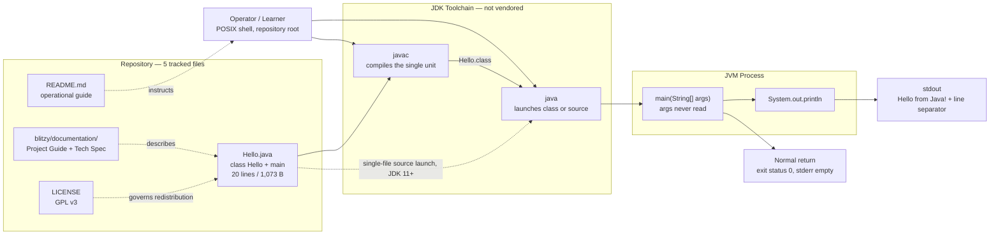
```mermaid
flowchart LR
    Operator["Operator / Learner<br/>POSIX shell, repository root"]

    subgraph RepoTree["Repository — 5 tracked files"]
        Src["Hello.java<br/>class Hello + main<br/>20 lines / 1,073 B"]
        Guide["README.md<br/>operational guide"]
        Lic["LICENSE<br/>GPL v3"]
        Docs["blitzy/documentation/<br/>Project Guide + Tech Spec"]
    end

    subgraph Toolchain["JDK Toolchain — not vendored"]
        Javac["javac<br/>compiles the single unit"]
        Java["java<br/>launches class or source"]
    end

    subgraph Runtime["JVM Process"]
        Main["main(String[] args)<br/>args never read"]
        Print["System.out.println"]
    end

    Guide -.->|"instructs"| Operator
    Docs -.->|"describes"| Src
    Lic -.->|"governs redistribution"| Src
    Operator --> Javac
    Operator --> Java
    Src --> Javac
    Javac -->|"Hello.class"| Java
    Src -.->|"single-file source launch, JDK 11+"| Java
    Java --> Main
    Main --> Print
    Print --> Out["stdout<br/>Hello from Java! + line separator"]
    Main --> Term["Normal return<br/>exit status 0, stderr empty"]
```

#### 1.2.2.3 Core Technical Approach

Six deliberate choices define the approach, each visible in the source or stated in the committed documentation:

1. **One compilation unit in the default package.** No `package` declaration means the class is launched by the bare name `Hello`; the class Javadoc names this as the reason (`Hello.java` lines 1–5).
2. **Statelessness by construction.** No fields, no instance creation, no static mutable state — so there is nothing to initialise, synchronise, or reset between runs.
3. **A single output sink.** The line comment at `Hello.java` line 16 fixes this as a design property: "Sole output: one write to standard output … no other sink is written."
4. **Termination by normal return.** No `System.exit` anywhere; `README.md` line 63 characterises this as "a deliberate property of the program rather than an omission."
5. **Zero external dependencies, zero configuration.** Nothing to resolve or download before building (`README.md` line 18); no environment variable or secret is read by any tracked file (`Project Guide.md` Appendix E).
6. **Documentation as the delivery mechanism.** With the program fixed, the project's output is explanatory: in-source Javadoc on the class and `main`, two inline comments on the output and termination paths, and an eight-section README that states the contract an operator can verify.

Toolchain versions are recorded rather than enforced: `blitzy/documentation/Project Guide.md` Appendix D reports OpenJDK 25.0.3 for `java`, `javac`, and `javadoc`, notes that "the compile-then-run path was exercised at release targets 11, 17 and 21," and records that no `--release` or `--source` setting exists anywhere in the repository.

### 1.2.3 Success Criteria

#### 1.2.3.1 Measurable Objectives

Every objective below is stated as an observable, binary condition drawn from the committed documentation or the source.

| # | Objective | Observable Condition |
| --- | --- | --- |
| O-1 | Compile cleanly | `javac Hello.java` exits 0 with no diagnostics (`README.md` line 30); `Project Guide.md` §3 records zero diagnostics even under `-Xlint:all -Werror` |
| O-2 | Produce the exact output | stdout is `Hello from Java!` plus one platform line separator (`README.md` lines 57–63) |
| O-3 | Keep stderr empty and exit 0 | No diagnostic output; termination via normal return (`README.md` line 63) |
| O-4 | Be argument-insensitive | Output identical with or without arguments; `args` never dereferenced (`Hello.java` lines 11–13) |
| O-5 | Keep both launch paths equivalent | `java Hello` and `java Hello.java` give byte-identical stdout (`README.md` line 46) |
| O-6 | Document every written functionality | Class Javadoc, `main` Javadoc with `@param args`, and comments on the output and termination paths (`Hello.java`; `README.md` line 7) |
| O-7 | Preserve behaviour across the documentation change | The documentation upgrade added comments only; runtime behaviour and stored byte format unchanged (`Project Guide.md` §4) |

#### 1.2.3.2 Critical Success Factors

- **Behaviour preservation under edit.** The value of the artifact lies in its predictability, so any change must keep the single `println`, the ignored `args`, and the `System.exit`-free termination intact.
- **Dependency-free buildability.** Introducing any manifest or third-party import would forfeit the "a JDK alone builds and runs it" property that makes the program a clean toolchain probe.
- **Documentation that matches the tree.** The two committed layout claims are already stale (`README.md` line 67; `Project Guide.md` Appendix C), which is the concrete failure mode this factor guards against.
- **Working-tree cleanliness without an ignore rule.** Because no `.gitignore` exists, the documented `mktemp -d` compile destination is the control that keeps `Hello.class` out of the checkout (`README.md` line 30).
- **Byte-format stability.** `Hello.java` is CRLF throughout with no `.gitattributes`; an editor or platform that normalises endings would rewrite all 20 lines.
- **Owner decisions on the open items.** Six of the eleven open items in `Project Guide.md` §1.4 are explicitly "Owner decision" — version pinning, licence notice, line-ending policy, ignore rule, release and signing infrastructure.

#### 1.2.3.3 Key Performance Indicators

These are the indicators the repository itself measures. No service-level, latency, throughput, availability, or user-volume target exists anywhere in the repository, and none is asserted.

| KPI | Target | Observed Baseline | Source of Observation |
| --- | --- | --- | --- |
| Compiler diagnostics | 0 | 0, including under `-Xlint:all -Werror` | `Project Guide.md` §3 (JDK 25.0.3) |
| Acceptance and toolchain checks passed | 49 of 49 | 49 executed, 49 passed, 0 failed (37 assertions + 12 toolchain checks) | `Project Guide.md` §3 |
| Javadoc coverage of documentable members | Maximum attainable | 2 of 3; the implicit constructor can carry no doc comment | `Project Guide.md` §3, §1.4 |
| Outstanding `javadoc` warnings | Accepted at 1 | 1 — `Hello.java:6: warning: use of default constructor…` | `Project Guide.md` §9.6 |
| Committed automated test coverage | None in scope | No committed test suite; adding one declared out of scope | `Project Guide.md` §3 |
| Open items | Tracked, not zero | 11 open; "No defect is open in the delivered code" | `Project Guide.md` §1.4 |
| Reported completion | 38.0 h total | 84.2% — 32.0 of 38.0 hours; 6.0 h remaining | `Project Guide.md` §1.2, §2.3 |
| Executable footprint | Minimal by intent | 1 source file, 20 lines, 1,073 bytes, 1 method, 1 statement | Direct measurement of `Hello.java` |
| Documentation-to-code ratio | Not targeted; observed | 884,733 documentation bytes vs. 1,073 source bytes | Direct measurement of tracked files |

The completion, hours, and check-count figures are the repository's own reported values, quoted as recorded in `blitzy/documentation/Project Guide.md`; they were not re-derived here, because no JDK is installed in the environment used to produce this specification.


## 1.3 Scope

### 1.3.1 In-Scope

#### 1.3.1.1 Core Features and Functionalities

**Must-have capabilities.** The system's committed functionality is exhaustively enumerable, because it is one statement in one method in one file.

| ID | Must-Have Capability | Acceptance Condition |
| --- | --- | --- |
| C-1 | A single compilable Java source file requiring only a JDK | `javac Hello.java` succeeds with exit 0 and no diagnostics |
| C-2 | A launchable entry point reachable by the bare class name | `java Hello` runs the class from the default package |
| C-3 | Emission of the fixed greeting to standard output | stdout carries `Hello from Java!` plus one platform line separator |
| C-4 | Clean, silent termination | stderr empty, exit status 0, no `System.exit` call |
| C-5 | Argument insensitivity | `args` accepted but never dereferenced; output unchanged by any arguments |
| C-6 | Equivalence of both documented launch paths | `java Hello` and `java Hello.java` produce byte-identical stdout |
| C-7 | An operational guide covering build, run, and output | `README.md` supplies Requirements, Build, Run, and Expected Output sections |
| C-8 | Explicit licence terms | Verbatim GPL v3 text present in `LICENSE` and referenced from `README.md` |
| C-9 | Self-explaining source | Class Javadoc, `main` Javadoc with `@param args`, and comments on the output and termination paths |

**Primary user workflows.** All four are documented in `README.md` and require nothing beyond a JDK, a POSIX shell, and the repository root as the working directory.

| ID | Workflow | Commands / Steps | Source |
| --- | --- | --- | --- |
| W-1 | Compile in place, then run | `javac Hello.java` → `java Hello` | `README.md` lines 27, 37 |
| W-2 | Compile to a fresh directory outside the checkout, then run | `B="$(mktemp -d)" && javac -d "$B" Hello.java` → `java -cp "$B" Hello` | `README.md` line 30 |
| W-3 | Launch the source file directly, leaving no class file | `java Hello.java` (requires JDK 11 or later) | `README.md` lines 40–44 |
| W-4 | Verify the output contract | Compare stdout to the literal, confirm stderr empty and exit status 0 | `README.md` lines 57–63 |

W-2 is the path the guide recommends: `mktemp -d` "returns a uniquely named one readable only by its owner, whereas a fixed, predictable destination can be pre-created, replaced or redirected through a symbolic link by another local process before the compiler writes into it," and either way the guide instructs, "Do not commit the class file."

**Essential integrations.** In scope are precisely the four interfaces in §1.2.1.3: the JDK toolchain (`javac`, `java`, and `javadoc` for the coverage check), the operating-system process contract (stdout, stderr, exit status), Git with its hosting platform, and the GPL v3 obligations attached to the covered work. Nothing else is integrated.

**Key technical requirements.**

| Requirement | Specified Value | Source |
| --- | --- | --- |
| Toolchain | A JDK; no other software required | `README.md` line 18 |
| Version floor — compile-then-run | None stated; documented as working on "considerably older releases" | `README.md` line 20 |
| Version floor — single-file source launch | JDK 11 or later | `README.md` line 20 |
| Dependencies | None; no manifest, nothing to resolve or download | `README.md` line 18 |
| Configuration | None; no environment variable or secret read by any tracked file | `Project Guide.md` Appendix E |
| Static-analysis surface | `javac -Xlint:all -Werror`; no linter configured | `Project Guide.md` Appendix F |
| Comment-coverage tool | `javadoc -Xdoclint:all`; HTML output never committed | `Project Guide.md` Appendix F |
| Stored source format | `Hello.java` CRLF on all 20 lines, pure ASCII, no `.gitattributes` | Direct measurement |

#### 1.3.1.2 Implementation Boundaries

**System boundary.** The system is the JVM process launched from `Hello.java` and the tracked files that describe and license it. Inside the boundary: one compilation unit, one entry point, one output statement, the operational guide, the licence, and the two generated documents under `blitzy/documentation/`. Outside the boundary: the JDK itself (required but not vendored), the host operating system that supplies the line separator, Git and its hosting platform, and any `Hello.class` produced by a build — an untracked artifact the guide explicitly instructs must not be committed.

| Boundary Dimension | In Scope | Evidence |
| --- | --- | --- |
| Executable surface | One process, one thread of control, one statement of work | `Hello.java` lines 15–19 |
| Input surface | None — no stdin read, no file read, no arguments consulted | `Hello.java` lines 11–13 |
| Output surface | Standard output only; stderr deliberately left empty | `Hello.java` line 16; `README.md` line 63 |
| Persistence surface | None — no state kept between or within runs | `README.md` line 12 |
| Network surface | None — no port bound, no listener, no network call | `Project Guide.md` Appendix B |
| Tracked footprint | 5 files, 925,008 bytes, one subdirectory (`blitzy/documentation/`) | `git ls-files`; direct measurement |

**User groups covered.** Operators and learners who build and run the program, maintainers who edit the source, the repository owner who holds the outstanding decisions, the automated documentation agents that author `blitzy/documentation/`, and downstream recipients exercising GPL v3 rights. The system defines no roles, accounts, or permissions of its own; it has no authentication or authorisation surface, so "user group" here means audience, not an access-control construct.

**Geographic and market coverage.** Not applicable in any deployment sense — there is no hosted service, no region, no tenancy model. The only host-dependent aspect of behaviour is the line separator: `README.md` line 63 records that the separator "is the one the host defines, so the exact byte count varies between platforms; the literal and its single trailing separator do not." No locale handling, resource bundle, or character-set configuration exists; the greeting is a hard-coded ASCII literal in `Hello.java` line 17, and `Hello.java`, `README.md`, and `LICENSE` contain no byte at or above `0x80`.

**Data domains included.** There is exactly one data element in the system — the compile-time string constant `Hello from Java!` — and one derived value, the platform line separator supplied by the runtime. There is no schema, no record, no file format, no serialisation, and no data at rest or in transit. `blitzy/documentation/Project Guide.md` §6 states that the application has no input, resource, network, authentication, authorisation, dependency, or data-at-rest surface.

### 1.3.2 Out-of-Scope

#### 1.3.2.1 Explicitly Excluded Features and Capabilities

Each exclusion below was confirmed by direct inspection of the working tree, not inferred.

| Excluded Capability | Verification |
| --- | --- |
| Build automation / dependency management | No `pom.xml`, `build.gradle`, `build.gradle.kts`, `settings.gradle`, `build.xml`, or `Makefile` |
| Modularisation | No `module-info.java`; the class sits in the default package |
| Automated testing | No test suite and no test directory; `Project Guide.md` §3 declares adding one out of scope |
| Continuous integration / delivery | No `.github/`, `.circleci/`, `Jenkinsfile`, or `.travis.yml`; `Project Guide.md` §1.4: "Nothing re-runs the documentation checks on future changes" |
| Containerisation / orchestration / IaC | No `Dockerfile`, `docker-compose.yml`, or any infrastructure descriptor |
| Persistence and data services | No database, broker, or cache (`Project Guide.md` Appendix B) |
| Network services, APIs, ports | No port bound, no listener, no network call (`Project Guide.md` Appendix B) |
| User interface of any kind | Console output only; no UI, hosted page, or port (`Project Guide.md` §4) |
| Authentication, authorisation, secrets | No credential, key, environment variable, or secret read by any tracked file (`Project Guide.md` §1.5) |
| Configuration management | No configuration file; no `.editorconfig`; nothing to tune |
| Logging, metrics, tracing, monitoring | No logging framework and no diagnostic output — stderr is deliberately empty |
| Input handling and validation | `args` never dereferenced; no stdin, file, or resource is read |
| Explicit error handling | No `try`/`catch`, no thrown exception, no error branch anywhere in `Hello.java` |
| Internationalisation / localisation | Hard-coded ASCII literal; no resource bundle or locale logic |
| Concurrency | Single-threaded `main`; no thread, executor, or synchronisation construct |
| Release engineering and versioning | Zero tags across 14 commits; no version pinned anywhere |
| Repository hygiene controls | No `.gitignore`, no `.gitattributes`, no per-file copyright header |
| Governance files | No `CONTRIBUTING.md`, `SECURITY.md`, or `CODEOWNERS` |

#### 1.3.2.2 Future Phase Considerations

`blitzy/documentation/Project Guide.md` §1.6 and §2.2 record the deferred work with its own priorities and estimates, totalling 6.0 hours. These are the repository's recorded intentions, not commitments made by this specification.

| Deferred Item | Priority | Recorded Effort |
| --- | --- | --- |
| Run the comment-census verification with the pre-comment revision as its baseline | High | 1.0 h |
| Publish the branch and merge the change (`main` is 11 commits behind `jr_java1`) | High | 0.5 h |
| Decide citation coverage — two stable-symbol references, or every body section | Medium | 1.0 h |
| Confirm the "JDK 11 or later" floor on a real JDK 11 runtime, or soften the claim | Medium | 1.0 h |
| Review the rendered guide on the hosting platform (emphasis, tables, fences, links) | Medium | 0.5 h |
| Take the hygiene decisions: licence notice, ignore rule, line-ending policy, version pin | Low | 2.0 h |

The guide classes four further items — verification-oracle, release, policy, and commit-signing infrastructure — as "Non-documentation items outside this scope," each marked "Owner decision" and "Deferred," and records confidence in the remaining estimates as medium "because four of the six items are decisions whose scope the owner sets rather than fixed units of work."

A seventh consideration arises from direct observation rather than the guide: the layout claims in `README.md` line 67 and `Project Guide.md` Appendix C — three tracked files, no subdirectory — no longer match the five-file tree containing `blitzy/documentation/`, and correcting them is not covered by any recorded item.

#### 1.3.2.3 Integration Points Not Covered

No integration exists beyond the four in §1.3.1.1. Specifically excluded are service registries and artifact repositories (no coordinates are declared, so the program is never published or consumed as a dependency); package managers (`Project Guide.md` §9 records that none is required); message brokers, caches, and databases (Appendix B); identity providers and secret stores (§1.5); external monitoring or log aggregation; and any HTTP, RPC, or file-based interface. `JAVA_HOME` is explicitly not an integration point: Appendix E records it as not required and "not used by anything in this project."

#### 1.3.2.4 Unsupported Use Cases

| Unsupported Use Case | Reason |
| --- | --- |
| Driving behaviour through command-line arguments | `args` is never dereferenced; output is identical whether or not arguments are supplied |
| Supplying input on stdin or reading any file | No input path exists in `Hello.java` |
| Reusing `Hello` as a library from packaged code | The class is declared in the default package, which code in a named package cannot import |
| Single-file source launch on a JDK earlier than 11 | `java Hello.java` requires JDK 11 or later (`README.md` line 20); the compile-then-run path must be used instead |
| Running without a JDK on the host | A JDK is the sole prerequisite and is not vendored in the repository |
| Relying on a fixed stdout byte count across platforms | The line separator is host-defined; only the literal and its single trailing separator are invariant |
| Treating a non-zero exit status or stderr content as a program state | The program has exactly one outcome: empty stderr and exit status 0 |
| Expecting a committed gate to validate a change | No build descriptor, test suite, or CI workflow is committed |
| Using the program as a performance, load, or soak benchmark | No measurement, instrumentation, or timing exists; no such target is recorded anywhere |
| Deploying it as a service | No listener, no port, no packaging, and no deployment descriptor exist |


## 1.4 References

### 1.4.1 Repository Files Examined

- `Hello.java` - The entire executable system; read in full (20 lines). Established the default-package `public class Hello` at line 6, the `main` entry point at line 15, the sole `System.out.println("Hello from Java!")` at line 17, the class Javadoc (lines 1–5) and `main` Javadoc with `@param args` (lines 7–14), the inline comments on the output path (line 16) and the termination path (line 18), and the absence of any package statement, import, field, explicit constructor, `try`/`catch`, or `System.exit`. Measured at 1,073 bytes with CRLF on all 20 lines and no byte at or above `0x80`.
- `README.md` - The operational guide; read in full (77 lines, 4,053 bytes, LF-only). Established the 2026-09-16 change summary (lines 5–8), the overview definition of a stateless single-class console application (line 12), the JDK-only requirement and absence of version pinning (line 18), the JDK-11 floor for single-file source launch (line 20), both build paths including the `mktemp -d` recommendation and the untracked-`Hello.class` warning (lines 27, 30), both launch paths and the two-row argument contract (lines 37–51), the output contract of literal plus platform separator with empty stderr and exit status 0 (lines 57–63), the now-stale flat-three-file layout claim (line 67), and the GPLv3 reference (line 77).
- `LICENSE` - The complete GNU General Public License, Version 3, 29 June 2007; confirmed at 674 lines / 35,149 bytes, LF-only, pure ASCII. Established the licensing and redistribution terms governing the covered work.
- `blitzy/documentation/Project Guide.md` - Project-status report, validation record, and development guide (476 lines / 45,009 bytes). Supplied the 84.2%-complete / 32.0-of-38.0-hours figures (§1.2, §2.3), the 49-of-49 acceptance-and-toolchain check result and the zero-diagnostic `-Xlint:all -Werror` compile on JDK 25.0.3 (§3), the declaration that no test suite is committed and that adding one is out of scope (§3), the javadoc coverage of 2 of 3 documentable members and the single default-constructor warning (§3, §9.6), the console-only runtime validation (§4), the no-input/no-network/no-data-at-rest risk baseline (§6), the eleven open items with their owners (§1.4), the no-access-issues and no-secrets findings (§1.5), the 6.0 hours of deferred work with priorities (§1.6, §2.2), and Appendices B (no port, service, database, broker, or cache), C (key file locations, with its own stale flatness claim), D (OpenJDK 25.0.3; no declared language level; release targets 11, 17, 21; git 2.51.0), E (`JAVA_HOME` not required; no variable or secret read), and F (`javac -Xlint:all -Werror` as the static-analysis surface, `javadoc -Xdoclint:all`, git for the baseline).
- `blitzy/documentation/Technical Specifications.md` - The prior generation of this specification (8,321 lines / 839,724 bytes); counted in the tracked-byte census and identified as a documentation artifact. Its content was not used as a source of technical findings for this section.

### 1.4.2 Repository Folders Examined

- `` (repository root) - Established the four first-order children: `LICENSE`, `Hello.java`, `README.md`, and `blitzy/`. Confirmed by existence test the absence of `pom.xml`, `build.gradle`, `build.gradle.kts`, `settings.gradle`, `build.xml`, `Makefile`/`makefile`, `.gitignore`, `.gitattributes`, `.java-version`, `.sdkmanrc`, `module-info.java`, `Dockerfile`, `docker-compose.yml`, `.editorconfig`, `CONTRIBUTING.md`, `SECURITY.md`, `CODEOWNERS`, `.github/`, `.circleci/`, `.travis.yml`, `Jenkinsfile`, `requirements.txt`, and `package.json`.
- `blitzy/` - Documentation-only folder whose single child is `blitzy/documentation/`.
- `blitzy/documentation/` - The repository's only leaf directory, holding `Project Guide.md` and `Technical Specifications.md`. A full tree walk confirmed these are the only two directories in the working tree — there is no `src/` and no `test/`.

### 1.4.3 Repository State and Measurements

- `git ls-files -s` - Established the five tracked files and their blob identifiers: `Hello.java` (`3fd76ce`), `LICENSE` (`f288702`), `README.md` (`3956e03`), `blitzy/documentation/Project Guide.md` (`888336e`), `blitzy/documentation/Technical Specifications.md` (`231e2f1`).
- `git log`, `git tag`, `git branch -a`, `git rev-list --left-right --count main...jr_java1` - Established 14 commits on `HEAD` (`jr_java1` at `2a78292`, a merge of pull request #1), the three-era history (`c537a19`, `f1847fa`, `0726b1d` by `rjhonsi`; the documentation-upgrade commits `3c3af75`, `dabe2c9`, `14ed6db`, `ce8e85c`; the generated-documentation rounds `1b99a4b` through `b4a1188`), ten commits authored by "Blitzy Agent" and the merge by `blitzy-qa[bot]`, zero tags, and the `0 11` count proving `main` is an ancestor of `jr_java1` and 11 commits behind it.
- `git status --porcelain` - Established a clean tracked tree with one untracked working-tree file, `tech_spec.md`, which is a documentation artifact rather than part of the delivered system.
- `wc`, `grep`, `od -c` measurements - Established the per-file line and byte counts used throughout this section, the CRLF/LF split (`Hello.java` CRLF on all 20 lines; `README.md`, `LICENSE`, and `Project Guide.md` LF-only), the ASCII purity of the three root files against 76 and 1,002 non-ASCII lines in the two generated documents, and the 16-character / 17-byte-with-LF size of the `Hello from Java!` payload.
- Toolchain probe (`command -v java`, `command -v javac`, `JAVA_HOME`, `/usr/lib/jvm`) - Established that no JDK is installed in the environment used to produce this section, which is why every behavioural statement here is static or attributed to the repository's own committed records.

No external or web sources were used for this section; all findings derive from the repository itself.


# 2. Product Requirements

## 2.1 Feature Catalog

This section decomposes the `Hello` repository into discrete, individually testable features. The system is unusually small — the entire executable surface is five non-comment lines in `Hello.java` — so the catalog is exhaustive rather than representative: every feature below corresponds to an artifact or an observable behaviour that exists in the tree at `HEAD` (`2a78292`), and no feature is asserted that is not anchored in a file.

### 2.1.1 Catalog Scope, Closure and Provenance

**How this catalog was derived.** Each feature maps to one of the nine must-have capabilities enumerated in Section 1.3.1.1 (`C-1` … `C-9`) and is anchored to a verified artifact. The behavioural features (F-001 … F-003) were derived by static reading of `Hello.java`, whose complete executable content is five lines — the class declaration (line 6), the entry-point signature (line 15), the single `System.out.println("Hello from Java!")` (line 17) and the two closing braces (lines 19–20). The remaining features correspond to tracked artifacts: the toolchain contract implied by the absence of every build descriptor, the Git distribution channel, `LICENSE`, `README.md`, the in-source comment set, and `blitzy/documentation/`.

| Feature ID | Feature Name | Category | Priority |
| --- | --- | --- | --- |
| F-001 | JVM Entry-Point Contract | Runtime Interface | Critical |
| F-002 | Fixed Console Message Emission | Output Behaviour | Critical |
| F-003 | Deterministic Normal Termination | Process Lifecycle | High |
| F-004 | Dependency-Free JDK-Only Build and Launch | Build & Toolchain | High |
| F-005 | Source-Only Distribution via Git Remote | Distribution | Medium |
| F-006 | GPLv3 Licensing and Redistribution Terms | Legal & Compliance | High |
| F-007 | Operator Guide in `README.md` | Documentation | High |
| F-008 | In-Source Explanatory Documentation | Documentation | Medium |
| F-009 | Project-Status and Development Record | Documentation | Low |

| Feature ID | Status | Primary evidence anchor |
| --- | --- | --- |
| F-001 | Completed | `Hello.java` lines 6, 15; no `package` statement in the file |
| F-002 | Completed | `Hello.java` line 17 (the only `println` in the tree) |
| F-003 | Completed | `Hello.java` lines 18–19; zero `System.exit(` matches |
| F-004 | Completed — one verification partial | Verified absence of all 26 candidate build/CI/config descriptors; zero `import` statements |
| F-005 | Completed — publication item open | `git ls-files` = 5 files; `git tag` = 0; six remote refs; `main` 11 commits behind `HEAD` |
| F-006 | Completed — one accepted gap | `LICENSE` lines 1–2, 674 lines / 35,149 bytes; `README.md` line 77 |
| F-007 | Completed — two partials | `README.md`, 77 lines, eight section headings at lines 3, 10, 16, 22, 32, 55, 65, 75 |
| F-008 | Completed — coverage 2 of 3 | `Hello.java` lines 1–5, 7–14, 16, 18 |
| F-009 | Completed | `blitzy/documentation/Project Guide.md`, 476 lines / 45,009 bytes |

**Priority basis.** `Critical` marks a feature without which the program cannot be launched or cannot produce its documented output at all; `High` marks a feature whose loss would break a must-have capability or a licence obligation without preventing launch; `Medium` and `Low` mark features that support comprehension, distribution or project governance. No priority is inherited from a commercial or contractual source — the repository records none.

**Status basis.** Every feature is `Completed` in the sense that its artifact exists and is tracked at `HEAD`. Four features carry qualifiers because `blitzy/documentation/Project Guide.md` §1.4 records **11 open items** alongside the statement that "No defect is open in the delivered code": the unverified JDK 11 floor (F-004), the unpublished default branch (F-005), the absent per-file copyright notice (F-006), the partial citation coverage and the stale layout claim (F-007), and the accepted `javadoc` default-constructor warning (F-008). No feature is `Proposed`, `Approved` or `In Development`; the repository contains no backlog, roadmap or issue tracker in which such a status could be recorded.

**Relationship to the repository's own committed register.** The repository already contains a feature register: `blitzy/documentation/Technical Specifications.md` §2.1 catalogues seven features (F-001 … F-007) and 27 requirements, and its §2.6.3 anchors that register at **version 1.0, commit `0726b1d`**. This catalogue deliberately preserves those identifiers and, for F-001 … F-006, their names and categories, so that traceability across the two generations is unbroken. Three changes are recorded against the committed register, each verified against the tree at `HEAD`:

| Change | Reason, verified at `HEAD` (`2a78292`) |
| --- | --- |
| F-007 renamed from "Repository README Documentation Artifact" and re-prioritised from `Low` to `High` | At `0726b1d` `README.md` was 41 bytes on one line ("This is a Readme file - nothing specific"); at `HEAD` it is a 77-line, eight-section operator guide credited 8.0 hours in `Project Guide.md` §2.1 and it carries must-have capability `C-7` |
| F-008 added | The four in-source comments at `Hello.java:1-5`, `:7-14`, `:16`, `:18` did not exist at `0726b1d`, where the file was five lines / 127 bytes with no comment; they satisfy capability `C-9` |
| F-009 added | `blitzy/documentation/` did not exist at `0726b1d`; `Project Guide.md` was first committed in `1b99a4b` and is inside the system boundary per Section 1.3.1.2 |

**Catalog closure.** No tenth feature is identifiable. Existence tests at the repository root report absence for all of `pom.xml`, `build.gradle`, `build.gradle.kts`, `settings.gradle`, `build.xml`, `Makefile`, `makefile`, `.gitignore`, `.gitattributes`, `.java-version`, `.sdkmanrc`, `module-info.java`, `Dockerfile`, `docker-compose.yml`, `.editorconfig`, `Jenkinsfile`, `.travis.yml`, `requirements.txt`, `package.json`, `CONTRIBUTING.md`, `SECURITY.md`, `CODEOWNERS`, `.github/`, `.circleci/`, `src/` and `test/`, and `git ls-files` contains no `.class`, `.jar`, `.war` or `.zip` entry. There is therefore no persistence, network, interface, configuration, packaging or automation feature to catalogue.

### 2.1.2 F-001 — JVM Entry-Point Contract

| Attribute | Value |
| --- | --- |
| Unique ID | F-001 |
| Feature Name | JVM Entry-Point Contract |
| Feature Category | Runtime Interface |
| Priority Level | Critical |
| Status | Completed |

**Description**

- **Overview.** `Hello.java` line 6 declares `public class Hello` with no `package` statement, and line 15 declares `public static void main(String[] args)` as its only member. This is the sole mechanism by which any code in the repository becomes executable: the JVM resolves the class by the bare name `Hello` and invokes `main`. The class declares no field, no explicit constructor and creates no instance — a grep for field and constructor declarations returns only the class and `main` signature lines.
- **Business value.** It is what makes the repository a runnable toolchain probe rather than an inert source listing. Because the class sits in the default package, the launch command is the shortest form the platform allows, with no directory layout, classpath root or module path to establish first.
- **User benefits.** An operator types `java Hello` and the program runs; `blitzy/documentation/Project Guide.md` §9.8 records the matching failure mode and its resolution ("the class is in the default package, so the bare name is correct"). Arguments may be supplied freely: the `main` Javadoc at `Hello.java:11-13` states that `args` is "accepted only to satisfy the signature the JVM requires of an entry point and deliberately never read".
- **Technical context.** `args` occurs on exactly two lines of the file — line 11 (the Javadoc `@param` tag) and line 15 (the signature) — and on no executable line, so non-dereference is a static property of the source rather than a runtime observation. The file name matches the public class, which is the precondition for single-unit compilation; `Project Guide.md` §9.8 records the diagnostic produced when that correspondence is broken (`error: class Hello is public, should be declared in a file named Hello.java`).

| Dependency type | Detail |
| --- | --- |
| Prerequisite features | None — F-001 is the root of the runtime dependency chain |
| System dependencies | A JVM supplied by the JDK (F-004); the class-loading and `main`-resolution contract of the platform |
| External dependencies | The implicitly imported `java.lang` package only; the file declares no `import` |
| Integration requirements | The operating-system process contract — the JVM is launched as a process and `main` is invoked once; no other integration surface exists |

### 2.1.3 F-002 — Fixed Console Message Emission

| Attribute | Value |
| --- | --- |
| Unique ID | F-002 |
| Feature Name | Fixed Console Message Emission |
| Feature Category | Output Behaviour |
| Priority Level | Critical |
| Status | Completed |

**Description**

- **Overview.** `Hello.java` line 17 performs `System.out.println("Hello from Java!")`. This is the entire work of the program: one write of a 16-character ASCII literal followed by one platform line separator. The preceding comment on line 16 fixes the property as deliberate — "Sole output: one write to standard output … no other sink is written."
- **Business value.** It supplies a fixed, byte-level oracle. `README.md` lines 57–63 publish the expected output as a fenced block, and `Project Guide.md` §4 records that "the fenced expected-output block compares byte-identical to real standard output", so the artifact can be used as a reference point whose correct behaviour is known in advance.
- **User benefits.** The result is reproducible without configuration: the same line appears on every run, on every launch path, with or without arguments. `Project Guide.md` §4 records runs "with no arguments, many arguments, and hostile arguments including shell and injection payloads" all producing identical output.
- **Technical context.** `System.` appears on only two lines of the file — line 17 (the call) and line 18 (a comment) — so standard output is demonstrably the only sink referenced anywhere in the source. `println` rather than `print` is what appends the separator, which is host-defined; `README.md` line 63 therefore states the contract as the literal plus one trailing separator rather than a fixed byte count, and `Project Guide.md` §4 records 17 bytes on a host whose separator is LF. There is no loop, branch or conditional in the file (`for`, `while`, `if` and `switch` statement forms all return zero matches), so the emission happens exactly once per process.

| Dependency type | Detail |
| --- | --- |
| Prerequisite features | F-001 — the write executes only because `main` is invoked |
| System dependencies | The JVM's initialised `System.out` stream and the host-defined line separator |
| External dependencies | None beyond `java.lang`; no logging, formatting or i18n library is present |
| Integration requirements | The process stdout stream must be connected by the launching shell; `README.md` lines 57–63 define the contract an operator compares against |

### 2.1.4 F-003 — Deterministic Normal Termination

| Attribute | Value |
| --- | --- |
| Unique ID | F-003 |
| Feature Name | Deterministic Normal Termination |
| Feature Category | Process Lifecycle |
| Priority Level | High |
| Status | Completed |

**Description**

- **Overview.** After the single write, control returns from `main` at `Hello.java` line 19 and the JVM shuts down of its own accord. The comment on line 18 records the intent: "control returns from main with no System.exit call, so the JVM terminates normally once this method completes." A search for `System.exit(` in the file returns zero matches.
- **Business value.** It makes the program safe to embed in any shell pipeline or verification script: the exit status is a constant, so a wrapper can test it without special-casing. `README.md` line 63 calls the absence of `System.exit` "a deliberate property of the program rather than an omission".
- **User benefits.** Standard error stays empty and the exit status is 0, so a caller can distinguish a real environment failure from normal operation with no interpretation. `Project Guide.md` §9.7 shows the observed result directly: `java Hello; echo "exit=$?"` prints the greeting followed by `exit=0`.
- **Technical context.** The termination path is unconditional because there is no error path to take: the file contains no `try`, `catch`, `throw` or `new`, no `System.in` or `Scanner` reference, and no `Thread` or executor construct. `Project Guide.md` §6 states the consequence — the program "reads no input, dereferences no argument, opens no resource, binds no port, makes no network call", so there is no injection surface and no data-at-rest concern.

| Dependency type | Detail |
| --- | --- |
| Prerequisite features | F-001 (invocation) and F-002 (the work that precedes the return) |
| System dependencies | The JVM shutdown sequence; the operating-system exit-status convention |
| External dependencies | None |
| Integration requirements | The launching shell observes the exit status and the empty error stream; no other consumer exists |

### 2.1.5 F-004 — Dependency-Free JDK-Only Build and Launch

| Attribute | Value |
| --- | --- |
| Unique ID | F-004 |
| Feature Name | Dependency-Free JDK-Only Build and Launch |
| Feature Category | Build & Toolchain |
| Priority Level | High |
| Status | Completed — the JDK 11 floor for the single-file launch path is not verified on a JDK 11 runtime |

**Description**

- **Overview.** The repository is built and launched with the JDK alone. `README.md` line 18 states it plainly — "A JDK is all that is required" — and records that the repository "pins no Java version" and "has no dependency manifest, so nothing has to be resolved or downloaded before building". Three launch forms are documented and recorded as verified in `Project Guide.md` §9.5: `java -cp "$B" Hello`, `java Hello`, and `java Hello.java`.
- **Business value.** Zero setup cost and zero supply-chain surface. `Project Guide.md` §9.3 answers dependency installation with a single word — "None." — and §1.5 records that "no credential, key, network egress, environment variable or secret is used by anything in this project".
- **User benefits.** Two interchangeable workflows suit different needs: compile-then-run works on "considerably older releases" (`README.md` line 20) and was exercised at release targets 11, 17 and 21; single-file source launch needs JDK 11 or later and "leaves no class file behind" (`README.md` line 40). `README.md` line 46 records that "Both paths produce byte-identical standard output".
- **Technical context.** One compilation unit, zero `import` statements, no `module-info.java`, and no `--release` or `--source` setting anywhere in the repository (`Project Guide.md` Appendix D records the language level as "None declared"). `javac -Xlint:all -Werror` is the project's entire static-analysis surface, "as no linter is configured" (Appendix F), and it compiles clean. Because no `.gitignore` exists, an in-place compile leaves an untracked `Hello.class`; `README.md` line 30 supplies the out-of-tree alternative `B="$(mktemp -d)" && javac -d "$B" Hello.java` with the matching `java -cp "$B" Hello`, and explains the choice of a freshly generated owner-only directory over "a fixed, predictable destination [that] can be pre-created, replaced or redirected through a symbolic link by another local process".

| Dependency type | Detail |
| --- | --- |
| Prerequisite features | F-001 (the unit to compile and the class to launch) |
| System dependencies | `javac` and `java` on `PATH`; a POSIX shell for the documented commands; `mktemp -d` for the recommended build destination |
| External dependencies | A JDK, not vendored in the repository. `Project Guide.md` Appendix D records OpenJDK 25.0.3 as the version used; `JAVA_HOME` is explicitly not required (Appendix E) |
| Integration requirements | The JDK toolchain interface only. No package manager, virtual environment, container, database, broker or bound port is involved (`Project Guide.md` §9.1) |

### 2.1.6 F-005 — Source-Only Distribution via Git Remote

| Attribute | Value |
| --- | --- |
| Unique ID | F-005 |
| Feature Name | Source-Only Distribution via Git Remote |
| Feature Category | Distribution |
| Priority Level | Medium |
| Status | Completed — the delivered documentation is not yet reachable on the default branch |

**Description**

- **Overview.** The program is consumed as source from a clone. `git ls-files` returns five tracked files — `Hello.java`, `LICENSE`, `README.md` and the two documents under `blitzy/documentation/` — with no compiled or packaged artifact among them, and `git tag` returns zero tags across the 14 commits.
- **Business value.** There is no release line, artifact repository or coordinate to maintain, so distribution costs nothing and cannot drift from the source. Nothing can be consumed as a stale binary because no binary is published.
- **User benefits.** A clone is sufficient to build, run, read and redistribute the work; the tracked tree is small enough to read in full (925,008 bytes, of which 1,073 are source).
- **Technical context.** Six remote refs exist (`origin/HEAD` → `origin/main`, `origin/main`, `origin/jr_java1`, `origin/jr_java2`, `origin/jr_java3` and `origin/blitzy-6d6c8680-f3ef-4055-9d11-0fc35e375843`), and `git rev-list --left-right --count main...HEAD` reports `0 11` — `main` is an ancestor of the working branch and 11 commits behind it, so the entire documentation delivery is absent from the default branch. `Project Guide.md` §1.6 lists "Push the branch and merge the two-file change" as a High-priority 0.5-hour item. Stored byte format is part of what is distributed: `Hello.java` carries CRLF on all 20 lines while `README.md` and `LICENSE` are LF-only, and no `.gitattributes` exists to normalise either; `Project Guide.md` §5.2 records that normalising would "rewrite all five code lines and change the file's content digest".

| Dependency type | Detail |
| --- | --- |
| Prerequisite features | F-001, F-006, F-007, F-008, F-009 — the artifacts being distributed |
| System dependencies | `git` (Appendix D records 2.51.0) and the working tree; no build or packaging step participates |
| External dependencies | The Git hosting platform that holds the remote refs and merged pull request #1 (`2a78292`) |
| Integration requirements | Clone, branch and merge only. No artifact repository, package manager or registry is involved; no group or artifact coordinate is declared anywhere |

### 2.1.7 F-006 — GPLv3 Licensing and Redistribution Terms

| Attribute | Value |
| --- | --- |
| Unique ID | F-006 |
| Feature Name | GPLv3 Licensing and Redistribution Terms |
| Feature Category | Legal & Compliance |
| Priority Level | High |
| Status | Completed — the per-file copyright and warranty notice advised by the licence appendix is deliberately absent |

**Description**

- **Overview.** `LICENSE` holds the verbatim GNU General Public License, Version 3, 29 June 2007 (674 lines / 35,149 bytes, opening "GNU GENERAL PUBLIC LICENSE / Version 3, 29 June 2007"), and `README.md` line 77 states the licence and links to it.
- **Business value.** Redistribution rights are explicit rather than assumed, which is what makes the repository usable as teaching and reference material without further negotiation.
- **User benefits.** A downstream recipient can determine the terms from the root of the checkout, in one file, with no external reference; the README pointer is a working relative link.
- **Technical context.** The licence governs a covered work that was modified, so `README.md` line 5 carries the dated notice "*Modified 2026-09-16.*" and `Project Guide.md` §5.1 row 8 records it as satisfying the "dated modification notice for a modified GPLv3 work" requirement. `LICENSE` itself was not touched by the documentation upgrade — `Project Guide.md` §1.3 records "`LICENSE` untouched" and §2.1 credits a "scope and continuity discipline" task with confirming it byte-identical at base, commit and working tree; its blob is `f288702`. The one gap is intentional: no per-file copyright header exists in `Hello.java`, because, as §5.2 records, "that notice needs a named holder and year and no tracked file records either — commit metadata identifies an author, not a rights holder."

| Dependency type | Detail |
| --- | --- |
| Prerequisite features | None; F-006 is independent of the runtime features it governs |
| System dependencies | None — no code or tool in the repository reads `LICENSE` |
| External dependencies | The GPL v3 instrument as published by the Free Software Foundation |
| Integration requirements | Travels with the source distribution channel (F-005) and is referenced from the operator guide (F-007, `README.md` line 77) |

### 2.1.8 F-007 — Operator Guide in `README.md`

| Attribute | Value |
| --- | --- |
| Unique ID | F-007 |
| Feature Name | Operator Guide in `README.md` (registered at version 1.0 as "Repository README Documentation Artifact") |
| Feature Category | Documentation |
| Priority Level | High |
| Status | Completed — citation coverage is partial and the layout section is stale |

**Description**

- **Overview.** `README.md` is a 77-line, eight-section operator guide. Its headings sit at lines 3, 10, 16, 22, 32, 55, 65 and 75: Summary of Changes, Overview, Requirements, Build, Run, Expected Output, Project Layout and Licence. It replaced a 41-byte placeholder in commit `dabe2c9`.
- **Business value.** It converts undocumented behaviour into a stated contract. `Project Guide.md` §1.1 frames the outcome: "Anyone cloning the repository now finds the toolchain, the commands and the program's contract written down rather than inferred."
- **User benefits.** Every command an operator needs is present as an executable literal — `javac Hello.java`, the `mktemp -d` alternative, `java Hello`, `java Hello.java` — together with the argument contract (lines 48–51) and the output contract (lines 57–63). `Project Guide.md` §4 records that every command the guide tells an operator to type was executed as written.
- **Technical context.** The guide cites its subject by stable symbol rather than line number — `Source: Hello.java (class Hello)` at line 14 and `Source: Hello.java (Hello.main)` at line 53 — because, as `Project Guide.md` Appendix G explains, "inserting comments shifts every line below them". Two partials are recorded against it: citations cover 2 of 7 body sections (§5.1 row 11, resolved as a conflict between a general citation rule and a fixed two-reference budget in §5.2 divergence 1), and the Project Layout claim at line 67 — "The repository is flat: three tracked files at the root, and no subdirectories" — no longer matches the five-file tree that contains `blitzy/documentation/`.

| Dependency type | Detail |
| --- | --- |
| Prerequisite features | F-001 … F-004 and F-006 — the guide documents their behaviour, commands and terms |
| System dependencies | None at runtime; the guide is never read by any code or tool in the repository |
| External dependencies | A GitHub Flavored Markdown renderer for presentation (`Project Guide.md` Appendix D); the rendered appearance is recorded as never verified |
| Integration requirements | Two relative links must resolve on disk — `[Hello.java](Hello.java)` at line 71 and `[LICENSE](LICENSE)` at line 77; travels with F-005 |

### 2.1.9 F-008 — In-Source Explanatory Documentation

| Attribute | Value |
| --- | --- |
| Unique ID | F-008 |
| Feature Name | In-Source Explanatory Documentation |
| Feature Category | Documentation |
| Priority Level | Medium |
| Status | Completed — documentable-member coverage stands at 2 of 3 by design |

**Description**

- **Overview.** `Hello.java` carries four comments, one per written functionality: the class Javadoc at lines 1–5, the `main` Javadoc with its `@param args` tag at lines 7–14, the output-path line comment at line 16 and the termination-path line comment at line 18. `Project Guide.md` §5.1 row 1 records this as 4 of 4 with those exact anchors.
- **Business value.** The non-obvious properties of the program are recorded at the point of use rather than inferred by the next reader — why the bare class name works, why `args` exists and is ignored, that one sink is written, and that termination is by normal return.
- **User benefits.** A maintainer editing the file sees the design intent in place, which is what protects the behaviour the rest of this specification depends on; the `javadoc` HTML generated from the same comments "carries both comment blocks and the parameter table" (`Project Guide.md` §4).
- **Technical context.** The change was comment-only: `Project Guide.md` §5.1 row 3 records 15 added and 0 removed lines with the five original code lines byte-identical and debug-free bytecode identical, and `git diff 0726b1d HEAD --stat` confirms `Hello.java +15`. Comment form follows the language's conventions — class block at column 0, member block at four spaces with `@param args` and no `@return`, both line comments at eight spaces (§5.1 row 2). One `javadoc` warning remains by design, at `Hello.java:6`, for the implicit default constructor; as §5.2 divergence 4 explains, "a default constructor can carry no doc comment, and declaring one is a structural change the comment-only constraint forbids." The added lines were re-emitted with CRLF so that all 20 lines remain CRLF, pure ASCII and tab-free — verified directly: 20 of 20 lines carry CR, and the file contains zero non-ASCII bytes and zero tabs.

| Dependency type | Detail |
| --- | --- |
| Prerequisite features | F-001 … F-003 — the comments document exactly those constructs |
| System dependencies | `javadoc` with `-Xdoclint:all` for the coverage and syntax check; its HTML output is never committed (`Project Guide.md` Appendix F) |
| External dependencies | Oracle's doc-comment conventions, cited as the authoring standard in `Project Guide.md` §2.1 |
| Integration requirements | Must not alter any executable line; the byte-format census (CRLF on every line) must continue to pass after any edit |

### 2.1.10 F-009 — Project-Status and Development Record

| Attribute | Value |
| --- | --- |
| Unique ID | F-009 |
| Feature Name | Project-Status and Development Record |
| Feature Category | Documentation |
| Priority Level | Low |
| Status | Completed |

**Description**

- **Overview.** `blitzy/documentation/Project Guide.md` (476 lines / 45,009 bytes) records completion status, hours, open items, test results, runtime validation, a compliance and divergence review, a risk assessment, a nine-part development guide and seven appendices. `blitzy/documentation/Technical Specifications.md` (8,321 lines) holds the prior generation of this specification. Both sit inside the system boundary defined in Section 1.3.1.2.
- **Business value.** It is the only place where the project's own measurements are recorded: 49 of 49 checks passed, 11 open items with owners, and 32.0 of 38.0 hours complete. Because no test suite or CI workflow exists, this record is the sole account of what was verified and what was not.
- **User benefits.** A maintainer gets prerequisites, setup, build paths, launch forms, verification procedures, example usage and a seven-row troubleshooting table (§9.1–§9.8), plus a command reference and toolchain versions in the appendices — all reported as executed on a Linux host with OpenJDK 25.0.3.
- **Technical context.** The record is explicit about the limits of its own evidence: §3 states that "the repository carries no committed test suite, and adding one is outside this change's scope" and lists five "Not Covered" areas, while §4 marks the version-floor claim as a partial because only JDK 25 was available. Appendix B records that no port, service, database, broker or cache exists, and Appendix E that no environment variable or secret is read by any tracked file. Appendix C repeats the same stale flatness claim found in `README.md` line 67.

| Dependency type | Detail |
| --- | --- |
| Prerequisite features | F-001 … F-008 — the record reports on their delivery and validation |
| System dependencies | `git` for the baseline comparisons in §9.6; GNU `grep`, `awk`, `diff`, `tr`, `od`, `cmp` for the structural and byte-format checks (Appendix F) |
| External dependencies | The JDK toolchain used to produce the recorded figures (OpenJDK 25.0.3); a GitHub Flavored Markdown renderer for presentation |
| Integration requirements | Travels with F-005; its verification procedures must be run from a scratch directory outside the checkout, since "build, test and CI files are out of scope for this repository" (§9.6) |


## 2.2 Functional Requirements

### 2.2.1 Basis, Conventions and Limits of the Requirement Set

The repository declares no requirements document, no service-level objective and no performance target — there is no build descriptor, test suite or CI configuration in which one could be recorded, and `blitzy/documentation/Project Guide.md` Appendix B records that there is "no service, database, broker or cache in this project". Every acceptance criterion below is therefore an **executable verification procedure derived from the artifacts**, phrased so that it can be run against the tree as it stands.

| Convention | Rule applied throughout Section 2.2 |
| --- | --- |
| Requirement ID | `F-XXX-RQ-YYY`, numbered per feature from `001`; 45 requirements across F-001 … F-009 |
| Priority | `Must-Have` = the feature's documented contract fails without it; `Should-Have` = a stated property of the artifact; `Could-Have` = advised by an external instrument or deferred by owner decision |
| Complexity | `Low` = satisfied by one line, one absence or one file; `Medium` = requires a multi-artifact or byte-level procedure; `High` = not used, because no requirement here exceeds a 20-line file or a single document |
| Requirement version | All requirements below are **version 2.0, observed at `HEAD` = `2a78292`** (see Section 2.6.3) |

**Evidence classes.** Criteria are marked in the evidence column by how they were established: *static* — verified directly against the tree while writing this section (file content, `grep`, `git`); *recorded* — executed first-hand by the project's own validation run on a Linux host with OpenJDK 25.0.3 and reported in `blitzy/documentation/Project Guide.md`; *open* — not satisfied or not verified at `HEAD`. No JDK exists in the environment used to produce this specification (`java` and `javac` are absent from `PATH`), so no criterion was executed here that requires a compiler or a JVM.

### 2.2.2 F-001 — JVM Entry-Point Contract

| Requirement ID | Description | Priority | Complexity |
| --- | --- | --- | --- |
| F-001-RQ-001 | Declare a JVM-launchable entry point with the exact signature `public static void main(String[] args)` | Must-Have | Low |
| F-001-RQ-002 | Declare the class in the default package so that it launches by the bare name `Hello` | Must-Have | Low |
| F-001-RQ-003 | Accept `String[] args` for the signature and never dereference it | Must-Have | Low |
| F-001-RQ-004 | Name the file after the single public class it declares, so the unit compiles standalone | Must-Have | Low |
| F-001-RQ-005 | Hold no instance state: no field, no explicit constructor, no instantiation | Should-Have | Low |

| Requirement ID | Acceptance criterion | Evidence at `HEAD` |
| --- | --- | --- |
| F-001-RQ-001 | `Hello.java` line 15 matches the signature character for character; a launch resolves `main` instead of reporting a missing entry point | static (line 15); recorded — three launch forms verified in `Project Guide.md` §9.5 |
| F-001-RQ-002 | A search for `^\s*package` in `Hello.java` returns zero matches and `java Hello` succeeds with the unqualified name | static (0 matches); `README.md` lines 34–38; `Project Guide.md` §9.8 row 1 |
| F-001-RQ-003 | `args` occurs only on line 11 (Javadoc `@param`) and line 15 (signature), on no executable line; output is unchanged by any argument list | static (2 occurrences); recorded — "no arguments, many arguments, and hostile arguments including shell and injection payloads all produce identical output" (`Project Guide.md` §4) |
| F-001-RQ-004 | `public class Hello` is declared at line 6 of a file named `Hello.java`; exporting the source under another name produces `error: class Hello is public, should be declared in a file named Hello.java` | static (line 6); recorded (`Project Guide.md` §9.8 row 2) |
| F-001-RQ-005 | The only declaration lines in the file are 6 and 15; searches for `\bnew\b` and for field or constructor declarations return zero matches | static; corroborated by the class Javadoc at lines 1–5 ("it has no field, creates no instance") |

| Technical aspect | Specification |
| --- | --- |
| Input parameters | `String[] args` at line 15, accepted and never read. No other input path exists — no stdin read, no file read, no environment variable, no system property |
| Output / response | F-001 produces no output of its own; it yields an invoked `main` frame. A failed resolution produces the platform message `Could not find or load main class Hello` (`Project Guide.md` §9.8) |
| Performance criteria | None is recorded anywhere in the repository. The observable bound is one method frame containing one statement, with no loop, branch or blocking call |
| Data requirements | None. No field, no schema, no record, no serialisation |

| Validation category | Rule |
| --- | --- |
| Business rules | The entry point must remain the class's only member; adding a second member would contradict the contract stated in the class Javadoc at lines 1–5 and relied on by Sections 1.2.2.2 and 1.3.1.1 |
| Data validation | Not applicable, and deliberately so — validating `args` would itself breach F-001-RQ-003 |
| Security requirements | Because `args` is never dereferenced there is no argument-injection surface; `Project Guide.md` §6 records that no injection surface exists anywhere in the program |
| Compliance requirements | Each construct carries its explanatory comment (F-008); the file is a covered work under GPL v3 (F-006) |

### 2.2.3 F-002 — Fixed Console Message Emission

| Requirement ID | Description | Priority | Complexity |
| --- | --- | --- | --- |
| F-002-RQ-001 | Write exactly the literal `Hello from Java!` to standard output | Must-Have | Low |
| F-002-RQ-002 | Append exactly one platform line separator to that literal | Must-Have | Low |
| F-002-RQ-003 | Write to standard output only; write to no other sink | Must-Have | Low |
| F-002-RQ-004 | Produce byte-identical output on both launch paths and under any argument list | Must-Have | Low |
| F-002-RQ-005 | Emit the greeting exactly once per process run | Must-Have | Low |

| Requirement ID | Acceptance criterion | Evidence at `HEAD` |
| --- | --- | --- |
| F-002-RQ-001 | `Hello.java` line 17 contains the literal as a 16-character ASCII string; captured stdout compares byte-identical to the fenced block at `README.md` lines 59–61 | static (line 17; literal measured at 16 characters); recorded — "the fenced expected-output block compares byte-identical to real standard output" (`Project Guide.md` §4) |
| F-002-RQ-002 | The call is `println`, not `print`; stdout ends with exactly one host separator, giving 17 bytes where the separator is LF | static (one `println`, zero `print(`); recorded (`Project Guide.md` §4: "17 bytes on this host"); `README.md` line 63 |
| F-002-RQ-003 | `System.` appears only on line 17 (the call) and line 18 (a comment); there is no `System.err`, file, socket or stream reference; the error stream is empty after a run | static (2 occurrences, 0 `System.err`); recorded (`Project Guide.md` §4, empty error stream) |
| F-002-RQ-004 | `java Hello` and `java Hello.java` yield identical stdout, and runs with no, many and hostile arguments yield identical stdout | recorded — Runtime behaviour and parity, 6 of 6 checks passed (`Project Guide.md` §3); `README.md` line 46; `Project Guide.md` §9.7 shows `java Hello.java one two three` producing the same line |
| F-002-RQ-005 | Exactly one `println` call exists in the tree and the file contains no loop or conditional (`for (`, `while (`, `if (`, `switch` all return zero matches) | static |

| Technical aspect | Specification |
| --- | --- |
| Input parameters | None. The payload is a compile-time constant; nothing at run time can alter it |
| Output / response | Standard output: `Hello from Java!` plus one platform line separator. Standard error: empty. This is the whole externally observable response of the system |
| Performance criteria | None is recorded. `README.md` line 63 fixes the invariant as the literal and its single trailing separator, explicitly not a byte count, "so the exact byte count varies between platforms" |
| Data requirements | One data element in the entire system — the string constant on line 17 — plus one runtime-derived value, the host line separator. No schema, file format or serialisation |

| Validation category | Rule |
| --- | --- |
| Business rules | The literal is the system's contract and may not change without invalidating `README.md` lines 57–63 and the acceptance oracle in `Project Guide.md` §4; the separator must stay host-supplied rather than hard-coded |
| Data validation | No input is validated because none is read; the output is validated by byte comparison against the published fenced block |
| Security requirements | The payload is a constant with no interpolation, so no format-string or injection vector exists; nothing is written to any sink other than stdout |
| Compliance requirements | The output statement carries its own explanatory comment at line 16 (F-008); the published expected output in `README.md` must continue to match byte for byte (F-007-RQ-002) |

### 2.2.4 F-003 — Deterministic Normal Termination

| Requirement ID | Description | Priority | Complexity |
| --- | --- | --- | --- |
| F-003-RQ-001 | Terminate by returning normally from `main`, with no `System.exit` call | Must-Have | Low |
| F-003-RQ-002 | Exit with status 0 on every run | Must-Have | Low |
| F-003-RQ-003 | Leave standard error empty; expose no exception or error path | Must-Have | Low |
| F-003-RQ-004 | Run single-threaded and unblocked, so the process always terminates | Should-Have | Low |

| Requirement ID | Acceptance criterion | Evidence at `HEAD` |
| --- | --- | --- |
| F-003-RQ-001 | A search for `System.exit(` in `Hello.java` returns zero matches; control reaches the closing brace of `main` at line 19 | static (0 matches); the line 18 comment states the property; `README.md` line 63 calls it "a deliberate property of the program rather than an omission" |
| F-003-RQ-002 | `java Hello; echo "exit=$?"` prints the greeting followed by `exit=0` | recorded (`Project Guide.md` §9.7, §4); `README.md` line 63 |
| F-003-RQ-003 | The file contains no `try {`, `catch`, `throw` or `new`; a captured error stream is empty and compares byte-identical to the pre-comment build's error stream | static (0 matches each); recorded — parity of stdout, stderr and exit status against a build of the pre-comment source (`Project Guide.md` §3, §4) |
| F-003-RQ-004 | No `Thread`, executor, `System.in` or `Scanner` reference exists and no loop construct is present, so no non-terminating or blocking path can be taken | static |

| Technical aspect | Specification |
| --- | --- |
| Input parameters | None |
| Output / response | Process exit status 0; empty standard error. No shutdown hook, no finaliser, no diagnostic output |
| Performance criteria | None is recorded. The run is bounded by one statement plus JVM start-up and shutdown; the repository states no start-up or duration target anywhere |
| Data requirements | None; no state survives the process and none is written during it |

| Validation category | Rule |
| --- | --- |
| Business rules | Exit status 0 with an empty error stream is the program's only outcome — Section 1.3.2.4 records that treating a non-zero status or stderr content as a program state is unsupported |
| Data validation | Not applicable; there is no value to validate on the termination path |
| Security requirements | No resource is opened, so nothing can leak on exit; `Project Guide.md` §6 records no resource, port or network use at all |
| Compliance requirements | The termination path carries its own explanatory comment at line 18 (F-008) and is stated in `README.md` line 63 (F-007-RQ-002) |

### 2.2.5 F-004 — Dependency-Free JDK-Only Build and Launch

| Requirement ID | Description | Priority | Complexity |
| --- | --- | --- | --- |
| F-004-RQ-001 | Require a JDK and nothing else; declare no dependency manifest and resolve nothing at build time | Must-Have | Low |
| F-004-RQ-002 | Import nothing outside the implicitly available `java.lang` | Must-Have | Low |
| F-004-RQ-003 | Compile and run through `javac Hello.java` → `java Hello` with no stated version floor | Must-Have | Low |
| F-004-RQ-004 | Support the single-file source launch `java Hello.java` on JDK 11 or later, leaving no class file | Should-Have | Medium |
| F-004-RQ-005 | Compile with zero diagnostics under the strictest available static check, `javac -Xlint:all -Werror` | Should-Have | Low |
| F-004-RQ-006 | Offer a build destination outside the checkout that keeps the working tree clean | Should-Have | Medium |

| Requirement ID | Acceptance criterion | Evidence at `HEAD` |
| --- | --- | --- |
| F-004-RQ-001 | Existence tests at the root report absence for all 26 candidate build, CI, packaging and configuration descriptors; `README.md` line 18 states "A JDK is all that is required" | static (26 of 26 absent); `Project Guide.md` §9.3 answers dependency installation with "None." |
| F-004-RQ-002 | A search for `^\s*import` in `Hello.java` returns zero matches | static (0 matches); class Javadoc line 3 |
| F-004-RQ-003 | `javac Hello.java` exits 0 with no diagnostics and `java Hello` prints the greeting; compilation also succeeds at release targets 11, 17 and 21 | recorded — Cross-release compilation, 7 of 7 checks passed (`Project Guide.md` §3); `README.md` lines 27–30, 37 |
| F-004-RQ-004 | `java Hello.java` prints the same payload and leaves no class file behind | recorded for the payload and artifact claim (`Project Guide.md` §4); **open** for the floor itself — §4 marks it "⚠ Partial", corroborated only at release targets 11, 17 and 21 and by `java --source 11` on a JDK 25 toolchain, and §1.6 carries a 1.0-hour Medium item to confirm it or soften the claim |
| F-004-RQ-005 | `javac -Xlint:all -Werror -d "$B" Hello.java` exits 0 with an empty error stream | recorded — Compilation and static diagnostics, 2 of 2 checks passed (`Project Guide.md` §3, Appendix A); Appendix F names this "the project's static-analysis surface, as no linter is configured" |
| F-004-RQ-006 | `B="$(mktemp -d)" && javac -d "$B" Hello.java` followed by `java -cp "$B" Hello` runs clean end to end and `git status --short` prints nothing afterwards | recorded (`Project Guide.md` §4, §9.4 Path B); `README.md` line 30 |

| Technical aspect | Specification |
| --- | --- |
| Input parameters | Build: the path `Hello.java`, optionally `-d <dir>` and `-Xlint:all -Werror`. Launch: the class name `Hello`, optionally `-cp <dir>`, or the source path for the single-file form. No environment variable participates — `JAVA_HOME` is "not used by anything in this project" (`Project Guide.md` Appendix E) |
| Output / response | Build: exit 0 with no output, and a `Hello.class` file either beside the source (Path A) or in the nominated directory (Path B). Launch: the F-002 payload. Single-file launch: the payload with no artifact |
| Performance criteria | None is recorded. The only quantified build property in the repository is diagnostic count — zero, including under `-Werror` |
| Data requirements | One compilation unit of 20 lines / 1,073 bytes; no lock file, cache or resolved artifact set |

| Validation category | Rule |
| --- | --- |
| Business rules | The JDK-only property is load-bearing: Section 1.2.3.2 records that introducing any manifest or third-party import would forfeit it. No Java version may be pinned without an owner decision (`Project Guide.md` §5.2 divergence 5) |
| Data validation | Compiler diagnostics are the only validation surface; the acceptance threshold is zero diagnostics under `-Xlint:all -Werror` |
| Security requirements | The documented build destination must be a freshly generated, owner-readable-only directory. `README.md` line 30 states the reason — a fixed, predictable destination "can be pre-created, replaced or redirected through a symbolic link by another local process before the compiler writes into it" — and `Project Guide.md` §6 classes reintroducing a predictable path as a Security risk, currently `Mitigated` |
| Compliance requirements | Build output must never be committed: `README.md` line 30 instructs "Do not commit the class file either way", which matters because no `.gitignore` exists (F-005-RQ-002) |

### 2.2.6 F-005 — Source-Only Distribution via Git Remote

| Requirement ID | Description | Priority | Complexity |
| --- | --- | --- | --- |
| F-005-RQ-001 | Track source, licence and documentation only — no build, CI, packaging or configuration descriptor | Must-Have | Low |
| F-005-RQ-002 | Track no compiled or packaged artifact, and keep build output out of the checkout | Must-Have | Low |
| F-005-RQ-003 | Deliver by clone at a commit; publish no tag, release or artifact coordinate | Should-Have | Low |
| F-005-RQ-004 | Preserve each file's stored byte format exactly as committed | Should-Have | Medium |
| F-005-RQ-005 | Make the delivered documentation reachable on the default branch | Should-Have | Low |

| Requirement ID | Acceptance criterion | Evidence at `HEAD` |
| --- | --- | --- |
| F-005-RQ-001 | `git ls-files` returns exactly five paths — `Hello.java`, `LICENSE`, `README.md` and the two files under `blitzy/documentation/` — and the 26 descriptor existence tests all report absence | static |
| F-005-RQ-002 | `git ls-files` contains no `.class`, `.jar`, `.war` or `.zip` entry; after an in-place compile the class file appears as untracked and unignored, and must be removed rather than committed | static (0 matches); recorded — the untracked-artifact claim was proven by compiling inside a throwaway clone (`Project Guide.md` §4, §9.4) |
| F-005-RQ-003 | `git tag` returns zero tags across the 14 commits, and no group or artifact coordinate appears anywhere in the tree; six remote refs exist for clone access | static |
| F-005-RQ-004 | `Hello.java` carries CR on 20 of 20 lines with zero non-ASCII bytes and zero tabs; `README.md` and `LICENSE` carry zero CR bytes and `README.md` ends with a newline | static (measured); recorded — Stored byte format, 7 of 7 checks passed (`Project Guide.md` §3) |
| F-005-RQ-005 | `git rev-list --left-right --count main...HEAD` reports `0 0` once the change is merged | **open** — it currently reports `0 11`, so `main` is an ancestor of the working branch and 11 commits behind it; `Project Guide.md` §1.6 item 2 carries this as a High-priority 0.5-hour task |

| Technical aspect | Specification |
| --- | --- |
| Input parameters | A clone URL and a branch or commit identifier; no credential is required by anything in the project (`Project Guide.md` §1.5) |
| Output / response | A working tree of 5 tracked files totalling 925,008 bytes, of which 1,073 are source and 884,733 are the two documents under `blitzy/documentation/` |
| Performance criteria | None is recorded. The only size figures in the repository are the per-file line and byte counts in `Project Guide.md` Appendix C |
| Data requirements | Git object storage for five blobs (`Hello.java` `3fd76ce`, `LICENSE` `f288702`, `README.md` `3956e03`, `Project Guide.md` `888336e`, `Technical Specifications.md` `231e2f1`) |

| Validation category | Rule |
| --- | --- |
| Business rules | The tracked set defines the system boundary (Section 1.3.1.2); adding a build, test or CI file would change both this requirement and F-004-RQ-001. Because no tags exist, any revision of the requirement set must be identified by commit SHA (Section 2.6.3) |
| Data validation | `git status --short` must print nothing; the line-ending and encoding census must continue to report CRLF ×20 for the source and zero CR for the guide |
| Security requirements | No credential, key or secret is stored or read; `Project Guide.md` §1.5 records none in use. Commit signing is recorded as deferred infrastructure (§1.4) |
| Compliance requirements | GPL v3 obligations travel with every copy conveyed through this channel (F-006); the dated modification notice at `README.md` line 5 must accompany the modified work |

### 2.2.7 F-006 — GPLv3 Licensing and Redistribution Terms

| Requirement ID | Description | Priority | Complexity |
| --- | --- | --- | --- |
| F-006-RQ-001 | Carry the verbatim GNU General Public License, Version 3, at the repository root | Must-Have | Low |
| F-006-RQ-002 | State the licence in the operator guide and link to the full text | Must-Have | Low |
| F-006-RQ-003 | Carry a dated modification notice for the modified covered work | Must-Have | Low |
| F-006-RQ-004 | Keep `LICENSE` byte-identical across base, commit and working tree | Should-Have | Low |
| F-006-RQ-005 | Carry the per-file copyright and warranty notice advised by the licence's appendix | Could-Have | Medium |

| Requirement ID | Acceptance criterion | Evidence at `HEAD` |
| --- | --- | --- |
| F-006-RQ-001 | `LICENSE` opens with "GNU GENERAL PUBLIC LICENSE" and "Version 3, 29 June 2007" and measures 674 lines / 35,149 bytes of LF-only ASCII | static (head and measurements) |
| F-006-RQ-002 | `README.md` line 77 names the licence and the relative link `[LICENSE](LICENSE)` resolves on disk | static (line 77); recorded — Guide links, 2 of 2 resolve (`Project Guide.md` §3) |
| F-006-RQ-003 | `README.md` line 5 reads "*Modified 2026-09-16.*" | static; recorded (`Project Guide.md` §5.1 row 8) |
| F-006-RQ-004 | The blob for `LICENSE` is `f288702` and is unchanged between the base revision, the commit and the working tree | static (blob id); recorded (`Project Guide.md` §1.3 "`LICENSE` untouched"; §2.1 scope and continuity discipline) |
| F-006-RQ-005 | A copyright and warranty header appears at the top of `Hello.java` | **open** — no such header exists; `Project Guide.md` §5.2 divergence 5 records that "that notice needs a named holder and year and no tracked file records either", and §1.4 groups it with the hygiene items at 2.0 hours, Owner decision |

| Technical aspect | Specification |
| --- | --- |
| Input parameters | None; `LICENSE` is never read by any code or tool in the repository |
| Output / response | The redistribution terms available to a recipient of the covered work |
| Performance criteria | Not applicable; no runtime or processing concern arises |
| Data requirements | One tracked text file of 674 lines, preserved verbatim |

| Validation category | Rule |
| --- | --- |
| Business rules | The licence text is verbatim and may not be edited; `Project Guide.md` §1.3 records it as untouched by the documentation upgrade |
| Data validation | Byte-identity of `LICENSE` against its committed blob; resolution of the README relative link |
| Security requirements | None specific. The file contains no executable construct and no secret |
| Compliance requirements | GPL v3 §5(a)-style dated modification notice present (`README.md` line 5); the per-file notice advised by the licence appendix remains an open owner decision (F-006-RQ-005) |

### 2.2.8 F-007 — Operator Guide in `README.md`

| Requirement ID | Description | Priority | Complexity |
| --- | --- | --- | --- |
| F-007-RQ-001 | Present eight sections in the required order, with the change summary as the first content block | Must-Have | Low |
| F-007-RQ-002 | Document requirements, both build paths, both launch paths and the output contract as executable literals | Must-Have | Medium |
| F-007-RQ-003 | Hold the change summary within budget and confine italics to one entry per changed file | Should-Have | Low |
| F-007-RQ-004 | Cite the documented source by stable symbol, never by line number | Should-Have | Low |
| F-007-RQ-005 | Keep every relative link resolvable on disk | Should-Have | Low |
| F-007-RQ-006 | Describe a project layout that matches the tracked tree | Should-Have | Low |

| Requirement ID | Acceptance criterion | Evidence at `HEAD` |
| --- | --- | --- |
| F-007-RQ-001 | `grep '^## ' README.md` lists the eight headings in order from lines 3, 10, 16, 22, 32, 55, 65 and 75, with Summary of Changes first | static; recorded — Guide structure, 8 of 8 (`Project Guide.md` §3, §5.1 rows 5 and 9) |
| F-007-RQ-002 | Lines 18–63 contain the JDK requirement, the JDK 11 floor, `javac Hello.java`, the `mktemp -d` alternative with its `-cp` launch, `java Hello`, `java Hello.java`, the argument-contract table and the fenced expected output; each command runs as written | static (line anchors); recorded — 5 of 5 operator literals, every command executed (`Project Guide.md` §5.1 row 10, §4) |
| F-007-RQ-003 | The Summary of Changes body is 55 words across 3 source lines, within a 70-word / 8-line budget, and emphasis appears in exactly two entries and nowhere else in the guide | recorded (`Project Guide.md` §5.1 rows 6 and 7) |
| F-007-RQ-004 | `Source: Hello.java (class Hello)` at line 14 and `Source: Hello.java (Hello.main)` at line 53, with zero line-number locators anywhere | static; **partial** — coverage is 2 of 7 body sections; `Project Guide.md` §5.2 divergence 1 records the conflict between a general citation rule and a fixed two-reference budget, and §1.6 carries a 1.0-hour Medium decision |
| F-007-RQ-005 | `[Hello.java](Hello.java)` at line 71 and `[LICENSE](LICENSE)` at line 77 both resolve to tracked files | static; recorded — 2 of 2 links resolve on disk (`Project Guide.md` §3) |
| F-007-RQ-006 | The Project Layout section's file count and directory claim match `git ls-files` | **open** — line 67 states "three tracked files at the root, and no subdirectories" while the tree holds five tracked files and `blitzy/documentation/`; Section 1.3.2.2 records that no tracked item covers the correction |

| Technical aspect | Specification |
| --- | --- |
| Input parameters | None; the guide is read by humans and by a Markdown renderer, never by code |
| Output / response | Rendered operator guidance: 77 lines, eight sections, four fenced blocks, two tables, two relative links |
| Performance criteria | None is recorded. The only quantified budgets are editorial — 55 of 70 words and 3 of 8 lines for the summary block |
| Data requirements | One tracked Markdown file, 4,053 bytes, LF-only, newline-terminated, pure ASCII |

| Validation category | Rule |
| --- | --- |
| Business rules | The change summary must be the first content block after the title; the eight sections must keep their documented order; every documented command must be executable exactly as written |
| Data validation | Structural assertions run against the Markdown source — heading census, word count, emphasis census, link extraction (`Project Guide.md` §9.6). The rendered page is explicitly not validated (§3 "Not Covered") |
| Security requirements | Documented commands must stay safe by construction: the build destination is a freshly generated owner-only directory, and the rationale is stated beside it so a future editor can see why (`README.md` line 30; `Project Guide.md` §6, Security risk `Mitigated`) |
| Compliance requirements | The dated modification notice at line 5 satisfies the GPLv3 obligation for a modified work (F-006-RQ-003); sources are cited by stable symbol per the project's own convention (`Project Guide.md` Appendix G) |

### 2.2.9 F-008 — In-Source Explanatory Documentation

| Requirement ID | Description | Priority | Complexity |
| --- | --- | --- | --- |
| F-008-RQ-001 | Carry exactly one explanatory comment per written functionality | Must-Have | Low |
| F-008-RQ-002 | Use the language's conventional comment form, placement and indentation | Must-Have | Low |
| F-008-RQ-003 | Add comments only — change no executable line, signature or formatting | Must-Have | Medium |
| F-008-RQ-004 | Keep doc comments valid under `javadoc -Xdoclint:all`, with the implicit-constructor warning the only one accepted | Should-Have | Medium |
| F-008-RQ-005 | Preserve the file's stored CRLF format, ASCII purity and tab-freedom on every added line | Should-Have | Medium |

| Requirement ID | Acceptance criterion | Evidence at `HEAD` |
| --- | --- | --- |
| F-008-RQ-001 | Four comments exist at `Hello.java:1-5` (class), `:7-14` (entry point and its parameter), `:16` (output statement) and `:18` (termination path) — one per functionality, each attached to the construct it documents | static (read in full); recorded — 4 of 4 (`Project Guide.md` §5.1 row 1, §3 Comment structure 7 of 7) |
| F-008-RQ-002 | The class block opens at column 0, the member block at four spaces with a `@param args` tag and no `@return`, and both line comments sit at eight spaces | static; recorded (`Project Guide.md` §5.1 row 2) |
| F-008-RQ-003 | A diff against the pre-comment revision `0726b1d` shows additions only — 15 added, 0 removed — with the five original code lines byte-identical and debug-free bytecode identical | static (`git diff 0726b1d HEAD --stat` reports `Hello.java +15`; the five non-comment lines are 6, 15, 17, 19, 20); recorded (`Project Guide.md` §5.1 row 3, §3 Runtime parity 6 of 6) |
| F-008-RQ-004 | `javadoc -d "$B/jd" -quiet Hello.java` exits 0 with exactly one warning — `Hello.java:6: warning: use of default constructor, which does not provide a comment` — giving coverage of 2 of 3 documentable members | recorded (`Project Guide.md` §3, §4, §9.6); the gap is `Accepted` in §1.4 because, per §5.2 divergence 4, a default constructor can carry no doc comment and declaring one is a structural change the comment-only constraint forbids |
| F-008-RQ-005 | The census reports `lf=20 cr=20 crlf=20` for `Hello.java`, with zero non-ASCII bytes and zero tabs | static (measured: CR on 20 of 20 lines, 0 non-ASCII, 0 tabs); recorded (`Project Guide.md` §3, §5.1 row 4) |

| Technical aspect | Specification |
| --- | --- |
| Input parameters | For verification: the pre-comment baseline revision `0726b1d`, which the comment-census check must be given explicitly |
| Output / response | Four in-source comment blocks; `javadoc` HTML carrying both doc blocks and the parameter table, generated to a scratch directory and never committed |
| Performance criteria | None is recorded. The quantified targets are census figures: 15 added lines, 2 `/**` openers, 2 `*/` closers, 2 `//` comments, and at most 1 `javadoc` warning |
| Data requirements | The 20-line source file plus the baseline blob retrieved from Git history for comparison |

| Validation category | Rule |
| --- | --- |
| Business rules | The edit must stay comment-only; Section 1.2.3.2 makes behaviour preservation under edit a critical success factor, and the single `println`, the ignored `args` and the `System.exit`-free termination must survive any change |
| Data validation | Additions-only diff against `0726b1d`; block census; indentation and placement assertions; line-ending, encoding and tab censuses |
| Security requirements | None specific — comments are not executed. `Project Guide.md` §3 notes that comment wording "is not executed and prose accuracy is not machine-checkable" |
| Compliance requirements | Doc-comment conventions per Oracle's guidance (`Project Guide.md` §2.1); the verification baseline must be the pre-comment revision, or four checks fail vacuously against a correct tree (§5.2 divergence 2) |

### 2.2.10 F-009 — Project-Status and Development Record

| Requirement ID | Description | Priority | Complexity |
| --- | --- | --- | --- |
| F-009-RQ-001 | Provide a committed development guide from prerequisites through troubleshooting | Must-Have | Medium |
| F-009-RQ-002 | Record validation results with counts and an explicit statement of what was not covered | Must-Have | Medium |
| F-009-RQ-003 | Record open items with owner and effort, reconciled to a total | Should-Have | Low |
| F-009-RQ-004 | Record the toolchain versions used and the environment and secret surface | Should-Have | Low |

| Requirement ID | Acceptance criterion | Evidence at `HEAD` |
| --- | --- | --- |
| F-009-RQ-001 | `Project Guide.md` §9.1–§9.8 supply prerequisites, environment setup, dependency installation, both build paths, three launch forms, verification procedures, example usage and a seven-row troubleshooting table, with §9 stating that every command was executed on a Linux host with OpenJDK 25.0.3 | static (headings and content read) |
| F-009-RQ-002 | §3 reports 49 checks executed, 49 passed, 0 failed across eight areas — the 37 assertions of the V1–V9 acceptance suite plus 12 direct toolchain checks — and lists five "Not Covered" areas; §4 lists ten runtime-validation results, one of them a partial | static (read) |
| F-009-RQ-003 | §1.4 lists 11 open items with owner and ETA alongside "No defect is open in the delivered code"; §2.2 itemises 6.0 remaining hours by priority; §2.3 reconciles 32.0 + 6.0 = 38.0 hours and 84.2% complete | static (read) |
| F-009-RQ-004 | Appendix D records OpenJDK 25.0.3, git 2.51.0, a Java language level of "None declared" and no `--release` or `--source` setting anywhere; Appendix E records `JAVA_HOME` as not required and no other variable or secret read by any tracked file | static (read) |

| Technical aspect | Specification |
| --- | --- |
| Input parameters | The repository itself, a JDK and a `git` baseline revision; verification scripts are pasted into a scratch directory outside the checkout and never committed (§9.6) |
| Output / response | Two tracked Markdown documents: `Project Guide.md` (476 lines / 45,009 bytes) and `Technical Specifications.md` (8,321 lines / 839,724 bytes) |
| Performance criteria | None is recorded. The record's own quantities are effort and check counts — 38.0 hours, 49 of 49 checks, 11 open items |
| Data requirements | Markdown source only; no generated HTML, artifact or database is produced or committed |

| Validation category | Rule |
| --- | --- |
| Business rules | The record must state the limits of its own evidence; §3 and §4 do so explicitly, including the unexercised JDK 11 floor and the unrendered guide |
| Data validation | Figures must reconcile internally — §2.3 ties 32.0 completed and 6.0 remaining to the 38.0-hour total and the 84.2% figure quoted in §1.2 |
| Security requirements | No credential, key, environment variable or secret is recorded or required (§1.5, Appendix E); verification runs in throwaway directories generated by `mktemp -d` |
| Compliance requirements | Verification files must stay out of the tracked set, since "build, test and CI files are out of scope for this repository" (§9.6); Appendix C's flatness claim shares the staleness recorded against F-007-RQ-006 |


## 2.3 Feature Relationships

Every relationship recorded here is visible either in `Hello.java` itself, in the commands documented in `README.md`, or in the artifact dependencies listed in `blitzy/documentation/Project Guide.md`. No relationship is inferred from a pattern that the repository does not exhibit; in particular there is no service call, message, queue, schema or shared datastore anywhere in the system to relate features through.

### 2.3.1 Feature Dependency Map

The diagram shows **direct** dependencies only, with an arrow pointing from a prerequisite to the feature that depends on it. The complete set, including indirect dependencies, follows in the table below.

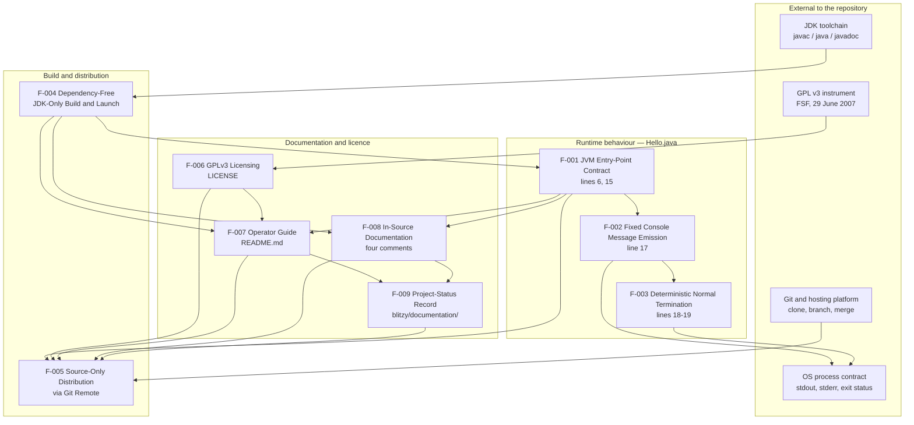
```mermaid
flowchart TD
    subgraph External["External to the repository"]
        JDK["JDK toolchain<br/>javac / java / javadoc"]
        GITHOST["Git and hosting platform<br/>clone, branch, merge"]
        OSPROC["OS process contract<br/>stdout, stderr, exit status"]
        GPL["GPL v3 instrument<br/>FSF, 29 June 2007"]
    end

    subgraph RuntimeGroup["Runtime behaviour — Hello.java"]
        F001["F-001 JVM Entry-Point Contract<br/>lines 6, 15"]
        F002["F-002 Fixed Console Message Emission<br/>line 17"]
        F003["F-003 Deterministic Normal Termination<br/>lines 18-19"]
    end

    subgraph BuildGroup["Build and distribution"]
        F004["F-004 Dependency-Free<br/>JDK-Only Build and Launch"]
        F005["F-005 Source-Only Distribution<br/>via Git Remote"]
    end

    subgraph DocGroup["Documentation and licence"]
        F006["F-006 GPLv3 Licensing<br/>LICENSE"]
        F007["F-007 Operator Guide<br/>README.md"]
        F008["F-008 In-Source Documentation<br/>four comments"]
        F009["F-009 Project-Status Record<br/>blitzy/documentation/"]
    end

    JDK --> F004
    GITHOST --> F005
    GPL --> F006
    F004 --> F001
    F001 --> F002
    F002 --> F003
    F002 --> OSPROC
    F003 --> OSPROC
    F001 --> F008
    F004 --> F008
    F001 --> F007
    F004 --> F007
    F006 --> F007
    F007 --> F009
    F008 --> F009
    F001 --> F005
    F006 --> F005
    F007 --> F005
    F008 --> F005
    F009 --> F005
```

| Feature | Depends on | Nature of the dependency |
| --- | --- | --- |
| F-001 | F-004 | The class must be compiled or source-launched before `main` can be invoked |
| F-002 | F-001 | The write at line 17 executes only inside the invoked `main` frame |
| F-003 | F-001, F-002 | The return at line 19 follows the single write; there is no other path to it |
| F-004 | F-001 | The unit F-004 compiles and launches is the class and entry point F-001 declares |
| F-005 | F-001, F-006, F-007, F-008, F-009 | The distribution channel carries exactly these tracked artifacts |
| F-006 | None | Independent of the runtime features it governs; no code or tool reads `LICENSE` |
| F-007 | F-001, F-002, F-003, F-004, F-006 | The guide documents their behaviour, their commands and the licence terms |
| F-008 | F-001, F-002, F-003, F-004 | The comments document those three constructs; `javadoc` from the same toolchain measures their coverage |
| F-009 | F-001 … F-008 | The record reports on the delivery and validation of every other feature |

**Dependency properties worth noting.** The runtime chain F-004 → F-001 → F-002 → F-003 is strictly linear and has no branch: `Hello.java` contains no `if`, `for`, `while` or `switch` statement and no `try`/`catch`, so there is exactly one path through the system. The documentation features form a second layer that depends on the first but is never depended upon by it — nothing in `Hello.java` reads `README.md`, `LICENSE` or anything under `blitzy/documentation/`, so a documentation change cannot alter runtime behaviour. F-006 is the only feature with no prerequisite inside the repository.

### 2.3.2 Integration Points

The system integrates with exactly four things outside itself, consistent with Section 1.2.1.3. Each row below names the features that meet at that seam.

| Integration point | Features involved | Interface and evidence |
| --- | --- | --- |
| JDK toolchain | F-004, F-001, F-008 | `javac` compiles the single unit, `java` launches the class or the source file, `javadoc` measures comment coverage. `Project Guide.md` Appendix D records OpenJDK 25.0.3; Appendix F assigns each tool its role |
| Operating-system process contract | F-002, F-003 | stdout receives the greeting, stderr stays empty, exit status is 0 (`Hello.java` lines 16–19; `README.md` line 63) |
| Git and its hosting platform | F-005, F-009 | Clone, branch and the merge of pull request #1 (`2a78292`); `git` also supplies the pre-comment baseline used by the F-008 verification procedures (`Project Guide.md` §9.6, Appendix F) |
| GPL v3 obligations | F-006, F-007, F-005 | Copyleft terms in `LICENSE`, referenced from `README.md` line 77, carried with every conveyed copy |

**Internal seams.** Two integration points are internal to the repository and are validated as such. The **guide-to-toolchain seam** is the requirement that every command in `README.md` execute exactly as written; `Project Guide.md` §2.1 records 2.5 hours of "Guide-to-toolchain seam validation" that executed each documented command in scratch copies of the repository and compared the guide's fenced expected-output block byte-for-byte against real stdout. The **comment-to-code seam** is the requirement that each comment describe the construct it is attached to; `Project Guide.md` §5.1 rows 1–3 validate placement and additions-only status, while §3 notes that comment wording itself "is not executed and prose accuracy is not machine-checkable".

### 2.3.3 Shared Components

| Shared component | Path | Features that share it |
| --- | --- | --- |
| The single compilation unit | `Hello.java` (20 lines / 1,073 bytes, blob `3fd76ce`) | F-001, F-002, F-003, F-008 — and F-004 as its build input |
| The `main` method body | `Hello.java` lines 15–19 | F-001 (signature), F-002 (line 17), F-003 (line 19) |
| The output literal | `Hello.java` line 17 | F-002 defines it; F-007 republishes it at `README.md` lines 59–61 as the operator-facing oracle |
| The operator guide | `README.md` (77 lines / 4,053 bytes, blob `3956e03`) | F-007 owns it; F-004 and F-006 are documented through it; F-005 distributes it |
| The licence instrument | `LICENSE` (674 lines / 35,149 bytes, blob `f288702`) | F-006 owns it; F-007 links to it; F-005 conveys it |
| The pre-comment baseline revision | `0726b1d` in Git history | F-008 verification (additions-only and behaviour-parity comparisons); F-005 provides the history that holds it |
| The out-of-tree scratch directory | generated per run by `mktemp -d` | F-004 (build destination), F-008 (`javadoc` output), F-009 (verification scratch space) |

The proportions matter to maintenance: four features share one 1,073-byte file, so any edit to `Hello.java` touches F-001, F-002, F-003 and F-008 simultaneously, and the change-impact rules in Section 2.6.4 are written on that basis.

### 2.3.4 Common Services

There are no common application services in this system. `blitzy/documentation/Project Guide.md` Appendix B states the position without qualification: the program "binds no port, starts no listener and makes no network call; there is no service, database, broker or cache in this project", and §9.1 adds that there is "no package manager step, no virtual environment, no container, no database, no broker and no bound port". The only shared facilities are therefore external tools and platform contracts:

| Common facility | Provided by | Consumed by |
| --- | --- | --- |
| Compilation, launch and documentation tooling | The JDK on `PATH` (OpenJDK 25.0.3 as recorded) | F-004, F-001, F-008 |
| Standard output, standard error and exit status | The operating-system process contract | F-002, F-003 |
| Version control and baseline retrieval | `git` 2.51.0 | F-005, F-008, F-009 |
| POSIX shell utilities for verification (`grep`, `awk`, `diff`, `tr`, `od`, `cmp`) and `mktemp -d` | The host environment | F-004, F-007, F-008, F-009 |

No shared configuration, secret store or environment variable participates: `Project Guide.md` Appendix E records `JAVA_HOME` as not required and states that "No other variable and no secret is read by any tracked file".

### 2.3.5 Cross-Feature Process Flow

The four operator workflows enumerated in Section 1.3.1.1 (`W-1` … `W-4`) are the only processes in which features interact. The flow below shows how each workflow traverses the feature set; the detailed process decomposition belongs to Section 4 (Process Flowchart) of this specification.

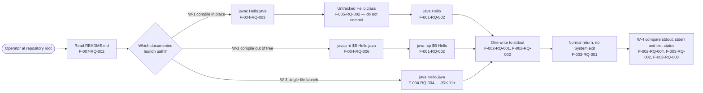
```mermaid
flowchart LR
    Start(["Operator at repository root"]) --> Guide["Read README.md<br/>F-007-RQ-002"]
    Guide --> Choice{"Which documented<br/>launch path?"}
    Choice -->|"W-1 compile in place"| CompileA["javac Hello.java<br/>F-004-RQ-003"]
    Choice -->|"W-2 compile out of tree"| CompileB["javac -d $B Hello.java<br/>F-004-RQ-006"]
    Choice -->|"W-3 single-file launch"| Direct["java Hello.java<br/>F-004-RQ-004 — JDK 11+"]
    CompileA --> Untracked["Untracked Hello.class<br/>F-005-RQ-002 — do not commit"]
    Untracked --> LaunchA["java Hello<br/>F-001-RQ-002"]
    CompileB --> LaunchB["java -cp $B Hello<br/>F-001-RQ-002"]
    LaunchA --> Emit["One write to stdout<br/>F-002-RQ-001, F-002-RQ-002"]
    LaunchB --> Emit
    Direct --> Emit
    Emit --> Term["Normal return, no System.exit<br/>F-003-RQ-001"]
    Term --> Verify["W-4 compare stdout, stderr and exit status<br/>F-002-RQ-004, F-003-RQ-002, F-003-RQ-003"]
```

| Workflow | Features exercised | Requirements verified end to end |
| --- | --- | --- |
| W-1 — compile in place, then run | F-007 → F-004 → F-001 → F-002 → F-003, with F-005 governing the untracked artifact | F-004-RQ-003, F-001-RQ-002, F-002-RQ-001, F-003-RQ-002, F-005-RQ-002 |
| W-2 — compile to a fresh directory outside the checkout, then run | F-007 → F-004 → F-001 → F-002 → F-003 | F-004-RQ-006, F-004-RQ-005, F-001-RQ-002, F-002-RQ-001, F-003-RQ-002 |
| W-3 — launch the source file directly | F-007 → F-004 → F-001 → F-002 → F-003 | F-004-RQ-004, F-002-RQ-004, F-003-RQ-002 |
| W-4 — verify the output contract | F-002 and F-003 against the oracle published by F-007 | F-002-RQ-001, F-002-RQ-002, F-002-RQ-003, F-003-RQ-002, F-003-RQ-003 |

All three launch workflows converge on the same single write and the same normal return, which is why `README.md` line 46 can state that "Both paths produce byte-identical standard output" and why `Project Guide.md` §3 records runtime parity as 6 of 6 checks across both documented paths.


## 2.4 Implementation Considerations

### 2.4.1 Technical Constraints

| Feature | Technical constraint | Source of the constraint |
| --- | --- | --- |
| F-001 | The class must stay in the default package, which means code in a named package cannot import it — Section 1.3.2.4 records reuse as a library from packaged code as unsupported. The file name must continue to match the public class | `Hello.java` line 6; `Project Guide.md` §9.8 |
| F-002 | The payload is a compile-time constant with no interpolation, so it cannot be parameterised without changing the published oracle. The trailing separator must remain host-supplied | `Hello.java` line 17; `README.md` line 63 |
| F-003 | Termination must remain by normal return; adding `System.exit`, a loop, a thread or a blocking read would break the single-outcome contract | `Hello.java` line 18; `Project Guide.md` §2.6-class change rules restated in Section 2.6.4 |
| F-004 | No dependency manifest, no `module-info.java` and no `--release` or `--source` setting may be introduced without forfeiting the JDK-only property; the Java language level stays "None declared" | `README.md` line 18; `Project Guide.md` Appendix D |
| F-005 | No `.gitignore` and no `.gitattributes` exist, so build output must be kept out of the tree by command discipline and line endings must be preserved by editor discipline | Verified absence; `README.md` line 30; `Project Guide.md` §5.2 divergence 5 |
| F-006 | `LICENSE` must remain verbatim; a per-file notice cannot be added until a copyright holder and year are recorded, which no tracked file does | `Project Guide.md` §5.2 divergence 5 |
| F-007 | The guide is constrained by its own asserted structure: eight sections in order, the summary first, a 70-word / 8-line summary budget, exactly two relative links and exactly two stable-symbol citations | `Project Guide.md` §5.1 rows 5–11, §9.6 |
| F-008 | Comments may be added but no executable line altered; the implicit default constructor can carry no doc comment, so coverage is capped at 2 of 3 without a structural change | `Project Guide.md` §5.1 row 3, §5.2 divergence 4 |
| F-009 | Verification tooling must not be committed — build, test and CI files are out of scope — so checks run from a scratch directory and nothing re-runs them automatically | `Project Guide.md` §9.6, §1.4 |

Two constraints are repository-wide. First, **`Hello.java` is stored with CRLF on all 20 lines with no `.gitattributes`**, so any editor that normalises line endings rewrites the whole file; `Project Guide.md` §6 carries this as a Medium-severity technical risk, "Open — accepted by design". Second, **there is no automated gate**: no build descriptor, test suite or CI workflow is committed, so as §1.4 puts it, "Nothing re-runs the documentation checks on future changes."

### 2.4.2 Performance Requirements

No performance requirement exists anywhere in the repository. There is no latency, throughput, availability, concurrency or resource target in `Hello.java`, `README.md` or `blitzy/documentation/Project Guide.md`, no instrumentation or timing code, and Section 1.3.2.4 records using the program as a performance, load or soak benchmark as an unsupported use case. The table records the only quantified properties the repository does state, so that a reader is not left to infer targets that do not exist.

| Feature | Quantified property recorded in the repository | Where recorded |
| --- | --- | --- |
| F-001 | One method frame, one statement, no loop or branch | `Hello.java` lines 15–19 (five executable lines in the file) |
| F-002 | 16-character literal; 17 bytes of stdout where the separator is LF; exactly one write | `README.md` line 63; `Project Guide.md` §4 |
| F-003 | Exit status 0; empty stderr | `README.md` line 63; `Project Guide.md` §9.7 |
| F-004 | Zero compiler diagnostics, including under `-Xlint:all -Werror`; one compilation unit; zero dependencies to resolve | `Project Guide.md` §3, Appendix A |
| F-005 | 5 tracked files, 925,008 tracked bytes, zero tags, zero tracked binaries | `git ls-files`, `git tag`; `Project Guide.md` Appendix C |
| F-007 | 77 lines; 8 sections; 55-word summary against a 70-word budget | `Project Guide.md` §5.1 rows 6 and 9 |
| F-008 | 15 added lines, 0 removed; at most 1 `javadoc` warning; coverage 2 of 3 documentable members | `Project Guide.md` §3, §5.1 row 3 |
| F-009 | 49 of 49 checks passed; 11 open items; 32.0 of 38.0 hours | `Project Guide.md` §1.2, §1.4, §3 |

### 2.4.3 Scalability Considerations

Scalability in the conventional sense does not apply: the system is a single-process, single-threaded program that writes one line and exits, with no listener, no request path and no state. What does scale — and what the repository's own records treat as the real concern — is the **documentation-to-code ratio and the verification burden**.

| Feature | Scalability consideration |
| --- | --- |
| F-001 … F-003 | Fixed cost by construction. One compilation unit, one entry point, one statement; no queue, pool, cache or connection exists to size. Every run is independent because no state persists between runs |
| F-004 | Build cost is one `javac` invocation with nothing to resolve; there is no incremental-build or caching concern because there is no second compilation unit. Adding one would immediately create the build-ordering and manifest concerns the project currently has none of |
| F-005 | The tracked footprint is dominated by documentation: 884,733 of 925,008 bytes are the two files under `blitzy/documentation/`, against 1,073 bytes of source. Clone size therefore grows with each documentation generation round, not with the program |
| F-007, F-009 | Verification effort grows with documented claims, not with code: 37 acceptance assertions plus 12 toolchain checks already cover a 20-line source file and a 77-line guide, and `Project Guide.md` §1.4 records that nothing re-runs them |
| F-008 | Comment coverage is capped at 2 of 3 documentable members; the coverage ratio cannot improve without adding a declared constructor, so the metric does not scale with further comment work |

### 2.4.4 Security Implications

`blitzy/documentation/Project Guide.md` §6 states the baseline: the program "reads no input, dereferences no argument, opens no resource, binds no port, makes no network call and has no dependency manifest, so there is no injection surface, no supply-chain exposure, no authentication or authorisation surface and no data-at-rest concern", and §1.5 records that no credential, key, network egress, environment variable or secret is used anywhere. The implications that do exist are therefore confined to the build and repository-hygiene surface.

| Feature | Security implication | Status |
| --- | --- | --- |
| F-001 | `args` is never dereferenced, so hostile arguments cannot influence behaviour; `Project Guide.md` §4 records runs with "shell and injection payloads" producing identical output | No exposure |
| F-002 | The output literal is a constant with no interpolation, so there is no format-string or output-injection vector; stdout is the only sink written | No exposure |
| F-003 | No resource is opened, so nothing can leak on exit; there is no error path that could disclose internal state through stderr | No exposure |
| F-004 | The compiler output destination is the one real consideration: a fixed, predictable path "can be pre-created, replaced or redirected through a symbolic link by another local process before the compiler writes into it" (`README.md` line 30). The documented command generates a unique owner-readable-only directory with `mktemp -d` | `Mitigated` per `Project Guide.md` §6 |
| F-005 | With no `.gitignore`, an in-place compile leaves an untracked class file that could be committed by accident; the control is documentation plus the instruction "Do not commit the class file either way". Commit signing is recorded as deferred infrastructure | `Open`, Low severity (§6) |
| F-006 | The absent per-file copyright and warranty notice is a licensing-compliance gap rather than a technical vulnerability; it awaits a recorded rights holder | `Open`, Owner decision (§1.4) |
| F-007, F-009 | Documented commands must stay safe by construction, since an operator will paste them verbatim; §6 identifies the reintroduction of a predictable compiler-output path in a future edit as the concrete risk, mitigated by stating the rationale beside the command | `Mitigated` (§6) |
| F-008 | Comments are not executed and carry no security weight; the only related concern is that they must not be allowed to drift from the code they describe |  No exposure |

There is no authentication, authorisation, encryption, secret-management or audit requirement anywhere in this system, and none is asserted here.

### 2.4.5 Maintenance Requirements

| Feature | Maintenance requirement |
| --- | --- |
| F-001 | Preserve the signature, the default package and the non-dereference of `args`; any change to the class's member set contradicts the class Javadoc at lines 1–5 and the contract Section 1.3.1.1 records |
| F-002 | Any edit to the literal must be propagated to the fenced expected-output block at `README.md` lines 59–61, or the published oracle and the program diverge |
| F-003 | Keep the method free of `System.exit`, loops, threads and blocking reads so that the single-outcome contract continues to hold |
| F-004 | Re-run `javac -Xlint:all -Werror` after any source edit — it is the project's only static-analysis surface. Confirm the JDK 11 floor on a real JDK 11 runtime or soften the claim (`Project Guide.md` §1.6, 1.0 h, Medium) |
| F-005 | Publish the branch and merge the change so the documentation reaches the default branch (§1.6, 0.5 h, High); keep the tracked set free of build output; edit `Hello.java` in byte mode and re-run the line-ending census afterwards |
| F-006 | Leave `LICENSE` verbatim; decide the per-file notice question, which requires naming a copyright holder and year (§1.6, part of the 2.0-hour hygiene item) |
| F-007 | Correct the Project Layout claim at line 67 so it matches the five-file tree — Section 1.3.2.2 notes this is not covered by any recorded item; decide the citation-coverage question, amending the two-reference budget and its check first (§1.6, 1.0 h, Medium); review the rendered guide on the hosting platform (§1.6, 0.5 h, Medium) |
| F-008 | Always pass the pre-comment revision `0726b1d` as the comment-census baseline, or four checks fail vacuously against a correct tree (§1.6, 1.0 h, High); re-emit CRLF on every added line; expect exactly one `javadoc` warning and treat a second as a regression |
| F-009 | Keep the record's figures reconciled and its stale claims corrected — Appendix C repeats the same flatness error as `README.md` line 67; decide whether to adopt an automated gate, currently `Deferred` / Owner decision (§1.4) |

**Aggregate maintenance position.** `blitzy/documentation/Project Guide.md` §1.4 records **11 open items** with "No defect is open in the delivered code", and §2.2 itemises **6.0 remaining hours** across six tasks — two High (verification baseline, branch publication), three Medium (citation coverage, JDK 11 confirmation, rendered-guide review) and one Low (the four hygiene decisions). Six of the eleven items are explicitly "Owner decision", and §2.3 records confidence in the remaining estimates as medium "because four of the six items are decisions whose scope the owner sets rather than fixed units of work".


## 2.5 Requirements Traceability Matrix

### 2.5.1 Requirement-to-Artifact Traceability

Every requirement resolves to a specific artifact anchor in the tree at `HEAD` (`2a78292`). The verification-method column distinguishes *static* (established directly against the tree while writing this section), *recorded* (executed by the project's own validation run on OpenJDK 25.0.3 and reported in `blitzy/documentation/Project Guide.md`) and *open* (not satisfied or not verified at `HEAD`).

| Requirement ID | Artifact anchor at `HEAD` | Verification method |
| --- | --- | --- |
| F-001-RQ-001 | `Hello.java:15` | static + recorded (`Project Guide.md` §9.5) |
| F-001-RQ-002 | `Hello.java` — zero `package` statements; `README.md:34-38` | static + recorded (§9.8) |
| F-001-RQ-003 | `Hello.java:11`, `:15` — the only `args` occurrences | static + recorded (§4 argument contract) |
| F-001-RQ-004 | `Hello.java:6` inside the file `Hello.java` | static + recorded (§9.8) |
| F-001-RQ-005 | `Hello.java:1-5`, `:6`, `:15`; zero `new` matches | static |
| F-002-RQ-001 | `Hello.java:17`; `README.md:59-61` | static + recorded (§4) |
| F-002-RQ-002 | `Hello.java:17` (`println`); `README.md:63` | static + recorded (§4) |
| F-002-RQ-003 | `Hello.java:16`, `:17` — the only `System.` lines | static + recorded (§4) |
| F-002-RQ-004 | `README.md:46`; both documented launch paths | recorded (§3, runtime parity 6 of 6) |
| F-002-RQ-005 | `Hello.java:17`; zero loop or branch statements | static |
| F-003-RQ-001 | `Hello.java:18-19`; zero `System.exit(` matches; `README.md:63` | static |
| F-003-RQ-002 | `Project Guide.md` §9.7 (`exit=0`); `README.md:63` | recorded |
| F-003-RQ-003 | `Hello.java` — zero `try`/`catch`/`throw` | static + recorded (§3, §4) |
| F-003-RQ-004 | `Hello.java` — no `Thread`, executor, `System.in` or `Scanner` | static |
| F-004-RQ-001 | Root: 26 candidate descriptors absent; `README.md:18` | static + recorded (§9.3) |
| F-004-RQ-002 | `Hello.java` — zero `import` statements | static |
| F-004-RQ-003 | `README.md:27`, `:30`, `:37` | recorded (§3, cross-release 7 of 7) |
| F-004-RQ-004 | `README.md:40-44` | recorded, partial (§4 "⚠ Partial") |
| F-004-RQ-005 | `Project Guide.md` Appendix A, strictest-check row | recorded (§3, 2 of 2) |
| F-004-RQ-006 | `README.md:30`; `Project Guide.md` §9.4 Path B | recorded (§4) |
| F-005-RQ-001 | `git ls-files` — five paths | static |
| F-005-RQ-002 | `git ls-files` — no `.class`/`.jar` entry; `README.md:30` | static + recorded (§4) |
| F-005-RQ-003 | `git tag` — zero tags; six remote refs | static |
| F-005-RQ-004 | `Hello.java` CR on 20 of 20 lines; `README.md`, `LICENSE` zero CR | static + recorded (§3, 7 of 7) |
| F-005-RQ-005 | `git rev-list --left-right --count main...HEAD` = `0 11` | open (`Project Guide.md` §1.6 item 2) |
| F-006-RQ-001 | `LICENSE:1-2`; 674 lines / 35,149 bytes | static |
| F-006-RQ-002 | `README.md:77`; link target `LICENSE` | static + recorded (§3, 2 of 2 links) |
| F-006-RQ-003 | `README.md:5` | static + recorded (§5.1 row 8) |
| F-006-RQ-004 | `LICENSE` blob `f288702` | static + recorded (§1.3, §2.1) |
| F-006-RQ-005 | `Hello.java` — no copyright header present | open (§1.4 hygiene item, §5.2 divergence 5) |
| F-007-RQ-001 | `README.md:3,10,16,22,32,55,65,75` | static + recorded (§3, 8 of 8) |
| F-007-RQ-002 | `README.md:18-63` | recorded (§5.1 row 10, §4) |
| F-007-RQ-003 | `README.md:3-8` | recorded (§5.1 rows 6–7) |
| F-007-RQ-004 | `README.md:14`, `:53` | static + recorded, partial (§5.1 row 11) |
| F-007-RQ-005 | `README.md:71`, `:77` | static + recorded (§3) |
| F-007-RQ-006 | `README.md:67` against `git ls-files` | open (Section 1.3.2.2) |
| F-008-RQ-001 | `Hello.java:1-5`, `:7-14`, `:16`, `:18` | static + recorded (§5.1 row 1, §3 7 of 7) |
| F-008-RQ-002 | `Hello.java` indentation at column 0, four spaces, eight spaces | static + recorded (§5.1 row 2) |
| F-008-RQ-003 | `git diff 0726b1d HEAD --stat` → `Hello.java +15`; executable lines 6, 15, 17, 19, 20 | static + recorded (§5.1 row 3) |
| F-008-RQ-004 | `Hello.java:6` — the one accepted `javadoc` warning | recorded (§3, §4, §9.6) |
| F-008-RQ-005 | `Hello.java` — CR 20/20, zero non-ASCII, zero tabs | static + recorded (§3, §5.1 row 4) |
| F-009-RQ-001 | `blitzy/documentation/Project Guide.md` §9.1–§9.8 | static |
| F-009-RQ-002 | `blitzy/documentation/Project Guide.md` §3, §4 | static |
| F-009-RQ-003 | `blitzy/documentation/Project Guide.md` §1.4, §2.2, §2.3 | static |
| F-009-RQ-004 | `blitzy/documentation/Project Guide.md` Appendices D and E | static |

### 2.5.2 Requirement-to-Capability, Objective and Workflow Traceability

Each feature is traced to the must-have capabilities (`C-1` … `C-9`) and workflows (`W-1` … `W-4`) of Section 1.3.1.1 and to the measurable objectives (`O-1` … `O-7`) of Section 1.2.3.1. Every capability and every objective is claimed by at least one feature, and no feature exists without a capability.

| Feature | Capabilities (§1.3.1.1) | Objectives (§1.2.3.1) | Workflows (§1.3.1.1) |
| --- | --- | --- | --- |
| F-001 | C-2, C-5 | O-4 | W-1, W-2, W-3 |
| F-002 | C-3, C-5, C-6 | O-2, O-5 | W-1, W-2, W-3, W-4 |
| F-003 | C-4 | O-3 | W-1, W-2, W-3, W-4 |
| F-004 | C-1, C-6 | O-1, O-5 | W-1, W-2, W-3 |
| F-005 | — (distribution channel for all artifacts) | — | W-1 (untracked-artifact discipline) |
| F-006 | C-8 | — | — |
| F-007 | C-7 | O-2, O-5 | W-1, W-2, W-3, W-4 |
| F-008 | C-9 | O-6, O-7 | — |
| F-009 | — (project record for all features) | O-7 | — |

Where a capability maps to a single requirement rather than a whole feature, the precise anchor is:

| Capability or objective | Precise requirement anchor |
| --- | --- |
| C-1 — single compilable source requiring only a JDK | F-004-RQ-001, F-004-RQ-002 |
| C-2 — entry point reachable by the bare class name | F-001-RQ-001, F-001-RQ-002 |
| C-5 — argument insensitivity | F-001-RQ-003 and F-002-RQ-004 |
| C-6 — equivalence of both documented launch paths | F-004-RQ-003, F-004-RQ-004, F-002-RQ-004 |
| O-1 — compile cleanly | F-004-RQ-005 |
| O-5 — both launch paths byte-identical | F-002-RQ-004 |
| O-7 — behaviour preserved across the documentation change | F-008-RQ-003 |

### 2.5.3 Verification Status Roll-Up

| Feature | Requirements | Satisfied at `HEAD` | Open or partial |
| --- | --- | --- | --- |
| F-001 | 5 | 5 | — |
| F-002 | 5 | 5 | — |
| F-003 | 4 | 4 | — |
| F-004 | 6 | 5 full, 1 partial | F-004-RQ-004 — JDK 11 floor not exercised on a JDK 11 runtime |
| F-005 | 5 | 4 | F-005-RQ-005 — `main` is 11 commits behind the working branch |
| F-006 | 5 | 4 | F-006-RQ-005 — per-file copyright and warranty notice absent |
| F-007 | 6 | 4 full, 1 partial, 1 open | F-007-RQ-004 partial (2 of 7 body sections); F-007-RQ-006 open (stale layout claim) |
| F-008 | 5 | 5, with the coverage cap accepted | F-008-RQ-004 carries the accepted `javadoc` default-constructor warning |
| F-009 | 4 | 4 | — |
| **Total** | **45** | **40 fully satisfied** | **3 open, 2 partial** |

This roll-up is consistent with `blitzy/documentation/Project Guide.md` §1.4, which records "No defect is open in the delivered code" alongside 11 open items: every unmet requirement above corresponds to a recorded open item or owner decision, not to a defect in the delivered behaviour.

### 2.5.4 Feature-to-Specification Cross-Reference

| Feature | Related sections of this specification | Related committed document |
| --- | --- | --- |
| F-001 | 1.1.1, 1.2.2.2, 1.3.1.1 (C-2, C-5), 1.3.2.4; Section 4 (Process Flowchart) | `Project Guide.md` §9.5, §9.8 |
| F-002 | 1.2.2.1, 1.2.3.1 (O-2), 1.3.1.1 (C-3), 1.3.1.2 (output surface) | `Project Guide.md` §3, §4; `README.md` lines 57–63 |
| F-003 | 1.2.2.3, 1.2.3.1 (O-3), 1.3.1.1 (C-4), 1.3.2.4 | `Project Guide.md` §9.7; `README.md` line 63 |
| F-004 | 1.2.1.3, 1.2.3.1 (O-1), 1.3.1.1 (C-1, C-6, key technical requirements); Section 3 (Technology Stack) | `Project Guide.md` §9.1–§9.5, Appendices A, D, F |
| F-005 | 1.2.1.1, 1.3.1.2 (tracked footprint), 1.3.2.3; Section 8 (Infrastructure) | `Project Guide.md` §1.6, Appendix C |
| F-006 | 1.1.3 (downstream recipients), 1.2.1.3, 1.3.1.1 (C-8) | `LICENSE`; `README.md` line 77; `Project Guide.md` §5.1 row 8 |
| F-007 | 1.1.2, 1.3.1.1 (C-7, W-1 … W-4), 1.3.2.2; Section 4 (Process Flowchart) | `README.md` in full; `Project Guide.md` §5.1 rows 5–11 |
| F-008 | 1.1.2, 1.2.3.1 (O-6, O-7), 1.3.1.1 (C-9) | `Hello.java` lines 1–5, 7–14, 16, 18; `Project Guide.md` §3, §5.2 divergence 4 |
| F-009 | 1.1.4 (recorded outcomes), 1.2.3.3 (KPIs), 1.3.2.2 (future phases) | `blitzy/documentation/Project Guide.md` in full |

Section 4 (Process Flowchart) decomposes the workflows referenced in Section 2.3.5; Section 3 (Technology Stack) documents the JDK toolchain on which F-004 and F-008 depend.


## 2.6 Assumptions, Constraints and Requirement Versioning

### 2.6.1 Assumptions

Each assumption below is recorded because a requirement in Section 2.2 depends on it, and each names how it was established.

| # | Assumption | Basis |
| --- | --- | --- |
| A-1 | The five tracked files constitute the complete system | `git ls-files` returns exactly five paths; the working tree's only other entry is the untracked `tech_spec.md` authoring artifact |
| A-2 | Behavioural requirements can be verified statically from `Hello.java` | The file is 20 lines with five executable lines, no branch, no loop and no external call, so every path is visible by reading |
| A-3 | The figures attributed to the project's own validation run are accurate as recorded | No JDK exists in the environment used to produce this specification, so the 49-of-49, zero-diagnostic and `javadoc`-warning figures are quoted from `blitzy/documentation/Project Guide.md` §3, §4 and §9.6 rather than re-derived |
| A-4 | A JDK is available to whoever executes the acceptance criteria | `README.md` line 18 makes a JDK the sole prerequisite; `Project Guide.md` Appendix D records OpenJDK 25.0.3 as the version used |
| A-5 | The host supplies a line separator, which may be LF or CRLF | `README.md` line 63 states that the separator "is the one the host defines, so the exact byte count varies between platforms" |
| A-6 | No requirement depends on configuration, credentials or network access | `Project Guide.md` §1.5 and Appendix E record that no environment variable or secret is read by any tracked file |
| A-7 | The prior committed register is the correct provenance for identifiers F-001 … F-007 | `blitzy/documentation/Technical Specifications.md` §2.1 and §2.6.3 define that register and anchor it at commit `0726b1d` |

### 2.6.2 Constraints on the Requirement Set

| # | Constraint | Consequence for this section |
| --- | --- | --- |
| K-1 | No requirements document, backlog, changelog, tag or roadmap exists in the repository | Requirements are reconstructed from artifacts; no feature carries a `Proposed`, `Approved` or `In Development` status because nothing records one |
| K-2 | No acceptance criteria, service-level objective or performance target is recorded anywhere | Every acceptance criterion is an executable verification procedure derived from the artifacts, and Section 2.4.2 records the absence of performance requirements rather than inventing them |
| K-3 | No committed test suite, build descriptor or CI workflow exists, and adding one is declared out of scope | Nothing re-runs these criteria automatically; the only durable record of verification is `Project Guide.md` §3 and §4 |
| K-4 | Zero tags exist across the 14 commits | Requirement versions must be identified by commit SHA (Section 2.6.3) |
| K-5 | The program is fixed and the delivered change was comment-only | No requirement may imply a behavioural change; F-008-RQ-003 exists precisely to hold that line |
| K-6 | Two committed documents carry a stale layout claim | `README.md` line 67 and `Project Guide.md` Appendix C both describe a three-file flat tree; F-007-RQ-006 records the discrepancy rather than restating it |
| K-7 | The requirement set is scoped to the repository, not to the JDK it runs on | The toolchain is required but not vendored, so JDK behaviour is an external dependency and not a requirement of this system |

### 2.6.3 Requirement Version Tracking

The repository holds no version identifier, tag or changelog, so requirement versions are anchored to commit SHAs — the rule the repository's own register already adopted: "because no tags exist, any revision of these requirements must be identified by the commit SHA that produced the change" (`blitzy/documentation/Technical Specifications.md` §2.6.3).

| Version | Baseline commit | Scope |
| --- | --- | --- |
| 1.0 | `0726b1d` (2026-09-16), authored by `rjhonsi` | 27 requirements across F-001 … F-007, as recorded in `blitzy/documentation/Technical Specifications.md` §2.2 |
| 2.0 | `2a78292` (2026-09-22), merge of pull request #1 — the current `HEAD` of `jr_java1` | 45 requirements across F-001 … F-009, as recorded in Section 2.2 of this specification |

**What changed between version 1.0 and version 2.0.** The program's behaviour did not change; the artifacts that document it did. `git diff 0726b1d HEAD --stat` reports four files changed with 8,889 insertions and 1 deletion: `Hello.java +15`, `README.md +78 −1`, and the two new documents under `blitzy/documentation/`.

| Commit | Effect on the requirement set |
| --- | --- |
| `c537a19` "Initial commit" | Established the repository and the licensing basis for F-006 |
| `f1847fa` "Add files via upload" | Introduced `Hello.java` as a five-line, 127-byte file with no comment — the basis for F-001 … F-004 |
| `0726b1d` "Add initial README file with basic information" | Introduced the 41-byte placeholder `README.md`; version 1.0 baseline |
| `3c3af75` "Document Hello.java: one comment per written functionality" | Created F-008: the first in-source comments |
| `dabe2c9` "Replace README placeholder with project guide" | Superseded the version-1.0 content criterion for F-007 and raised the feature from `Low` to `High` |
| `14ed6db` "Remove duplicate source citation from the README guide" | Fixed the citation count that F-007-RQ-004 asserts |
| `ce8e85c` "Tighten the Hello.java Javadoc and make the README build guidance safe" | Settled the final comment text behind F-008-RQ-001/002 and introduced the `mktemp -d` build destination behind F-004-RQ-006 |
| `1b99a4b` … `b4a1188` (six commits) | Created F-009 by adding `Project Guide.md` and `Technical Specifications.md` |
| `2a78292` "Merge pull request #1" | Version 2.0 baseline; `main` remains 11 commits behind it, which is what leaves F-005-RQ-005 open |

**Requirements retired or restated from version 1.0.** Two version-1.0 criteria are no longer satisfiable as written and are restated in version 2.0: the F-007 criterion requiring `README.md` to match the 41-byte placeholder sentence byte-for-byte (superseded by F-007-RQ-001/002 against the 77-line guide), and the F-005 criterion requiring "exactly three tracked root-level files, no subdirectories" (restated as F-005-RQ-001 against the five-file tree containing `blitzy/documentation/`). The committed register's own change-impact rules anticipated the first of these: "Authoring real README content → F-007-RQ-002 baseline superseded."

### 2.6.4 Change-Impact Rules

These rules follow from the dependencies in Section 2.3.1 and are stated so that a reviewer can tell from a diff alone which acceptance criteria must be re-executed.

| Change to the repository | Requirements invalidated or requiring re-verification |
| --- | --- |
| Editing the output literal on `Hello.java` line 17 | F-002-RQ-001, F-002-RQ-002, F-007-RQ-002 (the published fenced block) |
| Reading or acting on `args` | F-001-RQ-003, F-002-RQ-004 |
| Adding a `package` declaration or a `module-info.java` | F-001-RQ-002, F-001-RQ-004, F-004-RQ-002, F-004-RQ-004 |
| Adding a `System.exit` call, a loop, a thread or a blocking read | F-003-RQ-001, F-003-RQ-002, F-003-RQ-004, F-002-RQ-005 |
| Adding a field, an explicit constructor or a second member | F-001-RQ-005, F-008-RQ-001, F-008-RQ-004 (coverage would change from 2 of 3) |
| Adding a first third-party import or a second compilation unit | F-004-RQ-001, F-004-RQ-002, F-005-RQ-001 |
| Adding a build manifest, wrapper, test suite or CI descriptor | F-004-RQ-001, F-005-RQ-001, and the §1.4 "no automated gate" item |
| Committing compiled output or a packaged artifact | F-005-RQ-002 |
| Adopting tags or releases | F-005-RQ-003 and the versioning rule in Section 2.6.3 |
| Adding `.gitattributes`, or normalising `Hello.java` to LF | F-005-RQ-004, F-008-RQ-005 |
| Any edit to a comment in `Hello.java` | F-008-RQ-001, F-008-RQ-002, F-008-RQ-003, F-008-RQ-005 — and the census must be run with `0726b1d` as its baseline |
| Editing any section of `README.md` | F-007-RQ-001 … F-007-RQ-005, plus F-006-RQ-002 if the Licence section is touched |
| Correcting the Project Layout claim at `README.md` line 67 | Closes F-007-RQ-006; `Project Guide.md` Appendix C should be corrected in the same change |
| Altering any part of `LICENSE` | F-006-RQ-001, F-006-RQ-004 |
| Adding notice headers and recording a copyright holder | Closes F-006-RQ-005 |
| Pushing and merging the branch into `main` | Closes F-005-RQ-005 |
| Confirming the floor on a real JDK 11 runtime, or softening the claim | Resolves the partial status of F-004-RQ-004 |


## 2.7 References

### 2.7.1 Repository Files Examined

- `Hello.java` - Read in full (20 lines / 1,073 bytes, blob `3fd76ce`). Established every behavioural requirement in F-001, F-002 and F-003 and every comment requirement in F-008: the class Javadoc at lines 1–5, `public class Hello` at line 6, the `main` Javadoc with its `@param args` tag at lines 7–14 (tag text at lines 11–13), the entry-point signature at line 15, the output-path comment at line 16, `System.out.println("Hello from Java!")` at line 17, the termination-path comment at line 18, and the closing braces at lines 19–20. Statement-level searches established that the file contains exactly five executable lines (6, 15, 17, 19, 20) and zero matches for `import`, `package`, `System.exit(`, `try {`, `catch`, `throw`, `new`, `for (`, `while (`, `if (` and `return`; that `args` occurs only at lines 11 and 15; that `System.` occurs only at lines 17 and 18; and that the file holds zero non-ASCII bytes, zero tabs and CR on 20 of 20 lines.
- `README.md` - Read in full (77 lines / 4,053 bytes, LF-only, blob `3956e03`). Established all six F-007 requirements and the operator-facing halves of F-004 and F-006: the dated modification notice at line 5, the change-summary entries at lines 7–8, the stateless-application overview and stable-symbol citation at lines 12–14, the JDK-only requirement at line 18 and the JDK-11 floor at line 20, `javac Hello.java` at line 27 with the `mktemp -d` alternative and untracked-artifact warning at line 30, `java Hello` at line 37, `java Hello.java` at lines 40–44, the byte-identity and argument contract at lines 46–51, the second citation at line 53, the output contract at lines 57–63, the stale flatness claim at line 67, the layout table and `[Hello.java](Hello.java)` link at lines 69–73, and the GPLv3 statement and `[LICENSE](LICENSE)` link at line 77.
- `LICENSE` - Header and measurements examined (674 lines / 35,149 bytes, LF-only, blob `f288702`). Established F-006-RQ-001 and F-006-RQ-004: the document opens "GNU GENERAL PUBLIC LICENSE / Version 3, 29 June 2007" with the Free Software Foundation copyright line.
- `blitzy/documentation/Project Guide.md` - Read in the sections cited (476 lines / 45,009 bytes, blob `888336e`). Supplied every *recorded* acceptance result and the whole of F-009: §1.1 the pre-change baseline; §1.2 the 84.2% / 32.0-of-38.0-hour figures; §1.3 the key accomplishments including "`LICENSE` untouched"; §1.4 the 11 open items with owners and ETAs alongside "No defect is open in the delivered code"; §1.5 the no-credential, no-secret finding; §1.6 and §2.2 the six deferred items totalling 6.0 hours with priorities; §2.1 the completed-work itemisation including the guide-to-toolchain seam validation; §2.3 the hours reconciliation and confidence statement; §3 the 49-of-49 result across eight check areas with the five "Not Covered" bullets; §4 the ten runtime-validation results including the argument-contract and hostile-payload runs, the 17-byte payload observation and the "⚠ Partial" version-floor entry; §5.1 the twelve-row compliance matrix with its `Hello.java` and `README.md` line anchors; §5.2 the five divergences covering citation coverage, the census baseline, the build-section scope, the implicit-constructor cap and the deferred hygiene items; §6 the risk baseline and eight forward-looking risks; §9.1–§9.8 the development guide, verification procedures and troubleshooting table; and Appendices A (command reference), B (no port, service, database, broker or cache), C (key file locations, with its own stale flatness claim), D (OpenJDK 25.0.3, git 2.51.0, language level "None declared"), E (`JAVA_HOME` not required, no variable or secret read), F (`javac -Xlint:all -Werror` as the static-analysis surface, `javadoc -Xdoclint:all`, `mktemp -d`) and G (glossary).
- `blitzy/documentation/Technical Specifications.md` - The prior generation of this specification (8,321 lines / 839,724 bytes, blob `231e2f1`). Used solely as the repository's own committed identifier register: its §2.1 catalogue of seven features F-001 … F-007 with their names, categories, priorities and statuses; its §2.2 preamble establishing that acceptance criteria are verification procedures and that all requirements carry version 1.0 at commit `0726b1d`; its §2.6.3 version-tracking table and commit-SHA versioning rule; and its §2.6.4 change-impact rules. Its F-007 description of a 41-byte placeholder README and its F-005 three-file criterion established the staleness recorded in Sections 2.1.1 and 2.6.3.

### 2.7.2 Repository Folders Examined

- `` (repository root) - Established the four first-order children `LICENSE`, `Hello.java`, `README.md` and `blitzy/`, and the catalog-closure evidence for Section 2.1.1: existence tests reported absence for all of `pom.xml`, `build.gradle`, `build.gradle.kts`, `settings.gradle`, `build.xml`, `Makefile`, `makefile`, `.gitignore`, `.gitattributes`, `.java-version`, `.sdkmanrc`, `module-info.java`, `Dockerfile`, `docker-compose.yml`, `.editorconfig`, `Jenkinsfile`, `.travis.yml`, `requirements.txt`, `package.json`, `CONTRIBUTING.md`, `SECURITY.md`, `CODEOWNERS`, `.github/`, `.circleci/`, `src/` and `test/`.
- `blitzy/` - Documentation-only folder whose single child is `blitzy/documentation/`.
- `blitzy/documentation/` - The repository's only leaf directory, holding `Project Guide.md` and `Technical Specifications.md`; the basis for F-009 and for the F-007-RQ-006 discrepancy against the committed flatness claims.

### 2.7.3 Repository State and Measurements

- `git ls-files -s` - Established F-005-RQ-001 and F-005-RQ-002: exactly five tracked files with blobs `3fd76ce` (`Hello.java`), `f288702` (`LICENSE`), `3956e03` (`README.md`), `888336e` (`Project Guide.md`) and `231e2f1` (`Technical Specifications.md`), and zero `.class`, `.jar`, `.war` or `.zip` entries.
- `git log --graph`, `git tag`, `git branch -a`, `git status --porcelain` - Established the 14-commit history and its three eras, `HEAD` = `2a78292` on `jr_java1`, zero tags (F-005-RQ-003), the six remote refs, and the single untracked entry `tech_spec.md`. Established which commit introduced each documentation artifact (`1b99a4b` for `Project Guide.md`, `297792f` for `Technical Specifications.md`) for the version table in Section 2.6.3.
- `git rev-list --left-right --count main...HEAD` - Returned `0 11`, establishing the open status of F-005-RQ-005.
- `git show 0726b1d:Hello.java`, `git show 0726b1d:README.md`, `git ls-tree 0726b1d`, `git diff 0726b1d HEAD --stat` - Established the version-1.0 baseline used throughout Sections 2.1.1 and 2.6.3: a 5-line / 127-byte comment-free source file, a 1-line / 41-byte README, three tracked files, and the delta to `HEAD` of four files changed with 8,889 insertions and 1 deletion (`Hello.java +15`, `README.md +78 −1`).
- `wc`, `grep` and line-ending measurements - Established the per-file line and byte counts quoted throughout, the CRLF/LF split behind F-005-RQ-004 and F-008-RQ-005, and the 16-character length of the `Hello from Java!` literal behind F-002-RQ-001.
- Toolchain probe (`command -v java`, `command -v javac`, `JAVA_HOME`, `/usr/lib/jvm`) - Established that no JDK exists in the environment used to produce this section, which is why every acceptance criterion requiring a compiler or a JVM is marked *recorded* rather than re-executed (assumption A-3).

### 2.7.4 Technical Specification Sections Cross-Referenced

- `1.1 Executive Summary` - Supplied the artifact inventory and stakeholder set used in the feature descriptions.
- `1.2 System Overview` - Supplied the capability list, the component model behind Section 2.3.3, and the measurable objectives `O-1` … `O-7` traced in Section 2.5.2.
- `1.3 Scope` - Supplied the must-have capabilities `C-1` … `C-9`, the workflows `W-1` … `W-4` traced in Sections 2.3.5 and 2.5.2, the implementation boundary used in Section 2.1.10, and the out-of-scope and unsupported-use-case findings relied on in Sections 2.4.1 and 2.4.3.
- `1.4 References` - Confirmed the file-level measurements and the evidentiary boundary restated as assumption A-3.

No external or web sources were used for this section; every finding derives from the repository itself or from the already-written sections of this specification.


# 3. Technology Stack

## 3.1 Programming Languages

The language surface of this repository is exhaustively enumerable rather than representative. `git ls-files` returns five tracked paths, and a worktree-wide search across twenty source-file extensions — `.java`, `.py`, `.ts`, `.tsx`, `.js`, `.jsx`, `.kt`, `.swift`, `.m`, `.mm`, `.go`, `.rs`, `.rb`, `.c`, `.cpp`, `.h`, `.cs`, `.sh`, `.sql`, `.css`, `.html` — returns exactly one file: `./Hello.java`. The tracked extension census is one `.java`, three `.md` and one extension-less file (`LICENSE`).

**One language compiles. Two more appear only as content.** Java is the sole implementation language; Markdown and plain text carry the documentation and the licence, and POSIX shell appears only as copy-and-paste commands inside fenced blocks in `README.md`, never as a tracked script.

### 3.1.1 Language Inventory by Component

| Component | Language | Version / dialect | Artifact | Role |
| --- | --- | --- | --- | --- |
| Executable program | **Java** | Language level **"None declared"** — no `--release` or `--source` setting exists anywhere in the repository (`blitzy/documentation/Project Guide.md` Appendix D) | `Hello.java` — 20 lines, 1,073 bytes, 5 code lines, 15 comment lines, 0 tabs | The entire executable surface of the system |
| In-source API documentation | **Javadoc doc-comment syntax** | Validated by `javadoc -Xdoclint:all` (Appendix F) | `Hello.java` lines 1–5 and 7–14 | Class and entry-point documentation using the `{@code}` inline tag and the `@param args` block tag |
| Operator guide, project record, specification | **Markdown** | GitHub Flavored Markdown over CommonMark — "Determined by the hosting platform; no generator or renderer is part of the project" (Appendix D) | `README.md` (77 lines, 4,053 bytes, 4 fenced blocks, 2 tables, 2 relative links); `blitzy/documentation/Project Guide.md` (476 lines, 45,009 bytes); `blitzy/documentation/Technical Specifications.md` (839,724 bytes) | Human-readable documentation; read by no code or tool in the repository |
| Licence instrument | **Plain text** | None | `LICENSE` — 674 lines, 35,149 bytes | Verbatim GNU General Public License, Version 3, 29 June 2007 |
| Documented operator commands | **POSIX shell** | `bash`-tagged fenced blocks at `README.md` lines 26–28, 36–38 and 42–44, plus a `text`-tagged expected-output block at lines 59–61 | Content of `README.md` only | Commands an operator types; **no `.sh` file is tracked and no script is executed by the project** |

### 3.1.2 Java as the Sole Implementation Language

The whole program is `Hello.java`, and its language footprint is deliberately minimal:

| Construct | Location | Language generation |
| --- | --- | --- |
| `public class Hello` in the default package — no `package` statement | line 6 | JDK 1.0 |
| `public static void main(String[] args)` | line 15 | JDK 1.0 |
| `System.out.println(String)` | line 17 | JDK 1.0 |

```java
public static void main(String[] args) {
    System.out.println("Hello from Java!");
}
```

No construct above the original language level appears anywhere in the file. A direct reading confirms the absence of generics, annotations, lambdas or method references, `var` local-variable inference, records, sealed types, text blocks, enhanced `switch`, `try`/`catch`, loops, conditionals, fields, explicit constructors and object instantiation. There is no `module-info.java`, so the class is not part of a named module.

**Why this matters for versioning.** Because the source uses only JDK 1.0-era constructs, it is compilable at every Java language level, which is precisely what supports `README.md` line 20's statement that the compile-then-run path "carries no such floor and works on considerably older releases." `blitzy/documentation/Project Guide.md` §9.1 records that this path was "exercised at release targets 11, 17 and 21."

The single **JDK 11 floor** that the repository does state is therefore **not a language-level floor at all** — it is a *launcher-capability* floor. `README.md` line 20 attaches it only to the direct source launch: "The direct source launch `java Hello.java` shown under Run is single-file source-code launch, which needs JDK 11 or later." <cite index="5-3,5-5">JEP 330, Launch Single-File Source-Code Programs, was introduced in the JDK 11 release; it allows a Java source file to be executed directly by the launcher, with the source compiled in memory and executed without producing a .class file on disk</cite> — which is exactly the "leaves no class file behind" behaviour `README.md` line 40 documents. <cite index="1-30,1-31">Under that JEP the class executed is the first top-level class found in the source file, and it must contain a declaration of the standard `public static void main(String[])` method</cite>; `Hello.java` lines 6 and 15 satisfy both conditions.

`blitzy/documentation/Project Guide.md` §1.6 records confirming this floor on a real JDK 11 runtime as an open Medium-priority item (1.0 hour), because only OpenJDK 25.0.3 was available when the project's own validation was run.

### 3.1.3 Languages Present Only as Content

Three languages appear in the tree without being part of the build or the runtime, and each is documented here so that a reader does not mistake content for tooling:

- **Markdown.** No generator, renderer, static-site tool or linter for Markdown is configured; `blitzy/documentation/Project Guide.md` Appendix D records the dialect as determined by the hosting platform. The rendered appearance has never been verified — reviewing the rendered guide is a recorded open item (§1.6, 0.5 hour, Medium).
- **POSIX shell.** Every shell fragment in the repository is documentation. `README.md` line 30 embeds `B="$(mktemp -d)" && javac -d "$B" Hello.java` in prose, and `blitzy/documentation/Project Guide.md` §9.2, §9.4 and §9.6 embed further command blocks. No `.sh` file has ever been tracked in any of the 14 commits, and nothing in the repository invokes a shell.
- **Plain text.** `LICENSE` is legal text with no executable content.

### 3.1.4 Selection Criteria and Justification

The language choice follows directly from what the artifact is for, and every criterion below is traceable to a statement in the tree rather than to a general preference.

| Criterion | How Java satisfies it | Evidence |
| --- | --- | --- |
| **The artifact must prove a Java toolchain works** | The program is the smallest unit that still exercises `javac`, class loading, `main` resolution and a write to standard output. Any other language would fail the purpose | `Hello.java`; Section 1.2.1.1's "canonical reference program" positioning |
| **A JDK alone must build and run it** | `java.lang` is imported implicitly, so no resolution step exists. The class Javadoc states the property outright: "imports nothing outside `java.lang`, so a JDK alone builds and runs it" | `Hello.java` lines 2–4; verified: zero `import` statements |
| **Zero dependency and zero supply-chain surface** | The only types referenced are `String` and `System`, both from `java.lang`; no manifest exists in which a dependency could be declared | `Hello.java` lines 15, 17; `README.md` line 18 |
| **Shortest possible launch command** | The default package lets the JVM resolve the class by the bare name `Hello`, with no classpath root, directory layout or module path to establish first. The class Javadoc records this as the reason | `Hello.java` line 4; `README.md` line 12 |
| **Portability preferred over a pinned, reproducible build** | The language level is left undeclared so the unit compiles on any JDK. `README.md` line 18: the repository "pins no Java version" and carries no file "in which a version could be recorded" | `README.md` line 18; Appendix D |
| **Two interchangeable launch paths for different audiences** | Compile-then-run works on older releases; single-file source launch (JDK 11+) leaves no artifact. Both are pure-Java paths needing no extra runtime | `README.md` lines 20, 40, 46 |

### 3.1.5 Language-Level Constraints and Dependencies

| Constraint | Consequence | Evidence |
| --- | --- | --- |
| **No `--release` or `--source` setting may be introduced** | The Java language level must stay "None declared"; introducing one, or a `module-info.java`, would forfeit the JDK-only property recorded as constraint F-004 | Appendix D; Section 2.4.1 F-004 |
| **The file name must continue to match the public class** | `Hello.java` must hold `public class Hello`; breaking the correspondence yields `error: class Hello is public, should be declared in a file named Hello.java`, a failure mode recorded in `blitzy/documentation/Project Guide.md` §9.8 | `Hello.java` line 6; §9.8 |
| **The default package is a reuse boundary, not just a style** | Code in a named package cannot import a default-package class, so reuse of `Hello` as a library is an unsupported use case | Section 1.3.2.4; `Hello.java` line 4 |
| **Only the implicit `java.lang` import may be relied on** | Adding the first third-party or JDK-module import would introduce a resolution step and invalidate the dependency-free property | `Hello.java` lines 2–4 |
| **Source encoding is fixed by construction, not by configuration** | `Hello.java`, `README.md` and `LICENSE` each contain **zero bytes at or above `0x80`** (verified directly), so any ASCII-superset source encoding decodes the file identically. No `-encoding` option is required, and none is recorded anywhere | Direct byte census; `Hello.java` line 17 (ASCII literal) |
| **Stored line endings are unmanaged** | `Hello.java` carries CRLF on **20 of 20 lines** while `README.md`, `LICENSE` and `Project Guide.md` are LF-only. There is no `.gitattributes`, and `git check-attr text eol -- Hello.java` reports both attributes "unspecified" with `core.autocrlf` and `core.eol` unset, so an editor that normalises endings would rewrite every line of the source | Direct census via `od`; `git check-attr`; Section 2.4.1 |
| **The output literal is a compile-time constant** | `"Hello from Java!"` has no interpolation, so the payload cannot be parameterised without changing the published oracle at `README.md` lines 59–61 | `Hello.java` line 17; Section 2.4.1 F-002 |

**Language-level security note.** The language surface removes whole vulnerability classes by construction rather than by control: `args` is never dereferenced (it occurs only on line 11 as a `@param` tag and line 15 as the signature, never on an executable line), the sole output is a constant with no format string, and no `try`, `catch`, `throw`, `new`, `System.in`, `Scanner` or `Thread` construct exists. Section 2.4.4 records the consequence — no injection surface, no supply-chain exposure, no authentication or authorisation surface and no data-at-rest concern.


## 3.2 Frameworks & Libraries

**No framework is used by this system, and exactly one library is — the portion of the Java Class Library that the language imports implicitly.** This is not an omission to be corrected but the property the artifact exists to demonstrate: `Hello.java` lines 2–4 state that the program "imports nothing outside `java.lang`, so a JDK alone builds and runs it," and `blitzy/documentation/Project Guide.md` Appendix F closes with "No linter, formatter, documentation generator, build tool or test framework is configured in the repository, and none is introduced by this change."

### 3.2.1 Framework Inventory — A Verified Null Result

A framework dependency in a Java project must be declared in a manifest, vendored as an archive, or named in an `import`. All three channels were checked directly and all three are empty.

| Channel by which a framework could enter | Verification performed | Result |
| --- | --- | --- |
| A build or dependency manifest | Existence test at the repository root for `pom.xml`, `build.gradle`, `build.gradle.kts`, `settings.gradle`, `settings.gradle.kts`, `build.xml`, `ivy.xml`, `Makefile`, `makefile`, `CMakeLists.txt`, `package.json`, `package-lock.json`, `yarn.lock`, `pnpm-lock.yaml`, `requirements.txt`, `Pipfile`, `pyproject.toml`, `setup.py`, `go.mod`, `Cargo.toml`, `Gemfile`, `composer.json`, `gradlew`, `gradlew.bat`, `mvnw`, `.mvn/`, `gradle/` | **All 27 absent.** `blitzy/documentation/Project Guide.md` §9.3 states it directly: "None. There is no `pom.xml`, `build.gradle`, `Makefile`, `package.json` or lock file of any kind, and nothing is downloaded at build time" |
| A vendored archive or compiled artifact | Recursive search of the worktree for `*.jar`, `*.class`, `*.war`, `*.ear`, `*.zip`, `*.so`, `*.dll`, `*.exe`, `*.tar*` | **Zero matches.** No library is bundled and no compiled output is committed |
| An `import` statement or module requirement | `grep` for `^\s*(import\|package)` in `Hello.java`; existence test for `module-info.java` | **No `import`, no `package`, no `module-info.java`.** The only types named in the source are `String` and `System` |
| Historical introduction since removed | `git log --all --name-only` over all 14 commits across every branch | Only five files have **ever** been tracked. No manifest, lockfile or archive has existed at any point in the history |

Consequently there is no web framework, no dependency-injection container, no ORM, no HTTP client, no serialisation library, no logging framework, no test framework, no assertion library and no mocking library in this system. Section 1.3.2.1 records the same absences from the requirements side.

### 3.2.2 The Java Class Library — the Only Library Dependency

The single library dependency is the JDK's own class library, reached without an `import` because `java.lang` is imported implicitly by the language.

| API used | Declaring package | How it is reached | Line |
| --- | --- | --- | --- |
| `System.out` — the initialised standard-output stream | `java.lang` | Named directly; implicitly imported | 17 |
| `println(String)` | `java.io` (`PrintStream`, the declared type of `System.out`) | Resolved through `System.out`; **the type is never named in the source**, so no `import` is required | 17 |
| `String` — the element type of the entry-point parameter array and the type of the output literal | `java.lang` | Named directly; implicitly imported | 15, 17 |

This is the architecturally significant detail behind the zero-import claim: `println` is a `java.io.PrintStream` method, but because the source only ever names the *field* `System.out` and never the field's type, `java.lang` remains the only package the file must import. The class Javadoc's wording — "imports nothing outside `java.lang`" — is therefore exact.

The class library is **required but not vendored**. Section 2.6.2 K-7 states the boundary: "The requirement set is scoped to the repository, not to the JDK it runs on," so the JDK and its class library are an external dependency of the system rather than a component of it.

### 3.2.3 Compatibility Requirements

Because nothing is declared, compatibility is determined entirely by what the two documented workflows ask of the toolchain.

| Workflow | Minimum toolchain capability | Version floor | Basis |
| --- | --- | --- | --- |
| `javac Hello.java` → `java Hello` (compile-then-run) | A `javac` that accepts JDK 1.0-era constructs and a JVM that resolves a default-package class by bare name | **None stated.** Documented as working on "considerably older releases"; exercised at release targets **11, 17 and 21** | `README.md` line 20; `Project Guide.md` §9.1 |
| `B="$(mktemp -d)" && javac -d "$B" Hello.java` → `java -cp "$B" Hello` (out-of-tree compile) | The same, plus `javac -d` and `java -cp`, both long-standing options | None stated | `README.md` line 30; Appendix A |
| `java Hello.java` (single-file source launch) | A launcher implementing source-file mode | **JDK 11 or later** | `README.md` lines 20, 40; <cite index="3-1">JEP 330, added in JDK 11</cite> |
| `javac -Xlint:all -Werror` (static-analysis gate) | `javac` with the `-Xlint` and `-Werror` options | None stated; run on OpenJDK 25.0.3 | Appendix A; Appendix F |
| `javadoc -Xdoclint:all` / `javadoc -d "$B/jd" -quiet` (comment-coverage check) | `javadoc` with `-Xdoclint` | None stated; run on OpenJDK 25.0.3 | Appendix A; Appendix F |

**Recorded toolchain version.** `blitzy/documentation/Project Guide.md` Appendix D records **OpenJDK 25.0.3** for `java`, `javac` and `javadoc`, and §9 states that "Every command below was executed against this repository on a Linux host with OpenJDK 25.0.3." <cite index="12-3">Java SE 8, 11, 17, 21 and 25 are the LTS releases</cite>, and <cite index="13-22">Java 25 was released in 2025 as the current LTS under a two-year LTS cadence</cite> — so the recorded toolchain is an update of the current long-term-support line, and the three exercised compile-then-run targets (11, 17, 21) are themselves all LTS releases spanning the range from the single-file-launch floor to the LTS immediately preceding the recorded version.

**The one compatibility gap.** No JDK 11 runtime was available when the project's own validation ran, so the JDK 11 floor is asserted from the feature's documented availability rather than observed. `blitzy/documentation/Project Guide.md` §1.6 carries "Confirm the 'JDK 11 or later' floor on a real JDK 11 runtime, or soften the claim" as an open Medium-priority 1.0-hour item, and Section 2.1's F-004 status records the same partial. This specification's own environment reproduces the constraint: `command -v java javac javadoc` returns nothing and `JAVA_HOME` is unset, so no version claim here was re-derived by execution.

### 3.2.4 Justification for the No-Framework Position

| Justification | Supporting evidence |
| --- | --- |
| **A framework would defeat the artifact's purpose.** The value of the program is that it isolates the toolchain: if `javac` and `java` succeed, the toolchain works. Any framework would make a failure ambiguous between the toolchain and the dependency | Section 1.2.2.3's "zero external dependencies, zero configuration" approach; `Hello.java` lines 2–4 |
| **It eliminates the supply-chain attack surface entirely rather than managing it.** With no manifest there is nothing to resolve, pin, scan or update, and no transitive graph | `Project Guide.md` §6 records "no supply-chain exposure"; §9.3 "None"; §1.5 "no credential, key, network egress, environment variable or secret is used by anything in this project" |
| **Build cost is one `javac` invocation with nothing to download.** Section 2.4.3 records that there is no incremental-build or caching concern because there is no second compilation unit | `Project Guide.md` §9.3; Section 2.4.3 |
| **A framework could not be added without breaking a stated constraint.** Constraint F-004 forbids introducing a dependency manifest, and Section 2.6.4 records that "Adding a first third-party import or a second compilation unit" invalidates F-004-RQ-001/002 and F-005-RQ-001 | Section 2.4.1 F-004; Section 2.6.4 |
| **The functionality needs nothing more.** One write to one sink, no input, no state, no error path — the standard library covers the whole requirement with a single method call | `Hello.java` lines 16–18 |

### 3.2.5 Conventions and Standards Relied On in Place of Libraries

Two external *conventions* substitute for what a library or framework would otherwise supply. Neither is code, and neither is vendored.

| Standard | What it governs | Where it enters |
| --- | --- | --- |
| **Javadoc doc-comment conventions** (cited in `blitzy/documentation/Project Guide.md` §2.1 as the authoring standard) | Comment form and placement: class block at column 0, member block indented four spaces with `@param args` and no `@return`, both line comments at eight spaces (`Project Guide.md` §5.1 row 2) | `Hello.java` lines 1–5, 7–14, 16, 18 |
| **GitHub Flavored Markdown over CommonMark** | Rendering of the three Markdown documents; "no generator or renderer is part of the project" | `README.md`, `blitzy/documentation/*.md`; Appendix D |

One consequence of relying on the Javadoc convention rather than a tool-enforced rule is recorded and accepted: `javadoc` emits exactly one warning, `Hello.java:6: warning: use of default constructor, which does not provide a comment`. As `Project Guide.md` §5.2 explains, "a default constructor can carry no doc comment, and declaring one is a structural change the comment-only constraint forbids," which caps documentable-member coverage at 2 of 3. `Project Guide.md` §9.6 instructs that a second warning be treated as a regression.


## 3.3 Open Source Dependencies

**The system declares no open-source dependency and resolves nothing at build time.** `blitzy/documentation/Project Guide.md` §9.3 answers dependency installation in one word — "None." — and adds that "nothing is downloaded at build time." `README.md` line 18 states the same from the operator's side: the repository "has no dependency manifest, so nothing has to be resolved or downloaded before building."

This sub-section therefore documents two distinct things that a reader must not conflate: the **empty declared-dependency set**, and the **open-source software the system consumes from the host** without declaring it.

### 3.3.1 Declared Third-Party Dependencies

| Dimension | Finding |
| --- | --- |
| Declared dependencies | **Zero.** No manifest exists in which one could be declared (see Section 3.2.1 for the 27 existence tests performed) |
| Lockfiles | **None.** No `package-lock.json`, `yarn.lock`, `pnpm-lock.yaml`, `Pipfile.lock` or Gradle/Maven lock artifact exists, and none has ever been tracked in the 14-commit history |
| Vendored archives | **None.** A recursive search for `*.jar`, `*.war`, `*.ear`, `*.zip`, `*.so`, `*.dll` and `*.exe` returns zero matches |
| Transitive graph | **Not applicable.** With no direct dependency there is no transitive closure to resolve, pin or audit |
| Imports | **Zero `import` statements** in `Hello.java`; only `java.lang` is reached, implicitly |

### 3.3.2 Package Registries and Artifact Coordinates

| Dimension | Finding | Evidence |
| --- | --- | --- |
| Package registries consumed | **None.** No Maven Central, npm, PyPI or other registry is referenced, configured or reachable from any tracked file. `Project Guide.md` §9.1 records "No package manager step, no virtual environment, no container, no database, no broker and no bound port" | `Project Guide.md` §9.1, §9.3 |
| Repository/mirror configuration | **None.** No `settings.xml`, `.npmrc`, `pip.conf` or equivalent exists | Direct existence tests |
| Published coordinates for this artifact | **None declared anywhere.** There is no group ID, artifact ID or version coordinate, so the program is never published to, nor consumed from, an artifact repository | Section 2.1's F-005; Section 1.3.2.3 |
| Distribution channel | **Git clone only.** `git ls-files` returns five source and documentation files with no packaged artifact among them; `git tag` returns **zero tags across 14 commits**, so there is no release line | Direct verification |
| Release versioning | **None.** Section 2.6.3 records that requirement versions must be anchored to commit SHAs "because no tags exist" | Section 2.6.3 |

### 3.3.3 Open-Source Software Consumed from the Host

These components are genuinely open-source and genuinely required, but they are **host-supplied tooling, not entries in a dependency graph**. None is vendored, version-pinned or resolved by the project. Versions are those the repository records or that were observed directly in the environment used to produce this specification.

| Component | Version recorded / observed | How it is consumed | Source of the version |
| --- | --- | --- | --- |
| **OpenJDK** — `java`, `javac`, `javadoc` | **25.0.3** (recorded); compile-then-run also exercised at release targets **11, 17, 21** | Invoked from `PATH`. `javac` compiles the single unit; `java` launches the class or the source file; `javadoc` measures comment coverage | `Project Guide.md` Appendix D, §9.1, §9 preamble |
| **Java Class Library** (`java.lang`, and `java.io.PrintStream` reached through `System.out`) | Ships with the JDK above | Implicitly imported; the only code dependency of `Hello.java` | `Hello.java` lines 2–4, 15, 17 |
| **Git** | **2.51.0** recorded in Appendix D as the version used for the project's verification run; **2.43.0** observed in this specification's environment | Clone, branch, merge, and the pre-comment baseline comparisons in the verification steps | Appendix D; `git --version` |
| **GNU coreutils and text utilities** — `grep`, `awk`, `diff`, `tr`, `od`, `cmp`, `iconv` | Not pinned or recorded | Assert the guide's structure and both files' stored byte format "directly against the source, so verification needs no renderer and no extra runtime" | Appendix F; §9.1 |
| **`mktemp -d`** (coreutils) | Not pinned or recorded | Generates the per-run build and scratch directories that keep class output out of the checkout | Appendix F; `README.md` line 30 |
| **A POSIX shell** | Not pinned or recorded | Executes the documented commands; `Project Guide.md` §9.1 requires "A POSIX shell with GNU `grep`, `diff`, `awk` and `coreutils` if you intend to run the structural verification commands" | §9.1 |

The JDK is explicitly **not vendored**: `README.md` line 18 makes a JDK the sole prerequisite, and Section 1.3.2.4 records "Running without a JDK on the host" as an unsupported use case. `JAVA_HOME` is not part of this dependency surface — Appendix E records it as "Not used by anything in this project; the `PATH` binaries are sufficient."

### 3.3.4 Licensing Position

| Dimension | Finding | Evidence |
| --- | --- | --- |
| Outbound licence of this work | **GNU General Public License, Version 3, 29 June 2007**, held verbatim in `LICENSE` (674 lines / 35,149 bytes, opening "GNU GENERAL PUBLIC LICENSE / Version 3, 29 June 2007") and referenced from `README.md` line 77 with a working relative link | `LICENSE` lines 1–2; `README.md` line 77 |
| Inbound third-party licence obligations | **None.** No third-party component is bundled, so no attribution file, licence aggregation or compatibility analysis is required or present | Verified absence of all archives and manifests |
| Modification notice | `README.md` line 5 carries the dated notice "*Modified 2026-09-16.*", recorded in `Project Guide.md` §5.1 row 8 as satisfying the dated-modification-notice requirement for a modified GPLv3 work | `README.md` line 5 |
| Licence integrity | `LICENSE` was untouched by the documentation upgrade and must remain verbatim (constraint F-006); its blob is `f288702` | `Project Guide.md` §1.3, §2.1; Section 2.4.1 F-006 |
| Known compliance gap | **No per-file copyright and warranty notice exists in `Hello.java`.** The gap is deliberate: as `Project Guide.md` §5.2 records, "that notice needs a named holder and year and no tracked file records either — commit metadata identifies an author, not a rights holder." It remains an open Owner decision | `Project Guide.md` §5.2, §1.4; Section 2.4.4 F-006 |

### 3.3.5 Supply-Chain Security Implications

The empty dependency set removes the dominant class of supply-chain risk outright. `blitzy/documentation/Project Guide.md` §6 states the baseline: the program "has no dependency manifest, so there is no injection surface, no supply-chain exposure, no authentication or authorisation surface and no data-at-rest concern."

| Control that a dependency-bearing project would need | Status here | Why |
| --- | --- | --- |
| Dependency pinning / lockfile | **Not applicable** | Nothing is resolved; nothing to pin |
| Vulnerability scanning (SCA) of third-party components | **Not applicable to application dependencies** | No third-party component is present. Runtime CVE exposure is entirely a property of the host's JDK build, which the repository neither pins nor distributes |
| Software Bill of Materials | **Absent, and not required by any declared component** | The complete component list is the five tracked files plus the host JDK |
| Registry authentication / credential handling | **Not applicable** | No registry is contacted. `Project Guide.md` §1.5: "no credential, key, network egress, environment variable or secret is used by anything in this project" |
| Build-time network egress | **None** | "nothing is downloaded at build time" (§9.3) |
| Commit signing / provenance of the source itself | **Not enforced — the residual supply-chain control that is genuinely absent.** `git log --all --pretty='%G?'` shows **mixed** status: the 10 intermediate commits authored by `Blitzy Agent` are unsigned (`N`), while the three original `rjhonsi` commits and the `blitzy-qa[bot]` merge carry signatures that cannot be verified here for want of a public key (`E`). `Project Guide.md` §1.4 records commit-signing infrastructure as `Deferred` / Owner decision | `git log`; §1.4; Section 2.4.4 F-005 |
| Accidental commit of build output | **Controlled by documentation only.** With no `.gitignore`, an in-place `javac Hello.java` leaves an untracked `Hello.class`; the only control is `README.md` line 30's instruction "Do not commit the class file either way" plus the `mktemp -d` alternative. Recorded as `Open`, Low severity | `README.md` line 30; §6 |
| Compiler output destination | **Mitigated by design.** `mktemp -d` "returns a uniquely named one readable only by its owner, whereas a fixed, predictable destination can be pre-created, replaced or redirected through a symbolic link by another local process before the compiler writes into it" | `README.md` line 30; §6 |

**Repository object store, for completeness.** `git count-objects -vH` reports 37 objects in a single 302.84 KiB pack with no loose or garbage objects — and no binary among the tracked blobs, so a clone conveys only text.


## 3.4 Third-Party Services

**Exactly one third-party service participates in this system: the Git hosting platform that holds the remote refs.** It serves the source-distribution channel and the Markdown rendering; it is not reached by the program at runtime. `blitzy/documentation/Project Guide.md` Appendix B is categorical about everything else: "Not applicable. The program binds no port, starts no listener and makes no network call; there is no service, database, broker or cache in this project."

### 3.4.1 Service Inventory

| Category | Present? | Finding |
| --- | --- | --- |
| Git hosting platform | **Yes** | The only third-party service — see Section 3.4.2 |
| External APIs / outbound integrations | No | No network call is made by any tracked file; the only HTTPS URLs in the tracked tree are the licence-text references in `LICENSE` (`<https://fsf.org/>` at line 4 and `<https://www.gnu.org/licenses/>` at lines 648, 667 and 674) |
| Inbound API surface, ports, listeners | No | Appendix B: no port bound, no listener started |
| Authentication / identity providers | No | No credential, key, token or secrets file exists in any tracked file (verified by pattern search) |
| Monitoring, metrics, tracing, log aggregation | No | No logging framework and no diagnostic output; stderr is deliberately empty |
| Cloud services (compute, storage, messaging, IaC) | No | No cloud SDK, credential, endpoint, region or infrastructure descriptor exists anywhere in the tree |
| Message brokers, caches, queues | No | Appendix B |
| CI / build services | No | No CI descriptor of any kind; see Section 3.6 |
| Email, notification, payment, analytics services | No | No such reference exists in any tracked file |

### 3.4.2 The Git Hosting Platform — the Only Third-Party Service

| Attribute | Observed value | Evidence |
| --- | --- | --- |
| Platform | **GitHub.** The clone's `origin` remote resolves to `github.com/rjhonsi/BlitzyRepo2_Java.git` for both fetch and push | `git remote -v` |
| Protocol | HTTPS | The `origin` URL scheme |
| Remote refs held | **Six**: `origin/HEAD` → `origin/main`, `origin/main`, `origin/jr_java1`, `origin/jr_java2`, `origin/jr_java3`, and `origin/blitzy-6d6c8680-f3ef-4055-9d11-0fc35e375843` | `git branch -a` |
| Pull-request workflow | `HEAD` is `2a78292` "Merge pull request #1", authored by `blitzy-qa[bot]` on 2026-09-22 — the platform's merge facility is part of the delivery path | `git log -1` |
| Branch state | `git rev-list --left-right --count main...HEAD` reports `0 11` — `main` is an ancestor of `jr_java1` and **11 commits behind** it, so the documentation delivery is not yet on the default branch | Direct verification |
| Markdown rendering | The platform determines the dialect — "GitHub Flavored Markdown over CommonMark … no generator or renderer is part of the project" — and `README.md`'s two relative links (`[Hello.java](Hello.java)` at line 71 and `[LICENSE](LICENSE)` at line 77) resolve through it | Appendix D; `README.md` |
| Access control | Whatever the platform enforces. The repository defines no roles, accounts or permissions of its own | Section 1.3.1.2 |
| Runtime coupling | **None.** The program never contacts the platform; the service participates only in distribution and presentation | Appendix B |

**Recorded dependencies on the platform.** `Project Guide.md` §1.6 carries two open items that are properties of this service rather than of the code: publishing the branch and merging it so the change reaches `main` (High, 0.5 hour), and reviewing the rendered guide on the hosting platform — emphasis, tables, fences and links — which has never been verified (Medium, 0.5 hour).

### 3.4.3 Authentication Services

**The application performs no authentication of any kind.** There is no credential handling, privilege check or identity concept in `Hello.java`; `blitzy/documentation/Project Guide.md` §1.5 records that "no credential, key, network egress, environment variable or secret is used by anything in this project," and Appendix E records that no environment variable and no secret is read by any tracked file. No identity provider, OAuth client, token, session or API-key construct exists.

Authentication exists **only around the distribution channel**, and only outside the tracked tree. Two findings are worth recording precisely because they are the system's entire credential surface:

| Finding | Detail | Security consequence |
| --- | --- | --- |
| No secret is conveyed by a clone | A pattern search across all tracked files for token, key and credential forms (`ghs_`, `ghp_`, `x-access-token`, `AKIA`, PEM key headers, `secret`, `api_key`, `password`) matches **only documentation prose and the GPL text itself** — never an actual value | Cloning the repository transfers no credential material |
| The only credential observed is untracked and local | The clone reaches the remote over HTTPS using a **short-lived token-bearing remote URL held in the clone's own `.git/config`**. `git ls-files --error-unmatch .git/config` fails with "did not match any file(s) known to git", confirming the file is outside the tracked tree | The token is an artifact of the checkout environment, not of the repository. It is never committed and is not part of the system's distributable content |

The absence of an authentication surface is structural, not configured: because the program reads no input and dereferences no argument, there is no channel through which a principal could be asserted.

### 3.4.4 Monitoring and Observability Tools

**None is present, and none is referenced.** Section 1.3.2.1 records the exclusion, and direct inspection confirms the mechanism: there is no logging framework, no `logback.xml` or `log4j2.xml`, no metrics client, no tracing instrumentation and no APM agent configuration anywhere in the tree.

The program's entire observable surface is the operating-system process contract, and it is fully specified by three invariants at `README.md` line 63:

| Signal | Value | Consequence for observability |
| --- | --- | --- |
| Standard output | `Hello from Java!` plus one platform line separator | The only telemetry the system emits — and it is a constant, so a wrapper compares rather than parses |
| Standard error | Empty by design | There is no diagnostic channel to collect; `Project Guide.md` §6 notes there is no error path that could disclose internal state through stderr |
| Exit status | `0`, by normal return from `main` with no `System.exit` | A caller can distinguish a real environment failure from normal operation with no interpretation |

`Project Guide.md` §9.7 records the observed form of this contract directly: `java Hello; echo "exit=$?"` prints the greeting followed by `exit=0`. No latency, throughput, availability or resource measurement exists anywhere in the repository, and Section 2.4.2 records the absence of performance requirements rather than substituting targets.

### 3.4.5 Cloud Services

**No cloud service is used, configured or referenced.** Verified by direct existence tests at the repository root: no `main.tf`, `variables.tf` or `terraform/` directory; no `serverless.yml`, `template.yaml` or `cloudformation.yaml`; no `k8s/`, `kubernetes/`, `helm/` or `Chart.yaml`. No cloud SDK appears in `Hello.java` — the file has zero `import` statements — and no region, endpoint, account identifier or cloud credential appears in any tracked file. A full-history check (`git log --all --name-only`) confirms no such descriptor has ever been tracked in any of the 14 commits.

Section 1.3.2.4 records "Deploying it as a service" as an unsupported use case, because "No listener, no port, no packaging, and no deployment descriptor exist."

### 3.4.6 Integration Requirements and Residual Third-Party Risk

Because the service inventory is a single entry, the integration requirements are correspondingly small — and stating them precisely is more useful than a generalised integration model.

| Integration requirement | Where it is enforced |
| --- | --- |
| The remote must hold the branch refs and accept the merge that moves `main` forward | The hosting platform; recorded as an open High-priority item in `Project Guide.md` §1.6 |
| The platform's Markdown renderer must present the three Markdown documents correctly, including `README.md`'s two relative links, four fenced blocks and two tables | The hosting platform; rendered appearance never verified (§1.6) |
| A JDK must be present on the host at build and launch time | The operator's environment; not vendored and not pinned (`README.md` line 18) |
| The launching shell must connect standard output and observe the exit status | The operating-system process contract (`README.md` line 63) |

The residual third-party risk is therefore concentrated in exactly two places, neither of which the repository controls: **the hosting platform's own access control**, and **the unpinned JDK build the operator installs** (see Section 3.3.5). There is no outbound egress beyond the single constant line on standard output, no inbound surface, no secret to rotate and no vendor availability the program depends on at runtime.


## 3.5 Databases & Storage

**No database, cache or storage service is part of this system.** `blitzy/documentation/Project Guide.md` Appendix B states it without qualification: "there is no service, database, broker or cache in this project," and §9.1 repeats it among the prerequisites — "no database, no broker and no bound port." The program keeps no state within a run and none between runs.

What *is* worth documenting is the storage the system genuinely relies on, which is not a data tier at all: the **Git object store** that holds the source durably, and the **filesystem destinations** the compiler writes to.

### 3.5.1 Database Inventory

| Tier | Present? | Verification |
| --- | --- | --- |
| Primary database | **None** | Appendix B; `Hello.java` has zero `import` statements, so no JDBC, JPA or driver type can be referenced |
| Secondary / replica / analytical store | **None** | Appendix B |
| Embedded or file-backed database | **None** | No `*.db`, `*.sqlite`, `*.mv.db` or equivalent exists; the worktree contains only the five tracked text files plus the untracked authoring artifact |
| Schema, migration or seed assets | **None** | No `*.sql` file exists anywhere in the worktree; no migration directory exists |
| Connection configuration | **Nowhere to put one.** No `application.properties`, `application.yml`, `config.yml`, `config.yaml`, `.env` or `.env.example` file exists, and Appendix E records that no environment variable is read by any tracked file | Direct existence tests |
| ORM / data-access layer | **None** | No manifest in which one could be declared (Section 3.2.1); no `import` in the source |

### 3.5.2 Data Persistence Strategy — Statelessness by Construction

The persistence strategy is the deliberate absence of persistence, and it is a static property of the source rather than a configuration choice.

| Property | Evidence |
| --- | --- |
| No state within a run | `Hello.java` declares **no field**, creates **no instance**, and holds no static mutable state — the class Javadoc at lines 2–3 states "it has no field, creates no instance" |
| No state between runs | `README.md` line 12: the program "reads no input, opens no resource and keeps no state." Every run is therefore independent, and Section 2.4.3 records that there is no queue, pool, cache or connection to size |
| No read path | No `System.in`, `Scanner`, file read or resource load exists; `args` is never dereferenced |
| No write path other than stdout | The line comment at `Hello.java` line 16 fixes this as a design property: "Sole output: one write to standard output … no other sink is written" |
| Nothing to leak on exit | Because no resource is opened, Section 2.4.4 records that nothing can leak on termination |

### 3.5.3 Caching Solutions

**None.** No cache library, cache configuration or in-process cache construct exists — there is no manifest in which a cache dependency could be declared, no field in which a cached value could be held, and no second invocation within a process to serve from a cache. Appendix B lists the cache among the components that do not exist.

The one caching-adjacent statement the repository does make is about *build* caching, and it is a statement of absence: Section 2.4.3 records that "there is no incremental-build or caching concern because there is no second compilation unit."

### 3.5.4 Storage Services Actually Used

Three storage surfaces exist. None is a managed service; each is a property of the host or of Git.

| Surface | What it stores | Durability and scope | Evidence |
| --- | --- | --- | --- |
| **Git object store** — the system's only durable store | The five tracked files as content-addressed blobs | **37 objects in a single 302.84 KiB pack**, no loose objects and no garbage. No binary blob is present, so a clone conveys only text. Replicated to the hosting remote across six refs | `git count-objects -vH`; `git ls-files` |
| **Working-tree checkout** | The five tracked files plus one untracked artifact (`tech_spec.md`, the specification-authoring file, which is not part of the system) | Local and ephemeral | `ls -la`; `git ls-files` |
| **Compiler output destination** | `Hello.class`, the transient build artifact | Either beside the source (in-place compile) or in a per-run `mktemp -d` directory outside the checkout. **Never committed** — zero `*.class` blobs are tracked and none has ever been tracked in the 14-commit history | `README.md` line 30; full-history check |

**The compiler output destination is the one storage decision with a security rationale**, and the repository states it explicitly. `README.md` line 30 recommends `B="$(mktemp -d)" && javac -d "$B" Hello.java` followed by `java -cp "$B" Hello`, because `mktemp -d` "returns a uniquely named one readable only by its owner, whereas a fixed, predictable destination can be pre-created, replaced or redirected through a symbolic link by another local process before the compiler writes into it." `Project Guide.md` §6 records this as `Mitigated`, and §6 identifies the reintroduction of a predictable output path in a future edit as the concrete residual risk.

**The absence of an ignore rule is the corresponding hygiene gap.** There is no `.gitignore`, `.git/info/exclude` holds no active pattern, and `git check-ignore -v Hello.class` matches no rule at all — so an in-place compile leaves an untracked class file with nothing to stop it being committed by accident. The only control is documentation: `README.md` line 30's "Do not commit the class file either way," reinforced by `Project Guide.md` §9.4's `rm -f Hello.class && git status --short`. Section 2.4.4 records this as `Open`, Low severity.

### 3.5.5 Data Domains and Measured Volumes

| Data element | Form | Volume | Evidence |
| --- | --- | --- | --- |
| The greeting payload | Compile-time `String` constant `"Hello from Java!"` — the **only** data element in the system | 16 ASCII characters; **17 bytes** of standard output where the separator is LF, **18 bytes** where it is CRLF | `Hello.java` line 17; `README.md` line 63 |
| The line separator | Derived at runtime from the host, appended by `println` | 1–2 bytes | `README.md` line 63 |
| Tracked repository content | Five text files | **925,008 bytes total** — of which **884,733 bytes (95.6%)** are the two Markdown documents under `blitzy/documentation/` and only **1,073 bytes** are source | Direct measurement |

There is no schema, record, file format, serialisation or data-at-rest representation. Section 1.3.1.2 records the same: one data element and one derived value, with no data at rest or in transit. Section 2.4.3 identifies the one dimension that actually grows — "Clone size therefore grows with each documentation generation round, not with the program."

### 3.5.6 Storage-Related Security and Operational Implications

| Concern | Position | Evidence |
| --- | --- | --- |
| Data-at-rest encryption, masking, tokenisation | **Not applicable.** `Project Guide.md` §6 records that the program has "no data-at-rest concern"; there is no stored record to protect and no key material anywhere in the tree | §6 |
| Backup, retention, recovery objectives | **None recorded, and none asserted here.** The durable store is the Git object store replicated to the remote; no backup policy, retention rule or recovery target exists in any tracked file | Direct inspection |
| Migration and versioning of data | **Not applicable.** No schema exists to migrate. Section 2.6.3 records that even *requirement* versions must be anchored to commit SHAs, because zero tags exist | Section 2.6.3 |
| Connection pooling, transaction management, consistency | **Not applicable.** No connection, transaction or consistency construct exists | Appendix B |
| Sensitive content entering the immutable store | **Unguarded.** Git objects are content-addressed and effectively immutable once pushed, and with no `.gitignore`, no active `.git/info/exclude` pattern and no secret-scanning or pre-commit configuration, nothing in the repository would prevent a future commit from persisting unintended content. Today the store is clean: a pattern search across all tracked files finds no credential, key or token value | `git check-ignore`; tracked-file pattern search |
| Stored byte format | **Unmanaged and load-bearing.** `Hello.java` is CRLF on all 20 lines while the other tracked text files are LF-only, with no `.gitattributes` and `core.autocrlf`/`core.eol` unset — so the stored form is part of what is distributed, and normalising it would rewrite every line and change the file's content digest | `od`; `git check-attr`; `Project Guide.md` §5.2 |


## 3.6 Development & Deployment

The development and deployment surface is the JDK toolchain plus Git, invoked by hand. There is **no build system, no containerisation, no CI/CD and no deployment mechanism** — each verified by direct existence tests rather than inferred — and `blitzy/documentation/Project Guide.md` Appendix F states the position for tooling generally: "No linter, formatter, documentation generator, build tool or test framework is configured in the repository, and none is introduced by this change."

### 3.6.1 Development Tools

`blitzy/documentation/Project Guide.md` Appendix F enumerates the developer tools and the role each plays; the table below reproduces those roles with the versions recorded in Appendix D.

| Tool | Version recorded | Role in this project |
| --- | --- | --- |
| `javac` | OpenJDK **25.0.3** | Compiles the single source file. `-Xlint:all -Werror` "is the project's static-analysis surface, as no linter is configured" |
| `java` | OpenJDK **25.0.3** | Launches the compiled class, or the source file directly in single-file source mode |
| `javadoc` | OpenJDK **25.0.3** | Measures comment coverage; `-Xdoclint:all` validates doc-comment syntax and tag usage. "Its HTML output is never committed" |
| `git` | **2.51.0** recorded; **2.43.0** observed in this specification's environment | Clone, branch, merge, and supplies "the pre-comment revision used as the baseline for behaviour and comment-census comparisons" |
| GNU `grep`, `awk`, `diff`, `tr`, `od`, `cmp`, `iconv` | Not pinned | "Assert the guide's structure and both files' stored byte format directly against the source, so verification needs no renderer and no extra runtime" |
| `mktemp -d` | Not pinned | "Generates the per-run build and scratch directories, keeping class output out of the checkout" |

**Environment setup is empty by design.** `Project Guide.md` §9.2 opens with "Nothing to configure. No environment variable or secret is read by any tracked file," and records that `JAVA_HOME` "is not required, because the compiler and launcher are on `PATH`" — offering a derive-it-from-`PATH` snippet only for the case where an operator's own tool demands the variable.

**No editor or IDE configuration is present.** Existence tests confirm the absence of `.editorconfig`, `.vscode/`, `.idea/` and `.devcontainer/`. This matters for one specific reason rather than as a style observation: `Hello.java` is stored CRLF on all 20 lines with no `.gitattributes` and with `core.autocrlf`/`core.eol` unset, so line-ending preservation depends entirely on editor discipline. `Project Guide.md` §6 carries this as a Medium-severity technical risk, "Open — accepted by design."

### 3.6.2 Build System

**There is no build system.** The compiler is invoked directly, and the "build" is a single `javac` call with nothing to resolve. `Project Guide.md` §9.3 is the authoritative statement: "None. There is no `pom.xml`, `build.gradle`, `Makefile`, `package.json` or lock file of any kind, and nothing is downloaded at build time."

| Descriptor category | Existence test result |
| --- | --- |
| Maven | `pom.xml`, `mvnw`, `.mvn/` — **all absent** |
| Gradle | `build.gradle`, `build.gradle.kts`, `settings.gradle`, `settings.gradle.kts`, `gradlew`, `gradlew.bat`, `gradle/` — **all absent** |
| Ant / Ivy / Make / CMake | `build.xml`, `ivy.xml`, `Makefile`, `makefile`, `CMakeLists.txt` — **all absent** |
| Java module system | `module-info.java` — **absent**; no `--release` or `--source` setting anywhere (Appendix D) |
| Toolchain version files | `.java-version`, `.sdkmanrc`, `.tool-versions` — **all absent** |

A full-history check (`git log --all --name-only` across all 14 commits and every branch) confirms that no such descriptor has **ever** been tracked.

#### 3.6.2.1 The Two Documented Build Paths

```bash
javac Hello.java                              # Path A — in place
B="$(mktemp -d)"; javac -Xlint:all -d "$B" Hello.java   # Path B — recommended
```

| Path | Command | Outcome | Why it exists |
| --- | --- | --- | --- |
| **A — in place** | `javac Hello.java` | Exit 0, no diagnostics, `Hello.class` beside the source | Shortest form. Leaves an untracked artifact because there is no `.gitignore` |
| **B — out of tree (recommended)** | `B="$(mktemp -d)" && javac -d "$B" Hello.java`, then `java -cp "$B" Hello` | Exit 0, no diagnostics, working tree unchanged | Keeps the checkout clean and avoids a predictable, pre-creatable or symlink-redirectable output path (`README.md` line 30) |

`Project Guide.md` §9.4 records the expected result for both as "exit status 0 and no output at all," adds that "`-Xlint:all` is clean, and so is `-Werror`," and supplies the Path A cleanup `rm -f Hello.class && git status --short`.

**Build characteristics.** One compilation unit, zero dependency resolution, zero network egress, no packaging step and no artifact to publish. Section 2.4.3 notes that adding a second compilation unit "would immediately create the build-ordering and manifest concerns the project currently has none of."

### 3.6.3 Quality Gates, Static Analysis and Testing

| Gate | Command | Recorded result | Status |
| --- | --- | --- | --- |
| Compiler diagnostics | `javac Hello.java` | Exit 0, no diagnostics | Passing (`Project Guide.md` §3) |
| Strictest static check | `javac -Xlint:all -Werror -d "$B" Hello.java` | Exit 0, empty error stream — **the project's entire static-analysis surface**, "as no linter is configured" | Passing (Appendix A, Appendix F) |
| Comment coverage and doc-comment syntax | `javadoc -d "$B/jd" -quiet Hello.java`; `javadoc -Xdoclint:all` | Exit 0 with **exactly one** warning — `Hello.java:6: warning: use of default constructor, which does not provide a comment` — accepted by design; coverage 2 of 3 documentable members | Passing with one accepted warning (Appendix A, §9.6) |
| Acceptance and toolchain checks | Run from a scratch directory outside the checkout | **49 of 49 passed** — 37 assertions plus 12 toolchain checks | Passing (§3) |
| Automated unit / integration tests | — | **No committed test suite.** §3 records that "The repository carries no committed test suite, and adding one is outside this change's scope" | Absent by declared scope |

**No linter, formatter or code-quality tool is configured.** Existence tests confirm the absence of `checkstyle.xml`, `spotbugs.xml`, `pmd.xml` and `.pre-commit-config.yaml`. The compiler's own `-Xlint:all -Werror` is the substitute, which is why `Project Guide.md` §1.6's maintenance guidance is to re-run it after any source edit.

**The structural gap.** Nothing re-runs any of these gates. `Project Guide.md` §1.4 states it plainly — "Nothing re-runs the documentation checks on future changes" — and §9.6 explains why the tooling is not committed: "build, test and CI files are out of scope for this repository," so checks run from a scratch directory and their only durable record is `Project Guide.md` §3 and §4. Section 2.6.2 K-3 carries the same constraint, and adopting an automated gate is recorded as `Deferred` / Owner decision.

### 3.6.4 Containerization

**Not used.** Direct existence tests at the repository root return absent for `Dockerfile`, `Dockerfile.dev`, `.dockerignore`, `docker-compose.yml`, `docker-compose.yaml` and `compose.yml`, and no such file has ever been tracked in the history. No orchestration or infrastructure-as-code descriptor exists either — no `k8s/`, `kubernetes/`, `helm/`, `Chart.yaml`, `main.tf`, `variables.tf`, `terraform/`, `serverless.yml`, `template.yaml` or `cloudformation.yaml`.

`Project Guide.md` §9.1 lists the container among the prerequisites that do not apply: "No package manager step, no virtual environment, no container, no database, no broker and no bound port."

### 3.6.5 CI/CD

**No continuous-integration or delivery pipeline exists.** Existence tests return absent for `.github/`, `.gitlab-ci.yml`, `.circleci/`, `Jenkinsfile`, `.travis.yml`, `azure-pipelines.yml`, `bitbucket-pipelines.yml` and `.drone.yml`; the full-history check confirms none has ever been tracked. `README.md` line 18 records the same absence from the version-pinning angle — the repository carries no "CI descriptor … in which a version could be recorded."

| Consequence of having no pipeline | Evidence |
| --- | --- |
| The 49 recorded checks were run manually and are not repeatable automatically | `Project Guide.md` §1.4, §3 |
| Verification tooling must **not** be committed, by declared scope | §9.6; Section 2.4.1 F-009 |
| The documentation checks will not re-run on future changes | §1.4 |
| Adopting an automated gate is an open Owner decision, not a planned task | §1.4 |
| Any change to `Hello.java` requires a manual `javac -Xlint:all -Werror` re-run | Section 2.4.5 F-004 |

The only automation-adjacent facility in use is the hosting platform's pull-request merge, visible as `HEAD` = `2a78292` "Merge pull request #1" — a human/bot workflow step, not a pipeline.

### 3.6.6 Deployment, Packaging and Distribution

**There is no deployment.** The program is consumed as source from a clone and built locally; nothing is packaged, published or installed.

| Dimension | Position | Evidence |
| --- | --- | --- |
| Packaging | **None.** No jar, war or archive is produced or committed; zero binary blobs are tracked | Recursive archive search; `git ls-files` |
| Published artifact / coordinates | **None declared anywhere**, so the program is never consumed as a dependency | Section 2.1 F-005; Section 3.3.2 |
| Release line | **None.** `git tag` returns **zero tags across 14 commits**; requirement versions are anchored to commit SHAs instead | `git tag`; Section 2.6.3 |
| Distribution channel | **Git clone over HTTPS from the hosting remote**, carrying five text files totalling 925,008 bytes | `git remote -v`; `git ls-files` |
| Deployment descriptor | **None**, and Section 1.3.2.4 records "Deploying it as a service" as unsupported | Section 1.3.2.4 |
| Runtime environments | Any host with a JDK on `PATH` and a POSIX shell. No environment-specific configuration exists to differentiate dev, test and production | Appendix E; §9.2 |

#### 3.6.6.1 The Three Documented Launch Forms

| Form | Command | Notes |
| --- | --- | --- |
| From the out-of-tree build directory | `java -cp "$B" Hello` | Pairs with build Path B |
| From the repository root after an in-place compile | `java Hello` | Pairs with build Path A; the bare class name works because the class is in the default package |
| Direct source launch | `java Hello.java` | **Requires JDK 11 or later**; leaves no class file behind |

`README.md` line 46 records that "Both paths produce byte-identical standard output," and `Project Guide.md` §9.5 records all three forms as exercised. The launch outcome is invariant: `Hello from Java!` plus one platform line separator on stdout, empty stderr, exit status 0.

#### 3.6.6.2 Outstanding Delivery State

The delivery is **not yet reachable on the default branch**. `git rev-list --left-right --count main...HEAD` reports `0 11`: `main` is an ancestor of `jr_java1` and 11 commits behind it, so every documentation artifact added since `0726b1d` is absent from `main`. `Project Guide.md` §1.6 records "Publish the branch and merge the change" as a **High**-priority 0.5-hour item, and Section 2.6.4 notes that pushing and merging closes requirement F-005-RQ-005.


## 3.7 Stack Integration, Compatibility and Constraints

The components documented above integrate through four interfaces and nothing else: the JDK toolchain, the operating-system process contract, Git with its hosting platform, and the GPL v3 obligations attached to the covered work (Section 1.2.1.3). This sub-section states those integration contracts precisely, records the compatibility position, and assesses the default technology stack against what the repository actually contains.

### 3.7.1 Component Integration Map

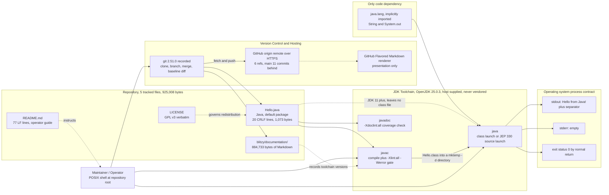
```mermaid
flowchart LR
    Dev["Maintainer / Operator<br/>POSIX shell at repository root"]

    subgraph SCM["Version Control and Hosting"]
        GitCLI["git 2.51.0 recorded<br/>clone, branch, merge, baseline diff"]
        Remote["GitHub origin remote over HTTPS<br/>6 refs, main 11 commits behind"]
        Render["GitHub Flavored Markdown renderer<br/>presentation only"]
    end

    subgraph Repo["Repository, 5 tracked files, 925,008 bytes"]
        Src["Hello.java<br/>Java, default package<br/>20 CRLF lines, 1,073 bytes"]
        Readme["README.md<br/>77 LF lines, operator guide"]
        Lic["LICENSE<br/>GPL v3 verbatim"]
        Docs["blitzy/documentation/<br/>884,733 bytes of Markdown"]
    end

    subgraph Toolchain["JDK Toolchain, OpenJDK 25.0.3, host supplied, never vendored"]
        Javac["javac<br/>compile plus -Xlint:all -Werror gate"]
        Java["java<br/>class launch or JEP 330 source launch"]
        Javadoc["javadoc<br/>-Xdoclint:all coverage check"]
    end

    subgraph Lib["Only code dependency"]
        Lang["java.lang, implicitly imported<br/>String and System.out"]
    end

    subgraph Proc["Operating system process contract"]
        Stdout["stdout: Hello from Java! plus separator"]
        Stderr["stderr: empty"]
        Exit["exit status 0 by normal return"]
    end

    Dev --> GitCLI
    GitCLI -->|"fetch and push"| Remote
    Remote -.-> Render
    GitCLI --> Src
    GitCLI --> Docs
    Readme -.->|"instructs"| Dev
    Docs -.->|"records toolchain versions"| Javac
    Lic -.->|"governs redistribution"| Src
    Dev --> Javac
    Dev --> Java
    Src --> Javac
    Javac -->|"Hello.class into a mktemp -d directory"| Java
    Src -.->|"JDK 11 plus, leaves no class file"| Java
    Src --> Javadoc
    Lang --> Java
    Java --> Stdout
    Java --> Stderr
    Java --> Exit
```

### 3.7.2 Integration Requirements Between Components

| Interface | Requirement on each side | Verification |
| --- | --- | --- |
| **`Hello.java` → `javac`** | The file name must match the public class; the unit must compile with no `--release` or `--source` setting and no dependency to resolve. `javac` must accept JDK 1.0-era constructs | Exit 0 with no diagnostics, including under `-Xlint:all -Werror` (`Project Guide.md` §3, §9.4) |
| **`javac` → `java`** | The class output directory must be on the classpath at launch: `java -cp "$B" Hello` for Path B, or the repository root for Path A | `Project Guide.md` Appendix A records both forms as exercised |
| **`Hello.java` → `java` (direct)** | The launcher must implement source-file mode, and the first top-level class must declare the standard `main` signature — satisfied at lines 6 and 15 | (cite index="1-30,1-31">JEP 330 requires the first top-level class in the file to declare `public static void main(String[])`</cite>; `README.md` line 40 |
| **`java` → `java.lang`** | The JVM must supply an initialised `System.out`. No other package is required, and no module path is configured | `Hello.java` line 17; zero `import` statements |
| **`java` → operating system** | The launching shell must connect standard output and observe the exit status. Standard error must remain empty; termination is by normal return, never `System.exit` | `README.md` line 63; `Project Guide.md` §9.7 records `exit=0` |
| **`Hello.java` → `javadoc`** | Doc comments must follow the placement conventions in `Project Guide.md` §5.1 row 2; exactly one warning is expected and a second is to be treated as a regression | `Project Guide.md` §9.6 |
| **Working tree → `git`** | Build output must be kept out of the tree by command discipline, since no `.gitignore` exists; `Hello.java`'s CRLF bytes must survive edits, since no `.gitattributes` exists | `git status --short` expected to print nothing (§9.2, §9.4) |
| **`git` → hosting platform** | The remote must hold the branch refs and accept the merge that advances `main`; the platform's renderer presents the Markdown and resolves `README.md`'s two relative links | `git remote -v`; `git branch -a`; Appendix D |
| **`README.md` → `Hello.java`** | The fenced expected-output block at lines 59–61 is the published oracle and must match the literal at line 17; citations are by stable symbol, not line number, because comments shift lines | `Project Guide.md` §4, Appendix G |
| **`LICENSE` → the covered work** | `LICENSE` must remain verbatim, and a modified covered work must carry a dated modification notice — present at `README.md` line 5 | `Project Guide.md` §1.3, §5.1 row 8 |

### 3.7.3 Version Compatibility and Pinning Position

The repository's deliberate position is **portability over reproducibility**: versions are *recorded*, never *enforced*.

| Dimension | Position | Evidence |
| --- | --- | --- |
| Java version pin | **None.** `README.md` line 18: the repository "pins no Java version" and carries no `pom.xml`, `build.gradle`, `.java-version`, `.sdkmanrc`, CI descriptor or `module-info.java` "in which a version could be recorded" | `README.md` line 18 |
| Java language level | **"None declared."** No `--release` or `--source` setting exists anywhere | Appendix D |
| Toolchain version used | OpenJDK **25.0.3** for `java`, `javac` and `javadoc`; `git` **2.51.0** | Appendix D, §9.1 |
| Verified compatibility range | Compile-then-run exercised at release targets **11, 17 and 21**; single-file source launch documented as **JDK 11+** but **not confirmed on a JDK 11 runtime** | §9.1; §1.6 open item |
| External context | (cite index="12-3">Java SE 8, 11, 17, 21 and 25 are the LTS releases</cite>; (cite index="11-7">Java 25 LTS was released on 16 September 2025</cite>. The recorded toolchain is therefore an update of the current LTS line, and the three exercised targets are all LTS releases | [web] Oracle Java SE Support Roadmap; Java version history |
| Reproducibility consequence | A build is reproducible in *behaviour* but not in *toolchain*: two operators on different JDKs both get `Hello from Java!` and exit 0, but nothing records or constrains which JDK either used | Synthesis of the rows above |

**Security implication of not pinning.** Because the JDK is host-supplied and unpinned, runtime CVE exposure is entirely a property of the operator's chosen JDK build and is neither recorded nor constrained by the repository. This is the residual technology risk identified in Section 3.4.6, and it is the trade the project accepts in exchange for compiling on any JDK. (cite index="14-1">Java 25 is the current LTS with Java 21 and Java 17 still supported across distributions</cite>, so an operator following the documented workflow on a current LTS remains on a patched line — but nothing in the repository enforces that.

### 3.7.4 Default Technology Stack — Applicability Assessment

A default technology stack is available as a fallback for greenfield work. **None of its elements is present in this repository**, and adopting any of them would contradict the stated constraint that a JDK alone builds and runs the program (`Hello.java` lines 2–4; constraint F-004). Each row below records the verification actually performed, so that the absence is evidenced rather than assumed.

| Default element | Present? | Verification performed | Why it does not apply |
| --- | --- | --- | --- |
| AWS (cloud platform) | No | No cloud SDK import, credential, region or endpoint in any tracked file; no IaC descriptor | Nothing is deployed; the program binds no port and makes no network call (Appendix B) |
| Docker (containerisation) | No | `Dockerfile`, `Dockerfile.dev`, `.dockerignore`, `docker-compose.yml`/`.yaml`, `compose.yml` — all absent, and never tracked in 14 commits | §9.1 records "no container" among the non-prerequisites |
| Terraform (IaC) | No | `main.tf`, `variables.tf`, `terraform/` — all absent | There is no infrastructure to describe |
| GitHub Actions (CI/CD) | No | `.github/` absent. The hosting platform *is* GitHub, but no workflow exists | Build, test and CI files are out of scope by declaration (§9.6); "Nothing re-runs the documentation checks" (§1.4) |
| Python (language) / Flask (framework) | No | Worktree search across 20 source extensions returns only `./Hello.java`; no `requirements.txt`, `Pipfile`, `pyproject.toml` or `setup.py` | Java is the implementation language; there is no HTTP surface for a web framework to serve |
| Auth0 (authentication) | No | No credential, token, key or secrets file in any tracked file; Appendix E records no environment variable is read | The program reads no input, so no principal can be asserted (Section 3.4.3) |
| MongoDB (database) | No | Appendix B: "there is no service, database, broker or cache in this project"; no connection configuration file exists anywhere | The program keeps no state within or between runs (Section 3.5.2) |
| Langchain (AI framework) | No | Zero `import` statements; no dependency manifest in which it could be declared | No model, prompt or inference path exists |
| React / React-Native / TypeScript / TailwindCSS | No | No `package.json`, lockfile or `.ts`/`.tsx`/`.jsx`/`.css` file anywhere in the worktree | Console output only; Section 1.3.2.1 records "no UI, hosted page, or port" |
| Swift / Kotlin / Objective-C / ElectronJS (native and desktop) | No | Worktree search for `.swift`, `.kt`, `.m`, `.mm` and `.js` returns nothing | There is no client application; the deliverable is one JVM process that writes one line |

### 3.7.5 Constraints Governing Future Stack Changes

Stack changes are not merely discouraged here; each one invalidates specific recorded requirements. The rules below are the technology-relevant subset of Section 2.6.4's change-impact rules, restated so that a reviewer can tell from a diff alone what must be re-verified.

| Proposed stack change | What it invalidates | Deeper consequence |
| --- | --- | --- |
| Add a build manifest, wrapper, test suite or CI descriptor | F-004-RQ-001, F-005-RQ-001, and the §1.4 "no automated gate" item | Forfeits the JDK-only property that constraint F-004 protects and changes the tracked-file census |
| Add a first third-party import or a second compilation unit | F-004-RQ-001, F-004-RQ-002, F-005-RQ-001 | Introduces dependency resolution, a supply-chain surface, and the build-ordering concerns Section 2.4.3 notes the project currently has none of |
| Add a `package` declaration or a `module-info.java` | F-001-RQ-002, F-001-RQ-004, F-004-RQ-002, F-004-RQ-004 | The bare-name launch `java Hello` stops working, invalidating every documented command |
| Introduce a `--release` or `--source` setting | Constraint F-004; Appendix D's "None declared" language level | Converts an any-JDK source file into a version-targeted build |
| Commit compiled output or a packaged artifact | F-005-RQ-002 | Ends the source-only distribution property; the tracked tree would carry its first binary |
| Adopt tags or releases | F-005-RQ-003 and the SHA-anchoring rule in Section 2.6.3 | Requirement versioning would move from commit SHAs to tags |
| Add `.gitattributes`, or normalise `Hello.java` to LF | F-005-RQ-004, F-008-RQ-005 | Rewrites all 20 lines and changes the file's content digest (`Project Guide.md` §5.2) |
| Add `.gitignore` | Closes the Low-severity hygiene item in §6; an Owner decision in §1.4 | Removes the reliance on documentation alone to keep `Hello.class` uncommitted |
| Reintroduce a fixed compiler-output path in place of `mktemp -d` | The mitigation recorded against F-004 in §6 | Restores the predictable-path exposure `README.md` line 30 explains |


## 3.8 References

#### Repository files examined

- `Hello.java` — established the sole implementation language and its entire language footprint: class Javadoc (lines 1–5), `public class Hello` with no `package` statement (line 6), `main` Javadoc with `@param args` (lines 7–14), the entry-point signature (line 15), the output comment (line 16), `System.out.println("Hello from Java!")` (line 17) and the termination comment (line 18). Measured at 20 lines / 1,073 bytes / 5 code lines / 15 comment lines / 0 tabs, CRLF on 20 of 20 lines, zero bytes at or above `0x80`, and zero `import` or `package` statements.
- `README.md` — established the toolchain contract: "A JDK is all that is required" and the pins-no-version statement (line 18), the JDK 11 floor for single-file source launch (line 20), build Path A (lines 26–28) and the `mktemp -d` Path B rationale (line 30), the three launch forms (lines 36–38, 42–44) and their byte-identical equivalence (line 46), the argument contract (lines 48–51), the published output oracle (lines 59–63), the stale three-file layout claim (line 67) and the GPL v3 statement (line 77). Measured at 77 lines / 4,053 bytes, LF-only, 4 fenced blocks, 2 tables, 2 relative links.
- `LICENSE` — established the outbound licence: verbatim GNU General Public License, Version 3, 29 June 2007 (lines 1–2), 674 lines / 35,149 bytes, LF-only, and the only tracked file containing external HTTPS references (lines 4, 648, 667, 674 — licence text, not integrations).
- `blitzy/documentation/Project Guide.md` — established every recorded version and tool role: §9 preamble (Linux host, OpenJDK 25.0.3), §9.1 prerequisites and the version-probe commands, §9.2 "Nothing to configure", §9.3 "None" for dependency installation, §9.4 the two build paths, Appendix A command reference, Appendix B port reference, Appendix C file locations and sizes, Appendix D technology versions (OpenJDK 25.0.3, language level "None declared", GFM over CommonMark, git 2.51.0), Appendix E environment variables, Appendix F developer tools and the "no linter, formatter, documentation generator, build tool or test framework" statement, and Appendix G glossary definitions of single-file source launch and the implicit default constructor. Also §1.4 open items, §1.6 next steps, §3 check results, §5.1/§5.2 compliance rows and divergences, and §6 risk assessment. Measured at 476 lines / 45,009 bytes.
- `blitzy/documentation/Technical Specifications.md` — the prior generation of this specification; supplied the recorded observation that the local clone reaches the remote over HTTPS with a short-lived token held in the untracked `.git/config`, and the previously verified external facts about the hosting repository's public visibility and GPL-3.0 licence detection. Measured at 839,724 bytes.

#### Repository folders examined

- `` (repository root) — established the four first-order children (`LICENSE`, `Hello.java`, `README.md`, `blitzy/`) and the complete absence of every build, dependency, container, IaC, CI, configuration, quality-tool and hygiene descriptor tested for.
- `blitzy/` — confirmed its single child, `blitzy/documentation/`.
- `blitzy/documentation/` — confirmed the two Markdown documents totalling 884,733 bytes, 95.6% of the 925,008-byte tracked footprint.

#### Verification performed directly against the checkout

- `git ls-files`, `git ls-files | xargs wc -c` — the five tracked paths and their exact byte sizes totalling 925,008.
- `git log --all --name-only --diff-filter=A`, `git rev-list --count HEAD`, `git tag`, `git log --all --pretty='%h %G? %an'` — 14 commits, zero tags, only five files ever added on any branch, and the mixed commit-signature status.
- `git branch -a`, `git remote -v`, `git rev-list --left-right --count main...HEAD` — two local and six remote refs, the GitHub `origin` URL, and `main` 11 commits behind `jr_java1`.
- `git check-attr text eol -- Hello.java`, `git config --get core.autocrlf`, `git config --get core.eol`, `git check-ignore -v Hello.class`, `.git/info/exclude` — no line-ending management and no ignore rule of any kind.
- `git count-objects -vH` — 37 objects in one 302.84 KiB pack, no loose or garbage objects.
- `git grep` across tracked files for token, key and credential patterns — no credential value in any tracked file.
- Existence tests at the repository root across 79 candidate descriptor paths spanning build and dependency manifests, wrappers, toolchain version files, container and orchestration descriptors, IaC templates, CI configurations, application and logging configuration, static-analysis configuration, governance files and editor/IDE directories — **all absent**.
- Recursive worktree searches for 21 source-file extensions (returning only `./Hello.java`) and for 9 binary and archive extensions (returning nothing).
- Byte-level censuses with `od`, `awk` and `grep` — CRLF and high-byte counts per tracked text file, and the Hello.java comment/code line split.
- `command -v java javac javadoc`, `java -version`, `git --version` — no JDK present in this specification's environment (confirming Section 2.6.1 assumption A-3); `git` 2.43.0 observed.

#### Technical Specification sections cross-referenced

- Section 1.2 (System Overview) — the canonical-reference-program positioning, the four integration points, and the core technical approach.
- Section 1.3 (Scope) — the key technical requirements table, the verified exclusion inventory, and the unsupported use cases.
- Section 2.1 (Feature Catalog) — F-004 (dependency-free JDK-only build and launch), F-005 (source-only distribution), F-006 (GPLv3 terms), F-007 and F-008 (documentation), with their dependency tables.
- Section 2.4 (Implementation Considerations) — technical constraints F-002 … F-009, the scalability position, and the security implications table.
- Section 2.6 (Assumptions, Constraints and Requirement Versioning) — assumptions A-3 and A-4, constraints K-3 and K-7, the SHA-anchored version baselines, and the change-impact rules restated in Section 3.7.5.

#### Web sources

- [web] `openjdk.org/jeps/330` — JEP 330, *Launch Single-File Source-Code Programs*: confirmed that the class executed is the first top-level class in the file and must declare the standard `public static void main(String[])` method, and that `--source` is required when the file lacks a `.java` extension.
- [web] InfoQ, *Running Single-file Programs without Compiling in Java 11* — confirmed that JEP 330 was introduced in the JDK 11 release and that the source is compiled in memory and executed without producing a `.class` file on disk, corroborating `README.md` line 40.
- [web] *Launch Single-File Source-Code Programs* (sip-of-java) — corroborated that the feature was added in JDK 11.
- [web] Oracle *Java SE Support Roadmap* — confirmed that Java SE 8, 11, 17, 21 and 25 are the LTS releases, placing the recorded OpenJDK 25.0.3 and the exercised targets 11, 17 and 21 in context.
- [web] Wikipedia, *Java version history* — confirmed the Java 25 LTS release date of 16 September 2025.
- [web] *Java Version and LTS Timeline* (hidekazu-konishi.com) — confirmed the two-year LTS cadence adopted from September 2021.
- [web] HeroDevs, *Java 8, 11, 17 EOL Dates by OpenJDK Vendor* — confirmed that Java 25 is the current LTS with Java 21 and Java 17 still supported across distributions, supporting the unpinned-JDK risk note in Section 3.7.3.


# 4. Process Flowchart

## 4.1 System Workflows

The system documented here is a single-statement console program. `Hello.java` contains exactly five executable lines — the class declaration at line 6, the entry-point signature at line 15, one `System.out.println("Hello from Java!")` at line 17, and the two closing braces at lines 19 and 20 — and a fixed-string census of the file returns **zero** occurrences of `if (`, `for (`, `while (`, `switch (`, `try {`, `catch`, `throw`, `new ` and `System.exit(`, with exactly one `println(`. There is therefore precisely one path through the running program, containing no decision point and no error branch. Section 2.3.1 records the same property of the feature chain: `F-004 → F-001 → F-002 → F-003` is "strictly linear and has no branch."

Every decision diamond, error state and recovery path in this section consequently belongs to the **operator and toolchain workflow that surrounds the program**, not to the program itself. Those workflows are real, documented and verified: `README.md` publishes them as executable literals, and `blitzy/documentation/Project Guide.md` §9 records each command as having been executed on a Linux host with OpenJDK 25.0.3.

### 4.1.1 Workflow Inventory, Actors and Conventions

**Workflow identifiers.** Section 1.3.1.1 already enumerates the four primary operator workflows as `W-1` … `W-4`, and Section 2.3.5 states that these "are the only processes in which features interact" and delegates their detailed decomposition to this section. This section preserves those identifiers unchanged and additionally names the three maintenance procedures that `Project Guide.md` documents but Section 1.3.1.1 does not enumerate; those three are introduced here as `M-1` … `M-3`.

| ID | Workflow | Trigger | Terminal state | Primary evidence |
| --- | --- | --- | --- | --- |
| W-1 | Compile in place, then run | Operator at the repository root | Greeting on stdout, exit status 0, untracked `Hello.class` present or removed | `README.md` lines 27, 37 |
| W-2 | Compile to a fresh directory outside the checkout, then run | Operator who must keep the working tree clean | Greeting on stdout, exit status 0, working tree unchanged | `README.md` line 30 |
| W-3 | Launch the source file directly | Operator on JDK 11 or later wanting no artifact | Greeting on stdout, exit status 0, no class file created | `README.md` lines 40–44 |
| W-4 | Verify the output contract | Any of W-1 … W-3 has produced output | Observed stdout, stderr and exit status compared against the published oracle | `README.md` lines 57–63 |
| M-1 | Comment-only source edit with behaviour-parity verification | Maintainer edits `Hello.java` | Additions-only diff proven against the pre-comment revision, byte-identical runtime behaviour | `Project Guide.md` §9.6 |
| M-2 | Quality-gate run | Any source or guide change | `javac -Xlint:all -Werror` clean, exactly one accepted `javadoc` warning, acceptance suite passing | `Project Guide.md` §3, §9.6 |
| M-3 | Publish and merge the delivery | Maintainer with an unpublished branch | `main` no longer behind the working branch | `Project Guide.md` §1.6 |

**Actors and systems.** The repository defines no roles, accounts or permissions of its own — Section 1.3.1.2 records that "user group" here means audience, not an access-control construct. The participants in every flow below are therefore either humans or external facilities.

| Actor or system | Role in the workflows | Inside the system boundary? |
| --- | --- | --- |
| Operator / learner | Types the documented commands; reads and compares the output | No — a human touchpoint |
| Maintainer | Edits `Hello.java`, runs the gates, publishes the branch | No — a human touchpoint |
| Repository owner | Holds the deferred decisions recorded in `Project Guide.md` §1.4 | No — a human touchpoint |
| POSIX shell | Invokes the toolchain, supplies `mktemp -d`, observes exit status | No — host environment |
| JDK toolchain (`javac`, `java`, `javadoc`) | Compiles, launches and measures comment coverage | No — required but not vendored (Section 1.3.1.2) |
| JVM process from `Hello.java` | Performs the one statement of work | **Yes** — this *is* the executable system |
| OS process contract | Carries stdout, stderr and the exit status | No — the consuming contract |
| Filesystem | Holds the source, and any `Hello.class` or scratch directory | No — `Hello.class` is explicitly outside the boundary |
| `git` and the hosting platform | Clone, branch, pull-request merge, baseline retrieval | No |

**Diagram conventions used throughout Section 4.** Subgraphs act as swim lanes, one per actor or system. Stadium nodes mark start and end points, diamonds mark decision points, and plain rectangles mark process steps. Where a step verifies a contract, the governing requirement identifier from Section 2.2 is written into the node label so each flow step is traceable to its acceptance criterion.

### 4.1.2 Core Business Processes

There is no business process in the commercial sense anywhere in this repository. There is no customer, order, transaction, approval, ledger or workflow engine: Section 1.3.2.1 records that persistence and data services, network services, user interfaces, authentication, configuration management and logging are all absent, each confirmed by direct existence test. The "core business processes" of this system are the developer and operator processes through which the artifact is built, launched, verified and maintained.

#### 4.1.2.1 High-Level System Workflow

The following diagram is the single end-to-end view of the system: an operator obtains the source through Git, reads the guide, drives the JDK toolchain, and observes the process contract. The `System boundary` lane contains the only steps that execute repository code.

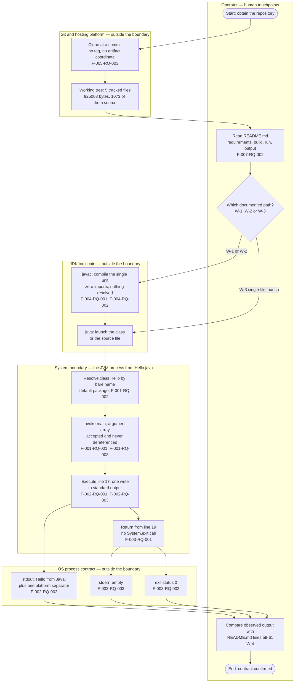
```mermaid
flowchart TB
    subgraph OperatorLane["Operator — human touchpoints"]
        OP1(["Start: obtain the repository"])
        OP2["Read README.md<br/>requirements, build, run, output<br/>F-007-RQ-002"]
        OP3{"Which documented path?<br/>W-1, W-2 or W-3"}
        OP4["Compare observed output with<br/>README.md lines 59-61<br/>W-4"]
        OP5(["End: contract confirmed"])
    end

    subgraph VCSLane["Git and hosting platform — outside the boundary"]
        G1["Clone at a commit<br/>no tag, no artifact coordinate<br/>F-005-RQ-003"]
        G2["Working tree: 5 tracked files<br/>925008 bytes, 1073 of them source"]
    end

    subgraph ToolLane["JDK toolchain — outside the boundary"]
        T1["javac: compile the single unit<br/>zero imports, nothing resolved<br/>F-004-RQ-001, F-004-RQ-002"]
        T2["java: launch the class<br/>or the source file"]
    end

    subgraph SystemLane["System boundary — the JVM process from Hello.java"]
        S1["Resolve class Hello by bare name<br/>default package, F-001-RQ-002"]
        S2["Invoke main, argument array<br/>accepted and never dereferenced<br/>F-001-RQ-001, F-001-RQ-003"]
        S3["Execute line 17: one write<br/>to standard output<br/>F-002-RQ-001, F-002-RQ-003"]
        S4["Return from line 19<br/>no System.exit call<br/>F-003-RQ-001"]
    end

    subgraph OSLane["OS process contract — outside the boundary"]
        O1["stdout: Hello from Java!<br/>plus one platform separator<br/>F-002-RQ-002"]
        O2["stderr: empty<br/>F-003-RQ-003"]
        O3["exit status 0<br/>F-003-RQ-002"]
    end

    OP1 --> G1
    G1 --> G2
    G2 --> OP2
    OP2 --> OP3
    OP3 -->|"W-1 or W-2"| T1
    OP3 -->|"W-3 single-file launch"| T2
    T1 --> T2
    T2 --> S1
    S1 --> S2
    S2 --> S3
    S3 --> S4
    S3 --> O1
    S4 --> O2
    S4 --> O3
    O1 --> OP4
    O2 --> OP4
    O3 --> OP4
    OP4 --> OP5
```

#### 4.1.2.2 W-1 — Compile in Place, Then Run

`W-1` is the shortest documented path and the only one that leaves an artifact inside the checkout. Because the repository carries no `.gitignore`, that artifact appears as untracked content, which is why the flow ends in a hygiene decision rather than simply at the greeting.

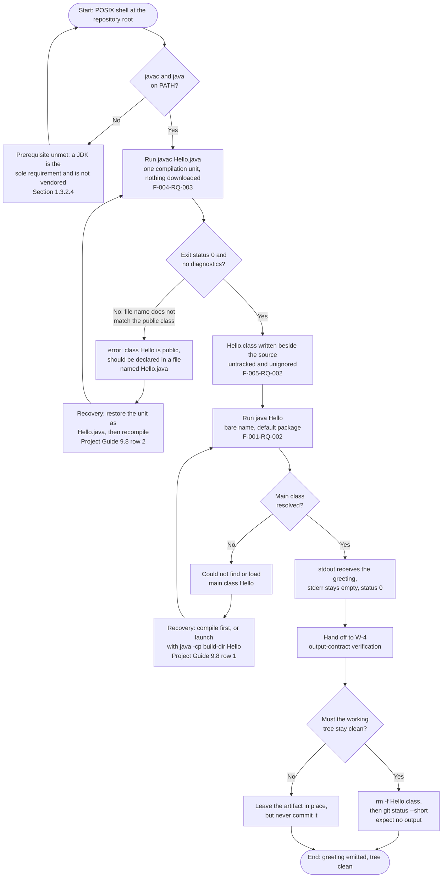
```mermaid
flowchart TD
    W1S(["Start: POSIX shell at the repository root"]) --> W1A{"javac and java<br/>on PATH?"}
    W1A -->|"No"| W1AE["Prerequisite unmet: a JDK is the<br/>sole requirement and is not vendored<br/>Section 1.3.2.4"]
    W1AE --> W1S
    W1A -->|"Yes"| W1B["Run javac Hello.java<br/>one compilation unit, nothing downloaded<br/>F-004-RQ-003"]
    W1B --> W1C{"Exit status 0 and<br/>no diagnostics?"}
    W1C -->|"No: file name does not<br/>match the public class"| W1CE["error: class Hello is public,<br/>should be declared in a file<br/>named Hello.java"]
    W1CE --> W1CR["Recovery: restore the unit as<br/>Hello.java, then recompile<br/>Project Guide 9.8 row 2"]
    W1CR --> W1B
    W1C -->|"Yes"| W1D["Hello.class written beside the source<br/>untracked and unignored<br/>F-005-RQ-002"]
    W1D --> W1E["Run java Hello<br/>bare name, default package<br/>F-001-RQ-002"]
    W1E --> W1F{"Main class<br/>resolved?"}
    W1F -->|"No"| W1FE["Could not find or load<br/>main class Hello"]
    W1FE --> W1FR["Recovery: compile first, or launch<br/>with java -cp build-dir Hello<br/>Project Guide 9.8 row 1"]
    W1FR --> W1E
    W1F -->|"Yes"| W1G["stdout receives the greeting,<br/>stderr stays empty, status 0"]
    W1G --> W1H["Hand off to W-4<br/>output-contract verification"]
    W1H --> W1I{"Must the working<br/>tree stay clean?"}
    W1I -->|"Yes"| W1J["rm -f Hello.class,<br/>then git status --short<br/>expect no output"]
    W1I -->|"No"| W1K["Leave the artifact in place,<br/>but never commit it"]
    W1J --> W1Z(["End: greeting emitted, tree clean"])
    W1K --> W1Z
```

#### 4.1.2.3 W-2 — Compile Outside the Checkout, Then Run

`W-2` is the path `README.md` line 30 recommends. Its distinguishing step is the generation of the output directory: the guide requires a freshly generated, owner-readable-only directory because "a fixed, predictable destination can be pre-created, replaced or redirected through a symbolic link by another local process before the compiler writes into it." Section 2.2.5 records the reintroduction of a predictable path as a Security-category concern, currently `Mitigated`.

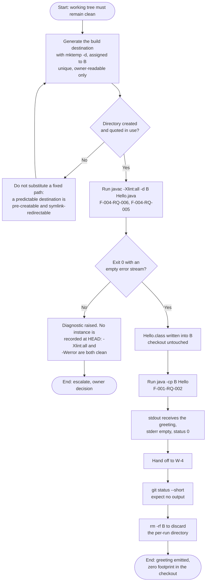
```mermaid
flowchart TD
    W2S(["Start: working tree must remain clean"]) --> W2A["Generate the build destination<br/>with mktemp -d, assigned to B<br/>unique, owner-readable only"]
    W2A --> W2B{"Directory created<br/>and quoted in use?"}
    W2B -->|"No"| W2BE["Do not substitute a fixed path:<br/>a predictable destination is<br/>pre-creatable and symlink-redirectable"]
    W2BE --> W2A
    W2B -->|"Yes"| W2C["Run javac -Xlint:all -d B Hello.java<br/>F-004-RQ-006, F-004-RQ-005"]
    W2C --> W2D{"Exit 0 with an<br/>empty error stream?"}
    W2D -->|"No"| W2DE["Diagnostic raised. No instance is<br/>recorded at HEAD: -Xlint:all and<br/>-Werror are both clean"]
    W2DE --> W2Z2(["End: escalate, owner decision"])
    W2D -->|"Yes"| W2E["Hello.class written into B<br/>checkout untouched"]
    W2E --> W2F["Run java -cp B Hello<br/>F-001-RQ-002"]
    W2F --> W2G["stdout receives the greeting,<br/>stderr empty, status 0"]
    W2G --> W2H["Hand off to W-4"]
    W2H --> W2I["git status --short<br/>expect no output"]
    W2I --> W2J["rm -rf B to discard<br/>the per-run directory"]
    W2J --> W2Z(["End: greeting emitted,<br/>zero footprint in the checkout"])
```

#### 4.1.2.4 W-3 — Single-File Source Launch

`W-3` compiles nothing durably and leaves no artifact. It is the only workflow in the system with a stated version floor, and that floor is also the only **open** verification item among the launch paths: `Project Guide.md` §4 marks the claim "⚠ Partial" because the JDK 11 floor "has not been run on a JDK 11 runtime; only JDK 25 was available."

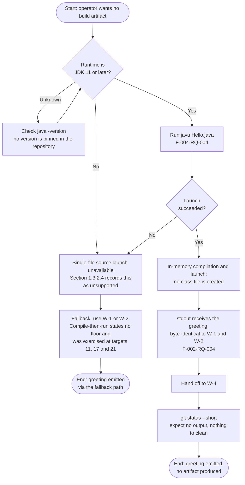
```mermaid
flowchart TD
    W3S(["Start: operator wants no build artifact"]) --> W3A{"Runtime is<br/>JDK 11 or later?"}
    W3A -->|"Unknown"| W3AQ["Check java -version<br/>no version is pinned in the repository"]
    W3AQ --> W3A
    W3A -->|"No"| W3AE["Single-file source launch unavailable<br/>Section 1.3.2.4 records this<br/>as unsupported"]
    W3AE --> W3AF["Fallback: use W-1 or W-2.<br/>Compile-then-run states no floor and<br/>was exercised at targets 11, 17 and 21"]
    W3AF --> W3Z2(["End: greeting emitted<br/>via the fallback path"])
    W3A -->|"Yes"| W3B["Run java Hello.java<br/>F-004-RQ-004"]
    W3B --> W3C{"Launch<br/>succeeded?"}
    W3C -->|"No"| W3AE
    W3C -->|"Yes"| W3D["In-memory compilation and launch:<br/>no class file is created"]
    W3D --> W3E["stdout receives the greeting,<br/>byte-identical to W-1 and W-2<br/>F-002-RQ-004"]
    W3E --> W3F["Hand off to W-4"]
    W3F --> W3G["git status --short<br/>expect no output, nothing to clean"]
    W3G --> W3Z(["End: greeting emitted,<br/>no artifact produced"])
```

#### 4.1.2.5 W-4 — Output-Contract Verification

`W-4` is the acceptance procedure every launch path terminates in. Its oracle is published inside the repository: the fenced block at `README.md` lines 59–61, which `Project Guide.md` §4 records as comparing "byte-identical to real standard output." The contract deliberately fixes the literal and its single trailing separator rather than a byte count, because the separator is host-defined.

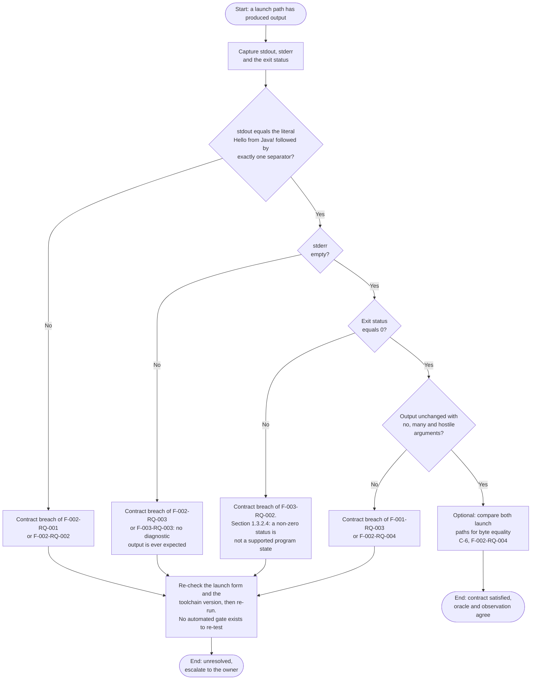
```mermaid
flowchart TD
    W4S(["Start: a launch path has produced output"]) --> W4A["Capture stdout, stderr<br/>and the exit status"]
    W4A --> W4B{"stdout equals the literal<br/>Hello from Java! followed by<br/>exactly one separator?"}
    W4B -->|"No"| W4BE["Contract breach of F-002-RQ-001<br/>or F-002-RQ-002"]
    W4B -->|"Yes"| W4C{"stderr<br/>empty?"}
    W4C -->|"No"| W4CE["Contract breach of F-002-RQ-003<br/>or F-003-RQ-003: no diagnostic<br/>output is ever expected"]
    W4C -->|"Yes"| W4D{"Exit status<br/>equals 0?"}
    W4D -->|"No"| W4DE["Contract breach of F-003-RQ-002.<br/>Section 1.3.2.4: a non-zero status is<br/>not a supported program state"]
    W4D -->|"Yes"| W4E{"Output unchanged with<br/>no, many and hostile<br/>arguments?"}
    W4E -->|"No"| W4EE["Contract breach of F-001-RQ-003<br/>or F-002-RQ-004"]
    W4E -->|"Yes"| W4F["Optional: compare both launch<br/>paths for byte equality<br/>C-6, F-002-RQ-004"]
    W4F --> W4Z(["End: contract satisfied,<br/>oracle and observation agree"])
    W4BE --> W4X["Re-check the launch form and the<br/>toolchain version, then re-run.<br/>No automated gate exists to re-test"]
    W4CE --> W4X
    W4DE --> W4X
    W4EE --> W4X
    W4X --> W4Z2(["End: unresolved,<br/>escalate to the owner"])
```

#### 4.1.2.6 In-Process Execution Flow

This is the detailed process flow for the three runtime features `F-001`, `F-002` and `F-003` — the only flow in Section 4 whose steps execute repository code. It is noteworthy for what it lacks: **zero decision diamonds and zero error branches**, because the source contains no conditional, loop or exception construct, and `args` appears only on line 11 (the Javadoc `@param` tag) and line 15 (the signature), never on an executable line.


```mermaid
flowchart LR
    P0(["Process start: JVM created<br/>by the launcher"]) --> P1["Load class Hello from the classpath<br/>bare name resolves because there is<br/>no package statement"]
    P1 --> P2["Resolve public static void main<br/>the class's only member<br/>F-001-RQ-001, F-001-RQ-005"]
    P2 --> P3["Invoke main once with the<br/>argument array; the array is<br/>never dereferenced, F-001-RQ-003"]
    P3 --> P4["Execute line 17: a single write<br/>to System.out, the only sink<br/>referenced in the source<br/>F-002-RQ-003, F-002-RQ-005"]
    P4 --> P5["Reach the closing brace of main<br/>at line 19 and return; no System.exit<br/>F-003-RQ-001"]
    P5 --> P6["JVM shuts down of its own accord<br/>no shutdown hook, no finaliser"]
    P6 --> P7(["Process end: stdout carries the<br/>greeting, stderr empty, status 0<br/>F-003-RQ-002, F-003-RQ-003"])
```

#### 4.1.2.7 Maintenance Processes M-1 to M-3

Three further processes are documented in `blitzy/documentation/Project Guide.md` but are not launch workflows. `M-1` is the most procedurally involved process in the repository, and it carries the system's one genuinely counter-intuitive decision point: the comment census must be given the **pre-comment revision `0726b1d`** as its baseline, because at the current commit the diff is empty and "the census degenerates to zero," failing four checks against a correct tree.

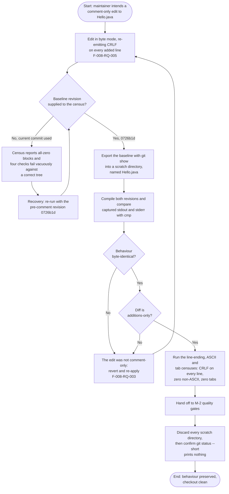
```mermaid
flowchart TD
    M1S(["Start: maintainer intends a<br/>comment-only edit to Hello.java"]) --> M1A["Edit in byte mode, re-emitting CRLF<br/>on every added line<br/>F-008-RQ-005"]
    M1A --> M1B{"Baseline revision<br/>supplied to the census?"}
    M1B -->|"No, current commit used"| M1BE["Census reports all-zero blocks and<br/>four checks fail vacuously against<br/>a correct tree"]
    M1BE --> M1BR["Recovery: re-run with the<br/>pre-comment revision 0726b1d"]
    M1BR --> M1B
    M1B -->|"Yes, 0726b1d"| M1C["Export the baseline with git show<br/>into a scratch directory,<br/>named Hello.java"]
    M1C --> M1D["Compile both revisions and compare<br/>captured stdout and stderr with cmp"]
    M1D --> M1E{"Behaviour<br/>byte-identical?"}
    M1E -->|"No"| M1EE["The edit was not comment-only:<br/>revert and re-apply<br/>F-008-RQ-003"]
    M1EE --> M1A
    M1E -->|"Yes"| M1F{"Diff is<br/>additions-only?"}
    M1F -->|"No"| M1EE
    M1F -->|"Yes"| M1G["Run the line-ending, ASCII and<br/>tab censuses: CRLF on every line,<br/>zero non-ASCII, zero tabs"]
    M1G --> M1H["Hand off to M-2 quality gates"]
    M1H --> M1I["Discard every scratch directory,<br/>then confirm git status --short<br/>prints nothing"]
    M1I --> M1Z(["End: behaviour preserved,<br/>checkout clean"])
```

`M-2` runs the gates enumerated in Section 3.6.3 — `javac` diagnostics, `javac -Xlint:all -Werror` as the project's entire static-analysis surface, `javadoc` comment coverage, and the acceptance suite recorded at 49 of 49 checks passed. Two properties shape its flow. First, the suite must be run from a scratch directory outside the checkout, because "build, test and CI files are out of scope for this repository." Second, exactly one `javadoc` warning is a **passing** outcome, not a failure: the implicit default constructor at `Hello.java:6` can carry no doc comment, so coverage stands at 2 of 3 documentable members by design.

`M-3` is the publication process, and it is the one workflow in the repository whose terminal state has not yet been reached. `git rev-list --left-right --count main...HEAD` reports `0	11`: `main` is an ancestor of the working branch `jr_java1` and 11 commits behind it, so the entire documentation delivery is absent from the default branch. Completing `M-3` closes requirement `F-005-RQ-005`.

#### 4.1.2.8 Decision Point Register

Every decision point in the system, with the rule that resolves it and where that rule is written down:

| # | Decision point | Workflow | Resolution rule | Source of the rule |
| --- | --- | --- | --- | --- |
| D-1 | Is a JDK on `PATH`? | W-1, W-2, W-3 | A JDK is the sole prerequisite and is not vendored; running without one is unsupported | `README.md` line 18; Section 1.3.2.4 |
| D-2 | Which launch path? | W-1 … W-3 | All three are documented and produce byte-identical stdout; W-2 is the guide's recommendation | `README.md` lines 27–46 |
| D-3 | Is the runtime JDK 11 or later? | W-3 | Required for the single-file source launch; otherwise fall back to compile-then-run, which states no floor | `README.md` line 20 |
| D-4 | Did `javac` exit 0 with no diagnostics? | W-1, W-2, M-2 | Zero diagnostics is the acceptance threshold, including under `-Werror` | `Project Guide.md` §9.4; `F-004-RQ-005` |
| D-5 | Was the main class resolved? | W-1, W-2 | Compile first, or pass `-cp`; the bare name is correct because the class is in the default package | `Project Guide.md` §9.8 row 1 |
| D-6 | Is the build destination freshly generated and quoted? | W-2 | Must be produced by `mktemp -d`; a fixed, predictable path is pre-creatable and symlink-redirectable | `README.md` line 30 |
| D-7 | Does observed output match the published oracle? | W-4 | Literal plus exactly one host separator on stdout, empty stderr, exit status 0 | `README.md` lines 57–63 |
| D-8 | Must the working tree stay clean? | W-1, W-2 | The class file must never be committed; there is no ignore rule to catch it | `README.md` line 30; `F-005-RQ-002` |
| D-9 | Which revision is the census baseline? | M-1 | The pre-comment revision `0726b1d`, never the current commit | `Project Guide.md` §5.2 divergence 2, §9.8 row 4 |
| D-10 | Is one `javadoc` warning acceptable? | M-2 | Yes — exactly one, for the implicit default constructor, is expected by design | `Project Guide.md` §9.8 row 6; `F-008-RQ-004` |
| D-11 | Is the delivery reachable on `main`? | M-3 | `git rev-list --left-right --count main...HEAD` must report `0 0`; it currently reports `0 11` | `F-005-RQ-005`; Section 3.6.6.2 |

### 4.1.3 Integration Workflows

Section 1.3.1.1 fixes the integration surface exactly: "In scope are precisely the four interfaces in §1.2.1.3 … Nothing else is integrated." Those four are the JDK toolchain, the operating-system process contract, Git with its hosting platform, and the GPL v3 obligations attached to the covered work. Section 2.3.2 assigns features to each seam and adds two internal seams that are validated as such.

#### 4.1.3.1 Data Flow Between Systems

The system moves four kinds of data and no more: one source file, one optional class file, one line of standard output, and the tracked documentation set. There is no schema, record, file format, serialisation or data at rest — Section 1.3.1.2 records exactly one data element in the system, the compile-time constant on `Hello.java` line 17, plus one runtime-derived value, the host line separator.

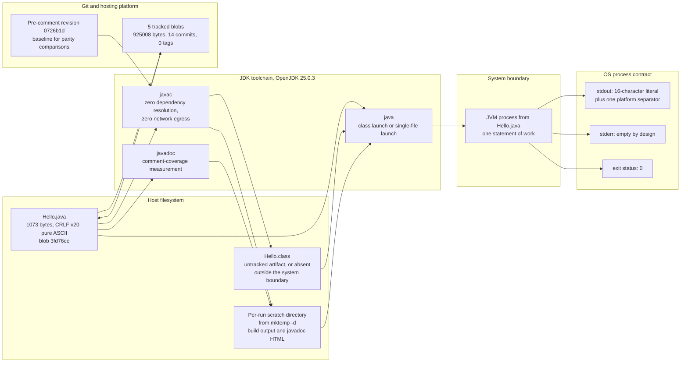
```mermaid
flowchart LR
    subgraph HostFS["Host filesystem"]
        SRC["Hello.java<br/>1073 bytes, CRLF x20, pure ASCII<br/>blob 3fd76ce"]
        CLS["Hello.class<br/>untracked artifact, or absent<br/>outside the system boundary"]
        SCRATCH["Per-run scratch directory<br/>from mktemp -d<br/>build output and javadoc HTML"]
    end

    subgraph JDKTools["JDK toolchain, OpenJDK 25.0.3"]
        JC["javac<br/>zero dependency resolution,<br/>zero network egress"]
        JV["java<br/>class launch or single-file launch"]
        JD["javadoc<br/>comment-coverage measurement"]
    end

    subgraph Runtime["System boundary"]
        PROC["JVM process from Hello.java<br/>one statement of work"]
    end

    subgraph ProcContract["OS process contract"]
        SOUT["stdout: 16-character literal<br/>plus one platform separator"]
        SERR["stderr: empty by design"]
        STAT["exit status: 0"]
    end

    subgraph GitLane["Git and hosting platform"]
        REPO["5 tracked blobs<br/>925008 bytes, 14 commits, 0 tags"]
        BASE["Pre-comment revision 0726b1d<br/>baseline for parity comparisons"]
    end

    REPO --> SRC
    BASE --> JC
    SRC --> JC
    SRC --> JV
    SRC --> JD
    JC --> CLS
    JC --> SCRATCH
    JD --> SCRATCH
    CLS --> JV
    SCRATCH --> JV
    JV --> PROC
    PROC --> SOUT
    PROC --> SERR
    PROC --> STAT
    SRC --> REPO
```

Two flows in that picture are deliberately one-directional. Nothing in `Hello.java` reads `README.md`, `LICENSE` or anything under `blitzy/documentation/`, so documentation data never reaches the runtime; Section 2.3.1 states the consequence — "a documentation change cannot alter runtime behaviour." And no build output ever flows back into the tracked set: `git ls-files` contains no `.class`, `.jar`, `.war` or `.zip` entry, and `README.md` line 30 instructs "Do not commit the class file either way."

#### 4.1.3.2 API Interactions

**There is no application programming interface in this system.** No HTTP, RPC or file-based interface exists; no port is bound, no listener is started and no network call is made. Section 1.3.2.3 additionally excludes service registries, artifact repositories, package managers, brokers, caches, databases, identity providers and secret stores, and records that `JAVA_HOME` "is explicitly not an integration point." Section 1.3.2.4 records that `Hello` cannot even be reused as a library, because a class in the default package cannot be imported by code in a named package.

What exists instead are three invocation contracts, and these are the whole of the system's interface surface:

| Invocation contract | Caller | Callee | Payload in | Payload out |
| --- | --- | --- | --- | --- |
| JVM entry-point contract | The JVM launcher | `Hello.main` | `String[] args`, accepted and never read | None; the method returns `void` |
| Compiler command line | POSIX shell | `javac` | The path `Hello.java`, optionally `-d <dir>` and `-Xlint:all -Werror` | Exit status, diagnostics on stderr, a class file |
| Launcher command line | POSIX shell | `java` | A class name with optional `-cp <dir>`, or the source path | Exit status, the greeting on stdout |

#### 4.1.3.3 Event Processing Flows

**No event processing exists.** There is no message broker, queue, topic, event bus, listener, callback or scheduler anywhere in the repository — `Project Guide.md` Appendix B states that the program "binds no port, starts no listener and makes no network call; there is no service, database, broker or cache in this project." Section 1.3.2.1 additionally records the absence of concurrency: `main` is single-threaded, with no thread, executor or synchronisation construct, which a source census confirms (`Thread` and `Scanner` return zero matches).

The only occurrences that behave like events are lifecycle transitions observed by external parties, and they are strictly sequential:

| Occurrence | Raised by | Observed by | Handling |
| --- | --- | --- | --- |
| Process start | The JVM launcher | The invoking shell | Implicit; the class is loaded and `main` invoked once |
| Single stdout write | `Hello.java` line 17 | The OS process contract | The one unit of work in the system |
| Normal return from `main` | `Hello.java` line 19 | The JVM | Triggers shutdown; no hook, finaliser or handler is registered |
| Process exit | The JVM | The invoking shell | Status 0 with empty stderr, the program's only outcome |
| Commit / pull-request merge | Maintainer, hosting platform | Downstream clones | `HEAD` = `2a78292`, "Merge pull request #1" — a human or bot step, not a pipeline |

#### 4.1.3.4 Batch Processing Sequences

**No batch processing exists.** There is no scheduler, cron entry, job runner or CI pipeline: Section 3.6.5 records existence tests returning absent for `.github/`, `.gitlab-ci.yml`, `.circleci/`, `Jenkinsfile`, `.travis.yml`, `azure-pipelines.yml`, `bitbucket-pipelines.yml` and `.drone.yml`, with a full-history check confirming none has ever been tracked. Nothing re-runs any check automatically.

The nearest analogue in the repository is the **manually invoked verification batch** of `M-2`: a fixed sequence of independent assertions run in one pass from a scratch directory outside the checkout, recorded at 49 of 49 passing — 37 acceptance assertions plus 12 direct toolchain checks. It is a batch only in the sense of being a bulk, all-at-once, non-interactive sequence; it has no scheduler, no queue, no partitioning and no restart semantics, and its only durable record is `Project Guide.md` §3 and §4. A second bulk sequence is the cross-release compilation check, which exercises `javac` at release targets 11, 17 and 21 in one pass.

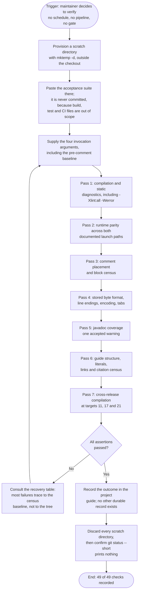
```mermaid
flowchart TD
    BS(["Trigger: maintainer decides to verify<br/>no schedule, no pipeline, no gate"]) --> B1["Provision a scratch directory<br/>with mktemp -d, outside the checkout"]
    B1 --> B2["Paste the acceptance suite there;<br/>it is never committed, because build,<br/>test and CI files are out of scope"]
    B2 --> B3["Supply the four invocation arguments,<br/>including the pre-comment baseline"]
    B3 --> B4["Pass 1: compilation and static<br/>diagnostics, including -Xlint:all -Werror"]
    B4 --> B5["Pass 2: runtime parity across both<br/>documented launch paths"]
    B5 --> B6["Pass 3: comment placement<br/>and block census"]
    B6 --> B7["Pass 4: stored byte format,<br/>line endings, encoding, tabs"]
    B7 --> B8["Pass 5: javadoc coverage<br/>one accepted warning"]
    B8 --> B9["Pass 6: guide structure, literals,<br/>links and citation census"]
    B9 --> B10["Pass 7: cross-release compilation<br/>at targets 11, 17 and 21"]
    B10 --> B11{"All assertions<br/>passed?"}
    B11 -->|"No"| B12["Consult the recovery table:<br/>most failures trace to the census<br/>baseline, not to the tree"]
    B12 --> B3
    B11 -->|"Yes"| B13["Record the outcome in the project<br/>guide; no other durable record exists"]
    B13 --> B14["Discard every scratch directory,<br/>then confirm git status --short<br/>prints nothing"]
    B14 --> BZ(["End: 49 of 49 checks recorded"])
```

#### 4.1.3.5 Integration Sequence Diagrams

The first sequence shows `W-2`, the recommended build-and-launch path, with each participant in its own lane. It is the clearest view of where the system boundary is crossed: only the `java` lane's internal step executes repository code.

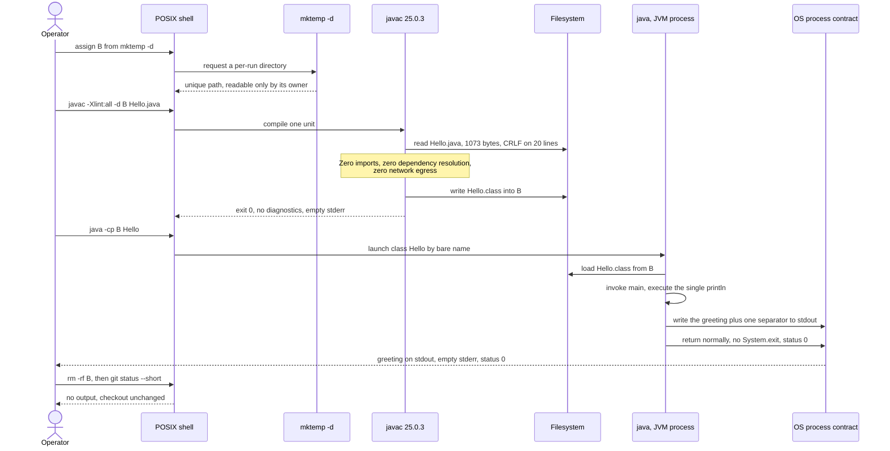
```mermaid
sequenceDiagram
    actor OPR as Operator
    participant SH as POSIX shell
    participant MK as mktemp -d
    participant JC as javac 25.0.3
    participant FS as Filesystem
    participant JV as java, JVM process
    participant OS as OS process contract

    OPR->>SH: assign B from mktemp -d
    SH->>MK: request a per-run directory
    MK-->>SH: unique path, readable only by its owner
    OPR->>SH: javac -Xlint:all -d B Hello.java
    SH->>JC: compile one unit
    JC->>FS: read Hello.java, 1073 bytes, CRLF on 20 lines
    Note over JC: Zero imports, zero dependency resolution,<br/>zero network egress
    JC->>FS: write Hello.class into B
    JC-->>SH: exit 0, no diagnostics, empty stderr
    OPR->>SH: java -cp B Hello
    SH->>JV: launch class Hello by bare name
    JV->>FS: load Hello.class from B
    JV->>JV: invoke main, execute the single println
    JV->>OS: write the greeting plus one separator to stdout
    JV->>OS: return normally, no System.exit, status 0
    OS-->>OPR: greeting on stdout, empty stderr, status 0
    OPR->>SH: rm -rf B, then git status --short
    SH-->>OPR: no output, checkout unchanged
```

The second sequence shows the Git and hosting-platform integration, which is how the artifact reaches an operator at all. Its final state is the open item `F-005-RQ-005`.

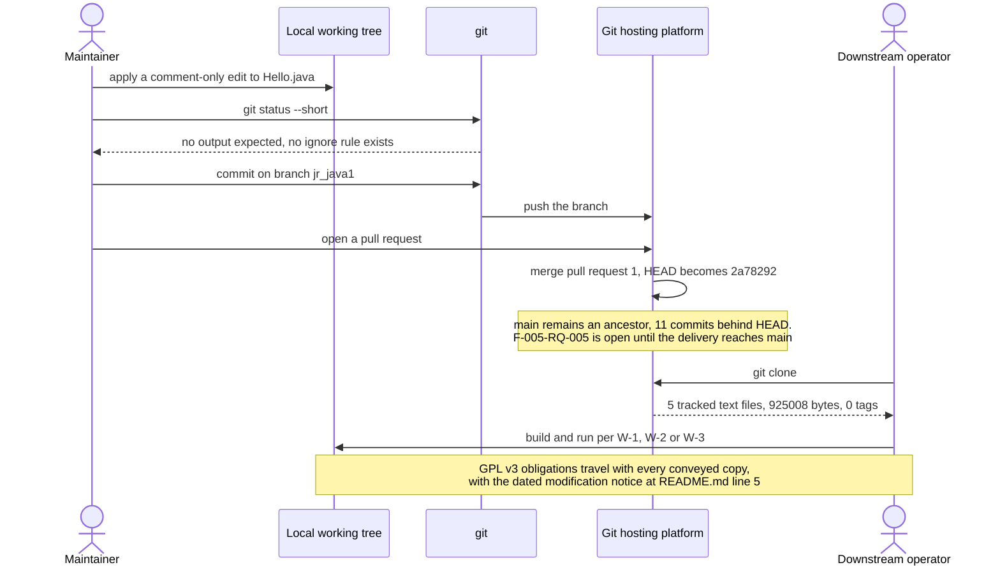
```mermaid
sequenceDiagram
    actor MNT as Maintainer
    participant WT as Local working tree
    participant GIT as git
    participant HOST as Git hosting platform
    actor OPR as Downstream operator

    MNT->>WT: apply a comment-only edit to Hello.java
    MNT->>GIT: git status --short
    GIT-->>MNT: no output expected, no ignore rule exists
    MNT->>GIT: commit on branch jr_java1
    GIT->>HOST: push the branch
    MNT->>HOST: open a pull request
    HOST->>HOST: merge pull request 1, HEAD becomes 2a78292
    Note over HOST: main remains an ancestor, 11 commits behind HEAD.<br/>F-005-RQ-005 is open until the delivery reaches main
    OPR->>HOST: git clone
    HOST-->>OPR: 5 tracked text files, 925008 bytes, 0 tags
    OPR->>WT: build and run per W-1, W-2 or W-3
    Note over OPR,WT: GPL v3 obligations travel with every conveyed copy,<br/>with the dated modification notice at README.md line 5
```

The third sequence shows the **guide-to-toolchain seam** of Section 2.3.2 — the internal integration that makes the documentation trustworthy. Every command printed in `README.md` must execute exactly as written, and the guide's fenced expected-output block must compare byte-for-byte against real standard output.

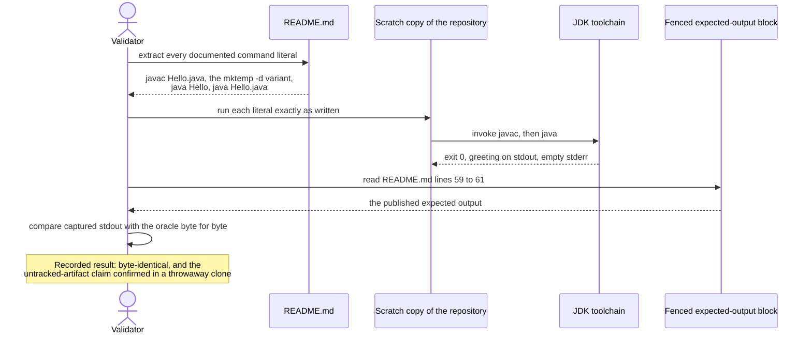
```mermaid
sequenceDiagram
    actor VAL as Validator
    participant GUIDE as README.md
    participant CLONE as Scratch copy of the repository
    participant TOOL as JDK toolchain
    participant ORACLE as Fenced expected-output block

    VAL->>GUIDE: extract every documented command literal
    GUIDE-->>VAL: javac Hello.java, the mktemp -d variant,<br/>java Hello, java Hello.java
    VAL->>CLONE: run each literal exactly as written
    CLONE->>TOOL: invoke javac, then java
    TOOL-->>CLONE: exit 0, greeting on stdout, empty stderr
    VAL->>ORACLE: read README.md lines 59 to 61
    ORACLE-->>VAL: the published expected output
    VAL->>VAL: compare captured stdout with the oracle byte for byte
    Note over VAL: Recorded result: byte-identical, and the<br/>untracked-artifact claim confirmed in a throwaway clone
```


## 4.2 Flowchart Requirements

This sub-section states, for each workflow drawn in Section 4.1, which mandatory flowchart elements it contains and which it cannot contain because the corresponding construct does not exist in the repository. It then enumerates the validation rules that govern each step.

### 4.2.1 Workflow Element Coverage

| Workflow | Start point | End point / states | Process steps | Decision diamonds | Error states | Recovery paths |
| --- | --- | --- | --- | --- | --- | --- |
| W-1 (§4.1.2.2) | Shell at the repository root | One: greeting emitted, tree clean or artifact knowingly retained | 12 | 4 — `D-1`, `D-4`, `D-5`, `D-8` | 3 — prerequisite unmet, file-name mismatch, main class not found | Re-run the compile or launch after the documented fix; delete the artifact |
| W-2 (§4.1.2.3) | Clean checkout that must remain clean | Two: zero-footprint success, or escalation on an unrecorded diagnostic | 9 | 2 — `D-6`, `D-4` | 2 — fixed-path substitution, compiler diagnostic | Regenerate the directory with `mktemp -d`; escalate a diagnostic to the owner |
| W-3 (§4.1.2.4) | Operator wanting no build artifact | Two: no-artifact success, or success via the fallback path | 6 | 2 — `D-3`, plus the launch-result check | 1 — version floor unmet, which also covers launch failure | Fall back to W-1 or W-2, which state no version floor |
| W-4 (§4.1.2.5) | Output produced by any launch path | Two: contract satisfied, or unresolved and escalated | 3 plus 4 breach nodes | 4 — `D-7` decomposed into stdout, stderr, status and argument checks | 4 — one per breached requirement | Re-check the launch form and toolchain version, then re-run |
| In-process (§4.1.2.6) | JVM created by the launcher | One: greeting on stdout, empty stderr, status 0 | 6 | **0** | **0** | Not applicable — no failure path exists in the source |
| M-1 (§4.1.2.7) | Maintainer intends a comment-only edit | One: behaviour preserved, checkout clean | 8 | 3 — `D-9`, parity check, additions-only check | 2 — wrong census baseline, edit not comment-only | Re-run with revision `0726b1d`; revert and re-apply the edit |
| M-2 (§4.1.3.4) | Maintainer decides to verify | One: 49 of 49 checks recorded | 12 | 1 — all-assertions-passed | 1 — assertion failure, most often the baseline rather than the tree | Correct the invocation argument and re-run the pass |
| M-3 (§4.1.2.7) | Maintainer with an unpublished branch | **Not yet reached** — `main` is 11 commits behind `HEAD` | Push, open pull request, merge | 1 — `D-11` | 1 — delivery unreachable on the default branch | Push and merge; closes `F-005-RQ-005` |

**Why the in-process flow has no decision or error element.** This is the single most important structural fact about the system's process model, and it is verified statically rather than assumed. A fixed-string census of `Hello.java` returns zero matches for `if (`, `for (`, `while (`, `switch (`, `try {`, `catch`, `throw`, `new ` and `System.exit(`; a comment-stripped word census returns zero for the same constructs; `System.err` and `System.in` return zero; and `args` never appears on an executable line. Section 1.3.2.1 lists "Explicit error handling" among the explicitly excluded capabilities, verified as "No `try`/`catch`, no thrown exception, no error branch anywhere in `Hello.java`."

### 4.2.2 System Boundaries and User Touchpoints

**Boundary crossings per workflow.** Section 1.3.1.2 places inside the boundary "the JVM process launched from `Hello.java` and the tracked files that describe and license it," and places outside it the JDK, the host operating system, Git with its hosting platform, and any `Hello.class` produced by a build.

| Workflow | Boundaries crossed, in order |
| --- | --- |
| W-1 | Operator → shell → `javac` → filesystem → `java` → **system boundary** → OS process contract → operator |
| W-2 | Operator → shell → `mktemp` → `javac` → scratch filesystem → `java` → **system boundary** → OS process contract → operator |
| W-3 | Operator → shell → `java` (compile and launch in one step, no filesystem artifact) → **system boundary** → OS process contract → operator |
| W-4 | OS process contract → operator → `README.md` oracle → operator |
| M-1 | Maintainer → editor → filesystem → `git` → `javac` → `java` → comparison utilities → maintainer |
| M-2 | Maintainer → scratch filesystem → `javac`, `java`, `javadoc`, GNU utilities → maintainer |
| M-3 | Maintainer → `git` → hosting platform → downstream clone |

**User touchpoint register.** The system has no user interface of any kind — Section 1.3.2.1 records "Console output only; no UI, hosted page, or port." Every touchpoint is therefore a shell interaction or a document read.

| Touchpoint | Medium | Workflow | Governing requirement |
| --- | --- | --- | --- |
| Reading the operator guide | `README.md`, eight sections at lines 3, 10, 16, 22, 32, 55, 65, 75 | All | `F-007-RQ-001`, `F-007-RQbe-002` superseded by `F-007-RQ-002` |
| Typing a build command | Shell | W-1, W-2 | `F-004-RQ-003`, `F-004-RQ-006` |
| Typing a launch command | Shell | W-1, W-2, W-3 | `F-001-RQ-002`, `F-004-RQ-004` |
| Supplying command-line arguments | Shell | W-1, W-2, W-3 | `F-001-RQ-003` — accepted and never read |
| Reading the greeting | stdout | All | `F-002-RQ-001`, `F-002-RQ-002` |
| Observing the exit status | Shell status variable | W-4 | `F-003-RQ-002` |
| Comparing against the published oracle | `README.md` lines 59–61 | W-4 | `F-002-RQ-004` |
| Reading the licence terms | `LICENSE`, linked from `README.md` line 77 | Redistribution | `F-006-RQ-002` |
| Reading the in-source comments | `Hello.java` lines 1–5, 7–14, 16, 18 | Maintenance | `F-008-RQ-001` |
| Consulting the troubleshooting table | `Project Guide.md` §9.8, seven rows | Error recovery | `F-009-RQ-001` |

### 4.2.3 Timing and SLA Considerations

**No service-level agreement, performance target or timing constraint is recorded anywhere in this repository.** This is an observed absence, not an omission from this document. Section 2.2.1 states that "The repository declares no requirements document, no service-level objective and no performance target — there is no build descriptor, test suite or CI configuration in which one could be recorded," and the "Performance criteria" row of every one of the nine feature specifications in Section 2.2 reads "None is recorded." Section 1.3.2.4 records "Using the program as a performance, load, or soak benchmark" as an unsupported use case, because "no measurement, instrumentation, or timing exists; no such target is recorded anywhere."

Consequently no flow in Section 4.1 carries a timing annotation, a timeout, a deadline, a retry interval or a backoff schedule — none of those constructs exists to document. What the repository does quantify is structural rather than temporal:

| Quantified property | Recorded value | Where it is fixed |
| --- | --- | --- |
| Compiler diagnostics | Zero, including under `-Xlint:all -Werror` | `Project Guide.md` §9.4; `F-004-RQ-005` |
| `javadoc` warnings | Exactly one, accepted by design | `Project Guide.md` §9.6; `F-008-RQ-004` |
| Units of work per process run | One statement, executed exactly once | `F-002-RQ-005` |
| Threads of control | One; no thread, executor or synchronisation construct | Section 1.3.1.2; `F-003-RQ-004` |
| Standard-output size | The 16-character literal plus one host separator — 17 bytes on a host whose separator is LF | `README.md` line 63; `Project Guide.md` §4 |
| Acceptance checks | 49 executed, 49 passed, 0 failed | `Project Guide.md` §3 |
| Remaining project effort | 6.0 hours across six deferred items | `Project Guide.md` §2.2 |

The only *bound* that can be stated about a run is therefore structural: the in-process flow of §4.1.2.6 traverses one method frame containing one statement, with no loop, branch or blocking call, and `F-003-RQ-004` requires that "no non-terminating or blocking path can be taken." Whether a given run completes quickly is a property of the host and the JDK, neither of which this repository pins.

### 4.2.4 Validation Rules

#### 4.2.4.1 Business Rules at Each Step

Every rule below is a contract already stated in Section 2.2's "Business rules" rows or in the repository's own documents; none is invented here. The table maps each rule to the flow step it governs.

| Flow step | Business rule | Consequence of breach | Source |
| --- | --- | --- | --- |
| Class resolution (§4.1.2.6 P1) | The class must stay in the default package so the bare name launches it | The documented launch command stops working; `Project Guide.md` §9.8 row 1 applies | `F-001-RQ-002` |
| Entry-point invocation (P2) | `main` must remain the class's only member | Contradicts the class Javadoc at lines 1–5 that Sections 1.2.2.2 and 1.3.1.1 rely on | `F-001-RQ-005` |
| Argument handling (P3) | `args` must never be dereferenced; validating it would itself breach the contract | Argument insensitivity `C-5` is lost | `F-001-RQ-003` |
| The single write (P4) | The literal is the system's contract and may not change; the separator must stay host-supplied, never hard-coded | Invalidates `README.md` lines 57–63 and the acceptance oracle | `F-002-RQ-001`, `F-002-RQ-002` |
| Termination (P5) | Exit status 0 with an empty error stream is the program's only outcome | A non-zero status is not a supported program state (Section 1.3.2.4) | `F-003-RQ-001`, `F-003-RQ-002` |
| Build invocation (W-1, W-2) | The JDK-only property is load-bearing; introducing any manifest or third-party import forfeits it. No Java version may be pinned without an owner decision | `F-004-RQ-001` fails; the zero-supply-chain position is lost | `F-004-RQ-001` |
| Build destination (W-2, `D-6`) | The destination must be a freshly generated, owner-readable-only directory | Reintroduces the pre-creatable, symlink-redirectable path classed as a Security risk | `F-004-RQ-006` |
| Artifact disposal (W-1, `D-8`) | Build output must never be committed; no `.gitignore` exists to catch it | `F-005-RQ-002` fails; a binary enters a source-only distribution | `README.md` line 30 |
| Tracked-set composition | The tracked set defines the system boundary; adding a build, test or CI file changes both `F-005-RQ-001` and `F-004-RQ-001` | The system boundary of Section 1.3.1.2 shifts | `F-005-RQ-001` |
| Guide content (W-4) | Every documented command must be executable exactly as written, and the change summary must remain the first content block in the documented eight-section order | The guide-to-toolchain seam of Section 2.3.2 breaks | `F-007-RQ-001`, `F-007-RQ-002` |
| Source edit (M-1) | The edit must stay comment-only; the single `println`, the ignored `args` and the `System.exit`-free termination must survive any change | Behaviour preservation, a critical success factor per Section 1.2.3.2, is lost | `F-008-RQ-003` |
| Census invocation (M-1, `D-9`) | The baseline must be the pre-comment revision, or four checks fail vacuously against a correct tree | A correct tree is misreported as broken | `Project Guide.md` §5.2 divergence 2 |
| Verification artefacts (M-2) | Verification files must stay out of the tracked set, since build, test and CI files are out of scope | `F-005-RQ-001` fails | `Project Guide.md` §9.6 |
| Licence text (compliance) | The GPL v3 text is verbatim and may not be edited | `F-006-RQ-004` fails; the licence instrument is no longer the published one | `F-006-RQ-001`, `F-006-RQ-004` |

#### 4.2.4.2 Data Validation Requirements

The program validates nothing at run time, and does so deliberately: no input is read, so there is nothing to validate, and Section 2.2.2 records that validating `args` "would itself breach `F-001-RQ-003`." All data validation in this system is therefore performed by the toolchain and by the verification procedures, against the artifacts rather than against runtime values.

| Validation surface | Rule and threshold | Applied in | Requirement |
| --- | --- | --- | --- |
| Compiler diagnostics | Zero diagnostics under `javac -Xlint:all -Werror` — the project's entire static-analysis surface, as no linter is configured | W-1, W-2, M-2 | `F-004-RQ-005` |
| Doc-comment syntax and coverage | Valid under `javadoc -Xdoclint:all`, with the implicit default-constructor warning the only accepted one; coverage 2 of 3 members | M-2 | `F-008-RQ-004` |
| Output byte comparison | Captured stdout must equal the fenced block at `README.md` lines 59–61 byte for byte | W-4 | `F-002-RQ-001` |
| Stream and status assertions | stderr empty; exit status 0; both compared byte-identical against a build of the pre-comment source | W-4, M-1 | `F-003-RQ-002`, `F-003-RQ-003` |
| Launch-path equivalence | `java Hello` and `java Hello.java` must yield identical stdout, as must runs with no, many and hostile arguments | W-4 | `F-002-RQ-004` |
| Additions-only diff | 15 added, 0 removed against revision `0726b1d`, with the five original code lines byte-identical | M-1 | `F-008-RQ-003` |
| Comment block census | `added=15`, `/**`=2, `*/`=2, `//`=2, with indentation and placement assertions | M-1 | `F-008-RQ-001`, `F-008-RQ-002` |
| Stored byte format | `Hello.java`: CR on 20 of 20 lines, zero non-ASCII bytes, zero tabs. `README.md`: zero CR bytes, newline-terminated | M-1, M-2 | `F-008-RQ-005`, `F-005-RQ-004` |
| Guide structure | Eight `##` headings in the documented order; summary body within 70 words and 8 lines — measured at 55 and 3; emphasis confined to one entry per changed file | M-2 | `F-007-RQ-001`, `F-007-RQ-003` |
| Link and citation census | Exactly two relative links, both resolving on disk; citations by stable symbol with zero line-number locators | M-2 | `F-007-RQ-004`, `F-007-RQ-005` |
| Working-tree cleanliness | `git status --short` must print nothing | W-1, W-2, M-1, M-2 | `F-005-RQ-002` |
| Tracked-set composition | `git ls-files` must contain no `.class`, `.jar`, `.war` or `.zip` entry | M-3 | `F-005-RQ-002` |

One validation surface is explicitly declared out of reach rather than merely unimplemented: `Project Guide.md` §3 lists the rendered appearance of the guide among its "Not Covered" areas, and notes that comment wording "is not executed and prose accuracy is not machine-checkable." The guide's structure was asserted against its Markdown source, never against a rendered page.

#### 4.2.4.3 Authorization Checkpoints

**The program has no authorization checkpoint, and no authentication or authorization surface exists to place one on.** `Project Guide.md` §6 states it without qualification: the program "reads no input, dereferences no argument, opens no resource, binds no port, makes no network call and has no dependency manifest, so there is no injection surface, no supply-chain exposure, no authentication or authorisation surface and no data-at-rest concern." Section 1.3.1.2 adds that the system "defines no roles, accounts, or permissions of its own," and Section 1.3.2.1 records the absence of authentication, authorization and secrets — "No credential, key, environment variable, or secret read by any tracked file."

Three access controls nonetheless bear on the workflows, and all three are properties of the host or the hosting platform rather than of the system:

| Checkpoint | Enforced by | Workflow step | Evidence |
| --- | --- | --- | --- |
| Filesystem ownership of the build destination | The host, through `mktemp -d`, which "returns a uniquely named one readable only by its owner" | W-2, step `D-6` — the only security-motivated control in any documented command | `README.md` line 30 |
| Pull-request merge | The Git hosting platform | M-3 — visible as `HEAD` = `2a78292`, "Merge pull request #1"; a human or bot step, not a pipeline | Section 3.6.5 |
| Clone access to the remote | The Git hosting platform's own controls | W-1 … W-3 precondition; no credential is required by anything in the project | `F-005-RQ-003` |

Two related controls are recorded as absent rather than passing: the repository carries no `CODEOWNERS` file, so no in-repository review rule governs a change, and commit signing is recorded as deferred infrastructure.

#### 4.2.4.4 Regulatory and Licence Compliance Checks

**No regulatory regime is named anywhere in this repository**, and no data-protection, financial or safety obligation can attach to it: there is exactly one data element in the system — a compile-time ASCII string constant — with no input surface, no persistence surface, no network surface and no personal data of any kind (Sections 1.3.1.2 and 1.3.2.1).

The one binding compliance instrument is the licence. `LICENSE` holds the verbatim GNU General Public License, Version 3, 29 June 2007, and because the covered work was modified, the guide carries a dated modification notice. The gate below is the compliance checkpoint that `M-3` must pass before a copy is conveyed.

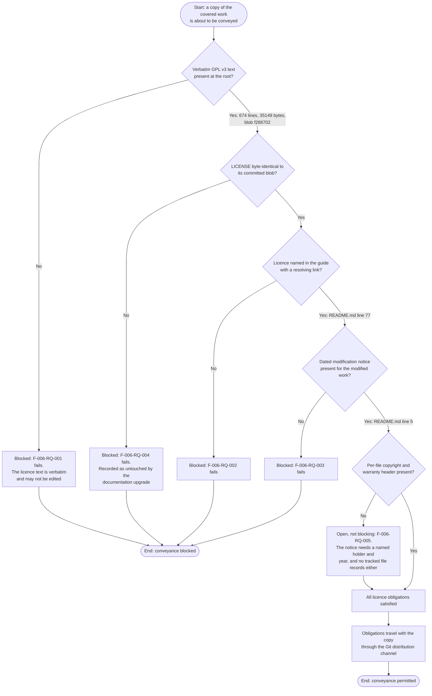
```mermaid
flowchart TD
    CS(["Start: a copy of the covered work<br/>is about to be conveyed"]) --> C1{"Verbatim GPL v3 text<br/>present at the root?"}
    C1 -->|"No"| C1E["Blocked: F-006-RQ-001 fails.<br/>The licence text is verbatim<br/>and may not be edited"]
    C1 -->|"Yes: 674 lines, 35149 bytes,<br/>blob f288702"| C2{"LICENSE byte-identical to<br/>its committed blob?"}
    C2 -->|"No"| C2E["Blocked: F-006-RQ-004 fails.<br/>Recorded as untouched by the<br/>documentation upgrade"]
    C2 -->|"Yes"| C3{"Licence named in the guide<br/>with a resolving link?"}
    C3 -->|"No"| C3E["Blocked: F-006-RQ-002 fails"]
    C3 -->|"Yes: README.md line 77"| C4{"Dated modification notice<br/>present for the modified work?"}
    C4 -->|"No"| C4E["Blocked: F-006-RQ-003 fails"]
    C4 -->|"Yes: README.md line 5"| C5{"Per-file copyright and<br/>warranty header present?"}
    C5 -->|"No"| C5O["Open, not blocking: F-006-RQ-005.<br/>The notice needs a named holder and<br/>year, and no tracked file records either"]
    C5 -->|"Yes"| C6["All licence obligations satisfied"]
    C5O --> C6
    C6 --> C7["Obligations travel with the copy<br/>through the Git distribution channel"]
    C7 --> CZ(["End: conveyance permitted"])
    C1E --> CZ2(["End: conveyance blocked"])
    C2E --> CZ2
    C3E --> CZ2
    C4E --> CZ2
```

| Compliance check | Status at `HEAD` | Requirement |
| --- | --- | --- |
| Verbatim GPL v3 text at the repository root | Satisfied — 674 lines, 35,149 bytes of LF-only ASCII | `F-006-RQ-001` |
| Licence named and linked from the operator guide | Satisfied — `README.md` line 77, link resolves on disk | `F-006-RQ-002` |
| Dated modification notice for the modified covered work | Satisfied — `README.md` line 5 reads "*Modified 2026-09-16.*" | `F-006-RQ-003` |
| `LICENSE` unchanged across base, commit and working tree | Satisfied — blob `f288702`, recorded as untouched | `F-006-RQ-004` |
| Per-file copyright and warranty header in `Hello.java` | **Open** — advised by the licence appendix, deliberately absent; grouped with the hygiene items at 2.0 hours as an owner decision | `F-006-RQ-005` |
| Obligations carried with every conveyed copy | Satisfied by the distribution channel; `LICENSE` and `README.md` are both tracked and travel with any clone | `F-006`, `F-005` |


## 4.3 Technical Implementation

### 4.3.1 State Management

The program itself holds no state. `Hello.java` declares no field, no explicit constructor and creates no instance — its class Javadoc at lines 1–5 records the property directly ("it has no field, creates no instance"), a census of the file returns zero matches for `new `, and `README.md` line 12 states that the program "reads no input, opens no resource and keeps no state." Section 1.3.1.2 gives the boundary consequence: the persistence surface is "None — no state kept between or within runs."

Three things nonetheless transition through states across the workflows of Section 4.1, and all three sit *outside* the program: the operating-system process, the build artifact, and the repository delivery itself.

#### 4.3.1.1 State Transitions — Process Lifecycle

This is the state machine the in-process flow of §4.1.2.6 traverses. Every transition is unconditional except the one that leaves `Starting`, and that branch is a property of the classpath rather than of the program.

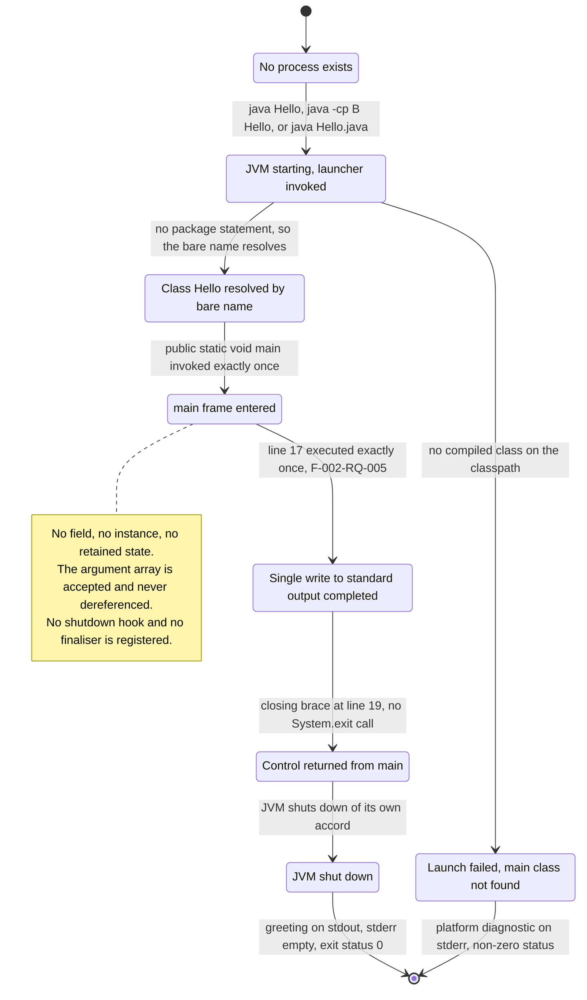
```mermaid
stateDiagram-v2
    state "No process exists" as NotRunning
    state "JVM starting, launcher invoked" as Starting
    state "Class Hello resolved by bare name" as Resolved
    state "main frame entered" as MainEntered
    state "Single write to standard output completed" as Emitted
    state "Control returned from main" as Returned
    state "JVM shut down" as Terminated
    state "Launch failed, main class not found" as LaunchFailed

    [*] --> NotRunning
    NotRunning --> Starting : java Hello, java -cp B Hello, or java Hello.java
    Starting --> Resolved : no package statement, so the bare name resolves
    Starting --> LaunchFailed : no compiled class on the classpath
    Resolved --> MainEntered : public static void main invoked exactly once
    MainEntered --> Emitted : line 17 executed exactly once, F-002-RQ-005
    Emitted --> Returned : closing brace at line 19, no System.exit call
    Returned --> Terminated : JVM shuts down of its own accord
    Terminated --> [*] : greeting on stdout, stderr empty, exit status 0
    LaunchFailed --> [*] : platform diagnostic on stderr, non-zero status
    note right of MainEntered
        No field, no instance, no retained state.
        The argument array is accepted and never dereferenced.
        No shutdown hook and no finaliser is registered.
    end note
```

#### 4.3.1.2 State Transitions — Build Artifact Lifecycle

`Hello.class` is the only artifact any workflow produces, and Section 1.3.1.2 places it explicitly outside the system boundary as "an untracked artifact the guide explicitly instructs must not be committed." Its lifecycle is the reason `W-1` ends in a hygiene decision and `W-2` exists at all.

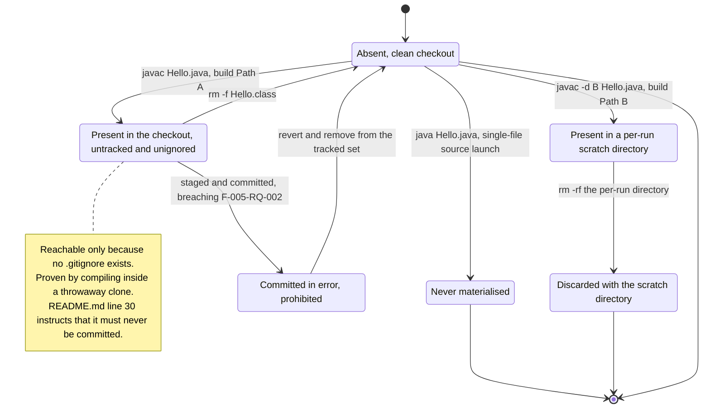
```mermaid
stateDiagram-v2
    state "Absent, clean checkout" as Absent
    state "Present in the checkout, untracked and unignored" as UntrackedInTree
    state "Present in a per-run scratch directory" as OutOfTree
    state "Never materialised" as NeverMade
    state "Committed in error, prohibited" as Committed
    state "Discarded with the scratch directory" as Discarded

    [*] --> Absent
    Absent --> UntrackedInTree : javac Hello.java, build Path A
    Absent --> OutOfTree : javac -d B Hello.java, build Path B
    Absent --> NeverMade : java Hello.java, single-file source launch
    UntrackedInTree --> Absent : rm -f Hello.class
    UntrackedInTree --> Committed : staged and committed, breaching F-005-RQ-002
    Committed --> Absent : revert and remove from the tracked set
    OutOfTree --> Discarded : rm -rf the per-run directory
    NeverMade --> [*]
    Discarded --> [*]
    Absent --> [*]
    note right of UntrackedInTree
        Reachable only because no .gitignore exists.
        Proven by compiling inside a throwaway clone.
        README.md line 30 instructs that it must never be committed.
    end note
```

#### 4.3.1.3 State Transitions — Repository Delivery State

The delivery has its own state machine, and it is the one state machine in this system whose terminal state has **not** been reached. Because `git tag` returns zero tags across 14 commits, each state is identified by a commit SHA rather than a version.

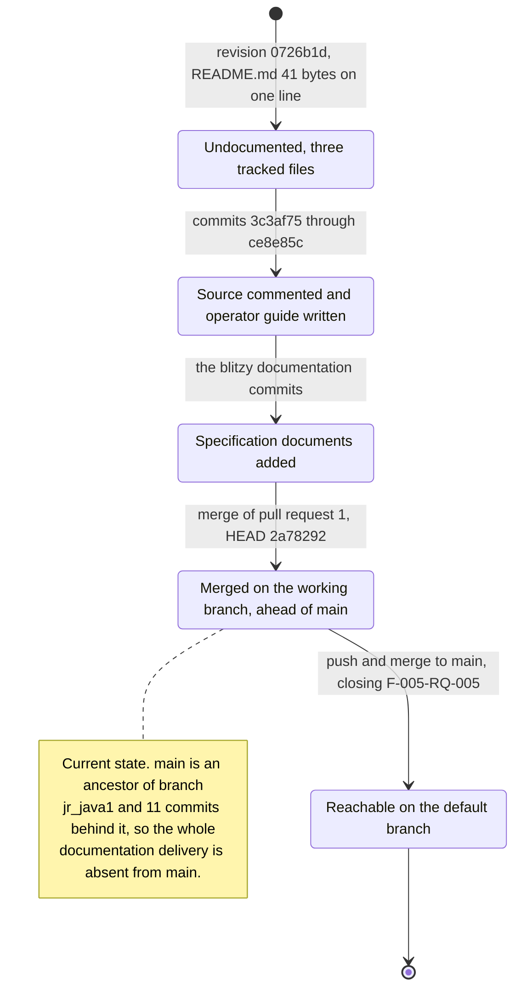
```mermaid
stateDiagram-v2
    state "Undocumented, three tracked files" as Undocumented
    state "Source commented and operator guide written" as Documented
    state "Specification documents added" as Specified
    state "Merged on the working branch, ahead of main" as AheadUnpublished
    state "Reachable on the default branch" as Published

    [*] --> Undocumented : revision 0726b1d, README.md 41 bytes on one line
    Undocumented --> Documented : commits 3c3af75 through ce8e85c
    Documented --> Specified : the blitzy documentation commits
    Specified --> AheadUnpublished : merge of pull request 1, HEAD 2a78292
    AheadUnpublished --> Published : push and merge to main, closing F-005-RQ-005
    Published --> [*]
    note right of AheadUnpublished
        Current state. main is an ancestor of branch
        jr_java1 and 11 commits behind it, so the whole
        documentation delivery is absent from main.
    end note
```

#### 4.3.1.4 Data Persistence Points

There is no database, no file written by the program, and no state that survives a run. Every persistence point in the system belongs to the toolchain or to Git.

| Persistence point | Written by | Durability | Tracked? | Workflow |
| --- | --- | --- | --- | --- |
| `Hello.java` | The maintainer's editor | Permanent; blob `3fd76ce`, 1,073 bytes, CRLF on all 20 lines | Yes | M-1 |
| `Hello.class` beside the source | `javac`, build Path A | Until deleted; untracked and unignored | No — must never be committed | W-1 |
| `Hello.class` in a scratch directory | `javac`, build Path B | Until the per-run directory is removed | No | W-2 |
| `javadoc` HTML output | `javadoc` | Until the scratch directory is removed; "never committed" | No | M-2 |
| Baseline export of the pre-comment source | `git show` into a scratch path named `Hello.java` | Until the scratch directory is removed | No | M-1 |
| Git object store | `git commit`, the hosting platform's merge | Permanent; five blobs, 14 commits, zero tags | Yes | M-3 |
| The verification outcome record | The maintainer, into `Project Guide.md` §3 and §4 | Permanent, and the **only** durable record, since nothing re-runs the checks | Yes | M-2 |

Nothing is persisted at run time: the single `println` writes to a stream, not to storage, and `System.` appears in the source only on line 17 (the call) and line 18 (a comment), with zero references to a file, socket or other stream.

#### 4.3.1.5 Caching Requirements

**No cache exists and none is required.** `Project Guide.md` Appendix B states that there is "no service, database, broker or cache in this project," and §9.1 adds that there is "no package manager step, no virtual environment, no container, no database, no broker and no bound port." Three specific caching layers that a Java project would ordinarily have are absent for structural reasons rather than by configuration choice:

| Cache that would ordinarily exist | Why it is absent here |
| --- | --- |
| Dependency / artifact cache | Nothing is resolved or downloaded at build time; there is no manifest and no lock file of any kind, and the build performs zero network egress |
| Build or incremental-compilation cache | There is no build system to hold one — `javac` is invoked directly on a single compilation unit of 1,073 bytes |
| Application-level cache | There is no state to cache: one compile-time string constant and one runtime-derived line separator are the whole data domain |

The per-run scratch directory is the deliberate *opposite* of a cache. `mktemp -d` generates a fresh directory on every invocation and the workflows remove it afterwards, which is what makes each build destination unique and owner-readable-only; reusing a fixed, predictable location is the condition `README.md` line 30 warns against.

#### 4.3.1.6 Transaction Boundaries

The system has no transactional resource — no database, message broker or distributed participant — so there is no commit protocol, no two-phase coordination and no rollback log. What the workflows do have are per-invocation boundaries, each re-runnable from unchanged inputs:

| Boundary | Unit | Atomicity property observed | Undo |
| --- | --- | --- | --- |
| The single write | `Hello.java` line 17 | Exactly one write per process run; no loop or conditional can repeat or skip it (`F-002-RQ-005`) | None — and none is needed; nothing is persisted |
| A `javac` invocation | One compilation unit | Terminates either at exit 0 with no diagnostics, or with a diagnostic on stderr; recorded outcome at `HEAD` is exit 0 for both build paths | `rm -f Hello.class`, or discard the scratch directory |
| A `java` invocation | One process | Produces the complete payload and exit status 0, or fails to resolve the main class and produces neither | None required; the run leaves nothing behind |
| A source edit | `Hello.java` | Verified as all-or-nothing by an additions-only diff against `0726b1d` — 15 added, 0 removed (`F-008-RQ-003`) | Revert and re-apply in byte mode |
| A commit or merge | The Git object store | The unit of durable change; requirement versions are anchored to commit SHAs because no tags exist | `git revert`; the branch state is itself recoverable |

One boundary gap is worth stating because it is the source of the repository's recurring hygiene hazard: **`W-1` is two invocations, not one.** An operator who compiles and then stops has left `Hello.class` in the checkout with no run having occurred, in the `UntrackedInTree` state of §4.1.3.2 — and with no `.gitignore` to catch it, that is precisely the accidental-commit risk the guide mitigates by documenting build Path B and the `rm -f` cleanup.

### 4.3.2 Error Handling

#### 4.3.2.1 In-Program Error Handling

**`Hello.java` contains no error handling of any kind, and this is a specified property rather than an oversight.** Section 1.3.2.1 lists "Explicit error handling" among the explicitly excluded capabilities, verified as "No `try`/`catch`, no thrown exception, no error branch anywhere in `Hello.java`." Static census of the file confirms zero matches for `try {`, `catch`, `throw`, `new `, `System.exit(` and `System.err`, and the source contains no query of the output stream's error state — so the program performs no error detection whatsoever.

`Project Guide.md` §6 explains why whole categories of failure cannot arise: the program "reads no input, dereferences no argument, opens no resource, binds no port, makes no network call and has no dependency manifest, so there is no injection surface, no supply-chain exposure, no authentication or authorisation surface and no data-at-rest concern." Section 2.2.4 records the resulting invariant: the termination path "is unconditional because there is no error path to take." The program's only outcome is empty stderr and exit status 0.

All error handling in this system therefore lives in the surrounding workflow, and the repository documents it in one authoritative place: the seven-row troubleshooting table at `Project Guide.md` §9.8.

#### 4.3.2.2 Error Catalogue

| # | Error state | Stage | Cause | Recovery | Automated? |
| --- | --- | --- | --- | --- | --- |
| E-1 | `Could not find or load main class Hello` | Launch | No compiled class on the classpath, or the wrong working directory | Compile first, or launch with `java -cp <build dir> Hello`; the bare name is correct because the class is in the default package | No |
| E-2 | `error: class Hello is public, should be declared in a file named Hello.java` | Compile | The source was exported under another name — common when writing a baseline revision to a scratch file | Export into a directory as `Hello.java` | No |
| E-3 | `Hello.class` appears in `git status` | Repository hygiene | There is no ignore rule in this repository | Delete it, or compile to a directory outside the checkout with `-d` | No |
| E-4 | `block census wrong: /**=0 */=0 //=0` | Verification | The census was given the current commit as its baseline, where the comments are already committed | Re-run with the pre-comment revision `0726b1d` as the baseline | No |
| E-5 | Mixed line endings, or `final terminator not CRLF` | Verification | An editor normalised `Hello.java` to LF on save | Restore the file and re-apply the edit in byte mode, re-emitting CRLF on every line including added ones | No |
| E-6 | `javadoc` reports one warning | Verification | Expected: the implicit default constructor can carry no doc comment | No action; documenting it would require declaring a constructor, which is out of scope | Not an error |
| E-7 | The direct source launch fails on an older JDK | Launch | Single-file source launch needs JDK 11 or later | Use the compile-then-run path, which has no such floor | No |

Two of these are not program faults at all but consequences of deliberate repository decisions. `E-3` exists because no `.gitignore` was added — a hygiene item deferred by owner decision. `E-5` exists because `Hello.java` is stored CRLF on all 20 lines with no `.gitattributes` and with `core.autocrlf` and `core.eol` unset, so line-ending preservation depends entirely on editor discipline; Section 3.6.1 records this as a Medium-severity technical risk, "Open — accepted by design."

#### 4.3.2.3 Error-Handling Flowchart

The flowchart routes an observed fault to its recorded recovery by stage. Each lane corresponds to one tool in the workflow.

```mermaid
flowchart TD
    Entry(["Fault observed by the operator<br/>or maintainer"]) --> Stage{"Which stage<br/>reported it?"}

    subgraph CompileStage["Compile stage — javac"]
        CS1{"Diagnostic names<br/>the file?"}
        CS2["E-2: class Hello is public, should be<br/>declared in a file named Hello.java"]
        CS3["Recovery: restore or export the<br/>unit as Hello.java, then recompile"]
        CS4["Any other diagnostic: no instance<br/>recorded at HEAD. -Xlint:all and<br/>-Werror are both clean"]
        CS1 -->|"Yes"| CS2
        CS2 --> CS3
        CS1 -->|"No"| CS4
    end

    subgraph LaunchStage["Launch stage — java"]
        LS1{"Message is<br/>class-not-found?"}
        LS2["E-1: Could not find or load<br/>main class Hello"]
        LS3["Recovery: compile first, or launch<br/>with java -cp build-dir Hello"]
        LS4{"Single-file launch on<br/>a JDK below 11?"}
        LS5["E-7 fallback: use compile-then-run,<br/>which states no version floor"]
        LS6["Contract breach detected by W-4:<br/>re-check the launch form and<br/>the toolchain version"]
        LS1 -->|"Yes"| LS2
        LS2 --> LS3
        LS1 -->|"No"| LS4
        LS4 -->|"Yes"| LS5
        LS4 -->|"No"| LS6
    end

    subgraph HygieneStage["Repository hygiene stage — git"]
        HS1{"Hello.class visible<br/>in git status?"}
        HS2["E-3 recovery: rm -f Hello.class,<br/>or rebuild with -d outside the checkout"]
        HS3{"Line endings reported<br/>mixed for Hello.java?"}
        HS4["E-5 recovery: restore the file and<br/>re-apply the edit in byte mode,<br/>re-emitting CRLF on every line"]
        HS1 -->|"Yes"| HS2
        HS1 -->|"No"| HS3
        HS3 -->|"Yes"| HS4
    end

    subgraph VerifyStage["Verification stage — javadoc and census"]
        VS1{"Census reports<br/>all-zero comment blocks?"}
        VS2["E-4 recovery: re-run with the<br/>pre-comment revision 0726b1d<br/>as the baseline argument"]
        VS3{"javadoc reports exactly<br/>one warning?"}
        VS4["E-6: expected by design. The implicit<br/>default constructor can carry<br/>no doc comment"]
        VS1 -->|"Yes"| VS2
        VS1 -->|"No"| VS3
        VS3 -->|"Yes"| VS4
    end

    Stage -->|"javac"| CS1
    Stage -->|"java"| LS1
    Stage -->|"git"| HS1
    Stage -->|"javadoc or census"| VS1

    CS3 --> Retry["Re-run the deterministic command.<br/>No automated retry exists anywhere<br/>in this repository"]
    LS3 --> Retry
    LS5 --> Retry
    LS6 --> Retry
    HS2 --> Retry
    HS4 --> Retry
    VS2 --> Retry
    CS4 --> Escalate["Escalate to the repository owner.<br/>There is no CI gate and no<br/>notification channel to raise it on"]
    VS4 --> Accept(["Accepted state: no action required,<br/>coverage stands at 2 of 3 members"])
    Retry --> Done(["Resolved: greeting on stdout,<br/>stderr empty, status 0, tree clean"])
    Escalate --> Open(["Open item: recorded in the<br/>project guide, owner decision"])
```

#### 4.3.2.4 Retry Mechanisms

**No automated retry mechanism exists**, and no construct capable of implementing one is present: there is no loop in the source, no scheduler, no job runner and no CI pipeline. Retry in this system means an operator re-running a command by hand, and that is safe because every documented command is deterministic in its inputs and outputs:

| Property that makes manual re-run safe | Evidence |
| --- | --- |
| The payload is a compile-time constant; nothing at run time can alter it | Section 2.2.3; `Hello.java` line 17 |
| Output is identical across both launch paths and under any argument list, including hostile arguments | `F-002-RQ-004`; `Project Guide.md` §4 |
| Re-running `javac` re-derives the same class file from the same 1,073-byte unit, with zero dependency resolution | Section 3.6.2 |
| `mktemp -d` yields a **new** directory on each run, so a repeated `W-2` never collides with a previous attempt | `README.md` line 30 |
| Nothing is persisted by the program, so no partial state can be left behind to poison a second attempt | Section 1.3.1.2 |

The one re-run that must change an argument rather than simply repeat is `E-4`: re-running the comment census unchanged reproduces the same vacuous failure, because the defect is in the invocation, not the tree. The correct retry supplies revision `0726b1d` as the baseline.

#### 4.3.2.5 Fallback Processes

Four fallbacks are documented, and each is a substitution of one documented path for another rather than a degraded mode:

| Trigger | Fallback | Requirement relationship |
| --- | --- | --- |
| Single-file source launch unavailable — JDK earlier than 11 | Compile-then-run (`W-1` or `W-2`), which states no version floor and was exercised at release targets 11, 17 and 21 | `F-004-RQ-004` falls back to `F-004-RQ-003` |
| The working tree must stay clean, or a predictable output path is unacceptable | Build Path B — compile with `-d` into a freshly generated `mktemp -d` directory and launch with `-cp` | `F-004-RQ-006` substitutes for `F-004-RQ-003` |
| Path A already ran and left an artifact | `rm -f Hello.class`, then confirm with `git status --short` | Restores `F-005-RQ-002` |
| The comment census reports all-zero blocks | Re-invoke with the pre-comment revision as the baseline | Restores the intent of `F-008-RQ-003` |

Two fallbacks that a system of this kind might be expected to have do **not** exist, and their absence is recorded rather than inferred: there is no fallback toolchain, because a JDK is the sole prerequisite and is not vendored in the repository; and there is no fallback verification gate, because `Project Guide.md` §1.4 states that "Nothing re-runs the documentation checks on future changes."

#### 4.3.2.6 Error Notification Flows

**There is no notification channel.** Section 1.3.2.1 records the absence of logging, metrics, tracing and monitoring — "No logging framework and no diagnostic output — stderr is deliberately empty" — and Section 1.3.2.3 excludes external monitoring and log aggregation. With no CI pipeline there is also no build notification, no failing-check email and no status badge.

```mermaid
flowchart LR
    subgraph ProgramLane["The program — inside the boundary"]
        PG1["Hello.java writes one line<br/>to standard output"]
        PG2["stderr deliberately left empty,<br/>F-003-RQ-003"]
        PG3["Exit status 0 always,<br/>F-003-RQ-002"]
    end

    subgraph ToolLane2["The toolchain — outside the boundary"]
        TL1["javac writes its own diagnostics<br/>to stderr; zero at HEAD"]
        TL2["java writes launch failures<br/>to stderr"]
        TL3["javadoc writes one accepted<br/>warning to stderr"]
    end

    subgraph HumanLane["Human channels — the only ones that exist"]
        HL1["Operator reads the terminal"]
        HL2["Troubleshooting table,<br/>Project Guide 9.8, seven rows"]
        HL3["Verification outcome recorded in<br/>Project Guide 3 and 4 — the only<br/>durable record of any check"]
        HL4["Pull request and owner decision<br/>for items that cannot be fixed locally"]
    end

    subgraph AbsentLane["Channels verified absent"]
        AB1["No logging framework,<br/>no metrics, no tracing"]
        AB2["No CI pipeline, so no build<br/>notification and no gate"]
        AB3["No alerting, paging<br/>or log aggregation"]
    end

    PG1 --> HL1
    PG2 --> HL1
    PG3 --> HL1
    TL1 --> HL1
    TL2 --> HL1
    TL3 --> HL1
    HL1 --> HL2
    HL2 --> HL3
    HL3 --> HL4
    AB1 --- AB2
    AB2 --- AB3
```

The practical consequence is stated in Section 3.6.3: the 49 recorded checks were run manually, are not automatically repeatable, and "their only durable record is `Project Guide.md` §3 and §4." Any change to `Hello.java` requires a manual `javac -Xlint:all -Werror` re-run, because nothing will do it on the maintainer's behalf.

#### 4.3.2.7 Recovery Procedures

Recovery in this system is command-level and idempotent. The procedures below are the complete set the repository documents.

| Procedure | Command sequence | Restores | Workflow |
| --- | --- | --- | --- |
| Remove an in-tree build artifact | `rm -f Hello.class`, then `git status --short` expecting no output | A clean working tree; `F-005-RQ-002` | W-1 |
| Discard per-run scratch space | `rm -rf` the build, baseline and suite directories, then `git status --short` | Zero footprint outside and inside the checkout | W-2, M-1, M-2 |
| Re-establish a launchable class | Recompile, or relaunch with `java -cp <build dir> Hello` | `F-001-RQ-002`; resolves `E-1` | W-1, W-2 |
| Restore the compilable unit | Export or rename the source to `Hello.java` so the file name matches the public class | `F-001-RQ-004`; resolves `E-2` | M-1 |
| Restore stored byte format | Restore the file and re-apply the edit in byte mode, re-emitting CRLF on every line, then re-run the line-ending census | `F-008-RQ-005`, `F-005-RQ-004`; resolves `E-5` | M-1 |
| Re-establish a valid census | Re-invoke the suite with revision `0726b1d` as the baseline argument | The additions-only intent of `F-008-RQ-003`; resolves `E-4` | M-1, M-2 |
| Prove behaviour was preserved | Build both revisions into separate directories, capture stdout and stderr from each, and compare with `cmp` | `F-008-RQ-003`; the recorded result is byte-identical behaviour | M-1 |
| Make the delivery reachable | Push the branch and merge, until `git rev-list --left-right --count main...HEAD` reports `0 0` | `F-005-RQ-005`; the only open recovery in the system | M-3 |

No recovery procedure in this table requires a backup, a snapshot or a restore point, because the program persists nothing and the source is recoverable from Git history — which is also what supplies the `0726b1d` baseline that two of the procedures depend on.


## 4.4 Diagram Inventory, Coverage and Traceability

### 4.4.1 Diagram Inventory

Eighteen diagrams appear in this section. The table records each one, its Mermaid type, and the workflow or state machine it renders.

| # | Diagram | Type | Location | Subject |
| --- | --- | --- | --- | --- |
| 1 | High-level system workflow | `flowchart TB` with five swim lanes | §4.1.2.1 | End-to-end path from clone to verified output, with the system boundary as its own lane |
| 2 | W-1 compile in place, then run | `flowchart TD` | §4.1.2.2 | 12 steps, 4 decisions, 3 error states, artifact hygiene decision |
| 3 | W-2 compile outside the checkout | `flowchart TD` | §4.1.2.3 | Build-destination generation and the clean-tree guarantee |
| 4 | W-3 single-file source launch | `flowchart TD` | §4.1.2.4 | The JDK 11 version floor and its fallback |
| 5 | W-4 output-contract verification | `flowchart TD` | §4.1.2.5 | Four sequential contract assertions with one breach path each |
| 6 | In-process execution flow | `flowchart LR` | §4.1.2.6 | The only flow that executes repository code; zero decisions |
| 7 | M-1 comment-only edit with parity verification | `flowchart TD` | §4.1.2.7 | The census-baseline decision and the additions-only proof |
| 8 | Data flow between systems | `flowchart LR` with six lanes | §4.1.3.1 | Source, artifact, output and documentation data movement |
| 9 | Verification batch sequence | `flowchart TD` | §4.1.3.4 | The seven-pass manual check sequence, 49 assertions |
| 10 | W-2 integration sequence | `sequenceDiagram` | §4.1.3.5 | Operator, shell, `mktemp`, `javac`, filesystem, JVM, OS contract |
| 11 | Git distribution sequence | `sequenceDiagram` | §4.1.3.5 | Commit, push, pull-request merge, clone, and the open `main` gap |
| 12 | Guide-to-toolchain seam sequence | `sequenceDiagram` | §4.1.3.5 | Validation of every documented literal against real output |
| 13 | Licence compliance gate | `flowchart TD` | §4.2.4.4 | Five GPL v3 obligations as blocking and non-blocking checks |
| 14 | Process lifecycle state machine | `stateDiagram-v2` | §4.3.1.1 | Eight states from no process to exit status 0 |
| 15 | Build artifact lifecycle state machine | `stateDiagram-v2` | §4.3.1.2 | Six states of `Hello.class`, including the prohibited committed state |
| 16 | Repository delivery state machine | `stateDiagram-v2` | §4.3.1.3 | Five states from `0726b1d` to publication; terminal state not yet reached |
| 17 | Error-handling flowchart | `flowchart TD` with four stage lanes | §4.3.2.3 | Routes each of `E-1` … `E-7` to its recorded recovery |
| 18 | Error notification flow | `flowchart LR` with four lanes | §4.3.2.6 | The human-only channels, and the channels verified absent |

**Coverage against the mandated diagram set.**

| Mandated diagram | Satisfied by | Note |
| --- | --- | --- |
| High-level system workflow | Diagram 1 | Swim lanes separate operator, Git, toolchain, system boundary and OS contract |
| Detailed process flows for each core feature | Diagrams 2–7 | `F-001` … `F-003` are rendered together in diagram 6 because they are three steps of one unbranched path, not three independent processes; `F-004` … `F-009` are rendered through the workflows that exercise them |
| Error handling flowcharts | Diagrams 17 and 18, supported by the breach paths inside diagrams 2–5 | Every error state in diagram 17 traces to a row of `Project Guide.md` §9.8 |
| Integration sequence diagrams | Diagrams 10–12 | One per external seam plus one for the internal guide-to-toolchain seam |
| State transition diagrams | Diagrams 14–16 | The program holds no state, so all three model entities outside it |

### 4.4.2 Workflow Traceability

Each workflow is traced to the features it exercises, the requirements its steps verify, the must-have capabilities it demonstrates, and the diagrams that render it. Requirement identifiers are those of Section 2.2; capability identifiers are those of Section 1.3.1.1.

| Workflow | Features exercised | Requirements verified | Capabilities demonstrated | Diagrams |
| --- | --- | --- | --- | --- |
| W-1 | F-007 → F-004 → F-001 → F-002 → F-003, with F-005 governing the artifact | `F-004-RQ-003`, `F-001-RQ-002`, `F-002-RQ-001`, `F-003-RQ-002`, `F-005-RQ-002` | C-1, C-2, C-3, C-4 | 1, 2, 6 |
| W-2 | F-007 → F-004 → F-001 → F-002 → F-003 | `F-004-RQ-006`, `F-004-RQ-005`, `F-001-RQ-002`, `F-002-RQ-001`, `F-003-RQ-002` | C-1, C-2, C-3, C-4 | 1, 3, 6, 10 |
| W-3 | F-007 → F-004 → F-001 → F-002 → F-003 | `F-004-RQ-004`, `F-002-RQ-004`, `F-003-RQ-002` | C-2, C-3, C-4, C-6 | 1, 4, 6 |
| W-4 | F-002 and F-003 against the oracle published by F-007 | `F-002-RQ-001`, `F-002-RQ-002`, `F-002-RQ-003`, `F-003-RQ-002`, `F-003-RQ-003` | C-3, C-4, C-5, C-6, C-7 | 5, 12 |
| In-process flow | F-001, F-002, F-003 | `F-001-RQ-001`, `F-001-RQ-003`, `F-001-RQ-005`, `F-002-RQ-005`, `F-003-RQ-001`, `F-003-RQ-004` | C-2, C-3, C-4, C-5 | 6, 14 |
| M-1 | F-008, with F-001 … F-003 as the behaviour being preserved | `F-008-RQ-001`, `F-008-RQ-002`, `F-008-RQ-003`, `F-008-RQ-005`, `F-005-RQ-004` | C-9 | 7 |
| M-2 | F-004, F-007, F-008, F-009 | `F-004-RQ-005`, `F-008-RQ-004`, `F-007-RQ-001`, `F-007-RQ-003`, `F-007-RQ-005`, `F-009-RQ-002` | C-1, C-7, C-9 | 9, 12 |
| M-3 | F-005, F-006, F-009 | `F-005-RQ-001`, `F-005-RQ-003`, `F-005-RQ-005`, `F-006-RQ-001` … `F-006-RQ-004` | C-8 | 11, 13, 16 |

Two requirements are not reachable by any workflow in this section, and the reason is recorded rather than inferred. `F-006-RQ-005`, the per-file copyright header, is an artifact property with no procedural step — it is satisfied by editing `Hello.java`, not by running anything, and it remains an open owner decision. `F-007-RQ-006`, the layout claim matching the tracked tree, is likewise a text correction: `README.md` line 67 states "three tracked files at the root, and no subdirectories" while the tree holds five tracked files and `blitzy/documentation/`, and Section 1.3.2.2 records that no deferred item covers the correction.

### 4.4.3 Process Constructs Not Applicable to This Repository

The following process and flow constructs are standard in a technical specification of this kind and are **absent here**. Each absence was confirmed by direct inspection rather than assumed, and each is listed so that its absence is not mistaken for an omission from this section.

| Construct | Verification of absence |
| --- | --- |
| Business transaction or approval flow | No customer, order, ledger or approval concept; no persistence and no state (Section 1.3.1.2) |
| Authorization or role-based flow | The system "defines no roles, accounts, or permissions of its own"; no authentication or authorization surface exists |
| API request/response flow | No HTTP, RPC or file-based interface; no port bound, no listener started, no network call made |
| Event-driven or message flow | No broker, queue, topic, bus, listener or callback; `Project Guide.md` Appendix B states there is "no service, database, broker or cache in this project" |
| Scheduled or batch job flow | No scheduler, cron entry or job runner; the nearest analogue is the manually invoked verification batch of §4.1.3.4 |
| CI/CD pipeline flow | Existence tests absent for `.github/`, `.gitlab-ci.yml`, `.circleci/`, `Jenkinsfile`, `.travis.yml`, `azure-pipelines.yml`, `bitbucket-pipelines.yml`, `.drone.yml`; no such file has ever been tracked in 14 commits |
| Deployment or rollback flow | No packaging, no published coordinates, no deployment descriptor; "Deploying it as a service" is recorded as unsupported |
| Timeout, retry-with-backoff or circuit-breaker policy | No loop, scheduler or retry construct exists; no timing or SLA figure is recorded anywhere |
| Saga or compensating-transaction flow | No transactional resource and no distributed participant |
| Cache population or invalidation flow | No cache at any layer; nothing is resolved at build time and nothing is stateful at run time |
| Database transaction or migration flow | No database and no schema; the whole data domain is one string constant plus the host line separator |
| Session or conversation state flow | Single process, single statement, no state kept between or within runs |
| Concurrency or synchronisation flow | Single-threaded `main`; `Thread` and executor constructs return zero matches |
| Monitoring, alerting or on-call flow | No logging framework, metrics, tracing or log aggregation; stderr is deliberately empty |
| Internationalisation flow | Hard-coded ASCII literal; no resource bundle or locale logic; zero bytes at or above `0x80` in any text file |
| Input validation flow | No input path exists, and validating `args` would itself breach `F-001-RQ-003` |
| Regulatory or data-subject flow | No regulatory regime is named anywhere; no personal data, no input surface, no persistence surface |

### 4.4.4 Open Items Affecting the Process Model

Three recorded open items bear directly on the flows in this section. They are reproduced here because each one changes a workflow's terminal state or a decision outcome, not merely a document.

| Open item | Effect on the process model | Requirement | Recorded disposition |
| --- | --- | --- | --- |
| The JDK 11 floor for the single-file source launch has never been exercised on a JDK 11 runtime | Decision `D-3` in `W-3` is documented but unverified at its boundary; corroboration extends only to release targets 11, 17 and 21 on a JDK 25 toolchain | `F-004-RQ-004` | Medium, 1.0 hour — confirm on a JDK 11 install or soften the claim |
| `main` is 11 commits behind the working branch | `M-3` has not reached its terminal state, so no downstream clone of the default branch receives the documentation the other workflows depend on | `F-005-RQ-005` | High, 0.5 hour — push the branch and merge |
| Nothing re-runs any of the checks | `M-2` is a manual process with no gate; its outcome survives only as prose in `Project Guide.md` §3 and §4, and any edit to `Hello.java` requires a manual `javac -Xlint:all -Werror` re-run | Section 3.6.3; `Project Guide.md` §1.4 | Deferred, owner decision |

One further evidentiary limit applies to this section itself. Following the convention declared in Section 2.2.1, the runtime facts in these flows — exit status 0, the empty error stream, the 17-byte payload on an LF host, and the single `javadoc` warning — are *recorded* evidence, executed first-hand on a Linux host with OpenJDK 25.0.3 and reported in `blitzy/documentation/Project Guide.md` §3, §4, §9.5 and §9.7. They were not re-executed while writing this section, because no JDK is present in the specification-authoring environment. Everything asserted about the **structure** of the flows — the five executable lines, the zero decision points, the zero error branches, the absent constructs, the stored byte format and the branch divergence — was verified statically against the tree at `HEAD` (`2a78292`) while writing this section.


## 4.5 References

### 4.5.1 Repository Files Examined

- `Hello.java` — Read in full (21 lines). Established the entire in-process flow: the class declaration at line 6, the `main` signature at line 15, the single `System.out.println("Hello from Java!")` at line 17, and the normal return at line 19. Its comments at lines 1–5, 7–14, 16 and 18 supplied the documented intent for the default package, the never-read `args` parameter, the single output sink and the `System.exit`-free termination. Static censuses of this file established the zero-decision, zero-error-branch property that shapes every flow in §4.1 and §4.2.1.
- `README.md` — Read in full (78 lines). Established the operator-facing contracts that the workflows implement: the JDK-only requirement and the JDK 11 floor for the single-file launch (lines 18, 20), build Path A and the `mktemp -d` Path B with its security rationale (lines 27–30), the three launch forms (lines 37, 43), the argument contract table (lines 48–51), the published output oracle used by `W-4` (lines 57–63), the project layout claim (line 67), and the licence statement and link (line 77).
- `LICENSE` — Identified as the verbatim GNU General Public License, Version 3, 29 June 2007 at the repository root. Established the compliance instrument that the `M-3` gate in §4.2.4.4 checks.
- `blitzy/documentation/Project Guide.md` — Read §4 (runtime validation), §5.1–§5.2 (compliance matrix and divergences), §6 (risk assessment) and §9.1–§9.8 (the development guide) in full, plus Appendices A–G. This is the authoritative source for: the three verified launch forms and their recorded outcomes (§9.5); the two build paths and their cleanup commands (§9.4); the verification procedures, census invocations and baseline revision `0726b1d` (§9.6); the example usage showing `exit=0` (§9.7); the **seven-row troubleshooting table** that supplies the entire error catalogue `E-1` … `E-7` (§9.8); the "no port, no listener, no network call, no service, database, broker or cache" position (Appendix B); the toolchain versions (Appendix D); the empty environment and secret surface (Appendix E); the per-tool roles and the absence of any linter, formatter, build tool or test framework (Appendix F); and the glossary definitions of single-file source launch, platform line separator, comment-only edit and implicit default constructor (Appendix G).
- `blitzy/documentation/Technical Specifications.md` — Inspected for its heading structure only, which confirmed that the repository's own prior-generation specification also decomposes Section 4 into System Workflows, Flowchart Requirements and Technical Implementation. No factual claim in this section rests on it.

### 4.5.2 Repository Folders Examined

- `` (repository root) — Established the tracked footprint: `Hello.java`, `LICENSE`, `README.md` and the `blitzy` subtree. Existence tests here established the absence of every build, CI, container and configuration descriptor that a process flow might otherwise have been built around.
- `blitzy/documentation/` — Contained the two Markdown documents that constitute feature `F-009`, and is the one subdirectory in the tracked tree.

### 4.5.3 Direct Repository Inspection

- Recursive file search across the working tree (excluding `.git`) — Established that `Hello.java` is the **only** source file of any kind: no `.xml`, `.yml`, `.yaml`, `.json`, `.properties`, `.sh`, `.toml`, `.class` or `.jar` file exists anywhere. This is the basis for every "no such flow exists" statement in §4.1.3 and §4.4.3.
- Existence tests at the repository root — Confirmed the absence of `pom.xml`, `build.gradle`, `build.gradle.kts`, `settings.gradle`, `build.xml`, `ivy.xml`, `Makefile`, `Dockerfile`, `module-info.java`, `.gitignore`, `.java-version`, `.sdkmanrc`, `.editorconfig`, `.github/`, `.gitlab-ci.yml`, `.circleci/`, `.travis.yml`, `Jenkinsfile` and `azure-pipelines.yml`.
- Fixed-string and word censuses of `Hello.java` — Established zero occurrences of `if (`, `for (`, `while (`, `switch (`, `try {`, `catch`, `throw`, `new `, `System.exit(`, `System.err`, `System.in`, `Thread`, `Scanner` and `print(`, with exactly one `println(`; and established that `args` occurs only on lines 11 and 15 and `System.` only on lines 17 and 18.
- Comment-stripped line count — Established the exactly five executable lines quoted in §4.1 and §4.2.1.
- Byte-format censuses — Established `Hello.java` at `lf=20 cr=20 crlf=20` with zero non-ASCII bytes and zero tabs, and `README.md` at `lf=77 cr=0`; these underpin the `E-5` error state and the `F-008-RQ-005` validation rule.
- `git ls-files`, `git log --oneline`, `git rev-list --count HEAD`, `git tag`, `git rev-list --left-right --count main...HEAD` — Established the five-file tracked set, the 14-commit history, the commit identifiers used in the delivery state machine of §4.3.1.3, the zero tags, and the `0	11` divergence that leaves `M-3` incomplete.
- `which java javac javadoc` and `java -version` — Established that no JDK is present in the specification-authoring environment, which is why the runtime facts in this section are cited as *recorded* evidence rather than re-executed. No web source was consulted for this section.

### 4.5.4 Technical Specification Sections Cross-Referenced

- **Section 1.2 System Overview** — Supplied the enumeration of the four essential interfaces that §4.1.3 decomposes.
- **Section 1.3 Scope** — Supplied the must-have capabilities `C-1` … `C-9`, the pre-existing operator workflow identifiers `W-1` … `W-4` that this section preserves and expands, the system boundary and its dimension table used for the swim lanes, the out-of-scope register underpinning §4.4.3, and the unsupported use cases that terminate several error paths.
- **Section 2.1 Feature Catalog** — Supplied the feature identifiers `F-001` … `F-009` and their evidence anchors.
- **Section 2.2 Functional Requirements** — Supplied all 45 `F-XXX-RQ-YYY` identifiers annotated onto the flow steps, the per-feature business-rule, data-validation, security and compliance rows reproduced in §4.2.4, and the *static / recorded / open* evidence convention adopted in §4.4.4.
- **Section 2.3 Feature Relationships** — Supplied the strictly linear `F-004 → F-001 → F-002 → F-003` chain, the four integration points and two internal seams rendered in §4.1.3, the shared-component inventory, and the `W`-to-requirement mapping; §2.3.5 explicitly delegates the detailed process decomposition to this section.
- **Section 2.4 Implementation Considerations** and **Section 2.6 Assumptions, Constraints and Requirement Versioning** — Supplied the change-impact basis for `M-1`, the constraint that nothing re-runs the checks, and the convention that requirement versions are anchored to commit SHAs because no tags exist.
- **Section 3.6 Development & Deployment** — Supplied the two build paths, the three launch forms, the quality gates recorded at 49 of 49 checks, the verified absence of any build system, container, CI/CD pipeline and deployment mechanism, the unset `core.autocrlf`/`core.eol` finding behind `E-5`, and the outstanding delivery state driving `M-3`.


# 5. System Architecture

## 5.1 High-Level Architecture

The architecture documented in this section is the entire system. The tracked inventory is five files totalling 925,008 bytes — `Hello.java`, `README.md`, `LICENSE`, `blitzy/documentation/Project Guide.md` and `blitzy/documentation/Technical Specifications.md` — and two directories, `blitzy/` and `blitzy/documentation/`. There is no `src/` tree, no build descriptor, no configuration file, no test directory, no CI descriptor and no infrastructure definition; a direct probe of the worktree confirms the absence of `pom.xml`, `build.gradle`, `build.gradle.kts`, `settings.gradle`, `.java-version`, `.sdkmanrc`, `module-info.java`, `.gitignore`, `Makefile`, `Dockerfile` and `.editorconfig`.

Where a conventional architectural element does not exist, this section records it as verified absent rather than approximating it. No service level, latency target, throughput figure, availability objective or capacity plan appears anywhere in the repository, and none is asserted here.

### 5.1.1 System Overview

#### 5.1.1.1 Architecture Style and Rationale

The runtime architecture is a **single-process, single-module, invoke-and-exit console application**. One compilation unit declares one public class in the default package; that class declares one static method; that method performs one write to standard output and returns. Stripping comments from `Hello.java` leaves exactly five lines of executable code — the class declaration, the `main` signature, the single `System.out.println` call and two closing braces — and a keyword census over those five lines returns zero occurrences of `if`, `for`, `while`, `switch`, `try`, `catch`, `throw`, `new`, `import`, `package`, `synchronized`, `System.exit` and `System.err`. There is no tier decomposition, no service boundary, no inter-process communication, no concurrency and no long-running runtime.

The repository nowhere states this style as a design choice, so the rationale below is reconstructed from the constraints the artifacts actually impose:

- **The unit of compilation is the unit of deployment.** With one class in the default package and no `module-info.java`, the smallest shippable thing is the source file itself. Introducing layers would require introducing a build model, and there is none to extend.
- **There is no dependency graph to arrange.** `Hello.java` declares zero `import` statements, so the only library surface is the implicitly available `java.lang`. Styles whose purpose is to govern dependency direction — layered, hexagonal, ports-and-adapters — would have nothing to arrange.
- **There is no state and no I/O beyond one write.** The class Javadoc at `Hello.java` lines 1–5 records that it "has no field, creates no instance"; `README.md` line 12 states the program "reads no input, opens no resource and keeps no state." Styles that exist to coordinate state or distribute work have no subject matter here.
- **Invocation is the whole protocol.** The `args` array is accepted only to satisfy the signature the JVM requires and is never dereferenced (`Hello.java` lines 11–13), and termination is by normal return with no `System.exit` call (`Hello.java` line 18), which makes the operating-system process boundary the only interface contract worth specifying.

A second architecture coexists with the runtime one and is easy to miss because it carries no code: a **source-only, documentation-dominant delivery and governance architecture**. Of the 925,008 tracked bytes, 884,733 are the two Markdown documents under `blitzy/documentation/` and 1,073 are the program; distribution is by Git clone rather than by published artifact, and redistribution is governed by the verbatim GPL v3 text in `LICENSE`. The two architectures are coupled in one direction only: nothing in `Hello.java` reads `README.md`, `LICENSE` or anything under `blitzy/documentation/`, so a documentation change cannot alter runtime behaviour, while a source change invalidates documentation claims.

#### 5.1.1.2 Architectural Principles and Patterns

| Principle | How the repository realises it | Evidence |
| --- | --- | --- |
| Statelessness by construction | No field, no explicit constructor, no instance ever created; `main` is `static`, so nothing is carried between or within runs | `Hello.java` lines 1–6, 15; `README.md` line 12 |
| Single responsibility taken to its limit | One class, one method, one statement, one output sink | `Hello.java` line 17 and its comment at line 16 |
| One output sink, explicitly fixed | The line comment at line 16 makes single-sink behaviour a stated design property: "no other sink is written" | `Hello.java` line 16 |
| Termination by normal return | No `System.exit` anywhere; `README.md` line 63 calls this "a deliberate property of the program rather than an omission" | `Hello.java` line 18; `README.md` line 63 |
| Zero-dependency buildability | No manifest, no lock file, nothing resolved or downloaded at build time; only the implicitly imported `java.lang` is used | `README.md` line 18; `Project Guide.md` §9.3 |
| Configuration-free operation | No environment variable and no secret is read by any tracked file; `JAVA_HOME` is not required | `Project Guide.md` §9.2, Appendix E |
| Determinism as the contract | Output is a compile-time constant, identical across both launch paths and under any argument list | `README.md` lines 46, 57–63 |
| Portability over reproducibility | Toolchain versions are recorded, never enforced; no `--release` or `--source` setting exists anywhere | `README.md` line 18; `Project Guide.md` Appendix D |
| Documentation as the deliverable | The executable behaviour was deliberately left untouched while in-source comments and an eight-section operator guide were added | `README.md` lines 7–8; `Project Guide.md` §5.1 rows 1–3 |
| Command discipline in place of tooling | With no `.gitignore` and no `.gitattributes`, working-tree cleanliness and byte-format stability are maintained by documented commands rather than enforced by configuration | `README.md` line 30; `Project Guide.md` §5.2 item 5 |

Two patterns conventionally expected of a Java system are absent for structural rather than stylistic reasons and are recorded as such: there is no dependency-injection or inversion-of-control arrangement, because no collaborator object exists to inject; and there is no layering or facade, because there is exactly one path through the system.

#### 5.1.1.3 System Boundaries and Major Interfaces

The boundary encloses the five tracked files and nothing else. Everything the system touches at build or run time — the JDK, the operating system, Git and its hosting platform, and every artifact a build produces — sits outside it and is neither vendored nor versioned in the repository. Four interface seams cross that boundary, and they are the complete set.

| Interface | Contract at the seam | Direction |
| --- | --- | --- |
| **I-1 Compilation interface** | One compilation unit whose file name must match its public class; compiles with no `--release`/`--source` setting and no dependency to resolve; exits 0 with no diagnostics, including under `-Xlint:all -Werror` | Inbound to `javac` |
| **I-2 JVM entry-point interface** | `public static void main(String[] args)` on a default-package class, resolved by the bare name `Hello`; the launcher invokes it exactly once; the argument array is accepted and never read | Inbound from the `java` launcher |
| **I-3 Process and standard-stream interface** | Standard output receives the literal `Hello from Java!` plus one platform line separator; standard error stays empty; exit status is 0 by normal return | Outbound to the operating system |
| **I-4 Distribution and governance interface** | Source-only conveyance by Git clone, branch and merge over HTTPS from `github.com/rjhonsi/BlitzyRepo2_Java`, under the GPL v3 terms carried verbatim in `LICENSE` with a dated modification notice at `README.md` line 5 | Bidirectional with the hosting platform |

```mermaid
flowchart TB
    subgraph InsideBoundary["Inside the boundary — 5 tracked files, 925,008 bytes"]
        Unit["Hello.java<br/>class Hello + main<br/>20 CRLF lines / 1,073 B"]
        Readme["README.md<br/>operator guide and output oracle<br/>77 LF lines / 4,053 B"]
        Licence["LICENSE<br/>GPL v3 verbatim<br/>674 lines / 35,149 B"]
        Records["blitzy/documentation/<br/>Project Guide + specification archive<br/>884,733 B"]
    end

    subgraph SeamLayer["The four interface seams"]
        S1["I-1 Compilation<br/>file name = public class name"]
        S2["I-2 JVM entry point<br/>public static void main(String[])"]
        S3["I-3 Process and streams<br/>stdout / stderr / exit status"]
        S4["I-4 Distribution and governance<br/>Git over HTTPS + GPL v3"]
    end

    subgraph OutsideBoundary["Outside the boundary — never vendored, never pinned here"]
        Tool["JDK toolchain<br/>javac / java / javadoc<br/>OpenJDK 25.0.3 recorded"]
        OSProc["Operating system and terminal<br/>fd 1, exit status"]
        HostPlat["Git 2.51.0 and hosting platform<br/>14 commits, 0 tags, 6 refs"]
        Ephemeral["Ephemeral artifacts<br/>Hello.class, javadoc HTML,<br/>mktemp -d scratch directories"]
    end

    Unit --> S1
    S1 --> Tool
    Unit --> S2
    S2 --> Tool
    S2 --> S3
    S3 --> OSProc
    Unit --> S4
    Readme --> S4
    Licence --> S4
    Records --> S4
    S4 --> HostPlat
    Tool --> Ephemeral
    Readme -.->|"instructs the operator"| Tool
    Licence -.->|"governs redistribution"| Unit
    Records -.->|"records versions and outcomes"| Tool
```

Four categories of boundary are absent and verified so: there is no network boundary (`Project Guide.md` Appendix B: the program "binds no port, starts no listener and makes no network call"), no persistence boundary, no trust or authentication boundary, and no user-interface boundary — `Project Guide.md` §4 records the implementation as "a console application with no user interface, no hosted page, no bound port and no external integration."

### 5.1.2 Core Components

Ten components make up the system and its immediate surroundings. Components C-1 through C-7 are inside the boundary; C-8 through C-10 are outside it but are documented here because every workflow depends on them. Component identifiers are local to this section.

| Component | Primary Responsibility | Key Dependencies |
| --- | --- | --- |
| **C-1** `Hello` compilation unit (`Hello.java`) | Holds the entire program: one public class in the default package, no fields, no explicit constructor | `javac` for compilation; nothing else |
| **C-2** `Hello.main` entry point (`Hello.java` line 15) | The only executable path: invoked once by the launcher, performs the single write, returns | C-1; the `java` launcher (C-8) |
| **C-3** Standard-output write path (`Hello.java` line 17) | Emits the fixed greeting through `System.out` and appends the host's line separator | `java.lang.System`, `PrintStream`, `String` from `java.base` |
| **C-4** Operator guide (`README.md`) | Publishes requirements, both build paths, all three launch forms, the output oracle, the layout and the licence reference | C-1 for the facts it states; C-5 for the licence reference |
| **C-5** Licence instrument (`LICENSE`) | Establishes redistribution terms as the verbatim GPL v3 text of 29 June 2007 | None — no code or tool reads it |
| **C-6** Project-status and development record (`blitzy/documentation/Project Guide.md`) | Records completion status, the 49 verification checks, the compliance matrix, the risk register and the development guide | C-1, C-4 and the toolchain outcomes it reports |
| **C-7** Specification archive (`blitzy/documentation/Technical Specifications.md`) | Retains the prior generation of this specification, written against the pre-comment baseline | The repository state at revision `0726b1d` |
| **C-8** JDK toolchain (external) | `javac` compiles; `java` launches a class or a source file; `javadoc` measures comment coverage | Host installation on `PATH`; not vendored |
| **C-9** Git repository and hosting remote (external) | Durable object store and the sole distribution channel; supplies the pre-comment baseline revision | `git`; the HTTPS remote |
| **C-10** Per-run scratch directory (external, ephemeral) | Receives class output and `javadoc` HTML outside the checkout, keeping the working tree clean | `mktemp -d`; removed after use |

The integration points and the considerations that govern each component are carried in the two tables below, keyed by the same identifiers.

| Component | Integration Points |
| --- | --- |
| C-1 | I-1 (to `javac`), I-4 (conveyed by Git); shared by features F-001, F-002, F-003 and F-008, with F-004 consuming it as build input |
| C-2 | I-2 (invoked by the launcher); the single seam through which all three launch workflows W-1, W-2 and W-3 converge |
| C-3 | I-3 (file descriptor 1 and, by its emptiness, file descriptor 2) |
| C-4 | I-4; the guide-to-toolchain seam — every command it prints must execute exactly as written |
| C-5 | I-4; referenced from `README.md` line 77 and conveyed with every copy |
| C-6 | I-4; the only durable record of the verification outcomes, since nothing re-runs them |
| C-7 | I-4 only; not read by code or tooling |
| C-8 | I-1, I-2, I-3; invoked synchronously from a POSIX shell |
| C-9 | I-4; clone, branch, fetch, push and the merge of pull request #1 (`2a78292`) |
| C-10 | I-1 (as `javac -d` destination) and I-2 (as the `-cp` classpath entry) |

| Component | Critical Considerations |
| --- | --- |
| C-1 | Stored with CRLF on all 20 of its 20 lines with no `.gitattributes`; an editor that normalises to LF rewrites every line and changes the blob digest (blob `3fd76ce`). Four features share this one 1,073-byte file, so any edit touches all of them at once |
| C-2 | The bare-name launch depends on the absence of a `package` declaration; adding one invalidates every documented command. The signature must remain exactly the launcher's expected form |
| C-3 | The only environment-dependent element in the system: the separator is the host's, so stdout is 17 bytes where it is LF and 18 where it is CRLF. The literal and its single trailing separator never vary |
| C-4 | Its layout section (line 67) still describes the repository as three tracked files with no subdirectories; the tracked inventory is five files and `blitzy/documentation/` exists. Its fenced expected-output block is the published oracle and must match line 17 byte for byte |
| C-5 | Must remain verbatim; the GPL appendix advises a per-file notice that no tracked file carries, because no rights holder is recorded anywhere |
| C-6 | Its Appendix C carries the same stale three-file layout claim as C-4. Its figures — 49 of 49 checks on OpenJDK 25.0.3, 84.2% completion, 11 open items — are the repository's own reported values |
| C-7 | Stale by construction: it documents `Hello.java` as five lines / 127 bytes and `README.md` as a 41-byte placeholder, and anchors its version 1.0 at commit `0726b1d`. It must be read as a historical baseline, not as a description of `HEAD` |
| C-8 | Host-supplied and unpinned, so runtime CVE exposure is a property of the operator's chosen JDK and is neither recorded nor constrained by the repository. `javac -Xlint:all -Werror` is the project's entire static-analysis surface, as no linter is configured |
| C-9 | Zero tags across 14 commits, so every version reference is a commit SHA. `main` sits at `0726b1d` and is 11 commits behind the working branch, so the whole documentation delivery is absent from the default branch |
| C-10 | Freshly generated per run and owner-readable only; a fixed, predictable destination could be pre-created, replaced or redirected through a symbolic link by another local process before the compiler writes into it |

### 5.1.3 Data Flow Description

The system has one data flow at build time, one at launch time, and none at all while the program runs. The payload is a single 16-character ASCII string literal, and the entire data domain is that literal plus the host's line separator.

**Build-time flow.** The operator invokes `javac` on the 1,073-byte source file. The compiler reads the unit, resolves nothing — there is no classpath entry to search and no manifest to consult — and emits one class file. The greeting becomes a constant-pool entry in that class file; the archived specification records the compiled artifact as 420 bytes whose `main` body is four bytecode instructions: `getstatic System.out`, `ldc "Hello from Java!"`, `invokevirtual PrintStream.println` and `return`. Where the class file lands is the only branch in the flow: build Path A (`javac Hello.java`) leaves it beside the source inside the checkout, untracked and unignored, while build Path B (`javac -Xlint:all -d "$B" Hello.java` into a `mktemp -d` directory) keeps it outside the working tree entirely.

**Launch-time flow.** The `java` launcher resolves the class by its bare name from the classpath — the repository root after Path A, or the scratch directory via `-cp "$B"` after Path B — and invokes `main` once. Inside the frame, the constant-pool string is pushed and handed to `System.out.println`, which writes the characters and then the host's line separator to file descriptor 1. Control returns from `main`; with no `System.exit` call the JVM shuts down of its own accord and the process reports status 0 with an empty standard error. The single-file source launch `java Hello.java` compresses the two flows into one: the launcher compiles the unit in memory and runs it without materialising a class file, which is why that path leaves no artifact behind and why `README.md` line 40 records it as needing JDK 11 or later.

**Data transformation points.** There are exactly two. The first is compilation, which turns source text into a constant-pool entry and four instructions; it is deterministic, because re-running `javac` re-derives the same class file from the same unchanged unit with zero dependency resolution. The second is the `println` call, which turns a `String` into bytes on a stream and appends the separator — and it is the only point in the system where the output is environment-dependent. `README.md` line 63 states the consequence precisely: the exact byte count varies between platforms while the literal and its single trailing separator do not.

**Flows that do not exist.** No data enters the program. The `args` array is passed and never dereferenced, so arguments — including the shell and injection payloads exercised in `Project Guide.md` §4 — cannot reach any code path. Nothing is read from standard input, from a file, from a socket, from an environment variable or from a secret store. Nothing is written to any sink other than file descriptor 1; the source contains no reference to a file, socket or other stream, and `System.` appears only at line 17 (the call) and line 18 (a comment).

**Key data stores and caches.** There is no runtime data store: the `println` writes to a stream, not to storage. Two durable stores exist outside the program. The **Git object store** holds the five tracked blobs, 14 commits and zero tags; it is the system's only durable, distributable state, and it is also what supplies the pre-comment revision `0726b1d` that the behaviour-parity and additions-only verifications depend on. The **maintainer's working tree** holds the source as edited bytes. Everything else a workflow produces — `Hello.class`, `javadoc` HTML, scratch directories — is ephemeral and explicitly outside the tracked set. No cache of any kind exists: there is no dependency or artifact cache because nothing is resolved or downloaded, no build cache because there is no build system to hold one, and no application cache because there is no state to cache. The per-run `mktemp -d` directory is the deliberate opposite of a cache, being newly generated on every invocation. Section 4.3.1.4 and Section 4.3.1.5 record the full persistence and caching position.

**Documentation data coupling.** One further flow is worth naming because it is validated mechanically: the fenced expected-output block at `README.md` lines 59–61 republishes the literal from `Hello.java` line 17 as the operator-facing oracle, and `Project Guide.md` §4 records that block compared byte-identical against real standard output. The coupling is one-way — the guide reads the code's contract, never the reverse — which is why a drifting guide is a documentation defect rather than a runtime one.

### 5.1.4 External Integration Points

Five external parties participate, and they exhaust the list. Three of them — the JDK toolchain, the operating-system process contract and the GPL v3 instrument — are contracts rather than services; one is a hosted service used only for source distribution; one is a presentation-only renderer. No application-level integration exists in either direction: `Project Guide.md` Appendix B states without qualification that there is "no service, database, broker or cache in this project."

| System | Integration Type | Data Exchange Pattern |
| --- | --- | --- |
| JDK toolchain — `javac`, `java`, `javadoc` (OpenJDK 25.0.3 recorded) | Host-supplied build and runtime tooling; invoked, never embedded | Synchronous one-shot command invocation; source file in, class file or process in and diagnostics out |
| Operating-system process contract | Runtime output and status reporting | Fire-and-forget unidirectional write, then normal return; no reply channel and no acknowledgement |
| Git and the hosting platform (`github.com/rjhonsi/BlitzyRepo2_Java`) | Version control and the sole distribution channel | Clone, fetch, branch, push and merge on demand; pull-based consumption of source |
| GPL v3 licence instrument (Free Software Foundation, 29 June 2007) | Legal and compliance obligation attached to the covered work | Static conveyance — the verbatim text travels with every copy; no runtime interaction |
| GitHub Flavored Markdown renderer | Presentation of the tracked documentation | Server-side render on view; read-only, presentation only |

| System | Protocol and Format |
| --- | --- |
| JDK toolchain | POSIX process execution from a shell; ASCII/CRLF `.java` source in, JVM class-file bytecode out, diagnostics on standard error |
| Operating-system process contract | POSIX file descriptors 1 and 2 plus the wait-status convention; ASCII payload followed by the platform line separator |
| Git and the hosting platform | Git smart protocol over HTTPS; Git objects — five blobs, 14 commits, zero tags, six refs |
| GPL v3 licence instrument | Verbatim plain text in `LICENSE`, referenced from `README.md` line 77, with the dated modification notice at `README.md` line 5 |
| GitHub Flavored Markdown renderer | GFM over CommonMark, determined by the hosting platform; LF-terminated UTF-8 Markdown source |

**Service-level requirements.** The repository defines none, for any of the five parties, and none is asserted here. The table below records what each integration actually requires in place of an SLA.

| System | Availability or Service-Level Position |
| --- | --- |
| JDK toolchain | No availability requirement: the toolchain is needed only at build and launch time, and no long-running process depends on it. A JDK is the sole prerequisite, unpinned — the compile-then-run path was exercised at release targets 11, 17 and 21, while the single-file source launch is documented as needing JDK 11 or later and has not been confirmed on a real JDK 11 runtime |
| Operating-system process contract | No requirement beyond the launching shell connecting standard output and observing the exit status; the only stated contract is the output contract itself (`README.md` lines 57–63) |
| Git and the hosting platform | No uptime, latency or durability commitment is recorded. The dependency is availability-at-clone-time only; once cloned, every documented workflow runs entirely offline with zero network egress |
| GPL v3 licence instrument | Not applicable — a perpetual legal instrument with no operational availability dimension |
| GitHub Flavored Markdown renderer | No requirement: rendering affects presentation only, and `Project Guide.md` §3 records that the guide's structure was asserted against its Markdown source rather than against a rendered page |

Two consequences of this position deserve stating. First, because the JDK is unpinned, a build is reproducible in *behaviour* but not in *toolchain*: two operators on different JDKs both obtain `Hello from Java!` and exit status 0, but nothing records or constrains which JDK either used. Second, because no integration is synchronous with a running service, there is no failure mode in which an external party degrades the program at run time — every recorded failure mode belongs to the build, launch, hygiene or verification stage and is catalogued in Section 4.3.2.2.


## 5.2 Component Details

This sub-section takes each component introduced in Section 5.1.2 and states its purpose, the technologies it actually uses, the interfaces it exposes or consumes, what it persists, and how it scales. Component identifiers (C-1 … C-10) and interface identifiers (I-1 … I-4) are carried forward unchanged.

### 5.2.1 Component Interaction Model

Interaction in this system is entirely synchronous and entirely operator-initiated. There is no message, event, callback, poll or scheduled trigger anywhere: every arrow below is either a shell-initiated invocation, a file read, or a stream write.

```mermaid
flowchart LR
    Actor["Operator or learner<br/>POSIX shell at repository root"]

    subgraph TrackedSet["Tracked components — inside the boundary"]
        C1["C-1 Hello.java<br/>compilation unit<br/>default package"]
        C2["C-2 Hello.main<br/>entry point, line 15"]
        C3["C-3 stdout write path<br/>line 17"]
        C4["C-4 README.md<br/>operator guide + oracle"]
        C5["C-5 LICENSE<br/>GPL v3"]
        C6["C-6 Project Guide.md<br/>status and verification record"]
        C7["C-7 Technical Specifications.md<br/>baseline archive"]
    end

    subgraph EnvSet["Environment-provided components — outside the boundary"]
        C8a["C-8a javac<br/>-d, -Xlint:all, -Werror, --release"]
        C8b["C-8b java<br/>-cp, class or source launch"]
        C8c["C-8c javadoc<br/>-quiet, -Xdoclint:all"]
        C9["C-9 git 2.51.0 + HTTPS remote<br/>14 commits, 0 tags"]
        C10["C-10 mktemp -d scratch directory<br/>owner-readable, per run"]
    end

    subgraph Sinks["Process contract — I-3"]
        Out["stdout: Hello from Java!<br/>plus platform separator"]
        Err["stderr: empty"]
        Status["exit status 0<br/>by normal return"]
    end

    C4 -.->|"instructs"| Actor
    C6 -.->|"records versions and outcomes"| Actor
    C7 -.->|"historical baseline only"| Actor
    Actor --> C9
    C9 -->|"clone, branch, baseline export"| C1
    Actor -->|"I-1 compile"| C8a
    C1 --> C8a
    C8a -->|"Hello.class, 420 B"| C10
    Actor -->|"I-2 launch"| C8b
    C10 -->|"-cp classpath entry"| C8b
    C1 -.->|"single-file source launch, JDK 11+"| C8b
    C8b --> C2
    C2 --> C3
    C3 --> Out
    C2 --> Err
    C2 --> Status
    Actor -->|"coverage check"| C8c
    C1 --> C8c
    C8c -->|"HTML, never committed"| C10
    C5 -.->|"governs redistribution"| C1
    C4 -.->|"oracle compared byte-for-byte"| Out
```

Three properties of this model are worth naming because they determine everything in Sections 5.3 and 5.4. First, **the only runtime interaction is C-2 → C-3 → stdout**; every other arrow is build-time, documentation-time or distribution-time. Second, **there is no fan-out and no branch inside the boundary** — the runtime chain F-004 → F-001 → F-002 → F-003 is strictly linear because `Hello.java` contains no conditional, loop or exception construct. Third, **the documentation components are pure consumers of the code's contract**: nothing in C-1 reads C-4, C-5, C-6 or C-7, so the dependency is one-way by construction.

### 5.2.2 Application Components

#### 5.2.2.1 C-1 — `Hello` Compilation Unit

| Aspect | Detail |
| --- | --- |
| Purpose and responsibilities | Holds the whole program. Declares `public class Hello` at line 6 in the default package, with no `package` statement, no `import`, no field, no explicit constructor, no second method and no nested type. It is simultaneously the build input, the deployment unit and the subject of every documentation claim |
| Technologies and frameworks | The Java language at baseline syntax — nothing later than the original language level is used, and no `--release` or `--source` setting is recorded anywhere in the repository. No framework, no annotation, no generated code and no third-party library participates |
| Key interfaces and APIs | Exposes I-1 to `javac`: the file name must match the public class name, which is why exporting the unit under any other name produces `error: class Hello is public, should be declared in a file named Hello.java`. Exposes the public class itself for bare-name resolution under I-2 |
| Data persistence | Permanently persisted as a tracked Git blob (`3fd76ce`, 1,073 bytes, 20 lines, CRLF on every line, pure ASCII, zero tabs). No `.gitattributes` exists, so its stored byte format is preserved by editor discipline alone |
| Scaling considerations | No scaling dimension. The unit is fixed in size, compiles in one invocation with zero dependency resolution, and has no growth path that does not change the architecture — adding a second compilation unit or a first third-party import would introduce build ordering and dependency resolution the project currently has none of |

The comment structure of this component is itself a delivered feature (F-008): the class Javadoc at lines 1–5, the `main` Javadoc with its `@param args` tag at lines 7–14, and the two line comments at lines 16 and 18 constitute four comments for four written functionalities, verified as an additions-only change against the pre-comment revision `0726b1d`.

#### 5.2.2.2 C-2 — `Hello.main` Entry Point

| Aspect | Detail |
| --- | --- |
| Purpose and responsibilities | The only executable path in the system. Invoked exactly once per process by the JVM launcher; performs the single write and returns. Accepts `String[] args` solely to satisfy the entry-point signature and never dereferences it, so behaviour is identical with no arguments, many arguments, or the shell and injection payloads exercised in `Project Guide.md` §4 |
| Technologies and frameworks | The JVM entry-point convention: `public static void main(String[] args)` at `Hello.java` line 15. `static`, so no instance is ever created; no `throws` clause, so no checked exception is declared |
| Key interfaces and APIs | Consumes I-2 from the `java` launcher, resolved by the bare class name because the class sits in the default package. Its termination behaviour is part of I-3: control returns at the closing brace with no `System.exit` call, and the JVM then shuts down of its own accord |
| Data persistence | None. No field, no instance, no static mutable state, no shutdown hook and no finaliser, so nothing survives the frame and nothing is carried between runs |
| Scaling considerations | Perfectly parallel by construction: with no shared mutable state and no lock, any number of concurrent invocations are independent and cannot contend. Scaling is therefore process-per-invocation and horizontal by definition; the repository records no timing, throughput or startup-cost measurement, so no capacity figure is asserted |

#### 5.2.2.3 C-3 — Standard-Output Write Path

| Aspect | Detail |
| --- | --- |
| Purpose and responsibilities | Emits the program's sole output. The line comment at `Hello.java` line 16 fixes single-sink behaviour as a design property: one write to standard output, the fixed greeting plus the platform line separator, and "no other sink is written" |
| Technologies and frameworks | `java.base` only, and only the classes actually reached: `java.lang.System` for the `out` field, `java.io.PrintStream` for `println(String)`, and `java.lang.String` for the literal. No logging framework, formatter or encoder participates |
| Key interfaces and APIs | `System.out.println(String)` at line 17 — the single API call in the entire program. Downstream it consumes I-3, writing to file descriptor 1; file descriptor 2 is left untouched, which is what makes the empty standard error a contract rather than a coincidence |
| Data persistence | None. The call writes to a stream, not to storage; the source contains no reference to a file, socket or other stream, and no query of the stream's error state |
| Scaling considerations | Constant work per invocation — one write of a compile-time constant. The only variable is the separator supplied by the host, which makes standard output 17 bytes where the separator is LF and 18 where it is CRLF |

### 5.2.3 Documentation and Governance Components

#### 5.2.3.1 C-4 — Operator Guide (`README.md`)

| Aspect | Detail |
| --- | --- |
| Purpose and responsibilities | The operator-facing contract. Eight sections in a fixed order — change summary, overview, requirements, build, run, expected output, layout, licence — covering both build paths, all three launch forms, the argument contract, the output contract and the licence reference |
| Technologies and frameworks | GitHub Flavored Markdown over CommonMark, determined by the hosting platform; no generator or renderer is part of the project. Stored LF-only, UTF-8, newline-terminated, 77 lines / 4,053 bytes (blob `3956e03`) |
| Key interfaces and APIs | Human-readable. Two relative links (to `Hello.java` and `LICENSE`), both verified to resolve on disk; two stable-symbol source citations at lines 14 and 53 with zero line-number locators, chosen because inserting comments shifts every line below them; and the fenced expected-output block at lines 59–61 that serves as the published output oracle |
| Data persistence | Permanently tracked. Its dated modification notice at line 5 is the GPL-required record for a modified covered work |
| Scaling considerations | Not applicable in a capacity sense. The maintenance consideration is drift: its layout section at line 67 still describes three tracked files and no subdirectories, which the five-file tracked inventory has overtaken |

#### 5.2.3.2 C-5 — Licence Instrument (`LICENSE`)

| Aspect | Detail |
| --- | --- |
| Purpose and responsibilities | Establishes the redistribution terms for the covered work as the verbatim GNU General Public License, Version 3, dated 29 June 2007 — preamble, all numbered terms, end-of-terms marker and the appendix on applying the licence to new programs |
| Technologies and frameworks | Plain text, 674 lines / 35,149 bytes (blob `f288702`). No executable content, no declaration and no dependency |
| Key interfaces and APIs | Consumed only by humans and only through I-4. No code or tool reads it; it is referenced from `README.md` line 77 and conveyed with every copy of the work |
| Data persistence | Permanently tracked and never modified across the repository's 14 commits — it was added in the initial commit `c537a19` and has not changed since |
| Scaling considerations | Not applicable. The one open item is coverage rather than scale: the licence appendix advises a per-file copyright and warranty notice that no tracked file carries, because no rights holder or year is recorded anywhere in the repository |

#### 5.2.3.3 C-6 and C-7 — Project Record and Specification Archive

| Aspect | Detail |
| --- | --- |
| Purpose and responsibilities | C-6 (`blitzy/documentation/Project Guide.md`, 476 lines / 45,009 bytes) records completion status, the verification results, the compliance matrix, the risk register, the development guide and seven appendices. C-7 (`blitzy/documentation/Technical Specifications.md`, 8,321 lines / 839,724 bytes) retains the prior generation of this specification |
| Technologies and frameworks | Markdown with embedded Mermaid diagrams; LF-only. Together they account for 884,733 of the 925,008 tracked bytes, which is why explaining the program is the larger part of the project's output |
| Key interfaces and APIs | Human-readable through I-4 only. C-6 is the sole durable record of the 49 verification checks, because nothing in the repository re-runs them |
| Data persistence | Permanently tracked, added in the `blitzy` documentation commits (`1b99a4b` onward) and merged by `2a78292` |
| Scaling considerations | Not applicable in a capacity sense. The consideration is currency: C-7 documents `Hello.java` as five lines / 127 bytes and `README.md` as a 41-byte placeholder and anchors its version 1.0 at commit `0726b1d`, so it describes the pre-comment baseline rather than `HEAD`; C-6 repeats C-4's stale three-file layout claim in its Appendix C |

### 5.2.4 Environment-Provided Components

#### 5.2.4.1 C-8 — JDK Toolchain

| Aspect | Detail |
| --- | --- |
| Purpose and responsibilities | `javac` compiles the single unit and, under `-Xlint:all -Werror`, serves as the project's entire static-analysis surface since no linter is configured. `java` launches either the compiled class or the source file directly. `javadoc` measures comment coverage |
| Technologies and frameworks | OpenJDK 25.0.3 is the recorded version for all three tools; the repository pins nothing. Observed flags across the documented workflows: `-d`, `-Xlint:all`, `-Werror`, `--release`, `--source`, `-cp`, `-quiet`, `-Xdoclint:all` |
| Key interfaces and APIs | Command-line interfaces invoked synchronously from a POSIX shell, consuming I-1 and I-2 and producing I-3. The compile-then-run path was exercised at release targets 11, 17 and 21; the single-file source launch requires a launcher implementing source-file mode, documented as JDK 11 or later |
| Data persistence | Writes only outside the tracked set: a class file (beside the source under build Path A, or into the scratch directory under Path B) and `javadoc` HTML that is never committed |
| Scaling considerations | Host-supplied and never vendored, so nothing about it scales with the project. The residual consideration is exposure rather than capacity: because the JDK is unpinned, runtime CVE exposure is a property of the operator's chosen build and is neither recorded nor constrained here |

#### 5.2.4.2 C-9 — Git Repository and Hosting Remote

| Aspect | Detail |
| --- | --- |
| Purpose and responsibilities | The durable object store, the sole distribution channel, and the supplier of the pre-comment revision `0726b1d` that the behaviour-parity and additions-only verifications compare against |
| Technologies and frameworks | `git` 2.51.0 recorded; the Git smart protocol over HTTPS to `github.com/rjhonsi/BlitzyRepo2_Java`. Local branches `jr_java1` (checked out) and `main`; six refs in total including `origin/jr_java2`, `origin/jr_java3` and one generated branch |
| Key interfaces and APIs | The `git` CLI and the hosting platform's pull-request merge, consumed through I-4. The platform's Markdown renderer resolves the two relative links in `README.md` |
| Data persistence | Five tracked blobs, 14 commits and **zero tags** — which is why every version reference in this specification is a commit SHA rather than a release identifier |
| Scaling considerations | No capacity dimension at this size. The operative consideration is reachability: `main` sits at `0726b1d` and is 11 commits behind the working branch, so the entire documentation delivery is absent from the default branch until the branch is published and merged |

#### 5.2.4.3 C-10 — Per-Run Scratch Directory

| Aspect | Detail |
| --- | --- |
| Purpose and responsibilities | Receives class output and `javadoc` HTML outside the checkout, which is the control that keeps the working tree clean in the absence of any `.gitignore` |
| Technologies and frameworks | `mktemp -d`, invoked as `B="$(mktemp -d)"` and quoted consistently for both the compile (`javac -d "$B"`) and the launch (`java -cp "$B"`) |
| Key interfaces and APIs | Acts as the `-d` destination under I-1 and as the `-cp` classpath entry under I-2 |
| Data persistence | Ephemeral by design. Freshly generated on every invocation and removed afterwards; it is the deliberate opposite of a cache |
| Scaling considerations | Trivially parallel: because each run generates a new uniquely named, owner-readable-only directory, repeated or concurrent builds never collide. A fixed, predictable destination would forfeit that property and could be pre-created, replaced or redirected through a symbolic link by another local process before the compiler writes into it |

### 5.2.5 Component State Transitions

The process-level state machine, the build-artifact lifecycle and the repository delivery state are documented in Sections 4.3.1.1 through 4.3.1.3. The machine below is the complementary **component-level** view: the states the `Hello` component passes through as its representation changes from tracked source bytes to an executing frame and back to nothing. It is the state machine that explains why the three launch workflows are equivalent — they differ only in which representation path they take to `Loaded`.

```mermaid
stateDiagram-v2
    state "Tracked source bytes, blob 3fd76ce, 1,073 B CRLF" as SourceTracked
    state "Working-tree source, possibly edited" as SourceWorking
    state "Class file on disk, 420 B, main is 4 instructions" as ClassOnDisk
    state "Class compiled in memory, no artifact materialised" as ClassInMemory
    state "Class loaded and resolved by the bare name Hello" as Loaded
    state "main frame active, args never dereferenced" as Frame
    state "Single write completed to file descriptor 1" as Written
    state "Frame returned, no System.exit, JVM shutting down" as Returned
    state "Nothing retained, exit status 0, stderr empty" as Gone
    state "Documentable members measured, 2 of 3 covered" as Measured

    [*] --> SourceTracked : git clone
    SourceTracked --> SourceWorking : checkout, or git show of revision 0726b1d
    SourceWorking --> SourceTracked : commit, additions-only, 15 added 0 removed
    SourceWorking --> ClassOnDisk : javac Hello.java, or javac -d scratch, exit 0 no diagnostics
    SourceWorking --> ClassInMemory : java Hello.java, single-file source launch, JDK 11+
    SourceWorking --> Measured : javadoc -quiet, exactly one expected warning
    Measured --> SourceWorking : coverage recorded, no source change
    ClassOnDisk --> Loaded : java Hello, or java -cp scratch Hello
    ClassInMemory --> Loaded : launcher hands the in-memory class to the JVM
    Loaded --> Frame : public static void main invoked exactly once
    Frame --> Written : line 17 executed exactly once
    Written --> Returned : closing brace at line 19, no System.exit
    Returned --> Gone : JVM shuts down of its own accord
    Gone --> [*]
    note right of Loaded
        Both representation paths converge here,
        which is why README.md line 46 can state
        that both launch paths produce
        byte-identical standard output.
    end note
    note right of Frame
        No field, no instance, no shared mutable
        state, no shutdown hook, no finaliser.
        Nothing to initialise, synchronise or reset.
    end note
```

The machine has one notable structural property: **no state has an error transition out of it that originates inside the component**. Every failure that can interrupt the path — a name mismatch at compilation, an unresolvable class at launch, a launcher without source-file mode — is raised by C-8 before or instead of entering the next state, never by C-1 or C-2. Section 5.4.3 develops that containment property, and the fault catalogue itself is in Section 4.3.2.2.

### 5.2.6 Key Flow Sequence Diagrams

#### 5.2.6.1 Compile-Then-Run — Workflows W-1 and W-2

Both compile-then-run workflows share one sequence and differ only in the class-output destination, shown as the branch after compilation. This is the path with no version floor; it was exercised at release targets 11, 17 and 21.

```mermaid
sequenceDiagram
    actor Op as Operator
    participant Sh as POSIX shell
    participant Jc as javac (C-8a)
    participant Dest as Destination (checkout or C-10)
    participant Jv as java launcher (C-8b)
    participant Main as Hello.main (C-2)
    participant Out as stdout / exit status (I-3)

    Op->>Sh: read README.md build section
    Op->>Sh: javac Hello.java (Path A) or javac -Xlint:all -d "$B" Hello.java (Path B)
    Sh->>Jc: invoke with the single compilation unit
    Jc->>Jc: resolve nothing - no classpath entry, no manifest
    Jc->>Dest: write Hello.class, 420 bytes
    Jc-->>Sh: exit 0, no diagnostics, empty stderr
    Note over Jc,Dest: Path A leaves an untracked, unignored artifact in the checkout.<br/>Path B keeps it outside the working tree entirely.
    Op->>Sh: java Hello (Path A) or java -cp "$B" Hello (Path B)
    Sh->>Jv: invoke the launcher
    Jv->>Dest: resolve class Hello by bare name from the classpath
    Dest-->>Jv: class bytes
    Jv->>Main: invoke main(String[] args) exactly once
    Note over Main: args is accepted and never dereferenced
    Main->>Out: one write - Hello from Java! plus the platform separator
    Main-->>Jv: return normally, no System.exit
    Jv->>Out: exit status 0, stderr empty
    Out-->>Op: 17 bytes on an LF host, 18 on a CRLF host
```

#### 5.2.6.2 Single-File Source Launch — Workflow W-3

This path collapses compilation and launch into one invocation and materialises no artifact, which is the reason `README.md` records it as needing JDK 11 or later while the compile-then-run path carries no such floor.

```mermaid
sequenceDiagram
    actor Op as Operator
    participant Sh as POSIX shell
    participant Jv as java launcher in source-file mode
    participant Mem as In-memory class
    participant Main as Hello.main (C-2)
    participant Out as stdout / exit status (I-3)

    Op->>Sh: java Hello.java  (arguments optional and never read)
    Sh->>Jv: invoke with a .java path rather than a class name
    Jv->>Jv: require the first top-level class to declare the standard main signature
    Jv->>Mem: compile the unit in memory - nothing written to disk
    Mem-->>Jv: class ready
    Jv->>Main: invoke main(String[] args)
    Main->>Out: one write - identical payload to the compiled path
    Main-->>Jv: return normally
    Jv->>Out: exit status 0, stderr empty, no class file left behind
    Out-->>Op: byte-identical standard output to W-1 and W-2
    Note over Jv,Out: On a launcher without source-file mode this path fails.<br/>The documented fallback is compile-then-run.
```

#### 5.2.6.3 Verification of the Output Contract and Comment Coverage — Workflows W-4 and M-2

This is the only flow in the system that compares one component against another, and it is entirely manual: no CI pipeline, scheduler or gate re-runs it.

```mermaid
sequenceDiagram
    actor Mt as Maintainer
    participant Git as git (C-9)
    participant Base as Baseline build of revision 0726b1d
    participant Head as Build of HEAD
    participant Cmp as cmp / diff
    participant Jd as javadoc (C-8c)
    participant Rec as Project Guide.md sections 3 and 4 (C-6)

    Mt->>Git: git show 0726b1d:Hello.java into a scratch path named Hello.java
    Git-->>Base: pre-comment source, five code lines
    Mt->>Base: javac, then run and capture stdout and stderr
    Mt->>Head: javac, then run and capture stdout and stderr
    Mt->>Cmp: compare both streams and the exit status
    Cmp-->>Mt: byte-identical - behaviour preserved by the comment-only change
    Mt->>Jd: javadoc -quiet Hello.java
    Jd-->>Mt: exit 0 with exactly one warning - the implicit default constructor
    Note over Jd,Mt: Coverage stands at 2 of 3 documentable members.<br/>The third cannot carry a doc comment without declaring a constructor.
    Mt->>Head: compare README.md lines 59-61 against real stdout
    Head-->>Mt: fenced oracle matches byte for byte
    Mt->>Rec: record 49 of 49 checks passing on OpenJDK 25.0.3
    Note over Rec: This record is the only durable evidence of the checks -<br/>nothing re-runs them on future changes.
```

### 5.2.7 Consolidated Scaling Position

The system has no scaling requirement recorded anywhere, and its structure gives it an unusual scaling profile worth stating once rather than repeating per component:

- **Concurrency is free and unbounded in principle.** With no field, no instance, no static mutable state and no lock, concurrent invocations share nothing and cannot contend. The repository nonetheless records no concurrency requirement and no measurement.
- **Scaling is horizontal by definition and vertical not at all.** The unit of work is one process that executes four bytecode instructions in `main`; there is no heap growth, no thread pool, no connection pool and no queue to enlarge.
- **Build scaling is a non-question.** One compilation unit of 1,073 bytes, zero dependency resolution and zero network egress mean a build neither benefits from caching nor degrades with repetition.
- **There is no scaling infrastructure and none is implied.** No container, orchestrator, cloud service or IaC descriptor exists in the repository; Section 3.7.4 records each absence against a direct verification.
- **The real limit is architectural, not operational.** Growth in any direction — a second compilation unit, a first third-party import, a `package` declaration, a build manifest — changes the architecture rather than scaling it, and Section 3.7.5 enumerates exactly which recorded requirements each such change invalidates.


## 5.3 Technical Decisions

### 5.3.1 Decision Provenance

The repository contains no architecture decision record, design note, RFC or issue tracker, so no decision below is quoted from a stated design rationale unless the source explicitly states one. Three levels of provenance are distinguished throughout this sub-section, and each decision is labelled accordingly:

- **Stated** — the repository explicitly names the choice and its reason. Only four decisions qualify: the default package as the reason for bare-name launch (`Hello.java` lines 3–4), single-sink output as a design property (`Hello.java` line 16), termination by normal return as "a deliberate property of the program rather than an omission" (`README.md` line 63), and the freshly generated compiler-output directory with its threat rationale (`README.md` line 30).
- **Recorded** — the repository states the position without arguing for it, typically in `README.md` §Requirements or a `Project Guide.md` appendix. The unpinned Java version and the absence of any dependency manifest are of this kind.
- **Reconstructed** — the choice is evident only from what the artifacts do and do not contain. These are labelled as such and are never presented as the author's intent.

### 5.3.2 Architecture Style Decision and Tradeoffs

| Decision | Provenance | Tradeoff Accepted |
| --- | --- | --- |
| Single-process, single-module, invoke-and-exit console application | Reconstructed from one compilation unit, one class, one method, one statement | No extension point of any kind: adding a second responsibility means adding the project's first structural decomposition |
| One class in the **default package**, launched by the bare name `Hello` | Stated — `Hello.java` lines 3–4 give the default package as the reason for bare-name launch | Forfeits namespacing and any module system; a later `package` declaration would break every documented command |
| Unit of compilation is the unit of deployment | Reconstructed from the absence of a build descriptor, `module-info.java` and any packaged artifact | Nothing is publishable as a binary; the program is consumed only as source from a checkout |
| No layering, facade, dependency injection or ports-and-adapters arrangement | Reconstructed from zero collaborator objects and zero imports | A future collaborator arrives with no seam to attach to; the first abstraction is also the first architectural change |
| Statelessness by construction rather than by policy | Reconstructed from no field, no constructor, no instance, `static` entry point | Nothing can be carried between runs even if a later requirement wanted it |
| Documentation as the primary deliverable, behaviour frozen | Recorded — `README.md` lines 7–8 and the compliance matrix in `Project Guide.md` §5.1 rows 1–3 | 884,733 of 925,008 tracked bytes explain 1,073 bytes of program, and the documentation can drift from the tree, which it already has in two places |

The style's central tradeoff is that **every property that makes the program valuable also makes it unextendable**. Section 3.7.5 states the consequence in requirement terms: each candidate growth step — a build manifest, a second compilation unit, a first third-party import, a `package` declaration, a `--release` setting — invalidates specific recorded requirements rather than merely adding to them.

### 5.3.3 Communication Pattern Choices

The system communicates in exactly three ways, all synchronous and all operator-initiated. No asynchronous pattern is present anywhere: there is no message, event, callback, queue, broker, poll or scheduled trigger, and `Project Guide.md` Appendix B records that the program "binds no port, starts no listener and makes no network call."

| Pattern | Where it applies | Why it is the choice observed |
| --- | --- | --- |
| Synchronous one-shot command invocation | Operator to `javac`, `java` and `javadoc` (I-1, I-2) | The tools are process-scoped; the shell's exit status is the complete reply, so no protocol layer is needed |
| Unidirectional fire-and-forget stream write | `Hello.main` to standard output (I-3) | The program has no reply channel by design — the single write is the whole output contract, and standard error is deliberately left empty |
| Out-of-band human communication | Terminal output, `README.md`, `Project Guide.md`, pull requests | With no CI gate, no logging framework and no notification channel, the operator's terminal and the tracked documents are the only channels that exist |
| Pull-based source distribution | Git clone, fetch and merge over HTTPS (I-4) | Consumers take the source when they want it; nothing is pushed to a consumer and no artifact is published |

Two consequences follow. First, **request/response, publish/subscribe and request/reply are all absent, not merely unused** — there is no component pair between which they could apply. Second, because the only runtime communication is a write with no acknowledgement, the program cannot detect delivery failure and does not try: the source contains no query of the stream's error state.

### 5.3.4 Data Storage Solution Rationale

| Storage decision | Provenance | Rationale and tradeoff |
| --- | --- | --- |
| No database, no embedded store, no file written by the program | Recorded — `Project Guide.md` Appendix B: "there is no service, database, broker or cache in this project" | The data domain is one compile-time string constant and one host-supplied line separator; a store would have nothing to hold. Tradeoff: no run leaves evidence of itself |
| Git object store as the only durable, distributable state | Reconstructed from five tracked blobs, 14 commits, zero tags | Source-only distribution needs no artifact repository, and history doubles as the verification baseline supplier (`0726b1d`). Tradeoff: with no tags, every version reference must be a commit SHA |
| Build output kept outside the tracked set | Stated for the mechanism (`README.md` line 30); recorded as a deferred hygiene item in `Project Guide.md` §5.2 item 5 | Keeps the distribution source-only. Tradeoff: with no `.gitignore`, the guarantee rests on command discipline, which is why an accidentally committed `Hello.class` is a catalogued failure mode |
| Source stored with CRLF line endings and no `.gitattributes` | Recorded — `Project Guide.md` §5.2 item 5: normalising would rewrite all lines and change the file's content digest | Preserves the historical byte format exactly. Tradeoff: an LF-normalising editor silently rewrites all 20 lines, tracked as a Medium-severity risk "Open — accepted by design" |
| No configuration file, environment variable or secret | Recorded — `Project Guide.md` §9.2 and Appendix E | Nothing to configure means nothing to misconfigure and no credential surface. Tradeoff: behaviour cannot be varied without editing source |

The persistence-point inventory and the durability of each is documented in Section 4.3.1.4 and is not repeated here.

### 5.3.5 Caching Strategy Justification

**The strategy is that there is no cache, and the repository is explicit about it.** Three caching layers a Java project would ordinarily carry are absent for structural rather than configuration reasons:

| Cache that would ordinarily exist | Why it is absent |
| --- | --- |
| Dependency or artifact cache | Nothing is resolved or downloaded at build time — there is no manifest and no lock file of any kind, and the build performs zero network egress |
| Build or incremental-compilation cache | There is no build system to hold one; `javac` is invoked directly on a single 1,073-byte compilation unit |
| Application-level cache | There is no state to cache — one compile-time string constant and one runtime-derived line separator are the entire data domain |

The one piece of ephemeral storage in the workflows is deliberately anti-cached: `mktemp -d` generates a **new** directory on every invocation and the workflows remove it afterwards, which is exactly what makes each destination unique and owner-readable-only. Reusing a fixed, predictable location is the condition `README.md` line 30 warns against, so caching the build destination would trade a security property for a benefit the project has no use for. Section 4.3.1.5 records the same position from the process-flow perspective.

### 5.3.6 Security Mechanism Selection

The security architecture is **attack-surface elimination rather than control selection**. `Project Guide.md` §6 states the basis: the program "reads no input, dereferences no argument, opens no resource, binds no port, makes no network call and has no dependency manifest, so there is no injection surface, no supply-chain exposure, no authentication or authorisation surface and no data-at-rest concern." Only one positive security mechanism is selected anywhere in the repository, and it protects the build rather than the program.

| Mechanism or posture | Selection and provenance | What it addresses |
| --- | --- | --- |
| Freshly generated, owner-readable-only compiler-output directory | **Selected mechanism** — stated with its rationale at `README.md` line 30 | A fixed, predictable destination can be pre-created, replaced or redirected through a symbolic link by another local process before the compiler writes into it. `mktemp -d` removes the predictability the attack depends on |
| No input surface | Posture — `args` accepted and never dereferenced; no stdin, file, socket or environment read | Eliminates injection entirely. `Project Guide.md` §4 records runs with no arguments, many arguments and hostile arguments including shell and injection payloads all producing identical output |
| No dependency manifest | Posture — zero imports beyond `java.lang`, no manifest in which a dependency could be declared | Eliminates supply-chain exposure; there is no third-party code to compromise and nothing downloaded at build time |
| No network or port surface | Posture — `Project Guide.md` Appendix B | Eliminates remote attack surface; every documented workflow runs offline after clone |
| No credential or secret surface | Posture — `Project Guide.md` Appendix E: no variable and no secret is read by any tracked file | Nothing to leak, rotate or store; `JAVA_HOME` is not even required |
| `javac -Xlint:all -Werror` | **Selected gate** — `Project Guide.md` Appendix F names it "the project's static-analysis surface, as no linter is configured" | The only automated code-quality control; recorded clean at `HEAD` |
| GPL v3 copyleft | **Selected legal control** — verbatim `LICENSE`, referenced at `README.md` line 77, dated modification notice at `README.md` line 5 | Governs redistribution of the covered work; the per-file notice its appendix advises is absent because no rights holder is recorded |

**Authentication and authorisation are not implemented and cannot be.** The program reads no input, so no principal can be asserted, and there is no resource to protect. The only access control in the system is filesystem ownership on the scratch build directory and whatever the hosting platform enforces on the Git remote.

**Two residual risks are recorded rather than mitigated.** Because the JDK is host-supplied and unpinned, runtime CVE exposure is entirely a property of the operator's chosen build and is neither recorded nor constrained by the repository — the trade accepted in exchange for compiling on any JDK. And because the safe-destination rationale lives in prose rather than in a check, a future edit could reintroduce a predictable compiler-output path; `Project Guide.md` §6 rates that Low/Low and marks it "Mitigated" precisely because the reason is written beside the command where the next editor will see it.

### 5.3.7 Decision Tree

The tree below is the reviewable form of the reasoning above: walking it from the root against the actual artifacts reproduces every architectural decision in force at `HEAD`. Each leaf names the ADR that records the decision.

```mermaid
flowchart TD
    Q1{"Must any state survive<br/>a single run?"}
    Q1 -->|"No — no field, no instance,<br/>no I/O beyond one write"| D1["No database, no file write,<br/>no cache, no config<br/>ADR-004"]
    Q1 -->|"Yes"| X1["Would require a storage component<br/>— none exists in the repository"]

    D1 --> Q2{"Is any code required<br/>from outside java.lang?"}
    Q2 -->|"No — zero import statements"| D2["Zero third-party dependencies;<br/>no manifest, no lock file<br/>ADR-003"]
    Q2 -->|"Yes"| X2["Would require dependency resolution<br/>and a supply-chain surface"]

    D2 --> Q3{"Is more than one<br/>compilation unit needed?"}
    Q3 -->|"No — one class, one method"| D3["No build tool; javac and java<br/>invoked directly<br/>ADR-002"]
    Q3 -->|"Yes"| X3["Would require build ordering<br/>and a build model"]

    D3 --> Q4{"Does the class need<br/>a namespace?"}
    Q4 -->|"No — one class in the system"| D4["Default package;<br/>launch by the bare name Hello<br/>ADR-001"]
    Q4 -->|"Yes"| X4["A package declaration would break<br/>every documented command"]

    D4 --> Q5{"Does the program need<br/>to signal a failure status?"}
    Q5 -->|"No — there is no error path<br/>to report"| D5["Return normally from main;<br/>no System.exit<br/>ADR-005"]
    Q5 -->|"Yes"| X5["Would require an exit code<br/>and an error branch"]

    D5 --> Q6{"Must behaviour vary<br/>with operator input?"}
    Q6 -->|"No — output is a<br/>compile-time constant"| D6["Accept args to satisfy the<br/>signature; never read it<br/>ADR-006"]
    Q6 -->|"Yes"| X6["Would create the project's<br/>first injection surface"]

    D6 --> Q7{"Is a reproducible toolchain<br/>more valuable than<br/>running on any JDK?"}
    Q7 -->|"No — portability preferred"| D7["Record versions, pin none;<br/>no --release or --source<br/>ADR-007"]
    Q7 -->|"Yes"| X7["Would convert an any-JDK source<br/>file into a version-targeted build"]

    D7 --> Q8{"May the documentation change<br/>alter runtime behaviour<br/>or stored bytes?"}
    Q8 -->|"No"| D8["Comment-only, additions-only edit;<br/>byte and behaviour parity proven<br/>ADR-008"]
    Q8 -->|"Yes"| X8["Would invalidate the parity evidence<br/>recorded in Project Guide sections 3 and 4"]

    D8 --> Q9{"Is an ignore rule available<br/>to keep build output<br/>out of the tree?"}
    Q9 -->|"No — repository has<br/>no .gitignore"| D9["Compile into a fresh mktemp -d<br/>directory outside the checkout<br/>ADR-009"]
    Q9 -->|"Yes"| X9["An ignore rule remains an<br/>open owner decision"]

    D9 --> Q10{"Is a named copyright holder<br/>recorded anywhere<br/>in the repository?"}
    Q10 -->|"No"| D10["Verbatim GPL v3 plus a dated<br/>modification notice; no per-file notice<br/>ADR-010"]
    Q10 -->|"Yes"| X10["Would allow the per-file notice<br/>the licence appendix advises"]
```

### 5.3.8 Architecture Decision Records

| ADR | Decision | Status at `HEAD` |
| --- | --- | --- |
| ADR-001 | Single class in the default package, launched by the bare name | Accepted — stated |
| ADR-002 | No build tool; `javac` and `java` invoked directly | Accepted — recorded |
| ADR-003 | Zero third-party dependencies; `java.lang` only | Accepted — recorded |
| ADR-004 | No persistence, no cache, no configuration | Accepted — recorded |
| ADR-005 | Terminate by normal return, never `System.exit` | Accepted — stated |
| ADR-006 | Accept command-line arguments and never read them | Accepted — stated |
| ADR-007 | Record toolchain versions; pin none | Accepted — recorded, with one open verification item |
| ADR-008 | Document by comment-only, additions-only edit | Accepted — recorded and verified |
| ADR-009 | Compile into a freshly generated directory outside the checkout | Accepted — stated, mitigating |
| ADR-010 | Verbatim GPL v3 with a dated modification notice | Accepted — with a known coverage gap |

#### 5.3.8.1 ADR-001 — Single Class in the Default Package

| Field | Record |
| --- | --- |
| Context | The system has exactly one type and one behaviour. A namespace would partition nothing |
| Decision | Declare `public class Hello` with no `package` statement, so the launcher resolves it by the bare name `Hello` |
| Evidence | `Hello.java` lines 3–4 and 6; `README.md` line 12; the launch forms at `README.md` lines 37 and 43 |
| Consequences | Every documented command depends on it, and `Project Guide.md` §9.8 lists the bare-name resolution explicitly when diagnosing `Could not find or load main class Hello`. Adding a `package` declaration or a `module-info.java` would invalidate F-001-RQ-002, F-001-RQ-004, F-004-RQ-002 and F-004-RQ-004 |

#### 5.3.8.2 ADR-002 — No Build Tool

| Field | Record |
| --- | --- |
| Context | One compilation unit, no dependency to resolve, no packaging step and no test suite to run |
| Decision | Invoke `javac` and `java` directly from a POSIX shell; commit no `pom.xml`, `build.gradle`, wrapper, `Makefile` or CI descriptor |
| Evidence | `README.md` lines 18, 27, 37, 43; `Project Guide.md` §9.3 and §9.4; direct worktree probe confirming every such file absent |
| Consequences | A JDK alone builds and runs the program, and nothing is downloaded at build time. The cost is that **nothing re-runs the verification checks**: the 49 recorded checks were executed by hand and their only durable record is `Project Guide.md` §3 and §4. `javac -Xlint:all -Werror` is consequently the entire static-analysis surface |

#### 5.3.8.3 ADR-003 — Zero Third-Party Dependencies

| Field | Record |
| --- | --- |
| Context | The program's whole behaviour is one write to standard output, which `java.lang` already provides |
| Decision | Declare no `import` statement and no dependency manifest; rely solely on the implicitly imported `java.lang` |
| Evidence | `Hello.java` lines 2–4 ("imports nothing outside `java.lang`, so a JDK alone builds and runs it") and line 17; `README.md` line 18 |
| Consequences | No supply-chain exposure, no resolution step, no lock file and no version-conflict class of problem. The APIs actually reached are `System`, `PrintStream`, `String` and `Object`. Adding a first third-party import would invalidate F-004-RQ-001, F-004-RQ-002 and F-005-RQ-001 at once |

#### 5.3.8.4 ADR-004 — No Persistence, Cache or Configuration

| Field | Record |
| --- | --- |
| Context | The data domain is one compile-time constant and one host-supplied separator |
| Decision | Keep no state within or between runs; write to no store; read no configuration, environment variable or secret |
| Evidence | `Hello.java` lines 1–5; `README.md` line 12; `Project Guide.md` §9.2, Appendix B, Appendix E |
| Consequences | No backup, migration, schema, connection, cache-invalidation or configuration-drift concern exists. Conversely no run leaves any evidence of itself, so verification must compare live streams rather than inspect stored results |

#### 5.3.8.5 ADR-005 — Terminate by Normal Return

| Field | Record |
| --- | --- |
| Context | There is no error path in the program, so there is no failure status to report |
| Decision | Let control return from `main`; make no `System.exit` call anywhere |
| Evidence | `Hello.java` line 18; `README.md` line 63, which calls it "a deliberate property of the program rather than an omission" |
| Consequences | Exit status is 0 on every run and standard error stays empty, which is what makes the output contract verifiable by a byte comparison. No shutdown hook or finaliser is registered, so the JVM shuts down of its own accord once the frame returns |

#### 5.3.8.6 ADR-006 — Accept Arguments, Never Read Them

| Field | Record |
| --- | --- |
| Context | The JVM requires the `String[]` parameter on a launchable entry point, but the program's output is fixed |
| Decision | Declare the parameter to satisfy the signature and never dereference it |
| Evidence | `Hello.java` lines 11–13 and the argument-contract table at `README.md` lines 48–51 |
| Consequences | Output is identical whether or not arguments are supplied, which `Project Guide.md` §4 confirms for no-argument, many-argument and hostile-argument runs including shell and injection payloads. The decision is also the project's principal security property: with nothing read, there is nothing to inject |

#### 5.3.8.7 ADR-007 — Record Versions, Pin None

| Field | Record |
| --- | --- |
| Context | No file exists in which a version could be recorded — no `pom.xml`, `build.gradle`, `.java-version`, `.sdkmanrc`, CI descriptor or `module-info.java` |
| Decision | Prefer portability over reproducibility: state in `README.md` that no Java version is pinned, record the toolchain actually used in `Project Guide.md` Appendix D, and declare no language level |
| Evidence | `README.md` lines 18 and 20; `Project Guide.md` Appendix D (OpenJDK 25.0.3, language level "None declared"), §9.1 (release targets 11, 17 and 21 exercised) |
| Consequences | The build is reproducible in behaviour but not in toolchain. Two open items follow: the documented JDK 11 floor for the single-file source launch has not been exercised on a real JDK 11 runtime, and runtime CVE exposure is left to the operator's chosen JDK |

#### 5.3.8.8 ADR-008 — Document by Comment-Only, Additions-Only Edit

| Field | Record |
| --- | --- |
| Context | The program's value lies in its predictability, so the documentation upgrade had to leave behaviour untouched |
| Decision | Add four comments — class Javadoc, `main` Javadoc with `@param args`, and line comments on the output and termination paths — delete and modify nothing, and replace the README placeholder with an eight-section guide |
| Evidence | `Hello.java` lines 1–5, 7–14, 16, 18; `README.md` lines 7–8; `Project Guide.md` §5.1 rows 1–4; the commit sequence `3c3af75` → `dabe2c9` → `14ed6db` → `ce8e85c`, with 15 lines added and 0 removed against `0726b1d` |
| Consequences | Behaviour and stored byte format were verified preserved, and debug-information-suppressed class files compared identical. Two costs are recorded: Javadoc coverage stands at 2 of 3 documentable members because the implicit default constructor can carry no doc comment, and the comment census must be given the pre-comment revision as its baseline or it fails vacuously |

#### 5.3.8.9 ADR-009 — Build Outside the Checkout

| Field | Record |
| --- | --- |
| Context | Compiling in place leaves an untracked `Hello.class` beside the source, and the repository has no `.gitignore` to catch it |
| Decision | Document `B="$(mktemp -d)" && javac -d "$B" Hello.java` followed by `java -cp "$B" Hello` as the recommended path, with the threat rationale stated beside the command |
| Evidence | `README.md` line 30; `Project Guide.md` §9.4 Path B, Appendix A, and §5.2 divergence 3 |
| Consequences | The working tree stays clean and the destination is uniquely named and owner-readable only, closing the predictable-path exposure. The control is documentary rather than enforced, so an accidentally committed class file remains a catalogued failure mode and an ignore rule remains an open owner decision |

#### 5.3.8.10 ADR-010 — Verbatim GPL v3 with a Dated Modification Notice

| Field | Record |
| --- | --- |
| Context | The work was licensed under GPL v3 in the initial commit and has since been modified |
| Decision | Keep `LICENSE` verbatim and unmodified, reference it from the guide, and carry a dated modification notice in the guide rather than adding per-file notices |
| Evidence | `LICENSE` (674 lines, 29 June 2007, unchanged since `c537a19`); `README.md` lines 5 and 77; `Project Guide.md` §5.1 row 8 |
| Consequences | Redistribution terms travel with every conveyed copy and the modification is dated as the licence requires. The known gap is the per-file copyright and warranty notice the licence appendix advises: it needs a named holder and year, and no tracked file records either, so it is deferred as an owner decision |


## 5.4 Cross-Cutting Concerns

Cross-cutting concerns in a system of this shape are mostly concerns that have been designed out of existence. This sub-section records, for each one, what actually exists, what is verified absent, and what the architectural consequence of that absence is. Where the concern overlaps with process-flow detail already documented, Section 4.3 is cross-referenced rather than repeated.

### 5.4.1 Monitoring and Observability

**No monitoring exists, and no component capable of monitoring is present.** There is no metrics endpoint, health check, readiness probe, dashboard, agent, APM integration or alerting rule anywhere in the repository — consistent with `Project Guide.md` Appendix B, which records that the program "binds no port, starts no listener and makes no network call." Nor could there be: the process lives for the duration of one write, so there is no steady state to observe.

What the architecture does provide is a **complete and trivially checkable set of process observables**. Because the program's entire contract is expressible in three values, observability is achieved by comparison rather than by instrumentation.

| Observable | Expected signal | How it is observed |
| --- | --- | --- |
| Standard output | The literal `Hello from Java!` followed by exactly one platform line separator | Byte comparison against the fenced oracle at `README.md` lines 59–61 |
| Standard error | Empty on every run | Capture and compare against an empty file |
| Exit status | 0, produced by normal return rather than by `System.exit` | `echo "exit=$?"`, recorded as `exit=0` in `Project Guide.md` §9.7 |
| Compiler diagnostics | None, including under `-Xlint:all -Werror` | `javac` exit status and an empty error stream |
| Comment coverage | Exactly one warning, for the implicit default constructor | `javadoc -quiet`, which exits 0 with that single warning |
| Working-tree cleanliness | `git status --short` prints nothing | Run after any build or verification step |

The instrumentation used to observe these is entirely external and entirely manual: the JDK's own exit statuses, `javadoc -Xdoclint:all` for doc-comment syntax, GNU `grep`, `awk`, `diff`, `tr`, `od`, `cmp` and `iconv` for structural and byte-format assertions, and `git diff` against the pre-comment revision for change-shape assertions. Two limitations follow directly from ADR-002 and are recorded rather than mitigated: **nothing re-runs these checks**, so the 49 recorded results are a point-in-time observation whose only durable record is `Project Guide.md` §3 and §4; and there is no notification channel of any kind on which a failure could be raised, a position Section 4.3.2.6 documents in full.

### 5.4.2 Logging and Tracing Strategy

The strategy is best stated as a distinction: **the program's single write is its product, not its log.** `System.out.println` at `Hello.java` line 17 emits the deliverable payload; it is not a diagnostic channel, and the line comment at line 16 fixes single-sink behaviour as a design property — "no other sink is written."

| Concern | Position at `HEAD` |
| --- | --- |
| Logging framework | None. No `java.util.logging`, SLF4J, Log4j or any other logger appears; the source declares zero imports |
| Log levels, formatters, appenders | Not applicable — there is no logger to configure |
| Diagnostic output to standard error | Deliberately none. Standard error stays empty on every run, which is what makes it a verifiable contract rather than an incidental property |
| Structured or correlated logging | None. No request identifier, correlation identifier or trace context exists, because there is no request and no hop to correlate |
| Distributed tracing | Not applicable. One process, one frame, one write — there is no span boundary anywhere in the system |
| Log persistence, rotation, retention, aggregation | None. Nothing is written to storage; the terminal is the only destination |
| Toolchain diagnostics | The only error-stream traffic in the whole system comes from outside the boundary: `javac` diagnostics (zero at `HEAD`), `java` launch failures, and the single expected `javadoc` warning |
| Durable record of any observation | `blitzy/documentation/Project Guide.md` §3 and §4, written by hand. This is the system's only durable log, and it is prose rather than machine output |

The architectural consequence is that **auditability is documentary, not automatic**. Any change to `Hello.java` requires a manual `javac -Xlint:all -Werror` re-run and a manual re-record, because nothing will do it on the maintainer's behalf.

### 5.4.3 Error Handling Patterns

Three patterns operate at three different layers, and the division between them is the single most important cross-cutting property of this architecture.

**Pattern 1 — Containment by absence, inside the program.** `Hello.java` contains no error handling of any kind, and this is a specified property rather than an oversight. A keyword census over the five executable lines returns zero occurrences of `try`, `catch`, `throw`, `new`, `System.exit` and `System.err`, and the source contains no query of the output stream's error state. The program therefore performs no error detection whatsoever, and its only outcome is the greeting on standard output, an empty standard error and exit status 0. Whole categories of failure cannot arise because the surfaces they need do not exist: no input is read, no argument is dereferenced, no resource is opened, no port is bound, no network call is made and no dependency is declared.

**Pattern 2 — Fail-fast at the toolchain boundary.** Every fault that can interrupt a workflow is raised by `javac`, `java` or `javadoc` — before or instead of entering the program — and surfaces as a diagnostic on standard error with a non-zero status. The component-level state machine in Section 5.2.5 shows the structural reason: no state in the `Hello` component has an error transition originating inside the component.

**Pattern 3 — Documented manual recovery, in the human layer.** With no CI gate, no scheduler and no loop anywhere in the system, there is no automated retry and no automated escalation. Recovery is an operator re-running a deterministic command, which is safe precisely because the payload is a compile-time constant, both launch paths are equivalent, `javac` re-derives the same class file from the same unchanged unit with zero dependency resolution, and `mktemp -d` yields a fresh directory so a repeated attempt never collides with a previous one. The seven catalogued faults (E-1 … E-7), their causes and their recoveries are enumerated in Section 4.3.2.2, and the recovery procedures in Section 4.3.2.7; the diagram below is the architectural view of where each one is raised and absorbed.

```mermaid
flowchart TD
    Origin(["Fault arises during a workflow"]) --> Layer{"Which architectural layer<br/>is able to raise it?"}

    subgraph ProgramLayer["Program layer — C-1, C-2, C-3: raises nothing"]
        P1["No try, catch, throw or error branch<br/>exists in the 5 executable lines"]
        P2["No input read and no argument dereferenced,<br/>so no invalid value can reach a code path"]
        P3["Single outcome: greeting on stdout,<br/>stderr empty, exit status 0"]
        P1 --> P2
        P2 --> P3
    end

    subgraph ToolchainLayer["Toolchain layer — C-8: fail-fast, all diagnostics originate here"]
        T1{"Which tool<br/>reported it?"}
        T2["Compile: unit name does not match<br/>the public class — E-2, no class emitted"]
        T3["Launch: class not resolvable on the<br/>classpath — E-1; no source-file mode — E-7"]
        T4["Coverage: exactly one warning for the<br/>implicit default constructor — E-6"]
        T1 -->|"javac"| T2
        T1 -->|"java"| T3
        T1 -->|"javadoc"| T4
    end

    subgraph RepoLayer["Repository layer — C-9 and the working tree"]
        R1{"What did git or the<br/>census surface?"}
        R2["Untracked Hello.class in the<br/>checkout — E-3, no ignore rule exists"]
        R3["Hello.java normalised to LF — E-5,<br/>no .gitattributes exists"]
        R4["Comment census given the wrong<br/>baseline — E-4, fails vacuously"]
        R1 -->|"git status"| R2
        R1 -->|"line-ending census"| R3
        R1 -->|"additions-only diff"| R4
    end

    subgraph HumanLayer["Human layer — the only responder in the system"]
        H1["Operator reads the terminal:<br/>the only signal channel that exists"]
        H2["Consult the troubleshooting table,<br/>Project Guide section 9.8, seven rows"]
        H3["Re-run the deterministic command<br/>by hand, or apply the documented fallback"]
        H4["Escalate to the repository owner<br/>as a recorded open item"]
        H1 --> H2
        H2 --> H3
        H2 --> H4
    end

    Layer -->|"none — containment by absence"| P1
    Layer -->|"javac, java or javadoc"| T1
    Layer -->|"git or the working tree"| R1
    P3 --> Contract(["Contract satisfied: nothing to handle"])
    T2 --> H1
    T3 --> H1
    T4 --> Accepted(["Accepted by design:<br/>coverage stands at 2 of 3 members"])
    R2 --> H1
    R3 --> H1
    R4 --> H1
    H3 --> Resolved(["Resolved: correct stdout, empty stderr,<br/>status 0, clean working tree"])
    H4 --> OpenItem(["Open item: no CI gate and no<br/>notification channel to escalate on"])
```

Two of the catalogued faults are not program defects at all but consequences of deliberate repository decisions, which is why they sit in the repository layer: E-3 exists because no `.gitignore` was added, and E-5 exists because `Hello.java` is stored with CRLF on all 20 lines with no `.gitattributes`, so line-ending preservation depends entirely on editor discipline. Both are tracked in the `Project Guide.md` §6 risk register — the latter as Medium severity, "Open — accepted by design."

### 5.4.4 Authentication and Authorisation Framework

**No authentication or authorisation framework exists, and none can be applied to the program as it stands.** `Project Guide.md` §6 states the basis directly: the program has "no authentication or authorisation surface." Two structural facts make that irreducible rather than incidental — the program reads no input, so no principal can be asserted; and it exposes no resource, so there is nothing to authorise access to.

| Control dimension | Position at `HEAD` |
| --- | --- |
| Identity provider, token, session or credential | None. No credential, key, environment variable or secret is used by anything in this project, and `JAVA_HOME` is not required |
| Authorisation model — roles, scopes, policies | None. There is no protected operation and no caller identity to evaluate |
| Transport security | Not applicable to the program, which makes no network call. The only encrypted channel in the system is Git over HTTPS to the hosting remote |
| Cryptography | None in the program. The only integrity mechanism in use is Git's own content addressing, which is how the source blob `3fd76ce` and the pre-comment baseline `0726b1d` are identified |
| Filesystem access control | The one real access control: the compiler-output directory generated by `mktemp -d` is uniquely named and readable only by its owner, which is the mechanism ADR-009 selects |
| Repository access control | Enforced outside the boundary by the hosting platform — branch refs and the pull-request merge that produced `2a78292`. Nothing in the tracked files configures it |
| Legal rather than technical control | GPL v3 governs who may redistribute the covered work and on what terms; it is enforced by licence, not by code |

The architectural consequence is that **introducing a first input would also introduce the project's first authentication question**. Section 3.7.5 records the corresponding requirement impacts, and ADR-006 records why the argument array is accepted and never read.

### 5.4.5 Performance Requirements and Service Levels

**The repository states no performance requirement, no service-level objective and no service-level agreement.** There is no latency target, no throughput figure, no availability objective, no capacity plan, no error budget and no timing measurement of any kind recorded in any tracked file. None is asserted here.

What exists instead is a set of measured structural baselines. These are quality and size observations, not performance targets, and each is reported as recorded rather than re-derived.

| Baseline | Observed value | Source of observation |
| --- | --- | --- |
| Executable footprint | 1 source file, 20 lines, 1,073 bytes, 1 class, 1 method, 1 statement; 5 lines of executable code after comment stripping | Direct measurement of `Hello.java` |
| Compiled artifact | 420 bytes, with `main` compiled to four bytecode instructions — `getstatic`, `ldc`, `invokevirtual`, `return` | `blitzy/documentation/Technical Specifications.md` §5.1.1.1 |
| Standard-output payload | 16 ASCII characters plus one platform line separator — 17 bytes observed on an LF host | `Project Guide.md` §4; `README.md` lines 57–63 |
| Compiler diagnostics | 0, including under `-Xlint:all -Werror` | `Project Guide.md` §3, on OpenJDK 25.0.3 |
| Verification checks | 49 executed, 49 passed, 0 failed — 37 acceptance assertions plus 12 direct toolchain checks | `Project Guide.md` §3 |
| Comment coverage | 2 of 3 documentable members; 1 accepted `javadoc` warning | `Project Guide.md` §3, §9.6 |
| Committed automated test coverage | None — no test suite has ever existed in the repository | `Project Guide.md` §3 |
| Verified compatibility range | Compile-then-run exercised at release targets 11, 17 and 21; single-file source launch documented JDK 11+ but unconfirmed on a JDK 11 runtime | `Project Guide.md` §9.1, §1.6 |

Three architectural performance properties follow from the structure and are stated qualitatively, because the repository provides no measurement to quantify them:

- **Work per invocation is constant and minimal.** Four bytecode instructions, one string constant, no allocation in the program itself, no loop and no branch. Runtime cost is therefore dominated by JVM startup rather than by anything the program does — a characteristic the repository notes nowhere and measures nowhere.
- **The two launch paths differ in cost, not in outcome.** Compile-then-run pays compilation once and launch cost per run; the single-file source launch compiles the unit in memory on every run. Their outputs are byte-identical, which is what makes the choice purely operational.
- **Scalability is unbounded in principle and unspecified in practice.** With no shared mutable state and no lock, concurrent invocations cannot contend, but no concurrency requirement, benchmark or capacity figure exists. Section 5.2.7 states the consolidated position.

### 5.4.6 Disaster Recovery and Continuity

Disaster recovery in this system is unusually simple because **nothing the program does needs recovering**: it persists no state, so there is no data loss scenario, no backup schedule, no snapshot, no restore point and no recovery-point objective to define. Section 4.3.2.7 confirms that no recovery procedure in the repository requires a backup.

Continuity therefore reduces to the durability of the source and its documentation, both of which live entirely in the Git object store — five blobs, 14 commits, zero tags — and in every clone of it.

| Scenario | Impact | Recovery |
| --- | --- | --- |
| Working tree lost or corrupted | None permanent | Re-clone from the remote; the object store holds every tracked byte, including the pre-comment revision `0726b1d` that two verification procedures depend on |
| Build artifact lost or deleted | None | Recompile. `javac` re-derives the same class file from the same unchanged 1,073-byte unit with zero dependency resolution; `rm -f Hello.class` is itself a documented cleanup step |
| Hosting remote unavailable | Distribution halted; local work unaffected | Every clone is a complete replica. All documented workflows run offline after clone, with zero network egress |
| Toolchain unavailable or replaced | Build and launch blocked until a JDK is present | A JDK is the sole prerequisite and is not vendored; nothing pins a version, so any JDK satisfying the documented floor works. No fallback toolchain exists and none is needed |
| Source accidentally normalised to LF | All 20 lines rewritten and the blob digest changed | Restore the file from history and re-apply the edit in byte mode, re-emitting CRLF on every line, then re-run the line-ending census |
| Class file committed by accident | Distribution ceases to be source-only | Revert and remove it from the tracked set; the documented preventive control is building into a `mktemp -d` directory |
| `blitzy/documentation/Project Guide.md` lost | The only durable record of the 49 verification checks is lost | Not reconstructible from the repository — the checks would have to be re-executed by hand, since nothing re-runs them |
| Default branch never advanced | Documentation delivery invisible to anyone cloning the default branch | Push and merge the working branch. `main` sits at `0726b1d`, 11 commits behind; this is the one open continuity item in the system |

Two continuity observations are worth recording explicitly. First, **the program itself is effectively unloseable**: five lines of executable code whose exact contract is published in `README.md`, so it is recoverable from any clone and reconstructible from the guide alone. Second, **the fragile asset is the evidence, not the code**. The verification results, the compliance matrix and the risk register exist only as prose in `blitzy/documentation/Project Guide.md`; because no automated gate reproduces them, their loss is the only scenario in this table with no mechanical recovery path. No recovery-time or recovery-point objective is defined anywhere in the repository, and none is asserted here.


## 5.5 References

### 5.5.1 Repository Files Examined

- `Hello.java` — Read in full (20 lines). Established the whole executable architecture: the default-package `public class Hello` at line 6, the `public static void main(String[] args)` entry point at line 15, the single `System.out.println("Hello from Java!")` at line 17, the absence of `package`, `import`, fields, explicit constructor and additional methods, the `@param args` contract at lines 11–13, and the no-`System.exit` termination comment at line 18. Basis for components C-1, C-2 and C-3, interfaces I-1 through I-3, and ADR-001, ADR-003, ADR-005, ADR-006 and ADR-008.
- `README.md` — Read in full (77 lines). Established the operator-facing contract: the dated modification notice (line 5), the change summary (lines 7–8), the overview and statelessness claim (line 12), the no-version-pin position and the JDK 11 floor for single-file source launch (lines 18, 20), both build paths and the `mktemp -d` threat rationale (lines 24–30), all three launch forms and the argument contract (lines 34–53), the output contract and the deliberate absence of `System.exit` (lines 57–63), the now-stale flat three-file layout claim (line 67), and the GPL v3 reference (line 77).
- `LICENSE` — Examined for scope and provenance (674 lines / 35,149 bytes). Established component C-5: the verbatim GNU General Public License Version 3 of 29 June 2007, unchanged since the initial commit, with no executable content.
- `blitzy/documentation/Project Guide.md` — Read §3 (test results), §4 (runtime validation), §5.1–§5.2 (compliance matrix and divergences), §6 (risk assessment), §9.1–§9.8 (development guide) and Appendices A–G. Established the runtime validation evidence, the 49-of-49 check count on OpenJDK 25.0.3, the "no user interface, no hosted page, no bound port and no external integration" statement, the absent-risk-category statement underpinning Section 5.3.6 and Section 5.4.4, the port/environment-variable/technology-version appendices, the seven-row troubleshooting table behind Section 5.4.3, and the developer-tools inventory identifying `javac -Xlint:all -Werror` as the only static-analysis surface.
- `blitzy/documentation/Technical Specifications.md` — Examined for structure and for the compiled-artifact measurement (8,321 lines / 839,724 bytes). Supplied the 420-byte class file and four-instruction `main` figures cited in Sections 5.1.3 and 5.4.5, and the `java.base` API inventory. Established component C-7 and its staleness: it documents `Hello.java` as five lines / 127 bytes and `README.md` as a 41-byte placeholder, anchoring its version 1.0 at commit `0726b1d`.

### 5.5.2 Repository Folders Examined

- `` (repository root) — Established the four first-order children and the absence of any `src/` tree, test directory, configuration folder or CI descriptor folder.
- `blitzy/` — Established that its only child is `blitzy/documentation/`.
- `blitzy/documentation/` — Established the two tracked Markdown documents comprising components C-6 and C-7, together 884,733 of the 925,008 tracked bytes.

### 5.5.3 Direct Verification Performed

- Tracked-inventory and structure probe — `git ls-files` and a worktree `find` confirmed exactly five tracked files and two non-root directories; a targeted existence probe confirmed the absence of `pom.xml`, `build.gradle`, `build.gradle.kts`, `settings.gradle`, `.java-version`, `.sdkmanrc`, `module-info.java`, `.gitignore`, `Makefile`, `Dockerfile` and `.editorconfig`. No `.blitzyignore` file exists anywhere.
- Byte and line-format measurement — `wc -c` confirmed 1,073 / 4,053 / 35,149 bytes for `Hello.java`, `README.md` and `LICENSE`; a carriage-return census confirmed 20 CR and 20 LF in `Hello.java` (CRLF throughout) and 0 CR with 77 LF in `README.md`. `git ls-files -s` supplied the blob identifiers `3fd76ce`, `3956e03` and `f288702`, and the tracked total of 925,008 bytes.
- Executable-code census — comment stripping reduced `Hello.java` to five executable lines, over which a keyword census returned zero occurrences of `if`, `for`, `while`, `switch`, `try`, `catch`, `throw`, `new`, `import`, `package`, `synchronized`, `System.exit` and `System.err`. This is the basis for the containment-by-absence pattern in Section 5.4.3 and the linear-chain claim in Section 5.2.1.
- History and branch state — `git log --stat` established the commit sequence from `c537a19` through the merge `2a78292`, including the five-line original `Hello.java` at `f1847fa` and the comment work at `3c3af75`/`ce8e85c`; `git rev-list --count HEAD` returned 14 commits, `git tag` returned none, and `git rev-list --left-right --count main...HEAD` returned `0 11`, confirming `main` is an ancestor 11 commits behind the working branch.
- Toolchain availability — `java` and `javac` are not installed in the environment used to author this section, so no program execution was performed here. Every runtime figure in Section 5.4.5 is quoted as recorded in `blitzy/documentation/Project Guide.md` rather than re-derived, consistent with the note in Section 1.2.3.3.

### 5.5.4 Technical Specification Sections Cross-Referenced

- **1.2 System Overview** — Confirmed the four external integration points, the component inventory, the three commit eras, the stale layout claims, and the KPI baselines reused in Section 5.4.5.
- **2.3 Feature Relationships** — Supplied the feature identifiers F-001 … F-009, the strictly linear runtime chain F-004 → F-001 → F-002 → F-003, the shared-component inventory, and the W-1 … W-4 workflow mapping used in Sections 5.1.2 and 5.2.6.
- **3.7 Stack Integration, Compatibility and Constraints** — Supplied the integration-requirements contracts behind interfaces I-1 … I-4, the "portability over reproducibility" position and unpinned-JDK security implication used in ADR-007 and Section 5.3.6, and the stack-change constraint rules cited in Sections 5.2.2.1, 5.2.7 and 5.3.2.
- **4.3 Technical Implementation** — Supplied the state-management, persistence-point, caching, error-catalogue (E-1 … E-7), retry, fallback, notification and recovery detail that Sections 5.1.3, 5.2.5, 5.3.4, 5.3.5, 5.4.3 and 5.4.6 cross-reference instead of repeating.


# 6. SYSTEM COMPONENTS DESIGN

## 6.1 Core Services Architecture

### 6.1.1 Applicability Assessment

**Core Services Architecture is not applicable for this system.**

The tracked repository is five files — `Hello.java`, `README.md`, `LICENSE`, `blitzy/documentation/Project Guide.md` and `blitzy/documentation/Technical Specifications.md` — of which exactly one is executable. `Hello.java` is 20 lines and 1,073 bytes; stripping its comment lines leaves five executable lines, at line 6 (`public class Hello {`), line 15 (`public static void main(String[] args) {`), line 17 (`System.out.println("Hello from Java!");`) and the two closing braces at lines 19 and 20. That single statement at line 17 is the whole of the program's behaviour, and the line comment above it fixes single-sink output as a stated design property: "no other sink is written."

There is therefore no second deployable unit to draw a service boundary against, no network listener, no remote call, no message broker, no persistent store, no scheduler and no process that outlives a single write. Every concern this section would normally specify — service decomposition, inter-service communication, service discovery, load balancing, circuit breaking, auto-scaling, failover and graceful degradation — has no subject matter in this codebase. `blitzy/documentation/Project Guide.md` Appendix B states the position for the repository as a whole without qualification: the program "binds no port, starts no listener and makes no network call; there is no service, database, broker or cache in this project."

The finding is consistent with Section 5.1.1.1, which characterises the runtime architecture as a single-process, single-module, invoke-and-exit console application and records that it has "no tier decomposition, no service boundary, no inter-process communication, no concurrency and no long-running runtime."

This sub-section does not stop at the verdict. Each area required of a core-services specification is addressed in turn in Sections 6.1.2 through 6.1.4, stating what the repository provides in place of the pattern, what is verifiably absent, and what operational consequence the absence carries. Section 6.1.5 records the concrete repository changes that would make this sub-section applicable.

#### 6.1.1.1 Preconditions for a Core-Services Architecture

Five structural preconditions must hold before a core-services architecture has anything to describe. None holds here.

| Precondition | Artifact that would evidence it | Observed state at `HEAD` |
| --- | --- | --- |
| Two or more independently deployable units | Multiple source roots, modules or build targets | One compilation unit in the default package; no `src/` tree; no `module-info.java`; the only directories are `blitzy/` and `blitzy/documentation/`, which hold Markdown only |
| A remotely reachable interface | Socket, HTTP, gRPC, RMI or broker client code | None. `Hello.java` declares zero imports and contains no socket, HTTP, RPC or messaging construct |
| A resident process that outlives a request | Server loop, listener, scheduler or daemon entry point | None. `main` is invoked once, executes one write and returns; `blitzy/documentation/Project Guide.md` §9.5 states "There is no service to start — the program writes one line and exits" |
| An infrastructure definition on which to place services | Dockerfile, Compose file, Kubernetes manifest, Helm chart or Terraform configuration | None. No container, orchestration or infrastructure file of any kind exists in the tree |
| Shared state that units must coordinate over | Database, cache, queue or file-store configuration | None. No field, no instance, no static mutable state and no persistence configuration; Section 5.1.3 records the absence of any runtime data store |

#### 6.1.1.2 Basis for the Determination

The determination rests on exhaustive inspection rather than sampling, which is practical because the entire executable surface is one 1,073-byte file.

- **Complete file inventory.** `git ls-files` returns exactly the five tracked paths, and a filesystem walk of the checkout adds no further source or configuration file. The repository contains one `.java` file and three `.md` files plus the licence text.
- **Complete configuration inventory.** A recursive search of the whole checkout for `*.yml`, `*.yaml`, `*.xml`, `*.properties`, `*.json`, `*.toml`, `*.ini`, `*.conf`, `*.sh`, `*.jar` and `*.class` returns **zero files**. There is no descriptor anywhere in which a service topology, endpoint, replica count, scaling rule, retry budget or circuit-breaker threshold could be declared.
- **Absence of a build and deployment model.** Direct probes confirm that `pom.xml`, `build.gradle`, `build.gradle.kts`, `settings.gradle`, `settings.gradle.kts`, `module-info.java`, `Makefile`, `mvnw`, `gradlew`, `Dockerfile`, `docker-compose.yml`, `Procfile`, `Chart.yaml`, `main.tf`, `serverless.yml`, `.github/`, `Jenkinsfile`, `.gitlab-ci.yml` and `.gitignore` are all absent. `README.md` line 18 states the same thing from the operator's side: a JDK is all that is required, and "nothing has to be resolved or downloaded before building."
- **Keyword inspection of all source.** A case-insensitive scan of `Hello.java` for `Socket`, `ServerSocket`, `HttpClient`, `HttpServer`, `URL`, `Connection`, `DataSource`, `jdbc`, `Thread`, `Runnable`, `Executor`, `CompletableFuture`, `synchronized`, `volatile`, `Registry`, `RMI`, `grpc`, `kafka`, `jms`, `amqp`, `rabbit`, `redis`, `retry`, `circuit`, `timeout`, `fallback`, `cache`, `health` and `metric` matches no executable line. The only hits are two comment lines: the Javadoc at line 3, which records that the class "imports nothing outside `java.lang`", and the line comment at line 18, which records that there is "no `System.exit` call".
- **Independent corroboration in the repository's own records.** `blitzy/documentation/Project Guide.md` §9.1 lists among the prerequisites "No package manager step, no virtual environment, no container, no database, no broker and no bound port," and §6 records that the program "reads no input, dereferences no argument, opens no resource, binds no port, makes no network call and has no dependency manifest."

#### 6.1.1.3 The Execution Model That Exists Instead

What the system has in place of a service topology is a strictly sequential, operator-owned pipeline: clone, compile, run, exit. Nothing in it is resident, replicated, addressable or discoverable, and the operator's shell is the only scheduler and the only orchestrator in the system.

| Stage | Owner | What it produces |
| --- | --- | --- |
| Clone | `git` and the hosting remote (component C-9) | A complete local replica of the five tracked blobs |
| Compile | `javac` (component C-8a), per `README.md` line 27 | One 420-byte class file, in the checkout under build Path A or in a `mktemp -d` directory under Path B |
| Run | `java` launcher (component C-8b) invoking `Hello.main` (C-2) | One process whose entire lifetime is one write to file descriptor 1 |
| Exit | The JVM, by normal return from `main` at line 19 | Exit status 0 with an empty standard error |

Component identifiers (C-1 … C-10), interface identifiers (I-1 … I-4) and workflow identifiers (W-1 … W-4) used throughout Section 6.1 are those established in Sections 5.1.2 and 5.2.


### 6.1.2 Service Components

No service component exists in this repository. This sub-section records, for each service-component concern the specification calls for, what plays the corresponding role in a single-process console application and what is verified absent.

#### 6.1.2.1 Service Boundaries and Responsibilities

The only boundary in the system is the operating-system process boundary, and it encloses the entire program. The three code components identified in Section 5.1.2 are not services and cannot be deployed, versioned, scaled or failed over independently of one another: they are a class, a method and a statement inside one compilation unit.

| Candidate service boundary | What occupies the role here | Independently deployable? |
| --- | --- | --- |
| Deployment boundary | The single compilation unit `Hello.java` (C-1) — simultaneously the build input and the deployment unit, since no packaging step or artifact repository exists | No — the unit of compilation is the unit of deployment |
| Execution boundary | The one JVM process launched by `java`, entered at `Hello.main` (C-2, line 15) and invoked exactly once | No — there is only ever one |
| Interface boundary | The four seams I-1 (compilation), I-2 (JVM entry point), I-3 (process and standard streams) and I-4 (distribution and governance), per Section 5.1.1.3 | Not a service seam — none is a network or API boundary |
| Data boundary | None. `System.out.println` at line 17 writes to a stream, not to storage; no field, instance or static mutable state exists | Not applicable |

Responsibility allocation is therefore trivial and complete: C-1 holds the program, C-2 is the only executable path, and C-3 (the standard-output write path at line 17) emits the only output. The documentation components C-4 through C-7 carry no runtime responsibility at all — Section 5.2.1 records that nothing in `Hello.java` reads `README.md`, `LICENSE` or anything under `blitzy/documentation/`, so the dependency runs one way by construction.

#### 6.1.2.2 Inter-Service Communication Patterns

There is no inter-service communication because there is no second participant. The only "communication" in the running system is a method invocation within a single JVM frame followed by one write to file descriptor 1. Section 5.2.1 records the wider property: interaction across the whole system is synchronous and operator-initiated, with "no message, event, callback, poll or scheduled trigger anywhere."

| Communication mechanism | Observed state | Evidence |
| --- | --- | --- |
| Synchronous HTTP/REST, gRPC, RMI or SOAP | Absent | No client or server construct and zero imports in `Hello.java`; no bound port per `Project Guide.md` Appendix B |
| Asynchronous messaging — queue, topic, broker, event bus | Absent | "no service, database, broker or cache in this project" (`Project Guide.md` Appendix B) |
| Shared-memory or shared-state coordination | Absent | No field, no instance, no static mutable state, no lock; `README.md` line 12 records that the program "keeps no state" |
| Inter-process communication — pipe, socket, signal, shared file | Absent inside the program | The source contains no reference to a file, socket or other stream; only file descriptor 1 is written |
| In-process invocation | **Present — the only mechanism.** The launcher invokes `main` once; `main` calls `System.out.println` once | `Hello.java` lines 15 and 17; Section 5.2.1 |

The single outbound channel is best understood as fire-and-forget: the process writes to standard output, returns, and receives nothing back. Section 5.1.4 characterises the operating-system process contract in exactly those terms — a unidirectional write with "no reply channel and no acknowledgement." The diagram below is the service-interaction diagram for this system; every arrow is either a shell-initiated invocation, a class-resolution read or a stream write, and none crosses a network.

**Figure 6.1.2-A — Invocation interaction topology (the service-interaction view of a single-process system)**

```mermaid
flowchart TB
    Op["Operator shell session<br/>the only scheduler and orchestrator<br/>that exists in the system"]

    subgraph BuildStage["Build stage — interface I-1, outside the program"]
        Jc["javac (C-8a)<br/>resolves nothing: no classpath entry,<br/>no manifest, zero dependencies"]
        Art["Hello.class, 420 bytes<br/>checkout under Path A, or the<br/>mktemp -d directory C-10 under Path B"]
        Jc --> Art
    end

    subgraph RunStage["Run stage — one JVM process, whole lifetime is one write"]
        Jv["java launcher (C-8b)<br/>resolves the bare name Hello<br/>because the class is in the default package"]
        Main["Hello.main (C-2), line 15<br/>invoked exactly once<br/>args accepted and never dereferenced"]
        Write["System.out.println (C-3), line 17<br/>the only API call in the program"]
        Jv --> Main
        Main --> Write
    end

    subgraph ProcContract["Process contract — interface I-3, the only outbound seam"]
        Sout["stdout: Hello from Java!<br/>plus one platform line separator"]
        Serr["stderr: empty on every run"]
        Code["exit status 0<br/>by normal return, no System.exit"]
    end

    subgraph AbsentPlane["Verified absent — no service plane of any kind"]
        NoNet["No bound port, listener<br/>or network call"]
        NoPeer["No second deployable unit<br/>to address or call"]
        NoBroker["No broker, queue, database<br/>or cache"]
        NoNet --- NoPeer
        NoPeer --- NoBroker
    end

    Op -->|"javac Hello.java — W-1 / W-2"| Jc
    Op -->|"java Hello or java -cp scratch Hello"| Jv
    Op -.->|"java Hello.java — W-3, compiled in memory, no artifact"| Jv
    Art -->|"class bytes on the classpath"| Jv
    Write --> Sout
    Main --> Serr
    Main --> Code
    Sout -.->|"read by the operator; compared byte for byte<br/>against the oracle at README.md lines 59-61"| Op
```

#### 6.1.2.3 Service Discovery Mechanisms

No service discovery mechanism exists, and none is needed: there is no address to resolve because there is no remote endpoint, and no registry to consult because there is no second unit to register. No Eureka, Consul, ZooKeeper, DNS-based discovery or client-side registry appears anywhere in the repository, and — as Section 6.1.1.2 records — there is no configuration file of any kind in which such a client could be configured.

Two name-resolution mechanisms do operate, both supplied by the JDK and both purely local:

| Resolution mechanism | How it works here | Failure behaviour |
| --- | --- | --- |
| Compilation-unit resolution (I-1) | `javac` requires the file name to match the public class name, so `Hello.java` must declare `public class Hello` | Fails fast with `error: class Hello is public, should be declared in a file named Hello.java`; no class is emitted |
| Class resolution at launch (I-2) | The `java` launcher resolves the bare name `Hello` from the classpath — the repository root under build Path A, or the scratch directory via `-cp "$B"` under Path B — which works only because no `package` statement exists | Fails fast when the class is not on the classpath; catalogued as fault E-1 in Section 4.3.2.2 |

The operative constraint is recorded in Section 5.1.2 under C-2: the bare-name launch depends on the absence of a `package` declaration, so adding one would invalidate every launch command documented in `README.md`.

#### 6.1.2.4 Load Balancing Strategy

No load balancing exists and none can be applied, because there is no admission point in front of the program and no pool of instances behind one. No load balancer, reverse proxy, ingress controller, service mesh sidecar or DNS round-robin arrangement appears in the repository, and no infrastructure descriptor exists in which one could be declared.

Work arrives only when a human types one of the three documented launch commands, so distribution of load is an operator decision made outside the system boundary. Each invocation creates its own JVM process, and Section 5.2.2.2 records why those processes cannot interfere: with no shared mutable state and no lock, concurrent invocations "are independent and cannot contend." The practical consequence is that concurrency is bounded only by host capacity, and the repository records no measurement of that bound.

#### 6.1.2.5 Circuit Breaker Patterns

No circuit breaker exists, and there is nothing for one to protect. A breaker guards a caller against a failing remote dependency by tripping after a threshold of failures; this program has no remote dependency, no declared dependency of any kind, and no failure it can detect. Section 5.4.3 states the governing property as "containment by absence": a keyword census over the five executable lines returns zero occurrences of `try`, `catch`, `throw`, `new`, `System.exit` and `System.err`, and the source contains no query of the output stream's error state, so the program performs no error detection whatsoever.

| Breaker element | Requirement it would need | Observed state |
| --- | --- | --- |
| Protected call | An outbound call that can fail or hang | None — the only call is `System.out.println` on an already-open stream |
| Failure detection | An exception, error code or timeout to count | None — no `try`/`catch`, no timeout, no stream error check |
| Threshold and state store | Configurable counters and a half-open timer | None — no configuration file and no state that survives the frame |
| Fallback path | An alternative response when open | None — the program has exactly one path through it (Section 5.2.1) |

What operates in place of a breaker is fail-fast at the toolchain boundary, which is Section 5.4.3's Pattern 2: every fault that can interrupt a workflow is raised by `javac`, `java` or `javadoc` before or instead of entering the program, and Section 5.2.5 confirms the structural reason — no state in the `Hello` component has an error transition originating inside the component.

#### 6.1.2.6 Retry and Fallback Mechanisms

There is no programmatic retry anywhere: no loop, no backoff, no retry budget, no timeout and no idempotency key exists in `Hello.java`, and with no CI gate and no scheduler in the repository there is nothing that could re-drive a failed step automatically. Section 5.4.3 records the resulting position as Pattern 3 — recovery is an operator re-running a deterministic command by hand.

That manual retry is safe rather than risky, and for reasons that are properties of the artifacts: the payload is a compile-time constant, both launch paths are documented as producing byte-identical standard output (`README.md` line 46), `javac` re-derives the same class file from the same unchanged unit with zero dependency resolution, and `mktemp -d` yields a fresh directory on every run so a repeated attempt never collides with a previous one. Re-running any documented command is therefore idempotent in effect.

Three genuine fallbacks are documented in the repository. They are operator-level substitutions, not automated failover paths.

| Documented fallback | Trigger | Substitute path |
| --- | --- | --- |
| Compile-then-run in place of the single-file source launch | The launcher does not implement source-file mode; `README.md` line 20 records that `java Hello.java` needs JDK 11 or later | `javac Hello.java` then `java Hello` — a path with no stated version floor, exercised at release targets 11, 17 and 21 |
| Out-of-tree compiler output in place of in-place compilation | Keeping the working tree clean where no `.gitignore` exists, so `Hello.class` would otherwise appear as untracked content | `B="$(mktemp -d)" && javac -d "$B" Hello.java`, then `java -cp "$B" Hello` (`README.md` line 30) |
| Baseline export in place of the default comparison baseline | The comment-census verification, run with its default baseline, reports failures against a correct tree | Supply the pre-comment revision `0726b1d` explicitly as the baseline (`Project Guide.md` §9.8) |

No fallback exists for the one dependency the system genuinely has: if no JDK is present, no documented workflow can proceed. Section 5.1.4 states that position directly — a JDK is the sole prerequisite, it is not vendored, and "No fallback toolchain exists and none is needed."


### 6.1.3 Scalability Design

The repository contains no scaling design, no scaling requirement and no measurement against which one could be designed. What it has instead is a structural scaling profile that follows unavoidably from a stateless, invoke-and-exit process. Section 5.2.7 states the consolidated position; this sub-section addresses each scalability concern the specification calls for and records the evidence for it.

#### 6.1.3.1 Horizontal and Vertical Scaling Approach

**Scaling is horizontal by definition and vertical not at all.** The unit of work is one process that executes four bytecode instructions in `main` — `getstatic`, `ldc`, `invokevirtual`, `return` — and then exits. Adding capacity means starting another process; there is no long-running instance to enlarge.

| Scaling dimension | Position at `HEAD` | Why |
| --- | --- | --- |
| Horizontal | Unbounded in principle, entirely manual in practice | Each launch is an independent process; Section 5.2.2.2 records that with no shared mutable state and no lock, concurrent invocations "cannot contend". Nothing dispatches them but the operator's shell |
| Vertical | Not applicable | There is no heap growth, no thread pool, no connection pool and no queue to enlarge (Section 5.2.7); the program allocates nothing itself |
| Build-time | A non-question | One 1,073-byte compilation unit, zero dependency resolution and zero network egress, so a build neither benefits from caching nor degrades with repetition |
| Data/storage | Not applicable | Nothing is persisted at run time; `README.md` line 12 records that the program "keeps no state" |

**Figure 6.1.3-A — Scalability architecture: process-per-invocation with nothing shared**

```mermaid
flowchart LR
    subgraph Demand["Demand side — concurrency is an operator choice, never elastic"]
        Sh1["Shell invocation 1<br/>java Hello"]
        Sh2["Shell invocation 2<br/>java -cp scratch Hello"]
        ShN["Shell invocation N<br/>java Hello.java"]
    end

    subgraph Instances["Execution side — N independent JVM processes that share nothing"]
        P1["JVM process 1<br/>4 bytecode instructions in main<br/>one write, then exit 0"]
        P2["JVM process 2<br/>no field, no lock, no pool,<br/>nothing to contend over"]
        PN["JVM process N<br/>no state carried in or out<br/>of the frame"]
    end

    subgraph HostCap["Host capacity — the only real limit in the system"]
        CPU["CPU and memory consumed by JVM startup<br/>no timing or footprint figure<br/>is recorded anywhere in the repository"]
        FD["One file descriptor per process:<br/>fd 1 written once, fd 2 left untouched"]
    end

    subgraph AbsentElastic["Verified absent — there is no elastic control plane"]
        NoLB["No load balancer, reverse proxy<br/>or ingress in front of anything"]
        NoASG["No autoscaler, replica count<br/>or scaling rule, and no file to declare one in"]
        NoPool["No thread pool, connection pool,<br/>queue or cache to size"]
        NoInfra["No container, orchestrator<br/>or infrastructure descriptor"]
        NoLB --- NoASG
        NoASG --- NoPool
        NoPool --- NoInfra
    end

    Sh1 --> P1
    Sh2 --> P2
    ShN --> PN
    P1 --> CPU
    P2 --> CPU
    PN --> CPU
    P1 --> FD
    P2 --> FD
    PN --> FD
```

#### 6.1.3.2 Auto-Scaling Triggers and Rules

**No auto-scaling exists, and there is no artifact in the repository in which a trigger could be expressed.** The recursive configuration census in Section 6.1.1.2 found zero YAML, JSON, XML, TOML, INI and properties files across the whole checkout, so there is no manifest, chart, task definition or scaling policy to carry a rule. There is equally nothing to trigger on: Section 5.4.1 records that no metrics endpoint, health check, readiness probe, dashboard, agent, APM integration or alerting rule exists, and that the process "lives for the duration of one write, so there is no steady state to observe."

| Trigger class | Where it would be declared | Observed state |
| --- | --- | --- |
| Utilisation-based — CPU, memory, saturation | Orchestrator or autoscaler manifest | Absent; no manifest and no metric emitter exist |
| Queue-depth or backlog-based | Broker or consumer configuration | Absent; "no service, database, broker or cache in this project" (`Project Guide.md` Appendix B) |
| Request-rate or latency-based | Ingress, gateway or service-mesh policy | Absent; the program binds no port and serves no request |
| Schedule-based | Cron, timer or scheduled-task definition | Absent; no scheduler, timer or CI descriptor exists in the tree |

#### 6.1.3.3 Resource Allocation Strategy

Resource allocation is entirely delegated to the host, and no tracked file attempts to influence it. A grep across `Hello.java`, `README.md` and `blitzy/documentation/Project Guide.md` finds no `-Xmx`, `-Xms` or `-XX:` flag, no `JAVA_OPTS`, `JAVA_TOOL_OPTIONS` or `_JAVA_OPTIONS` reference, and no `ulimit`, cgroup, quota, `nice` or `taskset` usage. The JVM therefore runs with host defaults on every invocation, and Section 5.4.4 records that no environment variable or secret is used by anything in this project — `JAVA_HOME` is not required.

The only allocation decisions the repository actually makes are about *where bytes land*, not about how much resource a run may consume:

| Allocation decision | Documented choice | Rationale recorded in the repository |
| --- | --- | --- |
| Compiler output destination | Either beside the source (build Path A) or a per-run `mktemp -d` directory (Path B, component C-10) | Keeps the working tree clean where no `.gitignore` exists; the unique owner-readable directory also prevents a predictable destination being pre-created or symlink-redirected by another local process (`README.md` line 30) |
| Classpath composition | The repository root, or `-cp "$B"` pointing at the scratch directory | Only the one class is ever resolved; there is no dependency to place on the path |
| Toolchain provisioning | Host-supplied and unpinned; OpenJDK 25.0.3 is recorded, never enforced | `README.md` line 18 — "This repository pins no Java version"; the compile-then-run path was exercised at release targets 11, 17 and 21 |
| Process count | One per operator invocation | No pool, no supervisor and no orchestrator exists to allocate more |

#### 6.1.3.4 Performance Optimization Techniques

**No optimization technique is applied, and none has a subject to act on.** Work per invocation is constant and minimal: one string constant, four bytecode instructions, no allocation in the program itself, no loop and no branch. Section 5.4.5 records the consequence — runtime cost is dominated by JVM startup rather than by anything the program does, a characteristic the repository notes nowhere and measures nowhere.

| Optimization technique | Applicability here |
| --- | --- |
| Caching — application, dependency, artifact or build cache | None exists. Section 5.1.3 records that nothing is resolved or downloaded, there is no build system to hold a cache, and there is no state to cache; the per-run `mktemp -d` directory is "the deliberate opposite of a cache" |
| Connection pooling, keep-alive, multiplexing | Not applicable — no connection of any kind is opened |
| Concurrency, parallelism, batching | Not applicable inside the program; parallelism exists only as independent whole-process invocations |
| Lazy initialisation, warm-up, ahead-of-time compilation | Not applicable — no initialisation path and no `--release`, `--source` or AOT setting is recorded in any tracked file |
| Payload reduction or compression | Not applicable — the payload is 16 ASCII characters plus one platform line separator |
| Launch-path selection | The one genuine cost choice available: compile-then-run pays compilation once, while the single-file source launch recompiles in memory on every run. Section 5.4.5 records that their outputs are byte-identical, which makes the choice purely operational |

Two properties make optimization moot rather than merely unnecessary. The output is a compile-time constant, so there is no computation to speed up; and the repository records no timing, throughput or startup-cost measurement of any kind, so any change would be unverifiable against a baseline that does not exist.

#### 6.1.3.5 Capacity Planning Guidelines

**The repository defines no capacity plan, no throughput figure, no latency target and no availability objective, and none is asserted here.** Section 5.4.5 states that position for the specification as a whole. What can be stated are the measured per-invocation footprints, which are the only capacity-relevant quantities the repository actually records.

| Quantity | Observed value | Source |
| --- | --- | --- |
| Source footprint | 1 file, 20 lines, 1,073 bytes, 1 class, 1 method, 1 statement; 5 executable lines after comment stripping | Direct measurement of `Hello.java` |
| Compiled artifact | 420 bytes; `main` is four bytecode instructions | Section 5.4.5, citing the archived specification |
| Output per invocation | 16 ASCII characters plus one platform line separator — 17 bytes on an LF host, 18 on a CRLF host | `README.md` lines 57–63; Section 5.2.2.3 |
| Process footprint per invocation | One JVM process, one written file descriptor, zero threads created by the program, zero bytes persisted | `Hello.java` lines 15–19; `README.md` line 12 |
| Concurrency ceiling | Not defined by the system; bounded only by host capacity, since invocations share nothing | Section 5.2.7 |

For an operator, capacity planning therefore reduces to two host-level questions that the repository leaves entirely open: how many JVM startups per unit time the host can absorb, and how much terminal or pipeline throughput the accumulated standard output requires. Neither has a recorded answer, and nothing in the tracked files constrains either. The only growth path that would change this picture is architectural rather than operational — Section 5.2.7 notes that a second compilation unit, a first third-party import, a `package` declaration or a build manifest each changes the architecture rather than scaling it, and Section 6.1.5 records what that would oblige this sub-section to specify.


### 6.1.4 Resilience Patterns

Resilience in this system is a property of what cannot fail rather than of machinery that recovers from failure. No fault-tolerance library, supervisor, health check, standby instance or backup schedule exists in the repository. This sub-section records the mechanisms that do operate, the layers they operate in, and the concerns that have no subject matter.

**Figure 6.1.4-A — Resilience model: where a fault is raised, absorbed and recovered**

```mermaid
flowchart TB
    Start(["Operator initiates a documented workflow<br/>W-1, W-2, W-3 or W-4"]) --> Attempt["One synchronous attempt<br/>no timeout, no retry budget, no breaker,<br/>no supervisor watching it"]
    Attempt --> Outcome{"Which layer produced<br/>the outcome?"}

    subgraph ProgramPlane["Program plane — tolerance by absence of a failure surface"]
        Pa["No try, catch, throw or error branch<br/>in the 5 executable lines"]
        Pb["No input read, no argument dereferenced,<br/>no resource opened, no port bound,<br/>no dependency declared"]
        Pc["Exactly one outcome: greeting on stdout,<br/>empty stderr, exit status 0"]
        Pa --> Pb
        Pb --> Pc
    end

    subgraph ToolPlane["Toolchain and repository plane — fail-fast; all diagnostics originate here"]
        Ta["javac, java or javadoc raises the fault<br/>before or instead of entering main"]
        Tb["git and the working tree surface hygiene<br/>and byte-format faults after the fact"]
        Ta --- Tb
    end

    subgraph HumanPlane["Human plane — the only responder and the only retry mechanism"]
        Ha["Operator reads the terminal:<br/>the only signal channel that exists"]
        Hb["Apply the documented recovery and re-run<br/>the deterministic command by hand"]
        Hc["Escalate as a recorded open item —<br/>no CI gate and no notification channel"]
        Ha --> Hb
        Ha --> Hc
    end

    subgraph RedundancyPlane["Redundancy plane — the only replicated asset is the source"]
        Ra["Every git clone is a complete replica:<br/>5 blobs, 14 commits, 0 tags"]
        Rb["Artifacts are re-derived, never restored:<br/>javac re-emits the same class<br/>from the same unchanged unit"]
        Ra --> Rb
    end

    Outcome -->|"program: nothing to raise"| Pa
    Outcome -->|"toolchain, git or working tree"| Ta
    Pc --> Ok(["Contract satisfied — nothing to recover"])
    Tb --> Ha
    Hb --> Attempt
    Hc --> OpenItem(["Open item: manual escalation only"])
    Rb -.->|"supplies the source bytes for any re-attempt"| Attempt
```

#### 6.1.4.1 Fault Tolerance Mechanisms

Three mechanisms operate, at three different layers, and Section 5.4.3 develops each in full. Summarised from the service-architecture perspective:

| Mechanism | Layer | What it actually guarantees |
| --- | --- | --- |
| Containment by absence | The program (C-1, C-2, C-3) | The failure surfaces themselves do not exist: no input is read, no argument dereferenced, no resource opened, no port bound, no network call made and no dependency declared, so whole categories of fault cannot arise |
| Fail-fast at the toolchain boundary | `javac`, `java`, `javadoc` (C-8) | Every interrupting fault is raised outside the program and surfaces as a diagnostic on standard error with a non-zero status. Section 5.2.5 confirms that no state in the `Hello` component has an error transition originating inside the component |
| Documented manual recovery | The operator | A deterministic command re-run by hand. There is no automated retry and no automated escalation, because no CI gate, scheduler or loop exists anywhere in the system |

The catalogued faults E-1 through E-7, their causes and their recoveries are enumerated in Sections 4.3.2.2 and 4.3.2.7; the seven-row troubleshooting table an operator would actually use is `blitzy/documentation/Project Guide.md` §9.8. Two of those faults are consequences of deliberate repository decisions rather than program defects — an untracked `Hello.class` appearing because no `.gitignore` was added, and `Hello.java` being normalised to LF because no `.gitattributes` constrains its CRLF storage format.

There is no retry, timeout, bulkhead, rate limiter, supervisor or watchdog in the system, and no process manager to restart anything. Because the program's entire lifetime is one write, a "crash" and a "completion" are the same event from the outside: the process is gone either way, and the only durable evidence of which occurred is the terminal output the operator saw.

#### 6.1.4.2 Disaster Recovery Procedures

Disaster recovery is unusually simple here because **nothing the program does needs recovering**: it persists no state, so there is no data-loss scenario, no backup schedule, no snapshot and no restore point. Section 5.4.6 carries the full scenario table and records that no recovery procedure in the repository requires a backup, and that no recovery-time or recovery-point objective is defined anywhere. The service-relevant consequences are:

| Scenario | Recovery procedure | Recovery source |
| --- | --- | --- |
| Working tree lost or corrupted | Re-clone; every tracked byte, including the pre-comment baseline revision `0726b1d`, is in the object store | Any clone of the Git repository (C-9) |
| Build artifact lost or deleted | Recompile — `rm -f Hello.class` is itself a documented cleanup step, and `javac` re-derives the identical class file with zero dependency resolution | `Hello.java` plus a JDK |
| Hosting remote unavailable | No recovery needed for execution: every documented workflow runs offline after clone, with zero network egress. Only distribution is halted | The local clone |
| Toolchain unavailable | Install any JDK satisfying the documented floor; nothing pins a version and no fallback toolchain exists | The host, not the repository |
| Verification evidence lost | Not mechanically reconstructible — the 49 recorded checks would have to be re-executed by hand, since nothing in the repository re-runs them | Manual re-execution |

Section 5.4.6 names the one open continuity item: `main` sits at `0726b1d`, eleven commits behind the working branch, so the documentation delivery is absent from the default branch until the branch is published and merged.

#### 6.1.4.3 Data Redundancy Approach

There is no runtime data and therefore no runtime redundancy question. `System.out.println` at line 17 writes to a stream, not to storage; Section 5.1.3 records that no data store, cache or persistence tier exists in the running system. Redundancy applies only to the repository's own assets, and it is Git's distributed model rather than anything the project configures.

| Asset | Redundancy model | Loss consequence |
| --- | --- | --- |
| Source and documentation (5 tracked blobs) | Distributed replication — every clone is a complete replica, and the remote is one replica among them | None while any clone survives |
| Compiled class file and `javadoc` HTML | None, deliberately. Re-derivable from source rather than replicated; explicitly outside the tracked set | None — recompile |
| Per-run scratch directory (C-10) | None. Freshly generated per run and removed afterwards | None — regenerated on the next invocation |
| Verification record (`Project Guide.md` §3, §4) | Only the Git replication above; no automated gate reproduces its contents | The single non-reconstructible loss in the system (Section 5.4.6) |

The asymmetry is worth stating plainly: the program is effectively unloseable — five executable lines whose exact contract is published in `README.md` — while the evidence that it was verified exists only as hand-written prose.

#### 6.1.4.4 Failover Configurations

**No failover configuration exists, and no element required for one is present.** Failover needs a second instance to fail over to, a health signal to trigger the switch, and an addressing layer to redirect. None of the three exists: there is no standby process, no active-passive or active-active pair, no leader election, no heartbeat, no readiness or liveness probe (Section 5.4.1), and no load balancer or DNS record to repoint (Section 6.1.2.4).

What stands in for failover is operator substitution between documented equivalents, already tabulated in Section 6.1.2.6: compile-then-run substitutes for the single-file source launch where the launcher lacks source-file mode, and an out-of-tree `mktemp -d` destination substitutes for in-place compilation. Both are chosen by a human before the run, not switched to automatically during one, and both produce byte-identical output — which is exactly why they are interchangeable.

#### 6.1.4.5 Service Degradation Policies

**There is no degraded mode, and the architecture admits none.** The outcome of a run is binary: either the full contract is met — the literal `Hello from Java!` plus one platform line separator on standard output, an empty standard error and exit status 0 — or the workflow never reaches the program at all, having been stopped by a toolchain fault. There is no intermediate state in which the program does less.

| Degradation technique | Applicability here |
| --- | --- |
| Partial response or reduced payload | Not applicable — the payload is a single compile-time constant; a partial write is not a documented or reachable state |
| Feature flags or kill switches | Absent. No configuration file exists, and the argument array is accepted and never dereferenced, so nothing external can alter behaviour |
| Load shedding, throttling, queueing | Not applicable — there is no admission point, no queue and no request to shed |
| Read-only or cached-response mode | Not applicable — no data store and no cache exist |
| Graceful shutdown or drain | Not applicable — termination is by normal return from `main` with no `System.exit`, no shutdown hook and no in-flight work to drain |

The one environment-dependent element in the entire output contract is not a degradation: `README.md` line 63 records that the platform line separator makes the exact byte count vary between hosts, while the literal and its single trailing separator never do.


### 6.1.5 Reassessment Triggers and Cross-Section References

#### 6.1.5.1 Changes That Would Make This Sub-Section Applicable

The determination in Section 6.1.1 is a statement about the repository at `HEAD`, not a permanent property. Each change below would introduce the first genuine core-services concern of its kind and would oblige this sub-section to be rewritten rather than amended.

| Repository change | First core-services concern it creates | Sub-section that would need content |
| --- | --- | --- |
| A second compilation unit, source root or module descriptor | A service boundary and a build-ordering question where none exists today | 6.1.2.1 boundaries; 6.1.3.1 build-time scaling |
| Any socket, HTTP, gRPC, RMI or broker construct in source | A remotely reachable interface, and with it addressing, timeouts and error semantics | 6.1.2.2 communication; 6.1.2.5 circuit breakers; 6.1.2.6 retry |
| A server loop, listener, scheduler or daemon entry point | A resident process, a steady state to observe and a lifecycle to supervise | 6.1.3.2 auto-scaling triggers; 6.1.4.4 failover; 6.1.4.5 degradation |
| A Dockerfile, Compose file, Kubernetes manifest or Helm chart | A placement and replica model, and the first file capable of declaring a scaling rule | 6.1.2.3 discovery; 6.1.2.4 load balancing; 6.1.3.2 auto-scaling |
| A database, cache, queue or file-store configuration | Shared state to coordinate over, plus a persistence and redundancy question | 6.1.4.2 disaster recovery; 6.1.4.3 data redundancy |
| A first third-party dependency or build manifest | An external failure surface and a supply-chain dependency the program currently has none of | 6.1.2.6 fallback; 6.1.4.1 fault tolerance |
| A `package` declaration on `Hello.java` | Invalidation of bare-name class resolution — every launch command documented in `README.md` would change | 6.1.2.3 discovery |

Section 5.2.7 makes the same point from the architecture side: growth in any of these directions changes the architecture rather than scaling it, and Section 3.7.5 enumerates which recorded requirements each such change invalidates.

#### 6.1.5.2 Related Sub-Sections

| Concern | Where it is documented | Relationship to Section 6.1 |
| --- | --- | --- |
| Architecture style, boundaries, interface seams I-1 … I-4 | Sections 5.1.1.1, 5.1.1.3 | Establishes the single-process determination this sub-section applies |
| Components C-1 … C-10 and per-component scaling | Sections 5.1.2, 5.2.2, 5.2.4 | Supplies the component identifiers used throughout Section 6.1 |
| Interaction model and consolidated scaling position | Sections 5.2.1, 5.2.7 | The architectural statement that Sections 6.1.2.2 and 6.1.3 elaborate on |
| Component state transitions and launch-path equivalence | Sections 5.2.5, 5.2.6 | Explains why manual re-runs and launch-path substitution are safe |
| Monitoring, logging, error handling, SLAs, disaster recovery | Sections 5.4.1, 5.4.2, 5.4.3, 5.4.5, 5.4.6 | Carries the cross-cutting detail that Sections 6.1.3 and 6.1.4 reference rather than repeat |
| Fault catalogue E-1 … E-7 and recovery procedures | Sections 4.3.2.2, 4.3.2.6, 4.3.2.7 | The per-fault detail behind Section 6.1.4.1 |
| Workflows W-1 … W-4, persistence and caching positions | Sections 4.3.1.1–4.3.1.5 | The workflow identifiers referenced in Figures 6.1.2-A and 6.1.4-A |
| Verified absences in the technology stack, and change impacts | Sections 3.7.4, 3.7.5 | Independent verification that no container, orchestrator or cloud service exists |


### 6.1.6 References

#### 6.1.6.1 Repository Files Examined

- `Hello.java` — the entire executable surface of the system: 20 lines, 1,073 bytes, CRLF-stored; `public class Hello` at line 6 in the default package with no imports; sole member `main` at line 15 with `args` accepted and never dereferenced (lines 11–13); sole output statement `System.out.println("Hello from Java!")` at line 17 with the single-sink comment at line 16; termination by normal return with no `System.exit` noted at line 18. A comment-stripping census confirmed exactly five executable lines (6, 15, 17, 19, 20), and a keyword scan for socket, HTTP, RPC, messaging, threading, retry, circuit-breaker, cache, health and persistence constructs matched no executable line.
- `README.md` — the operator contract: JDK-only requirement with no version pin and no dependency manifest (line 18); the JDK 11 floor for the single-file source launch (line 20); build command (line 27); the `mktemp -d` out-of-tree build alternative (line 30); launch commands (lines 37, 43); byte-identical output across launch paths and the argument contract (lines 46–53); the output oracle and exit-status contract (lines 57–63); the flat project layout (line 67); the GPL v3 reference (line 77).
- `LICENSE` — the verbatim GNU General Public License v3 text that governs redistribution; establishes that the only governance control over the work is legal rather than technical.
- `blitzy/documentation/Project Guide.md` — first-hand operational evidence recorded on Linux with OpenJDK 25.0.3: no credential, key or network egress anywhere (§1.4); external services and registries not applicable (§2); the program as "a console application with no user interface, no hosted page, no bound port and no external integration" (§4); the absent-risk-category statement covering input, resource, port, network and dependency surfaces (§6); prerequisites recording "No package manager step, no virtual environment, no container, no database, no broker and no bound port" (§9.1); "There is no service to start — the program writes one line and exits" with the three verified launch forms (§9.5); the seven-row troubleshooting table (§9.8); and Appendix B, which states that "there is no service, database, broker or cache in this project".
- `blitzy/documentation/Technical Specifications.md` — the archived prior generation of this specification, consulted only to confirm that its Section 6.1 reached the same not-applicable determination; it is stale by construction, describing three tracked files and a 127-byte source, so no figure in this sub-section is taken from it.

#### 6.1.6.2 Repository Folders Examined

- `` (repository root) — established the complete tracked inventory of five files and confirmed the absence of `src/`, `test/`, `config/`, `bin/`, `scripts/`, `.github/`, `k8s/`, `helm/`, `deploy/` and `terraform/`, together with every build, container, orchestration, CI and configuration descriptor enumerated in Section 6.1.1.2.
- `blitzy/documentation/` — the only subdirectory tree with tracked content; holds the two Markdown records and no code, configuration or infrastructure artifact.

#### 6.1.6.3 Direct Verification Performed

- Filesystem and tracked-file enumeration (`git ls-files`, recursive `find`) — confirmed five tracked files, one `.java` source and zero subdirectories containing code.
- Recursive configuration census across the checkout for `*.yml`, `*.yaml`, `*.xml`, `*.properties`, `*.json`, `*.toml`, `*.ini`, `*.conf`, `*.sh`, `*.jar` and `*.class` — returned zero files, establishing that no descriptor exists in which a service topology, replica count, scaling rule, retry budget or breaker threshold could be declared.
- Existence probes for build, container, orchestration, IaC and CI artifacts — all absent, as listed in Section 6.1.1.2.
- Resource-flag grep across `Hello.java`, `README.md` and `blitzy/documentation/Project Guide.md` for `-Xmx`, `-Xms`, `-XX:`, `JAVA_OPTS`, `JAVA_TOOL_OPTIONS`, `_JAVA_OPTIONS`, `ulimit`, cgroup, `nice` and `taskset`, and for throughput, latency, benchmark and replica figures — no match, supporting Sections 6.1.3.3 and 6.1.3.5.
- Line and byte measurement of `Hello.java` (`wc`) — 20 lines, 1,073 bytes; `cat -A` confirmed CRLF storage on every line.

#### 6.1.6.4 Technical Specification Sub-Sections Cross-Referenced

- Section 5.1 High-Level Architecture — §5.1.1.1 architecture style and the "no service boundary, no inter-process communication" finding; §5.1.1.3 interface seams I-1 … I-4; §5.1.2 components C-1 … C-10; §5.1.3 data flow, absence of data stores and caches; §5.1.4 external integration points and the absence of any service-level commitment.
- Section 5.2 Component Details — §5.2.1 interaction model; §5.2.2.2 and §5.2.2.3 per-component scaling positions; §5.2.4 environment-provided components; §5.2.5 component state transitions; §5.2.6 launch and verification sequences; §5.2.7 consolidated scaling position.
- Section 5.4 Cross-Cutting Concerns — §5.4.1 monitoring and observability; §5.4.3 the three error-handling patterns; §5.4.4 credentials and environment position; §5.4.5 performance requirements and the absence of service levels; §5.4.6 disaster recovery and continuity.
- Section 4.3 Technical Implementation — §4.3.1.1–4.3.1.5 workflow, persistence and caching positions; §4.3.2.2 fault catalogue E-1 … E-7; §4.3.2.6 absence of a notification channel; §4.3.2.7 recovery procedures.
- Section 3.7 Stack Integration, Compatibility and Constraints — §3.7.4 verified absences in the technology stack; §3.7.5 requirement impacts of prospective changes.

No external or web source was required for this sub-section; every statement is grounded in the repository files and cross-referenced specification sub-sections listed above.


## 6.2 Database Design

### 6.2.1 Applicability Assessment

**Database Design is not applicable to this system.**

The repository contains one compilation unit, `Hello.java`, whose entire executable body is five lines and whose only input/output operation is a single `System.out.println` call on line 17. There is no datastore, no persistent entity, no schema, no connection configuration and no runtime path that reaches durable media. This finding is not an inference from the program's small size — it is the result of an exhaustive artifact-level, source-level and full-history-level search for persistence, all three of which returned nothing.

This sub-section states the determination and the evidence behind it. The remaining sub-sections do not abandon the prompt's areas; each one is addressed on its own terms, distinguishing what is genuinely absent from the system from what does exist in the one durable substrate the project actually relies on — the Git object store — which Section 3.5.4 identifies as the system's only durable store while Section 1.3.1.2 places the hosting platform itself outside the system boundary.

#### 6.2.1.1 Preconditions for a Database Design

A Database Design sub-section is meaningful only when a system satisfies the preconditions below. Each was tested directly against the checkout at commit `2a78292` on branch `jr_java1`. All five fail.

| # | Precondition | Verified Result |
|---|---|---|
| P1 | A datastore exists to design against — an engine, driver, DSN, connection URI or credential appears in a tracked file | **Fails.** `Hello.java` declares zero `import` statements and zero `package` statement; no driver coordinate, engine name, DSN, URI or credential appears in any of the five tracked files |
| P2 | Persistent entities exist — types whose state outlives a single method invocation | **Fails.** `Hello` declares no field, no constructor, no instance, no static mutable state, no `Serializable` or `Externalizable` type and no mapping annotation of any kind |
| P3 | A schema or schema-evolution history exists | **Fails.** Zero `*.sql`, `*.ddl`, `*.dbml`, `*.prisma` or `schema.*` files; no `migrations/`, `db/`, `flyway/`, `liquibase/` or `alembic/` directory; the checkout contains exactly three directories — `.`, `blitzy/` and `blitzy/documentation/` |
| P4 | A place exists to configure a connection | **Fails.** Zero configuration files of any format anywhere in the checkout — no `*.properties`, `*.yml`, `*.yaml`, `*.json`, `*.xml`, `*.toml`, `*.ini` or `.env`. There is also no build manifest (`pom.xml`, `build.gradle`) into which a driver dependency could be declared |
| P5 | The running program can reach durable media | **Fails.** The five executable lines were isolated by stripping comments and then searched for 38 distinct persistence, file-I/O, NIO, JDBC, serialisation, collection and state-holding API patterns. Zero matched. The sole API call is `PrintStream.println` on a stream, not a store |

#### 6.2.1.2 Persistence-Surface Census

Absence was established at three independent levels, so that a negative result at one level cannot be an artifact of where the search was pointed.

| Level of Search | What Was Tested | Outcome |
|---|---|---|
| Artifact level | Approximately 47 named database and persistence artifacts were existence-tested at the repository root, followed by a recursive search of the whole checkout for 25 data, schema and configuration file extensions | Zero present, zero files found |
| Source level | `Hello.java` reduced to its 5 executable lines (L6, L15, L17, L19, L20), then matched against 38 persistence/I/O/state API patterns including `java.sql`, `java.io`, `java.nio`, `DataSource`, `Serializable`, `Preferences`, `FileWriter`, `Files`, `Map`, `List` and `static` field declarations | Zero matches |
| History level | `git log --all --diff-filter=A --name-only` enumerated every path ever added on any branch across all 14 commits, then filtered for `sql`, `db`, `schema`, `migrat`, `data`, `store`, `cache` and `persist` | No such path has ever existed. Only the five known tracked files have ever been added |

The history-level result is the decisive one: a database was not removed, deprecated or deferred. No persistence artifact has ever been present in this repository's recorded history.

#### 6.2.1.3 Basis for the Determination

The repository's own documentation states the same conclusion independently, in three separate places, so the determination is corroborated rather than merely derived.

- `blitzy/documentation/Project Guide.md` line 426 (Appendix B) records that the program "binds no port, starts no listener and makes no network call; there is no service, database, broker or cache in this project."
- The same file at line 252 (§9.1) records the absence of a "package manager step, no virtual environment, no container, no database, no broker and no bound port."
- Line 188 (§6) records that the program "reads no input, dereferences no argument, opens no resource, binds no port, makes no network call and has no dependency manifest," concluding there is "no data-at-rest concern."
- `README.md` line 12 states that the program "reads no input, opens no resource and keeps no state."

Section 3.5 of this specification reaches the identical stack-level finding — "No database, cache or storage service is part of this system" — and Section 4.3.1.3 records the application data store as persistence point `P-5`, present in the inventory precisely so that its non-existence is explicit rather than unstated.

One nuance is worth stating plainly, because it is the most likely source of a mistaken "this system writes data" reading. The documented workflow does produce a durable file: `Hello.class`, the 420-byte compiler output. That file is a **build artifact, not application data**. It is derived deterministically from `Hello.java`, it is never read by the program, it holds no state that the program mutates, and Section 3.5.4 confirms that zero `*.class` blobs have ever been tracked in the repository. Treating it as persisted data would misclassify a compilation output as a datastore.

#### 6.2.1.4 How the Remainder of This Sub-Section Is Organised

Declaring non-applicability does not discharge the prompt. Every area it enumerates is addressed below, in one of two ways, and each sub-section makes clear which applies:

1. **Genuinely absent from the system.** Query optimization, connection pooling, read/write splitting, caching policy and partitioning have no counterpart anywhere in the repository. These are stated as absent, with the reason the concern cannot arise and the condition under which it would.
2. **Present in the durable substrate the project does depend on.** Entity relationships, indexing, replication, backup, migration, versioning, retention, audit and access control all have concrete, measurable analogues in the Git object store that holds the five tracked files. These are documented with real measured values, and each is explicitly flagged as belonging to a substrate that Section 1.3.1.2 places outside the system boundary.

This second category is documented deliberately. The repository's data-governance properties — what is retained, what is replicated, what is recoverable, who can change what and what record survives — are real and load-bearing even though no database implements them. Omitting them would leave the specification silent on questions a reader legitimately needs answered.

#### 6.2.1.5 Verification Environment

Two constraints on the evidence in this sub-section should be stated so that its claims can be weighted correctly.

| Constraint | Consequence for This Sub-Section |
|---|---|
| No JDK is installed in the environment used to verify the repository | Every runtime figure quoted here — the 420-byte class file, the four bytecode instructions in `main`, the observed absence of any file written during a run — is attributed to `blitzy/documentation/Project Guide.md` as recorded evidence. None is asserted first-hand |
| Git and standard text tooling are present | All repository-state figures — object counts, blob sizes, byte sizes, index sizes, ref targets, commit metadata, delta-chain depths, `git fsck` results — were measured directly and are first-hand observations |

The one untracked file in the working tree, `tech_spec.md`, is an authoring artifact of the documentation process. It is not a system file, is not tracked, and is excluded from every figure below.

### 6.2.2 Schema Design

No schema exists in this system, because no datastore exists to hold one. There is no DDL, no entity-relationship model over application data, no index definition, no partitioning scheme and no configured replication of any database.

What does exist, and what this sub-section documents, is the structure of the Git object store that holds the five tracked files. That store has a genuine, well-defined content-addressed schema with real entities, real relationships, real integrity constraints and real index structures — all of which were measured directly at commit `2a78292`. It is documented here as the project's de-facto persistence substrate, with the standing qualification that Section 1.3.1.2 places the hosting platform outside the system boundary: this is the schema of the repository, not of the application.

#### 6.2.2.1 Entity Relationships

The Git object model is a directed acyclic graph of four object kinds. The counts below are the measured contents of this repository's single pack file, not generic Git description.

**Figure 6.2.2-A — Entity-relationship model of the repository's object store**

```mermaid
erDiagram
    REF ||--|| COMMIT : "resolves to"
    COMMIT ||--|| TREE : "has root tree"
    COMMIT }o--o{ COMMIT : "has parent"
    TREE ||--o{ TREE : "contains subtree"
    TREE ||--o{ BLOB : "contains file entry"
    REF {
        string ref_name PK "8 refs: 2 local heads, 6 remote-tracking, 0 tags"
        string target_sha "mutable pointer to a commit"
    }
    COMMIT {
        string sha1 PK "14 commits reachable from HEAD"
        string author_and_date "name plus ISO-8601 timestamp, immutable"
        string signature_status "4 status E, 10 status N unsigned"
    }
    TREE {
        string sha1 PK "13 tree objects, 1 nested for blitzy/documentation"
        string entry_mode "every tracked entry is mode 100644"
    }
    BLOB {
        string sha1 PK "10 blobs, 5 reachable from the HEAD tree"
        int size_bytes "41 B smallest to 839,724 B largest"
    }
```

Three properties of this model are worth calling out because they differ from a relational schema in ways that matter to every later sub-section:

| Property | Observed Behaviour Here |
|---|---|
| Identity is content, not a surrogate key | Every `COMMIT`, `TREE` and `BLOB` is keyed by the SHA-1 of its own content. `git rev-parse --show-object-format` confirms `sha1`. A change of one byte produces a new object rather than mutating an existing row |
| Only refs are mutable | `REF` rows are the sole mutable structure. All 37 objects are append-only; there is no `UPDATE` or `DELETE` equivalent reachable through normal operation |
| Relationships are embedded, not joined | A `TREE` stores its children's hashes inline; a `COMMIT` stores its parent hashes inline. There is no foreign-key table, no join, and consequently nothing for a query planner to optimise |

#### 6.2.2.2 Data Models and Structures

Two distinct data models are present in the project, and neither is a database model.

**The application's data model.** `Hello` declares no field, no constructor and no nested type. Its single method `main(String[] args)` receives an array parameter that is referenced only in the Javadoc `@param` tag on line 11 and in the method signature on line 15 — it is provably never dereferenced in the body. The only datum in the program is the string literal on line 17: 16 ASCII characters, held in the class file's constant pool and pushed onto the operand stack by one `ldc` instruction. The application's data model is therefore a single immutable constant with no owner, no lifecycle and no representation outside one process frame.

**The repository's data model.** Five tracked paths totalling 925,008 bytes at HEAD, all mode `100644`, arranged across exactly two directory levels.

| Tracked Path | Current Blob | Size at HEAD |
|---|---|---|
| `Hello.java` | `3fd76ce8` | 1,073 bytes |
| `README.md` | `3956e03d` | 4,053 bytes |
| `LICENSE` | `f288702d` | 35,149 bytes |
| `blitzy/documentation/Project Guide.md` | `888336e8` | 45,009 bytes |
| `blitzy/documentation/Technical Specifications.md` | `231e2f19` | 839,724 bytes |

The distribution is heavily skewed: the two documentation artifacts account for 884,733 bytes, or 95.6% of tracked content, while the source that the whole specification describes is 1,073 bytes — roughly 0.1%. Section 3.5.5 draws the operational consequence, that clone size grows with each documentation generation round rather than with the program.

A second structural fact matters for the retention discussion in 6.2.3.3. The pack holds **10 blobs, but only 5 are reachable from the HEAD tree.** The other five are superseded revisions retained indefinitely:

| Path | Retained Revisions | Blob Chain, Oldest First |
|---|---|---|
| `Hello.java` | 3 | `3b131a99` 127 B → `48653e2e` 2,059 B → `3fd76ce8` 1,073 B |
| `README.md` | 4 | `adeeab69` 41 B → `43b7a9f3` 3,720 B → `5ea2c6f1` 3,687 B → `3956e03d` 4,053 B |
| `LICENSE`, and each of the two `blitzy/documentation/` files | 1 each | Never modified since first commit |

Section 4.3.1.4 states the figure "five blobs, 14 commits, zero tags"; that is the HEAD tree's reachable set. The 10-blob figure here is the pack's full retained set including history, and refines rather than contradicts it.

#### 6.2.2.3 Indexing Strategy

No database index exists — there is no B-tree, hash, covering, partial, composite or full-text index over application data, and no query planner to serve. Four real index structures do exist, all belonging to Git, and all measured directly:

| Index Structure | Measured Size | Function |
|---|---|---|
| `.git/index` | 574 bytes, 5 entries | The staging index: a sorted path-to-blob mapping covering exactly the five tracked paths, used to compute status and stage changes |
| Pack `.idx` | 2,108 bytes | Primary lookup: SHA-1 to byte-offset within the pack, giving O(log n) object retrieval by hash without scanning the pack |
| Pack `.rev` | 200 bytes | Reverse index: pack-order to SHA-1, supporting the inverse traversal |
| `.git/packed-refs` | 427 bytes | Ref index: resolves symbolic ref names to commit SHAs without opening loose ref files |

The pack in question is `pack-ad68250ec2e74bdf98de672082a8e788fe4af318.pack`, 307,997 bytes. Its internal storage strategy is delta compression, and `git verify-pack -v` reports the exact composition: **24 objects stored non-delta, 10 objects at delta chain length 1, and 3 objects at chain length 2** — 37 objects total, with a maximum chain depth of 2. The pack verifies `ok`. No `pack.*` or `gc.*` configuration is set anywhere, so Git's defaults govern packing and repacking entirely; the project has made no tuning decision here.

The practical reading is that all lookup in this system is by exact content hash or by exact path. Nothing in the repository requires a range scan, a sort, a secondary access path or a selectivity estimate, which is why no index-design decision exists to document.

#### 6.2.2.4 Constraints and Integrity Rules

Eight constraints genuinely govern this system. They are not database constraints; they are enforced by the compiler, the JVM launcher, Git's own integrity model, or — in two cases — by nothing at all. The enforcement column is the important one.

| Constraint | Enforced By |
|---|---|
| The public class name must match the filename: `Hello` in `Hello.java` | `javac`, at compile time — a hard failure |
| The class is in the default package, so the launch command is the bare `java Hello` | `javac` and the JVM launcher; changing this breaks the documented command |
| The entry point must be exactly `public static void main(String[] args)` (line 15) | The JVM launcher, at startup — a hard failure |
| Every object's SHA-1 must equal the hash of its content | Git; `git fsck --no-progress` ran clean with exit status 0 and reported no dangling, missing or corrupt object |
| Path names within a tree must be unique | Git's tree-object format, structurally |
| All five tracked entries carry mode `100644` — no executable bit, no symlink, no submodule, no gitlink | Git records the mode; nothing in the project asserts it. Verified uniform at HEAD |
| Stored line endings: `Hello.java` is CRLF on all 20 lines, `README.md` is LF-only | **Nothing.** No `.gitattributes` exists. Section 3.5.6 classifies stored byte format as "Unmanaged and load-bearing"; `Project Guide.md` line 193 records the CRLF-with-no-policy risk as "Open — accepted by design", because normalising would rewrite all five code lines and change the file's content digest |
| Requirement F-005-RQ-002: no compiled artifact may be tracked | **Documented, not enforced.** No `.gitignore` exists; `.git/info/exclude` is present at 240 bytes but contains no active pattern; `git check-ignore -v Hello.class` matches no rule. The requirement holds today only because contributors follow the documented workflow of building into a scratch directory |

The last two rows are the only integrity gaps in the system, and both are gaps of enforcement rather than of definition.

#### 6.2.2.5 Partitioning Approach

No partitioning exists and none is possible. There is no table to partition, no shard key, no time-series dimension, no tablespace and no horizontal or vertical split of any kind. The single pack file is not a partitioning decision — it is Git's default consolidation of all 37 objects, reached with no `pack.*` configuration set.

Two divisions of the repository do exist and are worth naming so they are not mistaken for partitioning. The first is the single nested tree for `blitzy/documentation/`, the only hierarchical subdivision in a checkout that contains exactly three directories. The second is the logical separation of data domains described in Section 3.5.5 — 1,073 bytes of source against 884,733 bytes of generated documentation. Both are organisational, not distributional: they do not affect where data is stored, how it is addressed, or how it is retrieved.

#### 6.2.2.6 Replication Configuration

No database replication is configured. There is no primary, no replica, no writer/reader pair, no write-ahead-log shipping, no change-data-capture stream, no quorum, no replication lag to monitor and no consistency level to select.

Replication of the repository itself, however, is real, and its topology was read directly from the ref database. Eight refs exist — two local heads and six remote-tracking refs — and zero tags.

**Figure 6.2.2-B — Replication topology of the repository's object store**

```mermaid
flowchart TB
    subgraph Upstream["Hosting remote — one replica among equals, reached over HTTPS"]
        RMain["origin/main and origin/HEAD at 0726b1d<br/>default branch, 11 commits behind the delivery"]
        RWork["origin/jr_java1 at 2a78292<br/>carries the full documentation delivery"]
        ROther["origin/jr_java2 and origin/jr_java3 at 0726b1d<br/>origin/blitzy-6d6c8680 at b4a1188"]
    end

    subgraph LocalClone["This clone — a complete replica, 37 objects in one 302.84 KiB pack"]
        LHead["refs/heads/jr_java1 at 2a78292<br/>the checked-out branch"]
        LMain["refs/heads/main at 0726b1d<br/>an ancestor, 11 commits behind"]
        LObj["Object database: 10 blobs, 14 commits, 13 trees<br/>SHA-1 content addressing, git fsck clean"]
        LHead --> LObj
        LMain --> LObj
    end

    subgraph PeerClones["Any further clone — the same guarantee by construction"]
        Peer["Full history and every reachable object<br/>no shallow, partial or sparse replica is configured"]
    end

    subgraph AbsentRepl["Database replication machinery — verified absent"]
        AR1["No primary/replica or writer/reader pair"]
        AR2["No WAL shipping, log-based CDC or snapshot restore"]
        AR3["No quorum, lag metric or consistency level to tune"]
        AR1 --- AR2
        AR2 --- AR3
    end

    RMain -->|"git clone or git fetch"| LObj
    RWork -->|"git fetch, the only inbound path"| LObj
    ROther -->|"fetched into the same object database"| LObj
    LHead -.->|"git push and merge, not yet performed for main"| RMain
    LObj -->|"git clone"| Peer
```

The replication model is symmetric full replication: every clone receives the complete history and every reachable object, since no shallow, partial or sparse-checkout configuration is set. Section 5.4.6 draws the continuity conclusion — every clone is a complete replica, so no dedicated replica provisioning is required.

One divergence is open and is the single consistency issue in the topology. `refs/heads/main` and all four `origin` refs other than `origin/jr_java1` point at `0726b1d`, which is an **ancestor** of the delivery commit: `git rev-list --left-right --count main...HEAD` returns `0 11`, meaning `main` is strictly 11 commits behind with no divergent commits of its own. The documentation delivery exists only on `jr_java1`. Section 5.4.6 records this as the one open continuity item.

The remote is the GitHub repository `github.com/rjhonsi/BlitzyRepo2_Java`. Its configured URL resides in the untracked `.git/config` and embeds an ephemeral access token, which is deliberately not reproduced anywhere in this specification.

#### 6.2.2.7 Backup Architecture

There is no database to back up, and correspondingly no backup architecture in the conventional sense: no dump schedule, no snapshot policy, no point-in-time recovery window, no RPO and no RTO. Section 3.5.6 states the position exactly — "no backup policy, retention rule or recovery target exists in any tracked file" — and Section 4.3.2.7 adds that no recovery procedure in the system requires a backup, a snapshot or a restore point.

What stands in for a backup architecture is the durability of a content-addressed, fully replicated object store, together with the fact that almost everything in the system is derivable.

| Asset | Recovery Posture |
|---|---|
| The five tracked files and all history | Recoverable from any clone. The store is append-only and hash-verified; `git fsck` is clean and reports zero garbage and zero loose objects |
| `Hello.class`, the 420-byte build artifact | Not backed up and not required to be. It is deterministically regenerable from `Hello.java`, which is why the documented workflow builds it into a `mktemp -d` scratch directory |
| The `.git/logs` reflog, 3 entries on HEAD with `core.logallrefupdates` set to `true` | Local only. Reflogs are untracked and are **not conveyed by a clone**, so this is the one structure in the store that replication does not protect |
| The verification-outcome record in `Project Guide.md` §3 and §4 | The single non-reconstructible loss in the system, per Section 6.1.4.3: nothing in the repository re-runs those checks, so the record cannot be regenerated — only re-earned by repeating the verification |

Two residual exposures follow from what was measured rather than from what is written down. First, no `gc.*` configuration is set, so Git's default pruning behaviour governs unreachable objects; the project has made no explicit decision to preserve or expire anything. Second, Section 3.5.6 classifies sensitive content entering the immutable store as "Unguarded" — clean today, but with no mechanism preventing it, and with the content-addressed, append-only design meaning that any such content would be effectively permanent across every replica.

### 6.2.3 Data Management

There is no data to manage in the database sense: no schema to migrate, no schema version to track, no records to archive, no store to read from or write to, and no cache anywhere in the system. This sub-section addresses each area on its own terms, documenting the real mechanisms that occupy the equivalent position — Git commits in place of migrations, commit SHAs in place of schema versions, indefinite object retention in place of an archival tier — and identifying precisely where nothing exists at all.

#### 6.2.3.1 Migration Procedures

No database migration capability exists. There is no migration tool (no Flyway, Liquibase, Alembic or equivalent), no `migrations/` directory, no versioned change script, no `up`/`down` pair and no baseline. Section 6.2.1.2 established the stronger fact: no such path has ever existed across all 14 commits on any branch, so there is no legacy migration history either.

The only change-management procedure in the project operates on files, not on schemas, and it is Git itself. Two observed properties define its semantics:

| Property | Observed Behaviour |
|---|---|
| Change unit | A commit. All 14 commits are append-only additions to the object store; a content change produces a new blob rather than mutating the existing one, so no in-place migration step is ever performed |
| Rollback | Achieved by moving a ref to an earlier commit, not by executing a reverse script. Section 4.3.1.6 records that the system has "no transactional resource… no commit protocol, no two-phase coordination and no rollback log" |

Two related mechanisms recorded elsewhere in this specification are the closest the project comes to a data-movement procedure, and neither is a migration. Persistence point `M-1` in Section 4.3.1.4 is the baseline export performed with `git show`, which materialises a historical blob for comparison. `M-2` is generated Javadoc HTML. Both are read-only derivations from the object store; neither alters stored structure.

#### 6.2.3.2 Versioning Strategy

There is no schema version, because there is no schema. No `schema_version` table, no migration checksum, no compatibility matrix and no forward/backward-compatibility contract exist anywhere in the repository.

Three genuine versioning mechanisms are in use, and they operate at different levels:

| Level | Versioning Mechanism | Observed State |
|---|---|---|
| Content | SHA-1 content addressing. Every distinct byte sequence has a permanent identity; `Hello.java` has three such identities in the store and `README.md` has four | 10 blobs for 5 current paths |
| History | Linear commit sequence on `jr_java1`, each commit carrying author and ISO-8601 timestamp | 14 commits, HEAD at `2a78292` |
| Requirements | Requirement versions anchored to commit SHAs rather than to release labels, per Section 3.5.6. Features F-001 through F-009 and their 45 requirements are recorded at version 2.0, anchored at `2a78292` | Authoritative, SHA-anchored |

The notable absence is release tagging. **Zero tags exist** in the repository — `git show-ref` returns eight refs, all of which are branch or remote-tracking refs. There is therefore no semantic version, no release marker and no immutable named point in history; every reference to a version in this specification necessarily resolves through a mutable branch ref to a commit SHA. Combined with the `main`-is-11-commits-behind divergence documented in Section 6.2.2.6, the practical consequence is that the authoritative state of the project is identified only by a SHA on a non-default branch.

#### 6.2.3.3 Archival Policies

No archival policy exists. There is no data lifecycle tier, no cold or nearline storage, no TTL, no expiry, no truncation and no time-based rollover — and no such concept is referenced in any tracked file.

The de-facto policy in the object store is **indefinite retention of everything ever committed**, which was verified rather than assumed:

- Five superseded blobs are retained with no expiry: three revisions of `Hello.java` (`3b131a99` at 127 B, `48653e2e` at 2,059 B, and the current `3fd76ce8` at 1,073 B) and four of `README.md` (`adeeab69` at 41 B, `43b7a9f3` at 3,720 B, `5ea2c6f1` at 3,687 B, and the current `3956e03d` at 4,053 B).
- `git count-objects -vH` reports 37 objects in-pack, 1 pack, 302.84 KiB, **0 loose objects and 0 garbage** — nothing is awaiting cleanup and nothing has been pruned.
- No `gc.*` configuration is set. Git's default pruning behaviour therefore governs unreachable objects by omission; the project has never made a retention decision.

The growth characteristic follows directly from this. Because 95.6% of tracked content is generated documentation and nothing is ever expired, the store's size is driven by documentation regeneration rather than by program change — the observation Section 3.5.5 makes when it notes that clone size grows with each documentation generation round, not with the program. The single largest blob, `231e2f19` at 839,724 bytes, is a documentation artifact that is 783 times the size of the source it describes.

#### 6.2.3.4 Data Storage and Retrieval Mechanisms

The application has no storage or retrieval mechanism at all. It stores nothing, reads nothing and queries nothing; its single datum travels from a compile-time constant to a file descriptor without touching durable media at any point. The diagram below traces that path end to end and marks every candidate persistence point that was tested and found absent.

**Figure 6.2.3-A — Data flow for the system's only datum, with verified-absent persistence points**

```mermaid
flowchart LR
    subgraph SourceStage["Authoring — the only durable home of the datum"]
        Lit["String literal Hello from Java!<br/>Hello.java line 17, 16 ASCII characters"]
        Blob["Git blob 3fd76ce, 1,073 bytes<br/>content-addressed, effectively immutable"]
        Lit --> Blob
    end

    subgraph BuildStage["Compilation — transient artifact, never committed"]
        Pool["Constant-pool entry inside Hello.class<br/>420 bytes total, deleted or discarded after use"]
    end

    subgraph RunStage["Execution — in memory only, one process frame"]
        Ldc["ldc pushes the constant<br/>1 of 4 bytecode instructions in main"]
        Call["invokevirtual PrintStream.println<br/>the only API call in the program"]
        Ldc --> Call
    end

    subgraph SinkStage["Egress — a stream, not storage"]
        Fd1["File descriptor 1<br/>17 bytes on an LF host, 18 on a CRLF host"]
        Term["Operator terminal or pipe<br/>consumer chosen outside the system boundary"]
        Fd1 --> Term
    end

    subgraph NoStore["Candidate persistence points — all verified absent"]
        NS1["No database, embedded engine or file write"]
        NS2["No cache, queue, broker or session store"]
        NS3["No serialisation, journal, WAL or temp file"]
        NS1 --- NS2
        NS2 --- NS3
    end

    Blob -->|"javac reads the single compilation unit"| Pool
    Pool -->|"class loader, resident only for the run"| Ldc
    Call --> Fd1
    Call -.->|"no branch reaches any store"| NS1
```

The figures for the 420-byte class file and the four bytecode instructions in `main` are recorded evidence from `blitzy/documentation/Project Guide.md`, since no JDK was available in the verification environment. The same source records that three successive runs left the working directory, `HOME` and `java.io.tmpdir` byte-identical, with no performance-data file, lock file, journal or serialised object produced — which is the direct runtime confirmation of the `NoStore` subgraph above.

At the repository level, retrieval mechanisms do exist and were measured. They are exact-match lookups, not queries:

| Retrieval Path | Mechanism |
|---|---|
| By path, current state | `.git/index` (574 bytes, 5 entries) maps each tracked path to its blob for checkout and status |
| By content hash | The pack `.idx` (2,108 bytes) resolves a SHA-1 to a byte offset in the 307,997-byte pack, with `.rev` (200 bytes) providing the inverse |
| By ref name | `.git/packed-refs` (427 bytes) resolves a ref to a commit SHA |
| By history | Commit-graph traversal from a ref, following embedded parent hashes; `git show` materialises any historical blob |

#### 6.2.3.5 Caching Policies

No cache exists at any layer, and this is the result of design rather than of omission. Section 3.5.3 records caching as None, and Section 4.3.1.5 confirms that no cache exists anywhere in the system while enumerating the caches a comparable system would have as explicitly absent.

Each absence has a structural cause that can be traced to something observable:

| Cache That Would Normally Exist | Why It Cannot Arise Here |
|---|---|
| Application or query cache | There is no store to cache in front of, no repeated read, and no state. `Hello` holds no field and no static mutable data |
| Dependency cache | There is no build manifest of any kind in the repository, so no dependency is ever resolved or downloaded, and nothing is ever cached locally |
| Incremental build cache | Section 3.5.3 states there is "no incremental-build or caching concern because there is no second compilation unit" — a single-unit build has nothing to reuse |

The strongest evidence that cache avoidance is deliberate is the scratch-directory pattern. The documented workflow compiles into a fresh `mktemp -d` directory (component `C-10`), and Section 4.3.1.5 characterises this per-run scratch directory as "the deliberate opposite of a cache": it guarantees that every verification run starts from nothing and reuses no prior output, so results are reproducible rather than fast. There is consequently no invalidation policy, no TTL, no eviction strategy and no cache-coherence concern to document — and no cache-related failure mode appears among the faults `E-1` through `E-7` catalogued in Section 4.3.2.2.

### 6.2.4 Compliance Considerations

No database compliance surface exists, because no database exists and the program processes no data. `blitzy/documentation/Project Guide.md` line 188 states the position directly: the program "reads no input, dereferences no argument, opens no resource, binds no port, makes no network call and has no dependency manifest," and therefore has "no data-at-rest concern." No regulatory regime — GDPR, HIPAA, PCI-DSS, SOX or any other — is referenced in any tracked file, and no data classification, consent, residency or erasure requirement appears anywhere in the repository.

What follows documents the compliance-relevant properties that do exist, all of which attach to the repository rather than to the application. Two of them are genuine, verified gaps and are stated as such.

#### 6.2.4.1 Data Retention Rules

No retention rule exists. Section 3.5.6 states that "no backup policy, retention rule or recovery target exists in any tracked file," and direct inspection confirms no `gc.*` or `pack.*` configuration is set, so nothing expires by policy and nothing expires by configuration.

| Retained Content | Effective Retention |
|---|---|
| All 37 objects in the pack, including 5 superseded blobs not reachable from HEAD | Indefinite. Append-only and content-addressed; no expiry mechanism is configured |
| Commit metadata for all 14 commits, including author identity and timestamp | Indefinite and immutable — rewriting it would change every descendant commit SHA |
| `.git/logs` reflog, 3 HEAD entries under `core.logallrefupdates` = `true` | Governed by Git defaults only; untracked and local to this clone |
| `Hello.class`, the build artifact | Zero retention by design. The documented workflow builds into a `mktemp -d` scratch directory, and zero `*.class` blobs have ever been tracked |

The only formal obligation the repository does carry is a licensing one, not a data one: `LICENSE` is the GNU General Public License v3 dated 29 June 2007, 35,149 bytes across 674 lines, and it is 34 times the size of the source it governs.

#### 6.2.4.2 Backup and Fault Tolerance Policies

There is no database backup or failover policy, and Section 4.3.2.7 records that no recovery procedure in the system "requires a backup, a snapshot or a restore point." Section 5.4.6 reaches the corresponding conclusion that nothing in the system needs recovering, because continuity rests on object-store durability and every clone is a complete replica.

Fault tolerance is therefore a property of derivability rather than of redundancy. Of the seven faults catalogued in Section 4.3.2.2 as `E-1` through `E-7`, none is a data-loss fault: there is no corruptible store, no partial write and no torn transaction, and Section 4.3.1.6 confirms the absence of any commit protocol, two-phase coordination or rollback log.

Three exposures remain, and they are precise:

| Exposure | Status |
|---|---|
| Reflog loss | The reflog is untracked and **not conveyed by a clone**, so ref-movement history local to this checkout is unprotected by replication |
| Loss of the verification record | `Project Guide.md` §3 and §4 hold the only durable record of verification outcomes. Section 6.1.4.3 identifies this as the single non-reconstructible loss in the system, since nothing in the repository re-runs the checks |
| Single-branch delivery | The delivery exists only on `jr_java1`; `main` is 11 commits behind with no divergent commits, per Section 6.2.2.6. Section 5.4.6 records this as the one open continuity item |

Against these, the store's integrity was positively verified: `git fsck --no-progress` exits 0 with no dangling, missing or corrupt object, and `git verify-pack -v` reports the single pack as `ok`.

#### 6.2.4.3 Privacy Controls

No privacy control exists in the application, and none is required of it. The program accepts no input — `args` is referenced only in the Javadoc `@param` on line 11 and in the signature on line 15, and is provably never dereferenced — so it is structurally incapable of ingesting personal data. `README.md` line 12 records that it "reads no input, opens no resource and keeps no state." There is no user, no identity, no session, no PII field and no authentication or authorisation surface anywhere in the system.

Two genuine privacy-relevant facts do exist in the repository, and both concern the immutable store rather than the program.

**Contributor identity is permanently embedded.** Every one of the 14 commits carries an author name and an ISO-8601 timestamp inside the commit object. Because commit SHAs are computed over that metadata, the identities cannot be redacted without rewriting history and invalidating every descendant SHA — and because every clone is a full replica, they are distributed to every copy of the repository. This is normal Git behaviour, but it is the only personal data the system holds, and it is irrevocable in practice.

**Nothing prevents sensitive content from entering the store.** Section 3.5.6 classifies this risk as "Unguarded": the tracked content is clean today, but no mechanism — no secret scanner, no pre-commit hook, no `.gitignore` — stands between a contributor and the append-only store. Given content addressing and full replication, any secret committed once would be effectively permanent across all replicas. A live illustration of the general hazard already exists adjacent to the checkout: the configured remote URL in the untracked `.git/config` embeds an ephemeral GitHub access token. It is outside the tracked content and is deliberately not reproduced in this specification, but it demonstrates why the unguarded status matters.

#### 6.2.4.4 Audit Mechanisms

No database audit exists — no audit table, no trigger, no change-data-capture stream, no access log and no application-level logging of any kind (the program writes only to standard output and never to standard error). The audit capability that does exist is the commit history, and it was examined in full.

| Audit Property | Verified State |
|---|---|
| Change attribution | Complete. All 14 commits carry an author and a timestamp: `c537a19`, `f1847fa` and `0726b1d` by `rjhonsi` on 2026-09-16 (+0530); nine commits by `Blitzy Agent` on 2026-09-16 and 2026-09-17; and `2a78292` by `blitzy-qa[bot]` at 2026-09-22 08:51:44 |
| Tamper evidence | Strong. SHA-1 content addressing chains every commit to its parent, so altering any historical content or metadata changes all subsequent SHAs |
| Cryptographic signing | **Partial and unenforced.** The signature histogram is 4 commits with status `E` — a signature is present but unverifiable in this environment, covering the three `rjhonsi` commits and the merge — against 10 with status `N`, meaning unsigned. No configuration requires signing |
| Ref-movement audit | Local only. `core.logallrefupdates` is `true` and `.git/logs/HEAD` holds 3 entries, but reflogs are untracked and not transferred by clone or fetch |

Two consequences follow. First, *what* changed and *who* changed it are fully auditable from any clone; *when a ref moved* is auditable only from the clone where it happened. Second, because 10 of 14 commits are unsigned and signing is not enforced, authorship metadata is self-asserted for the majority of the history — it establishes attribution, not cryptographic proof of identity.

#### 6.2.4.5 Access Controls

No access control exists in the application layer, and none can: there is no database to grant privileges on, no role, no principal, no credential, no `GRANT` equivalent and no authentication surface, as `Project Guide.md` line 188 records.

At the repository layer, the observable access-control surface is notable chiefly for what is missing. Each of the following was existence-tested directly:

| Control | Observed State |
|---|---|
| `CODEOWNERS` and `.github/CODEOWNERS` | **Absent.** No review ownership is declared for any path, including `Hello.java` |
| `SECURITY.md` | **Absent.** No vulnerability-disclosure or security-contact policy exists |
| `.gitignore` | **Absent.** `.git/info/exclude` exists at 240 bytes but contains no active pattern, and `git check-ignore -v Hello.class` matches no rule — so the build artifact is unignored and can be committed by accident, which is why requirement F-005-RQ-002 is documented-but-unenforced (Section 6.2.2.4) |
| `.gitattributes` | **Absent.** No line-ending, diff or merge policy is asserted, leaving the CRLF/LF divergence in Section 6.2.2.4 unmanaged |
| File permission model | Uniform. All five entries at HEAD are mode `100644` — no executable bit, no symlink, no submodule and no gitlink |

Write access to the hosting remote is mediated by the ephemeral token in the untracked `.git/config`, which is a credential of the automation session rather than a project-defined control. Branch protection, required reviews and organisation-level permissions, if any are configured on the GitHub remote, are not observable from a clone and are therefore neither confirmed nor documented here; the one piece of indirect evidence available is that `main` has not been advanced to the delivery commit, which is consistent with a deliberate review gate but does not establish one.

### 6.2.5 Performance Optimization

No database performance optimization exists, and none of the five areas below has a counterpart in the system. There is no query to tune, no cache to warm, no connection to pool, no read/write asymmetry to exploit and no batch to size. The program executes four bytecode instructions in `main`, writes 17 bytes to a stream and exits.

Each area is nonetheless documented, because the reason a concern cannot arise is itself specification-relevant, and because a small number of real performance characteristics were measured in the object store.

#### 6.2.5.1 Query Optimization Patterns

No query language, query planner, execution plan, statistics collector or `EXPLAIN` facility exists in this system. `Hello.java` declares zero imports and contains no query construct of any kind; the 38-pattern source search described in Section 6.2.1.2 found no data-access API at all.

Every lookup that does occur in the project is an exact-match resolution against a pre-built index, which is why there is nothing to optimise — the access path is determined by the structure, not chosen by a planner:

| Lookup | Access Path and Cost Characteristic |
|---|---|
| Path to current content | Linear scan of 5 sorted entries in the 574-byte `.git/index` — bounded by the tracked-file count, which is five |
| Content hash to object | Binary search in the 2,108-byte pack `.idx`, then a direct seek to a byte offset in the 307,997-byte pack. Logarithmic in object count, with the object count being 37 |
| Ref name to commit | Direct resolution through the 427-byte `.git/packed-refs` |

Two measured properties characterise the store's read efficiency. First, delta-chain depth is minimal: `git verify-pack -v` reports 24 objects stored non-delta, 10 at chain length 1 and 3 at chain length 2, so reconstructing any object requires at most two delta applications. Second, compression is effective — the 10 blobs total 934,642 bytes of raw content, stored in a 307,997-byte pack alongside all 14 commits and 13 trees, a ratio of roughly 3:1. Neither figure is the result of a tuning decision: no `pack.*` configuration is set anywhere, so both follow entirely from Git's defaults.

#### 6.2.5.2 Caching Strategy

There is no caching strategy because there is no cache, at any layer. Section 6.2.3.5 documents this in full, including the structural reason each normally-expected cache cannot arise and the deliberate anti-caching posture of the `mktemp -d` scratch directory that Section 4.3.1.5 describes as "the deliberate opposite of a cache."

The only point to add in a performance context is the trade-off direction: the scratch-directory pattern optimises for reproducibility and verifiability, not for speed. A run always starts from nothing and reuses no prior output. With a single 1,073-byte compilation unit and no dependency resolution step, the cost of that choice is negligible, which is why no cache has ever been justified.

#### 6.2.5.3 Connection Pooling

Nothing in this system opens a connection, so there is no pool, no pool size, no minimum or maximum, no acquisition timeout, no validation query, no idle eviction and no leak detection. There is no connection string to point a pool at, and no configuration file in which to define one.

Two connection-adjacent facts are worth recording so the absence is unambiguous:

| Connection-Like Resource | Observed Reality |
|---|---|
| File descriptor 1 | **Inherited from the parent process, never opened.** The program acquires no handle and releases none; there is no lifecycle to manage and no `close()` call in the source |
| HTTPS to the hosting remote | Used only by `git clone`, `git fetch` and `git push` (component `C-9`). These are Git's own transient transport connections, entirely outside the application and not configured by the project |

The program binds no port, starts no listener and makes no network call, as `Project Guide.md` line 252 records, so no socket resource exists on either the inbound or outbound side.

#### 6.2.5.4 Read/Write Splitting

No read/write splitting exists, and there is no primary/replica pair to split traffic across — Section 6.2.2.6 established that no database replication of any kind is configured.

The application's I/O profile makes the concept inapplicable rather than merely unimplemented: it performs **exactly one write and zero reads** per invocation. The single write is `System.out.println` on line 17, producing 17 bytes on an LF host or 18 on a CRLF host. There is no read path to route, no staleness window to reason about and no consistency level to select.

At the repository layer a read/write asymmetry does exist naturally, but it is a property of Git's design rather than a configured optimisation. Reads are served locally from the clone's own complete object database and require no network round-trip at all; writes to shared state are `git push` operations against the single hosting remote. The asymmetry is extreme — the delivery history comprises 14 write operations in total against an unbounded number of possible local reads — but nothing in the project routes, balances or tunes it.

#### 6.2.5.5 Batch Processing Approach

No batch processing exists. There is no scheduled job, no cron entry, no worker, no queue, no bulk-insert path, no ETL stage and no CI workflow — the checkout contains exactly three directories (`.`, `blitzy/` and `blitzy/documentation/`), so there is no `.github/workflows/` and no automation definition of any kind.

The execution model is the opposite of batch: one invocation processes one datum and terminates. Section 4.3.1.6 makes the related distinction precise for the documented workflow, noting that the primary path `W-1` "is two invocations, not one" — a `javac` step followed by a `java` step. That is a sequence of two single-item operations, not a batch with a size, a window or a flush policy.

Two bulk operations in the project are performed by tooling rather than by the system, and are noted only to forestall misreading:

- Git's consolidation of all 37 objects into a single pack file, which occurred under Git's default packing behaviour with no `gc.*` or `pack.*` configuration set by the project.
- `javadoc` HTML generation, persistence point `M-2` in Section 4.3.1.4, which processes the one compilation unit in the repository.

Neither has a configurable batch size, a parallelism setting or a throughput target, and no performance requirement, SLA or KPI for any of them appears in any tracked file.

### 6.2.6 Reassessment Triggers and Cross-Section References

The determination in Section 6.2.1 is a statement about the repository at commit `2a78292`, not a permanent property. This sub-section records the specific, observable changes that would invalidate it, so that a future reader can test the verdict rather than re-derive it, and then maps the related material elsewhere in this specification.

#### 6.2.6.1 Changes That Would Make Database Design Applicable

Each trigger below maps to one of the five failed preconditions in Section 6.2.1.1. Any single one occurring would require this sub-section to be rewritten as a substantive database design.

| Trigger | Failed Precondition It Would Satisfy |
|---|---|
| A build manifest appears (`pom.xml`, `build.gradle`, `build.gradle.kts`) declaring any JDBC driver, JPA provider, embedded engine or client library | P1 — a datastore exists to design against |
| `Hello.java` gains an `import` of `java.sql`, `javax.sql`, `java.io`, `java.nio.file` or any persistence framework package, or a second compilation unit introduces one | P1 and P5 — a data-access path enters the source |
| Any type acquires persistent state: an instance or static field, a `Serializable`/`Externalizable` implementation, or a mapping annotation such as `@Entity` | P2 — a persistent entity exists |
| A `*.sql`, `*.ddl` or `schema.*` file appears, or a `migrations/`, `db/`, `flyway/`, `liquibase/` or `alembic/` directory is added | P3 — a schema and an evolution history exist |
| Any configuration file appears (`*.properties`, `*.yml`, `*.yaml`, `*.json`, `*.xml`, `*.toml`, `*.ini`, `.env`) carrying a connection URI, DSN or credential | P4 — a place exists to configure a connection |
| The program writes to a file, a socket or any sink other than standard output | P5 — the runtime reaches durable media |

Two further changes would not make database design applicable but would require the object-store material in Sections 6.2.2 through 6.2.4 to be revised, because they would alter the substrate this sub-section documents:

- A `.gitattributes` or `.gitignore` file appearing, which would close one or both of the two enforcement gaps identified in Section 6.2.2.4.
- `gc.*` or `pack.*` configuration being set, or the first tag being created, either of which would convert the de-facto indefinite-retention and SHA-anchored-versioning positions in Sections 6.2.3.2 and 6.2.3.3 into explicit policy.

#### 6.2.6.2 Related Sub-Sections

| Sub-Section | Relationship to Database Design |
|---|---|
| Section 3.5 Databases & Storage | The authoritative stack-level finding — "No database, cache or storage service is part of this system" — together with the three real storage surfaces, the 925,008-byte and 95.6% figures, and the statelessness-by-construction rationale |
| Section 4.3 Technical Implementation | The seven-point persistence inventory including `P-5` (the application data store, none exists) and `M-1` through `M-3`; the no-cache finding; and the absence of any transactional resource, commit protocol or rollback log |
| Section 5.4 Cross-Cutting Concerns | Disaster recovery and continuity: nothing needs recovering, every clone is a complete replica, and the `main`-11-commits-behind divergence is the one open continuity item |
| Section 6.1 Core Services Architecture | The parallel applicability determination for service architecture, the shared component identifiers `C-1` through `C-10`, and the identification of the verification record as the system's single non-reconstructible loss |
| Sections 1.3 Scope and 2.4 Implementation Considerations | The placement of the hosting platform outside the system boundary, and the absence of any stated data requirement to design against |

### 6.2.7 References

No external or web sources were consulted for this sub-section. Every claim above derives from the repository checkout at commit `2a78292` on branch `jr_java1`, from direct measurement of that checkout, or from an explicitly attributed statement in a tracked documentation file.

#### 6.2.7.1 Repository Files Examined

- `Hello.java` — established the complete absence of a data-access surface: zero imports, zero `package` statement, no field, no constructor, no mutable state, five executable lines (L6, L15, L17, L19, L20), and the single `System.out.println` on line 17 as the only I/O operation. Also established the entry-point signature on line 15 and the fact that `args` appears only at L11 and L15
- `README.md` — line 12's statement that the program "reads no input, opens no resource and keeps no state"; the `mktemp -d` scratch-directory build rationale; the output contract
- `LICENSE` — the GNU General Public License v3 of 29 June 2007, 674 lines and 35,149 bytes, the project's only formal compliance obligation
- `blitzy/documentation/Project Guide.md` — the three independent no-database statements at lines 426 (Appendix B), 252 (§9.1) and 188 (§6); the recorded runtime evidence that no file is produced by a run; the CRLF-without-policy risk accepted as open at line 193; the absence of any environment variable read by a tracked file
- `blitzy/documentation/Technical Specifications.md` — the archived prior-generation treatment of this sub-section, reviewed for structural continuity and confirmed stale with respect to current file counts and sizes
- `.git/index` — 574 bytes, exactly 5 entries; the staging index that maps tracked paths to blobs
- `.git/objects/pack/pack-ad68250ec2e74bdf98de672082a8e788fe4af318.idx`, `.pack` and `.rev` — 2,108, 307,997 and 200 bytes respectively; the SHA-1-to-offset index, the object store itself, and the reverse index
- `.git/packed-refs` — 427 bytes; the ref index behind the eight-ref topology
- `.git/info/exclude` — present at 240 bytes with no active pattern, establishing that `Hello.class` is unignored
- `.git/logs/HEAD` — 3 entries under `core.logallrefupdates` = `true`, establishing that ref-movement audit is local-only

#### 6.2.7.2 Repository Folders Examined

- Repository root — confirmed the five tracked files and the absence of every database, schema, migration, configuration and build-manifest artifact tested
- `blitzy/` — the only intermediate directory; contains nothing but `documentation/`
- `blitzy/documentation/` — the two generated documentation artifacts totalling 884,733 bytes, 95.6% of tracked content

The checkout contains exactly three directories in total, which is itself the evidence that no `migrations/`, `db/`, `.github/` or equivalent directory exists.

#### 6.2.7.3 Direct Verification Performed

| Verification | Result Established |
|---|---|
| Existence tests for ~47 named database and persistence artifacts, plus a recursive search for 25 data, schema and configuration file extensions | Zero present, zero files found |
| Comment-stripped `Hello.java` matched against 38 persistence, I/O, NIO, JDBC, serialisation, collection and state-holding API patterns | Zero matches across the five executable lines |
| `git log --all --diff-filter=A --name-only`, filtered for `sql`, `db`, `schema`, `migrat`, `data`, `store`, `cache`, `persist` | No such path has ever been added on any branch; only the five known files have ever existed |
| `git count-objects -vH` and an object-type histogram | 37 objects in 1 pack, 302.84 KiB, 0 loose, 0 garbage; 10 blobs, 14 commits, 13 trees |
| Blob-size enumeration and blob-to-path/revision mapping | 10 blobs from 41 B to 839,724 B; 5 reachable from HEAD and 5 superseded revisions retained |
| `git verify-pack -v` | 24 non-delta objects, 10 at chain length 1, 3 at chain length 2; pack `ok` |
| `git fsck --no-progress` | Exit 0, clean; no dangling, missing or corrupt object |
| `git rev-parse --show-object-format` | `sha1` |
| `git show-ref`, plus `git rev-list --left-right --count main...HEAD` | 8 refs (2 local heads, 6 remote-tracking), 0 tags; `main` is 11 commits behind HEAD with 0 divergent commits |
| Per-commit author, timestamp and signature-status enumeration | 14 commits fully attributed; signature histogram 4 `E` and 10 `N` |
| Existence tests for `CODEOWNERS`, `.github/CODEOWNERS`, `SECURITY.md`, `.gitignore`, `.gitattributes`; `git check-ignore -v Hello.class`; HEAD tree mode enumeration | All five governance files absent; no ignore rule matches the build artifact; all 5 entries mode `100644` |
| `git config` inspection for `gc.*`, `pack.*` and `core.logallrefupdates` | No `gc.*` or `pack.*` set; `core.logallrefupdates` is `true` |

No JDK was present in the verification environment, so every runtime figure quoted in this sub-section — the 420-byte class file, the four bytecode instructions in `main`, and the observed absence of any file written during a run — is attributed to `blitzy/documentation/Project Guide.md` as recorded evidence rather than asserted first-hand.

#### 6.2.7.4 Technical Specification Sub-Sections Cross-Referenced

- **Section 3.5 Databases & Storage** — retrieved in full; the authoritative stack-level no-database finding, the three real storage surfaces, the statelessness-by-construction rationale, the 925,008-byte and 95.6% data-domain figures, and the absence of any backup policy, retention rule or recovery target
- **Section 4.3 Technical Implementation** — retrieved in full; persistence points `P-5` and `M-1` through `M-3`, the no-cache finding and the scratch-directory-as-anti-cache characterisation, the absence of any transactional resource or rollback log, the `W-1`-is-two-invocations distinction, and the fault catalogue `E-1` through `E-7`
- **Section 6.1 Core Services Architecture** — retrieved in full; the structural precedent for a verdict-first applicability sub-section, the shared component identifiers `C-1` through `C-10`, and the identification of the verification record as the system's single non-reconstructible loss
- **Section 5.4 Cross-Cutting Concerns** — the disaster-recovery and continuity position, and the open `main`-divergence item
- **Sections 1.3 Scope and 2.4 Implementation Considerations** — the placement of the hosting platform outside the system boundary at §1.3.1.2, and the absence of any stated data requirement

## 6.3 Integration Architecture

### 6.3.1 Applicability Assessment

**Integration Architecture is not applicable for this system.**

The system integrates with no external system or service at run time. The repository at commit `2a78292` on branch `jr_java1` tracks five files, of which exactly one is executable: `Hello.java`, 20 lines and 1,073 bytes, declaring one public class in the default package whose only member is `main(String[] args)`. The body of that method is a single statement at line 17 — `System.out.println("Hello from Java!")` — and the line comment above it at line 16 makes single-sink output a stated design property: "no other sink is written." There is no port, no listener, no socket, no HTTP or RPC client, no broker, no datastore connection, no webhook, no gateway and no third-party SDK anywhere in the tree.

`blitzy/documentation/Project Guide.md` states the position for the repository as a whole without qualification. Line 130 records the implementation as "a console application with no user interface, no hosted page, no bound port and no external integration," and Appendix B at line 426 adds that the program "binds no port, starts no listener and makes no network call; there is no service, database, broker or cache in this project."

The determination is consistent with the parallel findings already recorded elsewhere in this specification: Section 6.1 concludes that Core Services Architecture is not applicable because there is no second deployable unit to draw a boundary against, and Section 6.2 concludes that Database Design is not applicable because no runtime path reaches durable media. Section 5.1.1.3 records the corresponding architectural fact directly — of the four boundary categories an integration architecture would cross, the network boundary, the persistence boundary and the trust boundary are all verified absent.

This sub-section does not stop at the verdict. Every area the specification calls for — protocol, authentication, authorization, rate limiting, versioning, documentation standards, event processing, queueing, stream and batch processing, error handling, third-party patterns, legacy interfaces, gateway configuration and external contracts — is addressed in turn in Sections 6.3.2 through 6.3.4, distinguishing what is genuinely absent from what does exist at the four non-network seams the system really has. Section 6.3.5 records the observable changes that would invalidate the verdict.

#### 6.3.1.1 Preconditions for an Integration Architecture

An integration architecture is meaningful only when a system satisfies the preconditions below. Each was tested directly against the checkout. All six fail.

| # | Precondition | Verified Result |
|---|---|---|
| P1 | An inbound interface exists that a foreign caller can reach — a bound port, listener, route, handler or entry endpoint | **Fails.** `Hello.java` contains no `ServerSocket`, `HttpServer`, servlet, route or handler construct. `Project Guide.md` line 426 records that the program "binds no port, starts no listener"; no `localhost`, `127.0.0.1`, `0.0.0.0` or port-like `:NNNN` pattern appears in `Hello.java` or `README.md` |
| P2 | An outbound call exists to a system the program does not own — HTTP, gRPC, RMI, JDBC, SMTP or a vendor SDK | **Fails.** The file declares **zero `import` statements and zero `package` statement**, so the only library surface is the implicitly available `java.lang`. The sole API call in the program is `PrintStream.println` |
| P3 | A message, event or stream substrate exists — a broker, queue, topic, log or event bus | **Fails.** No broker client, no queue or topic name, no consumer group, no offset and no serialisation format appears in any tracked file. `Project Guide.md` line 252 records "no database, broker and no bound port" |
| P4 | A contract artifact exists that describes an interface to a counterparty — OpenAPI, AsyncAPI, WSDL, Protobuf, Avro or GraphQL schema | **Fails.** Twenty-one named contract, gateway and proxy artifacts were existence-tested and all are absent, and a recursive census for 26 interface and configuration file extensions returned zero files across the whole checkout |
| P5 | A place exists to configure an endpoint, credential or connection | **Fails.** There is no configuration file of any format anywhere, no dependency manifest into which a client library could be declared, and no environment variable or secret read by any tracked file (`Project Guide.md` line 262 and Appendix E) |
| P6 | The running program can reach a foreign process or host | **Fails.** `Project Guide.md` line 49 records that "no credential, key, network egress, environment variable or secret is used by anything in this project," and line 188 that the program "reads no input, dereferences no argument, opens no resource, binds no port, makes no network call and has no dependency manifest" |

#### 6.3.1.2 Integration-Surface Census

Absence was established at three independent levels, so that a negative result at one level cannot be an artifact of where the search was pointed.

| Level of Search | What Was Tested | Outcome |
|---|---|---|
| Artifact level | Twenty-one named integration artifacts existence-tested at the repository root — `openapi.yaml`/`.yml`/`.json`, `swagger.yaml`/`.json`, `asyncapi.yaml`, `nginx.conf`, `Caddyfile`, `envoy.yaml`, `kong.yml`, `haproxy.cfg`, `ingress.yaml`, `api-gateway.yml`, `.well-known`, `postman_collection.json`, `requests.http`, `Procfile`, `serverless.yml`, `template.yaml`, `apigateway.tf`, `schema.graphql` — followed by a recursive census of the whole checkout for 26 extensions (`yml`, `yaml`, `json`, `xml`, `proto`, `wsdl`, `avsc`, `thrift`, `graphql`, `gql`, `http`, `rest`, `toml`, `ini`, `conf`, `cfg`, `properties`, `env`, `sh`, `bat`, `ps1`, `jar`, `war`, `class`, `har`, `raml`) | **Zero present, zero files found** for every artifact and every extension |
| Source level | All `.java` content searched for `package` and `import` declarations, then for the full integration marker set: `java.net`, `java.io`, `java.nio`, `HttpClient`, `HttpServer`, `Socket`, `ServerSocket`, `URL`, `URLConnection`, `InetAddress`, `DatagramPacket`, RMI and `Remote`, `JDBC`, `DataSource`, `Connection`, `JMS`, Kafka, RabbitMQ, AMQP, MQTT, gRPC, Protobuf, Thrift, REST, SOAP, WSDL, OpenAPI, Swagger, webhook, OAuth, JWT, API key, `Serializable`, `ObjectOutputStream`, `BufferedReader`, `Scanner`, `FileWriter` and `Files.` | **Zero declarations and zero functional matches.** The only textual hits anywhere were the word `System.exit` inside the termination comment at `Hello.java` line 18 and descriptive prose in `README.md` |
| History level | `git log --all --diff-filter=A --name-only` enumerated every path ever added on any branch across the full history, then filtered for `api`, `http`, `rest`, `grpc`, `proto`, `swagger`, `openapi`, `wsdl`, `soap`, `queue`, `broker`, `kafka`, `mq`, `event`, `webhook`, `gateway`, `nginx`, `ingress`, `client`, `sdk`, `integration` and every configuration extension | **No such path has ever existed.** Only the five known tracked files have ever been added on any branch |

The history-level result is the decisive one: an integration was not removed, stubbed out or deferred. No integration artifact has ever been present in this repository's recorded history.

A fourth census is worth stating separately because it bounds the system's entire network vocabulary. A URL and URI scheme search across every tracked file for `http`, `https`, `ftp`, `ws`, `wss`, `jdbc`, `amqp`, `mqtt`, `redis`, `mongodb`, `kafka`, `file`, `git` and `ssh` returns **zero occurrences in `Hello.java`, zero in `README.md` and zero in `blitzy/documentation/Project Guide.md`.** The only four URLs in the tracked tree are in `LICENSE`: `https://fsf.org/` at line 4, `https://www.gnu.org/licenses/` at lines 648 and 667, and `https://www.gnu.org/licenses/why-not-lgpl.html` at line 674. All four are licence-text references addressed to a human reader; none is an endpoint any tracked file resolves, requests or depends on. Section 3.4.1 reaches the same conclusion independently.

#### 6.3.1.3 What Exists Instead — The Four Interface Seams

The system is not hermetic. Five external parties participate, and Section 5.1.4 records that they exhaust the list; three of them are contracts rather than services, one is a hosted service used only for source distribution, and one is a presentation-only renderer. They are reached across the four interface seams established in Section 5.1.1.3 — none of which is a network or API boundary.

| Seam | What crosses it | Why it is not an integration |
|---|---|---|
| **I-1 Compilation** | One compilation unit in, one class file out; no dependency to resolve and no `--release`/`--source` setting | A local toolchain invocation from a shell, not a call to a counterparty. `README.md` line 18 records that "nothing has to be resolved or downloaded before building" |
| **I-2 JVM entry point** | The launcher resolves the bare name `Hello` and invokes `main` exactly once; `args` is accepted and never dereferenced | An in-process method invocation inside a single JVM frame. Nothing is marshalled, addressed or transported |
| **I-3 Process and standard streams** | The greeting plus one platform line separator on file descriptor 1; empty file descriptor 2; exit status 0 by normal return | A fire-and-forget unidirectional write to an inherited descriptor. Section 5.1.4 records it has "no reply channel and no acknowledgement" |
| **I-4 Distribution and governance** | Git objects over HTTPS to and from `github.com/rjhonsi/BlitzyRepo2_Java`, plus the verbatim GPL v3 terms in `LICENSE` | Source conveyance and legal obligation, exercised by `git` and by human readers. Section 3.4.2 records the runtime coupling as **none** — the program never contacts the platform |

**Figure 6.3.1-A — Integration context: every party that touches the system, and every integration plane that does not exist**

```mermaid
flowchart LR
    subgraph InsideBoundary["System boundary — 5 tracked files at commit 2a78292"]
        Src["Hello.java (C-1)<br/>zero imports, zero package statement<br/>5 executable lines, 1 API call"]
        Docs["README.md, LICENSE and blitzy/documentation/<br/>(C-4 … C-7) — no code or tool reads them"]
    end

    subgraph SeamPlane["The four interface seams — the complete surface that crosses the boundary"]
        I1["I-1 Compilation<br/>source unit in, class file out<br/>nothing resolved, nothing downloaded"]
        I2["I-2 JVM entry point<br/>main invoked once<br/>args accepted and never read"]
        I3["I-3 Process and standard streams<br/>fd 1 written once, fd 2 empty<br/>exit status 0 by normal return"]
        I4["I-4 Distribution and governance<br/>Git objects over HTTPS<br/>GPL v3 conveyed with every copy"]
    end

    subgraph ExternalParties["External parties — five in total, per Section 5.1.4"]
        JDKTool["JDK toolchain (C-8)<br/>javac, java, javadoc<br/>host-supplied, unpinned"]
        OSProc["Operating-system process contract<br/>POSIX fds 1 and 2, wait status"]
        HostRemote["Git 2.51.0 and the GitHub remote (C-9)<br/>github.com/rjhonsi/BlitzyRepo2_Java<br/>the only third-party service"]
        LicInst["GPL v3 instrument, 29 June 2007<br/>static conveyance, no runtime interaction"]
        Renderer["GitHub Flavored Markdown renderer<br/>server-side render on view, read-only"]
    end

    subgraph AbsentPlane["Verified absent — there is no integration plane of any kind"]
        NoIn["No inbound API: no bound port, listener,<br/>route, handler or endpoint"]
        NoOut["No outbound client: no HTTP, gRPC, RMI,<br/>JDBC, SMTP or vendor SDK call"]
        NoMsg["No broker, queue, topic, stream,<br/>event bus or scheduled trigger"]
        NoEdge["No gateway, reverse proxy, ingress,<br/>service mesh or webhook"]
        NoIn --- NoOut
        NoOut --- NoMsg
        NoMsg --- NoEdge
    end

    Src --> I1
    Src --> I2
    I1 --> JDKTool
    I2 --> JDKTool
    I2 --> I3
    I3 --> OSProc
    Src --> I4
    Docs --> I4
    I4 --> HostRemote
    I4 --> LicInst
    Docs -.->|"presentation only, never read by code"| Renderer
    JDKTool -.->|"no egress: every workflow runs offline after clone"| AbsentPlane
```

#### 6.3.1.4 How the Remainder of This Sub-Section Is Organised

Declaring non-applicability does not discharge the specification's areas. Each is addressed below in one of three ways, and each sub-section makes clear which applies:

1. **Genuinely absent with no counterpart anywhere.** Rate limiting, authorization, message queueing, stream processing, event processing, API gateway configuration and legacy system interfaces have no analogue in the repository. These are stated as absent, with the structural reason the concern cannot arise.
2. **Present at a non-network seam, and documented as such.** Protocol specification, authentication, versioning, documentation standards, batch flows and error handling all have concrete counterparts at seams I-1 through I-4 — the process contract, the Git transport, and the operator-facing command surface. These are documented with measured values and explicitly flagged as belonging to a seam that is not an API.
3. **Present outside the system boundary.** The GitHub remote's access control and the operator's JDK installation are real dependencies that the repository neither configures nor controls. Section 1.3.1.2 places the hosting platform outside the boundary; they are documented here so the reader is not left to infer them.

#### 6.3.1.5 Verification Environment

Two constraints on the evidence in this sub-section should be stated so its claims can be weighted correctly.

| Constraint | Consequence for This Sub-Section |
|---|---|
| **No JDK is installed** in the environment used to verify the repository (`javac`, `java`, `javap` and `javadoc` are absent from `PATH`, and no `/usr/lib/jvm` exists) | Every runtime observation quoted here — that a run writes only to file descriptor 1, leaves standard error empty, exits 0, and produces no socket, file or network activity — is attributed to `blitzy/documentation/Project Guide.md` as recorded evidence. None is asserted first-hand |
| Git and standard text tooling are present | All repository-state findings — the tracked inventory, the full-history path census, the extension and artifact censuses, the URL census, ref and remote topology — were measured directly and are first-hand observations |

The one untracked file in the working tree, `tech_spec.md`, is an authoring artifact of the documentation process. It is not a system file, is not tracked, and is excluded from every figure and census above.


### 6.3.2 API Design

**No API exists in this system, in any sense the term ordinarily carries.** There is no inbound interface, no outbound client, no route table, no resource path, no request or response schema, no media type, no status-code vocabulary and no interface-definition artifact. The one API call the program makes is `PrintStream.println`, on a stream it inherited rather than opened.

What stands in the position an API would occupy is an **invocation contract**: a documented set of commands an operator types, an argument array the program accepts and never reads, and a three-part process outcome. That contract is specified precisely in `README.md` and is the only interface specification the repository publishes. It is documented below in place of an API specification, and each of the six areas the specification calls for is then addressed against it.

| Interface element | Contract at `HEAD` | Source |
|---|---|---|
| Invocation form | `java Hello` after an in-place compile; `java -cp "$B" Hello` after a scratch-directory compile; `java Hello.java` as a direct source launch | `README.md` lines 37, 30, 43; the three forms are recorded as verified at `Project Guide.md` lines 305-308 |
| Request payload | `String[] args` — accepted only to satisfy the entry-point signature the JVM requires, and never dereferenced anywhere in the body | `Hello.java` lines 11-13, 15; `README.md` lines 48-51 |
| Response payload | The literal `Hello from Java!` followed by one platform line separator, on file descriptor 1; 16 ASCII characters plus the host's separator | `Hello.java` line 17; `README.md` lines 57-63 |
| Error channel | File descriptor 2 stays empty on every run; there is no diagnostic output of any kind | `README.md` line 63; `Project Guide.md` line 130 |
| Status channel | Exit status 0, produced by normal return from `main` with no `System.exit` call | `Hello.java` line 18; `README.md` line 63 |
| Idempotence and determinism | Both launch paths produce byte-identical standard output, and output is identical whether or not arguments are supplied | `README.md` lines 46, 51 |

**Figure 6.3.2-A — API architecture: the invocation surface that exists, and the API layers that do not**

```mermaid
flowchart TB
    Shell["Operator shell session — the only client<br/>no programmatic caller exists anywhere"]

    subgraph ToolLayer["Toolchain layer — seam I-1, addressed by argv rather than by a protocol"]
        Javac["javac (C-8a)<br/>argv is one file path<br/>zero classpath entries to resolve"]
        Artifact["Hello.class<br/>untracked, re-derivable, never published<br/>no artifact repository exists"]
        Javac --> Artifact
    end

    subgraph RuntimeLayer["Runtime layer — seam I-2, the only entry point in the system"]
        Launcher["java launcher (C-8b)<br/>resolves the bare name Hello, which works<br/>only because no package is declared"]
        Entry["Hello.main (C-2) at line 15<br/>public static void main of String array<br/>invoked exactly once per process"]
        Launcher --> Entry
    end

    subgraph ContractLayer["Process contract — seam I-3, the closest thing to a response"]
        Out["fd 1: the greeting plus one platform line separator<br/>17 bytes on an LF host, 18 on a CRLF host"]
        Err["fd 2: empty on every run<br/>no diagnostic channel exists to collect"]
        Status["Wait status 0, by normal return<br/>no System.exit call anywhere"]
    end

    subgraph AbsentApiLayer["Verified absent — every layer an API architecture would define"]
        NoTransport["No transport: no TCP or UDP socket, no HTTP,<br/>gRPC, WebSocket or TLS listener"]
        NoSurface["No surface: no route table, resource path, verb,<br/>media type, schema or status-code vocabulary"]
        NoAuthLayer["No auth layer: no credential, token, session,<br/>principal, role, scope or policy"]
        NoControl["No control plane: no quota, throttle, API version,<br/>gateway, proxy or published reference site"]
        NoTransport --- NoSurface
        NoSurface --- NoAuthLayer
        NoAuthLayer --- NoControl
    end

    Shell -->|"javac Hello.java — workflows W-1 and W-2"| Javac
    Shell -->|"java Hello, or java -cp scratch Hello"| Launcher
    Shell -.->|"java Hello.java — W-3, compiled in memory, no artifact"| Launcher
    Artifact -->|"class bytes placed on the classpath"| Launcher
    Entry --> Out
    Entry --> Err
    Entry --> Status
    Out -.->|"read by the operator and compared against the<br/>published oracle at README.md lines 59-61"| Shell
```

#### 6.3.2.1 Protocol Specifications

No application protocol is specified, because no application protocol is spoken. There is no wire format, no framing, no handshake, no content negotiation and no transport security configuration in any tracked file. Section 6.3.1.2 records that the tracked tree contains no `http`, `https`, `ws`, `wss`, `jdbc`, `amqp`, `mqtt`, `redis`, `mongodb` or `kafka` URI anywhere outside the four licence-text URLs in `LICENSE`.

Three protocols genuinely operate, all of them at seams that predate the application and none of them chosen or configured by the repository. Section 5.1.4 records the same three from the architecture side.

| Seam | Protocol in force | Payload and encoding |
|---|---|---|
| I-1 Compilation | POSIX process execution from a shell — `javac` addressed by `argv`, with no network step and no dependency resolution | ASCII source stored with CRLF on all 20 lines in, JVM class-file bytecode out, diagnostics on standard error |
| I-2 JVM entry point | The JVM launcher's class-resolution and entry-point convention: a bare-name lookup on the classpath, then one invocation of the required `main` signature | A `String[]` argument array, passed by the launcher and never dereferenced by the program |
| I-3 Process and streams | POSIX file descriptors 1 and 2 plus the wait-status convention — the system's only outbound channel | 16 ASCII characters followed by the platform line separator; empty standard error; status 0 |
| I-4 Distribution | Git smart protocol over HTTPS to `github.com/rjhonsi/BlitzyRepo2_Java` — exercised by `git`, never by the program | Git objects and refs: five tracked blobs, 14 commits, zero tags, eight refs |

Two properties of this protocol set are worth stating because they are the reason no integration architecture follows from it. First, the outbound channel at I-3 is **fire-and-forget and unidirectional**: Section 5.1.4 records that it has "no reply channel and no acknowledgement," so no request/response, correlation, retry or timeout semantics can exist. Second, the only network protocol in the system — Git over HTTPS at I-4 — is exercised by a separate tool at clone, fetch, push and merge time; Section 3.4.2 records the program's runtime coupling to the platform as **none**, and Section 5.1.4 records that once cloned, every documented workflow runs entirely offline with zero network egress.

#### 6.3.2.2 Authentication Methods

**The application performs no authentication of any kind, and is structurally incapable of it.** There is no credential handling, no identity concept, no session, no token parsing and no `OAuth`, `JWT` or API-key construct in `Hello.java`. The absence is not a configuration choice: because the program reads no input and never dereferences `args`, there is no channel through which a principal could be asserted in the first place. `Project Guide.md` line 49 records that "no credential, key, network egress, environment variable or secret is used by anything in this project," and Appendix E at lines 447-452 records `JAVA_HOME` as not required and adds that no other variable and no secret is read by any tracked file.

Authentication exists only around the distribution seam I-4, and only outside the tracked tree. Section 3.4.3 documents this in full; the two findings that bound the system's entire credential surface are:

| Finding | Consequence for integration |
|---|---|
| No secret is conveyed by a clone. A pattern search across all tracked files for token, key and credential forms matches only documentation prose and the GPL text itself, never a value | Cloning the repository transfers no credential material, so no integration credential needs provisioning, rotating or revoking |
| The only credential observed is untracked and local: the clone reaches the remote over HTTPS using a short-lived token-bearing URL held in the clone's own `.git/config`, which `git ls-files` confirms is outside the tracked tree | The token is an artifact of the checkout environment, not of the repository, and is deliberately not reproduced in this specification |

#### 6.3.2.3 Authorization Framework

**No authorization framework exists at any layer of the application.** There is no role, no permission, no scope, no policy document, no access-control list and no `GRANT` equivalent, because there is no protected resource and no principal to evaluate. Section 6.2.4.5 records the same finding for the data layer, and Section 5.1.1.3 records that the system has no trust or authentication boundary at all.

The only authorization that governs anything in this system sits at seam I-4 and belongs to parties the repository does not control:

| Control point | Who enforces it | Observed state |
|---|---|---|
| Push and merge rights on the remote | The GitHub platform | The repository "defines no roles, accounts or permissions of its own" (Section 3.4.2). Branch protection and required reviews, if configured, are not observable from a clone and are therefore not documented as facts here |
| Review ownership for changes to the interface | Nothing | `CODEOWNERS`, `.github/CODEOWNERS` and `SECURITY.md` are all absent (Section 6.2.4.5); no path, including `Hello.java`, has a declared reviewer |
| File-level capability in the tracked tree | Git's mode field | All five tracked entries are mode `100644` — no executable bit, no symlink, no submodule and no gitlink |
| Redistribution rights over the work | The GPL v3 instrument in `LICENSE`, 674 lines and 35,149 bytes | The only authorization control the repository itself carries is legal rather than technical, and it grants rather than restricts |

#### 6.3.2.4 Rate Limiting Strategy

**No rate limiting exists, and there is no admission point at which any could be applied.** There is no quota, token bucket, leaky bucket, sliding window, concurrency cap, backpressure signal, `429`-equivalent response or retry-after hint anywhere in the repository — and, as Section 6.3.1.2 establishes, no configuration file of any format in which one could be declared.

The structural reason is that work never arrives: it is initiated. A run begins only when a human types one of the three documented launch commands, so the request rate is an operator decision made entirely outside the system boundary. Each invocation creates its own JVM process, and Section 6.1.2.4 records why those processes cannot interfere — with no shared mutable state and no lock, concurrent invocations are independent and cannot contend. The practical consequence, recorded in Section 6.1.3.5, is that concurrency is bounded only by host capacity, and the repository records no measurement of that bound. No throughput figure, latency target or availability objective appears in any tracked file, and none is asserted here.

#### 6.3.2.5 Versioning Approach

**No interface version exists, because no interface is published to a consumer that could be broken by a change.** There is no URI version segment, no version header, no versioned media type, no deprecation policy and no compatibility matrix. Section 6.2.3.2 records the repository-level position: **zero tags exist** across the whole history, so there is no semantic version, no release marker and no immutable named point in history — every version reference resolves through a mutable branch ref to a commit SHA, and the authoritative state is identified only by a SHA on a non-default branch, with `main` sitting 11 commits behind the delivery.

Three genuine compatibility statements do exist, and they are properties of the invocation contract rather than of an API version:

| Compatibility statement | Observed position |
|---|---|
| Toolchain floor for the direct source launch | `README.md` line 20 records that `java Hello.java` is a single-file source-code launch needing **JDK 11 or later**, while the compile-then-run path "carries no such floor and works on considerably older releases." Section 5.1.4 notes the floor was corroborated only by compiling at release targets 11, 17 and 21, never on a real JDK 11 runtime |
| Toolchain pinning | None. `README.md` line 18 records that the repository pins no Java version and carries no `pom.xml`, `build.gradle`, `.java-version`, `.sdkmanrc`, CI descriptor or `module-info.java` in which one could be recorded. OpenJDK 25.0.3 is recorded as observed, never enforced |
| The one breaking-change vector in the contract | Bare-name class resolution depends on the **absence** of a `package` declaration. Section 6.1.2.3 records that adding one would invalidate every launch command documented in `README.md` — the only way a consumer of this interface can be broken |

#### 6.3.2.6 Documentation Standards

No interface-definition artifact exists — Section 6.3.1.2 records that OpenAPI, Swagger, AsyncAPI, WSDL, Protobuf, Avro, Thrift and GraphQL descriptors are all absent, and that no generated reference site is published. Interface documentation in this system is prose and in-source comments, and it follows four observable conventions.

| Convention in force | Observed implementation |
|---|---|
| The operator guide is the interface specification | `README.md` is 77 lines across eight sections — summary of changes, overview, requirements, build, run, expected output, project layout and licence — publishing the requirement set, both build paths, all three launch forms, the argument contract and the output contract |
| The output contract is published as an executable oracle | The fenced block at `README.md` lines 59-61 republishes the literal from `Hello.java` line 17 verbatim, so the specification can be compared byte for byte against real output rather than read. Section 5.1.3 records that `Project Guide.md` confirms that comparison as byte-identical |
| Claims are cited to a stable source symbol | `README.md` carries `Source: Hello.java (class Hello)` at line 14 and `Source: Hello.java (Hello.main)` at line 53, anchoring prose to a named symbol rather than to a line number |
| In-source documentation is Javadoc plus targeted line comments | `Hello.java` carries a class Javadoc at lines 1-5, a `main` Javadoc with an `@param args` tag at lines 7-14, and two line comments recording the single-sink output property (line 16) and the no-`System.exit` termination path (line 18) |

Two limits on the documentation standard are recorded in the repository rather than inferred. First, coverage is measured but incomplete: `Project Guide.md` records `javadoc` reporting one remaining warning, for the implicit default constructor, which "can carry no doc comment" without declaring a constructor — a structural change the comment-only constraint forbade. Second, the rendered form has never been reviewed. The dialect is determined by the hosting platform — GitHub Flavored Markdown over CommonMark, with no generator or renderer part of the project — and Section 3.4.2 records the rendered review of the guide as an open item, since its structure was asserted against the Markdown source rather than a rendered page.

One drift in the documentation is worth naming because it concerns the interface description itself: the project-layout table at `README.md` line 67 still describes the repository as "three tracked files at the root, and no subdirectories," whereas the tracked inventory is five files and `blitzy/documentation/` exists. Section 5.1.2 records the same discrepancy against component C-4.


### 6.3.3 Message Processing

**No message processing exists in this system.** There is no message, no envelope, no topic, no queue, no broker, no consumer, no offset, no serialisation format and no delivery guarantee. Section 6.1.2.2 records the wider property already established for the architecture: interaction across the whole system is synchronous and operator-initiated, with "no message, event, callback, poll or scheduled trigger anywhere."

One datum moves through the system per invocation, and it is not a message in any transported sense. It begins as a 16-character string literal at `Hello.java` line 17, becomes a constant-pool entry at compile time, is pushed onto the operand stack by a single `ldc` instruction, is handed to `System.out.println` by the one API call in the program, and leaves as bytes on file descriptor 1. It is never framed, addressed, routed, acknowledged, retried or persisted.

**Figure 6.3.3-A — Message flow: the only datum in the system, and the messaging substrate that does not exist**

```mermaid
flowchart LR
    subgraph OriginStage["Origin — the payload is a compile-time constant, not a produced message"]
        Lit["String literal at Hello.java line 17<br/>16 ASCII characters, immutable"]
        Pool["Constant-pool entry inside the class file<br/>pushed by one ldc instruction"]
        Lit --> Pool
    end

    subgraph TransportStage["Transport — one in-process invocation, no broker in the path"]
        CallNode["invokevirtual PrintStream.println<br/>the only API call in the program<br/>synchronous, in-frame, no marshalling"]
    end

    subgraph SinkStage["Sink — a byte stream, not a queue"]
        Fd1["File descriptor 1, inherited from the parent process<br/>written exactly once per invocation"]
        Consumer["Consumer chosen outside the system boundary:<br/>terminal, pipe or shell redirect"]
        Fd1 --> Consumer
    end

    subgraph AbsentMsgStage["Verified absent — no messaging substrate of any kind"]
        NoBroker["No broker, queue, topic, partition,<br/>consumer group, offset or subscription"]
        NoEvent["No event, callback, listener, observer,<br/>poll loop, timer or scheduled trigger"]
        NoStreamOps["No windowing, watermark, checkpoint,<br/>ordering key or delivery guarantee"]
        NoDlq["No dead-letter queue, redelivery, replay log<br/>or poison-message handling"]
        NoBroker --- NoEvent
        NoEvent --- NoStreamOps
        NoStreamOps --- NoDlq
    end

    Pool --> CallNode
    CallNode --> Fd1
    CallNode -.->|"no branch in the program reaches a broker, queue or peer"| NoBroker
```

**Figure 6.3.3-B — Sequence of the primary flow: the complete message path from command to consumed line**

```mermaid
sequenceDiagram
    autonumber
    participant Op as Operator shell
    participant Jc as javac (C-8a)
    participant Jv as java launcher (C-8b)
    participant Hm as Hello.main (C-2)
    participant Os as Process contract (I-3)

    Note over Op,Os: Workflows W-1 and W-2 — compile then run. No step in this flow crosses a network.
    Op->>Jc: javac Hello.java — one file path on argv
    Jc->>Jc: Resolve nothing: no classpath entry, no manifest, zero dependencies
    Jc-->>Op: Exit 0 with no diagnostics, class file emitted
    Op->>Jv: java Hello — bare name, resolvable only because no package is declared
    Jv->>Hm: Invoke main(String[] args) exactly once
    Note right of Hm: args is accepted and never dereferenced,<br/>so no inbound payload can influence the flow
    Hm->>Os: One write to fd 1 — greeting plus platform line separator
    Hm-->>Jv: Normal return, no System.exit call
    Jv-->>Os: JVM shuts down of its own accord, wait status 0, fd 2 empty
    Os-->>Op: Operator reads the line and compares it to the oracle at README.md lines 59-61
```

#### 6.3.3.1 Event Processing Patterns

**No event processing pattern is implemented.** There is no publish/subscribe arrangement, no event bus, no observer registration, no callback, no listener interface, no poll loop, no timer, no shutdown hook and no event-sourcing or CQRS structure. `Hello.java` declares no field and creates no instance, so there is no subscriber to hold a registration and no state for an event to mutate.

Exactly one thing in the system resembles an event, and it originates outside the boundary:

| Candidate event | What actually happens | Why it is not an event pattern |
|---|---|---|
| Operator invocation | A human types one of three documented commands; the shell forks a process and the launcher calls `main` once | Synchronous and blocking, with no producer, no dispatcher and no subscription. The operator's shell is the only scheduler in the system (Section 6.1.1.3) |
| Process termination | `main` returns; the JVM shuts down of its own accord and reports status 0 | No shutdown hook, no finaliser, no `System.exit` and no lifecycle callback — `Hello.java` line 18 records termination as a deliberate property |
| Standard-output write | `System.out.println` emits the greeting and the host's line separator to a descriptor the process inherited | Fire-and-forget with no reply channel and no acknowledgement (Section 5.1.4). Nothing is emitted for a consumer to react to programmatically |

#### 6.3.3.2 Message Queue Architecture

**No message queue architecture exists.** No broker, queue, topic, exchange, partition, consumer group, offset store, subscription, routing key or dead-letter destination appears in any tracked file, and no client library for one is declared — `Hello.java` has zero imports and the repository has no dependency manifest at all. `Project Guide.md` line 252 records the absence among the prerequisites: "No package manager step, no virtual environment, no container, no database, no broker and no bound port," and Appendix B at line 426 repeats it as a categorical statement for the project.

The census behind that finding is exhaustive rather than sampled. Section 6.3.1.2 records that a source-level search for `JMS`, Kafka, RabbitMQ, AMQP, MQTT, gRPC, Protobuf, Thrift and every related marker returned zero functional matches; that a recursive census for 26 interface and configuration extensions returned zero files; and that the full-history path census confirms no broker or queue artifact has ever been added on any branch.

One durable structure in the project could be mistaken for a queue and is named here to forestall that reading. The **Git object store** holds the repository's five tracked blobs, 14 commits and 13 trees in a single pack, and Section 5.1.3 identifies it as the system's only durable, distributable state. It is an append-only, content-addressed object database consumed by exact-hash and exact-path lookup, not a queue: it has no consumer, no ordering semantics for delivery, no acknowledgement, no visibility timeout and no expiry. Section 6.2.3.1 records the corresponding property that all commits are append-only additions with no in-place migration step.

#### 6.3.3.3 Stream Processing Design

**No stream processing design exists.** There is no windowing, watermark, checkpoint, state store, join, aggregation, ordering key, exactly-once semantic or backpressure mechanism anywhere in the repository — and no framework in which to express one, since nothing is declared as a dependency.

The distinction that matters here is between a *byte stream* and a *stream-processing substrate*. The system has exactly one of the former and none of the latter:

| Aspect | Observed reality |
|---|---|
| The stream that exists | `System.out`, a `PrintStream` the process **inherits rather than opens**. Section 6.2.5.3 records that the program acquires no handle and releases none, and that there is no `close()` call in the source |
| Cardinality | One write per invocation, then the process exits. There is no continuous or unbounded input to process, and no second element for a window to span |
| Direction | Write-only. Section 6.2.5.4 records exactly one write and zero reads per invocation, so there is no input stream to consume, transform or partition |
| Environment dependence | The only environment-dependent element in the payload is the terminator: `README.md` line 63 records that the exact byte count varies between platforms while "the literal and its single trailing separator do not" |
| Downstream composition | Whatever the launching shell attaches — a terminal, a pipe or a redirect. The consumer is chosen entirely outside the system boundary and is not configured, negotiated or discovered |

#### 6.3.3.4 Batch Processing Flows

**No batch processing flow exists, and no automation of any kind schedules work.** There is no cron entry, timer, worker, job definition, bulk path, ETL stage or CI workflow; the checkout contains exactly three directories — the root, `blitzy/` and `blitzy/documentation/` — so there is no `.github/workflows/` and no automation descriptor anywhere. Section 6.3.1.2 records that no such path has ever been added in the repository's recorded history.

The execution model is the structural opposite of batch: one invocation processes one datum and terminates. Section 6.2.5.5 makes the precise distinction for the documented workflow — the primary path `W-1` "is two invocations, not one," a `javac` step followed by a `java` step, which is a sequence of two single-item operations rather than a batch with a size, a window or a flush policy.

Three multi-item operations do occur in the project, and none is a batch flow the system defines:

| Bulk operation | Who performs it | Why it is not a batch flow |
|---|---|---|
| Consolidation of all pack objects into a single pack file | `git`, under its default packing behaviour | No `gc.*` or `pack.*` configuration is set anywhere, so the project has made no batching, sizing or scheduling decision (Section 6.2.2.3) |
| `javadoc` HTML generation over the one compilation unit | The operator, by hand, as a documentation-coverage measurement | One input unit, no schedule, no parallelism setting and no throughput target; recorded as persistence point `M-2` in Section 4.3.1.4 |
| Baseline export and comparison against the pre-comment revision | The operator, using `git show` during verification | A read-only derivation from the object store performed once per verification, not a recurring job. Nothing in the repository re-runs it (Section 6.1.4.2) |

#### 6.3.3.5 Error Handling Strategy

There is no message-level error handling, because there is no message and no failure the program can detect. The strategy that operates instead has three layers, developed in full in Sections 5.4.3 and 6.1.4.1 and summarised here from the integration perspective.

| Layer | Mechanism | What it guarantees for this flow |
|---|---|---|
| Program | **Containment by absence.** A keyword census over the five executable lines returns zero occurrences of `try`, `catch`, `throw`, `new`, `System.exit` and `System.err`, and the source contains no query of the output stream's error state | The failure surfaces themselves do not exist. No input is read, no argument dereferenced, no resource opened, no port bound, no network call made and no dependency declared, so no integration fault can arise |
| Toolchain | **Fail-fast at the boundary.** Every interrupting fault is raised by `javac`, `java` or `javadoc` before or instead of entering the program, surfacing as a diagnostic on standard error with a non-zero status | Section 6.1.2.5 records that no state in the `Hello` component has an error transition originating inside the component; a fault stops the workflow rather than degrading the output |
| Operator | **Documented manual recovery.** A deterministic command re-run by hand, guided by the seven-row troubleshooting table at `Project Guide.md` §9.8 | Re-running any documented command is idempotent in effect: the payload is a compile-time constant, `javac` re-derives the same class from the same unchanged unit, and `mktemp -d` yields a fresh directory so a repeat never collides with a previous attempt |

Four error-handling constructs that an integration architecture would normally require are absent, and each absence is structural rather than an omission:

- **No dead-letter path, redelivery or replay.** There is no queue to park a failed message in, and nothing in the flow can partially fail: the write either happens or the process never reached it.
- **No timeout, retry budget, circuit breaker or bulkhead.** Section 6.1.2.5 records that a breaker has nothing to protect — the only call is `println` on an already-open stream, with no failure, error code or timeout to count.
- **No compensating action or rollback.** Section 6.2.3.1 records that the system has no transactional resource, no commit protocol, no two-phase coordination and no rollback log.
- **No notification or escalation channel.** Section 4.3.2.6 records the absence; with no CI gate and no scheduler, escalation is a recorded open item in `Project Guide.md` rather than an automated signal, and the terminal is the only channel on which the operator ever learns an outcome.

The observable outcome of a run is therefore binary and fully specified. `Project Guide.md` §9.7 records the contract as directly observed: `java Hello; echo "exit=$?"` prints the greeting followed by `exit=0` (lines 391-393), and line 388 records `java Hello.java one two three` producing the identical single greeting, confirming that hostile or unexpected arguments cannot reach any code path. The seven faults catalogued as `E-1` through `E-7` in Section 4.3.2.2 all belong to the build, launch, hygiene or verification stage; none is a message-processing or integration fault, because there is no such stage to fail in.

### 6.3.4 External Systems

**No external system is integrated with at run time.** Five external parties participate in the project's lifecycle and Section 5.1.4 records that they exhaust the list, but only one of them is a service, and that one is never contacted by the program. Section 3.4 states the position at stack level: "Exactly one third-party service participates in this system: the Git hosting platform that holds the remote refs. It serves the source-distribution channel and the Markdown rendering; it is not reached by the program at runtime."

The distinction that organises this sub-section is between a *dependency* and an *integration*. The system has real external dependencies — a JDK, a Git client, a hosting platform, a POSIX shell, a licence instrument — every one of which is invoked by an operator or applies to a human reader. It has no integration, because no tracked file opens a connection, resolves an endpoint, authenticates to a counterparty or exchanges a payload with a system it does not own.

**Figure 6.3.4-A — Integration flow: the complete external exchange across the project lifecycle**

```mermaid
sequenceDiagram
    autonumber
    participant Dev as Maintainer or operator
    participant Gitc as git 2.51.0 — client (C-9)
    participant Hub as GitHub remote — service (C-9)
    participant Tool as JDK toolchain 25.0.3 (C-8)
    participant Proc as Process contract (I-3)

    Note over Dev,Hub: Seam I-4 — the only network-bearing exchange in the system, and the program takes no part in it
    Dev->>Gitc: git clone
    Gitc->>Hub: Git smart protocol over HTTPS
    Hub-->>Gitc: 5 tracked blobs, 14 commits, 13 trees, 8 refs, 0 tags
    Gitc-->>Dev: Complete local replica — no credential is conveyed by tracked content

    Note over Dev,Proc: Seams I-1 to I-3 — from here every documented workflow runs offline with zero network egress
    Dev->>Tool: javac Hello.java, then java Hello
    Tool->>Tool: Resolve nothing — no manifest, no classpath entry, no download
    Tool->>Proc: Greeting on fd 1, fd 2 empty, wait status 0
    Proc-->>Dev: Output compared byte for byte against the oracle at README.md lines 59-61

    Note over Dev,Hub: Publication — an operator action, not an application behaviour
    Dev->>Gitc: git commit, then git push
    Gitc->>Hub: Ref update on branch jr_java1
    Hub-->>Dev: Pull-request merge facility — HEAD 2a78292 merged pull request 1
    Note over Hub: Open item — main is 11 commits behind, so the delivery is absent from the default branch
```

#### 6.3.4.1 Third-Party Integration Patterns

**No third-party integration pattern is implemented.** There is no adapter, no anti-corruption layer, no facade over a vendor SDK, no client wrapper, no saga or orchestrator, no ESB, no file-drop exchange and no shared-database integration. The reason is prior to any design choice: `Hello.java` declares **zero `import` statements**, so there is no third-party code in the program to wrap, and the repository has **no dependency manifest** at all, so there is no third party to resolve. `Project Guide.md` line 252 records the consequence directly: "There are no dependencies to resolve: the source imports nothing outside `java.lang`."

Two patterns do genuinely govern how the project relates to the outside world, and both are lifecycle patterns rather than integration patterns:

| Pattern in force | How it operates | Coupling it creates |
|---|---|---|
| **Host-supplied tool invocation** | `javac`, `java` and `javadoc` are invoked from a POSIX shell by the commands `README.md` publishes. Nothing is embedded, vendored or version-pinned | Build-time and launch-time only. `Project Guide.md` line 442 records the version as observed (25.0.3), never enforced, and line 443 records that no `--release` or `--source` setting exists anywhere |
| **Pull-based source conveyance** | Consumers obtain the work by `git clone` from the HTTPS remote; no artifact is published to any registry, and no packaging step exists | Availability-at-clone-time only. Section 5.1.4 records that once cloned, every documented workflow runs entirely offline |

Because there is no third-party code in the program, `Project Guide.md` line 188 records the security consequence as a category that simply does not arise: with no dependency manifest there is "no supply-chain exposure." The one residual supply-chain surface is the operator's own JDK build, which the repository neither records nor constrains, and which Section 3.4.6 identifies as one of only two places where residual third-party risk is concentrated.

#### 6.3.4.2 Legacy System Interfaces

**No legacy system interface exists.** There is no mainframe or midrange connector, no EDI, no fixed-width or COBOL copybook format, no FTP or SFTP file drop, no scheduled extract, no SOAP or WSDL endpoint, no CORBA or RMI stub, no ODBC or JDBC bridge and no screen-scraping or terminal-emulation layer. Section 6.3.1.2 records that the corresponding artifact, source and history censuses all returned zero, and that no such path has ever been added on any branch.

Two things in the repository could be misread as legacy interfaces, and are named here so they are not:

| Artifact | What it actually is |
|---|---|
| **Backward compatibility with older toolchains** | A property of the invocation contract, not an interface to a legacy system. `Project Guide.md` line 249 records that the compile-then-run path "works on considerably older releases — it was exercised at release targets 11, 17 and 21," while `README.md` line 20 records the JDK 11 floor that applies only to the direct source launch. Nothing older is *integrated with*; older runtimes are merely *supported* |
| **`blitzy/documentation/Technical Specifications.md` (component C-7)** | A historical record, not a legacy interface. Section 5.1.2 records it as stale by construction — it documents `Hello.java` as five lines and `README.md` as a 41-byte placeholder, anchoring version 1.0 at commit `0726b1d` — and notes it is "not read by code or tooling" |

#### 6.3.4.3 API Gateway Configuration

**No API gateway, reverse proxy or edge component exists, and there is nothing for one to front.** Every one of the twenty-one named gateway, proxy and contract artifacts existence-tested in Section 6.3.1.2 is absent, including `nginx.conf`, `Caddyfile`, `envoy.yaml`, `kong.yml`, `haproxy.cfg`, `ingress.yaml`, `api-gateway.yml`, `apigateway.tf`, `serverless.yml`, `template.yaml` and `.well-known`. The recursive census for 26 configuration and interface extensions returned zero files across the whole checkout, so there is no descriptor anywhere in which a route, upstream, listener, TLS certificate, CORS policy, auth plugin or rate-limit rule could be declared.

Each capability a gateway would supply is absent for a structural reason that can be traced to an observed fact:

| Gateway capability | Why it cannot apply here |
|---|---|
| Routing and upstream selection | There is no upstream. `Project Guide.md` line 426 records that the program "binds no port, starts no listener and makes no network call," and Section 6.1.1.1 records that there is no second deployable unit to route to |
| TLS termination and transport security | No listener exists to terminate a connection on. The only TLS in the project is the HTTPS transport `git` itself uses at seam I-4, configured by the Git client rather than by the repository |
| Authentication, authorization and policy enforcement | No principal, credential or protected resource exists (Sections 6.3.2.2 and 6.3.2.3), so there is no decision for a policy engine to make |
| Quota, throttling and traffic shaping | There is no admission point. Section 6.3.2.4 records that work is initiated by an operator rather than arriving, so there is no traffic to shape |
| Observability, request logging and tracing | Section 3.4.4 records that no logging framework, metrics client, tracing instrumentation or APM agent exists anywhere; standard error is empty by design, so there is no request to log |
| Load balancing and health checking | Section 6.1.2.4 records that no load balancer, reverse proxy, ingress controller, service mesh sidecar or DNS arrangement exists, and Section 5.4.1 records that no health, readiness or liveness probe exists |

The only edge in the entire system is the operator's shell session, which Section 6.1.1.3 identifies as "the only scheduler and the only orchestrator in the system."

#### 6.3.4.4 External Service Contracts

Only one of the five external parties is a service; the other four are contracts, tools or legal instruments. The complete external dependency inventory is below, and it is exhaustive at `HEAD` — there is no transitive dependency, no lock file and no vendored library, because there is no manifest to declare one in.

| External dependency | Version observed | Pinned or vendored? |
|---|---|---|
| **JDK toolchain** — `javac`, `java`, `javadoc` (component C-8) | OpenJDK **25.0.3** recorded at `Project Guide.md` lines 255-257 and 442, observed on a Linux host | Neither. `README.md` line 18 records that the repository pins no Java version and carries no file in which one could be recorded |
| **Git client** (component C-9, client side) | **2.51.0**, recorded at `Project Guide.md` line 445 | Neither; needed for cloning and for the baseline comparisons in the verification steps (line 250) |
| **GitHub hosting platform** (component C-9, service side) — `github.com/rjhonsi/BlitzyRepo2_Java` | Not applicable — a hosted service with no version the repository can observe | Not applicable. The repository "defines no roles, accounts or permissions of its own" (Section 3.4.2) |
| **POSIX shell with GNU `grep`, `diff`, `awk` and `coreutils`** | No version recorded | Neither. Required only "if you intend to run the structural verification commands" (`Project Guide.md` line 251) |
| **GPL v3 licence instrument** — Free Software Foundation, 29 June 2007 | Version 3, carried verbatim in `LICENSE`: 674 lines, 35,149 bytes | **Vendored and pinned** — the verbatim text travels with every copy, with the dated modification notice at `README.md` line 5 |
| **GitHub Flavored Markdown renderer** | GFM over CommonMark, "determined by the hosting platform; no generator or renderer is part of the project" (`Project Guide.md` line 444) | Not applicable — presentation only, read-only, never invoked by the project |
| **Java library dependencies** | **None.** Only the implicitly available `java.lang`; zero imports, zero transitive dependencies, no lock file | Not applicable — nothing is resolved or downloaded before building (`README.md` line 18) |

**No service-level agreement, uptime commitment, latency target or durability guarantee is defined for any of these parties, and none is asserted here.** Section 5.1.4 records that position explicitly for all five. What each contract actually requires, in place of an SLA, is the following:

| External party | What the contract actually requires |
|---|---|
| JDK toolchain | Presence on `PATH` at build and launch time only. No long-running process depends on it, so there is no availability requirement. `javac -Xlint:all -Werror` is the project's entire static-analysis surface, as `Project Guide.md` line 458 records that no linter is configured. **No fallback toolchain exists and none is needed** (Section 6.1.2.6) — if no JDK is present, no documented workflow can proceed |
| Operating-system process contract | That the launching shell connect standard output and observe the exit status. The only stated contract is the output contract itself at `README.md` lines 57-63 |
| GitHub hosting platform | That it hold the branch refs and accept the merge that moves `main` forward — recorded as an open High-priority item, since `main` is 11 commits behind the delivery. Availability is required at clone, fetch and push time only |
| GPL v3 instrument | Verbatim conveyance with every copy and a dated modification notice. A perpetual legal instrument with no operational availability dimension |
| Markdown renderer | Correct presentation of the three Markdown documents, including `README.md`'s two relative links, four fenced blocks and two tables. Never verified against a rendered page; recorded as an open item in Section 3.4.2 |

Two consequences of this contract set bound the system's entire external risk, and both are recorded rather than inferred. First, because the JDK is unpinned, Section 5.1.4 records that a build is reproducible in *behaviour* but not in *toolchain*: two operators on different JDKs both obtain the same greeting and exit status 0, but nothing records or constrains which JDK either used. Second, because no integration is synchronous with a running service, **there is no failure mode in which an external party degrades the program at run time** — every recorded failure mode belongs to the build, launch, hygiene or verification stage and is catalogued as `E-1` through `E-7` in Section 4.3.2.2. Section 3.4.6 concludes that residual third-party risk is therefore concentrated in exactly two places the repository does not control: the hosting platform's own access control, and the unpinned JDK build the operator installs.

### 6.3.5 Reassessment Triggers and Cross-Section References

The determination in Section 6.3.1 is a statement about the repository at commit `2a78292` on branch `jr_java1`, not a permanent property of the project. This sub-section records the specific, observable changes that would invalidate it, so that a future reader can test the verdict rather than re-derive it, and then maps the related material elsewhere in this specification.

#### 6.3.5.1 Changes That Would Make Integration Architecture Applicable

Each trigger below maps to one of the six failed preconditions in Section 6.3.1.1. Any single one occurring would require this sub-section to be rewritten as a substantive integration architecture rather than amended.

| Trigger | Failed precondition it would satisfy | Sub-section that would need content |
|---|---|---|
| Any listener construct enters the source — `ServerSocket`, `HttpServer`, a servlet, a framework route or a handler registration | P1 — an inbound interface a foreign caller can reach | 6.3.2.1 protocols; 6.3.2.2 authentication; 6.3.2.4 rate limiting; 6.3.4.3 gateway |
| `Hello.java`, or a second compilation unit, gains an `import` of `java.net`, `java.net.http`, `javax.net`, `java.rmi`, `java.sql` or any client SDK package | P2 — an outbound call to a system the program does not own | 6.3.2.1 protocols; 6.3.2.5 versioning; 6.3.3.5 error handling |
| A broker, queue or stream client appears — JMS, Kafka, RabbitMQ, AMQP, MQTT, Redis Streams or a cloud messaging SDK | P3 — a message, event or stream substrate | 6.3.3.1 event patterns; 6.3.3.2 queue architecture; 6.3.3.3 stream processing |
| A contract artifact appears — `openapi.*`, `swagger.*`, `asyncapi.*`, `*.wsdl`, `*.proto`, `*.avsc`, `*.thrift` or `schema.graphql` | P4 — a described interface to a counterparty | 6.3.2.6 documentation standards; 6.3.4.4 external service contracts |
| Any configuration file appears (`*.properties`, `*.yml`, `*.yaml`, `*.json`, `*.xml`, `*.toml`, `*.ini`, `.env`) carrying an endpoint, host, port or credential, **or** any tracked file begins reading an environment variable | P5 — a place to configure an endpoint, credential or connection | 6.3.2.2 authentication; 6.3.2.3 authorization; 6.3.4.4 external contracts |
| A proxy, gateway or ingress descriptor appears — `nginx.conf`, `envoy.yaml`, `kong.yml`, `haproxy.cfg`, `ingress.yaml` — or a container or orchestration manifest that publishes a port | P1 and P6 — an edge component and a reachable host | 6.3.4.3 gateway configuration; 6.3.2.4 rate limiting |
| A dependency manifest appears (`pom.xml`, `build.gradle`, `build.gradle.kts`) declaring any client, transport or serialisation library | P2 — a third-party integration surface and the project's first supply-chain exposure | 6.3.4.1 third-party patterns; 6.3.4.4 external contracts |
| A scheduler, timer, daemon loop or CI workflow definition appears | P3 and P6 — an automated trigger and a resident process | 6.3.3.1 event patterns; 6.3.3.4 batch flows |

Two further changes would not make integration architecture applicable but would require material in this sub-section to be revised, because they would alter the seams it documents:

- **A `package` declaration on `Hello.java`.** Bare-name class resolution depends on its absence, so adding one would invalidate every launch command in `README.md` and therefore every invocation form specified in Section 6.3.2. Section 6.1.2.3 records the same constraint from the discovery perspective.
- **A `.gitignore`, `.gitattributes` or first tag.** These would convert the currently documented-but-unenforced hygiene and SHA-anchored versioning positions referenced in Sections 6.3.2.5 and 6.3.2.6 into explicit policy; Section 6.2.6.1 records the equivalent effect on the data-layer material.

#### 6.3.5.2 Related Sub-Sections

| Sub-section | Relationship to Integration Architecture |
|---|---|
| Section 5.1 High-Level Architecture | The authoritative boundary and seam model: §5.1.1.3 defines interfaces `I-1` through `I-4` and records the network, persistence, trust and UI boundaries as verified absent; §5.1.2 supplies components `C-1` through `C-10`; §5.1.4 enumerates the five external parties with their integration type, protocol and service-level position |
| Section 3.4 Third-Party Services | The stack-level finding that exactly one third-party service participates, its full attribute table, the credential-surface analysis, and the four integration requirements and two residual risk concentrations restated in Section 6.3.4.4 |
| Section 3.3 Open Source Dependencies and Section 3.6 Development & Deployment | The zero-dependency and no-CI findings that underpin Sections 6.3.4.1 and 6.3.3.4 |
| Section 6.1 Core Services Architecture | The parallel not-applicable determination for service architecture, including the communication-pattern, discovery, load-balancing, circuit-breaker and retry positions that Sections 6.3.2.4, 6.3.3.5 and 6.3.4.3 reference rather than repeat |
| Section 6.2 Database Design | The parallel not-applicable determination for persistence, the Git object store as the project's only durable substrate, and the connection-pooling and batch-processing findings reused in Sections 6.3.3.2 and 6.3.3.4 |
| Section 5.4 Cross-Cutting Concerns | The three error-handling patterns summarised in Section 6.3.3.5, the absence of monitoring, metrics and health probes cited in Section 6.3.4.3, and the credential and environment position cited in Section 6.3.2.2 |
| Section 4.3 Technical Implementation | Workflows `W-1` through `W-4`, the fault catalogue `E-1` through `E-7`, the absence of a notification channel, and the persistence and caching positions referenced throughout Section 6.3.3 |
| Sections 1.3 Scope and 2.4 Implementation Considerations | The placement of the hosting platform outside the system boundary, the unsupported "deploy it as a service" use case, and the absence of any stated integration requirement to design against |


### 6.3.6 References

No external or web source was consulted for this sub-section. Every claim above derives from the repository checkout at commit `2a78292` on branch `jr_java1`, from direct measurement of that checkout, or from an explicitly attributed statement in a tracked documentation file.

#### 6.3.6.1 Repository Files Examined

- `Hello.java` — established the complete absence of an integration surface: **zero `import` statements and zero `package` statement**, confirmed across all `.java` content; the sole member `main(String[] args)` at line 15; the single API call `System.out.println("Hello from Java!")` at line 17; the single-sink design property recorded at line 16 ("no other sink is written"); the no-`System.exit` termination path at line 18; the `@param args` contract at lines 11-13 establishing that the argument array is accepted and never dereferenced; and the class Javadoc at lines 1-5 recording that the class "imports nothing outside `java.lang`, so a JDK alone builds and runs it"
- `README.md` — the invocation contract that stands in for an API specification: the JDK-only requirement with no version pin and no dependency manifest (line 18); the JDK 11 floor applying only to the direct source launch (line 20); the build command (line 27) and the `mktemp -d` out-of-tree alternative (line 30); the three launch forms (lines 30, 37, 43); byte-identical output across launch paths (line 46) and the two-row argument-contract table (lines 48-51); the output oracle, empty standard error and exit-status contract (lines 57-63); the citation convention `Source: Hello.java (class Hello)` and `Source: Hello.java (Hello.main)` at lines 14 and 53; the now-stale project-layout claim at line 67; the GPL v3 reference at line 77 and the dated modification notice at line 5
- `LICENSE` — the verbatim GNU General Public License v3 of 29 June 2007, 674 lines and 35,149 bytes; established as the project's only vendored and pinned external instrument, and as the sole location of any URL in the tracked tree (`https://fsf.org/` at line 4, `https://www.gnu.org/licenses/` at lines 648 and 667, `https://www.gnu.org/licenses/why-not-lgpl.html` at line 674 — all licence-text references, none an endpoint the system resolves)
- `blitzy/documentation/Project Guide.md` — first-hand operational evidence recorded on a Linux host with OpenJDK 25.0.3 (line 245): no credential, key, network egress, environment variable or secret used by anything in the project (line 49); external services, registries and credentials "Not applicable: no dependency manifest, no network call, no bound port" (line 55); the implementation as "a console application with no user interface, no hosted page, no bound port and no external integration" (line 130); the absent-risk-category statement covering input, resource, port, network and dependency surfaces, and "no supply-chain exposure" (line 188); prerequisites at §9.1 — a JDK with no pin and older-release support at targets 11, 17 and 21 (line 249), `git` (line 250), a POSIX shell with GNU `grep`, `diff`, `awk` and `coreutils` (line 251), and "no container, no database, no broker and no bound port… the source imports nothing outside `java.lang`" (line 252); nothing to configure and no environment variable or secret read by any tracked file (line 262); "There is no service to start — the program writes one line and exits" with the three verified launch forms (lines 302-308); the observed `exit=0` and ignored-argument runs (lines 388-393); the `javac`-leaves-an-untracked-class troubleshooting row (line 402); Appendix B's categorical "there is no service, database, broker or cache in this project" (line 426); Appendix C's LICENSE row (line 434); Appendix D's technology versions — OpenJDK 25.0.3 unpinned (line 442), no declared language level (line 443), GFM over CommonMark determined by the hosting platform (line 444), `git` 2.51.0 (line 445); Appendix E's environment-variable reference establishing that `JAVA_HOME` is not required and no secret is read (lines 447-452); and the tooling notes that `-Xlint:all -Werror` is the project's entire static-analysis surface and that `javadoc` HTML is never committed (lines 458-459)
- `blitzy/documentation/Technical Specifications.md` — the archived prior generation of this specification, consulted only to confirm it is a historical record rather than a legacy interface; Section 5.1.2 records it as stale by construction and not read by code or tooling, so no figure in this sub-section is taken from it

#### 6.3.6.2 Repository Folders Examined

- Repository root (`` — the empty folder path) — confirmed the complete tracked inventory of five files and the absence of every integration, gateway, contract, container, orchestration, CI and configuration artifact tested; also confirmed the absence of `src/`, `test/`, `config/` and `lib/`
- `blitzy/documentation/` — the only subdirectory tree with tracked content; holds the two Markdown records and no code, configuration, contract or infrastructure artifact. With the root and `blitzy/`, it is one of exactly three directories in the checkout, which is itself the evidence that no `.github/workflows/`, `api/`, `proto/` or equivalent directory exists

#### 6.3.6.3 Direct Verification Performed

| Verification | Result established |
|---|---|
| `.blitzyignore` search across the checkout | None exists; no path exclusion applies to this investigation |
| `git ls-files` and a recursive filesystem walk | Exactly five tracked files; one `.java` source; no subdirectory containing code or configuration |
| `grep -rn "^import\|^package" --include="*.java"` | **Zero** import and package declarations in any `.java` file — the basis for the no-outbound-client and no-third-party-code findings |
| Source and README search for the full integration marker set (`java.net`, `java.io`, `java.nio`, `HttpClient`, `HttpServer`, `Socket`, `ServerSocket`, `URL`, `URLConnection`, `InetAddress`, `DatagramPacket`, RMI, `JDBC`, `DataSource`, `Connection`, `JMS`, Kafka, RabbitMQ, AMQP, MQTT, gRPC, Protobuf, Thrift, REST, SOAP, WSDL, OpenAPI, Swagger, webhook, OAuth, JWT, API key, `Serializable`, `ObjectOutputStream`, `BufferedReader`, `Scanner`, `FileWriter`, `Files.`) | Zero functional matches; the only textual hits were `System.exit` inside the comment at `Hello.java` line 18 and descriptive prose in `README.md` |
| Existence probes for 28 build, manifest, CI, container, IaC and configuration paths (`pom.xml`, `build.gradle`, `build.gradle.kts`, `settings.gradle`, `build.xml`, `Makefile`, `CMakeLists.txt`, `package.json`, `requirements.txt`, `go.mod`, `Cargo.toml`, `module-info.java`, `.java-version`, `.sdkmanrc`, `.gitignore`, `.github`, `.gitlab-ci.yml`, `Jenkinsfile`, `Dockerfile`, `docker-compose.yml`, `.env`, `application.properties`, `application.yml`, `config`, `src`, `main`, `lib`, `test`, `tests`) | All **absent** |
| Existence probes for 21 named integration, contract, gateway and proxy artifacts | All **absent**, as enumerated in Section 6.3.1.2 |
| Recursive census of the whole checkout for 26 interface and configuration extensions | **Zero files** for every extension — no descriptor exists in which an endpoint, route, credential, queue or policy could be declared |
| URL and URI scheme census across all tracked files for `http`, `https`, `ftp`, `ws`, `wss`, `jdbc`, `amqp`, `mqtt`, `redis`, `mongodb`, `kafka`, `file`, `git`, `ssh` | Zero in `Hello.java`, zero in `README.md`, zero in `Project Guide.md`; four in `LICENSE`, all licence-text references |
| Host and port pattern search (`localhost`, `127.0.0.1`, `0.0.0.0`, `:NNNN`) in `Hello.java` and `README.md` | **No match** |
| `git log --all --diff-filter=A --name-only`, filtered for `api`, `http`, `rest`, `grpc`, `proto`, `swagger`, `openapi`, `wsdl`, `soap`, `queue`, `broker`, `kafka`, `mq`, `event`, `webhook`, `gateway`, `nginx`, `ingress`, `client`, `sdk`, `integration` and every configuration extension | **No integration artifact has ever been added** on any branch; only the five known paths have ever existed |
| `git remote -v` and `git branch -a` | A single `origin` remote over HTTPS at `github.com/rjhonsi/BlitzyRepo2_Java.git`; two local heads and six remote-tracking refs; branch `jr_java1` checked out |
| `git log --oneline` on `HEAD` | `2a78292` "Merge pull request #1" — the platform's merge facility is part of the delivery path, and the only recorded external exchange in the project lifecycle |
| Toolchain probe: `command -v javac java javap javadoc` and `/usr/lib/jvm` | **No JDK installed.** Every runtime observation in this sub-section is therefore attributed to `blitzy/documentation/Project Guide.md` as recorded evidence and none is asserted first-hand |
| `wc -l` on the tracked text files | `Hello.java` 20 lines, `README.md` 77 lines, `LICENSE` 674 lines — the line references cited throughout this sub-section |

#### 6.3.6.4 Technical Specification Sub-Sections Cross-Referenced

- **Section 5.1 High-Level Architecture** — retrieved in full; §5.1.1.3 interface seams `I-1` through `I-4` with their contracts and directions, and the four verified-absent boundary categories; §5.1.2 components `C-1` through `C-10` and their integration-point and critical-consideration tables; §5.1.3 the data-flow account including the two transformation points and the flows that do not exist; §5.1.4 the five external parties with their integration type, data-exchange pattern, protocol/format and service-level position, the fire-and-forget characterisation of the process contract, and the reproducible-in-behaviour-not-in-toolchain consequence
- **Section 3.4 Third-Party Services** — retrieved in full; the single-third-party-service finding and the GitHub attribute table (platform, HTTPS protocol, six remote refs, pull-request workflow, `main` 11 commits behind, GFM rendering, access control, and runtime coupling of **none**); §3.4.3 the credential-surface analysis including the no-secret-in-a-clone finding and the untracked token in `.git/config`; §3.4.4 the absence of monitoring and observability tooling; §3.4.5 the absence of cloud services; §3.4.6 the four integration requirements and the two residual risk concentrations
- **Section 6.1 Core Services Architecture** — retrieved in full; the parallel not-applicable determination, the operator-shell-as-only-orchestrator finding, §6.1.2.2 inter-service communication ("no message, event, callback, poll or scheduled trigger anywhere"), §6.1.2.3 discovery and the `package`-declaration constraint, §6.1.2.4 load balancing, §6.1.2.5 circuit breakers and the containment-by-absence keyword census, §6.1.2.6 retry and the three documented operator-level fallbacks including "No fallback toolchain exists and none is needed", §6.1.3.5 the concurrency-ceiling position, and §6.1.4.1 the three fault-tolerance layers
- **Section 6.2 Database Design** — retrieved in full; the parallel not-applicable determination and the verdict-first structural precedent; §6.2.2.3 the Git index and pack structures and the absence of `gc.*`/`pack.*` configuration; §6.2.3.1 the append-only commit semantics and the absence of any transactional resource or rollback log; §6.2.3.2 the zero-tags and SHA-anchored versioning finding; §6.2.4.5 the absent `CODEOWNERS`, `SECURITY.md`, `.gitignore` and `.gitattributes` and the uniform `100644` mode; §6.2.5.3 the inherited-descriptor and Git-transport connection findings; §6.2.5.4 the one-write-zero-reads I/O profile; §6.2.5.5 the "`W-1` is two invocations, not one" distinction and the two tooling-performed bulk operations
- **Section 5.4 Cross-Cutting Concerns** — the three error-handling patterns, the absence of monitoring, metrics, health and readiness probes, the credential and environment position, the absence of any service level, and the disaster-recovery and continuity position
- **Section 4.3 Technical Implementation** — workflows `W-1` through `W-4`, the fault catalogue `E-1` through `E-7`, the absence of a notification channel, and persistence point `M-2` for `javadoc` HTML generation
- **Sections 1.3 Scope and 2.4 Implementation Considerations** — the placement of the hosting platform outside the system boundary at §1.3.1.2, the unsupported "deploying it as a service" use case at §1.3.2.4, and the absence of any stated integration or performance requirement


## 6.4 Security Architecture

### 6.4.1 Applicability Assessment

**Detailed Security Architecture is not applicable for this system.**

At commit `2a78292` on branch `jr_java1` the repository tracks five files, of which exactly one is executable code: `Hello.java`, 20 lines and 1,073 bytes, declaring one public class in the default package whose only member is `main(String[] args)`. Stripping comments leaves five executable lines, and the entirety of the program's behaviour is the single statement at line 17 — `System.out.println("Hello from Java!")`. There is consequently no principal to authenticate, no session to maintain, no token to validate, no role to assign, no resource to authorise access to, no secret to hold, no confidential datum to encrypt and no network interface to defend.

A single case-insensitive census over `Hello.java` covering more than sixty authentication, authorisation, cryptographic, credential, reflection, deserialisation, process-spawning, logging and input-reading markers returned exactly **two** matches, both incidental English words inside comments — "console" in the class Javadoc at line 2 and "signature" in the `@param` text at line 11 — and **zero** matches over the five executable lines. The same file declares zero `import` statements and no `package` statement, so the only library surface available to it is the implicitly imported `java.lang`.

The determination denies a *bespoke* security architecture. It does not claim the absence of security-relevant behaviour, and this sub-section documents the behaviour that genuinely exists: a set of controls inherited from the operating system, the JVM, the Git hosting platform and a licence instrument; exactly one mechanism deliberately selected by the repository; one machine credential that lives outside the tracked tree; and one legal obligation that travels with every copy. Section 5.3.6 records the design position that produces this shape — the security architecture is "attack-surface elimination rather than control selection" — and `blitzy/documentation/Project Guide.md` §6, line 188, states the basis in the repository's own words: the program "reads no input, dereferences no argument, opens no resource, binds no port, makes no network call and has no dependency manifest, so there is no injection surface, no supply-chain exposure, no authentication or authorisation surface and no data-at-rest concern."

Declaring non-applicability does not discharge the areas the specification calls for. Each is addressed in turn in Sections 6.4.2 through 6.4.5 and labelled as exactly one of:

- **Genuinely absent** — no corresponding surface exists anywhere in the system, so the control cannot be applied and its absence is structural rather than an omission.
- **Inherited** — the control is in force but supplied by the host, the JVM, the hosting platform or the licence, not implemented by anything in the repository.
- **Selected** — the repository itself chose the mechanism and states the reason; only one control and one gate fall into this class.
- **Absent and expected** — a control a reviewer would reasonably expect of a maintained project that is missing; each is carried into the residual-risk register in Section 6.4.5.3.

Section 6.4.6 records the observable changes that would invalidate this verdict.

#### 6.4.1.1 Preconditions Tested

Each precondition for a conventional security architecture was tested against the checkout rather than assumed absent. All six fail.

| # | Precondition | Verified result |
|---|---|---|
| P1 | A principal exists whose identity the system can receive and evaluate | **Fails.** There is no input channel of any kind. `args` appears only in the Javadoc `@param` at line 11 and in the signature at line 15 — never in an executable statement — and the census found no `System.in`, `Scanner`, `BufferedReader`, `System.getenv`, `System.getProperty`, file read or socket anywhere |
| P2 | A protected resource exists that an authorisation decision could govern | **Fails.** The program's only sink is standard output, a descriptor it inherits rather than opens; the comment at line 16 fixes this as a design property — "no other sink is written." Nothing is written to a file, a port or a store |
| P3 | A secret, key or credential exists that the system must hold or present | **Fails.** A recursive search for `*.jks`, `*.p12`, `*.pfx`, `*.pem`, `*.key`, `*.crt`, `*.cer`, `*.der`, `*.asc`, `*.gpg`, `*.sig`, `id_rsa*`, `*.keystore` and `*.truststore` returns zero files; `Project Guide.md` Appendix E records that "No other variable and no secret is read by any tracked file" and that `JAVA_HOME` is not required |
| P4 | A confidential, personal or regulated datum is processed | **Fails.** The sole datum is a 16-character public compile-time string literal, republished verbatim as an operator-facing oracle in the fenced block at `README.md` lines 59–61. No personal, payment, health or customer datum is read, derived, stored or transmitted |
| P5 | A place exists in which a security policy could be expressed | **Fails.** There is no configuration file of any format anywhere in the checkout, no `SECURITY.md`, no `CODEOWNERS`, no policy file and no dependency manifest. On the toolchain the repository records as used, the JVM's own policy mechanism is permanently disabled (Section 6.4.3.4) |
| P6 | A trust boundary is crossed while the program runs | **Fails.** Section 5.1.1.3 records the trust and authentication boundary as verified absent, alongside the network and persistence boundaries. The only network-bearing exchange in the whole project is Git conveyance, performed by a separate tool before and after the program runs |

#### 6.4.1.2 Security-Surface Census

Absence was established at three independent levels, so that a negative result at one level cannot be an artifact of where the search was pointed.

| Level of search | What was tested | Outcome |
|---|---|---|
| Artifact level | Thirty-two existence probes for governance, disclosure, review, scanning and secret-bearing artifacts — `SECURITY.md`, `.github/SECURITY.md`, `CODEOWNERS`, `.github/CODEOWNERS`, `.github/dependabot.yml`, `.github/workflows`, `.github`, `.gitlab-ci.yml`, `Jenkinsfile`, `.snyk`, `.semgrep.yml`, `.trivyignore`, `sonar-project.properties`, `.gitleaks.toml`, `.secrets.baseline`, `.pre-commit-config.yaml`, `bom.xml`, `sbom.json`, `sbom.spdx.json`, `.well-known`, `.well-known/security.txt`, `.mailmap`, `.allowed_signers`, `.gitsigners`, `GOVERNANCE.md`, `CONTRIBUTING.md`, `THIRD-PARTY-NOTICES.txt`, `NOTICE`, `.npmrc`, `.netrc`, `.env`, `.env.example` — followed by a recursive key-material search over seventeen filename patterns | **All thirty-two absent; zero key-material files.** The checkout contains exactly three directories (root, `blitzy/`, `blitzy/documentation/`), no hidden dotfile other than `.git`, and zero symbolic links |
| Source level | All `.java` content searched for `package` and `import` declarations, then for the full security marker set: `java.security`, `javax.crypto`, `javax.net`, `javax.security`, `SecureRandom`, `MessageDigest`, `Cipher`, `KeyStore`, `KeyPair`, `SecretKey`, `Signature`, `SSLContext`, `SSLSocket`, `TrustManager`, `HttpsURLConnection`, `Base64`, `Principal`, `Subject`, `LoginContext`, `LoginModule`, `Callback`, `AccessController`, `doPrivileged`, `SecurityManager`, `Permission`, `Policy`, `ProtectionDomain`, `Class.forName`, `getDeclaredField`, `setAccessible`, `Method.invoke`, `Proxy`, `ObjectInputStream`, `ObjectOutputStream`, `readObject`, `writeObject`, `Serializable`, `Runtime.getRuntime`, `ProcessBuilder`, `exec(`, `System.getenv`, `System.getProperty`, `Properties`, `Logger`, `log4j`, `slf4j`, `java.util.logging`, `Console`, `readPassword`, `Scanner`, `System.in`, `BufferedReader`, `InputStream`, `char[]`, `password`, `secret`, `token`, `credential`, `api_key`, `auth` | **Zero declarations and zero functional matches.** The only hits were the two incidental comment words named above |
| History level | `git log --all --diff-filter=A --name-only` enumerated every path ever added on any branch, then `git grep` ran a fourteen-pattern credential set (`ghp_`, `gho_`, `ghu_`, `ghs_`, `ghr_`, `github_pat_`, `x-access-token`, `AKIA`, `ASIA`, `AIza`, `xox[baprs]-`, `sk-…`, `-----BEGIN … PRIVATE KEY-----`, `Bearer …`, `eyJ…`) across **every blob of every commit** | **Only the five known paths have ever been added on any branch, and no credential value exists in any blob of any commit.** The pattern set matches only prose in `blitzy/documentation/Technical Specifications.md`, where the archived specification names the pattern classes without reproducing a value |

The history-level result is the decisive one: no security control was removed, stubbed out or deferred. No security, key, policy or scanner artifact has ever been present in this repository's recorded history.

#### 6.4.1.3 Standard Security Practices Followed Instead

These are the practices the system relies on in place of a designed security architecture. None is implemented by code in the repository; each was verified in the state described.

| Standard practice | How it is satisfied here | Evidence class |
|---|---|---|
| Least privilege by default | The process requests no privileged resource: no port, no file write, no environment read, no elevated capability. No setuid, setgid or executable regular file exists anywhere in the worktree | Measured here; runs as an unprivileged account recorded in the archived specification |
| Minimal attack surface by design | Every inbound channel is inert, so there is no parser, decoder or interpreter to attack. Arguments containing shell metacharacters, command substitution, path traversal, format specifiers, a script tag, a SQL tautology, a template expression and NUL bytes all produced byte-identical output with exit status 0 | Recorded — `Project Guide.md` §4; archived specification §6.4.6.1 |
| No secrets in version control | The tracked tree carries source, licence and documentation only; the working credential lives in the clone's untracked `.git/config`. No credential pattern occurs in any blob of any commit | Measured here (Section 6.4.1.2) |
| Encryption in transit on the only network channel | Git conveyance runs over HTTPS with server-certificate verification left at the client default (`http.sslVerify` unset) | Measured here for configuration; TLS 1.3 handshake recorded in the archived specification |
| Content-addressed integrity and tamper evidence | Every object is identified by its SHA-1 content hash; re-hashing `Hello.java` reproduces the stored blob id `3fd76ce8…` exactly, and `git fsck` reports no error and exits 0 | Measured here |
| Discretionary access control on artifacts | Standard POSIX permissions with no privilege-escalation bit: all five tracked files are mode `644` on disk and `100644` in the index; there is no symlink and no submodule entry | Measured here |
| Attributable, append-only change history | Fourteen commits, each carrying author identity and an ISO-8601 timestamp, in a content-addressed store that every clone replicates in full | Measured here (Section 6.4.3.5) |
| Dependency-free, offline-capable build | Nothing is fetched at build time, so there is no resolution step to compromise: no manifest exists in which a dependency could be declared, and `README.md` line 18 records that "nothing has to be resolved or downloaded before building" | Measured here; `README.md` line 18 |
| Safe-by-construction operator commands | The one command that writes to the filesystem directs its output into a freshly generated, owner-readable-only directory, with the threat rationale stated beside it | Selected mechanism — `README.md` line 30 (Sections 6.4.3.3 and 6.4.5.2) |
| Explicit warranty and liability position | GPL v3 §§15–17 disclaim warranty, limit liability and govern the interpretation of both | `LICENSE` lines 589, 600 and 612 |

Four practices a reviewer would expect are **absent and expected**, and each is carried forward as a residual risk in Section 6.4.5.3: there is **no vulnerability-disclosure path** (no `SECURITY.md` and no contact address in any tracked file), **no code-review or ownership gate** expressed in the repository (no `CODEOWNERS`, and no branch-protection artifact is observable from a clone), **no dependency or toolchain pinning** (ADR-007 records versions and pins none), and **no automated scanning, SBOM or patch-management configuration** of any kind.

#### 6.4.1.4 Security Zones and Trust Boundaries

The system spans five zones. None of them is a network zone in the conventional sense, and only one boundary crossing carries traffic off the host.

| Zone | Contents | Isolation mechanism in force |
|---|---|---|
| **Z-1 Public distribution zone** | The hosting remote `github.com/rjhonsi/BlitzyRepo2_Java` holding 8 refs at 3 distinct commits and zero tags, plus the platform's Markdown renderer | Owned entirely by the hosting platform. The repository "defines no roles, accounts or permissions of its own" (Section 3.4.2); read is anonymous, write is token-gated |
| **Z-2 Operator host** | The shell session, the `git` client that holds the only credential in its untracked `.git/config`, and the host-supplied JDK | Operating-system process and account isolation. The program requests no privilege and no capability |
| **Z-3 Checkout working tree** | The five tracked files, all mode `644` on disk and `100644` in the index, in three directories | POSIX discretionary access control under umask `0022`. No executable bit, no symlink, no setuid or setgid file |
| **Z-4 Per-run scratch build directory** | The compiler's output `Hello.class` — untracked, re-derivable, never committed and never published | `mktemp -d`, verified here to create the directory with mode `2700`, owner-only access. This is the system's one selected security mechanism (ADR-009) |
| **Z-5 JVM process** | One frame of `Hello.main`, one string constant, one write to file descriptor 1 | Process boundary only. No in-JVM sandbox exists or can exist on the recorded toolchain (Section 6.4.3.4) |

| Crossing | What crosses it | Control in force |
|---|---|---|
| **B-1 Z-2 ⇄ Z-1 — Git conveyance** | Git objects and refs: five tracked blobs, 14 commits, 13 trees | The only network crossing in the system. HTTPS with client-default certificate verification; anonymous read; write presents a machine token (Section 6.4.2.4). Performed by `git`, never by the program |
| **B-2 Z-3 → Z-2 — compilation input** | One compilation unit read by `javac` | Filesystem read permission only. Nothing is resolved, downloaded or executed from the tree |
| **B-3 Z-2 → Z-4 — artifact emission** | The 420-byte class file written outside the checkout | The unique owner-readable-only destination; removes the predictable-path exposure that `README.md` line 30 names |
| **B-4 Z-4 → Z-5 — class loading** | The class bytes placed on the classpath and resolved by bare name | JVM class resolution. One class is loaded from the application classpath; there is no agent, plug-in, service loader or reflective load |
| **B-5 Z-5 → Z-2 — process output** | 16 ASCII characters plus one platform line separator on file descriptor 1; descriptor 2 empty; wait status 0 | Inherited descriptor, fire-and-forget, with no reply channel and no acknowledgement (Section 5.1.4) |

**Figure 6.4.1-A — Security zones, the five boundary crossings that exist, and the zones a security architecture would defend but which are verified absent**

```mermaid
flowchart TB
    subgraph PublicZone["Z-1 Public distribution zone — outside the system boundary"]
        Remote["Hosting remote github.com/rjhonsi/BlitzyRepo2_Java<br/>8 refs at 3 distinct commits, 0 tags<br/>access control owned by the platform"]
        Renderer["Markdown renderer — GFM over CommonMark<br/>presentation only, read-only"]
    end

    subgraph HostZone["Z-2 Operator host — one account, no privilege requested"]
        Shell["Operator shell — the only scheduler,<br/>orchestrator and edge in the system"]
        GitClient["git client — holds the only credential,<br/>in the clone's untracked .git/config"]
        Toolchain["Host-supplied JDK — javac, java, javadoc<br/>unpinned; CVE posture is the operator's"]
    end

    subgraph TreeZone["Z-3 Checkout working tree — 5 tracked files, mode 644 / 100644"]
        Src["Hello.java — 1,073 bytes, 5 executable lines<br/>zero imports, zero package statement"]
        Docs["README.md, LICENSE, blitzy/documentation/<br/>never read by code at run time"]
    end

    subgraph ScratchZone["Z-4 Per-run scratch directory — mktemp -d, mode 2700, owner-only"]
        ClassFile["Hello.class — untracked, re-derivable<br/>never committed, never published"]
    end

    subgraph ProcZone["Z-5 JVM process — one frame, one statement, no state"]
        Entry["Hello.main — args accepted, never dereferenced"]
        Streams["fd 1: greeting plus one line separator<br/>fd 2 empty; wait status 0"]
        Entry --> Streams
    end

    subgraph AbsentZones["Verified absent — there is no zone a security architecture would defend"]
        NoEdge["No DMZ, gateway, reverse proxy,<br/>ingress or firewall rule"]
        NoTier["No application tier, admin plane<br/>or management interface"]
        NoData["No data tier: no store, cache, broker<br/>or file written by the program"]
        NoIdent["No identity plane: no IdP, directory,<br/>session store or token issuer"]
        NoEdge --- NoTier
        NoTier --- NoData
        NoData --- NoIdent
    end

    Shell -->|"invokes clone, fetch, push"| GitClient
    GitClient <-->|"B-1 HTTPS, certificate verification at client default:<br/>anonymous read, token-gated write"| Remote
    GitClient -->|"materialises the tracked bytes"| Src
    Docs -.->|"rendered on view, never fetched by code"| Renderer
    Shell -->|"B-2 javac reads one compilation unit"| Toolchain
    Toolchain --> Src
    Toolchain -->|"B-3 -d directs output outside the checkout"| ClassFile
    ClassFile -->|"B-4 resolved by bare name on the classpath"| Entry
    Streams -->|"B-5 inherited descriptor, fire-and-forget"| Shell
    Entry -.->|"no branch in the program reaches any of these"| NoIdent
```

#### 6.4.1.5 Scope and Verification Environment

Three constraints on the evidence in this sub-section should be stated so its claims can be weighted correctly.

| Constraint | Consequence for this sub-section |
|---|---|
| **No JDK is installed** in the environment used to verify the repository — `java`, `javac`, `javadoc`, `keytool` and `jarsigner` are all absent from `PATH`, `JAVA_HOME` is empty and `/usr/lib/jvm` does not exist | Every runtime security observation quoted here — hostile-argument runs, standard-input and environment probes, class-load counts, filesystem snapshots, unprivileged-account runs and the observed TLS handshake — is attributed to `blitzy/documentation/Project Guide.md` or to the archived specification as **recorded** evidence. None is asserted first-hand, and no keystore or policy experiment could be run |
| **The clone's credential is deliberately not reproduced.** Only its class is recorded: the userinfo username `x-access-token` and a `ghs_`-prefixed token, held in the untracked `.git/config` | This is the one data-handling rule this specification applies to itself, and it matches the archived specification's treatment (Section 6.4.4.4). No push was attempted, so the credential's write capability is **not** asserted here |
| Git and standard POSIX text tooling are present | All repository-state findings — the artifact, source and history censuses, file modes, the signature histogram, configuration keys, object format, `git fsck` integrity and blob-digest reproducibility — were measured directly and are **first-hand** observations |

The one untracked file in the working tree, `tech_spec.md`, is an authoring artifact of the documentation process. It is not tracked, is not a system file, and is excluded from every census and figure above.


### 6.4.2 Authentication Framework

**The application performs no authentication of any kind, and is structurally incapable of it.** There is no credential handling, no identity concept, no session, no token parsing and no `OAuth`, `JWT`, API-key or challenge construct in `Hello.java`. The absence is prior to any configuration choice: because the program reads no input and never dereferences `args`, there is no channel through which a principal could be asserted in the first place. Section 5.4.4 records the same finding from the cross-cutting view, and `Project Guide.md` §1.5, line 49, states the repository-wide position — "no credential, key, network egress, environment variable or secret is used by anything in this project."

Authentication does occur exactly once in the project's lifecycle, and it happens **outside the program, outside the tracked tree, and before or after any run**: the `git` client presents a machine credential to the hosting platform when conveying objects across boundary B-1. That single flow is documented in full below, because it is the only authentication event the system has.

#### 6.4.2.1 Identity Management

No identity store, directory, user registry, account model or provisioning process exists. There is no `IdentityProvider`, no LDAP or SAML configuration, no directory client and — since the repository contains no configuration file of any format — nowhere an identity source could be declared. `Project Guide.md` §1.5, line 55, records the position as a table row: "External services, registries, credentials — Not applicable: no dependency manifest, no network call, no bound port."

Four identities nevertheless exist around the system. Each belongs to a party the repository does not manage, and none is evaluated by any tracked file.

| Identity | Where it is asserted | How it is established |
|---|---|---|
| Commit author and committer | The 14 commit objects in the Git history | **Self-asserted and mostly unverified.** Three commits are authored by `rjhonsi`, ten by `Blitzy Agent` and the merge `2a78292` by `blitzy-qa[bot]`. The signature histogram is 4 commits with status `E` and 10 with status `N` (unsigned), so identity is cryptographically attested for at most four of fourteen (Section 6.4.3.5) |
| Machine identity on the conveyance write path | The userinfo component of `remote.origin.url` in the clone's untracked `.git/config` | A hosting-provider machine token of the `ghs_` class presented with the fixed username `x-access-token`. Evaluated by the platform, never by the repository |
| Operating-system account | The process that runs `javac`, `java` and `git` | Ambient host identity. It governs the POSIX permissions on Z-3 and Z-4 and nothing else; the program requests no privilege and reads no identity |
| Legal identity of the rights holder | Would be the per-file copyright notice the GPL appendix advises | **Not recorded anywhere.** No tracked file names a copyright holder or year, which is precisely why the per-file notice is deferred (ADR-010, requirement F-006-RQ-005) |

The absence of the fourth identity is the only identity-management gap with a consequence inside the repository: Section 2.4.4 records it as an open licensing-compliance item awaiting an owner decision, not a technical vulnerability.

#### 6.4.2.2 Multi-Factor Authentication

**Not applicable, at both layers.** The application has no authentication step to strengthen. On the conveyance path, the credential class in use is a machine token rather than an interactive login, so a second factor has no place in the exchange — and the clone is configured so that an interactive challenge is impossible in any case.

| Dimension | Observed position |
|---|---|
| MFA in the application | Genuinely absent. No login, no principal, no challenge, no enrolment and no recovery path exists or can exist |
| MFA on the conveyance write path | Does not participate. The credential is presented non-interactively as part of the remote URL; `credential.interactive` is set to `false`, `core.askpass` to `echo` and `credential.helper` to the empty value in the clone's local configuration, so no prompt can be raised |
| MFA on the maintainers' platform accounts | Inherited and **not observable from a clone**. Whatever the hosting platform enforces on the human accounts behind commits `c537a19`, `f1847fa` and `0726b1d` is a property of those accounts, is configured by the platform, and is deliberately not asserted here |
| MFA-related artifact in the repository | None. No enrolment record, no recovery code, no authenticator configuration and no policy document exists in any tracked file or in any blob of any commit |

#### 6.4.2.3 Session Management

**No session exists anywhere in the system, in either the application sense or the transport sense.** There is no session identifier, cookie, bearer context, session store, idle timeout, absolute timeout, renewal, fixation defence or logout, because there is nothing that outlives a single operation.

| Session concern | Position at `HEAD` |
|---|---|
| Application session | Genuinely absent. The process lives for the duration of one write: `main` is invoked once, executes one statement and returns, and the JVM then shuts down of its own accord with no `System.exit` call. Nothing is carried between runs because the program declares no field and creates no instance |
| Session store or cache | Genuinely absent. Section 6.2 records that no runtime path reaches durable media, and Section 4.3.1.5 records that no cache of any kind exists |
| Transport session | Inherited and ephemeral. Each `git` invocation opens its own HTTPS connection and closes it; there is no persistent connection, keep-alive tuning or connection pool configured anywhere (Section 6.2.5.3) |
| Timeout, renewal and revocation | Genuinely absent from the repository. No timeout value of any kind is recorded in any tracked file; revocation of the conveyance credential is a platform operation the repository neither performs nor records |
| Concurrency and isolation between sessions | Not applicable, but favourable: each invocation is a separate process with no shared mutable state and no lock, so concurrent runs cannot contend or leak state into one another (Section 6.1.3.5) |

#### 6.4.2.4 Token Handling

Exactly one token exists in the system, it belongs to the clone rather than to the repository, and the program never sees it. No application token — no JWT, OAuth access or refresh token, API key, HMAC signature or nonce — exists anywhere: the fourteen-pattern credential census over every blob of every commit returned no value, and no `eyJ…` or `Bearer …` form occurs in any tracked file.

| Token attribute | Observed value or position |
|---|---|
| Location | The userinfo component of `remote.origin.url` inside the clone's own `.git/config` — a file `git ls-files` confirms is **not tracked**, so it is conveyed by no clone |
| Class | A hosting-provider machine token of the `ghs_` class, presented with the fixed username `x-access-token`. No `ghp_`, `gho_`, `ghu_` or `github_pat_` form is present anywhere. The `ghs_` class is an installation-scoped, short-lived credential class, so the exposure window is inherently bounded |
| Issuance and rotation | Performed entirely by the environment that provisioned this clone. The repository issues nothing, records no rotation interval, and carries no policy on the subject |
| Scope and capability | Not observable from the clone, and **not asserted**. No push was attempted during this verification, so write capability was neither exercised nor confirmed |
| Transmission | Only over the HTTPS conveyance channel of boundary B-1, with server-certificate verification left at the client default (`http.sslVerify` unset) |
| Handling rule in force | Never reproduce the value. This specification records only the username and the class prefix, which is the same treatment the archived specification applies (Section 6.4.4.4) |
| Validation by the system | None. Nothing in the repository parses, verifies, caches or refreshes a token; validation is performed wholly by the hosting platform |

#### 6.4.2.5 Password Policies

**No password exists in this system, so there is no password policy to state — and the only password-related rule in force runs in the opposite direction to a policy.**

| Password concern | Position at `HEAD` |
|---|---|
| Password, passphrase or PIN anywhere in the tracked tree | None. A word-level search across `Hello.java`, `README.md` and `LICENSE` for `password`, `passphrase`, `secret`, `api_key`, `credential` and `private key` returns exactly **one** hit — `LICENSE` line 340, which is GPL v3 text |
| Password storage, hashing or stretching | Genuinely absent. No `MessageDigest`, `SecureRandom`, `Cipher`, salt, work factor or credential store appears in the source; there is no store in which a credential could be written |
| Password entry | Genuinely absent. No `Console.readPassword`, `Scanner`, `System.in` read or environment read exists, so no secret can be typed into the program even accidentally |
| Interactive credential prompting on the conveyance path | Deliberately disabled: `credential.interactive=false` and `core.askpass=echo` in the clone's local configuration mean no password prompt can be raised for `git` operations |
| The one rule that does apply | GPL v3 §6 at `LICENSE` line 340 requires that Corresponding Source conveyed with an object-code form "must require no special password or key for" unpacking, reading or copying. The only password-related obligation in the entire project therefore **forbids** password-gating the conveyed source rather than mandating a password policy |
| Complexity, expiry, reuse and lockout rules | Not applicable. No authenticator exists to which such rules could attach, and no tracked file records one |

#### 6.4.2.6 Authentication Flow

The flow below is the complete authentication picture for the system. Two of its three paths contain no authentication step at all, and the third is executed by the `git` client on behalf of an operator — never by the program.

**Figure 6.4.2-A — The complete authentication flow: an unauthenticated launch path, an anonymous read path, and the single token-bearing write path at boundary B-1**

```mermaid
sequenceDiagram
    autonumber
    participant Op as Operator shell (Z-2)
    participant Gitc as git client (Z-2)
    participant Hub as Hosting platform (Z-1)
    participant Tool as JDK toolchain (Z-2)
    participant Proc as Hello.main (Z-5)

    Note over Op,Hub: Path 1 — conveyance read. Recorded as anonymous: no credential is required to obtain the source.
    Op->>Gitc: git clone / git fetch
    Gitc->>Hub: HTTPS request, server certificate verified at client default
    Hub-->>Gitc: 5 blobs, 14 commits, 13 trees, 8 refs, 0 tags
    Note right of Hub: Public read recorded in the archived specification.<br/>The tracked tree conveys no credential of any kind.

    Note over Op,Hub: Path 2 — conveyance write. The only authentication event in the whole project.
    Op->>Gitc: git push (branch jr_java1)
    Gitc->>Gitc: Read userinfo from the clone's untracked .git/config
    Note right of Gitc: Username x-access-token plus a ghs_-class machine token.<br/>credential.interactive=false and core.askpass=echo,<br/>so no interactive challenge is possible.
    Gitc->>Hub: Present machine identity over the HTTPS channel
    Hub-->>Gitc: Platform-side authorization decision (Section 6.4.3.3)
    Note over Hub: Evaluated wholly by the platform. The repository defines<br/>no account, role or permission of its own.

    Note over Op,Proc: Path 3 — build and launch. No authentication step exists anywhere on this path.
    Op->>Tool: javac -d "$B" Hello.java, then java -cp "$B" Hello
    Tool->>Proc: Resolve the bare name Hello and invoke main once
    Note right of Proc: No principal is asserted: args is accepted and never<br/>dereferenced, stdin is never read, no environment<br/>variable is consulted and no class is signature-checked.
    Proc-->>Op: Greeting on fd 1, fd 2 empty, wait status 0
```

Two properties of this flow bound the system's entire authentication surface. First, **the authenticated path and the executed path never meet**: the credential is used by a different tool, in a different lifecycle phase, against a different party, and Section 3.4.2 records the program's runtime coupling to the hosting platform as *none*. Second, **the launch path is unauthenticated by construction, not by omission** — with no input channel and no class-signature check, there is no step at which an identity could be introduced without first adding a surface the system does not have. Section 5.4.4 states the architectural consequence: introducing a first input would also introduce the project's first authentication question.


### 6.4.3 Authorization System

**No authorization system exists at any layer of the application.** There is no role, permission, scope, claim, group, policy document or access-control list in the repository, because there is no protected operation to gate and no principal to evaluate. Section 6.3.2.3 reaches the same conclusion for the interface layer and Section 6.2.4.5 for the data layer; Section 5.1.1.3 records that the system has no trust or authentication boundary at all.

What operates instead is a set of **inherited, non-application authorization mechanisms**: the operating system's discretionary access control over files, Git's mode field and content addressing, the hosting platform's ref-update rules, and the GPL v3 grant. All four are documented below, together with the one authorization-relevant mechanism the repository actually selects for itself.

#### 6.4.3.1 Role-Based Access Control

**Genuinely absent.** No role is defined, assumed or referenced anywhere in the tracked tree. There is no role enumeration, no role assignment, no group membership, no scope string, no claim set and no privilege hierarchy — and no configuration file of any format in which one could be declared. Section 3.4.2 records the repository-level position: it "defines no roles, accounts or permissions of its own."

Three coarse subject classes exist around the system, and it is worth naming them so they are not mistaken for roles:

| Subject class | What it can do | Why it is not a role |
|---|---|---|
| Anyone who can reach the hosting platform | Read the source: clone, fetch and view refs and files | Anonymous read was recorded as succeeding without credentials, so this class has no membership to assign and no identity to bind a role to |
| Whoever holds a write-capable credential on the remote | Update refs on the remote, and merge pull requests — the facility visible as `HEAD` = `2a78292`, "Merge pull request #1" | Membership is determined entirely by the platform. No tracked file names a principal, grants a right or records an approval requirement; `CODEOWNERS` is absent |
| The host account that runs the commands | Read the checkout, compile, launch, and write into its own scratch directory | This is POSIX file ownership, not a role: the three POSIX permission classes (owner, group, other) are properties of each inode, not assignable roles in an access model |

#### 6.4.3.2 Permission Management

Permissions in this system are entirely filesystem and Git permissions, and they are managed by convention and umask rather than by any configured policy. Every value below was measured in the checkout.

| Permission surface | Observed state | How it is managed |
|---|---|---|
| Tracked files on disk | All five files mode `644` (`-rw-r--r--`); no setuid, setgid or executable regular file exists anywhere in the worktree | Ambient umask `0022` at checkout time. No `core.fileMode` override is needed and the setting is left at `true` |
| Directories on disk | Root, `blitzy/` and `blitzy/documentation/` at mode `2755` | Created by the clone under the same umask; no special handling is configured or required |
| Git index mode field | All five entries `100644` — no `100755` executable bit, no `120000` symlink and no `160000` gitlink or submodule | Git's own mode field, the only permission datum the repository actually conveys to a consumer. A clone therefore cannot deliver an executable or a symlink |
| Build-output destination | Mode `2700` — owner-only access, verified here by creating a directory with `mktemp -d` under umask `0022` | **The one selected mechanism** (ADR-009). `README.md` line 30 states the reason beside the command |
| Ignore and exclusion rules | `.gitignore` and `.gitattributes` are absent; `.git/info/exclude` exists at 240 bytes with **zero** active patterns, and `git check-ignore -v Hello.class` matches no rule | Unmanaged by design. Section 2.4.1 records that build output is kept out of the tree by command discipline alone |
| Git hooks | `.git/hooks` holds 14 files, **all** `*.sample`; no active hook exists and `core.hooksPath` is unset | No local code executes on commit, push or checkout, so the clone grants the repository no implicit execution privilege |

#### 6.4.3.3 Resource Authorization

Five resources in the project can be acted upon. For each, the decision is made by a party outside the program, and in three of the five cases the decision is not a security decision at all.

| Resource | Who authorises access | Mechanism and observed state |
|---|---|---|
| The five tracked files in the checkout (Z-3) | The operating system, on behalf of the file owner | POSIX discretionary access control at mode `644`. `javac` needs read permission and nothing more; nothing in the tree is executable |
| The per-run build destination (Z-4) | The operating system, on behalf of the creating account | The `mktemp -d` directory at mode `2700`. This is the only place the documented workflows write, and it is deliberately outside the checkout — a fixed, predictable destination "can be pre-created, replaced or redirected through a symbolic link by another local process before the compiler writes into it" (`README.md` line 30) |
| Standard output (boundary B-5) | The launching shell, before the process starts | The descriptor is **inherited, not opened**: whether the greeting reaches a terminal, a pipe or a file is decided outside the system boundary. The program performs no check and has no say |
| The Git object store and refs | Locally the filesystem; remotely the hosting platform | Locally, ordinary file permissions plus Git's content addressing — SHA-1 object format, `git fsck` clean with exit 0, and re-hashing `Hello.java` reproduces blob `3fd76ce8…` exactly. Remotely, ref-update rules the platform owns; 8 refs currently sit at 3 distinct commits, with `main` 11 commits behind `jr_java1` |
| The covered work itself | The GPL v3 instrument in `LICENSE` — 674 lines, 35,149 bytes | A **legal** authorization control that grants rather than restricts: it authorises any recipient to run, study, modify and redistribute on stated terms. It is the only authorization control the repository itself carries, and it is enforced by licence rather than by code |

#### 6.4.3.4 Policy Enforcement Points

Six enforcement points act on this system. Not one of them is inside the program, and the JVM's own enforcement point is not merely unused — on the toolchain the repository records as used, it cannot exist.

| Enforcement point | Where it acts | What it decides |
|---|---|---|
| **PEP-1 Kernel discretionary access control** | Every file open on the operator host | Whether `javac` may read the compilation unit and whether the compiler may write its output. The only enforcement point exercised on every documented workflow |
| **PEP-2 Scratch-directory creation** | `mktemp -d`, at build time | Creates the destination with owner-only permissions and an unpredictable name, denying other local accounts both discovery and pre-creation. The system's one **selected** control |
| **PEP-3 JVM class resolution** | The `java` launcher, at boundary B-4 | Resolves the bare name `Hello` on the classpath. This is a *resolution* decision, not a security decision: there is no code-signature verification, no sealed package, no module boundary and no signed jar — `jarsigner` and `keytool` play no part in any documented workflow |
| **PEP-4 Git object integrity** | Every read from the object store | Rejects content that does not hash to its address. Enforces integrity, never access: `git fsck` exits 0 with no error, but the store grants no confidentiality |
| **PEP-5 Platform ref-update authorization** | The hosting remote, at boundary B-1 | Whether a presented identity may advance a ref or merge a pull request. Entirely outside the boundary; not configured by any tracked file, and branch protection is not observable from a clone so none is asserted |
| **PEP-6 The GPL v3 instrument** | Redistribution of the covered work | Whether a downstream act of conveyance is permitted, and on what terms. Enforced in law rather than in code, with the operative clauses anchored in Section 6.4.5.4 |

**The JVM's in-process enforcement point is permanently unavailable on the recorded toolchain.** `Project Guide.md` Appendix D, line 442, records the toolchain actually used as OpenJDK **25.0.3**. From JDK 24 onward the Security Manager is permanently disabled: it cannot be enabled at startup — any `-Djava.security.manager` form is a hard VM-initialisation error that cannot be suppressed or reduced to a warning — nor installed at run time, Security-Manager-specific system and security properties are ignored, and the system policy file `$JAVA_HOME/conf/security/java.policy` has been removed. On that runtime there is therefore no permission model, no `Policy`, no `ProtectionDomain` and no `AccessController` check available even in principle, which is consistent with the source census: the repository references none of those APIs and contains no policy file. Because the repository pins no Java version (ADR-007), an operator on JDK 17–23 could still enable a Security Manager — but nothing in the tracked tree would configure one, so the observable position is unchanged.

Five enforcement points a reviewer might look for are absent, each for a structural reason:

- **No request-path enforcement.** There is no middleware, filter, interceptor, guard or annotation, because there is no request — Section 6.3.2.4 records that work is initiated by an operator rather than arriving.
- **No edge enforcement.** Section 6.3.4.3 records that every gateway, reverse-proxy and ingress descriptor probed is absent, so there is no place to attach an auth plugin, a CORS policy or a rate-limit rule.
- **No admission control.** No container, orchestration or IaC manifest exists anywhere in the history, so there is no admission controller, pod security policy or security group.
- **No pipeline gate.** No CI descriptor has ever been tracked. The project's only automated gate is `javac -Xlint:all -Werror`, which `Project Guide.md` Appendix F names as "the project's static-analysis surface, as no linter is configured" — a code-quality gate, not a security policy, and one that nothing re-runs (ADR-002).
- **No commit-time gate.** All 14 `.git/hooks` entries are `*.sample`, commit signing is unconfigured (`commit.gpgsign`, `tag.gpgsign`, `user.signingkey` and `gpg.format` all unset), and no `CODEOWNERS` or `.pre-commit-config.yaml` exists.

**Figure 6.4.3-A — Authorization flow: which enforcement point decides, for each action the project supports, and the enforcement machinery verified absent**

```mermaid
flowchart TD
    Actor(["An action is attempted<br/>by an operator, a tool or a consumer"])
    Route{"What is the action<br/>performed against?"}

    subgraph HostEnforcement["Host enforcement — PEP-1 and PEP-2, exercised on every workflow"]
        FileCheck{"Does the account hold the<br/>POSIX right on the inode?"}
        ReadOK["Read granted: javac consumes<br/>one 1,073-byte compilation unit"]
        WriteTarget["Write target chosen by -d:<br/>mktemp -d directory, mode 2700, owner-only"]
        DeniedHost["Denied by the kernel;<br/>the workflow stops with a diagnostic"]
        FileCheck -->|"yes"| ReadOK
        FileCheck -->|"yes, into Z-4"| WriteTarget
        FileCheck -->|"no"| DeniedHost
    end

    subgraph RuntimeEnforcement["Runtime — PEP-3: resolution only, no security decision"]
        Resolve{"Is the bare name Hello<br/>resolvable on the classpath?"}
        Invoke["main invoked once; args accepted<br/>and never dereferenced"]
        NotFound["Launch fails before entry — fault E-1;<br/>no partial execution occurs"]
        Resolve -->|"yes"| Invoke
        Resolve -->|"no"| NotFound
    end

    subgraph StoreEnforcement["Git enforcement — PEP-4: integrity, never confidentiality"]
        HashCheck{"Does the object hash<br/>to its own address?"}
        Served["Object served; git fsck exits 0<br/>and blob 3fd76ce is reproducible"]
        Corrupt["Rejected as corrupt;<br/>re-clone from any complete replica"]
        HashCheck -->|"yes"| Served
        HashCheck -->|"no"| Corrupt
    end

    subgraph PlatformEnforcement["Platform enforcement — PEP-5, outside the system boundary"]
        RefCheck{"Is the presented identity<br/>permitted to advance the ref?"}
        RefOK["Ref updated; pull-request merge<br/>recorded as HEAD 2a78292"]
        RefNo["Rejected by the platform;<br/>no tracked file configures this rule"]
        RefCheck -->|"platform decides"| RefOK
        RefCheck -->|"platform decides"| RefNo
    end

    subgraph LegalEnforcement["Legal enforcement — PEP-6, enforced in law rather than in code"]
        Convey{"Is the act a conveyance<br/>of the covered work?"}
        GrantOK["Permitted on GPL v3 terms:<br/>notices kept, source offered, no further restriction"]
        Terminate["Rights terminate under section 8<br/>until reinstated as that section provides"]
        Convey -->|"terms met"| GrantOK
        Convey -->|"terms breached"| Terminate
    end

    subgraph AbsentEnforcement["Verified absent — no authorization machinery of any kind"]
        NoRbac["No role, scope, claim, group,<br/>ACL or policy document"]
        NoSm["No Security Manager, policy file,<br/>Permission or AccessController check"]
        NoMw["No middleware, filter, interceptor,<br/>guard or gateway auth plugin"]
        NoGate["No CI gate, commit hook, CODEOWNERS<br/>or signing requirement"]
        NoRbac --- NoSm
        NoSm --- NoMw
        NoMw --- NoGate
    end

    Actor --> Route
    Route -->|"a file in the checkout or the build destination"| FileCheck
    Route -->|"launching the program"| Resolve
    Route -->|"an object or ref in the local store"| HashCheck
    Route -->|"a ref on the hosting remote"| RefCheck
    Route -->|"redistributing the work"| Convey
    Invoke -->|"one write to fd 1; no authorization consulted"| Output(["Greeting emitted, fd 2 empty, status 0"])
    Route -.->|"no path in this system reaches any of these"| NoRbac
```

#### 6.4.3.5 Audit Logging

**The application emits no audit record, and no run leaves evidence of itself.** There is no logging framework, no `java.util.logging`, SLF4J or Log4j reference, no audit sink, no correlation identifier and no security event of any kind — the source declares zero imports, and Section 5.4.2 records the single write as "the program's product, not its log." Section 5.3.4 names the accepted tradeoff directly: no run leaves evidence of itself.

The audit trail that does exist is the Git history, and its properties were measured rather than assumed.

| Audit property | Observed state at `HEAD` |
|---|---|
| Event record | 14 commit objects, each carrying author and committer identity with an ISO-8601 timestamp. Three by `rjhonsi` on 2026-09-16, ten by `Blitzy Agent` on 2026-09-16/17, and the merge `2a78292` by `blitzy-qa[bot]` on 2026-09-22 |
| Integrity of the record | Content addressing over SHA-1 objects, verified: `git fsck` exits 0 with no error and re-hashing a tracked file reproduces its stored blob id. Commits are append-only; Section 6.2.3.1 records that no in-place migration step exists |
| Authenticity of the record | **Partial and unenforced.** The signature histogram is 4 commits with status `E` and 10 with status `N` — ten of fourteen commits are unsigned, and no signing configuration exists in the clone. Identity for those ten is therefore self-asserted |
| Replication and durability | Every clone is a complete replica of the trail, and the remote is one replica among them (Section 6.1.4.3). No retention policy exists: no `gc.*` or `pack.*` configuration is set, so Git defaults govern pruning |
| Local, non-conveyed journal | `core.logallrefupdates` is `true` and `.git/logs/HEAD` records ref movements, but the reflog is untracked and conveyed by no clone |
| Run-time audit of executions | **None.** Nothing records that a run occurred: no log file, no exit-status record, no metric and no trace. Section 5.4.1 lists the complete set of observables, all of which are transient stream contents |
| Durable record of verification | `blitzy/documentation/Project Guide.md` §3 and §4 — 49 of 49 checks, written by hand. Section 5.4.2 states the consequence: "auditability is documentary, not automatic," and Section 5.4.6 records this prose as the one asset in the system with no mechanical recovery path |

Four audit capabilities that a maintained project would be expected to have are absent, and all four are carried into the residual-risk register in Section 6.4.5.3: there is no tamper-evident log outside the object store, no review or approval record inside the repository (no `CODEOWNERS`, no required-review artifact observable from a clone), no automated audit of changes (nothing re-runs the checks, per ADR-002), and no enforced commit signing — `Project Guide.md` §1.4 records commit-signing infrastructure as deferred and an owner decision.


### 6.4.4 Data Protection

**There is no sensitive datum inside the system to protect.** The program's entire data domain is one public compile-time string constant and one host-supplied line separator; it reads nothing, derives nothing and stores nothing. `Project Guide.md` §6, line 188, records the consequence as a category that does not arise — "no data-at-rest concern" — and Section 6.2 records that no runtime path reaches durable media.

One genuinely sensitive datum does exist in the vicinity of the system, and it is deliberately outside the tracked tree: the machine token in the clone's own `.git/config`. Data protection in this system is therefore almost entirely a statement about inventory and about the two channels that carry bytes anywhere — conveyance and standard output.

#### 6.4.4.1 Data Classification and Inventory

| Datum | Classification | Protection in force |
|---|---|---|
| **D-1** The greeting literal — 16 ASCII characters | Public. Republished verbatim as an operator-facing oracle at `README.md` lines 59–61 | None required. It is a compile-time constant with no interpolation, so there is no format-string or output-injection vector (Section 2.4.4, F-002) |
| **D-2** The platform line separator appended by `println` | Public, host-derived | None required. `README.md` line 63 records that the exact byte count varies by platform while the literal and its single trailing separator do not |
| **D-3** The tracked bytes — 925,008 in five files, of which 1,073 are source and 884,733 are the two documents under `blitzy/documentation/` | Public. Anonymous read of the remote was recorded as succeeding without credentials | Integrity only: SHA-1 content addressing, `git fsck` clean, blob digests reproducible. No confidentiality control exists or is wanted |
| **D-4** The build artifact `Hello.class` — 420 bytes, `main` compiled to four bytecode instructions | Derived and disposable. Zero `.class` blobs have ever been tracked in the 14-commit history | Written only into the owner-only Z-4 directory under the selected mechanism, and removed afterwards. `README.md` line 30: "Do not commit the class file either way" |
| **D-5** The `ghs_`-class machine token presented on the conveyance write path | **Sensitive — the only sensitive datum in the system** | Held in the clone's untracked `.git/config`, so it is conveyed by no clone and appears in no blob of any commit. Transmitted only over the HTTPS channel of boundary B-1 |
| **D-6** Contributor identity metadata in the 14 commit objects — author and committer identity with authored and commit timestamps | Public and **permanent**. Append-only and replicated by every clone | None, and none is possible after the fact. Section 6.2.4 records contributor-identity permanence as one of only two real data-compliance findings in the project |

No personal, payment, health, biometric, location or customer datum is read, derived, stored or transmitted by anything in this system. There is no data subject, no cardholder, no patient record and no user account anywhere in the inventory.

#### 6.4.4.2 Encryption Standards

**The repository implements no cryptography and specifies no cryptographic standard.** The source census found no `javax.crypto`, `java.security`, `Cipher`, `MessageDigest`, `SecureRandom`, `KeyStore`, `SSLContext` or `Base64` reference; the program performs no hashing, signing, encryption, decryption or random generation. No cipher suite, TLS version, certificate, truststore or algorithm choice is configured in any tracked file.

Three cryptographic mechanisms are nevertheless in force, all of them inherited and none of them selected by the repository.

| Mechanism | Purpose it serves here | Observed state |
|---|---|---|
| Git content addressing | Integrity and tamper evidence, not confidentiality | The repository uses Git's default **SHA-1** object format (`git rev-parse --show-object-format`); no SHA-256 object format is configured. `git fsck` exits 0 with no error, and re-hashing `Hello.java` reproduces blob `3fd76ce8…` exactly |
| TLS on the conveyance channel | Confidentiality and server authentication for boundary B-1 | `http.sslVerify` is unset, so certificate verification is at the Git client default. A TLS 1.3 handshake with `ECDHE_RSA_AES_128_GCM_SHA256` and `server certificate verification OK` against subject `CN=github.com` is **recorded** in the archived specification; it was not re-probed here and is not asserted first-hand |
| Commit signatures | Provenance for part of the history | 4 of 14 commits carry a signature (status `E` — present but not verifiable in this environment); the remaining 10 are unsigned. The archived specification records the platform's published web-flow RSA signing key `B5690EEEBB952194` for the earliest commits. Signing is **not** enforced: `commit.gpgsign`, `tag.gpgsign`, `user.signingkey` and `gpg.format` are all unset |

**Encryption at rest is not applicable and is not configured.** All five tracked files are stored as plain text — `Hello.java`, `README.md` and `LICENSE` are pure 7-bit ASCII, and the two documents under `blitzy/documentation/` are UTF-8 — and Section 3.5.6 records data-at-rest encryption and masking as not applicable because no store exists. Whatever full-disk or volume encryption the operator's host provides is outside the system boundary and is neither required nor recorded.

#### 6.4.4.3 Key Management

**No key management exists, because the repository holds no key.** The recursive search over seventeen key-material filename patterns returned zero files; there is no keystore, truststore, certificate, private key, public key, symmetric key, key-derivation parameter, KMS reference, HSM reference or rotation schedule anywhere in the checkout or in any blob of any commit.

| Key-management concern | Position at `HEAD` |
|---|---|
| Application keys | Genuinely absent. Nothing in the program generates, derives, stores, loads, uses or destroys key material |
| Java keystores and signing tooling | Not used. No `*.jks`, `*.p12` or `*.keystore` file exists, and neither `keytool` nor `jarsigner` appears in any documented workflow — the distribution is source-only, so there is no signed jar to verify (Section 3.6.6) |
| The conveyance credential | Managed entirely by the environment that provisioned the clone. Its class (`ghs_`) is short-lived by construction, which bounds the exposure window, but the repository records no issuance, rotation, expiry or revocation procedure and performs none |
| Commit-signing keys | Managed and published by the hosting platform for its web-flow key; no contributor signing key is configured in this clone, and `.allowed_signers` and `.gitsigners` are absent |
| Transport keys and certificates | Supplied and validated by the Git client and the platform. The repository pins no certificate, configures no truststore and disables no verification |
| Key policy documentation | None. No tracked file states a key-strength, algorithm-agility, escrow or recovery requirement, and none is asserted here |

#### 6.4.4.4 Data Masking Rules

**No data masking is implemented, and no datum in the system requires it.** There is no redaction routine, tokenisation step, pseudonymisation rule, truncation rule or field-level mask — and nowhere for one to act, since the program's output is a fixed constant and there is no log, no store and no response payload.

Two masking-like rules are nevertheless genuinely in force, and both are worth recording because they are the reason no sensitive value appears in the tracked tree or in this document.

| Rule in force | Scope | How it is enforced |
|---|---|---|
| Credential values are never reproduced in documentation | The `ghs_`-class token in the untracked `.git/config` | By authoring discipline, and observably: the archived specification names only the pattern classes `ghp_`, `github_pat_` and `ghs_` without a value, and this specification records only the username `x-access-token` and the class prefix. The fourteen-pattern census over every blob of every commit confirms no value has ever been committed |
| The output channel cannot disclose internal state | Standard output and standard error | Structurally: the payload is a compile-time constant with no interpolation, standard error stays empty on every run, and there is no error path that could surface a stack trace, a path or an environment value (Section 2.4.4, F-002 and F-003) |

One masking-adjacent control is **absent and expected**: nothing prevents a sensitive value from entering the immutable store in future. Section 3.5.6 records the position as "Sensitive content entering the immutable store — Unguarded," because there is no `.gitignore`, no active pattern in `.git/info/exclude`, no secret-scanning configuration and no pre-commit hook. The store is clean today by measurement, not by control; the risk is carried in Section 6.4.5.3.

#### 6.4.4.5 Secure Communication

**The program communicates over no network, so it has no transport security posture of its own.** `Project Guide.md` Appendix B, line 426, records that it "binds no port, starts no listener and makes no network call," and Section 6.3.1.2 records that a URI-scheme census over every tracked file found no `http`, `https`, `ws`, `jdbc`, `amqp`, `redis` or `mongodb` endpoint anywhere — the only four URLs in the tracked tree are licence-text references in `LICENSE` at lines 4, 648, 667 and 674, none of which any tracked file resolves.

| Channel | Security properties | Configuration observed |
|---|---|---|
| Git conveyance (B-1) — the only network channel in the system | Encrypted and server-authenticated: HTTPS with certificate verification at the client default. This is also the only channel that ever carries the credential | `remote.origin.url` uses the `https` scheme; `http.sslVerify` is unset; no `url.insteadOf` rewrite is configured; no `.netrc` exists. No `ssh://` or `git://` remote is configured anywhere |
| Process standard streams (B-5) | Unencrypted by nature and appropriately so: the payload is public, the descriptor is inherited from the parent, and the write is fire-and-forget with no reply channel | Nothing to configure. The destination — terminal, pipe or redirect — is chosen outside the system boundary |
| Compilation and launch (B-2, B-4) | Local, offline and air-gapped-capable: zero dependency resolution and zero network egress, so no channel can be intercepted or poisoned at build time | `README.md` line 18: "nothing has to be resolved or downloaded before building." Section 3.6.2.1 records zero network egress for both build paths |

Two consequences follow. First, **every documented workflow after the clone runs entirely offline**, so the system's exposure to network attack is confined to the moments a human runs `git`. Second, because no listener exists anywhere, there is no TLS termination point, no cipher-suite selection, no certificate lifecycle and no mutual-TLS question in this system — Section 6.3.4.3 records the same finding from the gateway perspective.

#### 6.4.4.6 Compliance Controls

The data-protection controls that bear on compliance are few enough to state exhaustively; the full obligation set, with clause-level anchors into `LICENSE`, is tabulated in Section 6.4.5.4.

| Control area | Position at `HEAD` |
|---|---|
| Licence compliance | The one live compliance regime in the project. GPL v3 is carried verbatim (674 lines, unchanged since commit `c537a19`), referenced at `README.md` line 77, and accompanied by the dated modification notice at `README.md` line 5 that §5 of the licence requires. One known gap: no per-file copyright and warranty notice, because no tracked file records a rights holder or year (ADR-010, F-006-RQ-005) |
| Privacy and data-protection regulation | No obligation is recorded in any tracked file, and the data inventory in Section 6.4.4.1 contains no personal datum the program collects, processes or stores. The only personal-adjacent data in the project is the permanent contributor identity metadata in the commit objects, which Section 6.2.4 records as irreversible by construction |
| Data retention and deletion | No retention rule, deletion procedure or expiry policy exists. The Git store is append-only and no `gc.*` or `pack.*` configuration is set, so five superseded blob revisions are retained indefinitely under Git defaults (Section 6.2.3.3) |
| Records of processing, DPIA, DPA | None exist and none is referenced. There is no processing activity to record: no input is read and nothing is stored |
| Export-control and cryptography notices | Not applicable in substance — the repository ships no cryptographic implementation, so there is no encryption functionality to declare |
| Audit evidence for a compliance review | Documentary rather than automatic: the object store supplies an attributable, append-only change history, and `Project Guide.md` §3–§5 supplies the verification and compliance record. Section 6.4.5.5 enumerates exactly what an auditor could obtain and what they could not |


### 6.4.5 Security Control Matrix and Compliance Requirements

This sub-section consolidates the position: what can be attacked, which controls are in force and by whom they are supplied, which risks are carried rather than mitigated, and which compliance obligations actually bind the project.

#### 6.4.5.1 Attack Surface Inventory

The attack surface is unusually small, and the reason is structural rather than defensive: nothing in the program reads anything. Static findings below were measured here; runtime findings are attributed to the repository's own records, because no JDK exists in this verification environment.

| Channel | Reachability | Observed result |
|---|---|---|
| Command-line arguments | Delivered by the launcher, never dereferenced | `args` appears only in the Javadoc at line 11 and the signature at line 15. `Project Guide.md` §4 records that "no arguments, many arguments, and hostile arguments including shell and injection payloads all produce identical output"; the archived specification adds the specific vectors — a shell command separator, command substitution, backticks, `../../../etc/passwd`, `%s%n%s`, a script tag, `' OR 1=1 --`, `{{7*7}}` and NUL bytes — all byte-identical, exit 0, sentinel path never created |
| Standard input | Open at invocation, never read | No `System.in`, `Scanner` or `BufferedReader` reference exists. A piped payload containing a sentinel secret produced identical output with zero sentinel occurrences in either stream (recorded) |
| Environment variables | Present, never consulted | No `System.getenv` or `System.getProperty` reference. `Project Guide.md` Appendix E records that `JAVA_HOME` is not required and "No other variable and no secret is read by any tracked file"; a run under `env -i` with planted credential-shaped values produced identical output (recorded) |
| Configuration and policy files | None exist | Zero configuration files of any format anywhere in the checkout, and none has ever been added on any branch |
| Network — inbound and outbound | None | No port, listener, socket, HTTP client or URI in any tracked file; every documented workflow runs offline after clone |
| Deserialisation, reflection and dynamic loading | Not present | Zero references to `Serializable`, `ObjectInputStream`, `readObject`, `Class.forName`, `setAccessible` or `Method.invoke`. Exactly one class is loaded from the application classpath out of 479 total loads, with no agent, plug-in or service loader (recorded) |
| Native code and process spawning | Not present | No `native` declaration, no JNI reference, and zero matches for `ProcessBuilder` or `Runtime.exec` |
| Filesystem writes by the program | None | The only sink is file descriptor 1. Working-directory, isolated `HOME` and isolated `java.io.tmpdir` snapshots were identical before and after runs, and the program runs unchanged from a mode-555 directory (recorded) |
| Build-time dependency resolution | None | No manifest of any kind exists, so no registry, mirror, lockfile or plug-in participates — there is no dependency-confusion or typosquatting surface |
| Build-time code execution from the repository | None | All 14 `.git/hooks` entries are `*.sample`, `core.hooksPath` is unset, and no wrapper script, `Makefile` or CI descriptor exists |
| Build output destination | The one real local surface | A fixed, predictable destination can be pre-created, replaced or symlink-redirected by another local process; the documented command removes the predictability with `mktemp -d`, verified here to produce a mode `2700` owner-only directory against a world-writable `/tmp` at mode `2777` |
| Distribution channel | Public read, token-gated write | Anonymous read recorded as succeeding; write presents the `ghs_`-class machine token. Consumers pinning a commit SHA obtain content-addressed integrity; consumers tracking a branch inherit whatever the tip becomes, and there are zero tags to pin instead |
| Execution privileges | Ambient, unprivileged | No setuid, setgid or executable regular file exists anywhere in the worktree; the program requests no privilege and runs to completion as an unprivileged account (recorded) |

#### 6.4.5.2 Security Control Matrix

Status values carry precise meanings: **Selected** — the repository chose the mechanism and states the reason; **Inherited** — in force, but supplied by the host, the JVM, the platform or the licence rather than by repository code; **Not applicable** — no corresponding surface exists; **Absent and expected** — a control a maintained project would reasonably carry, and it is missing.

| ID | Control domain | Mechanism observed | Status |
|---|---|---|---|
| SC-01 | Authentication of application users | None; no input channel through which identity could be asserted | Not applicable |
| SC-02 | Authorization and access model in the application | None; no protected operation and no principal to evaluate | Not applicable |
| SC-03 | Session management | None; the process lives for one write and keeps no state | Not applicable |
| SC-04 | Input validation and output encoding | Attack-surface elimination: `args` never dereferenced, no stdin, no environment read, and a constant output literal with no interpolation | Selected — ADR-006 |
| SC-05 | Secret and credential management | No secret in the tracked tree; the one machine token lives in the untracked `.git/config` and is of a short-lived class | Inherited |
| SC-06 | Interactive credential prompting suppressed | `credential.interactive=false`, `core.askpass=echo` and an empty `credential.helper` in the clone | Inherited |
| SC-07 | Encryption in transit | HTTPS on the only network channel, with certificate verification at the Git client default (`http.sslVerify` unset) | Inherited |
| SC-08 | Encryption at rest | None; no store exists and all tracked bytes are plain text | Not applicable |
| SC-09 | Key management | No key material in the repository; platform-managed signing key and environment-managed token | Inherited |
| SC-10 | Artifact and content integrity | SHA-1 content addressing; `git fsck` exit 0 with no error; blob digest reproducible from the working file | Inherited |
| SC-11 | Commit provenance and signing | 4 of 14 commits signed (status `E`), 10 unsigned; no signing configuration in the clone | Absent and expected |
| SC-12 | Filesystem least privilege | Files mode `644`, directories `2755`, umask `0022`, no setuid/setgid/executable file, no symlink, no submodule | Inherited |
| SC-13 | Build-output isolation | `B="$(mktemp -d)" && javac -d "$B" Hello.java`, producing a uniquely named mode `2700` directory outside the checkout | Selected — ADR-009 |
| SC-14 | Build-output containment in version control | No `.gitignore`, no active `.git/info/exclude` pattern; the control is the documented instruction "Do not commit the class file either way" | Absent and expected |
| SC-15 | Static analysis | `javac -Xlint:all -Werror` — recorded clean, and named as the project's entire static-analysis surface because no linter is configured | Selected — ADR-002 |
| SC-16 | Supply-chain control | Zero dependencies, zero imports beyond `java.lang`, no manifest, no lock file, nothing downloaded at build time | Selected — ADR-003 |
| SC-17 | SBOM and dependency scanning | No SBOM, no `dependabot.yml`, no `.snyk`, `.semgrep.yml`, `.trivyignore` or `sonar-project.properties` | Absent and expected (no dependency to scan) |
| SC-18 | Toolchain and runtime patch management | Unpinned, host-supplied JDK; versions recorded, never enforced | Absent and expected — ADR-007 |
| SC-19 | Secret scanning and pre-commit control | None; no `.gitleaks.toml`, `.secrets.baseline` or `.pre-commit-config.yaml`, and no active hook | Absent and expected |
| SC-20 | Code review and ownership gate | None expressed in the repository; `CODEOWNERS` absent and branch protection not observable from a clone | Absent and expected |
| SC-21 | Audit trail of changes | 14 commit objects with author identity and timestamps in an append-only, content-addressed, fully replicated store | Inherited |
| SC-22 | Audit trail of executions and application logging | None; no logger, no log sink, and no run leaves evidence of itself | Not applicable |
| SC-23 | Monitoring, alerting and incident detection | None; no metrics endpoint, health probe, agent, dashboard or alerting rule exists (Section 5.4.1) | Absent and expected |
| SC-24 | Vulnerability disclosure path | None; no `SECURITY.md`, no `.well-known/security.txt` and no contact address in any tracked file | Absent and expected |
| SC-25 | Network perimeter controls — firewall, WAF, rate limiting | None, and no admission point at which any could act (Sections 6.3.2.4, 6.3.4.3) | Not applicable |
| SC-26 | In-JVM sandbox and policy enforcement | None; permanently unavailable on the recorded OpenJDK 25.0.3 toolchain, and no policy file exists in the repository | Not applicable |
| SC-27 | Container, orchestration and host hardening | None; no `Dockerfile`, compose file, Kubernetes manifest or IaC has ever been tracked | Not applicable |
| SC-28 | Licence and redistribution control | Verbatim GPL v3 at the root, referenced from the guide, with a dated modification notice | Selected — ADR-010 |

#### 6.4.5.3 Residual Risks and Compensating Controls

Each risk below is carried rather than eliminated. Severity and probability are quoted as the repository itself records them in `Project Guide.md` §6 where a rating exists; where no rating exists, none is invented.

| Residual risk | Recorded rating and status | Compensating control in force |
|---|---|---|
| A future edit reintroduces a fixed, predictable compiler-output path, restoring the local pre-creation and symlink exposure | Security; Low severity, Low probability; **Mitigated** | The threat rationale is written beside the command at `README.md` line 30, where the next editor will see it. The control is documentary, not enforced (Section 5.3.6) |
| With no ignore rule, an in-place compile leaves an untracked class file that can be committed by accident, ending source-only distribution | Operational; Low severity, Medium probability; **Open** | The documented `mktemp -d` build path and the instruction "Do not commit the class file either way"; `git status --short` is part of the documented verification routine |
| A sensitive value could enter the immutable, append-only store in future and could not be removed from history | Not rated in the repository; Section 3.5.6 records the position as "Unguarded" | Measurement only: the fourteen-pattern census confirms the store is clean today. No secret scanning, ignore rule or pre-commit hook exists to keep it so |
| Ten of fourteen commits are unsigned, so authorship for most of the history is self-asserted | `Project Guide.md` §1.4 records commit-signing infrastructure as **Deferred**, an owner decision | Content addressing still makes tampering detectable, and 4 commits carry a platform signature. Nothing prevents a forged author identity on a new commit |
| The JDK is host-supplied and unpinned, so runtime CVE exposure is entirely a property of the operator's build | Technical; Low severity, Low probability; **Open** | None inside the repository. Section 5.3.6 records the exposure as accepted in exchange for compiling on any JDK; `Project Guide.md` Appendix D records the version used without enforcing it |
| No automated gate exists, so no security or quality check is re-run on future changes | Operational; Medium severity, Medium probability; **Open** | Manual re-run of `javac -Xlint:all -Werror` after any source edit, as Section 2.4.5 requires. The 49 recorded checks are a point-in-time observation |
| No vulnerability-disclosure path exists, so a finder has no documented channel | Not rated in the repository | None. The hosting platform's own issue and advisory facilities are outside the boundary and are not referenced by any tracked file |
| Contributor identity metadata in the commit objects is permanent, public and replicated by every clone | Not rated; recorded as irreversible in Section 6.2.4 | None possible after the fact; rewriting history would change every commit id |
| Consumers who track a branch rather than pin a commit inherit whatever the tip becomes; zero tags exist to pin instead | Not rated | Content addressing lets a consumer pin a SHA. `main` currently sits 11 commits behind `jr_java1`, which is itself the open delivery item in Section 5.4.6 |
| The credential in the clone's untracked `.git/config` is a real secret in the operator's environment | Not rated | Its class is short-lived, it is conveyed by no clone, interactive prompting is disabled, and it is transmitted only over the HTTPS channel |

#### 6.4.5.4 Compliance Requirements

**GPL v3 is the only compliance regime that actually binds this project**, and it binds it in full: `LICENSE` carries the licence verbatim — 674 lines, 35,149 bytes, unchanged since the initial commit `c537a19`. Each obligation below is anchored to the clause line in `LICENSE`.

| Obligation | Clause and line anchor | Status at `HEAD` |
|---|---|---|
| Convey verbatim copies with the licence and notices intact | §4, `LICENSE` line 195 | **Met.** The licence travels with every clone as one of five tracked files; `README.md` line 77 states the terms and links to it |
| Mark modified versions and date the change | §5, line 208 | **Met.** `README.md` line 5 carries the dated notice "*Modified 2026-09-16.*", recorded against requirement F-006-RQ-003 |
| Impose no further restriction on downstream recipients | §7 line 343 and §10 line 446 | **Met.** No additional term, EULA, CLA or usage restriction exists in any tracked file; there is no `CONTRIBUTING.md` or `NOTICE` imposing terms |
| Do not invoke anti-circumvention law against users exercising licensed rights | §3, line 179 | **Met by construction.** The work contains no technological protection measure of any kind |
| Display Appropriate Legal Notices in an interactive interface | Defined at line 103; required at lines 231–232 | **Not applicable.** The program has no interactive user interface — it writes one line and exits — so the condition in §5(d) does not arise |
| Corresponding Source must require no special password or key to unpack, read or copy | §6, line 340 | **Met.** The source is plain text, conveyed by anonymous clone, with no archive, password or key involved. This is also the only password-related rule anywhere in the project (Section 6.4.2.5) |
| Patent provisions — no discriminatory patent licensing, automatic downstream patent grant | §11, line 471 | **No conflicting obligation observed.** No patent grant, licence exception or third-party term exists in the tracked tree |
| Termination on violation, with the stated reinstatement path | §8, line 407 | **Recorded as the enforcement mechanism** for PEP-6 (Section 6.4.3.4). No violation is asserted or known |
| Warranty disclaimed, liability limited, and both interpreted per the licence | §15 line 589, §16 line 600, §17 line 612 | **Met by conveyance.** These are the project's entire warranty and liability position; no separate warranty, support or service-level statement exists anywhere (Section 5.4.5) |
| Per-file copyright and warranty notice as the licence appendix advises | Template at line 635 | **Not met — deferred.** No tracked file records a copyright holder or year, and `Hello.java` carries no copyright line. ADR-010 and Section 2.4.4 record this as an open owner decision, a licensing-compliance gap rather than a technical vulnerability |
| Combination with the GNU Affero GPL | §13, line 552 | **Not exercised.** No AGPL-covered component is combined; there is no dependency of any kind |

**Regulatory and privacy scope.** No tracked file records a regulatory, privacy, sectoral or contractual security obligation, and none is asserted here. The data inventory in Section 6.4.4.1 contains no datum the program collects from a person: there is no user account, no data subject, no cardholder data, no health record, no biometric or location datum, and no telemetry — the program reads no input and stores nothing. The only personal-adjacent data in the project is the contributor identity metadata permanently embedded in the 14 commit objects, which Section 6.2.4 records as irreversible by construction. Because the repository ships no cryptographic implementation, there is likewise no encryption functionality to declare.

#### 6.4.5.5 Evidence Available for a Compliance Audit

| Evidence an auditor can obtain | What it substantiates | Limitation |
|---|---|---|
| The complete object store from any clone — 5 tracked blobs, 14 commits, 13 trees, 8 refs, 0 tags | Authorship, chronology and content of every change, verifiable by re-hashing | Ten of fourteen commits are unsigned, so author identity is self-asserted for most of the history |
| `LICENSE`, verbatim and unchanged since `c537a19` | The licence position and the full warranty and liability terms | No per-file notice and no recorded rights holder (Section 6.4.5.4) |
| `README.md` — the dated modification notice at line 5, the output oracle at lines 59–61, the hardening rationale at line 30 | Compliance with §5's marking requirement, and the operator-facing contract as published | Its Project Layout claim at line 67 is stale: it describes three tracked files and no subdirectories against a five-file tree |
| `blitzy/documentation/Project Guide.md` §3–§6 | The verification record (49 of 49 checks on OpenJDK 25.0.3), the 12-row compliance matrix, and the risk register with severities and statuses | Prose written by hand, not machine output. Nothing re-runs the checks, so it is a point-in-time record and, per Section 5.4.6, the one asset with no mechanical recovery path |
| Direct measurement of the checkout — file modes, object format, `git fsck`, configuration keys, signature histogram, censuses | The static security posture at `HEAD`, reproducible by any reader with Git and POSIX text tools | Runtime behaviour cannot be re-derived without a JDK, which this verification environment lacks |
| The absence findings themselves — 32 governance-artifact probes, 17 key-material patterns, the 14-pattern credential census over every blob | That no security control, key or credential was removed, stubbed or hidden | Absence at `HEAD` says nothing about a future commit, and no gate exists to preserve it |


### 6.4.6 Reassessment Triggers and Cross-Section References

The determination in Section 6.4.1 is a statement about the repository at commit `2a78292` on branch `jr_java1`, not a permanent property of the project. This sub-section records the specific, observable changes that would invalidate it, so a future reader can test the verdict rather than re-derive it, and then maps the related material elsewhere in this specification.

#### 6.4.6.1 Changes That Would Make a Security Architecture Applicable

Each trigger maps to one of the six failed preconditions in Section 6.4.1.1. Any single one occurring would require this sub-section to be rewritten as a substantive security architecture rather than amended.

| Trigger | Failed precondition it would satisfy | Sub-sections that would need content |
|---|---|---|
| The program begins to **read anything** — `args` dereferenced, a `System.in` or `Scanner` read, a file read, `System.getenv` or `System.getProperty`, or an accepted connection | P1 — a principal whose identity the system can receive | 6.4.2 in full; 6.4.3.3 resource authorization; 6.4.5.1 attack surface. Section 5.4.4 records that the first input is also the project's first authentication question |
| A **protected resource** appears — a file written outside the scratch directory, a bound port, a datastore, or any operation with a privileged effect | P2 — a resource an authorization decision could govern | 6.4.3.1 through 6.4.3.4; 6.4.4.1 data inventory; 6.4.5.2 control matrix |
| A **credential, key or keystore** enters the tracked tree, or any tracked file begins reading an environment variable or secret | P3 — a secret the system must hold or present | 6.4.2.4 token handling; 6.4.4.3 key management; 6.4.4.4 masking rules; 6.4.5.3 residual risks |
| A **personal, payment, health or otherwise regulated datum** enters the data domain | P4 — a confidential or regulated datum | 6.4.4.1, 6.4.4.2 and 6.4.4.4; 6.4.5.4 compliance requirements, which would acquire its first regulatory row |
| Any **configuration, policy or governance file** appears — `*.properties`, `*.yml`, `*.json`, `*.xml`, a Java policy file, `SECURITY.md` or `CODEOWNERS` | P5 — a place in which a security policy could be expressed | 6.4.3.1 RBAC; 6.4.3.2 permission management; 6.4.3.4 enforcement points; 6.4.5.2 |
| A **network listener or outbound client** appears — `ServerSocket`, `HttpServer`, an HTTP or JDBC client, or a vendor SDK | P6 and P2 — a trust boundary crossed at run time | 6.4.4.5 secure communication; 6.4.2 authentication; 6.4.5.1; the zone model in 6.4.1.4 would gain its first network zone |
| A **dependency manifest** appears (`pom.xml`, `build.gradle`, `build.gradle.kts`) declaring any library | P3 and P5 — the project's first supply-chain exposure | 6.4.5.2 rows SC-16 through SC-18; 6.4.5.3 residual risks; the SBOM and scanning positions would stop being vacuous |
| Any **cryptographic API** is used — `javax.crypto`, `MessageDigest`, `SecureRandom`, `KeyStore`, `SSLContext` | P3 — key material and algorithm choices to govern | 6.4.4.2 encryption standards; 6.4.4.3 key management |
| A **CI workflow, active Git hook, signing requirement or branch-protection artifact** appears | P5 — an enforceable policy expression | 6.4.3.4 enforcement points; 6.4.3.5 audit logging; control rows SC-11, SC-15, SC-19 and SC-20 |
| A **container, orchestration or IaC manifest** appears, or any manifest publishes a port | P5 and P6 — a host and network posture to harden | 6.4.1.4 zones; 6.4.5.2 row SC-27; 6.4.4.5 |

Four further changes would **not** make a bespoke security architecture applicable, but would each close a control this sub-section currently records as absent and expected:

- **A `.gitignore` or `.gitattributes`** would convert the build-output containment control (SC-14) and the line-ending position from command and editor discipline into enforced policy; both are open owner decisions in Section 2.4.1.
- **A `SECURITY.md` or `.well-known/security.txt`** would create the vulnerability-disclosure path whose absence is recorded in Section 6.4.5.3 and as SC-24.
- **Enforced commit signing** (`commit.gpgsign` with a configured key, or a platform requirement) would move SC-11 from absent to inherited and make authorship cryptographically attested rather than self-asserted for new commits.
- **A recorded copyright holder and year** would allow the per-file notice the licence appendix advises, closing the one open obligation in Section 6.4.5.4 and requirement F-006-RQ-005.

#### 6.4.6.2 Related Sub-Sections

| Sub-section | Relationship to Security Architecture |
|---|---|
| Section 5.3 Technical Decisions | The authoritative decision record: §5.3.6 states the attack-surface-elimination position, the one selected mechanism and the two residual risks restated here; ADR-006 (accept arguments, never read them), ADR-009 (build outside the checkout), ADR-007 (record versions, pin none) and ADR-010 (verbatim GPL v3) are the decisions behind control rows SC-04, SC-13, SC-18 and SC-28 |
| Section 5.4 Cross-Cutting Concerns | §5.4.4 is the cross-cutting statement of the same authentication and authorisation verdict; §5.4.1 and §5.4.2 supply the observability and logging positions behind the audit findings in 6.4.3.5; §5.4.6 supplies the continuity posture and the "fragile asset is the evidence" finding reused in 6.4.5.5 |
| Section 2.4 Implementation Considerations | §2.4.4 records the per-feature security implications with their `Mitigated` and `Open` statuses, and §2.4.1 records the hygiene constraints that make SC-14 documentary; requirement F-006-RQ-005 is the open licensing item in 6.4.5.4 |
| Section 6.3 Integration Architecture | §6.3.2.2 and §6.3.2.3 state the same no-authentication and no-authorization findings at the interface layer; §6.3.4.3 records the absent gateway capabilities reused in control rows SC-25 and SC-26; §6.3.1.2 supplies the URI and endpoint censuses behind 6.4.4.5 |
| Section 6.2 Database Design | §6.2.4 supplies the data-layer compliance findings this sub-section builds on — access controls, audit mechanisms, privacy controls, retention, the contributor-identity permanence finding and the uniform `100644` file modes |
| Section 6.1 Core Services Architecture | The parallel not-applicable determination and the execution model that explains why no session, no shared state and no contention exist (§6.1.3.5, §6.1.4.3) |
| Section 3.4 Third-Party Services and Section 3.3 Open Source Dependencies | §3.4.3 supplies the credential-surface analysis behind 6.4.2.4, §3.4.2 the platform access-control position behind PEP-5, and §3.4.6 the finding that residual third-party risk concentrates in exactly two places the repository does not control; §3.3 supplies the zero-dependency basis for SC-16 |
| Section 3.5 Databases & Storage and Section 3.6 Development & Deployment | §3.5.6 records the "Unguarded" position on sensitive content entering the immutable store, reused in 6.4.4.4 and 6.4.5.3; §3.6.3 records `javac -Xlint:all -Werror` as the entire static-analysis surface (SC-15) and §3.6.5 the absence of any pipeline gate |
| Section 5.1 High-Level Architecture and Section 5.2 Component Details | §5.1.1.3 records the trust, network and persistence boundaries as verified absent — the basis for precondition P6 — and supplies the interface seams I-1 through I-4 that the zone crossings B-1 through B-5 refine; components C-1 through C-10 are the inhabitants of the zones in 6.4.1.4 |
| Sections 1.3 Scope, 2.6 Assumptions and Constraints, and 4.3 Technical Implementation | §1.3.2.1 records authentication, authorisation, secrets and configuration management as explicitly out of scope; §2.6 records the assumption set including the absence of a JDK in the authoring environment; §4.3.2.2 catalogues faults E-1 through E-7, none of which is a security fault |


### 6.4.7 References

Every claim above derives from the repository checkout at commit `2a78292` on branch `jr_java1`, from direct measurement of that checkout, from an explicitly attributed statement in a tracked documentation file, or from the one external standard cited in Section 6.4.7.4. No `.blitzyignore` file exists anywhere in the checkout, so no path exclusion applied to this investigation.

#### 6.4.7.1 Repository Files and Folders Examined

- `Hello.java` — established the complete absence of a security surface: zero `import` statements and zero `package` statement; the sole member `main(String[] args)` at line 15; `args` present only in the `@param` text at line 11 and the signature at line 15, and therefore provably never dereferenced; the single statement `System.out.println("Hello from Java!")` at line 17; the single-sink design property at line 16 ("no other sink is written"); the no-`System.exit` termination path at line 18; the class Javadoc at lines 1–5 recording that it "imports nothing outside `java.lang`"; and the two incidental comment words ("console" at line 2, "signature" at line 11) that were the only hits from the sixty-marker security census
- `README.md` — the security-relevant operator contract: the JDK-only requirement with no version pin and nothing resolved or downloaded at build time (line 18); the JDK 11 floor for the single-file source launch (line 20); the in-place build command (line 27); **the one stated security rationale in the repository** at line 30, giving the `mktemp -d` destination, the predictable-path and symlink threat it removes, and the instruction "Do not commit the class file either way"; the launch forms at lines 37 and 43; the argument-contract table at lines 48–51; the output oracle and empty-stderr/exit-0 contract at lines 59–63; the dated modification notice at line 5; the licence statement and link at line 77; and the now-stale Project Layout claim at line 67
- `LICENSE` — the verbatim GNU General Public License v3 of 29 June 2007, 674 lines and 35,149 bytes, unchanged since `c537a19`; supplied every compliance anchor in Section 6.4.5.4: "Version 3, 29 June 2007" (line 2), the FSF copyright and `https://fsf.org/` (line 4), "Appropriate Legal Notices" defined (line 103) and required (lines 231–232), §3 anti-circumvention (line 179), §4 verbatim copies (line 195), §5 modified source versions (line 208), §6 and the "no special password or key" clause (lines 245 and 340), §7 additional terms (line 343), §8 termination (line 407), §10 downstream licensing (line 446), §11 patents (line 471), §13 AGPL combination (line 552), §15 warranty disclaimer (line 589), §16 liability limitation (line 600), §17 interpretation (line 612) and the per-file notice template (line 635)
- `blitzy/documentation/Project Guide.md` — first-hand operational evidence recorded on a Linux host with OpenJDK 25.0.3: no credential, key, network egress, environment variable or secret used by anything in the project (line 49); "External services, registries, credentials — Not applicable" (line 55); the console-only, no-UI, no-port, no-integration characterisation (line 130); **the §6 risk-assessment basis statement** that there is "no injection surface, no supply-chain exposure, no authentication or authorisation surface and no data-at-rest concern" (line 188) together with the eight rated forward-looking risks used in Section 6.4.5.3; §4's runtime validation including the hostile-argument result; §3's 49-of-49 check record; §5's twelve-row compliance matrix; §1.4's eleven open items and the deferred commit-signing entry; "Nothing to configure. No environment variable or secret is read by any tracked file" (line 262); the no-ignore-rule troubleshooting row (line 402); Appendix B's "binds no port, starts no listener and makes no network call" (line 426); Appendix C's `LICENSE` row (line 434); Appendix D's OpenJDK 25.0.3 and unpinned-version record (line 442); Appendix E's environment-variable reference (lines 447–452); and Appendix F's naming of `javac -Xlint:all -Werror` as the project's entire static-analysis surface (line 458)
- `blitzy/documentation/Technical Specifications.md` — the archived prior generation of this specification, whose own Security Architecture section begins at line 4744. Consulted for two purposes only: as the source of **attributed recorded** runtime and network observations that cannot be reproduced without a JDK and network access (the hostile-argument, standard-input, environment, `/proc/net`, class-load, filesystem-snapshot, unprivileged-account and mode-555 probes; the four types bound by the compiled class; and the observed TLS 1.3 handshake with server-certificate verification), and as a worked precedent for area coverage. Its claims about three tracked files, a 127-byte `Hello.java`, a 41-byte `README.md`, three commits all signed, and five refs at one commit are **stale at `HEAD`** and are deliberately not repeated
- Repository root (`` — the empty folder path) — confirmed the complete tracked inventory of five files, all mode `100644`, and the absence of every governance, scanning, policy, key, configuration, container and CI artifact probed
- `blitzy/documentation/` — the only subdirectory tree with tracked content; holds the two Markdown records and no code, configuration, key or policy artifact. With the root and `blitzy/`, it is one of exactly three directories in the checkout, which is itself the evidence that no `.github/`, `.well-known/` or policy directory exists

#### 6.4.7.2 Security Artifacts Probed and Verified Absent

- **Governance and disclosure (7):** `SECURITY.md`, `.github/SECURITY.md`, `.well-known`, `.well-known/security.txt`, `GOVERNANCE.md`, `CONTRIBUTING.md`, `NOTICE`
- **Review and ownership (4):** `CODEOWNERS`, `.github/CODEOWNERS`, `.mailmap`, `.pre-commit-config.yaml`
- **Scanning, SBOM and dependency hygiene (8):** `.github/dependabot.yml`, `.snyk`, `.semgrep.yml`, `.trivyignore`, `sonar-project.properties`, `bom.xml`, `sbom.json`, `sbom.spdx.json`
- **Secret management (5):** `.gitleaks.toml`, `.secrets.baseline`, `.env`, `.env.example`, `.netrc`
- **Signing and trust (3):** `.allowed_signers`, `.gitsigners`, `THIRD-PARTY-NOTICES.txt`
- **Pipeline and automation (5):** `.github`, `.github/workflows`, `.gitlab-ci.yml`, `Jenkinsfile`, `.npmrc`
- **Key and certificate material (17 filename patterns, searched recursively):** `*.jks`, `*.p12`, `*.pfx`, `*.pem`, `*.key`, `*.crt`, `*.cer`, `*.der`, `*.asc`, `*.gpg`, `*.sig`, `id_rsa*`, `*.ppk`, `*.keystore`, `*.truststore`, `*.jar`, `*.class` — **zero files**
- **Credential value patterns (14, searched across every blob of every commit on every branch):** `ghp_`, `gho_`, `ghu_`, `ghs_`, `ghr_`, `github_pat_`, `x-access-token`, `AKIA`, `ASIA`, `AIza`, `xox[baprs]-`, `sk-…`, `-----BEGIN … PRIVATE KEY-----`, `Bearer …`, `eyJ…` — **no value anywhere**; the only matches are prose in the archived specification naming the classes
- **In-source security constructs (60+ markers):** the `java.security`, `javax.crypto`, `javax.net`, `javax.security`, cryptographic, credential, principal, `SecurityManager`, `Permission`, `Policy`, `AccessController`, reflection, serialisation, process-spawning, environment-reading, logging and input-reading sets enumerated in Section 6.4.1.2 — **zero functional matches**

#### 6.4.7.3 Direct Verification Performed

| Verification | Result established |
|---|---|
| `.blitzyignore` search across the checkout, case-insensitive, depth 6 | None exists; no path exclusion applies |
| `find` census of all directories and all files including hidden entries, excluding `.git` | Exactly 3 directories and 6 files, of which 5 are tracked and `tech_spec.md` is the untracked authoring artifact; **zero symbolic links** |
| `git ls-files -s` and `git ls-tree -r HEAD` | All five entries mode `100644` — no executable bit, no symlink, no submodule; blobs `3fd76ce8`, `f288702d`, `3956e03d`, `888336e8`, `231e2f19` |
| `stat` on every tracked file and directory; recursive setuid/setgid/executable sweep | Files mode `644`, directories `2755`, umask `0022`; **no setuid, setgid or executable regular file anywhere** |
| Sixty-marker security census over `Hello.java`, then over the comment-stripped file | Two incidental prose hits in comments; **zero** matches over the five executable lines |
| Thirty-two governance and scanning artifact existence probes | All absent (Section 6.4.7.2) |
| Recursive key-material search over 17 filename patterns | Zero files |
| Word-level `password`/`passphrase`/`secret`/`api_key`/`credential`/`private key` search over `Hello.java`, `README.md` and `LICENSE` | Exactly one hit: `LICENSE` line 340, GPL v3 §6 text |
| `git grep` of the 14-pattern credential set across `git rev-list --all` | No credential value in any blob of any commit; only archived prose naming the pattern classes |
| `git log --all --diff-filter=A --name-only` | Only the five known paths have ever been added on any branch — no security, key, policy or scanner artifact has ever existed |
| `git log --all --pretty='%G?'` signature histogram | 4 commits status `E`, 10 status `N` — signing is not enforced; author identity is self-asserted for ten of fourteen commits |
| Configuration probe: `commit.gpgsign`, `tag.gpgsign`, `user.signingkey`, `gpg.format`, `core.fileMode`, `core.autocrlf`, `core.eol`, `transfer.fsckObjects`, `fetch.fsckObjects`, `receive.fsckObjects`, `core.hooksPath`, `protocol.allow`, `http.sslVerify`, `credential.interactive`, `core.askpass`, `credential.helper`, `url.insteadOf` | Signing keys, fsck-objects, hooks path, protocol allow-list and `http.sslVerify` all **unset** (client defaults in force); `core.fileMode=true`; `credential.interactive=false`; `core.askpass=echo`; `credential.helper` empty; no URL rewrite configured |
| Remote inspection with the credential redacted | `https` scheme, userinfo username `x-access-token`, token class prefix `ghs_`, host and path `github.com/rjhonsi/BlitzyRepo2_Java.git`. The value was never printed and no push was attempted, so write capability is not asserted |
| `ls .git/hooks`; `.git/info/exclude` inspection; `git check-ignore -v Hello.class` | 14 hook files, **all** `*.sample` (zero active hooks); exclude file 240 bytes with **zero** active patterns; build output matches no ignore rule |
| `git rev-parse --show-object-format`; `git fsck --no-progress`; `git hash-object Hello.java` against the index entry | Object format `sha1`; fsck produced no error and exited 0; the recomputed digest `3fd76ce8983da488ed4d74704c87536a1cddf3eb` matches the stored blob exactly |
| `git show-ref` and `git tag` | 8 refs resolving to 3 distinct commits; **zero tags**, so no immutable named point exists for a consumer to pin |
| `mktemp -d` permission check against `/tmp` | The generated directory is mode `2700` (owner-only `rwx`, no group or other access) while `/tmp` itself is mode `2777` and world-writable — the measured basis for the `README.md` line 30 rationale |
| `grep` of `LICENSE` for every numbered clause heading and the security-relevant keyword set | The complete clause line map used in Section 6.4.5.4 |
| Toolchain probe: `command -v java javac javadoc keytool jarsigner`, `JAVA_HOME`, `/usr/lib/jvm` | **All absent.** No runtime, keystore or policy experiment could be run here, so every runtime security observation in this sub-section is attributed as recorded evidence |

#### 6.4.7.4 External Sources Consulted

- [web] **JEP 486: Permanently Disable the Security Manager** (openjdk.org) — confirmed that from JDK 24 the Security Manager cannot be enabled at startup (any `-Djava.security.manager` form is a VM-initialisation error that cannot be suppressed or reduced to a warning) nor installed at run time, and that the advanced API methods now implement an environment that disallows access to all resources
- [web] **"The Security Manager Is Permanently Disabled"**, Oracle Java SE 24 security documentation — confirmed that Security-Manager-specific system and security properties are ignored and that the system policy file `$JAVA_HOME/conf/security/java.policy` has been **removed**; together these establish that no in-JVM policy enforcement point exists on the OpenJDK 25.0.3 toolchain the repository records as used (Section 6.4.3.4)

No other external source was consulted, and no external claim is made about the hosting platform's current access-control configuration, TLS parameters or account policies — none of which is observable from a clone.

#### 6.4.7.5 Technical Specification Sub-Sections Cross-Referenced

- **Retrieved in full for this sub-section:** Section 6.3 Integration Architecture (§6.3.2.2 authentication methods, §6.3.2.3 authorization framework, §6.3.2.4 rate limiting, §6.3.4.3 gateway capabilities, §6.3.1.2 the artifact, source, history and URI censuses, and §6.3.1.5 the verification-environment convention this sub-section follows); Section 5.4 Cross-Cutting Concerns (§5.4.1 observables, §5.4.2 the "auditability is documentary, not automatic" finding, §5.4.3 the three error-handling patterns, §5.4.4 the authentication and authorisation verdict, §5.4.6 continuity and the fragile-evidence finding); Section 5.3 Technical Decisions (§5.3.1 the Stated/Recorded/Reconstructed provenance scheme, §5.3.4 storage rationale, §5.3.5 the anti-cached scratch directory, §5.3.6 security mechanism selection, §5.3.8 the ADR-001…ADR-010 register); Section 2.4 Implementation Considerations (§2.4.1 constraints, §2.4.4 per-feature security implications and their statuses, §2.4.5 maintenance requirements)
- **Cross-referenced from the recorded evidence for those sections:** Section 1.3 Scope (authentication, authorisation, secrets and configuration management recorded as out of scope; the system boundary and its absent surfaces); Section 2.6 Assumptions and Constraints (the no-JDK assumption and the commit-SHA versioning position); Section 3.3 Open Source Dependencies and Section 3.4 Third-Party Services (the zero-dependency finding, the credential-surface analysis, the platform access-control position, and the two residual third-party risk concentrations); Section 3.5 Databases & Storage (the "Unguarded" sensitive-content finding and the not-applicable data-at-rest position); Section 3.6 Development & Deployment (the static-analysis surface and the absence of any pipeline gate); Section 4.3 Technical Implementation (faults E-1 through E-7, none of which is a security fault); Section 5.1 High-Level Architecture and Section 5.2 Component Details (the verified-absent trust, network and persistence boundaries, seams I-1 through I-4, and components C-1 through C-10); Section 6.1 Core Services Architecture (the parallel determination and the execution model); Section 6.2 Database Design (§6.2.3 append-only semantics and retention, §6.2.4 access controls, audit mechanisms, privacy controls and the contributor-identity permanence finding, §6.2.5 the connection and I/O profile)


## 6.5 Monitoring and Observability

### 6.5.1 Applicability Determination

**Detailed Monitoring Architecture is not applicable for this system.**

At commit `2a78292` on branch `jr_java1` the repository tracks five files, of which exactly one is executable: `Hello.java`, 20 lines and 1,073 bytes, whose only member is `main(String[] args)` and whose entire behaviour is the single statement at line 17 — `System.out.println("Hello from Java!")`. A process that exists for the duration of one write has no steady state to sample, no request to trace, no queue to measure and no availability window to compute. `blitzy/documentation/Project Guide.md` §4, line 130, records the shape of the thing being monitored: it is "a console application with no user interface, no hosted page, no bound port and no external integration," and Appendix B, line 426, adds that it "binds no port, starts no listener and makes no network call; there is no service, database, broker or cache in this project."

The determination is corroborated at three independent levels, each measured against the checkout rather than assumed. A **64-marker observability census** over `Hello.java` — covering logging APIs (`Logger`, `getLogger`, `java.util.logging`, `slf4j`, `log4j`, `logback`), metric instruments (`MeterRegistry`, `Counter`, `Timer`, `Gauge`, `Histogram`, `Prometheus`, `CollectorRegistry`), tracing types (`OpenTelemetry`, `Tracer`, `Span`, `TraceId`, `SpanId`, `Baggage`), platform introspection (`ManagementFactory`, `MXBean`, `MBeanServer`, `JMX`, `jdk.jfr`, `FlightRecorder`), timing calls (`System.nanoTime`, `System.currentTimeMillis`, `Instant.now`, `Duration.`), probe vocabulary (`health`, `healthz`, `readiness`, `liveness`, `heartbeat`) and diagnostic sinks (`System.err`, `printStackTrace`, `addShutdownHook`) — returns **exactly one hit**: the payload write at line 17, matched only because it is a `println`. Section 5.4.2 fixes the interpretation: "the program's single write is its product, not its log." `System.err` occurs zero times, and the line comment at line 16 makes single-sink behaviour a stated design property — "no other sink is written."

**109 existence probes** across six monitoring-artifact categories return zero present files, a recursive search for telemetry data files (`*.log`, `*.jfr`, `*.hprof`, `*.prom`, `*.tsdb`) returns zero files, and `git log --all --diff-filter=A --name-only` confirms that only the five known paths have ever been added on any branch. No monitoring, logging, tracing, alerting, dashboard or runbook artifact has ever existed in this repository's recorded history — nothing was removed, stubbed out or deferred.

Section 5.4.1 states the same verdict from the cross-cutting view — "No monitoring exists, and no component capable of monitoring is present" — and Section 6.4.5.2 carries it as control row SC-23, "Monitoring, alerting and incident detection … Absent and expected."

Declaring non-applicability does not discharge the areas this section must address. Sections 6.5.2 through 6.5.4 take each in turn — metrics collection, log aggregation, distributed tracing, alert management, dashboard design, health checks, performance and business metrics, SLA monitoring, capacity tracking, alert routing, escalation, runbooks, post-mortems and improvement tracking — and label each as exactly one of:

- **Genuinely absent** — no corresponding surface exists, so the capability cannot be applied and its absence is structural rather than an omission.
- **Inherited** — the capability is in force but supplied by the host, the JDK, Git or the hosting platform, not implemented by anything in the repository.
- **Selected** — the repository itself chose the mechanism and states the reason.
- **Absent and expected** — a capability a maintained project would reasonably carry, and it is missing; each is carried as a recorded risk.

#### 6.5.1.1 Preconditions Tested

Seven preconditions must hold before a monitoring architecture has anything to describe. All seven fail, and each was tested against the checkout.

| # | Precondition | Verified result |
|---|---|---|
| M1 | A resident process with a steady state to observe | **Fails.** `main` is invoked once, executes one statement and returns; `Project Guide.md` §9.5 records "There is no service to start — the program writes one line and exits." Section 5.4.1 states the consequence: the process "lives for the duration of one write, so there is no steady state to observe" |
| M2 | A telemetry emission point in the code — logger, meter, span, probe endpoint or timing call | **Fails.** The 64-marker census yields one hit, the payload `println` at line 17. Zero `System.err` writes, zero timing calls, zero shutdown hooks, zero `assert` statements, and the source declares no `import` at all |
| M3 | A destination in which collected telemetry could be stored | **Fails.** No log file, metric store, trace backend or file sink exists; the recursive telemetry-data search returns zero files, and Section 6.2 records that no runtime path reaches durable media |
| M4 | A notification channel on which an alert could be raised | **Fails.** Section 4.3.2.6 records the absence of a notification channel of any kind; the eighteen alerting, paging and status-page probes in Section 6.5.6.2 are all absent. The operator's terminal is the only signal channel in the system |
| M5 | A declared target — SLA, SLO, threshold or error budget — to compare an observation against | **Fails.** A strict census for `latency`, `throughput`, `availability`, `uptime`, percentile notation, `error budget`, `service level`, `SLA`, `SLO`, `RTO`, `RPO`, `MTTR`, `MTBF`, `response time`, `milliseconds` and `benchmark` returns **zero hits** in `Hello.java`, `README.md` and `LICENSE`, and one hit in `Project Guide.md` — the word "Benchmark" in a table header at line 149. Section 5.4.5 states the position directly: the repository "states no performance requirement, no service-level objective and no service-level agreement" |
| M6 | A place in which monitoring configuration could be expressed | **Fails.** Section 6.1.1.2 records a recursive configuration census across the whole checkout for `*.yml`, `*.yaml`, `*.xml`, `*.properties`, `*.json`, `*.toml`, `*.ini`, `*.conf`, `*.sh`, `*.jar` and `*.class` returning **zero files**. There is no descriptor anywhere capable of holding a scrape target, a log route, a sampling rate, an alert rule or a dashboard definition |
| M7 | An automated executor able to run a check without a human | **Fails.** No CI descriptor, `Makefile`, wrapper script, cron entry, systemd unit or timer exists, and all 14 `.git/hooks` entries are `*.sample`. ADR-002 records the position; `Project Guide.md` §6 carries "No build descriptor, test suite or CI workflow, so nothing re-runs the documentation checks" as an Open operational risk at Medium severity and Medium probability |

#### 6.5.1.2 Monitoring-Artifact Census

Absence was established by name-level probes in six categories, then re-checked against the full history so that a clean result at `HEAD` cannot be mistaken for a control that was once present.

| Category | Probes | Result |
|---|---|---|
| Metrics, APM and JVM exporters | 22 — `prometheus.yml`/`.yaml`, `otel-collector-config.yaml`, `otel-collector.yaml`, `otel.yaml`, `opentelemetry.yaml`, `opentelemetry-javaagent.jar`, `micrometer.properties`, `management.properties`, `application.properties`/`.yml`/`.yaml`, `jmx_exporter.yml`, `jmxremote.password`, `jmxremote.access`, `newrelic.yml`, `newrelic.jar`, `datadog.yaml`, `dd-java-agent.jar`, `statsd.conf`, `telegraf.conf`, `collectd.conf` | **All absent** |
| Logging and log aggregation | 17 — `logback.xml`, `logback-test.xml`, `logback-spring.xml`, `log4j.properties`, `log4j2.xml`, `log4j2.properties`, `log4j.xml`, `logging.properties`, `simplelogger.properties`, `fluentd.conf`, `fluent-bit.conf`, `filebeat.yml`, `vector.toml`, `promtail.yaml`, `logstash.conf`, `rsyslog.conf`, `syslog-ng.conf` | **All absent** |
| Distributed tracing | 6 — `jaeger.yaml`, `jaeger-config.yml`, `zipkin.yml`, `tracing.yaml`, `otel.properties`, `.otelrc` | **All absent** |
| Alerting, dashboards and on-call | 18 — `alertmanager.yml`/`.yaml`, `alerts.yml`, `alert.rules`, `alert.rules.yml`, `rules.yml`, `grafana.ini`, `dashboards/`, `dashboard.json`, `grafana-dashboard.json`, `kibana.yml`, `pagerduty.yml`, `opsgenie.yml`, `.pagerduty.yml`, `slack.yml`, `statuspage.yml`, `uptime.yml`, `healthchecks.yml` | **All absent** |
| Health probes, containers and schedulers | 20 — `Dockerfile`, `Containerfile`, `docker-compose.yml`/`.yaml`, `compose.yaml`, `deployment.yaml`/`.yml`, `k8s/`, `kubernetes/`, `helm/`, `Chart.yaml`, `values.yaml`, `healthcheck.sh`, `health.sh`, `hello.service`, `hello.timer`, `crontab`, `.cron`, `Procfile`, `systemd/` | **All absent** |
| Incident process and service levels | 26 — `RUNBOOK.md`, `runbook.md`, `docs/runbook.md`, `POSTMORTEM.md`, `postmortem.md`, `POSTMORTEMS.md`, `incident.md`, `INCIDENT.md`, `ONCALL.md`, `oncall.md`, `escalation.md`, `SLA.md`, `SLO.md`, `sla.md`, `slo.md`, `error-budget.md`, `OPERATIONS.md`, `ops.md`, `MONITORING.md`, `monitoring.md`, `observability.md`, `.github/ISSUE_TEMPLATE/`, `.github/ISSUE_TEMPLATE.md`, `SUPPORT.md`, `SECURITY.md`, `CHANGELOG.md` | **All absent** |
| Telemetry data files, searched recursively | `*.log`, `*.jfr`, `*.hprof`, `*.out`, `*.err`, `nohup.out`, `*.tsdb`, `*.prom` | **Zero files** |
| History check across every branch | `git log --all --diff-filter=A --name-only` | Only `Hello.java`, `LICENSE`, `README.md`, `blitzy/documentation/Project Guide.md` and `blitzy/documentation/Technical Specifications.md` have **ever** been added |

#### 6.5.1.3 Basic Monitoring Practices Followed Instead

In place of a monitoring stack the project relies on a small set of deterministic, operator-run checks. Every one of them is a comparison against a published expectation rather than a measurement of a trend, which is what makes them adequate for a program whose entire contract is three values. Each command below is documented in the repository; none is executed automatically.

| Practice in force | Check and expected signal | Status |
|---|---|---|
| Three-value process observation | `java Hello; echo "exit=$?"` — the literal `Hello from Java!` plus one platform line separator on standard output, an empty standard error, and `exit=0`. `Project Guide.md` §9.7 records exactly that transcript | Selected — the system's primary health check (Section 6.5.3.1) |
| Output-oracle byte comparison | Compare captured standard output against the fenced oracle at `README.md` lines 59–61; `Project Guide.md` §4 records the comparison as byte-identical, with the payload observed at 17 bytes on an LF host | Selected |
| Static-analysis gate at compile time | `javac -Xlint:all -Werror -d "$B" Hello.java` — exit 0 with an empty error stream. `Project Guide.md` Appendix F names this "the project's static-analysis surface, as no linter is configured" | Selected — ADR-002 |
| Documentation-coverage check | `javadoc -d "$B/jd" -quiet Hello.java` — exit 0 with exactly one warning, for the implicit default constructor at `Hello.java:6`, which cannot carry a doc comment | Selected |
| Behaviour-parity check against a baseline | Compile revision `0726b1d`, run both builds, and `cmp` the captured standard output and standard error of each — `Project Guide.md` §9.6 expects "behaviour identical" | Selected |
| Repository-hygiene check | `git status --short` expecting no output, and `git ls-files` expecting the tracked inventory; run after every build and verification step | Selected |
| Stored-byte-format census | `Hello.java` expected at `lf=20 cr=20 crlf=20`; `README.md` expected at `cr=0` with a trailing newline — the compensating control where no `.gitattributes` exists | Selected |
| Change-history and integrity record | 14 commit objects with author identity and timestamps in an append-only, content-addressed store; `git fsck` clean and blob digests reproducible (Section 6.4.3.5) | Inherited — the only durable event log in the system |
| Point-in-time evidence record | `Project Guide.md` §3 and §4 — 49 checks executed, 49 passed, 0 failed on OpenJDK 25.0.3, across nine acceptance groups V1–V9 plus 12 direct toolchain checks | Inherited — prose, written by hand |

Three limitations of this arrangement are recorded rather than mitigated, and they are the honest cost of having no monitoring infrastructure. **Nothing re-runs any of these checks**, so the 49 recorded results are a point-in-time observation whose only durable record is `Project Guide.md` §3 and §4. **No run leaves evidence of itself** — Section 6.4.3.5 records that nothing captures that an execution occurred: no log file, no exit-status record, no metric and no trace. And **there is no channel on which a failure could be announced**: Section 4.3.2.6 records the absence of a notification channel, so detection depends entirely on a human reading a terminal at the moment of the run.

#### 6.5.1.4 Applicability Decision Path

**Figure 6.5.1-A — The applicability test, precondition by precondition, and the practices that stand in for a monitoring stack**

```mermaid
flowchart TD
    Start(["Does this system require a<br/>monitoring architecture?"])
    M1{"M1 — resident process<br/>with a steady state?"}
    M2{"M2 — telemetry emission<br/>point in the code?"}
    M3{"M3 — destination to store<br/>collected telemetry?"}
    M4{"M4 — notification channel<br/>to raise an alert on?"}
    M5{"M5 — declared SLA, SLO,<br/>threshold or error budget?"}
    M6{"M6 — file able to hold<br/>monitoring configuration?"}
    M7{"M7 — automated executor<br/>to run a check?"}
    Needed["A monitoring architecture<br/>would be required — see the<br/>triggers in Section 6.5.5.2"]
    Verdict["Detailed Monitoring Architecture<br/>is not applicable for this system"]
    Practices["Basic practices in force instead:<br/>three-value process check, oracle byte comparison,<br/>javac -Xlint:all -Werror, javadoc coverage,<br/>baseline parity, git status --short"]
    Limits["Recorded limitations: nothing re-runs the checks,<br/>no run leaves evidence of itself,<br/>and no channel exists to announce a failure"]

    Start --> M1
    M1 -->|"No — main runs once, writes, returns"| M2
    M1 -->|"Yes"| Needed
    M2 -->|"No — 64-marker census yields one hit,<br/>the payload println at line 17"| M3
    M2 -->|"Yes"| Needed
    M3 -->|"No — zero log, metric or trace files;<br/>no path reaches durable media"| M4
    M3 -->|"Yes"| Needed
    M4 -->|"No — Section 4.3.2.6; 18 alerting<br/>and paging artifacts absent"| M5
    M4 -->|"Yes"| Needed
    M5 -->|"No — strict target census returns<br/>zero hits in the tracked source and docs"| M6
    M5 -->|"Yes"| Needed
    M6 -->|"No — zero configuration files<br/>of any format in the checkout"| M7
    M6 -->|"Yes"| Needed
    M7 -->|"No — no CI descriptor, cron, timer<br/>or active hook; ADR-002"| Verdict
    M7 -->|"Yes"| Needed
    Verdict --> Practices
    Practices --> Limits
```

#### 6.5.1.5 Scope and Verification Environment

Three constraints on the evidence in this section should be stated so its claims can be weighted correctly, and they follow the convention Section 6.4.1.5 establishes.

| Constraint | Consequence for this section |
|---|---|
| **No JDK is installed** in the environment used to verify the repository — `java`, `javac` and `javadoc` are absent from `PATH`, and `/usr/bin/time` is likewise absent | No run, timing measurement, exit-status capture or `javadoc` warning count could be produced first-hand. Every runtime figure quoted here — the 17-byte payload, the empty error stream, exit status 0, the single implicit-constructor warning and the 49-of-49 check record — is attributed to `blitzy/documentation/Project Guide.md` as **recorded** evidence on OpenJDK 25.0.3 |
| Git and standard POSIX text tooling are present | All repository-state findings are **first-hand**: the 109 artifact probes, the telemetry-data search, the 64-marker source census, the strict service-level census, the history check across every branch, the tracked inventory and index modes, and the reflog and ref/tag counts |
| No service-level figure, threshold or capacity target exists in any tracked file | This section defines none. Where the prompt calls for SLA requirements, thresholds or capacity figures, what is documented is the **contract** the repository actually publishes and the **absence** of any target, never an invented number (Sections 6.5.3.4, 6.5.3.6 and 6.5.3.5) |

The one untracked file in the working tree, `tech_spec.md`, is an authoring artifact of the documentation process. It is not tracked, is not a system file, and is excluded from every census and figure above.


### 6.5.2 Monitoring Infrastructure

No monitoring infrastructure exists in this repository, and no component capable of hosting one is present. This sub-section addresses each infrastructure concern the specification calls for, records what plays the corresponding role in an invoke-and-exit console application, and states what is verifiably absent.

#### 6.5.2.1 Metrics Collection

**Genuinely absent.** The program emits no metric. There is no counter, gauge, histogram, summary or timer; no `MeterRegistry`, `CollectorRegistry` or exporter; no JMX or `ManagementFactory` access; no JFR event; and no timing call of any kind — the 64-marker census in Section 6.5.1 found no `System.nanoTime`, `System.currentTimeMillis`, `Instant.now` or `Duration.` reference anywhere in `Hello.java`. With no listener there is also nothing to scrape: `Project Guide.md` Appendix B records that the program "binds no port, starts no listener and makes no network call," so no pull-based collector could reach it and no push-based client exists to send.

A collection pipeline would need five elements. None exists, and the absence is structural at each step.

| Pipeline element | Capability it would require | Observed state |
|---|---|---|
| Instrumentation | A metric instrument created and updated in application code | Absent. One API call exists in the whole program, `System.out.println` at line 17, and it emits the product rather than a measurement |
| Exposition | An endpoint, agent or push client able to surface samples | Absent. No port is bound, no agent jar is present (`opentelemetry-javaagent.jar`, `newrelic.jar`, `dd-java-agent.jar` and `jmx_exporter.yml` all probed absent), and JMX remote is unconfigured |
| Collection | A scraper, collector or forwarder with a target list | Absent. `prometheus.yml`, `otel-collector-config.yaml`, `statsd.conf`, `telegraf.conf` and `collectd.conf` are all absent, and no configuration file of any format exists in which a target could be declared |
| Storage | A time-series database or metric store | Absent. Section 6.2 records that no runtime path reaches durable media; the recursive telemetry-data search returns zero `*.prom`, `*.tsdb`, `*.jfr` or `*.hprof` files |
| Retention and aggregation | A downsampling, roll-up or retention rule | Absent. No sample is ever produced, so there is nothing to retain |

What the project has instead is a set of **counted quantities recorded by hand**. They are structural measurements of the artifact rather than runtime metrics: each has a single recorded value rather than a series, no timestamp beyond the document that carries it, and no collection mechanism at all. They are reproduced here as recorded, because no figure in this section is re-derived without the toolchain that produced it.

| Recorded quantity | Value as recorded | Source of record |
|---|---|---|
| Verification checks executed / passed / failed | 49 / 49 / 0 — 37 acceptance assertions plus 12 direct toolchain checks | `Project Guide.md` §3, on OpenJDK 25.0.3 |
| Compiler diagnostics, including under `-Xlint:all -Werror` | 0 | `Project Guide.md` §3, §9.4 |
| `javadoc` warnings | Exactly 1, for the implicit default constructor at `Hello.java:6` | `Project Guide.md` §9.6 |
| Documentation coverage | 2 of 3 documentable members; the third cannot carry a doc comment | `Project Guide.md` §3 |
| Standard-output payload size | 16 ASCII characters plus one platform line separator — 17 bytes observed on an LF host | `Project Guide.md` §4; `README.md` lines 57–63 |
| Standard-error volume | 0 bytes on every run | `README.md` line 63 |
| Process exit status | 0, by normal return rather than `System.exit` | `README.md` line 63; `Project Guide.md` §9.7 |
| Compiled artifact size and instruction count | 420 bytes; `main` is four bytecode instructions | Section 5.4.5 |
| Cross-release compilation checks | Release targets 11, 17 and 21 exercised, 7 checks, all passed | `Project Guide.md` §3 |
| Source footprint | 1 file, 20 lines, 1,073 bytes, 5 executable lines, 1 statement | Measured first-hand in the checkout |

#### 6.5.2.2 Log Aggregation

**Genuinely absent, and the distinction that makes it absent is deliberate.** `System.out.println` at line 17 emits the deliverable payload, not a diagnostic record; Section 5.4.2 states the position as "the program's single write is its product, not its log," and the line comment at line 16 fixes single-sink behaviour as a design property. There is no logging framework — the seventeen logging and shipping artifacts probed in Section 6.5.6.2 are all absent and the source declares zero imports — so there is no log level, formatter, appender, correlation identifier or structured record to aggregate, and nothing is written to storage from which an aggregator could read.

| Aggregation concern | Position at `HEAD` |
|---|---|
| Log producer | None. No `Logger`, `java.util.logging`, SLF4J, Log4j or Logback reference; `System.err` occurs zero times, so even the conventional diagnostic stream is deliberately silent |
| Log destination | The operator's terminal, and only for the duration of the run. Whether the bytes reach a terminal, a pipe or a redirect is decided outside the system boundary — the descriptor is inherited, never opened |
| Collection agent | None. `fluentd.conf`, `fluent-bit.conf`, `filebeat.yml`, `vector.toml`, `promtail.yaml`, `logstash.conf`, `rsyslog.conf` and `syslog-ng.conf` all probed absent |
| Index, search and storage tier | None. No log store, no `kibana.yml`, and zero `*.log` files anywhere in the checkout |
| Rotation, retention and shipping policy | None, and nothing to apply one to |
| Structured or correlated logging | None. No request identifier, correlation identifier or trace context exists, because there is no request and no hop to correlate (Section 5.4.2) |
| Toolchain diagnostics | The only error-stream traffic in the system originates outside the program: `javac` diagnostics (zero at `HEAD`), `java` launch failures, and the single expected `javadoc` warning. They are transient terminal output, not collected anywhere |
| Durable event record | **Inherited from Git.** 14 commit objects carry author identity and ISO-8601 timestamps in an append-only, content-addressed store that every clone replicates. `core.logallrefupdates` is `true` and `.git/logs/HEAD` records ref movements, but the reflog is untracked — `git ls-files .git/logs/HEAD` returns zero entries — so it is conveyed by no clone |
| Durable record of any observation | `blitzy/documentation/Project Guide.md` §3 and §4, written by hand. Section 5.4.2 records the consequence: "auditability is documentary, not automatic" |

#### 6.5.2.3 Distributed Tracing

**Genuinely absent, and not applicable in principle.** Tracing correlates work as it crosses process, service or thread boundaries; this system has no boundary to cross. Section 5.4.2 states it exactly — "One process, one frame, one write — there is no span boundary anywhere in the system."

| Tracing element | Requirement it would need | Observed state |
|---|---|---|
| Tracer and span creation | An SDK and a span around a unit of work | Absent. No `OpenTelemetry`, `Tracer`, `Span`, `SpanBuilder` or `jdk.jfr` reference; the six tracing artifacts probed are absent |
| Trace and span identifiers | An identifier generated per operation | Absent. No `TraceId`, `SpanId` or `Baggage` reference, and no identifier of any kind is generated — the program allocates nothing itself |
| Context propagation | A carrier (header, envelope, thread-local) crossing a boundary | Absent. There is no network call, no message, no thread creation and no second frame; Section 6.1.2.2 records in-process invocation as the only mechanism in the system |
| Sampling policy | A rate or head/tail decision | Absent, and vacuous: a single deterministic execution has nothing to sample |
| Trace backend and UI | A collector and a query surface | Absent. `jaeger.yaml`, `zipkin.yml` and `tracing.yaml` probed absent; no service exists to receive spans |
| Causal record that does exist | — | The Git commit graph, which is a causal record of *changes* rather than of executions: 14 commits, append-only, content-addressed (Section 6.4.3.5) |

#### 6.5.2.4 Alert Management

**Absent and expected.** No alert rule, threshold expression, evaluator, receiver, silence, inhibition rule or paging integration exists: `alertmanager.yml`, `alerts.yml`, `alert.rules`, `rules.yml`, `pagerduty.yml`, `opsgenie.yml`, `slack.yml`, `statuspage.yml`, `uptime.yml` and `healthchecks.yml` are all absent, and there is no configuration file of any format in which a rule could be written. More fundamentally, Section 4.3.2.6 records the absence of a notification channel of any kind — there is nothing on which an alert could be raised even if a rule existed, a limitation Section 5.4.1 states as "there is no notification channel of any kind on which a failure could be raised."

| Alert-management element | Requirement it would need | Observed state |
|---|---|---|
| Rule definition | A file expressing a condition over a signal | Absent. No rule file, and no signal series to express a condition over |
| Evaluation engine | A process evaluating rules on a schedule | Absent. Nothing runs unattended: no CI descriptor, cron entry, systemd timer or active Git hook (ADR-002) |
| Notification channel | An email, chat, webhook or pager route | Absent (Section 4.3.2.6). The operator's terminal is the only signal channel in the system |
| Receiver and routing tree | A mapping from condition to recipient | Absent. Section 6.5.4.1 documents what replaces it: a single implicit route from the terminal to the person who typed the command |
| Deduplication, grouping, silencing | State carried between evaluations | Absent. Nothing persists between runs, so nothing can be deduplicated or silenced |
| Conditions that *are* defined | An expected result per documented command | **Selected.** `Project Guide.md` Appendix A pairs every command with its expected result, and §9.6 pairs every verification step with its expected value. Any deviation from a published expectation is the system's entire alert vocabulary — it is evaluated by a human, at the moment of the run, and nowhere else |

#### 6.5.2.5 Dashboard Design

**Genuinely absent.** There is no dashboard, panel, time-series visualisation, status page or metric UI, and no artifact capable of defining one: `grafana.ini`, `grafana-dashboard.json`, `dashboard.json`, `dashboards/` and `kibana.yml` are all absent. There is also nothing to plot — no series exists, because no sample is ever collected (Section 6.5.2.1) — and no UI in which to render it: `Project Guide.md` §4 records the program as "a console application with no user interface, no hosted page, no bound port and no external integration."

What functions as the project's review surface is static, text-based and read on demand rather than refreshed. Three published views make up the whole of it, and their arrangement is documented as a layout in Section 6.5.5.1.

| Review view | What it presents | Where it lives |
|---|---|---|
| Command and expectation view | Nine commands, each paired with the exact result an operator should see — compile, launch, coverage, strict static check, change inspection, clean-tree check | `Project Guide.md` Appendix A |
| Verification procedure view | The ordered checks with their expected values — `javadoc` warning count, baseline parity via `cmp`, comment census `added=15 /**=2 */=2 //=2`, byte-format census `lf=20 cr=20 crlf=20`, guide-structure counts | `Project Guide.md` §9.6 |
| Fault and resolution view | Seven symptom / cause / resolution rows covering every fault an operator can encounter | `Project Guide.md` §9.8 |
| Result-of-record view | The check tally (49/49/0) by area, the runtime-validation checklist, and the risk register with severities and statuses | `Project Guide.md` §3, §4, §6 |

The one rendering dependency worth recording is that these views are Markdown: `Project Guide.md` §3 lists the rendered appearance of the documentation among the things never exercised, so the review surface itself is asserted against its source text rather than against a rendered page.

#### 6.5.2.6 Monitoring Architecture

The architecture below is the complete monitoring picture for this system. Every signal in it is transient, every comparison is made by a human against a published oracle, and the only durable record is the Git object store and the hand-written evidence in `Project Guide.md`.

**Figure 6.5.2-A — Monitoring architecture: the observable surface, the expectation set it is compared against, and the monitoring infrastructure verified absent**

```mermaid
flowchart TB
    Op["Operator shell session — the only collector,<br/>evaluator, dashboard and responder in the system"]

    subgraph EmitPlane["Instrumentation plane — everything the program emits"]
        W1["System.out.println, Hello.java line 17<br/>one write to fd 1: 16 ASCII bytes<br/>plus one platform line separator"]
        W2["fd 2 never written — System.err<br/>occurs zero times in the source"]
        W3["wait status 0 by normal return:<br/>no System.exit, no shutdown hook"]
    end

    subgraph ToolPlane["Toolchain signal plane — all diagnostics originate outside the program"]
        T1["javac -Xlint:all -Werror<br/>exit status and error stream"]
        T2["javadoc -quiet<br/>warning count, expected exactly 1"]
        T3["java launcher<br/>class-resolution and source-mode failures"]
    end

    subgraph RepoPlane["Repository signal plane — the only durable event record"]
        R1["git status --short<br/>working-tree cleanliness"]
        R2["14 commit objects: author, timestamp,<br/>append-only, content-addressed"]
        R3[".git/logs/HEAD reflog — present locally,<br/>untracked, conveyed by no clone"]
    end

    subgraph OraclePlane["Expectation plane — the published oracles a signal is compared against"]
        O1["README.md lines 59-61<br/>fenced standard-output oracle"]
        O2["README.md line 63 — stderr empty,<br/>exit status 0, no System.exit"]
        O3["Project Guide Appendix A and section 9.6<br/>expected result for every command"]
    end

    subgraph EvidencePlane["Evidence plane — point-in-time and hand-written"]
        E1["Project Guide sections 3 and 4:<br/>49 checks executed, 49 passed, 0 failed<br/>on OpenJDK 25.0.3"]
        E2["Project Guide section 6 risk register<br/>with severity, probability and status"]
        E1 --> E2
    end

    subgraph AbsentPlane["Verified absent — no monitoring infrastructure exists or ever has"]
        NA1["No metric instrument, exporter, agent,<br/>registry, scrape target or time-series store"]
        NA2["No logger, log file, shipper, index<br/>or retention policy"]
        NA3["No tracer, span, sampler or<br/>context propagation"]
        NA4["No alert rule, evaluator, receiver,<br/>pager or notification channel"]
        NA5["No dashboard, panel, status page<br/>or health endpoint"]
        NA1 --- NA2
        NA2 --- NA3
        NA3 --- NA4
        NA4 --- NA5
    end

    Op -->|"types a documented command"| T1
    Op -->|"launches the program"| W1
    Op -->|"inspects the checkout"| R1
    W1 -->|"bytes appear on the terminal"| Op
    W2 -->|"silence is itself the signal"| Op
    W3 -->|"echo exit=$? reports 0"| Op
    T1 -->|"exit status and empty error stream"| Op
    T2 -->|"one expected warning"| Op
    T3 -->|"diagnostic on stderr, non-zero status"| Op
    R1 -->|"no output means clean"| Op
    R2 -->|"git log supplies change history"| Op
    R3 -.->|"local only, never published"| Op
    Op -->|"compares byte for byte against"| O1
    Op -->|"compares against"| O2
    Op -->|"compares against"| O3
    Op -->|"records the outcome by hand in"| E1
    Op -.->|"no path in this system reaches any of these"| NA1
```

Two properties of this architecture are worth stating plainly. First, **the collection tier and the evaluation tier are the same human**: there is no agent between the signal and the judgement, which is why every check in Section 6.5.1.3 is a comparison against a published expectation rather than a query over stored data. Second, **the signal is gone the moment the run ends** — Section 6.4.3.5 records that nothing captures that an execution occurred — so the architecture has no retrospective capability at all, and the evidence in `Project Guide.md` §3 is the one thing that survives a run.


### 6.5.3 Observability Patterns

Observability in this system is achieved by **comparison rather than instrumentation**: the program's entire contract is expressible in three values, so an operator establishes correctness by comparing those values against published oracles instead of querying collected telemetry. Section 5.4.1 records the same position and supplies the observables table this sub-section develops into per-pattern detail.

#### 6.5.3.1 Health Checks

**No health-check endpoint, liveness probe, readiness probe, startup probe or heartbeat exists**, and none can: there is no listener to answer a probe and no resident process to probe. The sixty-four-marker census found no `health`, `healthz`, `readiness`, `liveness` or `heartbeat` reference in `Hello.java`; `Dockerfile`, Compose, Kubernetes, `healthcheck.sh` and `healthchecks.yml` are all absent; and `Project Guide.md` §9.5 states "There is no service to start — the program writes one line and exits."

What functions as the health check is **running the program and comparing the three process observables**, plus three supporting checks on the build, the documentation and the checkout. Each is a documented command with a published expected result; each is run by a human on demand.

| Health check | Command | Expected signal — anything else is a failure |
|---|---|---|
| Program health (primary) | `java Hello; echo "exit=$?"` | `Hello from Java!` plus one platform line separator on standard output, an empty standard error, and `exit=0` (`Project Guide.md` §9.7) |
| Output-contract conformance | Capture standard output and compare against `README.md` lines 59–61 | Byte-identical to the fenced oracle; 17 bytes on an LF host (`Project Guide.md` §4) |
| Launch-path equivalence | `java Hello.java` compared with `java -cp "$B" Hello` | Byte-identical standard output from both paths; the source launch leaves no class file (`README.md` line 46) |
| Build health | `javac -Xlint:all -Werror -d "$B" Hello.java` | Exit 0, no diagnostics, empty error stream (`Project Guide.md` Appendix A) |
| Documentation health | `javadoc -d "$B/jd" -quiet Hello.java` | Exit 0 with exactly one warning, for the implicit default constructor at `Hello.java:6` |
| Checkout health | `git status --short` and `git ls-files` | No output from the first; the five tracked paths from the second |
| Regression health against a baseline | Compile revision `0726b1d`, run both builds, `cmp` both captured streams | "behaviour identical" — standard output, standard error and exit status all match the pre-comment build (`Project Guide.md` §9.6) |

Two properties distinguish this from a conventional health model. The check is **binary and total** rather than graded: Section 6.1.4.5 records that the architecture admits no degraded mode, so either the full contract is met or the workflow never reached the program. And the check is **synchronous with intent** — it runs only when a human runs it, so there is no interval, no timeout, no flap detection and no historical availability series.

#### 6.5.3.2 Performance Metrics

**No performance metric is collected, and no timing measurement of any kind is recorded in any tracked file.** Section 5.4.5 states the position for the specification as a whole; the strict census in Section 6.5.1.1 confirms zero occurrences of latency, throughput, percentile, response-time or millisecond vocabulary in `Hello.java`, `README.md` and `LICENSE`.

What exists is a set of **structural baselines** — size and quality quantities, not performance targets. They are reported as recorded, with the measurement source named, and no figure is asserted that the repository does not carry.

| Performance-adjacent quantity | Definition | Recorded value |
|---|---|---|
| Work per invocation | Bytecode instructions executed in `main` | 4 — `getstatic`, `ldc`, `invokevirtual`, `return` (Section 5.4.5) |
| Output volume per invocation | Bytes written to file descriptor 1 | 16 ASCII characters plus one platform separator — 17 bytes on an LF host, 18 on a CRLF host |
| Error-stream volume per invocation | Bytes written to file descriptor 2 | 0 on every run |
| Deployable artifact size | Size of the compiled class | 420 bytes |
| Compilation input size | Size of the single compilation unit | 1,073 bytes, 20 lines, 5 executable lines |
| Dependency-resolution cost | Artifacts fetched at build time | 0 — no manifest exists and nothing is downloaded (`README.md` line 18) |
| Allocation performed by the program | Objects allocated in application code | 0 — one compile-time string constant, no loop, no branch |
| Start-up latency, wall-clock runtime, CPU and memory | — | **Not measured anywhere.** Section 5.4.5 records that runtime cost is dominated by JVM start-up rather than by anything the program does, "a characteristic the repository notes nowhere and measures nowhere" |
| Launch-path cost difference | Compile-then-run versus single-file source launch | **Not quantified.** Compile-then-run pays compilation once; the source launch recompiles in memory per run. Outputs are byte-identical, which is why the choice is operational rather than performance-driven |

#### 6.5.3.3 Business Metrics

**The program transacts no business, so it emits no business metric.** There is no user, no order, no session, no conversion and no revenue event: the program reads no input, serves no request and stores nothing. No business event is counted, emitted or aggregated anywhere in the repository.

The project does, however, record **delivery and documentation-quality measures** — the closest thing it has to a business-outcome view, all of them hand-counted in `blitzy/documentation/Project Guide.md` and all of them point-in-time.

| Delivery measure | Recorded value | Where recorded |
|---|---|---|
| Overall completion | 84.2% complete — 32.0 of 38.0 hours, 6.0 remaining | `Project Guide.md` §1.2 |
| Functionalities documented | 4 of 4 commented, one comment per written functionality | `Project Guide.md` §8 (line 241) |
| Guide sections delivered | 8 of 8 present, in the required order | `Project Guide.md` §8 |
| Changes highlighted in the summary | 2 of 2 | `Project Guide.md` §8 |
| Observable behaviours documented | 3 of 3 — standard output, standard error, exit status | `Project Guide.md` §8 |
| Documentable-member coverage | 2 of 3; the implicit constructor cannot carry a doc comment | `Project Guide.md` §3, §8 |
| Verification outcome | 49 checks executed, 49 passed, 0 failed | `Project Guide.md` §3 |
| Open items outstanding | 11 unresolved items, with a two-hour critical path | `Project Guide.md` §1.4, §8 |

None of these is emitted by software, none is collected on a schedule, and none has a series behind it. They are counted once, written into prose, and go stale the moment the repository changes — which is the same limitation Section 5.4.2 records for every observation in this system.

#### 6.5.3.4 SLA Monitoring

**The repository defines no service-level agreement, no service-level objective, no error budget and no availability target, and none is asserted here.** Section 5.4.5 records the position explicitly: "no latency target, no throughput figure, no availability objective, no capacity plan, no error budget and no timing measurement of any kind" appears in any tracked file. The strict census in Section 6.5.1.1 independently confirms zero hits for `SLA`, `SLO`, `service level`, `availability`, `uptime`, `MTTR`, `MTBF`, `RTO` and `RPO` across `Hello.java`, `README.md` and `LICENSE`. There is consequently nothing to monitor an SLA against, no compliance percentage to compute and no burn rate to track.

What the repository does publish is a **conformance contract** and, in the licence, an explicit **disclaimer of any service commitment**. Both are documented here because they are what an operator or a downstream consumer can actually rely on.

| Published commitment | What it obliges | Where published |
|---|---|---|
| Standard-output content | The literal `Hello from Java!` followed by exactly one platform line separator, byte-identical across both launch paths | `README.md` lines 57–63, with the fenced oracle at lines 59–61 |
| Standard-error content | Empty on every run | `README.md` line 63 |
| Termination behaviour | Exit status 0, produced by normal return from `main` with no `System.exit` — "a deliberate property of the program rather than an omission" | `README.md` line 63; `Hello.java` line 18 |
| Argument insensitivity | Output identical whether or not arguments are supplied; the array is never dereferenced | `README.md` lines 46–53; `Hello.java` lines 11–13 |
| Toolchain floor | Compile-then-run carries no stated version floor and was exercised at release targets 11, 17 and 21; the single-file source launch requires JDK 11 or later | `README.md` lines 18–20; `Project Guide.md` §3, §9.1 |
| Warranty and liability position | **No warranty of any kind and limited liability** — GPL v3 §§15–17, which Section 5.4.5 records as the project's entire warranty position, with no separate warranty, support or service-level statement anywhere | `LICENSE` lines 589, 600, 612 |

Two consequences follow for SLA monitoring. Compliance is **binary per invocation** rather than aggregated over a window: a run either meets the published contract in all four observable respects or it does not, and Section 6.1.4.5 records that no intermediate state exists. And compliance is **unmeasured over time**: with no notification channel, no recorded execution history and nothing re-running any check (ADR-002), the only SLA-like evidence in existence is the point-in-time record of 49 of 49 checks passing on OpenJDK 25.0.3 in `Project Guide.md` §3.

| Service-level dimension | Position at `HEAD` |
|---|---|
| Availability target and measurement window | None defined. There is no resident service to be available, and no uptime series exists |
| Latency or response-time objective | None defined, and no timing measurement has ever been taken |
| Error budget and burn-rate policy | None defined. Section 6.1.4.5 records the binary outcome model that makes a partial-failure budget meaningless |
| Recovery objectives (RTO, RPO) | None defined. Section 5.4.6 records that no recovery-time or recovery-point objective exists anywhere in the repository, and that nothing the program does needs recovering |
| Support commitment or response time | None. No `SUPPORT.md`, `SECURITY.md` or contact address exists in any tracked file, so no disclosure or response path is published (Section 6.4.5.3) |
| Conformance criterion actually in force | The four-part output contract above, evaluated by an operator per run against `README.md` lines 57–63 |

#### 6.5.3.5 Capacity Tracking

**No capacity plan, quota, limit or growth projection exists**, and no resource-limiting flag is set anywhere: Section 6.1.3.3 records that a grep across the tracked files finds no `-Xmx`, `-Xms`, `-XX:`, `JAVA_OPTS`, `JAVA_TOOL_OPTIONS`, `_JAVA_OPTIONS`, `ulimit`, cgroup, `nice` or `taskset` usage, so the JVM runs with host defaults on every invocation. Concurrency is an operator choice rather than an elastic property — each launch is an independent process that shares nothing, so Section 6.1.3.1 records horizontal capacity as unbounded in principle and entirely manual in practice, with the ceiling set by host capacity that the repository never measures.

What can be tracked is **artifact and repository footprint**, measured first-hand in the checkout at `HEAD`.

| Capacity dimension | Measured value at `HEAD` | Measurement basis |
|---|---|---|
| Tracked file count | 5 files, all index mode `100644` | `git ls-files -s` |
| Tracked byte total | 925,008 bytes — of which 1,073 are source and 884,733 are the two Markdown records under `blitzy/documentation/` | `wc -c` over the tracked set |
| Object store footprint | 37 objects in 1 pack, 302 KiB pack size, 0 loose objects, 0 garbage | `git count-objects -v` |
| History size | 14 commits, 8 refs at 3 distinct commits, 0 tags | `git rev-list --all --count`, `git show-ref`, `git tag` |
| Per-run disk footprint | One 420-byte class file in a per-run `mktemp -d` directory, removed afterwards; zero bytes persisted by the program | Section 5.4.5; `README.md` line 30 |
| Per-run process footprint | One JVM process, one written file descriptor, zero threads created by the program | `Hello.java` lines 15–19 |
| Concurrency ceiling | **Not defined by the system**; bounded only by host capacity, since invocations share nothing | Section 5.2.7 |
| Growth trend | **Not tracked.** No size history, budget or projection exists; the one growth signal available is that the two documentation records are roughly 824 times the size of the source they describe | Measured here |

For an operator, capacity planning reduces to two host-level questions the repository leaves open — how many JVM start-ups per unit time the host absorbs, and how much terminal or pipeline throughput the accumulated standard output needs. Section 6.1.3.5 records that neither has an answer in the tracked files, and none is invented here.

#### 6.5.3.6 Alert Threshold Matrix

Every threshold in this system is **exact rather than statistical**: the expected value is a literal, and any deviation from it is the alert. There is no warning band, no percentile, no duration-for clause and no evaluation interval, because there is no series to evaluate over and no evaluator to run (Section 6.5.2.4). The matrix below is therefore a conformance matrix that a human applies at the moment of a run, and the fault identifiers are those catalogued in Section 4.3.2.2.

| Signal | Pass threshold | Deviation means | Fault |
|---|---|---|---|
| Standard-output content | Byte-identical to `README.md` lines 59–61 — `Hello from Java!` plus one separator | The output contract is broken; the program no longer matches its published oracle | None catalogued — no such deviation has been observed |
| Standard-error volume | Exactly 0 bytes | A toolchain diagnostic was raised before or instead of program entry | E-1, E-2, E-7 |
| Process exit status | Exactly 0, by normal return | The workflow did not complete; the program was never entered or the JVM failed | E-1, E-7 |
| `javac` diagnostics under `-Xlint:all -Werror` | Exactly 0, empty error stream | The source no longer compiles cleanly; the project's only static gate has failed | E-2 |
| `javadoc` warning count | Exactly 1, for the implicit default constructor at `Hello.java:6` | 0 or ≥2 means comment coverage changed; 1 is expected and requires no action | E-6 (accepted by design) |
| `git status --short` output | Zero lines | An untracked or modified file is present — most commonly `Hello.class` after an in-place compile, since no ignore rule exists | E-3 |
| `Hello.java` line-ending census | `lf=20 cr=20 crlf=20` | An editor normalised the file to LF; all 20 lines were rewritten and the blob digest changed | E-5 |
| `README.md` byte format | `cr=0` with a trailing newline | The guide's LF-only, newline-terminated format was altered | E-5 (same class) |
| Comment-census tally | `added=15 /**=2 */=2 //=2` against baseline `0726b1d` | With the wrong baseline the comparison is empty and four checks fail on a correct tree — re-run with the pre-comment revision | E-4 |
| Behaviour-parity comparison | `cmp` reports both streams identical to the `0726b1d` build | A change altered executable behaviour, not just comments | None catalogued |
| Guide-structure counts | 8 sections in order; summary 55 words against a 70-word limit; exactly 2 relative links | The guide's required structure has drifted | None catalogued |
| Acceptance suite V1–V9 | 49 of 49 checks pass | Any failure is the deliverable's own regression signal; the suite lives outside the checkout and is never committed | Per failing check |
| Cross-release compilation | Exit 0 at release targets 11, 17 and 21 | The documented version-floor claim no longer holds | E-7 |

Three characteristics of this matrix should be read alongside it. The thresholds are **published rather than configured** — they live in `README.md` and `Project Guide.md` prose, not in a rules file, because no rules file exists. They are **evaluated only on demand**, so a violation introduced by a commit stays undetected until someone re-runs the checks, which is the Medium-severity Open risk `Project Guide.md` §6 records for the absent gate. And one row is an **expected non-zero value**: the single `javadoc` warning is the system's only permanently "firing" condition, documented as requiring no action because documenting an implicit constructor would require declaring one.


### 6.5.4 Incident Response

Incident response in this system is entirely human and entirely synchronous with the run that produced the fault. Section 5.4.3 records the governing pattern — "documented manual recovery, in the human layer" — and notes that with no CI gate, no scheduler and no loop anywhere in the system there is no automated retry and no automated escalation. What the repository provides instead is a complete, published fault catalogue with a resolution for every entry.

#### 6.5.4.1 Alert Routing

**There is exactly one route, and it is implicit: signal → terminal → the person who typed the command.** No routing tree, receiver, severity mapping, notification channel, acknowledgement step or on-call rota exists — Section 4.3.2.6 records the absence of a notification channel of any kind, and the eighteen alerting and paging artifacts probed in Section 6.5.6.2 are all absent, as are `SUPPORT.md`, `SECURITY.md`, `CODEOWNERS` and any `.github/ISSUE_TEMPLATE`. No tracked file contains a contact address, so there is no destination to route to even outside the repository.

| Routing concern | Position at `HEAD` |
|---|---|
| Channel | The operator's terminal, for the duration of the run. Section 5.4.3 names it "the only signal channel that exists" |
| Recipient | Whoever invoked the command. There is no second recipient and no hand-off |
| Severity classification | None declared. Every deviation is equally actionable because every threshold is exact (Section 6.5.3.6) |
| Acknowledgement and ownership | None mechanised. `Project Guide.md` §1.4 assigns owners in prose — "Maintainer", "Owner decision", "Accepted" — per item, not per incident |
| Detection window | The moment of the run only. If nobody is watching, the signal is lost: Section 6.4.3.5 records that nothing records that a run occurred — no log file, no exit-status record, no metric and no trace |
| Suppression and deduplication | Not applicable. Nothing persists between runs, and the single expected `javadoc` warning is documented as requiring no action rather than suppressed by a rule |

**Figure 6.5.4-A — Alert flow: how a deviation is detected, classified, routed and resolved, and the automated alert path verified absent**

```mermaid
flowchart TD
    Trigger(["A deviation occurs during a documented<br/>workflow — W-1 through W-4"])
    Observed{"Is a human reading the terminal<br/>at the moment of the run?"}
    Missed["Undetected. No log, metric, trace or exit-status<br/>record exists, so the signal is lost with the session"]
    Classify{"Which observable carried<br/>the deviation?"}

    subgraph SignalClass["Signal classification — exact thresholds, evaluated by eye"]
        S1["Standard error non-empty, or exit status<br/>non-zero: a toolchain fault — E-1, E-2, E-7"]
        S2["javadoc warning count not exactly 1:<br/>comment coverage changed — E-6"]
        S3["git status --short prints a line:<br/>untracked build output — E-3"]
        S4["Census mismatch: wrong baseline — E-4,<br/>or line endings normalised — E-5"]
        S5["Standard output differs from the oracle at<br/>README.md lines 59-61: contract breach"]
    end

    subgraph Routing["Routing — one implicit route to the person who typed the command"]
        RB["Runbook lookup: Project Guide section 9.8,<br/>seven symptom, cause and resolution rows"]
        RE["Apply the documented resolution and re-run the<br/>deterministic command; the payload is a<br/>compile-time constant, so a re-run is idempotent"]
        VF["Re-verify: oracle byte comparison, empty stderr,<br/>exit status 0, git status --short clean"]
        RB --> RE
        RE --> VF
    end

    subgraph Escalation["Escalation — no pager, rota or contact address exists anywhere"]
        ES1["Record as an open item in Project Guide<br/>section 1.4 with an owner and an ETA"]
        ES2["Owner decision, or Deferred where the item<br/>is outside the change's scope"]
        ES1 --> ES2
    end

    subgraph AbsentRouting["Verified absent — there is no automated alert path"]
        NR1["No alert rule, evaluator or receiver"]
        NR2["No email, chat, webhook or pager route"]
        NR3["No on-call rota, schedule or acknowledgement"]
        NR4["No incident tracker, issue template or status page"]
        NR1 --- NR2
        NR2 --- NR3
        NR3 --- NR4
    end

    Trigger --> Observed
    Observed -->|"no"| Missed
    Observed -->|"yes — the only detection mechanism"| Classify
    Classify -->|"stderr or exit status"| S1
    Classify -->|"javadoc output"| S2
    Classify -->|"working tree"| S3
    Classify -->|"verification census"| S4
    Classify -->|"stdout content"| S5
    S1 --> RB
    S2 --> Accepted(["Accepted by design: coverage stands at<br/>2 of 3 documentable members; no action"])
    S3 --> RB
    S4 --> RB
    S5 --> RB
    RB -->|"no row matches, or the fix is a policy decision"| ES1
    VF --> Closed(["Resolved: correct stdout, empty stderr,<br/>status 0, clean working tree"])
    ES2 --> Carried(["Carried in Project Guide section 6 risk register<br/>with severity, probability and status"])
    Classify -.->|"no path in this system reaches any of these"| NR1
```

#### 6.5.4.2 Escalation Procedures

**No escalation procedure is mechanised, and the escalation target is named only in prose.** There is no severity ladder, no time-based escalation, no rota and no paging tier; Section 5.4.3 records the human-layer path as "escalate to the repository owner as a recorded open item," and Section 6.1.4.1 notes there is no process manager, supervisor or watchdog to restart anything on an operator's behalf.

The repository's own escalation model is a three-level one, expressed through ownership assignments and statuses rather than through routing configuration.

| Level | Who acts | Trigger and recorded outcome |
|---|---|---|
| L1 — Operator, in session | The person who ran the command | Any deviation with a matching row in `Project Guide.md` §9.8. Apply the documented resolution and re-run; Section 5.4.3 records why the re-run is safe — deterministic command, compile-time-constant payload, zero dependency resolution, and a fresh `mktemp -d` directory per attempt |
| L2 — Maintainer | The maintainer, out of session | Items requiring a procedure change rather than a re-run. `Project Guide.md` §1.4 assigns the verification-invocation baseline item to "Maintainer" with a 1.0 h ETA, and §1.6 ranks it `[High]` |
| L3 — Repository owner | The owner, as a decision rather than a fix | Items recorded as "Owner decision" — the four repository-hygiene exclusions (2.0 h), the absent automated gate (Deferred) and the four out-of-scope infrastructure items (Deferred). These are carried in the §6 risk register with severity, probability and status rather than resolved in session |

Three properties of this model should be recorded honestly. There is **no notification step at any level** — escalation means writing the item into a document, not sending a message. There is **no external reporting path**: no vulnerability-disclosure route, support address or issue template exists (Section 6.4.5.3 carries the absent disclosure path as a residual risk). And **no access or availability obstacle has been encountered**: `Project Guide.md` §1.5 records "No access issues identified," with the repository, its branch and the JDK toolchain reachable throughout and no credential, network egress or secret used by anything in the project.

#### 6.5.4.3 Runbooks

**A runbook does exist, and it is the one incident-response artifact the repository genuinely carries** — the seven-row troubleshooting table at `blitzy/documentation/Project Guide.md` §9.8, complemented by the verification procedures in §9.6 and the command-and-expected-result reference in Appendix A. No file named `RUNBOOK.md`, `OPERATIONS.md` or `INCIDENT.md` exists; the runbook lives inside the project guide. Each row maps to a catalogued fault in Section 4.3.2.2, with the recovery procedures elaborated in Section 4.3.2.7.

| Fault | Symptom the operator sees | Documented resolution |
|---|---|---|
| E-1 | `Could not find or load main class Hello` | No compiled class on the classpath, or the wrong directory. Compile first, or launch with `java -cp <build dir> Hello`; the class is in the default package, so the bare name is correct |
| E-2 | `error: class Hello is public, should be declared in a file named Hello.java` | The source was exported under another name — common when writing a baseline revision to a scratch file. Export into a directory as `Hello.java`, as the verification steps do |
| E-3 | `javac Hello.java` leaves `Hello.class` in `git status` | There is no ignore rule in this repository. Delete it, or compile to a directory outside the checkout with `-d` |
| E-4 | Verification reports `block census wrong: /**=0 */=0 //=0` | The census was given the current commit as its baseline, where the comments are already committed. Re-run with the pre-comment revision `0726b1d` |
| E-5 | Verification reports mixed line endings or `final terminator not CRLF` | An editor normalised `Hello.java` to LF on save. Restore the file and re-apply the edit in byte mode, re-emitting CRLF on every line including added ones |
| E-6 | `javadoc` reports one warning | Expected: the implicit default constructor can carry no doc comment. No action; documenting it would require declaring a constructor, which is out of scope |
| E-7 | The direct source launch fails on an older JDK | Single-file source launch needs JDK 11 or later. Use the compile-then-run path, which has no such floor |

Two supporting procedures complete the runbook and are worth naming because they are what an operator actually runs after applying a resolution. The **parity procedure** in §9.6 rebuilds revision `0726b1d`, runs both builds and `cmp`s both captured streams, printing "behaviour identical" when the program is unchanged. The **cleanup procedure** removes every scratch directory and confirms with `rm -rf "$B" "$O" "$S" && git status --short`, expecting no output. `Project Guide.md` §9.6 also records a standing constraint on the runbook itself: the full acceptance suite V1–V9 must be saved outside the checkout and never committed, "since build, test and CI files are out of scope for this repository."

#### 6.5.4.4 Post-Mortem Processes

**No post-mortem process, template, incident log or blameless-review practice exists in the repository**, and no incident has ever been recorded: `POSTMORTEM.md`, `INCIDENT.md`, `incident.md` and every related artifact probed in Section 6.5.6.2 are absent, and Section 6.4.3.5 records that no run leaves evidence of itself, so there is no execution history a review could reconstruct.

What the project performs instead is a **retrospective review of the change, written at delivery time rather than after a failure**. Four artifacts make it up, all in `blitzy/documentation/Project Guide.md`, and together they are the closest thing the repository has to a post-incident record.

| Retrospective artifact | What it records | Where it lives |
|---|---|---|
| Verification record | 49 checks executed, 49 passed, 0 failed across nine acceptance groups plus 12 toolchain checks, with a per-area breakdown of what each area proves | `Project Guide.md` §3 |
| Explicit "Not Covered" statement | What was *not* verified and why — no unit or integration tests exist, the guide's rendered appearance was never checked, the JDK 11 floor was not exercised on a JDK 11 runtime, comment and prose wording is not machine-checkable, and the comment census fails vacuously under its default baseline | `Project Guide.md` §3 |
| Compliance and divergence review | A twelve-row compliance matrix plus a divergence analysis explaining the citation budget, the required pre-comment baseline, the safe alternate build path, the unavoidable `javadoc` warning and the deferred policy decisions, each with a remedy | `Project Guide.md` §5.1, §5.2 |
| Risk register | Eight forward-looking risks, each with category, severity, probability, mitigation and status — including the Medium/Medium "no build descriptor, test suite or CI workflow" entry and the "Open — accepted by design" CRLF entry | `Project Guide.md` §6 |

The register's framing is itself the honest statement of this system's post-mortem posture: it records **forward-looking risk to the documentation and to future edits** rather than analysis of past failures, because no past failure exists to analyse. `Project Guide.md` §6 also disposes of whole risk categories in one line — the program "reads no input, dereferences no argument, opens no resource, binds no port, makes no network call and has no dependency manifest" — which is why the register contains no availability, data-loss or security-incident entry.

#### 6.5.4.5 Improvement Tracking

**Improvement tracking exists as prose and as commit messages, not as a tracker.** No issue tracker, project board, `CHANGELOG.md` or `.github/ISSUE_TEMPLATE` is present in the repository. What the project uses is a numbered open-item register carried in the documentation, referenced from commit messages, and re-stated with priorities and estimates.

| Improvement item | Priority and estimate | Status at `HEAD` |
|---|---|---|
| Run the comment-census verification with the pre-comment revision as its baseline | `[High]`, 1.0 h, owner "Maintainer" | Open — the item that makes a correct tree score 33 of 37 under the default baseline |
| Push the branch and merge the two-file change | `[High]`, 0.5 h | Open — `main` sits at `0726b1d`, 11 commits behind `jr_java1` (Section 5.4.6) |
| Decide citation coverage — two references, or every section with the budget and its check amended | `[Medium]`, 1.0 h | Open — owner decision |
| Confirm the `JDK 11 or later` floor on a JDK 11 runtime, or soften the claim | `[Medium]`, 1.0 h | Open — recorded as Partial in the runtime-validation checklist |
| Take the deferred hygiene decisions: licence notice, ignore rule, line-ending policy, version pin | `[Low]`, 2.0 h | Open — owner decision, four items |
| Adopt an automated gate that re-runs the documentation checks | ETA "Deferred" | Open — the Medium/Medium risk that `Project Guide.md` §8 calls "the one recommendation that outlives this change" |
| `javadoc` implicit-constructor warning | No ETA | **Accepted** — coverage stands at 2 of 3 documentable members, with no functional impact |

The mechanics of the tracking are worth recording because they are unusual: **11 items remain open**, of which the delivered change closed 2, and closure is expressed in the history rather than in a tool — commit `ce8e85c` carries the message line "Closes OI-9 and OI-12." Progress is reconciled arithmetically in `Project Guide.md` §2.3 against a 38.0-hour total with 32.0 hours completed and 6.0 remaining, and §1.2 states the resulting figure of 84.2% complete.

Two limitations follow, and both are the same limitation in different clothing. Because nothing re-runs the checks, **an improvement's effect is only ever verified by hand**, so the 49-of-49 record ages the moment the source changes; and because the register lives only in `Project Guide.md`, **the tracker and the evidence share a single point of failure** — Section 5.4.6 records that this prose is the one asset in the system with no mechanical recovery path.


### 6.5.5 Review Surface and Conditions for Re-Evaluation

#### 6.5.5.1 Dashboard Layout of the Review Surface

No dashboard software exists (Section 6.5.2.5), so the layout below documents the **static review surface** an operator actually reads: four panels of published text, arranged in the order the repository's own procedures use them. Every tile names the exact expected value, because in this system the expectation *is* the dashboard — there is no current-value rendering to compare against, only a command whose output the reader compares by eye.

**Figure 6.5.5-A — Dashboard layout: the four panels of the static review surface and their reading order**

```mermaid
flowchart TB
    subgraph PanelA["Panel 1 — Process observables (primary): Project Guide section 9.5 and 9.7"]
        A0["Entry: java Hello; echo &quot;exit=$?&quot;"]
        A1["Tile 1.1 — stdout<br/>expect: Hello from Java! plus one separator<br/>oracle: README.md lines 59-61"]
        A2["Tile 1.2 — stderr<br/>expect: empty, 0 bytes"]
        A3["Tile 1.3 — exit status<br/>expect: exit=0 by normal return"]
        A0 --> A1
        A0 --> A2
        A0 --> A3
    end

    subgraph PanelB["Panel 2 — Build and documentation gates: Project Guide Appendix A"]
        B0["Entry: javac and javadoc against the single unit"]
        B1["Tile 2.1 — static gate<br/>javac -Xlint:all -Werror<br/>expect: exit 0, no diagnostics"]
        B2["Tile 2.2 — coverage gate<br/>javadoc -quiet<br/>expect: exit 0, exactly 1 warning"]
        B3["Tile 2.3 — cross-release<br/>release targets 11, 17, 21<br/>expect: exit 0 at each"]
        B0 --> B1
        B0 --> B2
        B0 --> B3
    end

    subgraph PanelC["Panel 3 — Repository hygiene and change shape: Project Guide section 9.6"]
        C0["Entry: git and the byte-format censuses"]
        C1["Tile 3.1 — working tree<br/>git status --short<br/>expect: no output"]
        C2["Tile 3.2 — byte format<br/>expect: Hello.java lf=20 cr=20 crlf=20;<br/>README.md cr=0, trailing newline"]
        C3["Tile 3.3 — change shape<br/>expect: added=15 /**=2 */=2 //=2<br/>against baseline 0726b1d"]
        C0 --> C1
        C0 --> C2
        C0 --> C3
    end

    subgraph PanelD["Panel 4 — Evidence of record and open items: Project Guide sections 3, 4, 6 and 1.4"]
        D0["Entry: the hand-written record, read rather than run"]
        D1["Tile 4.1 — check tally<br/>49 executed, 49 passed, 0 failed<br/>on OpenJDK 25.0.3"]
        D2["Tile 4.2 — risk register<br/>8 risks with severity, probability, status"]
        D3["Tile 4.3 — open items<br/>11 open; 84.2% complete,<br/>32.0 of 38.0 hours"]
        D0 --> D1
        D0 --> D2
        D0 --> D3
    end

    A1 -.->|"reading order: run, then gate"| B0
    B1 -.->|"then inspect the checkout"| C0
    C1 -.->|"then read the record"| D0
    D3 -.->|"deviations route to the runbook,<br/>Project Guide section 9.8"| Runbook(["Seven symptom, cause and<br/>resolution rows"])
```

Three properties of this layout follow from the absence of a dashboard tier. It is **pull-only**: nothing refreshes, so every tile is as current as the last time someone ran its command. It carries **no history**: no tile has a previous value, so a trend cannot be read anywhere in the system. And it is **asserted against source text rather than a rendered page** — `Project Guide.md` §3 lists the guide's rendered appearance among the things never exercised, so the review surface itself is verified as Markdown, not as a view.

#### 6.5.5.2 Changes That Would Make a Monitoring Architecture Applicable

The determination in Section 6.5.1 is a statement about the repository at commit `2a78292` on branch `jr_java1`, not a permanent property. Each change below would satisfy one of the failed preconditions M1–M7 and would oblige this section to be rewritten as a substantive monitoring architecture rather than amended.

| Repository change | Precondition it would satisfy | Sub-sections that would need content |
|---|---|---|
| A server loop, listener, scheduler or daemon entry point — any process that outlives one write | M1 — a steady state to observe | 6.5.2.1 metrics collection; 6.5.3.1 health checks; 6.5.3.5 capacity tracking |
| A first logging framework, or any write to `System.err` | M2 and M3 — a log producer and a destination | 6.5.2.2 log aggregation in full; 6.5.3.6 would gain its first non-exact threshold |
| A second compilation unit or any remote call — socket, HTTP, gRPC, broker | M2 — a boundary across which work can be correlated | 6.5.2.3 distributed tracing; 6.5.2.6 the architecture figure would gain its first collection tier |
| A bound port or an HTTP endpoint of any kind | M1 and M3 — something a probe or scraper could reach | 6.5.3.1 probe design; 6.5.2.1 exposition and scrape configuration |
| A notification channel — webhook, email, chat or pager configuration | M4 — a channel on which an alert can be raised | 6.5.2.4 alert management; 6.5.4.1 alert routing; 6.5.4.2 escalation would gain a real ladder |
| A declared SLA, SLO, threshold or error budget in any tracked file | M5 — a target to compare an observation against | 6.5.3.4 SLA monitoring; 6.5.3.6 would become a genuine threshold matrix with bands |
| Any configuration file — `*.yml`, `*.yaml`, `*.json`, `*.properties`, `*.toml` | M6 — a place to express monitoring configuration | 6.5.2.1, 6.5.2.4 and 6.5.2.5, each of which is currently vacuous for want of a descriptor |
| A CI descriptor, cron entry, systemd timer or active Git hook | M7 — an automated executor | 6.5.1.3 basic practices; 6.5.3.6 evaluation intervals; 6.5.4.5 improvement tracking; the ADR-002 position would be superseded |
| A container, Compose or Kubernetes manifest | M1, M6 and M7 — a placement model with probe and restart semantics | 6.5.3.1 liveness and readiness probes; 6.5.2.6 monitoring architecture |
| A persisted artifact — a file written by the program, a datastore or a cache | M3 — storage whose growth and health must be tracked | 6.5.3.5 capacity tracking; 6.5.2.2 retention |
| Any committed timing measurement or benchmark | M5 — a performance baseline to regress against | 6.5.3.2 performance metrics, which currently records baselines but no target |

Three further changes would **not** make a monitoring architecture applicable, but would each close a limitation this section records:

- **A committed automated gate** would make the 49 checks re-runnable and turn the point-in-time record in `Project Guide.md` §3 into a repeatable signal. It is the Medium-severity Open risk in `Project Guide.md` §6 and the `[Deferred]` item in §1.4.
- **A `.gitignore`** would remove the standing false-positive source in the hygiene tile: fault E-3 exists only because an in-place compile leaves an untracked class file that no ignore rule covers.
- **A `SUPPORT.md` or `SECURITY.md` with a contact address** would give escalation a destination outside the operator's own session; Section 6.4.5.3 carries the absent disclosure path as a residual risk with no compensating control.

#### 6.5.5.3 Related Sub-Sections

| Concern | Where it is documented | Relationship to Section 6.5 |
|---|---|---|
| Monitoring and observability, cross-cutting view | Sections 5.4.1, 5.4.2 | The originating verdict, the observables table and the "product, not a log" distinction this section develops per pattern |
| Performance requirements and service levels | Section 5.4.5 | The authoritative statement that no SLA, SLO, latency, throughput or capacity figure exists, quoted in 6.5.3.2 through 6.5.3.5 |
| Error handling and the fault catalogue | Sections 5.4.3, 4.3.2.2, 4.3.2.6, 4.3.2.7 | Faults E-1 through E-7, the absence of a notification channel, and the recovery procedures behind 6.5.4.1 and 6.5.4.3 |
| Disaster recovery and continuity | Section 5.4.6 | Establishes that no RTO or RPO exists and that the hand-written evidence is the one asset with no mechanical recovery path |
| Core services, resilience and scaling | Sections 6.1.1, 6.1.3.5, 6.1.4.1, 6.1.4.5 | The parallel not-applicable determination, the absent capacity plan, the fault-tolerance layers and the binary outcome model underlying 6.5.3.1 and 6.5.3.4 |
| Security architecture and audit logging | Sections 6.4.3.5, 6.4.5.2, 6.4.5.3 | Control row SC-23 records monitoring as absent and expected; SC-22 records that no run leaves evidence of itself; the residual-risk register carries the absent gate and disclosure path |
| Data layer and storage positions | Sections 6.2, 6.3.1.2, 3.5.6 | Confirm that no runtime path reaches durable media and that no endpoint or URI exists — the basis for preconditions M3 and M4 |
| Configuration and artifact censuses | Sections 6.1.1.2, 6.4.1.2 | The zero-configuration-file and thirty-two-artifact findings this section extends with 109 monitoring-specific probes |
| Technical decisions | Sections 5.3.6, ADR-002, ADR-007 | ADR-002 is the decision behind the absent gate and the `javac -Xlint:all -Werror` static surface; ADR-007 behind the unpinned toolchain whose version the evidence record names |
| Development, deployment and testing positions | Sections 3.6, 6.6 | The absence of a pipeline gate and of any committed test suite, which is why every check in 6.5.1.3 is operator-run |


### 6.5.6 References

Every claim in this section derives from the repository checkout at commit `2a78292` on branch `jr_java1`, from direct measurement of that checkout, or from an explicitly attributed statement in a tracked documentation file or an already-written sub-section of this specification. No `.blitzyignore` file exists anywhere in the checkout, so no path exclusion applied to this investigation, and no external or web source was required.

#### 6.5.6.1 Repository Files and Folders Examined

- `Hello.java` — established the complete absence of an instrumentation surface: 20 lines, 1,073 bytes, five executable lines (6, 15, 17, 19, 20); the sole output statement `System.out.println("Hello from Java!")` at line 17, which is the single hit of the 64-marker observability census; the single-sink design property at line 16 ("no other sink is written"); the no-`System.exit`, no-shutdown-hook termination note at line 18; `args` accepted only for the entry-point signature and never read (lines 11–13); zero `System.err` writes, zero timing calls, zero imports
- `README.md` — the published observability contract used as the oracle throughout: the fenced standard-output oracle at lines 59–61 and the surrounding contract at lines 57–63 ("Standard error stays empty and the process exits with status 0"); byte-identical output across both launch paths and the argument contract at lines 46–53; the no-dependency-manifest and no-CI-descriptor statement at line 18; the JDK 11 floor for the single-file source launch at line 20; the build commands at lines 27 and 30 with the `mktemp -d` rationale and the "Do not commit the class file either way" instruction; the launch commands at lines 37 and 43
- `LICENSE` — carried the strict service-level census (zero hits for `SLA`, `SLO`, `availability`, `uptime`, `latency`, `throughput`, `MTTR`, `MTBF`, `RTO`, `RPO`, percentile and response-time vocabulary), confirming that the only service-related terms in the tracked tree are the GPL v3 warranty disclaimer and liability limitation at lines 589, 600 and 612, whose clause anchors are taken from Section 6.4.5.4 rather than re-derived here
- `blitzy/documentation/Project Guide.md` — the source of every recorded runtime and evidence figure in this section: §1.2 completion status (84.2%, 32.0 of 38.0 hours, 6.0 remaining); §1.4 the eleven open items with owners and ETAs, including the Deferred automated-gate item; §1.5 "No access issues identified"; §1.6 the five prioritised next steps with estimates; §3 the 49-executed / 49-passed / 0-failed record on OpenJDK 25.0.3 with its per-area breakdown and its explicit "Not Covered" list; §4 the runtime-validation checklist, the console-only characterisation at line 130, the 17-byte payload observation and the Partial version-floor item; §5.1–§5.2 the compliance matrix and divergence analysis; §6 the eight-row risk register including the Medium/Medium absent-gate risk at line 194 and the category-level statement at line 188; §9.1 prerequisites ("no container, no database, no broker and no bound port"); §9.2 "Nothing to configure" plus the checkout-state commands; §9.4 build paths and expected exit statuses; §9.5 "There is no service to start — the program writes one line and exits"; §9.6 the verification procedures with their expected values and the instruction that build, test and CI files are out of scope; §9.7 the `exit=0` transcript; §9.8 the seven-row troubleshooting table that serves as the project's runbook; Appendix A the command-and-expected-result reference; Appendix B "binds no port, starts no listener and makes no network call" at line 426; Appendix D the OpenJDK 25.0.3 and unpinned-version record; Appendix E the no-environment-variable, no-secret record; Appendix F the naming of `javac -Xlint:all -Werror` as the project's entire static-analysis surface
- `blitzy/documentation/Technical Specifications.md` — the archived prior generation of this specification. Inspected only structurally, to confirm that its own Section 6.5 reached the same not-applicable determination and that no monitoring artifact is described anywhere in it. It is stale by construction, and **no figure in this section is taken from it**
- Repository root (`` — the empty folder path) — established the complete tracked inventory of five files and the absence of every monitoring, logging, tracing, alerting, dashboard, probe, container, scheduler and incident-process artifact enumerated in Section 6.5.6.2
- `blitzy/documentation/` — the only subdirectory tree with tracked content; holds the two Markdown records and no configuration, dashboard, rule or runbook file. Its existence alongside the root and `blitzy/` is itself the evidence that no `.github/`, `dashboards/`, `k8s/` or `helm/` directory exists

#### 6.5.6.2 Monitoring Artifacts Probed and Verified Absent

- **Metrics, APM and JVM exporters (22):** `prometheus.yml`, `prometheus.yaml`, `otel-collector-config.yaml`, `otel-collector.yaml`, `otel.yaml`, `opentelemetry.yaml`, `opentelemetry-javaagent.jar`, `micrometer.properties`, `management.properties`, `application.properties`, `application.yml`, `application.yaml`, `jmx_exporter.yml`, `jmxremote.password`, `jmxremote.access`, `newrelic.yml`, `newrelic.jar`, `datadog.yaml`, `dd-java-agent.jar`, `statsd.conf`, `telegraf.conf`, `collectd.conf`
- **Logging and log aggregation (17):** `logback.xml`, `logback-test.xml`, `logback-spring.xml`, `log4j.properties`, `log4j2.xml`, `log4j2.properties`, `log4j.xml`, `logging.properties`, `simplelogger.properties`, `fluentd.conf`, `fluent-bit.conf`, `filebeat.yml`, `vector.toml`, `promtail.yaml`, `logstash.conf`, `rsyslog.conf`, `syslog-ng.conf`
- **Distributed tracing (6):** `jaeger.yaml`, `jaeger-config.yml`, `zipkin.yml`, `tracing.yaml`, `otel.properties`, `.otelrc`
- **Alerting, dashboards and on-call (18):** `alertmanager.yml`, `alertmanager.yaml`, `alerts.yml`, `alert.rules`, `alert.rules.yml`, `rules.yml`, `grafana.ini`, `dashboards/`, `dashboard.json`, `grafana-dashboard.json`, `kibana.yml`, `pagerduty.yml`, `opsgenie.yml`, `.pagerduty.yml`, `slack.yml`, `statuspage.yml`, `uptime.yml`, `healthchecks.yml`
- **Health probes, containers and schedulers (20):** `Dockerfile`, `Containerfile`, `docker-compose.yml`, `docker-compose.yaml`, `compose.yaml`, `deployment.yaml`, `deployment.yml`, `k8s/`, `kubernetes/`, `helm/`, `Chart.yaml`, `values.yaml`, `healthcheck.sh`, `health.sh`, `hello.service`, `hello.timer`, `crontab`, `.cron`, `Procfile`, `systemd/`
- **Incident process and service levels (26):** `RUNBOOK.md`, `runbook.md`, `docs/runbook.md`, `POSTMORTEM.md`, `postmortem.md`, `POSTMORTEMS.md`, `incident.md`, `INCIDENT.md`, `ONCALL.md`, `oncall.md`, `escalation.md`, `SLA.md`, `SLO.md`, `sla.md`, `slo.md`, `error-budget.md`, `OPERATIONS.md`, `ops.md`, `MONITORING.md`, `monitoring.md`, `observability.md`, `.github/ISSUE_TEMPLATE/`, `.github/ISSUE_TEMPLATE.md`, `SUPPORT.md`, `SECURITY.md`, `CHANGELOG.md`
- **Telemetry data files (8 patterns, searched recursively outside `.git`):** `*.log`, `*.jfr`, `*.hprof`, `*.out`, `*.err`, `nohup.out`, `*.tsdb`, `*.prom` — **zero files**
- **In-source observability markers (64, censused over `Hello.java`):** the logging set (`Logger`, `LogManager`, `LogRecord`, `java.util.logging`, `slf4j`, `log4j`, `logback`, `getLogger`, `Level.`), the output set (`println`, `printf`, `print(`, `System.err`, `printStackTrace`), the metric set (`Micrometer`, `MeterRegistry`, `Counter`, `Timer`, `Gauge`, `Histogram`, `Summary`, `Prometheus`, `CollectorRegistry`, `Metrics`, `metric`), the tracing set (`OpenTelemetry`, `Tracer`, `SpanBuilder`, `Span`, `TraceId`, `SpanId`, `Baggage`, `Context.current`, `trace`, `telemetry`), the platform set (`MXBean`, `ManagementFactory`, `JMX`, `MBeanServer`, `ThreadMXBean`, `MemoryMXBean`, `JFR`, `jdk.jfr`, `FlightRecorder`, `EventStream`), the timing set (`Instant.now`, `System.nanoTime`, `System.currentTimeMillis`, `Duration.`, `StopWatch`), the probe set (`healthz`, `health`, `readiness`, `liveness`, `heartbeat`, `uptime`), the alert and target set (`alert`, `dashboard`, `SLA`, `SLO`) and the lifecycle set (`Runtime.getRuntime`, `addShutdownHook`, `Thread.dumpStack`, `assert`) — **exactly one match**, the payload `println` at line 17
- **Service-level and performance-target terms (strict census over `Hello.java`, `README.md`, `LICENSE` and `blitzy/documentation/Project Guide.md`):** `latency`, `throughput`, `availability`, `uptime`, `p90`/`p95`/`p99`, `percentile`, `error budget`, `service level`, `SLA`, `SLO`, `RTO`, `RPO`, `MTTR`, `MTBF`, `response time`, `requests per second`, `milliseconds`, `benchmark` — **zero hits in the source, the README and the licence**, and one hit in the project guide: the word "Benchmark" in a table header at line 149
- **Scheduler and external-monitor terms (censused over `Hello.java` and `README.md`):** `cron`, `systemd`, `scheduler`, `schedule`, `watchdog`, `supervisor`, `daemon`, `nagios`, `zabbix`, `sensu`, `icinga` — **no match**

#### 6.5.6.3 Direct Verification Performed

| Verification | Result established |
|---|---|
| `.blitzyignore` search across the whole checkout, case-insensitive, full depth | None exists; no path exclusion applies to this section |
| 109 existence probes in six monitoring-artifact categories | **All absent** (Section 6.5.6.2); no monitoring infrastructure of any kind is configured |
| Recursive telemetry-data search over 8 filename patterns | **Zero files**; no run has ever left a log, dump, recording or metric file in the tree |
| 64-marker observability census over `Hello.java`, then over the five executable lines | **One hit in both cases** — the payload `println` at line 17; `System.out` occurrences 1, `System.err` occurrences 0 |
| Strict service-level and performance-target census over the four substantive tracked files | Zero hits in `Hello.java`, `README.md` and `LICENSE`; one non-target hit in `Project Guide.md` (a table header). No SLA, SLO, threshold or timing figure exists anywhere |
| Scheduler and external-monitor keyword census over source and README | No match; nothing in the tracked tree references an unattended executor or an external monitoring product |
| `git log --all --diff-filter=A --name-only` across every branch | Only `Hello.java`, `LICENSE`, `README.md`, `blitzy/documentation/Project Guide.md` and `blitzy/documentation/Technical Specifications.md` have ever been added — no monitoring artifact was ever removed, stubbed or deferred |
| `git ls-files -s` | Five entries, all mode `100644`; blobs `3fd76ce8`, `f288702d`, `3956e03d`, `888336e8`, `231e2f19` |
| `wc -c` over the tracked set | 925,008 tracked bytes — 1,073 of source and 884,733 in the two `blitzy/documentation/` records |
| `git count-objects -v` | 37 objects in 1 pack, 302 KiB pack size, 0 loose objects, 0 garbage — the repository's measured storage footprint |
| `git rev-list --all --count`, `git show-ref`, `git tag`, `git rev-parse` | 14 commits, 8 refs, **0 tags**; `HEAD` = `2a78292` on branch `jr_java1` |
| Reflog inspection: `core.logallrefupdates`, `.git/logs/HEAD`, `git ls-files .git/logs/HEAD` | Setting is `true` and the 599-byte journal exists locally, but it is **untracked** (zero tracked entries), so it is conveyed by no clone and is not a distributable record |
| `cat -A` over `README.md` lines 59–61 and byte count of the literal | The oracle is a fenced `text` block containing `Hello from Java!` with no CR; the literal is 16 bytes, hence 17 bytes with a single LF separator |
| Toolchain probe: `java`, `javac`, `javadoc`, `/usr/bin/time` | **All absent** from this verification environment, so no run, timing, exit-status or warning-count observation could be produced first-hand; every runtime figure in this section is attributed to `blitzy/documentation/Project Guide.md` as recorded evidence on OpenJDK 25.0.3 |

#### 6.5.6.4 Technical Specification Sub-Sections Cross-Referenced

- **Retrieved in full for this section:** Section 5.4 Cross-Cutting Concerns — §5.4.1 the originating monitoring verdict, the observables table and the two recorded limitations; §5.4.2 the logging and tracing position, including "the program's single write is its product, not its log" and "auditability is documentary, not automatic"; §5.4.3 the three error-handling patterns and the human-layer response path; §5.4.5 the absence of any performance requirement, SLO or SLA and the measured structural baselines; §5.4.6 the absence of RTO and RPO and the fragile-evidence finding. Section 6.1 Core Services Architecture — §6.1.1.2 the zero-configuration-file census; §6.1.3.1 through §6.1.3.5 the scaling, resource-allocation and capacity positions; §6.1.4.1 the fault-tolerance layers; §6.1.4.5 the binary outcome model and absence of a degraded mode. Section 6.4 Security Architecture — §6.4.1.5 the verification-environment convention this section follows; §6.4.3.5 audit logging and the "no run leaves evidence of itself" finding; §6.4.5.2 control rows SC-22 and SC-23; §6.4.5.3 the residual risks covering the absent gate and the absent disclosure path; §6.4.5.4 the GPL v3 warranty and liability clause anchors
- **Cross-referenced through those sections rather than retrieved separately:** Section 4.3 Technical Implementation — §4.3.2.2 the fault catalogue E-1 through E-7, §4.3.2.6 the absence of a notification channel, §4.3.2.7 the recovery procedures, and the workflow identifiers W-1 through W-4; Section 5.1 High-Level Architecture and Section 5.2 Component Details — components C-1 through C-10, interface seams I-1 through I-4, the single-process determination and §5.2.7 the consolidated scaling position; Section 5.3 Technical Decisions — §5.3.6 the attack-surface-elimination position, ADR-002 the absent automated gate and the `javac -Xlint:all -Werror` static surface, ADR-007 the unpinned toolchain; Section 6.2 Database Design — the finding that no runtime path reaches durable media; Section 6.3 Integration Architecture — §6.3.1.2 the URI and endpoint censuses behind the absence of any scrape or probe target; Section 3.5 Databases & Storage — §3.5.6 the not-applicable data-at-rest position; Section 3.6 Development & Deployment and Section 6.6 Testing Strategy — the absence of a pipeline gate and of any committed test suite; Section 2.4 Implementation Considerations — §2.4.5 the manual re-run requirement after any source edit


## 6.6 Testing Strategy

### 6.6.1 Testing Approach

#### 6.6.1.1 Applicability Determination

**Detailed Testing Strategy is not applicable for this system.**

At commit `2a78292` on branch `jr_java1` the repository tracks five files, of which exactly one is executable. `Hello.java` is 20 lines and 1,073 bytes; its only member is `main(String[] args)` at line 15; and a census of non-comment, non-blank lines returns exactly five — lines 6, 15, 17, 19 and 20, of which the single behavioural statement is `System.out.println("Hello from Java!")` at line 17. There is one class, one method, one statement, no field, no constructor, no `import`, no branch and no loop. A program of that shape has no unit to isolate from another unit, no collaborator to substitute, no return value to assert on and no second component to integrate with.

The repository states the position itself. `blitzy/documentation/Project Guide.md` §3 opens with "The repository carries no committed test suite, and adding one is outside this change's scope, so there is no unit- or integration-test coverage figure to report," and its "Not Covered" list is more emphatic still: "No unit or integration tests exist. The repository has never had a test file and this change adds none." Appendix F closes the tooling question for the project as a whole — "No linter, formatter, documentation generator, build tool or test framework is configured in the repository, and none is introduced by this change." §9.6 adds the standing constraint that makes the absence deliberate rather than accidental: the verification suite must be saved outside the checkout and run there, "never commit it, since build, test and CI files are out of scope for this repository."

What exists instead, and what this section documents as the approach in force, is a **nine-group acceptance and toolchain check suite (V1–V9) executed by an operator from a scratch directory outside the checkout**, whose recorded outcome is **49 checks executed, 49 passed, 0 failed** on OpenJDK 25.0.3 — 37 acceptance assertions plus 12 direct toolchain checks (`Project Guide.md` §3).

Declaring non-applicability does not discharge the areas this section must address. Sections 6.6.1.2 through 6.6.3 take each in turn — unit, integration and end-to-end testing, mocking, coverage, naming, test data, CI integration, triggers, parallelism, reporting, failure and flake handling, quality gates, performance thresholds and security testing — and label each as exactly one of:

- **Genuinely absent** — no corresponding surface exists, so the practice cannot be applied and its absence is structural rather than an omission.
- **Selected** — the repository itself chose a mechanism in place of the conventional one and states the reason.
- **Inherited** — the capability is in force but supplied by the JDK, Git, the host shell or the hosting platform rather than implemented in the repository.
- **Absent and expected** — a practice a maintained project would reasonably carry, and it is missing; each is carried as a recorded risk.

##### 6.6.1.1.1 Preconditions Tested

Seven preconditions must hold before a comprehensive testing strategy has anything to describe. All seven fail, and each was tested against the checkout.

| # | Precondition | Verified result |
|---|---|---|
| T1 | More than one unit of behaviour to isolate | **Fails.** One compilation unit, one class, one method, one statement. The executable-line census returns lines 6, 15, 17, 19 and 20, and there is no branch or loop, so the whole program is a single straight-line path |
| T2 | A seam or collaborator that could be substituted | **Fails.** A 68-marker in-source census returns **zero hits**, including zero `interface`, `abstract`, `implements` and `extends` occurrences, zero fields and zero explicit constructors. `Hello.java` declares no `import` at all, so the only collaborator is `java.lang.System`, reached statically. Nothing in the program can be injected, overridden or stubbed |
| T3 | A return value, thrown exception or mutated state to assert on | **Fails.** `main` returns `void`, declares no `throws`, contains no `assert`, allocates nothing and keeps no state. The only observables are process-level — standard-output bytes, standard-error emptiness and exit status — all three of which `README.md` lines 57–63 publish as a contract |
| T4 | A second component, service or datastore to integrate with | **Fails.** A 16-marker input/egress census over `Hello.java` (`args[`, `Runtime`, `exec`, `ProcessBuilder`, `Socket`, `URL`, `http`, `File`, `Files`, `Reader`, `Writer`, `System.getenv`, `System.getProperty`, `Class.forName`, `reflect`, `serial`) returns **zero hits**. `Project Guide.md` Appendix B records that the program "binds no port, starts no listener and makes no network call; there is no service, database, broker or cache in this project" |
| T5 | A UI, client or hosted surface to drive end to end | **Fails.** `Project Guide.md` §4, line 130, records "a console application with no user interface, no hosted page, no bound port and no external integration." The only view-like artifact in the project is the Markdown documentation, and §3 lists its rendered appearance among the things never exercised |
| T6 | A manifest in which a test framework could be declared, or a build task that could run one | **Fails.** §9.3 is categorical: "None. There is no `pom.xml`, `build.gradle`, `Makefile`, `package.json` or lock file of any kind, and nothing is downloaded at build time." With no manifest there is no `test` scope, no test task and no way to resolve a test dependency |
| T7 | An automated executor able to run a suite unattended | **Fails.** Nineteen CI-executor probes are absent, and all **14 entries in `.git/hooks` end in `.sample`** — the non-sample count is zero — so no commit-, push- or schedule-driven executor exists locally or remotely. ADR-002 records the decision; `Project Guide.md` §6 carries "No build descriptor, test suite or CI workflow, so nothing re-runs the documentation checks" as an Open operational risk at Medium severity and Medium probability |

##### 6.6.1.1.2 Test-Artifact Census

Absence was established by name-level existence probes in six categories, then re-checked against the full history so that a clean result at `HEAD` cannot be mistaken for tooling that was once present and removed.

| Category | Probes | Result |
|---|---|---|
| Test frameworks and build-tool test wiring | 22 — `pom.xml`, `build.gradle`, `build.gradle.kts`, `settings.gradle`, `settings.gradle.kts`, `gradlew`, `gradlew.bat`, `gradle/`, `.mvn/`, `mvnw`, `build.xml`, `ivy.xml`, `Makefile`, `makefile`, `CMakeLists.txt`, `junit-platform.properties`, `testng.xml`, `suite.xml`, `arquillian.xml`, `cucumber.properties`, `karate-config.js`, `spock.config.groovy` | **All absent** |
| Test source trees and conventional layouts | 21 — `src/`, `src/test/`, `src/test/java/`, `src/test/resources/`, `src/it/`, `test/`, `tests/`, `testing/`, `java-test/`, `spec/`, `specs/`, `it/`, `integration-test/`, `e2e/`, `acceptance/`, `qa/`, `__tests__/`, `__mocks__/`, `testdata/`, `test-data/`, `fixtures/` | **All absent** |
| Coverage, mutation and static-analysis config | 23 — `jacoco.exec`, `jacoco.xml`, `jacoco-report/`, `jacoco.gradle`, `.coveragerc`, `codecov.yml`, `codecov.yaml`, `.codecov.yml`, `coverage/`, `coverage.xml`, `lcov.info`, `clover.xml`, `cobertura.xml`, `pitest.xml`, `pit-reports/`, `sonar-project.properties`, `.sonarcloud.properties`, `checkstyle.xml`, `spotbugs.xml`, `spotbugs-exclude.xml`, `pmd.xml`, `.pre-commit-config.yaml`, `.editorconfig` | **All absent** |
| CI and automation executors | 19 — `.github/`, `.github/workflows/`, `.gitlab-ci.yml`, `.circleci/`, `Jenkinsfile`, `.travis.yml`, `azure-pipelines.yml`, `bitbucket-pipelines.yml`, `.drone.yml`, `.teamcity/`, `appveyor.yml`, `cloudbuild.yaml`, `Taskfile.yml`, `justfile`, `Rakefile`, `tox.ini`, `noxfile.py`, `act.yml`, `.buildkite/` | **All absent** |
| E2E, UI, browser and load harnesses | 22 — `playwright.config.ts`, `playwright.config.js`, `cypress.config.js`, `cypress.json`, `cypress/`, `selenium/`, `selenide.properties`, `wdio.conf.js`, `testcafe.json`, `puppeteer.config.js`, `.browserslistrc`, `karma.conf.js`, `jest.config.js`, `jest.config.ts`, `vitest.config.ts`, `package.json`, `jmeter/`, `gatling/`, `k6.js`, `locustfile.py`, `benchmark/`, `jmh/` | **All absent** |
| Test environments and service virtualisation | 20 — `docker-compose.yml`, `docker-compose.yaml`, `docker-compose.test.yml`, `compose.yaml`, `Dockerfile`, `Dockerfile.test`, `.dockerignore`, `.devcontainer/`, `testcontainers.properties`, `wiremock/`, `mappings/`, `__files/`, `mockserver.json`, `vcr/`, `cassettes/`, `.env`, `.env.test`, `application-test.properties`, `application-test.yml`, `logback-test.xml` | **All absent** |
| In-source test markers over `Hello.java` | 68 — the JUnit 5 annotation set, the JUnit 4/TestNG set, the assertion sets (JUnit, AssertJ, Hamcrest, Truth), the mocking sets (Mockito, EasyMock, PowerMock), the BDD sets (Spock, Cucumber), the E2E sets (Selenium, WebDriver, Playwright, Testcontainers, WireMock), the benchmark set (JMH, `Benchmark`), the fixture vocabulary (`setUp`, `tearDown`, `fixture`, `stub`, `spy`), the output-capture set (`System.setOut`, `setErr`, `ByteArrayOutputStream`, `PrintStream`), the input set (`System.in`, `Scanner`, `InputStream`) and the seam set (`interface`, `abstract`, `implements`, `extends`, `throws`, `assert`) | **Zero hits** |
| Test-named files, searched recursively | `-iname` `*test*`, `*spec*`, `*mock*`, `*fixture*`, `*.feature` | **No test file.** The only matches are `blitzy/documentation/Technical Specifications.md` and the untracked authoring artifact `tech_spec.md`, both matched on the substring "spec" |
| History check across every branch | `git log --all --diff-filter=A --name-only` | Only `Hello.java`, `LICENSE`, `README.md`, `blitzy/documentation/Project Guide.md` and `blitzy/documentation/Technical Specifications.md` have **ever** been added across 14 commits and 8 refs. No test artifact was committed and later removed |

##### 6.6.1.1.3 Applicability Decision Path

**Figure 6.6.1-A — The applicability test, precondition by precondition, and the verification practice that stands in for a test suite**

```mermaid
flowchart TD
    Start(["Does this system require a<br/>comprehensive testing strategy?"])
    T1{"T1 — more than one unit<br/>of behaviour to isolate?"}
    T2{"T2 — a seam or collaborator<br/>that could be substituted?"}
    T3{"T3 — a return value, exception<br/>or state to assert on?"}
    T4{"T4 — a second component,<br/>service or datastore?"}
    T5{"T5 — a UI, client or hosted<br/>surface to drive?"}
    T6{"T6 — a manifest or build task<br/>able to declare and run tests?"}
    T7{"T7 — an automated executor<br/>able to run a suite unattended?"}
    Needed["A testing strategy would be<br/>required — see the triggers<br/>in Section 6.6.3.6"]
    Verdict["Detailed Testing Strategy is<br/>not applicable for this system"]
    Practice["Approach in force instead:<br/>operator-run acceptance and toolchain checks,<br/>V1 through V9, from a scratch directory<br/>outside the checkout"]
    Record["Durable record: Project Guide sections 3 and 4 —<br/>49 checks executed, 49 passed, 0 failed<br/>on OpenJDK 25.0.3"]
    Limits["Recorded limitations: nothing re-runs the checks,<br/>the suite itself is never committed,<br/>and no run leaves evidence of itself"]

    Start --> T1
    T1 -->|"No — one class, one method,<br/>one statement, five executable lines"| T2
    T1 -->|"Yes"| Needed
    T2 -->|"No — 68-marker census returns zero hits;<br/>no field, constructor, interface or import"| T3
    T2 -->|"Yes"| Needed
    T3 -->|"No — void return, no throws, no state;<br/>only process-level observables exist"| T4
    T3 -->|"Yes"| Needed
    T4 -->|"No — zero imports, zero egress markers,<br/>no port, datastore, broker or cache"| T5
    T4 -->|"Yes"| Needed
    T5 -->|"No — console only, no UI,<br/>no hosted page, no bound port"| T6
    T5 -->|"Yes"| Needed
    T6 -->|"No — no manifest of any kind,<br/>so no test scope and no test task"| T7
    T6 -->|"Yes"| Needed
    T7 -->|"No — 19 CI probes absent and all<br/>14 git hooks are samples; ADR-002"| Verdict
    T7 -->|"Yes"| Needed
    Verdict --> Practice
    Practice --> Record
    Record --> Limits
```

##### 6.6.1.1.4 Scope and Verification Environment

Three constraints on the evidence in this section should be stated so its claims can be weighted correctly. The convention follows Sections 6.4.1.5 and 6.5.1.5.

| Constraint | Consequence for this section |
|---|---|
| **No JDK is installed** in the environment used to verify the repository — `java`, `javac` and `javadoc` are all absent from `PATH` and every invocation exits **127** | No compile, launch, `javadoc` or cross-release check could be re-executed first-hand. Every result attributed to the check suite — the 49-of-49 tally, the zero-diagnostic compile, the single `javadoc` warning, the byte-identical parity and the release-target outcomes — is quoted from `blitzy/documentation/Project Guide.md` as **recorded** evidence on OpenJDK 25.0.3. The failure mode is itself evidence: a JDK on `PATH` is the one non-negotiable prerequisite of the entire procedure |
| Git and standard POSIX text tooling are present | All repository-state and toolchain-independent findings are **first-hand**: the 127 artifact probes, the 68-marker source census, the recursive test-filename search, the history check across every branch, the hook-state check, the line-ending and byte-format censuses, the guide-structure and summary-budget checks, the two-link check, the secret census and the resolvability of baseline revision `0726b1d` |
| No coverage threshold, pass-rate target, performance budget or test-quality figure exists in any tracked file | This section defines none. Where the prompt calls for coverage targets, success-rate requirements or performance thresholds, what is documented is the **expectation the repository actually publishes** and the **absence** of any target, never an invented number (Sections 6.6.3.1 through 6.6.3.3) |

The one untracked file in the working tree, `tech_spec.md`, is an authoring artifact of the documentation process. It is not tracked, is not a system file, and is excluded from every census and figure above.

#### 6.6.1.2 Unit Testing

**No unit test exists, and the program offers nothing a unit test could isolate.** What follows documents the basic verification approach actually in force, concern by concern, and states precisely what a unit test would have to do if one were ever introduced — because the shape of `Hello.java` constrains that answer to two options.

##### 6.6.1.2.1 Testing Frameworks and Tools

No test framework, assertion library, mocking library or runner is configured or resolvable: JUnit, TestNG, Spock, Cucumber, Mockito, AssertJ, Hamcrest and Truth are absent from the 68-marker source census, and with no manifest (precondition T6) none could be declared. The instruments that do the verification work are the JDK toolchain, Git and POSIX text utilities, and `Project Guide.md` Appendix F names each one's role.

| Instrument | Role in the verification approach | Expected signal |
|---|---|---|
| `javac` (OpenJDK 25.0.3) | Compiles the single unit; `-Xlint:all -Werror` is, per Appendix F, "the project's static-analysis surface, as no linter is configured" | Exit 0, no diagnostics, empty error stream |
| `java` launcher | Executes the unit under test as a process in three documented forms | `Hello from Java!` plus one platform separator, empty standard error, exit status 0 |
| `javadoc` | Measures documentation coverage; `-Xdoclint:all` validates doc-comment syntax and tag usage, and its HTML output "is never committed" | Exit 0 with exactly one warning, for the implicit default constructor at `Hello.java:6` |
| `git` (2.51.0 recorded; 2.43.0 observed here) | Supplies the pre-comment revision `0726b1d` used as the reference implementation for behaviour-parity and change-shape comparisons | `git show 0726b1d:Hello.java` resolves; `git status --short` prints nothing |
| GNU `grep`, `awk`, `diff`, `tr`, `od`, `cmp`, `iconv` | Assert file structure and stored byte format directly against the source, so "verification needs no renderer and no extra runtime" | Exact literal counts, enumerated per check in `Project Guide.md` §9.6 |
| `mktemp -d` | Generates the per-run build and scratch directories, "keeping class output out of the checkout" | A uniquely named, owner-readable-only directory per run |

##### 6.6.1.2.2 Test Organization Structure

There is no `src/test/java`, no parallel test tree and no test resource directory — all 21 conventional layout probes are absent, and the repository is flat apart from `blitzy/documentation/`. The checks are instead organised as **nine acceptance groups plus a set of direct toolchain checks, held outside the checkout by design**. `Project Guide.md` §9.6 states the placement rule and the invocation:

```bash
S="$(mktemp -d)"     # paste the suite into "$S/verify.sh"
bash "$S/verify.sh" "$PWD" "$PWD/Hello.java" "$PWD/README.md" "$(date -u +%F)"
```

| Group | What it asserts | Recorded result |
|---|---|---|
| Compilation and static diagnostics | The annotated source compiles with zero diagnostics, including under `-Xlint:all -Werror` | 2 of 2 passed; coverage 1 of 1 compilation unit |
| V2 — runtime behaviour and parity | Output, error stream and exit status are byte-identical to a build of the pre-comment source, and arguments never alter the result | 6 of 6 passed; both documented launch paths |
| V3 — comment structure and placement | The change adds exactly four comments, each attached to the construct it documents, and alters no code line | 7 of 7 passed; 4 of 4 functionalities |
| V4 — stored byte format | `Hello.java` keeps CRLF on every line, pure ASCII and no tabs; the guide stays LF-only, UTF-8 and newline-terminated | 7 of 7 passed; both changed files |
| V5 — comment coverage | The class and entry point are documented; only the implicit constructor, which can carry no doc comment, is not | 2 of 2 passed; 2 of 3 documentable members |
| V6–V7 — guide structure and highlighting | The change summary is the guide's first content block, sections run in the required order, and italics mark the two changed files and nothing else | 8 of 8 passed; 8 of 8 sections |
| V8–V9 — links, literals and citations | Both relative links resolve on disk, every mandated operator literal is present, and sources are cited by stable symbol with no line-number locators | 10 of 10 passed; 2 of 2 links, 2 of 2 citations |
| Cross-release compilation | The compile-then-run path carries no recent-JDK floor, as the guide's Requirements section claims | 7 of 7 passed; release targets 11, 17 and 21 |

The suite's own structure carries one recorded defect of organisation rather than of code. Its comment-census group takes a baseline revision as an argument and the plan named the current commit; at `HEAD` that comparison is empty, so four assertions fail vacuously against a correct tree and "the suite's own tally on a correct tree is 33 of 37." Supplying the pre-comment revision `0726b1d` "restores the intent … and the suite then passes 37 of 37." `Project Guide.md` §5.2 records the remedy as the invocation rather than a code change, "since the script is provisioned outside the repository and committing a test file is out of scope."

##### 6.6.1.2.3 Mocking Strategy

**Genuinely absent — and nothing in the program is mockable.** The 68-marker census returns zero Mockito, EasyMock and PowerMock references; `Hello.java` declares no `interface`, `abstract`, `implements` or `extends`, so there is no polymorphic seam; it declares no field and no constructor, so there is no injection point; and it declares no `import`, so its only collaborator is `java.lang.System`, reached through the static field `System.out`. Substituting that would require a test to install a replacement `PrintStream`, and the census confirms zero `System.setOut`, `setErr`, `PrintStream` and `ByteArrayOutputStream` references anywhere in the source — no capture seam exists in the code.

Two substitution techniques *are* used, and they operate on the process and the revision rather than on objects.

| Technique in use | What it substitutes | Evidence |
|---|---|---|
| **Baseline revision as reference implementation** (Selected) | The pre-comment source at `0726b1d`, compiled into a scratch directory and executed alongside the current build, stands in for an expected-value fixture. Both captured streams and the exit status are compared with `cmp`, and "suppressing debug information makes the two class files identical" | `Project Guide.md` §9.6, §4 |
| **Per-run scratch directories as environment isolation** (Selected) | `mktemp -d` supplies `$B` for build output, `$O` for the parity comparison and `$S` for the suite, so no run observes another run's artifacts and the checkout is never written to | `Project Guide.md` §9.4, §9.6; `README.md` line 30 |

If a unit test were ever introduced, the absence of a seam leaves exactly two observation strategies, and the repository has already chosen the second for its own checks:

```java
// NOT PRESENT IN THIS REPOSITORY — illustrative only: in-process capture
System.setOut(new PrintStream(buffer));   // the only way to intercept line 17 in-process
Hello.main(new String[0]);                // assert buffer against the README oracle
```

The alternative is **process-level capture** — launch `Hello` as a subprocess and compare its captured standard output, standard error and exit status against the published oracle. That is precisely what `Project Guide.md` §9.6 does, it requires no test file, and it is why the project's verification is black-box rather than unit-level.

##### 6.6.1.2.4 Code Coverage Requirements

**No coverage tool is configured and no coverage threshold is declared anywhere** — JaCoCo, Cobertura, Clover, `lcov`, Codecov and PIT mutation testing are all absent from the 23 coverage and quality probes, and no manifest exists in which a `check` or `verify` goal could bind one. No coverage percentage for executable code is therefore reported, and none is invented here.

Three coverage-adjacent figures are measured or recorded, and their bases differ:

| Coverage dimension | Value | Basis |
|---|---|---|
| Compilation-unit coverage | **1 of 1** — the single unit is compiled by every check that compiles anything | `Project Guide.md` §3, compilation row |
| Statement coverage achieved per run | **All five executable lines are traversed by any successful run.** The program contains no branch and no loop, so its single straight-line path is the whole program; this is a structural property of the source, not an instrumented measurement, and no tool records it | Executable-line census of `Hello.java` (lines 6, 15, 17, 19, 20) |
| Documentation coverage | **2 of 3 documentable members**, with exactly one accepted `javadoc` warning at `Hello.java:6`. The third member is the implicit default constructor, which "can carry no doc comment, and declaring one is a structural change the comment-only constraint forbids" | `Project Guide.md` §3, §5.2 divergence 4, §9.6 |

The documentation-coverage figure is the project's substitute for a code-coverage gate: it is the one coverage number the toolchain can produce without a test framework, it has a published expected value, and a deviation from exactly one warning is treated as a signal in both directions — "0 or ≥2 means comment coverage changed."

##### 6.6.1.2.5 Test Naming Conventions

No test method, class or display name exists, so no test-naming convention is in force. Three naming systems do carry the identity of checks and findings, and they are the vocabulary a reader should expect:

| Identifier family | Form and meaning | Where defined |
|---|---|---|
| Acceptance groups | `V1` … `V9`, one per assertion group, referenced by the per-area rows of the results table | `Project Guide.md` §3 |
| Requirement anchors | `F-nnn-RQ-nnn`, each traced to an artifact anchor and a verification method of *static*, *recorded* or *open* | Section 2.5.1 |
| Fault identifiers | `E-1` … `E-7`, one per symptom in the troubleshooting table that serves as the project's runbook | `Project Guide.md` §9.8; Section 4.3.2.2 |

One naming rule is imposed by the language rather than by convention, and the verification procedure has to obey it: a public class must live in a file of the same name, so the baseline export in §9.6 writes into a directory **as `Hello.java`** — the comment on that line reads "the file name must match the public class." Getting it wrong produces fault E-2, `error: class Hello is public, should be declared in a file named Hello.java`.

##### 6.6.1.2.6 Test Data Management

**There is no test data to manage in the conventional sense** — no fixture, factory, builder, seed script, snapshot or golden-file directory exists, and the 21 layout probes confirm no `testdata/`, `test-data/`, `fixtures/`, `__files/` or `cassettes/` directory. The program reads no input, so there is no input data at all; every datum in the verification approach is an *expected* value.

| Datum | Source and form | Lifecycle |
|---|---|---|
| Output oracle | The fenced `text` block at `README.md` lines 59–61 containing exactly `Hello from Java!`. Verified with `cat -A` as LF-terminated with no CR; the literal is **16 bytes**, so 17 bytes with a single LF separator | Version-controlled with the guide; compared byte for byte per run |
| Stream and status expectations | `README.md` line 63 — "Standard error stays empty and the process exits with status 0" | Version-controlled; asserted per run |
| Reference implementation | Blob of `Hello.java` at revision `0726b1d`, extracted with `git show` into a scratch directory. The revision is resolvable in the checkout, and `git diff 0726b1d HEAD --stat` confirms `Hello.java` at **+15 additions and no deletions** | Materialised per run into `$O`, discarded afterwards |
| Structural expectations | Literal counts published in `Project Guide.md` §9.6 — `added=15 /**=2 */=2 //=2`, `Hello.java lf=20 cr=20 crlf=20`, `README.md cr=0` with a trailing newline, eight ordered sections, a 55-word summary against a 70-word limit, exactly two relative links. Every one of these was re-verified first-hand and matched | Published in prose; asserted by shell census |
| Argument inputs | Supplied on the command line and never consumed — `args[` occurs **zero times** in the source, so the array is never indexed. Runs "with no arguments, many arguments, and hostile arguments including shell and injection payloads all produce identical output" | Constructed ad hoc per run; no fixture file |

The test data is, in short, **a 16-byte literal, an empty stream, an exit status and a Git revision**. None of it needs seeding, none of it needs cleanup, and none of it is stored outside the two documentation files and the object store.

#### 6.6.1.3 Integration Testing

**No service integration exists to test.** Precondition T4 fails on a zero-hit egress census and on Appendix B's statement that the program "binds no port, starts no listener and makes no network call." What the approach does integration-test is the program **against its toolchain, its host and its own documentation** — the only three things it actually meets.

##### 6.6.1.3.1 Service Integration Test Approach

| Integration concern | Position at `HEAD` |
|---|---|
| Service-to-service integration | **Genuinely absent.** One process, one frame, one write; no second component and no second compilation unit. Section 2.4.3 notes that adding one "would immediately create the build-ordering and manifest concerns the project currently has none of" |
| Program-to-toolchain integration (Selected) | The real integration surface: `javac` compiles the unit, the `java` launcher resolves and runs it in three documented forms, and `javadoc` parses its doc comments. Every check in §9.6 exercises one of these three couplings |
| Launch-path equivalence (Selected) | `java -cp "$B" Hello`, `java Hello` and `java Hello.java` must agree. `README.md` line 46 publishes the contract — "Both paths produce byte-identical standard output" — and the runtime-parity group records **6 of 6** checks passed across both documented paths |
| Cross-release integration (Selected) | Compilation at `--release` targets 11, 17 and 21, plus `java --source 11`, corroborating the guide's claim that the compile-then-run path carries no recent-JDK floor: **7 of 7** checks passed |
| Contract-to-documentation integration (Selected) | The fenced expected-output block is compared byte for byte against real standard output, and both relative links are resolved on disk — the guide is treated as a consumer of the program's contract and tested as such |

##### 6.6.1.3.2 API Testing Strategy

There is no HTTP, RPC or library API: the program publishes no endpoint, and `Project Guide.md` Appendix B records that no port is bound. The only interface it offers is the **JVM entry-point contract and the command line**, and that contract is tested in three parts.

| Contract clause | How it is tested | Expected result |
|---|---|---|
| Entry point reachable by the bare class name | Launch as `java Hello` from the directory holding the class, and as `java -cp "$B" Hello` from outside it. The class is in the default package, "so the bare name is correct" | `Hello from Java!` from both |
| Argument insensitivity | Launch with no arguments, with many arguments, and with hostile arguments "including shell and injection payloads"; compare outputs | Identical output in every case; the parameter is never dereferenced |
| Termination contract | `java Hello; echo "exit=$?"` | `exit=0`, produced by normal return from `main` with no `System.exit` |

##### 6.6.1.3.3 Database Integration Testing

**Genuinely absent.** No database, broker or cache exists — Appendix B and §9.1 both state it, and Section 6.2 records that no runtime path reaches durable media. There is no schema to migrate, no transaction to roll back, no seeded dataset and no in-memory substitute to configure; the 20 test-environment probes confirm no Testcontainers, Compose or `.env.test` descriptor through which one could be provisioned.

The only persistent store the procedure touches is the **Git object store, read-only**, to materialise the baseline revision. Its integrity is inherited rather than tested: 14 commits in an append-only, content-addressed store, with `git status --short` used after every build and verification step as the store-state assertion.

##### 6.6.1.3.4 External Service Mocking

**Genuinely absent and unnecessary.** With zero imports, zero network markers and no dependency manifest, there is no external call to intercept and no stub server to stand up — WireMock, MockServer, VCR-style cassettes and recorded-response directories are all absent from the census. `Project Guide.md` §6 disposes of the category in one line: the program "reads no input, dereferences no argument, opens no resource, binds no port, makes no network call and has no dependency manifest." The baseline-revision technique of Section 6.6.1.2.3 is the only substitution in use.

##### 6.6.1.3.5 Test Environment Management

Environment management is **per-run, directory-scoped and self-cleaning**, and it is the one area where the procedure is deliberately more careful than a minimal project would be.

| Environment element | Mechanism | Assertion |
|---|---|---|
| Build output | `B="$(mktemp -d)"`, then `javac -Xlint:all -d "$B" Hello.java` | Exit 0 and no output at all; the working tree is untouched |
| Parity workspace | `O="$(mktemp -d)"; mkdir -p "$O/base"`, holding the exported baseline source, two builds and four captured stream files | `cmp` reports both stream pairs identical — "behaviour identical" |
| Suite workspace | `S="$(mktemp -d)"`, holding `verify.sh`, which is never committed | 49 of 49 checks pass when given baseline `0726b1d` |
| Teardown | `rm -rf "$B" "$O" "$S" && git status --short` | No output. For an in-place Path A compile, `rm -f Hello.class && git status --short` |
| Checkout state | `git status --short` and `git ls-files` before and after | No output from the first; the tracked inventory from the second |

The choice of `mktemp -d` over a fixed path is a **security control on the test environment**, not a convenience. `README.md` line 30 records the reason: `mktemp -d` "returns a uniquely named one readable only by its owner, whereas a fixed, predictable destination can be pre-created, replaced or redirected through a symbolic link by another local process before the compiler writes into it." `Project Guide.md` §6 carries the reintroduction of a predictable output path as a Security-category risk, and records it as the register's only **Mitigated** entry.

#### 6.6.1.4 End-to-End Testing

End-to-end here means **the whole documented operator journey**, because that journey is the system: a clone, a compile, a launch, three observations and a clean tree. `Project Guide.md` §4 defines the scope exactly — "runtime validation means driving the compiler, the launcher, the documentation tool and every command the guide tells an operator to type."

##### 6.6.1.4.1 End-to-End Scenarios

| Scenario | Path exercised | Recorded outcome |
|---|---|---|
| Compile in place, launch, clean up | `javac Hello.java` → `java Hello` → `rm -f Hello.class` → `git status --short` | Exit 0 and no diagnostics; correct payload; clean tree. "Compiling inside a throwaway clone leaves the class file untracked and unignored, exactly as the Build section states" |
| Compile out of tree, launch from the classpath | `javac -Xlint:all -Werror -d "$B"` → `java -cp "$B" Hello` | Compile exits 0 with an empty error stream; the launch prints the payload "followed by one newline (17 bytes on this host), with an empty error stream and exit status 0" |
| Direct source launch | `java Hello.java` | Same payload, and "leaves no class file behind" |
| Argument-bearing launch | `java Hello.java one two three`, plus many and hostile arguments | Identical output in every case |
| Behaviour parity against the baseline | Build `0726b1d` and `HEAD`, run both, `cmp` both stream pairs | Both streams and the exit status "compare byte-identical against a build of the pre-comment source" |
| Documentation-tool journey | `javadoc -quiet` over the unit, then inspect the generated HTML | Exit 0 with exactly one warning; "the generated HTML carries both comment blocks and the parameter table" |
| Guide-guidance journey | Execute the guide's own alternate build destination end to end | "A freshly generated owner-only directory, compiles and launches clean end to end" |

##### 6.6.1.4.2 UI Automation Approach

**Genuinely absent — there is no UI to automate.** `Project Guide.md` §4 records "no user interface, no hosted page, no bound port"; the E2E and browser probes (Playwright, Cypress, Selenium, WebDriver, Karma, TestCafe, Puppeteer) are all absent; and the program writes to a file descriptor it inherits rather than to any rendered surface.

One view-like artifact remains, and the project is explicit that it was never driven: the Markdown documentation. §3 lists "The guide's rendered appearance" among the things not covered — "Emphasis, the two tables, the four fenced blocks and both relative links were asserted against the Markdown source, never against a rendered page. Open the guide once on the hosting platform before release." §4 repeats it as the single "Never exercised at runtime" item. The corresponding structural assertions are the shell checks of Section 6.6.1.2.6, all of which were re-verified first-hand against the source text.

##### 6.6.1.4.3 Test Data Setup and Teardown

Setup and teardown are three commands and a comparison, and they are symmetrical by construction.

```bash
B="$(mktemp -d)"; O="$(mktemp -d)"; S="$(mktemp -d)"   # setup: per-run, owner-only
git show 0726b1d:Hello.java > "$O/base/Hello.java"     # materialise the reference implementation
rm -rf "$B" "$O" "$S" && git status --short            # teardown: expect no output
```

The program itself needs neither: it reads no input, keeps no state and persists nothing, so there is no database to reset, no cache to flush and no file to remove other than a `Hello.class` produced by an in-place compile. `README.md` line 30 instructs "Do not commit the class file either way," and the absence of an ignore rule is what makes the teardown assertion necessary at all — fault E-3 exists solely because of it.

##### 6.6.1.4.4 Performance Testing Requirements

**No performance test exists and no performance requirement is declared anywhere in the repository.** Section 5.4.5 records the absence of any latency target, throughput figure, availability objective, capacity plan, error budget or timing measurement, and the strict census reported in Section 6.5.1.1 returns zero hits for that vocabulary across `Hello.java`, `README.md` and `LICENSE`. JMH, Gatling, JMeter, k6 and Locust are all absent from the harness probes, and no benchmark has ever been committed.

What exists is a small set of **structural baselines** — quantities about the artifact, not thresholds for a run:

| Baseline | Recorded value | Source |
|---|---|---|
| Work per invocation | 4 bytecode instructions in `main` | Section 5.4.5 |
| Output volume | 16 ASCII characters plus one platform separator — 17 bytes on an LF host, 18 on a CRLF host | `Project Guide.md` §4; `README.md` lines 57–63 |
| Error-stream volume | 0 bytes on every run | `README.md` line 63 |
| Compiled artifact size | 420 bytes | Section 5.4.5 |
| Dependency-resolution cost | 0 artifacts fetched; nothing is downloaded at build time | `README.md` line 18; §9.3 |
| Wall-clock runtime, CPU and memory | **Not measured anywhere**, and not measurable in this verification environment — no JDK and no `/usr/bin/time` are installed | Section 6.5.3.2 |

##### 6.6.1.4.5 Cross-Browser Testing Strategy

**Not applicable — there is no browser surface.** The equivalent portability axis for a console program is the **toolchain release and the host platform**, and that axis *is* tested. Two dimensions are exercised and one is only partially covered:

| Portability dimension | Coverage | Status |
|---|---|---|
| JDK release targets | `--release` 11, 17 and 21 exercised for the compile-then-run path, 7 checks, all passed | Covered; confirms the guide's "no recent-JDK floor" claim |
| Single-file source launch floor | Corroborated only by compiling at targets 11, 17 and 21 and by `java --source 11` on a JDK 25 toolchain | **Partial.** "The `JDK 11 or later` floor … has not been run on a JDK 11 runtime; only JDK 25 was available." Carried as requirement F-004-RQ-004 and as a Low/Low Integration risk |
| Host line separator | The contract is stated as "the literal plus a separator rather than a fixed byte count," so the payload is 17 bytes on an LF host and 18 on a CRLF host | Covered by contract; only the LF host was observed |
| Rendered Markdown platform | Not exercised on any renderer | **Absent and expected.** §3 recommends opening the guide once on the hosting platform before release |

##### 6.6.1.4.6 Test Execution Flow

**Figure 6.6.1-B — Test execution flow: the documented order of checks, the observations each produces, and the fault routes a deviation takes**

```mermaid
flowchart TD
    Pre(["Prerequisites: a JDK on PATH, git,<br/>and a POSIX shell with GNU grep, diff and awk"])
    Probe{"java, javac and javadoc<br/>resolve on PATH?"}
    Blocked["Procedure cannot run. Every JDK-dependent<br/>check exits 127; this is the state of the<br/>environment used to verify this section"]
    Scratch["Create per-run workspaces:<br/>B, O and S from mktemp -d,<br/>owner-readable only"]

    subgraph Build["Stage 1 — compile the single unit"]
        C1["javac -Xlint:all -Werror -d B Hello.java"]
        C2{"Exit 0 and empty<br/>error stream?"}
        C1 --> C2
    end

    subgraph Run["Stage 2 — execute and observe three values"]
        R1["Launch all three forms:<br/>java -cp B Hello, java Hello, java Hello.java"]
        R2{"stdout byte-identical to the oracle<br/>at README.md lines 59-61?"}
        R3{"stderr empty and<br/>exit status 0?"}
        R4["Re-run with no, many and hostile arguments"]
        R1 --> R2
        R2 --> R3
        R3 --> R4
    end

    subgraph Quality["Stage 3 — coverage and parity"]
        Q1["javadoc -quiet over the unit"]
        Q2{"Exactly one warning, for the<br/>implicit default constructor?"}
        Q3["Build baseline 0726b1d, run both,<br/>cmp both captured stream pairs"]
        Q4{"Both pairs identical?"}
        Q1 --> Q2
        Q2 --> Q3
        Q3 --> Q4
    end

    subgraph Census["Stage 4 — structural censuses against source text"]
        S1["Change shape: added=15, comment blocks 2 and 2, line comments 2"]
        S2["Byte format: Hello.java lf=20 cr=20 crlf=20; README.md cr=0"]
        S3["Guide structure: 8 ordered sections,<br/>55-word summary, exactly 2 links"]
        S4["Cross-release: --release 11, 17 and 21"]
        S1 --> S2
        S2 --> S3
        S3 --> S4
    end

    subgraph Suite["Stage 5 — the acceptance suite, held outside the checkout"]
        V1["bash S/verify.sh with the pre-comment<br/>revision 0726b1d as the baseline"]
        V2{"49 of 49 checks pass?"}
        V3["Wrong baseline yields 33 of 37<br/>on a correct tree — fault E-4"]
        V1 --> V2
        V2 --> V3
    end

    Faults["Route to the runbook: Project Guide section 9.8,<br/>seven symptom, cause and resolution rows<br/>covering faults E-1 through E-7"]
    Clean["Teardown: rm -rf B O S,<br/>then git status --short expecting no output"]
    Record(["Record the outcome by hand in<br/>Project Guide sections 3 and 4.<br/>Nothing re-runs any of this"])

    Pre --> Probe
    Probe -->|"no"| Blocked
    Probe -->|"yes"| Scratch
    Scratch --> C1
    C2 -->|"no — diagnostic raised"| Faults
    C2 -->|"yes"| R1
    R2 -->|"no — contract breach"| Faults
    R3 -->|"no — E-1 or E-7"| Faults
    R4 --> Q1
    Q2 -->|"no — 0 or 2 or more warnings"| Faults
    Q4 -->|"no — behaviour changed"| Faults
    Q4 -->|"yes"| S1
    S4 --> V1
    V2 -->|"no"| Faults
    V2 -->|"yes"| Clean
    V3 -.->|"re-run with the correct baseline"| V1
    Faults -.->|"apply the documented resolution<br/>and re-run; the command is deterministic"| Scratch
    Clean --> Record
```


### 6.6.2 Test Automation

**Nothing in this repository is automated.** Every check described in Section 6.6.1 is typed by a person, evaluated by eye against a published expectation, and recorded by hand. This sub-section documents that arrangement against each automation concern the specification calls for, and states what is verifiably absent rather than merely unconfigured.

#### 6.6.2.1 CI/CD Integration

**Absent and expected.** Nineteen CI-executor probes return absent — `.github/`, `.github/workflows/`, `.gitlab-ci.yml`, `.circleci/`, `Jenkinsfile`, `.travis.yml`, `azure-pipelines.yml`, `bitbucket-pipelines.yml`, `.drone.yml`, `.teamcity/`, `appveyor.yml`, `cloudbuild.yaml`, `Taskfile.yml`, `justfile`, `Rakefile`, `tox.ini`, `noxfile.py`, `act.yml` and `.buildkite/` — and `git log --all --diff-filter=A --name-only` confirms that no such descriptor has **ever** been added on any branch across 14 commits. `README.md` line 18 records the same absence from the version-pinning angle: the repository carries no "CI descriptor … in which a version could be recorded."

The scope position is explicit rather than incidental. `Project Guide.md` §9.6 instructs that the suite be run from a scratch directory and "never commit it, since build, test and CI files are out of scope for this repository," and §5.2 divergence 5 records that "No ignore rule and no build, test or CI descriptor was added" among five deliberately deferred hygiene items.

| Pipeline stage a CI system would provide | State in this repository |
|---|---|
| Checkout and toolchain provisioning | **Inherited from the operator's host.** §9.1 requires only a JDK, `git` and a POSIX shell with GNU `grep`, `diff`, `awk` and `coreutils`; there is "no package manager step, no virtual environment, no container, no database, no broker and no bound port" |
| Dependency resolution and caching | **Genuinely absent and vacuous.** Zero artifacts are fetched; §9.3 records no manifest or lock file of any kind |
| Build step | **Manual.** A single `javac` invocation, in one of two documented paths |
| Test step | **Manual.** The V1–V9 suite, invoked from a `mktemp -d` directory outside the checkout |
| Quality gate and merge blocking | **Absent.** Nothing blocks a merge on a check result; Section 3.6.3 records the structural gap as "Nothing re-runs any of these gates" |
| Artifact publication | **Genuinely absent.** No jar, archive or published coordinate exists, and `git tag` returns zero tags across 14 commits |
| Deployment | **Genuinely absent.** There is no deployment mechanism; the program is consumed as source from a clone |

The one automation-adjacent facility actually in use belongs to the hosting platform, not to the repository: `HEAD` is the merge commit `2a78292`, "Merge pull request #1" — a human or bot workflow step rather than a pipeline. ADR-002 records the decision to rely on the compiler's own `-Xlint:all -Werror` as the project's static gate instead of adopting a pipeline, and adopting one is carried as a `[Deferred]` owner decision in `Project Guide.md` §1.4 and as the constraint Section 2.6.2 records as K-3.

#### 6.6.2.2 Automated Test Triggers

**No trigger of any kind exists.** All **14 entries in `.git/hooks` end in `.sample`**, so no `pre-commit`, `pre-push`, `commit-msg` or `pre-receive` hook is active; no `crontab`, `.cron`, systemd unit or timer file is present; and with no CI descriptor there is no push, pull-request, tag, schedule or manual-dispatch event to bind a job to.

The triggers actually in force are human, and each is documented as an instruction rather than a configuration.

| Event | Documented obligation | Where recorded |
|---|---|---|
| Any edit to `Hello.java` | Re-run `javac -Xlint:all -Werror`; the compiler is the only static gate the project has | Section 2.4.5 F-004; `Project Guide.md` §1.6 |
| Any edit that could rewrite stored bytes | Re-run the line-ending census — "Edit in byte mode, re-emit CRLF on added lines, and re-run the line-ending census after any edit" | `Project Guide.md` §6, CRLF risk row |
| Any change intended to be comment-only | Re-run the additions-only comment census against the pre-comment revision `0726b1d`, expecting `added=15 /**=2 */=2 //=2` | `Project Guide.md` §9.6, §5.2 divergence 2 |
| Before publishing the change | Open the guide once on the hosting platform, because the rendered appearance is asserted against the Markdown source and never against a rendered page | `Project Guide.md` §3, "Not Covered" |
| After any build | `git status --short` expecting no output, and `rm -f Hello.class` if Path A was used | `Project Guide.md` §9.4 |

The consequence is recorded plainly in `Project Guide.md` §1.4 — "Nothing re-runs the documentation checks on future changes" — and it is the mechanism behind the register's Medium/Medium Open risk that "guide claims can drift from the source as the program changes."

#### 6.6.2.3 Parallel Test Execution

**No parallel runner is configured, and none is needed.** The 49 checks execute sequentially in a single shell session; there is no fork count, no thread-per-class setting, no shard index and no `junit-platform.properties` in which parallelism could be enabled — that file is among the absent probes.

Two properties of the work do bear on parallelism, and both are established from the code rather than assumed:

| Property | Evidence | Consequence |
|---|---|---|
| Checks are mutually independent | Each stage allocates its own `mktemp -d` workspace (`$B`, `$O`, `$S`) and the checkout is only ever read, so no stage observes another's artifacts | The suite could be parallelised without redesign, but nothing in the repository does so |
| Invocations share nothing | Each launch is an independent JVM process that reads no input, writes no file and binds no port; the program allocates nothing and creates no thread | Section 6.1.3.1 records horizontal capacity as unbounded in principle and entirely manual in practice, with the ceiling set by host capacity the repository never measures |
| Sequential cost is trivially small | One compilation unit of 1,073 bytes, zero dependency resolution and a 4-instruction `main` | There is no runtime pressure that would motivate parallel execution, and no timing has ever been measured to quantify one |

#### 6.6.2.4 Test Reporting Requirements

**No machine-readable report is produced or retained.** There is no JUnit XML, no `surefire-reports/`, no `failsafe-reports/`, no coverage report and no test-result upload — the 23 coverage and reporting probes are all absent, and Section 6.1.1.2 records that a recursive configuration census across the whole checkout for `*.yml`, `*.yaml`, `*.xml`, `*.properties`, `*.json`, `*.toml`, `*.ini`, `*.conf`, `*.sh`, `*.jar` and `*.class` returns **zero files**. There is consequently no format, schema, publisher or dashboard to specify.

The reporting that does exist is **prose in a version-controlled Markdown file**, and it is the project's only durable test record.

| Report artifact | Content | Location |
|---|---|---|
| Result tally by area | Eight rows pairing each check group with its framework, its executed/passed/failed counts, its coverage denominator and what it proves — 49 executed, 49 passed, 0 failed on OpenJDK 25.0.3 | `Project Guide.md` §3 |
| Explicit "Not Covered" statement | Five items: no unit or integration tests exist; the rendered guide was never viewed; the JDK 11 floor was not exercised on a JDK 11 runtime; comment and prose wording is not machine-checkable; the comment census fails vacuously under its default baseline | `Project Guide.md` §3 |
| Runtime validation checklist | Ten items marked Operational or Partial, each naming the command run and the signal observed | `Project Guide.md` §4 |
| Compliance and divergence review | A twelve-row compliance matrix with evidence anchors, plus five divergence entries each with cause, impact and remediation | `Project Guide.md` §5.1, §5.2 |
| Risk register | Eight forward-looking risks with category, severity, probability, mitigation and status | `Project Guide.md` §6 |

Three properties of this reporting should be read alongside it. It is **hand-written**, so it records what an operator observed rather than what a tool emitted. It is **point-in-time**: the 49-of-49 tally is an observation on OpenJDK 25.0.3 and ages the moment the source changes. And it is **the only record that survives a run** — Section 6.4.3.5 records that nothing captures that an execution occurred, so no log, exit-status record, metric or trace exists to reconstruct a past result from.

#### 6.6.2.5 Failed Test Handling

Failure handling is **synchronous, human and fully documented**. There is no retry policy, no automatic re-run, no bisect automation and no notification — Section 4.3.2.6 records the absence of a notification channel of any kind, so detection depends on a person reading the terminal at the moment of the run. What the repository provides instead is a complete fault catalogue with a resolution for every entry: the seven-row troubleshooting table at `Project Guide.md` §9.8, which serves as the project's runbook and maps one-to-one onto faults `E-1` through `E-7` of Section 4.3.2.2.

| Failing check | Fault | Documented resolution |
|---|---|---|
| Launch fails with `Could not find or load main class Hello` | E-1 | No compiled class on the classpath, or the wrong directory. Compile first, or launch with `java -cp <build dir> Hello`; the bare name is correct because the class is in the default package |
| Baseline compile fails with `class Hello is public, should be declared in a file named Hello.java` | E-2 | The source was exported under another name. Export into the scratch directory **as `Hello.java`**, as §9.6 does |
| `git status --short` prints a line after a build | E-3 | An in-place compile left `Hello.class` and no ignore rule covers it. Delete it, or compile to a directory outside the checkout with `-d` |
| Comment census reports `block census wrong: /**=0 */=0 //=0` | E-4 | The census was given the current commit as its baseline. Re-run with the pre-comment revision `0726b1d` |
| Byte-format census reports mixed line endings or `final terminator not CRLF` | E-5 | An editor normalised `Hello.java` to LF on save. Restore the file and re-apply the edit in byte mode, re-emitting CRLF on every line |
| `javadoc` reports one warning | E-6 | **Expected — no action.** The implicit default constructor can carry no doc comment; documenting it would require declaring a constructor, which is out of scope |
| Direct source launch fails on an older JDK | E-7 | Single-file source launch needs JDK 11 or later. Use the compile-then-run path, which has no such floor |

Re-running after a fix is safe, and the reasons are structural rather than conventional: the command is deterministic, the payload is a compile-time constant, no dependency is resolved, and each attempt gets a fresh `mktemp -d` directory. Where a row does not match, or where the fix is a policy decision rather than a correction, escalation is a documentary act — the item is written into `Project Guide.md` §1.4 with an owner and an ETA, and carried in the §6 register. Section 6.5.4.2 documents that three-level model (operator in session, maintainer out of session, owner decision) in full, and records that **there is no notification step at any level**.

#### 6.6.2.6 Flaky Test Management

**No flake tracking, quarantine list, retry-on-failure setting or test-stability history exists**, and the program itself supplies no source of nondeterminism to track: it reads no input, consults no clock, generates no random value, creates no thread, opens no resource and makes no network call, so a run's three observables are fixed by a compile-time constant. `README.md` line 46 states the resulting property — "Both paths produce byte-identical standard output."

Three *environment- or invocation-dependent* results do exist, and they are the honest analogue of flakiness in this project: each produces a different outcome from an unchanged tree, each has a documented cause, and each has a deterministic remedy rather than a retry.

| Condition | Why the result changes | Documented remedy |
|---|---|---|
| Comment census run with the default baseline | The check diffs the working source against a named revision; at `HEAD` the comments are already committed, so the diff is empty and four assertions fail vacuously — "a correct tree scores 33 of 37 checks when the baseline is not supplied" | Pass the pre-comment revision `0726b1d` as the baseline argument. The suite then passes 37 of 37. Carried as a Medium/High Open risk because "a contributor could read that as a broken deliverable" |
| Line endings rewritten by an editor | `Hello.java` is stored CRLF on all 20 lines with no `.gitattributes` and no line-ending policy file, so a tool that writes LF rewrites all five code lines and changes the file's content digest | Edit in byte mode, re-emit CRLF on added lines, and re-run the census. Status: "Open — accepted by design" |
| Host-dependent byte count of the payload | The program appends the platform line separator, so the payload is 17 bytes on an LF host and 18 on a CRLF host | The published contract asserts "the literal and its single trailing separator," never a fixed byte count — which is why the oracle comparison is stable across hosts while a byte-count assertion would not be |

One further result is **permanently non-zero by design and must not be treated as a failure**: the single `javadoc` warning for the implicit default constructor. Section 6.5.3.6 records it as the system's only standing "firing" condition, documented as requiring no action.

#### 6.6.2.7 Test Environment Architecture

The architecture below is the complete automation and environment picture. Every actor in it is either the operator, the JDK toolchain, the Git object store or a directory that exists for the duration of one run.

**Figure 6.6.2-A — Test environment architecture: the operator-driven toolchain, the per-run workspaces, the read-only sources of truth, and the automation infrastructure verified absent**

```mermaid
flowchart TB
    Op["Operator shell session on a Linux host —<br/>the only runner, evaluator, reporter and<br/>responder in the system"]

    subgraph Prereq["Host prerequisites — all inherited, none provisioned by the repository"]
        P1["JDK on PATH: javac, java, javadoc.<br/>Recorded at OpenJDK 25.0.3; no version pinned"]
        P2["git, for the baseline comparisons.<br/>2.51.0 recorded, 2.43.0 observed here"]
        P3["POSIX shell with GNU grep, diff, awk,<br/>tr, od, cmp and coreutils"]
    end

    subgraph Sources["Read-only sources of truth — the checkout is never written to"]
        SRC["Hello.java — the unit under test:<br/>20 lines, 1073 bytes, 5 executable lines"]
        ORA["README.md lines 59-61 — the fenced<br/>output oracle, plus the stream and<br/>exit-status contract at line 63"]
        BASE["Git object store — revision 0726b1d<br/>supplies the reference implementation;<br/>14 commits, append-only"]
    end

    subgraph Workspaces["Per-run workspaces — mktemp -d, owner-readable only, discarded at teardown"]
        WB["B — build output: the 420-byte class file,<br/>kept outside the checkout so no<br/>untracked artifact appears"]
        WO["O — parity workspace: exported baseline source,<br/>two builds, four captured stream files"]
        WS["S — suite workspace: verify.sh,<br/>provisioned here and never committed"]
    end

    subgraph Signals["Observed signals — all transient, all compared by eye"]
        G1["javac exit status and error stream"]
        G2["Program stdout, stderr and exit status"]
        G3["javadoc warning count"]
        G4["cmp verdicts and shell census counts"]
        G5["git status --short and git ls-files"]
    end

    subgraph Record["Durable record — hand-written Markdown, version-controlled"]
        E1["Project Guide sections 3 and 4:<br/>49 executed, 49 passed, 0 failed"]
        E2["Project Guide sections 5 and 6:<br/>compliance matrix, divergences, risk register"]
        E1 --> E2
    end

    subgraph Absent["Verified absent — no automation infrastructure exists or ever has"]
        NA1["No CI runner, workflow, job or agent;<br/>19 executor probes absent"]
        NA2["No active git hook; all 14 entries are samples.<br/>No cron, timer or scheduler"]
        NA3["No container, Compose file or devcontainer<br/>for a test environment"]
        NA4["No service virtualisation, stub server<br/>or recorded-response store"]
        NA5["No test report, coverage artifact<br/>or result-history store"]
        NA1 --- NA2
        NA2 --- NA3
        NA3 --- NA4
        NA4 --- NA5
    end

    Op --> P1
    Op --> P2
    Op --> P3
    P1 -->|"compiles and launches"| WB
    P2 -->|"git show exports the baseline into"| WO
    P3 -->|"runs the suite from"| WS
    SRC -->|"read by javac and javadoc"| WB
    BASE -->|"reference implementation"| WO
    WB --> G1
    WB --> G2
    WB --> G3
    WO --> G4
    WS --> G4
    Sources --> G5
    G1 -->|"compared against the expected result"| Op
    G2 -->|"compared byte for byte against"| ORA
    G3 -->|"expected exactly one warning"| Op
    G4 -->|"compared against published literals"| Op
    G5 -->|"no output means clean"| Op
    Op -->|"writes the outcome by hand into"| E1
    Op -.->|"no path in this system reaches any of these"| NA1
    Workspaces -.->|"rm -rf at teardown, then<br/>git status --short expecting no output"| Op
```

Two properties of this architecture are worth stating plainly. First, **the runner and the assertion engine are the same human** — there is no process between the signal and the judgement, which is why every check is a comparison against a published literal rather than an executable assertion. Second, **the environment is created and destroyed per run**: nothing persists between executions except the checkout, the Git object store and the hand-written record, so there is no test database to reset, no cache to invalidate and no accumulated state that could make one run's result depend on another's.


### 6.6.3 Quality Metrics and Test Environment Requirements

Every quality figure in this sub-section is either **measured first-hand in the checkout** or **quoted as recorded** from `blitzy/documentation/Project Guide.md`. No coverage percentage, pass-rate target, latency budget or capacity figure exists in any tracked file, and none is invented here; where the prompt calls for a target, what is documented is the exact expectation the repository publishes and the absence of any threshold beyond it.

#### 6.6.3.1 Code Coverage Targets

**No coverage tool is configured and no coverage target is declared anywhere in the repository.** JaCoCo, Cobertura, Clover, `lcov`, Codecov and PIT are absent from the 23 coverage and quality probes, no manifest exists that could bind a coverage goal, and `Project Guide.md` §3 states outright that "there is no unit- or integration-test coverage figure to report."

Three coverage denominators are nonetheless published with exact expected values, and they are what the project measures in place of executed-line coverage.

| Coverage measure | Published expectation | Status at `HEAD` |
|---|---|---|
| Compilation-unit coverage | 1 of 1 unit compiled by every check that compiles | **Met** — 2 of 2 compilation checks passed |
| Documentable-member coverage | 2 of 3 members documented, with exactly **one** accepted `javadoc` warning at `Hello.java:6` | **Met, capped by design** — the implicit default constructor can carry no doc comment, and declaring one is a structural change the comment-only constraint forbids |
| Written-functionality comment coverage | 4 of 4 functionalities carry exactly one explanatory comment — class declaration, entry-point signature and parameter, output statement, termination path | **Met** — 7 of 7 comment-structure checks passed |
| Executable-line traversal | All five executable lines (6, 15, 17, 19, 20) lie on the program's single straight-line path, so any successful run traverses every one | **Structural, not instrumented** — no tool records it, and the figure is a property of a source with no branch and no loop |

#### 6.6.3.2 Test Success Rate Requirements

The success requirement in force is **total and exact**: every check has a literal expected value, there is no warning band and no partial credit, and Section 6.1.4.5 records that the architecture admits no degraded mode — either the full contract is met or the workflow never reached the program.

| Requirement | Recorded outcome |
|---|---|
| All acceptance and toolchain checks pass | **49 executed, 49 passed, 0 failed** on OpenJDK 25.0.3 — 37 acceptance assertions plus 12 direct toolchain checks |
| The acceptance suite passes in full when correctly invoked | **37 of 37** with the pre-comment revision `0726b1d` as the baseline; **33 of 37** on the same correct tree if the baseline argument is omitted |
| Zero-tolerance signals | Compiler diagnostics exactly 0 under `-Xlint:all -Werror`; standard-error volume exactly 0 bytes; exit status exactly 0 |
| The one permitted non-zero signal | Exactly **1** `javadoc` warning. Section 6.5.3.6 records that 0 or 2-or-more both indicate that comment coverage changed |
| Requirement-level satisfaction | Section 2.5.3 rolls up **45 requirements: 40 fully satisfied, 3 open, 2 partial**, and reconciles that against `Project Guide.md` §1.4's "No defect is open in the delivered code" — every unmet requirement corresponds to a recorded open item or owner decision rather than a defect |

Compliance is **binary per invocation** rather than aggregated over a window, and it is **unmeasured over time**: with nothing re-running any check and no execution history recorded, the 49-of-49 tally is a point-in-time observation rather than a trend.

#### 6.6.3.3 Performance Test Thresholds

**No performance threshold exists to test against.** Section 5.4.5 records that no latency target, throughput figure, availability objective, capacity plan, error budget or timing measurement appears in any tracked file, and the strict census reported in Section 6.5.1.1 returns zero hits for that vocabulary in `Hello.java`, `README.md` and `LICENSE`. No load, soak, stress or benchmark harness is present, and no timing could be taken in this verification environment — neither a JDK nor `/usr/bin/time` is installed.

The exact quantities that function as thresholds are size and volume figures, not durations. They are tabulated with their sources in Section 6.6.1.4.4; the ones that carry a pass/fail meaning are the payload of 16 characters plus one platform separator, the standard-error volume of 0 bytes, the exit status of 0, and a dependency-resolution cost of 0 artifacts fetched.

#### 6.6.3.4 Quality Gates

Nine gates are documented, each with a command and a literal pass condition. **None is enforced mechanically**: no gate blocks a commit, a push or a merge, because no hook, pipeline or build task exists to evaluate one. Section 3.6.3 tabulates the same gates from the development-tooling perspective and records the structural gap as "Nothing re-runs any of these gates."

| Gate | Command | Pass condition |
|---|---|---|
| Compile | `javac Hello.java` | Exit 0, no diagnostics |
| Strict static analysis | `javac -Xlint:all -Werror -d "$B" Hello.java` | Exit 0, empty error stream. Appendix F names this "the project's static-analysis surface, as no linter is configured" |
| Documentation coverage | `javadoc -d "$B/jd" -quiet Hello.java` | Exit 0 with exactly one warning, for the implicit default constructor |
| Output contract | Capture standard output and compare against `README.md` lines 59–61 | Byte-identical to the fenced oracle; 17 bytes on an LF host |
| Behaviour parity | Build `0726b1d` and `HEAD`, run both, `cmp` both stream pairs | "behaviour identical" — standard output, standard error and exit status all match |
| Change shape | `diff` against the baseline, then count added lines and blocks | No deletions or modifications; `added=15 /**=2 */=2 //=2` |
| Stored byte format | Line-ending and terminator censuses | `Hello.java lf=20 cr=20 crlf=20`; `README.md cr=0` with a trailing newline. **Re-verified first-hand and matched** |
| Guide structure | `grep '^## '`, the summary word count, and the link census | Eight sections in the required order with Summary of Changes first; 55 words against a 70-word limit; exactly two relative links. **Re-verified first-hand and matched** |
| Clean tree | `git status --short` and `git ls-files` | No output from the first; the tracked inventory from the second |

#### 6.6.3.5 Security Testing Requirements

The security testing surface is shaped by what the program does not do. `Project Guide.md` §6 disposes of whole categories in a single sentence: the program "reads no input, dereferences no argument, opens no resource, binds no port, makes no network call and has no dependency manifest, so there is no injection surface, no supply-chain exposure, no authentication or authorisation surface and no data-at-rest concern." Five security checks are nonetheless in force, and three practices are absent and expected.

| Security check | What it establishes | Status |
|---|---|---|
| **Abuse-case execution** | Runs "with no arguments, many arguments, and hostile arguments including shell and injection payloads all produce identical output; the parameter is never dereferenced." A first-hand census confirms `args[` occurs **zero times** in the source, so the array is never indexed | **Selected** — recorded in `Project Guide.md` §4 |
| **Input and egress surface census** | A 16-marker census over `Hello.java` for `Runtime`, `exec`, `ProcessBuilder`, `Socket`, `URL`, `http`, `File`, `Files`, `Reader`, `Writer`, `System.getenv`, `System.getProperty`, `Class.forName`, `reflect` and `serial` returns **zero hits** — there is no injection, deserialisation, path-traversal or request-forgery surface to test | **Selected** — measured first-hand |
| **Dependency and supply-chain scanning** | Vacuous by construction: §9.3 records no manifest or lock file of any kind and nothing downloaded at build time, so there is no transitive dependency to scan and no lockfile to audit | **Genuinely absent** — nothing to scan |
| **Secret scanning** | A 15-pattern census over `Hello.java` and `README.md` (`password`, `secret`, `token`, `api_key`, `AKIA`, `BEGIN RSA`, `BEGIN PRIVATE`, `credential`, `Authorization`, `Bearer`, `ssh-rsa`, `client_secret`, `private_key` and variants) returns **zero matches**. §9.2 records "No environment variable or secret is read by any tracked file" | **Selected** — measured first-hand |
| **Test-environment hardening** | The build destination must be a freshly generated owner-only directory. `README.md` line 30 states the threat: a fixed, predictable destination "can be pre-created, replaced or redirected through a symbolic link by another local process before the compiler writes into it" | **Selected and mitigated** — the register's only **Mitigated** risk, in the Security category |
| Static application security testing | No SAST tool is configured — `spotbugs.xml`, `pmd.xml`, `checkstyle.xml` and `.pre-commit-config.yaml` are absent. The compiler's `-Xlint:all -Werror` is the substitute and the whole of it | **Absent and expected** (ADR-002) |
| Automated re-scanning | Nothing re-runs any of the above, so a future change that introduces an input surface would not be detected by any mechanism | **Absent and expected** — the Medium/Medium Open gate risk |
| Vulnerability disclosure path | No `SECURITY.md`, `SUPPORT.md` or contact address exists in any tracked file, so there is no route by which a finding could be reported | **Absent and expected** — Section 6.4.5.3 carries it as a residual risk with no compensating control |

One licence-compliance check belongs in this list because it is asserted mechanically alongside the others: the GPLv3 dated-modification notice at `README.md:5` is verified as present (compliance matrix row 8), and `LICENSE` is verified untouched at 674 lines and 35,149 bytes.

#### 6.6.3.6 Conditions That Would Make a Detailed Testing Strategy Applicable

The determination in Section 6.6.1.1 is a statement about the repository at commit `2a78292` on branch `jr_java1`, not a permanent property. Each change below satisfies one of the failed preconditions T1–T7 and would oblige this section to be rewritten as a substantive testing strategy rather than amended.

| Repository change | Precondition it would satisfy | Sub-sections that would need content |
|---|---|---|
| A second method, class or compilation unit | T1 — a unit to isolate | 6.6.1.2 in full; a test source tree would have to be chosen |
| Any `interface`, `abstract` type, field or constructor parameter | T2 — a substitutable seam | 6.6.1.2.3 mocking strategy, which is currently vacuous |
| A return value, thrown exception or mutated state | T3 — something to assert on | 6.6.1.2 assertions; 6.6.3.1 would gain a real coverage denominator |
| Any input path — `args[…]`, `System.in`, a file read, an environment variable | T3 and the security surface | 6.6.1.2.6 test data would gain inputs; 6.6.3.5 would need injection, traversal and fuzz testing |
| A second component, socket, HTTP call, broker or datastore | T4 — an integration boundary | 6.6.1.3 in full; 6.6.1.3.4 external service mocking; a test-environment provisioning model |
| A UI, hosted page or bound port | T5 — a surface to drive | 6.6.1.4.2 UI automation; 6.6.1.4.5 would become a genuine cross-browser matrix |
| Any manifest — `pom.xml`, `build.gradle`, `package.json` | T6 — a place to declare a test dependency and a test task | 6.6.1.2.1 frameworks; 6.6.3.1 coverage tooling; 6.6.3.4 gates would become enforceable |
| A CI descriptor, active Git hook, cron entry or systemd timer | T7 — an automated executor | 6.6.2 in full — triggers, parallelism, reporting and flake management all become real concerns; ADR-002 would be superseded |
| A declared performance budget, SLO or benchmark | A threshold to test against | 6.6.1.4.4 and 6.6.3.3, which currently record baselines but no target |
| A pinned JDK version or `.gitattributes` | — | Would close two recorded risks rather than create a new test obligation: the unpinned-toolchain risk and the CRLF-normalisation risk that makes the byte-format gate necessary |

Two further changes would **not** make a testing strategy applicable but would each close a limitation this section records. **Committing the V1–V9 suite together with an executor** would turn the point-in-time 49-of-49 record into a repeatable signal; it is the `[Deferred]` item in `Project Guide.md` §1.4 and the Medium/Medium Open risk in §6, which §8 calls "the one recommendation that outlives this change." **Adding a `.gitignore`** would remove the standing false-positive source behind fault E-3, which exists only because an in-place compile leaves an untracked class file that no ignore rule covers.

#### 6.6.3.7 Test Environment and Resource Requirements

The environment requirement is a **single-host, single-process, offline one**, and its whole surface is enumerated in `Project Guide.md` §9.1–§9.3.

| Resource | Requirement | Evidence |
|---|---|---|
| Toolchain | A JDK on `PATH` — `javac`, `java`, `javadoc`. No version is pinned; the checks were recorded on OpenJDK 25.0.3, and the compile-then-run path was exercised at release targets 11, 17 and 21 | §9.1, Appendix D |
| Version control | `git`, required not only to clone but to supply the baseline revision `0726b1d` used by the parity and change-shape gates | §9.1, §9.6 |
| Shell utilities | A POSIX shell with GNU `grep`, `diff`, `awk`, `tr`, `od`, `cmp`, `iconv` and `coreutils` — needed for the structural censuses, which "assert the guide's structure and both files' stored byte format directly against the source, so verification needs no renderer and no extra runtime" | §9.1, Appendix F |
| Network | **None.** Nothing is downloaded at build time and the program makes no network call, so the entire procedure runs offline | §9.3; `README.md` line 18 |
| Infrastructure | **None.** "No package manager step, no virtual environment, no container, no database, no broker and no bound port" | §9.1, Appendix B |
| Configuration and credentials | **None.** "Nothing to configure. No environment variable or secret is read by any tracked file," and `JAVA_HOME` is not required | §9.2, Appendix E |
| Compute per run | One JVM process per launch; one written file descriptor; zero threads created by the program; a 4-instruction `main` | Section 6.5.3.5; `Hello.java` lines 15–19 |
| Disk per run | One 420-byte class file plus generated `javadoc` HTML, in `mktemp -d` directories removed at teardown. Zero bytes are persisted by the program | Section 5.4.5; §9.6 |
| Environment tiers | **None.** "No environment-specific configuration exists to differentiate dev, test and production" — any host with a JDK and a POSIX shell is the test environment | Section 3.6.6 |

The one hard dependency was demonstrated by its absence: in the environment used to verify this section `java`, `javac` and `javadoc` are not installed and every invocation exits **127**, which blocks every JDK-dependent gate while leaving all Git- and shell-based gates fully executable — and those were re-run and matched their published expectations.

#### 6.6.3.8 Documentation Requirements

Because the checks are not committed, **the documentation *is* the test artifact**, and the repository imposes requirements on it that a test suite would normally encode in code.

| Requirement | Obligation | Where satisfied |
|---|---|---|
| Every command carries its expected result | Nine command rows, each with the exact signal an operator should see | `Project Guide.md` Appendix A |
| Every verification step carries its expected value | Literal counts and outcomes inline with each command — warning count, `cmp` verdict, census tallies, structure counts | `Project Guide.md` §9.6 |
| Uncovered areas are stated explicitly | A five-item "Not Covered" list, including the absence of any unit or integration test and the unexercised JDK 11 runtime | `Project Guide.md` §3 |
| Every fault has a documented resolution | A seven-row symptom / cause / resolution table serving as the runbook | `Project Guide.md` §9.8 |
| Verification tooling is documented but never committed | The suite is reproduced in the project specification and must be saved to a scratch file outside the checkout | `Project Guide.md` §9.6 |
| Toolchain provenance is recorded | The versions every recorded result was observed on, and the statement that no version is pinned | `Project Guide.md` Appendix D |
| Source is cited by stable symbol, never by line number | Because inserting comments shifts every line below them, citations take the form `Source: Hello.java (Hello.main)`. Recorded as **Partial** — 2 of 2 required references present, but only 2 of 7 body sections carry one | `README.md:14`, `:53`; compliance row 11 |
| The documentation itself is gated | Eight ordered sections, a 55-word summary against a 70-word limit, italics on exactly the two changed files and nowhere else, exactly two resolvable relative links, and a dated GPLv3 modification notice | `Project Guide.md` §3 (V6–V9), §5.1 rows 5–9 |

One documentation defect is recorded as open rather than fixed, and it is a reminder of why the gate matters: `README.md` line 67 still describes the repository as "three tracked files at the root, and no subdirectories," which `git ls-files` contradicts at `HEAD` with five tracked files and a `blitzy/documentation/` subtree. Section 2.5.3 carries it as the open requirement F-007-RQ-006 — a claim that drifted precisely because nothing re-runs the structural checks.

#### 6.6.3.9 Test Data Flow

**Figure 6.6.3-A — Test data flow: where each expected value comes from, what each run produces, and the single comparison that turns the two into a result**

```mermaid
flowchart LR
    subgraph Expected["Expected-value sources — version-controlled, read-only"]
        X1["README.md lines 59-61:<br/>fenced oracle, the 16-byte literal"]
        X2["README.md line 63: stderr empty,<br/>exit status 0, no System.exit"]
        X3["Project Guide section 9.6:<br/>published literals — added=15, blocks 2 and 2,<br/>lf=20 cr=20 crlf=20, 8 sections, 55 words, 2 links"]
        X4["Git object store at 0726b1d:<br/>the pre-comment Hello.java blob"]
    end

    subgraph Produced["Produced per run — transient, discarded at teardown"]
        Y1["Compiled class in B<br/>plus javac exit status and error stream"]
        Y2["Captured stdout and stderr files in O,<br/>for both the current and baseline builds"]
        Y3["javadoc warning count<br/>and generated HTML in B/jd"]
        Y4["Shell census counts over<br/>Hello.java and README.md"]
        Y5["git status --short and git ls-files output"]
    end

    subgraph Compare["Comparison — performed by the operator, no assertion engine exists"]
        Z1{"cmp: stdout and stderr byte-identical<br/>to the baseline build?"}
        Z2{"stdout byte-identical to the oracle,<br/>stderr empty, exit status 0?"}
        Z3{"Census counts equal to the<br/>published literals?"}
        Z4{"Exactly one javadoc warning,<br/>and a clean working tree?"}
    end

    Result(["Result: pass or fail, per check.<br/>49 of 49 recorded on OpenJDK 25.0.3"])
    Written["Hand-written into Project Guide<br/>sections 3, 4, 5 and 6 — the only<br/>record that survives the run"]
    Lost["Not recorded anywhere: that a run occurred,<br/>when, on what host, or with what timing"]
    Teardown["rm -rf B O S, then<br/>git status --short expecting no output"]

    X4 -->|"git show exports into O/base"| Y2
    X1 --> Z2
    X2 --> Z2
    X3 --> Z3
    Y1 --> Z4
    Y2 --> Z1
    Y2 --> Z2
    Y3 --> Z4
    Y4 --> Z3
    Y5 --> Z4
    Z1 --> Result
    Z2 --> Result
    Z3 --> Result
    Z4 --> Result
    Result --> Written
    Result -.->|"everything else about the run"| Lost
    Produced -.-> Teardown
```

Two properties of this flow are worth stating plainly. **Every expected value is a literal held in a tracked Markdown file**, not in code — which is why the documentation is gated as tightly as the source. And **the flow is one-way and lossy**: the produced side is deleted at teardown and only the pass/fail judgement is transcribed, so no run can be re-examined after the fact.

#### 6.6.3.10 Related Sub-Sections

| Concern | Where it is documented | Relationship to Section 6.6 |
|---|---|---|
| Development tooling, build paths and quality gates | Sections 3.6.1, 3.6.2, 3.6.3, 3.6.5 | The same gates from the tooling perspective, plus the build-descriptor and CI existence tests this section extends with 127 test-specific probes |
| Requirements and their verification methods | Sections 2.5.1, 2.5.3 | The `F-nnn-RQ-nnn` anchors each check group proves, the *static* / *recorded* / *open* vocabulary, and the 45-requirement roll-up quoted in 6.6.3.2 |
| Fault catalogue and recovery procedures | Sections 4.3.2.2, 4.3.2.6, 4.3.2.7 | Faults E-1 through E-7, the absence of a notification channel, and the recovery steps behind 6.6.2.5 |
| Monitoring, observability and the operator-run check set | Sections 6.5.1.3, 6.5.3.1, 6.5.3.6, 6.5.4.3 | The same commands read as health checks and exact thresholds rather than as tests; the runbook that receives a failing check |
| Performance, service levels and capacity | Sections 5.4.5, 6.5.3.2, 6.5.3.5 | The authoritative statements that no performance target or capacity plan exists, quoted in 6.6.1.4.4 and 6.6.3.3 |
| Security posture and residual risk | Sections 6.4.5.2, 6.4.5.3, 5.3.6 | Control rows SC-22 and SC-23, the residual risks covering the absent gate and the absent disclosure path, and the attack-surface-elimination position behind 6.6.3.5 |
| Technical decisions | ADR-002, ADR-007, Section 5.3.6 | ADR-002 is the decision behind the absent automated gate and the `javac -Xlint:all -Werror` static surface; ADR-007 behind the unpinned toolchain whose version every recorded result names |
| Configuration and data-layer positions | Sections 6.1.1.2, 6.2 | The zero-configuration-file census and the finding that no runtime path reaches durable media — the basis for preconditions T4 and T6 |
| Resilience and outcome model | Sections 6.1.3.1, 6.1.4.5 | The shared-nothing invocation model behind 6.6.2.3 and the binary outcome model behind 6.6.3.2 |


### 6.6.4 References

Every claim in this section derives from the repository checkout at commit `2a78292` on branch `jr_java1`, from direct measurement of that checkout, or from an explicitly attributed statement in a tracked documentation file or an already-written sub-section of this specification. No `.blitzyignore` file exists anywhere in the checkout, so no path exclusion applied to this investigation, and no external or web source was required.

#### 6.6.4.1 Repository Files and Folders Examined

- `Hello.java` — established the entire testability profile: 20 lines, 1,073 bytes, five executable lines (6, 15, 17, 19, 20); the sole behavioural statement `System.out.println("Hello from Java!")` at line 17; `main` at line 15 returning `void` with no `throws`; the `@param args` Javadoc at lines 11–13 recording that the array is "deliberately never read"; zero `import`, field, constructor, `interface`, `abstract`, `implements`, `extends`, `assert` and `args[` occurrences; and the line-16 comment fixing single-sink behaviour. The file is the basis for preconditions T1, T2 and T3 and for the mocking, coverage and security positions
- `README.md` — the published oracle and contract that every check compares against: the fenced `text` oracle at lines 59–61 and the surrounding contract at lines 57–63 ("Standard error stays empty and the process exits with status 0"); the byte-identical launch-path claim at line 46 and the argument-contract table at lines 48–51; the no-manifest, no-CI-descriptor statement at line 18 and the JDK 11 single-file-source-launch floor at line 20; the build commands at lines 27 and 30 with the `mktemp -d` threat rationale and the "Do not commit the class file either way" instruction; the launch commands at lines 37 and 43; the dated GPLv3 modification notice at line 5; and the now-stale "three tracked files at the root, and no subdirectories" layout claim at line 67
- `blitzy/documentation/Project Guide.md` — the source of every recorded verification figure in this section: §1.4 the eleven open items including the `[Deferred]` automated gate; §1.6 the prioritised next steps; §3 the "no committed test suite" statement, the nine-group V1–V9 structure, the 49-executed / 49-passed / 0-failed record on OpenJDK 25.0.3 with its eight per-area rows, and the five-item "Not Covered" list; §4 the ten-item runtime-validation checklist, the console-only characterisation at line 130, the 17-byte payload observation, the hostile-argument result and the Partial version-floor item; §5.1 the twelve-row compliance matrix; §5.2 divergences 2, 3 and 5 (the baseline-invocation defect, the safe alternate build path, and "No ignore rule and no build, test or CI descriptor was added"); §6 the category-level risk statement at line 188 and the eight-row register including the Medium/Medium absent-gate risk, the CRLF risk "Open — accepted by design" and the Mitigated Security-category output-path risk; §9.1 the prerequisites; §9.2 "Nothing to configure" and the checkout-state commands; §9.3 "None. There is no `pom.xml`, `build.gradle`, `Makefile`, `package.json` or lock file of any kind"; §9.4 both build paths and their expected results; §9.5 the three verified launch forms; §9.6 the complete verification procedure — `javadoc` coverage, the `BASE=0726b1d` parity comparison, the additions-only census, the byte-format census, the guide-structure checks, the out-of-checkout suite invocation and the teardown; §9.7 the `exit=0` transcript; §9.8 the seven-row troubleshooting table; Appendix A the command-and-expected-result reference; Appendix B "binds no port, starts no listener and makes no network call"; Appendix C the file sizes; Appendix D the OpenJDK 25.0.3 and `git` 2.51.0 record; Appendix E the no-variable, no-secret record; Appendix F the developer-tool roles and the closing "No linter, formatter, documentation generator, build tool or test framework is configured in the repository"; Appendix G the glossary definitions of written functionality, stable-symbol citation and comment-only edit
- `LICENSE` — verified untouched at 674 lines and 35,149 bytes, supporting the licence-compliance check in Section 6.6.3.5
- `blitzy/documentation/Technical Specifications.md` — the archived prior generation of this specification. Inspected only structurally, to confirm that no committed test artifact is described anywhere in it. It was generated against an earlier three-file tree and is stale by construction, so **no figure in this section is taken from it**
- Repository root (`` — the empty folder path) — established the five-file tracked inventory and the absence of every test, coverage, CI, harness and test-environment artifact enumerated in Section 6.6.1.1.2
- `blitzy/documentation/` — the only subdirectory with tracked content; holds the two Markdown records and no test, fixture, configuration or report file. Its existence alongside the otherwise flat root is itself the evidence that no `src/test/`, `.github/`, `fixtures/` or `cypress/` directory exists

#### 6.6.4.2 Test Artifacts Probed and Verified Absent

- **Test frameworks and build-tool test wiring (22):** `pom.xml`, `build.gradle`, `build.gradle.kts`, `settings.gradle`, `settings.gradle.kts`, `gradlew`, `gradlew.bat`, `gradle/`, `.mvn/`, `mvnw`, `build.xml`, `ivy.xml`, `Makefile`, `makefile`, `CMakeLists.txt`, `junit-platform.properties`, `testng.xml`, `suite.xml`, `arquillian.xml`, `cucumber.properties`, `karate-config.js`, `spock.config.groovy`
- **Test source trees and conventional layouts (21):** `src/`, `src/test/`, `src/test/java/`, `src/test/resources/`, `src/it/`, `test/`, `tests/`, `testing/`, `java-test/`, `spec/`, `specs/`, `it/`, `integration-test/`, `e2e/`, `acceptance/`, `qa/`, `__tests__/`, `__mocks__/`, `testdata/`, `test-data/`, `fixtures/`
- **Coverage, mutation and static-analysis configuration (23):** `jacoco.exec`, `jacoco.xml`, `jacoco-report/`, `jacoco.gradle`, `.coveragerc`, `codecov.yml`, `codecov.yaml`, `.codecov.yml`, `coverage/`, `coverage.xml`, `lcov.info`, `clover.xml`, `cobertura.xml`, `pitest.xml`, `pit-reports/`, `sonar-project.properties`, `.sonarcloud.properties`, `checkstyle.xml`, `spotbugs.xml`, `spotbugs-exclude.xml`, `pmd.xml`, `.pre-commit-config.yaml`, `.editorconfig`
- **CI and automation executors (19):** `.github/`, `.github/workflows/`, `.gitlab-ci.yml`, `.circleci/`, `Jenkinsfile`, `.travis.yml`, `azure-pipelines.yml`, `bitbucket-pipelines.yml`, `.drone.yml`, `.teamcity/`, `appveyor.yml`, `cloudbuild.yaml`, `Taskfile.yml`, `justfile`, `Rakefile`, `tox.ini`, `noxfile.py`, `act.yml`, `.buildkite/`
- **E2E, UI, browser and load harnesses (22):** `playwright.config.ts`, `playwright.config.js`, `cypress.config.js`, `cypress.json`, `cypress/`, `selenium/`, `selenide.properties`, `wdio.conf.js`, `testcafe.json`, `puppeteer.config.js`, `.browserslistrc`, `karma.conf.js`, `jest.config.js`, `jest.config.ts`, `vitest.config.ts`, `package.json`, `jmeter/`, `gatling/`, `k6.js`, `locustfile.py`, `benchmark/`, `jmh/`
- **Test environments and service virtualisation (20):** `docker-compose.yml`, `docker-compose.yaml`, `docker-compose.test.yml`, `compose.yaml`, `Dockerfile`, `Dockerfile.test`, `.dockerignore`, `.devcontainer/`, `testcontainers.properties`, `wiremock/`, `mappings/`, `__files/`, `mockserver.json`, `vcr/`, `cassettes/`, `.env`, `.env.test`, `application-test.properties`, `application-test.yml`, `logback-test.xml`
- **In-source test markers censused over `Hello.java` (68):** `@Test`, `@BeforeEach`, `@AfterEach`, `@BeforeAll`, `@AfterAll`, `@ParameterizedTest`, `@RepeatedTest`, `@Disabled`, `@Mock`, `@InjectMocks`, `@ExtendWith`, `@RunWith`, `junit`, `JUnit`, `Assertions`, `assertEquals`, `assertTrue`, `assertThat`, `Assert.`, `assert `, `Mockito`, `mock(`, `when(`, `verify(`, `EasyMock`, `PowerMock`, `TestNG`, `testng`, `Hamcrest`, `AssertJ`, `Truth`, `spock`, `cucumber`, `Given`, `When(`, `Then(`, `Selenium`, `WebDriver`, `Playwright`, `TestContainers`, `Testcontainers`, `WireMock`, `JMH`, `Benchmark`, `setUp`, `tearDown`, `fixture`, `stub`, `spy`, `SystemLambda`, `ByteArrayOutputStream`, `setOut`, `setErr`, `System.setOut`, `PrintStream`, `Runtime.exec`, `ProcessBuilder`, `InputStream`, `Scanner`, `System.in`, `interface `, `abstract `, `implements `, `extends `, `static final`, `throws `, `return `, and the JUnit/TestNG annotation forms above — **zero hits**
- **Input, egress and injection-surface markers censused over `Hello.java` (16):** `args[`, `Runtime`, `exec`, `ProcessBuilder`, `Socket`, `URL`, `http`, `File`, `Files`, `Reader`, `Writer`, `System.getenv`, `System.getProperty`, `Class.forName`, `reflect`, `serial` — **zero hits**
- **Secret and credential patterns censused over `Hello.java` and `README.md` (15):** `password`, `passwd`, `secret`, `token`, `api_key`, `apikey`, `AKIA`, `BEGIN RSA`, `BEGIN PRIVATE`, `credential`, `Authorization`, `Bearer`, `ssh-rsa`, `client_secret`, `private_key` — **zero matches**
- **Test-named files, searched recursively outside `.git`:** `-iname` `*test*`, `*spec*`, `*mock*`, `*fixture*`, `*.feature` — **no test file**; the only matches are `blitzy/documentation/Technical Specifications.md` and the untracked authoring artifact `tech_spec.md`, both on the substring "spec"

#### 6.6.4.3 Direct Verification Performed

| Verification | Result established |
|---|---|
| `.blitzyignore` search across the whole checkout | None exists; no path exclusion applies to this section |
| 127 name-level existence probes in six test-artifact categories | **All absent** — no test framework, test tree, coverage tool, CI executor, E2E harness or test-environment descriptor is configured |
| 68-marker in-source test census and 16-marker input/egress census over `Hello.java` | **Zero hits in both** — no seam, no assertion, no capture point, no input and no egress |
| Recursive test-filename search across the tree | No test file; only two documentation artifacts match on the substring "spec" |
| `git log --all --diff-filter=A --name-only` across every branch | Only the five known paths have **ever** been added; no test artifact was committed and later removed |
| `git ls-files`, `git rev-list --all --count`, `git show-ref`, `git tag` | Five tracked files; 14 commits; 8 refs; **0 tags** |
| `.git/hooks` inspection | **14 entries, all `.sample`**; non-sample count zero, so no commit- or push-driven executor exists |
| `git rev-parse --short 0726b1d` and `git diff 0726b1d HEAD --stat` | The parity baseline resolves in the checkout, and `Hello.java` shows **+15 additions with no deletions**, confirming the additions-only change shape |
| Line-ending and terminator census | `Hello.java lf=20 cr=20 crlf=20` and `README.md cr=0` with a final `\n` — **matched the published expectations exactly** |
| ASCII and tab census over `Hello.java` | Zero tabs and zero non-ASCII bytes |
| Guide-structure, summary-budget and link checks over `README.md` | Eight sections in the documented order with Summary of Changes first; summary **55 words** against a 70-word limit; exactly **two** relative links — all matched |
| `cat -A` over `README.md` lines 55–63 and `printf 'Hello from Java!' \| wc -c` | The oracle is a fenced `text` block containing the literal with no CR; the literal is **16 bytes**, hence 17 with a single LF separator |
| Executable-line census of `Hello.java` | Exactly five lines — 6, 15, 17, 19, 20 — with no branch or loop, confirming the single straight-line path |
| Byte-size check of the tracked files | `Hello.java` 1,073; `README.md` 4,053; `LICENSE` 35,149 — matching `Project Guide.md` Appendix C |
| Toolchain probe: `java`, `javac`, `javadoc`, `git` | The three JDK tools are **absent** and exit **127**; only `git` 2.43.0 is present. No compile, launch, `javadoc` or cross-release check could be reproduced first-hand, so every such figure is attributed to `Project Guide.md` as recorded evidence on OpenJDK 25.0.3 |

#### 6.6.4.4 Technical Specification Sub-Sections Cross-Referenced

- **Retrieved in full for this section:** Section 3.6 Development & Deployment — §3.6.1 the developer-tool roles and recorded versions; §3.6.2 the build-descriptor existence tests and the full-history check; §3.6.3 the quality-gate table and the "No committed test suite … Absent by declared scope" row; §3.6.5 the CI existence tests, the pull-request-merge observation and the consequence table; §3.6.6 the packaging, tagging and runtime-environment positions. Section 2.5 Requirements Traceability Matrix — §2.5.1 the *static* / *recorded* / *open* verification vocabulary and the per-requirement anchors for runtime parity, cross-release compilation, the strict static check, the accepted `javadoc` warning and the byte-format assertions; §2.5.3 the 45-requirement roll-up (40 satisfied, 3 open, 2 partial) and the open items F-004-RQ-004 and F-007-RQ-006. Section 6.5 Monitoring and Observability — §6.5.1.3 the operator-run check set; §6.5.3.1 the health-check reading of the same commands; §6.5.3.2 through §6.5.3.5 the performance, business-metric, service-level and capacity positions; §6.5.3.6 the exact-threshold matrix and the standing `javadoc` warning; §6.5.4.1 through §6.5.4.5 alert routing, the three-level escalation model, the runbook, the post-mortem posture and improvement tracking; §6.5.5.2 the re-evaluation triggers this section's 6.6.3.6 parallels
- **Cross-referenced through those sections rather than retrieved separately:** Section 4.3 Technical Implementation — §4.3.2.2 the fault catalogue E-1 through E-7, §4.3.2.6 the absence of a notification channel, §4.3.2.7 the recovery procedures, and the workflow identifiers W-1 through W-4; Section 5.3 Technical Decisions — ADR-002 the absent automated gate and the `javac -Xlint:all -Werror` static surface, ADR-007 the unpinned toolchain, §5.3.6 the attack-surface-elimination position; Section 5.4 Cross-Cutting Concerns — §5.4.5 the absence of any performance requirement, SLO or SLA and the structural baselines quoted in 6.6.1.4.4; Section 6.1 Core Services Architecture — §6.1.1.2 the zero-configuration-file census, §6.1.3.1 the shared-nothing invocation model, §6.1.4.5 the binary outcome model; Section 6.2 Database Design — the finding that no runtime path reaches durable media; Section 6.4 Security Architecture — §6.4.3.5 the "no run leaves evidence of itself" finding, §6.4.5.2 control rows SC-22 and SC-23, §6.4.5.3 the residual risks covering the absent gate and the absent disclosure path; Section 2.4 Implementation Considerations — §2.4.1 F-009 the scope rule that verification tooling is not committed, §2.4.3 the second-compilation-unit consequence, §2.4.5 F-004 the manual re-run obligation after any source edit; Section 2.6 Assumptions and Constraints — §2.6.2 K-3 the absent-gate constraint


# 7. User Interface Design

## 7.1 User Interface Assessment

**No user interface required.**

This project defines no user interface, so there is nothing in this section to specify. Across the five tracked files — `Hello.java`, `README.md`, `LICENSE`, `blitzy/documentation/Project Guide.md` and `blitzy/documentation/Technical Specifications.md` — and the single subdirectory `blitzy/documentation/`, there is no screen, view, page, template, markup asset, stylesheet, icon, font, window, widget, form, menu or interactive prompt, and no such artifact has existed at any point in the repository's history on any branch. The entire human-facing surface of the system is one fixed line of text written to standard output by the single statement `System.out.println("Hello from Java!")` at `Hello.java` line 17.

The repository states the same conclusion in its own records. `blitzy/documentation/Project Guide.md` line 130 opens its runtime-validation section with "The program is a console application with no user interface, no hosted page, no bound port and no external integration," and line 143 adds that "There is no UI and no hosted page, and the guide's structure was asserted against its Markdown source rather than a rendered page, so nothing here was verified through a browser." Section 1.3.2.1 reaches the same verdict from the scope side, listing "User interface of any kind" among the explicitly excluded capabilities with the note "Console output only; no UI, hosted page, or port."

The sub-sections below record the evidence for that determination, describe the console surface that exists in place of a user interface, dispose of each topic this section would otherwise have covered, separate documentation rendering from an application UI, and state the conditions under which this section would have to be written for real.

### 7.1.1 Basis for the Determination

Every precondition for a user interface was probed against the working tree rather than assumed absent. Each row names what was looked for and what established its absence.

| UI precondition probed | Observed | Verification |
| --- | --- | --- |
| Screen, view or page source | None | A file-extension census over the whole worktree excluding `.git` returned **zero** files for each of 45 UI-bearing extensions, including `.html`, `.htm`, `.xhtml`, `.jsp`, `.jsx`, `.tsx`, `.vue`, `.svelte`, `.fxml`, `.qml`, `.xaml`, `.storyboard`, `.mustache`, `.hbs`, `.ftl`, `.twig`, `.ejs` and `.pug`. The tracked extension census is one `.java`, three `.md` and one extension-less `LICENSE` |
| UI asset directory | None | Existence tests for 30 conventional UI directories — `src`, `resources`, `static`, `public`, `assets`, `templates`, `views`, `layouts`, `webapp`, `www`, `ui`, `frontend`, `client`, `pages`, `components`, `styles`, `images`, `fonts`, `locales`, `i18n`, `node_modules`, `.storybook` among them — all reported absent. The only directories in the repository are `blitzy/` and `blitzy/documentation/`, which hold two Markdown documents and no assets |
| Desktop GUI toolkit | None | `Hello.java` contains zero occurrences of `javax.swing`, `java.awt`, `javafx`, `java.applet`, `JFrame`, `JPanel`, `Scene`, `Stage`, `Canvas`, `Toolkit`, `Desktop` and `JOptionPane`. The file declares no `import` and no `package` at all, so the only types it can name are those of `java.lang`; Section 3.2.2 records the complete API surface as `System.out`, `println(String)` and `String` |
| Web front end | None | Zero `servlet`, `jsp`, `springframework`, `thymeleaf`, `freemarker`, `velocity`, `react`, `vue`, `angular`, `svelte`, `jquery`, `bootstrap`, `tailwind`, `electron`, `document.`, `window.`, `addEventListener`, `innerHTML`, `<html`, `<div` or `<body` tokens in the source or the operator guide; no `package.json`, lockfile or bundler configuration exists. Section 3.2.1 records the same null result for every framework channel |
| Mobile UI | None | No Android manifest, layout resource, `.xib`/`.storyboard`/`.plist` file or mobile project structure; no `android`, `xcode` or `storyboard` token anywhere in the source or guide |
| Interactive console prompt | None | Zero `System.in`, `Scanner`, `BufferedReader`, `readLine`, `Console` and `System.console` tokens. `README.md` line 12 states the program "reads no input, opens no resource and keeps no state," and Section 1.3.1.2 records the input surface as "None — no stdin read, no file read, no arguments consulted" |
| Command-line presentation logic | None | `args` appears only in the `@param` tag at `Hello.java` lines 11–13 and in the signature at line 15, never in an executable statement, so there is no flag, sub-command, `--help` text or usage screen. No CLI framework token — `picocli`, `commons-cli`, `jline`, `jansi`, `getopt`, `curses`, `ncurses` — appears anywhere |
| Terminal styling or layout control | None | `Hello.java` holds no ANSI escape byte and no non-printable byte outside CR/LF, and its only string literal is the 16-character ASCII `Hello from Java!`, so no colour, bold, cursor positioning, spinner, progress bar or table layout can be produced |
| Image, icon or font asset | None | Zero `.png`, `.jpg`, `.jpeg`, `.gif`, `.svg`, `.ico`, `.webp`, `.ttf`, `.woff`, `.woff2` or `.eot` files anywhere in the tree; no `favicon.ico` and no `manifest.json` |
| Network-served interface | None | No port is bound and no listener is started, so no interface could be served: `blitzy/documentation/Project Guide.md` Appendix B records "Not applicable. The program binds no port, starts no listener and makes no network call," and §9.1 confirms "no bound port" among the prerequisites. `Hello.java` contains zero `ServerSocket`, `Socket`, `HttpServer` and `@WebServlet` tokens |
| UI artifact in project history | None | `git log --all --name-only` over every ref shows the only paths ever committed are the five tracked today. No UI artifact was added and later removed on any branch |
| Indexed UI content | None | A semantic file search for user-interface screens, views, pages and rendered templates returned no results, and a folder search for frontend components, static web assets and stylesheets returned none |

Two artifacts that appear outside the tracked set are also not user interfaces: the untracked `tech_spec.md` at the root is a documentation authoring artifact, and the `Hello.class` produced by a build is compiled bytecode that `README.md` line 30 instructs must not be committed.

```mermaid
flowchart TD
    Start(["Assess UI applicability for the Hello system"])
    Q1{"Screen, view, template or<br/>markup asset in the tree?"}
    Q2{"GUI toolkit or web framework<br/>referenced in the source?"}
    Q3{"Interactive prompt or any<br/>input read at runtime?"}
    Q4{"Style, icon, font or<br/>terminal-control asset?"}
    Q5{"UI artifact anywhere in<br/>the commit history?"}
    Verdict["Verdict - no user interface required"]
    Surface["Documented instead - the console output<br/>contract on standard output"]
    Full["Would require a full UI design - technologies,<br/>screens, schemas, interactions, visual system"]
    Out(["Section scope - determination and evidence only"])

    Start --> Q1
    Q1 -->|"No - zero html, jsx, fxml, jsp or layout files"| Q2
    Q1 -->|"Yes"| Full
    Q2 -->|"No - zero Swing, AWT, JavaFX, servlet or React tokens"| Q3
    Q2 -->|"Yes"| Full
    Q3 -->|"No - zero System.in, Scanner, Console or readLine tokens"| Q4
    Q3 -->|"Yes"| Full
    Q4 -->|"No - zero asset files, zero ANSI escape bytes"| Q5
    Q4 -->|"Yes"| Full
    Q5 -->|"No - only five paths ever committed on any ref"| Verdict
    Q5 -->|"Yes"| Full
    Verdict --> Surface
    Surface --> Out
    Full --> Out
```

*Diagram 7.1.1-A — Applicability decision path, with the evidence that selected each branch.*

### 7.1.2 The Console Surface in Place of a User Interface

What a user interface would have provided is supplied instead by a process contract: an operator types one documented command in a shell and observes one line on standard output. `README.md` documents that contract in full, and it is the only interaction the system defines.

| Surface element | Contract | Source |
| --- | --- | --- |
| Invocation | `java Hello` after `javac Hello.java`, or the direct source launch `java Hello.java` on JDK 11 or later; both from the repository root | `README.md` lines 36–38, 42–44 |
| Standard output | The literal `Hello from Java!` followed by one platform line separator — 17 bytes where the separator is a single newline | `README.md` lines 57–61; `Project Guide.md` line 133 |
| Standard error | Always empty; no diagnostic, prompt or progress text is ever written | `README.md` line 63; `Hello.java` line 16 |
| Exit status | 0, reached by normal return from `main` with no `System.exit` call | `README.md` line 63; `Hello.java` line 18 |
| Argument handling | `String[] args` is accepted only to satisfy the entry-point signature and is never read, so output is identical whether or not arguments are passed | `README.md` lines 48–51 |
| Launch-path equivalence | Both documented launch paths produce byte-identical standard output | `README.md` line 46 |

The complete rendered experience is one line of text:

```text
Hello from Java!
```

`blitzy/documentation/Project Guide.md` line 139 records that this fenced block in the guide "compares byte-identical to real standard output," and line 136 records that runs "with no arguments, many arguments, and hostile arguments including shell and injection payloads all produce identical output." There is therefore no state to present, no navigation, no mode, no error display and no user-triggered variation in what is shown.

```mermaid
flowchart LR
    Operator(["Operator or learner<br/>at a terminal"])
    Shell["POSIX shell in the<br/>repository root"]
    JVM["JVM process - class Hello,<br/>main at Hello.java line 15"]
    Stmt["Single statement at line 17<br/>System.out.println"]
    Stdout["Standard output - the literal<br/>plus one platform separator"]
    Stderr["Standard error<br/>deliberately left empty"]
    Exit(["Exit status 0 - normal return,<br/>no System.exit"])
    Term(["Terminal display -<br/>the whole user experience"])

    Operator -->|"types a documented command"| Shell
    Shell -->|"java Hello or java Hello.java"| JVM
    JVM --> Stmt
    Stmt --> Stdout
    JVM -->|"never written"| Stderr
    JVM --> Exit
    Stdout --> Term
```

*Diagram 7.1.2-A — The only human-facing boundary in the system: a shell invocation in, one line of standard output back. No presentation layer, client, view or renderer participates.*

### 7.1.3 Disposition of the Topics This Section Would Otherwise Cover

Each subject a User Interface Design section normally specifies is recorded below with the reason it does not apply, so that the absence is explicit rather than an omission.

| Topic | Applicability | Basis |
| --- | --- | --- |
| Core UI technologies | **Not applicable.** No UI technology of any kind is present — no GUI toolkit, no web framework, no templating engine, no styling system, no terminal-UI library | Section 3.2.1 records a verified null framework result; the census in Section 7.1.1 found zero toolkit and zero front-end tokens |
| UI use cases | **Not applicable.** The system's four documented workflows W-1 to W-4 in Section 1.3.1.1 are all shell operations — compile, launch, launch from source, verify the output contract. None involves a UI, and no actor interacts with the program after launch | `README.md` lines 27, 30, 37, 43, 57–63 |
| UI / backend interaction boundaries | **Not applicable.** There is no client and no backend to separate. The system is one single-threaded JVM process with no port, no listener, no network call and no API, so there is no request, response, session, transport, contract version or error-propagation boundary to define | `Project Guide.md` Appendix B and §9.1; Section 1.3.1.2 network-surface row |
| UI schemas | **Not applicable.** There is no form, field, validation rule, payload or view model. The whole data domain of the system is a single compile-time string constant and the host-supplied line separator | `Hello.java` line 17; Section 1.3.1.2 data-domains paragraph |
| Screens required | **Not applicable — no screen exists in the repository.** There is no screen, page, view, dialog, panel or wizard to enumerate, and the semantic searches for screens, views and templates returned no files at all | Section 7.1.1 file-extension, directory and semantic-search rows |
| User interactions | **Not applicable.** The only interaction is the invocation itself. After launch nothing is read: `args` is never dereferenced, standard input is never read, and no keystroke, click, gesture, focus change or shortcut is handled | `Hello.java` lines 11–15; `README.md` lines 48–51 |
| Visual design considerations | **Not applicable.** No layout, typography, colour, spacing, theme, icon set, responsive rule or accessibility affordance is expressible: the program emits plain ASCII with no escape sequence, and its appearance is entirely determined by the operator's terminal | Section 7.1.1 terminal-styling and asset rows |
| Accessibility and internationalisation | **Not applicable.** There is no rendered control to label and no locale handling; the greeting is a hard-coded ASCII literal with no resource bundle, and Section 1.3.2.1 excludes internationalisation and localisation outright | `Hello.java` line 17; Section 1.3.2.1 |
| UI state management and routing | **Not applicable.** The program keeps no state within or between runs and has a single code path with no branch, loop or navigation | `README.md` line 12; `Hello.java` lines 15–19 |

### 7.1.4 Documentation Rendering Is Not an Application Interface

One presentation concern is recorded in the repository and must not be mistaken for a user interface. The three Markdown documents — `README.md` and the two files under `blitzy/documentation/` — are displayed by whatever renderer the hosting platform provides. `blitzy/documentation/Project Guide.md` Appendix D records the dialect as "GitHub Flavored Markdown over CommonMark" and states that "no generator or renderer is part of the project," and Section 3.2.5 records that convention as one of only two external standards the project relies on.

Consequently the renderer is outside the system boundary, contributes no tracked artifact, and defines no screen the project owns. The repository tracks the review of that rendered appearance as documentation work, not UI work: `blitzy/documentation/Project Guide.md` line 123 records that emphasis, the two tables, the four fenced blocks and both relative links "were asserted against the Markdown source, never against a rendered page," and Section 1.3.2.2 carries "Review the rendered guide on the hosting platform" as a deferred Medium item of 0.5 hours. Line 143 of the same guide explains why nothing was checked in a browser: there is no UI and no hosted page. The only navigational affordance anywhere in the project is the pair of relative Markdown links in `README.md` — `[Hello.java](Hello.java)` at line 71 and `[LICENSE](LICENSE)` at line 77 — which resolve as file paths on disk.

The same distinction applies to the `javadoc` HTML that the project's comment-coverage check can generate from `Hello.java`: Appendix F of the guide records that the tool is run for validation and that its HTML output is never committed, so no generated page is part of the delivered system.

### 7.1.5 Conditions That Would Require This Section to Be Written

This determination is a property of the current tree, not a permanent one. Any of the changes below would introduce a presentation surface and would require this section to be replaced with a full design.

| Trigger | First artifact that would appear | Sub-sections that would become required |
| --- | --- | --- |
| A desktop GUI is added | An `import javax.swing.*`, `java.awt.*` or `javafx.*` statement in a source file, plus an `.fxml` layout or window construction code | Core UI technologies, screens, user interactions, visual design |
| A web or mobile front end is added | A `package.json`, a bundler configuration, an `index.html` or a `static/`, `templates/` or `public/` directory | All topics in Section 7.1.3, including UI schemas and the UI/backend boundary |
| The program becomes network-served | A bound port and a listener, invalidating the Appendix B "no port, no listener" record and the network-surface row of Section 1.3.1.2 | UI/backend interaction boundaries, transport and error contracts |
| An interactive console mode is added | A `System.in`, `Scanner`, `BufferedReader` or `Console` read, ending the "reads no input" property of `README.md` line 12 | UI use cases, user interactions, prompt and input-validation schemas |
| A command-line presentation layer is added | Any executable read of `args`, or a CLI-parsing dependency, producing flags, sub-commands and `--help` output | UI use cases, user interactions, textual output schemas |
| Terminal styling is introduced | ANSI escape sequences or a terminal-UI library, ending the plain-ASCII, escape-free output established in Section 7.1.1 | Visual design considerations |

Until one of these appears in the tracked tree, the correct content of this section is the single statement with which it opens: no user interface is required.


## 7.2 References

### 7.2.1 Repository Files and Folders Examined

- `Hello.java` - The only executable artifact, read in full (20 lines, 1,073 bytes). Established the single output statement at line 17, the `main` signature at line 15, the `@param args` tag at lines 11–13 confirming the parameter is never read, the absence of any `import` or `package` statement, and the complete absence of GUI, input, styling and network API references.
- `README.md` - The operator guide, read in full (77 lines). Supplied the console surface contract: the overview statement at line 12, both launch paths at lines 36–38 and 42–44, launch-path equivalence at line 46, the two-row argument contract table at lines 48–51, the expected-output statement and fenced block at lines 57–61, the stderr/exit-status contract at line 63, and the two relative Markdown links at lines 71 and 77. Line 67's "three tracked files at the root, and no subdirectories" claim is superseded by the five-file tree observed at HEAD.
- `blitzy/documentation/Project Guide.md` - The repository's own status and validation record (476 lines). Provided the explicit UI statements at lines 130 and 143, the observed stdout payload at line 133, the argument-contract validation at line 136, the byte-identical expected-output check at line 139, the rendered-appearance caveat at line 123, Appendix B's "no port, no listener, no network call", Appendix D's Markdown-dialect and "no generator or renderer is part of the project" entries, Appendix F's never-committed `javadoc` HTML, and §9.1's "no bound port" prerequisite.
- `blitzy/documentation/Technical Specifications.md` - The prior generation of this specification (8,321 lines). Consulted only for heading continuity of Section 7; its own Section 7 asserts three root files and locates the output statement at line 3, both of which no longer hold at HEAD and were not carried forward.
- `LICENSE` - Verified as the verbatim GNU General Public License text with no UI content; it contributes no interface artifact.
- `blitzy/documentation/` - The repository's only subdirectory; confirmed to contain exactly two Markdown documents and no asset, template or markup file.
- Repository root (`""`) - Confirmed to contain exactly four first-order children: `Hello.java`, `README.md`, `LICENSE` and `blitzy/`.

### 7.2.2 UI Artifacts Verified Absent

- UI-bearing file extensions (45 probed, zero found) - `.html`, `.htm`, `.xhtml`, `.jsp`, `.jspx`, `.css`, `.scss`, `.sass`, `.less`, `.js`, `.mjs`, `.cjs`, `.jsx`, `.ts`, `.tsx`, `.vue`, `.svelte`, `.fxml`, `.qml`, `.xaml`, `.xib`, `.storyboard`, `.nib`, `.plist`, `.png`, `.jpg`, `.jpeg`, `.gif`, `.svg`, `.ico`, `.webp`, `.ttf`, `.woff`, `.woff2`, `.eot`, `.json`, `.yaml`, `.yml`, `.properties`, `.xml`, `.mustache`, `.hbs`, `.ftl`, `.vm`, `.twig`, `.ejs`, `.pug`.
- UI directories (30 probed, none present) - `src`, `main`, `resources`, `static`, `public`, `assets`, `templates`, `views`, `layouts`, `webapp`, `www`, `web`, `ui`, `frontend`, `client`, `app`, `pages`, `components`, `styles`, `img`, `images`, `fonts`, `locales`, `i18n`, `node_modules`, `.storybook`.
- Front-end manifests and entry points (18 probed, none present) - `package.json`, `package-lock.json`, `yarn.lock`, `pnpm-lock.yaml`, `bower.json`, `webpack.config.js`, `vite.config.js`, `vite.config.ts`, `rollup.config.js`, `tsconfig.json`, `tailwind.config.js`, `postcss.config.js`, `next.config.js`, `angular.json`, `index.html`, `favicon.ico`, `manifest.json`, `service-worker.js`.
- UI, web and CLI framework tokens (zero matches in `Hello.java` and `README.md`) - `swing`, `awt`, `javafx`, `swt`, `servlet`, `jsp`, `springframework`, `thymeleaf`, `freemarker`, `velocity`, `react`, `vue`, `angular`, `svelte`, `jquery`, `bootstrap`, `tailwind`, `electron`, `android`, `xcode`, `storyboard`, `curses`, `ncurses`, `jline`, `jansi`, `picocli`, `commons-cli`, `getopt`, `--help`, `usage:`, `JOptionPane`, `document.`, `window.`, `addEventListener`, `innerHTML`, `<html`, `<div`, `<body`.
- Input and GUI APIs (zero occurrences in `Hello.java`) - `System.in`, `Scanner`, `BufferedReader`, `readLine`, `Console`, `System.console`, `JFrame`, `JPanel`, `Scene`, `Stage`, `Canvas`, `Toolkit`, `Desktop`, `ServerSocket`, `Socket`, `HttpServer`, `@WebServlet`, `System.err`, `PrintWriter`.

### 7.2.3 Verification Commands and Observations

- `find . -path ./.git -prune -o -print` - Established the complete eight-entry worktree: three root files, `blitzy/`, `blitzy/documentation/`, its two Markdown files, and the untracked `tech_spec.md`. No UI directory exists.
- `git ls-files` with `wc -l -c` - Confirmed the five tracked files and their sizes totalling 9,568 lines and 925,008 bytes.
- `git log --all --name-only --pretty=format:` - Confirmed that exactly five paths have ever been committed on any ref, so no UI artifact was ever added and later removed.
- `grep -cP "\x1b|\\033|\\u001b"` and `grep -cP "[^\x20-\x7e\r\n]"` on `Hello.java` - Both returned 0, establishing that no ANSI escape sequence and no non-printable byte can be emitted, which rules out colour, cursor control and progress rendering.
- `grep -o '"[^"]*"' Hello.java` - Returned the single literal `Hello from Java!`, measured at 16 ASCII characters.
- Semantic search for user-interface screens, views, pages and rendered templates, and for folders holding frontend components, static assets or stylesheets - Both returned empty result sets, corroborating the file-system censuses.
- `command -v java`, `command -v javac`, `JAVA_HOME`, `/usr/lib/jvm` - All absent or empty in the environment used to author this section, so every runtime statement above is either static source evidence or attributed to `blitzy/documentation/Project Guide.md`, whose observations were made on a Linux host with OpenJDK 25.0.3.

### 7.2.4 Technical Specification Sections Cross-Referenced

- `1.3 Scope` - §1.3.2.1 excludes "User interface of any kind" with the note "Console output only; no UI, hosted page, or port"; §1.3.1.2 supplied the input, output, network and tracked-footprint boundary rows; §1.3.1.1 supplied workflow IDs W-1 to W-4; §1.3.2.2 supplied the deferred rendered-guide review item; §1.3.2.4 confirmed that argument-driven behaviour and service deployment are unsupported.
- `3.2 Frameworks & Libraries` - §3.2.1 established the verified null framework result, including the absence of any web framework and of `package.json` or bundler configuration; §3.2.2 established that the entire API surface is `System.out`, `println(String)` and `String`; §3.2.5 established the GitHub Flavored Markdown convention and the never-committed `javadoc` output.


# 8. Infrastructure

## 8.1 Infrastructure Applicability Assessment

**Detailed Infrastructure Architecture is not applicable for this system.**

At commit `2a78292` on branch `jr_java1` the repository tracks five files totalling 925,008 bytes, of which exactly one is executable: `Hello.java`, 20 lines and 1,073 bytes, whose entire behaviour is the single statement at line 17 — `System.out.println("Hello from Java!")`. There is no artifact to place, no host to provision, no endpoint to expose and no state to protect. `blitzy/documentation/Project Guide.md` §9.5 states the operational consequence in one sentence — "There is no service to start — the program writes one line and exits" — and Appendix B disposes of the entire network and service tier: "Not applicable. The program binds no port, starts no listener and makes no network call; there is no service, database, broker or cache in this project."

The determination is not a summary of absent features; it is the conclusion of seven preconditions tested against the checkout, each of which must hold before an infrastructure architecture has anything to describe. All seven fail. Section 1.3.2.4 records the same verdict from the scope side, listing "Deploying it as a service" as an unsupported use case because "no listener, no port, no packaging, and no deployment descriptor exist," and Section 3.6 opens with the matching technology-stack verdict: "no build system, no containerisation, no CI/CD and no deployment mechanism."

What remains, and what the rest of this section documents, is the **minimal build and distribution surface** the prompt's non-applicability branch calls for: a JDK on an operator's `PATH`, a POSIX shell, a per-run temporary build directory, and a Git remote from which the source is cloned. Sections 8.3 through 8.8 then take each infrastructure concern the specification calls for in turn — deployment environment, cloud services, containerisation, orchestration, CI/CD and infrastructure monitoring — and record for each whether it is **genuinely absent** (no corresponding surface exists, so the concern cannot be applied), **inherited** (in force but supplied by the host, the JDK or the hosting platform rather than by anything in the repository), **selected** (the repository chose a mechanism and states the reason), or **absent and expected** (a control a maintained project would reasonably carry, missing, and carried as a recorded risk). This is the same four-way classification Section 6.5.1 applies to monitoring, used here so that the two non-applicability determinations read consistently.

### 8.1.1 Preconditions Tested

| # | Precondition for an infrastructure architecture | Verified result |
| --- | --- | --- |
| I1 | A deployable artifact — package, image, archive or binary | **Fails.** No packaging step exists and nothing is published. A recursive search for `*.jar`, `*.war`, `*.ear`, `*.zip`, `*.tar`, `*.tgz`, `*.class`, `*.so`, `*.exe`, `*.deb`, `*.rpm`, `*.apk`, `*.img` and `*.iso` outside `.git` returns **zero files**; the only build output is a 420-byte class file created in a per-run `mktemp -d` directory and deleted afterwards |
| I2 | A runtime host that must be provisioned, sized or configured | **Fails.** The JDK is host-supplied and never vendored (Section 3.7.1), and Section 3.6.6 records the runtime environment as "any host with a JDK on `PATH` and a POSIX shell." Section 1.3.1.2 places the JDK and the host operating system **outside** the system boundary |
| I3 | A network surface to expose, route, balance or firewall | **Fails.** `Project Guide.md` Appendix B records that the program "binds no port, starts no listener and makes no network call." The only network path in the whole project belongs to Git, not to the program (Section 8.3.1.4) |
| I4 | State that must be persisted, backed up or replicated | **Fails.** Section 6.2 records that no runtime path reaches durable media, and Section 6.5.3.5 records zero bytes persisted by the program per run. The only durable state in the system is the Git object store — 37 objects in one 302.84 KiB pack |
| I5 | An environment-specific configuration surface | **Fails.** A recursive census finds **zero** configuration files of any format in the checkout (`*.yml`, `*.yaml`, `*.tf`, `*.sh`, `*.properties`, `*.xml`, `*.json`, `*.toml`, `*.ini`, `*.cfg` — confirmed first-hand). `Project Guide.md` §9.2 opens "Nothing to configure. No environment variable or secret is read by any tracked file," and Section 3.6.6 records that "no environment-specific configuration exists to differentiate dev, test and production" |
| I6 | An automated executor able to provision, build or deploy | **Fails.** No CI descriptor, `Makefile`, wrapper script, cron entry or systemd unit exists, and all **14** entries in `.git/hooks` are `*.sample` — zero active hooks. ADR-002 records the position; the only automation-adjacent facility is the hosting platform's pull-request merge (Section 3.6.5) |
| I7 | A declared target environment, region or tenancy model | **Fails.** No infrastructure descriptor of any kind exists (Section 8.1.2), and Section 1.3.1.2 states the position directly: "Not applicable in any deployment sense — there is no hosted service, no region, no tenancy model" |

### 8.1.2 Infrastructure-Artifact Census

Absence was established by name-level existence probes at the repository root, then re-checked against the full history, so that a clean result at `HEAD` cannot be mistaken for something that was once present and later removed.

| Category | Artifacts probed | Result |
| --- | --- | --- |
| Containerisation | `Dockerfile`, `Containerfile`, `docker-compose.yml`, `docker-compose.yaml`, `.dockerignore` | **All absent** |
| Orchestration and scheduling | `k8s/`, `kubernetes/`, `helm/`, `Chart.yaml`, `values.yaml`, `skaffold.yaml`, `Tiltfile`, `nomad.hcl`, `task-definition.json`, `ecs-params.yml` | **All absent** |
| Infrastructure as code | `main.tf`, `variables.tf`, `outputs.tf`, `terraform.tfvars`, `.terraform`, `pulumi.yaml`, `cdk.json`, `cdk.context.json`, `template.yaml`, `samconfig.toml`, `cloudformation.yaml`, `cloudformation.json` | **All absent** |
| Configuration management and machine images | `ansible.cfg`, `playbook.yml`, `inventory.ini`, `Vagrantfile`, `flake.nix`, `default.nix`, `shell.nix`, `.devcontainer` | **All absent** |
| Platform-as-a-service descriptors | `Procfile`, `app.yaml`, `fly.toml`, `render.yaml`, `vercel.json`, `netlify.toml`, `heroku.yml`, `.platform`, `.elasticbeanstalk`, `firebase.json`, `serverless.yml`, `.gcloudignore`, `.azure` | **All absent** |
| CI/CD descriptors | `.github/`, `.gitlab-ci.yml`, `.circleci/`, `Jenkinsfile`, `.travis.yml`, `azure-pipelines.yml`, `bitbucket-pipelines.yml`, `.drone.yml`, `.buildkite`, `woodpecker.yml`, `buildspec.yml`, `codeship-services.yml`, `cloudbuild.yaml`, `appveyor.yml` | **All absent** |
| Build and toolchain descriptors | `pom.xml`, `build.gradle`, `build.gradle.kts`, `settings.gradle`, `build.xml`, `Makefile`, `CMakeLists.txt`, `mvnw`, `gradlew`, `.java-version`, `.sdkmanrc`, `.tool-versions`, `module-info.java` | **All absent** |
| Build artifacts and archives, searched recursively | `*.jar`, `*.war`, `*.ear`, `*.zip`, `*.tar`, `*.tgz`, `*.class`, `*.so`, `*.exe`, `*.deb`, `*.rpm`, `*.apk`, `*.img`, `*.iso` | **Zero files** |
| Full-history check across every branch | `git log --all --pretty=format: --name-only \| sort -u` | Only `Hello.java`, `LICENSE`, `README.md`, `blitzy/documentation/Project Guide.md` and `blitzy/documentation/Technical Specifications.md` have **ever** been tracked — no infrastructure descriptor was ever added, removed or stubbed out |

### 8.1.3 What Constitutes "Infrastructure" For This System

Three elements, and only three, play an infrastructure role. Naming them precisely is what makes the rest of this section documentable: every requirement, cost, risk and maintenance procedure below attaches to one of them.

| Element | Role it plays | Ownership |
| --- | --- | --- |
| **Operator workstation** — a host with a JDK on `PATH` and a POSIX shell with GNU `grep`, `diff`, `awk` and coreutils | The complete build and runtime environment. It compiles the single unit, launches the JVM, and is where the output contract is observed | Outside the system boundary (Section 1.3.1.2); supplied by the operator, never provisioned by the repository |
| **Git remote on GitHub** — `github.com/rjhonsi/BlitzyRepo2_Java.git` over HTTPS | The sole distribution channel and the only durable store: it conveys five text files and the 14-commit history, and hosts the pull-request merge that promotes a branch | Inherited from the hosting platform; the repository holds no configuration for it beyond the remote URL |
| **Per-run `mktemp -d` build directory** | The ephemeral output location for `Hello.class`, created fresh per build and removed afterwards. Section 3.6.1 records `mktemp -d` as the tool that "generates the per-run build and scratch directories, keeping class output out of the checkout" | Selected by the repository as a documented practice in `README.md` line 30; created and destroyed by the operator, never persisted |

### 8.1.4 Applicability Decision Path

**Figure 8.1.4-A — The infrastructure applicability test, precondition by precondition, and the minimal surface that remains**

```mermaid
flowchart TD
    Start(["Does this system require a<br/>deployment infrastructure?"])
    I1{"I1 — a deployable artifact:<br/>package, image or binary?"}
    I2{"I2 — a runtime host to<br/>provision, size or configure?"}
    I3{"I3 — a network surface to<br/>expose, route or balance?"}
    I4{"I4 — state to persist,<br/>back up or replicate?"}
    I5{"I5 — environment-specific<br/>configuration?"}
    I6{"I6 — an automated executor<br/>to build or deploy?"}
    I7{"I7 — a declared target<br/>environment, region or tenancy?"}
    Needed["An infrastructure architecture<br/>would be required — see the<br/>triggers in Section 8.8.5"]
    Verdict["Detailed Infrastructure Architecture<br/>is not applicable for this system"]
    Minimal["Minimal surface that remains, Section 8.2:<br/>a JDK on PATH, a POSIX shell,<br/>a mktemp -d build directory,<br/>and a Git remote to clone from"]
    Limits["Recorded limitations: no automated gate re-runs<br/>any check, no run leaves evidence of itself,<br/>and main is 11 commits behind the delivery branch"]

    Start --> I1
    I1 -->|"No — nothing is packaged or published;<br/>zero archives or class files tracked"| I2
    I1 -->|"Yes"| Needed
    I2 -->|"No — the JDK is host-supplied and outside<br/>the system boundary"| I3
    I2 -->|"Yes"| Needed
    I3 -->|"No — no port bound, no listener,<br/>no network call"| I4
    I3 -->|"Yes"| Needed
    I4 -->|"No — no runtime path reaches durable media;<br/>zero bytes persisted per run"| I5
    I4 -->|"Yes"| Needed
    I5 -->|"No — zero configuration files of any format;<br/>no environment variable or secret read"| I6
    I5 -->|"Yes"| Needed
    I6 -->|"No — no CI descriptor, cron or timer;<br/>all 14 git hooks are samples"| I7
    I6 -->|"Yes"| Needed
    I7 -->|"No — no IaC descriptor; no hosted service,<br/>region or tenancy model"| Verdict
    I7 -->|"Yes"| Needed
    Verdict --> Minimal
    Minimal --> Limits
```

### 8.1.5 Scope and Verification Environment

Three constraints on the evidence in this section should be stated so its claims can be weighted correctly. They follow the convention Sections 6.4.1.5 and 6.5.1.5 establish.

| Constraint | Consequence for this section |
| --- | --- |
| **No JDK is installed** in the environment used to verify the repository — `java`, `javac` and `javadoc` are absent from `PATH` and `JAVA_HOME` is unset | No build, launch, timing or exit-status observation could be produced first-hand. Every runtime and build figure quoted here — the 420-byte class file, the clean `-Xlint:all -Werror` result, the single `javadoc` warning, the 49-of-49 check record — is attributed to `blitzy/documentation/Project Guide.md` as **recorded** evidence on a Linux host with OpenJDK 25.0.3 |
| Git 2.43.0 and standard POSIX text tooling are present; the environment is Ubuntu 24.04.4 LTS | All repository-state findings are **first-hand**: the artifact probes in Section 8.1.2, the recursive archive search, the tracked inventory and byte totals, the object-store measurements, the hook census, the branch divergence and the remote configuration |
| No cost figure, capacity target, SLA, RTO or RPO exists in any tracked file | Section 8.2.5 documents the **cost structure** and Section 8.3.1.3 the **resource requirements** from measured footprint and from named external pricing terms. No monetary or service-level number is invented, and Sections 5.4.5 and 5.4.6 record the absence of any such target in the repository |

The one untracked file in the working tree, `tech_spec.md`, is byte-identical to `blitzy/documentation/Technical Specifications.md` (both MD5 `78c7cbde…`) and is an authoring artifact of the documentation process. It is not tracked, is not a system file, and is excluded from every census and figure in this section.


## 8.2 Minimal Build and Distribution Requirements

This is the whole of the system's infrastructure requirement: a toolchain the operator already has, a temporary directory, and a clone. Nothing below is provisioned, templated or automated — each requirement is satisfied by a command an operator types, and every expected result is published in the repository so that satisfaction can be confirmed rather than assumed.

### 8.2.1 Build Requirements

| Requirement | Specified value | Evidence |
| --- | --- | --- |
| Toolchain | **A JDK, and nothing else.** `README.md` line 18: "A JDK is all that is required" | `README.md` line 18; Section 1.3.1.1 |
| Version floor — compile-then-run | **None stated.** Documented as working on "considerably older releases"; exercised at release targets **11, 17 and 21** | `README.md` line 20; `Project Guide.md` §9.1 |
| Version floor — single-file source launch | **JDK 11 or later**, and the claim is **not yet confirmed on a JDK 11 runtime** — corroborated only by compiling at targets 11, 17 and 21 and by `java --source 11` on a JDK 25 toolchain | `README.md` line 20; `Project Guide.md` §3, §9.1 |
| Toolchain version recorded | OpenJDK **25.0.3** for `java`, `javac` and `javadoc`; language level "None declared" — no `--release` or `--source` setting exists anywhere | `Project Guide.md` Appendix D |
| Shell and utilities | A POSIX shell; GNU `grep`, `diff`, `awk` and coreutils only if the structural verification commands are to be run | `Project Guide.md` §9.1 |
| Dependency resolution | **None.** "There is no `pom.xml`, `build.gradle`, `Makefile`, `package.json` or lock file of any kind, and nothing is downloaded at build time" | `Project Guide.md` §9.3 |
| Network access at build time | **None required.** Zero artifacts fetched; the source imports nothing outside `java.lang` | `Project Guide.md` §9.1; Section 6.5.3.2 |
| Configuration | **None.** No environment variable or secret is read by any tracked file; `JAVA_HOME` is not required | `Project Guide.md` §9.2, Appendix E |
| Build output location | A per-run `mktemp -d` directory, outside the checkout — the recommended path, because no `.gitignore` exists | `README.md` line 30 |

Two build paths are documented, and the difference between them is a repository-hygiene decision rather than a performance one.

```bash
javac Hello.java                                        # Path A — in place
B="$(mktemp -d)"; javac -Xlint:all -d "$B" Hello.java   # Path B — recommended
```

`Project Guide.md` §9.4 records the expected result for both as "exit status 0 and no output at all," adds that "`-Xlint:all` is clean, and so is `-Werror`," and supplies the Path A cleanup `rm -f Hello.class && git status --short`. Path B exists for a stated security reason rather than convenience: `README.md` line 30 explains that `mktemp -d` "returns a uniquely named one readable only by its owner, whereas a fixed, predictable destination can be pre-created, replaced or redirected through a symbolic link by another local process before the compiler writes into it." Section 3.7.5 records that reintroducing a fixed compiler-output path would forfeit that mitigation.

### 8.2.2 Runtime Requirements

| Requirement | Specified value | Evidence |
| --- | --- | --- |
| Runtime host | Any host with a JDK on `PATH` and a POSIX shell. No environment-specific configuration differentiates dev, test and production | Section 3.6.6 |
| Launch forms | `java -cp "$B" Hello` (pairs with Path B), `java Hello` (pairs with Path A, bare name because the class is in the default package), `java Hello.java` (source launch, JDK 11+, leaves no class file) | `Project Guide.md` §9.5; `README.md` lines 37, 43 |
| Process model | One JVM process, one thread of control, one written file descriptor, zero threads created by the program | Section 6.5.3.5; `Hello.java` lines 15–19 |
| JVM tuning | **None.** No `-Xmx`, `-Xms`, `-XX:`, `JAVA_OPTS`, `JAVA_TOOL_OPTIONS`, `_JAVA_OPTIONS`, `ulimit`, cgroup, `nice` or `taskset` usage exists in any tracked file; the JVM runs with host defaults on every invocation | Section 6.1.3.3 |
| Output contract | `Hello from Java!` plus exactly one platform line separator on standard output; standard error empty; exit status 0 by normal return with no `System.exit` | `README.md` lines 57–63; `Hello.java` lines 16–18 |
| Ports, listeners, network | **None.** "The program binds no port, starts no listener and makes no network call" | `Project Guide.md` Appendix B |
| Persistence | **None.** No state is kept within or between runs; zero bytes are persisted by the program | `README.md` line 12; Section 6.2 |
| Concurrency ceiling | **Not defined by the system.** Invocations share nothing, so horizontal capacity is unbounded in principle and entirely manual in practice, bounded only by host capacity the repository never measures | Sections 6.1.3.1, 5.2.7 |

### 8.2.3 Distribution Requirements

Distribution is **source-only, over Git, addressed by commit SHA**. Nothing is packaged, published, versioned or installed, and the consequence is that "distribution" and "clone" are the same operation.

| Dimension | Position at `HEAD` | Evidence |
| --- | --- | --- |
| Channel | Git clone over HTTPS from `github.com/rjhonsi/BlitzyRepo2_Java.git`, conveying five text files totalling **925,008 bytes** | `git remote -v`; `git ls-files`; Section 3.6.6 |
| Packaging | **None.** No jar, war or archive is produced or committed; **zero** binary blobs are tracked, all five index entries are mode `100644` | Recursive archive search; `git ls-files -s` |
| Published coordinates | **None declared anywhere**, so the program is never consumed as a dependency. The class sits in the default package, which code in a named package cannot import | Sections 1.3.2.3, 1.3.2.4, 3.3.2 |
| Release line and versioning | **None.** `git tag` returns **zero tags across 14 commits**; requirement versions are anchored to commit SHAs instead | `git tag`; Section 2.6.3 |
| Integrity of the conveyed tree | Content-addressed: 37 objects in 1 pack, 302.84 KiB, 0 loose objects, 0 garbage; each file identified by its blob digest | `git count-objects -vH`; Section 6.4.3.5 |
| Byte-format obligation | `Hello.java` must arrive CRLF on all 20 lines and `README.md` LF-only. No `.gitattributes` exists and `core.autocrlf`/`core.eol` are unset, so preservation depends on editor discipline | Direct measurement; Sections 3.6.1, 3.7.5 |
| Licence obligation | `LICENSE` must remain verbatim GPL v3 (674 lines, 35,149 bytes) and a modified covered work must carry a dated modification notice — present at `README.md` line 5 | Sections 3.7.2, 1.3.1.1 |
| Outstanding delivery state | **Not yet on the default branch.** `git rev-list --left-right --count main...HEAD` reports `0 11`: `main` is an ancestor of `jr_java1` and 11 commits behind it | Direct measurement; Section 3.6.6.2 |

Because the distributed tree is the source tree, the GPL v3 Corresponding Source obligation is discharged by the act of distribution itself — there is no object code to accompany, and Section 8.1.2 confirms that no compiled artifact has ever been tracked.

### 8.2.4 Resource Sizing Guidelines

Every figure below is either measured first-hand in the checkout or attributed to the repository's recorded evidence. No headroom multiplier, growth projection or capacity target is asserted, because Section 6.5.3.5 records that none exists in any tracked file.

| Resource | Sizing guideline | Basis |
| --- | --- | --- |
| Compute (build) | One `javac` invocation over **one** compilation unit of 1,073 bytes with zero dependency resolution. No dedicated build host is required; any developer workstation suffices | `git ls-files`; `Project Guide.md` §9.3 |
| Compute (run) | One JVM process executing **four** bytecode instructions in `main` — `getstatic`, `ldc`, `invokevirtual`, `return`. Cost is dominated by JVM start-up rather than by the program, which the repository notes nowhere and measures nowhere | Sections 5.4.5, 6.5.3.2 |
| Memory | JVM host defaults; **no heap or metaspace setting exists anywhere**, and the program allocates zero objects in application code | Section 6.1.3.3 |
| Storage — source tree | 925,008 tracked bytes: 1,073 bytes of source, 39,202 bytes of licence and guide, and 884,733 bytes in the two `blitzy/documentation/` records | `wc -c` over the tracked set |
| Storage — object store | 302.84 KiB pack (37 objects, 0 loose, 0 garbage); `.git` occupies 496 KiB and the working tree excluding `.git` occupies 1.8 MiB, the excess being the untracked authoring copy | `git count-objects -vH`; `du -sh` |
| Storage — per build | **420 bytes**, one class file, in a `mktemp -d` directory that is removed afterwards. Zero bytes are persisted by the program itself | Sections 5.4.5, 6.5.3.5 |
| Network — build | **Zero bytes.** Nothing is downloaded at build time | `Project Guide.md` §9.3 |
| Network — distribution | One clone of the 302.84 KiB pack over HTTPS; no subsequent traffic, since the program makes no network call | `git count-objects -vH`; Appendix B |
| Network — runtime output | 17 bytes to standard output per invocation on an LF host (16 ASCII characters plus one separator), 18 on a CRLF host; 0 bytes to standard error | Sections 6.5.2.1, 6.5.3.2 |
| Concurrency | Independent processes sharing nothing; the ceiling is host capacity, which the repository does not measure or constrain | Sections 6.1.3.1, 5.2.7 |

### 8.2.5 Cost Structure and Estimates

**No cost figure of any kind appears in any tracked file.** What can be documented is the cost *structure* — where a cost could arise, what the measured consumption is, and which external pricing terms would apply — with the repository's own contribution to each line being zero provisioned resource.

| Cost element | Consumption attributable to this system | Cost position |
| --- | --- | --- |
| Compute — build and run | One `javac` call and one short-lived JVM process per invocation, on a workstation the operator already owns | **No incremental cost.** No dedicated, reserved or on-demand compute is provisioned; Section 8.4 records that no cloud runtime exists |
| Toolchain licensing | A JDK, host-supplied and never vendored; the recorded build is OpenJDK 25.0.3 | **Not recorded and not constrained.** No licence key, subscription or credential is read by anything in the project, and Section 3.7.3 records that the repository neither records nor enforces which JDK build an operator uses — so any support or subscription cost is a property of that choice, outside this system |
| Source hosting | One repository holding 925,008 tracked bytes and a 302.84 KiB pack on GitHub | Governed by the account's plan. <cite index="1-3">GitHub Free for personal accounts covers unlimited collaborators on unlimited public repositories with a full feature set, and unlimited private repositories with a limited feature set</cite>, so at this footprint the hosting line is plan-determined rather than usage-determined. The repository's visibility and plan are not recorded in the checkout, so no specific figure is asserted |
| CI/CD execution | **Zero minutes.** No pipeline exists (Section 8.7), so no runner time is consumed | If the deferred automated gate were adopted, <cite index="2-5,2-7,2-8">GitHub Actions usage is free for standard GitHub-hosted runners in public repositories and for self-hosted runners, while for private repositories each account receives a quota of free minutes and storage depending on plan, with any usage beyond the included amounts billed to the account</cite>. A gate for this project would be one `javac` and one `javadoc` invocation over a single 1,073-byte file |
| Artifact storage and registries | **Zero.** Nothing is published; no coordinates are declared and no registry is used | No cost line exists (Section 1.3.2.3) |
| Data services and egress | **Zero.** No database, broker or cache, and no network call at runtime | No cost line exists (Appendix B) |
| Monitoring and observability tooling | **Zero.** Section 8.8 records that no monitoring infrastructure exists or ever has | No cost line exists |
| Human effort — the only material cost | 6.0 hours of recorded remaining work against a 38.0-hour total, 32.0 hours completed (84.2% complete), across 11 open items | `Project Guide.md` §1.2, §1.4; Section 1.3.2.2 |

The honest summary is that this system's infrastructure cost is **the operator's existing workstation plus whatever plan the source host already runs under**, and the only quantity the repository itself measures in hours is the outstanding documentation work.

### 8.2.6 Maintenance Procedures

Maintenance here means re-establishing the published expectations by hand, because Section 8.7 records that nothing re-runs them. Each procedure below is documented in the repository, with an expected result that makes success checkable.

| Trigger | Procedure | Expected result |
| --- | --- | --- |
| Any edit to `Hello.java` | Re-run the static gate: `javac -Xlint:all -Werror -d "$B" Hello.java` | Exit 0, no diagnostics, empty error stream — this is the project's entire static-analysis surface, as no linter is configured | 
| Any edit to a doc comment | `javadoc -d "$B/jd" -quiet Hello.java` | Exit 0 with **exactly one** warning, for the implicit default constructor at `Hello.java:6`; 0 or ≥2 warnings means coverage changed |
| Any behavioural review | Rebuild baseline revision `0726b1d`, run both builds and `cmp` the captured streams | `behaviour identical` — standard output, standard error and exit status all match the pre-comment build |
| After a Path A build | `rm -f Hello.class && git status --short` | No output. The class file is untracked because no ignore rule exists, and `README.md` line 30 instructs "Do not commit the class file either way" |
| After any verification run | `rm -rf "$B" "$O" "$S" && git status --short` | No output. The acceptance suite must be saved outside the checkout and never committed, "since build, test and CI files are out of scope for this repository" |
| Before a release or hand-off | `git status --short` expecting nothing, `git ls-files` expecting the five tracked paths, and the byte-format census `Hello.java lf=20 cr=20 crlf=20`, `README.md cr=0` | The checkout matches the distributed tree; the CRLF/LF split is intact in the absence of a `.gitattributes` policy |
| Toolchain upgrade on the host | Re-exercise the compile-then-run path and, where the version floor matters, the source launch | Section 3.7.3 records the risk being managed: the toolchain is unpinned, so "a future JDK could change documentation-tool defaults or single-file launch behaviour" |


## 8.3 Deployment Environment

There is no deployment environment in the conventional sense: nothing is placed anywhere, and the program's execution environment is created and destroyed by the operator within a single shell command. This sub-section documents that environment precisely — what it consists of, what it requires, what obligations attach to it, and how it is managed — because those are the questions the specification asks of a deployment environment, and each has a verifiable answer here even though the answer is minimal.

### 8.3.1 Target Environment Assessment

#### 8.3.1.1 Environment Type

**Operator-local, ephemeral, and per-invocation.** The environment is neither on-premises, cloud, hybrid nor multi-cloud, because none of those categories applies to a process that exists for the duration of one write. Section 3.6.6 records the runtime environment as "any host with a JDK on `PATH` and a POSIX shell," and adds that "no environment-specific configuration exists to differentiate dev, test and production."

| Candidate classification | Applicability | Basis |
| --- | --- | --- |
| On-premises deployment | **No.** Nothing is installed on a server; no machine is dedicated to or provisioned for this system | Section 8.1.1 precondition I2 |
| Cloud (IaaS/PaaS/FaaS) | **No.** No cloud provider, account, region, credential, SDK import or PaaS descriptor exists in any tracked file | Section 8.4; Section 3.7.4 |
| Hybrid or multi-cloud | **No.** Vacuous — there is no first environment for a second to be paired with | Section 8.1.1 precondition I7 |
| Container or orchestrated workload | **No.** `Project Guide.md` §9.1 lists the container among the non-prerequisites; no manifest of any kind exists | Sections 8.5, 8.6 |
| **Operator workstation, ephemeral** | **Yes — this is the environment.** A JDK on `PATH`, a POSIX shell, and a `mktemp -d` directory that exists only for the duration of the build | `Project Guide.md` §9.1, §9.5; `README.md` line 30 |
| **Hosted source remote (SaaS), non-runtime** | **Yes, for distribution only.** The GitHub remote stores and conveys the repository; it executes nothing, because no workflow exists | `git remote -v`; Section 3.7.4 |

The distinction in the last two rows is the one that matters for the rest of this section: the system has a **hosted dependency** but no **hosted runtime**. Section 8.4.2 develops that distinction and explains why it does not make this a cloud-deployed system.

#### 8.3.1.2 Geographic Distribution Requirements

**None.** Section 1.3.1.2 records the position in full: "Not applicable in any deployment sense — there is no hosted service, no region, no tenancy model." There is no region selection, no replication topology, no latency-driven placement, no data-residency constraint and no edge or CDN tier, because there is no served request and no stored datum to place.

Exactly one aspect of behaviour is host-dependent, and it is documented as a property rather than a variable to be managed: the line separator. `README.md` line 63 records that the separator "is the one the host defines, so the exact byte count varies between platforms; the literal and its single trailing separator do not" — which is why the published output oracle is expressed as the literal plus one separator rather than as a fixed byte count. Section 1.3.1.2 further records that no locale handling, resource bundle or character-set configuration exists and that the greeting is a hard-coded ASCII literal, so no locale or encoding differs between hosts.

The one geographic consideration that does exist belongs to the hosting platform rather than to this system: where the Git remote is served from, and under which account terms, is determined by GitHub and is not recorded anywhere in the checkout.

#### 8.3.1.3 Resource Requirements

The measured footprint is documented in full in Section 8.2.4. Summarised against the four resource dimensions the specification asks for:

| Dimension | Requirement | Measured or recorded value |
| --- | --- | --- |
| Compute | One `javac` invocation and one short-lived JVM process; no dedicated, reserved or scaled compute | `main` executes **4** bytecode instructions; cost dominated by JVM start-up, which the repository measures nowhere |
| Memory | JVM host defaults; no heap, metaspace, cgroup or `ulimit` setting exists anywhere in the tracked tree | Zero objects allocated in application code |
| Storage | 925,008 tracked bytes and a 302.84 KiB object-store pack for the source; 420 bytes of ephemeral build output per run | `.git` 496 KiB; working tree excluding `.git` 1.8 MiB |
| Network | Zero bytes at build time (nothing is downloaded); one HTTPS clone for distribution; 17 bytes of standard output per run on an LF host | No runtime network call of any kind |

No headroom, burst, quota or growth figure is stated, because Section 6.5.3.5 records that no capacity plan, quota, limit or growth projection exists in any tracked file. For an operator, the two open capacity questions are host-level and unanswered in the repository: how many JVM start-ups per unit time the host absorbs, and how much terminal or pipeline throughput accumulated standard output needs.

#### 8.3.1.4 Network Architecture

The program has **no network surface at all** — `Project Guide.md` Appendix B: "binds no port, starts no listener and makes no network call." Consequently there is no load balancer, ingress, service mesh, subnet, security group, firewall rule, DNS record or TLS termination point to document, and none exists in the checkout.

Exactly one network path exists in the whole project, and it belongs to Git rather than to the application: the operator's `git` client reaching the GitHub remote over HTTPS. Section 3.7.1 records it as the "GitHub origin remote over HTTPS," and `git remote -v` confirms an HTTPS URL carrying a short-lived `x-access-token` credential supplied by the hosting platform's app installation rather than by anything in the repository — `Project Guide.md` §1.5 records that "no credential, key, network egress, environment variable or secret is used by anything in this project."

**Figure 8.3.1-A — Infrastructure architecture: the three elements that play an infrastructure role, the single network path, and the tiers verified absent**

```mermaid
flowchart TB
    Operator["Operator / maintainer<br/>POSIX shell at the repository root"]

    subgraph Workstation["Operator workstation — the entire build and runtime environment"]
        Checkout["Working tree: 5 tracked files,<br/>925,008 bytes, one subdirectory"]
        ObjStore[".git object store: 37 objects,<br/>1 pack, 302.84 KiB, 0 loose, 0 garbage"]
        JDK["Host-supplied JDK on PATH<br/>OpenJDK 25.0.3 recorded, never vendored"]
        BuildDir["mktemp -d build directory<br/>one 420-byte class file, removed after use"]
        JVM["JVM process: 4 bytecode instructions,<br/>host default heap, zero threads created"]
    end

    subgraph ProcContract["Operating-system process contract — the only interface the program exposes"]
        Out["stdout: Hello from Java! plus<br/>one platform line separator, 17 bytes on LF"]
        Err["stderr: 0 bytes on every run"]
        Status["exit status 0 by normal return,<br/>no System.exit call"]
    end

    subgraph Hosted["Hosted dependency — source distribution only, executes nothing"]
        Remote["GitHub remote over HTTPS<br/>8 refs at 3 distinct commits, 0 tags"]
        PR["Pull-request merge: HEAD 2a78292,<br/>the only automation-adjacent facility"]
        Renderer["GitHub Flavored Markdown renderer<br/>presentation only, never exercised"]
    end

    subgraph AbsentTiers["Verified absent — no infrastructure tier exists or ever has"]
        NA1["No deployable artifact, registry,<br/>release tag or published coordinates"]
        NA2["No container, image, orchestrator<br/>or scheduler"]
        NA3["No cloud account, region, IaC descriptor<br/>or PaaS manifest"]
        NA4["No port, listener, load balancer,<br/>DNS record or firewall rule"]
        NA5["No database, broker, cache<br/>or durable write path"]
        NA6["No CI/CD pipeline, runner,<br/>environment or deployment gate"]
        NA1 --- NA2
        NA2 --- NA3
        NA3 --- NA4
        NA4 --- NA5
        NA5 --- NA6
    end

    Operator -->|"git clone / fetch / push over HTTPS<br/>the only network path in the project"| Remote
    Remote -->|"conveys five text files and 14 commits"| Checkout
    Operator -->|"javac -Xlint:all -d \$B"| JDK
    Checkout --> JDK
    JDK -->|"writes Hello.class"| BuildDir
    BuildDir -->|"java -cp \$B Hello"| JVM
    Checkout -.->|"java Hello.java — source launch,<br/>JDK 11+, leaves no artifact"| JVM
    JVM --> Out
    JVM --> Err
    JVM --> Status
    Out -->|"compared by eye against<br/>README.md lines 59-61"| Operator
    Status -->|"echo exit=\$? reports 0"| Operator
    ObjStore -->|"git status --short expects no output"| Operator
    Operator -->|"opens a pull request, then merges"| PR
    PR -->|"advances main — currently 11 commits behind"| Remote
    Remote -.-> Renderer
    Operator -.->|"no path in this system reaches any of these"| NA1
```

#### 8.3.1.5 Compliance and Regulatory Requirements

**No compliance or regulatory framework is named, claimed or implemented anywhere in the repository.** A first-hand case-insensitive census over `Hello.java`, `README.md` and `LICENSE` for GDPR, HIPAA, SOC 2, PCI, ISO 27001, FedRAMP, CCPA, "data residency", "personal data", PII, "export control", encryption, TLS, "audit log", retention and sovereignty returns **zero hits**.

That result is structural rather than an omission, and the reasons are individually verifiable:

| Regulatory concern | Position | Basis |
| --- | --- | --- |
| Personal or regulated data | **None processed.** The system has exactly one data element — the compile-time constant `Hello from Java!` — and one derived value, the host line separator. No schema, record, serialisation or data at rest exists | Section 1.3.1.2 |
| Data residency and cross-border transfer | **Not applicable.** No hosted service, region or tenancy model, and no stored datum to locate | Section 1.3.1.2 |
| Credential and secret handling | **None.** "No credential, key, network egress, environment variable or secret is used by anything in this project" | `Project Guide.md` §1.5, Appendix E |
| Audit and traceability obligations | **Documentary, not automatic.** The Git commit graph — 14 commits with author identity and timestamps in an append-only, content-addressed store — is the only durable record; Section 6.4.5.2 carries control row SC-22 recording that no run leaves evidence of itself | Section 6.4.3.5 |
| Licence compliance — **the one real obligation** | GPL v3 governs the covered work. `LICENSE` holds the verbatim text (674 lines, 35,149 bytes) with the Disclaimer of Warranty at line 589, the Limitation of Liability at line 600 and their interpretation clause at line 612; a modified covered work must carry a dated modification notice, present at `README.md` line 5 | `LICENSE`; Sections 3.7.2, 6.5.3.4 |
| Vulnerability disclosure | **Absent and expected.** No `SECURITY.md`, `SUPPORT.md`, `CODEOWNERS` or contact address exists in any tracked file; Section 6.4.5.3 carries the missing disclosure path as a residual risk with no compensating control | Section 6.4.5.3 |
| Supply-chain attestation | **Nothing to attest.** Zero dependencies, zero downloads at build time, and no published artifact to sign. The unpinned toolchain means runtime CVE exposure is a property of the operator's chosen JDK build, neither recorded nor constrained by the repository | `Project Guide.md` §9.3; Section 3.7.3 |

### 8.3.2 Environment Management

#### 8.3.2.1 Infrastructure as Code Approach

**No infrastructure-as-code exists, and there is no infrastructure for it to describe.** Section 8.1.2 records that `main.tf`, `variables.tf`, `outputs.tf`, `terraform.tfvars`, `.terraform`, `pulumi.yaml`, `cdk.json`, `template.yaml`, `cloudformation.yaml`, `ansible.cfg`, `playbook.yml`, `Vagrantfile` and the Nix descriptors are all absent and have never been tracked. Section 3.7.4 records the same result for Terraform specifically, with the reason stated in four words: "There is no infrastructure to describe."

What plays the role IaC would play — a reproducible, reviewable definition of how the environment is brought up — is **documented commands under version control**. The practice is real, and it is worth naming precisely because it is the mechanism on which every claim in this section depends:

| IaC concern | What stands in for it | Where it lives |
| --- | --- | --- |
| Declarative environment definition | A prerequisites list: a JDK, `git`, a POSIX shell with GNU text tools, and explicitly "no package manager step, no virtual environment, no container, no database, no broker and no bound port" | `Project Guide.md` §9.1 |
| Provisioning steps | Two build paths and three launch forms, each a literal command with its expected exit status and output | `README.md` lines 27–44; `Project Guide.md` §9.4, §9.5, Appendix A |
| Idempotence | Guaranteed by construction: the payload is a compile-time constant, dependency resolution is zero, and each build writes into a fresh `mktemp -d` directory, so a re-run is idempotent | Section 6.5.4.2; `README.md` line 30 |
| Review and change control | Git: 14 commits, pull-request review, and citation by stable symbol so that each documented claim can be checked at its origin | `git log`; Section 3.7.2 |
| Drift detection | `git status --short` expecting no output, plus the byte-format census `Hello.java lf=20 cr=20 crlf=20` and `README.md cr=0` | `Project Guide.md` §9.2, §9.6 |
| Version pinning — **the recorded gap** | **None.** The toolchain is unpinned by choice: Section 3.7.3 records the position as "portability over reproducibility — versions are recorded, never enforced," so a build is reproducible in *behaviour* but not in *toolchain* | `README.md` line 18; ADR-007 |

#### 8.3.2.2 Configuration Management Strategy

**There is nothing to configure, and no mechanism with which to configure it.** A recursive census of the checkout finds **zero** files in every configuration format (`*.yml`, `*.yaml`, `*.json`, `*.toml`, `*.ini`, `*.cfg`, `*.properties`, `*.xml`, `*.sh`, `*.tf`), confirmed first-hand, and `Project Guide.md` §9.2 opens with "Nothing to configure. No environment variable or secret is read by any tracked file."

| Configuration concern | Position at `HEAD` |
| --- | --- |
| Application configuration | **None.** No property, flag, profile or feature switch exists; the one behavioural value in the program is a hard-coded literal at `Hello.java` line 17 |
| Environment variables | **None consumed.** `JAVA_HOME` is explicitly not required and "not used by anything in this project"; the `PATH` binaries are sufficient (Appendix E) |
| Secret management | **None, and none needed.** No credential, key or token is read by any tracked file (§1.5) |
| Per-environment overrides | **None, and none possible.** Section 3.6.6 records that nothing differentiates dev, test and production |
| Toolchain configuration | **Recorded, not enforced.** OpenJDK 25.0.3 is recorded in `Project Guide.md` Appendix D; no `--release`, `--source`, `.java-version`, `.sdkmanrc` or `.tool-versions` constrains it |
| Repository-level configuration — **the recorded gap** | **Absent by decision.** No `.gitignore`, no `.gitattributes`, no `.editorconfig`; `core.autocrlf` and `core.eol` are unset, so `Hello.java`'s CRLF bytes and `README.md`'s LF bytes are preserved by editor discipline alone. Section 3.6.1 carries this as a Medium-severity technical risk, "Open — accepted by design" |

#### 8.3.2.3 Environment Promotion Strategy

**There are no dev, staging and production environments to promote between** — Section 3.6.6 records that no environment-specific configuration exists, and Section 8.1.1 precondition I7 records that no target environment is declared anywhere. What the project does have is **branch promotion under review**, and that is the only promotion mechanism in the system.

| Promotion element | Observed mechanism | Evidence |
| --- | --- | --- |
| Working branch | `jr_java1` at `2a78292`, tracking `origin/jr_java1`; all delivery commits land here first | `git status --branch`; `git log` |
| Default branch | `main` at `0726b1d`, which `origin/HEAD` points to | `git branch -a` |
| Promotion gate | **Human review via pull request.** `HEAD` is the merge commit `2a78292` "Merge pull request #1", authored by `blitzy-qa[bot]` on 2026-09-22 and recorded as "Merged via API" — Section 3.6.5 characterises it as "a human/bot workflow step, not a pipeline" | `git log -1`; Section 3.6.5 |
| Automated gate on promotion | **None.** No `.github/` workflow, no required status check, and all 14 `.git/hooks` entries are `*.sample`, so nothing validates a merge | Section 8.1.2; ADR-002 |
| Current promotion state | **Outstanding.** `git rev-list --left-right --count main...HEAD` reports `0 11` — `main` is an ancestor of `jr_java1` and 11 commits behind it, so every documentation artifact added since `0726b1d` is absent from the default branch | Direct measurement |
| Recorded next step | "Publish the branch and merge the change" — priority **High**, 0.5 hours; Section 2.6.4 notes that pushing and merging closes requirement F-005-RQ-005 | `Project Guide.md` §1.6; Section 1.3.2.2 |
| Release promotion beyond `main` | **None exists.** `git tag` returns zero tags across 14 commits; requirement versions are anchored to commit SHAs instead (Section 2.6.3) | `git tag` |

**Figure 8.3.2-A — Environment promotion flow: the branch-to-branch promotion that exists, the review gate that governs it, and the environments and gates that do not exist**

```mermaid
flowchart LR
    Edit["Local edit on the working branch<br/>jr_java1, repository root"]
    Gate1["Manual gate 1 — static:<br/>javac -Xlint:all -Werror<br/>expect exit 0, no diagnostics"]
    Gate2["Manual gate 2 — coverage:<br/>javadoc -quiet<br/>expect exactly 1 known warning"]
    Gate3["Manual gate 3 — hygiene:<br/>git status --short<br/>expect no output"]
    Commit["git commit — 14 commits to date,<br/>content-addressed and append-only"]
    Push["git push to origin/jr_java1<br/>over HTTPS"]
    PR["Pull request on the hosting platform"]
    Review{"Human review<br/>— the only promotion gate"}
    Merge["Merge commit on main<br/>HEAD 2a78292, merged via API"]
    Main["main — default branch,<br/>currently 0726b1d, 11 commits behind"]
    Consume["Downstream consumption:<br/>git clone over HTTPS,<br/>then build locally per Section 8.2"]

    subgraph AbsentPromotion["Verified absent — no environment tier and no automated gate"]
        AP1["No dev, staging or production<br/>environment to promote into"]
        AP2["No CI workflow, required status check<br/>or active git hook"]
        AP3["No release tag, version number<br/>or artifact to promote"]
        AP4["No approval record, change ticket<br/>or deployment window"]
        AP1 --- AP2
        AP2 --- AP3
        AP3 --- AP4
    end

    Edit --> Gate1
    Gate1 --> Gate2
    Gate2 --> Gate3
    Gate3 --> Commit
    Commit --> Push
    Push --> PR
    PR --> Review
    Review -->|"approved"| Merge
    Review -->|"changes requested"| Edit
    Merge --> Main
    Main --> Consume
    Review -.->|"nothing in this system provides any of these"| AP1
```

#### 8.3.2.4 Backup and Disaster Recovery

**Backup is inherited entirely from Git's distributed replication, and no recovery objective is defined anywhere.** Sections 5.4.6 and 6.5.3.4 record that no RTO, RPO, availability target or continuity plan exists in any tracked file, and none is asserted here.

| Recovery concern | Position at `HEAD` | Basis |
| --- | --- | --- |
| What must be recovered | The five tracked files and their history. Nothing else exists: no runtime state, no database, no configuration and no artifact | Sections 6.2, 8.2.3 |
| Backup mechanism | **Inherited — full replication per clone.** Every clone carries all 37 objects and all 14 commits, content-addressed so that corruption is detectable; `git fsck` is recorded clean in Section 6.4.3.5 | `git count-objects -vH` |
| Off-host copy | The GitHub remote, holding 8 refs at 3 distinct commits. The delivery branch exists both locally and as `origin/jr_java1`, plus `origin/blitzy-6d6c8680-…`, so more than one remote ref reaches the current work | `git show-ref`; `git branch -a` |
| Recovery procedure — source | Re-clone from the remote, then confirm with `git status --short` (no output) and `git ls-files` (five paths) | `Project Guide.md` §9.2 |
| Recovery procedure — build output | **Not needed.** The 420-byte class file is regenerated deterministically by one `javac` call with zero dependency resolution; nothing is restored, only rebuilt | Sections 8.2.1, 8.2.4 |
| Recovery point | The last pushed commit. Local-only commits are the exposure, which is precisely the outstanding `0 11` divergence between `main` and `jr_java1` | Direct measurement |
| Not conveyed by any clone | The reflog: `core.logallrefupdates` is `true` and `.git/logs/HEAD` exists locally, but it is untracked, so ref-movement history is lost with the host | Section 6.5.2.2 |
| **The one asset with no mechanical recovery path** | The hand-written evidence in `blitzy/documentation/Project Guide.md` — the 49-of-49 check record, the risk register and the open-item register. Section 5.4.6 records that this prose cannot be regenerated by any tool, only re-derived by re-running the checks on a JDK-equipped host | Section 5.4.6 |
| Declared objectives | **None.** No RTO, RPO, backup schedule, retention policy or restore test exists; the GPL v3 warranty disclaimer at `LICENSE` line 589 and liability limitation at line 600 are the project's entire continuity position | Sections 5.4.6, 6.5.3.4 |


## 8.4 Cloud Services

**This system uses no cloud services, and no cloud provider selection, service inventory, high-availability design or cloud cost model applies to it.** The reason is the same one that makes Section 8.1's determination hold: there is nothing to run in a cloud. The program binds no port, starts no listener and makes no network call (`Project Guide.md` Appendix B); it has no artifact to upload, no state to store and no request to serve.

The absence is verified rather than assumed. Section 3.7.4 records the result of searching for a cloud footprint in the tracked tree: "No cloud SDK import, credential, region or endpoint in any tracked file; no IaC descriptor," with the reason recorded as "Nothing is deployed." Section 8.1.2 adds the full probe set — no `template.yaml`, `samconfig.toml`, `cloudformation.yaml`, `cdk.json`, `pulumi.yaml`, `main.tf`, `app.yaml`, `fly.toml`, `render.yaml`, `vercel.json`, `netlify.toml`, `heroku.yml`, `.elasticbeanstalk`, `.gcloudignore`, `.azure`, `firebase.json` or `serverless.yml` at any point in the 14-commit history of any branch. `Hello.java` declares **zero** imports, so no SDK could be referenced even in principle, and `Project Guide.md` §1.5 records that no external service, registry or credential is used by anything in the project.

### 8.4.1 Cloud Concerns and Why Each Is Vacuous

| Cloud concern the specification asks for | Position | Reason it does not apply |
| --- | --- | --- |
| Provider selection and justification | **No provider selected.** No account, project, subscription or tenant is referenced anywhere | There is no workload to place. Section 1.3.2.4 records "Deploying it as a service" as unsupported |
| Core services with versions | **None.** No compute, storage, database, queue, identity or networking service is used | Section 1.3.2.3 records that no service registry, artifact repository, broker, cache, database, identity provider or secret store is integrated |
| High-availability design | **Vacuous.** There is no resident process to keep available, no replica to balance and no failover target | `Project Guide.md` §9.5: "There is no service to start." Section 6.1.4.5 records the binary outcome model that admits no degraded mode |
| Cost optimisation strategy | **No cloud cost line exists.** Section 8.2.5 documents the whole cost structure: an operator workstation and a source host, with zero provisioned resource | No metered resource is consumed by this system |
| Security and compliance considerations | Inherited from the host and the hosting platform only. No credential, key or secret is read by any tracked file, and no compliance framework is named anywhere | `Project Guide.md` §1.5; Section 8.3.1.5 |

### 8.4.2 The One Hosted Dependency, and Why It Is Not a Cloud Runtime

The project does depend on one hosted service — the Git remote at `github.com/rjhonsi/BlitzyRepo2_Java.git` — and honesty requires documenting it rather than claiming a zero-dependency posture. It is a **source-hosting and review dependency, not a runtime**.

| Property | Observed value | Consequence |
| --- | --- | --- |
| What it hosts | Five text files and a 14-commit history: 8 refs at 3 distinct commits, 0 tags, a 302.84 KiB pack | It stores and conveys the system; it never executes it |
| What it executes | **Nothing.** No `.github/` workflow exists, so no runner, job or build is triggered by any push or merge | Section 3.7.4: "The hosting platform *is* GitHub, but no workflow exists" |
| Interface used | `git` over HTTPS for clone, fetch and push, plus the platform's pull-request merge — `HEAD` = `2a78292`, "Merged via API" | The only network path in the project (Section 8.3.1.4) |
| Presentation coupling | The platform's GitHub Flavored Markdown renderer displays `README.md` and resolves its two relative links. `Project Guide.md` §3 records that the rendered appearance has never been reviewed | A Medium-priority 0.5-hour open item, not a runtime dependency |
| Availability exposure | If the remote were unavailable, an existing clone still builds and runs unchanged, because the build needs no network access at all | `Project Guide.md` §9.3; Section 8.2.1 |
| Lock-in exposure | Low and mechanical: the dependency is plain Git over HTTPS with no platform-specific descriptor, so relocating the remote is a URL change | No workflow YAML, action, environment or platform integration exists to port |
| Cost exposure | Plan-determined rather than usage-determined at this footprint; the repository records neither its visibility nor its plan | Section 8.2.5 |

The distinction matters for the specification's cloud question: a hosted **source** dependency does not make a system cloud-deployed, because nothing about the running program touches it. Section 8.2.2 records that the runtime requirement is a JDK and a POSIX shell, and Section 8.3.1.1 classifies the environment as operator-local and ephemeral for exactly this reason.

### 8.4.3 What Would Make Cloud Services Applicable

The determination above describes the repository at commit `2a78292`, not a permanent property. Each change below would introduce the first genuine cloud concern and would oblige this sub-section to be rewritten as a substantive cloud-services architecture.

- **A bound port, listener or HTTP endpoint of any kind** — the first thing that would need hosting, and the first thing a provider, region and availability design would have to be chosen for.
- **A published artifact with declared coordinates** — the first thing that would need a registry, and the point at which release promotion (Section 8.3.2.3) would gain an artifact rather than only a branch.
- **Any persisted datum** — the first thing that would need durable, backed-up, region-resident storage, which Section 6.2 records no runtime path currently reaches.
- **A first cloud SDK import or credential** — the first supply-chain and secret-management surface, both of which Sections 3.7.5 and 8.3.2.2 record as currently absent by construction.
- **A CI workflow using hosted runners** — the first metered consumption attributable to this system, and the point at which the conditional cost terms in Section 8.2.5 would become an actual bill.


## 8.5 Containerization

**This system is not containerised, and no container platform, base-image strategy, image-versioning scheme, build-optimisation technique or image-scanning requirement applies to it.** `Project Guide.md` §9.1 states the position among the prerequisites that do not apply: "No package manager step, no virtual environment, **no container**, no database, no broker and no bound port."

The absence is verified at three levels. **At `HEAD`:** `Dockerfile`, `Containerfile`, `docker-compose.yml`, `docker-compose.yaml`, `compose.yml` and `.dockerignore` are all absent, as is `.devcontainer` (Section 8.1.2). **Across history:** `git log --all --pretty=format: --name-only` confirms that only the five known paths have ever been tracked on any branch, so no container descriptor was ever added and later removed. **In the stack assessment:** Section 3.7.4 records Docker as absent with the verification performed, and Section 1.3.2.1 lists "Containerisation / orchestration / IaC" among the explicitly excluded capabilities.

### 8.5.1 Why Containerisation Adds Nothing Here

Containerisation solves problems this system does not have. Each row below pairs the usual motivation with the property of this repository that already satisfies it.

| Usual motivation for a container | Why it does not apply | Evidence |
| --- | --- | --- |
| Freeze a dependency set so builds are reproducible | There is no dependency set. "There is no `pom.xml`, `build.gradle`, `Makefile`, `package.json` or lock file of any kind, and nothing is downloaded at build time," and `Hello.java` declares zero imports | `Project Guide.md` §9.3 |
| Package an application with its runtime for deployment | Nothing is packaged or deployed. Zero archives or class files are tracked, and no deployment descriptor exists | Section 8.1.2; Section 1.3.2.4 |
| Provide an isolated, disposable filesystem for the build | Already provided, more cheaply, by `mktemp -d`: a uniquely named directory readable only by its owner, created per run and removed afterwards | `README.md` line 30; Section 8.1.3 |
| Make the environment portable across hosts | Already portable by construction: a JDK alone builds and runs the program, and the compile-then-run path was exercised at release targets 11, 17 and 21 | `Hello.java` lines 2–4; `Project Guide.md` §9.1 |
| Isolate a long-running process and bound its resources | There is no long-running process. `main` is invoked once, executes one statement and returns; no port is bound and no resource limit is set anywhere | `Project Guide.md` §9.5; Section 6.1.3.3 |
| Pin the toolchain version in an image tag | Deliberately not done. Section 3.7.3 records the position as "portability over reproducibility — versions are recorded, never enforced"; adopting a pin is an open Owner decision, not a planned task | ADR-007; `Project Guide.md` §1.4 |

Adding a container image would also contradict a stated constraint rather than merely adding weight: `Hello.java`'s class Javadoc records that the program "imports nothing outside `java.lang`, so a JDK alone builds and runs it," and Section 3.7.4 notes that adopting any default-stack element "would contradict the stated constraint that a JDK alone builds and runs the program." Section 3.7.5 records the concrete consequence — a container descriptor is a build/CI artifact, and committing one invalidates requirements F-004-RQ-001 and F-005-RQ-001 and changes the tracked-file census that requirement F-005-RQ-001 fixes.

### 8.5.2 What Would Make Containerisation Applicable

- **A first third-party dependency or a second compilation unit**, which would create the dependency-resolution and build-ordering concerns Section 2.4.3 records the project as currently having none of — the point at which freezing an environment starts to pay.
- **A bound port or resident process**, which would need isolation, a restart policy and a health probe; Section 6.5.3.1 records that no liveness, readiness or startup probe can exist today because there is no listener to answer one.
- **A decision to pin the toolchain**, since an image tag is one way to enforce what Section 3.7.3 records as deliberately unenforced.
- **A CI pipeline**, which would need a reproducible build environment; Section 8.7 records that none exists and that build, test and CI files are out of scope by declaration.

Were any of these to land, the specification would need a container platform selection, a base-image and patching policy, an image-tagging scheme tied to the commit SHA (the repository's existing addressing scheme, since Section 2.6.3 records zero tags), a layer-caching strategy, and an image-scanning requirement in the CI gate. None of that can be specified today without inventing infrastructure the repository does not have.


## 8.6 Orchestration

**This system requires no orchestration, and no orchestration platform, cluster architecture, service-deployment strategy, auto-scaling configuration or resource-allocation policy applies to it.** Orchestration schedules, places, scales and heals long-lived workloads; this system's workload is one JVM process that executes four bytecode instructions and returns. `Project Guide.md` §9.5 records the operational fact that removes the entire concern: "There is no service to start — the program writes one line and exits."

The absence is verified: `k8s/`, `kubernetes/`, `helm/`, `Chart.yaml`, `values.yaml`, `deployment.yaml`, `skaffold.yaml`, `Tiltfile`, `nomad.hcl`, `task-definition.json`, `ecs-params.yml`, `Procfile`, `crontab`, `hello.service` and `systemd/` are all absent at `HEAD` and have never been tracked on any branch (Sections 8.1.2, 6.5.1.2). Section 1.3.2.1 lists orchestration among the explicitly excluded capabilities, and Section 3.7.4 records the same result for Terraform and Docker with the verification performed.

### 8.6.1 Orchestration Concerns and Their Observed Substitutes

| Orchestration concern | Position | What plays the role instead |
| --- | --- | --- |
| Platform selection | **None.** No orchestrator is referenced anywhere in the tracked tree | The operator's shell. Section 6.5.2.6 records that "the collection tier and the evaluation tier are the same human"; the same is true of scheduling |
| Cluster architecture | **Vacuous.** There is no node, pool, control plane or data plane; the unit of execution is one process on one host | A single workstation, outside the system boundary (Section 1.3.1.2) |
| Service deployment strategy | **None.** Nothing is deployed; Section 8.7.2 records that the only promotion in the system is branch-to-branch under human review | `git push` plus a pull-request merge |
| Scheduling and placement | **None.** No scheduler, cron entry, systemd timer or active Git hook exists — all 14 `.git/hooks` entries are `*.sample` | A human typing `java Hello`. Execution is synchronous with intent (Section 6.5.3.1) |
| Auto-scaling configuration | **Vacuous, and unbounded in principle.** Section 6.1.3.1 records horizontal capacity as unbounded in principle and entirely manual in practice, because each launch is an independent process that shares nothing | Launching the program more times; the ceiling is host capacity, which the repository never measures |
| Resource allocation policy | **None.** No `-Xmx`, `-Xms`, `-XX:`, `JAVA_OPTS`, `ulimit`, cgroup, `nice` or `taskset` setting exists in any tracked file; the JVM runs with host defaults on every invocation | Host defaults, unconstrained (Section 6.1.3.3) |
| Service discovery and networking | **Vacuous.** No port, listener, endpoint or URI exists to register or resolve | Not applicable (Sections 8.3.1.4, 6.3.1.2) |
| Self-healing and restart policy | **None.** Section 6.1.4.1 records that no process manager, supervisor or watchdog exists to restart anything on an operator's behalf | Re-running the command, which is safe because the payload is a compile-time constant and a re-run is idempotent (Section 6.5.4.2) |
| Rolling updates and versioned rollout | **None.** Zero tags across 14 commits and no artifact to roll out | Rollback is `git checkout` of an earlier commit (Section 8.7.2.3) |

### 8.6.2 What Would Make Orchestration Applicable

Orchestration becomes a genuine concern the moment the workload stops being an invoke-and-exit process. The triggers are the same ones Section 6.5.5.2 records for monitoring, because both concerns depend on the same missing precondition — a resident process:

- **A server loop, listener, scheduler or daemon entry point**, which would introduce placement, restart and probe semantics for the first time.
- **More than one cooperating process or a second compilation unit**, which would introduce ordering, dependency and discovery concerns Section 2.4.3 records as absent today.
- **A declared availability or capacity target**, which would give an autoscaler something to act on; Sections 5.4.5 and 6.5.3.5 record that no such target exists in any tracked file.
- **A container image**, since Section 8.5 records that none exists and orchestration of an uncontainerised single-file program has nothing to schedule.


## 8.7 CI/CD Pipeline

**No continuous-integration or continuous-delivery pipeline exists in this repository, and none has ever existed.** Section 8.1.2 records the probe set — `.github/`, `.gitlab-ci.yml`, `.circleci/`, `Jenkinsfile`, `.travis.yml`, `azure-pipelines.yml`, `bitbucket-pipelines.yml`, `.drone.yml`, `.buildkite`, `woodpecker.yml`, `buildspec.yml`, `codeship-services.yml`, `cloudbuild.yaml` and `appveyor.yml`, all absent — and the full-history check confirms none was ever tracked on any of the eight refs. All 14 entries in `.git/hooks` are `*.sample`, so no local automation runs either. `README.md` line 18 records the same absence from the version-pinning angle: the repository carries no "CI descriptor … in which a version could be recorded."

The absence is a **declared scope boundary, not an oversight**. `Project Guide.md` §9.6 instructs that the acceptance suite be saved outside the checkout and run there, "never commit it, since build, test and CI files are out of scope for this repository," and §5 records that "No ignore rule and no build, test or CI descriptor was added." Adopting an automated gate is carried as an open **Owner decision** with ETA "Deferred" (`Project Guide.md` §1.4), and as the Medium-severity, Medium-probability risk that §8 calls "the one recommendation that outlives this change." ADR-002 is the recorded decision.

What follows therefore documents the **pipeline that is actually in force: a manual one**, with every stage, trigger, gate and expected result named, so that an operator can execute it and a reviewer can tell whether it was executed.

### 8.7.1 Build Pipeline

#### 8.7.1.1 Source Control Triggers

| Trigger point | Automated? | What actually happens |
| --- | --- | --- |
| Local commit | **No** — no `pre-commit`, `commit-msg` or `pre-push` hook is active; all 14 hook files are `*.sample` | The operator is expected to have run the gates in Section 8.7.1.4 by hand beforehand |
| Push to `origin` | **No** — no server-side workflow is configured | The remote accepts the ref; nothing is built or validated |
| Pull request opened | **No** — no required status check exists, because no check exists to require | Human review is the only gate (Section 8.3.2.3) |
| Pull request merged | **No pipeline.** The merge itself is the only automation-adjacent facility: `HEAD` = `2a78292` "Merge pull request #1", recorded as "Merged via API" by `blitzy-qa[bot]` | Section 3.6.5 characterises it as "a human/bot workflow step, not a pipeline" |
| Tag or release created | **Never occurs.** `git tag` returns zero tags across 14 commits | No release trigger exists to wire a pipeline to |
| Scheduled build | **None.** No cron entry, systemd timer or scheduled workflow exists | Nothing re-runs on a schedule; the 49 recorded checks are a point-in-time observation |

#### 8.7.1.2 Build Environment Requirements

A JDK on `PATH` and a POSIX shell — the full requirement set is documented in Section 8.2.1. Three properties make the build environment unusually cheap to satisfy, and each is verifiable: **no network access is needed** (nothing is downloaded), **no configuration is read** (no environment variable or secret is consumed), and **no state carries between runs** (each build writes into a fresh `mktemp -d` directory). The recorded reference environment is a Linux host with OpenJDK 25.0.3, on which `Project Guide.md` §9 states every documented command was executed.

#### 8.7.1.3 Dependency Management

**There is nothing to manage.** `Project Guide.md` §9.3: "None. There is no `pom.xml`, `build.gradle`, `Makefile`, `package.json` or lock file of any kind, and nothing is downloaded at build time." `Hello.java` declares zero imports and relies only on `java.lang`, which the JVM supplies. The consequences for a pipeline are worth stating because they eliminate most of what a build pipeline normally does: no resolution step, no lock-file verification, no private registry credential, no cache to warm, no vulnerability feed to consult for direct dependencies, and zero supply-chain surface of the project's own. The residual exposure is the toolchain itself, which Section 3.7.3 records as unpinned by choice — runtime CVE exposure is a property of the operator's chosen JDK build.

#### 8.7.1.4 Quality Gates

Five gates exist. All are commands with published expected results; **none runs automatically**, and their only durable record is prose in `blitzy/documentation/Project Guide.md`.

| Gate | Command | Expected result |
| --- | --- | --- |
| Compilation | `javac Hello.java` | Exit 0, no diagnostics |
| Static analysis — the project's entire surface, "as no linter is configured" | `javac -Xlint:all -Werror -d "$B" Hello.java` | Exit 0, empty error stream |
| Documentation coverage | `javadoc -d "$B/jd" -quiet Hello.java` | Exit 0 with **exactly one** warning, for the implicit default constructor at `Hello.java:6`; coverage 2 of 3 documentable members |
| Behaviour parity against baseline `0726b1d` | Rebuild the baseline, run both builds, `cmp` both captured streams | `behaviour identical` — stdout, stderr and exit status all match |
| Repository hygiene | `git status --short`; `git ls-files` | No output from the first; the five tracked paths from the second |
| Acceptance suite V1–V9, run from a scratch directory outside the checkout | `bash "$S/verify.sh" "$PWD" …` | **49 checks executed, 49 passed, 0 failed** — 37 acceptance assertions plus 12 direct toolchain checks, recorded on OpenJDK 25.0.3 |
| Cross-release compilation | Compile at release targets 11, 17 and 21 | Exit 0 at each; 7 checks, all passed |

Two operational notes belong with this table. The `javadoc` gate has a **permanently expected non-zero result** — one warning is correct, and 0 or ≥2 signals that coverage changed. And the acceptance suite's comment-census check must be given the **pre-comment revision `0726b1d`** as its baseline; run against the current commit the comparison is empty and four checks fail on a tree that is correct, which `Project Guide.md` §8 names as "the single most likely thing to mislead the next person."

#### 8.7.1.5 Artifact Generation and Storage

| Concern | Position |
| --- | --- |
| Artifact produced | One `Hello.class` file, **420 bytes**, written into a per-run `mktemp -d` directory |
| Artifact retention | **None.** The directory is removed by `rm -rf "$B" …`, and `README.md` line 30 instructs "Do not commit the class file either way" |
| Artifact repository | **None.** No registry, no coordinates, and zero binary blobs tracked in the five-file index |
| Reproducibility | Behaviourally reproducible, not bit-reproducible by policy: any JDK produces the same program output, but no toolchain version is recorded in or enforced by the build |
| Provenance record | The Git commit graph only — content-addressed blobs and 14 commits with author identity and timestamps |

### 8.7.2 Deployment Pipeline

#### 8.7.2.1 Deployment Strategy

**No deployment strategy applies, because nothing is deployed.** Blue-green, canary and rolling strategies all presuppose a running instance to shift traffic between, and Section 8.1.1 records that this system has no artifact, no host and no network surface. Section 1.3.2.4 lists "Deploying it as a service" as unsupported.

The delivery model that does exist is **source promotion**: the working branch is merged into the default branch under human review, and consumers clone and build locally. Section 8.3.2.3 documents the mechanism and its current outstanding state — `main` is 11 commits behind `jr_java1`.

**Figure 8.7.2-A — Deployment workflow: the manual build-and-verify pipeline in force, the promotion step, and the automated pipeline verified absent**

```mermaid
flowchart TD
    Start(["Operator clones or pulls the repository<br/>git clone over HTTPS, 302.84 KiB pack"])
    Prep["Create a per-run build directory<br/>B=\$(mktemp -d) — owner-readable, unique"]
    Build["Compile the single unit<br/>javac -Xlint:all -d \$B Hello.java"]
    BuildOK{"Exit 0 and<br/>no diagnostics?"}
    Doc["Documentation gate<br/>javadoc -d \$B/jd -quiet Hello.java"]
    DocOK{"Exactly one<br/>expected warning?"}
    Run["Launch: java -cp \$B Hello<br/>or java Hello.java on JDK 11+"]
    Verify{"Three observables match<br/>README.md lines 59-63?"}
    Parity["Behaviour parity against baseline 0726b1d<br/>cmp both captured streams"]
    Hygiene["Hygiene: rm -rf \$B<br/>then git status --short"]
    HygieneOK{"Working tree<br/>clean?"}
    Record["Record the outcome by hand in<br/>Project Guide sections 3 and 4"]
    Promote["Promote: commit, push,<br/>open a pull request, merge to main"]
    Done(["Delivered: correct stdout, empty stderr,<br/>exit status 0, clean tree"])
    Fix["Consult the runbook — Project Guide section 9.8,<br/>seven symptom, cause and resolution rows"]

    subgraph AbsentPipeline["Verified absent — every stage above is executed by a human"]
        NP1["No CI descriptor, workflow, runner<br/>or required status check"]
        NP2["No artifact registry, release tag<br/>or version number"]
        NP3["No deployment target, environment,<br/>approval record or rollout window"]
        NP4["No automated post-deployment probe,<br/>smoke test or alert on failure"]
        NP1 --- NP2
        NP2 --- NP3
        NP3 --- NP4
    end

    Start --> Prep
    Prep --> Build
    Build --> BuildOK
    BuildOK -->|"no"| Fix
    BuildOK -->|"yes"| Doc
    Doc --> DocOK
    DocOK -->|"no — 0 or 2+ warnings"| Fix
    DocOK -->|"yes"| Run
    Run --> Verify
    Verify -->|"no"| Fix
    Verify -->|"yes"| Parity
    Parity --> Hygiene
    Hygiene --> HygieneOK
    HygieneOK -->|"no — untracked Hello.class,<br/>no ignore rule exists"| Fix
    HygieneOK -->|"yes"| Record
    Record --> Promote
    Promote --> Done
    Fix -->|"apply the documented resolution<br/>and re-run; a re-run is idempotent"| Prep
    Start -.->|"no stage in this workflow is automated"| NP1
```

#### 8.7.2.2 Environment Promotion Workflow

Documented in full in Section 8.3.2.3 and depicted in Figure 8.3.2-A. In summary: `jr_java1` → pull request → human review → merge commit on `main`; no environment tier, no automated gate, no artifact and no tag participate. The outstanding promotion — `main` 11 commits behind — is recorded as a High-priority 0.5-hour item in `Project Guide.md` §1.6, and Section 2.6.4 notes that completing it closes requirement F-005-RQ-005.

#### 8.7.2.3 Rollback Procedures

Rollback is a Git operation on source, not a redeployment, and it is unusually safe here for three reasons the repository records: the build resolves nothing, the payload is a compile-time constant, and each build writes into a fresh directory.

| Failure | Rollback action | Verification after rollback |
| --- | --- | --- |
| A bad commit on the working branch | `git revert` or reset to the prior commit; the history is append-only and content-addressed, so every prior state is recoverable | `git status --short` clean; re-run the Section 8.7.1.4 gates |
| A regression in program behaviour | Rebuild baseline revision `0726b1d` and `cmp` both captured streams, per `Project Guide.md` §9.6 | `behaviour identical` |
| A bad merge on `main` | Revert the merge commit; `HEAD` is itself a merge (`2a78292`), so the pattern is already exercised in this history | `git log`; re-run the gates from a clean clone |
| A stale or corrupted local checkout | Re-clone from the remote; every clone replicates all 37 objects | `git ls-files` returns the five tracked paths |
| Untracked build output left behind | `rm -f Hello.class` (Path A) or `rm -rf "$B"` (Path B) | `git status --short` prints nothing |
| A consumer already holding a bad revision | **No recall mechanism exists.** With no tags, no registry and no published artifact, the only addressing scheme is the commit SHA; Section 2.6.3 records that requirement versions are anchored to SHAs for exactly this reason | The consumer re-clones or checks out a known-good SHA |

#### 8.7.2.4 Post-Deployment Validation

There is no deployment to validate, so validation is **post-build and post-merge**, and it is the same three-value check that serves as the system's health check (Section 6.5.3.1):

```bash
java Hello; echo "exit=$?"     # expect: Hello from Java!  then  exit=0
```

Standard output must be byte-identical to the fenced oracle at `README.md` lines 59–61, standard error must be empty, and the exit status must be 0 by normal return. `Project Guide.md` §9.7 records exactly that transcript. Two limitations are recorded rather than mitigated: **no run leaves evidence of itself** (Section 6.4.5.2, control row SC-22), and **there is no channel on which a failure could be announced** (Section 6.5.4.1) — detection depends on a human reading the terminal at the moment of the run.

#### 8.7.2.5 Release Management

| Release concern | Position at `HEAD` |
| --- | --- |
| Release line | **None.** Zero tags across 14 commits; no version number appears in any tracked file |
| Version addressing | Commit SHA. Section 2.6.3 records SHA anchoring as the requirement-versioning rule, and Section 3.7.5 records that adopting tags would invalidate requirement F-005-RQ-003 |
| Change record | Commit messages and the documentation itself. There is no `CHANGELOG.md`; `README.md` lines 5–8 carry a dated summary of changes, which also discharges the GPL v3 modification-notice obligation |
| Release notes and readiness statement | `Project Guide.md` §1.6 records "Production readiness: **ready to merge**", with the risk of releasing described as close to zero "for a documentation change to a program whose behaviour is provably untouched" |
| Release gate | Human review on the pull request. No automated gate exists, and Section 1.3.2.4 lists "Expecting a committed gate to validate a change" as an unsupported use case |
| Sign-off evidence | The point-in-time record of 49 of 49 checks passing on OpenJDK 25.0.3 in `Project Guide.md` §3 — hand-written, and stale the moment the source changes |
| Commit signing | **Not in force.** Commit-signing infrastructure is one of the four items `Project Guide.md` §1.4 classes as "Non-documentation items outside this scope," marked Owner decision and Deferred |

### 8.7.3 Consequences of Having No Pipeline

| Consequence | Evidence |
| --- | --- |
| The 49 recorded checks were run manually and are not repeatable automatically | `Project Guide.md` §1.4, §3 |
| Verification tooling must **not** be committed, by declared scope | `Project Guide.md` §9.6; Section 2.4.1 F-009 |
| The documentation checks will not re-run on future changes, so the guide's accuracy depends on future editors honouring its stable-symbol citations | `Project Guide.md` §1.4, §8 |
| Any change to `Hello.java` requires a manual `javac -Xlint:all -Werror` re-run | Section 2.4.5 F-004 |
| Adopting an automated gate is an open Owner decision with ETA "Deferred", carried as a Medium/Medium risk | `Project Guide.md` §1.4, §6 |
| A violation introduced by a commit stays undetected until someone re-runs the checks | Section 6.5.3.6 |

Section 6.5.5.2 records the three changes that would close these limitations without altering any applicability determination: a committed automated gate, a `.gitignore` (which would remove the standing untracked-class-file false positive, fault E-3), and a `SUPPORT.md` or `SECURITY.md` with a contact address.


## 8.8 Infrastructure Monitoring

**No infrastructure monitoring exists, and no component capable of hosting it is present.** Section 6.5 reaches the parallel determination for application monitoring — "Detailed Monitoring Architecture is not applicable for this system" — supported by 109 existence probes returning zero present files, a 64-marker in-source observability census returning exactly one hit (the payload `println` at line 17), and a recursive telemetry-data search returning zero `*.log`, `*.jfr`, `*.hprof`, `*.prom` or `*.tsdb` files.

This sub-section does not repeat that analysis. It addresses the narrower question the infrastructure section asks: **of the three elements that play an infrastructure role** — the operator workstation, the Git remote and the per-run `mktemp -d` directory (Section 8.1.3) — what is monitored, by what mechanism, and what is verifiably not. Each concern below is labelled **genuinely absent**, **inherited**, **selected** or **absent and expected**, using the classification Section 8.1 establishes.

### 8.8.1 Resource Monitoring

**Genuinely absent for the host; selected and manual for the repository.** No host metric is collected: no CPU, memory, disk or network sample is taken, no agent is installed, no scrape target exists and nothing is bound for a collector to reach (`Project Guide.md` Appendix B). The workstation lies outside the system boundary (Section 1.3.1.2), so its resources are the operator's concern and the repository neither measures nor constrains them — Section 6.1.3.3 records that no `-Xmx`, `-Xms`, `-XX:`, `JAVA_OPTS`, `ulimit` or cgroup setting exists anywhere.

What is monitored is the **footprint of the artifacts themselves**, by commands an operator runs on demand. These are structural measurements with a single recorded value each, not series:

| Resource observed | Command | Expected or measured value |
| --- | --- | --- |
| Tracked inventory | `git ls-files -s` | Five entries, all index mode `100644` |
| Tracked byte total | `wc -c` over the tracked set | 925,008 bytes — 1,073 of source, 884,733 in the two `blitzy/documentation/` records |
| Object-store footprint | `git count-objects -vH` | 37 objects in 1 pack, 302.84 KiB, 0 loose, 0 garbage |
| Object-store integrity | `git fsck` | No output — clean |
| History size | `git rev-list --all --count`; `git show-ref`; `git tag` | 14 commits, 8 refs, **0 tags** |
| Working-tree cleanliness | `git status --short` | No output; a line means untracked build output, since no ignore rule exists |
| Branch position | `git rev-list --left-right --count main...HEAD` | `0 11` — the outstanding promotion state |
| Per-run build output | Inspect the `mktemp -d` directory | One 420-byte class file, removed by `rm -rf "$B"` |

Three limitations follow, and all three are recorded rather than mitigated. Nothing collects these values on a schedule; **no run leaves evidence of itself** (Section 6.4.5.2, control row SC-22); and no threshold or trend exists to compare a value against, because Section 6.5.3.5 records that no capacity plan, quota or growth projection exists in any tracked file. The one growth signal available is descriptive rather than governed: the two documentation records are roughly 824 times the size of the source they describe.

### 8.8.2 Performance Metrics Collection

**Genuinely absent.** No timing measurement of any kind is recorded in any tracked file, and no instrument exists to take one — the observability census found no `System.nanoTime`, `System.currentTimeMillis`, `Instant.now` or `Duration.` reference in `Hello.java`. Section 5.4.5 records the position for the specification as a whole, and notes that runtime cost is dominated by JVM start-up rather than by anything the program does, "a characteristic the repository notes nowhere and measures nowhere."

What exists instead are **structural baselines** — properties of the artifact, not of a run, and each with a named source:

| Baseline | Recorded value | Source of record |
| --- | --- | --- |
| Work per invocation | 4 bytecode instructions in `main` | Section 5.4.5 |
| Deployable artifact size | 420 bytes | Section 5.4.5 |
| Compilation input | 1 file, 20 lines, 1,073 bytes, 5 executable lines, 1 statement | Measured first-hand |
| Standard-output volume | 16 ASCII characters plus one platform separator — 17 bytes on an LF host | `Project Guide.md` §4 |
| Standard-error volume | 0 bytes on every run | `README.md` line 63 |
| Dependency-resolution cost | 0 artifacts fetched, 0 bytes downloaded | `Project Guide.md` §9.3 |
| Build outcome | Exit 0 with no diagnostics, including under `-Xlint:all -Werror` | `Project Guide.md` §3, §9.4 |
| Start-up latency, wall-clock, CPU, memory | **Not measured anywhere** | Section 5.4.5 |

Section 1.3.2.4 records the corresponding unsupported use case: "Using the program as a performance, load, or soak benchmark," because "no measurement, instrumentation, or timing exists; no such target is recorded anywhere."

### 8.8.3 Cost Monitoring and Optimisation

**Genuinely absent, and there is no metered consumption to monitor.** No billing account, usage export, budget, tag-based allocation or spend alert is referenced anywhere in the repository, and Section 8.2.5 records why: the system provisions no compute, no storage service, no registry, no data service and no CI runner minutes. `Project Guide.md` §1.5 records that no external service, registry or credential is used by anything in the project.

| Cost-monitoring concern | Position |
| --- | --- |
| Usage telemetry | **None.** No metered resource is consumed by this system, so there is no meter to read |
| Budget and spend alerting | **None, and no notification channel exists on which an alert could be raised** (Section 6.5.4.1) |
| Cost allocation | **Not applicable.** No resource exists to tag, and no account boundary belongs to this system |
| Hosting spend | Plan-determined at this footprint, and the plan is not recorded in the checkout (Section 8.2.5) |
| Optimisation levers available | **Structurally exhausted.** Zero dependencies to cache, zero artifacts to retain, zero runners to right-size, and a 420-byte build output already deleted after each run |
| The one quantity the project does track | Human effort: 32.0 of 38.0 hours completed (84.2%), 6.0 remaining across 11 open items — counted by hand in `Project Guide.md` §1.2 and §1.4, with no series behind it |

The honest optimisation statement is that the only cost this system can incur is **avoidable work**, and the repository's own mechanism for containing it is the published command-and-expected-result reference in `Project Guide.md` Appendix A, which lets an operator confirm an outcome instead of investigating one.

### 8.8.4 Security Monitoring and Compliance Auditing

#### 8.8.4.1 Security Monitoring

**Absent and expected** for scanning and alerting; **selected** for the two compile-time controls the project does operate. No security tooling of any kind is configured: `.github/dependabot.yml`, `.github/codeql-config.yml`, `.snyk`, `trivy.yaml`, `.trivyignore`, `.semgrep.yml`, `sonar-project.properties`, `.pre-commit-config.yaml`, `checkstyle.xml`, `spotbugs.xml`, `pmd.xml`, `SECURITY.md` and `CODEOWNERS` are all absent, verified first-hand at `HEAD`. Section 6.4.5.2 carries monitoring, alerting and incident detection as control row SC-23, "Absent and expected."

| Security-monitoring concern | Position at `HEAD` |
| --- | --- |
| Dependency and supply-chain scanning | **Not needed for dependencies, because there are none** — zero imports, no manifest, nothing downloaded at build time. No scanner is configured either way |
| Static application security testing | **Selected, minimally.** `javac -Xlint:all -Werror` is "the project's static-analysis surface, as no linter is configured" (`Project Guide.md` Appendix F); it is run by hand, never automatically |
| Secret scanning | **No secret exists to detect.** No credential, key, token or environment variable is read by any tracked file (`Project Guide.md` §1.5, Appendix E) |
| Filesystem hardening at build time | **Selected.** `mktemp -d` yields a uniquely named, owner-readable output directory per build, specifically to avoid the pre-creation and symlink-redirection exposure a fixed path carries (`README.md` line 30) |
| Runtime intrusion and network monitoring | **Vacuous.** No port, listener or network call exists to monitor (Appendix B) |
| Commit provenance | **Partially in force and not verifiable here.** `git log --pretty='%G?'` reports **no signature** for 10 of the 14 commits, and for the remaining 4 reports a signature that could not be verified in this environment. Commit-signing infrastructure is one of the four items `Project Guide.md` §1.4 classes as outside scope, marked Owner decision and Deferred |
| Vulnerability disclosure route | **Absent and expected.** No `SECURITY.md`, `SUPPORT.md` or contact address exists; Section 6.4.5.3 carries the missing disclosure path as a residual risk with no compensating control |
| Residual technology exposure | The **unpinned toolchain**: runtime CVE exposure is entirely a property of the operator's chosen JDK build, neither recorded nor constrained by the repository (Section 3.7.3, ADR-007) |

#### 8.8.4.2 Compliance Auditing

**Inherited from Git, and documentary rather than automatic.** No audit framework, evidence pipeline, control catalogue or attestation exists in the repository, and Section 8.3.1.5 records that no compliance regime is named anywhere — a case-insensitive census over `Hello.java`, `README.md` and `LICENSE` for GDPR, HIPAA, SOC 2, PCI, ISO 27001, FedRAMP, CCPA, data-residency, personal-data, PII, export-control, encryption, audit-log and retention terms returns zero hits.

| Audit concern | What actually serves as the record | Limitation |
| --- | --- | --- |
| Change history | The Git commit graph: 14 commits with author identity and ISO-8601 timestamps in an append-only, content-addressed store that every clone replicates, `git fsck` clean | Records *changes*, never *executions*; 10 of 14 commits are unsigned, so author identity is asserted rather than cryptographically proven |
| Review record | Pull-request review on the hosting platform; `HEAD` = `2a78292` "Merge pull request #1", "Merged via API" | Held by the platform, not by the repository; no approval artifact is tracked |
| Verification evidence | `Project Guide.md` §3 and §4: 49 checks executed, 49 passed, 0 failed on OpenJDK 25.0.3, with an explicit "Not Covered" list | Hand-written and point-in-time; stale the moment the source changes, because nothing re-runs it |
| Ref-movement history | `.git/logs/HEAD`, with `core.logallrefupdates` set to `true` | **Untracked** — conveyed by no clone, so it is a local artifact rather than a distributable audit record (Section 6.5.2.2) |
| Licence compliance | Verbatim GPL v3 in `LICENSE`, with the dated modification notice at `README.md` line 5 | Compliance is asserted in prose; no automated licence check exists |
| Execution audit trail | **None.** Section 6.4.5.2 control row SC-22 records that no run leaves evidence of itself — no log file, exit-status record, metric or trace | Detection of any failure depends on a human watching the terminal at the moment of the run |

### 8.8.5 Conditions That Would Make Infrastructure Monitoring Applicable

The determination above describes the repository at commit `2a78292` on branch `jr_java1`. Each change below would satisfy a precondition that currently fails and would oblige this sub-section — and, in most cases, Sections 8.3 through 8.7 — to be rewritten as substantive infrastructure documentation rather than amended.

| Repository change | Precondition it would satisfy | What would then need documenting |
| --- | --- | --- |
| A resident process, server loop, listener or bound port | I1, I3 — a deployable, reachable workload | Host and process resource monitoring, health probes, availability targets, and the network architecture Section 8.3.1.4 currently records as absent |
| A container image, Compose file or Kubernetes manifest | I1, I6, I7 — a placement model with restart and probe semantics | Sections 8.5 and 8.6 in full, plus image scanning and a base-image patching policy |
| A CI descriptor, cron entry, systemd timer or active Git hook | I6 — an automated executor | Section 8.7 as a real pipeline: runner sizing, quality-gate enforcement, artifact retention, and the first metered cost line (Section 8.2.5) |
| A cloud account, IaC descriptor or PaaS manifest | I7 — a declared target environment | Section 8.4 in full: provider selection, service inventory, HA design, cost monitoring and region/residency compliance |
| Any persisted datum or published artifact | I1, I4 — state and artifacts to protect | Backup schedules, retention, restore testing, and the RTO/RPO objectives Section 5.4.6 records as currently undefined |
| A first configuration file of any format | I5 — a place to express environment-specific settings | Configuration management, promotion between environments, and secret handling |
| A declared SLA, SLO, threshold or capacity target | — | Alert thresholds with bands rather than the exact-value conformance matrix Section 6.5.3.6 documents today |
| A first third-party dependency | — | Supply-chain scanning, lock-file verification and a vulnerability feed, none of which is needed while `Hello.java` declares zero imports |

Three further changes would **not** alter any applicability determination but would each close a limitation recorded above: a **committed automated gate**, which would make the 49 checks repeatable and turn a point-in-time record into a signal; a **`.gitignore`**, which would remove the standing untracked-class-file false positive in the hygiene check (fault E-3); and a **`SECURITY.md` with a contact address**, which would give the disclosure and escalation path a destination outside the operator's own session.


## 8.9 References

Every claim in this section derives from the repository checkout at commit `2a78292` on branch `jr_java1`, from direct measurement of that checkout, from an explicitly attributed statement in a tracked documentation file or an already-written sub-section of this specification, or from a named external source. No `.blitzyignore` file exists anywhere in the checkout — verified by a case-insensitive search across the full depth of the repository and of the surrounding filesystem — so no path exclusion applied to this investigation.

### 8.9.1 Repository Files and Folders Examined

- `Hello.java` — established that there is nothing to deploy: 20 lines, 1,073 bytes, default package, zero imports, one statement (`System.out.println("Hello from Java!")` at line 17); the class Javadoc at lines 2–4 recording that "a JDK alone builds and runs it"; the single-sink note at line 16 and the no-`System.exit` termination note at line 18; `args` accepted only for the entry-point signature (lines 11–13). Stored CRLF on all 20 lines
- `README.md` — the operator-facing build, run and distribution contract: the JDK-only, no-manifest, no-CI-descriptor requirement at line 18; the JDK 11 floor for the single-file source launch at line 20; the two build paths at lines 27 and 30 with the `mktemp -d` rationale and the "Do not commit the class file either way" instruction; the three launch forms at lines 37 and 43; the output oracle at lines 59–61 and the surrounding contract at lines 57–63; the dated modification notice at line 5; the flat-layout and GPLv3 statements at lines 67–77
- `LICENSE` — the only external obligation attaching to distribution: verbatim GNU General Public License v3, 674 lines, 35,149 bytes, with the Disclaimer of Warranty at line 589, the Limitation of Liability at line 600 and their interpretation clause at line 612
- `blitzy/documentation/Project Guide.md` — the source of every recorded build, runtime and evidence figure: §1.2 the completion status (84.2%, 32.0 of 38.0 hours); §1.4 the eleven open items, the four deferred hygiene decisions and the "verification-oracle, release, policy and commit-signing infrastructure" items marked Owner decision / Deferred; §1.5 "No access issues identified" and the no-credential, no-egress, no-secret statement; §1.6 the prioritised next steps including "Push the branch and merge" at 0.5 h; §3 the 49-executed / 49-passed / 0-failed record on OpenJDK 25.0.3, the cross-release targets 11, 17 and 21, and the explicit "Not Covered" list; §5 "No ignore rule and no build, test or CI descriptor was added"; §6 the risk register carrying the unpinned toolchain and the absent gate; §9 the statement that every documented command was executed on a Linux host with OpenJDK 25.0.3; §9.1 prerequisites and the "no package manager step, no virtual environment, no container, no database, no broker and no bound port" line; §9.2 "Nothing to configure"; §9.3 "None … nothing is downloaded at build time"; §9.4 both build paths and their expected exit status; §9.5 "There is no service to start — the program writes one line and exits"; §9.6 the verification procedures, the required `0726b1d` baseline and the instruction never to commit the suite; §9.7 the `exit=0` transcript; §9.8 the seven-row troubleshooting table serving as the runbook; Appendix A the command-and-expected-result reference; Appendix B "binds no port, starts no listener and makes no network call"; Appendix C the per-file sizes; Appendix D OpenJDK 25.0.3, git 2.51.0 and the "None declared" language level; Appendix E the no-environment-variable, no-secret record; Appendix F `javac -Xlint:all -Werror` as the project's entire static-analysis surface and `mktemp -d` as the per-run build-directory mechanism
- `blitzy/documentation/Technical Specifications.md` — the archived prior generation of this specification. Inspected only structurally, to confirm that its own infrastructure section reached the same not-applicable determination. It is stale by construction and **no figure in this section is taken from it**
- Repository root (`` — the empty folder path) — established the complete tracked inventory of five files and the absence of every build, CI, container, orchestration, IaC, PaaS and security-tooling artifact enumerated in Sections 8.1.2 and 8.8.4.1
- `blitzy/documentation/` — the only subdirectory with tracked content: two Markdown records totalling 884,733 bytes and no configuration, manifest, workflow or infrastructure descriptor. Its existence alongside the root is itself the evidence that no `.github/`, `k8s/`, `helm/`, `terraform/` or `scripts/` directory exists

### 8.9.2 Direct Verification Performed

| Verification | Result established |
| --- | --- |
| `.blitzyignore` search, case-insensitive, across the repository and the surrounding filesystem | None exists; no path exclusion applies to this section |
| Existence probes across eight infrastructure-artifact categories (containerisation, orchestration, IaC, configuration management, PaaS, CI/CD, build descriptors, editor/devcontainer) | **All absent** (Section 8.1.2) |
| Fourteen security-tooling probes — Dependabot, CodeQL, Snyk, Trivy, Semgrep, Sonar, pre-commit, Checkstyle, SpotBugs, PMD, `SECURITY.md`, `CODEOWNERS` | **All absent** (Section 8.8.4.1) |
| Recursive search for build artifacts and archives across 14 filename patterns outside `.git` | **Zero files** — nothing has ever been packaged or committed as a binary |
| Recursive search for configuration files across ten formats outside `.git` | **Zero files** — no descriptor exists in which environment-specific configuration could be expressed |
| `git log --all --pretty=format: --name-only \| sort -u` | Only the five known paths have **ever** been tracked on any branch; no infrastructure descriptor was ever added or removed |
| `git ls-files -s`; `wc -c` over the tracked set | Five entries, all mode `100644`; **925,008** tracked bytes (1,073 source; 884,733 in `blitzy/documentation/`) |
| `git count-objects -vH`; `git fsck`; `du -sh` | 37 objects in 1 pack, **302.84 KiB**, 0 loose, 0 garbage; `fsck` clean; `.git` 496 KiB and the working tree excluding `.git` 1.8 MiB |
| `git rev-list --all --count`; `git show-ref`; `git tag` | **14** commits, **8** refs, **0** tags — no release line exists |
| `git remote -v`; `git branch -a`; `git status --branch` | Single `origin` remote, GitHub over HTTPS with a platform-supplied `x-access-token`; local `jr_java1` and `main`; six remote refs; one untracked file, `tech_spec.md` |
| `git rev-list --left-right --count main...HEAD` | `0 11` — `main` is an ancestor of `jr_java1` and 11 commits behind it |
| `git log -1 --stat` | `HEAD` = `2a78292` "Merge pull request #1", `blitzy-qa[bot]`, 2026-09-22, "Merged via API" — the only automation-adjacent facility in the project |
| `git log --all --pretty='%h %G? %an'` | **10 of 14** commits carry no signature; the remaining 4 report a signature that could not be verified in this environment |
| `ls .git/hooks`; count of non-`*.sample` entries | 14 entries, **all** `*.sample` — zero active hooks, so no local automation runs |
| `git config core.autocrlf`, `core.eol`; existence of `.gitattributes` | Both unset and the file absent, while `Hello.java` measures `cr=20 lf=20` and `README.md` `cr=0 lf=77` — byte-format preservation depends on editor discipline |
| `md5sum` of `tech_spec.md` and `blitzy/documentation/Technical Specifications.md` | Identical (`78c7cbde…`) — the untracked root file is an authoring copy of the archived specification, not a system file |
| Compliance-term census over `Hello.java`, `README.md`, `LICENSE` (17 terms) | **Zero hits**; the only service- or obligation-related text in the tracked tree is the GPL v3 warranty and liability language |
| Toolchain probe: `java`, `javac`, `javadoc`, `JAVA_HOME` | **All absent** from this verification environment (Ubuntu 24.04.4 LTS, git 2.43.0), so no build, launch or timing figure was produced first-hand; all such figures are attributed to `blitzy/documentation/Project Guide.md` as recorded on OpenJDK 25.0.3 |

### 8.9.3 Specification Sub-Sections Cross-Referenced

- **Retrieved in full for this section:** Section 3.6 Development & Deployment — the "no build system, no containerisation, no CI/CD and no deployment mechanism" verdict, the tool and version inventory, the two build paths, the quality-gate table, the containerisation and CI/CD absence findings, the packaging, release-line, distribution-channel and outstanding-delivery rows. Section 3.7 Stack Integration, Compatibility and Constraints — the four integration interfaces, the "portability over reproducibility" pinning position, the security implication of not pinning, the default-stack applicability assessment (AWS, Docker, Terraform, GitHub Actions), and the change-impact rules naming F-004-RQ-001, F-005-RQ-001 through F-005-RQ-005 and F-008-RQ-005. Section 6.5 Monitoring and Observability — the parallel not-applicable determination, the 109 artifact probes, the recorded runtime and structural figures (420-byte class, 4 bytecode instructions, 17-byte payload), the capacity and resource-allocation positions, the runbook, the alert-routing and escalation model, and the re-evaluation triggers. Section 1.3 Scope — the in-scope workflows W-1 through W-4, the system-boundary and geographic-coverage determinations, the excluded-capability table, the deferred-work inventory, and the unsupported use cases "Deploying it as a service" and "Expecting a committed gate to validate a change"
- **Cross-referenced through those sections rather than retrieved separately:** Sections 5.4.1–5.4.6 (the monitoring, logging, error-handling, performance and disaster-recovery positions, including the absence of any RTO or RPO and the finding that the hand-written evidence has no mechanical recovery path); Sections 6.1.3.1, 6.1.3.3, 6.1.4.1 and 6.1.4.5 (scaling, resource allocation, absent supervision and the binary outcome model); Sections 6.2 and 3.5.6 (no runtime path reaches durable media; the not-applicable data-at-rest position); Section 6.3.1.2 (the URI and endpoint censuses); Sections 6.4.3.5, 6.4.5.2 and 6.4.5.3 (the Git object store as the only durable record, control rows SC-22 and SC-23, and the residual risks covering the absent gate and disclosure path); Sections 2.4.1, 2.4.3 and 2.4.5 (verification tooling out of scope, the absent build-ordering concerns, and the manual re-run requirement); Sections 2.6.2 K-3, 2.6.3 and 2.6.4 (the no-automated-gate constraint, SHA-anchored requirement versioning, and the merge that closes F-005-RQ-005); ADR-002 (the absent automated gate and the `javac -Xlint:all -Werror` static surface) and ADR-007 (the unpinned toolchain); Section 4.3.2.2 (faults E-1 through E-7 referenced by the rollback and runbook rows)

### 8.9.4 External Sources

- [web] GitHub Docs — *GitHub's plans* — confirmed the plan structure under which the source-hosting cost line falls: GitHub Free for personal accounts covers unlimited public repositories with a full feature set and unlimited private repositories with a limited feature set
- [web] GitHub Docs — *GitHub Actions billing* and *Billing and usage* — confirmed the conditional CI cost terms quoted in Section 8.2.5: Actions usage is free for standard GitHub-hosted runners in public repositories and for self-hosted runners, while private repositories draw on a plan-determined quota of minutes and storage with overage billed to the account


# 9. Appendices

## 9.1 Additional Technical Information

This appendix carries technical detail that is established by the repository and its committed documentation but that no earlier section of this specification records. Nothing here restates a finding from Sections 1 through 8; where a figure depends on one, the owning sub-section is named instead.

Three provenance labels are used throughout, and they follow the convention declared in Section 2.2.1 and applied in Sections 6.2.1.5, 6.4.1.5, 6.5.1.5 and 6.6.1.1.4:

- **Measured here** — established first-hand against the checkout at commit `2a78292` on branch `jr_java1` while writing this appendix, using `git` 2.43.0 and POSIX text tooling.
- **Recorded** — quoted from a tracked documentation file that reports a first-hand observation. `blitzy/documentation/Project Guide.md` records its observations on a Linux host with OpenJDK 25.0.3; `blitzy/documentation/Technical Specifications.md`, the archived prior generation of this document, records its own on a `javac`/`java` 21.0.12 host against the pre-comment revision of the source.
- **Cited** — carried from an earlier sub-section of this specification, which holds the evidence.

No JDK is installed in the environment used to produce this appendix, so no compile, launch or class-file inspection was performed here (Section 9.1.12).

### 9.1.1 Artifact Digests and Text Census

The repository publishes no tag and no version string, so a consumer addressing this tree by content has only these digests and the commit SHA. All values below were measured here.

| File | SHA-256 | MD5 |
| --- | --- | --- |
| `Hello.java` | `8dc5a7f2bb9c92f6ad91b386c23f1e548074510c0288eeedc42899269a6052d6` | `2a9c575f45624431be81a4724a34041c` |
| `README.md` | `4d452cb8a78dda2221e1fb76c54a7423ceeb58a72740601fdde0e131524ebe05` | `46c33427ef7de6ccc6ece2afe6d589b2` |
| `LICENSE` | `3972dc9744f6499f0f9b2dbf76696f2ae7ad8af9b23dde66d6af86c9dfb36986` | `1ebbd3e34237af26da5dc08a4e440464` |
| `blitzy/documentation/Project Guide.md` | `b30c5d8c0445f8b165516432f2ef9a54fa6dfb95666b02655988aab8f86a2a2c` | `c2a2d6c451df5a6655621bc13d134b46` |
| `blitzy/documentation/Technical Specifications.md` | `dbcdd53dc251dc68eb971c23ce1c6a00053a960f9fa263b1c0d115118fbbcffc` | `78c7cbdedcc41f483eb2bd1e9f7fe670` |

**One digest is a cross-generation continuity check.** The archived specification recorded `LICENSE` at SHA-256 `3972dc97…` and MD5 `1ebbd3e3…` against the three-file tree. Both values reproduce exactly at `HEAD`, which confirms independently of Git that the licence text has not changed since `c537a19` — the property requirement F-006-RQ-004 asserts, here verified by content digest rather than by blob identity.

| File | Lines / words | Bytes | Longest line |
| --- | --- | --- | --- |
| `Hello.java` | 20 / 158 | 1,073 | 141 characters |
| `README.md` | 77 / 655 | 4,053 | 770 characters |
| `LICENSE` | 674 / 5,644 | 35,149 | 78 characters |
| `Project Guide.md` | 476 / 7,364 | 45,009 | 828 characters |
| `Technical Specifications.md` | 8,321 / 127,498 | 839,724 | 1,118 characters |
| **Total** | **9,568 / 141,319** | **925,008** | — |

Two properties follow from the census and are recorded here because they refine, at byte level, statements made elsewhere in this document:

- **Only the three root files are single-byte text.** Character and byte counts are equal for `Hello.java`, `README.md` and `LICENSE`. The two generated Markdown records are not: `Project Guide.md` holds 44,804 characters in 45,009 bytes and `Technical Specifications.md` holds 837,328 characters in 839,724 bytes, a multi-byte overhead of 205 and 2,396 bytes respectively, spread over 76 and 1,002 lines that contain at least one byte above `0x7F`. The overhead is typographic punctuation in generated prose, not content. Zero tab characters appear in any tracked file.
- **The whole tracked corpus is 925,008 bytes of which 1,073 bytes are program.** Section 5.3.2 records the ratio as a design tradeoff; the measured figure is 861 documentation bytes for every source byte, and 884,733 of the total — 95.6 per cent — sit in the two files under `blitzy/documentation/`.

**Figure 9.1.1-A — Content identity at `HEAD`: each tracked byte traced to its content-addressed name, and the two derived forms the repository never stores**

```mermaid
flowchart LR
    subgraph Tracked["Working tree at HEAD - 5 files, 925,008 bytes"]
        Src["Hello.java<br/>1,073 B, 20 CRLF lines<br/>SHA-256 8dc5a7f2..."]
        Rdm["README.md<br/>4,053 B, 77 LF lines<br/>SHA-256 4d452cb8..."]
        Lic["LICENSE<br/>35,149 B, 674 LF lines<br/>SHA-256 3972dc97..."]
        Pg["Project Guide.md<br/>45,009 B, 476 lines<br/>SHA-256 b30c5d8c..."]
        Ts["Technical Specifications.md<br/>839,724 B, 8,321 lines<br/>SHA-256 dbcdd53d..."]
    end

    subgraph Store["Git object store - SHA-1 content addressing, 37 objects in one pack"]
        B1["blob 3fd76ce8<br/>1,073 B"]
        B2["blob 3956e03d<br/>4,053 B"]
        B3["blob f288702d<br/>35,149 B"]
        B4["blob 888336e8<br/>45,009 B"]
        B5["blob 231e2f19<br/>839,724 B"]
        Sub["tree 8edaddcf<br/>the blitzy subtree"]
        Top["HEAD tree a837de2a<br/>143 B, 4 entries"]
        Cmt["commit 2a78292<br/>1,204 B, merge of<br/>0726b1d and b4a1188"]
    end

    subgraph Derived["Derived forms - produced per run, never tracked"]
        Cls["Hello.class<br/>420 B, recorded"]
        Out["stdout payload<br/>17 B under LF and a<br/>single-byte encoding"]
    end

    Src --> B1
    Rdm --> B2
    Lic --> B3
    Pg --> B4
    Ts --> B5
    B4 --> Sub
    B5 --> Sub
    B1 --> Top
    B2 --> Top
    B3 --> Top
    Sub --> Top
    Top --> Cmt
    Src -->|"javac"| Cls
    Cls -->|"java Hello"| Out
```

### 9.1.2 Source Byte Anatomy of the Compilation Unit

Sections 4.3, 5.1 and 6.6 all rest on the claim that the documentation change added comments and altered no code. That claim is verifiable at byte level, and the arithmetic is recorded here because it is unusually clean.

| Portion of `Hello.java` | Lines | Bytes including CRLF |
| --- | --- | --- |
| Executable code — lines 6, 15, 17, 19, 20 | 5 | 127 |
| Comments — class Javadoc, `main` Javadoc, two line comments | 15 | 946 |
| **File total** | **20** | **1,073** |

**The five executable lines occupy exactly 127 bytes, which is the entire size of the original pre-comment file** introduced at `f1847fa` and recorded in Section 2.6.3. The code region is therefore byte-identical in both content and extent to the file as first committed, and every one of the 946 added bytes is comment. Expressed as proportions, 88.2 per cent of the file's bytes and 75 per cent of its lines are documentation — the measured form of the "comment-only, additions-only edit" that ADR-008 records and that requirement F-008-RQ-003 asserts through the `added=15` census.

The longest line in the file is 141 characters, inside the `main` Javadoc; no executable line exceeds 48 characters.

### 9.1.3 Compiled Artifact Anatomy and Target Equivalence

Sections 5.4.5 and 6.6.1.4.4 quote the compiled artifact as 420 bytes with four bytecode instructions in `main`. The structure behind those two figures is **recorded** in the archived specification, which inspected the class file with `javap -v -p` on a `javac` 21.0.12 toolchain against the pre-comment revision. It is reproduced here because it is the only description of the artifact anywhere in the project, and because it resolves an apparent arithmetic gap.

| Class-file property | Recorded value |
| --- | --- |
| Magic, minor/major version | `ca fe ba be`, 0 / 65 — the Java 21 class-file format, from the unpinned toolchain |
| Access flags, `this_class` / `super_class` | `0x0021` (`ACC_PUBLIC`, `ACC_SUPER`); `Hello` over `java/lang/Object` |
| Interfaces, fields | 0 and 0 |
| Methods, class attributes | 2 methods; one attribute, `SourceFile: "Hello.java"` |
| Constant pool | 28 entries: 17 `Utf8`, 4 `Class`, 3 `NameAndType`, 2 `Methodref`, 1 `String`, 1 `Fieldref` |
| Artifact size | 420 bytes |

**The instruction counts reconcile as follows.** The class contains seven bytecode instructions and three line-table entries; four of the seven are the `main` body that Section 5.4.5 names (`getstatic`, `ldc`, `invokevirtual`, `return`) and the remaining three are the implicit default constructor the compiler synthesises (`aload_0`, `invokespecial`, `return`). The same implicit constructor is the member that caps documentation coverage at 2 of 3 and produces the single standing `javadoc` warning recorded in Section 6.6.3.1 — so one synthetic member accounts for both the instruction gap and the coverage gap.

The four `Class` constant-pool entries — `java/lang/Object`, `java/lang/System`, `java/io/PrintStream` and `Hello` — are the complete external type surface of the compiled program, matching the API inventory in Section 3.2.2 and ADR-003. The single `String` entry holds `Hello from Java!` and is, as Section 3.5.5 puts it, the whole of the system's data at rest.

**Target equivalence (recorded).** The archived specification compiled the unit at four release levels and compared the artifacts byte by byte.

| `--release` target | Class-file major version | Recorded outcome |
| --- | --- | --- |
| 8 | 52 | Compiles, with obsolescence warnings for source and target |
| 11 | 55 | Compiles with no diagnostics |
| 17 | 61 | Compiles with no diagnostics |
| 21 | 65 | Compiles with no diagnostics; the default on that host |

Every one of the four artifacts is exactly 420 bytes and **any pair differs in exactly one byte** — offset 7, the low half of the major-version field, holding `0x34`, `0x37`, `0x3D` and `0x41`. The recorded compiler rejected `--release 7` at the bottom of the range and 22, 23 and 25 at the top, so the compatibility range of this source is set entirely by which compiler an operator happens to have — the consequence ADR-007 accepts. Note that the Project Guide's own cross-release run, reported in Section 6.6.1.3.1, exercised targets 11, 17 and 21 on OpenJDK 25.0.3; the release-8 result and the one-byte comparison come from the earlier 21.0.12 host and have not been re-observed.

One reproducibility consequence deserves stating plainly, because nothing else in this document states it: **a one-byte version difference produces an entirely different artifact digest**, so comparing class-file hashes across two build hosts proves nothing about source drift unless the target release is pinned — and no file in this repository pins one. The artifact digest the archive recorded (`0edbc17a3477…`, at target 21, with debug information) must therefore not be used as an expected value for the current source: the comment insertion moved every code line, which changes the `LineNumberTable` values even though it leaves the size and structure untouched. The Project Guide's parity check accounts for exactly this by suppressing debug information, at which point the two revisions' class files compare identical (Section 6.6.1.4.1).

### 9.1.4 Output-Contract Sensitivities

Sections 4, 5 and 6 quote the emitted payload as 17 bytes on an LF host and 18 on a CRLF host. The archived specification measured the full sensitivity of that figure, and two of its four conditions appear nowhere else in this document.

| JVM property | Value on the recording host | Why it matters |
| --- | --- | --- |
| `file.encoding`, `native.encoding` | `UTF-8` | Platform encoding; irrelevant to the payload, which is pure ASCII |
| `stdout.encoding`, `stderr.encoding` | `UTF-8` | Determines how `PrintStream` converts the string to bytes |
| `line.separator` | `\n` | Determines the terminator `println` appends |

| Condition | Recorded stdout bytes | Consequence for a byte-count oracle |
| --- | --- | --- |
| Default: LF separator, UTF-8 sink | 17 | The baseline every other section quotes |
| `-Dline.separator` set to CRLF | 18 | A Windows-default host emits 18 bytes with no source change |
| `stdout.encoding` `ISO-8859-1` or `US-ASCII` | 17 | Any single-byte encoding leaves the payload unchanged |
| `stdout.encoding` `UTF-16` | 36 | A byte-oriented comparison fails although the characters are identical |

The practical reading is that the payload's **characters** are invariant while its **byte count** depends on two host settings, only one of which — the line separator — this document discusses elsewhere. This is why `README.md` line 63 expresses the contract as the literal plus its single trailing separator rather than as a byte count, and it is the reason the corresponding open item is recorded as closed in Section 9.3.

### 9.1.5 Runtime Footprint and One-Off Timing Measurements

Sections 5.4.5, 6.5.3.2 and 6.6.1.4.4 state, correctly, that the repository declares **no** performance requirement, service-level objective, latency budget or capacity plan, and that no timing could be taken in the environment used to produce this specification. For completeness this appendix records that one-off measurements nevertheless exist, in the archived committed specification, taken on its own `21.0.12` host against the pre-comment revision. They are reproduced with that provenance and carry no normative force: they are not targets, not thresholds, not re-verified here, and they describe a different toolchain and a different revision of the source.

| Recorded quantity | Value | Note |
| --- | --- | --- |
| Wall clock, pre-compiled run | ≈ 29 ms (30, 29, 29 and 29, 29, 32 ms across two batches) | Dominated by JVM start-up, not by application work |
| Wall clock, single-file source launch | ≈ 341–344 ms | Compilation is repeated in memory on every invocation |
| Wall clock and memory, compile | 342 ms at 82 MB peak RSS | The compiler, not the program, sets the machine requirement |
| Peak resident memory, run | ≈ 39 MB against a 536,870,912-byte (512 MB) initial heap reservation | The gap between reservation and residency bounds invocation density |
| Cold end-to-end gate suite | 779 ms for compile, static gate and run | Two compilations plus one harness run |
| Platform class loads per run | 479 with class-data sharing disabled, of which exactly **one** (`Hello`) comes from the application classpath | All 13 network-named loads come from `jrt:/java.base` |

| Runtime packaging option | Recorded size | Modules |
| --- | --- | --- |
| Full JDK installation on the recording host | 286 MB | 69 |
| `jlink` image containing only `java.base` | 57 MB | 1 |
| The program itself | 420 bytes | — |

`jdeps` reported `java.base` as the compiled class's only module requirement, and the minimal `jlink` image executed the program and produced the same 17-byte payload. The forward-looking implication is the one Section 8.5 reaches from the containerisation side: a self-contained distribution of this program is bounded below by roughly 57 MB of runtime, some 142,000 times the artifact it exists to run, and no module-selection work would be required to build it.

One instrumentation figure is worth recording because it quantifies an absence this document asserts qualitatively. Enabling JDK Flight Recorder on a run produced a 199–206 KB recording holding 2,390 events but **zero** `jdk.ExecutionSample` events and only four `jdk.ObjectAllocationSample` events, while raising peak memory to 109,180 kB and runtime to 340 ms — roughly eleven times the cost of the work being observed. It also writes a start-up banner to standard output, making the payload 238 bytes instead of 17 unless `-Xlog:disable` is supplied. That is the measured reason why, as Section 5.4.1 concludes, there is nothing here worth instrumenting: a 29-millisecond process produces no execution sample, and the observer costs an order of magnitude more than the observed.

### 9.1.6 Repository Internals at `HEAD`

Section 6.2 documents the Git object store as the system's only durable structure, its ten blobs and its index and pack files. The object-level and configuration figures below were measured here and complete that picture.

| Object layer | Measured at `HEAD` |
| --- | --- |
| Reachable objects | 37 — 14 commits (11,640 B), 13 trees (1,167 B), 10 blobs (934,642 B); 947,449 raw bytes in total |
| Storage | One pack of 307,997 bytes (`size-pack` 302.84 KiB), 0 loose objects, 0 garbage, 0 prune-packable — a whole-store compression ratio of ≈ 3.08 : 1 |
| `HEAD` commit and tree | Commit `2a782924…` is 1,204 bytes with parents `0726b1d` and `b4a1188`, committer `GitHub`; tree `a837de2a…` is 143 bytes with 4 entries (3 blobs plus the `blitzy` subtree `8edaddcf`), resolving recursively to 5 blobs, every entry mode `100644` |
| Metadata files | `.git/index` 574 B, `.git/packed-refs` 427 B, `.git/logs/HEAD` 599 B; pack `.idx` 2,108 B and `.rev` 200 B; object format SHA-1 |
| Hooks | 14 entries, all `*.sample`; active hook count zero, so a clone executes no repository-supplied code |

| Local configuration key | Value |
| --- | --- |
| `core.repositoryformatversion` / `core.filemode` / `core.bare` | `0` / `true` / `false` |
| `core.logallrefupdates` / `core.askpass` | `true` / `echo` |
| `credential.helper` / `credential.interactive` | empty / `false` |
| `remote.origin.fetch` | `+refs/heads/*:refs/remotes/origin/*` |
| `branch.main.remote` / `branch.main.merge` | `origin` / `refs/heads/main` |
| `core.autocrlf` / `core.eol` / `commit.gpgsign` | all **unset** |

The remote URL is deliberately omitted from that table: the clone's own URL embeds a working credential, which Section 6.4 classifies without reproducing and which this appendix likewise never reproduces. The three unset keys are load-bearing rather than incidental — with `core.autocrlf` and `core.eol` unset and no `.gitattributes` in the tree, nothing normalises line endings, which is why `Hello.java` round-trips its CRLF bytes (requirement F-005-RQ-004), and with `commit.gpgsign` unset, signing is a per-author choice rather than a repository policy.

**The eight refs resolve to three distinct commits**, which is the measured form of the delivery gap Section 4.4.4 records: `refs/heads/jr_java1` and `refs/remotes/origin/jr_java1` at `2a78292`; `refs/remotes/origin/blitzy-6d6c8680-f3ef-4055-9d11-0fc35e375843` at `b4a1188`; and `refs/heads/main`, `refs/remotes/origin/HEAD`, `refs/remotes/origin/main`, `refs/remotes/origin/jr_java2` and `refs/remotes/origin/jr_java3` all still at `0726b1d`. Four of the eight refs therefore point at the version-1.0 baseline.

### 9.1.7 Commit Provenance and Authoring Timeline

The ledger below was measured here. Tracked bytes are the sum of blob sizes in each commit's tree, so the column is a growth curve for the repository as a whole.

| Commit and author | UTC author time (interval) | Files / tracked bytes | Signature status |
| --- | --- | --- | --- |
| `c537a19` — rjhonsi | 2026-09-16 10:34:43 (—) | 1 / 35,149 | `E` |
| `f1847fa` — rjhonsi | 10:35:30 (+47 s) | 2 / 35,276 | `E` |
| `0726b1d` — rjhonsi | 10:36:41 (+71 s) | 3 / 35,317 | `E` |
| `3c3af75` — Blitzy Agent | 12:01:59 (+24,918 s) | 3 / 37,249 | `N` |
| `dabe2c9` — Blitzy Agent | 12:15:24 (+805 s) | 3 / 40,928 | `N` |
| `14ed6db` — Blitzy Agent | 12:58:40 (+2,596 s) | 3 / 40,895 | `N` |
| `ce8e85c` — Blitzy Agent | 13:53:37 (+3,297 s) | 3 / 40,275 | `N` |
| `1b99a4b` — Blitzy Agent | 15:33:00 (+5,963 s) | 4 / 85,284 | `N` |
| `297792f` — Blitzy Agent | 15:33:07 (+7 s) | 5 / 925,008 | `N` |
| `2c27dcf` — Blitzy Agent | 21:03:52 (+19,845 s) | 5 / 925,008 | `N` |
| `cff1dd1` — Blitzy Agent | 21:03:59 (+7 s) | 5 / 925,008 | `N` |
| `9f7e12c` — Blitzy Agent | 2026-09-17 07:25:51 (+37,312 s) | 5 / 925,008 | `N` |
| `b4a1188` — Blitzy Agent | 07:25:58 (+7 s) | 5 / 925,008 | `N` |
| `2a78292` — blitzy-qa[bot] | 2026-09-22 08:51:44 (+437,146 s) | 5 / 925,008 | `E` |

Four observations follow, none of them recorded elsewhere in this document:

- **The original program and licence were authored in a 118-second window.** The first three commits are 47 and 71 seconds apart; the whole 14-commit history spans 532,021 seconds — 6 days and 3 hours — of which 437,146 seconds is the single gap between the last content commit and the pull-request merge.
- **The tracked tree has been frozen since `297792f`.** Commits `297792f`, `2c27dcf`, `cff1dd1`, `9f7e12c`, `b4a1188` and the merge `2a78292` all point at the same tree, `a837de2a`, and `git diff --stat 297792f b4a1188` is empty. Five of the fourteen commits — including the merge that is `HEAD` — introduce no content change whatever, which is why requirement-set version 2.0 can be anchored at `2a78292` while every byte it describes was written at `297792f`.
- **The growth curve is almost entirely documentation.** From 35,317 bytes at the version-1.0 baseline the tree grew to 925,008 bytes; 884,733 of the 889,691 added bytes are the two files under `blitzy/documentation/`, added in two consecutive commits seven seconds apart. The source itself grew by 946 bytes and the guide by 4,012.
- **One commit shrank the tree.** `14ed6db` removed 33 bytes (a duplicate source citation) and `ce8e85c` a further 620, because tightening the Javadoc removed more bytes from `Hello.java` than the safer build guidance added to `README.md`. Both are refinements inside the comment-only change, not reversals of it.

The signature histogram — 4 commits reporting `E` and 10 reporting `N` — is documented in Section 6.4.3.5. The additional detail measurable here is its distribution: every `rjhonsi` commit and the bot merge carry a signature that cannot be verified without the signer's key, while all ten `Blitzy Agent` commits carry none, and `commit.gpgsign` is unset, so nothing in the repository requested otherwise.

**Figure 9.1.7-A — Provenance chain and tracked-byte growth, with the point at which the tree stopped changing**

```mermaid
flowchart LR
    C1["c537a19<br/>1 file<br/>35,149 B<br/>LICENSE only"] --> C2["f1847fa<br/>2 files<br/>35,276 B<br/>Hello.java, 127 B"]
    C2 --> C3["0726b1d<br/>3 files<br/>35,317 B<br/>requirement baseline 1.0"]
    C3 --> C4["3c3af75 through ce8e85c<br/>3 files<br/>40,275 B<br/>comments plus the guide"]
    C4 --> C5["1b99a4b<br/>4 files<br/>85,284 B<br/>Project Guide added"]
    C5 --> C6["297792f<br/>5 files<br/>925,008 B<br/>tree a837de2a frozen here"]
    C6 --> C7["2c27dcf, cff1dd1,<br/>9f7e12c, b4a1188<br/>same tree, no content change"]
    C7 --> C8["2a78292 merge, HEAD<br/>same tree<br/>requirement baseline 2.0"]
    C3 -.->|"refs/heads/main still points here,<br/>11 commits behind HEAD"| M["main, origin/main,<br/>origin/HEAD,<br/>origin/jr_java2, jr_java3"]
```

### 9.1.8 Committed Documentation Artifact Inventory

Sections 1 through 8 cite the two files under `blitzy/documentation/` by section number dozens of times but nowhere map them. The structural census below was measured here, and it is what allows a reader to resolve those citations.

| Artifact | Structure | Fenced blocks / tables |
| --- | --- | --- |
| `blitzy/documentation/Project Guide.md` (476 lines) | 10 numbered sections plus 7 lettered appendices — 1 Executive Summary (1.1–1.6), 2 Project Hours Breakdown (2.1–2.3), 3 Test Results, 4 Runtime Validation & UI Verification, 5 Compliance & Quality Review (5.1–5.2), 6 Risk Assessment, 7 Visual Project Status, 8 Summary & Recommendations, 9 Development Guide (9.1–9.8), 10 Appendices; A Command Reference (line 410), B Port Reference (424), C Key File Locations (428), D Technology Versions (438), E Environment Variable Reference (447), F Developer Tools Guide (454), G Glossary (466) | 18 fenced blocks of which 3 are Mermaid; 146 table rows |
| `blitzy/documentation/Technical Specifications.md` (8,321 lines) | The archived prior generation of this document: 9 numbered level-1 sections plus the title, 51 level-2, 233 level-3 and 256 level-4 headings. Level-2 counts per section: 4, 7, 7, 5, 5, 6, 2, 9, 6 | 61 fenced blocks of which 55 are Mermaid diagrams; 2,774 table rows |
| `README.md` (77 lines) | 8 level-2 sections at lines 3, 10, 16, 22, 32, 55, 65 and 75 — Summary of Changes, Overview, Requirements, Build, Run, Expected Output, Project Layout, Licence | 4 fenced blocks (3 `bash`, 1 `text`); 2 tables; exactly 2 relative links |

Two consequences are worth recording. First, the archived specification is **the single largest artifact in the repository by an order of magnitude** — 839,724 of 925,008 tracked bytes, 90.8 per cent of the tree — and it is stale by construction, which is why Section 6.6.4.1 records that no figure in that section was taken from it and why Section 9.1.11 below itemises exactly what it gets wrong. Second, the Project Guide's Appendix G supplies a seven-term glossary of its own, reconciled into Section 9.4.

### 9.1.9 Effort and Completion Record

Section 1.3.2.2 records the 6.0 hours of deferred work. The complete effort record in `Project Guide.md` §2 also itemises the 32.0 completed hours, which appears nowhere in this specification and is the only account of what the delivered change cost to produce.

| Completed workstream (`Project Guide.md` §2.1) | Hours |
| --- | --- |
| `README.md` project guide — 77 lines across eight sections | 8.0 |
| Acceptance-check execution and discrimination controls | 4.5 |
| Documentation and code quality review | 4.0 |
| `Hello.java` in-source documentation — four written functionalities | 4.0 |
| Behaviour and byte-format preservation | 3.5 |
| Guide-to-toolchain seam validation | 2.5 |
| Italic change highlighting and summary block | 2.5 |
| Comment-coverage measurement | 1.5 |
| Scope and continuity discipline | 1.5 |
| **Total** | **32.0** |

| Reconciliation (`Project Guide.md` §2.3, §7) | Value |
| --- | --- |
| Completed / remaining / total | 32.0 h / 6.0 h / 38.0 h |
| Percent complete | 84.2 % (32.0 ÷ 38.0) |
| Remaining hours by priority | High 1.5 h, Medium 2.5 h, Low 2.0 h |
| Stated confidence | High on completed — "two files and 92 added lines"; medium on remaining |

Two detail items complete the record. `Project Guide.md` §7 also carries a second status chart — "Requirement Status — 23 Specification Requirements", 22 completed and 1 partially completed — which counts the requirements of the plan the change was executed against, not the 27 or 45 requirements of the two specification generations recorded in Section 2.6.3; the three figures are different registers and should not be reconciled to each other. And the effort account is the reason the completed-hours column is dominated by verification rather than authoring: 14.0 of the 32.0 hours went to checking, measuring and reviewing, against 12.0 for writing the guide and the comments.

### 9.1.10 External Standards and Platform Context

Nothing in the tracked tree declares a standard, a version or a specification it conforms to. The register below consolidates the external references this document does rely on, each attributed to the section that carries the evidence, so that a reader need not reconstruct them.

| External reference | What it fixes for this system | Where cited |
| --- | --- | --- |
| JEP 330, "Launch Single-File Source-Code Programs" | The JDK 11 floor for `java Hello.java`, and the property that the launcher compiles in memory and leaves no class file | Sections 3.1, 3.7; requirement F-004-RQ-004 |
| JEP 486, "Permanently Disable the Security Manager" | On the recorded OpenJDK 25.0.3 runtime no in-JVM permission or policy enforcement point exists even in principle, and no policy file could be supplied | Section 6.4.3.4 |
| GNU General Public License, Version 3, 29 June 2007 | The redistribution terms of the covered work, verbatim in `LICENSE` (674 lines, digest unchanged since `c537a19`) | Sections 6.4.5.4, 4.2.4.4; ADR-010 |
| Java SE long-term-support lines (8, 11, 17, 21, 25) | Places the recorded OpenJDK 25.0.3 toolchain on the current LTS line and the exercised targets 11, 17 and 21 on earlier LTS lines | Sections 3.1, 3.7.3 |
| GitHub Flavored Markdown over CommonMark | The dialect the three Markdown artifacts are written in; `Project Guide.md` Appendix D records that "no generator or renderer is part of the project" | Sections 3.2.5, 7.1.4 |
| Javadoc doc-comment conventions | The authoring standard for the class and `main` comment blocks, and the basis of the `-Xdoclint:all` check | Sections 3.2.5, 6.6.1.2.1; ADR-008 |
| POSIX shell and GNU text utilities | The execution environment every documented command and census assumes | Sections 3.6.1, 6.6.3.7 |

No external source was consulted while writing this appendix; every row above is carried from a section of this specification that verified it.

### 9.1.11 Stale-Claim Ledger for the Committed Documentation

A reader who clones this repository will find three tracked documents making claims about it, two of which are partly false at `HEAD`. Section 2.6.2 records the condition as constraint K-6 and Section 2.5.3 as open requirement F-007-RQ-006; what follows is the itemised ledger, because the largest of the three artifacts is 90.8 per cent of the tree and its errors are systematic rather than incidental.

| Claim as written | Where | Truth at `HEAD` |
| --- | --- | --- |
| "The repository is flat: three tracked files at the root, and no subdirectories" | `README.md` line 67 | 5 tracked files and the `blitzy/documentation/` subtree |
| "The repository is flat — three tracked files at the root and no subdirectory" | `Project Guide.md` Appendix C | Same correction; the two statements are independent copies of one error |
| Three tracked files totalling 35,317 bytes | archived `Technical Specifications.md` §9.1.1 | 5 files totalling 925,008 bytes |
| `Hello.java` 127 bytes, 5 lines, `println` on line 3, `args` on line 2 | archived spec, throughout | 1,073 bytes, 20 lines, `println` on line 17, `args` on lines 11–13 and 15 |
| `README.md` 41 bytes, one placeholder sentence | archived spec §2.1 (feature F-007) | 4,053 bytes, 77 lines, eight sections |
| "Three commits, all carrying a `gpgsig` header"; five refs all at `0726b1d` | archived spec §9.1.6 | 14 commits with a 4-`E` / 10-`N` signature histogram; 8 refs at 3 distinct commits |
| Nine objects in a 15.84 KiB pack; `.git/index` 289 bytes; `HEAD` tree `dfdbb032` with 3 entries | archived spec §9.1.6 | 37 objects in a 302.84 KiB pack; index 574 bytes; `HEAD` tree `a837de2a` with 4 entries |

Two structural warnings belong with the ledger. **The archived specification's identifier namespaces are incompatible with this document's**: it numbers workflows `WF-01`…`WF-05`, failure modes `ERR-01`…`ERR-10`, decisions `ADR-01`…`ADR-07`, security controls with a reused `C-` prefix, and test cases `TC-01`…`TC-21`, none of which appear in this specification (Section 9.2 gives the current registry). A cross-reference read out of the archived document will not resolve against this one. **And its open-item register is partly superseded**: Section 9.3 reconciles it item by item.

The one thing the archived specification remains authoritative for is the body of runtime evidence reproduced in Sections 9.1.3 through 9.1.5, because it was gathered with a JDK on a host that had one, and no later document re-measured it.

### 9.1.12 Verification Environment for This Appendix

| Element | Observed value |
| --- | --- |
| Host | Ubuntu 24.04.4 LTS, kernel Linux 6.12.85+ |
| Git client | `git` 2.43.0; object format SHA-1 |
| JDK toolchain | **Absent.** `java`, `javac`, `javadoc`, `javap`, `jdeps`, `jlink` and `jfr` are all unresolvable on `PATH`; `JAVA_HOME` is empty |
| Other absent tools | `file` and `/usr/bin/time` are not installed, so no artifact typing or timing could be performed |
| Process defaults | `umask` 0022; `mktemp -d` produced a directory with mode 2700 while `/tmp` itself is mode 2777 |

The last row is a first-hand confirmation of the threat model behind ADR-009: a freshly generated destination is owner-only, whereas the world-writable directory it sits in is precisely the condition that makes a fixed, predictable compiler-output path pre-creatable or symlink-redirectable by another local process, exactly as `README.md` line 30 states.

Everything in this appendix labelled *measured here* was produced with `git`, `sha256sum`, `md5sum`, `wc`, `stat`, `awk`, `grep`, `sed` and `python3` against the checkout; nothing was executed that required a JDK. The single untracked file in the working tree, `tech_spec.md`, is an authoring artifact of the documentation process — byte-identical to the committed archive, as its shared MD5 in Section 9.1.1 shows — and it is excluded from every census and figure above.


## 9.2 Identifier Registry and Traceability Index

This specification assigns stable identifiers in nineteen namespaces across eight sections. No single section lists them all, and two prefixes are used twice with overlapping number ranges, so this registry is the resolution point for any identifier a reader meets out of context.

### 9.2.1 Namespace Registry

| Prefix | Members | Defined in | What it identifies |
| --- | --- | --- | --- |
| `O-n` | O-1 … O-7 | 1.2.3.1 | Measurable objectives, from clean compilation to behaviour preserved across the documentation change |
| `C-n` *(capability)* | C-1 … C-9 | 1.3.1.1 | Must-have capabilities: single compilable source, launchable entry point, fixed greeting, clean termination, argument insensitivity, launch-path equivalence, operator guide, licence terms, self-explaining source |
| `W-n` | W-1 … W-4 | 1.3.1.1, expanded in 4.1 | Operator workflows: compile in place then run; compile outside the checkout then run; single-file source launch; verify the output contract |
| `M-n` | M-1 … M-3 | 4.1, 4.3 | Maintenance flows: source edit with parity verification; verification and coverage measurement; commit, merge and delivery |
| `F-nnn` | F-001 … F-009 | 2.1 | Features, from the JVM entry-point contract to the project-status record |
| `F-nnn-RQ-nnn` | 45 requirements | 2.2 | Functional requirements, always compound and always scoped to the parent feature |
| `A-n` | A-1 … A-7 | 2.6.1 | Assumptions each requirement depends on, with the basis on which each was established |
| `K-n` | K-1 … K-7 | 2.6.2 | Constraints on the requirement set, including the absent gate (K-3) and the stale layout claim (K-6) |
| `D-n` *(decision point)* | Referenced inside the workflow flowcharts, for example D-3 in W-3 | 4.1, 4.2 | Decision diamonds inside a workflow; D-3 is the JDK 11 version floor |
| `E-n` | E-1 … E-7 | 4.3.2.2 | Faults, one per row of the `Project Guide.md` §9.8 troubleshooting table, each with a recovery in 4.3.2.7 |
| `I-n` | I-1 … I-4 | 5.1.1.3 | Interface seams: compilation, JVM entry point, process and standard streams, distribution and governance |
| `C-n` *(component)* | C-1 … C-10, with C-8a/C-8b/C-8c | 5.1.2 | Architectural components, from the compilation unit to the per-run scratch directory; C-8a–c are `javac`, `java` and `javadoc` |
| `ADR-nnn` | ADR-001 … ADR-010 | 5.3.8 | Architecture decision records, each with context, decision, evidence and consequences |
| `Pn` / `Tn` / `Mn` *(preconditions)* | P1 … P5 (6.1, 6.2), P1 … P6 (6.4), M1 … M7 (6.5), T1 … T7 (6.6) | 6.1.1.1, 6.2.1.1, 6.4.1.1, 6.5.1, 6.6.1.1.1 | Applicability preconditions tested and failed in each not-applicable determination |
| `Z-n` / `B-n` | Z-1 … Z-5 / B-1 … B-5 | 6.4.1.4 | Security zones and the boundary crossings between them |
| `D-n` *(data class)* | D-1 … D-6 | 6.4.4.1 | Data classifications, from the greeting literal to the clone credential |
| `PEP-n` | PEP-1 … PEP-6 | 6.4.3.4 | Policy enforcement points, all of them outside the application |
| `SC-nn` | SC-01 … SC-28 | 6.4.5.2 | Security controls in the control matrix, each labelled Selected, Inherited, Not applicable or Absent and expected |
| `Vn` | V1 … V9 | `Project Guide.md` §3, used in 6.6.1.2.2 | Acceptance check groups. This is the one namespace that originates in the repository rather than in this specification |
| `OI-n` | OI-1 … OI-13 | 9.3 | Open items and known gaps, consolidated in this appendix |

Requirement-set versions are not a prefixed namespace but are identified in the same way: version 1.0 is anchored at commit `0726b1d` and version 2.0 at `2a78292`, because no tag exists to name either (Section 2.6.3, constraint K-4).

### 9.2.2 How the Namespaces Chain

Every identifier in the registry sits on one of three chains. Nothing in the document uses an identifier that does not resolve onto one of them.

**Figure 9.2.2-A — The three traceability chains and the sections that own each link**

```mermaid
flowchart LR
    subgraph Requirement["Requirement chain - what the system must do"]
        Obj["O-n objectives<br/>1.2.3.1"]
        Cap["C-n capabilities<br/>1.3.1.1"]
        Feat["F-nnn features<br/>2.1"]
        Req["F-nnn-RQ-nnn<br/>2.2, verified in 2.5"]
        Obj --> Cap
        Cap --> Feat
        Feat --> Req
    end

    subgraph Process["Process chain - how it is exercised and how it fails"]
        Flow["W-n workflows and<br/>M-n maintenance flows<br/>1.3.1.1, 4.1"]
        Dec["D-n decision points<br/>inside each flowchart"]
        Fault["E-n faults<br/>4.3.2.2"]
        Rec["Recoveries 4.3.2.7<br/>and the runbook in<br/>Project Guide 9.8"]
        Flow --> Dec
        Dec --> Fault
        Fault --> Rec
    end

    subgraph Structure["Structure chain - what it is made of and how it is governed"]
        Comp["C-n components and<br/>I-n interface seams<br/>5.1.2, 5.1.1.3"]
        Adr["ADR-nnn decisions<br/>5.3.8"]
        Zone["Z-n zones, B-n crossings,<br/>D-n data classes, PEP-n<br/>6.4"]
        Ctrl["SC-nn controls<br/>6.4.5.2"]
        Comp --> Adr
        Adr --> Zone
        Zone --> Ctrl
    end

    Req -->|"verified by"| Flow
    Req -->|"constrained by A-n and K-n, 2.6"| Gate["V1 to V9 acceptance groups<br/>and the nine gates in 6.6.3.4"]
    Flow --> Gate
    Ctrl -->|"residual gaps become"| Items["OI-n open items<br/>9.3"]
    Gate -->|"unmet expectations become"| Items
```

The traceability matrix in Section 2.5 walks the requirement chain row by row; Section 4.4.2 walks the process chain, mapping each workflow to the requirements it verifies, the capabilities it demonstrates and the diagrams that render it; Sections 6.4.5.2 and 6.4.5.3 walk the structure chain from control to residual risk.

### 9.2.3 Disambiguation and Resolution Rules

Six rules resolve every ambiguity in the registry. They are stated because two of them cannot be resolved from the identifier alone.

- **The `C-` prefix is used twice, and its ranges overlap.** Section 1.3.1.1 numbers capabilities C-1 … C-9 and Section 5.1.2 numbers components C-1 … C-10, so `C-3` means the fixed-greeting capability in a requirements context and the standard-output write path in an architectural one. **Resolution depends on the citing section**, not on the number: Sections 1, 2 and 4.4.2 use the capability sense; Sections 5 and 6 use the component sense.
- **The `D-` prefix is used twice, and its ranges overlap.** Section 4 labels workflow decision points D-n; Section 6.4.4.1 labels data classifications D-1 … D-6. A `D-n` reference inside a workflow or flowchart discussion is a decision point; one inside the data-protection discussion is a data class.
- **Hyphenation separates two `P-`/`M-` families.** Persistence and flow identifiers are hyphenated (`M-1` is a maintenance flow); applicability preconditions are not (`M1` is a monitoring precondition, `P1` an architectural one). The precondition families are also section-local: `P1 … P5` in Sections 6.1 and 6.2 test different propositions from `P1 … P6` in Section 6.4.
- **Requirement identifiers are always compound.** A requirement is written with its feature prefix — `F-006-RQ-005` — so the bare form `RQ-005` never appears, and requirement numbers restart inside each feature.
- **Two namespaces are inherited rather than assigned here.** `V1 … V9` are the repository's own acceptance groups, defined in `Project Guide.md` §3; `OI-n` were first assigned by the archived specification and are re-anchored, renumbered where necessary and reconciled to `HEAD` in Section 9.3.
- **The archived specification's namespaces do not resolve against this document.** It used `WF-nn` for workflows, `ERR-nn` for failure modes, `ADR-nn` with two digits, `TC-nn` for test cases, `MUT-n` for injected defects, `QG-n` for quality gates, `TENV-n` for test environments, `IF-n` for interfaces, `DP-n` for decision points, `R-n` for residual risks, `ENV-n` and `STG-n` for absent environments and pipeline stages, and a reused `C-` prefix for security controls. None of those forms appears in this specification; Section 9.1.11 records the wider incompatibility.

### 9.2.4 Diagram and Figure Labelling

Diagram labelling is not uniform across the document, and the conventions in force are recorded here so that a citation can be located.

| Convention | Used in | Form |
| --- | --- | --- |
| Sequentially numbered inventory | Section 4 | Diagrams 1 … 18, catalogued with type, location and subject in Section 4.4.1 |
| Section-anchored figure labels | Sections 6 and 9 | `Figure X.Y.Z-A`, where the numeric part is the containing sub-section and the letter distinguishes multiple figures |
| Section-anchored diagram labels | Section 7 | `Diagram 7.1.x-A`, with the caption below the figure |
| Unlabelled inline diagrams | Section 5 | Introduced by the sentence above them, for example the decision tree in Section 5.3.7, which is keyed to ADR identifiers in its leaves rather than to a figure number |

### 9.2.5 Evidence and Status Vocabularies

Three closed vocabularies carry as much meaning in this document as the identifiers do, and each has a defining sub-section.

| Vocabulary | Values | Defined in |
| --- | --- | --- |
| Verification method | *static* — established directly against the tree; *recorded* — executed by the project's own validation run and reported in `Project Guide.md`; *open* — not satisfied or not verified at `HEAD` | 2.2.1, applied in 2.5.1 |
| Decision provenance | *Stated* — the repository names the choice and its reason; *Recorded* — the position is stated without argument; *Reconstructed* — evident only from what the artifacts do and do not contain | 5.3.1 |
| Applicability status | *Genuinely absent* — no corresponding surface exists; *Selected* — the repository chose a mechanism in place of the conventional one; *Inherited* — in force but supplied by the JDK, Git, the shell or the hosting platform; *Absent and expected* — a practice a maintained project would carry, and it is missing | 6.4.1, 6.5.1, 6.6.1.1 |

Only four decisions in the entire document carry the *Stated* label, which is why Section 5.3.1 enumerates them individually: the default package as the reason for bare-name launch, single-sink output, termination by normal return, and the freshly generated compiler-output directory.


## 9.3 Open Items and Known Gaps Register

Earlier sections each record the gaps they meet in their own scope — an unsatisfied requirement in Section 2.5, a residual risk in Section 6.4.5.3, an absent gate in Sections 3.6.3 and 6.6.2.1, a continuity item in Section 5.4.6. Nowhere are they collected. This register consolidates them under stable identifiers.

The `OI-n` identifiers were first assigned by the archived committed specification, which closed its register at twelve items. They are retained here rather than renumbered, because two of them were explicitly closed by a commit that cites them: `dabe2c9` "Replace README placeholder with project guide" ends its message with "Closes OI-9 and OI-12." One item is new. The arithmetic reconciles exactly to the count the repository itself publishes: `Project Guide.md` §1.4 states "No defect is open in the delivered code. **11 items remain open** — 10 of the 12 the specification tracks, this work having closed 2, plus 1 verification-invocation item."

### 9.3.1 Register

| ID | Open item | Status at `HEAD` | Where tracked in this document |
| --- | --- | --- | --- |
| OI-1 | A rejected or discarded write to standard output still yields exit status 0 with an empty error stream, so a run can deliver nothing and report success | **Open.** Structural: the source queries no stream error state, and Section 5.3.3 records that the program "cannot detect delivery failure and does not try" | 5.3.3, 6.1.4.5; `Project Guide.md` §1.4 verification-oracle item, Owner decision, Deferred |
| OI-2 | `Hello.java` carries no per-file copyright or licence header, and no holder or year is recorded anywhere in the tree | **Open.** Cannot be closed until a rights holder and year exist to name | F-006-RQ-005; ADR-010; 2.4.4; hygiene group, Low, part of 2.0 h |
| OI-3 | No Java version, distribution or checksum is pinned; the compiler alone sets the compatibility range | **Open — accepted.** The trade ADR-007 makes; runtime CVE exposure is left to the operator's JDK | ADR-007; 3.7.3; 5.3.6 residual risk |
| OI-4 | Line endings are unmanaged: `Hello.java` is CRLF on all 20 lines, the other text files LF, with no `.gitattributes` and `core.autocrlf`/`core.eol` unset | **Open — accepted by design.** Normalising would rewrite all five code lines and change the file's digest | F-005-RQ-004, F-008-RQ-005; fault E-5; 9.1.6 |
| OI-5 | No `.gitignore` exists, so compiler output inside the checkout appears as untracked content that can be committed by accident | **Open.** The control is documentary — "Do not commit the class file either way" — plus the out-of-tree build path | F-005-RQ-002; ADR-009; fault E-3 |
| OI-6 | No automated correctness gate exists on any commit; verification is manual and nothing re-runs it | **Open — Deferred, owner decision.** All 14 `.git/hooks` entries are samples and no CI descriptor has ever been tracked | ADR-002; K-3; 3.6.3, 6.6.2.1 |
| OI-7 | `javadoc` emits "no comment" warnings for the documentable members | **Restated and largely closed.** Three warnings at the version-1.0 baseline; **exactly one** at `HEAD`, for the implicit default constructor, which can carry no doc comment. Recorded as Accepted with no action; coverage 2 of 3 | F-008-RQ-004; 6.6.3.1; 9.1.3 |
| OI-8 | No release identity exists; the tag list is empty, so consumers must pin a commit SHA | **Open.** Zero tags across 14 commits; the SHA-anchoring rule in 2.6.3 is the standing consequence | F-005-RQ-003; 2.6.3, 3.6.6 |
| OI-9 | `README.md` is a single placeholder sentence and documents no build, run or verification procedure | **Closed** by `dabe2c9`, refined by `14ed6db` and `ce8e85c`: 77 lines across eight sections, with both build paths, three launch forms and the output contract. Feature F-007 was raised from Low to High | 2.6.3; F-007-RQ-001 … RQ-005 |
| OI-10 | No vulnerability-disclosure path or code-ownership gate exists — no `SECURITY.md`, no `CODEOWNERS`, no contact address | **Open.** Carried as a residual risk with no compensating control | 6.4.5.3, 6.6.3.5; policy-infrastructure item, Owner decision, Deferred |
| OI-11 | Commit provenance cannot be verified from a clone alone | **Restated and widened.** At the baseline this was three signed commits whose key was unavailable locally; at `HEAD` the history is 14 commits with a 4-`E` / 10-`N` signature histogram and `commit.gpgsign` unset, so signing is not enforced at all | 6.4.3.5, 9.1.7; commit-signing item, Owner decision, Deferred |
| OI-12 | A fixed 17-byte output oracle is host-conditioned: a CRLF separator yields 18 bytes, and a UTF-16 standard-output encoding 36, with no change to the source | **Closed** by `dabe2c9`: `README.md` line 63 now states the contract as the literal plus its single trailing separator and says explicitly that "the exact byte count varies between platforms" | 9.1.4; F-002-RQ-002; F-007-RQ-002 |
| OI-13 | The comment-census check compares the working source against the current commit, so under its default baseline it reports failures against a correct tree | **Open — new at this generation.** A correct tree scores 33 of 37; supplying the pre-comment revision `0726b1d` restores 37 of 37. The remedy is the invocation, since the suite is provisioned outside the repository | Fault E-4; 6.6.2.6; Maintainer, 1.0 h, High |

One item is deliberately excluded from the register and is recorded here so that its exclusion is not mistaken for an oversight: the working credential held in the clone's own `.git/config`. Section 6.4 classifies it without reproducing it, this appendix does not reproduce it either, and it is a property of the local clone rather than of the tracked tree — no clone conveys it.

### 9.3.2 Reconciliation With the Repository's Own Count

| Component of the count | Items | Register entries |
| --- | --- | --- |
| Carried from the twelve-item baseline | 10 | OI-1 … OI-8, OI-10, OI-11 |
| Closed by the delivered change | 2 | OI-9, OI-12 |
| New verification-invocation item | 1 | OI-13 |
| **Open at `HEAD`** | **11** | Matches `Project Guide.md` §1.4 |

The Project Guide groups the same eleven differently, and the mapping is one-to-one: the verification-invocation baseline is OI-13 (Maintainer, 1.0 h); the four repository-hygiene exclusions are OI-2, OI-3, OI-4 and OI-5 (Owner decision, 2.0 h, Low); the absent automated gate is OI-6 (Owner decision, Deferred); the `javadoc` default-constructor warning is OI-7 (Accepted, no ETA); and the four non-documentation items outside scope — verification-oracle, release, policy and commit-signing infrastructure — are OI-1, OI-8, OI-10 and OI-11 (each Owner decision, Deferred).

### 9.3.3 Open and Partial Requirements Not in the Register

The register tracks gaps in the repository's condition. Three requirements and two partial verifications are open for reasons the register does not cover, and Section 2.5.3 rolls them up as **45 requirements: 40 fully satisfied, 3 open, 2 partial**.

| Requirement | Why it is not satisfied at `HEAD` | Disposition |
| --- | --- | --- |
| F-005-RQ-005 — documentation reachable on the default branch | `git rev-list --left-right --count main...HEAD` returns `0 11`; four of the eight refs still point at `0726b1d` | High, 0.5 h — push the branch and merge (Sections 4.4.4, 5.4.6) |
| F-006-RQ-005 — per-file copyright and warranty notice | Same cause as OI-2: no rights holder or year is recorded anywhere | Owner decision; closes with OI-2 |
| F-007-RQ-006 — the layout claim matches the tracked tree | `README.md` line 67 and `Project Guide.md` Appendix C both describe a three-file flat tree | No deferred item covers the correction (Sections 1.3.2.2, 9.1.11) |
| F-004-RQ-004 — the JDK 11 single-file-launch floor | **Partial.** Corroborated only by compiling at release targets 11, 17 and 21 and by `java --source 11` on a JDK 25 toolchain; never run on a JDK 11 runtime | Medium, 1.0 h — confirm or soften the claim |
| F-007-RQ-004 — stable-symbol citation coverage | **Partial.** Both required citations are present, but only 2 of 7 body sections carry one | Medium, 1.0 h — decide the policy, then amend the budget and its check |

One further deferred item is neither a register entry nor a requirement: reviewing the rendered guide once on the hosting platform (Medium, 0.5 h), because every structural assertion about the Markdown was made against its source text and never against a rendered page (Sections 6.6.1.4.2, 7.1.4).

### 9.3.4 Closing Order

The items are not independent. Four of them determine whether the most valuable one would produce a sound result, and three others only become enforceable once it exists.

**Figure 9.3.4-A — Prerequisite order among the open items: the four on the left must be settled before an automated gate would return a trustworthy verdict**

```mermaid
flowchart LR
    OI3["OI-3 pin the toolchain"] --> Gate
    OI1["OI-1 close the<br/>silent-loss gap"] --> Gate
    OI13["OI-13 fix the census<br/>baseline invocation"] --> Gate
    OI5["OI-5 add build-output<br/>hygiene"] --> Gate
    Gate["OI-6 commit an automated gate<br/>cold suite recorded at 779 ms"]
    Gate --> OI2["OI-2 licence-header check<br/>becomes enforceable"]
    Gate --> OI7["OI-7 documentation-coverage check<br/>becomes enforceable"]
    Gate --> OI8["OI-8 release identity gives<br/>per-release runs meaning"]
    Indep["Independent of the gate:<br/>OI-4 line-ending policy,<br/>OI-10 disclosure path,<br/>OI-11 signing policy"]
```

The ordering is measured rather than conventional. Automating a gate before OI-13 is settled would automate a false failure, because a correct tree scores 33 of 37 under the default baseline; automating it before OI-3 is settled would make the verdict a property of whichever JDK the runner happens to install, since Section 9.1.3 records that a single release-target difference changes the artifact's digest. The cost argument points the other way: the archived specification measured the whole cold sequence — compile, static gate, run — at 779 ms, so a gate for this repository is bounded by well under two seconds of compute. As `Project Guide.md` §8 puts it, the absent gate is "the one recommendation that outlives this change."

### 9.3.5 Absence of an In-Repository Register

None of these items is recorded as an item anywhere in the tracked tree. A marker census over `Hello.java`, `README.md` and `LICENSE` returns **zero** occurrences of `TODO`, `FIXME`, `XXX`, `HACK` or `BUG` — the only tracked file matching any of those words is the archived specification, and there only in prose about the census itself — and no `CHANGELOG`, `TODO`, `ROADMAP`, `ISSUES` or `BACKLOG` file exists at any name tested. Both facts were measured here at `HEAD`.

The consequence is procedural rather than technical. `Project Guide.md` §1.4 and this register are the only places the items exist, so a change made without reference to one of them can reopen a closed item — or close one — without anything recording that it did. That is the same structural gap OI-6 describes, viewed from the bookkeeping side rather than the verification side.


## 9.4 Glossary

These are the terms this specification uses in a sense that is specific to this repository, or that a reader of a normal Java project specification would not expect to carry the meaning it carries here. Each entry gives the general definition and then what the term denotes concretely at commit `2a78292`. The three evidence and status vocabularies — *static* / *recorded* / *open*, *Stated* / *Recorded* / *Reconstructed*, and *Genuinely absent* / *Selected* / *Inherited* / *Absent and expected* — are defined in Section 9.2.5 and are not repeated here.

### 9.4.1 Java Platform and Toolchain Terms

| Term | Definition | Concretely, in this system |
| --- | --- | --- |
| Entry point | The `public static void main(String[])` method a JVM launcher invokes to start a program | `Hello.java` line 15; interface seam I-2; feature F-001 |
| Compilation unit | One `.java` source file presented to the compiler | `Hello.java`, the only one that has ever existed; 1,073 bytes, 20 lines, 5 of them executable |
| Default (unnamed) package | The package a compilation unit belongs to when it declares none | The reason the class launches as `java Hello` rather than by a qualified name, and the reason it cannot be imported by packaged code; ADR-001 |
| Class file | The compiled binary representation of one Java type | `Hello.class`, 420 bytes (recorded), produced per run and never tracked; zero `*.class` blobs exist in the history |
| Class-file major version | The two-byte field naming the format level a class file targets | Recorded as 65 at target 21; targets 8, 11, 17 and 21 differ in exactly one byte (Section 9.1.3) |
| Constant pool | The table of literals and symbolic references carried inside a class file | 28 entries, of which one `String` entry holds `Hello from Java!` — the whole of the system's data at rest |
| Bytecode instruction | A single operation in the JVM instruction set | 4 in `main` (`getstatic`, `ldc`, `invokevirtual`, `return`) and 3 in the implicit constructor |
| Implicit default constructor | The no-argument constructor the language supplies because the class declares none | The third documentable member; it can carry no doc comment, which is why exactly one `javadoc` warning stands by design and coverage is capped at 2 of 3 |
| Documentable member | A construct `javadoc` expects a doc comment on | Three exist: the class, `main`, and the implicit constructor |
| Single-file source launch | Running `java Hello.java` with no separate compile step, available from JDK 11 onward | Workflow W-3; leaves no class file; the one version floor the repository states, and the one it has never exercised on a JDK 11 runtime |
| Platform line separator | The newline sequence the host defines, appended by `println` | Why the contract is stated as the literal plus one separator rather than a byte count: 17 bytes under LF, 18 under CRLF, 36 under a UTF-16 sink (Section 9.1.4) |
| Classpath | The search path the launcher uses to resolve a class | Supplied explicitly only in the out-of-tree path, as `java -cp "$B" Hello`; omitted in the in-place path because the class sits in the working directory |
| Implicit `java.lang` import | The package every compilation unit imports without declaring it | The entire library surface of this program; `System`, `PrintStream`, `String` and `Object` are the only types bound, and `jdeps` reports `java.base` as the only module requirement |
| Release target | The `--release` or `--source` setting that fixes the language and API level | **None is declared anywhere in the repository.** `Project Guide.md` Appendix D records the language level as "None declared" |
| Static-analysis surface | The set of automated checks applied to the source | `javac -Xlint:all -Werror` and nothing else; no linter, formatter or SAST tool is configured (ADR-002) |
| Doc-comment lint | `javadoc -Xdoclint:all`, which validates doc-comment syntax and tag usage | The project's comment-coverage gate; its HTML output is never committed |

### 9.4.2 Repository, Version-Control and Distribution Terms

| Term | Definition | Concretely, in this system |
| --- | --- | --- |
| Blob, tree, commit | The three content-addressed object types Git stores | 10 blobs, 13 trees and 14 commits at `HEAD` — 37 objects, 947,449 raw bytes, one pack of 307,997 bytes |
| Content addressing | Naming an object by the hash of its contents | The system's only integrity mechanism; the object format is SHA-1, and `git hash-object` reproduces each tracked blob's name |
| Packfile and delta chain | The compressed object store and the chains of differences inside it | One pack: 24 objects stored whole, 10 at chain length 1, 3 at chain length 2 |
| Baseline revision | A named commit used as the reference implementation for a comparison | `0726b1d`, the pre-comment revision; supplies both the behaviour-parity build and the additions-only census, and its omission is OI-13 |
| Reflog | The clone-local journal of ref movements | `.git/logs/HEAD`, 599 bytes, untracked — conveyed by no clone |
| Ancestor and fast-forward | A commit reachable from another, and the merge that needs no new commit | `main` is an ancestor of `HEAD`, 11 commits behind; the delivery gap F-005-RQ-005 records |
| Merge commit | A commit with more than one parent | `2a78292`, parents `0726b1d` and `b4a1188`, committer `GitHub` — and, uniquely here, a merge whose tree is identical to one parent's |
| Signature status | Git's `%G?` verdict on a commit signature | `E` on 4 commits (a signature is present but unverifiable without the signer's key) and `N` on 10 (unsigned); `commit.gpgsign` is unset |
| Untracked artifact | A file present in the working tree that Git does not track | Two kinds occur: `Hello.class` from an in-place compile (fault E-3), and `tech_spec.md`, an authoring artifact excluded from every census |
| Source-only distribution | Delivery as source from a clone, with no built artifact published | No packaging step, no coordinates, zero tags across 14 commits; every version reference is a commit SHA |
| Per-run scratch directory | A directory created fresh for one invocation and removed afterwards | `B="$(mktemp -d)"` and its siblings `$O` and `$S`; measured mode 2700 inside a mode-2777 `/tmp`, which is the whole of ADR-009's threat model |
| Stored byte format | The exact bytes a file occupies in the tree, including line terminators | `Hello.java` is CRLF on all 20 lines and pure ASCII; the other text files are LF-only; nothing normalises either, so the format is load-bearing rather than incidental |

### 9.4.3 Licensing Terms

| Term | Definition | Concretely, in this system |
| --- | --- | --- |
| Copyleft | A licence condition requiring derivative works to carry the same terms | GPL v3, dated 29 June 2007, verbatim in `LICENSE`; ADR-010 |
| Conveying | The licence's term for transferring a copy to another party | Here, a clone or fetch from the hosting remote — the only conveyance mechanism the project uses |
| Corresponding Source | The source form the licence requires to accompany a non-source conveyance | Never at issue: nothing non-source is ever conveyed, because no compiled or packaged artifact is tracked |
| Appropriate Legal Notices | The copyright and warranty notices the licence expects a work to display | The subject of the one licence gap: no per-file notice exists because no rights holder or year is recorded (OI-2, F-006-RQ-005) |
| Dated modification notice | A statement that a covered work was changed, and when | `README.md` line 5, "*Modified 2026-09-16.*" — the mechanism chosen in place of per-file notices |
| Verbatim copy | A conveyed copy whose text is unaltered | `LICENSE` at 674 lines and 35,149 bytes, unchanged since `c537a19` and confirmed by digest across both specification generations (Section 9.1.1) |
| Warranty disclaimer and liability limitation | GPL v3 §§15–17 | The project's entire warranty position; no other undertaking, SLA or guarantee exists in any tracked file |

### 9.4.4 Architecture, Verification and Operations Terms

| Term | Definition | Concretely, in this system |
| --- | --- | --- |
| Written functionality | A construct actually present in the source that takes exactly one explanatory comment | Four exist — the class declaration, the entry-point signature and its parameter, the output statement, the termination path — and all four are commented (`Project Guide.md` Appendix G) |
| Stable-symbol citation | A source reference written as a symbol rather than a line number, because inserting comments shifts every line below them | `Source: Hello.java (Hello.main)` at `README.md` line 53 and its companion at line 14; coverage is 2 of 7 body sections, which is why F-007-RQ-004 is partial |
| Comment-only, additions-only edit | A change in which every added line is a comment and no existing line is deleted or modified | The delivered change: 15 lines added, none removed, with the 5 executable lines occupying byte-for-byte the 127 bytes of the original file (ADR-008, Section 9.1.2) |
| Behaviour parity | Byte-identical standard output, standard error and exit status between two builds | Established by `cmp` against a build of `0726b1d`, with debug information suppressed so the class files themselves compare identical |
| Output oracle | The published expected value a run is compared against | The fenced `text` block at `README.md` lines 59–61 — a 16-byte literal held in a Markdown file, not in code |
| Acceptance group | One of the repository's own check groups | `V1` … `V9`, run from a scratch directory outside the checkout and never committed; 37 assertions plus 12 toolchain checks |
| Quality gate | A check with a command and a literal pass condition | Nine are documented in Section 6.6.3.4; **none is enforced**, because no hook, pipeline or build task exists to evaluate one |
| Fault and runbook | A catalogued failure mode and the document that resolves it | `E-1` … `E-7`, one per row of the seven-row troubleshooting table in `Project Guide.md` §9.8 |
| Applicability determination | The verdict-first pattern by which a section records that a standard concern does not apply, then addresses each of its parts anyway | Used in Sections 6.1, 6.2, 6.3, 6.4, 6.5, 6.6, 7.1 and 8.1, each with a tested precondition set |
| Attack-surface elimination | Achieving a security posture by removing the surface rather than by adding a control | Section 5.3.6's position: one positive mechanism is selected — the owner-only build destination — and every other category is absent rather than mitigated |
| Statelessness by construction | Holding no state because the code declares none, rather than as a policy | No field, no instance, no persistence; nothing can be carried between runs even if a later requirement wanted it (ADR-004) |
| Invoke-and-exit | An execution model in which the process exists only for the duration of one unit of work | One process, one thread of control, one statement of work; there is no resident instance to probe, scale or monitor |
| Silent-loss gap | A failure that produces a success status | OI-1: a rejected write to standard output still yields exit status 0 with an empty error stream, because the source queries no stream error state |
| Frozen tree | A tracked tree that later commits do not change | Tree `a837de2a` has been the tracked content since `297792f`; five subsequent commits, including `HEAD`, alter nothing (Section 9.1.7) |

### 9.4.5 Relationship to the Repository's Own Glossary

`blitzy/documentation/Project Guide.md` Appendix G defines seven terms of its own: written functionality, stable-symbol citation, default package, single-file source launch, platform line separator, comment-only edit and implicit default constructor. All seven appear above, with the same meaning and with the repository's definition preserved; the entries here add the measured or `HEAD`-accurate detail that the Appendix G table does not carry. Where the two differ in wording only, the repository's wording governs, since it is the tracked artifact.


## 9.5 Acronyms and Abbreviations

Every acronym used in this specification, or in the repository artifacts it quotes, is expanded below. The third column states what the term bears on here, because a significant number of them appear in this document **only as the name of a category verified not to exist in the repository** — those are marked *absence census*, and the sections that performed the census are named in Sections 6.1 through 6.6 and 8.1 through 8.8.

### 9.5.1 Java Platform and Tooling

| Acronym | Expanded form | Bearing on this system |
| --- | --- | --- |
| JDK | Java Development Kit | The sole prerequisite; supplies `javac`, `java` and `javadoc`. Recorded at OpenJDK 25.0.3, pinned nowhere |
| JVM | Java Virtual Machine | The runtime that resolves the entry point and terminates on its return |
| JEP | JDK Enhancement Proposal | JEP 330 fixes the JDK 11 single-file-launch floor; JEP 486 fixes the absence of any in-JVM policy enforcement point on the recorded runtime |
| LTS | Long-Term Support | Places OpenJDK 25.0.3 on the current support line and targets 11, 17 and 21 on earlier ones |
| API | Application Programming Interface | Four types are bound — `System`, `PrintStream`, `String`, `Object` — and no HTTP, RPC or library API is published |
| CDS | Class-Data Sharing | Enabled by default on the recording host; with it disabled a run loaded 479 platform classes (Section 9.1.5) |
| RSS | Resident Set Size | The memory figures in Section 9.1.5: ≈ 39 MB for a run, 82 MB for a compile |
| JFR | JDK Flight Recorder | Measured at roughly eleven times the cost of the work observed, with zero execution samples; *absence census* otherwise |
| JMX | Java Management Extensions | *Absence census* — no MBean, agent or management endpoint exists |
| CLI | Command-Line Interface | The only human interface: three launch forms and an argument array that is never read |
| JMH | Java Microbenchmark Harness | *Absence census* — no benchmark has ever been committed |
| JDBC | Java Database Connectivity | *Absence census* — no driver, DSN or connection appears anywhere |
| ORM | Object-Relational Mapping | *Absence census* — no mapping layer, because there is no store to map to |
| DI | Dependency Injection | *Absence census* — zero collaborators, so no injection point exists |
| SAST | Static Application Security Testing | *Absence census*; `javac -Xlint:all -Werror` is the substitute and the whole of it |
| BDD | Behaviour-Driven Development | *Absence census* — Spock and Cucumber are among the 68 test markers returning zero hits |
| E2E | End to End | The whole documented operator journey — clone, compile, launch, three observations, clean tree |

### 9.5.2 Text, Encoding and Data Formats

| Acronym | Expanded form | Bearing on this system |
| --- | --- | --- |
| ASCII | American Standard Code for Information Interchange | `Hello.java`, `README.md` and `LICENSE` are pure ASCII; the greeting literal is 16 ASCII characters |
| UTF-8 | Unicode Transformation Format, 8-bit | The encoding of the two generated Markdown records, which carry 205 and 2,396 bytes of multi-byte overhead |
| UTF-16 | Unicode Transformation Format, 16-bit | A standard-output encoding under which the payload measures 36 bytes rather than 17 (Section 9.1.4) |
| CR, LF, CRLF | Carriage Return, Line Feed, Carriage Return plus Line Feed | `Hello.java` is CRLF on all 20 lines; the other text files are LF-only; no `.gitattributes` governs either |
| GFM | GitHub Flavored Markdown | The dialect of the three Markdown artifacts, over CommonMark; no renderer is part of the project |
| HTML | HyperText Markup Language | Produced only by `javadoc`, and never committed; *absence census* as an application surface |
| SHA | Secure Hash Algorithm | SHA-1 names every Git object; SHA-256 digests are recorded in Section 9.1.1 |
| MD5 | Message-Digest Algorithm 5 | The second digest column in Section 9.1.1, and the check that identified `tech_spec.md` as a copy of the committed archive |
| JSON, YAML, XML | JavaScript Object Notation, YAML Ain't Markup Language, Extensible Markup Language | *Absence census* — a recursive search of the checkout returns zero files in all three formats |

### 9.5.3 Repository, Build and Infrastructure

| Acronym | Expanded form | Bearing on this system |
| --- | --- | --- |
| CI | Continuous Integration | *Absence census* — 19 executor probes absent; no descriptor has ever been tracked (ADR-002) |
| CD | Continuous Delivery or Deployment | *Absence census* — no pipeline, no artifact publication, no deployment mechanism |
| PR | Pull request | The only automation-adjacent facility in use: `HEAD` is the merge of pull request #1 |
| IaC | Infrastructure as Code | *Absence census* — no Terraform, CloudFormation, Helm or manifest of any kind |
| K8s | Kubernetes | *Absence census* — no cluster, chart or orchestration descriptor |
| APM | Application Performance Monitoring | *Absence census* — no agent, metrics endpoint or dashboard; a 29-millisecond process offers nothing to sample |
| HTTP, HTTPS | Hypertext Transfer Protocol, HTTP Secure | HTTPS carries the Git conveyance and nothing else; the program itself makes no network call |
| TLS | Transport Layer Security | The encryption on that one channel; TLS 1.3 with server-certificate verification was the recorded handshake |
| RPC, REST | Remote Procedure Call, Representational State Transfer | *Absence census* — no endpoint, contract or client exists |
| AWS | Amazon Web Services | *Absence census* — assessed row by row in Section 3.7.4 against the default technology stack and found not present |
| OS | Operating System | Supplies the three observables — standard output, standard error, exit status — and the line separator |
| POSIX | Portable Operating System Interface | The shell environment every documented command and census assumes |
| UI, GUI | User Interface, Graphical User Interface | *Absence census* — Section 7.1 records "No user interface required" |
| UTC | Coordinated Universal Time | The timescale of the commit ledger in Section 9.1.7 |

### 9.5.4 Security, Licensing and Compliance

| Acronym | Expanded form | Bearing on this system |
| --- | --- | --- |
| GPL, GPLv3 | GNU General Public License, version 3 | The licence of the covered work, verbatim in `LICENSE`, dated 29 June 2007 |
| AGPL | GNU Affero General Public License | Referenced by GPL v3 §13, which governs combination with AGPL-covered work |
| GNU | "GNU's Not Unix" — the GNU Project | Names both the licence and the text utilities the verification censuses use |
| FSF | Free Software Foundation | The licence's publisher and copyright holder; the only external URLs in the tracked tree point to it |
| GPG | GNU Privacy Guard | The signing mechanism behind the `gpgsig` header on 4 of the 14 commits; `commit.gpgsign` is unset |
| CVE | Common Vulnerabilities and Exposures | The exposure class that ADR-007 leaves with the operator by not pinning the JDK |
| SBOM | Software Bill of Materials | *Absence census* — vacuous here, since no dependency exists to enumerate |
| RBAC | Role-Based Access Control | *Absence census* — the system defines no role, account or permission of its own |
| MFA | Multi-Factor Authentication | *Absence census* — no identity is asserted to the program, so no factor can be required |
| PEP | Policy Enforcement Point | PEP-1 … PEP-6 in Section 6.4.3.4, all of them outside the application |
| PII | Personally Identifiable Information | *Absence census* — no personal data enters or leaves the system |
| GDPR, HIPAA, PCI DSS, SOC 2 | General Data Protection Regulation; Health Insurance Portability and Accountability Act; Payment Card Industry Data Security Standard; Service Organization Control 2 | *Absence census* — a case-insensitive sweep of the tracked files returns zero occurrences of any regime name |

### 9.5.5 Process, Quality and Identifier Prefixes

| Acronym | Expanded form | Bearing on this system |
| --- | --- | --- |
| ADR | Architecture Decision Record | ADR-001 … ADR-010 in Section 5.3.8 |
| KPI | Key Performance Indicator | Section 1.2.3.3 records the measured figures the repository publishes; no target is set anywhere |
| SLA, SLO | Service Level Agreement, Service Level Objective | *Absence census* — Sections 5.4.5 and 6.5.3.4 record that neither exists for any of the five external parties |
| RPO, RTO | Recovery Point Objective, Recovery Time Objective | *Absence census* — nothing is persisted, so neither is defined |
| DR | Disaster Recovery | Continuity rests on Git replication: every clone is a complete replica (Section 6.1.4.3) |
| HA | High Availability | *Absence census* — there is no resident service to make available |
| MTTR, MTBF | Mean Time To Repair, Mean Time Between Failures | *Absence census* — part of the performance vocabulary Section 6.5.1.1's census searched for and did not find |
| ERD | Entity-Relationship Diagram | The form Section 6.2.2 uses to render the Git object model, for want of a database schema |
| ETA | Estimated Time of Arrival | A column of the open-items table in `Project Guide.md` §1.4; three of its five rows read "Deferred" |
| OI | Open Item | Identifier prefix of the register in Section 9.3 |
| RQ | Requirement | The middle segment of a compound requirement identifier, as in `F-006-RQ-005`; never used alone |
| SC | Security Control | Identifier prefix of the control matrix in Section 6.4.5.2, SC-01 … SC-28 |


## 9.6 References

Every figure in this appendix is either measured first-hand against the checkout at commit `2a78292` on branch `jr_java1`, quoted from a tracked documentation file with its provenance named, or carried from an earlier sub-section of this specification. No `.blitzyignore` file exists anywhere in the checkout or on the surrounding filesystem, so no path exclusion applied to this investigation.

### 9.6.1 Repository Files and Folders Examined

- `Hello.java` — the source of the digest, text census and byte-anatomy figures in Sections 9.1.1 and 9.1.2: 20 lines, 158 words, 1,073 bytes, longest line 141 characters, CRLF on every line, zero tabs, zero non-ASCII bytes; the five executable lines (6, 15, 17, 19, 20) occupying exactly 127 bytes and the fifteen comment lines the remaining 946; `main` at line 15, the sole output statement at line 17, the `@param args` block at lines 11–13
- `README.md` — 77 lines, 655 words, 4,053 bytes, longest line 770 characters, LF-only; its eight level-2 sections at lines 3, 10, 16, 22, 32, 55, 65 and 75; the output oracle at lines 59–61 and the contract at line 63 that closes OI-12; the `mktemp -d` rationale at line 30 behind ADR-009; the dated modification notice at line 5; the stale layout claim at line 67 recorded in Section 9.1.11
- `LICENSE` — 674 lines, 5,644 words, 35,149 bytes, longest line 78 characters; GPL v3 dated 29 June 2007; the file whose SHA-256 and MD5 digests reproduce the values recorded by the archived specification, establishing byte continuity since `c537a19`
- `blitzy/documentation/Project Guide.md` — 476 lines, 7,364 words, 45,009 bytes; §1.4 the eleven open items with owner and ETA columns; §2.1 the nine completed workstreams totalling 32.0 hours; §2.2 the six remaining items totalling 6.0 hours; §2.3 the 38.0-hour reconciliation and the 84.2 per cent figure; §7 the two status charts, the colour key and the High 1.5 / Medium 2.5 / Low 2.0 priority split; §3 the V1–V9 structure and the 49-of-49 record; §9.1–§9.8 the development guide; Appendices A–G at lines 410, 424, 428, 438, 447, 454 and 466, of which Appendix C carries the second copy of the stale layout claim and Appendix G the seven-term glossary reconciled in Section 9.4.5
- `blitzy/documentation/Technical Specifications.md` — 8,321 lines, 127,498 words, 839,724 bytes; the archived prior generation of this document and the source of every figure labelled *recorded* in Sections 9.1.3 through 9.1.5. Its own Section 9 (line 7699 onward) supplied the appendix structure adopted here, the `OI-1` … `OI-12` register, the namespace precedent recorded as incompatible in Section 9.2.3, and the glossary and acronym groupings. Its stale assertions are itemised in Section 9.1.11 and none is carried forward
- Repository root (the empty folder path) — established the four first-order children (`LICENSE`, `Hello.java`, `README.md` and the `blitzy` folder) and the absence of every register, roadmap and changelog file tested in Section 9.3.5
- `blitzy/documentation/` — the only subdirectory with tracked content; holds exactly two Markdown records, which together are 884,733 of the 925,008 tracked bytes

### 9.6.2 Repository Structure and Metadata Examined

- `git ls-files -s` and `git ls-tree -r -l HEAD` — the five tracked paths, their blob names and byte sizes, and the uniform `100644` mode
- `git cat-file --batch-all-objects --batch-check` — the object histogram: 14 commits (11,640 B), 13 trees (1,167 B), 10 blobs (934,642 B)
- `git count-objects -vH`, the pack directory, `.git/index`, `.git/packed-refs`, `.git/logs/HEAD`, `.git/hooks` — the single-pack layout, the metadata file sizes, and the all-sample hook state
- `git log`, `git rev-list`, `git show -s`, `git show-ref`, `git tag`, `git rev-parse HEAD^{tree}` — the commit ledger, the tree identities, the eight refs at three distinct commits, and the zero-tag state
- `git config --local --list` — the configuration table in Section 9.1.6, from which the credential-bearing remote URL was deliberately excluded
- `git diff --stat 297792f b4a1188` and per-commit `git ls-tree` sums — the frozen-tree finding and the tracked-byte growth curve
- `git grep` over the tracked set — the zero-hit marker census behind Section 9.3.5
- Commit message of `dabe2c9` — the sentence "Closes OI-9 and OI-12.", which anchors the two closures in Section 9.3.1

### 9.6.3 Direct Verification Performed

| Verification | Result established |
| --- | --- |
| `.blitzyignore` search across the checkout and the surrounding filesystem | None exists; no path exclusion applies to this appendix |
| `sha256sum` and `md5sum` over the five tracked files | The digest register in Section 9.1.1 |
| `LICENSE` digest compared with the archived specification's recorded values | Both SHA-256 and MD5 reproduce exactly — byte continuity since `c537a19`, independent of Git |
| `wc -lwmcL` over the five tracked files | 9,568 lines, 141,319 words, 922,407 characters, 925,008 bytes; character/byte equality only in the three root files |
| Non-ASCII and tab census per file | Zero in `Hello.java`, `README.md` and `LICENSE`; 76 and 1,002 affected lines in the two generated records |
| `python3` line-classification of `Hello.java` | 5 executable lines = 127 bytes; 15 comment lines = 946 bytes; 127 + 946 = 1,073 |
| Object, pack, index, ref and hook inspection | 37 objects / 947,449 raw bytes in one 307,997-byte pack; index 574 B, packed-refs 427 B, reflog 599 B; 14 hooks, all samples |
| `git verify-pack -v` | 24 non-delta objects, 10 at chain length 1, 3 at chain length 2; pack reports `ok` |
| `HEAD` commit and tree inspection | Commit 1,204 B with parents `0726b1d` and `b4a1188`; tree `a837de2a` 143 B with 4 entries resolving to 5 blobs |
| Per-commit tree sums and timestamps | The 14-row ledger, the 118-second original authoring window, and the 532,021-second total span |
| Tree-identity comparison across the last six commits | All six point at `a837de2a`; the tracked tree has not changed since `297792f` |
| `git rev-list --left-right --count main...HEAD` | `0 11` — `main` is an ancestor, eleven commits behind; four of eight refs remain at `0726b1d` |
| Signature census (`%G?`) | 4 commits `E`, 10 commits `N`; `commit.gpgsign`, `core.autocrlf` and `core.eol` all unset |
| Marker and register-file census | Zero `TODO`, `FIXME`, `XXX`, `HACK`, `BUG` in the root files; no `CHANGELOG`, `TODO`, `ROADMAP`, `ISSUES` or `BACKLOG` file at any tested name |
| Heading, fence and table census of the three Markdown artifacts | The inventory in Section 9.1.8, including 55 Mermaid diagrams in the archived specification and 3 in the Project Guide |
| Toolchain probe: `java`, `javac`, `javadoc`, `javap`, `jdeps`, `jlink`, `jfr`, `file` | All absent; `JAVA_HOME` empty. No compile, launch or class-file inspection was performed for this appendix |
| Host and process defaults | Ubuntu 24.04.4 LTS, kernel Linux 6.12.85+, `git` 2.43.0, `umask` 0022 |
| `mktemp -d` and `/tmp` permission comparison | Mode 2700 inside a mode-2777 directory — first-hand confirmation of the ADR-009 threat model |

### 9.6.4 External Sources

No web source was consulted for this appendix. The external standards register in Section 9.1.10 is a consolidation only: each row is carried from the section of this specification that verified it — JEP 330 and the Java SE long-term-support lines from Sections 3.1 and 3.7, JEP 486 from Section 6.4.3.4, the GitHub Flavored Markdown dialect and the Javadoc authoring conventions from Section 3.2.5 — and the GPL v3 date is read directly from `LICENSE` line 2.

### 9.6.5 Technical Specification Sub-Sections Cross-Referenced

- **Retrieved in full while writing this appendix:** Section 2.6 Assumptions, Constraints and Requirement Versioning — the `A-1` … `A-7` and `K-1` … `K-7` registries, the version-1.0 and version-2.0 baselines and the change-impact rules; Section 5.3 Technical Decisions — the `ADR-001` … `ADR-010` register, the Stated/Recorded/Reconstructed provenance vocabulary and the four decisions that qualify as Stated; Section 4.4 Diagram Inventory, Coverage and Traceability — the 18-diagram inventory, the workflow-to-requirement traceability table, the `D-3` decision reference and the three open items affecting the process model; Section 6.6 Testing Strategy — the `T1` … `T7` preconditions, the `V1` … `V9` group structure, the nine quality gates, the coverage denominators, the `E-1` … `E-7` resolutions and the 45-requirement roll-up quoted in Section 9.3.3
- **Cross-referenced from the evidence those sections carry:** Sections 1.2.3 and 1.3 for the `O-n`, `C-n` capability and `W-n` namespaces, the system boundary and the deferred-work list; Sections 2.1, 2.2 and 2.5 for the feature and requirement registries and the static/recorded/open vocabulary; Sections 3.2, 3.5, 3.6 and 3.7 for the library surface, the storage surfaces, the build and CI absence and the default-stack assessment; Sections 4.1 and 4.3 for the workflows, the maintenance flows, the persistence points and the fault catalogue; Sections 5.1, 5.2 and 5.4 for the components, interface seams, the 420-byte artifact, the four-instruction `main` and the monitoring, logging, performance and continuity positions; Sections 6.1 through 6.5 for the applicability determinations, the object-store census, the integration and security surfaces, the `Z-n`, `B-n`, `D-n` data-class, `PEP-n` and `SC-nn` namespaces and the monitoring censuses; Section 7.1 for the user-interface determination and the documentation-rendering item; Sections 8.1 through 8.8 for the infrastructure determination, the distribution model and the compliance censuses

### 9.6.6 Verification Notes

Three limits on this appendix's evidence should be read alongside it.

**No JDK is present in the environment used to produce it.** Every figure describing the compiled artifact, the JVM's behaviour, an encoding sensitivity, a runtime footprint or a timing is therefore labelled *recorded* and attributed to the tracked artifact that observed it — `blitzy/documentation/Project Guide.md` on OpenJDK 25.0.3, or the archived `blitzy/documentation/Technical Specifications.md` on a `javac`/`java` 21.0.12 host. None was re-derived here, and Sections 9.1.3 and 9.1.5 name the two respects in which the archived figures pertain to a different toolchain and a different revision of the source.

**The archived measurements are observations, not requirements.** Section 9.1.5 reproduces timing and memory figures that exist nowhere else in this document precisely because Sections 5.4.5, 6.5.3.2 and 6.6.1.4.4 are correct that the repository declares no performance target. A one-off measurement and a threshold are different objects, and nothing in this appendix converts one into the other.

**One file in the working tree is excluded from every census.** `tech_spec.md` is untracked, is an authoring artifact of the documentation process, and is byte-identical to the committed archive — as the shared MD5 in Section 9.1.1 demonstrates. It is not a system file and appears in no count, digest table or diagram above. The credential embedded in the clone's own `.git/config` is likewise never reproduced, in this appendix or anywhere else in this specification.


